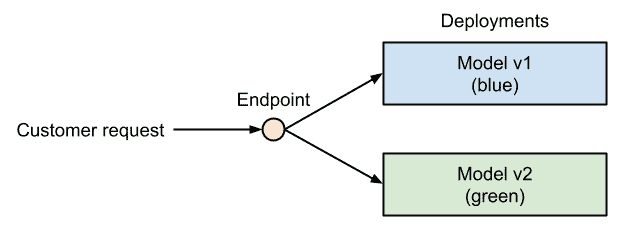
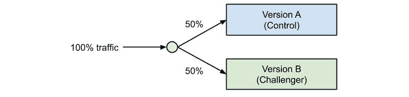

# 第十四章：*第十四章*：模型部署、端点和操作

在上一章中，我们学习了如何通过特征工程、自然语言处理和分布式算法构建高效且可扩展的推荐引擎。

在本章中，我们将解决在训练推荐引擎或任何机器学习模型之后的下一步；我们将部署和操作机器学习模型。这需要我们打包和注册模型，构建执行运行时，构建网络服务，并将所有组件部署到执行目标。

首先，我们将查看部署机器学习模型到生产环境所需的所有准备工作。你将学习典型部署过程中所需的步骤，如何打包和注册训练好的模型，如何定义和构建推理环境，以及如何选择部署目标来运行模型。

在下一节中，我们将学习如何构建一个用于实时评分服务的网络服务，类似于 Azure 认知服务，但使用自定义模型和自定义代码。我们将探讨模型端点、受控发布和端点模式，以便模型可以在不停机的情况下部署，并集成到其他服务中。最后，我们还将构建一个批处理评分解决方案，可以通过网络服务或管道进行调度或触发。

在最后一节中，我们将关注如何监控和操作你的机器学习评分服务。为了优化性能和成本，你需要跟踪系统级指标，以及遥测数据和评分结果，以检测模型或数据漂移。到本节结束时，你将能够自信地在 Azure 中部署、调整和优化你的评分基础设施。

在本章中，你将涵盖以下主题：

+   模型部署准备

+   在 Azure 中部署机器学习模型

+   Azure 中的机器学习操作

# 技术要求

在本章中，我们将使用以下 Python 库和版本来创建模型部署和端点：

+   `azureml-core 1.34.0`

+   `azureml-sdk 1.34.0`

+   `scikit-learn 0.24.2`

+   `joblib 1.0.1`

+   `numpy 1.19.5`

+   `tensorflow 2.6.0`

+   `pandas 1.3.3`

+   `requests 2.25.1`

+   `nvidia-smi 0.1.3`

与前几章类似，你可以使用本地 Python 解释器或 Azure 机器学习托管的工作簿环境运行此代码。然而，所有脚本都需要在 Azure 中安排执行。

本章中所有的代码示例都可以在本书的 GitHub 仓库中找到：[`github.com/PacktPublishing/Mastering-Azure-Machine-Learning-Second-Edition/tree/main/chapter14`](https://github.com/PacktPublishing/Mastering-Azure-Machine-Learning-Second-Edition/tree/main/chapter14)。

# 模型部署准备

在本书中，我们已经学习了如何通过 Azure 的工具对各种机器学习模型进行实验、训练和优化，以执行分类、回归、异常检测、图像识别、文本理解和推荐。在成功训练我们的机器学习模型后，我们现在希望使用 Azure 的工具将此模型打包并部署到生产环境中。

在本节中，我们将学习使用 Azure Machine Learning 将训练好的模型部署到生产环境所需的最重要准备步骤。我们将讨论标准化部署中的不同组件、定制部署、自动部署以及如何选择合适的部署目标。让我们深入探讨。

## 理解机器学习模型的组件

不论是哪种用例，将机器学习模型投入生产都需要类似的准备步骤。首先，需要将训练好的模型注册到模型注册表中。这将使我们能够跟踪模型版本和二进制文件，并在部署中获取特定版本的模型。其次，我们需要指定部署资产（例如，环境、库、资产和评分文件）。这些资产定义了模型如何加载和初始化，用户输入如何解析，模型如何执行，以及输出如何返回给用户。最后，我们需要选择一个计算目标来运行模型。

当使用 Azure Machine Learning 进行部署时，你需要明确指定一系列事项，以便将机器学习模型作为 Web 服务部署和运行。这个列表包括以下组件：

+   **训练好的模型**：模型定义和参数

+   **推理环境**：描述环境的配置，例如 Docker 文件

+   **评分文件**：用于解析用户输入和输出并调用模型的 Web 服务代码

+   **运行时**：评分文件的运行时，例如 Python 或 PySpark

+   **计算目标**：运行 Web 服务的计算环境，例如 **Azure Kubernetes 服务**（**AKS**）或 **Azure 容器实例**（**ACI**）

让我们更详细地探讨这五个组件：

1.  首先，我们需要一个训练好的模型。一个模型（根据所使用的框架、库和算法）可能由一个或多个存储模型参数和结构的文件组成。在 scikit-learn 中，这可能是一个序列化的估计器；在 **LightGBM** 中，这可能是一系列决策树的序列化列表；而在 Keras 中，这可能是一个模型定义和一个存储模型权重的二进制 blob。我们称之为“模型”，并将其存储和版本化在 Blob 存储中。在评分服务的启动时间，模型将被加载到评分运行时中。

1.  除了模型之外，我们还需要一个执行环境，这可以通过`InferenceConfig`来定义。在 Azure 机器学习部署中，环境将被构建成一个*Docker*镜像，并存储在您的私有 Docker 注册库中。在部署过程中，Azure 机器学习将自动从提供的环境配置中构建 Docker 镜像，并将其加载到您工作区中的私有注册库中。

在 Azure 机器学习部署中，您可以选择预定义的 ML 环境或配置自己的环境和 Docker 基础镜像。在基础镜像之上，您可以定义一个 Python *Pip* 或 *Conda* 依赖项列表，启用 GPU 支持，或配置自定义 Docker 步骤。环境，包括所有必需的包，将在运行时自动提供，并在 Docker 镜像上设置。在此基础上，环境还可以由 Azure 机器学习服务注册和版本化。这使得跟踪、重用和组织您的部署环境变得容易。

1.  接下来，我们需要一个所谓的评分文件。这个文件通常加载模型，并提供一个函数，当给定一些数据作为输入时，对模型进行评分。根据部署的类型，您需要为（实时）同步评分服务或异步批量评分服务提供评分文件。评分文件应在您的版本控制系统中进行跟踪，并将被挂载到 Docker 镜像中。

1.  要完成`InferenceConfig`，我们缺少最后但非常重要的一步：用于运行您的评分文件的 Python 运行时。目前，Python 和 PySpark 是唯一支持的运行时。

1.  最后，我们需要一个执行目标，它定义了 Docker 镜像应该在其上执行的计算基础设施。在 Azure 中，这被称为计算目标，并通过部署配置来定义。计算目标可以是管理的 Kubernetes 集群（如 AKS）、容器实例（如 ACI）、**Azure 机器学习计算**（**AmlCompute**）或许多其他 Azure 计算服务之一。

    重要提示

    前面的组件仅适用于 Azure 机器学习内的托管部署。没有任何东西阻止您在其他环境中检索模型二进制文件或在您的本地计算目标上运行推理环境（Docker 镜像）。

如果您只想部署标准模型文件，例如 scikit-learn、**ONNX**或 TensorFlow 模型，您也可以使用 Azure Machine Learning 中内置的*自动部署*功能。自动部署不需要提供所有前面的组件，只需提供所使用框架的名称和版本以及资源配置，例如执行所需的 CPU 数量和 RAM 量。Azure Machine Learning 将完成其余工作；它将提供所有必需的配置并将模型部署到 ACI。这使得使用不超过一行代码即可轻松部署标准模型——非常适合开发、调试和测试。

现在我们已经了解了 Azure Machine Learning 中的基本部署组件，我们可以继续并查看一个注册模型以准备部署的示例。

## 在模型注册表中注册您的模型

部署过程的第一步应该在训练和优化过程期间或之后发生，即在每个运行中注册 Azure Machine Learning 模型注册表中的最佳模型。无论您的训练脚本生成单个模型、模型集成还是与多个文件结合的模型，您都应该始终存储训练工件并在 Azure Machine Learning 工作区中注册每个运行的最佳模型。

在您的训练脚本中，只需额外一行代码即可将模型存储在 Azure Machine Learning 中并注册，因此您永远不会丢失训练的工件和模型。Blob 存储和模型注册直接集成到您的工作区中，因此该过程紧密集成到训练过程中。一旦模型注册，Azure Machine Learning 提供了一个方便的界面，可以从注册表中加载模型。

让我们快速了解一下这对您的训练脚本意味着什么：

1.  让我们定义运行上下文并训练`sklearn`分类器：

    ```py
    Run = Run.get_context()
    exp = run.experiment
    # train your model
    clf, test_acc = train_sklearn_mnist()
    ```

1.  接下来，我们编写一个小的辅助函数，该函数从所有之前的运行中返回最佳测试准确度指标。我们将使用此指标来检查新模型是否优于所有之前的运行：

    ```py
    Def get_metrics(exp, metric):
      for run in Run.list(exp, status='Completed'):
        yield run.get_metrics().get(metric)
    m_name = 'Test accuracy'
    best_acc = max(get_metrics(exp, m_name), default=0)
    ```

1.  接下来，我们检查模型是否比所有之前的运行表现更好，并将其作为新版本注册到模型工厂中：

    ```py
    Import joblib
    # serialize the model and write it to disk
    joblib.dump(clf, 'outputs/model.pkl')
    if test_acc > best_acc:
      model = run.register_model(
        model_name='sklearn_mnist',
        model_path='outputs/model.pkl')
      print(model.name, model.id, model.version, sep='\t')
    ```

在前面的代码块中，我们首先使用`joblib.dump()`函数将训练好的分类器序列化并存储到磁盘上。然后我们调用`run.model_register()`函数将训练好的模型上传到默认数据存储并将模型注册到磁盘上。这将自动通过名称跟踪和版本控制模型，并将其链接到当前的训练运行。

1.  一旦您的模型存储在 Azure Machine Learning 工作区的模型注册表中，您就可以用于部署，并在任何调试、测试或实验步骤中通过名称检索它。您只需通过在本地机器上运行以下代码片段即可简单地请求最新的模型：

    ```py
    import joblib
    from azureml.core.model import Model
    model_path = Model.get_model_path('sklearn_mnist')
    model = joblib.load(model_path)
    ```

在前面的代码中，我们只是运行`Model.get_model_path()`来通过名称检索模型的最新版本。我们也可以指定版本号来从注册库中加载特定模型。

内置模型注册库是 Azure Machine Learning 工作区的一项功能，它让您上瘾，并使您在未来的模型注册、实验运行和指标跟踪中永远不会错过。它在使用不同环境中的模型工件以及在不同实验期间工作时提供了极大的灵活性和透明度。

在前面的示例中，我们没有提供关于训练模型的任何元数据，因此 Azure Machine Learning 无法从模型工件中推断出任何信息。然而，如果我们提供有关模型的额外信息，Azure Machine Learning 可以自动为您生成一些所需的部署配置，以便您启用自动部署。让我们在下一节中看看这一点。

## 已注册模型的自动部署

如果您坚持使用 scikit-learn、TensorFlow 或 ONNX 提供的标准功能，您也可以在 Azure Machine Learning 中利用自动部署。这将允许您将注册的模型部署到测试、实验或生产环境，而无需定义任何所需的部署配置、资产和服务端点。

重要提示

Azure Machine Learning 模型的自动部署将自动将您的模型作为 Web 服务提供。如果您在训练期间提供了模型元数据，您可以使用单个命令`Model.deploy()`来调用自动部署。

让我们看看如何修改前面的示例以利用自动部署：

1.  首先，我们定义模型的资源配置，如下面的代码块所示：

    ```py
    From azureml.core.resource_configuration import \
      ResourceConfiguration
    resource_config = ResourceConfiguration(
      cpu=1, memory_in_gb=2.0, gpu=0)
    ```

1.  接下来，我们需要在注册模型时定义框架和框架版本。为此，我们需要通过扩展`Model.register()`参数来向模型添加此附加信息，如下面的代码片段所示：

    ```py
    From azureml.core import Model
    model = run.register_model(
      model_name='sklearn_mnist',
      model_path='outputs/model.pkl',
      model_framework=Model.Framework.SCIKITLEARN,
      model_framework_version='0.24.2',
      resource_configuration= resource_config)
    ```

在前面的代码中，我们将框架和框架版本添加到模型注册库中，以及为此特定模型配置的资源。模型本身以标准格式存储在支持的框架之一（scikit-learn、ONNX 或 TensorFlow）中。这些元数据被添加到模型注册库中的模型中。这是自动部署此模型作为实时 Web 服务所需的全部配置，只需一行代码即可完成。

1.  最后，我们调用`Model.deploy()`函数来启动部署过程。这将构建部署运行时作为 Docker 镜像，将其注册到您的容器注册库中，并以托管容器实例的形式启动镜像，包括评分文件、REST 服务抽象和遥测收集：

    ```py
    Service_name = 'my-sklearn-service'
    service = Model.deploy(ws, service_name, [model])
    ```

1.  部署完成后，要检索评分服务的 URL，我们运行以下代码：

    ```py
    service.wait_for_deployment(show_output=True)
    print(service.state)
    print("Scoring URL: " + service.scoring_uri)
    ```

如果您想要对执行环境、端点配置和计算目标有更细粒度的控制，您可以使用高级推理、部署和服务配置来定制您的部署。现在让我们看看定制部署。

## 自定义部署环境

如您在前几章中看到的，使用 ML 模型转换数据所需的库、框架和自定义步骤数量巨大。Azure 机器学习为我们提供了足够的灵活性来配置 ML 评分服务，以反映这些自定义设置。在本节中，我们将学习如何自定义部署以包括库和框架。让我们更深入地探讨这些单独的部署步骤。

在 Azure 机器学习服务中，您使用执行环境来指定基础 Docker 镜像、Python 运行时以及评分模型所需的所有依赖包。与模型一样，环境也可以在 Azure 中注册和版本控制，因此 Docker 工件和元数据都存储、版本控制和跟踪在您的工作区中。这使得跟踪环境更改变得简单，可以找出特定运行所使用的环境，在多个环境版本之间来回切换，以及为多个项目共享环境。

执行以下步骤以在 Docker 中构建和打包您的部署：

1.  让我们从编写一个辅助函数开始，该函数可以动态创建环境。当根据包列表程序化创建环境时，此代码片段非常有用。我们还将自动将`azureml-defaults`包添加到每个环境中：

    ```py
    From azureml.core import Environment
    from azureml.core.conda_dependencies import \
      CondaDependencies
    def get_env(name="my-env", packages=None):
      packages = packages or []
      packages += ['azureml-defaults']
      conda_deps = CondaDependencies.create(
        pip_packages=packages)
      env = Environment(name=name)
      env.python.conda_dependencies = conda_deps
      return env
    ```

正如您在前面的代码块中所看到的，我们首先初始化一个`Environment`实例，然后添加多个`conda`包。我们通过覆盖`env.python.conda_dependencies`属性来分配`conda`依赖项，该属性使用`conda_deps`依赖项。使用相同的方法，我们还可以分别使用`env.docker`和`env.spark`覆盖 Docker、Spark 以及任何额外的 Python 设置。

1.  接下来，我们可以定义一个用于实验、训练或部署的自定义环境：

    ```py
    myenv = get_env(name="PythonEnv",
                    packages=["numpy",
                              "scikit-learn", 
                              "tensorflow"])
    ```

1.  在下一步中，您现在可以使用描述性名称注册环境。这将添加当前环境配置的新版本到具有相同名称的环境：

    ```py
    myenv.register(ws, name="PythonEnv")
    ```

1.  您还可以使用以下代码从注册表中检索环境。当您已注册一个可以重复使用和扩展到多个实验的基础环境时，这也很有用：

    ```py
    myenv = Environment.get(ws, name="PythonEnv")
    ```

1.  与`model`注册表一样，您还可以使用指定的版本作为附加参数来加载环境。一旦您配置了执行环境，您就可以将其与评分文件组合成一个`InferenceConfig`对象。评分文件实现了从注册表中加载模型并针对一些输入数据进行评估的所有功能。配置可以定义如下：

    ```py
    from azureml.core.model import InferenceConfig
    inference_config = InferenceConfig(
      entry_script="score.py",
      environment=myenv)
    ```

在前面的示例中，我们可以看到我们只是指定了在本地创作环境中评分脚本的相对路径。因此，您首先必须创建此评分文件；在接下来的几节中，我们将通过批处理和实时评分的示例进行说明。

1.  要构建环境，我们可以简单地触发 Docker 镜像的构建：

    ```py
    from azureml.core import Image
    build = myenv.build(ws)
    build.wait_for_completion(show_output=True)
    ```

1.  环境将被打包并注册为您的私有容器注册库中的 Docker 镜像，其中包含 Docker 基础镜像和所有指定的库。如果您想打包模型和评分文件，您可以只打包模型。这可以在部署模型时自动完成，也可以通过使用`Model.package`函数强制执行。让我们从上一节加载模型并打包和注册镜像：

    ```py
    model_path = Model.get_model('sklearn_mnist')
    package = Model.package(ws, [model], inference_config)
    package.wait_for_creation(show_output=True)
    ```

    重要提示

    Azure ML SDK 文档包含一个可能的配置选项的详细列表，您可以在[`docs.microsoft.com/en-us/python/api/azureml-core/azureml.core.environment(class)`](https://docs.microsoft.com/en-us/python/api/azureml-core/azureml.core.environment(class))找到。

上述代码将构建并打包您的部署为 Docker 镜像。在下一节中，我们将了解如何选择最佳的计算目标来执行您的 ML 部署。

## 在 Azure 中选择部署目标

Azure 机器学习服务的一个巨大优势是它们与许多其他 Azure 服务紧密集成。这对于我们希望在 Azure 托管服务中运行 ML 服务的 Docker 镜像的部署非常有帮助。这些计算目标可以配置并利用 Azure 机器学习进行自动部署。

如果您的任务是生产化 ML 训练和部署管道，您可能不一定是一位 Kubernetes 专家。如果是这样，您可能会喜欢 Azure 机器学习 SDK 中 Azure 计算服务管理的紧密集成。类似于创建训练环境，您可以在创作环境中（例如，Jupyter 笔记本编排您的 ML 工作流程）创建 GPU 集群、托管 Kubernetes 集群或简单的容器实例。

我们可以遵循选择特定服务的一般建议，类似于选择计算服务进行常规应用程序部署；因此，我们在可以轻松从 Docker 镜像启动 Web 服务的计算服务之间权衡简单性、成本、可扩展性、灵活性和运营成本。

这里是关于何时使用每个 Azure 计算服务的建议：

+   对于快速实验和本地测试，请使用 Docker 和 Azure 机器学习中的本地部署目标。

+   对于测试和实验，使用 ACI。它易于设置和配置，并且是为了运行容器镜像而设计的。

+   对于需要 GPU 支持的可扩展实时 Web 服务的部署，请使用 AKS。这个托管的 Kubernetes 集群更加灵活和可扩展，但操作起来也更困难。

+   对于批量部署，使用 Azure Machine Learning 集群，这是我们之前已经用于训练的计算集群环境。

对于快速实验，您可以使用 `LocalWebservice` 作为部署目标在本地部署您的服务。为此，您可以在本地机器上运行以下代码片段，提供推理配置中的评分文件和环境：

```py
From azureml.core.webservice import LocalWebservice
deployment_config = LocalWebservice.deploy_configuration(
  port=8890)
service = Model.deploy(ws,
  name=service_name,
  models=[model],
  inference_config=inference_config,
  deployment_config=deployment_config)
service.wait_for_deployment(show_output=True)
print(service.state)
```

如您所见，一旦您的模型注册成功，您可以根据您的用例将其部署到多个计算目标。虽然我们已经涵盖了几个不同的配置选项，但我们还没有讨论多个部署选项和评分文件。我们将在下一节中这样做。

# 在 Azure 中部署 ML 模型

从广义上讲，部署 ML 模型有两种常见的方法，即作为同步实时 Web 服务和异步批量评分服务部署。请注意，同一个模型可以作为两个不同的服务部署，服务于不同的用例。部署类型在很大程度上取决于模型评分模式的批量大小和响应时间。小批量大小和快速响应需要水平可扩展的实时 Web 服务，而大批量大小和慢速响应时间则需要水平和垂直可扩展的批量服务。

文本理解模型（例如，实体识别模型或情感分析模型）的部署可能包括一个实时 Web 服务，该服务在应用中发布新评论时评估模型，以及另一个 ML 管道中的批量评分器，用于从训练数据中提取相关特征。对于前者，我们希望尽可能快地处理每个请求，因此我们将同步评估小批量。对于后者，我们正在评估大量数据，因此我们将异步评估大批量。我们的目标是，一旦模型打包并注册，我们就可以将其用于任何任务或用例。

在本节中，我们将查看这些部署方法，并构建一个用于实时评分的服务和一个用于批量评分的服务。我们还将评估不同的选项来管理和执行评分服务的部署。

## 构建实时评分服务

在本节中，我们将构建一个 Azure Machine Learning 中的实时评分服务。我们将探讨支持该 Web 服务的所需评分文件，以及启动 AKS 集群上服务的配置。

在这个例子中，我们将训练一个 NLP Hugging Face transformer 模型，用于对用户输入进行情感分析。我们的目标是构建我们自己的 Cognitive Services Text Analytics API，该 API 使用在自定义数据集上训练或微调的自定义模型。

为了做到这一点，我们将训练一个情感分析管道，将其保存，并在 Azure Machine Learning 中将其注册为模型，如下面的代码片段所示：

```py
clf = train(name="sentiment-analysis")
clf.save_pretrained("outputs/sentiment-analysis")
model = Model.register(ws,
  model_name='sentiment-analysis',
  model_path='outputs/sentiment-analysis')
```

一旦我们有了模型，我们就通过查看评分文件开始构建 Web 服务。评分文件将在 Web 服务启动时加载，并且对于每个对 ML 服务的请求都会被调用。因此，我们使用评分文件来加载 ML 模型，解析请求中的用户数据，调用 ML 模型，并返回 ML 模型的预测结果。为此，你需要在评分文件中提供`init()`和`run()`函数，其中`run()`函数在服务启动时运行一次，并且对于每个请求，都会使用用户输入调用`run`方法。以下是一个简单的评分文件示例：

scoring_file_example.py

```py
def init():
  print("Initializing service")
def run(data):
  print("Received a new request with data: ", data)
```

现在我们有了训练好的模型，并且我们知道评分文件的结构，我们可以继续构建我们的自定义 Web 服务：

1.  让我们从服务的初始化开始。我们首先定义一个全局模型变量，然后从`AZUREML_MODEL_DIR`环境变量中获取模型路径。这个变量包含模型在本地磁盘上的位置。接下来，我们使用 Hugging Face 的`AutoModel`转换器加载模型：

Scoring_file.py

```py
from transformers import AutoModel
from azureml.core import Model
def init():
  global model
  model_path = os.getenv("AZUREML_MODEL_DIR")
  model = AutoModel.from_pretrained(model_path,
                                    from_tf=True)
```

1.  接下来，我们处理 Web 服务的实际推理部分。为此，我们需要解析传入的请求，调用 NLP 模型，并将预测结果返回给调用者：

Scoring_file.py

```py
import json
def run(request):
    try:
        data = json.loads(request)
        text = data['query']
        sentiment = model(text)
        result = {'sentiment': sentiment}
        return result
    except Exception as e:
        return str(e)
```

在`run()`函数中，我们提供了一个`request`对象。该对象包含发送到服务的请求正文。由于我们期望 JSON 输入，我们将请求正文解析为 JSON 对象，并通过`query`属性访问输入字符串。我们期望客户端发送一个包含此架构的有效请求。最后，我们返回一个预测，它将被自动序列化为 JSON 并返回给调用者。

1.  为了测试目的，让我们将服务部署到 ACI 计算目标。为此，我们需要更新部署配置以包含 ACI 资源配置：

    ```py
    from azureml.core.webservice import AciWebservice
    deploy_config = AciWebservice.deploy_configuration(
      cpu_cores=1,
      memory_gb=1)
    ```

    重要提示

    你可以在官方文档中找到有关 Azure Container Instance 的更多信息：[`docs.microsoft.com/en-us/azure/container-instances/container-instances-overview`](https://docs.microsoft.com/en-us/azure/container-instances/container-instances-overview)。

1.  接下来，我们将环境和评分文件传递给推理配置：

    ```py
    from azureml.core.model import InferenceConfig
    env = get_env(name="sentiment-analysis",
                  package=["tensorflow", "transformers"])
    inference_config = InferenceConfig(
      environment=env,
      source_directory="code",
      entry_script="scoring_file.py",
    )
    ```

1.  在拥有所有必需组件后，我们最终可以将模型、推理配置和部署配置传递给`Model.deploy`方法并开始部署：

    ```py
    service_name = "sentiment-analysis"
    service = Model.deploy(ws,
      name=service_name,
      models=[model],
      inference_config=inference_config,
      deployment_config=deploy_config)
    service.wait_for_deployment(show_output=True)
    print(service.state)
    ```

1.  一旦服务启动并运行，我们可以尝试向服务发送测试请求，以确保一切正常工作。默认情况下，Azure Machine Learning 服务使用基于密钥的（主和辅助）身份验证。让我们从服务中检索密钥，并发送一些测试数据到部署的服务：

    ```py
    import requests
    import json
    from azureml.core import Webservice
    service = Webservice(ws, name="sentiment-analysis")
    scoring_uri = service.scoring_uri
    # If the service is authenticated
    key, _ = service.get_keys()
    # Set the appropriate headers
    headers = {"Content-Type": "application/json"}
    headers["Authorization"] = f"Bearer {key}"
    data = {"query": "AzureML is quite good."}
    resp = requests.post(scoring_uri,
                         data=json.dumps(data),
                         headers=headers)
    print(resp.text)
    ```

前面的代码片段获取服务 URL 和访问密钥，并将 JSON 编码的数据作为 `POST` 请求发送到 ML 模型部署。

就这样！您已成功部署了情感分析模型，并从 Python 中进行了测试。然而，使用服务端点和令牌，您还可以从任何其他编程语言或 HTTP 客户端向您的服务发送请求。

## 部署到 Azure Kubernetes 服务

我们已成功将情感分析模型部署到 ACI。然而，作为下一步，我们希望将其部署到 AKS。虽然 ACI 对于快速部署 Docker 容器非常出色，但 AKS 是一个用于复杂基于容器的生产工作负载的服务。AKS 支持认证、自动扩展、GPU 支持、副本以及高级指标和日志等功能。

重要提示

您可以在官方文档中找到有关 Azure Kubernetes 服务（AKS）的更多信息：[`docs.microsoft.com/en-us/azure/aks/intro-kubernetes`](https://docs.microsoft.com/en-us/azure/aks/intro-kubernetes)。

现在我们将此服务部署到 AKS 集群，以便我们可以利用 GPU 加速和自动扩展：

1.  首先，我们需要定义我们所需的基础设施：

    ```py
    from azureml.core.compute import AksCompute, \
      ComputeTarget
    # Configure AKS cluster with NVIDIA Tesla P40 GPU
    prov_config = AksCompute.provisioning_configuration(
      vm_size="Standard_ND6s")
    aks_name = 'aks-ml-prod'
    # Create the cluster
    aks_target = ComputeTarget.create(ws,
      name=aks_name,
      provisioning_configuration=prov_config)
    # Wait for the create process to complete
    aks_target.wait_for_completion(show_output=True)
    ```

在前面的代码中，我们创建了一个 AKS 配置和一个新的 AKS 集群，作为 Azure Machine Learning 计算目标。所有这些都在您的创作环境中完成。

1.  如果您已经有一个正在运行的 AKS 集群，您可以直接使用此集群进行 Azure Machine Learning。为此，您必须将资源组和集群名称传递给 `AksCompute.attach_configuration()` 方法。然后，设置包含 AKS 集群的资源组和集群名称：

    ```py
    resource_group = 'my-rg'
    cluster_name = 'aks-ml-prod'
    attach_config = AksCompute.attach_configuration(
      resource_group = resource_group,
      cluster_name=cluster_name)
    aks_target = ComputeTarget.attach(ws,
      cluster_name,
      attach_config)
    ```

1.  一旦我们有了集群的引用，我们就可以将 ML 模型部署到集群。这一步骤与上一个步骤类似：

    ```py
    deploy_config = AksWebservice.deploy_configuration(
      cpu_cores=1,
      memory_gb=1,
      gpu_cores=1)
    service = Model.deploy(ws,
      service_name,
      [model],
      inference_config,
      deploy_config,
      aks_target)
    service.wait_for_deployment(show_output=True)
    print(service.state)
    print(service.get_logs())
    ```

如前例所示，除了将 AKS 集群作为目标附加到 Azure Machine Learning 外，模型部署与使用 ACI 的示例相同。

## 定义评分端点的模式

在前面的示例中，我们从 JSON 解析用户输入并期望它包含一个 `query` 参数。为了帮助使用您的服务端点的用户和服务，告诉用户服务期望哪些参数将是有用的。这在构建 Web 服务 API 时是一个常见问题。

为了解决这个问题，Azure Machine Learning 提供了一种创新的方法来自动生成 **OpenAPI 规范**（**OAS**），之前称为 **Swagger 规范**。此规范可以通过模式端点被 API 的消费者访问。这提供了一种自动化的标准化方式来指定和消费服务的数据格式，并且可以用于自动生成客户端。一个例子是 **Swagger Codegen**，它可以用来为您的新 ML 服务生成 Java 和 C# 客户端。

您可以通过在 Python 中添加注释来为您的服务启用 pandas、NumPy、PySpark 和标准 Python 对象的自动模式生成。首先，您需要将`azureml-defaults`和`inference-schema`作为 PIP 包包含到您的环境中。然后，您可以通过为端点提供样本输入和输出数据来自动生成模式，如下面的示例所示：

scoring_file.py

```py
import numpy as np
input_sample = np.array([[10, 9, 8, 7, 6, 5, 4, 3, 2, 1]])
output_sample = np.array([3726.995])
@input_schema('data', NumpyParameterType(input_sample))
@output_schema(NumpyParameterType(output_sample))
def run(data):
  # data is a np.array
  pass
```

在前面的示例中，我们通过`run()`方法中的样本数据和注释定义了基于 NumPy 的模型的模式。

我们还可以选择情感分析模型，并允许它接收多个输入查询。为此，我们可以将用户输入反序列化为 pandas DataFrame 对象，并返回一个预测数组作为结果，如下面的示例所示。请注意，这基本上为我们实时 Web 服务添加了批量预测功能：

scoring_file.py

```py
import numpy as np
import pandas as pd
input_sample = pd.DataFrame(data=[
  {'query": "AzureML is quite good."}])
output_sample = np.array([np.array(["POSITIVE", 0.95])])
@input_schema('data', PandasParameterType(input_sample))
@output_schema(NumpyParameterType(output_sample))
def run(data):
  # data is a pd.DataFrame
  pass
```

定义示例输入和输出是自动生成 API 规范所需的一切，您的客户端可以使用该规范来验证端点和参数，或自动生成客户端。这同样是创建可以自动集成到 Power BI 的 ML 服务的格式，如第十五章中所示，*模型互操作性、硬件优化和集成*。

## 管理模型端点

每个模型部署都包含一个用于发送请求到模型的 URL；在线评分服务提供用于处理在线预测的 URL，批量评分服务提供用于触发批量预测的 URL。虽然这使得启动和查询服务变得容易，但在部署过程中仍然存在一个重大问题，即服务 URL 会随着每次部署而改变。这导致了一个问题，即我们无法控制用户请求将击中哪个服务。

为了解决这个问题，我们需要在固定的服务 URL 后面隐藏模型部署 URL，并提供一种机制将用户请求解析到特定的服务。在 Azure Machine Learning 中，实现这一功能的组件被称为**端点**，它可以在固定的端点 URL 下暴露多个部署。

下图展示了端点和部署的概念。客户向端点发送请求，我们配置端点将请求路由到服务之一。在部署期间，我们会在相同的评分端点后面添加新的模型版本，并逐步从新的**（绿色）**版本而不是之前的**（蓝色）**版本开始服务请求：



图 14.1 – Azure Machine Learning 端点和部署

这种类型的部署也称为蓝绿部署。首先，您将所有流量从旧服务中取出，并启动新服务。一旦新服务启动并运行，并且健康检查成功完成，服务将在端点下注册，并开始处理请求。最后，如果旧服务上没有剩余的活跃请求，您可以将其关闭。

这个过程是一种非常安全的更新无状态应用程序服务的方法，零停机时间或最小停机时间。它还帮助您在新服务部署不成功时回滚到旧服务。

Azure 机器学习提供多种类型的端点，具体取决于模型部署机制：

+   **在线端点**：用于实时在线部署：

    +   **管理在线端点**：用于管理的 Azure 机器学习部署

    +   **Kubernetes 在线端点**：用于管理的 AKS 部署

+   **批量端点**：用于批量评分部署

在顶级上，我们区分在线和批量端点。在线端点用于基于 Web 服务部署的同步评分，而批量端点用于基于管道部署的异步评分。

对于在线端点，我们根据部署目标区分管理型基于 Kubernetes 的在线端点。这与在线评分的不同计算目标和功能相对应。

让我们看看如何配置 AKS 的端点：

1.  首先，我们配置端点详情，如下面的代码片段所示：

    ```py
    from azureml.core.webservice import AksEndpoint
    endpoint_config = AksEndpoint.deploy_configuration(
      version_name="version-1",
      tag'={'modelVersion':'1'}, 
      namespace="nlp", 
      traffic_percentile=100)
    ```

端点配置充当 AKS 计算目标的部署配置。

1.  接下来，我们将端点配置和计算目标都提供给`Model.deploy`方法：

    ```py
    endpoint_name"= "sentiment-analysis"
    endpoint = Model.deploy(ws,
      endpoint_name,
      [model],
      inference_config,
      endpoint_config,
      aks_target)
    endpoint.wait_for_deployment(show_output=True)
    print(endpoint.state)
    ```

部署将返回一个端点，现在可以用来连接到服务并添加额外的配置。在下一节中，我们将探讨端点的更多用例，并了解如何向 AKS 端点添加额外的部署。

## 控制式发布和 A/B 测试

端点的另一个好处是执行受控发布和新模型版本的增量测试。机器学习模型部署类似于应用程序开发中新功能的部署。我们可能不想一次性将这个新功能推出给所有用户，而是首先测试新功能是否提高了我们一小部分用户的业务指标。

新的机器学习模型部署绝不应该是不受控制的或基于个人感受或偏好；部署应始终基于硬性指标和真实证据。测试和向用户推出更改的最佳和最系统的方法是定义一个关键指标，将新模型推出给用户的一部分（组 B），并将旧模型服务于剩余的用户部分（组 A）。一旦组 B 中用户的指标在定义的期间内超过组 A 的指标，您就可以自信地将该功能推出给所有用户。

这个概念被称为**A/B 测试**，并被许多科技公司用于推广新服务和功能。正如你可以在下面的图中看到的那样，你将流量分成控制组和挑战者组，其中只有后者被提供新模型：



图 14.2 – 使用端点进行 A/B 测试

A/B 测试和蓝绿部署可以很好地结合使用，因为它们实际上是相似的方法。两者都需要部署一个完全功能的服务，通过路由策略使你的部分用户可以访问。如果你使用 Azure Machine Learning 进行部署和推广策略，你将得到很好的保障。首先，所有通过 Azure Machine Learning 到 ACI 或 AKS 的部署都是蓝绿部署，这使得你很容易回滚到模型的前一个版本。

Azure Machine Learning 在 AKS 上的部署支持在同一端点后面最多六个模型版本，以实现蓝绿部署或 A/B 测试策略。然后你可以定义策略来在这些端点之间分割流量；例如，你可以按百分比分割流量。以下是一个小代码示例，说明如何在 AKS 端点上创建另一个版本，该版本应服务于 50%的用户：

1.  让我们先更新原始部署，作为控制版本，服务于 50%的流量：

    ```py
    endpoint.update_version(
      version_name="version-1",
      traffic_percentile=50,
      is_default=True,
      is_control_version_type=True)
    ```

1.  接下来，我们添加挑战者版本，这是`test_model`的部署。正如你可以在下面的代码片段中看到的那样，你也可以为新部署提供不同的推理配置：

    ```py
    endpoint.create_version(
      version_name="version-2",
      inference_config=inference_config,
      models=[test_model],
      tags={'modelVersion':'2'},
      description="my second version",
      traffic_percentile=50)
    ```

1.  最后，我们开始部署更新后的端点：

    ```py
    endpoint.wait_for_deployment(show_output=True)
    print(endpoint.state)
    ```

在前面的代码中，我们展示了 Azure Machine Learning 和 AKS 受控发布的预览功能。我们使用不同的模型和推理配置组合，在同一个端点下部署一个独立的服务。现在，流量分割通过 Kubernetes 的路由自动进行。然而，为了与本章的前一部分保持一致，我们可以预期随着许多客户在推广 ML 模型时使用这项功能，其功能将在未来得到改进。

## 实现批评分流程

运行批评分服务与之前讨论的在线评分方法非常相似；你需要提供一个环境、计算目标和评分脚本。然而，在你的评分文件中，你更愿意传递一个指向 Blob 存储位置的新数据批次的路径，而不是数据本身。然后你可以使用你的评分函数异步处理数据，并将预测输出到不同的存储位置，回到 Blob 存储，或者异步将数据推送到调用服务。

你如何实现评分文件取决于你，因为它只是一个你控制的 Python 脚本。在部署过程中唯一的区别是批评分脚本将作为 Azure 机器学习集群上的计算部署，通过管道定期调度或通过 REST 服务触发。因此，确保你的评分脚本可以通过命令行参数进行配置非常重要。记住，批评分的不同之处在于我们不向评分脚本发送数据，而是发送数据的路径和写入输出的路径异步发送。

批评分脚本通常封装在管道步骤中，作为管道部署，并通过 REST 服务或批评分端点触发。管道可以配置为使用 Azure 机器学习集群进行执行。在本节中，我们将重用我们之前在*第八章*，*Azure 机器学习管道*中看到的所有概念，并将它们应用到批评分管道步骤中。让我们构建一个使用 Inception v3 **DNN**模型评分图像的批评分管道：

1.  首先，我们定义一个可配置的批量大小。在管道配置和评分文件中，你可以利用在 Azure 机器学习集群中并行化你的工作：

    ```py
    from azureml.pipeline.core.graph import \
      PipelineParameter
    batch_size_param = PipelineParameter(
      name="param_batch_size",
      default_value=20)
    ```

1.  接下来，我们定义一个将调用批评分脚本的管道步骤：

    ```py
    from azureml.pipeline.steps import PythonScriptStep
    batch_score_step = PythonScriptStep(
      name="batch_scoring",
      script_name="batch_scoring.py",
      arguments=[
       "--dataset_path", input_images,
       "--model_name", "inception",
       "--label_dir", label_dir,
       "--output_dir", output_dir,
       "--batch_size", batch_size_param],
      compute_target=compute_target,
      inputs=[input_images, label_dir],
      outputs=[output_dir],
      runconfig=amlcompute_run_config)
    ```

1.  最后，我们将管道步骤封装在管道中。为了测试批处理步骤，我们将管道作为实验提交到 Azure 机器学习工作区：

    ```py
    from azureml.core import Experiment
    from azureml.pipeline.core import Pipeline
    pipeline = Pipeline(ws, steps=[batch_score_step])
    exp = Experiment(ws, 'batch_scoring')
    pipeline_run = exp.submit(pipeline,
      pipeline_params={"param_batch_size": 20})
    ```

1.  使用此管道配置，我们使用相关参数调用我们的评分脚本。管道作为 Azure 机器学习中的一个实验提交，这使我们能够访问 Azure 中运行和实验的所有功能。一个功能就是，当实验运行完成后，我们可以简单地下载输出：

    ```py
    pipeline_run.wait_for_completion(show_output=True)
    step_run = list(pipeline_run.get_children())[0]
    step_run.download_file("./outputs/result-labels.txt")
    ```

1.  如果批评分文件生成了一个包含名称和预测的漂亮的 CSV 输出，我们现在可以使用以下 pandas 功能来显示结果：

    ```py
    import pandas as pd
    df = pd.read_csv(
      "./outputs/result-labels.txt",
      delimiter=":",
      header=None)
    df.columns = ["Filename", "Prediction"]
    df.head()
    ```

1.  让我们继续将管道作为 REST 服务发布：

    ```py
    published_pipeline = pipeline_run.publish_pipeline(
      name="Inception_v3_scoring",
      description="Batch scoring using Inception v3",
      version="1.0")
    published_id = published_pipeline.id
    rest_endpoint = published_pipeline.endpoint
    ```

1.  要通过 HTTP 将发布的管道作为服务运行，我们现在需要使用基于令牌的认证：

    ```py
    from azureml.core.authentication import \
      AzureCliAuthentication
    cli_auth = AzureCliAuthentication()
    aad_token = cli_auth.get_authentication_header()
    ```

1.  获取了认证令牌后，我们现在可以运行发布的管道：

    ```py
    import requests
    # Specify batch size when running the pipeline
    response = requests.post(
      rest_endpoint,
      headers=aad_token,
      json={
       "ExperimentName": "batch_scoring",
       "ParameterAssignments": {
         "param_batch_size": 50
        }
      })
    run_id = response.json()["Id"]
    ```

就这样！你现在可以使用 REST 端点来触发你的批评分管道。数据将被处理，结果将以一个可以编程方式消费或管道传输到下一个处理步骤的文件提供。

在 Azure Machine Learning 服务上运行批处理评分流水线与运行同步评分服务略有不同。虽然实时评分服务使用 Azure Machine Learning 部署和 AKS 或 ACI 作为流行的计算目标，但批处理评分模型通常作为发布流水线部署在 AmlCompute 之上。发布流水线的优点是它可以作为一个 REST 服务使用，可以触发和参数化流水线。

# Azure 中的 ML 操作

在上一节中，您成功注册了一个训练好的模型、一个环境、一个评分文件和一个推理配置。您已经优化了模型以进行评分，并将其部署到了一个管理的 Kubernetes 集群中。您为您的 ML 服务自动生成了客户端 SDK。所以，您终于可以放松一下，享受您辛勤工作的成果了吗？嗯，还不行！首先，我们需要确保我们已经设置了所有监控，这样我们就可以观察并应对部署中发生的任何情况。

首先，让我们看看优点：使用 Azure Machine Learning 部署和管理计算目标，您将获得许多内置功能，无论是使用 Azure、Azure Machine Learning 还是您的服务作为计算目标。例如，Azure 门户上的**Azure 仪表板**、**Azure Monitor**和**Azure 日志分析**等工具使得集中日志和调试信息变得容易。一旦您的数据通过日志分析可用，就可以使用 Azure Automation 进行查询、分析、可视化、警报和/或自动化。

在操作任何应用程序时，首先应该想到的是测量软件和硬件指标。了解您的应用程序的内存消耗、CPU 使用率、I/O 延迟和网络带宽是至关重要的。特别是对于 ML 服务，您应该始终关注性能瓶颈和资源利用率，以实现成本优化。对于大型 GPU 加速的 DNN，了解您的系统对于高效扩展至关重要。这些指标允许您垂直扩展您的基础设施，并在需要时移动到更大的或更小的节点。

对于一般的应用程序部署，另一个监控目标应该是您的用户遥测数据（他们如何使用您的服务，他们使用频率，以及他们使用服务的哪些部分）。这将帮助您水平扩展，并在需要时添加更多节点或删除节点。

如果可能的话，从你的评分服务中测量的最后一个重要部分是用户随时间输入的数据和评分结果。为了实现最佳的预测性能，了解用户发送到你的服务的数据类型以及这些数据与训练数据相似性如何至关重要。相对确定的是，你的模型在某个时刻将需要重新训练，监控输入数据将帮助你定义何时需要重新训练（例如，通过数据漂移指标）。

让我们看看如何监控 Azure 机器学习部署并跟踪 Azure 中的所有这些指标。

## 为最佳资源配置分析模型

Azure 机器学习提供了一个方便的工具，帮助你通过模型分析评估 ML 模型部署所需资源。这将帮助你估计在特定吞吐量下操作评分服务所需的 CPU 数量和内存量。

让我们看看在实时评分示例中训练的模型的模型分析：

1.  首先，你需要以与你的 ML 服务 JSON 请求相同的格式定义`test_data`；因此，请将`test_data`嵌入到`data`根属性下的 JSON 对象中。请注意，如果你在评分文件中定义了不同的格式，那么你需要使用你自己的自定义格式：

    ```py
    import json
    test_data = json.dump'({'data': [
        [1,2,3,4,5,6,7,8,9,10]
    ]})
    ```

1.  然后，你可以使用`Model.profile()`方法来分析模型并评估服务的 CPU 和内存消耗。这将启动你的模型，向其发送`test_data`请求，并同时测量资源利用率：

    ```py
    profile = Model.profile(ws,
      service_name,
      [model],
      inference_config,
      test_data)
    profile.wait_for_profiling(True)
    print(profile.get_results())
    ```

1.  输出包含资源列表，以及针对分析模型的推荐值，如下面的代码片段所示：

    ```py
    {'cpu': 1.0, 'memoryInGB': 0.5}
    ```

在进行生产部署之前运行模型分析工具是个好主意，这有助于你为资源配置设置有意义的默认值。为了进一步优化并决定是否需要向上或向下、垂直或水平扩展，你需要测量、跟踪和观察各种其他指标。我们将在本章的最后部分更详细地讨论监控和扩展。

## 收集日志和基础设施指标

如果你刚开始接触云服务，或者具体来说是 Azure，那么日志和指标收集一开始可能会有些令人不知所措。日志和指标在你的应用程序的不同层级生成，可以是基于基础设施或应用程序的，并且可以自动或手动收集。然后，还有自动生成但需要手动启用的诊断指标。在本节中，我们将简要讨论如何在 Azure 机器学习服务中的三个主要托管计算目标（ACI、AKS 和 AmlCompute）上收集这些指标。

默认情况下，您将通过 Azure Monitor 获取对基础设施指标和日志的访问权限。它将自动收集 Azure 资源和虚拟机操作系统指标和日志，并基于日志分析提供日志的指标和查询接口。Azure Monitor 应用于跟踪资源利用率（例如，CPU、RAM、磁盘空间、磁盘 I/O 和网络带宽），然后可以将其固定到仪表板或发出警报。您甚至可以根据这些指标设置自动扩展。

指标通常以时间分布的形式收集，并在特定的时间间隔内进行报告。因此，您不需要每秒看到数千个值，而是需要为每个指标选择一个汇总值，例如每个区间的平均值。在大多数监控场景中，我建议您查看 95%分位数（或最大汇总值，对于越低越好的指标）以避免在汇总过程中平滑任何峰值。在 AKS 中，您可以通过 Azure Monitor 获得您指标的四个不同视图：集群、节点、控制器和容器。

通过启用诊断设置并提供单独的日志分析实例，您可以访问 Azure 机器学习部署的更详细的资源、虚拟机和虚拟化主机日志。这将自动将日志数据加载到您的日志分析工作区中，在那里您可以高效地查询所有日志、分析它们并创建可视化或警报。

强烈建议利用诊断设置，因为它们为您提供了对 Azure 基础设施的洞察。这在您需要调试 ML 服务中的问题（例如，失败的容器、无法启动的服务、崩溃、应用程序冻结和缓慢的响应时间）时特别有帮助。日志分析的另一个很好的用例是收集、存储和分析您的应用程序日志。在 AKS 中，您可以发送 Kubernetes 主节点日志、*kubelet*日志和 API 服务器日志到日志分析。

对于机器学习训练集群和部署来说，有一个非常重要的指标需要跟踪，但遗憾的是它并没有自动跟踪，那就是 GPU 资源利用率。由于这个问题，GPU 资源利用率必须在应用程序级别进行监控和收集。

解决 AKS 部署问题的最有效方法是运行一个作为应用程序副车的 GPU 日志记录服务，该服务收集资源统计信息并将它们发送到**应用洞察**（**App Insights**），这是一个收集应用程序指标的服务。App Insights 和日志分析在底层使用相同的数据存储技术：Azure 数据探索器。然而，App Insights 的默认集成主要提供应用程序指标，如访问日志，而日志分析提供系统日志。

在 AmlCompute 中，我们需要从您的应用程序代码中启动一个单独的监控线程来监控 GPU 利用率。然后，对于 Nvidia GPU，我们使用`nvidia-smi`监控工具的包装器，例如`nvidia-ml-py3` Python 包。要将数据发送到 App Insights，我们只需使用 Azure SDK for App Insights。以下是一个简短的代码示例，展示您如何实现这一点：

```py
from applicationinsights import TelemetryClient
import nvidia_smi
nvidia_smi.nvmlInit()
# Get handle for card id 0
dev_handle = nvidia_smi.nvmlDeviceGetHandleByIndex(0)
res = nvidia_smi.nvmlDeviceGetUtilizationRates(dev_handle)
# Submit GPU metrics to AppInsights
tc = TelemetryClient("<insert appinsights key")
tc.track_metric("gpu", res.gpu)
tc.track_metric("gpu-gpu-mem", res.memory)
```

在前面的代码中，我们首先在`nvidia-smi`之上使用了`nvidia-ml-py3`包装器来返回当前 GPU 的句柄。请注意，当您有多个 GPU 时，您也可以遍历它们并报告多个指标。然后，我们使用 App Insights 的`TelemetryClient` API 将这些指标报告回一个中心位置，然后我们可以可视化、分析和对这些值发出警报。

## 跟踪遥测和应用指标

在上一节中，我们简要介绍了 Azure App Insights。它是一个自动收集您的服务应用指标的优秀服务，例如 Azure 机器学习部署。它还提供了一个 SDK 来收集您想要跟踪的任何用户定义的应用指标。

要自动跟踪用户指标，我们需要使用 Azure Machine Learning 部署将模型部署到 AKS 或 ACI。这不仅会收集 Web 服务元数据，还会收集模型的预测。为此，您需要启用 App Insights 的诊断以及数据模型收集，或者通过 Python API 启用 App Insights：

```py
from azureml.core.webservice import Webservice
aks_service= Webservice(ws, "aks-deployment")
aks_service.update(enable_app_insights=True)
```

在前面的代码片段中，我们可以直接从 Python 编写环境激活 App Insights 的指标。虽然这在服务类中只是一个简单的参数，但它为您提供了关于部署的惊人洞察。

需要测量的两个重要指标是训练数据和模型预测的数据漂移系数。我们将在下一节中了解更多关于这方面的内容。

## 检测数据漂移

机器学习中的一个重要问题是何时重新训练模型。当有新的训练数据可用时，您是否应该始终重新训练，例如每天、每周、每月或每年？我们是否需要重新训练，或者训练数据是否仍然相关？测量**数据漂移**将有助于回答这些问题。

通过自动跟踪用户输入和模型预测，您可以比较训练数据与用户输入在每个特征维度上的统计差异，以及训练标签与模型预测的差异。训练数据和实际数据之间的差异被称为数据漂移，应该定期跟踪和监控。数据漂移会导致模型性能随时间退化，因此需要监控。最佳情况是设置监控和警报，以便了解您的部署模型与训练数据差异过大时需要重新训练。

Azure 机器学习提供了有用的抽象，可以根据注册的**数据集**实现数据漂移监控器和警报，并且可以自动在 Application Insights 中公开数据漂移指标。计算数据漂移需要两个数据集：一个是基线数据集，通常是训练数据集；另一个是目标数据集，通常是来自评分服务输入构建的数据集：

1.  首先，我们定义目标和基线数据集。这些数据集必须包含一个表示每个观测日期和时间的列：

    ```py
    from azureml.core import Workspace, Dataset
    from datetime import datetime
    ws = Workspace.from_config()
    ds_target = Dataset.get_by_name(ws, 'housing-data')
    ds_baseline = ds_target.time_before(
      datetime(2022, 1, 1))
    ```

1.  接下来，我们可以为监控器设置电子邮件警报。这可以通过许多不同的方式完成，但为了本例的目的，我们直接在数据漂移监控器上设置电子邮件警报：

    ```py
    from azureml.datadrift import AlertConfiguration
    alert_config = AlertConfiguration(
      email_addresses=['<insert email address>'])
    ```

1.  现在，我们可以设置数据漂移监控器，提供所有之前的详细信息。我们为三个特定的特征`['a', 'b', 'c']`配置监控器，以每月的节奏进行漂移测量，延迟 24 小时。当目标数据集相对于基线数据漂移超过 25%时，将创建一个警报：

    ```py
    from azureml.datadrift import DataDriftDetector
    monitor = DataDriftDetector.create_from_datasets(ws,
      "data-drift-monitor",
      ds_baseline,
      ds_target,
      compute_target=compute_target,
      frequency='Month',
      feature_list=['a', 'b', 'c'],
      alert_config=alert_config,
      drift_threshold=0.25,
      latency=24)
    ```

1.  最后，我们可以启用监控器定期运行的计划：

    ```py
    monitor.enable_schedule() 
    ```

数据漂移是操作机器学习部署时需要关注的重要运营指标。设置监控器和警报将帮助您在数据分布与训练数据偏差过大时及早得到警报，因此需要重新训练模型。

# 摘要

在本章中，我们学习了如何将训练好的模型通过几行简单的代码部署为 Azure 中的托管服务。为此，我们学习了如何为部署准备模型，并探讨了 Azure 机器学习的自动部署和自定义部署。

然后，我们使用 NLP 情感分析模型并将其部署为实时评分服务到 ACI 和 AKS。我们还学习了如何定义服务架构，以及如何使用端点和蓝绿部署有效地推出新版本。最后，我们学习了如何将模型集成到管道中进行异步批量评分。

在最后一节中，我们学习了如何使用 Azure 机器学习服务监控和操作模型。我们提出了监控 CPU、内存和 GPU 指标以及遥测数据。我们还学习了如何通过收集用户输入和模型输出随时间的变化来衡量服务的数据漂移。检测数据漂移是一个重要的指标，它允许您知道何时需要重新训练模型。

在下一章中，我们将应用所学知识，探讨模型互操作性、硬件优化以及集成到其他 Azure 服务中。
