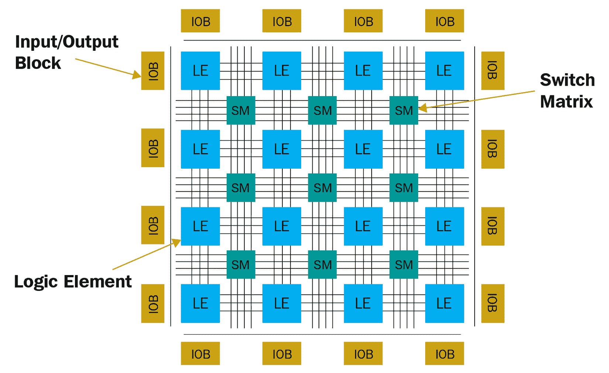
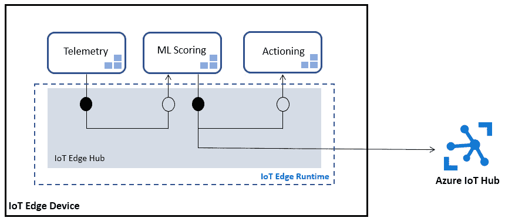
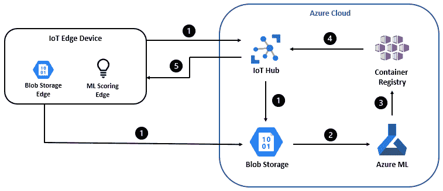
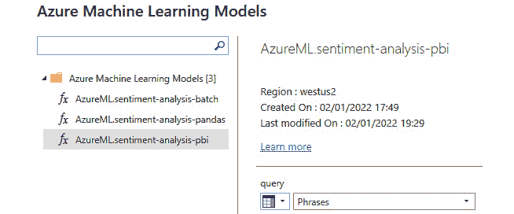
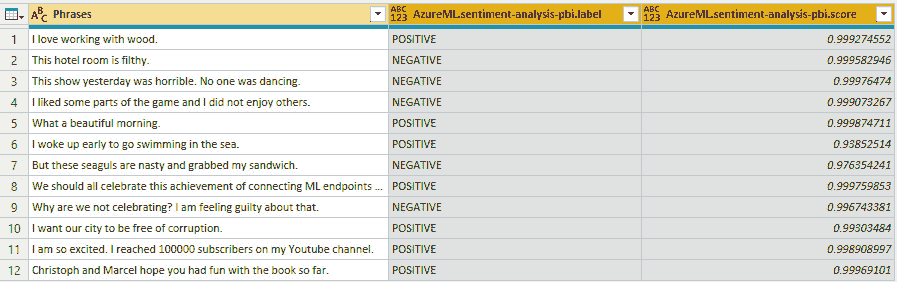

# 第十五章：*第十五章*：模型互操作性、硬件优化和集成

在上一章中，我们发现了如何将我们的机器学习评分部署为批量或实时评分器，什么是端点以及我们如何部署它们，最后，我们查看了一下如何监控我们部署的解决方案。在本章中，我们将更深入地探讨 ML 推理的额外部署场景，我们可以利用的其他可能的硬件基础设施，以及我们如何将我们的模型和端点与其他 Azure 服务集成。

在第一部分，我们将探讨如何通过将 ML 模型转换为标准化的模型格式和推理优化的评分框架来提供模型互操作性。**开放神经网络交换**（**ONNX**）是一种标准化的格式，用于有效地序列化和存储 ML 模型以及循环计算图和操作。我们将学习 ONNX 框架是什么，如何将 ML 模型从流行的 ML 框架转换为 ONNX，以及如何使用 ONNX Runtime 在多个平台上评分 ONNX 模型。

随后，我们将探讨替代硬件目标，例如**现场可编程门阵列**（**FPGA**）。我们将了解它们内部是如何工作的，以及它们如何与标准硬件甚至 GPU 相比实现更高的性能和更好的效率。

最后，我们将探讨如何将 ML 模型和端点集成到其他服务中。我们将更深入地了解将 ML 部署到边缘设备的过程，并将我们之前设置的一个端点与 Power BI 集成。

在本章中，我们将涵盖以下主题：

+   与 ONNX 的模型互操作性

+   使用 FPGA 进行硬件优化

+   将 ML 模型和端点与 Azure 服务集成

# 技术要求

在本章中，您需要访问一个 Microsoft Power BI 账户。您可以通过您的工作场所或在此处创建一个试用账户来获取一个账户：[`app.powerbi.com/signupredirect?pbi_source=web`](https://app.powerbi.com/signupredirect?pbi_source=web)。

本章中的所有代码示例都可以在本书的 GitHub 存储库中找到：[`github.com/PacktPublishing/Masthttps://github.com/PacktPublishing/Mastering-Azure-Machine-Learning-Second-Edition/tree/main/chapter15`](https://github.com/PacktPublishing/Masthttps://github.com/PacktPublishing/Mastering-Azure-Machine-Learning-Second-Edition/tree/main/chapter15)。

# 与 ONNX 的模型互操作性

在上一章中，我们学习了如何将 ML 模型作为 Web 服务部署以进行在线和批量评分。然而，许多实际用例要求您将训练好的 ML 模型直接嵌入到应用程序中，而不使用单独的评分服务。目标服务可能使用与训练 ML 模型的语言不同的语言编写。一个常见的例子是，使用 scikit-learn 在 Python 中训练的简单模型需要嵌入到 Java 应用程序中。

模型互操作性为您提供了灵活性，您可以使用您选择的语言和框架来训练模型，将其导出为通用格式，然后使用共享格式在不同的语言和平台上对其进行评分。在某些情况下，使用针对目标环境优化的本地运行时甚至可以实现比运行原始模型更好的评分性能。

首先，我们将了解 ONNX 创举，包括规范、运行时和生态系统，以及它是如何帮助实现跨大量支持语言、框架、操作和目标平台的模型互操作性的。

然后，我们将探讨如何将机器学习模型从流行的框架转换为 ONNX（称为 ONNX 前端），并使用 ONNX Runtime（ONNX 的多个后端之一）在本地推理运行时中执行 ONNX 模型。让我们深入了解。

## 模型互操作性是什么？ONNX 如何帮助？

随着信息技术组织的成长，工具、开发和部署平台以及选择也会增加。在机器学习中，这个问题更为突出，因为存在多个机器学习框架以及模型序列化格式。因此，一旦组织规模扩大，就几乎不可能让每个科学家和工程师都同意使用相同的工具、框架和模型格式，这些格式还需要支持所有目标环境。您的 XGBoost 模型能在 iOS 上运行吗？您的 PyTorch 模型能在 Java 中工作吗？您的 scikit-learn 模型能在基于浏览器的 JavaScript 应用程序中加载吗？解决模型互操作性问题的一种方法确保训练好的机器学习模型可以被移植到可以在所有目标平台上本地执行的标准化格式。这正是 ONNX 的目的。

ONNX 是由微软、Facebook、亚马逊、ARM 和英特尔等主要 IT 公司共同发起的一项联合倡议，旨在促进机器学习模型的互操作性。它允许组织为机器学习训练选择不同的语言、框架和环境，以及为推理选择不同的语言、环境和设备。例如，ONNX 允许组织使用 PyTorch 和 TensorFlow 训练深度学习模型，使用 LightGBM 和 XGBoost 训练传统机器学习模型，并将这些模型部署到基于 Java 的 Web 服务、基于 Objective-C 的 iOS 应用程序和基于浏览器的 JavaScript 应用程序。这种互操作性是通过三个关键要素实现的：

+   **ONNX 规范**：一种使用**协议缓冲区**（**Protobuf**）进行模型定义和模型权重**高效序列化和反序列化**的数据格式。为了表示广泛的机器学习模型，ONNX 规范由可扩展的计算图模型的定义以及标准数据类型和内置算子的定义组成。使用 ONNX 规范，许多由各种支持的架构、构建块、操作和数据类型组成的机器学习模型可以高效地表示在单个文件中，我们称之为*ONNX 模型*。

+   **ONNX Runtime**: 一个高效的*原生推理引擎*，支持与多种高级语言绑定，例如 C#、Python、JavaScript、Java/Kotlin（Android）和 Objective-C（iOS）。这意味着，通过这些语言之一的 ONNX Runtime 绑定，我们可以加载、评分，甚至训练 ONNX 模型。它还提供了内置的 GPU 加速，使用 DirectML、TensorRT、**深度神经网络库**（**DNNL**）、nGraph、CUDA 以及**微软线性代数子程序**（**MLAS**）库，并支持权重量化和图优化，以便在各种计算目标上高效运行，例如云计算、Jupyter 内核、手机和网页浏览器。

+   **ONNX 生态系统**：一组*库集合*，便于在 ONNX 之间进行转换。ONNX 库可以广泛分为 ONNX 前端（*转换为 ONNX*）和 ONNX 后端（*从 ONNX*）。虽然*ONNX 前端*库帮助将任意计算转换为 ONNX 模型（遵循 ONNX 规范的模型），但*ONNX 后端*库提供执行 ONNX 模型或将其转换为特定框架运行时的支持。ONNX 在微软以及其他大型公司中广泛使用，因此支持广泛的框架和语言。许多流行的库是官方支持的前端，例如传统的机器学习算法、scikit-learn、LightGBM、XGBoost 和 CatBoost，以及现代深度学习框架，如 TensorFlow、Keras、PyTorch、Caffe 2 和 CoreML。

ONNX 是提供模型互操作性以允许组织解耦模型训练、模型序列化和模型推理的绝佳选择。让我们在下一节中了解 ONNX 的流行前端和后端在实际中的应用。

## 使用 ONNX 前端将模型转换为 ONNX 格式

ONNX 前端是包、工具或库，可以将现有的机器学习模型或数值计算转换为 ONNX 模型。虽然流行的机器学习框架通常自带 ONNX 导出功能（类似于 PyTorch 的`torch.onnx`模块），但如今大多数框架都通过单独的转换库支持 ONNX。在撰写本文时，最受欢迎的 ONNX 前端如下：

+   `skl2onnx`：将 scikit-learn 模型转换为 ONNX

+   `tf2onnx`：将 TensorFlow 模型转换为 ONNX

+   `onnxmltools`：将 XGBoost、LightGBM、CatBoost、H2O、libsvm 和 CoreML 模型转换为 ONNX

+   `torch.onnx`：将 PyTorch 模型转换为 ONNX

一旦安装了 ONNX 前端库，将模型转换为 ONNX 规范通常只需运行一个命令。让我们以 TensorFlow 为例看看这个操作：

1.  首先，我们将使用 TensorFlow 的`SaveModel`格式保存一个 Keras 模型。我们可以通过调用`model.save()`并提供将`SaveModel`模型序列化到磁盘的路径来实现这一点：

train.py

```py
model = create_model()
model.fit(X_train, y_train)
model.save('tf_model')
```

1.  然后，我们可以使用`tf2onnx`库将`SaveModel`模型转换为 ONNX 模型，如下面的代码片段所示：

convert.sh

```py
python -m tf2onnx.convert \
    --saved-model tf_model \
    --output model.onnx
```

如前例所示，我们只需要一个命令就可以将 TensorFlow 模型转换为 ONNX 模型。一旦我们有了 ONNX 模型，我们可以使用 ONNX 后端对其进行评分，如下节所述。

## 使用 ONNX 后端对 ONNX 模型进行原生评分

一旦模型被导出为 ONNX 模型，我们可以使用 ONNX 兼容的后端加载它。ONNX 后端的参考实现被称为**ONNX Runtime**，它是一个具有许多高级语言绑定的本地实现。

首先，我们可以使用`onnx`库加载、分析和检查一个 ONNX 模型，如下面的示例所示：

```py
import onnx
model = onnx.load("model.onnx")
onnx.checker.check_model(model)
```

然而，如果我们想对模型进行评分，我们需要使用`onnxruntime`后端库。首先，我们需要为推理会话加载模型；这意味着我们可以加载优化后的模型，而无需分配任何用于存储梯度的缓冲区。在下一步中，我们可以通过执行`run(output_names, input_feed, run_options=None)`来对模型进行评分。`output_names`参数指向我们希望从模型中返回的命名输出层，而`input_feed`表示我们想要传递给模型的数据。评分属性，如日志级别，可以通过`run_options`参数进行配置。以下示例展示了如何对模型进行评分并从 ONNX 模型中返回最后一层的输出：

```py
import onnxruntime as rt
session = rt.InferenceSession("model.onnx")
outputs = session.run(None, {'input': X.values})
```

在前面的代码中，我们加载了针对推理优化的 ONNX 模型，将数据传递给模型的`input`参数，并使用 ONNX Runtime Python API 返回最后一层的输出。您可以使用辅助方法`session.get_modelmeta()`访问层信息以及输入和输出的名称。

在本节中，我们了解了 ONNX，学习了如何使用 ONNX 前端从训练好的机器学习模型创建 ONNX 模型，以及如何使用 ONNX Runtime（ONNX 后端的参考实现）对 ONNX 模型进行评分。虽然我们只看了 ONNX Runtime 的 Python API，但还有许多其他高级绑定可用。

# 使用 FPGA 进行硬件优化

在前一节中，我们将模型导出为 ONNX 以利用推理优化和硬件加速的运行时来提高评分性能。在本节中，我们将进一步采取这种方法，在甚至更快的推理硬件上部署：FPGA。

但是，在我们讨论如何将模型部署到 FPGA 之前，让我们首先了解 FPGA 是什么，以及为什么我们会选择它作为深度学习推理的目标而不是 GPU。

## 理解 FPGA

大多数人通常遇到一种特定的**集成电路**（**IC**），称为**专用集成电路**（**ASIC**）。ASIC 是专门设计的集成电路，例如笔记本电脑中的处理器、显卡上的 GPU 核心或洗衣机中的微控制器。这些芯片共享的事实是，它们具有固定的硬件足迹，优化以支持特定任务。通常，像任何通用处理器一样，它们使用特定的**指令集**运行，允许运行某些命令。当你用高级语言，如 Java、C++或 Python 编程时，编译器或解释器将这种高级代码转换为机器代码，这是处理器理解并能运行的命令集。

ASIC 的强大之处在于，其底层芯片架构可以根据特定的工作负载进行优化，从而在所需的面积方面实现最优化设计。ASIC 的弱点在于，它仅适用于执行其设计时指定的特定任务，并且其设计是固定的，因为底层硬件无法更改。

尽管我们可以在标准处理器上运行任何任务，但对于非常具体的事情，例如神经网络中数千个节点的计算和回溯，它们可能不是最优的。因此，现在许多这些计算都是在 GPU 上运行的，因为其芯片架构更倾向于并行运行相同的计算，这更接近神经网络算法的固有结构，而不是标准 CPU。

FPGA 的定义与它们的 ASIC 对应物不同。FPGA 在最优设计方面进行交易，尤其是在芯片上使用的面积方面，以换取*可重编程性*的自由。这一主要特性允许用户购买 FPGA，然后自己构建自己的处理器、硬件交换机、网络路由器或其他任何东西，并且可以在任何时候更改底层硬件设计。

由于硬件最终是由某种形式的二进制逻辑门、寄存器和电线组成的物理实体，因此 FPGA 的这种能力听起来可能像是魔法。然而，我们每天都在使用可以存储和擦除数据的闪存驱动器。例如，现代**NAND 闪存驱动器**通过称为**场电子发射**的过程进行擦除，这允许电荷通过一层薄绝缘层来*重置*位或，更准确地说，位块。

记住这一点，让我们看看 FPGA 的基本构建块，称为**逻辑元素**。*图 15.1*显示了这些构建块的一般概念。不同的制造商调整这些构建块的不同方面，但基本概念保持不变：


图 15.1 – FPGA 中逻辑元件的结构

逻辑元件通常由以下组件组成：

+   **输入/输出**（**I/O**）：表示与其他逻辑元件或外部 I/O（例如，考虑以太网和 USB）的互连。

+   **查找表**（**LUT**）：存储在此逻辑元件中执行的主要逻辑功能。数字电路中的任何逻辑都可以分解为一个**布尔函数**，该函数将一定数量的二进制输入映射到一定数量的二进制输出。

+   **D 触发器（寄存器）**：存储当前**时钟周期**的输入值，以便在下一个时钟周期使用，其长度是运行电路**频率**的倒数。存储东西以供下一轮使用是所有数字硬件的基本原则，也是能够进行硬件流水线操作所必需的。电路中任何相邻寄存器之间的最大处理时间定义了电路可以运行的最大频率。

+   **多路复用器**（**MUX**）：选择其输入中哪一个被显示为输出。在这种情况下，它要么显示布尔函数的当前结果，要么显示前一个时钟周期的结果。

通过查找表，任何布尔函数（以及通过寄存器，任何多层硬件逻辑）都可以实现。此外，查找表可以被擦除和重置，这使得 FPGA 具有可编程性。

FPGA 的完整示意图结构在*图 15.2*中显示。只需理解一个正常大小的 FPGA 将拥有超过 500,000 个逻辑元件：



图 15.2 – FPGA 的示意图结构

除了逻辑元件外，*图 15.2*还显示了**开关矩阵**和**I/O 块**。开关矩阵是最后一部分拼图，允许在逻辑元件之间以及它们与 I/O 块之间设置和重置所需的连接。借助它们，可以完全重新编程 FPGA 上的电路结构。

最后，为了便于 FPGA 的编程，使用了一种所谓的**硬件描述语言**（**HDL**）。用于硬件设计的两种主要语言是**SystemVerilog**和**VHDL**。当你看到用这些语言编写的代码时，它可能看起来像高级编程语言，但实际上，你并没有在编程任何东西；你是在*描述*所需的硬件架构。从某种意义上说，你以代码的形式给机器提供了一张电路的图片，它试图将此映射到 FPGA 上的给定元素。这一步称为**综合**。在此步骤之后，将一个二进制文件发送到 FPGA，该文件用正确的布尔函数填充所需的逻辑元件，并相应地设置所有互连。

除了这种逻辑结构之外，你还会在现代 FPGA 中发现许多其他集成系统，结合了 ASIC 和 FPGA 的优势。你甚至可能会在 IC 上找到像**ARM Cortex**这样的处理器。其理念是让任何在 FPGA 上从头开始构建将非常耗时的事物都在处理器上运行，同时使用 FPGA 来托管你的定制硬件设计。例如，在 FPGA 上构建以太网协议的低层将花费很多时间，因为 TCP 需要一个高度复杂的硬件电路。因此，将这部分外包给处理器可以极大地加快开发时间。

现在我们已经对 FPGA 是什么以及它是如何工作的有一个大致的了解，让我们讨论为什么它们可能比 GPU 更适合深度学习。

## 比较 GPU 和 FPGA 在深度神经网络中的应用

正如我们在上一节中讨论的那样，GPU 的底层硬件结构支持深度神经网络的训练和推理。原因在于它们的设计考虑了 3D 图像渲染，因此，在板上有很多逻辑来促进矩阵乘法，这是一个在 CPU 上耗时极多的任务，对于 DNNs 至关重要。通过 GPU，处理时间通常可以从几天降低到仅仅几小时。对于 FPGA 也是如此，因为我们基本上可以构建我们需要的任何专用电路来优化我们想要执行的任务的速度和功耗。

因此，对于 DNNs 来说，这两种选择都比通用 CPU 优越得多。但是，我们应该选择哪一个，为什么？现在让我们通过一个考虑方面的列表来探讨，以及这两个选项在这两种情况下各自的表现如何：

+   **实施复杂性**：GPU 通常提供一种软件级语言（例如，CUDA），以使程序员与底层硬件分离。对于 FPGA，程序员必须理解硬件领域以及如何为其设计。因此，为 FPGA 构建正确的电路比在高级编程语言中使用另一个库要复杂得多。但是，正在通过专门的工具和转换器尽可能多地抽象这一层。

+   **功耗**：GPU 产生大量热量，需要大量冷却和电力。这是因为为了促进软件可编程性而增加的硬件设计复杂性，从而支持 RAM、CPU 和 GPU 的基础硬件堆栈。另一方面，FPGA 不需要这个堆栈来运行，因此，在大多数情况下，具有低到中等的功耗，这使得它们比 GPU 节能 4 到 10 倍。

+   **硬件堆栈**: GPU 依赖于整个标准硬件堆栈的内存管理（CPU 缓存、RAM 和 GPU 内存），并需要一个外部系统来控制它们。这导致 GPU 的硬件设计既低效又必需，以促进连接层到标准硬件堆栈，这使其性能降低。另一方面，FPGA 在其 IC 上拥有所有必需的元素（如高速内存），因此可以完全*自主*运行，无需从系统内存或其他任何地方拉取数据。

+   **延迟和互连性**: 虽然 GPU 连接到标准的硬件堆栈，并且在其后面只有几个实际的硬件端口（HDMI 和 DisplayPort），这些端口通常仅作为输出，但 FPGA 可以连接到任何设备。这意味着它可以同时支持大量不同的输入和输出标准，使其极其灵活且能够适应任何特定情况。此外，它能够以非常低的延迟处理数据，因为不需要通过系统内存、CPU 或 SW 层传输数据，这使得它在实时视频处理等应用中远优于 GPU。

+   **灵活性**: 尽管 GPU 具有并行硬件架构，但你可能无法有效地使用它。特定的 DNN 算法必须映射到底层硬件，这可能既不完美也不可行。它属于与在 CPU 核心之间分配进程相同的问题类别。此外，GPU 设计用于处理 32 位或 64 位标准数据类型。如果你使用的是非常专业的数据类型或自定义数据类型，你可能根本无法在 GPU 上运行它。另一方面，FPGA 允许你定义你想要工作的任何数据大小或数据类型，并且在此基础上，甚至在运行时允许所谓的*部分重构*，它使用此功能在运行时重新编程逻辑的一部分。

+   **行业适应性**: 在典型的工业场景中，无论是国防、制造业、智能城市还是其他任何领域，部署的硬件必须紧凑，必须具有较长的使用寿命，应该具有低功耗，应该能够适应其所在的环境（灰尘、高温、湿度），在某些情况下，还需要具备*功能性安全*，这意味着它必须遵循某些合规标准和协议。GPU 对于这些情况中的任何一种都不是一个好的选择，因为它非常耗电，使用寿命为 2 到 5 年，需要大量的冷却，无法在恶劣环境中生存，并且没有功能性安全。FPGA 的设计初衷就是针对工业环境，因此通常是为了长期使用（10 到 30 年）和安全而构建的，同时功耗和所需空间的影响很小。

+   **成本**: 如果你曾经为你的 PC 购买过 GPU，你可能对这种扩展卡的代价有所了解。另一方面，FPGA 可能成本较高，但对于相当的需求配置来说，通常更便宜。

考虑到所有这些因素，FPGAs 在大多数方面在技术上更优越，而且通常更便宜，但它们的主要问题是需要开发者理解硬件设计。这个问题导致了帮助弥合硬件和机器学习开发之间差距的工具包的创建，以下是一些例子：

+   **Vitis AI for Xilinx FPGAs**：这是一个用于机器学习推理的预设计**深度学习处理器单元（DLUs**）的开发套件。更多信息请参阅[`www.xilinx.com/products/design-tools/vitis/vitis-ai.html`](https://www.xilinx.com/products/design-tools/vitis/vitis-ai.html)。此外，您还可以在此处找到有关如何使用 NP VM 系列在 Azure 中的一些信息：[`github.com/Xilinx/Vitis-AI/tree/master/docs/azure`](https://github.com/Xilinx/Vitis-AI/tree/master/docs/azure)。

+   **OpenVINO for Intel FPGAs**：这是一个用于深度学习和机器学习推理的开发套件。更多信息请参阅[`www.intel.com/content/www/us/en/artificial-intelligence/programmable/solutions.html`](https://www.intel.com/content/www/us/en/artificial-intelligence/programmable/solutions.html)。

+   **Microsoft Project Brainwave**：这是一个用于计算机视觉和 NLP 的深度学习和机器学习推理的开发平台。更多信息请参阅[`www.microsoft.com/en-us/research/project/project-brainwave`](https://www.microsoft.com/en-us/research/project/project-brainwave)。

这些只是支持通过 FPGA 部署和加速机器学习模型的一些选项。

重要提示

FPGAs 是一种非常卓越的技术，但它们需要充分理解硬件设计才能在任何项目中高效且成功地使用，或者需要一个非常复杂的工具集来抽象硬件层。

既然我们知道了为什么我们可能更愿意选择 FPGA 用于 DNN，那么让我们简要地看看如何使用 Azure 机器学习来利用 FPGA 在这方面。

## 在 Azure 上使用 Intel FPGAs 运行 DNN 推理

如前文所述，为 FPGA 构建硬件设计并非易事。您当然可以从头开始，利用 Azure VM 中配备 FPGA 的选项（[`docs.microsoft.com/en-us/azure/virtual-machines/np-series`](https://docs.microsoft.com/en-us/azure/virtual-machines/np-series)），或者使用您自己的 FPGA 开发套件。另一个选择是使用 Azure 机器学习 Python SDK 中可用的硬件加速 Python 包。此包通过支持模型子集和选项的通用硬件设计提供抽象层，特别是用于 DNN 推理的选项。通过这种方式，您可以访问**Azure PBS VM 系列**，该系列配备有 Intel FPGA，并且仅通过 Azure 机器学习提供。这种机器类型可在东 US、东南亚、西欧和西 US 2 进行部署。

通用方法与 ONNX 非常相似；您将一个训练好的模型转换为可以在 FPGA 上执行的具体格式。在这种情况下，您的模型必须是 ResNet、DenseNet、VGG 或 SSD-VGG，并且必须使用 TensorFlow 编写，以便适应底层硬件设计。此外，我们将使用量化 16 位浮点模型权重转换为 ONNX 模型，这些模型将在 FPGA 上运行。对于这些模型，FPGA 在云中提供了最佳推理性能。

要通过 FPGA 实现硬件加速，与 ONNX 示例相比，我们需要执行一些额外的步骤。以下列表显示了需要执行哪些步骤：

1.  选择一个受支持的模型特征提取器。

1.  使用自定义分类器训练受支持的模型。

1.  将模型特征提取器的权重量化为 16 位精度。

1.  将模型转换为 ONNX 格式。

1.  (可选) 注册模型。

1.  创建一个计算目标（最好是 Azure Kubernetes 服务）带有 PBS 节点。

1.  部署模型。

    重要提示

    由于代码杂乱且难以理解，我们将跳过本节中的代码示例。然而，您可以在 Azure 的 GitHub 仓库中找到有关 FPGA 模型训练、转换和部署的详细示例，链接为[`github.com/Azure/MachineLearningNotebooks/tree/master/how-to-use-azureml/deployment/accelerated-models`](https://github.com/Azure/MachineLearningNotebooks/tree/master/how-to-use-azureml/deployment/accelerated-models)。

让我们更详细地讨论这些步骤。

从我们讨论的*第十章*中，*在 Azure 上训练深度神经网络*，只有特征提取器层（`azureml.accel.models`包 ([`docs.microsoft.com/en-us/python/api/azureml-accel-models/azureml.accel.models`](https://docs.microsoft.com/en-us/python/api/azureml-accel-models/azureml.accel.models)）。您可以使用 TensorFlow 或 Keras 在顶部附加任何分类或回归头（或两者），但它们将不会进行硬件加速，类似于仅在 GPU 上运行某些操作。设计者在这里选择仅将最耗时的部分部署到 FPGA 上。

在下一步中，您可以使用自己的数据和权重，或者通过微调，例如使用提供的 ImageNet 权重，来训练一个由预定义的特征提取器和自定义分类头组成的模型。这应该在 32 位精度下进行，因为训练期间收敛会更快。

一旦训练完成，您需要使用`azureml.accel.models`包中提供的量化模型，将特征提取器的权重量化为半精度浮点数。这一步骤需要执行，因为设计者在这里选择了 16 位固定数据大小，以便使硬件设计尽可能通用和可重用。

在下一步中，你将使用来自同一 Azure 包的 `AccelOnnxConverter` 方法将整个模型转换为 ONNX 模型。此外，`AccelContainerImage` 类帮助你为基于 FPGA 的计算目标定义 `InferenceConfig`。

最后，你可以使用 Azure Machine Learning 模型注册表注册你的模型，并可以使用 `Standard_PB6s` 节点创建一个 AKS 集群。一旦集群启动并运行，你就可以使用你的 `Webservice.deploy_from_image` 方法部署网络服务。

重要提示

你可以在 Azure Machine Learning 文档中找到部署步骤的详细示例：[`docs.microsoft.com/en-us/azure/machine-learning/how-to-deploy-fpga-web-service`](https://docs.microsoft.com/en-us/azure/machine-learning/how-to-deploy-fpga-web-service)。

通过 Azure Machine Learning 将模型部署到基于 FPGA 的计算目标的工作流程与简单地部署 ONNX 模型略有不同，因为你从一开始就必须考虑有限支持的模型选择。另一个区别是，当你选择一个预定义的受支持模型进行 FPGA 部署时，你只能加速模型的特征提取部分。这意味着你必须附加一个额外的分类或回归头——这是一个不太明显的一步。一旦你理解了这一点，你就会觉得在训练后只对特征提取进行半精度浮点量化更有意义。

虽然这个过程看起来有点困难且定制化，但在处理图像数据的预测时，性能和延迟的增益是巨大的。但是，只有当你准备好将你的训练过程和管道适应到这个特定环境时，你才应该利用这种优化，正如本节中所示。

现在我们已经很好地理解了 FPGA 是什么以及我们如何通过 Azure Machine Learning 利用它们，让我们在下一节中看看我们可以与我们的模型集成的其他 Azure 服务。

# 将 ML 模型和端点与 Azure 服务集成

依靠 Azure Machine Learning 服务进行实验、执行端到端训练或简单地注册你的训练模型和环境，都能为你带来巨大的价值。在*第十四章*，“模型部署、端点和操作”中，我们介绍了两个主要场景，一个是通过自动化部署的实时评分网络服务，另一个是通过部署的管道进行批量评分。虽然这两个用例在需求和部署类型上相当不同，但它们展示了当你有一个存储在 Azure Machine Learning 中的训练模型和打包环境时，你可以做到什么。

在许多场景中，将您的批量评分流程从实际数据处理流程中抽象出来，以分离关注点和责任，是非常有意义的。然而，有时您的评分应该在数据处理或查询时间直接进行，并在同一系统中进行。一旦您的 ML 模型在 Azure Machine Learning 中注册并版本化，您就可以使用 Azure ML SDK 在任何地方提取模型的特定版本，无论是 Python、C#、命令行还是任何可以调用 REST 服务的其他语言。

这使得从桌面应用程序中提取训练和转换后的 ONNX 模型成为可能，无论是在构建时间还是运行时。例如，您可以在 Azure Databricks 或 Azure Synapse 上运行 Spark 作业时加载模型。通过这种方式，您可以避免将 TB 级的数据传输到单独的评分服务。

其他服务，如 Azure Data Explorer，允许您通过 Python 扩展直接从服务中调用模型（[`docs.microsoft.com/en-us/azure/data-explorer/kusto/query/pythonplugin`](https://docs.microsoft.com/en-us/azure/data-explorer/kusto/query/pythonplugin)）。Azure Data Explorer 是一个用于高效存储和查询大量遥测数据的托管服务。它被 Azure 内部使用，为 Azure Log Analytics、Azure Application Insights 和 Time Series Insights 提供动力。它拥有强大的 Python 运行时，提供了许多流行的包，因此提供了执行基于自定义模型的异常检测或时间序列分析的理想服务。此外，它还允许您通过名为**Kqlmagic**的 Python 扩展在 ML 建模期间访问其时间序列数据（[`docs.microsoft.com/en-us/azure/data-explorer/kqlmagic`](https://docs.microsoft.com/en-us/azure/data-explorer/kqlmagic)）。

重要提示

当使用 Azure Machine Learning 进行模型部署时，您可以利用所有 Azure 生态系统的好处，并可以期待随着时间的推移，模型或端点与越来越多的 Azure 服务进行集成。

在本章结束时，我们将深入探讨即将到来的部分中的两个其他集成选项。我们将查看如何通过**Azure IoT Edge**将 ML 模型部署到现场网关或设备，以及如何利用 ML 端点在**Power BI**中进行数据增强。

## 与 Azure IoT Edge 集成

到目前为止，我们已经讨论了不同的方法来让我们的模型在云中的系统上运行，无论是 CPU、GPU 还是 FPGA 机器，无论是作为批量评分过程还是作为实时端点。现在，让我们讨论另一个有趣的部署场景，将实时评分器部署到现场的一个到数十万个设备上。对这些设备和收集的遥测数据和事件的控制属于所谓的**物联网**（**IoT**）的范畴，它使我们能够几乎实时地对任何环境中的变化和关键问题做出反应。

在这些场景中，机器学习的集成使我们能够同时将模型分发到多个系统和设备，使这些所谓的**边缘设备**能够在本地运行时执行模型，以便根据机器处理的结果做出相应反应。这可能是一个执行机器学习图像处理以应对入侵者并发送警报的本地摄像头系统，或者任何你可能想象到的其他场景。

要了解如何利用 Azure 平台实现这一目标的基础知识，让我们首先看看 IoT 场景是如何通过**Azure IoT Hub**和其他服务的帮助实现的，然后讨论如何将其与 Azure 机器学习和我们的训练模型集成。

### 理解 Azure 上的 IoT 解决方案

Azure 上任何 IoT 架构的基础是 Azure IoT Hub。它作为云网关与现场中的设备和其他网关进行通信，并能够在一定程度上控制它们。一方面，它运行 Azure Event Hubs 以能够通过分布式结构处理大量传入遥测，这与 Apache Kafka 并无太大不同。另一方面，它作为控制工具，提供以下功能：

+   **设备目录**：记录所有注册到 Azure IoT Hub 的设备。任何连接的设备都会获得自己的设备名称和连接配置，定义了设备与中心之间的直接连接如何安全，这可以通过旋转密钥或设备证书来实现。

+   **设备配置**：一种允许设备自动注册到 IoT Hub 以获取带有密钥的连接字符串或证书的服务。如果需要注册的设备数量较多，则非常有用。

+   **设备孪生**：一个配置文件，定义了设备的重要属性，可以设置或请求。在遥测流之间，设备被要求偶尔发送此文件，更新云网关中设备的状态。因此，设备孪生始终持有设备的最新状态。当在设备上使用**Azure IoT 设备 SDK**时，此功能会自动实现。

+   **命令与控制**：这是通过**Azure IoT 服务 SDK**实现的。来自控制台或外部应用程序的命令可以用来向单个设备发送新的期望属性，为设备组定义配置，或发送设备需要理解和实施的预定义命令。这可能是一个请求重新启动设备或更新其固件的请求。

+   **监控和诊断**：对来自和发送到 IoT Hub 的任何传入和传出消息的诊断视图。它可以用来了解传入遥测的吞吐量，了解交换的任何控制平面信息，并在设备不可达且出现故障时发出警告。

除了这个云网关之外，Azure 还提供了一种边缘设备运行时，称为 Azure IoT Edge，它可以安装在设备或网关上。它由 Moby Docker 运行时([`mobyproject.org/`](https://mobyproject.org/))提供支持，允许用户将 Docker 容器部署到现场设备。在此运行时中运行的任何解决方案的设置都由一个**部署清单**定义，该清单通过 IoT Hub 中的设备孪生配置文件为边缘设备设置。此清单定义以下组件：

+   **IoT Edge 代理**：验证和实例化模块，在运行时检查它们的状态，并利用设备孪生配置文件报告任何配置或运行时问题。它是运行时的主要模块，是**必需的**。

+   **IoT Edge 网关**：使 IoT Edge 运行时能够模拟 IoT Hub，以便连接到该本地边缘设备的额外设备。这允许任何形式的复杂层次结构，同时设备可以使用与 IoT Hub 相同的协议与 IoT Edge 设备通信。此模块是**必需的**。

+   **容器模块**：定义要复制到边缘运行时的容器镜像。这是通过定义一个链接到存储在 Azure 容器注册表中的源文件来完成的。除了任何可以通过这种方式部署的用户定义容器外，还有许多 Azure 服务的容器化版本可以发送到运行时。这个列表包括 Blob 存储、Azure Function 应用、某些认知服务，甚至还有一个称为**SQL Edge**的小型、优化的 SQL 服务器版本。

+   **通过路由进行本地通信**：通过设置先前定义的各种模块的输入和输出之间的直接连接，定义将模块连接在一起的第一种选项。

+   **通过 MQTT 代理进行本地通信**：定义将模块连接在一起的第二种选项。而不是设置直接连接，使用一个代理，模块可以订阅。此代理还提供连接到理解如何与 MQTT 代理通信的外部设备。

定义部署清单时，需要考虑的主要组件和选项。

重要提示

Azure IoT Edge 带来的最大优势是能够在云中定义、管理和版本控制容器，并将它们部署到成千上万的设备上。借助设备配置，我们可以分组设备，并且只为特定组进行新的测试更新，从而在物联网环境中实现 DevOps 的最佳实践。

现在，让我们简要地看一下一个示例。*图 15.3*显示了通过 Azure IoT Edge 对传入遥测数据进行容器化 ML 模型评分的简单设置及其与 Azure IoT Hub 的连接：



图 15.3 – Azure IoT Hub 连接到边缘运行时

*图 15.3*中的连接显示了容器之间的内部路由，包括本地执行的操作，而来自机器学习评分的任何见解和任何初始遥测数据都额外发送到云端进行进一步分析。这是任何在边缘运行的机器学习模型的典型场景。

在了解这些知识的基础上，我们现在来看看如何将 Azure 机器学习集成到这样的物联网架构中。

### 集成 Azure 机器学习

在*第三章*，“准备 Azure 机器学习工作区”，我们了解到每个 Azure 机器学习工作区都自带一个 Azure 容器注册表。我们现在可以使用这个注册表来实现我们的目标。*图 15.4*展示了边缘机器学习端到端解决方案的示例：



图 15.4 – Azure IoT Edge 端到端机器学习场景

它描述了以下步骤：

1.  在存储账户中收集遥测数据，无论是通过从 IoT Hub 路由单个消息，还是通过从边缘的 Blob 存储批量上传到云端的存储账户

1.  在捕获的数据上训练 ML 模型，正如我们之前所学的

1.  在 Azure 机器学习工作区的现有 Azure 容器注册表中注册包含训练模型和依赖项的容器

1.  创建一个定义从 Azure 容器注册表源 ML 模块的 IoT Edge 部署清单

1.  通过 Azure IoT Hub 将创建的配置部署到边缘设备

通过这个设置，我们现在能够部署和控制边缘的 ML 模型，从而在外部设备上运行低延迟的 ML 解决方案。

重要提示

如果你想尝试一下，请随意遵循设置 Azure IoT Edge 上的示例机器学习模型的教程，教程链接如下：[`docs.microsoft.com/en-us/azure/iot-edge/tutorial-machine-learning-edge-01-intro`](https://docs.microsoft.com/en-us/azure/iot-edge/tutorial-machine-learning-edge-01-intro)。

最后，如果你对边缘机器学习解决方案的更多选项感兴趣，可以查看 Azure 物联网空间中最新的添加之一，名为**Azure Percept** ([`azure.microsoft.com/en-us/services/azure-percept/`](https://azure.microsoft.com/en-us/services/azure-percept/))。它提供了一个现成的硬件开发套件，用于视频和音频推理，可与 Azure IoT Hub 和 Azure 机器学习协同工作。

现在我们已经对物联网世界和边缘机器学习场景有了初步了解，让我们来看看如何利用 Power BI 实时机器学习端点。

## 集成 Power BI

从企业角度来看，最有趣的集成之一是 Azure 机器学习与 Power BI 的集成。它允许我们利用我们的 ML 端点，在内置的**Power Query 编辑器**中应用我们的模型到数据列。想想看，将 ML 模型推广给数据分析师在他们的 BI 工具中使用是多么强大的概念。

让我们通过利用在*第十四章*“模型部署、端点和操作”中创建的`sentiment-analysis-pbi`端点来尝试一下，按照以下步骤操作：

1.  如果您还没有这样做，请将 Power BI 桌面应用程序（[`powerbi.microsoft.com/en-gb/desktop/`](https://powerbi.microsoft.com/en-gb/desktop/））下载到您的计算机上，运行它，并登录。

1.  从章节存储库下载`sentiment_examples.csv`文件，然后选择**获取数据** | **文本/CSV**，将此本地文件的内容加载到 Power BI 的内存数据集中。

1.  Power Query 编辑器将打开，并显示带有名称和大小的文件图标。右键单击该图标，然后选择**文本**。

1.  您应该会看到一个只有一个列的表格。将列重命名为`Phrases`，如图 15.5 所示：


图 15.5 – 情感分析样本短语

1.  编辑器为您提供了许多将转换应用于这些数据的方法。查看菜单，您应该在最右侧看到一个名为**Azure 机器学习**的按钮。点击它。

1.  如果您登录正确，您应该看到您有权访问的所有 Azure 机器学习工作区中的所有可用端点。选择我们之前创建的端点`AzureML.sentiment-analysis-pbi`。在`Phrases`列中。这将是我们的 ML 端点的输入。*图 15.6*显示了它应该看起来是什么样子：



图 15.6 – 在 Power BI 中选择正确的 ML 端点

1.  点击**确定**。Power BI 现在将开始向端点发送请求。请注意，您可能会在 Power BI 窗口中收到有关数据隐私的警告，因为我们正在将可能涉及隐私的数据发送到另一个服务。请通过选择第一个复选框接受此警告，以便执行此操作。

1.  结果，您现在应该看到一个名为`AzureML.sentiment-analysis-pbi`的新列，其中包含许多标记为`Record`的字段。由于我们的端点发送了多个输出，我们收到了一个记录。您现在可以单独点击每个记录，或者您可以点击列标题旁边显示两个箭头的按钮。这允许您将此`Record`列展开成多个列。选择所有列名并按**确定**。*图 15.7*显示了您应该看到的结果：



图 15.7 – Power BI 情感分析结果

如我们所见，该模型为每个句子给出一个标签（`NEGATIVE`或`POSITIVE`）和一个置信度值分数，表示 ML 模型对给定标签的确定性。结果相当准确，也许第四个短语除外。

1.  现在，您可以点击左上角的**关闭并应用**，这将导致 Power BI 创建一个增强型 ML 数据集，您现在可以构建报告中的可视化，并最终将报告发布到云中的 Power BI 服务。

如您自己所见，与 Power BI 集成是一种快速简单的方法，使每个人都能利用他们的业务数据使用您部署的 ML 端点，同时不必深入了解 ML 服务的内部工作原理。

随意添加一些你自己的短语来尝试一下。

# 摘要

在本章中，我们学习了如何使用 ONNX 将 ML 模型转换为便携和可执行格式，什么是 FPGA，以及我们如何通过 Azure Machine Learning 将 DNN 特征提取器部署到 FPGA VM。此外，我们还学习了如何将我们的 ML 模型集成到各种 Azure 服务中，例如 Azure IoT Edge 和 Power BI。

这就结束了我们通过前两章对部署 ML 模型进行批量或实时推理的各种选项的讨论。

在下一章中，我们将把迄今为止所学的一切整合起来，理解和构建一个端到端的 MLOps 流水线，使我们能够为任何需要添加 ML 的过程创建一个企业级和自动化的环境。
