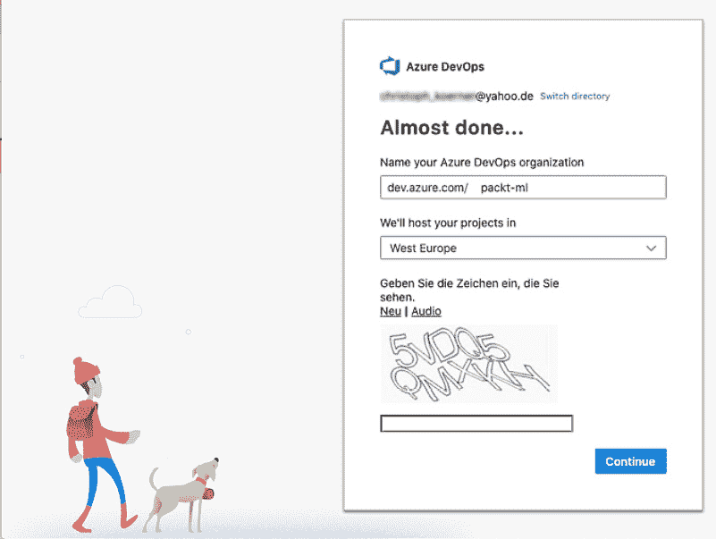
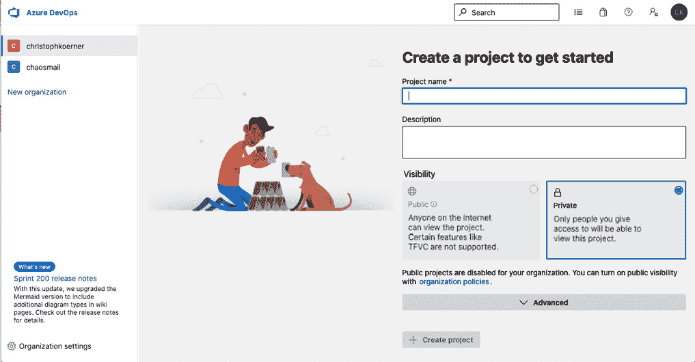
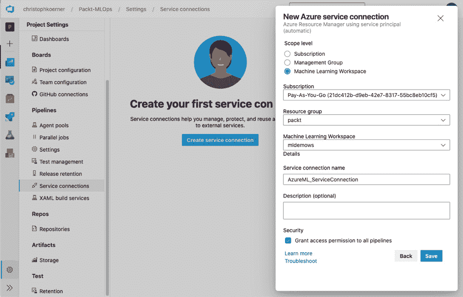
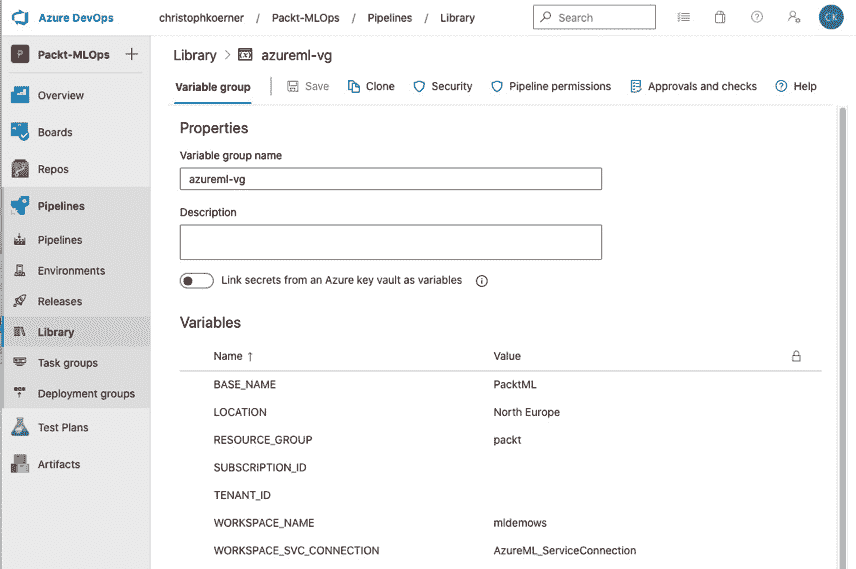
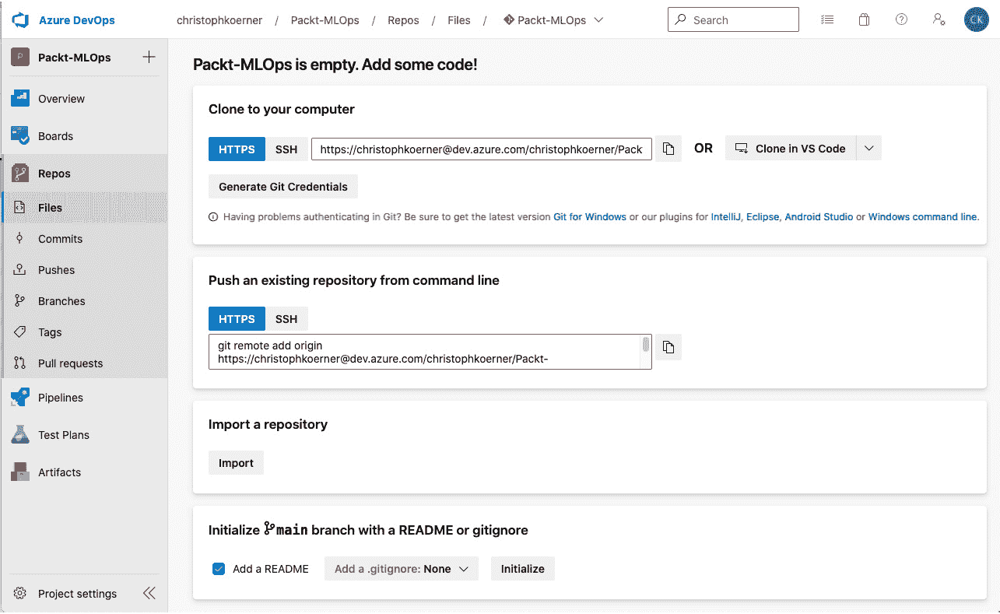
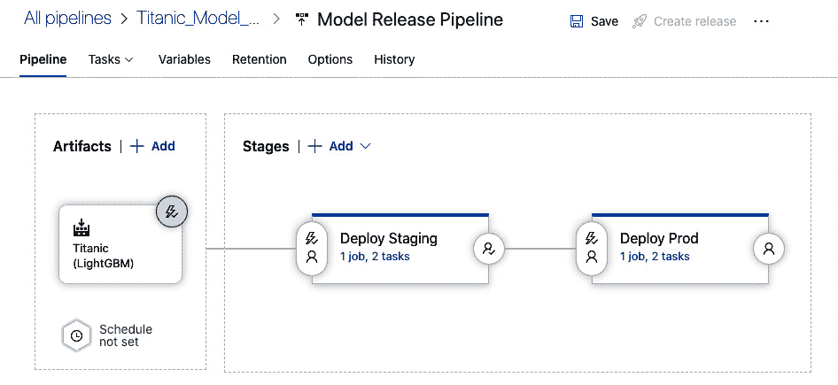

# *第十六章*：使用 MLOps 将模型投入生产

在上一章中，我们探讨了使用 ONNX 进行模型互操作性、使用 FPGA 进行硬件优化以及将训练模型集成到其他服务和平台中的方法。到目前为止，你已经学习了如何在一个端到端机器学习管道中实现每个步骤，包括数据清洗、预处理、标记、实验、模型训练、优化和部署。在本章中，我们将把之前所有章节中的片段连接起来，在构建和发布管道中集成和自动化它们。我们将重用所有这些概念，在 Azure 中构建一个版本控制的、可重复的、自动化的 ML 训练和部署过程，作为一个 **持续集成和持续部署**（**CI/CD**）管道。类似于软件开发中的 **DevOps** 方法论，我们将把这个主题称为 **MLOps**。

首先，我们将看看如何为 ML 项目生成可重复的构建、环境和部署。我们将涵盖代码的版本控制，以及数据和构建工件版本化/快照。

接下来，我们将学习如何自动测试我们的代码，并重点关注 ML 项目来验证代码质量。为此，我们将了解如何将单元测试、集成测试和端到端测试适应以确保训练数据和 ML 模型的良好质量。

最后，你将构建自己的 MLOps 管道。首先，你将学习如何设置 Azure DevOps 作为 MLOps 的编排和协调层，然后你将实现构建（CI）和发布（CD）管道。

在本章中，我们将涵盖以下主题：

+   确保可重复构建和部署

+   验证代码、数据和模型

+   构建端到端 MLOps 管道

# 技术要求

在本章中，我们将使用以下 Python 库和版本在 Azure DevOps 中创建 MLOps 管道：

+   `azureml-core 1.34.0`

+   `azureml-sdk` `1.34.0`

+   `pandas 1.3.3`

+   `tensorflow 2.6.0`

+   `pytest 7.1.1`

+   `pytest-cov 3.0.0`

+   `mock 4.0.3`

+   `tox 3.24.5`

本章讨论的大多数脚本和管道需要在 Azure DevOps 中进行调度执行。

本章中所有的代码示例都可以在本书的 GitHub 仓库中找到：[`github.com/PacktPublishing/Mastering-Azure-Machine-Learning-Second-Edition/tree/main/chapter16`](https://github.com/PacktPublishing/Mastering-Azure-Machine-Learning-Second-Edition/tree/main/chapter16).

# 确保可重复构建和部署

DevOps 有许多不同的含义，但通常是指在源代码更改时实现快速和高品质的部署。实现高质量操作代码的一种方法是通过保证可重复和可预测的构建。虽然对于只有少量配置更改的应用程序开发来说，编译的二进制文件看起来和行为相似似乎是显而易见的，但对于 ML 管道的开发来说，情况并非如此。

机器学习工程师和数据科学家面临着许多问题，这使得构建可重复部署变得非常困难：

+   开发过程通常在笔记本中执行，因此它不总是线性的。

+   重构笔记本代码经常会破坏旧的笔记本。

+   存在库版本和驱动程序不匹配的问题。

+   源数据可能会被更改或修改。

+   非确定性优化技术可能导致完全不同的输出。

本书的前几章我们讨论了交互式笔记本（例如 Jupyter、Databricks、Zeppelin 和 Azure 笔记本），你可能在实现机器学习模型和数据管道时已经见过它们。虽然交互式笔记本有执行单元格以迭代验证模型块块的优势，但它们也常常鼓励用户以非线性顺序运行单元格。当尝试将管道投入生产或自动化时，使用笔记本环境的主要好处变成了痛点。

机器学习中的第二个常见问题是确保安装了正确的驱动程序、库和运行时。虽然使用 Python 2 运行基于 scikit-learn 的小型线性模型很容易，但如果部署的 CUDA、cuDNN、libgpu、Open MPI、Horovod、TensorFlow、PyTorch 和类似库与开发版本匹配，对深度学习模型来说就大不相同了。通过 Docker 或类似技术进行容器化有助于构建可重复的环境，但在实验、训练、优化和部署过程中使用它们并不简单。

数据科学家面临的另一个挑战是数据通常会随时间变化。在开发过程中，可能添加了新的数据批次，或者数据被清理、写回存储，并作为其他实验的输入重新使用。由于数据在格式、规模和质量上的可变性，它可能是生产可重复模型时遇到的最大问题之一。与代码版本控制类似，对数据进行版本控制对于可重复构建和审计目的都是必不可少的。

另一个使可重复的机器学习构建变得困难的挑战是，它们通常包含一个优化步骤，如第 *第十一章* 中讨论的，*超参数调整和自动化机器学习*。虽然优化是机器学习（例如，用于模型选择、训练、超参数调整或堆叠）的必要步骤，但它可能会给训练过程添加非确定性行为。让我们一步一步地找出如何解决这些问题。

## 代码版本控制

版本控制源代码是一种最佳实践，不仅适用于软件开发，也适用于数据工程、数据科学和机器学习。作为一个组织，您可以选择建立自己的内部源代码仓库或使用外部服务。**GitHub**、**GitLab**、**Bitbucket**和**Azure DevOps**是管理源代码仓库的流行服务。这些服务的优势在于它们中的一些提供了额外的功能，例如对 CI 工作流的支持。在本章的后面，我们将使用 Azure DevOps 的 CI 运行器集成。

使用版本控制对您的代码来说比您使用的版本控制系统更重要。是的，**Git**工作得相当好，但**Mercurial**和**Subversion**（**SVN**）也是如此。对于我们的示例 MLOps 管道，我们将使用 Git，因为它是最广泛使用和支持的。您必须熟悉您选择的版本控制系统的基本工作流程。您应该能够创建提交和分支，提交**pull requests**（**PRs**），对请求进行评论和审查，以及合并更改。

版本控制源代码的力量在于记录更改。在每个这样的更改上，我们希望触发一个自动的管道来测试您的更改，验证代码质量，并在成功合并后训练模型并自动将其部署到预发布或生产环境。您的提交和 PR 历史记录不仅将成为记录更改的来源，还将触发、运行和记录这些更改是否经过测试并准备好投入生产。

为了有效地使用版本控制，您必须尽快将业务逻辑从您的交互式笔记本中移除。笔记本以自定义数据格式存储每个单元格的代码和输出，例如序列化为 JSON 文件。这使得在序列化的笔记本中审查更改变得非常困难。一种好的折衷方法是采用混合方法，首先在笔记本中测试您的代码实验，然后逐渐将逻辑移动到导入到每个文件中的模块。使用自动重新加载插件，您可以确保在更改逻辑时，这些模块会自动重新加载，而无需重启内核。

将代码从笔记本移动到模块不仅会使您的代码对所有其他实验可重用（无需从笔记本复制实用函数），而且会使您的提交更加易于阅读。当多个人在一个庞大的 JSON 文件（这是您的笔记本环境存储每个单元格的代码和输出的方式）中更改几行代码时，对文件的更改将几乎无法审查和合并。然而，如果这些更改是在模块（仅包含可执行代码的单独文件）中进行的，那么这些更改将更容易阅读、审查、推理和合并。

在我们继续查看训练数据的版本化之前，这是一个复习你的 Git 技能、创建（私有）存储库并实验版本控制功能的好机会。

## 注册数据快照

你的机器学习模型是训练代码和训练数据的输出。如果我们对训练源代码进行版本控制以创建可重复构建，我们也需要对训练数据进行版本控制。虽然将小型、文本、非二进制和非压缩文件与源代码一起检查到版本控制系统中听起来是合理的，但对于大型二进制或压缩数据源来说，这听起来并不合理。在本节中，我们将讨论如何处理后者的解决方案。

让我们再次强调可重复构建的概念：无论何时执行训练——它可能是今天，也可能是一年后——输出应该是相同的。这意味着对训练数据的任何修改都应该创建数据集的新版本，并且训练应该使用数据集的特定版本。我们区分操作事务数据和历史数据。前者通常是状态性和可变的，而后者通常是不可变的。有时，我们也会看到两者的混合，例如，可变的历史事件数据。

当处理可变数据（例如，存储客户信息的操作数据库）时，我们需要在拉取数据用于训练之前创建快照。对于机器学习，使用完整快照比增量快照更容易，因为每个快照都包含完整的数据集。虽然增量快照通常创建来节省成本，但使用列压缩数据格式和可扩展的 blob 存储系统（如 Azure Blob 存储）也可以高效地存储完整快照，即使你有多个 TB 的数据。

当处理历史数据或不可变数据时，我们通常不需要创建完整快照，因为数据是分区的——也就是说，组织在目录中，目录对应于分区键的值。历史数据通常按处理日期或时间分区，例如数据摄取执行的时间。日期或时间分区使得将训练管道指向特定范围的分区而不是直接指向一组文件变得更容易。

有多种方法可以创建训练数据的快照。然而，当使用 Azure 机器学习工作区时，建议将数据包装在 Azure 机器学习数据集中，如第四章“导入数据和管理数据集”中所述。这使得创建数据快照或版本化数据变得容易。在 Azure 机器学习中处理和修改数据时，你应该养成增加数据集版本的惯例。此外，在训练脚本中获取数据时，你应该传递数据集的特定版本。

每次你向你的训练脚本传递参数时，使用确定性占位符参数化管道是有帮助的。如日期和时间戳之类的参数应在管道调度步骤中创建，而不是在代码本身中创建。这确保了你总是可以用历史参数重新运行失败的管道，并且会创建相同的输出。

因此，确保你的输入数据已注册并版本控制，你的输出数据也已注册并参数化。这需要一点时间来正确设置，但整个项目生命周期都是值得的。

## 跟踪你的模型元数据和工件

将你的代码移到模块中，将其检查到版本控制中，并对你的数据进行版本控制将有助于创建可重复的模型。如果你正在为企业构建 ML 模型，或者你正在为你的初创公司构建模型，了解哪个模型版本被部署以及它使用的数据集进行训练是至关重要的。这对于审计、调试或解决客户对你服务预测的询问是相关的。

我们在前几章中看到，几个简单的步骤就可以让你在模型注册表中跟踪模型工件和模型版本。对模型工件进行版本化是持续部署的必要步骤。模型由工件组成，这些工件是在训练过程中生成的文件和元数据。模型资产包含模型架构、参数和权重的定义，而模型元数据包含数据集、提交哈希、实验和运行 ID 以及更多训练运行信息。

另一个重要的考虑因素是指定和版本控制你的随机数生成器的种子。在大多数训练和优化步骤中，算法将使用基于随机种子的伪随机数来洗牌数据和参数选择。因此，为了在多次运行代码后产生相同的模型，你需要确保为每个使用随机行为的操作设置一个固定的随机种子。

一旦你了解了源代码版本控制对你应用程序代码和版本化数据集的好处，你就会明白这对你的训练模型来说也是非常有意义的。然而，现在你存储的是每个模型的模型工件（包含模型权重和架构的二进制文件）和元数据，而不是可读的代码。

## 编写你的环境和部署脚本

自动化你在训练和部署过程中执行的每个操作将增加开发、测试和部署的初始时间，但最终在再次执行这些步骤时将节省大量时间。云服务，如 Azure 机器学习和 Azure DevOps，的好处是它们为你提供了自动化开发部署过程中每一步所需的所有工具。

如果你还没有这样做，你应该开始组织你的 Python 代码到虚拟环境中。流行的选项包括 `requirements`、`pyenv`、`Pipenv` 或 `conda` 文件，这些文件可以帮助你跟踪开发和测试依赖项。这有助于你将依赖项作为虚拟环境的一部分进行指定，而不是依赖于全局包或开发机器的全局状态。

Azure DevOps 和其他 CI 运行器将帮助你定义依赖关系，因为运行集成测试将在测试过程中自动安装所有定义的依赖项。这通常是 CI 流水线中的第一步。然后，无论何时你将新代码或测试检入到你的版本控制系统，CI 流水线都会执行并自动测试你的环境安装。因此，将集成测试添加到所有模块中是一个好习惯，这样你就不会错过环境中任何包的定义。如果你遗漏了依赖项的声明，CI 构建将失败。

接下来，你还需要编写脚本、配置和自动化所有基础设施。如果你已经阅读了本书的前几章，你现在可能已经明白为什么我们通过 Python 编写环境自动化和部署。如果你之前已经编写了这些步骤的脚本，你可以在 CI 流水线中简单地运行和参数化这些脚本。

如果你运行一个生成模型的 CI 流水线，你很可能希望为这项工作启动一个新的 Azure Machine Learning 集群，这样你就不会干扰到其他发布、构建流水线或实验。虽然这种自动化程度在本地基础设施上非常难以实现，但在云中你可以轻松做到。许多服务，如 Azure Machine Learning 中的 YAML 文件、Azure 中的 ARM 模板或 HashiCorp 的 Terraform，都提供了对你基础设施和配置的完全控制。

最后的部分是在 Azure Machine Learning 中自动化部署。通过代码执行部署并不比通过 UI 花费更多时间，但它提供了可重复和可再现的部署脚本的优点。你经常会面临以多种方式执行相同操作的情况；例如，通过 Azure Machine Learning CLI、Python SDK、YAML、Studio 或 Azure DevOps 中的插件部署 ML 模型。建议选择对你来说最有效的方法，坚持一种做事方式，并以相同的方式进行所有自动化和部署。话虽如此，使用 Python 作为部署的脚本语言并在版本控制中检查你的部署代码是一个好主意，也是流行的选择。

可重复构建和 CI 管道的关键是从一开始就自动化基础设施和环境。在云中，特别是在 Azure 中，这应该非常容易，因为大多数工具和服务都可以通过 SDK 进行自动化。Azure 机器学习团队在 SDK 上投入了大量工作，以便你可以在 Python 内部自动化从摄入到部署的每个步骤。

接下来，让我们来看看代码和资产验证，以确保代码和训练好的模型按预期工作。

# 验证代码、数据和模型

当实现 CI/CD 管道时，你需要确保你已经设置了所有必要的测试，以便轻松自信地部署你新创建的代码。一旦你运行了 CI 或 CI/CD 管道，自动化测试的力量将立即显现。它不仅可以帮助你检测代码中的故障，还可以帮助你检测整个机器学习过程中的未来问题，包括环境设置、构建依赖项、数据需求、模型初始化、优化、资源需求和部署。

当实现我们机器学习过程的验证管道时，我们可以从传统的软件开发原则中汲取灵感（例如，单元测试、集成测试和端到端测试）。我们可以将这些技术直接转换为机器学习过程中的步骤，例如输入数据、模型和评分服务的应用程序代码。让我们了解如何将这些测试技术适应机器学习项目。

## 使用单元测试测试数据质量

单元测试对于编写高质量的代码至关重要。单元测试旨在独立于所有其他代码测试代码的最小单元（一个函数）。每个测试应该一次只测试一件事情，并且应该快速运行和完成。许多应用程序开发人员在他们更改代码时运行单元测试，或者至少在将新提交提交到版本控制时运行单元测试。

下面是一个使用 Python 3 标准库中提供的`unittest`模块编写的单元测试的简单示例：

```py
import unittest
class TestStringMethods(unittest.TestCase):
  def test_upper(self):
    self.assertEqual('foo'.upper(), 'FOO')
```

如代码片段所示，我们运行一个函数并测试结果是否与预定义的变量匹配。我们可以将更多测试作为额外的方法添加到测试类中。

在 Python 和许多其他语言中，我们区分测试框架和库，这些框架和库帮助我们编写和组织测试，以及执行测试和创建报告的库。`pytest`和`tox`是执行测试的出色库；`unittest`和`mock`帮助你以类为单位编写和组织测试，并模拟对其他函数的依赖。

当你为你的机器学习模型编写代码时，你也会发现一些代码单元，这些代码单元可以在每次提交时进行单元测试，并且可能应该进行单元测试。然而，机器学习工程师、数据工程师和数据科学家现在在他们的开发周期中还要处理另一个错误来源：数据。因此，重新思考单元测试在数据质量方面的意义是一个好主意。

一旦你掌握了这个技巧，你将很快理解使用单元测试来衡量数据质量的力量。你可以将输入数据的特征维度视为一个可测试的单个单元，并编写测试来确保每个单元都满足定义的要求。这在随着时间的推移收集新的训练数据并计划未来重新训练模型时尤为重要。在这种情况下，我们总是希望在开始训练过程之前确保数据是干净的并且符合我们的假设。

这里有一些示例，说明你的单元测试可以在训练数据中测试的内容：

+   唯一/不同值的数量

+   特征维度的相关性

+   偏度

+   最小值和最大值

+   最常见值

+   包含零或未定义值的值

让我们将其付诸实践，编写一个单元测试来确保数据集的最小值为 `0`。这个简单的测试将确保如果数据集中包含意外的值，你的 CI/CD 管道将失败：

```py
import unittest
import pandas as pd
class TestDataFrameStats(unittest.TestCase):
  def setUp(self):
    # initialize and load df
    self.df = pd.DataFrame(data={'data': [0,1,2,3]})
  def test_min(self):
    self.assertEqual(self.df.min().values[0], 0)
```

在前面的代码中，我们使用 `unittest` 在同一个类中的多个函数内组织测试。每个类对应一个特定的数据源，在每一个类中，我们可以测试所有特征维度。一旦设置好，我们就可以安装 `pytest` 并简单地从命令行执行它来运行测试。

在 Azure DevOps 中，我们可以在构建管道中设置 `pytest` 或 `tox` 作为简单步骤。对于构建管道步骤，我们只需将以下块添加到 `azure-pipelines.yml` 文件中：

```py
- displayName: 'Testing data quality'
  script: |
    pip install pytest pytest-cov
    pytest tests --doctest-modules
```

在前面的代码中，我们首先安装了 `pytest` 和 `pytest-cov` 来创建 `pytest` 覆盖率报告。在下一行，我们执行了测试，现在它将使用数据集并计算所有统计要求。如果测试未满足要求，测试将失败，我们将在构建的 UI 中看到这些错误。这为你的 ML 管道增加了保护，因为你现在可以确保没有未预见的问题的训练数据在没有你注意到的情况下进入发布。

单元测试对于软件开发至关重要，对于数据也是如此。与一般的测试一样，实施它需要一些初始的努力，这不会立即转化为价值。然而，你很快就会看到，有了这些测试，在部署新模型时你会感到更加安心，因为它会在构建时捕捉到训练数据中的错误，而不是当模型已经部署时。

## 机器学习集成测试

在软件开发中，集成测试验证所谓的单个组件，这些组件通常由多个较小的单元组成。你通常使用测试驱动程序来运行测试套件，并在测试中模拟或存根你不想测试的其他组件。在图形应用程序中，你可以测试一个简单的视觉组件，同时模仿该组件交互的模块。在后端代码中，你测试你的业务逻辑模块，同时模拟所有依赖的持久化、配置和 UI 组件。

因此，集成测试有助于你在组合多个单元时检测关键错误，而无需构建整个应用程序基础设施。它们位于单元测试和端到端测试之间，通常在 CI 运行时按提交、分支或 PR 运行。

在机器学习（ML）中，我们可以使用集成测试的概念来测试机器学习管道的训练过程。这可以帮助你的训练运行在构建阶段发现潜在的错误和错误。集成测试允许你测试你的模型、预训练权重、测试数据片段和优化器是否能够产生成功的输出。然而，不同的算法需要不同的集成测试来测试训练过程中是否存在问题。

当训练一个**深度神经网络（DNN**）模型时，你可以通过集成测试验证模型的许多方面。以下是一个非详尽的步骤列表，用于验证：

+   权重初始化

+   默认损失函数

+   零输入

+   单批次拟合

+   默认激活函数

+   默认梯度

使用类似的列表，你可以轻松地识别和捕捉到所有激活函数在正向传播中都被限制在最大值，或者在反向传播中所有梯度都是`0`的情况。理论上，你可以在 CI 运行时连续运行任何实验、测试或检查，就像在处理新的数据集和模型之前手动执行的那样。因此，每次你的模型被重新训练或微调时，这些检查都会在后台自动运行。

一个更一般的假设是，在训练回归模型时，默认的均值应该接近预测值的均值。在训练分类器时，你可以测试输出类别的分布。在这两种情况下，你可以在开始昂贵的训练和优化过程之前，检测到由于建模、数据或初始化错误引起的问题。

在运行者和框架方面，你可以选择与单元测试相同的库，因为在这种情况下，集成测试仅在测试的组件及其组合方式上有所不同。因此，选择`unittest`、`mock`和`pytest`来构建你的集成测试管道是一种流行的选择。

集成测试对于应用程序开发和运行端到端机器学习（ML）管道至关重要。如果你能够自动检测和避免这些问题，这将节省你大量时间并降低运营成本。

## 使用 Azure Machine Learning 进行端到端测试

在端到端测试中，我们希望验证所有参与请求已部署和完全功能服务的组件。为此，我们需要一起部署完整的服务。端到端测试对于捕获仅在所有组件组合在一起并在一个没有模拟其他组件的预发布或测试环境中运行服务时触发的错误至关重要。

在机器学习部署中，有许多步骤，如果不进行适当的测试，可能会出现很多问题。让我们先排除那些需要确保环境正确安装和配置的简单问题。在 Azure 机器学习中的部署中，一个更关键的部分是应用程序逻辑本身的代码：评分文件。没有简单的方法可以在没有适当端到端测试的情况下测试评分文件、请求格式和输出。

如你所想，端到端测试通常构建和操作成本很高。首先，你需要编写代码并部署应用程序来测试代码，这需要额外的工作、努力和成本。然而，这是在类似生产环境的端到端环境中真正测试评分端点的唯一方法。

好消息是，通过使用 Azure 机器学习部署，端到端测试变得如此简单，以至于它应该成为每个人的管道的一部分。如果模型允许，我们甚至可以进行无代码部署，我们不需要指定部署目标。如果这不可能，我们可以指定 Azure 容器镜像作为计算目标，并独立部署模型。这意味着将前一章的代码放入 Python 脚本中，并将其作为构建过程中的一个步骤。

端到端测试通常很复杂且成本高昂。然而，使用 Azure 机器学习和自动化部署，模型部署和样本请求可以仅仅是构建管道的一部分。

## 持续监控你的模型

模型监控是实验和训练阶段的重要步骤。这将帮助你了解当模型作为评分服务使用时所需的资源。这是设计和选择适当规模的推理环境的关键信息。

无论训练和优化过程是否持续进行，模型需求和配置都会随着时间的推移而演变。如果你使用优化进行模型堆叠或自动化机器学习，你的模型可能会变得更大以适应新的数据。因此，密切关注你的模型需求，以考虑与初始资源选择偏差是很重要的。

幸运的是，Azure 机器学习提供了一个模型监控接口，你可以用模型、评分函数和测试数据来填充它。它将为你实例化一个推理环境，启动评分服务，将测试数据通过服务运行，并跟踪资源利用率。让我们将所有这些部分组合起来，并设置一个端到端 MLOps 管道。

# 构建端到端 MLOps 管道

在本节中，我们希望设置一个端到端的 MLOps 管道。所有必需的训练代码都应该被检查到版本控制中，数据集和模型也将进行版本控制。我们希望在代码或训练数据发生变化时触发 CI 管道以构建代码和重新训练模型。通过单元和集成测试，我们将确保训练和推理代码在隔离状态下工作，并且数据和模型满足所有要求，不偏离我们的初始假设。因此，CI 管道将负责自动的持续代码构建、训练和测试。

接下来，每当一个新的模型版本准备好时，我们将触发 CD 管道。这将部署模型和推理配置到预发布环境，并运行端到端测试。测试成功完成后，我们希望自动将模型部署到生产环境。因此，CD 管道将负责自动部署。

将管道分为 CI 和 CD 部分使得将构建资产的过程与部署资产的过程解耦变得容易。然而，您也可以将这两部分合并为一个单一的 CI/CD 管道，从而使用一个管道进行构建、训练、优化和部署。如何对您的管道的 CI 和 CD 组件进行建模，以及如何设置任何触发器和（手动）批准，取决于您和您的组织。您可以选择将每个提交部署到生产环境，或者在每个工作日或每周在手动批准后部署一定数量的提交。

在本节中，我们将使用 Azure DevOps 来编写和执行 CI/CD 管道，因此设置触发器、运行构建、训练和测试步骤，并处理训练模型的部署。Azure DevOps 具有内置的功能来自动化端到端的 CI/CD 流程。通常，它允许您在您定义的计算基础设施上运行管道中的功能块，称为任务。您可以通过版本控制系统中新提交的提交自动触发管道，或者通过构建工件的新版本或按钮等触发它们，例如，用于半自动部署。前者称为**代码管道**，指的是 CI，而后者称为**发布管道**，指的是 CD。

让我们开始设置一个 Azure DevOps 项目。

## 设置 Azure DevOps

Azure DevOps 将作为编写、配置、触发和执行所有我们的 CI/CD 管道的容器。它提供了与版本控制资源（如代码仓库和与 Azure 及 Azure 机器学习工作区的连接）一起工作的有用抽象，并允许您协作访问运行器、管道和构建工件。

重要提示

**Azure DevOps**指的是通过[`dev.azure.com/`](https://dev.azure.com/)可访问的托管 Azure DevOps 服务。还存在一个名为**Azure DevOps Server**（以前称为 Visual Studio **Team Foundation Server**（**TFS**））的本地提供方案，它提供了类似的 CI/CD 集成功能。

作为第一步，我们将设置 Azure DevOps 工作区，以便我们可以编写和执行 Azure MLOps 管道。让我们从设置组织和项目开始。

### 组织和项目

首先，您需要设置您的组织。组织是一个用于管理类似项目并与一组人协作的工作区。您可以通过使用 Microsoft 账户、GitHub 账户或连接到**Azure Active Directory**（**AAD**）来创建组织。要创建组织，您需要登录到 Azure DevOps([`dev.azure.com/`](https://dev.azure.com/))，提供您组织的 slug 名称，并选择一个区域来托管您组织资产。

以下图显示了创建新的 Azure DevOps 组织的屏幕：



图 16.1 – 创建新的 Azure DevOps 组织

接下来，您可以在组织中设置项目；我们将从一个包含运行 MLOps 管道的配置和代码的项目开始。项目是一个用于逻辑分组特定 ML 项目所有资产的地方。您将能够在 Azure DevOps 项目中管理您的代码仓库、冲刺板、问题、PR、构建工件、测试计划和 CI/CD 管道。

以下图显示了创建新的 Azure DevOps 项目的流程。这将作为我们的管道、测试和部署配置的容器：



图 16.2 – 创建新的 Azure DevOps 项目

一旦我们设置了组织和项目，我们需要通过安装适当的 Azure DevOps 扩展将 Azure 机器学习功能添加到 Azure DevOps 中。

### Azure 机器学习扩展

接下来，建议为您的 Azure DevOps 组织安装 Azure 机器学习扩展。这将紧密集成您的 Azure 机器学习工作区到 Azure DevOps 中，以便您可以在 Azure DevOps 内执行以下操作：

1.  通过 Azure 资源管理器自动分配访问您的 Azure 机器学习工作区资源的自动权限。

1.  触发新模型修订的发布管道。

1.  将 Azure 机器学习管道作为任务运行。

1.  设置模型部署和模型分析预配置任务。

公平地说，所有上述内容也可以通过使用自定义凭据和 Azure ML Python SDK 手动设置，但紧密集成使得设置变得更加容易。

重要提示

你可以从 [`marketplace.visualstudio.com/items?itemName=ms-air-aiagility.vss-services-azureml`](https://marketplace.visualstudio.com/items?itemName=ms-air-aiagility.vss-services-azureml) 安装 Azure Machine Learning 扩展到 Azure DevOps。

接下来，我们将使用扩展来设置服务连接和你的 Azure 及 Azure Machine Learning 工作区账户的访问权限。

### 服务连接

你可能还记得从之前的代码示例中，与 Azure 和 Azure Machine Learning 资源交互需要配置适当的权限、租户和订阅。访问这些服务和资源的权限通常通过 **服务主体** 定义。在 Azure DevOps 中，我们可以设置我们的 Azure DevOps 管道访问 Azure 和 Azure Machine Learning 资源、创建计算资源以及通过 **服务连接** 提交 ML 实验的权限。

在你的 Azure DevOps 项目中，转到 **设置** | **服务连接** 并配置一个新的 Azure 服务连接，使用服务主体身份验证你的 Azure Machine Learning 工作区。以下图显示了如何在 Azure DevOps 中设置此连接：



图 16.3 – 创建 Azure DevOps 服务连接

同样，你也可以允许 Azure DevOps 管道以编程方式管理 Azure 资源组中的资源。建议你通过服务主体创建这两种权限，并注意新创建的连接的名称。

### 密钥

在下一步中，我们希望将所有变量和凭证存储和管理在实际的 CI/CD 管道之外。我们不希望将凭证或配置参数（如订阅 ID、工作区名称和租户 ID）嵌入到管道中，而是将它们作为参数传递给正在运行的管道。

在 Azure DevOps 中，你可以通过使用 **变量组** 和 **安全文件** 来实现这一点。你甚至可以将变量组连接到 Azure Key Vault 实例来为你管理密钥。

建议你导航到 **管道** | **库** 来设置一个包含你的订阅 ID、租户 ID、服务连接名称等作为变量的变量组，以便它们可以在管道中重复使用。如果你需要，你总是可以稍后回来添加更多变量。以下图显示了可以包含在你的管道中的示例变量组定义：



图 16.4 – 创建 Azure DevOps 变量组

接下来，我们将设置一个仓库并编写代码管道。

### 代理和代理池

你的 CI 和 CD 任务最终将检出项目，构建它，训练模型，运行测试，并部署它。为了完成所有这些（以及更多），你需要一个计算基础设施来运行 CI/CD 作业。在 Azure DevOps 中，这些计算资源被称为 **代理**。

Azure DevOps 服务提供 Microsoft 托管代理，这些代理将在 VM 或 Docker 镜像中执行你的管道作业。这两种计算资源都是临时的，并在每个管道作业后拆除。

当使用 Azure DevOps 与公共项目时，Azure Pipelines 是免费的，并为你的 CI/CD 管道作业提供 Microsoft 托管代理。这允许你运行最多 10 个并行作业，每个作业最多运行 6 小时。对于私有项目，你每月最多只能运行一个并行作业，每个作业最多运行 1 小时。

重要提示

为了防止滥用，所有免费管道资源都需要通过此表单请求组织：[`aka.ms/azpipelines-parallelism-request`](https://aka.ms/azpipelines-parallelism-request)。

如果需要更多容量，我们可以通过 Azure DevOps Server 和/或 Azure VM 规模集代理运行自托管代理，或者通过 Azure DevOps 服务购买额外的 Microsoft 托管代理。为了本书的目的，你应该能够利用私有仓库上的免费容量舒适地进行实验。

## 持续集成 – 使用管道构建代码

现在，我们可以开始使用 Azure DevOps 管道设置我们的 ML 模型的自动构建、测试和训练管道。从概念上讲，我们将在 Azure DevOps 中创建或导入一个 Git 仓库，作为我们的 ML 项目的容器，并将包含 CI 管道定义。按照惯例，我们将管道存储在 `.pipeline/` 目录中。

下图展示了如何在 Azure DevOps 中设置或导入一个仓库：



图 16.5 – 克隆或导入仓库

接下来，我们打开 Visual Studio Code 并开始编写我们的管道。我们不会从小部件和插件中构建 CI 管道，而是选择 YAML 来编写管道代码。这与 GitHub CI 或 Jenkins 工作流程的编写方式非常相似。

管道包含一系列线性任务，用于构建、测试和训练 ML 模型，这些任务可以通过仓库中的条件触发。在 Azure DevOps 管道中，任务按以下层次结构组织：

+   阶段 A:

    +   作业 1：

        +   步骤 1.1

        +   步骤 1.2

    +   作业 2：

        +   步骤 2.1

因此，一个管道由阶段组成，其中每个阶段包含多个作业。每个作业可以包含多个称为步骤的任务。除了阶段和作业之外，管道还可以包含以下部分：

+   管道定义：

    +   `name`：管道的名称

+   管道触发器：

    +   `schedules`：基于计划的管道触发配置

    +   `trigger`：基于代码的管道触发配置

    +   `pr`：基于 PR 的管道触发配置

+   管道计算资源：

    +   `resources`: 容器和存储库配置

    +   `pool`: 管道计算资源的代理池配置

+   管道定制：

    +   `variables`: 管道变量

    +   `parameters`: 管道参数

+   管道作业定义：

    +   `stages`: 管道作业的分组，如果管道只有一个阶段，则可以跳过

    +   `jobs`: 要执行的管道作业

如前所述的列表所示，Azure DevOps 管道 YAML 方案允许您自定义管道触发器、计算资源、变量和配置，并允许您定义管道中要运行的作业。Azure DevOps 管道还理解模板的概念。您可以使用 `template` 指令为阶段、管道、作业、步骤、参数和变量引用模板中的文件。

重要提示

您可以在微软文档中找到管道 YAML 方案的文档，网址为 [`docs.microsoft.com/en-us/azure/devops/pipelines/yaml-schema/`](https://docs.microsoft.com/en-us/azure/devops/pipelines/yaml-schema/).

让我们使用这些步骤定义来构建一个简单的管道，以测试模型代码并开始模型训练：

ci-pipeline.yaml

```py
trigger:
- main
pool: 
  vmImage: ubuntu-latest
stages:
- stage: CI
  jobs:
  - job: Build
    steps:
    - script: pytest tests --doctest-modules
- stage: Train
  jobs:
  - job: Train
    steps:
    - script: python train.py
```

在前面的管道中，我们定义了触发器，当 `main` 分支上有新提交时启动管道。对于执行，我们使用 Ubuntu VM 在微软托管的免费代理池上运行每个作业。然后，我们将任务分为两个阶段：`CI` 和 `Train`。前者将构建和测试代码及数据集，而后者将训练机器学习模型并在模型注册表中创建模型的新版本。

现在，我们可以在存储库中添加一个提交并将其合并到 `main` 分支，CI 管道将被触发并训练一个新的模型版本。您可以使用前面的管道定义作为起点，添加额外的步骤、测试、配置和触发器，以完全定制您的 CI 管道。

重要提示

您可以在微软 GitHub 存储库中找到最新的 MLOps 管道示例，网址为 [`github.com/microsoft/MLOpsPython`](https://github.com/microsoft/MLOpsPython)。

您可以在 Azure MLOps 存储库中找到更多 MLOps 起始点的示例 [`github.com/Azure/mlops-v2`](https://github.com/Azure/mlops-v2)

接下来，我们将查看一个 CD 管道，以将训练好的模型部署到生产环境中。

## 持续部署 - 使用发布管道部署模型

在模型注册库（例如 Azure 机器学习）中跟踪模型工件（例如，新机器学习模型或版本）的另一个好处是，当工件发生变化时，您可以在 Azure DevOps 中自动触发发布管道。任何工件，如新的机器学习模型或版本，都可以配置为在 Azure DevOps 中触发发布。因此，代码更改触发 CI 构建管道，而工件更改触发 CD 发布管道。在本节中，我们将为我们的模型创建一个 CD 管道，并自动将模型推出到预发布和生产环境。

尽管发布管道的触发机制与构建管道不同，但大多数关于管道执行的概念都非常相似。发布管道也有管道阶段，而每个阶段可以有多个任务。发布管道的一个额外功能是，由于它们处理工件部署，因此每个阶段可以具有额外的**触发器**，以及**部署前**和**部署后**条件，例如**手动批准**和**门控**。

触发器将允许您在指定的计划期间继续管道执行。手动批准将使管道暂停，直到被定义的用户或用户组批准，而门控将使管道在执行程序性检查之前暂停预定义的时间。通常将多个阶段、触发器以及部署前和部署后的条件结合起来，以安全地将工件部署到不同的环境。

如果您已安装 Azure Machine Learning 插件，您可以选择专门针对 Azure Machine Learning 的触发器和部署任务，例如基于 ML 模型版本的工件和 Azure Machine Learning 模型部署和性能分析任务。在本节中，我们将选择 ML 模型工件触发器和 ML 模型部署任务。

重要提示

您可以在 Microsoft 文档中找到可用的 Azure DevOps 任务，网址为[`docs.microsoft.com/en-us/azure/devops/pipelines/tasks/`](https://docs.microsoft.com/en-us/azure/devops/pipelines/tasks/)。

下图显示了 Azure DevOps 发布管道，其中我们选择一个机器学习模型作为发布管道触发的工件。我们配置了两个阶段，一个是部署到预发布环境，另一个是部署到生产环境。此外，我们还添加了一个手动批准作为预发布部署的部署后条件：



图 16.6 – 定义 Azure DevOps 发布管道

默认情况下，发布管道将要求用户通过在右上角点击**创建发布**按钮来创建发布。这种模式旨在仅在操作员决定触发部署时创建发布，并有助于我们在配置发布管道时避免任何自动化部署。然而，一旦操作员确信管道和发布过程按预期工作，我们可以通过切换发布管道中资产上的闪光图标来启用自动化部署。这将启用 CD 触发器，因此，每当资产发生变化时，都会触发发布和部署。在本章的最后一个任务中，您可以继续激活 CD 触发器，以完全自动化您的 CD 管道。

# 摘要

在本章中，我们介绍了 MLOps，这是一种类似于 DevOps 的工作流程，用于开发、部署和操作机器学习服务。DevOps 代表了一种快速且高质量地更改代码并将这些更改部署到生产环境的方法。

我们首先了解到 Azure DevOps 提供了所有功能来运行强大的 CI/CD 流水线。我们可以运行构建流水线，其中步骤用 YAML 编码，或者发布流水线，它们在 UI 中进行配置。发布流水线可以有手动或多个自动触发器（例如，版本控制仓库中的提交或如果模型注册表的工件已更新）并为发布或部署创建输出工件。

版本控制您的代码是必要的，但仅此不足以运行适当的 CI/CD 流水线。为了创建可重复构建，我们需要确保数据集也进行了版本控制，并且伪随机生成器使用指定的参数进行初始化。环境和基础设施也应自动化，部署可以从创作环境进行。

为了保持代码质量高，您需要将测试添加到机器学习流水线中。在应用程序开发中，我们区分单元测试、集成测试和端到端测试，它们测试代码的不同部分，要么独立进行，要么与其他服务一起进行。对于数据流水线，如果数据发生变化或增加，单元测试应测试数据质量以及应用程序中的代码单元。集成测试非常适合独立于其他组件加载模型或执行正向或反向传递。使用 Azure Machine Learning，编写端到端测试变得非常愉快，因为它们可以非常低效和低成本地完全自动化。

现在，您已经学会了如何设置连续流水线，这些流水线可以重新训练和优化您的模型，然后自动构建和重新部署模型到生产环境中。在最后一章中，我们将探讨您、您的公司以及您在 Azure 中的 ML 服务下一步将是什么。
