# 第二章。AdventureWorks 回归

想象一下，你是一家位于华盛顿州西雅图的自行车制造公司 AdventureWorks 的商业开发者。你负责三个在单个 SQL Server 实例上运行的应用程序。这些应用程序包括：

+   一个客户订购网站，包括直接客户销售部分和另一个批发购买部分

+   一个桌面库存控制管理应用程序

+   一个使用 Power BI 作为前端报告解决方案

这三个应用程序具有相似的特征：

+   这些是数据库优先的应用程序，它们的主要角色是为数据库构建框架。

+   它们都是.NET 应用程序，使用标准的 Microsoft 模板和框架，例如 MVC 用于网站，Entity Frameworks 用于 Web 和桌面解决方案。

有一天，你的老板叫你到她的办公室说，“我们对网站的批发商部分感到担忧。我们通过 Power BI 的一些基本图表发现，许多批发商根据产品的平均客户评价来取消订单。”

这里是我们正在查看的图表之一：

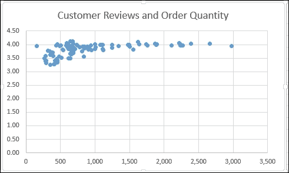

显然，如果我们能阻止人们这样做，我们就能最大化销售额。我们希望最大化我们现有的代码资产，因此你的解决方案需要与现有网站集成，我们希望我们的客户能够体验到他们目前所拥有的相同的视觉和感觉。”

这是当前网页的样貌：

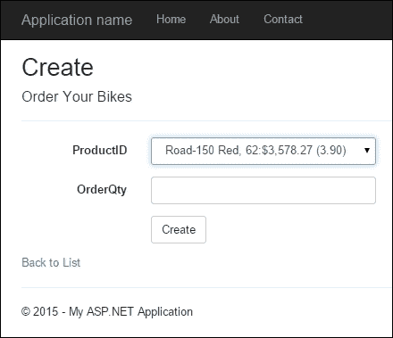

你告诉你的老板，你将看一下，思考几天，然后提出一些想法。在你内心深处，你感到非常兴奋，因为这将让你摆脱传统的前端开发角色，进入数据科学领域。在研究了不同的机器学习技术后，你决定使用简单的回归来帮助实现这一目标。

# 简单线性回归

回归试图根据一组不同的数字预测一个数字。例如，想象我们有一个盒子，我们输入一个数字，另一个数字就出来了：

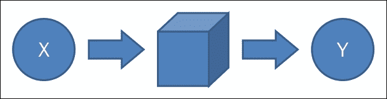

我在框中输入数字 1，然后数字 6 就出来了。然后，我再次在框中输入另一个 1，数字 7 就出来了。我这样做了五次，得到了以下结果：

```py
1 -> 6
1 -> 7
1 -> 6
1 -> 5
1 -> 6
```

在输入另一个数字之前，你认为输出会是什么？你可能猜到是 6。然而，如果我问你是否 100%确定会出来 6，你会说，“不，但很可能会是 6。”事实上，你可能会说，根据以往的经验（在五次尝试中出现了三个 6），6 有 60%的概率出现。

你在心理上所做的是一种回归。通常，线性回归是用如下公式编写的：

```py
y = x0 + x1 + x2 + E
```

这里，*y* 是你想要预测的数字，而 *x0*、*x1* 和 *x2* 是可能影响 *y* 的某些数字。回到 AdventureWorks，*y* 是零售店一个月订购的自行车数量，*x0* 是一年中的月份，*x1* 是前三个月的订单，而 *x2* 是直接竞争对手订购的其他自行车的数量。*E* 是我们公式无法解释但仍影响自行车销售的所有因素——比如某个门店失去了一位关键的销售人员。如果我们知道 *x0 + x1 + x2* 解释了 75% 的 *y*，那么我们就知道 25% 的 *y* 无法解释。

因此，我们的目标是找到尽可能少的 *x* 参数，这些参数对 *y* 有最大的影响，然后合理地尝试让我们的网站反映预测值并影响用户以符合我们的利益。

回归类型有很多，我们将从最基础的、虽然令人惊讶地强大的一种开始——简单回归。在简单回归中，只有一个输入变量和一个输出，因此公式是 *y = x0 + E*。因为只有两个变量，我们可以将它们绘制在二维图上。例如，如果我们有这些数据：

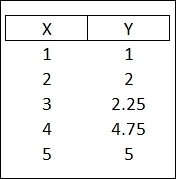

我们可以像这样绘制数据：

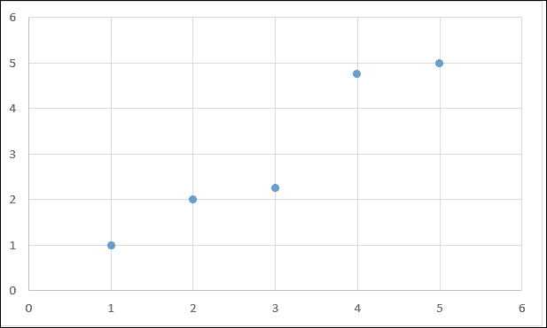

我们想要用简单回归做的，是找到一条“最适合”通过所有数据点的线：

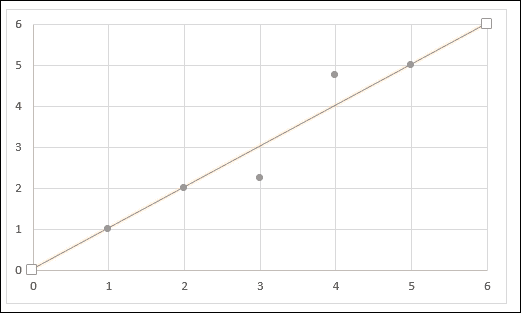

在这个例子中，你可以看到这条线穿过点 1、2 和 5。如果线没有与一个给定的点相交，我们想知道线到点的距离。在这个例子中，我们想知道点 3 和 4 到虚线红线的距离。

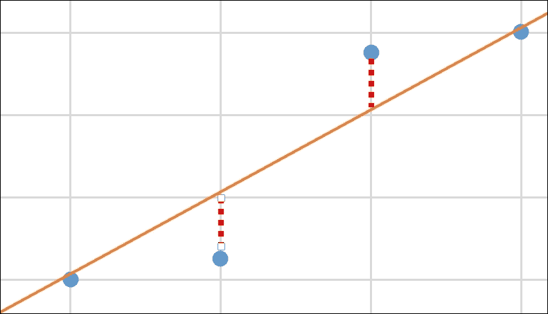

如果我们把所有虚线红线的距离加起来，然后除以图表上总点的数量，我们就有了一个很好的想法，这条线如何代表这个图表。如果我们得到图表上的一个数字，我们可以预测它将落在何处。例如，如果我们得到另一个 2，我们可以预测我们可能会得到 2。不仅如此，我们还可以对尚未看到的输入的线（斜率）进行预测。例如，如果我们输入 6，我们可以猜测它可能接近 6。

在现实世界的例子中，我们通常不会有一个单一的输入对应一个特定的数字。所以，我们可能会得到一百个 1，90% 的时间输出将是 1，5% 的时间输出将是 1.25，还有 5% 的时间输出将是 0.75。如果我们把所有的一百个 1 放到我们的散点图上，我们会看到很多点在 1（或一个非常暗的点）上，一些在 1.25 上，一些在 0.75 上。有了这个心理模型，让我们继续从头开始创建一个简单线性回归。

## 设置环境

打开 Visual Studio 2015 并创建一个新的 F# 库：

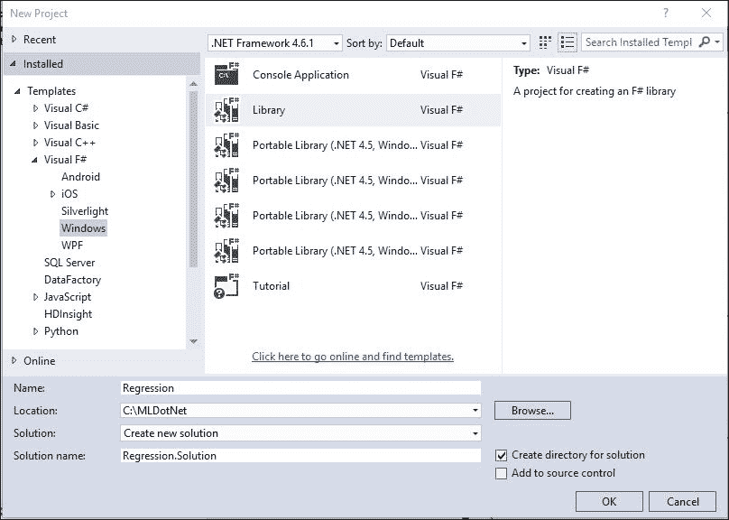

一旦 Visual Studio 为您创建完项目和相关文件，请进入解决方案资源管理器，打开 `Script1.fsx` 并删除文件中的所有内容。现在您应该有一个空白的脚本文件，准备好编写代码。

## 准备测试数据

我们首先将创建一个数据集，我们可以在回归中使用它，并给出可预测的结果。创建一个如下所示的数组：

```py
let input = [|1,1.;2,2.;3,2.25;4,4.75;5,5.|]
```

在这里，`input` 是一个元组数组。元组是一种包含数据组的无名称数据结构——通常有两个项目。这些类型不必与元组的项相同。如果您熟悉键/值对的概念，您可以将它用作元组的心理模型。唯一真正的“陷阱”是元组可以有多个项目，因此这是一个完全有效的元组：`2,true,"dog"`，其中第一个位置是 `int` 类型，第二个是布尔值，第三个是字符串。

如果您突出显示我们的一行代码，并使用 *Alt* + *Enter* 将其发送到交互式环境（REPL），您将得到以下结果：

```py
val input : (int * float) [] =
 [|(1, 1.0); (2, 2.0); (3, 2.25); (4, 4.75); (5, 5.0)|]

```

F# 编译器告诉我们，我们有一个包含 `int` 和 `float` 类型的元组的数组。在这个例子中，我们将使用元组的第一个值作为 *X*，第二个值作为简单线性回归的 *Y*。

数据集设置好之后，让我们考虑如何计算回归。一个比之前使用的更数学的定义是 *y = A + Bx*，其中 *A* 是直线的 *Y* 截距，*B* 是直线的斜率。因此，我们需要找出如何计算直线的截距和斜率。结果是，我们需要计算 *x* 和 *y* 值的标准差以及称为 **皮尔逊相关系数** 的东西。让我们分别解决这些问题。

## 标准差

我遇到的最佳标准差解释是在 [`www.mathsisfun.com/data/standard-deviation.html`](http://www.mathsisfun.com/data/standard-deviation.html)。

标准差是方差的平方根；要计算方差：

1.  计算平均值（数字的简单平均值）。

1.  然后，对于每个数字，减去平均值并平方结果（平方差）。

1.  然后，计算这些平方差的平均值。

因此，结合 MathIsFun 的解释并将其应用于 F#，我们可以写出：

```py
let variance (source:float seq) =
    let mean = Seq.average source
    let deltas = Seq.map (fun x -> pown (x-mean) 2) source
    Seq.average deltas
```

将其发送到交互式环境（REPL）会得到：

```py
val variance : source:seq<float> -> float

```

注意到英文解释的每一行与 F# 代码之间有一一对应的关系。这不是偶然的。F# 真的非常擅长匹配您的思维过程。事实上，当我们看到英文版本中的那些词时，我们甚至抵制了使用 `for…each` 代码的诱惑。

这里有一些新的 F# 代码可能让人困惑。注意，当我计算平均值时，我调用了 `Seq.average` 函数：

```py
 Seq.average source
```

因此，`source` 参数位于函数之后。我也可以这样写：

```py
 source |> Seq.average
```

如果你已经完成了第一章，*欢迎使用.NET 框架进行机器学习*，你可能会看到这个。尽管风格指南主张非管道前进的方式，但在 F#社区中，关于哪种方式更符合习惯用法并没有达成共识。由于两种方式都由语言支持并且广泛使用，我会根据代码使用它们。通常，当我有一系列想法要一起推动时，我会使用管道操作符，但如果只有一个计算，我就直接调用函数。注意，我在所有三行中使用了这种 *after syntax* 技术：mean，deltas，和函数的返回值。

在方差处理完毕后，我们可以计算标准差：

```py
let standardDeviation values =
     sqrt (variance values)
```

将其发送到 REPL，我们得到：

```py
val standardDeviation : values:seq<float> -> float

```

准备好标准差后，我们可以输入我们的数字。由于我们将独立计算 *X* 和 *Y* 的标准差，让我们将元组拆分成单独的数组，并计算它们的平均值和标准差：

```py
let x = input |> Seq.map (fun (x,y) -> float x)
let y = input |> Seq.map (fun (x,y) -> y) 

let mX = Seq.average x
let mY = Seq.average y

let sX = standardDeviation x
let sY = standardDeviation y
```

将其发送到 REPL，我们得到：

```py
val x : seq<float>
val y : seq<float>
val mX : float = 3.0
val mY : float = 3.0
val sX : float = 1.414213562
val sY : float = 1.589024858

```

这里有一件新的事情。注意，在计算 *x* 时，我使用了这种语法：

```py
Seq.map(fun (x,y) -> float x)
```

返回 `float x`。`float` 是一个将 int 转换为，嗯，浮点数的函数。如果你来自 VB.NET/C#，相应的语法将是 `(float)x`。

## 皮尔逊相关系数

接下来，让我们计算皮尔逊相关系数。我找到的最好的解释可以在[`onlinestatbook.com/2/describing_bivariate_data/calculation.html`](http://onlinestatbook.com/2/describing_bivariate_data/calculation.html)找到。你可以把创建皮尔逊相关系数想象成在一个 Excel 电子表格中填写列，然后对列总计进行一些计算。从 *x* 和 *y* 在不同行开始创建一个网格：

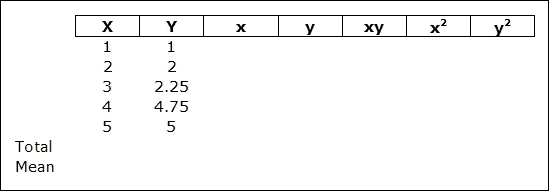

然后，计算 *X* 和 *Y* 的平均值：

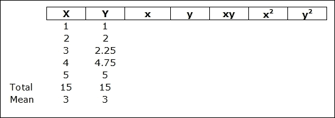

接下来，计算 *x* 和 *y*。*x* 是通过从 *X* 中减去 *X* 的平均值来计算的，而 *y* 是通过从 *Y* 中减去 *Y* 的平均值来计算的：

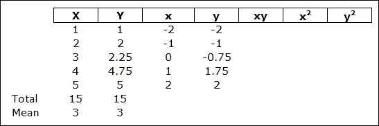

接下来，填写 *xy*，*x**²*，和 *y* *²*：

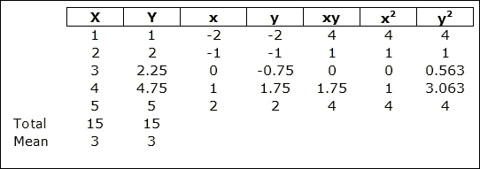

在网格填写完毕后，你可以求和 *xy*，*x²*，和 *y²*：

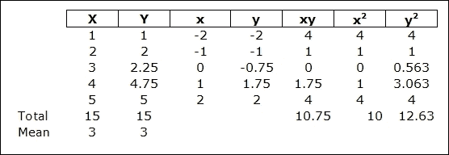

最终答案是通过对 *xy* 列的总和（Σxy）除以 *x²* 列的总和（Σx**²*）和 *y**²* 列的总和（Σy**²*）的乘积的平方根来计算的。所以，在我们的例子中，它将是：

```py
10.75/ √(10 * 12.63)
```

我现在想用英语重复这些步骤，而不使用那个网格：

1.  计算 *X* 的平均值。

1.  计算 *Y* 的平均值。

1.  计算 *x*。

1.  计算 *y*。

1.  填写 *xy*，*x**²*，和 *y**²*。

1.  求 *y**²* 的和。

1.  求 *x**²* 的和。

1.  求 *y**²* 的和。

1.  做最终的公式。

这是我会用 F#写的样子：

```py
let pearsonsCorrelation(a:float seq, b:float seq) =
    let mX = Seq.average a
    let mY = Seq.average b

    let x = a |> Seq.map (fun x -> x - mX)
    let y = b |> Seq.map (fun y -> y - mY)

    let xys = Seq.zip x y
    let xy = xys |> Seq.map (fun (x, y) -> x*y, x*x, y*y)
    let sxy = xy |> Seq.sumBy (fun (xy, x2, y2) -> xy)
    let sx2 = xy |> Seq.sumBy (fun (xy, x2, y2) -> x2)
    let sy2 = xy |> Seq.sumBy (fun (xy, x2, y2) -> y2)
    sxy / sqrt (sx2*sy2)
```

将其发送到 REPL，我们得到：

```py
val pearsonsCorrelation : a:seq<float> * b:seq<float> -> float

```

再次，你可以看到公式和代码之间几乎是一对一的对应关系。有几件事情需要注意。

`Seq.zip x y` 是一个函数，它接受两个长度相等的序列并将它们组合成一个单一的元组。所以对于 *x* 和 *y* 的组合：

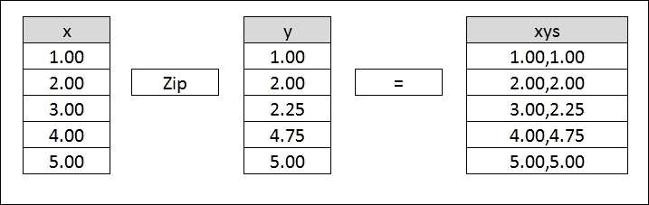

另一件需要注意的事情是，在 `Seq.SumBys` 中使用了一个三项元组。元组的每个项代表我们在填写的网格中的不同列：*xy*，*x²* 和 *y²*。尽管我通常不喜欢创建超过两项的元组，但在这个情况下我可以例外，因为我只在这些高阶函数的上下文中使用元组。因为数据结构是包含的且短暂的，所以元组是最好的选择。如果我在高阶函数之外需要这个数据结构，记录类型可能更合适。我们将在本章的后面更多地接触到记录类型。

最后要注意的是 `Seq.sumBy` 高阶函数。正如你所期望的，`sumBy` 计算事物的总和。关键是要意识到 `sumBy` 期望传递一个函数，而不是数据结构。如果你只想对数组中的值求和，可以使用 `Seq.sum()` 函数：

```py
Seq.sum ([1;2;3])
val it : int = 6

Seq.sumBy ([1;2;3])
Does not compile

Seq.sumBy (fun i -> i) [1;2;3]
val it : int = 6
```

因此，要为 *x* 和 *y* 运行皮尔逊相关系数，请在脚本中输入以下内容：

```py
let r = pearsonsCorrelation (x,y)
```

将这些发送到交互式解释器（REPL）会给我们：

```py
val r : float = 0.9567374429

```

## 线性回归

在计算了标准差和 `r` 之后，我们就为线性回归做好了准备：

```py
let b = r*(sY/sX)
let A = mY - b*mX
val b : float = 1.075
val A : float = -0.225
```

这两个值的含义是，我们的 *y* 截距是 `-0.22`，或者非常接近原点，我们的斜率是 `1.075`。将它们放在同一个网格上，你可以看到预测的数字接近实际值：

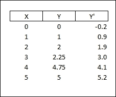

这些在之前的图表中仍然足够不同，我们用红线直接穿过 1, 2, 3, 4, 5（实线）和回归线采取略微不同的路径（虚线）：

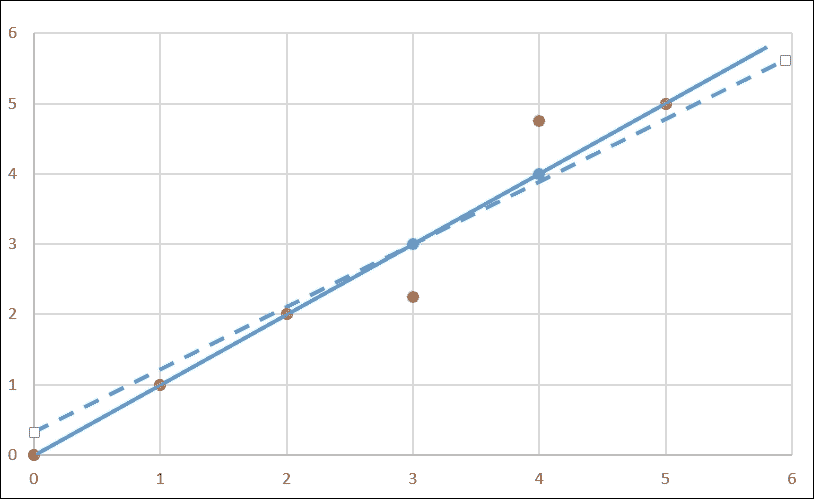

我们将在稍后重新审视这个回归在描述我们的数据（以及做出预测）方面的好坏。在此之前，我们可以安全地说，我们有一个回归，它似乎很好地拟合了我们的数据。

现在我们有一个库可以编译来解决我们的 AdventureWorks 问题。然而，我们可能不想自己从头开始，因为这只是一个相当有限的实现。例如，当我们计算方差和标准差时，我们使用的是整个总体的方差和标准差公式。如果我们只有总体的一小部分样本，我们将使用不同的公式来实现。此外，线性回归有几个参数我们可以输入来尝试调整我们实现中的模型。正如你所猜想的，编写自己的库需要相当多的努力，而且你可能仍然无法做到正确。如果你在之前的自己动手实现练习中想知道，“有没有更简单的方法？”答案是“有。”

# Math.NET

我们在 第一章 中简要介绍了 Math.Net，*欢迎使用使用 .NET 框架的机器学习*。在本节中，我们将将其添加到我们的项目中，看看它如何帮助我们进行简单的线性回归。在你的打开的项目解决方案资源管理器中，添加一个新的脚本文件，并将其命名为 `MathDotNet.fsx`。

接下来，打开 NuGet 包管理器控制台（**工具** | **NuGet 包管理器** | **包管理器控制台**）：

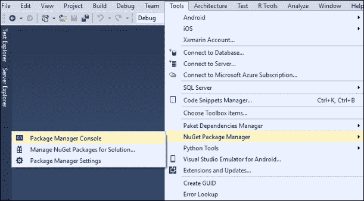

在控制台中输入以下行：

```py
PM> install-package MathNet.Numerics

```

你将看到包安装成功：

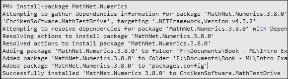

关闭包管理器控制台以及当你安装 Math.NET 时打开的 `readme.txt` 文件。在未来的操作中，我将假设你知道如何打开并输入命令来安装 NuGet 包。

## 回归尝试 1

在脚本文件中，创建我们在手写脚本中看到的相同输入，并计算 *x* 和 *y* 的平均值：

```py
let input = [|1,1.;2,2.;3,2.25;4,4.75;5,5.|]

let x = input |> Array.map(fun (x,y) -> float x)
let y = input |> Array.map(fun (x,y) -> y) 
let mX = Array.average x
let mY = Array.average y 
```

以下是将给出的输出：

```py
val input : (int * float) [] =
 [|(1, 1.0); (2, 2.0); (3, 2.25); (4, 4.75); (5, 5.0)|]
val x : float [] = [|1.0; 2.0; 3.0; 4.0; 5.0|]
val y : float [] = [|1.0; 2.0; 2.25; 4.75; 5.0|]
val mX : float = 3.0
val mY : float = 3.0

```

然后，指向与 nugget 包一起安装的 Math.NET 库，并添加对其的引用：

```py
#r "../packages/MathNet.Numerics.3.8.0/lib/net40/MathNet.Numerics.dll"
open MathNet.Numerics.Statistics
```

接下来，使用 Math.Net 来计算 *x* 和 *y* 的标准差：

```py
let sX = ArrayStatistics.StandardDeviation x
let sY = ArrayStatistics.StandardDeviation y
```

前面的代码语句将给出：

```py
val sX : float = 1.58113883
val sY : float = 1.7765838

```

最后，使用 Math.Net 来计算 `r`：

```py
let r = Correlation.Pearson (x,y)
```

以下将是输出：

```py
val r : float = 0.9567374429

```

现在，你可以计算回归：

```py
let b = r*(sY/sX)
let A = mY - b*mX
```

在输出中，你将得到以下内容：

```py
val b : float = 1.075
val A : float = -0.225

```

在脚本中，我想要指出一个新事物。你不得不输入：

```py
#r "../packages/MathNet.Numerics.3.8.0/lib/net40/MathNet.Numerics.dll"
open MathNet.Numerics.Statistics
```

`#r` 代表引用，并将 FSI 指向文件系统以定位我们想要使用的程序集。FSI 在安装了非常少的库的情况下加载，所以你通常需要添加你需要的引用。注意文件路径前缀的 `".."` 简写，这是一个相对定位器，它转换成解决方案位置。

`open` 命令告诉 FSI 打开我们在上一行中指向的 `.dll` 文件。这和在 C# 中的 `using`、在 VB.NET 中的 `Imports` 以及在 R 中的 `library` 相同。

因此，这是一个比手工计算简单线性回归的成分要简单得多的方法。但是等等，还有更多。

## 回归尝试 2

Math.NET 使得在不深入组件的情况下计算回归变得更加容易。在脚本中输入以下代码：

```py
open MathNet.Numerics
let fit = Fit.Line(x,y)
let i = fst fit
let s = snd fit
```

你将得到以下输出：

```py
val fit : float * float = (-0.225, 1.075)
val i : float = -0.225
val s : float = 1.075

```

`Math.Numerics` 已经通过 `Fit()` 函数提供了回归功能。`Fit()` 接收两个数组（在我们的例子中是 *x* 和 *y*）并返回一个元组。元组的第一个元素是截距，第二个是斜率。我在这里引入的唯一新代码是 `fst` 和 `snd` 操作符。这些是长度为二的元组的简写表示法。在元组上调用 `fst` 返回第一个元素，而 `snd` 返回第二个。如果你在包含多于两个元素的元组上调用 `fst` 和 `snd`，你将得到一个类型不匹配的编译器错误。

# Accord.NET

在 Math.NET 为我们做所有重活的情况下，我们有一种更好的方法来得到简单线性回归的结果。然而，我想讨论另一种方法，Accord.NET。打开 NuGet 包管理器并安装以下三个包：

+   Accord

+   Accord.Statistics

+   FSharp.Data

注意，当你安装 FSharp.Data 时，你会得到一个弹出窗口：

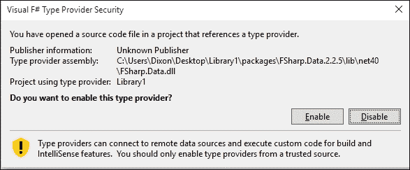

点击**启用**。

## 回归

在脚本文件中，输入以下代码行：

```py
#r "../packages/Accord.3.0.2/lib/net40/Accord.dll"
#r "../packages/Accord.Statistics.3.0.2/lib/net40/Accord.Statistics.dll"
#r "../packages/Accord.Math.3.0.2/lib/net40/Accord.Math.dll"

open Accord
open Accord.Statistics.Models.Regression.Linear

let input = [|1,1.;2,2.;3,2.25;4,4.75;5,5.|]
let x = input |> Array.map (fun (x,y) -> float x)
let y = input |> Array.map (fun (x,y) -> y) let regression = SimpleLinearRegression()
let sse = regression.Regress(x,y)
let intercept = regression.Intercept
let slope = regression.Slope
let mse = sse/float x.Length 
let rmse = sqrt mse
let r2 = regression.CoefficientOfDetermination(x,y)
```

当你将此发送到 REPL 时，你会看到以下代码：

```py
val input : (int * float) [] =
 [|(1, 1.0); (2, 2.0); (3, 2.25); (4, 4.75); (5, 5.0)|]
val x : float [] = [|1.0; 2.0; 3.0; 4.0; 5.0|]
val y : float [] = [|1.0; 2.0; 2.25; 4.75; 5.0|]
val regression : SimpleLinearRegression = y(x) = 1.075x + -0.224999999999998
val sse : float = 1.06875
val intercept : float = -0.225
val slope : float = 1.075
val mse : float = 0.21375
val rmse : float = 0.4623310502
val r2 : float = 0.9153465347

```

你在这里看到的是与之前完全相同的计算，只是这次公式被友好地打印出来了（我已经将它四舍五入到小数点后三位）：

```py
y(x) = 1.075x + -0.225
```

## 使用 RMSE 进行回归评估

Accord.NET 比 Math.NET 的`Fit()`方法更出色，因为它返回平方误差之和以及确定系数（称为 r 平方）。在这种情况下，平方误差之和是`1.06875`，r 平方是`0.915`（四舍五入到小数点后三位）。这很好，因为我们现在有了两个关键信息：

+   一个预测模型

+   一些方法可以帮助我们评估模型在预测方面的好坏

在机器学习中，仅仅实现一个模型并得到一些答案是不够的。我们还需要能够说话，知道我们的答案实际上有多好。**平方和误差**，通常称为**SSE**，是评估简单线性回归的常见方法。为了开始思考 SSE，我们需要知道每个*y*所用的两块信息——我们猜测的是什么，实际值是什么。使用我们现有的数据集：

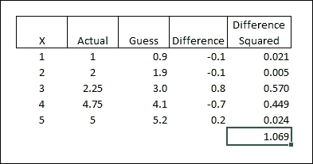

你可以看到模型是基于所有的*y*数据点创建的，然后 Accord.NET 回过头来检查该模型如何接近每个数据点。这些差异被平方，然后平方值被求和。目标是使平方和尽可能低。一旦我们有了 SSE，我们就可以改变我们的模型以尝试使平方和更低。例如，如果我们把斜率从`1.075x`改为`1.000x`，这是我们之前用眼睛估计的？

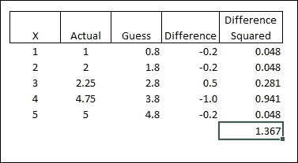

由于我们已经有用于初始模型计算的五个数据点，因此通过手动更改这种方式来改进模型是不可能的。原始回归是描述这五个数据点之间关系的最佳方式。重要的是要注意，SSE 是一个无上下文测度。这意味着 1.069 本身并没有任何价值。我们只知道 1.069 比 1.367 好。基本上，我们希望 SSE 尽可能低。

SSE 的一个稍微更好的变体是**均方误差**（**MSE**）。MSE 是 SSE 除以回归的观测数：

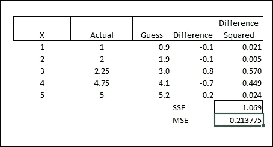

在这种情况下，均方误差（MSE）是`0.2138`。像 MSE 一样，这个数字本身并不特别有用。然而，如果我们取 MSE 的平方根，通常称为**均方根误差**（RMSE），结果是一个与原始数字相同单位的误差度量。

```py
RMSE = Square Root of MSE = sqrt(.2137) = .462
```

在我们的案例中，RMSE 是`0.462`，这意味着任何给定的猜测都可能偏离 0.46。当你下次在鸡尾酒会上与其他数据科学家交谈时（你真的会与数据科学家参加鸡尾酒会，不是吗？），你通常会使用 RMSE 来评估简单线性模型的预测能力。

使用 RMSE，我们现在有一个度量，可以衡量我们的模型在预测值时的准确性。我们还有一个第二个度量，称为 r2，它计算我们的模型有多少相关性。r2 将 r（在这种情况下，皮尔逊相关）平方。r2 总是在零和一之间，零表示*x*和*y*之间没有相关性，一表示回归线完美地拟合数据。在实践中，我们希望尽可能低的 RMSE 和尽可能高的 r2。

## 回归与现实世界

到目前为止，我们实际上并没有进行任何机器学习，因为我们无法使我们的模型变得更好。最初的回归是最好的，解释了 91.5%的数据。然而，世界并不总是以这种方式运作。

挑战在于我们将开始在一个代表人类活动（在我们的案例中，是 AdventureWorks 的销售数据）的数据集上应用简单的线性回归，而人类活动充满了不确定性。考虑一个更现实的数据框，其中包含产品、其列表价格和其客户评价：

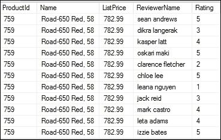

注意到评分似乎有一些很大的差异。一些客户给自行车打了 5 分，而另一些客户只给了 1 分或 2 分。你会认为对于同一产品，平均评价应该是相当相似的。也许我们有一个制造质量的问题，或者也许价格如此之高，低端客户期望从他们认为是昂贵的自行车中获得更多，而高端客户对从他们认为是低成本自行车中获得的价值感到非常满意。现在我们可以开始构建我们的模型了吗？是的！让我们从 AdventureWorks 的数据开始，看看它如何与使用 Accord.NET 的初始模型相匹配。

## 对实际数据的回归

由于这是我们第一次使用 AdventureWorks，我们需要处理一些日常维护事项。我们将使用位于 [`msftdbprodsamples.codeplex.com/releases/view/125550`](https://msftdbprodsamples.codeplex.com/releases/view/125550) 的 AdventureWorks 2014 完整数据库。如果你想将数据本地化，你可以通过从他们的网站恢复 `.bak` 文件来实现。如果你选择这条路，请注意，我为本章的 `Production.ProductReview` 表添加了一些额外的数据。在安装数据库后，你需要运行本章 GitHub 存储库中找到的 `populateProductReview.sql` 脚本来匹配书中的示例。此外，你将需要生成你自己的连接字符串。如果你只想在我们的服务器上使用数据，你可以使用即将到来的代码示例中的连接字符串。

你可能会想，我把连接字符串这样公开在公共领域，我一定是疯了。首先，不要告诉任何人你有它。其次，如果幸运的话，成千上万的人购买这本书，他们都会对这个服务器进行操作以执行示例，我会很高兴为微软支付更多的$$来获取计算时间。

在 Visual Studio 中，向你的项目添加一个新的脚本，并将其命名为 `AccordDotNet2.fsx`。然后，添加以下引用并打开脚本文件：

```py
#r "System.Transactions.dll"
#r "../packages/Accord.3.0.2/lib/net40/Accord.dll"
#r "../packages/Accord.Statistics.3.0.2/lib/net40/Accord.Statistics.dll"
#r "../packages/Accord.Math.3.0.2/lib/net40/Accord.Math.dll"
#r "../packages/FSharp.Data.2.2.5/lib/net40/FSharp.Data.dll"

open Accord
open Accord.Statistics
open Accord.Statistics.Models.Regression.Linear

open System
open System.Data.SqlClient
```

接下来，添加一个记录类型、该记录类型的列表、一个连接字符串和一个查询：

```py
type ProductReview = {ProductID:int; TotalOrders:float; AvgReviews:float}

let reviews = ResizeArray<ProductReview>()

[<Literal>]
let connectionString = "data source=nc54a9m5kk.database.windows.net;initial catalog=AdventureWorks2014;user id=chickenskills@nc54a9m5kk;password=sk1lzm@tter;"

[<Literal>]
let query = "Select 
                A.ProductID, TotalOrders, AvgReviews
                From
                (Select 
                ProductID,
                Sum(OrderQty) as TotalOrders
                from [Sales].[SalesOrderDetail] as SOD
                inner join [Sales].[SalesOrderHeader] as SOH
                on SOD.SalesOrderID = SOH.SalesOrderID
                inner join [Sales].[Customer] as C
                on SOH.CustomerID = C.CustomerID
                Where C.StoreID is not null
                Group By ProductID) as A
                Inner Join 
                (Select
                ProductID,
                (Sum(Rating) + 0.0) / (Count(ProductID) + 0.0) as AvgReviews
                from [Production].[ProductReview] as PR
                Group By ProductID) as B
                on A.ProductID = B.ProductID"
```

这里有三个新的语言特性。第一个是一个名为 `ProductReview` 的记录类型。记录类型是不可变的命名数据结构，与无名的元组形成对比。你可以将记录类型想象成在 VB.NET/C# 世界中可能遇到的不可变的 DTO/POCO。`ProductReview` 有三个成员：`ProductId`、`TotalOrders` 和 `AvgReviews`。你可以将这些成员想象成 C#/VB.NET 世界中 POCO 的属性。

第二个新的语言特性是添加到 `connectionString` 和查询值上的属性。大多数 .NET 开发者对属性都很熟悉，所以你应该会舒服地使用它们。通过将 `connectionString` 和查询字面量，我可以将它们传递到脚本文件中的类型提供者。

最后，我们将使用 `ResizeArray` 数据类型来保持我们的产品评论 `seq`。因为数组在 F# 中是不可变的，而我们不知道将从数据库中获取多少条评论，所以我们需要使用一个允许调整大小的特殊数组。这相当于你在 C#/VB.NET 代码中可能熟悉的 `System.Collections.Generic.List<>`。

接下来，添加一些 ADO.Net 代码从数据库中提取数据并将其放入列表中：

```py
let connection = new SqlConnection(connectionString)
let command = new SqlCommand(query,connection)
connection.Open()
let reader = command.ExecuteReader()
while reader.Read() do
    reviews.Add({ProductID=reader.GetInt32(0);TotalOrders=(float)(reader.GetInt32(1));AvgReviews=(float)(reader.GetDecimal(2))})
```

这段代码对大多数 .Net 开发者来说应该是熟悉的。将其发送到 REPL，我们可以看到：

```py
type ProductReview =
 {ProductID: int;
 TotalOrders: float;
 AvgReviews: float;}
val reviews : System.Collections.Generic.List<ProductReview>
val connectionString : string =
 "data source=nc54a9m5kk.database.windows.net;initial catalog=A"+[72 chars]
val query : string =
 "Select 
 A.ProductID, AvgOrders, AvgReviews
 "+[814 chars]
val connection : System.Data.SqlClient.SqlConnection =
 System.Data.SqlClient.SqlConnection
val command : System.Data.SqlClient.SqlCommand =
 System.Data.SqlClient.SqlCommand
val reader : System.Data.SqlClient.SqlDataReader
val it : unit = ()

```

随着数据的下降，让我们看看我们的模型是否反映了经理在“power bi”图表中注意到的：

```py
let x = reviews |> Seq.map (fun pr -> pr.AvgReviews) |> Seq.toArray
let y = reviews |> Seq.map (fun pr -> pr.TotalOrders) |> Seq.toArray
let regression = SimpleLinearRegression()
let sse = regression.Regress(x,y)
let mse = sse/float x.Length 
let rmse = sqrt mse
let r2 = regression.CoefficientOfDetermination(x,y)
```

你将看到以下内容：

```py
val regression : SimpleLinearRegression =
 y(x) = 1277.89025884053x + -4092.62506538369
val sse : float = 39480886.74
val mse : float = 203509.7254
val rmse : float = 451.1205221
val r2 : float = 0.2923784167

```

我们现在看到 `0.29 r2` 和 `451 rmse`，这表明客户评价和订单数量之间存在弱关系，并且存在 450 个订单的误差范围。

另一点是，简单的线性回归往往会对异常值有问题。我们将在下一章详细讨论这个话题。此外，通过一次性的分析，我们遇到了过拟合的大问题。我们将在第八章中广泛讨论过拟合问题，*特征选择和优化*。目前，我只是想承认，尽管我们有一个相当不错的模型，但它远非完美。然而，它仍然比仅凭肉眼观察图表要好，并且它确实具有一定的统计有效性。我们现在有一个模型，可以预测一些销售。我们如何将这个模型投入生产？

# AdventureWorks 应用程序

我们将首先思考如何防止用户因为低产品评价而放弃订单。一个选择是完全删除评价。虽然这可以防止人们因为低评分而取消订单的不利影响，但它也阻止了人们基于高评分购买商品的有利影响。我们也可以隐藏低分商品的评分，但这很容易被识破。另一种可能性是降低低评分产品的价格，但降低价格对大多数公司来说都是不可接受的。也许更好的方法是让我们的网站了解低评分产品，并通过预先填写大多数人针对该评价的订单数量来激励人们订购。消费者行为学家已经证明，如果你预先填写数量，消费者放弃购买的可能性就会降低。

## 设置环境

在此 uri 从 GitHub 获取 AdventureWorks UI 的副本。接下来，使用 Visual Studio 2015 打开该副本。

现在，请按照以下步骤操作，这将指导您设置环境：

1.  让我们进入我们的 **解决方案资源管理器** 并添加一个 F# 项目（**文件** | **新建项目**）。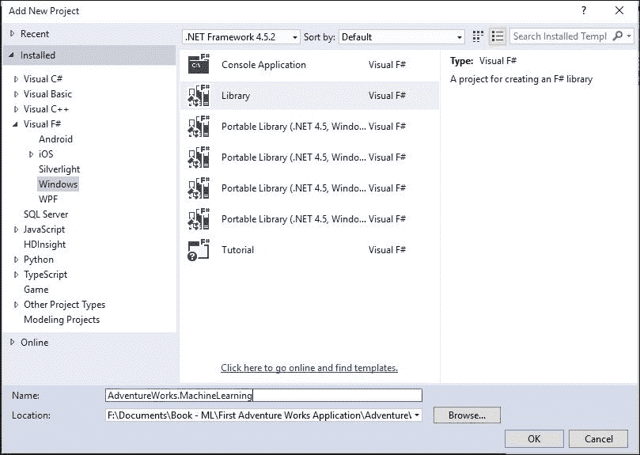

1.  删除脚本文件并将 `Library1.fs` 重命名为 `OrderPrediction.fs`。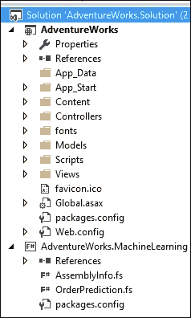

1.  打开 NuGet 包管理器并将 Accord.NET 安装到 F# 项目中：

    ```py
    PM> install-package Accord
    PM> install-package Accord.Statistics

    ```

1.  确保默认项目是 `AdventureWorks.MachineLearning`：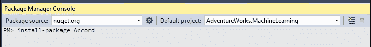

1.  打开 `OrderPrediction.fs` 并将 `Class1` 重命名为 `OrderPrediction`。

    ```py
    namespace AdventureWorks.MachineLearning

    type OrderPrediction() = 
        member this.X = "F#"
    ```

1.  然后，将 `X` 重命名为 `PredictQuantity`，它有一个整数参数 `ProductId` 和一个返回值 float。目前让它为 `0.0`。将其类型设为公共。

    ```py
    namespace AdventureWorks.MachineLearning

    type public OrderPrediction() = 
        member this.PredictQuantity(productId:int) = 0.0
    ```

1.  编译 F# 项目。

## 更新现有 Web 项目

接下来，转到 **解决方案资源管理器** 中的 C# 项目并添加对 F# 项目的引用：

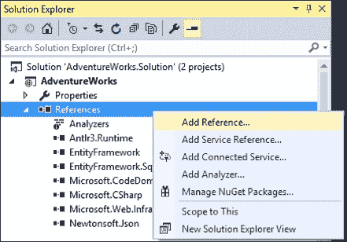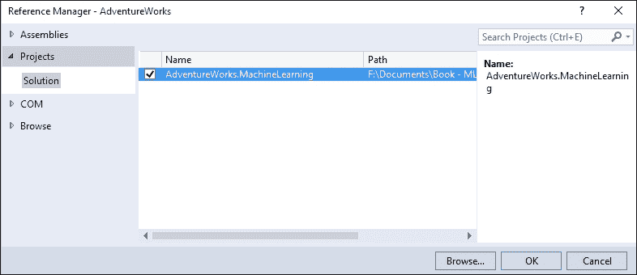

进入`PurchaseOrderDetailsController.cs`并在`AdventureWorks.MachineLearning`中添加一个`using`语句：

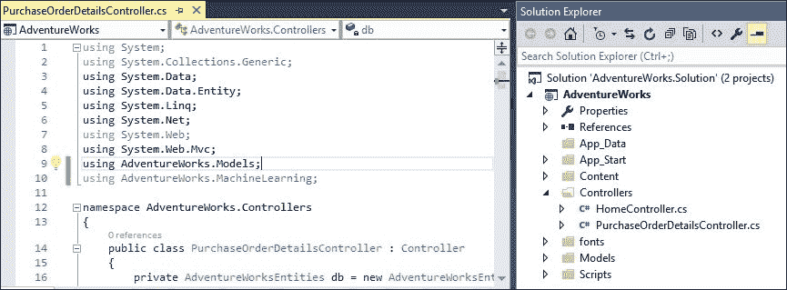

接下来，创建一个可以接收`productId`并预测订单数量的端点：

```py
        // GET: PurchaseOrderDetails/PredictQuantity/1
        public Int32 PredictQuantity(int id)
        {
            var orderPrediction = new OrderPrediction();
            return (Int32)orderPrediction.PredictQuantity(id);
        }
```

对不起，这只是一个 RPC 而不是非常 RESTful。这个练习的目的是关于机器学习而不是 Web 开发。如果你想重写，这是一个更符合 MVC 习惯的形式，请随意。

在设置好控制器后，跳转到创建视图：

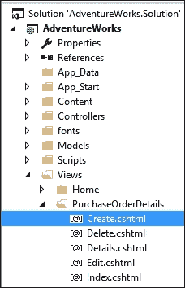

在页面的`@section Scripts`块底部添加以下 JavaScript：

```py
@section Scripts {
    @Scripts.Render("~/bundles/jqueryval")
<script type="text/javascript">
        $(document).ready(function(){
            $("#ProductID").change(function(){
                var productID = $(this).val();
                $.get("/PurchaseOrderDetails/PredictQuantity/" + productID, function(result){
                    $("#OrderQty").val(result);
                });
            });
        });
</script>
}
```

在设置好这些之后，你应该能够运行项目，并在从下拉列表中选择新产品后，订单数量应该填充为`0.0`。

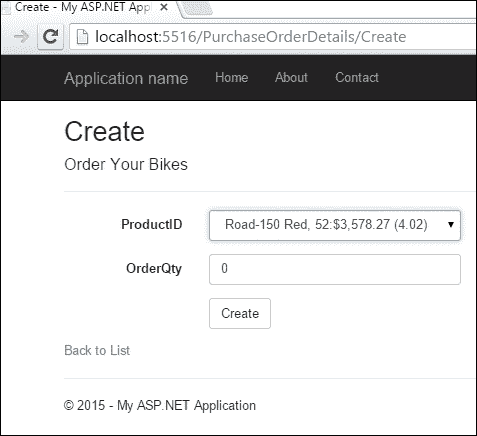

## 实现回归

在应用程序连接好之后，让我们回到 F#项目并实现真正的预测。首先，确保你有`System.Data`的引用。

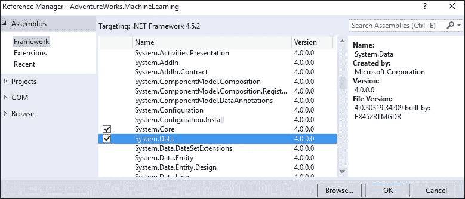

接下来，打开`OrderPrediction.fs`并在以下代码中输入：

### 小贴士

由于这几乎是直接从 REPL 项目复制粘贴的，如果你想避免一些输入，你可以继续这样做。

```py
namespace AdventureWorks.MachineLearning

open Accord
open Accord.Statistics
open Accord.Statistics.Models.Regression.Linear

open System
open System.Data.SqlClient
open System.Collections.Generic

type internal ProductReview = {ProductID:int; TotalOrders:float; AvgReviews: float}

type public OrderPrediction () = 
    let reviews = List<ProductReview>()

    [<Literal>]
    let connectionString = "data source=nc54a9m5kk.database.windows.net;initial catalog=AdventureWorks2014;user id=chickenskills@nc54a9m5kk;password=sk1lzm@tter;"

    [<Literal>]
    let query = "Select 
                A.ProductID, TotalOrders, AvgReviews
                From
                (Select 
                ProductID,
                Sum(OrderQty) as TotalOrders
                from [Sales].[SalesOrderDetail] as SOD
                inner join [Sales].[SalesOrderHeader] as SOH
                on SOD.SalesOrderID = SOH.SalesOrderID
                inner join [Sales].[Customer] as C
                on SOH.CustomerID = C.CustomerID
                Where C.StoreID is not null
                Group By ProductID) as A
                Inner Join 
                (Select
                ProductID,
                (Sum(Rating) + 0.0) / (Count(ProductID) + 0.0) as AvgReviews
                from [Production].[ProductReview] as PR
                Group By ProductID) as B
                on A.ProductID = B.ProductID"

    member this.PredictQuantity(productId:int) = 
        use connection = new SqlConnection(connectionString)
        use command = new SqlCommand(query,connection)
        connection.Open()
        use reader = command.ExecuteReader()
        while reader.Read() do
            reviews.Add({ProductID=reader.GetInt32(0);TotalOrders=(float)(reader.GetInt32(1));AvgReviews=(float)(reader.GetDecimal(2))})

        let x = reviews |> Seq.map (fun pr -> pr.AvgReviews) |> Seq.toArray
        let y = reviews |> Seq.map (fun pr -> pr.TotalOrders) |> Seq.toArray
        let regression = SimpleLinearRegression()
        let sse = regression.Regress(x,y)
        let mse = sse/float x.Length 
        let rmse = sqrt mse
        let r2 = regression.CoefficientOfDetermination(x,y)

        let review = reviews |> Seq.find (fun r -> r.ProductID = productId)
        regression.Compute(review.AvgReviews)
```

与 REPL 代码相比，唯一的改变是现在`connection`、`command`和`reader`使用`use`关键字而不是`let`进行赋值。这相当于 C#中的`using`语句，以便以最有效的方式清理所有资源。

在此基础上，你可以运行 UI 并看到从使用我们所有数据的回归中预测的实际值：

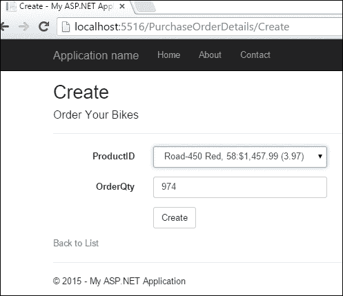

恭喜！你已经成功地将一个具有简单线性回归的网站连接起来。这个预测是动态的，因为回归是在每次页面刷新时计算的。这意味着随着更多数据进入我们的数据库，网站会实时反映产品评论的变化。你应该意识到，作为软件架构师的你应该拉响警报，因为这将对性能产生严重影响；我们在每次调用时都会拉取汇总数据然后进行回归计算。我们将在本书的后面讨论更好的策略，这些策略允许我们的网站具有与机器学习算法相匹配的实时或近实时性能。

# 摘要

本章让我们初步涉足创建机器学习模型并在业务应用程序中实现这些模型。我们省略了许多事情，这可能会让所有数据科学爱好者感到不满，比如我简化后的回归公式、过拟合以及在使用回归时没有处理异常值。此外，房间里的 Web 开发者也有很多可以抱怨的地方，包括我基础薄弱的网站设计和在页面加载时注入数据密集型操作。不用担心。我们将在接下来的章节中解决这些问题（以及更多）。
