# 第一章：机器学习概述

近年来，人工智能（AI）和机器学习在学术界和工业界都得到了复兴，尤其是机器学习。在过去十年中，人工智能取得了显著的成就，这些成就超越了该领域最初承诺以来在中间几年中从业者所取得的成就。

这些成功在很大程度上得益于处理日益增长的大量数据的迫切需求、深度学习领域研究人员不懈努力的关键算法进步，以及摩尔定律推动的原始计算能力的不断增长。在人工智能领域引领复苏的各个领域中，机器学习取得了显著的发展，并在众多领域找到了最广泛的应用。机器学习在帮助最高层级的商业复杂决策中的应用，以及它在提高如今已成为日常应用的准确性（如搜索、语音识别和手机上的个人助理）方面的巨大成功，使得其影响在家庭客厅和会议室中变得司空见惯。如今，不仅可以在科普科技媒体中找到对深度学习力量的狂热赞扬文章，还可以在主流媒体如《纽约时报》和《赫芬顿邮报》等地方找到。机器学习确实在相对较短的时间内变得无处不在。

一个普通的用户在日常活动中以多种方式遇到机器学习。大多数电子邮件服务提供商，包括雅虎和 Gmail，都为用户提供了自动将电子邮件分类到诸如垃圾邮件、垃圾邮件、促销等标题中的功能，这是通过文本挖掘（机器学习的一个分支）实现的。当在电子商务网站如[`www.amazon.com/`](https://www.amazon.com/)上在线购物或从内容提供商如 Netflix 观看电影时，用户会收到所谓的推荐系统提供的其他产品和内容推荐，这是机器学习的另一个分支，作为一种有效的方式留住客户。

预测天气、估算房地产价格、预测选民投票率，甚至预测选举结果——所有这些都可以说是使用某种形式的机器学习来窥视未来。

随着数据量的不断增长以及能够通过学习这些数据来丰富我们生活的系统的承诺，对数据科学领域有限的专业人员技能的需求也在不断增长。这种需求对于在更流行的语言（如 Java、Python、R 和越来越流行的 Scala）中熟悉机器学习技术的受过良好训练的专家来说尤其迫切。幸运的是，多亏了开源社区中的数千名贡献者，这些语言都有丰富且快速增长的库、框架和教程集，使得最前沿的技术对任何有互联网连接和电脑的人来说都触手可及，这在很大程度上得益于 Java。Java 是这种工具和技术传播的重要载体，尤其是在大规模机器学习项目中，这得益于其在企业级部署中的成熟度和稳定性，以及可移植的 JVM 平台，更不用说多年来采用它的专业程序员大军了。因此，掌握今天劳动力中如此缺乏的技能将使任何有志于进入该领域的专业人士在市场上处于明显的优势地位。

也许你已经在你的专业工作中应用了机器学习技术，或者你可能只是对这个主题有业余爱好者的兴趣。如果你正在阅读这篇文章，很可能你已经能够轻松地将 Java 应用于你的意愿，但现在你感觉你准备好深入挖掘并学习如何在你的下一个数据科学项目中使用最好的开源 ML Java 框架。如果你确实是这样，那么这本书中的章节设计来做到这一切以及更多是多么幸运！

掌握一门学科，尤其是像机器学习这样具有明显应用性的学科，不仅需要理解其核心概念和熟悉其数学基础，还需要更多。与该主题的入门级处理不同，一本声称帮助你掌握该主题的书必须非常关注实践方面，同时介绍更多高级主题，这些主题可能会超出入门材料的范围。在我们开始磨练我们的技能之前，我们将用这一章来快速回顾我们已经知道的内容。对于有志于充分利用这本书的初学者（即使他们对这个主题几乎没有或没有先前的接触，但仍然决心从中获得最大利益），这是我们的建议：确保你不跳过本章的其余部分；相反，将其用作跳板，更深入地探索不熟悉的概念。如有必要，寻求外部资源。查阅维基百科。然后立即回到学习上来。

在本章的剩余部分，我们将回顾以下内容：

+   历史与定义

+   什么是非机器学习？

+   概念与术语

+   机器学习的重要分支

+   机器学习中的不同数据类型

+   机器学习的应用

+   机器学习面临的问题

+   大多数机器学习项目中使用的元过程

+   本书将使用的一些知名工具、API 和资源的详细信息

# 机器学习 - 历史与定义

给出一个确切的历史很难，但我们今天使用的机器学习的定义最早可以追溯到 19 世纪 60 年代。在雷内·笛卡尔的《方法谈》中，他提到了*自动机*并说：

> 因为我们可以很容易地理解一个机器的构成，使其能够说出话语，甚至对它施加的某些物理动作做出响应，从而改变其器官；例如，如果触摸特定部位，它可能会问我们想对它说什么；如果在另一个部位，它可能会惊呼它受伤了，等等。

### 注意

[`www.earlymoderntexts.com/assets/pdfs/descartes1637.pdf`](http://www.earlymoderntexts.com/assets/pdfs/descartes1637.pdf)

[`www.marxists.org/reference/archive/descartes/1635/discourse-method.htm`](https://www.marxists.org/reference/archive/descartes/1635/discourse-method.htm)

阿兰·图灵在他的著名出版物《计算机器与智能》中，通过提出“机器能思考吗？”的问题，对机器学习的目标提供了基本见解。

### 注意

[`csmt.uchicago.edu/annotations/turing.htm`](http://csmt.uchicago.edu/annotations/turing.htm)

[`www.csee.umbc.edu/courses/471/papers/turing.pdf`](http://www.csee.umbc.edu/courses/471/papers/turing.pdf)

阿瑟·塞缪尔在 1959 年写道："机器学习是研究计算机在没有明确编程的情况下获得学习能力的一个领域。"。

近期，汤姆·米切尔给出了机器学习的更精确定义：*"如果一个计算机程序在任务 T 上，通过性能指标 P，从经验 E 中学习，那么它的性能随着经验 E 的提高而提高。"*

机器学习与多个领域有关：

+   **统计学**: 它使用数据抽样、估计、假设检验、学习理论和基于统计的建模等元素，仅举几个例子。

+   **算法与计算**: 它使用了来自基础计算机科学的基本概念，如搜索、遍历、并行化、分布式计算等。

+   **数据库与知识发现**: 由于其能够以各种格式存储、检索和访问信息的能力。

+   **模式识别**: 由于其能够从数据中找到有趣的模式以进行探索、可视化和预测的能力。

+   **人工智能**: 虽然它被认为是人工智能的一个分支，但它也与其他分支有关，例如启发式、优化、进化计算等。

# 什么是机器学习？

认识到与机器学习有关但本身不能被视为机器学习一部分的领域很重要。某些学科可能在一定程度上重叠，但机器学习的基本原理是相当独特的：

+   **商业智能（BI）和报告**：报告**关键绩效指标**（**KPIs**），查询 OLAP 进行切片、切块和深入数据，仪表板等，这些都是 BI 的核心组件，并不等同于机器学习。

+   **存储和 ETL**：数据存储和 ETL 是任何机器学习过程中的关键元素，但它们本身并不等同于机器学习。

+   **信息检索、搜索和查询**：根据搜索标准或索引检索数据或文档的能力，这是信息检索的基础，并不真正等同于机器学习。许多形式的机器学习，如半监督学习，可以依赖于相似数据的搜索来进行建模，但这并不将搜索视为机器学习。

+   **知识表示和推理**：为了执行复杂任务（如本体、专家系统和语义网）而表示知识并不等同于机器学习。

# 机器学习——概念和术语

在本节中，我们将描述在机器学习中通常使用的不同概念和术语：

+   **数据或数据集**：机器学习的基础在于理解数据。数据或数据集通常指用于机器学习的结构化或非结构化格式的可用内容。结构化数据集具有特定的格式，非结构化数据集通常以某种自由流动的文本形式存在。数据可以以各种存储类型或格式存在。在结构化数据中，每个被称为实例、示例或行的元素都遵循预定义的结构。数据还可以按大小分类：小型或中型数据有几百到几千个实例，而**大数据**指的是大量数据，通常在数百万或数十亿，无法使用常见设备存储或访问，也无法适应这些设备的内存。

+   **特征、属性、变量或维度**：在结构化数据集中，如前所述，存在具有自身语义和数据类型的预定义元素，这些元素被统称为特征、属性、指标、指标、变量或维度。

+   **数据类型**：在许多机器学习算法或技术中，之前定义的特征需要某种形式的类型化。最常用的数据类型如下：

    +   **分类或名义**：这表示数据集中存在的定义良好的类别或值。例如，眼睛颜色——黑色、蓝色、棕色、绿色、灰色；文档内容类型——文本、图像、视频。

    +   **连续或数值**：这表示数据字段具有数值性质。例如，通过浴室秤测量的一个人的体重，传感器测量的温度读数，或信用卡账户的月美元余额。

    +   **有序**：这表示数据可以按某种方式排序。例如，服装尺寸——小号、中号、大号；拳击重量级别：重量级、轻重量级、中量级、轻量级和雏量级。

+   **目标或标签**：数据集中用于从训练数据中学习并在未见数据集中预测的特征或特征集，被称为目标或标签。在某些领域也使用“地面真实”这个术语。标签可以具有之前指定的任何形式，即分类的、连续的或序数的。

+   **机器学习模型**：每个机器学习算法，基于从数据集中学习到的内容，保持其学习状态以预测或对未来或未见数据提供见解，这被称为机器学习模型。

+   **抽样**：数据抽样是机器学习中的一个基本步骤。抽样意味着从总体中选择一个子集的例子，目的是将（较小的）样本中观察到的行为视为（较大的）总体行为的代表。为了使样本能够代表总体，必须小心选择样本的方式。通常，总体由在问题域中具有感兴趣属性的所有对象组成，例如，所有有资格参加大选的人，或未来四年内所有潜在的汽车拥有者。由于通常收集总体中所有对象的资料是不切实际的（或不可能的），因此选择一个合适的子集用于分析。抽样过程中的一个关键考虑因素是样本相对于总体是无偏的。以下是基于概率的抽样类型：

    +   **均匀随机抽样**：这指的是在均匀分布的总体上进行的抽样，即每个对象被选中的概率相等。

    +   **分层随机抽样**：这指的是当数据可以分类为多个类别时使用的抽样方法。在这种情况下，为了确保样本中代表所有类别，根据这些分类将总体划分为不同的层，并且每个层按其在总体中类别的比例进行抽样。当总体密度在类别之间变化时，分层抽样很常见，并且比较这些类别时需要具有相同的统计能力。当已知不同的群体以显著不同的方式投票时，政治民意调查通常涉及分层抽样。在随机样本中每个群体的不成比例的代表性可能导致民意调查结果出现重大误差。当我们控制人口统计学因素时，我们可以避免对其他群体过度抽样。

    +   **聚类抽样**：有时在研究的总体中存在自然群体，每个群体都代表了整个总体。一个例子是跨越许多地理区域的数据库。在聚类抽样中，你随机选择一组群体，然后从每个群体中随机抽取样本来构建完整的数据样本。这种抽样可以降低数据收集的成本，同时不会损害总体分布的保真度。

    +   **系统抽样**：当抽样框架（将有限集合的对象视为总体，并作为抽样数据来源，例如，按标题字母顺序排列的维基百科文章集合）中存在某种顺序时，会使用系统抽样或间隔抽样。如果样本是通过从随机对象开始，跳过常数*k*个对象后选择下一个对象来选择的，那么这种抽样称为系统抽样。*k*的值是总体与样本大小的比率。

+   **模型评估指标**：评估模型性能通常基于不同类型学习的不同评估指标。在分类中，通常基于准确率、**接收者操作特征**（**ROC**）曲线、训练速度、内存需求、假阳性比率等，仅举几例（见第二章，*实际应用监督学习*）。在聚类中，找到的聚类数量、凝聚力、分离度等形成了一般的指标（见第三章，*无监督机器学习技术*）。在基于流的学习中，除了前面提到的标准指标外，适应性、学习速度和对突发变化的鲁棒性是评估学习器性能的一些传统指标（见第五章，*实时流机器学习*）。

为了说明这些概念，给出了一个常见样本天气数据集的具体示例。数据给出了一组天气条件和标签，该标签指示主题是否决定在当天打网球：

```py
@relation weather

@attribute outlook {sunny, overcast, rainy}
@attribute temperature numeric
@attribute humidity numeric
@attribute windy {TRUE, FALSE}
@attribute play {yes, no}

@data
sunny,85,85,FALSE,no
sunny,80,90,TRUE,no
overcast,83,86,FALSE,yes
rainy,70,96,FALSE,yes
rainy,68,80,FALSE,yes
rainy,65,70,TRUE,no
overcast,64,65,TRUE,yes
sunny,72,95,FALSE,no
sunny,69,70,FALSE,yes
rainy,75,80,FALSE,yes
sunny,75,70,TRUE,yes
overcast,72,90,TRUE,yes
overcast,81,75,FALSE,yes
rainy,71,91,TRUE,no

```

数据集的格式是**ARFF**（**属性-关系文件格式**）文件。它由一个标题组成，提供有关特征或属性及其数据类型的信息，然后是数据标签之后的实际逗号分隔数据。数据集有五个特征，即`outlook`、`temperature`、`humidity`、`windy`和`play`。特征`outlook`和`windy`是分类特征，而`humidity`和`temperature`是连续的。特征`play`是目标，也是分类的。

# 机器学习 – 类型与亚型

现在我们将探讨机器学习的不同子类型或分支。尽管以下列表并不全面，但它涵盖了最知名的类型：

+   **监督学习**：这是机器学习中最受欢迎的分支，它涉及从标记数据中学习。如果标签的数据类型是分类的，它就变成了分类问题；如果是数字的，它就被称为回归问题。例如，如果使用数据集的目标是检测欺诈，欺诈具有真或假的分类值，我们处理的是一个分类问题。另一方面，如果目标是预测房屋的最佳上市价格，这是一个数值美元值，问题就是一个回归问题。下图展示了需要使用分类技术（如适合线性可分数据的逻辑回归）的标记数据，也就是说，当存在一条可以干净地分离两个类别的线时。对于可能线性可分的高维数据，人们谈论的是分离超平面：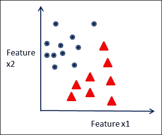

    线性可分数据

    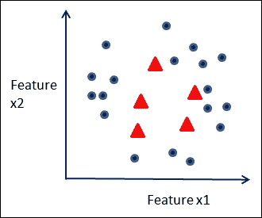

    一个不是线性可分的数据集的例子。

    这种类型的问题需要分类技术，例如支持向量机。

+   **无监督学习**：当没有给出标签时，理解数据并探索数据以构建机器学习模型被称为无监督学习。聚类、流形学习、异常值检测是这一主题下的技术，这些技术将在第三章《无监督机器学习技术》中详细讨论。需要无监督学习解决的问题有很多。根据购买行为对客户进行分组就是一个例子。在生物数据的情况下，可以使用无监督学习技术根据相似的基因表达值对组织样本进行聚类。

    下图展示了具有固有结构的数据，这些结构可以通过无监督学习技术，如 k-means，揭示为不同的聚类：

    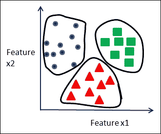

    数据中的聚类

    使用不同的技术来检测全局异常值——相对于整个数据集而言异常的例子，以及局部异常值——在其邻域中不匹配的例子。在下图中，为两个特征数据集展示了局部和全局异常值的概念：

    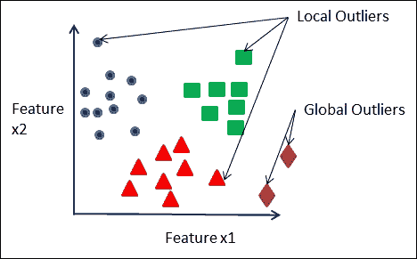

    局部和全局异常值

+   **半监督学习**：当数据集只有一些标记数据以及大量未标记数据时，从这样的数据集中进行学习被称为**半监督学习**。例如，在处理旨在检测欺诈的金融数据时，可能会有大量未标记数据，而只有少量已知的欺诈和非欺诈交易。在这种情况下，可以应用半监督学习。

+   **图挖掘**：挖掘表示为图结构的数据被称为**图挖掘**。它是社交网络分析以及不同生物信息学、网络挖掘和社区挖掘应用中的结构分析的基础。

+   **概率图建模和推理**：学习和利用以图模型表示的特征之间的条件依赖结构属于**概率图建模**的分支。贝叶斯网络和马尔可夫随机场是这类模型的两个类别。

+   **时间序列预测**：这是一种学习形式，其中数据具有明显的时序行为，并且与时间的关系被建模。一个常见的例子是在金融预测中，某个特定领域的股票表现可能是预测模型的目标。

+   **关联分析**：这是一种学习形式，其中数据以项集或购物篮的形式存在，并建立关联规则来探索和预测项目之间的关系。关联分析中的一个常见例子是学习客户在访问杂货店时购买的最常见项目之间的关系。

+   **强化学习**：这是一种学习形式，其中机器根据从环境中获得的奖励或惩罚形式的反馈来最大化性能。一个著名的例子是 AlphaGo，这是谷歌开发的一种机器，在 2016 年 3 月决定性地击败了世界围棋冠军李世石。使用奖励和惩罚方案，该模型首先在监督学习阶段对数百万个棋盘位置进行训练，然后在强化学习阶段自我对弈，最终变得足够好，能够战胜最佳人类选手。

    ### 注意

    [`www.theatlantic.com/technology/archive/2016/03/the-invisible-opponent/475611/`](http://www.theatlantic.com/technology/archive/2016/03/the-invisible-opponent/475611/)

    [`gogameguru.com/i/2016/03/deepmind-mastering-go.pdf`](https://gogameguru.com/i/2016/03/deepmind-mastering-go.pdf)

+   **流学习或增量学习**：以监督、无监督或半监督方式从实时或伪实时流数据中进行学习被称为流学习或增量学习。从不同类型的工业系统中学习传感器的行为以将其分类为正常和异常的应用需要实时反馈和实时检测。

# 机器学习中使用的数据集

要从数据中学习，我们必须能够理解和管理所有形式的数据。数据来源于许多不同的来源，因此，数据集在结构上可能差异很大，或者几乎没有结构。在本节中，我们以常见示例为依据，对数据集进行高级分类。

根据其结构或结构的缺失，数据集可以分为以下几种：

+   **结构化数据**：具有结构化数据的数据集更适合作为大多数机器学习算法的输入。数据以记录或行形式存在，遵循一个已知的格式，具有特征，这些特征可以是表格中的列或由分隔符或标记分隔的字段。记录或实例之间没有明确的关系。数据集主要在平面文件或关系数据库中可用。以下图所示的银行交易记录是一个结构化数据的例子：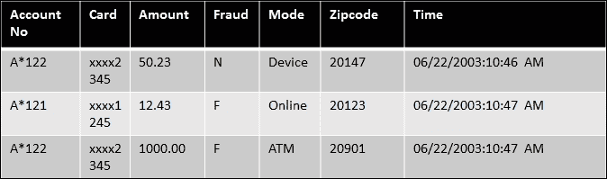

    带有欺诈标签的金融卡交易数据

+   **交易或市场数据**：这是一种特殊形式的结构化数据，其中每个条目对应一组项目。市场数据集的例子包括不同客户购买的杂货清单或客户观看的电影，如下表所示：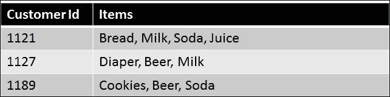

    来自杂货店的商品市场数据集

+   **非结构化数据**：非结构化数据通常不以已知的格式存在，与结构化数据不同。文本数据、图像数据和视频数据是非结构化数据的不同格式。通常，需要某种形式的转换来从这些数据形式中提取特征，以便将其转换为结构化数据集，从而应用传统的机器学习算法。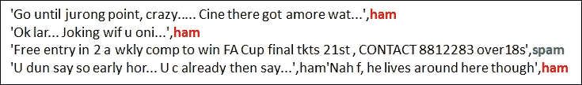

    样本文本数据，没有可识别的结构，因此是非结构化的。将垃圾邮件与正常消息（ham）区分开来是一个二元分类问题。在这里，通过它们的标签（每个数据实例中的第二个标记）区分真正的阳性（垃圾邮件）和真正的阴性（ham）。SMS 垃圾邮件收集数据集（UCI 机器学习库），来源：来自联邦大学圣卡洛斯分校的 Tiago A. Almeida。

+   **序列数据**：序列数据具有明确的“顺序”概念。这种顺序可以是时间序列数据中特征与时间变量之间的关系，或者是在基因组数据集中以某种形式重复的符号。序列数据的两个例子是天气数据和基因组序列数据。以下图显示了时间和传感器级别之间的关系：

    来自传感器数据的时间序列

    考虑了三个基因组序列，以展示这三个基因组序列中`CGGGT`和`TTGAAAGTGGTG`的重复情况：

    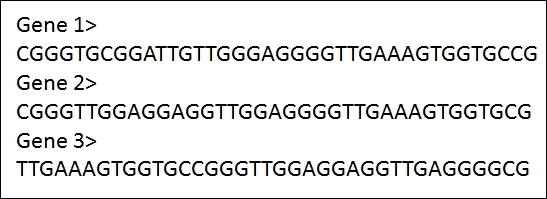

    DNA 的基因组序列作为符号序列。

+   **图数据**：图数据的特点是数据中实体之间存在关系，形成图结构。图数据集可以是结构化记录格式或非结构化格式。通常，图关系必须从数据集中挖掘出来。保险领域的索赔可以被认为是包含相关索赔细节的结构化记录，索赔人通过地址、电话号码等相关联。这可以看作是图结构。以万维网为例，我们有网页作为非结构化数据，包含链接，以及可以使用网页链接构建的网页之间的关系图，从而产生了今天最广泛挖掘的图数据集之一：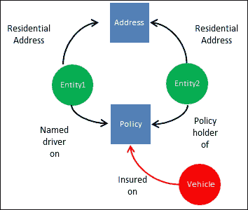

    将保险索赔数据转换为表示车辆、驾驶员、保单和地址之间关系的图结构

# 机器学习应用

由于机器学习在人类努力的不同领域的快速增长使用，任何试图列出在不同行业中使用的某些形式的机器学习的典型应用都必须是不完整的。尽管如此，在本节中，我们按领域和所采用的学习类型列出了一组广泛的机器学习应用：

| 领域/行业 | 应用 | 机器学习类型 |
| --- | --- | --- |
| 金融 | 信用风险评估、欺诈检测和反洗钱 | 监督学习、无监督学习、图模型、时间序列和流学习 |
| 网络 | 在线活动、健康监控和广告定位 | 监督学习、无监督学习和半监督学习 |
| 医疗保健 | 基于证据的医学、流行病学监控、药物事件预测和索赔欺诈检测 | 监督学习、无监督学习、图模型、时间序列和流学习 |
| **物联网（IoT**） | 网络安全、智能道路和传感器健康监控 | 监督学习、无监督学习、半监督学习和流学习 |
| 环境 | 天气预报、污染建模和水质量测量 | 时间序列、监督学习、无监督学习、半监督学习和流学习 |
| 零售 | 库存、客户管理和推荐、布局和预测 | 时间序列、监督学习、无监督学习、半监督学习和流学习 |

> *机器学习的应用*

# 机器学习中的实际问题

在处理需要机器学习的问题时，理解约束的性质和可能出现的次优条件是必要的。在接下来的章节讨论中，我们将解决这些问题性质、它们存在的影响以及处理它们的方法。在此，我们简要介绍我们面临的实际问题：

+   **数据质量和噪声**：缺失值、重复值、由于人为或仪器记录错误导致的错误值以及格式错误是在构建机器学习模型时需要考虑的一些重要问题。不处理数据质量可能导致模型错误或不完整。在下一章中，我们将强调这些问题以及一些通过数据清洗克服这些问题的策略。

+   **不平衡数据集**：在许多现实世界的数据集中，训练数据中的标签之间存在不平衡。这种数据集的不平衡会影响学习选择、算法选择、模型评估和验证过程。如果不采用正确的技术，模型可能会出现大的偏差，学习效果不佳。下一章将详细介绍各种使用元学习过程的技术，如成本敏感学习、集成学习、异常检测等，这些技术可以应用于这些情况。

+   **数据量、速度和可扩展性**：通常，大量数据以原始形式或高速实时流数据的形式存在。由于算法或硬件限制或两者的组合，从整个数据中学习变得不可行。为了将数据集的大小减少到适合可用资源，必须进行数据采样。采样可以通过多种方式进行，每种采样形式都会引入偏差。必须通过采用各种技术，如分层采样、变化样本大小和在不同集合上增加实验规模，来验证模型对样本偏差的适应性。使用大数据机器学习也可以克服数据量和采样偏差。

+   **过拟合**：预测模型的核心问题之一是模型泛化不足，被训练数据拟合得“太好”。这导致模型在应用于未见数据时表现不佳。后续章节中描述了各种克服这些问题的技术。

+   **维度诅咒**：在处理高维数据时，即具有大量特征的数据集，机器学习算法的可扩展性成为一个严重的问题。向数据添加更多特征的问题之一是它引入了稀疏性，即在特征空间的单位体积中平均数据点更少，除非特征数量的增加伴随着训练示例数量的指数级增加。这可能会损害许多方法，如基于距离的算法的性能。添加更多特征也可能降低学习者的预测能力，如以下图所示。在这种情况下，需要更合适的算法，或者必须降低数据的维度。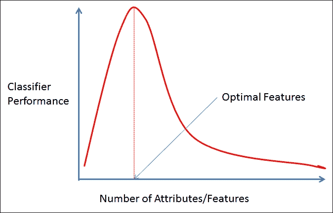

    **在分类学习中体现的维度诅咒**，其中添加更多特征会降低分类器的性能。

# 机器学习 - 角色和流程

将机器学习应用于大型问题的任何努力都需要多个角色的协作，每个角色都遵循一套旨在确保严谨性、效率和鲁棒性的系统流程。以下角色和流程确保了在开始时明确界定努力的目标，并在数据分析、数据抽样、模型选择、部署和性能评估等方面采用正确的方法论——所有这些都是进行一致性和可重复性分析的综合框架的一部分。

## **角色**

参与者在每个步骤中扮演特定的角色。这些责任在以下四个角色中得以体现：

+   **业务领域专家**：了解问题领域的主题专家

+   **数据工程师**：参与数据的收集、转换和清洗

+   **项目经理**：流程顺利运行的监督者

+   **数据科学家或机器学习专家**：负责应用描述性或预测性分析技术

## **流程**

**CRISP**（**跨行业标准流程**）是一个知名的高级数据挖掘流程模型，它定义了分析流程。在本节中，我们对 CRISP 流程添加了一些自己的扩展，使其更加全面，更适合使用机器学习进行数据分析。整个迭代过程在以下示意图中展示。我们将在本节中详细讨论流程的每一步。

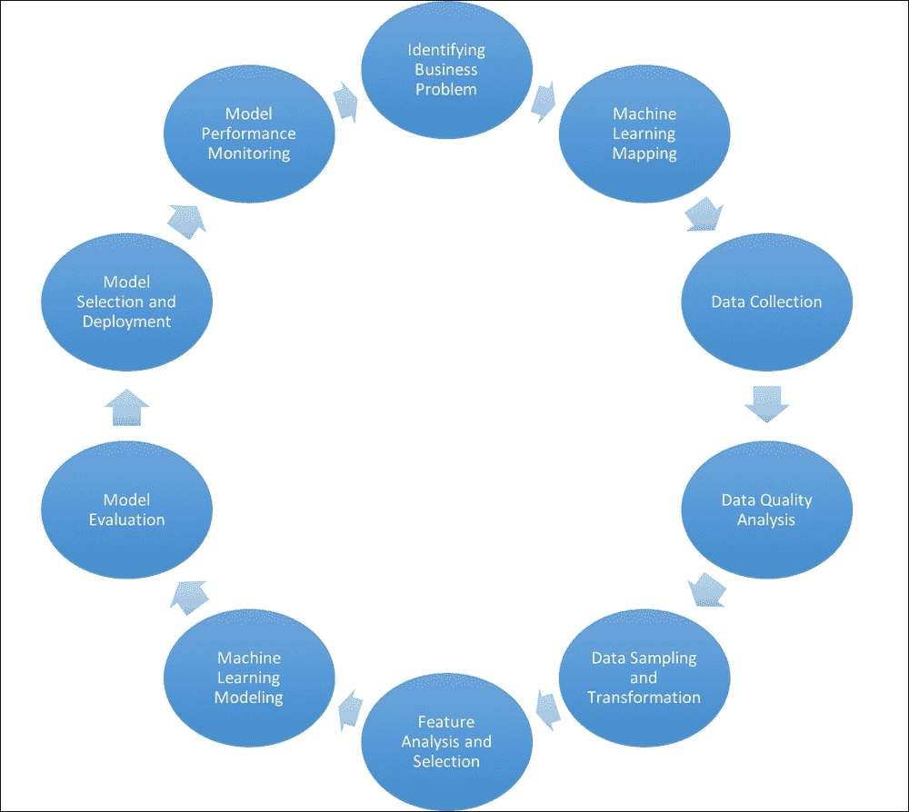

+   **识别业务问题**：理解项目或流程的目标和最终目标是第一步。这通常由业务领域专家与项目经理和机器学习专家共同完成。在数据可用性、格式、规格、收集、投资回报率、商业价值、交付成果等方面，最终目标是什么？所有这些问题都在这个阶段讨论。明确地识别目标，并在可能的情况下以可衡量的术语进行，例如节省的金额、找到预定义数量的异常或聚类，或者预测不超过一定数量的假阳性等，是这个阶段的重要目标。

+   **机器学习映射**：下一步是将业务问题映射到前文讨论的机器学习类型之一或多个。这一步骤通常由机器学习专家执行。在这个过程中，我们确定是否只使用一种学习形式（例如，监督学习、无监督学习、半监督学习）或者混合形式更适合项目。

+   **数据收集**：获取处理所需格式的原始数据，并遵循既定的规范，这是下一步。这一步通常由数据工程师执行，可能需要处理一些基本的 ETL 步骤。

+   **数据质量分析**：在这一步中，我们对数据进行缺失值、重复值等分析，对分类和连续类型进行基本统计分析，以及类似任务来评估数据质量。数据工程师和数据科学家可以共同执行这些任务。

+   **数据采样和转换**：确定数据是否需要划分为样本，并执行不同大小的数据采样以进行训练、验证或测试——这些是在这一步执行的任务。它包括采用不同的采样技术，如对训练数据集进行过采样和随机采样，以便算法能够有效地学习，尤其是在标签数据高度不平衡的情况下。数据科学家参与这项任务。

+   **特征分析和选择**：这是一个结合建模的迭代过程，在许多任务中确保对特征进行评估，以确定它们的区分度或有效性。这可能包括寻找新的特征、转换现有特征、处理前面提到的数据质量问题、选择特征子集等，在建模过程之前进行。数据科学家通常负责这项任务。

+   **机器学习建模**：这是一个基于数据特征和学习类型的迭代过程，针对不同的算法进行工作。它涉及不同的步骤，如生成假设、选择算法、调整参数，并通过评估结果来找到符合标准模型的步骤。数据科学家执行这项任务。

+   **模型评估**：虽然这一步在一定程度上与前面的所有步骤都有关联，但它与业务理解阶段和机器学习映射阶段更为紧密相关。评估标准必须以某种方式映射到业务问题或目标。每个问题/项目都有自己的目标，无论是提高真正阳性、减少假阳性、寻找异常簇或行为，还是分析不同簇的数据。根据学习技术，使用不同的技术来隐式或显式地衡量这些目标。数据科学家和业务领域专家通常参与这一步骤。

+   **模型选择和部署**：根据评估标准，选择一个或多个模型——可以是独立的或作为集成——。模型的部署通常需要解决几个问题：运行时可扩展性措施、环境的执行规范和审计信息等。基于学习的关键参数捕获的审计信息是流程的一个基本部分。它确保模型性能可以跟踪和比较，以检查模型的老化和退化。保存关键信息，如训练数据量、日期、数据质量分析等，与学习类型无关。监督学习可能涉及保存混淆矩阵、真正例率、假正例率、ROC 曲线下面积、精确度、召回率、错误率等。无监督学习可能涉及聚类或异常评估结果、聚类统计等。这是数据科学家和项目经理的领域。

+   **模型性能监控**：这项任务涉及定期跟踪模型性能，根据其评估的标准，如真正例率、假正例率、性能速度、内存分配等。衡量这些指标与训练模型性能连续评估之间的偏差至关重要。随着时间的推移，偏差和偏差容忍度将提供有关重复过程或调整模型的信息。数据科学家负责这一阶段。

如前图所示，整个过程是一个迭代的过程。在部署了一个或一组模型之后，商业和环境因素可能会以影响解决方案性能的方式发生变化，需要重新评估业务目标和成功标准。这又把我们带回了循环中。

# 机器学习 – 工具和数据集

要熟练掌握成功完成任何规模或复杂度机器学习项目的必要技术，一个可靠的方法是通过使用广泛使用的数据集进行实验，熟悉可用的工具和框架，正如后续章节所展示的。以下列表提供了一个对最流行的 Java 框架的简要概述。后续章节将包括您将使用以下工具进行的实验：

+   **RapidMiner**：一个领先的分析平台，RapidMiner 提供多种产品，包括 Studio，一个用于流程的可视化设计框架，Server，一个通过允许共享数据源、流程和实践来促进协作环境的产品，以及 Radoop，一个具有将部署和执行转换为 Hadoop 生态系统功能的系统。RapidMiner Cloud 提供了一个基于云的存储库和按需计算能力。

    +   **许可证**：GPL（社区版）和商业版（企业版）

    +   **网站**: [`rapidminer.com/`](https://rapidminer.com/)

+   **Weka**: 这是一个综合性的开源 Java 工具集，用于数据挖掘和构建机器学习应用，拥有自己的公共数据集集合。

    +   **许可证**: GPL

    +   **网站**: [`www.cs.waikato.ac.nz/ml/weka/`](http://www.cs.waikato.ac.nz/ml/weka/)

+   **Knime**: KNIME 分析平台（我们被鼓励以无声的 k 发音，即“naime”）是用 Java 编写的，提供了一个集成的工具集、丰富的算法集和可视化的工作流程，无需标准编程语言（如 Java、Python 和 R）即可进行数据分析。然而，人们可以用 Java 和其他语言编写脚本以实现 KNIME 中未本地提供的功能。

    +   **许可证**: GNU GPL v3

    +   **网站**: [`www.knime.org/`](https://www.knime.org/)

+   **Mallet**: 这是一个用于 NLP 的 Java 库。它提供文档分类、序列标记、主题建模以及其他基于机器学习的文本应用，以及用于任务管道的 API。

    +   **许可证**: 公共公共许可证版本 1.0 (CPL-1)

    +   **网站**: [`mallet.cs.umass.edu/`](http://mallet.cs.umass.edu/)

+   **Elki**: 这是一个以研究为导向的 Java 软件，主要专注于使用无监督算法进行数据挖掘。它通过使用改进多维数据访问性能的数据索引结构，实现了高性能和可扩展性。

    +   **许可证**: AGPLv3

    +   **网站**: [`elki.dbs.ifi.lmu.de/`](http://elki.dbs.ifi.lmu.de/)

+   **JCLAL**: 这是一个用于主动学习的 Java 类库，是一个开发主动学习方法的开源框架，该方法是处理从标记和无标记数据混合中学习预测模型（半监督学习是另一个领域）的领域之一。

    +   **许可证**: GNU 通用公共许可证版本 3.0 (GPLv3)

    +   **网站**: [`sourceforge.net/projects/jclal/`](https://sourceforge.net/projects/jclal/)

+   **KEEL**: 这是一个用 Java 编写的开源软件，主要用于设计实验，特别适合于实现基于进化学习和软计算技术的数据挖掘问题。

    +   **许可证**: GPLv3

    +   **网站**: [`www.keel.es/`](http://www.keel.es/)

+   **DeepLearning4J**: 这是一个用于 Java 和 Scala 的分布式深度学习库。DeepLearning4J 与 Spark 和 Hadoop 集成。异常检测和推荐系统是适合通过深度学习技术生成的模型的应用案例。

    +   **许可证**: Apache 许可证 2.0

    +   **网站**: [`deeplearning4j.org/`](http://deeplearning4j.org/)

+   **Spark-MLlib**: （包含在 Apache Spark 发行版中）MLlib 是 Spark 中包含的机器学习库，主要用 Scala 和 Java 编写。自从 Spark 中引入了 Data Frames，推荐使用基于 Data Frames 编写的 `spark.ml` 包，而不是原始的 `spark.mllib` 包。MLlib 包括对分析过程所有阶段的支持，包括统计方法、分类和回归算法、聚类、降维、特征提取、模型评估以及 PMML 支持，等等。MLlib 的另一个方面是支持使用管道或工作流。MLlib 可从 R、Scala 和 Python 访问，除了 Java 之外。

    +   **许可证**: Apache 许可证 v2.0

    +   **网站**: [`spark.apache.org/mllib/`](http://spark.apache.org/mllib/)

+   **H2O**: H2O 是一个基于 Java 的库，除了 Java 之外，还支持 R 和 Python 的 API。H2O 还可以在 Spark 上作为其自己的应用程序 Sparkling Water 运行。H2O Flow 是一个基于网页的交互式环境，在单个笔记本样式的文档中包含可执行单元格和丰富的媒体。

    +   **许可证**: Apache 许可证 v2.0

    +   **网站**: [`www.h2o.ai/`](http://www.h2o.ai/)

+   **MOA/SAMOA**: 针对从数据流中进行机器学习，SAMOA 提供了流处理平台的插件式接口，截至写作时，SAMOA 是 Apache 孵化器项目。

    +   **许可证**: Apache 许可证 v2.0

    +   **网站**: [`samoa.incubator.apache.org/`](https://samoa.incubator.apache.org/)

+   **Neo4j**: Neo4j 是一个用 Java 和 Scala 实现的开源 NoSQL 图形数据库。正如我们将在后面的章节中看到的，图分析有多种用途，包括匹配、路由、社交网络、网络管理和更多。Neo4j 支持完全 ACID 事务。

    +   **许可证**: 社区版—GPLv3 和企业版—包括商业和教育等多个选项 ([`neo4j.com/licensing/`](https://neo4j.com/licensing/))

    +   **网站**: [`neo4j.com/`](https://neo4j.com/)

+   **GraphX**: 这包含在 Apache Spark 发行版中。GraphX 是 Spark 的图形库。API 提供了对查看和操作图结构以及一些图算法的广泛支持，例如 PageRank、连通组件和三角形计数。

    +   **许可证**: Apache 许可证 v2.0

    +   **网站**: [`spark.apache.org/graphx/`](http://spark.apache.org/graphx/)

+   **OpenMarkov**: OpenMarkov 是一个用于编辑和评估**概率图模型**（**PGM**）的工具。它包括一个用于交互式学习的图形用户界面。

    +   **许可证**: EUPLv1.1 ([`joinup.ec.europa.eu/community/eupl/og_page/eupl`](https://joinup.ec.europa.eu/community/eupl/og_page/eupl))

    +   **网站**: [`www.openmarkov.org/`](http://www.openmarkov.org/)

+   **Smile**: Smile 是一个针对 JVM 的机器学习平台，拥有丰富的算法库。其功能包括自然语言处理（NLP）、流形学习、关联规则、遗传算法以及一套用于可视化的多功能工具。

    +   **许可证**: Apache 许可证 2.0

    +   **网站**: [`haifengl.github.io/smile/`](http://haifengl.github.io/smile/)

## 数据集

许多公开可用的数据集极大地促进了数据科学的研究和学习。以下列出的数据集中，有一些是广为人知的，多年来被众多研究人员用来作为他们方法的基准。不断有新的数据集被提供出来，以满足不同建模者和用户群体的需求。大多数数据集来自不同领域的现实世界数据。本卷中的练习将使用此列表中的几个数据集。

+   **UC Irvine (UCI) 数据库**: 由加州大学欧文分校（UCI）机器学习与智能系统中心维护的 UCI 数据库是一个包含约 350 个不同大小数据集的目录，从几十个到超过四千万条记录，以及最多三百万个属性，包括多元文本、时间序列和其他数据类型。([`archive.ics.uci.edu/ml/index.html`](https://archive.ics.uci.edu/ml/index.html))

+   **Tunedit**: ([`tunedit.org/`](http://tunedit.org/)) 这提供了 Tunedit 挑战和进行可重复数据挖掘实验的工具。它还提供了一个举办数据竞赛的平台。

+   **Mldata.org**: ([`mldata.org/`](http://mldata.org/)) 由 PASCAL 2 组织支持，该组织汇集了欧洲和世界各地的研究人员和学生，mldata.org 主要是一个用户贡献的数据集存储库，鼓励研究人员群体之间进行数据和解决方案的共享，以帮助实现创建可重复解决方案的目标。

+   **KDD 挑战数据集**: ([`www.kdnuggets.com/datasets/index.html`](http://www.kdnuggets.com/datasets/index.html)) KDNuggets 聚合了来自广泛领域的多个数据集存储库。

+   **Kaggle**: 被誉为“数据科学之家”，Kaggle 是领先的数据科学竞赛平台，也是过去竞赛和用户提交的数据集的存储库。

# 摘要

尽管机器学习是一个相对较新的领域，但它已经展示了令人印象深刻的成功。随着 Java 资源的普遍存在，Java 的平台独立性以及 Java 中 ML 框架的选择，使用 Java 进行机器学习的卓越技能在当今市场上是一种高度渴望的资产。

机器学习以某种形式存在——至少在思考者的想象中，一开始就是如此——已经很长时间了。然而，最近的发展在许多日常生活的领域产生了革命性的影响。机器学习与统计学、人工智能以及几个其他相关领域有很多共同之处。虽然一些数据管理、商业智能和知识表示系统也可能与数据在每个系统中的核心作用有关，但它们通常不与机器学习领域中体现的数据学习原则相关联。

任何关于机器学习的讨论都会假设对数据及其数据类型有所了解。它们是分类的、连续的还是有序的？数据特征是什么？目标是什么，哪些是预测因子？可以使用哪些采样方法——均匀随机、分层随机、聚类或系统抽样？模型是什么？我们看到了一个包含分类和连续特征的 ARFF 格式的天气数据示例集。

机器学习的类型包括监督学习，当有标记数据时最常见，无监督学习当没有标记数据时，以及半监督学习当我们有两者混合时。接下来的章节将详细介绍这些，以及图挖掘、概率图建模、深度学习、流学习和大数据学习。

数据以多种形式存在：结构化、非结构化、事务性、顺序性和图。我们将在本书后面的练习中使用不同结构的数据。

领域列表和不同类型的机器学习应用不断增长。本综述介绍了最活跃的领域和应用。

理解并有效地处理实际问题，如噪声数据、倾斜数据集、过拟合、数据量和维度诅咒，是成功项目的关键——这也是每个项目在其挑战中的独特之处。

使用机器学习的分析是一个涉及多个角色和明确流程的协作努力。为了获得一致和可重复的结果，采用这里概述的增强 CRISP 方法论至关重要——从理解业务问题到数据质量分析、建模和模型评估，最后到模型性能监控。

数据科学从业者有幸拥有一个丰富且不断增长的公共数据集目录，以及 Java 和其他语言中不断增加的机器学习框架和工具集。在接下来的章节中，你将了解几个数据集、API 和框架，以及高级概念和技术，以帮助你掌握机器学习所需的一切。

准备好了吗？那么，我们就继续吧！
