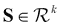
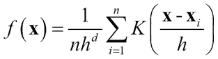
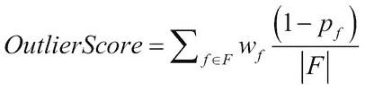
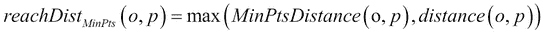

# 第三章 无监督机器学习技术

在上一章中，我们专注于监督学习，即从标记的训练数据集中学习。在现实世界中，获取带有标签的数据往往很困难。在许多领域，由于数据生成的规模或速度，即使由于标记的成本或难度，实际上也不可能对数据进行标记。在这些情况下，无监督学习，以各种形式，提供了探索、可视化和执行描述性和预测建模的正确方法。在许多应用中，无监督学习通常与监督学习结合作为第一步，以隔离有趣的数据元素进行标记。

在本章中，我们将关注各种适用于无监督学习的方法、技术和算法。我们首先指出在处理数据和转换方面，监督学习和无监督学习共有的问题。然后，我们将简要介绍由于缺乏“真实情况”和在这些条件下的学习性质，无监督学习面临的特定挑战。

然后，我们将讨论应用于未标记数据集的特征分析和降维技术。接下来是聚类方法的广泛介绍和关于实际应用中各种算法的讨论，就像我们在第二章中做的那样，*实际应用中的监督学习*，展示每个算法的工作原理、何时使用它以及其优势和局限性。我们将通过介绍不同的聚类评估技术来结束对聚类的讨论。

在处理聚类之后，我们将探讨异常检测的主题。我们将对比各种技术和算法，说明为什么某些对象在给定数据集中是异常的——也称为异常值。

本章将以聚类和异常检测实验结束，这些实验使用真实世界的数据集进行，并对获得的结果进行分析。在本案例研究中，我们将使用 ELKI 和 SMILE Java 库进行机器学习任务，并展示实验的代码和结果。我们希望这将为读者提供对这些工具强大功能和易用性的感觉。

# 与监督学习共有的问题

我们讨论的许多与监督学习相关的问题也与无监督学习相关。其中一些列在这里：

+   **算法处理的特征类型**：大多数聚类和异常算法需要数值表示才能有效工作。对分类或有序数据进行转换必须谨慎进行

+   **维度灾难**：具有大量特征会导致稀疏空间，影响聚类算法的性能。必须选择一些选项来适当地降低维度——要么是特征选择，只保留最相关特征的一个子集，要么是特征提取，将特征空间转换成低维空间的新一组主变量

+   **内存和训练时间上的可扩展性**：许多无监督学习算法由于内存或训练时间限制，无法扩展到几千个实例以上

+   **数据中的异常值和噪声**：许多算法受到特征中的噪声、异常数据的存在或缺失值的影响。它们需要被适当地转换和处理

# 无监督学习的特定问题

以下是一些与无监督学习技术相关的问题：

+   **参数设置**：确定特征数量、特征的有用性、聚类数量、聚类的形状等问题，对某些无监督方法构成了巨大的挑战

+   **评估方法**：由于缺乏真实标签，无监督学习方法是不良设定的，因此算法的评估变得非常主观。

+   **硬标签或软标签**：许多无监督学习问题需要以排他性或概率方式对数据进行标记。这对许多算法来说是一个问题

+   **结果和模型的可解释性**：与监督学习不同，缺乏真实标签和一些算法的性质使得从模型和标签中解释结果变得更加困难

# 特征分析和降维

需要掌握的第一批工具是不同的特征分析和降维技术。与监督学习一样，降维的需求源于与之前讨论的特征选择和降维类似的多重原因。

较少的判别维度使得数据的可视化和聚类变得容易得多。在许多应用中，无监督降维技术被用于压缩，这可以用于数据的传输或存储。当大数据有额外开销时，这尤其有用。此外，应用降维技术可以提高许多算法在内存和计算速度方面的可扩展性。

## 符号表示

我们将使用与监督学习章节中使用的类似符号。示例在 *d* 维度上，表示为向量：

**x** = *(x**[1]**,x**[2]**,…x**[d]* *)**^T*

包含 *n* 个示例的整个数据集可以表示为一个观察矩阵：


降维的思想是找到 k ≤ *d* 个特征，通过输入特征的变换、投影或组合，使得较低维度的 *k* 能够捕获或保留原始数据集的有趣特性。

## 线性方法

线性降维方法是一些最古老的统计技术，用于减少特征或将数据转换到较低维度，同时保留有趣的判别特性。

从数学上讲，我们使用线性方法执行一个变换，即通过原始数据元素的线性变换来创建一个新的数据元素：


**s = Wx**

在这里，**W**[k × d] 是线性变换矩阵。变量 **s** 也被称为潜在或隐藏变量。

在这个主题中，我们将讨论两种最实用且经常使用的方 法。我们将列出这些技术的变体，以便读者可以使用这些工具进行实验。这里的主要假设——通常形成限制——是变换之间的线性关系。

### 主成分分析（PCA）

PCA 是降维中广泛使用的技术（*参考文献* [1]）。原始坐标系被旋转到一个新的坐标系，该坐标系利用了数据中的最大方差方向，从而在低维子空间中产生了在原始特征空间中相关的变量。PCA 对特征的缩放敏感。

#### 输入和输出

PCA 通常对数值数据集有效。许多工具提供了对名义特征的类别到连续的转换，但这会影响性能。主成分的数量，或*k*，也是用户提供的输入。

#### 它是如何工作的？

PCA 在其最基本的形式中，试图将数据投影到新的轴上，这些轴被称为**主成分**。主成分是从原始空间捕获最大方差方向的投影。简单来说，PCA 通过将数据的原始轴旋转到最大方差的方向来找到第一个主成分。该技术通过再次确定下一个最佳轴（与第一个轴正交），寻求第二个最高方差，以此类推，直到捕获大多数方差。通常，大多数工具提供选择主成分数量的选项，或者选择继续寻找组件，直到捕获原始数据集中方差的一定百分比，例如 99%。

从数学上讲，寻找最大方差的目标可以写成


*λ* **v** = **Cv** 是特征分解

这相当于：


在这里，**W** 是主成分，**S** 是输入数据的新变换。通常，在计算部分使用特征值分解或奇异值分解。


图 1：主成分分析

#### 优点和局限性

+   PCA 的一个优点是它在最小化数据重建误差方面是最佳的。

+   PCA 假设正态分布。

+   对于高维的大型数据集，计算协方差矩阵可能会变得非常密集。作为替代，可以使用**奇异值分解**（**SVD**），因为它是迭代的，并且不需要显式的协方差矩阵。

+   当数据中存在噪声时，PCA 会存在问题。

+   当数据位于复杂的流形上时，PCA 会失败，这是一个我们将在非线性降维部分讨论的话题。

+   PCA 假设特征之间存在相关性；在没有这些相关性的情况下，它无法进行任何转换；相反，它只是对它们进行排序。

+   通过将原始特征空间转换成一组新的变量，PCA 导致数据可解释性降低。

+   有许多其他流行的 PCA 变体，它们克服了 PCA 的一些偏差和假设。

**独立成分分析**（**ICA**）假设存在来自源的混合的非高斯分布，并使用生成技术尝试在较小的混合或组件中找到原始数据的分解（*参考文献* [2]）。PCA 和 ICA 之间的关键区别在于，PCA 创建的是不相关的组件，而 ICA 创建的是独立的组件。

从数学上讲，它假设  是独立源 ∈  的混合，使得每个数据元素 *y* = [*y* *¹* *,y* *²* *,….y* *^k* ]*^T*，独立性由  表示：

**概率主成分分析**（**PPCA**）基于使用混合模型和最大似然公式通过**期望最大化**（**EM**）来找到组件。它克服了 PCA 面临的缺失数据和异常值影响的问题。

### 随机投影（RP）

当数据可以通过大间隔分离——即使它是高维数据——一个人可以将数据随机投影到低维空间，而不会影响分离性，并且使用相对较少的数据实现良好的泛化。随机投影使用这种技术，具体细节在此描述（*参考文献* [4]）。

#### 输入和输出

随机投影可以与数值和分类特征一起工作，但分类特征会被转换为二进制。输出是输入数据元素的低维表示。要投影的维度数 *k* 是用户定义输入的一部分。

#### 它是如何工作的？

这种技术使用随机投影矩阵将输入数据投影到低维空间。原始数据  被转换到低维空间 ，其中 *k << p*，使用以下方法：


在这里，*k* x *d* 矩阵 **R** 中的列是独立同分布的零均值正态变量，并缩放到单位长度。**R** 随机矩阵的构建有几种使用概率抽样的变体。RP 的计算复杂度为 *O(knd)*，这比 PCA 的缩放效果要好得多。在许多实际数据集中，已经证明 RP 的结果与 PCA 相当，并且可以扩展到大型维度和数据集。

#### 优点和局限性

+   它可以扩展到非常大的数据集大小和维度值。在文本和图像学习问题中，对于大型维度，该技术已被成功用作预处理技术。

+   在使用 RP 时，有时可能会发生较大的信息损失。

### 多维尺度分析（MDS）

MDS 有许多形式——经典、度量和非度量。MDS 的主要思想是保留成对相似度/距离值。它通常涉及将高维数据转换到两个或三个维度（*参考文献* [5]）。

#### 输入和输出

MDS 可以根据用户选择的距离函数与数值和分类数据一起工作。要转换到的维数 *k* 是用户定义的输入。

#### 如何工作？

给定 *n* 个数据元素，计算一个 *n* x *n* 的亲和度或距离矩阵。有使用距离的选择，例如欧几里得距离、马氏距离，或者使用相似度概念，如余弦相似度、Jaccard 系数等。MDS 在其最基本的形式中试图在低维空间中找到距离矩阵的映射，其中变换点之间的欧几里得距离与亲和度矩阵相似。

从数学上讲：


这里  输入空间和  映射空间。

如果使用核将输入亲和度空间进行转换，则 MDS 成为降维的非线性方法。当输入空间中点之间的距离是欧几里得距离时，经典 MDS 与 PCA 等价。

#### 优点和局限性

+   关键缺点是需要主观选择所需的低维来解释高维数据，通常限制在两个或三个维度内，这对于人类来说是有局限的。一些数据可能无法有效地映射到这个低维空间。

+   优点是您可以使用该框架将线性和非线性映射到最低维度。

## 非线性方法

通常，非线性降维涉及对线性方法（如 KPCA）中的计算执行非线性变换，或者在低维中找到非线性关系，如流形学习。在某些领域和数据集中，低维数据结构是非线性的——这就是 KPCA 等技术的有效之处——而在某些领域，数据在低维中不会展开，你需要流形学习。

### 核主成分分析（KPCA）

核 PCA 使用第二章中描述的核技巧，*实际应用中的监督学习*，与 PCA 算法一起在多维空间中转换数据，以找到有效的映射（*参考文献* [6]）。

#### 输入和输出

与 PCA 类似，增加了核和核参数的选择。例如，如果选择**径向基函数**（**RBF**）或高斯核，则核以及伽马参数成为用户选择的值。

#### 如何工作？

与前一章中讨论的**支持向量机**（**SVM**）一样，KPCA 使用“核技巧”将输入空间转换为高维特征空间。然后在转换空间中执行寻找最大方差的所有 PCA 机制。

如 PCA：


通过构建*N* x *N*矩阵，而不是使用*ϕ* *(x)*进行实际变换，使用核方法对输入空间应用非线性变换，而不是线性协方差矩阵。

*k(x,y) = ((* *ϕ* *(x),* *ϕ* *(y)) =* *ϕ* *(x)* *^T* *ϕ* *(y)*

由于核变换实际上并没有将特征转换到显式的特征空间，因此找到的主成分可以解释为数据在组件上的投影。在以下图中，一个使用 scikit-learn 示例生成的二进制非线性数据集（*参考文献* [27]）展示了使用 RBF 核进行 KPCA 后的线性分离，并通过逆变换返回几乎相同的输入空间：


图 2：圆数据集上的 KPCA 和逆变换。

#### 优点和局限性

+   KPCA 克服了 PCA 所呈现的非线性映射。

+   KPCA 与标准 PCA 在异常值、噪声和缺失值方面存在类似问题。有稳健的方法和变体可以克服这些问题。

+   由于核矩阵的增加，KPCA 在空间上存在可扩展性问题，这可能在具有高维的大型数据集中成为瓶颈。在这些情况下，可以使用 SVD 作为替代。

### 流形学习

当高维数据嵌入到非线性但具有复杂结构的低维空间时，流形学习非常有效。

#### 输入和输出

流形学习算法需要两个由用户提供的参数：*k*，代表初始搜索的邻居数量，以及*n*，流形坐标的数量。

#### 它是如何工作的？

如下图中所示，使用 scikit-learn 工具（*参考文献* [27]）绘制的三维 S 曲线，在 2D PCA 和 2D 流形中使用 LLE 表示。观察蓝色、绿色和红色点在 PCA 表示中混合在一起，而使用 LLE 进行流形学习表示时，颜色被干净地分离。还可以观察到，欧几里得距离的秩排序在流形表示中不保持：


图 3：PCA 和流形学习后的数据表示

为了保留结构，保留的是测地距离而不是欧几里得距离。一般的方法是构建一个图结构，如邻接矩阵，然后根据不同的假设计算测地距离。在 Isomap 算法中，全局成对距离被保留（*参考文献* [7]）。在**局部线性嵌入**（**LLE**）算法中，映射是为了处理局部邻域，即附近的点在变换中映射到附近的点（*参考文献* [9]）。拉普拉斯特征映射与 LLE 类似，但它通过使用图拉普拉斯来尝试保持 LLE 中的“局部性”而不是“局部线性”，（*参考文献* [8]）。

#### 优点和局限性

+   Isomap 是非参数的；它保留了全局结构，没有局部最优解，但速度受限。

+   LLE 和拉普拉斯特征映射是非参数的，没有局部最优解，速度快，但不保留全局结构。

# 聚类

聚类算法可以根据技术、输出、过程和其他考虑因素以不同的方式进行分类。在本主题中，我们将介绍一些最广泛使用的聚类算法。

## 聚类算法

目前有丰富的聚类技术用于广泛的多种应用。本节介绍其中的一些，解释它们的工作原理，它们可以用于哪些类型的数据，以及它们的优缺点。这些包括基于原型、基于密度、基于概率分区、基于层次、基于图理论和基于神经网络的算法。

### k-Means

k-means 是一种基于质心或原型迭代的算法，采用分区和重新定位方法（*参考文献* [10]）。k-means 根据使用的距离度量找到球形形状的簇，例如在欧几里得距离的情况下。

#### 输入和输出

k-means 可以处理大多数数值特征。许多工具提供类别到数值的转换，但计算中存在大量类别可能会导致非最优的聚类。用户定义的*k*，即要找到的聚类数量，以及用于计算接近度的距离度量是两个基本输入。k-means 生成聚类，将数据关联到每个聚类，以及聚类的质心作为输出。

#### 它是如何工作的？

最常见的变体称为 Lloyd 算法，它通过从集合中随机选择数据元素来初始化给定数据集的*k*个质心。它使用某些距离度量（如欧几里得距离）将每个数据元素分配到最近的质心。然后，它计算每个聚类的数据点的平均值以形成新的质心，这个过程重复进行，直到达到最大迭代次数或质心没有变化。

从数学上讲，聚类的每一步都可以看作是一个优化步骤，其中要优化的方程由以下给出：


在这里，ci 是属于聚类*i*的所有点。最小化问题被归类为 NP-hard，因此 k-Means 有陷入局部最优的倾向。

#### 优点和局限性

+   选择聚类数量*k*是困难的，但通常可以使用搜索技术，如为不同的值改变*k*并测量如平方误差和等指标来找到良好的阈值。对于较小的数据集，可以尝试层次 k-means。

+   对于较小的*k*值，k-means 的收敛速度可以比大多数算法快，并且可以找到有效的全局聚类。

+   k-means 的收敛可能受到质心初始化的影响，因此有许多变体执行具有不同种子的随机重启等。

+   当存在异常值和噪声数据点时，k-means 的表现可能会很糟糕。使用稳健技术（如中位数而不是平均值）、k-Medoids 在一定程度上克服了这一点。

+   当聚类形状任意或具有不同的密度时，k-means 无法找到有效的聚类。

### DBSCAN

基于密度的空间聚类应用噪声（DBSCAN）是一种基于密度的划分算法。它将空间中的密集区域与稀疏区域分开（*参考文献* [14]）。

#### 输入和输出

DBSCAN 仅使用数值特征。用户定义的参数是*MinPts*和由*ϵ*给出的邻域因子。

#### 它是如何工作的？

算法首先找到每个点*p*的ϵ邻域，由给出。一个**高密度**区域被定义为在ϵ邻域中点的数量大于或等于给定*MinPts*的区域；围绕这样一个ϵ邻域定义的点被称为**核心点**。位于**核心点**的ϵ邻域内的点被认为是**直接可达**的。所有可以通过从一个直接可达的核心点到另一个直接可达的第二点的直接可达点跳跃，以此类推，实际上可以到达的核心点被认为是属于同一个簇。此外，任何在其*ϵ*-邻域中少于*MinPts*的点，但可以从核心点直接到达的点，属于与核心点相同的簇。这些位于簇边缘的点被称为**边界点**。任何既不是核心点也不是边界点的点被称为**噪声点**。

#### 优点和局限性

+   DBSCAN 算法不需要指定簇的数量，可以从数据中自动找到它。

+   DBSCAN 可以找到各种形状和大小的簇。

+   DBSCAN 具有内置的鲁棒性以应对噪声，并可以从数据集中找到异常值。

+   DBSCAN 在识别点和将其分类为边界或核心时并不完全确定，这取决于数据处理顺序。

+   选择如欧几里得距离的距离度量通常会影响性能，这是由于维度的诅咒。

+   当存在密度变化大的簇时，*{MinPts,* *ϵ**}*的静态选择可能是一个很大的限制。

### 均值漂移

均值漂移是许多基于图像、视频和运动检测数据集的有效聚类算法（*参考文献* [11]）。

#### 输入和输出

在均值漂移算法中，只接受数值特征作为数据输入。核的选择和核带宽是用户驱动的选择，这些选择会影响性能。均值漂移生成数据点的模式并在模式周围聚类数据。

#### 如何工作？

均值漂移基于统计概念**核密度估计**（**KDE**），这是一种概率方法，用于从样本中估计潜在的数据分布。

对于给定带宽*h*的核*K*（**x**）的核密度估计由以下公式给出：



对于具有*d*维度的*n*个点。均值漂移算法通过将每个数据点移动到局部密度增加的方向来工作。为了估计这个方向，将梯度应用于核密度估计，梯度具有以下形式：


这里 g(**x**)= –K'(**x**)是核的导数。向量，m(**x**)，被称为均值漂移向量，它用于将点移动到局部密度增加的方向。

**x**^((t+1)) = **x**^t + m(**x**)

此外，当密度函数的梯度为零时，它保证收敛。最终位于相似位置的点被标记为属于同一区域的簇。

#### 优点和局限性

+   均值漂移是非参数的，不对数据分布做出任何假设。

+   它可以找到形状和大小各异的非复杂簇。

+   没有必要显式给出簇的数量；带宽参数的选择，该参数用于估计，隐式地控制簇。

+   均值漂移对于给定的带宽参数没有局部最优解，因此它是确定性的。

+   由于核密度估计（KDE），均值漂移对异常值和噪声点具有鲁棒性。

+   均值漂移算法计算缓慢，并且在大数据集上扩展性不好。

+   带宽选择应谨慎进行；否则可能会导致模式合并，或者出现额外的浅层模式。

### 期望最大化（EM）或高斯混合模型（GMM）

GMM 或 EM 是一种基于概率划分的方法，它使用基于概率分布的技术将数据划分为 *k* 个聚类（*参考文献* [13]）。

#### 输入和输出

只允许在 EM/GMM 中使用数值特征。模型参数是混合成分的数量，由 *k* 给定。

#### 如何工作？

GMM 是一种生成方法，它假设存在 *k* 个高斯成分，每个高斯成分有一个均值 *µ*[i] 和协方差 Ʃ[i]。以下表达式表示给定 *k* 个高斯成分的数据集的概率：


对于每个高斯成分，找到均值 {**µ**[1], **µ**[2], …**µ**[k]} 的两步任务，使得分配给每个数据点的概率最大化，这是通过**期望最大化**（**EM**）过程完成的。

迭代过程可以定义为 E 步，在迭代 *i* 中计算每个数据点的**期望**簇：


M 步最大化计算给定属于簇的数据点的 *µ*t+1：


EM 过程可能导致 GMM 收敛到局部最优。

#### 优点和局限性

+   与任何特征都配合得很好；对于分类数据，计算离散概率，而对于数值数据，则估计连续概率函数。

+   它具有计算可扩展性问题。它可能导致局部最优。

+   *k* 个高斯成分的值必须**先验地**给出，类似于 k-Means。

### 层次聚类

层次聚类是一种基于连接性的聚类方法，广泛用于分析和探索数据，而不仅仅用作聚类技术（*参考文献* [12]）。其思路是迭代地构建二叉树，从顶部或底部开始，使得相似点聚集在一起。树的每一层都提供了数据的有趣总结。

#### 输入和输出

层次聚类通常基于基于相似性的转换，因此接受分类数据和连续数据。层次聚类只需要相似度或距离度量来计算相似度，不需要像 k-means 或 GMM 那样需要聚类数量。

#### 如何工作？

层次聚类有许多变体，但我们将讨论聚合聚类。聚合聚类首先将所有数据元素放入它们自己的组中。然后，它根据使用的相似度度量迭代合并组，直到只剩下一个组。树的每一层或分组提供了数据的独特分割，分析师需要选择适合问题域的正确层。聚合聚类通常使用树状图进行可视化，该图显示了在相似性处的数据点合并。常用的相似度方法选择包括：

+   **单链接**：相似性是点群之间的最小距离：

+   **完全链接**：相似性是点群之间的最大距离：

+   **平均链接**：点群之间的平均相似性：

#### 优点和局限性

+   即使数据中可能没有这样的结构，层次聚类也会在数据上施加层次结构。

+   相似度度量的选择可能导致合并和树状图的大幅不同，因此它对用户输入有很大的依赖性。

+   层次聚类在数据点增加时容易受到可扩展性的影响。根据使用的距离度量，它可能对噪声和异常值敏感。

### 自组织映射（SOM）

SOM 是一种基于神经网络的算法，可以被视为降维、流形学习或聚类技术（*参考文献* [17]）。神经生物学研究表明，我们的大脑将不同的功能映射到不同的区域，称为拓扑图，这是该技术的基础。

#### 输入和输出

在 SOM 中仅使用数值特征。模型参数包括距离函数（通常使用欧几里得距离）以及以宽度和高度或晶格中的单元格数量表示的晶格参数。

#### 如何工作？

SOM，也称为 Kohonen 网络，可以被视为一个双层神经网络，其中每个输出层是一个二维晶格，按行和列排列，每个神经元都与输入层完全连接。

与神经网络类似，权重最初使用随机值生成。该过程有三个不同的训练阶段：

+   **竞争阶段**：在这个阶段，神经元根据判别值进行竞争，通常基于神经元权重与输入向量的距离；这样，两个神经元之间的最小距离决定了输入被分配给哪个神经元。使用欧几里得距离，输入 *x*i 与晶格位置 *(j, i)* 的神经元之间的距离由 *w*[ji] 给出：

+   **合作阶段**：在这个阶段，获胜神经元在其拓扑邻域中找到最佳空间位置。对于给定神经元 *(j, i)*，获胜神经元 *I*(**x**) 的拓扑邻域，距离 *S*[ij]，邻域大小为 σ，定义为：

    邻域大小以某种已知衰减函数（如指数函数）随时间减少的方式定义：

    

+   **自适应阶段**：在这个阶段，获胜神经元及其邻域神经元的权重被更新。权重的更新通常使用以下方式完成：

    在这里，学习率 *n(t)* 再次定义为与邻域大小类似的指数衰减。

使用统一距离矩阵（U-Matrix）的 SOM 可视化创建了一个衡量神经元权重与其邻居之间平均距离的单个度量，然后可以通过不同的颜色强度进行可视化。这有助于识别邻域中的*相似*神经元。

#### 优点和局限性

+   SOM 的最大优点是它易于理解，并且使用 U-matrix 可视化对数据进行二维聚类可以非常有效地理解模式。

+   相似性/距离函数的选择对聚类有巨大影响，必须由用户仔细选择。

+   SOM 的计算复杂度使得它无法在大于几千个数据集上使用。

## 谱聚类

谱聚类是一种基于图理论的分区聚类技术（*参考文献* [15]）。它将数据集转换为连通图，并进行图分区以找到聚类。这是图像处理、运动检测和一些基于非结构化数据领域的流行方法。

#### 输入和输出

谱聚类仅使用数值特征。模型参数，如核的选择、核参数、要选择的特征值数量以及分区算法（如 k-Means）必须正确定义以实现最佳性能。

#### 如何工作？

以下步骤描述了该技术在实践中的应用：

1.  给定数据点，使用高斯核等平滑核函数计算亲和度（或邻接）矩阵：对于较近的点，而对于较远的点，

1.  下一步是使用各种归一化方法计算图拉普拉斯矩阵。所有拉普拉斯矩阵方法都使用对角度矩阵 *D*，它测量图中每个节点的度：

    简单的拉普拉斯矩阵是 *L = D (度矩阵) – A(亲和度矩阵)*。

1.  从特征值问题或广义特征值问题中计算前 *k* 个特征值。

1.  使用分区算法，如 k-Means，在 k 维子空间中进一步分离聚类。

#### 优点和局限性

+   当聚类形状或大小不规则且非凸时，谱聚类工作得非常好。谱聚类有太多的参数选择和调整，以获得良好的结果是一项相当复杂的任务。

+   理论上已经证明，在存在噪声数据的情况下，谱聚类具有更好的稳定性。当聚类没有很好地分离时，谱聚类表现良好。

## 亲和传播

亲和传播可以被视为 K-medoids 方法的扩展，因为它与从数据中挑选示例相似（*参考文献* [16]）。亲和传播使用距离或相似度矩阵的图，并选择训练数据中的所有示例作为示例。作为数据点之间 *亲和度* 的迭代消息传递自动检测聚类、示例，甚至聚类数量。

#### 输入和输出

通常，除了最大迭代次数，这是大多数算法的共同点，不需要其他输入参数。

#### 如何工作？

我们将首先解释数据点之间交换的两种类型的信息：

+   责任 *r(i,k)*：这是从数据点到候选示例的消息。这提供了一个度量，说明与其它示例相比，该示例对该数据点的适应性如何。更新责任规则的规则如下：其中 *s(i, k)* = 数据点 *i* 和 *k* 之间的相似度。

    *a(i, k)* = 示例 *k* 对 *i* 的可用性。

+   可用性 *a(i,k)*：这是从候选示例到数据点的消息。这提供了一个度量，表示在考虑其他数据点的情况下，示例对数据点的支持有多好。这可以被视为软聚类分配。更新可用性的规则如下：

    图 4：亲和传播中使用的消息类型

算法可以总结如下：

1.  初始化 

1.  对于所有增量*i*到*n*：

1.  结束。

1.  对于所有满足*(r(i,i) + a(i,i) > 0)*的**x**[i]

    1.  **x**[i]是示例。

    1.  所有非示例**x**[j]都使用相似度度量*s(i, j)*分配到最近的示例。

1.  结束。

#### 优点和局限性

+   相似性传播是一个确定性算法。k-means 或 K-medoids 对初始点的选择很敏感，这通过将每个点视为示例来克服。

+   聚类的数量不必指定，并且通过过程自动确定。

+   它适用于非度量空间，并且不需要距离/相似度来具有约束性质，例如三角不等式或对称性。这使得算法可以在具有分类和文本数据等多种数据集上使用：

+   由于其更新方法，该算法可以轻松并行化，并且具有快速的训练时间。

## 聚类验证和评估

聚类验证和评估是确定算法有用性的最重要的机制之一（*参考文献* [18]）。这些主题可以大致分为两类：

+   **内部评估指标**：在这种情况下，指标使用数据本身的一些聚类质量，而不需要访问真实值。

+   **外部评估指标**：在这种情况下，指标使用一些外部信息，例如已知的真实值或类别标签。

### 内部评估指标

内部评估仅使用聚类和数据信息来收集有关聚类结果好坏的指标。应用程序可能对指标的选择有一定的影响。一些算法对特定的评估指标有偏见。因此，在选择合适的指标、算法和参数时必须谨慎，基于这些考虑：

+   **紧凑性**：使用不同策略测量的聚类方差用于给出紧凑性值；方差越低，聚类越紧凑。

+   **分离性**：聚类之间分离得有多好？

#### 符号

下面是对以下内容中使用的符号的简要解释：所有数据元素的数据集=*D*，数据元素数量=*n*，每个数据元素的维度或特征=*d*，整个数据集的中心*D = c*，聚类数量=*NC*，第*i*个聚类=*C*[i]，第*i*个聚类中的数据数量=*n*[i]，第*i*个聚类的中心=*c*[i]，第*i*个聚类的方差=σ(*C*[i])，两点*x*和*y*之间的距离=*d (x,y)*。

#### R-Squared

目标是使用聚类之间的平方和总和与整个数据上的总平方和的比率来衡量聚类之间的差异程度。公式如下：


#### Dunn 的指数

目标是识别密集且分离良好的聚类。该度量由以下公式的最大值给出：


#### Davies-Bouldin 指数

目标是识别具有低簇内距离和高簇间距离的聚类：


##### 轮廓指数

目标是测量簇间和簇内距离的成对差异。它还用于通过最大化指数来找到最佳聚类数量。公式如下：


这里和。

### 外部评估度量

聚类的外部评估度量与使用混淆矩阵元素或使用数据和标签的信息论度量分类度量相似。以下是一些最常用的度量方法。

#### 兰德指数

兰德指数使用以下公式衡量聚类算法做出的正确决策：


#### F-Measure

F-Measure 结合了在聚类中应用的精确度和召回度度量，如下公式所示：


在这里，*n*[ij]是聚类*j*中类别*i*的数据元素数量，*n*[j]是聚类*j*中的数据数量，*n*[i]是类别*i*中的数据数量。F-Measure 越高，聚类质量越好。

#### 归一化互信息指数

NMI 是应用于聚类的许多基于熵的度量之一。与聚类*C*相关的熵是关于簇随机选择数据元素的不确定性的度量。

其中是元素在聚类*C*i 中被选中的概率。

两个聚类之间的互信息由以下公式给出：


这里，这是元素被聚类*C*和*C^'*同时选中的概率。

**归一化互信息**（**NMI**）有多种形式；其中一种如下所示：


# 异常值或异常检测

格鲁布斯在 1969 年给出了定义，“一个异常值，或称为异常值，是看起来明显偏离其所在样本中其他成员的观察值”。

霍金斯在 1980 年将异常值或异常定义为“一个与其他观察值差异如此之大，以至于引起怀疑它是由不同机制生成的观察”。

巴内特和刘易斯在 1994 年将其定义为“一个（或一组）观察值，似乎与该数据集的其余部分不一致”。

## 异常值算法

异常值检测技术根据不同的方法来分类，这些方法定义了异常值，即根据某些属性将数据集中的某些对象与其他对象区分开来：

+   **基于统计的**：根据选择的分布来看，这是不可能的

+   **基于距离的**：根据选择的距离度量，与邻居孤立，并且阈值距离内的邻居比例

+   **基于密度的**：与邻居相比，它与其邻居相比更加孤立

+   **基于聚类的**：这是相对于其他簇孤立存在的簇，或者不是任何簇的成员

+   **基于高维度的**：这是在数据投影到低维度后，通过常规技术识别出的异常值，或者通过选择一个适合高维度的适当度量

### 基于统计的方法

使用参数方法进行异常值检测的基于统计的技术假设对数据分布的一些了解（*参考文献* [19]）。从观察中，估计模型参数。在模型中概率低于阈值值的数据点被认为是异常值。当分布未知或没有合适的假设时，使用非参数方法。

#### 输入和输出

用于异常值检测的统计方法与实值数据集一起工作。在假设多元分布的参数方法中，距离度量的选择可能是一个用户选择的输入。在基于频率直方图的非参数方法中，使用用户定义的阈值频率。在核密度估计技术中，核方法和带宽的选择也是用户决定的。基于统计的方法的输出是一个表示异常程度的分数。

#### 如何工作？

大多数基于统计的异常值检测要么假设一个分布，要么将分布拟合到数据中，以概率方式检测从分布中生成的最不可能的数据。这些方法有两个不同的步骤：

1.  **训练步骤**：在这里，执行拟合数据的模型估计

1.  **测试步骤**：在每个实例上，基于模型和特定实例执行拟合优度检验，得到一个分数和异常值程度

基于参数的方法假设一个分布模型，如多元高斯分布，并且训练通常涉及使用诸如**最大似然估计（MLE）**等技术来估计均值和方差。测试通常包括均值-方差或箱线图测试等技术，并伴随假设“如果超出三个标准差，则视为异常值”。

一个正常的多元分布可以被估计为：


使用均值 **µ** 和协方差 Ʃ。

马氏距离可以是数据点从由方程  给出的分布的估计。当马氏距离受到异常值影响时，也会使用一些变体，例如**最小协方差行列式**（**MCD**）。

非参数方法涉及诸如使用频率或宽度方法为每个特征构建直方图等技术。当某个箱子中的数据与直方图平均值的比率低于用户定义的阈值时，这样的箱子被称为稀疏。特征的低概率会导致更高的异常值得分。总异常值得分可以计算如下：



在这里，*w*[f] 是赋予特征 *f* 的权重，*p*[f] 是测试数据点中特征值的概率，*F* 是特征集权重的总和。核密度估计也用于使用用户定义的核和带宽的非参数方法。

#### 优点和局限性

+   当模型拟合或数据分布已知时，这些方法非常高效，因为你不需要存储整个数据，只需存储进行测试所需的关键统计数据。

+   然而，分布的假设在参数方法中可能是一个大问题。大多数使用核密度估计的非参数方法在大数据集上扩展性不好。

### 基于距离的方法

基于距离的算法在一般假设下工作，即正常数据有其他数据点更接近它，而异常数据与其邻居很好地隔离（*参考文献* [20]）。

#### 输入和输出

基于距离的技术需要将原生数值或分类特征转换为数值。基于距离的方法的输入包括使用的距离度量、距离阈值 ϵ 和 π，以及阈值分数 π，它们共同决定一个点是否是异常值。对于 KNN 方法，选择 *k* 是一个输入。

#### 如何工作？

基于距离的异常值有很多种变体，我们将从高层次上讨论它们各自的工作原理：

+   DB (*ϵ*, π*) 算法：给定半径 *ϵ* 和阈值 π，如果一个数据点的 π 百分比的距离小于 *ϵ*，则该数据点被认为是异常值。还有进一步的变体，使用嵌套循环结构、基于网格的结构和基于索引的结构来执行计算。

+   基于 KNN 的方法也非常常见，其中异常值得分是通过计算点到 *KNN* 的距离或从 *{1NN,2NN,3NN…KNN}* 到点的平均距离来计算的。

#### 优点和局限性

+   基于距离的算法的主要优点是它们是非参数的，不对分布和模型拟合方式做出假设。

+   距离计算很简单，可以并行计算，有助于算法在大数据集上扩展。

+   基于距离的方法的主要问题是第一章中讨论的维度诅咒；对于高维数据，稀疏性可能导致异常值噪声。

### 基于密度的方法

基于密度的方法通过不仅测量给定点的局部密度，还测量其邻域点的局部密度来扩展基于距离的方法。因此，添加的相对因子使其在寻找更复杂的局部或全局异常值方面具有优势，但这也增加了计算成本。

#### 输入和输出

基于密度的算法必须提供输入半径 *ϵ* 中心对象的最小点数 *MinPts*，以确定它是一个簇的核心对象。

#### 它是如何工作的？

我们将首先讨论 **局部异常因子**（**LOF**）方法，然后讨论 LOF 的某些变体 [21]。

给定 *MinPts* 作为参数，数据点的 LOF 为：


这里 |*N* *[MinPts]* *(p)*| 是点 *p* 邻域中的数据点数量，*lrd* *[MinPts]* 是点的局部可达密度，定义为：


这里  是点的可达性，定义为：



LOF 的一个缺点是它可能会错过那些其邻域密度接近其邻域密度的异常值。使用从数据点起源的基于集合的最近路径和基于集合的最近轨迹的**连通性异常值**（**COF**）被用来改进 LOF。COF 对低密度区域和孤立区域的处理不同，克服了 LOF 的缺点：


LOF 的另一个缺点是当簇在变化密度且未分离时，LOF 将生成反直觉的分数。克服这一点的办法之一是使用基于 KNN 和其反向 KNN 或 RNN 的点的**影响空间**（**IS**）。RNN 将给定点作为其 K 个最近邻之一。点的异常性称为受影响异常值或 INFLO，其值为：


这里，*den*(*p*) 是 *p* 的局部密度：


图 5：基于密度的异常值检测方法特别适合寻找局部和全局异常值

#### 优点和局限性

+   已证明基于密度的方法比基于距离的方法更有效。

+   基于密度的异常值检测计算成本高，且通常可解释性较差。

### 基于聚类的算法

一些认为，旨在找到位于一起的数据点群体的聚类技术，在某种程度上与异常或异常值检测问题相对立。然而，作为一种高级无监督学习技术，聚类分析提供了几种方法来找到位于其他簇较远或根本不在任何簇中的有趣簇组。

#### 输入和输出

如前所述，聚类技术适用于实值数据，尽管可以容忍一些转换为数值的类别值。在 k-Means 和 k-Medoids 的情况下，输入值包括簇的数量*k*和距离度量。变体可能需要阈值得分来识别异常值组。对于使用 EM 的 Gaussian Mixture Models，必须由用户提供混合成分的数量。当使用 CBLOF 时，期望两个用户定义的参数：小簇的大小和大簇的大小。根据使用的算法，单个对象或对象组作为异常值输出。

#### 它是如何工作的？

如我们在聚类章节中讨论的，存在各种类型的聚类方法，我们将给出一些聚类算法如何扩展用于异常值检测的例子。

k-Means 或 k-Medoids 及其变体通常将数据元素聚在一起，并受异常值或噪声的影响。而不是通过删除或转换预处理这些数据点，这些削弱簇“紧密性”的点被视为异常值。通常，异常值通过先运行聚类算法然后评估某种形式的异常值得分来揭示，该得分衡量点与质心的距离。此外，许多变体将小于阈值大小的簇视为异常值组。

**高斯混合模型**（**GMM**）使用**期望最大化**（**EM**）是另一种著名的基于聚类的异常值检测技术，其中属于某个簇的概率较低的数据点成为异常值，异常值得分成为 EM 概率输出得分的倒数。

**基于簇的局部异常因子**（**CBLOF**）使用两阶段过程来寻找异常值。首先，聚类算法将数据划分为各种大小的簇。使用两个用户定义的参数，大簇的大小和小簇的大小，形成两套簇集：


#### 优点和局限性

+   由于基于聚类的技术已被充分理解，结果更具可解释性，并且有更多工具可用于这些技术。

+   许多聚类算法仅检测簇，与给出得分、排名或其他识别异常值的异常值算法相比，在无监督技术中效果较差。

### 基于高维的方法

距离、密度或甚至基于聚类的几种方法的关键问题之一是维度诅咒。随着维度的增加，距离之间的对比度减小，邻域的概念变得不那么有意义。在这种情况下，正常点看起来像是异常值，并且错误正例的数量大幅增加。我们将讨论一些解决这个问题的最新方法。

#### 输入和输出

将数据投影到低维子空间中的算法可以很好地处理缺失数据。在这些技术中，如 SOD，*ϕ*，每个维度的范围数量成为输入（*参考文献* [25]）。当使用进化算法时，具有最低稀疏系数的单元格数量是算法的另一个输入参数。

#### 如何工作？

解决高维异常值问题的广泛思路是：

+   或者将鲁棒的距离度量与所有先前技术相结合，以便可以在完整维度中识别异常值

+   或者将数据投影到较小的子空间中，并在较小的子空间中找到异常值

**基于角度的异常值度**（**ABOD**）方法使用这样一个基本假设：如果一个高维数据点是异常值，那么从它出发指向最近数据点的所有向量在或多或少的同一方向上。


图 6：区分异常值和内点的 ABOD 方法

给定点 *p* 和任意两点 *x* 和 *y*，这两点与 *p* 之间的角度由以下公式给出：


作为 ABOD 分数使用的方差度量由以下公式给出：


ABOD 值越小，角度谱中的方差度量越小，点成为异常值的可能性就越大。

另一种在高维数据中非常有用的方法是使用**子空间异常值检测**（**SOD**）方法（*参考文献* [23]）。其想法是将高维空间划分为每个维度中范围数量相等的区域，例如在 *d* 个维度中都有 *ϕ* 个范围。然后，通过在每个 *d* 维度中选择一个范围形成的单元格 *C* 的稀疏系数如下测量：


在这里，*n* 是数据点的总数，*N(C)* 是单元格 *C* 中数据点的数量。通常，位于具有负稀疏系数的单元格中的数据点被认为是异常值。

#### 优点和局限性

+   ABOD 方法的时间复杂度为 *O(n³*)*，与数据点的数量成正比，因此在大数据集上变得不切实际。

+   子空间中的稀疏系数方法需要高效地在低维中进行搜索，问题变得 NP-Hard，因此采用了某种形式的进化或启发式搜索。

+   稀疏系数方法由于是 NP-Hard，可能会导致局部最优。

### 一类 SVM

在许多领域，存在一个特定的感兴趣类或类别，而“其余”则无关紧要。找到围绕这个感兴趣类的边界是一类别 SVM（*参考文献* [26]）背后的基本思想。基本假设是正类（感兴趣类）的所有点都聚集在一起，而其他类的元素则散布开来，我们可以在聚集实例周围找到一个紧密的超球体。SVM，具有强大的理论基础和在二类别分类中的应用，被重新公式化以解决一类别 SVM。以下图示说明了如何使用一类别 SVM 和松弛项简化非线性边界，以避免过度拟合复杂函数：


图 7：一类别 SVM 用于非线性边界

#### 输入和输出

数据输入通常是数值特征。许多 SVM 可以接受名义特征并对它们应用二进制转换。还需要标记感兴趣类的类别，SVM 超参数，如核选择、核参数和成本参数等。输出是一个可以预测实例是否属于感兴趣类的 SVM 模型。这与我们之前看到的评分模型不同。

#### 如何工作？

输入是训练实例{**x**[1],**x**[2]…**x**[n]}，其中某些实例被标记为属于+1 类，其余属于-1 类。

SVM 的输入也需要一个核，它将输入空间转换为特征空间的变换 *ϕ* 如  使用：


使用 SVM 重新公式化的方程创建一个界定类的超球体：


如此+, 

*R* 是以**c**为中心的超球体的半径，*ν* ∈ (0,1] 表示异常值数据所占分数的上限。

正常 SVM 一样，我们通过二次规划进行优化，以获得决策边界的解。

#### 优点和局限性

+   使用一类别 SVM 的关键优势——正如二类别 SVM 一样——是许多关于误差和泛化界限的理论保证。

+   高维数据可以轻松地在一类别 SVM 中映射。

+   带核的非线性 SVM 甚至可以找到非球形的形状来界定数据的簇。

+   随着数据量的增加，训练成本在空间和内存中增加。

+   参数调整，尤其是核参数和未标记数据的成本参数调整，是一个巨大的挑战。

## 异常值评估技术

以标签、排名和分数来衡量异常值是一个活跃的研究领域。当标签或真实标签已知时，由于已知异常值类别，评估的想法变得容易得多，可以采用标准指标。但是，当真实标签未知时，评估和验证方法非常主观，并且没有明确定义、严格的统计过程。

### 监督评估

在已知真实标签的情况下，对异常值算法的评估基本上是寻找异常值分数（基于评分的异常值）的最佳阈值。

在减少假阳性并提高真阳性之间的平衡是关键概念，并且精度-召回曲线（在第二章 Chapter 2 中描述，*《面向现实世界监督学习的实用方法*）被用来找到最佳最优阈值。在监督学习中，置信度分数、预测和实际标签被用来绘制 PR 曲线，而在这里，不是使用置信度分数，而是对异常值分数进行排序并使用。ROC 曲线和曲线下的面积也被广泛应用于评估阈值。当已知真实标签时，比较两个或多个算法并选择最佳算法也可以使用曲线下的面积指标来完成。

### 无监督评估

在大多数现实世界的案例中，知道真实标签是非常困难的，至少在建模任务期间是这样的。霍金斯以非常高的水平描述了这种情况下的评估方法，将其称为“包含异常值的样本将显示出'异常'和'内含'观察值之间的大差距以及异常值与内含组之间的偏差，这些偏差是在某些适当标准化的尺度上测量的”。

当不知道真实标签时，在评估异常值时使用的通用技术是：

+   **异常值分数直方图**：一种基于可视化的方法，其中异常值分数被分组到预定义的箱中，用户可以根据异常值计数、分数和阈值来选择阈值。

+   **评分归一化和距离函数**：在这种技术中，进行某种形式的归一化以确保所有产生分数的异常值算法具有相同的范围。使用某种形式的距离或相似性或相关性的方法来找到不同算法之间异常值的共性。这里的总体直觉是：越多的算法将数据点视为异常值，该点实际上为异常值的概率就越高。

# 现实世界案例研究

在这里，我们提供了一个案例研究，说明了如何使用本章中描述的聚类和异常值技术，通过开源 Java 框架和知名图像数据集在现实世界中应用。

## 工具和软件

现在我们将介绍本章实验中使用的两种新工具：SMILE 和 Elki。SMILE 提供了一个 Java API，用于展示使用 PCA、随机投影和 IsoMap 进行特征降维。随后，Elki 的图形界面被用来执行无监督学习——具体来说，是聚类和异常值检测。Elki 附带了一组丰富的聚类分析和异常值检测算法，包括大量可供选择的模型评估器。

### 备注

了解更多关于 SMILE 的信息：[`haifengl.github.io/smile/`](http://haifengl.github.io/smile/)，以及更多关于 Elki 的信息，请访问：[`elki.dbs.ifi.lmu.de/`](http://elki.dbs.ifi.lmu.de/)。

## 商业问题

识别字符是许多商业领域遇到的问题，例如，医疗报告和医院图表的翻译，邮政服务中的邮政编码识别，零售银行的支票存款服务，以及其他一些领域。人类手写体在个体之间可能有很大的差异。在这里，我们专门关注手写数字，即 0 到 9。由于某些数字集合（如 1/2/7 和 6/9/0）之间的相似性，这个问题变得很有趣。在本章的实验中，我们使用了几种不同的算法进行聚类和异常值分析，以展示这些方法的相对优势和劣势。鉴于这些技术在数据挖掘应用中的广泛应用，我们的主要目标是深入了解数据和算法以及评估措施；我们不对测试数据进行预测。

## 机器学习映射

如章节标题所示，我们的实验旨在通过忽略数据集中识别数字的标签来展示无监督学习。从数据集中学习后，聚类和异常值分析可以提供关于数据中模式的有价值信息，并且通常用于探索这些模式和相互关系，而不仅仅是预测未见数据的类别。在本章描述的实验中，我们关注的是描述和探索，而不是预测。当外部评估措施可用时，使用标签，正如这些实验中一样。

## 数据收集

这已经为我们准备好了。关于数据收集的详细信息，请参阅：MNIST 数据库：[`yann.lecun.com/exdb/mnist/`](http://yann.lecun.com/exdb/mnist/)。

## 数据质量分析

数据点中的每个特征都是 784 个像素中的一个的灰度值。因此，所有特征的类型都是数值型；除了类别属性是 0 到 9 范围内的数字之外，没有其他分类类型。此外，数据集中没有缺失数据元素。以下是几个像素的一些基本统计信息的表格。图像在 28 x 28 的框中预先居中，因此在大多数例子中，框边沿的数据是零：

| 特征 | 平均值 | 标准差 | 最小值 | 最大值 |
| --- | --- | --- | --- | --- |
| pixel300 | 94.25883 | 109.117 | 0 | 255 |
| pixel301 | 72.778 | 103.0266 | 0 | 255 |
| pixel302 | 49.06167 | 90.68359 | 0 | 255 |
| pixel303 | 28.0685 | 70.38963 | 0 | 255 |
| pixel304 | 12.84683 | 49.01016 | 0 | 255 |
| pixel305 | 4.0885 | 27.21033 | 0 | 255 |
| pixel306 | 1.147 | 14.44462 | 0 | 254 |
| pixel307 | 0.201667 | 6.225763 | 0 | 254 |
| pixel308 | 0 | 0 | 0 | 0 |
| pixel309 | 0.009167 | 0.710047 | 0 | 55 |
| pixel310 | 0.102667 | 4.060198 | 0 | 237 |

> *表 1：预处理前原始数据集特征摘要*

**混合国家标准与技术研究院**（**MNIST**）数据集是用于评估无监督学习方法的常用数据集。MNIST 数据集之所以被选中，主要是因为高维数据中的簇没有很好地分离。

原始 MNIST 数据集来自 NIST 的黑白图像。它们被归一化以适应 20 x 20 像素的框，同时保持宽高比。通过计算质心并将其平移到 28 x 28 维网格的中心，图像被定位在 28 x 28 图像的中心。

每个像素的强度基于 0 到 255 的范围。784 个像素值被展平，成为每个图像的高维特征集。以下图展示了数据中的一个样本数字 3，以及映射到网格中，每个像素都有一个从 0 到 255 的整数值。

本节中描述的实验旨在展示无监督学习技术在知名数据集上的应用。正如在第二章中所述，使用监督学习技术进行“现实世界监督学习的实用方法”，进行了多个实验，使用了多种聚类和异常值方法。每个选定方法的有无特征减少的实验结果都进行了展示，随后对结果进行了分析。

## 数据采样和转换

由于我们的重点是使用各种无监督技术探索数据集，而不是预测方面，所以我们在这里不关心训练、验证和测试样本。相反，我们使用整个数据集来训练模型以执行聚类分析。

在异常值检测的情况下，我们创建了一个仅包含两个数据类别的样本，即 1 和 7。选择具有相似形状的数字数据集是为了设置一个问题空间，在这个空间中，各种异常检测技术的判别能力将更加突出。

## 特征分析和降维

我们使用 SMILE 机器学习工具包的 Java API 展示了不同的特征分析和降维方法——PCA、随机投影和 IsoMap。


图 8：显示数字 3，像素值分布在 0 到 254 的 28 x 28 矩阵中。

加载数据集和读取值的代码在此处给出，并带有内联注释：

```py
//parser to parse the tab delimited file
DelimitedTextParser parser = new DelimitedTextParser();parser.setDelimiter("[\t]+");
//parse the file from the location
parser.parse("mnistData", new File(fileLocation);
//the header data file has column names to map
parser.setColumnNames(true);
//the class attribute or the response variable index
AttributeDataSet dataset = parser.setResponseIndex(new NominalAttribute("class"), 784);

//convert the data into two-dimensional array for using various techniques 
double[][] data = dataset.toArray(new double[dataset.size()][]);
```

### PCA

以下代码片段说明了使用 PCA 支持 API 实现的降维：

```py
//perform PCA with double data and using covariance //matrix
PCA pca = new PCA(data, true);
//set the projection dimension as two (for plotting here)
pca.setProjection(2);
//get the new projected data in the dimension
double[][] y = pca.project(data);
```


图 9：MNIST 上的 PCA – 在左侧，我们看到超过 90%的数据方差由原始特征数量的一半以下解释；在右侧，使用前两个主成分表示数据。

表 2：PCA 后 11 个随机特征的汇总

PCA 计算将特征数量减少到 274。在下面的表中，您可以看到随机选择的一组特征的基本统计信息。特征数据作为 PCA 的一部分进行了归一化：

| 特征 | 平均值 | 标准差 | 最小值 | 最大值 |
| --- | --- | --- | --- | --- |
| 1 | 0 | 2.982922 | -35.0821 | 19.73339 |
| 2 | 0 | 2.415088 | -32.6218 | 31.63361 |
| 3 | 0 | 2.165878 | -21.4073 | 16.50271 |
| 4 | 0 | 1.78834 | -27.537 | 31.52653 |
| 5 | 0 | 1.652688 | -21.4661 | 22.62837 |
| 6 | 0 | 1.231167 | -15.157 | 10.19708 |
| 7 | 0 | 0.861705 | -6.04737 | 7.220233 |
| 8 | 0 | 0.631403 | -6.80167 | 3.633182 |
| 9 | 0 | 0.606252 | -5.46206 | 4.118598 |
| 10 | 0 | 0.578355 | -4.21456 | 3.621186 |
| 11 | 0 | 0.528816 | -3.48564 | 3.896156 |

> *表 2：PCA 后 11 个随机特征的汇总*

### 随机投影

在这里，我们展示了使用随机投影进行数据转换的 API 的简单用法：

```py
//random projection done on the data with projection in //2 dimension
RandomProjection rp = new RandomProjection(data.length, 2, false);
//get the transformed data for plotting
double[][] projectedData = rp.project(data);
```


图 10：PCA 和随机投影 – 使用 Smile API 在二维中的表示

### ISOMAP

此代码片段说明了使用 Isomap 转换的 API 的用法：

```py
//perform isomap transformation of data, here in 2 //dimensions with k=10
IsoMap isomap = new IsoMap(data, 2, 10);
//get the transformed data back
double[][] y = isomap.getCoordinates();
```


图 11：IsoMap – 使用 Smile API 在 k = 10 的情况下在二维中的表示

### 特征分析和降维观察

我们可以从图中显示的结果中得出以下观察：

+   主成分分析（PCA）的方差和维度数量图清晰地显示，大约有 100 个线性组合的特征在数据中的表示或方差与原始的 784 个特征相似（> 95%）。这是任何无监督特征降维分析的关键第一步。

+   即使是两个维度而不是之前描述的 100 个维度，PCA 也能在散点图可视化中显示出一些真正有价值的见解。显然，数字 2、8 和 4 彼此之间非常清晰地分开，这很合理，因为它们彼此之间写得很清晰。在低维空间中，如{1,7}、{3,0,5}和{1,9}这样的数字要么重叠，要么紧密聚集。这表明仅用两个特征是无法有效区分的。这也表明在这些类别之间存在着特征或属性的重叠。

+   下一个图表比较了主成分分析（PCA）与随机投影在低维 2 维空间下的结果，显示两者输出之间有很多共同之处。它们在区分不同类别方面与之前在 PCA 中描述的相似。值得注意的是，PCA 在区分数字{8,9,4}等方面比随机投影做得更好。

+   Isomap 的下一个图表显示了良好的区分度，类似于 PCA。主观上，它似乎比随机投影更好地分离数据。例如，在 Isomap 中，{3,0,5}比在 PCA 中分离得更好。

## 聚类模型、结果和评估

使用 MNIST-6000 数据集进行了两组实验。该数据集包含 6,000 个示例，每个示例代表一个手写数字，以 28 x 28 像素方格的灰度值表示。

首先，我们运行了一些聚类技术来识别数字的 10 个聚类。在本案例研究的这部分实验中，我们使用软件 Elki。

在第一组实验中，没有涉及特征降维。所有 28x28 像素都被使用。使用了包括 k-Means、EM（对角高斯模型工厂）、DBSCAN、层次结构（HDBSCAN 层次提取）以及亲和传播在内的聚类技术。在每种情况下，我们使用两个内部评估器的指标：戴维斯-博尔丁和影子系数，以及几个外部评估器：精确度、召回率、F1 度量以及兰德指数。


图 12：K-Means – 使用平方和误差（SSE）找到最优*k*，即聚类数量。曲线中的肘部，通常用于选择最优 k 值，在图表中并不特别明显。

在 k-Means 的情况下，我们使用一系列 k 值进行了多次运行。图表显示，随着 k 值的增加，平方和误差（SSE）指标逐渐降低。

表格显示了*k=10*的结果，每个结果对应的排名在括号中：

| 算法 | 影子系数 | 戴维斯-博尔丁指数 | 精确度 | 召回率 | F1 | 兰德指数 |
| --- | --- | --- | --- | --- | --- | --- |
| K-Means Lloyd | +-0.09 0.0737 (1) | 2.8489 (3) | 0.4463 (3) | 0.47843 (3) | 0.4618 (1) | 0.8881 (3) |
| EM（对角高斯模型工厂） | NaN | 0 (1) | 0.1002 (6) | 1 (1) | 0.1822 (4) | 0.1003 (5) |
| DBSCAN | 0 (4) | 0 (1) | 0.1003 (5) | 1 (1) | 0.1823 (3) | 0.1003 (5) |
| 层次结构（HDBSCAN 层次提取） | +-0.05 0.0435 (3) | 2.7294 | 0.1632 (4) | 0.9151 (2) | 0.2770 (2) | 0.5211 (4) |
| 层次结构（简化层次提取） | NaN | 0 (1) | 1 (1) | 0.0017 (5) | 0.0033 (6) | 0.8999 (2) |
| 亲和传播 | +-0.07 0.04690 (2) | 1.7872 (2) | 0.8279 (2) | 0.0281 (4) | 0.0543 (5) | 0.9019 (1) |

> *表 3. MNIST 数据的聚类算法评估*

在第二个聚类实验中，首先使用 PCA 对数据集进行了预处理，然后使用每个示例 273 个特征的所得数据，与第一个实验中相同的算法一起使用。结果如表所示：

| 算法 | 影子系数 | 戴维斯-博尔丁指数 | 精确度 | 召回率 | F1 | Rand |
| --- | --- | --- | --- | --- | --- | --- |
| K-Means Lloyd | +-0.14 0.0119 | 3.1830 | 0.3456 | 0.4418 | 0.3878 (1) | 0.8601 |
| EM（对角高斯模型工厂） | +-0.16 -0.0402 | 3.5429 | 0.1808 | 0.3670 | 0.2422 | 0.7697 |
| DBSCAN | +-0.13 -0.0351 | 1.3236 | 0.1078 | 0.9395 (1) | 0.1934 | 0.2143 |
| 层次（HDBSCAN 层次提取） | +-0.05 0.7920 (1) | 0.0968 | 0.1003 | 0.9996 | 0.1823 | 0.1005 |
| 相似传播 | +-0.09 0.0575 | 1.6296 | 0.6130 (1) | 0.0311 | 0.0592 | 0.9009 (1) |
| 子空间（DOC） | +-0.00 0.0 | 0 (1) | 0.1003 | 1 | 0.1823 | 0.1003 |

> *表 4\. PCA 后 MNIST 数据聚类算法的评估*

### 观察和聚类分析

如表 2.1 和表 2.2 所示，在聚类章节中讨论的不同算法使用不同的评估度量进行比较。

通常，根据技术、领域和业务需求比较不同的内部和外部度量标准非常重要。当数据集中有标签或结果时，使用外部度量标准成为一个更容易的选择。当没有标记数据时，通常使用内部度量标准，并对每个度量进行一些排名，然后查看所有度量之间的比较排名。在这个阶段，会做出一些重要且通常有趣的观察：

+   使用如平方和误差等度量评估 k-Means 的 k 值（如图所示），是查看“最优性”的聚类数量的基本步骤。图清楚地表明，随着 k 的增加，分数提高，聚类分离度提高。

+   当我们分析表 2.1 时，其中使用了所有 784 个特征，并显示了不同算法的所有评估度量，一些关键点脱颖而出：

    +   k-Means 和相似传播在标准差和平均值方面在影子系数指标上都有很大的重叠（k-Means +-0.09 0.0737；相似传播 +-0.07 0.04690）。因此，很难在这个指标上分析它们。

    +   在 DB Index（最小值越好）、Rand Index（越接近 1 越好）等度量中，我们可以看到相似传播和层次聚类显示出非常好的结果。

    +   在考虑标签的度量中，层次聚类、DBSCAN 和 EM 要么具有高精确度，要么具有高召回率，因此 F1 度量较低。当考虑精确度和召回率时，k-Means 给出了最高的 F1 度量。

+   在表 2.2 中，使用 PCA 保留 95%方差减少的 273 个特征的数据集通过相同的算法运行并通过相同的度量进行评估，我们得出以下有趣的观察：

减少特征会对某些算法的每个度量指标产生负面影响；例如，k-Means 的所有度量指标都会降低。例如，亲和传播算法在减少特征时影响非常小，在某些情况下甚至有积极的影响。与使用所有特征的结果相比，AP 显示出相似的 Rand 指数和 F1，更好的召回率、DB 索引和轮廓度量，以及精度的小幅变化，显示出明显的鲁棒性。

层次聚类在更好的 DB 索引和 Rand 指数方面显示出与之前相似的结果，并且在 Rand 指数上的得分接近 AP。

## 异常值模型、结果和评估

对于异常值检测技术，我们使用了包含所有数字 1 示例和数字 7 示例的子集，以及数字 7 示例的欠采样子集。其想法是这两个数字的形状相似性会导致数字 7 示例被识别为异常值。

使用的模型来自 Angular、基于距离的聚类、LOF 和单类 SVM。

评估中使用的异常值度量指标包括 ROC AUC、平均精度、R-精度和最大 F1 度量。

下表显示了获得的结果，括号内为排名：

| 算法 | ROC AUC | 平均精度 | R-精度 | 最大 F1 |
| --- | --- | --- | --- | --- |
| 角度（ABOD） | 0.9515 (3) | 0.1908 (4) | 0.24 (4) | 0.3298 (4) |
| 基于距离（KNN 异常值） | 0.9863 (1) | 0.4312 (3) | 0.4533 (3) | 0.4545 (3) |
| 基于距离（局部孤立系数） | 0.9863 (1) | 0.4312 (3) | 0.4533 (3) | 0.4545 (3) |
| 聚类（EM 异常值） | 0.5 (5) | 0.97823827 (1) | 0.989 (1) | 0.9945 (1) |
| LOF | 0.4577 (6) | 0.0499 (6) | 0.08 (6) | 0.0934 (6) |
| LOF（ALOKI） | 0.5 (5) | 0.0110 (7) | 0.0110 (7) | 0.0218 (7) |
| LOF（COF） | 0.4577 (6) | 0.0499 (6) | 0.08 (6) | 0.0934 (6) |
| 单类 SVM（RBF） | 0.9820 (2) | 0.5637 (2) | 0.5333 (2) | 0.5697 (2) |
| 单类 SVM（线性） | 0.8298 (4) | 0.1137 (5) | 0.16 (5) | 0.1770 (5) |

> *表 5 异常值分析算法评估度量*

### 观察和分析

与我们评估不同的聚类方法一样，我们使用了一些观察结果来比较多个异常值算法。再次强调，正确的方法是根据所有指标对算法进行排名，然后了解它在所有指标上的表现与其他算法相比如何。这里使用的异常值度量指标都是用于比较异常值算法的标准外部度量：

+   有趣的是，当使用正确的参数，即*k=2*时，EM 可以找到正确的分布，并且比大多数算法更有效地找到异常值。它在包括最大 F1、R-精度和平均精度等重要指标中排名很高，位居第一。

+   1-Class SVM 使用非线性 RBF 核在大多数指标上表现一致良好，即在 ROC 面积、R-Precision、平均精度和最大 F1 上排名第二。线性 SVM（在大多数排名中大约排名第五）和 1-Class SVM（排名第二）之间的差异表明，问题在本质上确实是非线性的。一般来说，当维度较高（784）且异常值非线性且稀有时，带有核的 1-Class SVM 表现确实很好。

+   基于局部异常值（LOF）及其变体的技术几乎在所有指标中排名都较低。这表明异常值问题可能不是局部的，而是全局的。基于距离的算法（KNN 和局部隔离）在 ROC 曲线下的面积和局部异常值算法相比表现更好，尽管使用基于距离的度量可以得出问题确实是全局性的，适合使用基于距离的度量。

表 1：预处理前原始数据集特征摘要

# 摘要

监督学习和无监督学习方法在处理噪声数据、高维度以及随着数据规模增长对内存和时间的需求方面存在共同关注的问题。由于缺乏真实情况，无监督学习特有的其他问题是关于模型评估的主观性、模型的可解释性、聚类边界的影响等问题。

特征降维是一个重要的预处理步骤，它减轻了可扩展性问题，同时还具有其他优势。线性方法，如 PCA、随机投影和 MDS，各自具有特定的优点和局限性，我们必须意识到每个方法中固有的假设。非线性特征降维方法包括 KPCA 和流形学习。

在聚类算法中，k-Means 是一种基于质心的技术，通过选择聚类数量进行初始化，它对质心的初始选择敏感。DBSCAN 是密度基于算法之一，不需要初始化聚类数量，对噪声和异常值具有鲁棒性。在基于概率的技术中包括均值漂移，它是确定性的且对噪声鲁棒，以及 EM/GMM，它在所有类型的特征上表现良好。均值漂移和 EM/GMM 都倾向于存在可扩展性问题。

层次聚类是一种强大的方法，涉及构建二叉树，迭代地将数据点分组，直到达到相似性阈值。对噪声的容忍度取决于使用的相似性度量。SOM 是一个双层神经网络，允许在二维网格中可视化聚类。谱聚类将数据集视为一个连通图，通过图划分来识别聚类。亲和传播是另一种基于图的技巧，它使用数据点之间的消息传递作为亲和力来检测聚类。

使用各种验证和评估度量来证明聚类算法的有效性和实用性。内部度量无法访问真实标签；当标签可用时，可以使用外部度量。内部度量的例子有轮廓指数和 Davies-Bouldin 指数。Rand 指数和 F 度量是外部评估度量。

异常检测和异常检测是无监督学习的一个重要领域。技术被分为基于统计、基于距离、基于密度、基于聚类、高维和单类 SVM。异常评估技术包括有监督评估，其中已知真实标签，和无监督评估，当真实标签未知时。

使用 SMILE Java API 和 Elki 工具包进行的实验说明了在 MNIST6000 手写数字数据集上使用各种聚类和异常检测技术。不同评估技术的结果被展示和比较。

# 参考文献

1.  K. Pearson (1901). *关于空间中点系统的最接近拟合的线和面*. 哲学杂志，第 2 卷：559–572。

1.  A. D. Back (1997). "*独立成分分析在从股票回报中提取结构中的应用*"，神经系统，第 8 卷，第 4 期，第 473–484 页。

1.  Tipping ME，Bishop CM (1999). *概率主成分分析*. 英国皇家统计学会会刊，系列 B，第 61 卷，第 3 期：611–622\. 10.1111/1467-9868.00196

1.  Sanjoy Dasgupta (2000). *随机投影实验*. 在第十六届不确定人工智能会议（UAI'00）论文集中，由 Craig Boutilier 和 Moisés Goldszmidt（编者）. Morgan Kaufmann Publishers Inc.，旧金山，加利福尼亚州，美国，第 143-151 页。

1.  T. Cox 和 M. Cox (2001). *多维尺度*. Chapman Hall，博卡拉顿，第 2 版。

1.  Bernhard Schoelkopf，Alexander J. Smola 和 Klaus-Robert Mueller (1999). *核主成分分析*. 在核方法进展，麻省理工学院出版社，剑桥，马萨诸塞州，美国 327-352。

1.  Tenenbaum, J.B.; De Silva, V.; & Langford, J.C (2000).*全局非线性降维的几何框架*. 科学. 第 290 卷，第 5500 期，第 2319-2323 页

1.  M. Belkin and P. Niyogi (2003). *拉普拉斯特征映射用于降维和数据表示*. 神经计算，第 15 卷，第 6 期：1373–1396。

1.  S. Roweis and L. Saul (2000). *局部线性嵌入进行非线性降维*. 科学，第 290 期：2323–2326。

1.  Hartigan, J. and Wong, M (1979). *算法 AS136：k 均值聚类算法*. 应用统计学，第 28 卷，第 100-108 页。

1.  Dorin Comaniciu 和 Peter Meer (2002). *均值漂移：一种稳健的特征空间分析方法*. IEEE Transactions on Pattern Analysis and Machine Intelligence，第 24 卷，第 603-619 页。

1.  层次聚类 Jain, A. and Dubes, R (1988). *数据聚类算法*. Prentice-Hall，恩格尔伍德克利夫斯，新泽西州。

1.  Mclachlan, G. and Basford, K (1988). *混合模型：推理及其在聚类中的应用*. Marcel Dekker，纽约，纽约州

1.  Ester, M., Kriegel, H-P., Sander, J. 和 Xu, X (1996). *在大型空间数据库中带有噪声的发现聚类的一个基于密度的算法*. 在第 2 届 ACM SIGKDD 会议的论文集中，第 226-231 页，俄勒冈州波特兰.

1.  Y. Ng, M. I. Jordan, 和 Y. Weiss (2001). *关于谱聚类：分析和算法*, 在神经信息处理系统进展中。麻省理工学院出版社，第 849–856 页.

1.  Delbert Dueck 和 Brendan J. Frey (2007). *非度量亲和传播用于无监督图像分类*. 在 IEEE 国际计算机视觉会议（ICCV）中，第 1–8 页.

1.  Teuvo Kohonen (2001). *自组织映射*. Springer, Berlin, Heidelberg. 1995. 第三版，扩展版.

1.  M. Halkidi, Y. Batistakis, 和 M. Vazirgiannis (2001). *关于聚类验证技术*, 智能信息系统杂志，第 17 卷，第 107–145 页.

1.  M. Markou, S. Singh (2003). *新颖性检测：综述 – 第一部分：统计方法*, 信号处理 83 (12) 2481–2497

1.  Byers, S. D. 和 Raftery, A. E (1998). *空间点过程特征估计中的最近邻杂波去除*. 美国统计学会杂志 93, 577–584.

1.  Breunig, M. M., Kriegel, H.-P., Ng, R. T., 和 Sander, J (1999). *Optics-of: 识别局部异常值*. 在第三届欧洲数据挖掘和知识发现原则会议的论文集中，Springer-Verlag，第 262–270 页.

1.  Brito, M. R., Chavez, E. L., Quiroz, A. J., 和 yukich, J. E (1997). *聚类和异常值检测中互为 k 近邻图的连通性*. 统计概率信函 35, 1, 33–42.

1.  Aggarwal C 和 Yu P S (2000). *高维数据中的异常值检测*. 在 ACM SIGMOD 国际数据管理会议（SIGMOD）的论文集中，德克萨斯州达拉斯.

1.  Ghoting, A., Parthasarathy, S., 和 Otey, M (2006). *基于距离的高维空间中快速挖掘异常值* 在 SIAM 国际数据挖掘会议（SDM）的论文集中，Bethesda, ML. 在 SIAM 国际数据挖掘会议（SDM）的论文集中，Bethesda, ML.

1.  Kriegel, H.-P., Schubert, M., 和 Zimek, A (2008). *基于角度的异常值检测*, 在 ACM SIGKDD 国际知识发现和数据挖掘会议（SIGKDD）的论文集中，内华达州拉斯维加斯. 在 ACM SIGKDD 国际知识发现和数据挖掘会议（SIGKDD）的论文集中，内华达州拉斯维加斯.

1.  Schoelkopf, B., Platt, J. C., Shawe-Taylor, J. C., Smola, A. J., 和 Williamson, R. C (2001). *估计高维分布的支持*. 神经计算 13, 7, 1443–1471.

1.  F Pedregosa, 等人. *Scikit-learn: Python 中的机器学习*. 机器学习研究杂志，第 2825-2830 页.
