# 第四章. 半监督学习和主动学习

在第二章《实际应用中的监督学习》和第三章《无监督机器学习技术》中，我们讨论了两组主要的机器学习技术，这些技术适用于不同情况下标签数据的可用性——一种情况是所有目标值都是已知的，另一种情况是没有任何目标值。相比之下，本章中的技术处理的是我们必须分析并从包含一小部分带标签数据和大量未标记实例的数据中学习的情况。

在语音和图像识别中，有大量的数据可用，并且以各种形式存在。然而，对所有这些数据进行标记或分类的成本很高，因此，在实践中，被分类的语音或图像的比例与未被分类的比例非常小。同样，在网页文本或文档分类中，互联网上有大量的文档，但根据主题或上下文进行分类需要领域专家——这使得过程复杂且昂贵。在本章中，我们将讨论两个广泛的主题，涵盖“从未标记数据中学习”的领域，即**半监督学习**（**SSL**）和主动学习。我们将介绍每个主题，并像前几章一样讨论与每个主题相关的分类法和算法。由于本书强调实用方法，我们将讨论每种学习类型可用的工具和库。然后，我们将考虑现实世界的案例研究，并展示在实际情况中应用工具时有用的技术。

这里是本章涵盖的主题列表：

+   半监督学习：

    +   表示法、符号和假设

    +   半监督学习技术：

        +   自训练 SSL

        +   Co-training SSL

        +   聚类和标签 SSL

        +   传递式图标签传播

        +   传递式 SVM

    +   半监督学习案例研究

+   主动学习：

    +   表示法和符号

    +   主动学习场景

    +   主动学习方法：

        +   不确定性采样

            +   最不自信采样

            +   最小边缘采样

            +   标签熵采样

        +   版本空间采样：

            +   意见分歧查询

            +   委员会查询

        +   数据分布采样：

            +   预期模型变化

            +   预期误差减少

            +   方差减少

            +   密度加权方法

    +   主动学习案例研究

# 半监督学习

半监督学习背后的思想是从标记和无标签数据中学习，以提高模型的预测能力。这一概念通过一个简单的插图，*图 1*，进行了说明，它显示当有大量无标签数据可用时，例如网络上的 HTML 文档，专家可以将其中一些分类到已知的类别，如体育、新闻、娱乐等。这个小的标记数据集与大量的无标签数据集一起，可以用于半监督学习技术来学习模型。因此，利用标记和无标签数据的知识，模型可以分类未来未见过的文档。相比之下，监督学习仅使用标记数据：

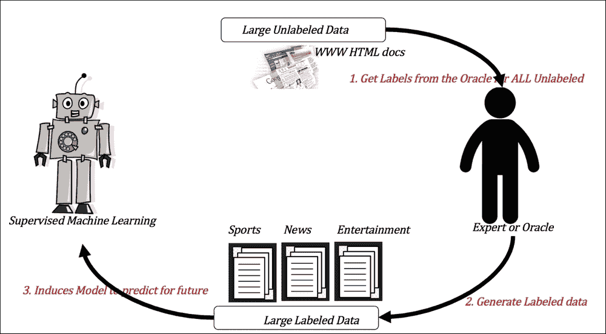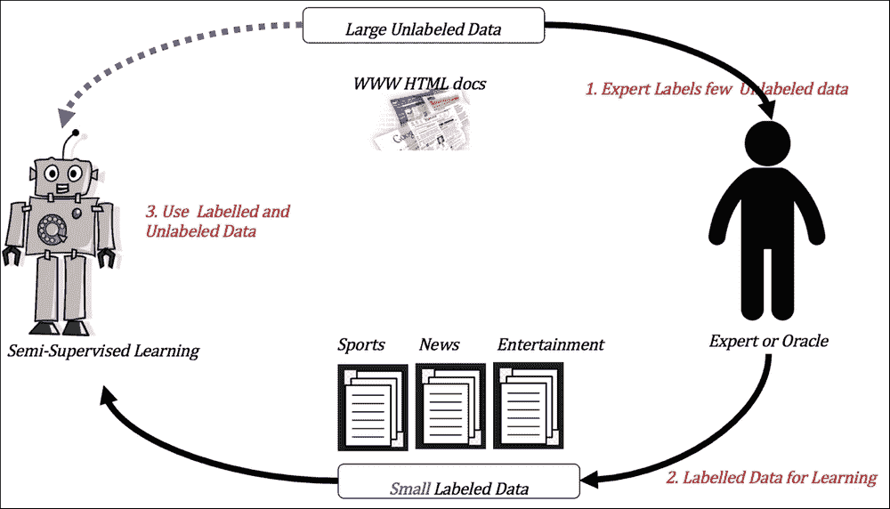

图 1. 使用网络文档分类作为示例，展示了半监督学习过程（底部）与监督学习（顶部）的对比。主要区别在于可用于学习的标记数据量，在半监督学习中通过“少量”这一限定词进行了强调。

## 表示法、符号和假设

与之前一样，我们将介绍本章中使用的符号。数据集 *D* 由单个数据实例组成，表示为 **x**，它也以集合 {**x**[1], **x**[2],…**x**[n]} 的形式表示，这是没有标签的数据实例集合。与这些数据实例相关联的标签是 {*y*[1], *y*[2], … *y*[n]}。整个标记数据集可以表示为集合中的配对元素，如 *D* = {(**x**[1], *y*[1]), (**x**2,*y*[2]), … (**x**[n], *y*[n])}，其中 **x**[i] ∈ ℝ^d。在半监督学习中，我们将数据集 *D* 进一步分为两个集合 *U* 和 *L*，分别用于无标签数据和标记数据。

标记数据 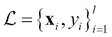 由所有已知结果 {y[1], y[2], .. y[l]} 的标记数据组成。无标签数据 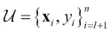 是结果未知的数据集。|*U*| > |*L*|。

归纳半监督学习包括一系列技术，这些技术给定带有标记数据  和无标签数据  的训练集 *D*，学习一个表示为  的模型，使得模型 *f* 可以在训练无标签数据 *U* 之外的未见数据上成为一个好的预测器。它“归纳”出一个模型，可以像监督学习算法一样用于预测未见实例。

传导式半监督学习由一系列技术组成，给定训练集 *D*，它学习一个模型 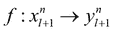，该模型仅对未标记数据进行预测。它不需要在未见未来的实例上执行，因此是比基于归纳学习更简单的 SSL 形式。

在半监督学习算法中，以下列出的某些假设对于这些类型的学习成功至关重要。为了使 SSL（半监督学习）工作，以下假设中必须有一个或多个是真实的：

+   **半监督平滑性**：简单来说，如果两个点在密度或距离方面“接近”，则它们的标签是一致的。相反，如果两个点分离且位于不同的密度区域，则它们的标签不需要一致。

+   **聚类共存性**：如果类别的数据实例倾向于形成簇，那么未标记数据可以帮助聚类算法找到更好的簇。

+   **流形共存性**：在许多现实世界的数据集中，高维数据位于低维流形中，这使得学习算法能够克服维度灾难。如果给定数据集中存在这种情况，未标记的数据也会映射到流形上，从而可以改善学习。

## 半监督学习技术

在本节中，我们将描述不同的 SSL（半监督学习）技术以及一些伴随的算法。我们将使用与之前章节相同的结构，并在三个子节中描述每种方法：*输入和输出*、*如何工作*和*优势和局限性*。

### 自训练 SSL

自训练是 SSL（半监督学习）最简单的一种形式，其中我们通过应用从标记集学习到的模型对未标记集的数据进行简单迭代填充过程（*参考文献* [1]）：

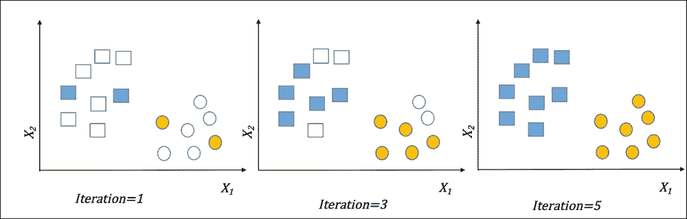

图 2. 使用一些用蓝色矩形和黄色圆圈表示的标记数据在二元分类中进行自训练 SSL。经过多次迭代后，未标记数据被映射到相应的类别。

#### 输入和输出

输入是带有少量标记和大量未标记数据的训练数据。提供一个基分类器，无论是线性的还是非线性的，例如朴素贝叶斯、KNN、决策树或其他，以及每个算法所需的超参数。数据类型上的约束将与基学习器相似。还需要做出停止条件的选择，例如“达到最大迭代次数”或“未标记数据耗尽”。通常，我们使用基学习器，这些学习器会对输出给出概率或排名。作为输出，这种技术生成可以用于对未标记数据集以外的未见数据集进行预测的模型。

#### 它是如何工作的？

整个算法可以总结如下：

1.  在停止标准未达到的情况下：

    1.  使用标记数据 *L* 训练分类器模型 

    1.  在未标记数据 *U* 上应用分类器模型 *f*

    1.  从 *U* 中选择 *k* 个最自信的预测作为集合 *L*[u]

    1.  使用 k 个数据点 *L = L* *∪* *L*[u] 增强标记数据

1.  在 2 下的所有步骤重复。

在概述中，自训练可以看作是将期望最大化过程应用于半监督设置。训练分类器模型的过程是使用最大似然估计（MLE）或最大后验概率估计（MAP）找到参数 θ。使用学习到的模型计算标签类似于 *期望* 步骤，其中 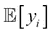 是根据参数 θ 从 *U* 中估计标签。学习带有增强标签的模型的迭代下一步类似于 *最大化* 步骤，其中新参数被调整到 *θ'*。

#### 优点和局限性

优点和局限性如下：

+   简单，与大多数监督学习技术兼容。

+   异常值和噪声可能导致预测错误被强化，技术退化。

### 协同训练 SSL 或多视图 SSL

基于协同训练的 SSL 涉及从相同数据的不同“视图”中进行学习。它是多视图 SS（参考文献 [2]）的一个特例。每个视图都可以被认为是一个捕获某些领域知识的点特征集，并且与其他视图正交。例如，一个网页文档数据集可以被认为有两个视图：一个视图是代表文本的特征，另一个视图是代表指向其他文档的超链接的特征。假设每个视图都有足够的数据，并且从每个视图中进行学习可以提高整体标记过程。在无法进行此类特征划分的数据集中，将特征随机分割成不相交的集合形成视图。

#### 输入和输出

输入是带有少量标记和大量未标记数据的训练数据。除了提供数据点外，还有对应于每个视图的特征集，并且假设这些特征集不重叠且解决不同的分类问题。选择一个基分类器，如朴素贝叶斯、KNN、决策树或任何其他，以及每个算法所需的超参数。作为输出，此方法生成可用于对未标记数据以外的未见数据集进行预测的模型。

#### 如何工作？

我们将使用数据的两个视图来演示该算法：

1.  将数据初始化为  标记和  未标记。每个数据点有两个视图 **x = [x****¹****,x****²****]** 和 *L = [L**¹**,L**2**]*。

1.  当未达到停止标准时：

    1.  使用标记数据 *L*1 和 *L*2 分别训练分类器模型 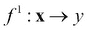 和 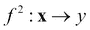。

    1.  使用它们自己的特征在未标记数据 *U* 上应用分类器模型 *f*¹ 和 *f*²。

    1.  从 *U* 中选择 *k* 个最自信的预测，应用 *f*¹ 和 *f*² 作为集合 *L*[u]¹ 和 *L*[u]² 分别。

    1.  使用 *k* 个数据点 *L*¹ = *L*¹ ∪ *L*[u]¹ 和 *L*² = *L*² ∪ *L*[u]² 增强标记数据。

1.  在 2. 下重复所有步骤。

#### 优点和局限性

优点和局限性如下：

+   当特征具有不同的方面或不同领域的混合时，协同训练比简单的自训练更有利。

+   拥有正交视图并从中学习的能力的必要和充分条件对技术的通用性提出了挑战。

### 聚类和标签 SSL

这种技术与自训练类似，相当通用，适用于假设部分中提到的聚类假设成立（参考文献 [3]）的领域和数据集。

#### 输入和输出

输入是带有少量标记实例和大量未标记实例的训练数据。聚类算法及其参数以及分类算法及其参数是额外的输入。该技术生成一个分类模型，可以帮助预测未见数据的类别。

#### 如何工作？

抽象算法可以表示为：

1.  将数据初始化为  标记的和  未标记的。

1.  使用聚类算法对整个数据集进行聚类，包括标记的和未标记的数据。

1.  对于每个簇，让 *S* 是从集合 *L* 中抽取的标记实例的集合。

    1.  从 *S* 中学习一个监督模型，*f*[s] = *L*[s]。

    1.  应用模型 *f*[s] 并使用前面的模型对每个簇中的未标记实例进行分类。

1.  由于所有未标记的实例  都通过前面的过程分配了标签，因此在整个集合上运行监督分类模型。![如何工作？]

    图 3\. 聚类和标签 SSL – 聚类后进行分类

#### 优点和局限性

优点和局限性如下：

+   当聚类假设成立且聚类算法和参数选择正确时，效果非常好。

+   大量的参数和选择使得这在许多现实世界问题中成为一个难以驾驭的技术。

### 传递性图标签传播

基于图的方法背后的关键思想是将数据集中的每个实例（标记的和未标记的）表示为一个节点，并计算它们之间的“相似性”作为某种形式的“相似性”。使用假设部分中讨论的基本概念（即，相似的数据点在图形上会“靠近”）的已知标签来传播未标记数据中的标签（参考文献 [4]）。

图 4 展示了当手写数字模式变化时，从第一个数据点到最后一个数据点的箭头粗细所表示的相似性如何变化。知道第一个标签后，由于特征相似性，标签传播可以有效地标记接下来的三个数字，而最后一个数字，尽管被标记为相同，但与前面三个相比，相似性较低。

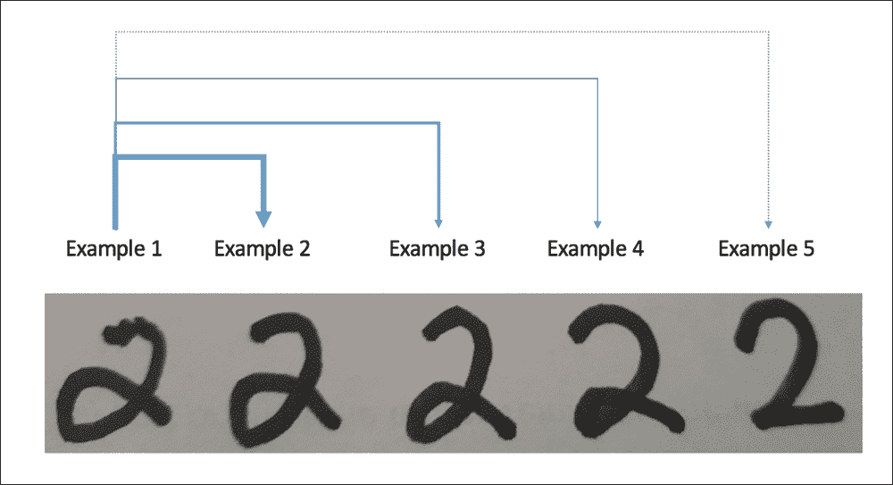

图 4\. 传输图标签传播 – 手写数字的分类。最左端和最右端的图像已标记，其他图像未标记。箭头粗细是相对于左侧标记数字 "2" 的相似性的视觉度量。

#### 输入和输出

输入是带有少量标记和大量未标记数据的训练数据。选择图加权或相似性计算方法，如 k-最近邻加权、高斯衰减距离或 ϵ-半径方法。输出是整个数据的标记集；它通常不构建如先前算法中看到的归纳模型。

#### 如何工作？

通用标签传播方法如下：

1.  构建一个图 *g = (V,E)*，其中：

    +   顶点 *V = {1, 2…n}* 对应于既属于标记集 *L* 又属于未标记集 *U* 的数据。

    +   边 *E* 是权重矩阵 **W**，其中 **W**[i,j] 表示两个数据点 **x**[i]，**x**[j] 之间的某种形式的相似性。

1.  通过 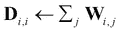 计算对角度矩阵 **D**。

1.  假设标记集是二元的，并且有 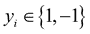。将所有未标记数据的标签初始化为 0\. 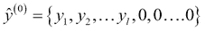

1.  在 *t* = 0 时迭代：

    1.  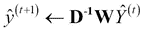

    1.  （将标记实例的标签重置为原始值）

    1.  返回步骤 4，直到收敛 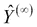

1.  使用收敛标签  标记未标记的点 。

基于相似性、迭代中选择的优化等有许多变体。

#### 优点和局限性

优点和局限性如下：

+   基于图的半监督学习方法在计算上代价高昂——通常为 O(n³)，其中 *n* 是实例的数量。尽管加速和缓存技术有所帮助，但在大量数据上的计算成本使得在许多实际数据情况下不可行。

+   传输性质使得它在需要为未见数据诱导模型的实际应用中难以使用。有如谐波混合等扩展，可以解决这些问题。

### 传输支持向量机（TSVM）

Transductive SVM 是其中最古老且最受欢迎的归纳半监督学习方法之一，由 Vapnik 提出（*参考文献* [5]）。其关键原则是，未标记数据与标记数据一起可以帮助使用大间隔的概念找到决策边界。其基本原理是，决策边界通常不位于高密度区域！

#### 输入和输出

输入是带有少量标记和大量未标记数据的训练数据。对于 TSVM 计算，输入必须是数值特征。核的选择、核参数和成本因子，这些都是基于 SVM 的参数，也是输入变量。输出是对未标记数据集的标签。

#### 它是如何工作的？

通常，SVM 作为权重向量**w**和偏置*b*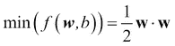的优化问题，在标记的硬边界 SVM 中用这些术语表述，受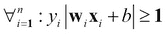约束。

1.  将数据初始化为标记的和未标记的。

1.  在 TSVM 中，方程被修改如下：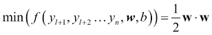

这取决于以下条件：

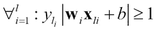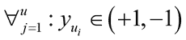

这与归纳 SVM 非常相似，但仅使用标记数据。当我们约束未标记数据以符合标记数据的超平面一侧，以最大化间隔时，它会导致未标记数据以最大间隔分离被标记！通过向约束中添加惩罚因子或用核替换输入空间中的点积，就像归纳 SVM 中那样，可以从未标记数据中标记复杂的非线性噪声数据集。

*图 5*说明了 TSVM 的概念，与仅对标记数据进行归纳 SVM 运行的概念进行比较，以及为什么 TSVM 可以使用未标记数据集找到更好的决策边界。超平面两侧的未标记数据集更接近其各自的类别，从而有助于找到更好的间隔分离器。

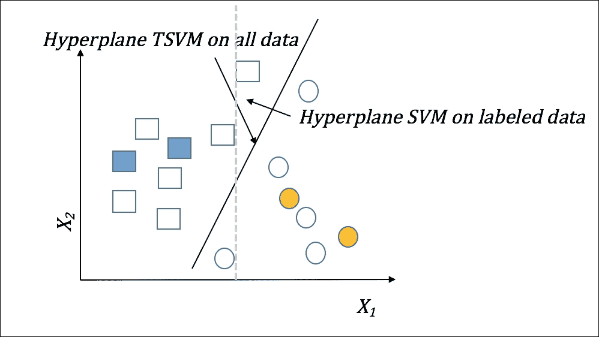

图 5. Transductive SVM

#### 优点和局限性

优点和局限性：

+   在给定无噪声标记数据的情况下，TSVM 可以在线性或非线性数据集上非常有效地工作。

+   TSVM 在寻找超参数并调整它们以获得最佳结果方面与归纳 SVM 有相同的问题。

## 半监督学习案例研究

对于这个案例研究，我们使用 UCI 存储库中另一个经过充分研究的数据集，即威斯康星州乳腺癌数据集。在实验的第一部分，我们展示了如何使用开源库`JKernelMachines`应用半监督学习的 Transductive SVM 技术。我们选择 SVMLight 算法和 Gaussian 核来使用这项技术。

在第二部分，我们使用基于 GUI 的框架 KEEL，并使用 UCI 乳腺癌数据集比较了基于进化学习算法的结果。工具、方法和评估措施将在以下子节中描述。

### 工具和软件

在半监督学习案例研究中使用的两个开源 Java 工具是 `JKernelMachines`，一个 Transductive SVM，以及 KEEL，一个基于 GUI 的工具，它使用进化算法进行学习。

### 注意

**JKernelMachines (Transductive SVM**) 

`JKernelMachines` 是一个纯 Java 库，它提供了一个高效的平台用于使用和快速开发专门的核函数。核函数是 SVM 中使用的相似性函数。`JKernelMachines` 除了提供标准核函数（如线性核和高斯核）外，还提供了在结构化数据上定义的核函数实现。特别地，它提供了一系列核函数的组合，列表上的核函数，以及具有各种缓存策略的核函数。该库还包含了 SVM 优化算法的实现，包括 LaSVM 和 One-Class SVM 使用 SMO。库的制作者报告称，JKernelMachines 在一些常见的 UCI 仓库数据集上的结果与 Weka 库相当或更好。

这里给出了使用 `JKernelMachines` 加载数据和运行 Transductive SVM 的示例：

```py
try {
//load the labeled training data
List<TrainingSample<double[]>> labeledTraining = ArffImporter.importFromFile("resources/breast-labeled.arff");
//load the unlabeled data
List<TrainingSample<double[]>> unlabeledData =ArffImporter.importFromFile("resources/breast-unlabeled.arff");
//create a kernel with Gaussian and gamma set to 1.0
DoubleGaussL2 k = new DoubleGaussL2(1.0);
//create transductive SVM with SVM light
S3VMLight<double[]> svm = new S3VMLight<double[]>(k);
//send the training labeled and unlabeled data
svm.train(labeledTraining, unlabeledData);
} catch (IOException e) {
	e.printStackTrace();
}
```

在第二种方法中，我们使用与相同数据集的 KEEL。

### 注意

**KEEL**

**KEEL** （**基于进化学习进行知识提取**）是一个非商业（GPLv3）的 Java 工具，具有 GUI，它使用户能够分析各种数据挖掘问题的进化学习行为，包括回归、分类和无监督学习。它减轻了用户编写复杂的进化算法的负担，并允许他们专注于使用工具包创建的新学习模型。KEEL 旨在满足研究人员和学生的需求。

KEEL 包含数据预处理和后处理的算法，以及统计库，还有一个知识提取算法库，该库结合了多种进化学习算法和经典学习技术。

工具中包含的 GUI 向导为管道的每个阶段提供不同的功能组件，包括：

+   数据管理：数据的导入、导出、数据转换、可视化等

+   实验设计：选择分类器、估计器、无监督技术、验证方法等

+   SSL 实验：归纳和演绎分类（参见本节中 SSL 实验设计离线方法的图像）

+   统计分析：这提供了成对和多重比较的测试，参数和非参数程序。

想要了解更多信息，请访问 [`sci2s.ugr.es/keel/`](http://sci2s.ugr.es/keel/) 和 [`sci2s.ugr.es/keel/pdf/keel/articulo/Alcalaetal-SoftComputing-Keel1.0.pdf`](http://sci2s.ugr.es/keel/pdf/keel/articulo/Alcalaetal-SoftComputing-Keel1.0.pdf)。


图 6：KEEL – 基于向导的图形界面

### 商业问题

乳腺癌是全球女性最常见的癌症，尤其是在发展中国家，病例诊断往往在晚期。使用非手术程序检查肿瘤质量是早期发现疾病的一种经济且预防性的措施。

在这个案例研究中，使用了一个从该过程明显标记的数据集，目标是使用多种 SSL 技术将乳腺癌数据分类为 Malignant 和 Benign。

### 机器学习映射

为了说明本章迄今为止学到的技术，我们将使用半监督学习（SSL）进行分类。虽然数据集包含所有示例的标签，但为了将其视为可以应用 SSL 的问题，我们将考虑数据的一部分为未标记。实际上，我们进行了多次实验，使用不同比例的未标记数据进行比较。所使用的不同基学习器是我们从先前章节中熟悉的分类算法。

### 数据收集

该数据集由威斯康星大学麦迪逊分校收集。数据集以 Weka AARF 格式提供。数据未划分为训练、验证和测试集。

#### 数据质量分析

数据中的示例不包含唯一标识符。有 16 个示例的“裸核”属性有缺失值。目标类别是唯一的分类属性，有两个值。所有其他属性都是连续的，范围在[1, 10]之间。

### 数据采样和转换

在实验中，我们展示了 10 折交叉验证的结果。为了比较，每个运行都使用了不同比例的标记数据——10%、20%、30%和 40%。

为每个示例添加了一个数字样本代码作为唯一标识符。对于类别属性，将 Malignant 和 Benign 的类别值分别替换为数字 4 和 2。

### 数据集和分析

威斯康星大学乳腺癌数据集（原始）可在 UCI 机器学习仓库中找到：[`archive.ics.uci.edu/ml/datasets/Breast+Cancer+Wisconsin+(Original)`](https://archive.ics.uci.edu/ml/datasets/Breast+Cancer+Wisconsin+(Original))。

该数据库最初是从威斯康星大学麦迪逊分校的威廉·H·沃尔伯格博士那里获得的。该数据集是由沃尔伯格博士为乳腺癌的诊断和预后而创建的。数据仅基于涉及**细针穿刺吸液**（**FNA**）测试的测量。在这个测试中，使用小号针从乳腺肿块中提取液体，然后在显微镜下进行视觉检查。

数据集由 699 个实例组成，包含九个数值属性和一个二进制类别（恶性/良性）。缺失值的百分比为 0.2%。数据集中有 65.5%的恶性和 34.5%的良性病例。特征名称和有效值范围列在下表中：

| Num. | 特征名称 | 范围 |
| --- | --- | --- |
| 1 | 样本代码编号 | id 编号 |
| 2 | 聚块厚度 | 1 - 10 |
| 3 | 细胞大小均匀性 | 1 - 10 |
| 4 | 细胞形状均匀性 | 1 - 10 |
| 5 | 边缘粘附 | 1 - 10 |
| 6 | 单个上皮细胞大小 | 1 - 10 |
| 7 | 裸核 | 1 - 10 |
| 8 | 平滑染色质 | 1 - 10 |
| 9 | 正常核仁 | 1 - 10 |
| 10 | 有丝分裂 | 1 - 10 |
| 11 | 类别 | 良性为 2，恶性为 4 |

#### 特征分析结果

总结统计按特征出现在表 1 中。

|   | 聚块厚度 | 细胞大小均匀性 | 细胞形状均匀性 | 边缘粘附 | 单个上皮细胞大小 | 裸核 | 平滑染色质 | 正常核仁 | 有丝分裂 |
| --- | --- | --- | --- | --- | --- | --- | --- | --- | --- |
| mean | 4.418 | 3.134 | 3.207 | 2.807 | 3.216 | 3.545 | 3.438 | 2.867 | 1.589 |
| std | 2.816 | 3.051 | 2.972 | 2.855 | 2.214 | 3.644 | 2.438 | 3.054 | 1.715 |
| min | 1 | 1 | 1 | 1 | 1 | 1 | 1 | 1 | 1 |
| 25% | 2 | 1 | 1 | 1 | 2 |   | 2 | 1 | 1 |
| 50% | 4 | 1 | 1 | 1 | 2 |   | 3 | 1 | 1 |
| 75% | 6 | 5 | 5 | 4 | 4 |   | 5 | 4 | 1 |
| max | 10 | 10 | 10 | 10 | 10 | 10 | 10 | 10 | 10 |

> *表 1. 特征摘要*

### 实验和结果

实验中选择了两种 SSL 算法——自训练和协同训练。此外，还选择了四种分类方法作为基学习器——朴素贝叶斯、C4.5、K-NN 和 SMO。进一步，每个实验使用四个不同的标签和无标签数据分区（10%、20%、30%和 40%标签）进行运行。

算法和基本分类器的超参数在表 2 中给出。您可以看到两个 SSL 算法对应于标签和无标签数据四个分区（10%、20%、30%和 40%标签）的运行准确率。

最后，我们给出了 40%标签情况下的每个实验的性能结果。提供的性能指标是准确率和 Kappa 统计量，以及标准偏差。

| 方法 | 参数 |
| --- | --- |
| 自训练 | MAX_ITER = 40 |
| 协同训练 | MAX_ITER = 40，初始无标签池=75 |
| KNN | K = 3，欧几里得距离 |
| C4.5 | 剪枝树，置信度 = 0.25，每个叶节点 2 个示例 |
| NB | 未指定参数 |
| SMO | C = 1.0，容差参数 = 0.001，Epsilon= 1.0E-12，核类型 = 多项式，多项式度 = 1，拟合逻辑模型 = true |

> *表 2. 自训练和协同训练的基本分类器超参数*

| SSL 算法 | 10% | 20% | 30% | 40% |
| --- | --- | --- | --- | --- |
| 自训练 C 4.5 | 0.9 | 0.93 | 0.94 | 0.947 |
| 协同训练 SMO | 0.959 | 0.949 | 0.962 | 0.959 |

> *表 3. 标签示例比例变化时的模型准确率*

| 算法 | 准确率（无标签） |
| --- | --- |
| C4.5 10 折交叉验证 | 0.947 |
| SMO 10 折交叉验证 | 0.967 |
|   |   | 10 折交叉验证威斯康星 40%标记数据 |   |
| 自训练（kNN） | 准确率 | 0.9623 (1) | Kappa | 0.9170 (2) |
|   | 标准差 | 0.0329 | 标准差 | 0.0714 |
| 自训练（C45） | 准确率 | 0.9606 (3) | Kappa | 0.9144 |
|   | 标准差 | 0.0241 | 标准差 | 0.0511 |
| 自训练（NB） | 准确率 | 0.9547 | Kappa | 0.9036 |
|   | 标准差 | 0.0252 | 标准差 | 0.0533 |
| 自训练（SMO） | 准确率 | 0.9547 | Kappa | 0.9035 |
|   | 标准差 | 0.0208 | 标准差 | 0.0435 |
| 协同训练（NN） | 准确率 | 0.9492 | Kappa | 0.8869 |
|   | 标准差 | 0.0403 | 标准差 | 0.0893 |
| 协同训练（C45） | 准确率 | 0.9417 | Kappa | 0.8733 |
|   | 标准差 | 0.0230 | 标准差 | 0.0480 |
| 协同训练（NB） | 准确率 | 0.9622 (2) | Kappa | 0.9193 (1) |
|   | 标准差 | 0.0290 | 标准差 | 0.0614 |
| 协同训练（SMO） | 准确率 | 0.9592 | Kappa | 0.9128 (3) |
|   | 标准差 | 0.0274 | 标准差 | 0.0580 |

> *表 4. 使用 40%标记示例的模型性能比较。每个类别的顶级表现者用括号表示。*

#### 半监督学习分析

在 40%的标记数据下，使用 C4.5 的半监督自训练达到了与 100%标记数据相同的成果。这显示了半监督学习在数据稀疏标记时的强大能力。

使用多项式核的 SMO，在 30-40%的数据下接近 100%的数据，但不如 C4.5 好。

在 40%标记的训练数据上，使用四个分类器的自训练和协同训练显示

+   以 KNN 作为基分类器和自训练具有最高的准确率（0.9623），这表明数据的非线性边界。与朴素贝叶斯协同训练非常接近。

+   使用如线性朴素贝叶斯、非线性 C4.5 和高度非线性的 KNN 等分类器的自训练显示了准确率的稳步提升：0.9547、0.9606、0.9623，这再次表明使用自训练但选择正确的底层分类器对于问题非常重要。

+   与朴素贝叶斯协同训练具有最高的 Kappa 统计量（0.9193）和与 KNN 自训练几乎相同的准确率。特征之间的独立性关系——因此将特征集分解为正交特征集并用于分类器——提高了学习效果。

# 主动学习

尽管主动学习与半监督学习有许多相似之处，但它对包含标记和无标记数据的集合进行建模的方法具有自己独特的途径。它源于基本的人类心理学，即提出更多问题通常有助于解决问题。

主动学习背后的主要思想是，如果学习者可以自己选择要学习的实例，而不是被动地获得标记数据，那么它可以用更少的数据更有效地学习（*参考文献* [6]）。在非常少量的标记数据的情况下，它可以仔细地从未标记数据中挑选实例以获取标签信息，并使用这些信息迭代地改进学习。这种从所谓的专家（领域专家）那里查询未标记数据以获取标签的基本方法，将主动学习与半监督学习或被动学习区分开来。以下图示说明了差异和涉及的迭代过程：

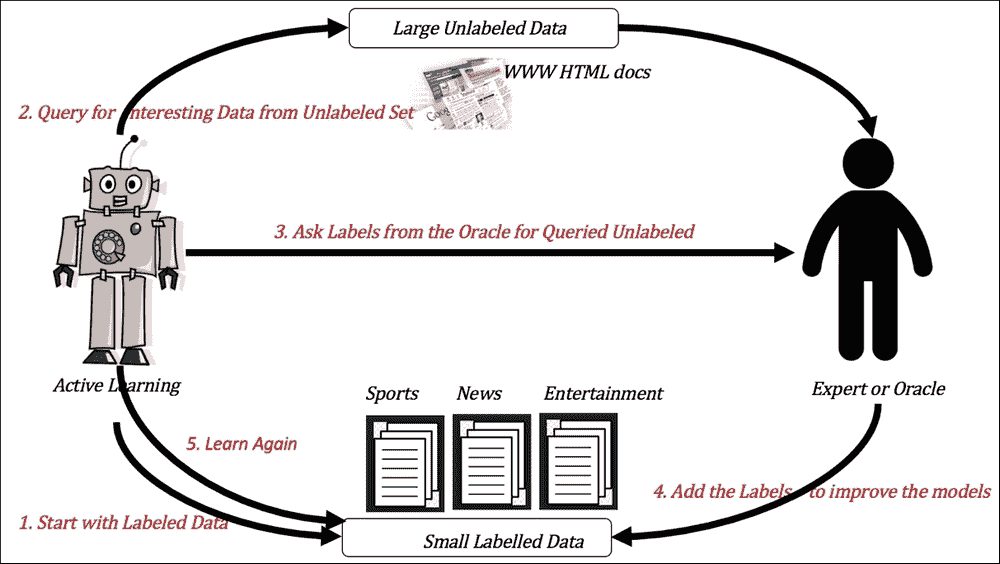

图 7. 与监督学习和半监督学习过程相比的主动机器学习过程。

## 表示和符号

数据集 *D*，它表示所有数据实例及其标签，由 *D* = {(**x**[1]，*y*[2])，(**x**[2]，*y*[2])，… (**x**[n]，*y*[n])} 给出，其中 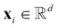 是数据个体的实例，而 {*y*[1]，*y*[2]，… *y*[n]} 是相关标签的集合。*D* 由两个集合 *U*（标记数据）和 *L*（未标记数据）组成。**x** 是无标签数据实例的集合 {**x**[1]，**x**[2]，… **x**[n]}。

数据集包含所有已知结果的有标签数据 {*y*[1]，*y*[2]，… *y*[l]}，而是结果未知的数据集。与之前一样，|*U*|>> |*L*|。

## 主动学习场景

主动学习场景可以广泛地分为：

+   **基于流的主动学习**：在此方法中，实例或示例仅从未标记数据集中选择，并决定是否忽略数据或将数据传递给专家以获取其标签（*参考文献*[10,11]）。

+   **基于池的主动学习**：在此方法中，从未标记数据集中查询实例，然后根据信息性进行排序，并从这些实例中选取一组发送给 Oracle 以获取标签（*参考文献*[12]）。

+   **查询合成**：在此方法中，学习者只有关于输入空间（特征）的信息，并从未标记集中合成查询以确定成员资格。这种方法在实用应用中很少使用，因为它通常不考虑数据生成分布，因此查询往往是任意或无意义的。

## 主动学习方法

无论涉及何种场景，每个主动学习方法都包括选择查询策略或采样方法，这为每个迭代中查询的选择建立了机制。每种方法都揭示了一种寻找具有最佳信息内容的未标记示例的独特方式，以改善学习过程。在以下小节中，我们描述了主要的查询策略框架，它们的工作原理，优点和局限性，以及每个框架中的不同策略。

### 不确定性采样

这种采样形式背后的关键思想是从未标记池中选择当前模型最不确定的实例。学习者可以避免模型更有信心或自信地分类的实例（*参考文献* [8]）。

基于概率的模型（如朴素贝叶斯、逻辑回归等）是此类方法的最自然选择，因为它们给出了对给定模型（例如，对于数据 **x** 的 *θ*，对于类别 *y*[i] *i* ϵ classes，以及作为后验概率的 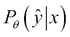）的置信度度量。

#### 如何工作？

所有基于不确定性的算法的一般过程概述如下：

1.  将数据初始化为已标记的，和未标记的，。

1.  当仍有未标记数据时：

    1.  使用标签数据 *L* 训练分类器模型 。

    1.  将分类器模型 *f* 应用于未标记数据 *U*，使用采样机制（见下一节）之一来评估信息性 *J*。

    1.  从 *U* 中选择 *k* 个最有信息性的数据作为集合 *L*[u]，从先知那里获取标签。

    1.  在上一步中获取的 *k* 个新标签数据点来增强标签数据：*L* = *L* ∪ *L*[u]。

1.  重复步骤 2 下的所有步骤。

下面给出了一些最常用的查询合成算法，用于从数据中采样信息实例。

##### 最不自信采样

在这项技术中，数据实例根据它们的置信度按逆序排序，最有可能被查询或选择的实例是模型最不自信的实例。背后的想法是最不自信的实例靠近边缘或分离超平面，获取它们的标签将是有效学习边界的最佳方式。

这可以表示为 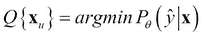。

这种方法的缺点在于它实际上只考虑了最佳信息；后验分布其余部分的信息没有被使用。

##### 最小边界采样

这是基于边界的采样，其中具有较小边界的实例比具有较大边界的实例具有更多的歧义。

这可以表示为 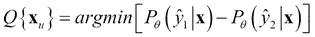，其中 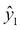 和 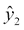 是实例 **x** 的两个标签。

##### 标签熵采样

熵，它是数据平均信息内容的度量，也是杂质度量，可以用来采样实例。这可以表示为：

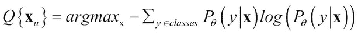

#### 优点和局限性

优点和局限性：

+   标签熵采样是最简单的方法，可以与任何概率分类器一起工作——这是最大的优势

+   异常值或错误反馈的存在可能被忽视，模型可能会退化

## 版本空间采样

假设 *H* 是所有特定模型集合，这些模型可以泛化或解释训练数据；例如，所有可能的权重集合，可以分离两个线性可分类别。版本空间 *V* 是假设 *H* 的子集，根据汤姆·米切尔（*参考文献* [15]）的定义与训练数据一致，如下所示 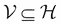。

这种采样的背后思想是从未标记的数据集中查询实例，以减少版本空间的大小或最小化 |*V*|。

### 通过不一致性查询（QBD）

QBD 是最早维护版本空间 *V* 的算法之一——当两个假设对新到达数据的标签不一致时，该实例被选中以从预言者或专家那里获取标签。

#### 如何工作？

整个算法可以总结如下：

1.  将  初始化为所有合法假设的集合。

1.  将数据初始化为  标记和  未标记。

1.  当数据 **x***[']* 在 *U* 中时：

    1.  如果 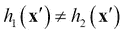 对于任何 *h*[2] ∈ *V*：

        1.  查询 **x***[']* 的标签并获取 *y[']*。

        1.  *V* = {h: h(**x**[']) = *y[']* 对于所有点。

    1.  否则：

        1.  忽略 **x***[']*。

##### 委员会查询（QBC）

通过委员会查询克服了与维护所有可能的版本空间相关的查询不一致性的限制，通过创建一个分类器委员会并使用它们的投票作为捕捉不一致性的机制（*参考文献* [7]）。

#### 如何工作？

对于此算法：

1.  将数据初始化为  标记和  未标记。

1.  在标记数据 *w* 上训练模型委员会 *C* = {*θ*¹*θ*², ... *θ*^c}（见下文）。

1.  对于所有数据 **x***^'* 在 *U* 中：

    1.  对 **x***'* 的预测进行投票，作为 {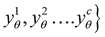}。

    1.  根据最大不一致性对实例进行排序（见下文）。

    1.  从 *U* 中选择 *k* 个最有信息量的数据作为集合 *L*[u]，以从预言者那里获取标签。

    1.  将 *k* 个新的标记数据点 *L* = *L* ∪ *L*[u] 添加到标记数据中。

    1.  使用新的 *L* 重新训练模型 {*θ*[1], *θ*[2], ... *θ*[c]}。

在训练学习者的委员会和选择不一致方法这两个任务中，每个都有各种选择。

训练不同的模型可以通过从 *L* 中选择不同的样本来完成，或者可以使用提升和袋装等集成方法进行训练。

投票熵是作为不一致性度量方法之一选择的。其数学表示方式如下：

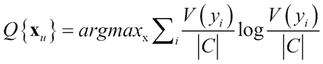

在这里，*V(y[i])* 是从所有可能的标签中给出的标签 *y*[i] 的投票数，而 |*C*| 是委员会的大小。

**库尔巴克-莱布勒**（**KL**）散度是两个概率分布之间差异的信息论度量。不一致性被量化为每个委员会预测与委员会 *C* 中共识的平均差异：

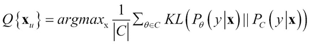

## 优点和局限性

优点和局限性如下：

+   简单性以及它可以与任何监督算法一起工作的事实给它带来了巨大的优势。

+   在某些条件下，有理论保证可以最小化误差和泛化。

+   通过不一致性查询（Query by Disagreement）受到维护大量有效假设的困扰。

+   这些方法仍然存在错误反馈被忽视和模型可能退化的问题。

## 数据分布采样

前面的方法基于样本对模型的不确定性或通过减少假设空间大小来选择未标记集中的最佳实例。这些方法都没有针对模型本身的最佳选择。数据分布采样的想法是，添加有助于减少模型误差的样本，有助于通过预期值（*参考文献* [13 和 14]）提高对未见实例的预测。

### 它是如何工作的？

有不同的方法来找到给定模型的最佳样本，我们将详细描述每一种方法。

#### 预期模型变化

这种想法的背后的目的是选择未标记集中将带来模型最大变化的示例：

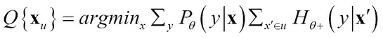

在这里，P[θ] (*y*|**x**) = **x** 标签的期望，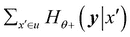 是在重新训练 **x** 后，包括 **x** *'* 的熵在未标记实例上的总和。

#### 预期误差减少

在这里，方法是选择未标记集中最能减少模型泛化误差的示例。泛化误差使用带有预期标签的未标记集进行衡量：

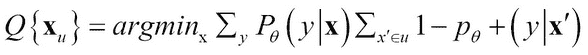

在这里，Pθ (*y*|**x**) = **x** 标签的期望，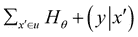 是在重新训练 **x** 后，包括 x*^'* 的熵在未标记实例上的总和。

##### 方差减少

以噪声-偏差-方差为参数，对样本外误差的估计的一般方程如下：

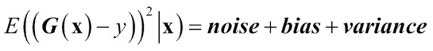

在这里，**G**(**x**) 是给定标签 *y* 的模型预测。在方差减少中，我们选择未标记集中最能减少模型方差的示例：

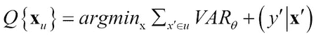

在这里，*θ* + 表示使用新点 **x** *^'* 和其标签 *y^'* 重新训练后的模型。

##### 密度加权方法

在这种方法中，我们从未标记集中选择与标记集平均相似度较高的示例。

这可以表示如下：

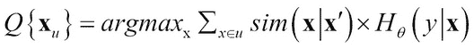

在这里，*sim*(**x**, **x** *^'*)是密度项或相似度项，其中 Hθ是基本效用度量。

## 优点和局限性

优点和局限性如下：

+   最大的优势是它们直接在模型上作为优化目标工作，而不是之前描述的隐式或间接方法。

+   这些方法可以在基于池或流的场景中工作

+   这些方法在界限和泛化方面有一些理论保证。

+   这些方法的最大缺点是计算成本高，实现困难。

# 主动学习案例研究

本案例研究使用另一个众所周知的公开数据集来展示使用开源 Java 库的主动学习技术。和之前一样，我们首先定义商业问题，使用的工具和框架，如何在解决方案中实现机器学习原理，以及数据分析步骤揭示了什么。接下来，我们描述了进行的实验，评估了各种模型的表现，并提供了结果分析。

## 工具和软件

在主动学习实验中，我们使用了 JCLAL 工具。JCLAL 是一个 Java 框架，用于主动学习，支持单标签和多标签学习。

### 注意

JCLAL 是开源的，并遵循 GNU 通用公共许可证分发：[`sourceforge.net/p/jclal/git/ci/master/tree/`](https://sourceforge.net/p/jclal/git/ci/master/tree/)。

## 商业问题

在这些实验中使用的鲍鱼数据集包含了鲍鱼的各种物理和解剖特征数据——通常被称为海蜗牛。目标是预测壳中的环数，这可以指示样本的年龄。

## 机器学习映射

正如我们所见，主动学习的特点是从小数据集开始，该数据集包含标签数据，并伴随查询未标记数据的技巧，以便我们逐步向标签集添加实例。这是分批进行的，每次迭代一批。迭代的次数和批量大小是这些技术的超参数。查询策略和用于在不断增加的标签实例上训练的监督学习方法的选择是额外的输入。

## 数据收集

如前所述，我们将使用来自 UCI 存储库的现有数据集（[`archive.ics.uci.edu/ml/datasets/Abalone`](https://archive.ics.uci.edu/ml/datasets/Abalone)）。数据库的原始所有者是澳大利亚塔斯马尼亚州初级工业和渔业部。

数据类型和属性描述与数据一起提供，并在*表 5*中重现。类别属性“环数”有 29 个不同的类别：

| 名称 | 数据类型 | 测量单位 | 描述 |
| --- | --- | --- | --- |
| 性别 | 名义 | M, F, 和 I (婴儿) | 样本的性别 |
| 长度 | 连续 | 毫米 | 最长壳的测量值 |
| 直径 | 连续 | 毫米 | 垂直于长度的 |
| 高度 | 连续 | 毫米 | 壳中有肉时 |
| 总重量 | 连续 | 克 | 整个鲍鱼 |
| 去壳重量 | 连续 | 克 | 肉的重量 |
| 内脏重量 | 连续 | 克 | 放血后的内脏重量 |
| 壳重量 | 连续 | 克 | 干燥后 |
| 环数 | 整数 | 计数 | +1.5 给出年龄（年） |

> *表 5. 鲍鱼数据集特征*

## 数据采样和转换

对于这个实验，我们将随机选择的 4,155 条记录作为未标记的，保留了剩余的 17 条作为标记的。数据没有进行任何转换。

## 特征分析和降维

仅使用八个特征，没有必要进行降维。数据集附带了一些关于特征的统计数据，在*表 6*中重现：

|   | **长度** | **直径** | **高度** | **整体** | **去壳** | **内脏** | **壳** | **环** |
| --- | --- | --- | --- | --- | --- | --- | --- | --- |
| 最小值 | 0.075 | 0.055 | 0 | 0.002 | 0.001 | 0.001 | 0.002 | 1 |
| 最大值 | 0.815 | 0.65 | 1.13 | 2.826 | 1.488 | 0.76 | 1.005 | 29 |
| 平均值 | 0.524 | 0.408 | 0.14 | 0.829 | 0.359 | 0.181 | 0.239 | 9.934 |
| 标准差 | 0.12 | 0.099 | 0.042 | 0.49 | 0.222 | 0.11 | 0.139 | 3.224 |
| 相关系数 | 0.557 | 0.575 | 0.557 | 0.54 | 0.421 | 0.504 | 0.628 | 1 |

> *表 6. 特征的汇总统计*

## 模型、结果和评估

我们进行了两组实验。第一组使用基于池的场景，第二组使用基于流的场景。在每组中，我们使用了熵采样、最不自信采样、边缘采样和投票熵采样。使用的分类器是朴素贝叶斯、逻辑回归和 J48（C4.5 的实现）。每个实验运行了 100 次迭代，批大小为 1 和 10。在*表 7*中，我们展示了这些结果的一个子集，具体是使用朴素贝叶斯、简单逻辑和 C4.5 分类器，批大小为 10 的基于池和基于流的场景。

### 备注

完整的结果集可以在[`github.com/mjmlbook/mastering-java-machine-learning/tree/master/Chapter4`](https://github.com/mjmlbook/mastering-java-machine-learning/tree/master/Chapter4)查看。

JCLAL 库需要一个 XML 配置文件来指定要使用哪种场景、选择的查询策略、批大小、最大迭代次数和基本分类器。以下是一个示例配置：

```py
<?xml version="1.0" encoding="UTF-8" standalone="no"?>
<experiment>
    <process evaluation-method-type="net.sf.jclal.evaluation.method.RealScenario">
        <file-labeled>datasets/abalone-labeled.arff</file-labeled>
        <file-unlabeled>datasets/abalone-unlabeled.arff</file-unlabeled>    
        <algorithm type="net.sf.jclal.activelearning.algorithm.ClassicalALAlgorithm">
      <stop-criterion type="net.sf.jclal.activelearning.stopcriteria.MaxIteration">
              <max-iteration>10</max-iteration>	
      </stop-criterion>
      <stop-criterion type="net.sf.jclal.activelearning.stopcriteria.UnlabeledSetEmpty"/>
            <listener type="net.sf.jclal.listener.RealScenarioListener">
                <informative-instances>reports/real-scenario-informative-data.txt</informative-instances>
            </listener>
            <scenario type="net.sf.jclal.activelearning.scenario.PoolBasedSamplingScenario">
                <batch-mode type="net.sf.jclal.activelearning.batchmode.QBestBatchMode">
                    <batch-size>1</batch-size>
                </batch-mode>
                <oracle type="net.sf.jclal.activelearning.oracle.ConsoleHumanOracle"/>
               <query-strategy type="net.sf.jclal.activelearning.singlelabel.querystrategy.EntropySamplingQueryStrategy">
                    <wrapper-classifier type="net.sf.jclal.classifier.WekaClassifier">
                        <classifier type="weka.classifiers.bayes.NaiveBayes"/>
                    </wrapper-classifier>
                </query-strategy>
            </scenario>
        </algorithm>
    </process>
</experiment>
```

工具本身是通过以下方式调用的：

```py
java -jar jclal-<version>.jar -cfg <config-file>

```

### 基于池的场景

在以下三个表中，我们比较了使用基于池的场景时，使用朴素贝叶斯、简单逻辑和 C4.5 分类器的结果。

**朴素贝叶斯：**

| 实验 | ROC 曲线下面积 | F 度量 | 假正率 | 精确率 | 召回率 |
| --- | --- | --- | --- | --- | --- |
| PoolBased-EntropySampling-NaiveBayes-b10 | 0.6021 | 0.1032 | 0.0556(1) | 0.1805 | 0.1304 |
| PoolBased-KLDivergence-NaiveBayes-b10 | 0.6639(1) | 0.1441(1) | 0.0563 | 0.1765 | 0.1504 |
| PoolBased-LeastConfidentSampling-NaiveBayes-b10 | 0.6406 | 0.1300 | 0.0827 | 0.1835(1) | 0.1810(1) |
| PoolBased-VoteEntropy-NaiveBayes-b10 | 0.6639(1) | 0.1441(1) | 0.0563 | 0.1765 | 0.1504 |

> *表 7. 使用朴素贝叶斯分类器的基于池的场景性能*

**逻辑回归**:

| 实验 | ROC 曲线下面积 | F 度量 | 假正率 | 精确率 | 召回率 |
| --- | --- | --- | --- | --- | --- |
| PoolBased-EntropySampling-SimpleLogistic-b10 | 0.6831 | 0.1571 | 0.1157 | 0.1651 | 0.2185(1) |
| PoolBased-KLDivergence-SimpleLogistic-b10 | 0.7175(1) | 0.1616 | 0.1049 | 0.2117(1) | 0.2065 |
| PoolBased-LeastConfidentSampling-SimpleLogistic-b10 | 0.6629 | 0.1392 | 0.1181(1) | 0.1751 | 0.1961 |
| PoolBased-VoteEntropy-SimpleLogistic-b10 | 0.6959 | 0.1634(1) | 0.0895 | 0.2307 | 0.1880 |

> *表 8. 使用逻辑回归分类器的基于池的场景性能*

**C4.5**:

| 实验 | ROC 曲线下面积 | F 度量 | 假正率 | 精确率 | 召回率 |
| --- | --- | --- | --- | --- | --- |
| PoolBased-EntropySampling-J48-b10 | 0.6730(1) | 0.3286(1) | 0.0737 | 0.3432(1) | 0.32780(1) |
| PoolBased-KLDivergence-J48-b10 | 0.6686 | 0.2979 | 0.0705(1) | 0.3153 | 0.2955 |
| PoolBased-LeastConfidentSampling-J48-b10 | 0.6591 | 0.3094 | 0.0843 | 0.3124 | 0.3227 |
| PoolBased-VoteEntropy-J48-b10 | 0.6686 | 0.2979 | 0.0706 | 0.3153 | 0.2955 |

> *表 9. 使用 C4.5 分类器的基于池的场景性能*

### 基于流的场景

在以下三个表中，我们展示了使用朴素贝叶斯、逻辑回归和 C4.5 分类器以及四种不同采样方法在基于流的场景下的实验结果。

**朴素贝叶斯**:

| 实验 | ROC 曲线下面积 | F 度量 | 假正率 | 精确率 | 召回率 |
| --- | --- | --- | --- | --- | --- |
| StreamBased-EntropySampling-NaiveBayes-b10 | 0.6673(1) | 0.1432(1) | 0.0563 | 0.1842(1) | 0.1480 |
| StreamBased-LeastConfidentSampling-NaiveBayes-b10 | 0.5585 | 0.0923 | 0.1415 | 0.1610 | 0.1807(1) |
| StreamBased-MarginSampling-NaiveBayes-b10 | 0.6736(1) | 0.1282 | 0.0548(1) | 0.1806 | 0.1475 |
| StreamBased-VoteEntropyQuery-NaiveBayes-b10 | 0.5585 | 0.0923 | 0.1415 | 0.1610 | 0.1807(1) |

> *表 10. 使用朴素贝叶斯分类器的基于流的场景性能*

**逻辑回归**:

| 实验 | ROC 曲线下面积 | F 度量 | 假正率 | 精确率 | 召回率 |
| --- | --- | --- | --- | --- | --- |
| StreamBased-EntropySampling-SimpleLogistic-b10 | 0.7343(1) | 0.1994(1) | 0.0871 | 0.2154 | 0.2185(1) |
| StreamBased-LeastConfidentSampling-SimpleLogistic-b10 | 0.7068 | 0.1750 | 0.0906 | 0.2324(1) | 0.2019 |
| StreamBased-MarginSampling-SimpleLogistic-b10 | 0.7311 | 0.1994(1) | 0.0861 | 0.2177 | 0.214 |
| StreamBased-VoteEntropy-SimpleLogistic-b10 | 0.5506 | 0.0963 | 0.0667(1) | 0.1093 | 0.1117 |

> *表 11. 使用逻辑回归分类器的基于流的场景性能*

**C4.5**:

| 实验 | ROC 曲线下面积 | F 度量 | 假正率 | 精确率 | 召回率 |
| --- | --- | --- | --- | --- | --- |
| StreamBased-EntropySampling-J48-b10 | 0.6648 | 0.3053 | 0.0756 | 0.3189(1) | 0.3032 |
| StreamBased-LeastConfidentSampling-J48-b10 | 0.6748(1) | 0.3064(1) | 0.0832 | 0.3128 | 0.3189(1) |
| StreamBased-MarginSampling-J48-b10 | 0.6660 | 0.2998 | 0.0728(1) | 0.3163 | 0.2967 |
| StreamBased-VoteEntropy-J48-b10 | 0.4966 | 0.0627 | 0.0742 | 0.1096 | 0.0758 |

> *表 12. 使用 C4.5 分类器的基于流的场景性能*

## 主动学习结果分析

看到基于池的、基于委员会的查询——一种集成方法——使用 KL 散度采样在大多数分类器上表现良好，这确实很有趣。正如章节中讨论的，这些方法已经被证明通过保持一个大的假设空间来减少错误，并且这个实验结果从实证上支持了这一点。

基于池的、基于熵的采样使用 C4.5 作为分类器具有最高的精确率、召回率、假正率和 F 度量。此外，在基于流的熵采样中使用 C4.5，指标也相似地很高。使用不同的采样技术和基于池的 C4.5，如 KL 散度、最不自信或投票熵，指标显著更高。因此，这可以更强烈地归因于底层分类器 C4.5 在寻找非线性模式方面的能力。

考虑到 AUC，逻辑回归算法在基于流和基于池的情况下都表现非常好。这可能完全是因为 LR 在置信映射方面有一个很好的概率方法，这是获得良好 AUC 分数的重要因素。

# 摘要

在前几章中，我们游览了监督学习和无监督学习技术及其在现实世界数据集上的应用，本章介绍了**半监督学习**（**SSL**）和**主动学习**（**AL**）的概念、技术和工具。

在 SSL 中，我们被给予一些标记的示例和许多未标记的示例——目标是要么简单地训练标记的示例以对未标记的示例进行分类（归纳 SSL），要么使用未标记和标记的示例来训练模型以正确分类新的、未见过的数据（归纳 SSL）。SSL 中的所有技术都基于与半监督平滑性、聚类一致性和流形一致性相关的假设之一或多个。

不同的半监督学习（SSL）技术适用于不同的场景。简单的自训练 SSL 方法直接且与大多数监督学习算法兼容；当数据来自多个领域时，协同训练 SSL 是一个合适的方法。当簇内聚假设成立时，可以使用簇和标签 SSL 技术；通过传递图标签传播利用“接近度”度量，这可能计算成本较高。传递 SVM 在线性或非线性数据上表现良好，我们通过使用`JKernelMachines`库在 UCI 乳腺癌数据集上训练具有高斯核的 TSVM 的例子来展示。在章节 SSL 部分的结尾部分，我们展示了使用图形 Java 工具 KEEL 比较 SSL 模型的实验。

我们在章节的后半部分介绍了主动学习（AL）。在这种学习中，使用各种策略查询数据集的无标签部分，以便向专家展示将证明从整个数据集中学习最有效的示例。作为专家或先知，为所选实例提供标签后，学习者稳步提高其泛化能力。AL 技术以分类器或分类器委员会的选择以及重要的查询策略选择为特征。这些策略包括不确定性采样，其中查询最没有信心的实例，版本采样，其中选择解释训练数据的假设子集，以及数据分布采样，这涉及通过选择会减少泛化错误的选项来改进模型。我们通过使用 UCI 鲍鱼数据集的案例研究来展示主动学习的实际应用。这里使用的工具是用于主动学习的 JCLAL Java 框架。

# 参考文献

1.  Yarowsky, D (1995). *无监督词义消歧与监督方法相媲美*。第 33 届计算语言学协会年会论文集（第 189–196 页）

1.  Blum, A.，and Mitchell, T (1998). *结合有标签和无标签数据与协同训练*。COLT：计算学习理论研讨会论文集。

1.  Demiriz, A.，Bennett, K.，and Embrechts, M (1999). *使用遗传算法进行半监督聚类*。人工神经网络在工程中的应用研讨会论文集。

1.  Yoshua Bengio, Olivier Delalleau, Nicolas Le Roux (2006). *标签传播和二次准则*。在半监督学习，第 193-216 页

1.  T. Joachims (1998). *基于支持向量机的文本分类的归纳推理*，ICML.

1.  B. Settles (2008). *好奇的机器：具有结构实例的主动学习*。威斯康星大学麦迪逊分校博士论文。

1.  D. Angluin (1988). *查询和概念学习*。机器学习，2:319–342.

1.  D. Lewis 和 W. Gale (1994). *训练文本分类器的顺序算法*. 见《ACM SIGIR 信息检索研究与发展会议论文集》（ACM SIGIR Conference on Research and Development in Information Retrieval），第 3–12 页。ACM/Springer。

1.  H.S. Seung, M. Opper, 和 H. Sompolinsky (1992). *委员会查询*. 见《计算学习理论研讨会论文集》（ACM Workshop on Computational Learning Theory），第 287–294 页。

1.  D. Cohn, L. Atlas, R. Ladner, M. El-Sharkawi, R. Marks II, M. Aggoune, and D. Park (1992). *使用查询和选择性采样训练连接主义网络*. 见《神经网络信息处理系统进展》（NIPS），摩根考夫曼出版社。

1.  D. Cohn, L. Atlas, 和 R. Ladner (1994). *通过主动学习提高泛化能力*. 机器学习，15(2):201–221。

1.  D. Lewis 和 J. Catlett (1994). *用于监督学习的异质不确定性采样*. 见《国际机器学习会议论文集》（ICML），第 148–156 页。摩根考夫曼出版社。

1.  S. Dasgupta, A. Kalai, 和 C. Monteleoni (2005). *基于感知器的主动学习分析*. 见《学习理论会议论文集》（COLT），第 249–263 页。斯普林格出版社。

1.  S. Dasgupta, D. Hsu, 和 C. Monteleoni (2008). *一个通用的无监督主动学习算法*. 见《神经网络信息处理系统进展》（NIPS），第 20 卷，第 353–360 页。麻省理工学院出版社。

1.  T. Mitchell (1982). *泛化作为搜索*. 人工智能，18:203–226。
