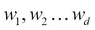
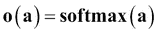
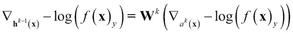

# 第七章：深度学习

在*《实际应用中的监督学习》*的第二章中，我们讨论了不同的一般监督分类技术，这些技术可以广泛应用于各种应用。在监督非线性技术的领域，特别是在计算机视觉中，深度学习及其变体正产生显著影响。我们发现深度学习及其相关方法可以应用于图像识别、图像和对象标注、电影描述，甚至包括文本分类、语言建模、翻译等领域。（*参考文献* [1, 2, 3, 4, 和 5]）

为了为深度学习做准备，我们将首先描述神经元是什么以及它们如何被排列来构建多层神经网络，展示这些网络的核心元素，并解释它们的工作原理。然后，我们将讨论与神经网络相关的问题和挑战，这些挑战导致了深度学习在技术和结构上的进步。我们将了解深度学习的一些构建块，如受限玻尔兹曼机和自编码器。然后，我们将通过监督学习和无监督学习的不同变体来探索深度学习。接下来，我们将游览卷积神经网络（CNN），并通过一个用例，通过分解 CNN 在计算机视觉领域的应用来展示它们的工作原理。我们将介绍循环神经网络（RNN）及其变体，以及它们在文本/序列挖掘领域的应用。最后，我们将通过使用 MNIST 图像的真实数据案例研究来比较/对比不同的技术。我们将使用 DeepLearning4J 作为我们的 Java 工具包来执行这些实验。

# 多层前馈神经网络

从历史上看，人工神经网络主要被识别为多层前馈感知器，因此我们将从讨论这类网络的结构的基本元素开始，包括如何训练它们、过拟合问题以及解决该问题的技术。

## 输入、神经元、激活函数和数学符号

单个神经元或感知器与第二章中线性回归主题所描述的单位相同，即*《实际应用中的监督学习》*。在本章中，数据实例向量将由*x*表示，具有*d*个维度，每个维度可以表示为。与每个维度相关联的权重表示为一个具有*d*个维度的权重向量*w*，每个维度可以表示为。每个神经元都有一个额外的输入*b*，称为偏置。

神经元预激活执行由以下给出的输入线性变换：


激活函数由给出，它将神经元输入转换为以下形式：


图 1. 具有输入、权重和偏置的感知器生成输出。

## 多层神经网络

多层神经网络是理解深度学习网络的第一步，因为多层网络的基本概念和原语构成了所有深度神经网络的基础。

### 结构和数学符号

在本节中，我们介绍了神经网络的一般结构。大多数神经网络都是这里概述的结构变体。我们还展示了本章其余部分我们将使用的相关符号。


图 2. 展示输入层、两个隐藏层和输出层的多层神经网络。

与神经网络相关的最常见监督学习算法使用多层感知器。输入层由几个神经元组成，每个神经元独立连接到输入，并有自己的权重和偏置集。除了输入层之外，还有一层或更多被称为隐藏层的神经元。输入层神经元连接到第一隐藏层中的每个神经元，该层同样连接到下一隐藏层，依此类推，形成一个全连接网络。连接到最后隐藏层的神经元层被称为输出层。

每个隐藏层由表示，其中*k*是层。对于*0 < k * *< l*层的预激活由以下给出：


的隐藏层激活：


最终输出层激活为：


输出通常是每个神经元一个类别，并且调整方式使得只有一个神经元激活，其他所有神经元的输出都是 0。使用的 softmax 函数来给出结果。

### 神经网络中的激活函数

在以下章节中给出了神经网络中使用的一些最著名的激活函数，它们之所以被使用，是因为学习过程中所需的导数可以用函数本身来表示。

#### Sigmoid 函数

Sigmoid 激活函数由以下方程给出：


它可以被视为一个有界、严格递增且正的变换函数，将值压缩在 0 和 1 之间。

#### 双曲正切("tanh")函数

Tanh 函数由以下方程给出：


它可以被视为有界、严格递增的，但作为一个将值压缩在-1 和 1 之间的正或负变换函数。

### 训练神经网络

在本节中，我们将讨论从输入训练集训练神经网络的要素，这与我们在第二章中讨论的方式非常相似，即*实际应用世界监督学习*。数据集用 *D* 表示，由单个数据实例组成。实例通常表示为的集合。每个实例的标签表示为的集合。整个带标签的数据集，具有数值或实值特征，表示为集合中的配对元素，如所示。

#### 经验风险最小化

经验风险最小化是一个通用的机器学习概念，在许多分类或监督学习中得到应用。这种技术背后的主要思想是将训练或学习问题转化为一个优化问题（*参考文献* [13]）。

给定神经网络的参数为 **?** = ({**W**¹, **W**², … **W** *^l* ^(+1)}, {**b**¹, **b**², …**b** *^L* ^(+1)})，训练问题可以看作是寻找最佳参数 (*?*)，使得


其中  随机梯度下降（SGD）在第二章（ch02.html "第二章. 实际应用世界监督学习"）和第五章（ch05.html "第五章. 实时流机器学习"）中讨论，*实际应用世界监督学习*和*实时流机器学习*，通常用作优化过程。应用于训练神经网络的 SGD 如下：

1.  初始化 **?** = ({**W**¹, **W**², … **W***^l* ^(+1)}, {**b**¹, **b**², …**b***^L* ^(+1)})

1.  对于 i=1 到 *N* 个 epoch

    1.  对于每个训练样本（**x**^t，*y*^t）//找到函数 2 的梯度 ?= ?+ a? //沿方向移动

这里使用的学习率（a）将通过减少接近最优解的振荡来影响算法的收敛；选择正确的 a 值通常是一个超参数搜索，需要使用第二章中描述的验证技术。

因此，为了学习神经网络的参数，我们需要选择一种参数初始化的方法，选择一个损失函数 ，计算参数梯度 ，将损失反向传播，选择正则化/惩罚函数 O(*?*)，并计算正则化的梯度 。在接下来的几节中，我们将逐步描述这一过程。

##### 参数初始化

神经网络的参数是输入层、通过隐藏层到输出层的每一层的权重和偏置。在这个领域已经进行了很多研究，因为优化取决于起始或初始化。偏置通常设置为 0。权重初始化取决于激活函数，因为一些函数，如 tanh，其值 0 不能使用。通常，初始化每一层权重的办法是使用具有用户定义边界的对称函数进行随机初始化。

##### 损失函数

损失函数的主要作用是最大化预测输出标签与输入数据向量类别的匹配程度。

因此，最大化  等同于最小化负对数似然或交叉熵：


##### 梯度

我们将描述输出层和隐藏层的梯度，而不涉及推导，因为这超出了本书的范围。感兴趣的读者可以在 Rumelhart、Hinton 和 Williams 的文本中看到推导（*参考文献* [6]）。

###### 输出层的梯度

输出层的梯度可以计算为：


其中 *e(y)* 被称为“独热向量”，其中向量的一个值是 1，对应正确的类别 *y*，其余都是 0。

输出层预激活的梯度可以类似地计算：


= – (**e**(y) – **f**(**x**))

###### 隐藏层梯度

隐藏层梯度是使用偏微分链式法则计算的。

隐藏层梯度 


隐藏层预激活的梯度可以表示为：


由于隐藏层预激活需要如前所述的激活函数的偏导数（*g'*(*a*^k**x**[j]）），因此之前描述的一些著名激活函数在方程本身中有偏导数，这使得计算非常容易。

例如，sigmoid 函数的偏导数为 *g'(a) = g(a)(*1 *– g(a))*，而对于 tanh 函数，它是 1 – *g*(a)²。

###### 参数梯度

参数的损失梯度必须使用权重和偏差的梯度来计算。权重的梯度可以表示为：


偏差的梯度可以表示为：


##### 前向传播和反向传播

神经网络训练的目的是调整每一层的权重和偏差，以便基于输出层的反馈和损失函数（该函数估计预测输出与实际输出之间的差异），最小化这种差异。

基于初始权重和偏差的神经网络算法可以看作是按层逐层前向计算，如图所示的单隐藏层无环流程图，以演示流程：


图 3：前向传播中神经网络作为图的流程。

从输入向量和预初始化的权重和偏差值开始，计算后续的每个元素：预激活、隐藏层输出、最终层预激活、最终层输出以及相对于实际标签的损失函数。在反向传播中，流向正好相反，从输出层的损失到第一层的权重和偏差，如下图所示：


图 4：反向传播中神经网络作为图的流程。

##### 它是如何工作的？

反向传播算法（*参考文献* [6 和 7]）整体上可以总结如下：

计算激活前的输出梯度：


对于隐藏层 *k=l+1 到 1*：

计算隐藏层参数的梯度：


计算当前隐藏层以下的隐藏层梯度：



计算激活前的层梯度：


##### 正则化

在之前定义的经验风险最小化目标中，正则化用于解决机器学习中的过拟合问题，如第二章《实际应用中的监督学习》中所述。以下给出了众所周知的正则化函数。

###### L2 正则化

这只应用于权重，而不应用于偏差，并且对于连接 (*i,j*) 元件的层给出如下：


此外，正则化器的梯度可以计算为 。它们通常被解释为权重分布上的“高斯先验”。

###### L1 正则化

这只应用于权重，而不应用于偏差，并且对于连接 *(i,j)* 组件的层给出如下：


而这个正则化器的梯度可以计算为 。它通常被解释为权重分布上的“拉普拉斯先验”。

# 神经网络的局限性

在本节中，我们将详细讨论神经网络面临的问题，这将成为构建深度学习网络的垫脚石。

## 消失梯度、局部最优和慢速训练

神经网络的主要问题之一是“消失梯度”问题 (*参考文献* [8])。我们将尝试给出对该问题的简单解释，而不是深入探讨数学推导。我们将选择 sigmoid 激活函数和两层神经网络，如图所示，以演示该问题：


图 5：消失梯度问题。

正如我们在激活函数描述中看到的，sigmoid 函数将输出压缩在 0 和 1 之间。sigmoid 函数的导数 *g'(a) = g(a)(*1 *– g(a))* 的范围在 0 和 0.25 之间。学习的目标是使输出损失最小化，即 。一般来说，输出误差不会降到 0，所以最大迭代次数；一个用户指定的参数决定了学习的质量和误差的反向传播。

简化以说明输出误差对输入权重层的影响：


每个转换，例如，从输出到隐藏，涉及两个小于 1 的项的乘法：


因此，当它达到输入层时，值变得如此之小，以至于梯度的传播几乎消失。这被称为消失梯度问题。

当你需要添加更多层来使隐藏层中的特征更加有趣时，就会出现一个矛盾的情况。但添加更多层也会增加错误。随着你添加更多层，输入层变得“训练缓慢”，这导致输出层更加不准确，因为它们依赖于输入层；进一步地，对于相同的迭代次数，随着层数的增加，错误也会增加。

在固定最大迭代次数的情况下，更多的层和缓慢的误差传播可能导致“局部最优”。

基本神经网络的一个问题是参数的数量。随着层数的增加，找到每个隐藏层和偏置的有效大小和权重变得更加具有挑战性。如果我们增加层数，参数将以多项式增长。为数据拟合参数需要大量的数据样本。这可能导致之前讨论过的问题，即过拟合。

在接下来的几节中，我们将开始学习帮助克服这些问题的深度学习构建块。

# 深度学习

深度学习包括用于监督学习和无监督学习的架构和技术，它能够使用由构建块组成的网络来内化高维数据的抽象结构，以创建判别性或生成模型。这些技术在近年来证明取得了巨大成功，任何希望掌握这些技术的读者都必须首先熟悉深度学习的基本构建块，并了解从业者使用的各种网络类型。如果你打算更深入地了解该主题，那么实际构建和调整深度神经网络的经验是无价的。在图像分类和文本学习等各个领域，深度学习在其结构中融合了特征生成，从而使得在许多应用中挖掘特征的任务变得多余。以下章节提供了概念、构建块、架构组合技术和训练深度网络的指南。

## 深度学习的构建块

在以下章节中，我们将介绍深度学习中最重要的组件，包括受限玻尔兹曼机、自编码器和去噪自编码器，它们的工作原理以及它们的优缺点。

### 矩形线性激活函数

Reclin 函数由以下方程给出：

*g*(*a*) *= reclin* (*a*) *= max* (0*,* *a*)

它可以看作是下限为 0 且没有上限，严格递增，并且仅对正数进行线性变换的正变换函数。

可以更容易地看出，修正线性单元或 ReLu 对于大于 0 的值具有 1 或恒等导数。这作为一个显著的好处，因为导数没有被压缩，并且在链式操作中不具有递减值。ReLu 的一个问题是对于负输入值，其值为 0，相应的神经元充当“死亡”状态，尤其是在偏置项学习到较大的负值时。ReLu 无法从这种情况中恢复，因为输入和导数都是 0。这通常通过具有“泄漏 ReLu”来解决。这些函数对于负输入值具有较小的值，并由以下公式给出 ，其中 ? = 0.01，通常是。

### 受限玻尔兹曼机

受限玻尔兹曼机（RBM）是一种无监督学习神经网络（*参考文献* [11]）。RBM 的想法是从标记或未标记数据中提取“更有意义的特征”。它还旨在在获取标记数据成本高昂或困难时，从许多领域中的大量未标记数据中“学习”。

#### 定义和数学符号

在其基本形式中，RBM 假设每个维度上的输入是二进制值 0 或 1。RBM 是无向图模型，具有两层，一个表示为*x*的可见层和一个隐藏层*h*，以及连接*W*。

RBM 定义了一个涉及隐藏层潜在变量的可见层分布。首先定义一个能量函数来捕捉可见层和隐藏层之间在向量形式上的关系：


在标量形式中，能量函数可以定义为：


分布的概率由给出，其中*Z*被称为“配分函数”，它是对所有* x 和 h*值的枚举，它们是二进制值，导致指数项，因此使其难以处理！


图 6：可见层和隐藏层之间的连接。

相同内容的马尔可夫网络视图可以用所有成对因子表示，如下图所示。这也清楚地说明了为什么它被称为“受限”玻尔兹曼机，因为给定隐藏层或可见层内的单元之间没有连接：


图 7：输入和隐藏层作为标量

我们已经看到，整个概率分布函数难以处理。现在我们将推导出*x, h*的基本条件概率分布。

#### 条件分布

虽然计算整个*p(x, h)*是难以处理的，但*p(x|h)*或*p(h|x)*的条件分布可以很容易地定义并证明是伯努利分布且可处理：


类似地，由于对称和无向性：


#### RBM 中的自由能

输入或观察变量的分布是：


函数*F(x)*被称为自由能。

#### 训练 RBM

RBM 是通过在整个训练数据上最小化平均负对数似然度来训练的。这可以表示为：


优化是通过使用随机梯度下降来进行的：


术语被称为“正相”，而术语被称为“负相”，因为它们对概率分布的影响——正相，因为它通过减少自由能来增加训练数据的概率，而负相，因为它减少了模型生成的样本的概率。

已经证明，由于“负相”，整体梯度难以从理论上计算，因为它是在模型形成的分布下计算输入数据的所有可能配置的期望，这使得它变得难以处理！

为了使计算可行，使用固定数量的模型样本进行估计，并将它们称为“负粒子”，用*N*表示。

梯度现在可以写成近似形式：


其中粒子是通过一些采样技术（如蒙特卡洛方法）采样的。

#### RBM 中的采样

吉布斯抽样通常用于生成样本并学习*p(x,h)*的概率，这是基于*p(x|h)*和*p(h|x)*，它们相对容易计算，如前所述。

对 N 个随机变量进行联合采样的吉布斯抽样是通过 N 个形式的采样子步骤来完成的，其中*S* *[-i]*包含从步骤*S* *[i]*到但不包括步骤*S* *[i]*的样本。从图形上看，可以表示如下：


图 8：隐藏层和输入层之间采样的图形表示。

如所示，采样表示实际的分布*p(x,h)*。

#### 对比散度

对比散度（CD）是用于加速先前描述的吉布斯抽样过程的一个技巧，它停止在过程的步骤*k*而不是长时间继续以保证收敛。已经看到，即使*k=1*也是合理的，并且给出了良好的性能（*参考文献* [10]）。

##### 输入和输出

这些是算法的输入：

+   训练数据集

+   吉布斯抽样的步数，*k*

+   学习率 a

+   输出是更新后的参数集

##### 它是如何工作的？

使用自由能函数和偏导数的 CD 的完整训练伪代码可以表示为：

1.  对于训练中的每个实例**x**^t：

    1.  使用* k* 步吉布斯抽样生成一个负粒子。

    1.  更新参数：

    

#### 持续对比散度

持续对比散度是另一种用于计算联合概率 *p(x,h)* 的技巧。在此方法中，有一个单链，在观察每个样本后不会重新初始化，以找到负粒子 。它保持其状态，并且参数仅通过运行这些 k 状态并通过使用前一步的粒子来更新。

### 自编码器

自编码器是神经网络中另一种无监督学习技术。它与开头描述的前馈神经网络非常相似，唯一的区别是它不生成输出层的类别，而是在输出层尝试复制输入。(*参考文献[12 和 23]*) 目标是让隐藏层捕获输入的潜在或隐藏信息作为特征，这些特征在无监督或监督学习中可能是有用的。

#### 定义和数学符号

以下图中展示了自编码器的单个隐藏层示例：


图 9：层之间的自编码器流程

输入层和输出层具有与前馈网络相同的神经元数量，对应于输入向量 *x*。每个隐藏层可以比输入层或输出层有更多的神经元，也可以相等或更少，并且有一个执行信号的非线性变换的激活函数。它可以看作是使用无监督或潜在隐藏结构来“压缩”数据。

隐藏层通过数据编码器或输入变换如下所示：


并且数据通过输出层的解码器或输出变换如下所示：


通常，在层中使用描述在神经网络部分的信号线性变换的 Sigmoid 函数是流行的：

 和 )

#### 损失函数

损失函数的工作是减少训练误差，就像之前一样，以便可以使用如随机梯度函数之类的优化过程。

在二元值输入的情况下，损失函数通常是平均交叉熵，如下所示：


可以很容易地验证，当输入信号和输出信号匹配 0 或 1 时，误差为 0。同样，对于实值输入，使用平方误差：


用于随机梯度过程的损失函数的梯度与前馈神经网络相似，可以通过推导在实值和二进制中展示如下：


通过反向传播来获得参数梯度，这与神经网络中的操作完全相同。

#### 自动编码器的局限性

自动编码器存在一些已知的缺点，这些问题将在后续章节中讨论。这些局限性包括：

当自动编码器的大小等于输入层中的神经元数量时，存在一种可能性，即自动编码器学习到的权重只是身份向量，整个表示仅仅将输入原封不动地传递为输出，损失为零。因此，它们模拟了“死记硬背”或“记忆”而没有任何泛化。

当自动编码器的大小大于输入层中的神经元数量时，这种配置称为“过完备”隐藏层，可能存在与之前提到的问题相似的问题。一些单元可能被关闭，而其他单元可能成为身份，使其仅成为复制单元。

当自动编码器的大小小于输入层中的神经元数量，称为“欠完备”时，可以在数据中发现潜在结构或重要的隐藏组件。

#### 去噪自动编码器

如前所述，当自动编码器的隐藏层大小大于或等于输入层时，并不能保证学习到权重，它可能仅仅是一个将输入复制到输出的单元开关。这个问题通过去噪自动编码器得到解决。在这里，在输入和隐藏层之间增加了一个额外的层。这个层使用已知的分布或使用随机噪声（例如将二进制输入中的一个位转换为 0）向输入添加一些噪声。这个“噪声”输入随后通过从隐藏层到输出层的精确学习过程，就像自动编码器一样。去噪自动编码器的损失函数将输出与实际输入进行比较。因此，添加的噪声和更大的隐藏层使得学习潜在结构或添加/删除冗余以在输出端产生精确信号成为可能。这种架构——其中噪声层中的非零特征在信号向前推进时由激活层转换成隐藏层中的特征——为学习过程提供了鲁棒性和隐式结构（*参考文献* [15]）。


图 10：去噪自动编码器

### 无监督预训练和监督微调

正如我们在神经网络问题部分所讨论的，过拟合问题在深度学习中尤为突出，因为层数和参数数量都很大。解决过拟合的一种方法是对数据进行特定正则化。在本节中，我们将描述在隐藏层中进行的“无监督预训练”方法，以克服过拟合问题。请注意，这通常是许多深度学习算法中使用的“初始化过程”。

无监督预训练算法以层级的贪婪方式工作。如图所示，在给定时间考虑一个可见和隐藏结构的一层。使用之前描述的无监督技术（如 RBM）对该层的权重进行几次迭代学习。然后，隐藏层的输出被用作“可见”或“输入”层，训练继续进行到下一层，依此类推。

每层的学习可以被视为一个“特征提取或特征生成”过程。当实际数据输入被转换时，在给定层形成高级特征，然后进一步组合形成更高层次的特征，依此类推。


图 11：通过无监督学习逐层增量学习。

一旦在预训练中使用之前描述的无监督技术学习所有隐藏层参数，接下来将进行监督微调过程。在监督微调过程中，添加一个最终输出层，就像在神经网络中一样，通过前向和反向传播进行训练。其想法是大多数权重或参数几乎完全调整，只需要微小变化就能在输出产生判别性类别映射。


图 12：最终调整或监督学习。

### 深度前馈神经网络

深度前馈神经网络涉及使用预训练和微调阶段。

根据使用的无监督学习技术——RBM、自编码器或降噪自编码器——形成不同的算法：堆叠 RBM、堆叠自编码器和堆叠降噪自编码器，分别。

#### 输入和输出

给定深度前馈神经网络的架构，以下是为训练网络提供的输入：

+   层数数量 *L*

+   没有标签的数据集 *D*

+   带有标签的数据集 *D*

+   训练迭代次数 *n*

#### 它是如何工作的？

所有三种的通用学习/训练算法如下所示：

1.  对于层 *l=1 到 L*（预训练）：

    1.  没有标签的数据集 

    1.  执行逐步层无监督学习（RBM、自编码器或降噪自编码器）

    1.  从前一步骤中最终确定参数 **W**^l, **b**^l

1.  对于输出层 *(L+1)* 执行参数 **W***^L*^(+1), **b***^L* ^(+1) 的随机初始化。

1.  对于层 *l=1 到 L+1*（微调）：

    1.  带标签的数据集 。

    1.  使用从 1.（**W**^l, **b**^l）预初始化的权重。

    1.  进行 *n* 次前向-反向传播。

### 深度自编码器

深度自编码器具有许多隐藏单元层，这些层缩小到一个非常小的维度，然后对称地增长到输入大小。


图 13：深度自编码器

深度自编码器背后的想法是使用深度网络创建能够捕捉输入的潜在复杂结构的特征，同时克服由于深度结构导致的梯度消失和欠拟合问题。已经证明，这种方法生成的特征在许多数据集上比 PCA 表现更好（*参考文献* [13]）。

深度自编码器使用预训练、编码器/解码器和微调的概念来执行无监督学习：

在预训练阶段，使用 RBM 方法学习编码器的贪婪逐步参数，如图所示，用于初始化：


图 14：RBM 的逐步学习

在展开阶段，相同的参数对称地应用于解码器网络进行初始化。

最后，使用全网络的反向传播微调来调整参数。

### 深度信念网络

深度信念网络（DBNs）是无监督预训练概念的起源（*参考文献* [9]）。无监督预训练起源于 DBNs，后来发现它在前馈监督深度网络中也同样有用和有效。

深度信念网络不是监督的前馈网络，而是一个生成模型，用于生成数据样本。

#### 输入和输出

输入层是数据的实例，每个输入特征用一个神经元表示。DBN 的输出是从学习到的特征层次中重建的输入，这些特征具有越来越大的抽象性。

#### 它是如何工作的？

如何使用三层深度信念网络（DBN）架构来解释 DBN 学习输入数据的联合分布。


图 15：深度信念网络

如所示，具有三个隐藏层的 DBN 包含一个无向的 RBM 层，该层连接到两层贝叶斯网络。具有 sigmoid 激活函数的贝叶斯网络被称为 sigmoid 贝叶斯网络（SBN）。

生成模型的目标是学习由 *p*(**x**,**h**^((1)),**h**^((2)),**h**^((3))) 给出的联合分布

*p*(**x**,**h**^((1)),**h**^((2)),**h**^((3))) = *p*(**h**²),**h**^((3)))*p*(**h**^((1))|**h**^((2))) *p*(**x**|**h**^((1)))

如前所述的 RBM 计算给我们：


下一两层中的贝叶斯网络是：


对于二进制数据：


### 具有丢弃法的深度学习

另一种用于克服深度神经网络中提到的“过拟合”问题的技术是使用丢弃技术来学习参数。在接下来的几节中，我们将定义、说明并解释具有丢弃法的深度学习是如何工作的。

#### 定义和数学符号

丢弃背后的想法是通过随机移除一些隐藏单元来“削弱”深度神经网络结构，如图所示，在参数学习之后。这些单元被设置为 0，丢弃概率通常设置为 *p=0.5*

灵感类似于向输入添加噪声，但这是在所有隐藏层中完成的。当随机移除某些特征（或特征的组合）时，神经网络必须以更稳健的方式学习潜在特征，而不依赖于某些特征之间的相互依赖性。


图 16：通过用深色阴影表示丢弃某些单元来指示具有丢弃法的深度学习。

每个隐藏层由 *h*^k*(x)* 表示，其中 *k* 是层。对于 *0<k<l* 层的预激活由以下给出：


对于 *1< k < l* 的隐藏层激活。二进制掩码在每个隐藏层由 **m**^k 表示：


最终输出层激活为：


#### 输入和输出

对于使用丢弃法的训练，输入如下：

+   网络架构

+   训练数据集

+   丢弃概率 *p*（通常为 0.5）

输出是一个经过训练的深度神经网络，可用于预测用途。

##### 它是如何工作的？

我们现在将描述具有丢弃法的深度学习的工作原理的不同部分。

#### 使用丢弃法的训练和测试

使用梯度从输出损失函数反向传播学习权重和偏置与传统的神经网络学习非常相似。唯一的区别是应用了适当的掩码，如下所示：

在激活之前计算输出梯度：


对于隐藏层 *k=l+1 到 1*：

计算隐藏层参数的梯度：


**h**^(k-1) 的计算已考虑应用二进制掩码 **m**^(k-1)。

在激活之前计算当前以下隐藏层的梯度：


在激活之前计算以下层的梯度：


在测试模型时，我们不能使用二值掩码，因为它是不确定的；使用掩码的“期望”值。如果 dropout 概率是*p=0.5*，则在测试或模型应用时间点的单元期望值使用相同的值 0.5。

### 稀疏编码

稀疏编码是另一种用于无监督学习和特征生成的神经网络（*参考文献* [22]）。它基于在高维空间中寻找捕获模式的潜在结构的原则，从而在无监督学习之外执行特征提取。

形式上，对于每个输入**x**^((t))，学习一个潜在表示**h**^((t))，它具有稀疏表示（向量中的大多数值都是 0）。这是通过以下目标函数的优化来完成的：


其中第一个项用于控制重建误差，第二个项，使用正则化器？用于稀疏控制。矩阵**D**也被称为字典，因为它与字典中的单词具有等价性，**h**^((t))类似于词频；它们共同捕捉到在执行文本挖掘时，单词在提取模式中的影响。

### 卷积神经网络

卷积神经网络或 CNNs 已成为突出且在计算机视觉领域得到广泛应用。计算机视觉涉及处理图像/视频以捕获知识和模式。标注图像、分类图像/视频、纠正它们、讲故事或描述图像等，是计算机视觉中的一些广泛应用[16]。

计算机视觉问题通常需要处理无结构数据，这些数据可以描述为：

输入是具有单色或多色通道的 2D 图像或高维向量的 3D 视频。

这些 2D 或 3D 表示中的特征具有众所周知的空间拓扑结构、层次结构和一些可利用的重复元素。

图像/视频基于诸如光照、噪声等因素具有大量变换或变体。同一个人或汽车可以根据几个因素看起来不同。

接下来，我们将描述在 CNNs 中使用的某些构建块。我们将使用简单的图像，如字母表中的 X，来解释涉及的概念和数学。例如，尽管由于平移、缩放或扭曲，以下图中相同的字符 X 以不同的方式表示，但人眼可以轻松地将其识别为 X，但对于计算机来说，识别模式变得复杂。图像显示已获得作者的许可（*参考文献* [19]）：


图 17：以不同方式表示的字符 X 的图像。

下一个图示说明了如何将一个简单的灰度图像 X 具有的共同特征，如从左上角到右上角的斜线，以及左和右交叉的斜线重复并组合成更大的 X：


图 18：字符 X 图像中表示的常见特征。

#### 局部连通性

这就是将整个图像划分为“补丁”或“接收场”并将每个补丁分配给隐藏层的简单概念。如图所示，而不是完整的样本图像的 9 X 9 像素，左上角的 3 X 3 像素补丁被送到第一个隐藏单元，重叠的第二补丁被送到第二个，依此类推。

由于完全连接的隐藏层会有大量的参数，拥有较小的补丁完全减少了参数或高维空间问题！


图 19：整个图像上的补丁概念。

#### 参数共享

参数共享的概念是构建一个权重矩阵，可以在不同的补丁或接收场中重复使用，如前图所示在局部共享中构建。如图所示，具有相同参数**W**[1,1]和**W**[1,4]的特征图创建出两个不同的特征图，特征图 1 和 4，都捕捉到相同的特征，即两侧的对角线边缘。因此，特征图捕捉图像中的“相似区域”并进一步降低输入空间的维度。


#### 离散卷积

我们将解释离散卷积的步骤，通过一个简单的、经过简化的数学示例来说明这个操作。

假设代表对角线特征的核在整个图像上作为一个 3 X 3 的补丁进行扫描。如果这个核落在输入图像中的相同特征上，并且我们必须通过我们所说的卷积算子来计算中心值，由于匹配，我们得到精确的值为 1，如下所示：


图 21：离散卷积步骤。

当整个图像通过这个核和卷积算子运行时，会得到如下值的矩阵：


图 22：经过核和卷积算子变换后的字符图像。

我们可以看到如何通过这个扫描突出显示左对角线特征。同样，通过运行其他核，如图所示，我们可以得到一个“过滤图像堆叠”：


图 23：不同的特征通过核运行，生成一系列图像。

过滤后的图像中的每个单元格可以表示为：


#### 池化或子采样

池化或子采样在过滤图像堆栈上工作，进一步缩小图像或压缩它，同时保持模式不变。池化中执行的主要步骤如下：

1.  选择窗口大小（例如，2 X 2）和步长大小（例如，2）。

1.  在步长中移动窗口，覆盖所有过滤图像。

1.  在每个窗口中，选择“最大”值。


图 24：使用 2 X 2 窗口大小和 2 步长进行的最大池化，计算第一个单元格的最大值为 1.0，下一个为 0.33，依此类推。

池化也扮演着重要角色，由于使用了最大值，即使特征被移动或缩放，也可以检测到相同的特征。同一组堆叠的过滤图像被转换成池化图像，如下所示：


图 25：展示如何将一叠过滤图像转换为池化图像的转换。

#### 使用 ReLU 进行归一化

如我们在深度学习的基石中讨论的那样，ReLU 通过将其压缩到 0 来移除负值，并保持正值不变。它们在反向传播中的梯度计算中也扮演着重要的角色，解决了梯度消失的问题。


图 26：使用 ReLU 的转换。

### CNN 层

在本节中，我们将把之前讨论的构建块组合起来，形成 CNN 的完整图景。通过结合卷积层、ReLU 和池化层形成一个连接的网络，生成缩小后的图像，并在最终输出中捕获模式，我们得到下一个复合构建块，如图所示：


图 27：CNN 的基本单元，展示了卷积、ReLU 和池化的组合。

因此，这些层可以组合或“深度堆叠”，如图所示，形成一个复杂的网络，输出一个小图像池：


图 28：通过重复堆叠基本单元来形成 CNN 层。

输出层是一个如所示的全连接网络，它使用投票技术并学习所需输出的权重。全连接输出层也可以堆叠。


图 29：CNN 的输出层为全连接层。

因此，最终的 CNN 可以完全如图所示：


图 30：显示所有层的 CNNS 输入和输出的图。

如前所述，梯度下降被选为学习技术，使用损失函数来计算差异并反向传播错误。

如果可以将数据映射到“图像”并且存在“局部空间”模式，CNN 可以用于其他领域，如声音模式识别、文本挖掘等。以下图示了将声音和文本映射到图像以供 CNN 使用的一种方法：


图 31：时间数据（如声音）映射到空间数据（如图像）的映射示意图。

### 循环神经网络

当你有有限输入且输入示例或实例之间没有相互依赖时，使用正常的深度网络。当存在可变长度输入且它们之间存在时间依赖性时，即序列相关数据，神经网络必须修改以处理此类数据。循环神经网络（RNN）是广泛用于解决此类问题的神经网络的例子，我们将在以下章节中讨论它们。RNN 用于许多与序列相关的问题，如文本挖掘、语言建模、生物信息学数据建模等，仅举一些符合这一元级描述的领域（*参考文献* [18 和 21]）。

#### 循环神经网络的结构

我们将首先描述 RNN 的最简单单元，然后展示它是如何组合起来以理解其功能和数学原理，并说明不同组件如何相互作用和工作。


图 32：人工神经元与具有反馈的神经元的区别。

让我们考虑基本输入，一个具有激活的神经元及其在给定时间 *t* 的输出：


一个具有反馈的神经元保持一个矩阵 **W**[R]，以包含时间 *t-1* 的前一个输出，方程如下：


图 33：具有反馈连接的神经元链。

基本 RNN 堆叠隐藏单元的结构，如图所示，从前一层反馈连接。在时间 *t* 的激活不仅依赖于输入 **x**^((t))，还依赖于由 **W**[R]**h**^((t-1)) 给出的前一个单元。RNN 反馈连接中的权重通常在所有单元中相同，**W**[R]。此外，RNN 不是在前馈神经网络的末端发出输出，而是每个单元持续发出输出，这些输出可用于损失函数的计算。

#### RNN 中的学习和相关问题

与 RNN 一起工作会带来一些特定于它们的挑战，但也有在其他类型神经网络中也遇到的一些共同问题。

1.  单元在任何时间 *t* 的输出损失函数中使用的梯度具有回溯到第一个单元或 *t=0* 的依赖性，如图所示。这是因为单元的偏导数依赖于前一个单元，因为：

    时间反向传播（BPTT）是用于说明该过程的术语。

    

    图 34：时间反向传播。

1.  与我们在前馈神经网络部分看到的情况类似，由于单元的连接性，梯度爆炸和消失的情况在 RNN 中变得更加明显。

1.  解决梯度爆炸的一些方法包括：

    1.  截断 BPTT 是对 BPTT 过程的小幅修改。不是将学习传播回时间*t=0*，而是截断到固定时间向后到*t=k*。

    1.  梯度裁剪，当梯度急剧上升时，将其裁剪到阈值以上。

    1.  自适应学习率。学习率根据反馈和值进行调整。

1.  解决梯度消失的一些方法包括：

    1.  使用 ReLU 作为激活函数；因此梯度将为 1。

    1.  自适应学习率。学习率根据反馈和值进行调整。

    1.  使用扩展，如长短期记忆（LSTM）和门控循环单元（GRU），我们将在下一部分进行描述。

RNN 有许多应用，例如在下一个字母预测、下一个单词预测、语言翻译等方面。


图 35：展示使用 RNN 结构在下一个字母/单词预测中的应用。

#### 长短期记忆

解决 RNN 中梯度消失问题的一种神经网络架构或修改，被称为长短期记忆或 LSTM。我们将解释 LSTM 的一些构建块，然后将其组合起来供读者参考。

RNN 的第一个修改是将反馈学习矩阵改为 1，即**W**[R] = 1，如图所示：


图 36：LSTM 的构建块，其中反馈矩阵设置为 1。

这将确保从旧细胞或记忆单元的输入直接传递到下一个单元。因此需要一些修改。

输出门，如图所示，结合了两个计算。第一个是从单个单元输出的，通过激活函数传递，第二个是经过 sigmoid 缩放的老单元的输出。


图 37：LSTM 的构建块输出门。

从数学上讲，单元的输出门由以下公式给出：


遗忘门位于两个记忆单元之间。它根据学习权重和变换生成 0 或 1。遗忘门如图所示：


图 38：LSTM 中添加的遗忘门构建块。

从数学上讲，可以看作是遗忘门的表示。接下来，输入门和新门结合，如图所示：


图 39：添加了新门和输入门以完成 LSTM。

新的记忆生成单元通过激活函数使用当前输入 *x*[t] 和旧状态 *h*[t-1]，生成新的记忆 *C*[t]。输入门结合输入和旧状态，并确定是否保留新的记忆或输入。

因此，更新方程看起来是这样的：


#### 门控循环单元

门控循环单元 (GRUs) 是经过修改的简化 LSTMs。许多门通过使用一个“更新”单元进行了简化，如下所示：


图 40：带有更新单元的 GRUs。

对方程所做的更改如下：


# 案例研究

对于图像分类，存在几个基准测试。我们将使用 MNIST 图像数据库进行本案例研究。当我们使用 MNIST 在第三章中时，无监督机器学习技术，包括聚类和异常检测技术，每个像素都被视为一个特征。除了像以前实验中那样从像素值中学习外，我们还将使用深度学习技术从训练数据集的结构中学习新特征。深度学习算法将在 60,000 张图像上进行训练，并在 10,000 张图像的测试数据集上进行测试。

## 工具和软件

在本章中，我们介绍了名为 DeepLearning4J (DL4J)的开源 Java 深度学习框架。DL4J 包含实现众多深度学习技术的库，它们可以在分布式 CPU 和 GPU 上使用。

DeepLearning4J: [`deeplearning4j.org/index.html`](https://deeplearning4j.org/index.html)

我们将展示如何使用一些 DL4J 库从 MNIST 训练图像中学习，并将学到的模型应用于测试集中的图像分类。

## 商业问题

图像分类是评估深度学习网络的特别有吸引力的测试平台。我们之前遇到了 MNIST 数据库，它由手写数字的灰度图像组成。这次，我们将展示如何使用无监督和监督的深度学习技术从同一数据集中学习。MNIST 数据集包含 28x28 像素的单通道图像。这些图像被分类为 10 个标签，代表数字 0 到 9。目标是训练 60,000 个数据点，并在剩余的 10,000 张图像上测试我们的深度学习分类算法。

## 机器学习映射

这包括应用于有 10 个可能输出类别的分类问题的监督和无监督方法。一些技术使用一个初始的预训练阶段，这个阶段本质上是无监督的，正如我们在前面的章节中看到的。

## 数据采样和转换

数据集可在以下位置获取：

[`yann.lecun.com/exdb/mnist`](https://yann.lecun.com/exdb/mnist)

在本案例研究的实验中，MNIST 数据集已经被标准化，使得像素值在 0 到 255 的范围内被归一化到 0.0 到 1.0。例外的是在堆叠 RBM 的实验中，训练数据和测试数据已经被二值化，即如果标准化值大于或等于 0.3 则设置为 1，否则为 0。10 个类别在训练集和测试集中都有相同的代表性。此外，使用用户提供的随机数生成器种子对示例进行随机排序。

## 特征分析

输入数据特征是每张图像中像素的灰度值。这是原始数据，我们将使用深度学习算法从原始像素值中学习高级特征。数据集已经被准备，使得训练集和测试集中每个类别的示例数量相等。

## 模型、结果和评估

我们将从简单的 MLP、卷积网络、变分自编码器、堆叠 RBM 和 DBN 开始进行不同的实验。我们将逐步讲解代码中的重要部分，突出网络结构或专门的调整，提供参数以帮助读者重现实验，并给出每种网络类型的结果。

### 基本数据处理

以下代码片段显示：

如何使用分隔符强制结构的 CSV 读取数据。

如何迭代数据并获取记录。

如何在内存中打乱数据并创建训练/测试或验证集：

```py
RecordReader recordReader = new  ] CSVRecordReader(numLinesToSkip,delimiter);
recordReader.initialize(new FileSplit(new ClassPathResource(fileName).getFile()));
DataSetIterator iterator = new RecordReaderDataSetIterator(recordReader,batchSize,labelIndex,numClasses);
DataSet allData = iterator.next();
allData.shuffle();
SplitTestAndTrain testAndTrain = allData.splitTestAndTrain(trainPercent); 
DataSet trainingData = testAndTrain.getTrain();
DataSet testData = testAndTrain.getTest();
```

DL4J 有一个特定的 MNIST 包装器来处理我们所使用的数据，如下面的代码片段所示：

```py
DataSetIterator mnistTrain = new MnistDataSetIterator(batchSize, true, randomSeed);
DataSetIterator mnistTest = new MnistDataSetIterator(batchSize, false, randomSeed);
```

### 多层感知器

在第一个实验中，我们将使用一个基本的多层感知器，包含输入层、一个隐藏层和一个输出层。以下是代码中使用的参数的详细列表：

#### 用于 MLP 的参数

| 参数 | 变量 | 值 |
| --- | --- | --- |
| **迭代次数** | m | 1 |
| **学习率** | rate | 0.0015 |
| **动量** | momentum | 0.98 |
| **L2 正则化** | 正则化 | 0.005 |
| **输入行数** | numRows | 28 |
| **输入列数** | numColumns | 28 |
| **第 0 层输出大小，第 1 层输入大小** | outputLayer0, inputLayer1 | 500 |
| **第 1 层输出大小，第 2 层输入大小** | outputLayer1, inputLayer2 | 300 |
| **第 2 层输出大小，第 3 层输入大小** | outputLayer2, inputLayer3 | 100 |
| **第 3 层输出大小** | outputNum | 10 |

#### MLP 代码

在下面的列表中，我们可以看到我们首先通过 Builder 模式传递超参数来配置 MLP。

```py
MultiLayerConfiguration conf = new NeuralNetConfiguration.Builder() .seed(randomSeed) .optimizationAlgo(OptimizationAlgorithm.STOCHASTIC_GRADIENT_DESCENT) // use SGD
.iterations(m)//iterations
.activation(Activation.RELU)//activation function
.weightInit(WeightInit.XAVIER)//weight initialization
.learningRate(rate) //specify the learning rate
.updater(Updater.NESTEROVS).momentum(momentum)//momentum
.regularization(true).l2(rate * regularization) // 
.list()
.layer(0, 
new DenseLayer.Builder() //create the first input layer.
.nIn(numRows * numColumns)
.nOut(firstOutput)
.build())
.layer(1, new DenseLayer.Builder() //create the second input layer
.nIn(secondInput)
.nOut(secondOutput)
.build())
.layer(2, new OutputLayer.Builder(LossFunction.NEGATIVELOGLIKELIHOOD) //create hidden layer
.activation(Activation.SOFTMAX)
.nIn(thirdInput)
.nOut(numberOfOutputClasses)
.build())
.pretrain(false).backprop(true) //use backpropagation to adjust weights
.build();
```

下面的代码片段展示了 MLP 的训练、评估和测试。注意初始化可视化后端代码，这使您能够在浏览器中监控模型训练，特别是模型得分（每次迭代的训练误差）和参数更新：

```py
MultiLayerNetwork model = new MultiLayerNetwork(conf);
model.init();
model.setListeners(new ScoreIterationListener(5));  //print the score with every iteration
//Initialize the user interface backend
UIServer uiServer = UIServer.getInstance();
//Configure where the network information (gradients, activations, score vs. time etc) is to be stored
//Then add the StatsListener to collect this information from the network, as it trains
StatsStorage statsStorage = new InMemoryStatsStorage();             //Alternative: new FileStatsStorage(File) - see UIStorageExample
int listenerFrequency = 1;
net.setListeners(new StatsListener(statsStorage, listenerFrequency));
//Attach the StatsStorage instance to the UI: this allows the contents of the StatsStorage to be visualized
uiServer.attach(statsStorage);
log.info(""Train model...."");
for( int i=0; i<numEpochs; i++ ){
log.info(""Epoch "" + i);
model.fit(mnistTrain);
        }
log.info(""Evaluate model...."");
Evaluation eval = new Evaluation(numberOfOutputClasses); 
while(mnistTest.hasNext()){
DataSet next = mnistTest.next();
INDArray output = model.output(next.getFeatureMatrix()); //get the networks prediction
eval.eval(next.getLabels(), output); //check the prediction against the true class
        }
log.info(eval.stats());
```

下面的图表显示了 MLP 模型的训练误差与训练迭代次数的关系。这条曲线应该随着迭代次数的增加而降低：


图 41：使用训练迭代次数测量的 MLP 模型的训练误差。

在下面的图中，我们可以看到 MLP 的第 0 层参数的分布以及参数更新的分布。这些直方图应该具有大约高斯（正态）形状，这表明良好的收敛。有关如何使用图表调整模型的信息，请参阅 DL4J 可视化页面（[`deeplearning4j.org/visualization`](https://deeplearning4j.org/visualization)）：


图 42：显示层参数和更新分布的直方图。

### 卷积网络

在第二个实验中，我们使用内置的多层配置（MultiLayerConfiguration）配置了一个卷积网络（ConvNet）。网络的架构由总共五层组成，如下代码片段所示。在输入层之后，两个交替的 5x5 卷积层和最大池化层之后，是一个使用 ReLu 激活层的全连接密集层，最终以 Softmax 激活结束在输出层。使用的优化算法是随机梯度下降，损失函数是负对数似然。

ConvNet 的各种配置参数（或超参数）在表中给出。

#### ConvNet 使用的参数

| 参数 | 变量 | 值 |
| --- | --- | --- |
| **随机数种子** | seed | 123 |
| **输入大小** | numRows, numColumns | 28, 28 |
| **训练轮数** | numEpochs | 10 |
| **迭代次数** | iterations | 1 |
| **L2 正则化** | regularization | 0.005 |
| **学习率** | learningRate | 0.1 |
| **动量** | momentum | 0.9 |
| **卷积滤波器大小** | xsize, ysize | 5, 5 |
| **卷积层步长大小** | x, y | 1, 1 |
| **输入通道数** | numChannels | 1 |
| **下采样层步长大小** | sx, sy | 2, 2 |
| **第 0 层输出大小** | nOut0 | 20 |
| **第 2 层输出大小** | nOut1 | 50 |
| **第 4 层输出大小** | nOut2 | 500 |
| **第 5 层输出大小** | outputNum | 10 |

#### CNN 代码

如您所见，使用 DL4J API 配置多层神经网络，无论是构建 MLP 还是 CNN，都是相似的。算法特定的配置只需在每一层的定义中完成。

```py
MultiLayerConfiguration conf = new NeuralNetConfiguration.Builder()
.seed(seed)
.iterations(iterations) .regularization(true).l2(regularization)
.learningRate(learningRate)
.weightInit(WeightInit.XAVIER) .optimizationAlgo(OptimizationAlgorithm.STOCHASTIC_GRADIENT_DESCENT) .updater(Updater.NESTEROVS).momentum(momentum)
.list()
.layer(0, new ConvolutionLayer.Builder(xsize, ysize)
.nIn(nChannels)
.stride(x,y)
.nOut(nOut0)
.activation(Activation.IDENTITY)
.build())
.layer(1, new SubsamplingLayer
.Builder(SubsamplingLayer.PoolingType.MAX)
.kernelSize(width, height)
.stride(sx,sy)
.build())
.layer(2, new ConvolutionLayer.Builder(xsize, ysize)
.stride(x,y)
.nOut(nOut2)
.activation(Activation.IDENTITY)
.build())
.layer(3, new SubsamplingLayer
.Builder(SubsamplingLayer.PoolingType.MAX)
.kernelSize(width, height)
.stride(sx,sy)
.build())
.layer(4, new DenseLayer.Builder()
.activation(Activation.RELU)
.nOut(nOut4).build())
.layer(5, new OutputLayer. Builder(LossFunctions.LossFunction.NEGATIVELOGLIKELIHOOD)
.nOut(outputNum)
.activation(Activation.SOFTMAX)
.build())
.setInputType(InputType.convolutionalFlat(numRows,numColumns,1)) 
.backprop(true).pretrain(false).build();
```

### 变分自动编码器

在第三个实验中，我们将变分自动编码器配置为分类器。

#### 变分自动编码器使用的参数

用于配置 VAE 的参数在表中显示。

| 参数 | 变量 | 值 |
| --- | --- | --- |
| **RNG 种子** | rngSeed | 12345 |
| **迭代次数** | Iterations | 1 |
| **学习率** | learningRate | 0.001 |
| **RMS 衰减** | rmsDecay | 0.95 |
| **L2 正则化** | regularization | 0.0001 |
| **输出层大小** | outputNum | 10 |
| **VAE 编码器层大小** | vaeEncoder1, vaeEncoder2 | 256, 256 |
| **VAE 解码器层大小** | vaeDecoder1, vaeDecoder2 | 256, 256 |
| **潜在变量空间大小** | latentVarSpaceSize | 128 |

#### 变分自动编码器的代码

我们已配置了编码器和解码器各两层，并使用伯努利分布重构输入。

```py
MultiLayerConfiguration conf = new NeuralNetConfiguration.Builder()
.seed(rngSeed)
.iterations(iterations)
.optimizationAlgo(
OptimizationAlgorithm.STOCHASTIC_GRADIENT_DESCENT)
.learningRate(learningRate)
.updater(Updater.RMSPROP).rmsDecay(rmmsDecay)
.weightInit(WeightInit.XAVIER)
.regularization(true).l2(regulaization)
.list()
.layer(0, new VariationalAutoencoder.Builder()
.activation(Activation.LEAKYRELU)
                .encoderLayerSizes(vaeEncoder1, vaeEncoder2)        //2 encoder layers
                .decoderLayerSizes(vaeDecoder1, vaeDecoder2)        //2 decoder layers
.pzxActivationFunction(""identity"")  //p(z|data) activation function
.reconstructionDistribution(new BernoulliReconstructionDistribution(Activation.SIGMOID.getActivationFunction()))     //Bernoulli distribution for p(data|z) (binary or 0 to 1 data only)
.nIn(numRows * numColumns) //Input size                      
.nOut(latentVarSpaceSize) //Size of the latent variable space: p(z|x).
.build())
.layer(1, new OutputLayer.Builder(LossFunction.NEGATIVELOGLIKELIHOOD).activation(Activation.SOFTMAX)
.nIn(latentVarSpaceSize).nOut(outputNum).build())
.pretrain(true).backprop(true).build();
```

### DBN

DBN 中使用的参数如下表所示：

| 参数 | 变量 | 值 |
| --- | --- | --- |
| **输入数据大小** | numRows, numColumns | 28, 28 |
| **RNG 种子** | seed | 123 |
| **训练迭代次数** | iterations | 1 |
| **动量** | momentum | 0.5 |
| **层 0（输入）****层 0（输出）****层 1（输入，输出）****层 2（输入，输出）****层 3（输入，输出）** | numRows * numColumnsnOut0nIn1, nOut1nIn2, nOut2nIn3, outputNum | 28 * 28500500, 250250, 200200, 10 |

使用 DL4J API 配置 DBN 的示例在此案例研究中使用。网络配置的代码在此处显示。

```py
MultiLayerConfiguration conf = new NeuralNetConfiguration.Builder()
.seed(seed)
.gradientNormalization(GradientNormalization.ClipElementWiseAbsoluteValue)
.gradientNormalizationThreshold(1.0)
.iterations(iterations)
.updater(Updater.NESTEROVS)
.momentum(momentum)
.optimizationAlgo(OptimizationAlgorithm.CONJUGATE_GRADIENT)
.list()
.layer(0, new RBM.Builder().nIn(numRows*numColumns).nOut(nOut0)
.weightInit(WeightInit.XAVIER).lossFunction(LossFunction.KL_DIVERGENCE)
.visibleUnit(RBM.VisibleUnit.BINARY)
.hiddenUnit(RBM.HiddenUnit.BINARY)
.build())
.layer(1, new RBM.Builder().nIn(nIn1).nOut(nOut1)
.weightInit(WeightInit.XAVIER).lossFunction(LossFunction.KL_DIVERGENCE)
.visibleUnit(RBM.VisibleUnit.BINARY)
.hiddenUnit(RBM.HiddenUnit.BINARY)
.build())
.layer(2, new RBM.Builder().nIn(nIn2).nOut(nOut2)
.weightInit(WeightInit.XAVIER).lossFunction(LossFunction.KL_DIVERGENCE)
.visibleUnit(RBM.VisibleUnit.BINARY)
.hiddenUnit(RBM.HiddenUnit.BINARY)
.build())
.layer(3, new OutputLayer.Builder().nIn(nIn3).nOut(outputNum)
.weightInit(WeightInit.XAVIER).activation(Activation.SOFTMAX)
.build())
.pretrain(true).backprop(true)
.build();
MultiLayerNetwork model = new MultiLayerNetwork(conf);
model.init();
model.setListeners(new ScoreIterationListener(listenerFreq));
```

### 使用 Arbiter 进行参数搜索

DeepLearning4J 提供了一个框架，通过移除模型师手动调整的负担来微调超参数；相反，它允许指定搜索的参数空间。在下面的示例代码片段中，配置是通过使用 MultiLayerSpace 而不是 MutiLayerConfiguration 对象来指定的，其中超参数的范围是通过 Arbiter DL4J 包中的 ParameterSpace 对象来指定的，用于调整的参数：

```py
ParameterSpace<Double> learningRateHyperparam = new ContinuousParameterSpace(0.0001, 0.1);  //Values will be generated uniformly at random between 0.0001 and 0.1 (inclusive)
ParameterSpace<Integer> layerSizeHyperparam = new IntegerParameterSpace(16,256);            //Integer values will be generated uniformly at random between 16 and 256 (inclusive)
MultiLayerSpace hyperparameterSpace = new MultiLayerSpace.Builder()
//These next few options: fixed values for all models
.optimizationAlgo(OptimizationAlgorithm.STOCHASTIC_GRADIENT_DESCENT)
.iterations(1)
.regularization(true)
.l2(0.0001)
//Learning rate: this is something we want to test different values for
.learningRate(learningRateHyperparam)
.addLayer( new DenseLayerSpace.Builder()
//Fixed values for this layer:
.nIn(784)  //Fixed input: 28x28=784 pixels for MNIST
.activation(""relu"")
//One hyperparameter to infer: layer size
.nOut(layerSizeHyperparam)
.build())
.addLayer( new OutputLayerSpace.Builder()
//nIn: set the same hyperparemeter as the nOut for the last layer.
.nIn(layerSizeHyperparam)
//The remaining hyperparameters: fixed for the output layer
.nOut(10)
.activation(""softmax"")
.lossFunction(LossFunctions.LossFunction.MCXENT)
.build())
.pretrain(false).backprop(true).build();
```

### 结果和分析

在以下表格中给出了评估四个网络在测试数据上性能的结果：

|   | MLP | ConvNet | VAE | DBN |
| --- | --- | --- | --- | --- |
| **准确率** | 0.9807 | 0.9893 | 0.9743 | 0.7506 |
| **精度** | 0.9806 | 0.9893 | 0.9742 | 0.7498 |
| **召回率** | 0.9805 | 0.9891 | 0.9741 | 0.7454 |
| **F1 分数** | 0.9806 | 0.9892 | 0.9741 | 0.7476 |

实验的目标不是在每个神经网络结构中匹配基准结果，而是向读者提供一个综合的架构实现，并在代码中提供详细的参数供他们探索。

在深度学习网络中调整超参数是一项相当大的挑战，尽管 Arbiter 和在线资源如 gitter（[`gitter.im/deeplearning4j/deeplearning4j`](https://gitter.im/deeplearning4j/deeplearning4j)）有助于 DL4J，但与包括 SVM 在内的其他分类技术相比，超参数搜索的时间和成本相当高。

MNIST 数据集上的基准结果和相应的论文在此处可用：

+   [`yann.lecun.com/exdb/mnist/`](http://yann.lecun.com/exdb/mnist/)

+   [`rodrigob.github.io/are_we_there_yet/build/classification_datasets_results.html#4d4e495354`](http://rodrigob.github.io/are_we_there_yet/build/classification_datasets_results.html#4d4e495354)

从基准测试结果来看，线性 1 层神经网络（NN）的错误率为 12%，增加更多层可以将其降低到大约 2%。这表明了数据的非线性性质以及需要复杂算法来拟合模式的需求。

与基准测试中神经网络的最佳结果相比，其错误率从 2.5%到 1.6%，我们的结果与 2%的错误率非常相似。

大多数基准测试结果都显示卷积网络架构的错误率在 1.1%到 0.5%之间，我们的超参数搜索已经将那些模型中的最佳模型与错误率略低于 1.1%相匹配。

我们对深度信念网络（DBN）的结果远远低于基准测试，仅为 25%多。没有理由怀疑进一步的调整不能提高性能，将其提升到 3-5%的范围内。

# 摘要

深度学习的历史与早期在机器学习和人工智能中使用神经网络尝试的局限性紧密相连，以及这些局限性是如何通过新技术、技术改进和大量数据的可用性而被克服的。

感知器是基本的人工神经网络。多层网络用于监督学习，通过连接几个隐藏层的神经元来传播激活，并使用反向传播来减少训练误差。常用的激活函数包括 sigmoid 和 tanh 函数。

神经网络的问题包括梯度消失或爆炸、训练缓慢和陷入局部最小值陷阱。

深度学习通过几种有效的技术成功地解决了这些问题，这些技术可以用于无监督学习以及监督学习。

深度学习网络的基本构建块包括受限玻尔兹曼机（RBM）、自编码器和去噪自编码器。RBM 是两层无向网络，能够从其输入中提取高级特征。对比散度用于加速训练。自编码器也是用于无监督学习的深度学习网络，它们通过首先在编码层中编码学习到的特征，然后通过一组解码层重建输入来尝试复制输入。去噪自编码器解决了自编码器的一些局限性，有时会导致它们简单地学习恒等函数。

深度学习网络通常以无监督的方式预训练，然后通过监督微调来调整其参数。在预训练阶段使用堆叠的 RBM 或自编码器，而在分类的情况下，微调通常通过输出层的 softmax 激活来完成。

深度自编码器擅长学习数据中的复杂潜在结构，并通过使用自编码器构建块进行预训练和微调在无监督学习中使用。深度信念网络（DBN）是生成模型，可用于创建更多样本。它使用一个带有顶部无向 RBM 层的有向贝叶斯网络构建。通过使用带有随机“关闭”一些网络节点的 dropout 进行学习，可以解决深度学习网络中的过拟合问题。

卷积神经网络（CNN）在计算机视觉中有许多应用。CNN 可以学习数据中的模式，这些模式对数据的平移不变性和线性缩放具有鲁棒性。它们使用卷积滤波器和池化层来降低数据的维度，并在分类任务中实现非常有效的结果。一个涉及数字图像分类的用例被提出。

当数据以序列形式到达且数据之间存在时间关系时，使用循环神经网络（RNN）进行建模。RNN 使用来自先前层的反馈并持续输出。在 RNN 中，梯度消失和梯度爆炸的问题会再次出现，并通过修改架构的几种方法来解决，例如长短期记忆（LSTM）和门控循环网络（GRU）。

在本章的案例研究中，我们展示了使用各种深度学习网络从 MNIST 手写数字图像数据集中学习的实验。展示了使用 MLP、ConvNet、变分自编码器和堆叠 RBM 的结果。

我们认为，深度神经网络能够逼近底层数据所基于的关键结构的显著和代表性子集。此外，数据的层次结构可以通过不同的隐藏层轻松捕获。最后，图像的旋转、平移和尺度的不变性是深度神经网络性能的最后关键要素。这种不变性使我们能够减少神经网络需要捕获的可能状态的数量（*参考文献* [19]）。

# 参考文献

1.  Behnke, S. (2001). 在神经抽象金字塔中学习迭代图像重建。国际计算智能与应用杂志，1(4)，427–438。

1.  Behnke, S. (2002). 使用分层循环神经网络进行人脸定位。载于第 12 届国际人工神经网络会议论文集（第 1319–1324 页）。

1.  Behnke, S. (2003). 使用卷积非负矩阵分解发现层次语音特征。载于国际神经网络联合会议论文集，第 4 卷（第 2758–2763 页）。

1.  Behnke, S. (2003). LNCS，计算机科学讲义：第 2766 卷。用于图像解释的层次神经网络。Springer。Behnke, S. (2005). 神经抽象金字塔中的人脸定位和跟踪。神经计算与应用，14(2)，97–103。

1.  Casey, M. P. (1996). 离散时间计算的动力学，及其在循环神经网络和有限状态机提取中的应用。神经计算杂志，第 8 卷，第 6 期，第 1135–1178 页。

1.  Rumelhart, D. E., Hinton, G. E., 和 Williams, R. J. (1986). 通过误差传播学习内部表示。在 Rumelhart, D. E. 和 McClelland, J. L. 编著的《并行分布式处理》第 1 卷，第 318–362 页。麻省理工学院出版社。

1.  Goller, C.; Küchler, A (1996). ""通过结构反向传播进行任务相关分布式表示的学习"". 神经网络，IEEE。doi:10.1109/ICNN.1996.548916

1.  Hochreiter, Sepp. 在学习循环神经网络时梯度消失问题及其解决方案。国际不确定性、模糊性和基于知识的系统杂志，第 6 卷，第 2 期，第 107–116 页，1998 年。

1.  G. E. Hinton, S. Osindero, 和 Y. The (2006). "深度信念网的快速学习算法," 神经计算杂志，第 18 卷，第 1527–1554 页。

1.  G. E. Hinton (2002). "通过最小化对比散度训练专家乘积," 神经计算杂志，第 14 卷，第 1771–1800 页。

1.  G. E. Hinton 和 R. R. Salakhutdinov (2006). "使用神经网络降低数据维度," 科学，第 313 卷，第 5786 号，第 504–507 页。

1.  Hinton, G. E., 和 Zemel, R. S. (1994). 自编码器、最小描述长度和亥姆霍兹自由能。神经信息处理系统进展，第 6 卷，第 3–10 页。

1.  Y. Bengio, P. Lamblin, D. Popovici, 和 H. Larochelle. (2007). "深度网络的贪婪层叠训练," 在《神经信息处理系统进展》第 19 卷（NIPS'06）第 153–160 页。

1.  H. Larochelle, D. Erhan, A. Courville, J. Bergstra, 和 Y. Bengio (2007). "在具有许多变化因素的问题上对深度架构的经验评估," 在第 24 届国际机器学习会议（ICML'07）论文集，第 473–480 页。

1.  P. Vincent, H. Larochelle, Y. Bengio, 和 P.-A. Manzagol (2008), "使用降噪自编码器提取和组合鲁棒特征," 在第 25 届国际机器学习会议（ICML'08）论文集，第 1096–1103 页。

1.  F.-J. Huang 和 Y. LeCun (2006). "使用 SVM 和卷积网进行通用对象分类的大规模学习," 在计算机视觉和模式识别会议（CVPR'06）论文集。

1.  F. A. Gers, N. N. Schraudolph, 和 J. Schmidhuber (2003). 使用 LSTM 循环网络学习精确的时间。机器学习研究杂志。

1.  Kyunghyun Cho 等人 (2014). 使用 RNN 编码器-解码器学习短语表示以进行统计机器翻译。[`arxiv.org/pdf/1406.1078.pdf`](https://arxiv.org/pdf/1406.1078.pdf)。

1.  [`brohrer.github.io/how_convolutional_neural_networks_work.html`](https://brohrer.github.io/how_convolutional_neural_networks_work.html)

1.  Henry W. Lin, Max Tegmark, David Rolnick (2016). 为什么深度学习和低成本学习工作得如此之好？[`arxiv.org/abs/1608.08225`](https://arxiv.org/abs/1608.08225)。

1.  Mike Schuster 和 Kuldip K. Paliwal (1997). 双向循环神经网络，信号处理杂志。

1.  H Lee, A Battle, R Raina, AY Ng (2007). 高效稀疏编码算法，载于《神经信息处理系统进展》

1.  Bengio Y. (2009). 为人工智能学习深度架构，载于《机器学习基础与趋势》第 1 卷第 2 期，第 1-127 页。
