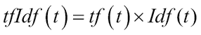
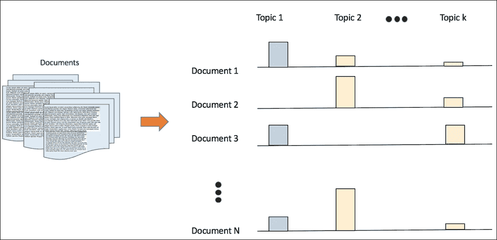
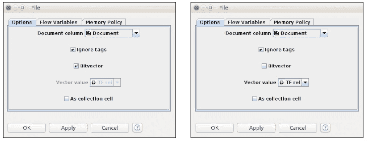

# 第八章 文本挖掘与自然语言处理

**自然语言处理（NLP**）如今在各种应用中无处不在，如移动应用、电子商务网站、电子邮件、新闻网站等。检测电子邮件中的垃圾邮件、描述电子邮件、语音合成、分类新闻、搜索和推荐产品、对社交媒体品牌进行情感分析——这些都是 NLP 和挖掘文本信息的不同方面。

数字文本信息呈指数级增长——以网页、电子书、短信、各种格式的文档、电子邮件、社交媒体消息（如推文和 Facebook 帖子）等形式，现在达到泽字节（1 泽字节等于 1,018 字节）。历史上，最早依赖自动机和概率建模的基础性工作始于 20 世纪 50 年代。20 世纪 70 年代见证了诸如随机建模、马尔可夫建模和句法解析等变化，但在“人工智能寒冬”年份，它们的进展有限。20 世纪 90 年代见证了文本挖掘和统计革命的兴起，包括语料库统计、监督机器学习和文本数据的标注等思想。从 2000 年开始，随着计算和大数据的巨大进步，以及监督学习和无监督学习中复杂机器学习算法的引入，该领域重新引起了人们的兴趣，现在成为学术界和商业企业研发部门研究的热点话题之一。在本章中，我们将讨论 NLP 和文本挖掘在机器学习中的关键方面。

本章首先介绍了自然语言处理（NLP）中的关键领域，然后解释了使文档更适合机器学习（无论是监督学习还是无监督学习）的重要处理和转换步骤。接下来是主题建模、聚类和命名实体识别的概念，以及简要介绍了两个提供强大文本处理能力的 Java 工具包。本章的案例研究使用另一个广为人知的数据集，通过使用 KNIME 和 Mallet 工具进行实验，展示了这里描述的几种技术。

本章组织如下：

+   NLP，子领域和任务：

    +   文本分类

    +   词性标注

    +   文本聚类

    +   信息提取和命名实体识别

    +   情感分析

    +   共指消解

    +   词义消歧

    +   机器翻译

    +   语义推理和推断

    +   摘要

    +   问答

    +   数据挖掘和无结构数据的问题

+   文本处理组件和转换：

    +   文档收集和标准化

    +   分词

    +   停用词去除

    +   词干提取/词元还原

    +   本地/全局字典

    +   特征提取/生成

    +   特征表示和相似性

    +   特征选择和降维

+   文本挖掘主题：

    +   主题建模

    +   文本聚类

    +   命名实体识别

    +   深度学习和 NLP

+   工具和用法：

    +   Mallet

    +   KNIME

+   案例研究

# NLP，子领域和任务

实际世界的信息以结构化数据的形式存在，通常由自动化过程生成，或者以非结构化数据的形式存在，在文本的情况下，它是由直接的人类活动以书面或口头语言的形式创造的。观察现实世界情况并使用自动化过程或让人类感知并将该信息转换为可理解数据的过程，在结构化和非结构化数据中都非常相似。将观察到的世界转化为非结构化数据涉及诸如文本的语言、存在的格式、不同观察者对同一数据的解释差异等复杂性。此外，所选语言的语法和语义的歧义、表达的微妙之处、数据中的上下文等，使得挖掘文本数据变得非常困难。

接下来，我们将讨论一些涉及 NLP 和文本挖掘的高级子领域和任务。NLP 的主题非常广泛，以下话题远非全面。

## 文本分类

这个领域是最为成熟的之一，其基本形式是将包含非结构化文本数据的文档分类到预定义的类别中。这可以被视为在非结构化文本世界中监督机器学习的直接扩展，通过学习历史文档来预测未来未见文档的类别。在电子邮件垃圾邮件检测或新闻分类中的一些基本方法，是这个任务最突出的应用之一。


图 1：文本分类显示分类到不同的类别

## 词性标注（POS 标注）

在自然语言处理（NLP）中，另一个取得巨大成功的子任务是，根据上下文和与相邻词语的关系，将语言的词性（如名词、形容词、动词）与文本中的词语关联起来。如今，我们不再进行手动词性标注，而是由自动化且复杂的词性标注器来完成这项工作。


图 2：与文本片段关联的词性标注

## 文本聚类

文本聚类是将非结构化数据聚类以组织、检索和基于相似性的分组，这是文本聚类的子领域。这个领域也得到了很好的发展，不同聚类和适合学习的文本表示方法都有所进步。


图 3：将操作系统新闻文档聚类到各种操作系统特定集群

## 信息提取和命名实体识别

提取特定元素的任务，如时间、地点、组织、实体等，属于信息提取的范畴。命名实体识别是一个在多个领域有广泛应用子领域，从历史文件的评论到生物信息学中的基因和药物信息。


图 4：句子中的命名实体识别

## 情感分析和意见挖掘

在自然语言处理（NLP）领域的另一个子领域涉及推断观察者的情感，以便用可理解的指标对他们进行分类，或者提供他们对意见的见解。这个领域不如前面提到的某些领域先进，但在这个方向上正在进行大量研究。


图 5：情感分析显示句子的正面和负面情感

## 指代消解

理解文本中存在的多个实体的引用并消除歧义是自然语言处理（NLP）中另一个流行的领域。这被认为是进行更复杂任务（如问答和摘要）的垫脚石，这些内容将在后面讨论。


图 6：指代消解显示代词如何被消歧

## 词义消歧

在像英语这样的语言中，由于同一个词可以根据上下文有多种含义，自动解析这一点是自然语言处理（NLP）的一个重要部分，也是**词义消歧（WSD**）的焦点。


图 7：展示如何使用上下文将单词“mouse”与正确的单词关联起来

## 机器翻译

将文本从一种语言翻译成另一种语言，或者在不同语言中将语音转换为文本，这在**机器翻译（MT**）领域得到了广泛的涵盖。这个领域在过去的几年里取得了显著的进步，机器学习算法在监督学习、无监督学习和半监督学习中的应用。使用 LSTM 等技术的深度学习已被证明是这个领域最有效的技术，并被 Google 广泛用于其翻译服务。


图 8：机器翻译显示英语到中文的转换

## 语义推理和推断

从非结构化文本中推理、推导逻辑和进行推断是自然语言处理（NLP）进步的下一个层次。


图 9：语义推断回答复杂问题

## 文本摘要

在自然语言处理（NLP）中，一个越来越受欢迎的子领域是将大型文档或文本段落自动总结成易于理解的小型代表性文本。这是 NLP 中一个新兴的研究领域。搜索引擎使用摘要、为专家提供的多文档摘要等，都是从这个领域受益的应用之一。

## 自动化问答

用自然语言回答人类提出的问题，这些问题从特定领域的具体问题到通用、开放式问题不等，是自然语言处理（NLP）领域另一个新兴的领域。

# 矿掘非结构化数据的问题

与基于计算机的程序相比，人类更容易阅读、解析和理解非结构化文本/文档。以下是为什么文本挖掘比一般的监督学习或无监督学习更复杂的一些原因：

+   术语和短语的不确定性。单词“bank”有多个含义，人类读者可以根据上下文正确地将其关联起来，但这需要预处理步骤，如词性标注和词义消歧，正如我们所看到的。根据牛津高阶英汉双解大词典，单词“run”在动词形式下就有不少于 645 种不同的用法，我们可以看到这样的单词确实会在解决意图含义（例如，run、put、set 和 take 这些词之间有超过一千种含义）时带来问题。

+   与文本相关的上下文和背景知识。考虑一个使用后缀“gate”来表示政治丑闻的新词，例如，“随着弹劾的呼声和民意调查的急剧下降，Russiagate 最终给他的总统生涯带来了致命一击”。人类读者可以通过联想，通过前缀与另一个美国政治历史上的重大丑闻“Watergate”的关联，推断出“Russiagate”所指的是什么，即回忆起高调阴谋的感觉。这对机器来说尤其难以理解。

+   推理，即从文档中进行推断，是非常困难的，因为将非结构化信息映射到知识库本身就是一大障碍。

+   执行监督学习的能力需要标记的训练文档，并且根据领域，对文档进行标记可能既耗时又昂贵。

# 文本处理组件和转换

在本节中，我们将讨论在大多数文本挖掘过程中执行的一些常见的预处理和转换步骤。一般概念是将文档转换为具有特征或属性的结构化数据集，这些特征或属性是大多数机器学习算法可以用来执行不同类型学习的基础。

我们将在下一节简要描述一些最常用的技术。文本挖掘的不同应用可能使用以下图中显示的组件的不同部分或变体：


图 10：文本处理组件和流程

## 文档收集和标准化

在大多数文本挖掘应用中的第一步通常是收集以文档形式存在的数据——在文本挖掘领域通常被称为*语料库*。这些文档可以与预定义的分类相关联，或者它可能只是一个未标记的语料库。这些文档可以是异构格式，或者为了下一阶段的分词过程而标准化为一种格式。拥有多种格式，如文本、HTML、DOCs、PDGs 等，可能会导致许多复杂性，因此大多数应用中通常首选一种格式，如 XML 或**JavaScript 对象表示法**（**JSON**）。

### 输入和输出

输入是大量同质或异质来源的集合，输出是一组标准化为一种格式（如 XML）的文档集合。

### 它是如何工作的？

标准化涉及到确保工具和格式基于应用需求达成一致：

1.  就标准格式达成一致，如 XML，其中预定义的标签提供了关于文档元属性（如`<author>`、`<title>`、`<date>`等）和实际内容（如`<document>`）的信息。

1.  大多数文档处理器都可以转换为 XML，或者可以编写转换代码来执行此操作。

## 分词

分词的任务是从包含这些单词的文本流中提取单词或有意义的字符。例如，文本*The boy stood up. He then ran after the dog*可以被分词成标记，如*{the, boy, stood, up, he, ran, after, the, dog}*。

### 输入和输出

输入是一组如上一节所述的已知格式的文档，输出是包含所需单词或字符标记的文档。

### 它是如何工作的？

任何自动化的分词系统都必须解决它预期处理的语言（们）所提出的特定挑战：

+   在像英语这样的语言中，由于存在空白、制表符和换行符来分隔单词，分词相对简单。

+   每种语言都有不同的挑战——即使在英语中，像*Dr.*这样的缩写、代数字符（*B12*）、不同的命名方案（*O'Reilly*）等，也必须适当地分词。

+   编写特定于语言的规则，以 if-then 指令的形式从文档中提取标记。

## 停用词移除

这涉及到移除没有区分性或预测价值的常用词。如果每个词都可以被视为一个特征，这个过程就会通过显著减少特征向量的维度来降低特征数量。介词、冠词和代词是形成停用词的一些例子，这些停用词被移除，而不会影响许多应用中文本挖掘的性能。

### 输入和输出

输入是一组已提取标记的文档，输出是一组通过移除停用词来减少标记的文档。

### 它是如何工作的？

在过去几年中，已经发展出各种技术，从手动预编译的列表到基于术语或互信息的统计消除。

+   对于许多语言来说，最常用的技术是手动预编译的停用词列表，包括介词（in、for、on）、冠词（a、an、the）、代词（his、her、they、their）等等。

+   许多工具使用 Zipf 定律（*参考文献* [3]），其中移除了高频词、单音节词和独特术语。Luhn 的早期工作（*参考文献* [4]），如图 11 所示，显示了单词频率的上限和下限阈值，这些阈值为我们提供了可用于建模的显著单词：

    图 11：单词频率分布，显示了在语料库中频繁使用、显著和罕见单词的存在

## 词干提取或词形还原

将相似单词的标记归一化为一个的想法被称为词干提取或词形还原。因此，将文档中所有"talking"、"talks"、"talked"等出现归一化到一个根词"talk"的例子就是词干提取。

### 输入和输出

输入是带有标记的文档，输出是带有减少标记并归一化到其词干或根词的文档。

### 它是如何工作的？

1.  基本上有两种词干提取类型：变化词干提取和根词提取。

1.  变化词干提取通常涉及去除词缀，使动词时态正常化并去除复数形式。因此，英语中的"ships"变为"ship"，"is"、"are"和"am"变为"be"。

1.  将词干提取到根词通常比变化词干提取更为激进，后者将单词归一化到其根词。这种例子是"applications"、"applied"、"reapply"等等，都减少到根词"apply"。

1.  Lovin 的词干提取算法是第一批词干提取算法之一（*参考文献* [1]）。Porter 的词干提取，在 20 世纪 80 年代发展起来，有 60 条规则分 6 步进行，仍然是应用最广泛的词干提取形式（*参考文献* [2]）。

1.  当前的应用推动了基于词干提取的广泛统计技术，包括使用 n-gram（给定文本序列中 n 个连续项的连续序列，可以是字母或单词）、**隐马尔可夫模型**（**HMM**）和上下文敏感词干提取。

## 局部/全局字典或词汇表？

一旦执行了将文档转换为标记的预处理任务，下一步就是创建一个语料库或词汇表，作为一个单一的字典，使用所有文档中的所有标记。或者，根据类别创建几个字典，使用较少文档中的特定标记。

在主题建模和文本分类的许多应用中，当按主题/类别创建字典时，即所谓的本地字典，表现良好。另一方面，在文档聚类和信息提取的许多应用中，当从所有文档标记中创建一个单一的全局字典时，表现良好。创建一个或多个特定字典的选择取决于核心 NLP 任务，以及计算和存储需求。

## 特征提取/生成

将包含非结构化文本的文档（s）转换为具有结构化特征的集合的关键步骤是将它们转换为类似于我们在迄今为止的机器学习数据集中所看到的结构化特征集合。从文本中提取特征以便在机器学习任务中使用，如监督学习、无监督学习和半监督学习，这取决于许多因素，例如应用目标、特定领域的需求以及可行性。可以从任何文档中提取各种特征，例如单词、短语、句子、词性标注的单词、排版元素等。我们将给出在不同的机器学习应用中常用的一系列特征。

### 词汇特征

词汇特征是文本挖掘应用中最常用的特征。词汇特征是下一级特征的基础。它们是构建在未尝试捕获关于意图或与文本相关的各种含义的信息的简单字符或单词级别的特征。词汇特征可以进一步细分为基于字符的特征、基于单词的特征、词性特征和分类法，例如。在下一节中，我们将更详细地描述其中的一些。

#### 基于字符的特征

单个字符（单语元）或字符序列（n-gram）是从文本文档中可以构建的最简单形式的特征。字符包或单语元字符没有位置信息，而高阶 n-gram 捕获了一定程度的内容和位置信息。这些特征可以用不同的方式编码或赋予数值，例如二进制 0/1 值或计数，如下一节中所述。

让我们以难忘的苏斯博士的韵文作为文本内容——“the Cat in the Hat steps onto the mat”。虽然字符袋（1-gram 或单词特征）将生成唯一的字符{"t","h", "e", "c","a","i","n","s","p","o","n","m"}作为特征，但 3-gram 特征为{"\sCa" ,"\sHa", "\sin" , "\sma", "\son", "\sst", "\sth", "Cat", "Hat", "at\s", "e\sC", "e\sH", "e\sm", "eps", "he\s", "in\s ", "mat", "n\st", "nto", "o\st", "ont", "ps\s", "s\so" , "ste"," t\si"," t\ss" , "tep", "the", "to\s "}。正如所见，随着“n”的增加，特征的数量呈指数增长，很快变得难以控制。n-gram 的优势在于，在增加总特征数量的同时，组装的特征往往似乎捕捉到了比单个字符本身更有趣的字符组合。

#### 基于单词的特征

与从字符生成特征不同，特征也可以以单词和 n-gram 的方式从单词中构建。这些是最流行的特征生成技术。单词或 1-gram 标记也被称为词袋模型。因此，当“the Cat in the Hat steps onto the mat”作为单词特征考虑时，其例子为{"the", "Cat", "in", "Hat", "steps", "onto", "mat"}。同样，同一文本上的二元特征将产生{"the Cat", "Cat in", "in the", "the Hat", "Hat step", "steps onto", "onto the", "the mat"}。与基于字符的特征类似，通过在 n-gram 中增加到更高的“n”，特征的数量增加，但捕捉单词意义的能力也随之增强。

#### 词性标注特征

输入是包含单词的文本，输出是每个单词都与语法标签关联的文本。在许多应用中，词性提供了上下文，并在识别命名实体、短语、实体消歧等方面很有用。在“the Cat in the Hat steps onto the mat”的例子中，输出为{"the\Det", "Cat\Noun", "in\Prep", "the\Det", "Hat\Noun", "steps\Verb", "onto\Prep", "the\Det", "mat\Noun"}。在此过程中，通常使用基于语言规则的标记器或基于马尔可夫链的概率标记器。

#### 分类学特征

从文本数据创建分类法并使用它来理解单词之间的关系在不同情境中也很有用。各种分类学特征，如上位词、下位词、成员、成员-of、部分、部分-of、反义词、同义词、首字母缩略词等，为搜索、检索和许多文本挖掘场景中的匹配提供了有益的词汇上下文。

### 语法特征

低于文本文档中的字符或单词的下一级特征是基于句法的特征。文本中句子的句法表示通常以句法树的形式出现。句法树捕获句子中使用的术语作为节点，节点之间的关系以链接的形式捕获。句法特征还可以捕获关于句子和使用的更复杂特征——例如聚合——这些特征可用于机器学习。它还可以捕获关于句法树的统计数据——例如句子是左重、右重或平衡——这些数据可用于理解不同内容或作者的签名。

两个句子在词汇分析中可能有相同的字符和单词，但它们的句法树或意图可能完全不同。将文本中的句子分解成不同的短语——**名词短语**（**NP**）、**介词短语**（**PP**）、**动词短语**（或动名词短语）**VP**）等——并捕获句子的短语结构树是这一处理任务的一部分。以下是我们示例句子的句法分析树：

```py
(S (NP (NP the cat)
       (PP in
           (NP the hat)))
   (VP steps
       (PP onto
           (NP the mat))))
```

**句法语言模型**（**SLM**）是确定术语序列的概率。语言模型特征用于机器翻译、拼写校正、语音翻译、摘要等应用，仅举几例。语言模型还可以在其计算中使用分析树和句法树。

链式法则用于计算句子中术语的联合概率：


在示例 "the cat in the hat steps onto the mat" 中：


通常，由于需要大量此类句子的示例，基于任何语料库使用计数来估计长句的概率是困难的。大多数语言模型在实际实现中采用马尔可夫独立假设和 n-gram（2-5 个单词）(*参考文献* [8])。

### 语义特征

语义特征试图捕捉文本的“意义”，然后用于文本挖掘的不同应用。语义特征的最简单形式之一是对文档添加注释的过程。这些注释或元数据可以包含描述或捕捉文本或文档意图的附加信息。使用协作标记添加标签以捕获描述文本的关键字是常见的语义特征生成过程。

另一种语义特征生成形式是文本的本体表示过程。在知识库中可用的通用和领域特定本体捕获了对象之间不同的关系，并且具有众所周知的规范，例如语义网 2.0。这些本体特征有助于在文本挖掘中推导复杂的推理、摘要、分类和聚类任务。文本或文档中的术语可以映射到本体中的“概念”并存储在知识库中。这些本体中的概念具有语义属性，并以多种方式与其他概念相关联，例如泛化/特殊化、成员-of/是成员、关联等，仅举几例。这些概念或关系的属性或属性可以进一步用于搜索、检索甚至在预测建模中。许多语义特征使用词汇和句法过程作为语义过程的先导，并使用输出，如名词，将其映射到本体中的概念，例如。将概念添加到现有本体或用更多概念对其进行注释，使结构更适合学习。例如，在“the cat in the ..”这个句子中，“cat”具有诸如{age, eats, ...}等属性，并且有不同的关系，如{ "isA Mammal", "hasChild", "hasParent"，等等}。

## 特征表示和相似性

在上一节中描述的词汇、句法和语义特征，通常具有完全不同的表示。同一特征类型的表示，即词汇、句法或语义，可以根据它们被用于的计算或挖掘任务而有所不同。在本节中，我们将描述最常用的基于词汇特征表示，即向量空间模型。

### 向量空间模型

**向量空间模型**（**VSM**）是将非结构化文档转换为数值向量表示的一种转换，其中语料库中的术语形成向量的维度，我们使用某种数值方式将这些维度与值关联。

如在字典章节所述，语料库是由来自一个领域或一个局部子类别中所有文档的独特单词和短语组成的。这样一个字典的每个元素都是向量的维度。这些术语——可以是单个单词或短语，如 n-gram——形成维度，并且在一个给定的文本/文档中可以与它们相关联不同的值。目标是按反映整个语料库中术语（*参考文献* [11]）的相关性的方式捕获维度中的值。因此，每个文档或文件都表示为一个高维数值向量。由于术语的稀疏性，数值向量表示在数值空间中具有稀疏表示。接下来，我们将介绍一些将这些术语与值关联的知名方法。

#### 二进制

这是最简单的将值关联到术语或维度的形式。在二进制形式中，语料库中的每个术语根据术语在文档中的出现与否被赋予 0 或 1 的值。例如，考虑以下三个文档：

+   文档 1: "The Cat in the Hat steps onto the mat"

+   文档 2: "The Cat sat on the Hat"

+   文档 3: "The Cat loves to step on the mat"

在使用单语元或词袋模型，通过去除停用词{on, the, in, onto}和词干提取{love/loves, steps/step}进行预处理后，{cat, hat, step, mat, sat, love}是语料库的特征。现在每个文档都表示为一个二元向量空间模型，如下所示：

| 术语 | cat | hat | step | mat | sat | love |
| --- | --- | --- | --- | --- | --- | --- |
| 文档 1 | 1 | 1 | 1 | 1 | 0 | 0 |
| 文档 2 | 1 | 1 | 0 | 0 | 1 | 0 |
| 文档 3 | 1 | 0 | 1 | 1 | 0 | 1 |

#### 术语频率（TF）

在**词频**（**TF**）中，正如其名所示，整个文档中术语的频率构成了特征的数值。基本假设是，术语的频率越高，该术语与文档的相关性就越大。术语的计数或归一化计数被用作每个术语列的值：

*tf(t) = count(D, t)*

下表给出了我们示例中三个文档的术语频率：

| TF / 术语 | cat | hat | step | mat | sat | love |
| --- | --- | --- | --- | --- | --- | --- |
| 文档 1 | 1 | 1 | 1 | 1 | 0 | 0 |
| 文档 2 | 1 | 1 | 0 | 0 | 1 | 0 |
| 文档 3 | 1 | 0 | 1 | 1 | 0 | 1 |

#### 逆文档频率（IDF）

**逆文档频率**（**IDF**）有多种形式，但计算它的最常见方法是使用以下方法：


这里，  IDF 主要青睐那些在文档中相对不常出现的术语。研究（*参考文献* [7]）中也提出了对 IDF 的一些基于经验动机的改进。

TF 对于我们示例语料库：

| 术语 | cat | hat | step | mat | sat | love |
| --- | --- | --- | --- | --- | --- | --- |
| N/nj | 3/3 | 3/2 | 3/2 | 3/2 | 3/1 | 3/1 |
| IDF | 0.0 | 0.40 | 0.40 | 0.40 | 1.10 | 1.10 |

#### 术语频率-逆文档频率（TF-IDF）

将术语频率和逆文档频率结合在一个指标中，我们得到术语频率-逆文档频率值。其思想是重视那些在语料库中相对不常见（高 IDF），但对于文档来说相对相关（高 TF）的术语。TF-IDF 是许多文本挖掘过程中最常见的值关联形式：



这为我们提供了每个文档中所有术语的 TF-IDF 值：

| TF-IDF/术语 | cat | hat | step | mat | sat | love |
| --- | --- | --- | --- | --- | --- | --- |
| 文档 1 | 0.0 | 0.40 | 0.40 | 0.40 | 1.10 | 1.10 |
| 文档 2 | 0.0 | 0.40 | 0.0 | 0.0 | 1.10 | 0.0 |
| 文档 3 | 0.0 | 0.0 | 0.40 | 0.40 | 0.0 | 1.10 |

### 相似度度量

监督学习、无监督学习和半监督学习中的许多技术在其底层算法中使用“相似度”度量来寻找相似模式或分离不同模式。相似度度量与数据的表示紧密相关。在文档的 VSM 表示中，向量是高维且稀疏的。这在分类、聚类或信息检索的大多数传统相似度度量中提出了一个严重问题。基于角度的相似度度量，如余弦距离或 Jaccard 系数，在实践中更常被使用。考虑由 **t**[1] 和 **t**[2] 表示的两个向量，它们对应于两个文本文档。

#### 欧几里得距离

这是文档特征空间中的 L2 范数：


#### 余弦距离

这种基于角度的相似度度量仅考虑向量之间的方向，而不考虑它们的长度。它等于向量之间角度的余弦值。由于向量空间模型是一个正空间，余弦距离从 0（正交，没有共同项）变化到 1（所有项都是两个文档共有的，但不一定是相同的词频）：


#### 成对自适应相似度

这种度量通过仅考虑两个文档中最重要的特征来在降维特征空间中测量距离：


这里，**t**[i,k] 是由 **t**[i] (*i* = 1, 2) 的特征子集形成的向量，包含 **t**[1] 和 **t**[2] 中出现的 *K* 个最大特征的并集。

#### 扩展 Jaccard 系数

这种度量是文档之间共享项与项的并集之比：


#### Dice 系数

Dice 系数由以下公式给出：


## 特征选择和降维

目标与第二章 *实际应用中的监督学习* 和第三章 *无监督机器学习技术* 中的目标相同。随着文本挖掘和高维特征的出现，维度诅咒问题变得更加明显。

### 特征选择

大多数特征选择技术是监督技术，依赖于标签或结果来评分特征。在大多数情况下，我们执行基于过滤器的特征选择而不是基于包装器的特征选择，因为性能成本较低。即使在基于过滤器的方 法中，一些方法，如第二章中描述的涉及多元技术的方法，如**基于相关性的特征选择**（CFS），也可能因为高维性而成本高昂或导致次优性能（*参考文献* [9]）。

#### 信息论技术

如第二章所示，*实际应用中的监督学习方法*，在预处理和特征提取完成后，基于过滤器的单变量特征选择方法，如**信息增益**（IG）和**增益比率**（GR），是最常用的。

在他们的研究中，Yang 和 Pederson（*参考文献* [10]）清楚地展示了使用 IG 进行特征选择和降低，可以移除近 98%的术语，同时提高分类器的预测能力。

许多基于信息论或熵的方法具有更强的边际概率影响。当术语具有相等的条件概率 P(t|class)时，这可能会成为一个问题，即较不常见的术语可能比常见术语有更好的得分。

#### 基于统计的技术

卡方特征选择是文本挖掘中用于特征选择的最常见的基于统计的技术之一。卡方统计量，如第二章所示，*实际应用中的监督学习方法*，给出了文本中的标记与类别之间的独立性关系。

已有研究表明，当存在低频项时，特征选择的卡方统计量可能并不有效（*参考文献* [19]）。

#### 基于频率的技术

使用特征表示部分中描述的词频或文档频率，可以手动设置一个阈值，并且只允许高于或低于一定阈值的术语用于分类或聚类任务中的建模。请注意，**词频**（TF）和**文档频率**（DF）方法倾向于常见词汇，而一些基于信息论或统计的方法则倾向于不常见词汇。特征选择的选择取决于领域、特定预测学习的应用，以及更重要的是，使用这些特征的模型如何评估，尤其是在未见数据集上的评估。

### 维度降低

在第三章中，我们看到了另一种方法，即使用无监督技术通过某种形式的转换来减少特征，以决定其有用性。

**主成分分析**（**PCA**）从文档-词矩阵计算协方差或相关矩阵。它将数据转换成输入中术语的线性组合，使得转换后的特征或术语组合具有比输入术语更高的区分能力。PCA 在转换特征上使用截止值或阈值，如第三章中所示（ch03.html "第三章。无监督机器学习技术"），可以显著降低维度，甚至提高或与高维输入空间具有可比的性能。使用 PCA 的唯一问题是转换后的特征不可解释，对于理解哪些术语或组合产生更好的预测模型，这种技术在某些领域有限制。

**潜在语义分析**（**LSA**）是另一种使用从词和文档构建的输入矩阵并将其转换为具有通过文档中使用的术语组合发现的潜在概念的低维度的方法（*参考文献* [5]）。以下图展示了使用**奇异值分解**（**SVD**）方法对输入文档-词矩阵进行因式分解的过程：


图 12：输入文档-词向量的 SVD 分解和 LSA 文档向量以及 LSA 词向量

LSA 已被证明是一种非常有效的降低维度并提高模型预测性能的方法。LSA 的缺点是需要存储向量 U 和 V 以执行检索或查询。确定较低维度 k 是困难的，需要一些类似于第三章中讨论的 k-means 的启发式方法。

# 文本挖掘中的主题

正如我们在第一部分所看到的，文本挖掘和文本上的机器学习涵盖了广泛的主题。每个讨论的主题都有对主流算法的一些定制，或者在该领域已经开发出特定的算法来执行所需的任务。我们选择了四个广泛的主题，即文本分类、主题建模、文本聚类和命名实体识别，并将对每个主题进行一些详细的讨论。

## 文本分类/分类

文本分类问题在不同的应用中表现出来，例如文档过滤和组织、信息检索、意见和情感挖掘、电子邮件垃圾邮件过滤等。与第二章中讨论的分类问题类似，即《面向现实世界监督学习的实用方法》，其基本思想是在带有标签的训练数据上训练，并预测未见文档的标签。

如前文所述，预处理步骤有助于将非结构化的文档集合转换成以文档-词矩阵形式排列的已知数值或分类/二进制结构化数据。是否执行某些预处理步骤，例如词干提取或自定义停用词，取决于数据和应用程序。特征选择通常是基本的词汇特征，单词的 n-gram 作为术语，只有在某些情况下，我们才使用整个文本作为字符串，而不将其分解成术语或标记。对于文档-词结构化数据，通常使用二进制特征表示或基于频率的表示。一旦这种转换完成，我们就使用单变量分析，如信息增益或卡方检验，来选择得分高于一定阈值的判别特征。在许多应用中，也可以执行特征转换和降维，如 PCA 或 LSA。

一旦我们从前面的过程中得到结构化数据，选择分类器的范围就非常广泛。在研究和商业应用中，我们看到大多数常见的建模技术都被使用，包括线性（线性回归、逻辑回归等）、非线性（SVM、神经网络、KNN）、生成性（朴素贝叶斯、贝叶斯网络）、可解释性（决策树、规则）和基于集成（bagging、boosting、随机森林）的分类器。许多算法使用相似度或距离度量，其中余弦距离是最受欢迎的选择。在某些分类器中，如 SVM，文档的字符串表示可以直接使用，通过选择合适的字符串核和基于字符串的相似度度量来计算点积。

验证和评估方法与监督分类方法类似——将数据分为训练/验证/测试集，在训练数据上训练，在验证数据上调整算法的参数，并在保留或测试数据上估计模型的性能。

由于大多数文本分类涉及大量文档，且目标类别很少见，因此用于评估、调整或选择算法的指标通常是精确度、召回率和 F 分数，如下所示：


## 主题建模

主题是一个固定词汇表上的分布。主题建模可以定义为捕捉各种文档中不同核心思想或主题的能力。这有广泛的应用范围，例如文档摘要、理解情感、趋势、新闻等。以下图示展示了主题建模如何从语料库中识别用户指定的主题数量*k*，然后为每个文档分配比例，表示文档中每个主题出现的程度：



图 13：文档的概率主题权重分配

文献中关于使用监督和无监督学习进行主题建模的技术有很多（*参考文献* [13]）。我们将讨论最常见的技术，即**概率潜在语义索引**（**PLSI**）。

### 概率潜在语义分析（PLSA）

PLSA 的想法，类似于用于特征降维的 LSA，是通过发现共现术语之间的关联，并将文档视为这些概念的混合物来寻找语料库中隐藏的潜在概念。这是一种无监督技术，类似于降维，但其目的是用它来模拟文档中的主题或潜在概念的混合（*参考文献* [12]）。

如以下图所示，模型可能会将语料库中经常一起出现的术语与一个潜在概念关联起来，然后每个文档可以被认为在较小或较大的程度上表现出该主题：


图 14：棒球潜在概念图，捕捉文档与相关术语之间的关联

#### 输入和输出

输入如下：

+   按照一定格式和结构组织的文档集合。我们将给出以下符号：

+   需要建模或发现的主题数量*k*。

输出如下：

+   识别*k*个主题，T = {T[1], T[2],…T[k]}。

+   对于每个文档，给定文档*d*[i]的主题覆盖范围可以表示为 = {*p*[i1], *p*[i2], …*p*[ik]}，其中*p*[ij]是文档*d*i 覆盖主题 T[j]的概率。

#### 它是如何工作的？

PLSA 的实现通常遵循以下步骤：

1.  基本预处理步骤，如之前所述，包括分词、去除停用词、词干提取、构建词汇表、特征提取（单词或 n-gram 等）以及特征选择（无监督技术），如有必要，则执行这些步骤。

1.  该问题可以简化为估计文档中术语的分布，并给定分布，根据与主题对应的最大术语选择主题。

1.  引入一个“潜在变量”*z*帮助我们选择一个术语是否属于一个主题。请注意，*z*不是“观察到的”，但我们假设它与从主题中选择术语有关。因此，给定文档*t*的术语*t*的概率可以用这个潜在变量表示：

1.  通过使用两组变量(?, p)，方程可以写成：

    在这里，p(t|z; ?)是术语中的潜在概念的概率，p(z|d; p)是文档特定混合中潜在概念的概率。

1.  使用对数似然估计参数以最大化：

1.  由于这个方程涉及非凸优化，EM 算法通常用于迭代寻找参数，直到收敛或完成总迭代次数（*参考文献* [6]）：

    1.  EM 算法的 E 步骤用于确定潜在概念的后验概率。文档 d 中术语 t 出现的概率可以用潜在概念 z 来解释：

    1.  EM 算法的 M 步骤使用从 E 步骤获得的价值，即 p(z|d, t)，并进行参数估计：

    1.   = 术语*t*与概念*z*关联的频率：

    1.  = 文档*d*与概念*z*关联的频率。

#### 优点和局限性

优点和局限性如下：

+   尽管广泛使用，PLSA 也有一些缺点，这些缺点已被更近期的技术所克服。

+   该算法的无监督性质及其通用适用性使其能够应用于各种类似的文本挖掘应用，例如聚类文档、关联作者/时间相关的主题等。

+   使用 EM 算法的 PLSA，如前几章所述，面临“陷入局部最优”的问题，这与其他全局算法，如进化算法不同。

+   PLSA 算法只能在已知文档中执行主题识别，但不能进行任何预测建模。PLSA 已被推广，并被称为**潜在狄利克雷分配**（**LDA**）以克服这一点（*参考文献* [14]）。

## 文本聚类

聚类的目标，如第三章中所述的“无监督机器学习技术”，是找到组内彼此相似的数据、文本或文档。非结构化数据的粒度可以从短语或句子、段落和文本段落到文档集合不等。文本聚类在许多领域都有应用，例如信息检索、摘要、主题建模和无监督情况下的文档分类，仅举几例。一旦通过预处理将非结构化文本数据转换为结构化数据，就可以使用传统的聚类技术。传统聚类技术的困难在于使用转换后的文档-术语矩阵表示获得的具有高维和稀疏性的数据集。许多传统的聚类算法仅适用于特征的数值。由于这种限制，不能使用术语的分类或二进制表示，通常使用 TF 或 TF-IDF 来表示文档-术语矩阵。

在本节中，我们将讨论聚类中的一些基本过程和技术。我们将从预处理和转换开始，然后讨论一些广泛使用的技术及其修改。

### 特征转换、选择和减少

本节中讨论的大多数预处理步骤通常用于获取文档中术语的单词或 n-gram 表示。降维技术，如 LSA，通常用于将特征转换为更小的潜在空间。

### 聚类技术

文本聚类的技术包括概率模型以及使用基于距离的方法，这些方法在我们学习结构化数据时是熟悉的。我们还将讨论**非负矩阵分解**（**NNMF**）作为一种具有良好性能和可解释性的有效技术。

#### 生成概率模型

在生成方法中，主题建模和文本聚类之间存在共性。如图所示，聚类将一个文档与单个聚类（通常）关联起来，而主题建模中每个文档可以在多个主题中具有覆盖概率。主题建模中的每个词可以由多个主题独立生成，而在聚类中，所有词都来自同一个聚类：


图 15：文档到 K-聚类的独占映射

从数学上讲，这可以用两个主题 T = {T[1]，T[2]}和两个聚类 c = {c[1]，c[2]}来解释。

在聚类中，文档的可能性可以表示为：


如果文档有 L 个术语，这可以进一步展开为：


因此，一旦“假设”一个簇，所有单词都来自该簇。计算所有术语的乘积，然后对所有簇进行求和。

在主题建模中，文档的似然可以表示为：


因此，每个术语 ti 可以独立地从主题中选择，因此求和是在内部进行的，而乘积是在外部进行的。

##### 输入和输出

输入是：

+   以以下符号表示的遵循一定格式和结构的文档集合：

    D = {*d*1, *d*2, … *d*n}

+   需要建模或发现的簇数*k*。

输出如下：

+   *k*个识别出的簇 c = {c[1], c[2], … c[k]}。

+   对于每个文档，*p(d*[i]*)*被映射到簇*k*中的一个。

##### 如何工作？

这里是步骤：

1.  基本预处理步骤，如之前所述，包括分词、去除停用词、词干提取、形成词汇表、术语的特征提取（单词或 n-gram 等），以及特征转换（LSA）甚至特征选择。令*t*为最终特征集中的术语；它们对应于词汇表或词汇。

1.  与 PLSA 类似，我们引入一个“潜在变量”，*z*，帮助我们选择文档所属的簇是否落在*z*={1, 2, … *k*}的范围内，对应于簇。令*?*参数为我们为每个潜在变量估计的参数，使得*p(?*[i]*)*对应于簇*z = i*的概率。

1.  文档属于簇的概率由*p(?*[i]*)*给出，并且从该簇生成的文档中的每个术语由*p(t|?*[i]*)*给出。似然方程可以写成：

    注意，我们不是通过文档进行，而是用词汇表中术语*t*出现的次数作为指数重新编写。

1.  以与我们之前使用的方法类似的方式执行 EM 算法来估计参数，如下所示：

    1.  EM 算法的 E 步用于推断文档生成的簇：

    1.  EM 算法的 M 步用于使用 E 步的结果重新估计参数，如下所示：

    

1.  对于每个文档的最终概率估计可以使用最大似然估计或使用具有先验概率的贝叶斯算法，如下所示：或

##### 优点和局限性

+   基于生成的模型与 LSA 和 PLSA 有类似的优点，我们为簇中的文档得到一个概率分数。通过应用领域知识或先验知识，使用簇的大小，可以对分配进行进一步的微调。

+   与 EM 算法相关的缺点，即陷入局部最优和敏感于起始点，在这里仍然成立。

#### 基于距离的文本聚类

大多数基于距离的聚类算法依赖于相似度或距离度量，用于确定实例在特征空间中的距离。通常在具有数值数据的数据集中，欧几里得距离或其变体工作得非常好。在文本挖掘中，即使在将非结构化文本转换为具有数值值的结构化特征项之后，也发现余弦和 Jaccard 相似度函数表现更佳。

通常，如第三章中讨论的聚合或层次聚类，*无监督机器学习技术*，用于根据相似性合并文档，如前所述。合并文档或组通常使用单链接、组平均链接和完全链接技术。聚合聚类还产生一个可用于信息检索和文档搜索的结构。

基于划分的聚类技术 k-means 和 k-medoids，伴随着一个合适的相似度或距离方法也被采用。k-means 的问题，如聚类技术讨论中所示，是对起始条件的敏感性，以及计算空间和时间。k-medoids 对稀疏数据结构敏感，并且也有计算空间和时间限制。

#### 非负矩阵分解（NMF）

非负矩阵分解是另一种将大型数据-特征矩阵分解为两个非负矩阵的技术，这不仅执行降维，而且更容易检查。NMF 在文档聚类中获得了流行，现在已证明许多具有不同优化函数的 NMF 变体在聚类文本方面非常有效（*参考文献* [15]）。

##### 输入和输出

输入为：

+   按照给定符号的格式和结构组织的一组文档：

    D = {d[1], d[2], … d[n]}

+   需要建模或发现的簇的数量为*k*。

输出结果为：

+   识别 k 个簇，c = {c[1]，c[2]，… c[k]}，文档分配到簇中。

##### 它是如何工作的？

NMF 的数学细节和解释如下：

1.  NMF 背后的基本思想是使用低秩近似分解输入矩阵，如下所示：

1.  使用如下非线性优化函数：

    在 W 或 H 中是凸的，但不是两者都是，因此无法保证全局最小值。各种使用约束最小二乘法（如均方误差和梯度下降）的算法被用来解决优化函数。

1.  NMF 的解释，特别是在基于术语理解潜在主题方面，使其非常有用。术语和文档的输入 A[m x n]，可以用低秩近似表示为 W[m x k] H[k x n] 矩阵，其中 W[m x k] 是术语-主题表示，其列是 NMF 基向量。W 的第 1 列的非零元素，由 W[1] 给出，对应于特定的术语。因此，w[ij] 可以解释为关于术语 j 的基向量 W[i]。H[i1] 可以解释为文档 1 给定的文档对主题向量 W[i] 方向的亲和力。

1.  从论文（*参考文献* [18]）中清楚地展示了为医学摘要（称为 Medlars 数据集）获得的基向量，这些基向量具有高度的解释性。这些基向量中最权重的术语直接对应于概念，例如，W[1] 对应于与“心脏”相关的主题，而 W[5] 与“发育障碍”相关。

    图 16：来自 Langville 等人（2006）的展示，用于解释医疗数据集的一些基向量。

##### 优点和局限性

NMF 已被证明在信息检索和查询方面与顶级算法（如 LSI）几乎性能相当：

+   与使用 SVD 的 LSA 或 LSI 相比，NMF 在可扩展性、计算和存储方面表现更好。

+   NMF 存在一个问题，即优化不是全局的，并且会陷入局部最小值。

+   NMF 因素的产生取决于优化算法和选择的参数，并且不是唯一的。

### 文本聚类的评估

在标记数据集的情况下，第三章 中讨论的所有外部度量，如 F 度量和 Rand 指数，对于评估聚类技术是有用的。当数据集没有标签时，可以采用一些描述为内部度量的技术，如 Davies–Bouldin 指数、R-Squared 和 Silhouette 指数。

一般的良好实践是适应并确保在应用于文本挖掘数据时，如本节所述，文档之间的相似性用于测量簇的接近度、距离和分布。类似的使用取决于算法，并且与问题也有一定的相关性。在基于距离的划分算法中，可以使用均值向量或质心来计算文档的相似性。在层次算法中，可以使用组中最相似或最不相似的文档来计算相似性。

## 命名实体识别

**命名实体识别**（**NER**）是文本挖掘中信息检索最重要的主题之一。许多复杂的挖掘任务，如关系的识别、事件的标注以及实体之间的相关性，都将 NER 作为初始组件或基本预处理步骤。

从历史上看，手动基于规则和正则表达式的技术被用于实体识别。这些手动规则依赖于基本的预处理，使用词性标注作为特征，以及手工设计的特征，如大写单词的存在、单词前的标点符号使用等。

基于统计学习的技巧现在更多地用于 NER 及其变体。NER 可以被映射到机器学习中的序列标注和预测问题。BIO 表示法，其中每个实体类型 T 有两个标签 B-T 和 I-T，分别对应于开始和中间，被标注，学习涉及在未见数据中找到模式和预测它。O 代表文本序列中的外部或不相关实体。实体类型 T 在基本形式上进一步被分类为人物、组织、数据和地点。

在本节中，我们将讨论两种最常用的算法：基于生成模型的隐马尔可夫模型和基于判别模型的最大熵模型。

虽然我们是在讨论命名实体识别的上下文中这些算法，但相同的算法和过程也可以用于其他 NLP 任务，如词性标注（POS Tagging），其中标签与一个序列相关联，而不是与 NER 类别相关联。

### 命名实体识别的隐马尔可夫模型

隐马尔可夫模型，如第六章《概率图建模》中所述，是基于序列的生成模型，它假设存在一个生成序列的潜在分布。通过用正确的 NER 类别标注序列获得训练数据可以用来学习分布和参数，以便对于未见未来的序列，可以执行有效的预测。

#### 输入和输出

训练数据由文本序列 x = {x[1], x[2], ... x[n]}组成，其中每个 xi 是文本序列中的一个词，每个词的标签作为 y = {y[1], y[2], ... y[n]}提供。算法生成一个模型，以便在测试未见数据时，可以生成新序列的标签。

#### 如何工作？

1.  在最简单的情况下，假设马尔可夫假设，即序列的隐藏状态和标签仅依赖于前一个状态。对带标签的单词序列的适应在以下图中展示：

    图 17：隐马尔可夫链中 NER 对应的文本序列和标签

1.  序列分类的 HMM 公式有助于在训练数据上估计最大化的联合概率：

1.  每个 y[i]被假定为基于 y[i–1]和 x[i]生成的。实体的第一个单词是在当前和前一个标签的条件下生成的，即 y[i]和 y[i–1]。如果实例已经是命名实体，则条件仅基于前一个实例，即 x[i–1]。像"visited"和"in"这样的外部单词被认为是"非名称类别"。

1.  使用前向-后向算法的 HMM 公式可以用来确定从训练数据中学习到的参数的观察序列的概率。

#### 优点和局限性

优点和局限性如下：

+   HMM 对于短序列很好，如图所示，只有一个单词或术语，并且假设独立性。对于具有较长实体范围的序列，结果将违反这些假设。

+   HMM 需要大量的训练数据来估计参数。

### 命名实体识别的最大熵马尔可夫模型

**最大熵马尔可夫模型**（**MEMM**）是一种流行的命名实体识别（NER）技术，它利用马尔可夫链和最大熵模型的概念来学习和预测命名实体（参考[16]和[17]）。

#### 输入和输出

训练数据由文本序列 x={x1，x2，... xn}组成，其中每个 xi 是文本序列中的一个单词，每个单词的标签作为 y={y1，y2，... yn}可用。算法生成模型，以便在测试未见数据时，可以生成新序列的标签。

#### 它是如何工作的？

以下说明了 MEMM 方法是如何用于学习命名实体的。

1.  MEMM 中的特征可以是单词特征或其他类型的特征，如"isWordCapitalized"等，这给它提供了一点更多的上下文，并且与仅基于单词的 HMM 相比，提高了性能。

1.  接下来，让我们看看一种称为最大熵模型（MaxEnt 模型）的最大熵模型，它是一个指数概率模型，但也可以被视为多项式逻辑回归模型。在基本的 MaxEnt 模型中，给定特征{f[1]，f[2]…f[N]}和类别 c[1]，c[2]…c[C]，使用从训练数据中得到的优化方法为每个类别学习这些特征的权重{w[c1]，w[c2]…w[cN]}，可以估计特定类别的概率如下：

1.  特征 fi 正式表示为 fi，这意味着对于类别 c 和观察 x 的特征 f[i]。在大多数 NER 模型中，fi 通常是二元的，值为 1/0。因此，它可以写成：

    基于预测概率跨类最大似然可以用来选择单个类别：

    

1.  对于每个单词，我们使用当前单词、"附近"单词的特征以及附近单词的预测来创建一个联合概率模型。这也被称为局部学习，因为测试和分布的块是在与单词对应的局部特征周围学习的。

    从当前单词和最后预测中，我们可以从数学上看到如何创建一个判别模型：

    

    对于 k 个特征进行泛化：

    

1.  因此，在 MEMM 中，我们计算状态的概率，即命名实体识别（NER）中的类别，尽管我们基于 y[i–1]给出的邻近单词的预测进行条件化，但通常我们可以使用更多特征，这就是相对于之前讨论的 HMM 模型的优势：

    图 18：带标签的文本序列和观察概率

1.  维特比算法用于在 HMM 中对单词或解码/推理进行类别估计，即得到 p(y[i]|y[i–1], X[i])的估计

1.  最后，使用状态变化的优化方法，MaxEnt 模型被用来估计权重，就像之前一样：

#### 优点和局限性

+   MEMM 在使用特征方面具有更大的灵活性，这些特征不仅基于单词，甚至不是由人类设计的，这使得它更加丰富，并使其模型具有更强的预测能力。

+   MEMM 可以检测比 HMM 更大的跨度，具有比 HMM 更大的检测优势。

## 深度学习和 NLP

在过去几年中，深度学习和其在自然语言处理（NLP）各个领域的应用取得了巨大成功，被认为是当今技术的尖端。使用深度学习的主要优势在于一小部分工具和方法，这些工具和方法在广泛的 NLP 问题中都很有用。它通过自动学习来解决特征工程和精心创建的手动表示的基本问题，从而解决了需要大量语言专家处理广泛问题的问题，例如文本分类、情感分析、词性标注和机器翻译等。在本节中，我们将尝试涵盖深度学习和 NLP 领域的重要概念和研究。

在他的开创性论文中，Bengio 介绍了深度学习最重要的构建块之一，称为词嵌入或词向量（*参考文献* [20]）。词嵌入可以被定义为将单词映射到高维向量（通常基于应用，25 到 500 维）的参数化函数。

形式上，这可以写成。

例如，和，等等。

一个神经网络（*R*），其输入是句子中的单词或句子的 n-gram，用于二分类，例如 n-gram 中单词序列是否有效，用于训练和学习*W*和*R*：


图 19：一个模块化神经网络学习 5-gram 单词进行有效-无效分类

例如：

+   *R(W(cat),W(sat ),W(on),W(the),W(mat)) = 1(有效)*

+   *R(W(cat),W(sat),W(on),W(the),W(mat)) = 0 (无效)*

训练这些句子或 n-gram 的想法不仅是为了学习短语的正确结构，也是为了学习*W*和*R*的正确参数。单词嵌入也可以使用第三章中介绍的线性和非线性特征降维/可视化技术投影到低维空间，例如二维空间，这些技术人类可以轻松可视化。使用 t-SNE 等技术将单词嵌入在二维空间中的可视化揭示了基于语义意义单词的接近性以及该区域单词的聚类信息，如下所示图所示：


图 20：整个单词映射的小部分 t-SNE 表示。罗马数字和单词在左侧聚集在一起显示，而语义相近的单词在右侧聚集在一起。

进一步扩展这些概念，Collobert 和 Mikolov 都展示了学习单词嵌入的副作用在多种 NLP 任务中非常有用，例如相似短语学习（例如，*W("the color is red")* *?* *W("the color is yellow"))*，寻找同义词（例如，*W("nailed")* *?* *W("smashed"))*，类比映射（例如，*W("man")?W("woman")然后 W("king")?W("queen"))*，甚至复杂的关联映射（例如，*W("Paris")?W("France")然后 W("Tokyo")?W("Japan"))* (*参考文献* [21 和 22])。

将单词嵌入概念扩展到一种通用表示，帮助我们以（稍作扩展）的方式重用该表示来解决各种 NLP 问题，这是许多最近深度学习在 NLP 中取得成功的主要原因。Socher 在他的研究中将单词嵌入概念扩展到产生双语单词嵌入，即把来自两种不同语言的单词，如中文（普通话）和英语嵌入到一个共享空间中 (*参考文献* [23])。通过独立学习两种语言的单词嵌入，然后将它们投影到同一个空间，他的工作为我们提供了关于跨语言单词相似性的有趣见解，这些见解可以扩展到机器翻译。Socher 还就使用 CNN 学习到的图像与单词嵌入投影到同一个空间进行了有趣的工作，以将单词与图像关联起来作为一个基本的分类问题 (*参考文献* [24])。大约在同一时间，谷歌也在研究类似的概念，但规模更大，用于单词-图像匹配和学习 (*参考文献* [26])。

将词嵌入概念扩展到具有组合器或关联模块，这些模块可以帮助组合所有组合的词语、词语-短语、短语-短语，以学习复杂句子，这是递归神经网络（Recursive Neural Networks）的理念。以下图示展示了如何使用递归神经网络学习复杂的关联 *((the cat)(sat(on (the mat))))*。它还由于递归组合的能力而消除了神经网络中“固定”输入数量的限制：


图 21：递归神经网络展示了如何学习复杂短语。

递归神经网络在 NLP 任务中显示出巨大的潜力，例如情感分析，其中许多正面词语开头的单个负面词语会对句子产生整体负面的影响，如下图所示：


图 22：一个复杂的句子，展示了通过 RNN 连接的带有负面（红色圆圈）、正面（绿色圆圈）和中立（空，0）的词语，整体呈现负面情感。

现在通过编码器和解码器的构建块扩展递归神经网络的概念，以学习可逆的句子表示——即从输入句子中重建具有大致相同意义的原始句子（*参考文献* [27]）。这已成为神经机器翻译背后的核心主题。使用 RNN 的编码器-解码器框架建模对话也取得了巨大的突破（*参考文献* [28]）。

# 工具和用法

我们现在将讨论一些在 Java 中用于各种 NLP 和文本挖掘应用的最知名的工具和库。

## Mallet

Mallet 是一个用 Java 编写的机器学习工具包，用于文本处理，附带几个自然语言处理库，包括一些用于文档分类、序列标记和主题建模的库，以及各种机器学习算法。它是开源的，在 CPL 下发布。Mallet 提供了一个广泛的 API（见以下截图），用于创建和配置“管道”序列以进行预处理、向量化、特征选择等，以及扩展分类和聚类算法的实现，以及一系列其他文本分析和机器学习功能。


## KNIME

KNIME 是一个具有 OpenGL 许可的开源分析平台，提供了一系列强大的工具，用于执行数据科学的各个方面。文本处理模块可以从 KNIME Labs 单独下载。KNIME 具有直观的拖放 UI，并提供从其工作流服务器下载的示例。

### 注意

KNIME: [`www.knime.org/`](https://www.knime.org/)

KNIME Labs: [`tech.knime.org/knime-text-processing`](https://tech.knime.org/knime-text-processing)

该平台包括一个节点仓库，其中包含所有必要的工具，可以方便地通过节点的嵌套组合您的流程，这些节点可以很容易地通过复制粘贴来重复使用。工作流程的执行很简单。调试错误可能需要一些习惯，因此我们的建议是使用文本挖掘示例，使用不同的数据集作为输入，并确保工作流程无错误执行。这是熟悉平台的最快方式。

## 使用 Mallet 进行主题建模

现在我们将展示如何使用 API 和 Java 代码实现主题建模，以向用户展示如何在 Java 中构建一个文本学习流程：

```py
//create pipeline
ArrayList<Pipe> pipeList = new ArrayList<Pipe>();
  // Pipes: lowercase, tokenize, remove stopwords, map to features
pipeList.add( new CharSequenceLowercase() );
pipeList.add( new CharSequence2TokenSequence(Pattern.compile("\\p{L}[\\p{L}\\p{P}]+\\p{L}")) );
pipeList.add( new TokenSequenceRemoveStopwords(new File("stopReuters/en.txt"), "UTF-8", false, false, false) );
//add all 
pipeList.add( new TokenSequence2FeatureSequence() );
InstanceList instances = new InstanceList (new SerialPipes(pipeList));
//read the file
Reader fileReader = new InputStreamReader(new FileInputStream(new File(reutersFile)), "UTF-8");
instances.addThruPipe(new CsvIterator (fileReader, Pattern.compile("^(\\S*)[\\s,]*(\\S*)[\\s,]*(.*)$"),
3, 2, 1)); // name fields, data, label
```

Mallet 中的 ParallelTopicModel 具有一个 API，包含如主题数量、alpha 和 beta 等参数，这些参数控制着使用 Dirichlet 分布调整 LDA 的底层参数。并行化得到了很好的支持，正如系统中可用的线程数量增加所显示的那样：

```py
ParallelTopicModel model = new ParallelTopicModel(10, 1.0, 0.01);//10 topics using LDA method
model.addInstances(instances);//add instances
model.setNumThreads(3);//parallelize with threading
model.setNumIterations(1000);//gibbs sampling iterations
model.estimate();//perform estimation of probability
```

主题和术语关联如下截图所示，是运行 Mallet 中的 ParallelTopicModel 的结果。很明显，在许多情况下，如 exec、acq、wheat、crude、corn 和 earning 等类别，顶级术语和主题的关联都得到了很好的发现：


## 商业问题

Reuters 语料库将每个文档标记为 10 个类别之一。本案例研究的实验目的是利用本章学到的文本处理技术，通过向量空间模型为这些文档提供结构。这是以三种不同的方式完成的，并且使用了四种分类算法来训练和预测在每个案例中转换后的数据集。开源 Java 分析平台 KNIME 用于文本处理和学习。

## 机器学习映射

在无结构数据的学习技术中，例如文本或图像，给定带有标签的训练集将数据分类到不同的类别是一个监督学习问题。然而，由于数据是无结构的，一些统计或信息论方法对于从数据中提取可学习特征是必要的。在本研究的构思中，我们在使用线性、非线性以及集成方法进行分类之前，对文档进行了特征表示和选择。

## 数据收集

实验中使用的数据集是来自 UCI 机器学习仓库的 Reuters-21578 Distribution 1.0 文本分类数据集的一个版本：

### 注意

Reuters-21578 数据集：[`archive.ics.uci.edu/ml/datasets/Reuters-21578+Text+Categorization+Collection`](https://archive.ics.uci.edu/ml/datasets/Reuters-21578+Text+Categorization+Collection)

该数据集是一个包含 9,981 个文档的 Modified-Apte 分割，每个文档都有一个类别标签，指示文档的类别。数据集中有 10 个不同的类别。

## 数据采样和转换

在导入数据文件后，我们进行了一系列预处理步骤，以便在训练任何模型之前丰富和转换数据。这些步骤可以在 KNIME 创建的工作流程快照中看到。它们包括：

+   标点符号擦除

+   N 字符过滤（移除长度小于四个字符的标记）

+   数字过滤

+   案例转换 - 将所有内容转换为小写

+   停用词过滤

+   词干提取

在学习步骤之前，我们将数据随机分为 70-30 的比例进行训练和测试。每个实验中使用了五折交叉验证。


上述截图显示了第一个实验集的工作流程，它使用特征的二进制向量。数据导入后，一系列预处理节点随后，数据集被转换为文档向量。在添加回目标向量后，工作流程分支为四个分类任务，每个任务使用五折交叉验证设置。结果在评分节点中汇总。

## 特征分析和降维

我们总共进行了三组实验。在第一组中，预处理后，我们使用了术语的二进制向量化，这添加了一个表示术语是否出现在文档中的表示：



在第二次实验中，我们使用了每个术语的相对**词频**（**TF**）值，结果在 0 到 1 之间。


在第三组中，我们通过过滤掉相对 TF 分数小于 0.01 的术语来进行特征选择。

## 模型、结果和评估

对于这三组实验中的每一组，我们使用了两种线性分类器（朴素贝叶斯和线性核的 SVM）以及两种非线性分类器（决策树和以朴素贝叶斯为基础学习器的 AdaBoost）。在文本挖掘分类中，通常选择精确率/召回率指标作为评估指标，而不是准确率，后者在传统的、平衡的分类问题中更为常见。

三组实验的结果在表中给出。分数是所有类别的平均值：

二进制术语向量：

| 分类器 | 召回率 | 精确率 | 灵敏度 | 特异性 | F 度量 | 准确率 | 科亨κappa 系数 |
| --- | --- | --- | --- | --- | --- | --- | --- |
| 基于朴素贝叶斯 | 0.5079 | 0.5281 | 0.5079 | 0.9634 | 0.5087 | 0.7063 | 0.6122 |
| 决策树 | 0.4989 | 0.5042 | 0.4989 | 0.9518 | 0.5013 | 0.7427(2) | 0.6637(2) |
| AdaBoost(NB) | 0.5118(2) | 0.5444(2) | 0.5118(2) | 0.9665(2) | 0.5219(2) | 0.7285 | 0.6425 |
| LibSVM | 0.6032(1) | 0.5633(1) | 0.6032(1) | 0.9808(1) | 0.5768(1) | 0.8290(1) | 0.7766(1) |

相对 TF 向量：

| 分类器 | 召回率 | 精确率 | 灵敏度 | 特异性 | F 度量 | 准确率 | 科亨κappa 系数 |
| --- | --- | --- | --- | --- | --- | --- | --- |
| 朴素贝叶斯 | 0.4853 | 0.5480(2) | 0.4853 | 0.9641 | 0.5113(2) | 0.7248 | 0.6292 |
| 决策树 | 0.4947(2) | 0.4954 | 0.4947(2) | 0.9703(2) | 0.4950 | 0.7403(2) | 0.6612(2) |
| AdaBoost(NB) | 0.4668 | 0.5326 | 0.4668 | 0.9669 | 0.4842 | 0.6963 | 0.6125 |
| LibSVM | 0.6559(1) | 0.6651(1) | 0.6559(1) | 0.9824(1) | 0.6224(1) | 0.8433(1) | 0.7962(1) |

相对 TF 向量与阈值过滤（rel TF > 0.01）：

| 分类器 | 召回率 | 精确率 | 敏感性 | 特异性 | F 度量 | 准确率 | 科亨κ系数 |
| --- | --- | --- | --- | --- | --- | --- | --- |
| 朴素贝叶斯 | 0.4689 | 0.5456(2) | 0.4689 | 0.9622 | 0.4988 | 0.7133 | 0.6117 |
| 决策树 | 0.5008(2) | 0.5042 | 0.5008(2) | 0.9706(2) | 0.5022(2) | 0.7439(2) | 0.6657(2) |
| AdaBoost(NB) | 0.4435 | 0.4992 | 0.4435 | 0.9617 | 0.4598 | 0.6870 | 0.5874 |
| LibSVM | 0.6438(1) | 0.6326(1) | 0.6438(1) | 0.9810(1) | 0.6118(1) | 0.8313(1) | 0.7806(1) |

## 文本处理结果分析

在这里展示了从我们的 Reuters 数据集实验中获得的结果分析，并附带一些关键观察：

+   如第一张表所示，使用项的二进制表示，朴素贝叶斯得分为约 0.7，这表明生成的特征具有良好的区分能力。在相同配置的朴素贝叶斯上进一步使用 AdaBoost 可以提升所有指标，如精确率、召回率、F1 度量以及准确率，大约提高 2%，这表明了提升和元学习的优势。

+   如第一张表所示，非线性分类器，如决策树，在大多数指标上仅略优于线性朴素贝叶斯。使用线性分类器的 SVM 比线性朴素贝叶斯提高了 17%的准确率，并且在几乎所有指标上都有更好的表现。SVM 和核函数，在处理高维数据时没有问题，解决了文本分类的诅咒，因此是建模的较好算法之一，结果也证实了这一点。

+   将表示从二进制转换为 TF（词频）改进了许多指标，如准确率，对于线性朴素贝叶斯（从 0.70 提高到 0.72）和 SVM（从 0.82 提高到 0.84）。这确实证实了基于 TF 的表示在许多基于数字的算法中，如 SVM。当底层分类器贝叶斯在性能上变得更强大时，如许多理论和实证结果所示，AdaBoost 与朴素贝叶斯在大多数指标上的性能会下降。

+   最后，通过使用阈值 TF > 0.01 减少特征，正如这里所使用的，我们在大多数分类器中得到了几乎相似或略有降低的性能，这表明尽管某些术语似乎很少见，但它们具有区分能力，减少它们会产生负面影响。

# 摘要

数字世界中的大量信息是文本形式。文本挖掘和自然语言处理是关注从这种非结构化数据形式中提取信息的领域。该领域中的几个重要子领域现在是活跃的研究主题，对这些领域的理解对于数据科学家来说是必不可少的。

文本分类关注将文档分类到预先确定的类别中。文本可以通过标注单词（如词性标注）来丰富，以便为后续处理任务提供更多结构。聚类等无监督技术也可以应用于文档。信息提取和命名实体识别有助于识别信息丰富的具体内容，如地点、人名或组织名称等。摘要也是另一个重要应用，用于生成较大文档或文档集的简洁摘要。语言和语义的多种歧义，如上下文、词义和推理，使得自然语言处理（NLP）的任务具有挑战性。

文本内容的转换包括分词、停用词去除和词干提取，所有这些通过标准化内容来准备语料库，以便机器学习技术能够有效地应用。接下来，提取词汇、语义和句法特征，以便使用向量空间模型以更传统的方式用数值表示文档结构。然后可以应用相似性和距离度量来有效地比较文档的相似性。由于通常存在大量特征，降维是关键。本章描述了主题建模技术、PLSA 和文本聚类以及命名实体识别的技术细节。最后，介绍了在自然语言处理的各个领域中应用深度学习的最新技术。

Mallet 和 KNIME 是两种开源 Java 工具，它们提供了强大的自然语言处理和机器学习功能。案例研究考察了使用 KNIME 在 Reuters 语料库上不同分类器的性能。

# 参考文献

1.  J. B. Lovins (1968). *词干算法的开发*, 机械翻译与计算机语言学, 第 11 卷，第 1/2 期，第 22-31 页。

1.  Porter M.F (1980). *后缀剥离算法*, 程序; 14, 130-137。

1.  ZIPF, H.P. (1949). *人类行为与最小努力原则*, 哈德逊出版社，马萨诸塞州剑桥。

1.  LUHN, H.P. (1958). *自动生成文献摘要*, IBM 研究与发展杂志, 2, 159-165。

1.  Deerwester, S., Dumais, S., Furnas, G., & Landauer, T. (1990), *基于潜在语义分析的索引*, 美国信息科学学会杂志, 41, 391–407。

1.  Dempster, A. P., Laird, N. M., & Rubin, D. B. (1977), *通过 EM 算法从不完全数据中估计最大似然*. 英国皇家统计学会，系列 B，39(1)，1–38。

1.  Greiff, W. R. (1998). *基于探索性数据分析的词权重理论*. 在第 21 届国际 ACM SIGIR 信息检索研究与发展会议，纽约，纽约。ACM。

1.  P. F. Brown, P. V. deSouza, R. L. Mercer, V. J. Della Pietra, 和 J/ C. Lai (1992), *基于类别的自然语言 n-gram 模型*, 计算语言学, 18, 4, 467-479.

1.  T. Liu, S. Lin, Z. Chen, W.-Y. Ma (2003)，*文本聚类特征选择的评估*，ICML 会议。

1.  Y. Yang, J. O. Pederson (1995). *文本分类中特征选择的比较研究*，ACM SIGIR 会议。

1.  Salton, G. & Buckley, C. (1998). *自动文本检索中的词频加权方法*，《信息处理与管理》，24(5)，513–523。

1.  Hofmann, T. (2001). *无监督学习通过概率潜在语义分析*. 机器学习杂志，41(1)，177–196。

1.  D. Blei, J. Lafferty (2006). *动态主题模型*，ICML 会议。

1.  D. Blei, A. Ng, M. Jordan (2003). *潜在狄利克雷分配*，机器学习研究杂志，3: pp. 993–1022。

1.  W. Xu, X. Liu, 和 Y. Gong (2003). *基于非负矩阵分解的文档聚类*，SIGIR'03 会议论文，多伦多，加拿大，pp. 267-273。

1.  Dud´ik M. 和 Schapire (2006). R. E. *广义正则化下的最大熵分布估计*，Lugosi, G. 和 Simon, H. (编)，COLT，柏林，pp. 123–138，Springer-Verlag。

1.  McCallum, A., Freitag, D., 和 Pereira, F. C. N. (2000). *信息提取和分割的最大熵马尔可夫模型*，ICML，pp. 591–598。

1.  Langville, A. N, Meyer, C. D., Albright, R. (2006). *非负因子分解的初始化*，KDD，费城，美国。

1.  Dunning, T. (1993). *准确计算惊喜和巧合的统计方法*，《计算语言学》，19，1，pp. 61-74。

1.  Y. Bengio, R. Ducharme, P. Vincent 和 C. Jauvin (2003). *神经概率语言模型*，机器学习研究杂志。

1.  R. Collobert, J. Weston, L. Bottou, M. Karlen, K. Kavukcuoglu, 和 P. Kuksa. (2011). *从零开始的自然语言处理*，机器学习研究杂志，12:2493–2537。

1.  T. Mikolov, K. Chen, G. Corrado 和 J. Dean (2013). *在向量空间中高效估计词表示*，arXiv:1301.3781v1。

1.  R. Socher, Christopher Manning, 和 Andrew Ng. (2010). *使用递归神经网络学习连续短语表示和句法解析*，NIPS 2010 深度学习和无监督特征学习研讨会。

1.  R. Socher, J. Pennington, E. H. Huang, A. Y. Ng, 和 C. D. Manning. (2011). *半监督递归自动编码器用于预测情感分布*，EMNLP。

1.  M. Luong, R. Socher 和 C. Manning (2013). *使用递归神经网络为形态学获得更好的词表示*，CONLL。

1.  A. Frome, G. S. Corrado, J. Shlens, S. Bengio, J. Dean, T. Mikolov, 等人 (2013). *Devise：一种深度视觉-语义嵌入模型*，NIPS 论文。

1.  Léon Bottou (2011). 从机器学习到机器推理。[`arxiv.org/pdf/1102.1808v3.pdf`](https://arxiv.org/pdf/1102.1808v3.pdf)。

1.  Cho, Kyunghyun, 等人 (2014). *使用 RNN 编码器-解码器学习短语表示以进行统计机器翻译*，arXiv 预印本 arXiv:1406.1078。
