# 第九章. 大数据机器学习 – 最终边疆

近年来，我们见证了人类和机器生成数据的指数级增长。包括家庭传感器、与医疗相关的监测设备、新闻源、社交媒体上的对话、图像和全球商业交易在内的各种来源——这是一个无休止的列表——每天都会产生大量数据。

2017 年 3 月，Facebook 有 12.8 亿每日活跃用户分享了近四百万条非结构化信息，包括文本、图像、URL、新闻和视频（来源：Facebook）。1.3 亿 Twitter 用户每天分享约 5 亿条推文（来源：Twitter）。**物联网**（**IoT**）中的传感器，如灯光、恒温器、汽车中的传感器、手表、智能设备等，到 2020 年将从 500 亿增长到 2000 亿（来源：IDC 估计）。YouTube 用户每五分钟上传 300 小时的新视频内容。Netflix 有 3000 万观众每天流式传输 77,000 小时的视频。亚马逊销售了约 4.8 亿件产品，拥有约 2.44 亿客户。在金融领域，即使是单一大型机构产生的交易数据量也非常巨大——美国约有 2500 万户家庭将美国银行（一家主要金融机构）作为其主要银行，每年共同产生数百万兆字节的数据。总体而言，预计到 2017 年，全球大数据产业的价值将达到 430 亿美元（来源：[www.statista.com](http://www.statista.com))。

上述公司以及许多类似的公司都面临着存储所有这些数据（结构化和非结构化）、处理数据以及从数据中学习隐藏模式以增加收入和提高客户满意度的真实问题。我们将探讨当前的方法、工具和技术如何帮助我们在大数据规模环境中从数据中学习，以及作为该领域从业者，我们必须认识到这一特定问题空间所特有的挑战。

本章结构如下：

+   大数据的特征是什么？

+   大数据机器学习

    +   通用大数据框架：

        +   大数据集群部署框架

        +   HortonWorks 数据平台 (HDP)

        +   Cloudera CDH

        +   Amazon Elastic MapReduce (EMR)

        +   Microsoft HDInsight

    +   数据采集：

        +   发布-订阅框架

        +   源-汇框架

        +   SQL 框架

        +   消息队列框架

        +   自定义框架

    +   数据存储：

        +   Hadoop 分布式文件系统 (HDFS)

        +   NoSQL

    +   数据处理和准备：

        +   Hive 和 Hive 查询语言 (HQL)

        +   Spark SQL

        +   Amazon Redshift

        +   实时流处理

    +   机器学习

    +   可视化和分析

+   批量大数据机器学习

    +   H2O：

    +   H2O 架构

        +   H2O 中的机器学习

        +   工具和用法

        +   案例研究

        +   商业问题

        +   机器学习映射

        +   数据收集

        +   数据采样和转换

        +   实验、结果和分析

    +   Spark MLlib:

        +   Spark 架构

        +   MLlib 中的机器学习

        +   工具和用法

        +   实验、结果和分析

+   实时大数据机器学习

    +   可扩展的高级大规模在线分析（SAMOA）：

        +   SAMOA 架构

        +   机器学习算法

        +   工具和用法

        +   实验、结果和分析

        +   机器学习的未来

# 大数据的特征有哪些？

大数据有许多与普通数据不同的特征。在这里，我们将它们突出为四个“V”，以表征大数据。每个“V”都使得使用专门的工具、框架和算法进行数据采集、存储、处理和分析成为必要。

+   **体积**：大数据的一个特征是内容的大小，无论是结构化还是非结构化，都不适合单台机器的存储容量或处理能力，因此需要多台机器。

+   **速度**：大数据的另一个特征是内容生成的速率，这有助于增加数据量，但需要以时间敏感的方式处理。社交媒体内容和物联网传感器信息是高速大数据的最佳例子。

+   **多样性**：这通常指的是数据存在的多种格式，即结构化、半结构化和非结构化，而且每种格式都有不同的形式。包含图像、视频、音频、文本以及关于活动、背景、网络等结构化信息的社交媒体内容是必须分析来自各种来源的数据的最佳例子。

+   **真实性**：这涉及到数据中的各种因素，如噪声、不确定性、偏差和异常，必须加以解决，尤其是在数据量、速度和多样性的情况下。我们将讨论的一个关键步骤是处理和清理这些“不干净”的数据，正如我们将在大数据机器学习背景下讨论的那样。

许多人已经将价值、有效性和波动性等特征添加到前面的列表中，但我们认为它们在很大程度上是从前四个特征派生出来的。

# 大数据机器学习

在本节中，我们将讨论大数据机器学习所需的一般流程和组件。尽管许多组件，如数据采集或存储，与机器学习方法没有直接关系，但它们不可避免地对框架和流程产生影响。提供所有可用组件和工具的完整目录超出了本书的范围，但我们将讨论涉及任务的一般职责，并介绍一些可用于完成这些任务的技术和工具。

## 通用大数据框架

以下图示为通用大数据框架：

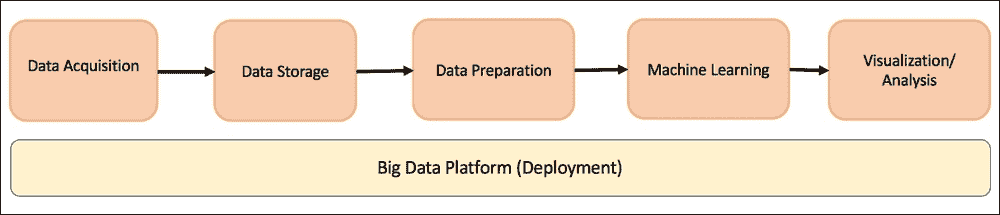

图 1：大数据框架

在集群中如何设置和部署大数据框架的选择是影响工具、技术和成本决策的因素之一。数据采集或收集组件是第一步，它包括多种同步和异步技术，用于将数据吸收到系统中。组件中提供了从发布-订阅、源-汇、关系型数据库查询和自定义数据连接器等各种技术。

根据各种其他功能需求，数据存储选择包括从分布式文件系统如 HDFS 到非关系型数据库（NoSQL）。NoSQL 数据库在*数据存储*部分进行了描述。

数据准备，即转换大量存储的数据，使其能够被机器学习分析所消费，是一个重要的处理步骤。这依赖于存储中使用的框架、技术和工具。它还依赖于下一步：选择将要使用的机器学习分析/框架。以下子节将讨论广泛的选择处理框架。

回想一下，在批量学习中，模型是在之前收集的多个示例上同时训练的。与批量学习相反，实时学习模型训练是连续的，每个到达的新实例都成为动态训练集的一部分。有关详细信息，请参阅第五章，*实时流机器学习*。一旦数据根据领域要求收集、存储和转换，就可以采用不同的机器学习方法，包括批量学习、实时学习和批量-实时混合学习。选择监督学习、无监督学习或两者的组合也取决于数据、标签的可用性和标签质量。这些将在本章后面详细讨论。

开发阶段以及生产或运行时阶段的分析结果也需要存储和可视化，以便于人类和自动化任务。

### 大数据集群部署框架

基于核心 Hadoop (*参考资料* [3]) 开源平台构建了许多框架。每个框架都为之前描述的大数据组件提供了一系列工具。

#### Hortonworks 数据平台

**Hortonworks 数据平台** (**HDP**) 提供了一个开源分布，包括其堆栈中的各种组件，从数据采集到可视化。Apache Ambari 通常是用于管理服务和提供集群配置和监控的用户界面。以下截图展示了用于配置各种服务和健康检查仪表板的 Ambari：

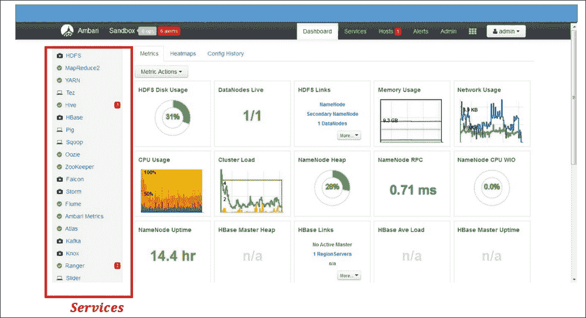

图 2：Ambari 仪表板用户界面

#### Cloudera CDH

与 HDP 类似，Cloudera CDH (*参考文献[4]*) 提供了类似的服务，Cloudera 服务管理器可以像 Ambari 一样用于集群管理和健康检查，如下面的截图所示：

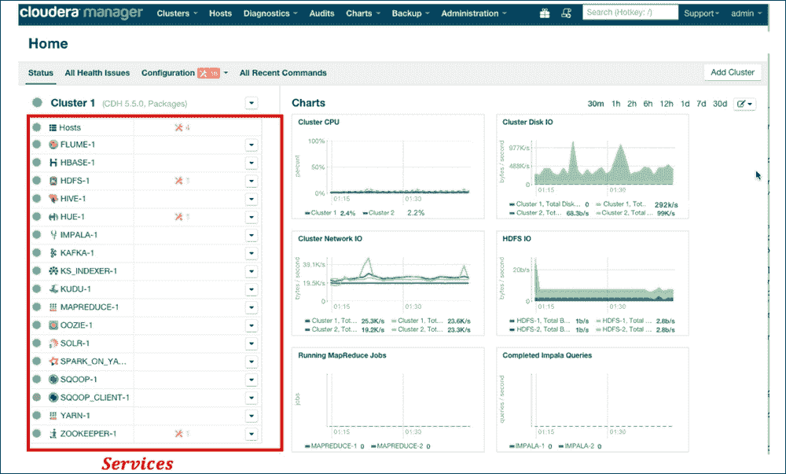

图 3：Cloudera 服务管理器用户界面

#### Amazon Elastic MapReduce

Amazon Elastic MapReduce (EMR) (*参考文献[5]*) 是另一个类似于 HDP 和 Cloudera 的大数据集群平台，它支持广泛的框架。EMR 有两种模式——**集群模式**和**步骤执行模式**。在集群模式下，您可以选择 EMR 或 MapR 的大数据堆栈供应商，而在步骤执行模式下，您可以为执行提供从 JAR 文件到 SQL 查询的各种作业。以下截图显示了配置新集群以及定义新作业流的界面：

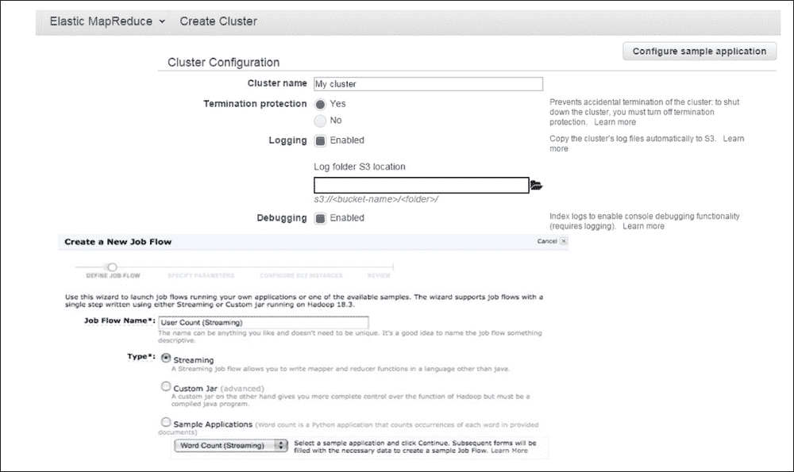

图 4：Amazon Elastic MapReduce 集群管理用户界面

#### Microsoft Azure HDInsight

Microsoft Azure HDInsight (*参考文献[6]*) 是另一个平台，它允许使用包括存储、处理和机器学习在内的大多数服务进行集群管理。如下面的截图所示，Azure 门户用于创建、管理和帮助学习集群各个组件的状态：

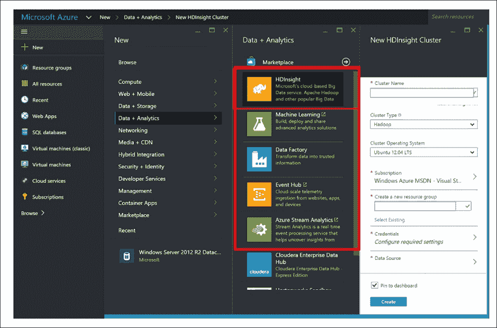

图 5：Microsoft Azure HDInsight 集群管理用户界面

### 数据采集

在大数据框架中，采集组件在从不同的源系统收集数据并将其存储在大数据存储中方面发挥着重要作用。根据源类型、数量、速度、功能以及性能要求，存在各种采集框架和工具。我们将描述一些最知名框架和工具，以给读者提供一些洞察。

#### 发布-订阅框架

在基于发布-订阅的框架中，发布源将数据以不同格式推送到代理，该代理有不同的订阅者等待消费。发布者和订阅者彼此之间不知情，由代理在中间调解。

**Apache Kafka** (*参考文献[9]*) 和 **Amazon Kinesis** 是基于此模型的两个知名实现。Apache Kafka 定义了发布者、消费者和主题的概念——事物在此发布和消费，以及一个用于管理主题的代理。Amazon Kinesis 基于类似的概念，通过 Kinesis 流连接生产者和消费者，这些流类似于 Kafka 中的主题。

#### 源-汇框架

在源-汇模型中，源将数据推入框架，框架将系统推送到汇。Apache Flume (*参考文献[7]*) 是此类框架的一个知名实现，具有各种源、用于缓冲数据的通道以及在大数据世界中存储数据的多个汇。

#### SQL 框架

由于许多传统数据存储以基于 SQL 的关系型数据库管理系统（RDBMS）的形式存在，基于 SQL 的框架提供了一种通用的方式来从 RDBMS 导入数据并将其存储在大数据中，主要是 HDFS 格式。Apache Sqoop（*参考文献* [10]）是一个知名的实现，可以从任何基于 JDBC 的 RDBMS 导入数据并将其存储在基于 HDFS 的系统。

#### 消息队列框架

消息队列框架是基于推送-拉取的框架，类似于发布-订阅系统。消息队列将生产者和消费者分开，并可以在队列中存储数据，采用异步通信模式。已经开发了许多协议，例如高级消息队列协议（AMQP）和 ZeroMQ 消息传输协议（ZMTP）。RabbitMQ、ZeroMQ、Amazon SQS 等是一些此框架的知名实现。

#### 自定义框架

针对不同来源（如 IoT、HTTP、WebSockets 等）的专用连接器导致了许多特定连接器的出现，例如 Amazon IoT Hub、REST 连接器、WebSocket 等。

### 数据存储

数据存储组件在连接获取和其他组件方面发挥着关键作用。在决定数据存储时，应考虑性能、对数据处理的影响、成本、高可用性、易于管理等因素。对于纯实时或近实时系统，有基于内存的存储框架，但对于基于批次的系统，主要有分布式文件系统，如 HDFS 或 NoSQL。

#### HDFS

HDFS 可以在大型节点集群上运行，并提供所有重要功能，如高吞吐量、复制、故障转移等。

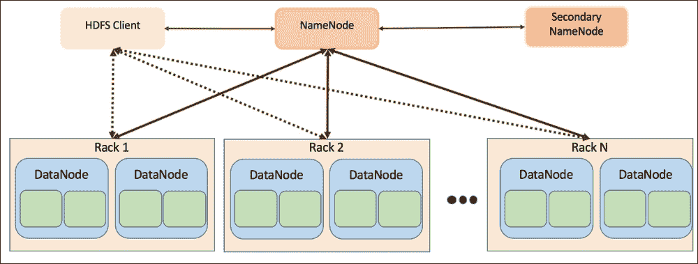

HDFS 的基本架构包含以下组件：

+   **NameNode**：HDFS 客户端始终将请求发送到 NameNode，它保存文件的元数据，而实际数据以块的形式分布在 DataNode 上。NameNode 只负责处理文件的打开和关闭，而读取、写入和追加的其余交互发生在客户端和数据节点之间。NameNode 将元数据存储在两个文件中：`fsimage`和`edit`文件。`fsimage`包含文件系统元数据作为快照，而 edit 文件包含对元数据的增量更改。

+   **Secondary NameNode**：Secondary NameNode 通过在每个预定义检查点保留`fsimage`和`edit`文件的副本，为 NameNode 中的元数据提供冗余。

+   **DataNode**：DataNode 管理实际的数据块并促进对这些数据块的读写操作。DataNode 通过心跳信号与 NameNode 保持通信，以表明它们处于活动状态。存储在 DataNode 中的数据块也进行了冗余复制。DataNode 中的数据块复制受制于机架感知放置策略。

#### NoSQL

非关系型数据库，也称为 NoSQL 数据库，在大数据世界中越来越受欢迎。高吞吐量、更好的水平扩展、检索性能的提高以及以牺牲较弱的一致性模型为代价的存储是大多数 NoSQL 数据库的显著特征。在本节中，我们将讨论一些重要的 NoSQL 数据库形式及其实现。

##### 键值数据库

键值数据库是最突出的 NoSQL 数据库，主要用于半结构化或非结构化数据。正如其名所示，存储结构相当基本，具有独特的键将数据值（可以是字符串、整数、双精度等类型，甚至 BLOBS）与之关联。对键进行哈希处理以快速查找和检索值，以及将数据跨多个节点分区，提供了高吞吐量和可伸缩性。查询能力非常有限。Amazon DynamoDB、Oracle NoSQL、MemcacheDB 等是一些键值数据库的例子。

##### 文档数据库

文档数据库以 XML、JSON 或 YAML 文档的形式存储半结构化数据，以下是一些最流行的格式。文档具有独特的键，它们被映射到这些键上。尽管在键值存储中存储文档是可能的，但文档存储提供的查询能力更强，因为构成文档结构的原语（可能包括名称或属性）也可以用于检索。当数据不断变化且字段数量或长度可变时，文档数据库通常是一个不错的选择。文档数据库不提供连接能力，因此所有信息都需要在文档值中捕获。MongoDB、ElasticSearch、Apache Solr 等是一些著名的文档数据库实现。

##### 列式数据库

列作为存储的基本单元，具有名称、值和通常的时间戳，这区分了列式数据库与传统的关系数据库。列进一步组合形成列族。行通过行键索引，并关联多个列族。某些行可能只能使用已填充的列族，这使其在稀疏数据中具有很好的存储表示。列式数据库没有像关系数据库那样的固定模式；新列和列族可以随时添加，这给了它们显著的优势。**HBase**、**Cassandra**和**Parquet**是一些著名的列式数据库实现。

##### 图数据库

在许多应用中，数据具有固有的图结构，包括节点和链接。在图数据库中存储此类数据使其在存储、检索和查询方面更加高效。节点有一组属性，通常代表实体，而链接表示节点之间的关系，可以是定向的或非定向的。**Neo4J**、**OrientDB**和**ArangoDB**是一些著名的图数据库实现。

### 数据处理和准备

数据准备步骤涉及在数据准备好由分析和机器学习算法消费之前的各种预处理步骤。涉及的一些关键任务包括：

+   **数据清洗**：涉及对原始数据进行错误纠正、类型匹配、元素归一化等所有内容。

+   **数据抓取和整理**：将数据元素从一种结构转换为另一种结构并进行归一化。

+   **数据转换**：许多分析算法需要基于原始或历史数据的聚合特征。在这个步骤中，会进行这些额外特征的转换和计算。

#### Hive 和 HQL

Apache Hive (*参考文献[11]*) 是在 HDFS 系统中执行各种数据准备活动的强大工具。Hive 将底层 HDFS 数据组织成类似于关系数据库的结构。HQL 类似于 SQL，有助于执行各种聚合、转换、清理和归一化，然后数据被序列化回 HDFS。Hive 中的逻辑表被分区并在子分区中划分以提高速度。Hive 中的复杂连接和聚合查询会自动转换为 MapReduce 作业以实现吞吐量和速度提升。

#### Spark SQL

Spark SQL，Apache Spark 的主要组件 (*参考文献[1]和[2]*)，提供了类似 SQL 的功能——类似于 HQL 提供的功能——用于对大数据进行更改。Spark SQL 可以与底层数据存储系统（如 Hive 或 NoSQL 数据库如 Parquet）一起工作。我们将在 Spark 部分的章节中涉及 Spark SQL 的某些方面。

#### Amazon Redshift

Amazon Redshift 在 Amazon EMR 设置上提供了一些仓库功能。它可以使用其 **大规模并行处理** (*MPP*) 数据仓库架构处理 PB 级的数据。

#### 实时流处理

在许多大数据部署中，必须对之前指定的转换在实时数据流上而不是从存储的批量数据中实时进行处理。有各种 **流处理引擎** (*SPE*)，如 Apache Storm (*参考文献[12]*) 和 Apache Samza，以及内存处理引擎如 Spark-Streaming，它们用于流处理。

### 机器学习

机器学习有助于对大数据进行描述性、预测性和规范性分析。本章将涵盖两个广泛的极端：

+   机器学习可以在批量历史数据上执行，然后可以将学习/模型应用于新的批量/实时数据

+   机器学习可以在实时数据上执行，并同时应用于实时数据

本章的剩余部分将详细讨论这两个主题。

### 可视化和分析

在建模时间完成批量学习，在运行时完成实时学习，预测——将模型应用于新数据的输出——必须存储在某种数据结构中，然后由用户进行分析。可视化工具和其他报告工具经常被用来提取和向用户展示信息。根据领域和用户的需求，分析和可视化可以是静态的、动态的或交互式的。

Lightning 是一个框架，使用不同的绑定 API（通过 REST 为 Python、R、Scala 和 JavaScript 语言）在 Web 上执行交互式可视化。

Pygal 和 Seaborn 是基于 Python 的库，它们帮助在 Python 中绘制所有可能的图表和图形，用于分析、报告和可视化。

# 批量大数据机器学习

批量大数据机器学习涉及两个基本步骤，如第二章《实际应用中的监督学习》、第三章《无监督机器学习技术》和第四章《半监督和主动学习》中所述，即从历史数据集中学习或训练数据，并将学习到的模型应用于未见过的未来数据。以下图展示了这两个环境以及完成这些任务的组件任务和一些技术/框架：


图 6：大数据和提供者的建模时间和运行时组件

我们将讨论在批量数据背景下进行机器学习的两个最著名的框架，并使用案例研究来突出执行建模的代码或工具。

## H2O 作为大数据机器学习平台

H2O（*参考文献[13]*）是一个领先的开源大数据机器学习平台，专注于将人工智能引入企业。该公司成立于 2011 年，拥有几位在统计学习理论和优化领域的杰出科学家作为其科学顾问。它支持多种编程环境。虽然 H2O 软件是免费提供的，但客户服务和产品的定制扩展可以购买。

### H2O 架构

以下图展示了 H2O 的高级架构及其重要组件。H2O 可以访问来自各种数据存储的数据，例如 HDFS、SQL、NoSQL 和 Amazon S3 等。H2O 最流行的部署方式是使用之前讨论过的部署堆栈之一与 Spark 一起使用，或者在其自己的 H2O 集群中运行。

H2O 的核心是在内存中处理大数据的优化方式，以便可以有效地处理通过相同数据的迭代算法，并实现良好的性能。在监督学习和无监督学习中，重要的机器学习算法被特别实现以处理跨多个节点和 JVM 的水平可伸缩性。H2O 不仅提供了自己的用户界面，称为 flow，用于管理和运行建模任务，而且还具有不同的语言绑定和连接器 API，用于 Java、R、Python 和 Scala。

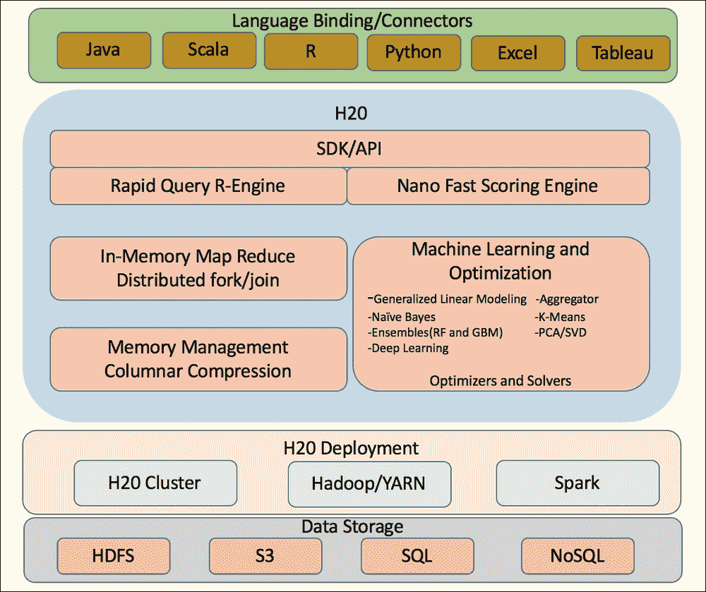

图 7：H2O 高级架构

大多数机器学习算法、优化算法和实用工具都使用了分叉-合并或 MapReduce 的概念。如图 8 所示，整个数据集在 H2O 中被视为一个**数据框**，并包含向量，这些向量是数据集中的特征或列。行或实例由每个向量中的一个元素并排排列组成。行被分组在一起形成一个称为**块**的处理单元。多个块在一个 JVM 中组合。任何算法或优化工作都是从最顶层的 JVM 发送信息到下一个 JVM 进行分叉，然后继续到下一个，以此类推，类似于 MapReduce 中的 map 操作。每个 JVM 在块中的行上执行任务，并最终在 reduce 操作中将结果流回：

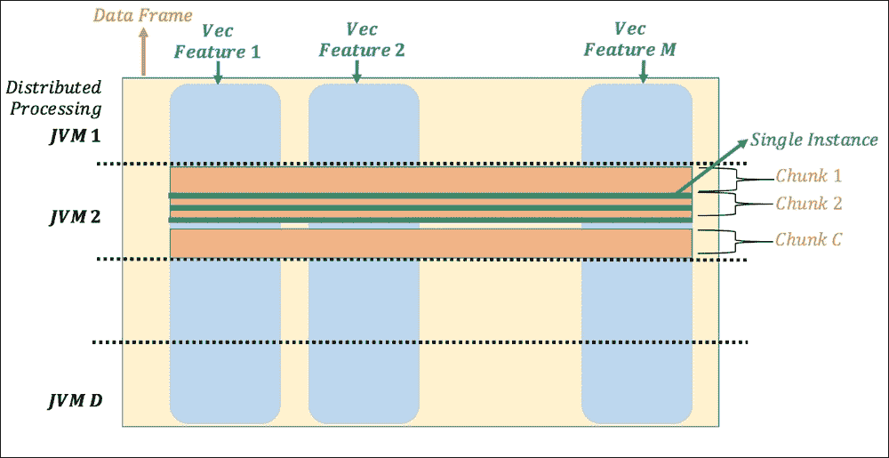

图 8：使用分块进行 H2O 分布式数据处理

### H2O 中的机器学习

下图显示了 H2O v3 支持的所有监督学习和无监督学习的机器学习算法：

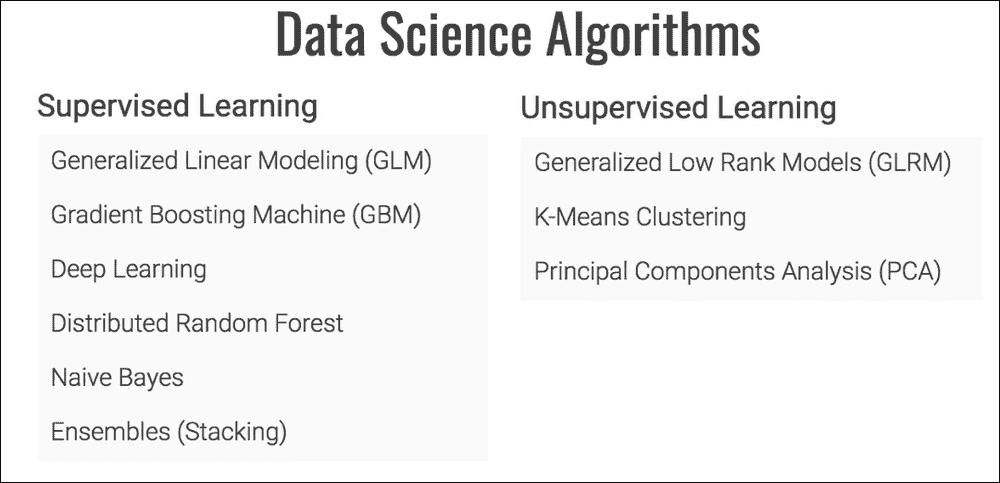

图 9：H2O v3 机器学习算法

### 工具和用法

H2O Flow 是一个交互式 Web 应用程序，帮助数据科学家执行从导入数据到使用点击和向导概念运行复杂模型的各种任务。

H2O 以本地模式运行如下：

```py
java –Xmx6g –jar h2o.jar

```

启动 Flow 的默认方式是将浏览器指向以下 URL：`http://192.168.1.7:54321/`。Flow 的右侧捕获在**概要**标签下执行的每个用户操作。这些操作可以编辑并保存为命名的流程以供重用和协作，如图 10 所示：


图 10：浏览器中的 H2O 流

*图 11*显示了从本地文件系统或 HDFS 导入文件的界面，并显示数据集的详细摘要统计以及可以执行的操作。一旦数据被导入，它就在 H2O 框架中获得一个以`.hex`为扩展名的数据框引用。摘要统计有助于理解数据的特征，如**缺失**、**平均值**、**最大值**、**最小值**等。它还有一个简单的方法将特征从一种类型转换为另一种类型，例如，具有少量唯一值的数值特征转换为 H2O 中称为`enum`的分类/名义类型。

可以在数据集上执行的操作包括：

1.  可视化数据。

1.  将数据分割成不同的集合，如训练、验证和测试。

1.  构建监督和无监督模型。

1.  使用模型进行预测。

1.  下载并导出各种格式的文件。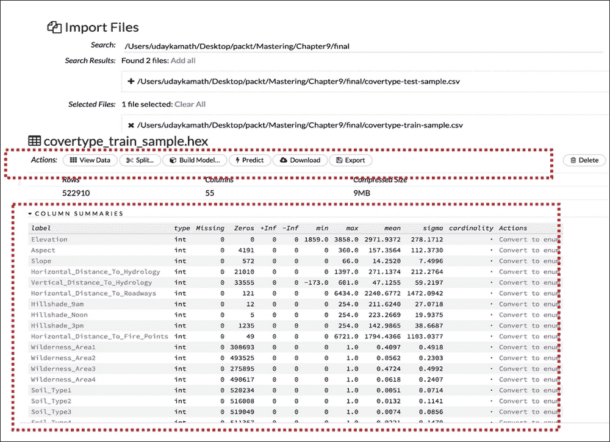

    图 11：以框架、摘要和可执行操作导入数据

在 H2O 中构建监督或无监督模型是通过交互式屏幕完成的。每个建模算法都有其参数，分为三个部分：基本、高级和专家。任何支持超参数搜索以调整模型的参数旁边都有一个复选框网格，并且可以使用多个参数值。

一些基本参数，如**training_frame**、**validation_frame**和**response_column**，是每个监督算法共有的；其他参数特定于模型类型，例如 GLM 的求解器选择、深度学习的激活函数等。所有这些通用参数都在基本部分中。高级参数是允许模型器在必须覆盖默认行为时获得更多灵活性和控制的设置。其中一些参数在算法之间也是通用的——两个例子是分配折指数的方法选择（如果在基本部分中选择了交叉验证），以及选择包含权重的列（如果每个示例单独加权），等等。

专家参数定义了更复杂的元素，例如如何处理缺失值、需要更多算法理解的模型特定参数，以及其他神秘变量。在*图 12*中，GLM，一个监督学习算法，正在使用 10 折交叉验证、二项式（双类）分类、高效的 LBFGS 优化算法和分层采样进行交叉验证分割进行配置：

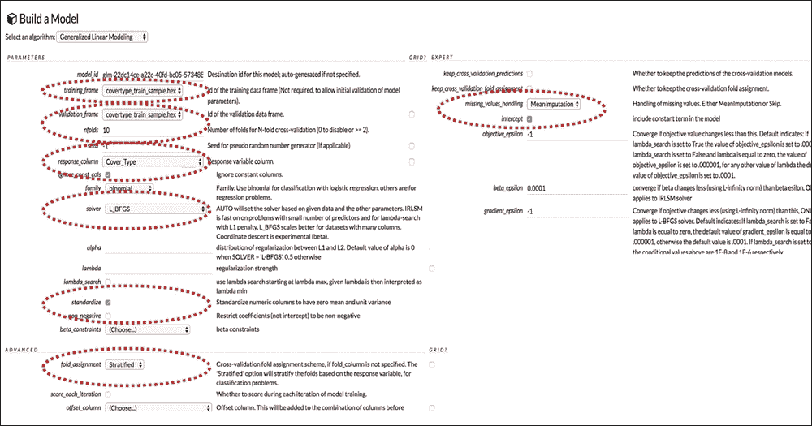

图 12：建模算法参数和验证

模型结果屏幕包含了对结果的详细分析，使用重要的评估图表，具体取决于所使用的验证方法。屏幕顶部是可能采取的操作，例如在未见数据上运行模型进行预测、下载模型为 POJO 格式、导出结果等。

一些图表是算法特定的，例如评分历史记录显示了在 GLM 中迭代过程中训练损失或目标函数如何变化——这使用户能够了解收敛速度以及迭代参数的调整。我们在验证数据中看到了 ROC 曲线和曲线下面积指标，以及增益和提升图表，分别给出了验证样本的累积捕获率和累积提升。

*图 13* 展示了 GLM 在 `CoverType` 数据集上 10 折交叉验证的 **评分历史**、**ROC 曲线**和 **增益/提升** 图表：

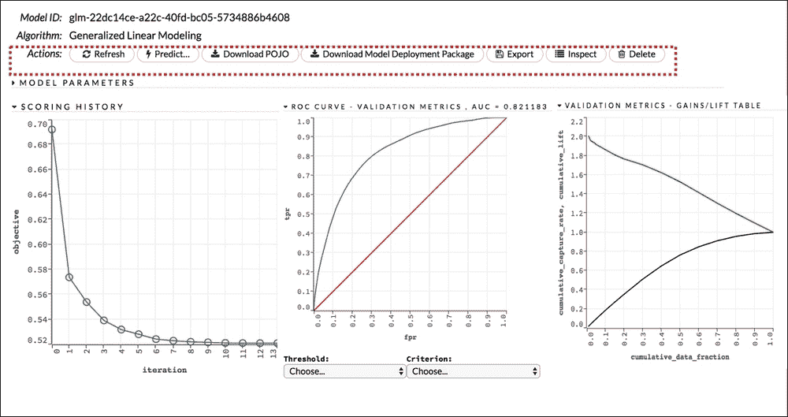

图 13：建模和验证 ROC 曲线、目标函数和提升/增益图表

验证输出的输出提供了详细的评估指标，如准确率、AUC、误差、错误、f1 指标、MCC（马修斯相关系数）、精确率和召回率，对于交叉验证中的每个验证折以及所有计算出的平均值和标准差。

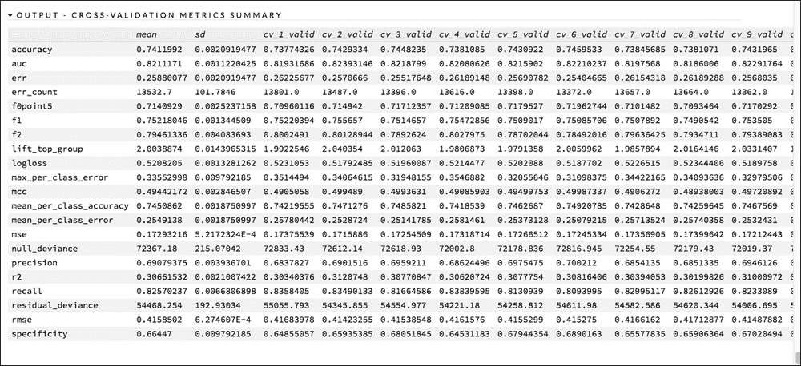

图 14：验证结果和总结

预测操作使用未见过的保留数据运行模型来估计样本外性能。重要的指标，如错误、准确率、曲线下面积、ROC 图等，作为预测的输出给出，可以保存或导出。

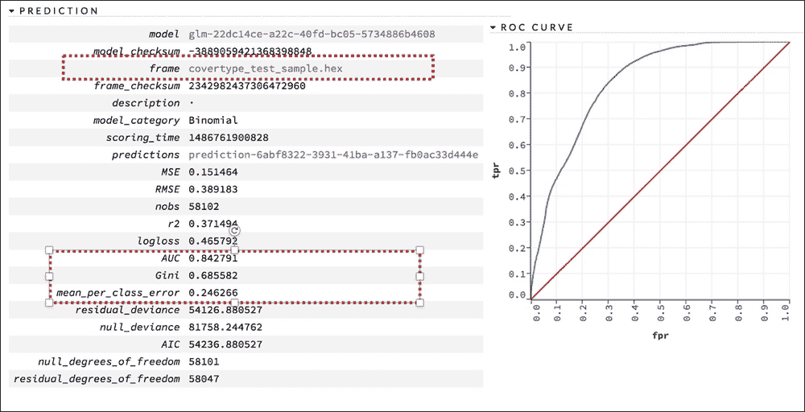

图 15：运行测试数据、预测和 ROC 曲线

# 案例研究

在本案例研究中，我们使用 `CoverType` 数据集来展示 H2O、Apache Spark MLlib 和 SAMOA 机器学习库在 Java 中的分类和聚类算法。

## 商业问题

可从 UCI 机器学习仓库获取的 `CoverType` 数据集（[`archive.ics.uci.edu/ml/datasets/Covertype`](https://archive.ics.uci.edu/ml/datasets/Covertype)）包含 581,012 个 30 x 30 m2 尺寸的森林土地的未缩放地图数据，并附带实际的森林覆盖类型标签。在此处进行的实验中，我们使用数据的归一化版本。包括两种分类类型的 one-hot 编码，每行总共有 54 个属性。

## 机器学习映射

首先，我们将问题视为一个分类问题，使用数据集中包含的标签执行多个监督学习实验。使用生成的模型，我们对未见过的保留测试数据集的森林覆盖类型进行预测。对于后续的聚类实验，我们忽略数据标签，确定要使用的聚类数量，然后报告使用 H2O 和 Spark MLLib 中实现的多种算法对应的成本。

## 数据收集

此数据集仅使用地图测量收集，没有使用遥感。它来源于最初由 **美国森林服务局**（**USFS**）和**美国地质调查局**（**USGS**）收集的数据。

## 数据采样和转换

训练和测试数据—数据集被分成两个集合，测试占 20%，训练占 80%。

土壤类型分类的表示由 40 个二元变量属性组成。值为 1 表示观测中存在土壤类型；值为 0 表示不存在。

野生动植物区域分类同样是一个分类属性，有四个二元列，其中 1 表示存在，0 表示不存在。

所有连续值属性在使用前都已归一化。

### 实验、结果和分析

在本案例研究的第一个实验集中，我们使用了 H2O 框架。

#### 特征相关性和分析

尽管 H2O 没有显式的特征选择算法，但许多学习器如 GLM、随机森林、GBT 等，基于模型的训练/验证提供特征重要性指标。在我们的分析中，我们使用了 GLM 进行特征选择，如图 16 所示。有趣的是，特征**高程**与一些转换为数值/二进制分类特征（如**Soil_Type2**、**Soil_Type4**等）一起成为最具区分性的特征。许多土壤类型分类特征没有相关性，可以从建模角度删除。

本组实验中包含的学习算法有：**广义线性模型** (**GLM**)、**梯度提升机** (**GBM**)、**随机森林** (**RF**)、**朴素贝叶斯** (**NB**) 和 **深度学习** (**DL**)。H2O 支持的深度学习模型是**多层感知器** (**MLP**)。

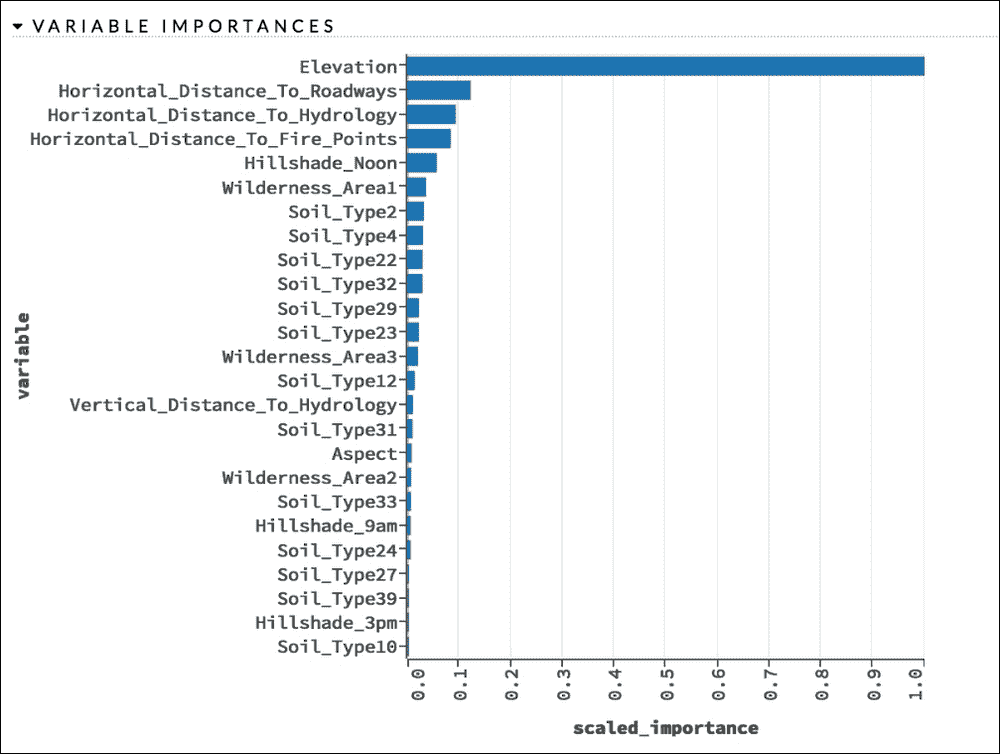

图 16：使用 GLM 进行特征选择

#### 测试数据的评估

使用所有特征的结果显示在表中：

| 算法 | 参数 | AUC | 最大准确率 | 最大 F1 | 最大精确率 | 最大召回率 | 最大特异性 |
| --- | --- | --- | --- | --- | --- | --- | --- |
| **GLM** | 默认 | 0.84 | 0.79 | 0.84 | 0.98 | 1.0(1) | 0.99 |
| **GBM** | 默认 | 0.86 | 0.82 | 0.86 | 1.0(1) | 1.0(1) | 1.0(1) |
| **随机森林** (**RF**) | 默认 | 0.88(1) | 0.83(1) | 0.87(1) | 0.97 | 1.0(1) | 0.99 |
| **朴素贝叶斯** (**NB**) | Laplace=50 | 0.66 | 0.72 | 0.81 | 0.68 | 1.0(1) | 0.33 |
| **深度学习** (**DL**) | Rect,300, 300,Dropout | 0. | 0.78 | 0.83 | 0.88 | 1.0(1) | 0.99 |
| **深度学习** (**DL**) | 300, 300, MaxDropout | 0.82 | 0.8 | 0.84 | 1.0(1) | 1.0(1) | 1.0(1) |

移除在特征相关性评分中表现不佳的特征后的结果如下：

| 算法 | 参数 | AUC | 最大准确率 | 最大 F1 | 最大精确率 | 最大召回率 | 最大特异性 |
| --- | --- | --- | --- | --- | --- | --- | --- |
| **GLM** | 默认 | 0.84 | 0.80 | 0.85 | 1.0 | 1.0 | 1.0 |
| **GBM** | 默认 | 0.85 | 0.82 | 0.86 | 1.0 | 1.0 | 1.0 |
| **随机森林** (**RF**) | 默认 | 0.88 | 0.83 | 0.87 | 1.0 | 1.0 | 1.0 |
| **朴素贝叶斯** (**NB**) | Laplace=50 | 0.76 | 0.74 | 0.81 | 0.89 | 1.0 | 0.95 |
| **深度学习** (**DL**) | 300,300, RectDropout | 0.81 | 0.79 | 0.84 | 1.0 | 1.0 | 1.0 |
| **深度学习** (**DL**) | 300, 300, MaxDropout | 0.85 | 0.80 | 0.84 | 0.89 | 0.90 | 1.0 |

表 1：包含所有特征的模型评估结果

#### 结果分析

从结果分析中获得的主要观察结果非常有启发性，在此处展示。

1.  特征相关性分析显示了**海拔**特征是一个高度区分性的特征，而许多转换为二进制特征的分类属性，如**SoilType_10**等，其相关性几乎为零或没有。

1.  包含所有特征的实验结果，如*表 1*所示，清楚地表明，非线性集成技术随机森林（Random Forest）是最佳算法，这从包括准确率、F1、AUC 和召回率在内的多数评估指标中可以看出。

1.  *表 1*也突出了这样一个事实：虽然较快的线性朴素贝叶斯（Naive Bayes）算法可能不是最佳选择，但属于线性算法类别的 GLM 表现出更好的性能——这表明特征之间存在一些相互依赖性！

1.  如我们在第七章中看到的，*深度学习*算法通常需要大量的调整；然而，即使只有少数小的调整，深度学习（DL）的结果与随机森林（Random Forest）相比也是可以相提并论的，尤其是在使用 MaxDropout 的情况下。

1.  *表 2*显示了从训练集中移除低相关性特征后所有算法的结果。可以看出，由于基于特征之间独立性的假设进行概率乘法，朴素贝叶斯（Naive Bayes）的影响最大，因此它获得了最大的利益和性能提升。大多数其他算法，如随机森林（Random Forest），如我们在第二章中讨论的，*面向现实世界监督学习的实用方法*，内置了特征选择，因此移除不重要的特征对它们的性能影响很小或没有影响。

## Spark MLlib 作为大数据机器学习平台

Apache Spark 始于 2009 年，在加州大学伯克利分校的 AMPLab，于 2013 年在 Apache License 2.0 下捐赠给了 Apache 软件基金会。Spark 的核心思想是构建一个集群计算框架，以克服 Hadoop 的问题，特别是对于迭代和内存计算。

### Spark 架构

如*图 17*所示的 Spark 堆栈可以使用任何类型的数据存储，如 HDFS、SQL、NoSQL 或本地文件系统。它可以在 Hadoop、Mesos 或独立部署。

Spark 最重要的组件是 Spark Core，它提供了一个框架，以高吞吐量、容错和可扩展的方式处理和操作数据。

建立在 Spark 核心之上的各种库，每个库都针对大数据世界中处理数据和进行数据分析所需的各种功能。Spark SQL 为我们提供了一种使用类似于 SQL 的查询语言在大数据存储中进行数据操作的语言，SQL 是数据库的*通用语言*。Spark GraphX 提供了执行图相关操作和基于图的算法的 API。Spark Streaming 提供了处理流处理中所需实时操作的 API，从数据操作到对流的查询。

Spark-MLlib 是一个机器学习库，拥有广泛的机器学习算法，可以执行从特征选择到建模的监督和未监督任务。Spark 有各种语言绑定，如 Java、R、Scala 和 Python。MLlib 在 Spark 引擎上运行具有明显的优势，尤其是在跨多个节点缓存数据以及在内存中运行 MapReduce 作业方面，从而与 Mahout 和其他大规模机器学习引擎相比，性能得到了显著提升。MLlib 还具有其他优势，如容错性和可伸缩性，无需在机器学习算法中显式管理。

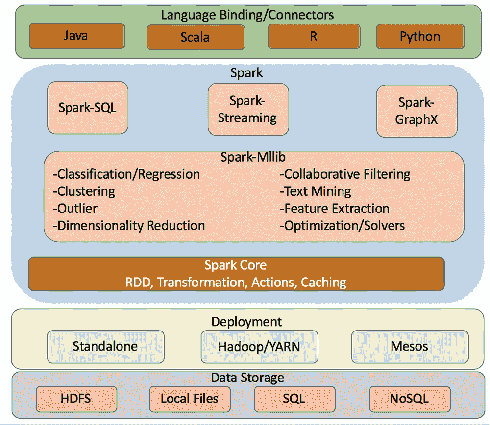

图 17：Apache Spark 高级架构

Spark 核心组件如下：

+   **弹性分布式数据集**（**RDD**）：RDD 是 Spark Core 知道如何分区和分布到集群以执行任务的不可变对象的基本集合。RDD 由“分区”组成，这些分区依赖于父 RDD 和关于数据放置的元数据。

+   在 RDD 上执行两种不同的操作：

    +   **转换**：这些操作是延迟评估的，可以将一个 RDD 转换为另一个 RDD。延迟评估尽可能推迟评估，这使得一些资源优化成为可能。

    +   **操作**：触发转换并返回输出值的实际操作

+   **血缘图**：描述特定任务的计算流程或数据流，包括在转换和操作中创建的不同 RDD，称为任务的血缘图。血缘图在容错中扮演着关键角色。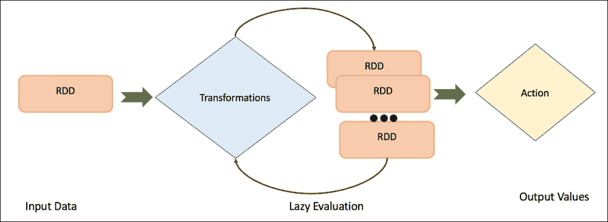

    图 18：Apache Spark 血缘图

Spark 对集群管理是中立的，可以与 YARN 和 Mesos 等多个实现一起工作，以管理节点、分配工作和通信。转换和操作在集群中的任务分配是由调度器完成的，从创建 Spark 上下文的驱动节点开始，到如图 19 所示的许多工作节点。当与 YARN 一起运行时，Spark 允许用户在节点级别选择执行器的数量、堆大小和每个 JVM 的核心分配。

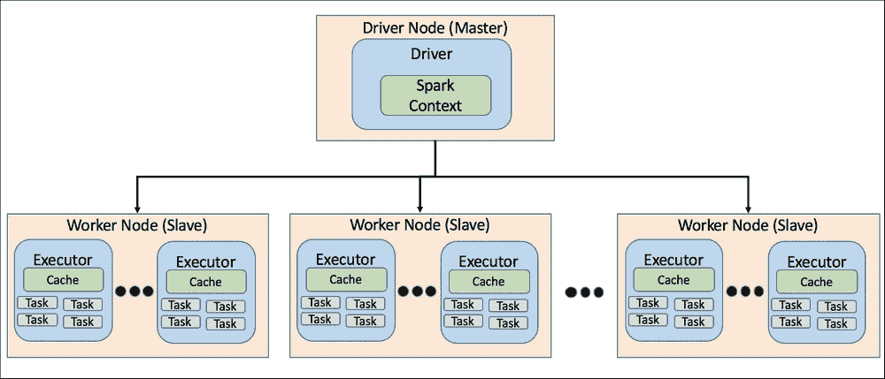

图 19：Apache Spark 集群部署和任务分配

### MLlib 中的机器学习

Spark MLlib 拥有一个全面的机器学习工具包，提供的算法比写作时的 H2O 更多，如图 20 所示：

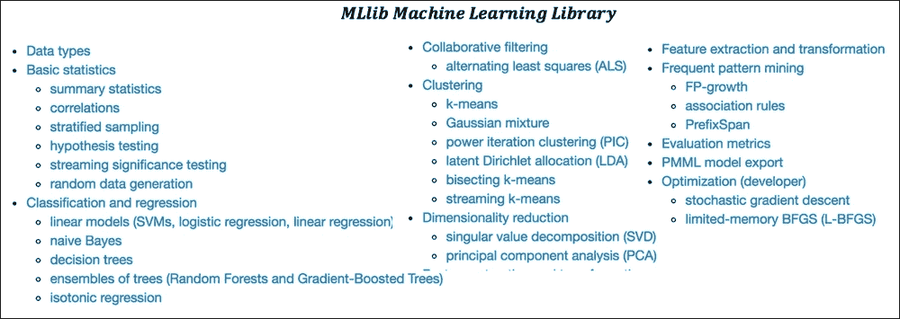

图 20：Apache Spark MLlib 机器学习算法

为 Spark 编写了许多扩展，包括 Spark MLlib，用户社区还在继续贡献更多包。您可以在 [`spark-packages.org/`](https://spark-packages.org/) 下载第三方包或注册您自己的包。

### 工具和用法

Spark MLlib 除了 Java 之外，还为 Scala、Python 和 R 等语言提供了 API。当创建`SparkContext`时，它会在端口`4040`启动一个监控和仪表化 Web 控制台，使我们能够查看有关运行时的关键信息，包括计划的任务及其进度、RDD 大小和内存使用情况等。还有可用的外部分析工具。

### 实验、结果和分析

我们在这里解决的业务问题与之前使用 H2O 进行实验所描述的问题相同。我们总共使用了 MLlib 中的五种学习算法。第一个是使用从计算大量*k*值得到的成本（特别是**平方和误差**（**SSE**））确定的*k*值进行 k-Means 聚类，并选择曲线的“肘部”。确定最优的*k*值通常不是一个容易的任务；通常，为了选择最佳的*k*，会比较如轮廓等评估指标。尽管我们知道数据集中类的数量是*7*，但如果假设我们没有标记数据，看到此类实验的走向也是有益的。使用肘部方法找到的最优*k*值为 27。在现实世界中，业务决策可能经常指导*k*的选择。

在以下列表中，我们展示了如何使用 MLlib 套件中的不同模型来进行聚类分析和分类。代码基于 MLlib API 指南中提供的示例（[`spark.apache.org/docs/latest/mllib-guide.html`](https://spark.apache.org/docs/latest/mllib-guide.html)）。我们使用 CSV 格式的标准化 UCI `CoverType`数据集。请注意，使用较新的`spark.ml`包中的`spark.sql.Dataset`更为自然，而`spark.mllib`包则更紧密地与`JavaRDD`协同工作。这为 RDD 提供了抽象，并允许对底层的转换进行优化。对于大多数无监督学习算法来说，这意味着数据必须进行转换，以便用于训练和测试的数据集默认包含一个名为 features 的列，该列包含观察到的所有特征作为向量。可以使用`VectorAssembler`对象进行这种转换。源代码中给出了对 ML 管道的使用示例，这是一种将任务链式连接起来的方法，用于训练随机森林分类器。

#### k-Means

以下 k-Means 实验的代码片段使用了来自`org.apache.spark.ml.clustering`包的算法。代码包括设置`SparkSession`（Spark 运行时的句柄）的最小模板代码。请注意，在设置中指定了本地模式下的八个核心：

```py
SparkSession spark = SparkSession.builder()
    .master("local[8]")
    .appName("KMeansExpt")
    .getOrCreate();

// Load and parse data
String filePath = "/home/kchoppella/book/Chapter09/data/covtypeNorm.csv";
// Selected K value 
int k =  27;

// Loads data.
Dataset<Row> inDataset = spark.read()
    .format("com.databricks.spark.csv")
    .option("header", "true")
    .option("inferSchema", true)
    .load(filePath);
ArrayList<String> inputColsList = new ArrayList<String>(Arrays.asList(inDataset.columns()));

//Make single features column for feature vectors 
inputColsList.remove("class");
String[] inputCols = inputColsList.parallelStream().toArray(String[]::new);

//Prepare dataset for training with all features in "features" column
VectorAssembler assembler = new VectorAssembler().setInputCols(inputCols).setOutputCol("features");
Dataset<Row> dataset = assembler.transform(inDataset);

KMeans kmeans = new KMeans().setK(k).setSeed(1L);
KMeansModel model = kmeans.fit(dataset);

// Evaluate clustering by computing Within Set Sum of Squared Errors.
double SSE = model.computeCost(dataset);
System.out.println("Sum of Squared Errors = " + SSE);

spark.stop();
```

通过评估和绘制不同值的平方和误差，并选择曲线的肘部值，得到了最佳聚类数量值。这里使用的值是*27*。

#### 带 PCA 的 k-Means

在第二个实验中，我们再次使用了 k-Means，但首先通过 PCA 减少了数据中的维度。在这里，我们使用了一个经验法则，即选择 PCA 参数的维度值，以确保在降维后至少保留了原始数据集 85%的方差。这从最初的 54 个特征产生了转换数据集中的 16 个特征，并且这个数据集被用于本实验和后续实验。以下代码显示了 PCA 分析的相关代码：

```py
int numDimensions = 16
PCAModel pca = new PCA()
    .setK(numDimensions)
    .setInputCol("features")
    .setOutputCol("pcaFeatures")
    .fit(dataset);

Dataset<Row> result = pca.transform(dataset).select("pcaFeatures");
KMeans kmeans = new KMeans().setK(k).setSeed(1L);
KMeansModel model = kmeans.fit(dataset);
```

#### Bisecting k-Means (with PCA)

第三个实验使用了 MLlib 的 Bisecting k-Means 算法。这个算法类似于一种自上而下的层次聚类技术，其中所有实例最初都在同一个簇中，然后进行连续的分割：

```py
// Trains a bisecting k-Means model.
BisectingKMeans bkm = new BisectingKMeans().setK(k).setSeed(1);
BisectingKMeansModel model = bkm.fit(dataset);
```

#### 高斯混合模型

在下一个实验中，我们使用了 MLlib 的**高斯混合模型**（**GMM**），另一种聚类模型。该模型固有的假设是每个簇中的数据分布本质上是高斯分布，具有未知参数。这里指定了相同数量的簇，并且已使用默认值作为最大迭代次数和容忍度，这些值决定了算法何时被认为已收敛：

```py
GaussianMixtureModel gmm = new GaussianMixture()
    .setK(numClusters)
    .fit(result);
// Output the parameters of the mixture model
for (int k = 0; k < gmm.getK(); k++) {
  String msg = String.format("Gaussian %d:\nweight=%f\nmu=%s\nsigma=\n%s\n\n",
              k, gmm.weights()[k], gmm.gaussians()[k].mean(), 
              gmm.gaussians()[k].cov());
  System.out.printf(msg);
  writer.write(msg + "\n");
  writer.flush();
}
```

#### 随机森林

最后，我们运行了随机森林，这是唯一可用的能够处理多类分类的集成学习器。在以下代码中，我们可以看到这个算法在训练之前需要执行一些预备任务。预处理阶段被组合成一个由 Transformers 和 Estimators 组成的管道。然后使用该管道来拟合数据。您可以在 Apache Spark 网站上了解更多关于管道的信息（[`spark.apache.org/docs/latest/ml-pipeline.html`](https://spark.apache.org/docs/latest/ml-pipeline.html)）：

```py
// Index labels, adding metadata to the label column.
// Fit on whole dataset to include all labels in index.
StringIndexerModel labelIndexer = new StringIndexer()
  .setInputCol("class")
  .setOutputCol("indexedLabel")
  .fit(dataset);
// Automatically identify categorical features, and index them.
// Set maxCategories so features with > 2 distinct values are treated as continuous since we have already encoded categoricals with sets of binary variables.
VectorIndexerModel featureIndexer = new VectorIndexer()
  .setInputCol("features")
  .setOutputCol("indexedFeatures")
  .setMaxCategories(2)
  .fit(dataset);

// Split the data into training and test sets (30% held out for testing)
Dataset<Row>[] splits = dataset.randomSplit(new double[] {0.7, 0.3});
Dataset<Row> trainingData = splits[0];
Dataset<Row> testData = splits[1];

// Train a RF model.
RandomForestClassifier rf = new RandomForestClassifier()
  .setLabelCol("indexedLabel")
  .setFeaturesCol("indexedFeatures")
  .setImpurity("gini")
  .setMaxDepth(5)
  .setNumTrees(20)
  .setSeed(1234);

// Convert indexed labels back to original labels.
IndexToString labelConverter = new IndexToString()
  .setInputCol("prediction")
  .setOutputCol("predictedLabel")
  .setLabels(labelIndexer.labels());

// Chain indexers and RF in a Pipeline.
Pipeline pipeline = new Pipeline()
  .setStages(new PipelineStage[] {labelIndexer, featureIndexer, rf, labelConverter});

// Train model. This also runs the indexers.
PipelineModel model = pipeline.fit(trainingData);

// Make predictions.
Dataset<Row> predictions = model.transform(testData);

// Select example rows to display.
predictions.select("predictedLabel", "class", "features").show(5);

// Select (prediction, true label) and compute test error.
MulticlassClassificationEvaluator evaluator = new MulticlassClassificationEvaluator()
  .setLabelCol("indexedLabel")
  .setPredictionCol("prediction");

evaluator.setMetricName("accuracy");
double accuracy = evaluator.evaluate(predictions);
System.out.printf("Accuracy = %f\n", accuracy); 
```

使用 k-Means 和 Bisecting k-Means 的实验的均方误差在以下表中给出：

| 算法 | k | 特征 | SSE |
| --- | --- | --- | --- |
| k-Means | 27 | 54 | 214,702 |
| k-Means(PCA) | 27 | 16 | 241,155 |
| Bisecting k-Means(PCA) | 27 | 16 | 305,644 |

表 3：k-Means 的结果

GMM 模型被用来展示 API 的使用；它为每个簇输出高斯混合的参数以及簇权重。所有簇的输出可以在本书的网站上查看。

对于随机森林的情况，这些是不同树的数量运行的结果。这里使用了所有 54 个特征：

| 树的数量 | 准确率 | F1 度量 | 加权精度 | 加权召回率 |
| --- | --- | --- | --- | --- |
| 15 | 0.6806 | 0.6489 | 0.6213 | 0.6806 |
| 20 | 0.6776 | 0.6470 | 0.6191 | 0.6776 |
| 25 | 0.5968 | 0.5325 | 0.5717 | 0.5968 |
| 30 | 0.6547 | 0.6207 | 0.5972 | 0.6547 |
| 40 | 0.6594 | 0.6272 | 0.6006 | 0.6594 |

表 4：随机森林的结果

##### 结果分析

如 *表 3* 所示，在 PCA 后使用较少维度时，成本略有增加，而簇的数量保持不变。随着 PCA 中 *k* 的变化，可能表明 PCA 情况下的更好 *k*。注意，在这个实验中，对于相同的 *k*，使用 PCA 导出的特征的 Bisecting K-Means 具有最高的成本。用于 Bisecting k-Means 的停止簇数简单地被选为基本 k-Means 确定的那个，但不必如此。对于 Bisecting k-Means，可以独立进行寻找最佳成本 *k* 的类似搜索。

在随机森林的情况下，当使用 *15* 棵树时，我们看到最佳性能。所有树都有三个深度。这个超参数可以变化以调整模型。尽管随机森林由于在训练阶段考虑了树之间的方差，因此不易过拟合，但将树的数量增加到最佳数量以上可能会降低性能。

### 实时大数据机器学习

在本节中，我们将讨论大数据机器学习的实时版本，其中数据以大量形式到达，并且同时以快速的速度发生变化。在这些条件下，机器学习分析不能按照传统的“批量学习与部署”实践进行 *per* (*参考文献* [14])。

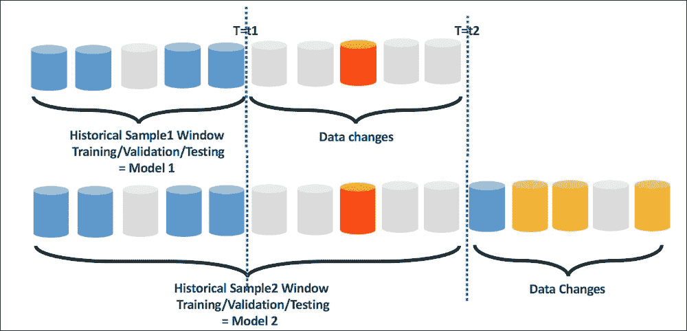

图 21：实时大数据机器学习的用例

让我们考虑一个案例，其中在短时间内有标记数据可用，我们对数据进行适当的建模技术，然后对生成的模型应用最合适的评估方法。接下来，我们选择最佳模型，并在运行时使用它对未见数据进行预测。然后，我们观察到，模型性能随着时间的推移显著下降。用新数据进行重复的练习显示出类似性能的退化！我们现在该怎么办？这种困境，加上大量数据，促使我们需要不同的方法：实时大数据机器学习。

与批量学习框架类似，大数据中的实时框架在数据准备阶段之前可能具有类似的组件。当数据准备中涉及的计算必须在流或流与批量数据组合上进行时，我们需要专门的计算引擎，例如 **Spark Streaming**。像流计算一样，机器学习必须在集群上工作，并在流上执行不同的机器学习任务。这给单机多线程流算法的实现增加了额外的复杂性。

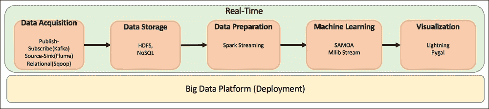

图 22：实时大数据组件和提供商

#### SAMOA 作为实时大数据机器学习框架

在第五章“实时流机器学习”中，我们详细讨论了 MOA 框架。SAMOA 是用于在流上执行机器学习的分布式框架。

在撰写本文时，SAMOA 是一个孵化级开源项目，拥有 Apache 2.0 许可证，并与不同的流处理引擎（如**Apache Storm**、**Samza**和**S4**）有良好的集成。

##### SAMOA 架构

SAMOA 框架为可扩展的流处理引擎集提供几个关键流服务，现有实现适用于今天最受欢迎的引擎。

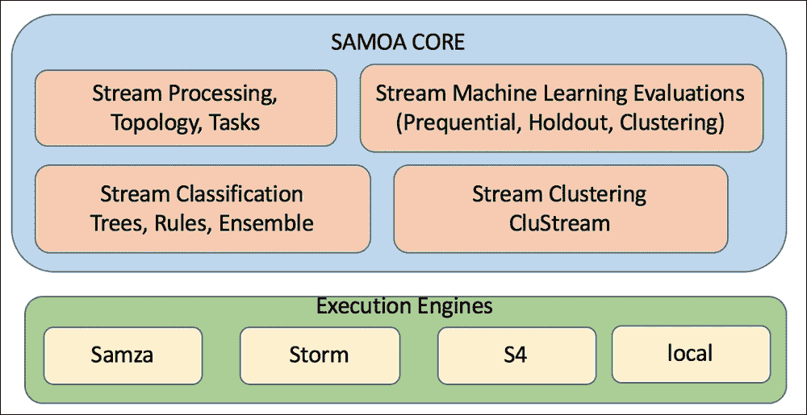

图 23：SAMOA 高级架构

`TopologyBuilder`是一个充当工厂的接口，用于在 SAMOA 中创建不同的组件并将它们连接在一起。SAMOA 的核心在于构建数据流的处理元素。处理的基本单元由`ProcessingItem`和`Processor`接口组成，如图 24 所示。`ProcessingItem`是一个封装的隐藏元素，而`Processor`是核心实现，其中编码了处理流的逻辑。

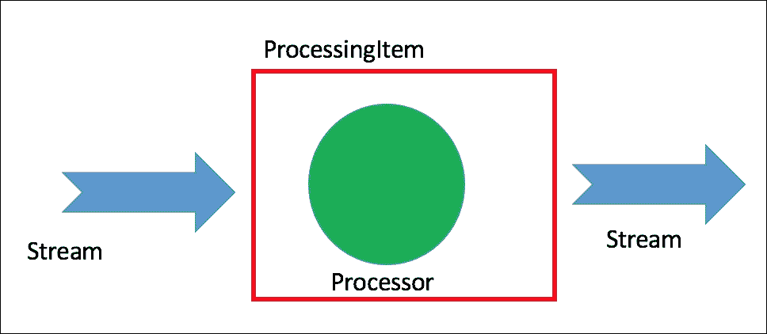

图 24：SAMOA 处理数据流

**流**是另一个接口，它将各种**处理器**连接起来，作为由`TopologyBuilder`创建的源和目的地。一个流可以有一个源和多个目的地。流支持源和目的地之间的三种通信形式：

+   **所有**: 在本通信中，所有来自源的消息都被发送到所有目的地

+   **键**: 在本通信中，具有相同键的消息被发送到相同的处理器

+   **洗牌**: 在本通信中，消息被随机发送到处理器

SAMOA 中的所有消息或事件都是`ContentEvent`接口的实现，主要封装流中的数据作为值，并具有某种形式的键以实现唯一性。

每个流处理引擎都有一个作为插件的实现，用于所有关键接口，并与 SAMOA 集成。API 中展示了 Apache Storm 的实现，如 StormTopology、StormStream 和 StormProcessingItem 等，如图 25 所示。

Task 是 SAMOA 中的另一个工作单元，负责执行。所有分类或聚类评估和验证技术，如预 quential、holdout 等，都作为任务实现。

Learner 是用于在 SAMOA 中实现所有监督学习和无监督学习能力的接口。学习者可以是本地的或分布式的，并具有不同的扩展，如`ClassificationLearner`和`RegressionLearner`。

#### 机器学习算法

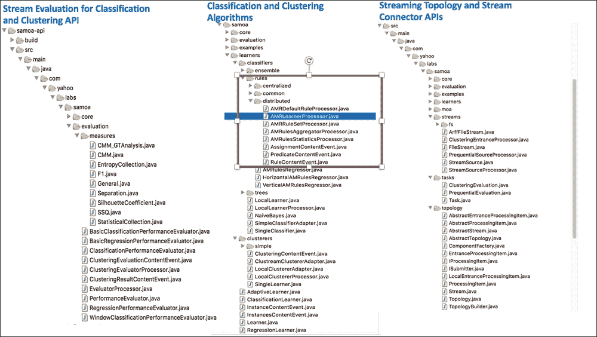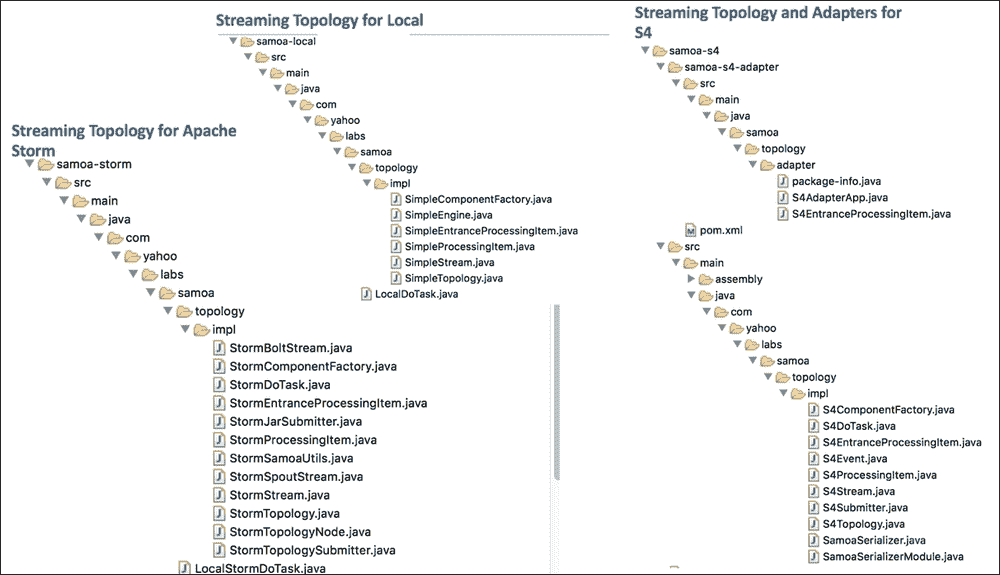

图 25：SAMOA 机器学习算法

*图 25*展示了 SAMOA 拓扑的核心组件及其对不同引擎的实现。

#### 工具和用法

我们继续使用之前相同的商业问题。启动`covtype`数据集训练作业的命令行是：

```py
bin/samoa local target/SAMOA-Local-0.3.0-SNAPSHOT.jar "PrequentialEvaluation -l classifiers.ensemble.Bagging 
 -s (ArffFileStream -f covtype-train.csv.arff) -f 10000"

```

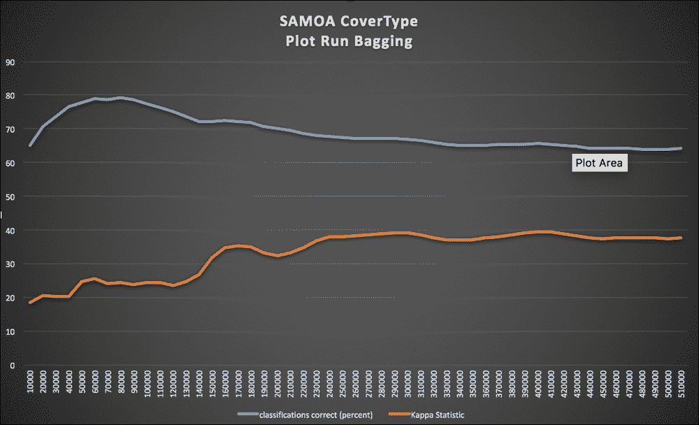

图 25：袋装模型性能

当与 Storm 一起运行时，这是命令行：

```py
bin/samoa storm target/SAMOA-Storm-0.3.0-SNAPSHOT.jar "PrequentialEvaluation -l classifiers.ensemble.Bagging 
 -s (ArffFileStream -f covtype-train.csv.arff) -f 10000"

```

#### 实验、结果和分析

使用 SAMOA 作为大数据基于流的平台进行实验的结果在*表 5*中给出。

| 算法 | 最佳准确率 | 最终准确率 | 最终 Kappa 统计量 | 最终 Kappa 时间统计量 |
| --- | --- | --- | --- | --- |
| Bagging | 79.16 | 64.09 | 37.52 | -69.51 |
| Boosting | 78.05 | 47.82 | 0 | -1215.1 |
| VerticalHoeffdingTree | 83.23 | 67.51 | 44.35 | -719.51 |
| AdaptiveBagging | 81.03 | 64.64 | 38.99 | -67.37 |

表 5：使用 SAMOA 进行大数据实时学习实验结果

##### 结果分析

从结果分析中，可以得出以下观察：

+   *表 5*显示，在几乎所有的指标中，基于流行的非线性决策树 VHDT 的 SAMOA 是最具表现力的算法。

+   自适应袋装算法比袋装算法表现更好，因为它在实现中采用了 Hoeffding 自适应树，这些树比基本的在线流袋装更稳健。

+   如预期的那样，在线提升算法由于其依赖弱学习者和缺乏适应性而排名最低。

+   *图 25*中的袋装图显示了随着示例数量的增加所实现的稳定趋势，这验证了普遍共识，即如果模式是平稳的，更多的示例会导致稳健的模型。

### 机器学习的未来

机器学习对商业、社会互动，以及我们日常生活的冲击是无可否认的，尽管这种影响并不总是立即显而易见。在不久的将来，它将无处不在，无法避免。根据麦肯锡全球研究院 2016 年 12 月发布的一份报告（*参考文献* [15]），在主要行业部门，尤其是在医疗保健和公共部门，数据和分析存在着巨大的未开发潜力。机器学习是帮助利用这种潜力的关键技术之一。我们现在可用的计算能力比以往任何时候都要多。可用的数据也比以往任何时候都要多，而且我们拥有比以往任何时候都要便宜和更大的存储容量。

已经，对数据科学家的未满足需求已经促使全球大学课程发生了变化，并在 2012-2014 年期间导致美国数据科学家的工资每年增长 16%。机器学习可以解决广泛的问题，包括资源分配、预测、预测分析、预测维护以及价格和产品优化。

同一份麦肯锡报告强调了机器学习在包括农业、制药、制造、能源、媒体和金融等行业各种用例中的日益增长的作用，包括深度学习。这些场景涵盖了从预测个性化健康结果、识别欺诈交易、优化定价和调度、根据个体条件个性化作物、识别和导航道路、诊断疾病到个性化广告的各个方面。深度学习在自动化越来越多的职业方面具有巨大潜力。仅仅改善自然语言理解就可能导致全球工资产生 3 万亿美元的潜在影响，影响全球的客户服务和支持类工作。

图像和语音识别以及语言处理方面的巨大进步，得益于深度学习技术的显著进步，使得个人数字助理等应用变得司空见惯。本书开篇章节提到的 AlphaGO 战胜李世石的成功象征意义巨大，它是人工智能进步超越我们预测里程碑的一个生动例证。然而，这只是冰山一角。最近在迁移学习等领域的研究为更广泛智能系统的承诺提供了希望，这些系统能够解决更广泛的问题，而不仅仅是专门解决一个问题。通用人工智能，即 AI 能够发展客观推理、提出解决问题的方法并从其错误中学习，目前还相距甚远，但几年后，这个距离可能会缩小到我们目前的预期之外！日益增长的、相互促进的技术变革正在预示着一个令人眼花缭乱的未来，我们已经在周围看到了这种可能性。看起来，机器学习的角色将继续以前所未有的方式塑造那个未来。对此，我们几乎毫无疑问。

### 摘要

本书最后一章讨论了适应信息管理和分析领域在过去几十年中出现的最显著范式转变之一——大数据的机器学习。正如计算机科学和工程的其他许多领域所看到的那样，人工智能——特别是机器学习——从创新解决方案和适应大数据带来的众多挑战的专门社区中受益。

一种描述大数据的方式是通过其体积、速度、多样性和真实性。这要求有一套新的工具和框架来执行大规模有效分析的任务。

选择大数据框架涉及选择分布式存储系统、数据准备技术、批量或实时机器学习，以及可视化和报告工具。

可用的开源部署框架包括 Hortonworks 数据平台、Cloudera CDH、Amazon Elastic MapReduce 和 Microsoft Azure HDInsight。每个都提供了一个平台，其中包含支持数据采集、数据准备、机器学习、评估和结果可视化的组件。

在数据采集组件中，发布-订阅是 Apache Kafka (*参考文献[8]*) 和 Amazon Kinesis 提供的一种模型，它涉及一个在订阅者和发布者之间进行调解的代理。其他选择包括源-汇，SQL，消息队列以及其他自定义框架。

关于数据存储，有几个因素有助于为满足您的需求做出适当的选择。HDFS 提供了一个具有强大容错性和高吞吐量的分布式文件系统。NoSQL 数据库也提供高吞吐量，但通常在一致性方面提供较弱保证。它们包括键值、文档、列和图数据库。

数据处理和准备是流程中的下一步，包括数据清洗、抓取和转换。Hive 和 HQL 在 HDFS 系统中提供这些功能。SparkSQL 和 Amazon Redshift 提供类似的功能。实时流处理可通过 Storm 和 Samza 等产品获得。

在大数据分析的学习阶段，可以包括批量或实时数据。

存在着多种丰富的可视化和分析框架，可以从多个编程环境中访问。

在大数据领域，有两个主要的机器学习框架是 H2O 和 Apache Spark MLlib。两者都可以从各种来源访问数据，如 HDFS、SQL、NoSQL、S3 等。H2O 支持多种机器学习算法，可以在集群中运行。对于实时数据的机器学习，SAMOA 是一个具有全面流处理能力的的大数据框架。

机器学习在未来将扮演主导角色，对医疗保健、金融、能源以及实际上大多数行业都将产生广泛的影响。自动化范围的扩展将不可避免地对社会产生影响。计算能力、数据和存储成本的增加为机器学习应用开辟了新的广阔视野，这些应用有可能提高生产力、激发创新并极大地改善全球的生活水平。

### 参考文献

1.  Matei Zaharia, Mosharaf Chowdhury, Michael J. Franklin, Scott Shenker, *Ion Stoica:Spark:使用工作集的集群计算*. HotCloud 2010

1.  Matei Zaharia, Reynold S. Xin, Patrick Wendell, Tathagata Das, Michael Armbrust, Ankur Dave, Xiangrui Meng, Josh Rosen, Shivaram Venkataraman, Michael J. Franklin, Ali Ghodsi, Joseph Gonzalez, Scott Shenker, *Ion Stoica:Apache Spark:一个用于大数据处理的统一引擎*. Commun. ACM 59(11): 56-65 (2016)

1.  Apache Hadoop: [`hadoop.apache.org/`](https://hadoop.apache.org/).

1.  Cloudera: [`www.cloudera.com/`](http://www.cloudera.com/).

1.  Hortonworks: [`hortonworks.com/`](http://hortonworks.com/).

1.  Amazon EC2: [`aws.amazon.com/ec2/`](http://aws.amazon.com/ec2/).

1.  Microsoft Azure: [`azure.microsoft.com/`](http://azure.microsoft.com/).

1.  Apache Flume: [`flume.apache.org/`](https://flume.apache.org/).

1.  Apache Kafka: [`kafka.apache.org/`](http://kafka.apache.org/).

1.  Apache Sqoop: [`sqoop.apache.org/`](http://sqoop.apache.org/).

1.  Apache Hive: [`hive.apache.org/`](http://hive.apache.org/).

1.  Apache Storm: [`storm.apache.org/`](https://storm.apache.org/).

1.  H2O: [`h2o.ai/`](http://h2o.ai/).

1.  Shahrivari S, Jalili S. *超越批量处理：迈向实时和流式大数据*. 计算机. 2014;3(4):117–29.

1.  *MGI, 分析时代*——执行摘要 [`www.mckinsey.com/~/media/McKinsey/Business%20Functions/McKinsey%20Analytics/Our%20Insights/The%20age%20of%20analytics%20Competing%20in%20a%20data%20driven%20world/MGI-The-Age-of-Analytics-Full-report.ashx`](http://www.mckinsey.com/~/media/McKinsey/Business%20Functions/McKinsey%20Analytics/Our%20Insights/The%20age%20of%20analytics%20Competing%20in%20a%20data%20driven%20world/MGI-The-Age-of-Analytics-Full-report.ashx).
