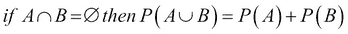
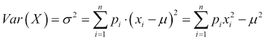

# 附录 B. 概率

这里简要介绍了概率中的基本概念。

# 概率公理

科尔莫哥洛夫概率公理可以用可能事件样本空间 *S*、*E*1、*E*2、*E*3、…*E*n 和事件 *E* 的实值概率 *P(E)* 来表述。公理如下：

1.  *P(E) ≥ 0 for all E* *ϵ* *S*

1.  *P(S) = 1*

1.  

这些公理共同表明，概率不能是负数——不可能事件具有零概率——样本空间之外的事件不可能发生，因为它是在考虑的可能性宇宙，以及两个互斥事件中任意一个发生的概率等于它们各自概率之和。

# 贝叶斯定理

在给定证据 *X* 的条件下，事件 **E** 的概率与该事件先验概率和证据的似然性成正比。这就是贝叶斯定理：

*P(X)* 是归一化常数，也称为 *X* 的边缘概率。*P(E)* 是先验，*P(X|E)* 是似然。*P(E|X)* 也称为后验概率。

以后验和先验概率比的形式表达的贝叶斯定理被称为贝叶斯法则。

## 密度估计

从从总体中随机抽取的样本数据中估计随机变量的隐藏概率密度函数称为密度估计。高斯混合和核密度估计是特征工程、数据建模和聚类中使用的例子。

给定随机变量 *X* 的概率密度函数 *f(X)*，可以找到与 *X* 的值相关的概率如下：

密度估计可以是参数化的，其中假设数据来自已知的分布族，*f(x)* 通过估计分布的参数来估计，例如，在正态分布的情况下，估计 µ 和 σ²。另一种方法是非参数化的，其中不对观测数据的分布做出假设，并允许数据确定分布的形式。

## 均值

随机变量的长期平均值称为期望或均值。样本均值是对观测数据的相应平均值。

对于离散随机变量，均值由以下公式给出：

例如，掷一个公平骰子时，出现点数的平均值是 3.5。

对于具有概率密度函数 *f(x)* 的连续随机变量，其均值是：

## 方差

方差是随机变量与其均值之间差的平方的期望。

在离散情况下，根据之前讨论的均值定义，以及概率质量函数 *p(x)*，方差是：

在连续情况下，如下所示：

一些连续分布没有均值或方差。

## 标准差

标准差是衡量数据相对于其均值分散程度的一个指标。它是方差的平方根，与方差不同，它以与数据相同的单位表示。离散和连续随机变量的标准差在此给出：,

+   离散情况：

+   连续情况：

## 高斯标准差

从更大的总体中随机抽取的样本的标准差是对总体标准差的有偏估计。基于特定的分布，对这个有偏估计的校正可能不同。对于高斯或正态分布，方差通过 的值进行调整。

根据前面给出的定义，有偏估计 *s* 如下：

在前面的公式中， 是样本均值。

使用贝塞尔校正的无偏估计如下：

## 协方差

在两个随机变量的联合分布中，随机变量偏离各自均值的乘积的期望值称为协方差。因此，对于两个随机变量 **X** 和 **Y**，方程如下：

= *E[XY] – μ*x *μ*y

如果两个随机变量是独立的，那么它们的协方差为零。

## 相关系数

当协方差通过两个随机变量的标准差乘积进行归一化时，我们得到相关系数 *ρ*[X,Y]，也称为皮尔逊积矩相关系数：

相关系数只能取介于 -1 和 1 之间的值。+1 的系数表示随机变量之间完美的线性增加关系。-1 表示完美的线性减少关系。如果两个变量相互独立，则皮尔逊系数为 0。

## 二项分布

具有参数 **n** 和 **p** 的离散概率分布。一个随机变量是一个二元变量，在单次试验中，其结果概率由 **p** 和 **1 – p** 给出。概率质量函数给出了在 **n** 次独立试验中 **k** 次成功的概率。

参数：*n, k*

PMF:

其中：

这就是二项系数。

均值：E[*X*] = *np*

方差：*Var(X)* = *np*(1 – *p*)

## 泊松分布

泊松分布给出了在给定时间段或空间区域内发生事件的次数的概率。

参数 λ，是给定区间内平均发生次数。在该区间内观察到 *k* 事件的概率质量函数为

PMF：

均值：E[*X*] = λ

方差：*Var(X)* = λ

## 高斯分布

高斯分布，也称为正态分布，是一种连续概率分布。其概率密度函数如下表示，以均值和方差为参数：

均值：µ

标准差：σ

方差：σ²

标准正态分布是均值等于 0 且标准差等于 1 的情况。标准正态分布的概率密度函数如下给出：

## 中心极限定理

中心极限定理表明，当你有几个独立且同分布的随机变量，且其分布具有明确的均值和方差时，大量这些观测值的平均值（或总和）近似服从正态分布，无论父分布如何。此外，极限正态分布具有与父分布相同的均值，方差等于基础方差除以样本大小。

给定一个随机样本 *X*1, *X*2, *X*3 … *X*n，其中 *µ* = *E*[*X*i] 和 *σ*2 *= Var(X*i*)*，样本均值：

大约服从正态分布 

在中心极限定理的几个变体中，放宽了独立性或相同分布的约束，但仍然收敛到正态分布。

## 误差传播

假设存在一个随机变量 *X*，它是多个观测值的函数，每个观测值都有自己的分布。在给定 *X* 组成量的测量值的情况下，关于 *X* 的均值和方差可以说明什么？这就是误差传播的问题。

假设 *x* 是通过观察变量 *u*，*v* 等确定的量：

*x = f(u, v, ...)*

让我们假设：

*x* 的不确定性可以用 *u*，*v* 等的方差来表示：

从 *x* 的方差的泰勒展开中，我们得到以下结果：

这里， 是协方差。

同样，我们可以确定均值的传播误差。给定 *N* 个测量值，每个测量值为 *x*[i]，其不确定性由 *s*i 表示，可以写成以下形式：

其中：

这些方程假设协方差为 0。

假设 *s*i *= s* – 即，所有观测值都有相同的误差。

然后，。

由于 

因此，。
