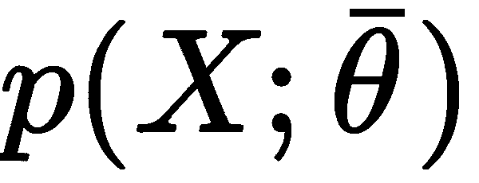

# 第一章：机器学习模型基础

机器学习模型是具有许多共同特征的数学系统。即使有时它们仅从理论观点定义，研究进展也使我们能够将几个概念应用于更好地理解复杂系统（如深度神经网络）的行为。在本章中，我们将介绍并讨论一些一些有经验的读者可能已经知道的基本元素，同时它们也提供了几种可能的解释和应用。

尤其是在本章中，我们讨论以下主要内容：

+   数据生成过程

+   有限数据集

+   训练和测试集分割策略

+   交叉验证

+   模型的容量、偏差和方差

+   Vapnik-Chervonenkis 理论

+   Cramér-Rao 界限

+   欠拟合和过拟合

+   损失和成本函数

+   正则化

# 模型和数据

机器学习算法与数据一起工作。它们创建关联，找出关系，发现模式，生成新的样本，等等，它们与定义良好的数据集一起工作。不幸的是，有时对它们的假设或施加的条件并不明确，漫长的训练过程可能导致完全的验证失败。即使这种条件在深度学习环境中更为强烈，我们也可以将模型视为一个灰盒（许多常见算法的简单性保证了某些透明度），其中向量输入被转换为向量输出：


使用向量θ参数化的通用模型架构

在前面的图中，模型已被表示为一个依赖于由向量*θ*定义的一组参数的伪函数。在本节中，我们只考虑**参数化**模型，尽管有一系列算法被称为**非参数化**，因为它们仅基于数据的结构。我们将在接下来的章节中讨论其中的一些。

因此，参数化学习过程的任务是要找到最佳参数集，以最大化目标函数的值，该值与给定特定输入*X*和输出*Y*的模型的准确性（或如果我们试图最小化它们，则为误差）成正比。这个定义并不非常严谨，将在以下章节中得到改进；然而，它作为理解我们工作环境的一种方式是有用的。

然后，首先要问的问题是：*X*的本质是什么？机器学习问题专注于学习抽象关系，这些关系允许在提供新样本时进行一致的一般化。更具体地说，我们可以定义一个与联合概率分布相关的随机**数据生成过程**：


有时，将联合概率 *p(x, y)* 表示为条件概率 *p(y|x)* 的乘积是有用的，其中 *p(y|x)* 表示给定样本的标签概率，以及样本的边缘概率 *p(x)*。这种表达式在半监督环境中已知先验概率 *p(x)* 时特别有用，或者当我们对使用 **期望最大化** (**EM**) 算法解决问题感兴趣时。我们将在接下来的章节中讨论这种方法。

在许多情况下，我们无法推导出精确的分布；然而，当我们考虑数据集时，我们总是假设它来自原始数据生成分布。这个条件不是一个纯粹的理论假设，因为我们将会看到，当我们的数据点来自不同的分布时，模型的准确性可以显著降低。

如果我们从 *p[data]* 中采样 N 个 **独立同分布** (**i.i.d**) 的值，我们可以创建一个由 *k*-维实向量组成的有限数据集 *X*：


在监督场景中，我们还需要相应的标签（具有 *t* 个输出值）：


当输出有超过两个类别时，有不同可能的策略来管理这个问题。在经典机器学习中，最常见的方法之一是 **One-vs-All**，它基于训练 *N* 个不同的二元分类器，其中每个标签都与所有剩余的标签进行比较。这样，*N-1* 个分类器被用于确定正确的类别。相反，在浅层和深层神经网络中，更倾向于使用 **softmax** 函数来表示所有类别的输出概率分布：


这种输出（*z[i]* 表示中间值，项的总和归一化到 *1*）可以很容易地使用交叉熵损失函数来管理（参见 *损失和成本函数* 部分的相应段落）。

# 零中心化和白化

许多算法在数据集对称（具有零均值）时表现出更好的性能（特别是在训练速度方面）。因此，最重要的预处理步骤之一是所谓的 **零中心化**，它包括从所有样本中减去特征均值 *E[x][X]*：


如果需要，这种操作通常是可逆的，并且不会改变样本之间以及同一样本成分之间的关系。在深度学习场景中，一个零中心的数据集允许利用某些激活函数的对称性，从而加速收敛（我们将在下一章中讨论这些细节）。

另一个非常重要的预处理步骤被称为 **白化**，它是对零中心数据集施加一个单位协方差矩阵的操作：


由于协方差矩阵 *E[x][X^TX]* 是实对称的，因此可以对其进行特征分解，而无需求逆特征向量矩阵：


矩阵 *V* 包含特征向量（作为列），对角矩阵 *Ω* 包含特征值。为了解决这个问题，我们需要找到一个矩阵 *A*，使得：


使用之前计算的特征分解，我们得到：


因此，矩阵 *A* 是：


白化的一大优点是数据集的去相关性，这允许更容易地分离成分。此外，如果 *X* 被白化，由矩阵 *P* 诱导的任何正交变换也会被白化：


此外，许多需要估计与输入协方差矩阵严格相关的参数的算法可以从这种条件中受益，因为它减少了实际独立变量的数量（通常，这些算法使用白化后变得对称的矩阵）。在深度学习领域的一个重要优势是梯度通常在原点附近更高，而在激活函数（例如，双曲正切或 Sigmoid）饱和的区域（|x| → ∞）减小。这就是为什么白化（和零均值化）数据集的收敛通常更快。

在以下图表中，可以比较**原始数据集**、**零均值化**和**白化**：


原始数据集（左），中心化版本（中心），白化版本（右）

当需要白化时，考虑一些重要细节是很重要的。首先，真实样本协方差和估计 *X^TX* 之间存在尺度差异，通常采用**奇异值分解**（**SVD**）。第二个方面涉及许多框架实现的一些常见类别，如 Scikit-Learn 的`StandardScaler`。实际上，虽然零均值化是特征级别的操作，但白化滤波器需要考虑整个协方差矩阵（`StandardScaler`仅实现单位方差，特征级别的缩放）。

幸运的是，所有从 Scikit-Learn 算法中受益或需要白化预处理步骤的算法都提供内置功能，因此通常不需要进一步操作；然而，对于所有希望直接实现一些算法的读者，我已经编写了两个 Python 函数，可以用于零均值化和白化。它们假设一个形状为 (*N[Samples] × n*) 的矩阵 *X*。此外，`whiten()` 函数接受参数 `correct`，允许我们应用缩放校正（默认值为 `True`）：

```py
import numpy as np

def zero_center(X):
    return X - np.mean(X, axis=0)

def whiten(X, correct=True):
    Xc = zero_center(X)
    _, L, V = np.linalg.svd(Xc)
    W = np.dot(V.T, np.diag(1.0 / L))
    return np.dot(Xc, W) * np.sqrt(X.shape[0]) if correct else 1.0
```

# 训练集和验证集

在实际问题中，样本数量是有限的，通常有必要将初始集*X*（连同*Y*）分成两个子集，如下所示：

+   **训练集**用于训练模型

+   **验证集**用于评估模型分数，而不带任何偏差，使用从未见过的样本

根据问题的性质，可以选择 70% - 30%的分割百分比（在机器学习中，这是一个好的实践，因为数据集相对较小），或者对于样本数量非常高的深度学习任务，可以选择更高的训练百分比（80%，90%，甚至高达 99%）。在两种情况下，我们假设训练集包含进行一致泛化所需的所有信息。在许多简单的情况下，这是真的，并且可以很容易地验证；但面对更复杂的数据集，问题就变得更加困难。即使我们认为从相同的分布中抽取所有样本，也可能发生随机选择的测试集包含其他训练样本中不存在的特征。这种条件可能会对全局准确度产生非常负面的影响，而且如果没有其他方法，也可能非常难以识别。这就是为什么在深度学习中，训练集通常很大：考虑到特征和生成数据分布的复杂性，选择大的测试集可以限制学习特定关联的可能性。

在 Scikit-Learn 中，可以使用**`train_test_split()`**函数来分割原始数据集，该函数允许指定训练/测试大小，并且如果我们期望有随机打乱的数据集（默认）。例如，如果我们想将`X`和`Y`分割为 70%的训练和 30%的测试，我们可以使用：

```py
from sklearn.model_selection import train_test_split

X_train, X_test, Y_train, Y_test = train_test_split(X, Y, train_size=0.7, random_state=1)
```

打乱数据集始终是一个好的实践，目的是减少样本之间的相关性。实际上，我们假设`X`由独立同分布（i.i.d）的样本组成，但有时连续两个样本之间会有很强的相关性，这会降低训练性能。在某些情况下，在每次训练周期后重新打乱训练集也是有用的；然而，在大多数我们的例子中，我们将在整个过程中使用相同打乱的数据集。当处理序列和具有记忆的模型时，必须避免打乱：在这些所有情况下，我们需要利用现有的相关性来确定未来样本的分布。

当使用 NumPy 和 Scikit-Learn 时，始终将随机种子设置为常数是一个好的实践，这样其他人就可以使用相同的初始条件重现实验。这可以通过调用`np.random.seed`(...)并使用许多 Scikit-Learn 方法中存在的`random-state`参数来实现。

# 交叉验证

一种有效的方法来检测错误选择的测试集问题是由**交叉验证**技术提供的。特别是，我们将使用**K 折**交叉验证方法。想法是将整个数据集 *X* 分割为一个移动的测试集和一个训练集（剩余的部分）。测试集的大小由折数决定，以便在 *k* 次迭代中，测试集覆盖整个原始数据集。

在下面的图中，我们可以看到该过程的示意图：


K 折交叉验证方案

这样，就可以使用不同的采样分割来评估模型的准确率，并且可以在更大的数据集上进行训练过程；特别是，在 *(k-1)*N* 样本上。在理想情况下，准确率应该在所有迭代中非常相似；但在大多数实际情况下，准确率相当低于平均水平。这意味着训练集在构建时排除了包含必要特征以使模型适应考虑实际 *p[data]* 的分离超平面的样本。我们将在本章后面讨论这些问题；然而，如果准确率的标准差过高（必须根据问题的性质/模型设置一个阈值），这可能意味着 *X* 没有从 *p[data]* 中均匀抽取，并且在预处理阶段评估异常值的影响是有用的。在下面的图中，我们可以看到在逻辑回归上进行的 15 折交叉验证的图表：


交叉验证准确率

值在 0.84 到 0.95 之间波动，平均值为 0.91（实线水平线）。在这种情况下，考虑到最初的目的本是使用线性分类器，我们可以说所有折都产生了高准确率，证实了数据集是线性可分的；然而，有一些样本（在第九折中被排除）对于达到大约 0.88 的最小准确率是必要的。

**K 折**交叉验证有不同的变体，可以用来解决特定问题：

+   **分层 K 折**：标准的 K 折方法在分割数据集时不考虑概率分布 *p(y|x)*，因此某些折可能理论上只包含有限数量的标签。分层 K 折则试图分割 *X*，使得所有标签都得到均匀的表示。

+   **Leave-one-out**（**LOO**）：这种方法是最激进的，因为它创建了*N*个折，每个折包含*N-1*个训练样本和 1 个测试样本。这样，就使用了最大可能数量的样本进行训练，并且很容易检测算法是否能够以足够的准确率学习，或者是否应该采用另一种策略。这种方法的主要缺点是必须训练*N*个模型，当*N*非常大时，这可能会引起性能问题。此外，在大量样本的情况下，两个随机值相似的概率增加，因此许多折会产生几乎相同的结果。同时，LOO 限制了评估泛化能力的可能性，因为单个测试样本不足以进行合理的估计。

+   **Leave-P-out**（**LPO**）：在这种情况下，测试样本的数量被设置为*p*（非不相交集合），因此折数等于*n*除以*p*的二项式系数。这种方法减轻了 LOO 的缺点，并且是 K-Fold 和 LOO 之间的权衡。折数可能非常高，但可以通过调整测试样本数量*p*来控制；然而，如果*p*不是足够小或足够大，二项式系数可能会**爆炸**。实际上，当*p*有大约*n/2*个样本时，折数达到最大值：


Scikit-Learn 实现了所有这些方法（以及一些其他变化），但我建议始终使用`cross_val_score()`函数，这是一个辅助函数，允许将不同的方法应用于特定问题。在以下基于多项式**支持向量机**（**SVM**）和 MNIST 数字数据集的代码片段中，指定了折数（参数`cv`）。这样，Scikit-Learn 将自动使用分层 K-Fold 进行分类，而对于所有其他情况则使用**标准 K-Fold**：

```py
from sklearn.datasets import load_digits
from sklearn.model_selection import cross_val_score
from sklearn.svm import SVC

data = load_digits()
svm = SVC(kernel='poly')

skf_scores = cross_val_score(svm, data['data'], data['target'], cv=10)

print(skf_scores)
[ 0.96216216  1\.          0.93922652  0.99444444  0.98882682  0.98882682
  0.99441341  0.99438202  0.96045198  0.96590909]

print(skf_scores.mean())
0.978864325583
```

在每个折中，准确率都非常高（> 0.9），因此我们预计使用 LOO 方法会有更高的准确率。由于我们有 1,797 个样本，我们预计会有相同数量的准确率：

```py
from sklearn.model_selection import cross_val_score, LeaveOneOut

loo_scores = cross_val_score(svm, data['data'], data['target'], cv=LeaveOneOut())

print(loo_scores[0:100])
[ 1\.  1\.  1\.  1\.  1\.  0\.  1\.  1\.  1\.  1\.  1\.  1\.  1\.  1\.  1\.  1\.  1\.  1.
  1\.  1\.  1\.  1\.  1\.  1\.  1\.  1\.  1\.  1\.  1\.  1\.  1\.  1\.  1\.  1\.  1\.  1.
  1\.  0\.  1\.  1\.  1\.  1\.  1\.  1\.  1\.  1\.  1\.  1\.  1\.  1\.  1\.  1\.  1\.  1.
  1\.  1\.  1\.  1\.  1\.  1\.  1\.  1\.  1\.  1\.  1\.  1\.  1\.  1\.  1\.  0\.  1\.  1.
  1\.  1\.  1\.  1\.  1\.  1\.  1\.  1\.  1\.  1\.  1\.  1\.  1\.  1\.  1\.  1\.  1\.  1.
  1\.  1\.  1\.  1\.  1\.  1\.  1\.  1\.  1\.  1.]

print(loo_scores.mean())
0.988870339455
```

如预期，平均分数非常高，但仍有一些样本被错误分类。正如我们将要讨论的，这种情况可能是过度拟合的潜在候选者，这意味着模型完美地学习了如何映射训练集，但它失去了泛化的能力；然而，由于验证集的大小，LOO 并不是衡量这种模型能力的好方法。

我们现在可以使用 LPO 技术评估我们的算法。考虑到之前所解释的内容，我们选择了较小的 Iris 数据集和基于逻辑回归的分类。由于有*N=150*个样本，选择`p = 3`，我们得到 551,300 个折：

```py
from sklearn.datasets import load_iris
from sklearn.linear_model import LogisticRegression
from sklearn.model_selection import cross_val_score, LeavePOut

data = load_iris()

p = 3
lr = LogisticRegression()

lpo_scores = cross_val_score(lr, data['data'], data['target'], cv=LeavePOut(p))

print(lpo_scores[0:100])
[ 1\.          1\.          1\.          1\.          1\.          1\.          1.
  1\.          1\.          1\.          1\.          1\.          1\.          1.
  1\.          1\.          1\.          1\.          1\.          1\.          1.
  1\.          1\.          1\.          1\.          1\.          1\.          1.
  1\.          1\.          1\.          1\.          1\.          1\.          1.
  1\.          1\.          1\.          1\.          1\.          1\.          1.
  1\.          1\.          1\.          1\.          1\.          1\.          1.
  1\.          1\.          1\.          1\.          1\.          1\.          1.
  1\.          1\.          1\.          1\.          1\.          1\.          1.
  1\.          0.66666667  ...

print(lpo_scores.mean())
0.955668420098
```

如前例所示，我们只打印了前 100 个准确率；然而，只需几个值就可以立即了解全局趋势。

交叉验证技术是一种强大的工具，当性能成本不是太高时尤其有用。不幸的是，它并不是深度学习模型的最佳选择，因为数据集非常大，训练过程可能需要甚至几天才能完成。然而，正如我们将要讨论的，在这些情况下，正确的选择（分割百分比），结合对数据集的准确分析以及采用标准化和正则化等技术，可以使模型展现出卓越的泛化能力。

# 机器学习模型的特点

在本节中，我们将考虑监督模型，并试图确定如何测量它们的理论潜在准确性和它们在从 *p[data]* 中抽取的所有可能样本上正确泛化的能力。这些概念中的大多数都是在深度学习时代之前开发的，但继续对研究项目产生巨大影响。例如，“容量”的想法是神经科学家不断问自己的关于人脑的开放性问题。具有数十层和数百万参数的现代深度学习模型从数学角度重新开启了理论问题。与此相关，其他元素，如估计量方差的限制，再次成为焦点，因为算法变得越来越强大，曾经被认为远非可行解决方案的性能现在已成为现实。能够训练一个模型，以便充分利用其容量，最大化其泛化能力，并提高准确性，甚至超越人类表现，是深度学习工程师现在必须从他的工作中期待的东西。

# 模型的容量

如果我们将监督模型视为一组参数化函数，我们可以将**表示能力**定义为某种通用函数映射相对大量数据分布的内在能力。为了理解这个概念，让我们考虑一个允许无限导数的函数 *f(x)*，并将其重写为泰勒展开式：


我们可以选择只取前 *n* 项，以便得到一个 *n* 次多项式函数。考虑一个简单的二维场景，有六个函数（从线性函数开始）；我们可以通过一组小数据点观察它们的不同行为：


六条多项式分离曲线产生的不同行为

快速改变曲率的能力与度数成正比。如果我们选择一个线性分类器，我们只能修改其斜率（例子总是在二维空间中）和截距。相反，如果我们选择一个更高阶的函数，当需要时，我们有更多可能性来*弯曲*曲率。如果我们考虑图中的**n=1**和**n=2**（在右上角，它们是第一个和第二个函数），对于**n=1**，我们可以包括对应*x=11*的点，但这种选择对*x=5*处的点有负面影响。

只有一个参数化的非线性函数才能有效地解决这个问题，因为这个问题需要比线性分类器提供的表示能力更高的表示能力。另一个经典的例子是 XOR 函数。长期以来，许多研究人员反对感知器（线性神经网络），因为它们无法对由 XOR 函数生成的数据集进行分类。幸运的是，多层感知器的引入，以及非线性函数的使用，使我们能够克服这个问题，并且许多复杂度超出了任何经典机器学习模型的可能性。

# Vapnik-Chervonenkis 容量

**Vapnik-Chervonenkis 理论**为分类器的容量提供了一个数学形式化。为了引入定义，首先需要定义**分割**的概念。如果我们有一个集合类*C*和一个集合*M*，我们说*C*分割*M*，如果：


换句话说，对于任何*M*的子集，它都可以作为*C (c[j])*的一个特定实例和*M*本身的交集来获得。如果我们现在将一个模型视为一个参数化函数：


我们想确定它与有限数据集*X*的容量关系：


根据 Vapnik-Chervonenkis 理论，我们可以说模型*f*分割*X*，如果对于每个可能的标签分配都没有分类错误。因此，我们可以定义**Vapnik-Chervonenkis 容量**或**VC 容量**（有时称为**VC 维数**）为能够分割*X*的*X*的子集的最大基数。

例如，如果我们考虑一个在二维空间中的线性分类器，其 VC 容量等于 3，因为总是有可能标记三个样本，使得*f*将它们分割；然而，在*N > 3*的所有情况下，这是不可能的。XOR 问题是一个需要 VC 容量高于*3*的例子。让我们探索以下图表：


不同分割曲线的 XOR 问题

这种特定的标签选择使得集合不可线性分离。克服这个问题的唯一方法就是使用高阶函数（或非线性函数）。曲线线（属于一个 VC 容量大于 *3* 的分类器）可以分离上左和下右区域与剩余空间，但没有直线可以做到这一点（尽管它总是可以分离一个点与其他三个点）。

# 估计器的偏差

现在让我们考虑一个具有单个向量参数的参数化模型（这并不是一个限制，而只是一个教学选择）：



学习过程的目标是估计参数 *θ*，以便例如最大化分类的准确度。我们定义估计器的 **偏差**（与参数 *θ* 相关）：


换句话说，偏差是估计的期望值与真实参数值之间的差异。记住，估计是 *X* 的函数，不能在求和中被视为常数。

如果一个估计器被称为 **无偏**，那么：


此外，如果估计序列收敛（至少以概率 1）到真实值当 *k → ∞* 时，则估计器被定义为 **一致**的：


给定一个数据集 *X*，其样本是从 *p[data]* 中抽取的，估计器的准确性与它的偏差成反比。低偏差（或无偏差）的估计器能够以高精度水平映射数据集 *X*，而高偏差估计器很可能没有足够的能力来解决该问题，因此它们检测整个动态的能力较差。

现在让我们计算偏差相对于向量 *θ* 的导数（它将在以后很有用）：


考虑到最后一个方程，由于 *E[•]* 的线性，即使我们在 *θ* 的估计中添加一个不依赖于 *x* 的项，该方程也成立。实际上，根据概率定律，很容易验证：


# 欠拟合

偏差大的模型很可能会欠拟合训练集。让我们考虑以下图表所示的情景：


欠拟合的分类器：曲线无法正确区分两个类别

即使问题非常困难，我们也可以尝试采用线性模型，在训练过程的最后，分离线的斜率和截距大约是-1 和 0（如图所示）；然而，如果我们测量准确率，我们会发现它接近 0！无论迭代次数多少，这个模型永远无法学习到*X*和*Y*之间的关联。这种条件被称为**欠拟合**，其主要指标是训练准确率非常低。即使某些数据预处理步骤可以提高准确率，当模型欠拟合时，唯一有效的解决方案是采用更高容量的模型。

在机器学习任务中，我们的目标是实现最大的准确率，从训练集开始，然后过渡到验证集。更正式地说，我们希望改进我们的模型，以便尽可能接近**贝叶斯准确率**。这不是一个明确定义的值，而是一个理论上可能通过估计量实现的极限。在下面的图中，我们可以看到这个过程的表现：


准确率水平图

贝叶斯准确率通常是一个纯粹的理论极限，对于许多任务来说，即使使用生物系统也几乎不可能实现；然而，深度学习领域的进步允许创建目标准确率略低于贝叶斯准确率的模型。一般来说，贝叶斯准确率没有封闭形式，因此人类能力被视为基准。在先前的分类示例中，人类能够立即区分不同的点类，但对于一个容量有限的分类器来说，这个问题可能非常困难。我们将讨论的一些模型可以通过非常高的目标准确率解决这个问题，但在这个阶段，我们面临另一个风险，这可以在定义估计量方差的概念后理解。

# 估计量方差

在本章的开头，我们定义了数据生成过程*p[data]*，并假设我们的数据集*X*是从这个分布中抽取的；然而，我们不想学习仅限于*X*的现有关系，而是期望我们的模型能够正确泛化到从*p[data]*中抽取的任何其他子集。衡量这种能力的好方法是**估计量的方差**：


方差也可以定义为标准误差的平方（类似于标准差）。高方差意味着当选择新的子集时，准确率会有很大的变化，因为模型可能通过过度学习一组有限的关系而达到了非常高的训练准确率，并且几乎完全失去了泛化的能力。

# 过拟合

如果欠拟合是低能力和高偏差的结果，**过拟合**是一种高方差可以检测的现象。一般来说，我们可以观察到非常高的训练准确率（甚至接近贝叶斯水平），但验证准确率并不差。这意味着模型的能力对于任务来说足够高，甚至过高（能力越高，大方差的可能性越高），并且训练集并不是*p[data]*的良好表示。为了理解这个问题，考虑以下分类场景：


可接受的拟合（左侧），过拟合的分类器（右侧）

左侧的图是通过逻辑回归得到的，而右侧的图使用的是具有六次多项式核的 SVM 算法。如果我们考虑第二个模型，决策边界看起来要精确得多，有些样本刚好在边界之上。考虑到两个子集的形状，可以说非线性 SVM 能更好地捕捉动态变化；然而，如果我们从*p[data]*中采样另一个数据集，并且对角线*尾部*变宽，逻辑回归仍然能够正确分类点，而 SVM 的准确度会大幅下降。第二个模型很可能过拟合，需要进行一些修正。当验证准确率远低于训练准确率时，一个好的策略是增加训练样本的数量，以考虑真实的*p[data]*。实际上，可能会发生这样的情况：训练集是从一个假设的分布中构建的，这个分布并不反映真实情况；或者用于验证的样本数量过高，减少了剩余样本所携带的信息量。交叉验证是评估数据集质量的好方法，但总是有可能发现完全新的子集（例如，当应用程序在生产环境中部署时生成的），即使它们本应属于*p[data]*。如果无法扩大训练集，数据增强可能是一个有效的解决方案，因为它允许从已知信息中创建人工样本（对于图像，可以镜像、旋转或模糊它们）。防止过拟合的其他策略基于一种称为**正则化**的技术，我们将在本章的最后部分讨论。现在，我们可以这样说，正则化的效果类似于部分线性化，这意味着能力降低，随之而来的是方差减少。

# 克拉美罗界

如果在理论上可以创建一个无偏模型（即使是渐近的），那么对于方差来说这并不成立。为了理解这个概念，有必要引入一个重要的定义：**费舍尔信息**。如果我们有一个参数化的模型和一个数据生成过程 *p[data]*，我们可以通过考虑以下参数来定义似然函数：


这个函数可以用来衡量模型描述原始数据生成过程的好坏。似然的形状可能会有很大的变化，从定义良好、尖锐的曲线到几乎平坦的表面。让我们考虑以下图表，展示了基于单个参数的两个例子：


非常尖锐的似然（左），较平的似然（右）

我们可以立即理解，在第一种情况下，通过梯度上升可以很容易地达到最大似然，因为表面非常尖锐。而在第二种情况下，梯度的大小较小，由于数值不精确或容差，很容易在达到实际最大值之前停止。在最坏的情况下，表面可以在非常大的区域内几乎平坦，相应的梯度接近零。当然，我们希望始终使用非常尖锐和尖锐的似然函数，因为它们携带更多关于其最大值的信息。更正式地说，费舍尔信息量化了这个值。对于单个参数，它被定义为以下：


费舍尔信息是一个无界的非负数，它与对数似然所携带的信息量成正比；使用对数对梯度上升没有影响，但它通过将乘积转换为和来简化复杂表达式。这个值可以解释为当函数达到最大值时梯度的*速度*；因此，更高的值意味着更好的近似，而一个假设的零值意味着确定正确参数估计的概率也是零。

当与一组 *K* 个参数一起工作时，费舍尔信息成为一个正半定矩阵：


这个矩阵是对称的，并且还有一个重要的特性：当一个值为零时，这意味着对应的参数对在最大似然估计中是正交的，并且可以单独考虑。在许多实际情况下，如果一个值接近零，它决定了参数之间非常低的关联性，即使它不是数学上严格的，仍然可以解耦它们。

在这一点上，可以引入**克拉美罗界**，它表明对于采用*x*（具有概率分布*p(x; θ)*）作为测量集的任何无偏估计量，任何*θ*估计量的方差总是根据以下不等式有下界：


实际上，考虑最初一个通用的估计量，并利用柯西-施瓦茨不等式与方差和费舍尔信息（两者都表示为期望值），我们得到：


现在，如果我们使用关于*θ*的偏导数的表达式，考虑到*θ*的估计值的期望值不依赖于*x*，我们可以将不等式的右侧重写为：


如果估计量是无偏的，则右侧的导数等于零，因此，我们得到：


换句话说，我们可以尝试减少方差，但它总是由费舍尔信息的倒数有下界。因此，给定一个数据集和一个模型，总是存在泛化能力的极限。在某些情况下，这个度量很容易确定；然而，它的真实值是理论上的，因为它为似然函数提供了另一个基本属性：它携带了估计方差最坏情况所需的所有信息。这并不令人惊讶：当我们讨论模型的容量时，我们看到了不同的函数如何导致更高的或更低的精度。如果训练精度足够高，这意味着容量对于问题来说是适当的，甚至过多；然而，我们还没有考虑似然*p(X| θ)*的作用。

高容量模型，特别是当数据集小或信息量低时，比低容量模型更有可能驱动到平坦似然表面。因此，费舍尔信息往往会变得较小，因为越来越多的参数集会产生相似的似然值，而这最终会导致更高的方差和过拟合的风险增加。为了总结本节，考虑从**奥卡姆剃刀**原则推导出的一个一般经验法则是有用的：当更简单的模型能够足够准确地解释一个现象时，增加其容量是没有意义的。一个更简单的模型总是更可取（当性能良好且能准确代表特定问题时），因为它在训练和推理阶段通常都更快，也更高效。当谈到深度神经网络时，这个原则可以以更精确的方式应用，因为更容易增加或减少层数和神经元数量，直到达到所需的精度。

# 损失和成本函数

在本章的开头，我们讨论了通用目标函数的概念，以便优化以解决机器学习问题。更正式地说，在一个监督场景中，我们拥有有限的数据集 *X* 和 *Y*：


我们可以为单个样本定义一个通用的**损失函数**：


*J* 是整个参数集的函数，必须与真实标签和预测之间的误差成正比。另一个重要属性是凸性。在许多实际情况下，这是一个几乎不可能的条件；然而，寻找凸损失函数总是有用的，因为它们可以通过梯度下降法轻松优化。我们将在第九章，“用于机器学习的神经网络”中讨论这个话题。然而，现在，将损失函数视为训练过程和纯数学优化之间的中介是有用的。缺失的环节是完整的数据。正如已经讨论过的，*X* 是从 *p[data]* 中抽取的，因此它应该代表真实分布。因此，当最小化损失函数时，我们正在考虑一个潜在的点子集，而不是整个真实数据集。在许多情况下，这并不是一个限制，因为，如果偏差为零且方差足够小，所得到的模型将显示出良好的泛化能力（高训练和验证准确率）；然而，考虑到数据生成过程，引入另一个称为**预期风险**的度量是有用的：


这个值可以解释为从 *p*[*data*] 中抽取的所有可能样本的损失函数的平均值。最小化预期风险意味着全局准确性的最大化。相反，当使用有限数量的训练样本时，通常定义一个**成本函数**（通常也称为损失函数，不要与对数似然混淆）：


这是我们要最小化的实际函数，除以样本数（一个没有影响的因素），它也称为**经验风险**，因为它是对预期风险的一个近似（基于真实数据）。换句话说，我们想要找到一组参数，使得：


当成本函数有超过两个参数时，理解其内部结构非常困难，甚至可能不可能；然而，我们可以使用二维图分析一些潜在条件：


在二维场景中不同类型的点

我们可以观察到的不同情况是：

+   **起点**，由于误差，通常成本函数在这里非常高。

+   **局部最小值**，梯度为零（且二阶导数为正）。它们是最佳参数集的候选者，但不幸的是，如果凹度不够深，惯性运动或一些噪声可以轻易地将点移开。

+   **脊**（或**局部最大值**），梯度为零，二阶导数为负。它们是不稳定点，因为最小的扰动允许逃离，达到更低成本的区域。

+   **平台**，或表面几乎平坦且梯度接近零的区域。逃离平台唯一的方法是保持残余动能——我们将在讨论神经优化算法时介绍这个概念（第九章，*Neural Networks for Machine Learning*）。

+   **全局最小值**，我们想要达到以优化成本函数的点。

即使当参数数量较小时，局部最小值很可能是存在的，但当模型具有大量参数时，它们变得非常不可能。事实上，一个 *n*-维点 *θ^** 对于一个凸函数（这里我们假设 *L* 是凸的）来说是一个局部最小值，仅当：


第二个条件要求海森矩阵是正半定的（等价地，由前 n 行和 n 列构成的所有主子矩阵 *H[n]* 必须是非负的），因此所有特征值 *λ[0]，λ[1]，...，λ[N]* 必须是非负的。这个概率随着参数数量的增加而降低（*H* 是一个 *n×n* 的方阵，并且有 *n* 个特征值），在深度学习模型中，权重的数量可以达到 1000 万（甚至更多）时，这个概率接近于零。对完整数学证明感兴趣的读者可以阅读 *High Dimensional Spaces*，*Deep Learning and Adversarial Examples*，*Dube S., arXiv:1801.00634 [cs.CV]*。因此，一个更常见的条件是考虑**鞍点**的存在，其中特征值具有不同的符号，正交方向导数为零，即使这些点既不是局部最大值也不是局部最小值。例如，考虑以下图形：


二维场景中的鞍点

函数是 *y=x3*，其第一和二阶导数分别是 *y'=3x2* 和 *y''=6x*。因此，*y'(0)=y''(0)=0*。在这种情况下（单值函数），这个点也被称为**拐点**，因为在 *x=0* 时，函数显示出凹性的变化。在三维空间中，更容易理解为什么鞍点被这样称呼。例如，考虑以下图形：


三维场景中的鞍点

表面非常类似于马鞍，如果我们把点投影到一个正交平面上，*XZ*是一个最小值，而在另一个平面上（*YZ*）它是一个最大值。鞍点相当危险，因为许多更简单的优化算法可能会减慢甚至停止，失去找到正确方向的能力。在第九章，《机器学习的神经网络》中，我们将讨论一些能够减轻这种问题的方法，允许深度模型收敛。

# 成本函数的例子

在本节中，我们介绍了在分类和回归任务中常用的某些**成本函数**。其中一些将在下一章的示例中广泛采用，尤其是在讨论浅层和深层神经网络中的训练过程时。

# 均方误差

**均方误差**是最常见的回归成本函数之一。其通用表达式是：


这个函数在其定义域的每个点上都是可微的，并且是凸函数，因此可以使用**随机梯度下降（SGD**）算法进行优化；然而，当在存在异常值的情况下用于回归时，存在一个缺点。因为当预测值与实际值（对应于异常值）之间的距离很大时，其值总是二次的，相对误差很高，这可能导致无法接受的校正。

# Huber 成本函数

如所述，均方误差对异常值不稳健，因为它总是二次的，而不管实际值与预测值之间的距离如何。为了克服这个问题，可以采用基于阈值 *t[H]* 的**Huber**成本函数，这样对于小于 *t[H]* 的距离，其行为是二次的，而对于大于 *t*[*H*,] 的距离，它变为线性，减少了误差的大小，因此，减少了异常值的相对重要性。

分析表达式是：


# Hinge 成本函数

这个成本函数被 SVM 采用，其目标是最大化分离边界（支持向量所在的位置）之间的距离。其分析表达式是：


与其他示例不同，这个成本函数不是使用经典随机梯度下降方法进行优化的，因为它在所有点上的不可微性：


因此，SVM 算法使用二次规划技术进行优化。

# **类别交叉熵**

**类别交叉熵**是最常见的分类成本函数，被逻辑回归和大多数神经网络架构采用。其通用分析表达式是：


这个损失函数是凸的，并且可以使用随机梯度下降技术轻松优化；此外，它还有一个重要的解释。如果我们正在训练一个分类器，我们的目标是创建一个分布尽可能接近 *pdata* 的模型。这个条件可以通过最小化两个分布之间的 Kullback-Leibler 散度来实现：


在前面的表达式中，*p[M]* 是模型生成的分布。现在，如果我们重新写散度，我们得到：


第一个项是数据生成分布的熵，它不依赖于模型参数，而第二个项是交叉熵。因此，如果我们最小化交叉熵，我们也会最小化 Kullback-Leibler 散度，迫使模型重现一个与 *p[data]* 非常相似的分布。这是关于为什么交叉熵损失函数是分类问题的一个非常好的选择的一个非常优雅的解释。

# 正则化

当一个模型条件不良或容易过拟合时，**正则化**提供了一些有效的工具来缓解这些问题。从数学角度来看，正则化器是添加到损失函数中的惩罚，以对参数的演变施加额外条件：


参数 *λ* 控制正则化的强度，这通过函数 *g(θ)* 来表达。对 *g(θ)* 的一个基本条件是它必须是可微的，这样新的复合损失函数仍然可以使用 SGD 算法进行优化。一般来说，任何正则函数都可以使用；然而，我们通常需要一个可以对比参数不定增长的函数。

为了理解原理，让我们考虑以下图表：


使用线性曲线（左侧）和抛物线（右侧）进行插值

在第一个图表中，模型是线性的并且有两个参数，而在第二个图表中，它是二次的并且有三个参数。我们已经知道第二个选项更容易过拟合，但是如果我们应用正则化项，就有可能避免（第一个二次参数）的增长，将模型转换为线性化版本。当然，选择低容量模型和应用正则化约束之间有一个区别。事实上，在前一种情况下，我们放弃了额外容量提供的可能性，冒着增加偏差的风险，而通过正则化，我们保持相同的模型但优化它以减少方差。现在让我们探索最常见的正则化技术。

# Ridge

**Ridge** 正则化（也称为 **Tikhonov 正则化**）基于参数向量的平方 L2 范数：


这种惩罚避免了参数的无穷增长（因此，它也被称为**权重收缩**），当模型条件不良或存在多重共线性（由于样本完全独立，这是一个相对常见的情况）时，特别有用。

在以下图表中，我们看到在二维场景中岭回归正则化的示意图：


岭回归（L2）正则化

以零为中心的圆表示岭回归边界，而阴影表面是原始成本函数。没有正则化时，最小值（**w[1]**，**w[2]**）的幅度（例如，从原点到距离）大约是应用岭约束后获得的两倍，这证实了预期的收缩。当应用于使用**普通最小二乘法**（**OLS**）算法解决的回归时，可以证明总存在一个岭系数，使得权重相对于 OLS 权重收缩。在有些限制下，同样的结果可以扩展到其他成本函数。

# Lasso

**Lasso**正则化基于参数向量的*L1*范数：


与岭回归不同，岭回归会缩小所有权重，而 Lasso 可以将最小的权重移至零，从而创建一个稀疏的参数向量。数学证明超出了本书的范围；然而，通过考虑以下图表（二维）可以直观地理解它：


Lasso（L1）正则化

以零为中心的正方形表示 Lasso 边界。如果我们考虑一条通用线，那么在角落处与正方形相切的概率更高，在这些角落处至少有一个（在二维场景中恰好一个）参数为零。一般来说，如果我们有一个向量凸函数 *f(x)*（我们在第五章，*EM 算法与应用*中提供了凸性的定义），我们可以定义：


由于任何*L[p]*范数都是凸的，以及凸函数之和也是凸的，因此*g(x)*也是凸的。正则化项始终是非负的，因此最小值对应于零向量的范数。当最小化*g(x)*时，我们还需要考虑以原点为中心的球体中范数梯度的贡献，然而，在该球体中，偏导数不存在。增加*p*的值，范数在原点周围变得平滑，并且当*|x[i]| → 0*时，偏导数接近零。

另一方面，当 *p=1*（排除 *L[0]*-范数以及所有 *p ∈ ]0, 1[* 的范数，这些范数允许更强的稀疏性，但不是凸的）时，偏导数始终是 +1 或 -1，根据 *x[i]*（*x[i]* ≠ 0）的符号。因此，对于 *L[1]*-范数来说，将最小的分量推向零更容易，因为其对最小化的贡献（例如，使用梯度下降）与 *x*[*i*, ]无关，而 *L[2]*-范数在接近原点时会降低其 *速度*。这是使用 *L[1]*-范数实现稀疏性的非严格解释。实际上，我们还需要考虑项 *f(x)*，它限制了全局最小值的大小；然而，这有助于读者对概念形成直观理解。可以在 *Optimization for Machine Learning, (e*dited by) *Sra S.*, *Nowozin S.*, *Wright S. J.*, *The MIT Press* 中找到更多和数学上严谨的细节。

Lasso 正则化在需要数据集的稀疏表示时特别有用。例如，我们可能对找到一组图像对应的特征向量感兴趣。由于我们预计会有很多特征，但每个图像中只有子集存在，应用 Lasso 正则化可以强制所有最小的系数变为零，抑制次要特征的存在。另一个潜在的应用是潜在语义分析，我们的目标是使用有限数量的主题来描述语料库中的文档。所有这些方法都可以总结为一种称为 **稀疏编码** 的技术，其目标是通过对最代表性的原子进行提取，使用不同的方法实现稀疏性，从而降低数据集的维度（也包括非线性场景）。

# ElasticNet

在许多实际情况下，应用 Ridge 和 Lasso 正则化以强制权重收缩和全局稀疏性是有用的。这可以通过使用 **ElasticNet** 正则化来实现，定义为：


每个正则化的强度由参数 *λ[1]* 和 *λ[2]* 控制。ElasticNet 在需要减轻过拟合影响并鼓励稀疏性的情况下可以产生优秀的结果。在讨论一些深度学习架构时，我们将应用所有正则化技术。

# 提前停止

尽管它是一种纯正则化技术，**提前停止**通常被视为在所有其他防止过拟合和最大化验证准确率的方法失败时的**最后手段**。在许多情况下（尤其是在深度学习场景中），可以观察到训练过程的典型行为，考虑到训练和验证成本函数：


在 U 曲线上升阶段开始之前提前停止的例子

在最初的几个时期，两个代价都会下降，但可能会发生这样的情况：在某个*阈值时期*e[s]之后，验证代价开始上升。如果我们继续训练过程，这会导致训练集过拟合并增加方差。因此，当没有其他选择时，可能需要提前停止训练过程。为了做到这一点，有必要在新的迭代开始之前存储最后一个参数向量，在没有改进或准确度下降的情况下，停止过程并恢复最后一个参数。正如所解释的，这个程序永远不应该被视为最佳选择，因为更好的模型或改进的数据集可能会产生更高的性能。使用提前停止，无法验证替代方案，因此它只能在过程的最后阶段采用，绝对不能在开始时采用。许多深度学习框架，如 Keras，都包括实现提前停止回调的帮助器；然而，重要的是要检查最后一个参数向量是在最后一个时期之前存储的，还是对应于*e[s]*的。在这种情况下，重复训练过程，在 e[s]*之前的时期停止（在那里达到了最小的验证代价）可能是有用的。

# 摘要

在本章中，我们讨论了几乎所有机器学习模型共有的基本概念。在第一部分，我们介绍了数据生成过程，作为有限数据集的泛化。我们解释了将有限数据集划分为训练块和验证集的最常见策略，并介绍了交叉验证，这是避免静态划分局限性的最佳方法之一。

在第二部分，我们讨论了估计量的主要特性：容量、偏差和方差。我们还介绍了 Vapnik-Chervonenkis 理论，这是表示能力概念的数学形式化，并分析了高偏差和高方差的影响。特别是，我们讨论了欠拟合和过拟合等效应，并定义了它们与高偏差和高方差之间的关系。

在第三部分，我们介绍了损失函数和代价函数，首先作为预期风险的代理，然后详细介绍了优化问题中可能遇到的一些常见情况。我们还介绍了常见的代价函数及其主要特征。在最后一部分，我们讨论了正则化，解释了它如何减轻过拟合的影响。

在下一章，第二章，*半监督学习简介*中，我们将介绍半监督学习，重点关注归纳学习和演绎学习等概念。
