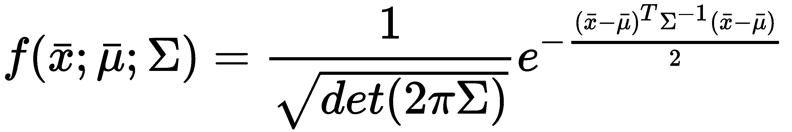
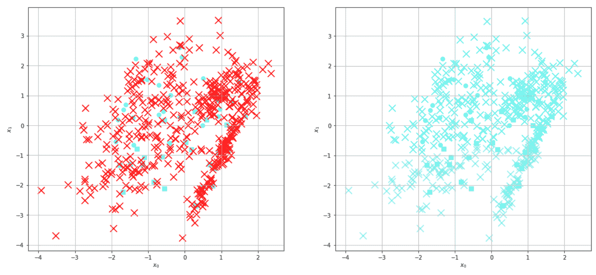

# 半监督学习简介

半监督学习是机器学习的一个分支，它试图通过采用属于聚类和分类方法的概念，以解决既有标签数据又有未标记数据的问题。与正确标记大型数据集的困难相比，未标记样本的高可用性驱使许多研究人员调查最佳方法，这些方法允许在不损失准确性的情况下，将标签样本提供的知识扩展到更大的未标记群体中。在本章中，我们将介绍这个分支，特别是我们将讨论：

+   半监督场景

+   在这种场景下高效操作所需的假设

+   半监督学习的不同方法

+   生成高斯混合模型算法

+   对比悲观似然估计方法

+   **半监督支持向量机**（**S³VM**）

+   **归纳支持向量机**（**TSVM**）

# 半监督场景

一个典型的半监督场景与监督场景并没有太大的不同。假设我们有一个数据生成过程，*p[data]*：


然而，与监督方法相反，我们只有有限数量的样本（*N*）是从 *p[data]* 中抽取的，并且提供了标签，如下所示：


相反，我们有一个更大的样本量（*M*），这些样本是从边缘分布 *p(x)* 中抽取的：


通常，对 *N* 和 *M* 的值没有限制；然而，当未标记样本的数量远多于完整样本的数量时，就会出现半监督问题。如果我们能从 *p[data]* 中抽取 *N* >> *M* 个标记样本，继续使用半监督方法可能就没什么用了，而选择经典监督方法可能是最佳选择。我们需要额外的复杂性是由 *M* >> *N* 来证明的，这在所有那些可用的未标记数据量很大，而正确标记样本数量相当低的情况中是常见的。例如，我们可以轻松地访问数百万张免费图片，但详细标记的数据集很昂贵，并且只包括可能性的一小部分。然而，是否总是可能应用半监督学习来改进我们的模型？对这个问题的答案几乎是显而易见的：不幸的是，不是。作为一个经验法则，我们可以这样说，如果 *X[u]* 的知识增加了我们对先验分布 *p(x)* 的了解，那么半监督算法可能比纯监督（因此仅限于 *X[l]*) 对手表现得更好。另一方面，如果未标记样本来自不同的分布，最终结果可能会相当糟糕。在实际情况下，并不总是立即有必要决定是否半监督算法是最好的选择；因此，交叉验证和比较是在评估场景时采用的最佳实践。

# 归纳学习

当半监督模型旨在为未标记样本寻找标签时，这种方法被称为归纳学习。在这种情况下，我们并不感兴趣于建模整个分布 *p(x|y)*，这意味着确定两个数据集的密度，而是仅对未标记点寻找 *p(y|x)*。在许多情况下，这种策略可以节省时间，并且当我们的目标更倾向于提高我们对未标记数据集的了解时，这始终是首选的。

# 归纳学习

与归纳学习相反，归纳学习考虑所有 *X* 样本，并试图确定一个完整的 *p(x|y)* 或函数 *y=f(x)*，该函数可以将标记点和未标记点映射到它们相应的标签。通常，这种方法更复杂，需要更多计算时间；因此，根据 *Vapnik 的原则*，如果不要求或必要，始终选择最实用的解决方案，如果问题需要更多细节，可能还需要扩展它。

# 半监督假设

如前所述，半监督学习并不能保证提高监督模型。错误的选择可能导致性能的显著下降；然而，可以提出一些基本假设，这些假设对于半监督学习正常工作至关重要。它们并不总是数学上证明的定理，而是经验观察，这些观察为选择一种否则完全随机的途径提供了理由。

# 平滑性假设

让我们考虑一个实值函数 *f(x)* 以及相应的度量空间 *X* 和 *Y*。如果一个函数被称为 Lipschitz 连续的，那么它必须满足以下条件：


换句话说，如果两个点 *x[1]* 和 *x[2]* 相近，那么相应的输出值 *y[1]* 和 *y[2]* 也不能彼此相隔太远。这个条件在回归问题中是基本的，因为通常需要对位于训练样本之间的点进行泛化。例如，如果我们需要预测点 *x[t]* 的输出：*x*[*1* ] < *x[t]* < *x[2]*，并且回归器是 Lipschitz 连续的，我们可以确信 *y[t]* 将被正确地限制在 *y[1]* 和 *y[2]* 之间。这个条件通常被称为一般平滑性，但在半监督学习中，添加一个限制（与聚类假设相关）是有用的：如果两个点位于高密度区域（聚类）并且它们很近，那么相应的输出也必须很近。这个额外条件非常重要，因为如果两个样本位于低密度区域，它们可能属于不同的聚类，它们的标签可能非常不同。这并不总是正确的，但包含这个约束对于许多半监督模型定义中的进一步假设是有用的。

# 聚类假设

这个假设与前面的假设紧密相连，并且可能更容易接受。它可以表达为一系列相互依赖的条件。聚类是高密度区域；因此，如果两个点很近，它们很可能属于同一个聚类，它们的标签必须相同。低密度区域是分离空间；因此，属于低密度区域的样本很可能属于边界点，它们的类别可能不同。为了更好地理解这个概念，考虑监督 SVM 是有用的：只有支持向量应该位于低密度区域。让我们考虑以下二维示例：


在半监督场景中，我们无法知道属于高密度区域的点的标签；然而，如果它足够接近一个已标记的点，以至于可以构建一个所有点都具有相同平均密度的球体，我们允许预测测试样本的标签。相反，如果我们移动到低密度区域，这个过程变得更难，因为两个点可以非常接近但具有不同的标签。我们将在本章末讨论半监督、低密度分离问题。

# 流形假设

这是一个不太直观的假设，但它可以极大地减少许多问题的复杂性。首先，我们可以给出流形的非严格定义。一个*n*-流形是一个全局弯曲但局部与*n*-维欧几里得空间同胚的拓扑空间。在下面的图中，有一个流形的例子：*ℜ³*中的球面表面：


从球面得到的二维流形

在*P*点周围的小块（对于*ε* → *0*）可以映射到一个平坦的圆形表面。因此，流形的性质在局部基于欧几里得几何，而在全局上，它们需要一个适当的数学扩展，这超出了本书的范围（更多信息可以在*《黎曼流形上的半监督学习》*，Belkin M.，Niyogi P.，*《机器学习》56*，*2004*）中找到）。

流形假设指出，*p*-维样本（其中*p* >> *1*）大致位于一个*p* << *q*的*q*-维流形上。不进行过度的数学严谨性，我们可以这样说，例如，如果我们有*N*个*1000*-维有界向量，它们被包含在一个边长等于*r*的*1000*-维超立方体中。相应的*n*-体积是*r^p = r¹⁰⁰⁰*，因此，填满整个空间的可能性非常小（并且随着*p*的增加而减小）。我们观察到的是在低维流形上的高密度。例如，如果我们从太空中观察地球，我们可能会认为其居民在整个体积上均匀分布。我们知道这是错误的，实际上，我们可以创建表示在二维流形上的地图和地图集。使用三维向量来映射人的位置是没有意义的。使用投影和纬度、经度工作更容易。

这个假设授权我们应用降维方法来避免贝尔曼（在《动态规划与马尔可夫过程，罗纳德·A·霍华德*，《麻省理工学院出版社》*）提出的*维度的诅咒*。在机器学习的范围内，这种效应的主要后果是，当样本的维度增加时，为了达到高精度，必须使用越来越多的样本。此外，休斯观察到（这一现象以他的名字命名，并在论文*休斯 G. F.，关于统计模式识别器的平均精度，IEEE 信息系统传输，1968，14/1*）中提出，统计分类器的精度与样本的维度成反比。这意味着每当有可能在低维流形上工作（特别是在半监督场景中）时，就会实现两个优势：

+   更少的计算时间和内存消耗

+   更高的分类精度

# 生成高斯混合

生成高斯混合是半监督聚类的归纳算法。假设我们有一个包含 *N* 个样本（从 *p[data]* 中抽取）的标记数据集 (*X[l]*, *Y[l]*) 和一个包含 *M* >> *N* 个样本（从边缘分布 *p(x)* 中抽取）的无标记数据集 *X[u]*。不一定要求 *M* >> *N*，但我们想创建一个只有少量标记样本的真实半监督场景。此外，我们假设所有无标记样本都与 *p[data]* 一致。这看起来像是一个恶性循环，但没有这个假设，程序就没有坚实的数学基础。我们的目标是使用生成模型确定一个完整的 *p(x|y)* 分布。一般来说，可以使用不同的先验，但我们现在使用多元高斯来模拟我们的数据：



因此，我们的模型参数是所有高斯均值和协方差矩阵。在其他上下文中，可以使用二项式或多项式分布。但是，程序不会改变；因此，让我们假设可以使用参数化分布 *p(x|y*, *θ)* 来近似 *p(x|y)*。我们可以通过最小化两个分布之间的 Kullback-Leibler 散度来实现这一目标：


在第五章，*EM 算法及其应用*中，我们将展示这等价于最大化数据集的似然。为了获得似然，必须定义预期的高斯数量（这可以从标记样本中得知）和一个表示特定高斯边缘概率的权重向量：


使用贝叶斯定理，我们得到：


由于我们同时处理标记和未标记的样本，前面的表达式有两个解释：

+   对于未标记的样本，它是通过将第*i*个高斯权重乘以相对于第*i*个高斯分布的概率*p(x[j])*来计算的。

+   对于标记样本，它可以表示为一个向量 p = [0, 0, ... 1, ... 0, 0]，其中 1 是第*i*个元素。这样，我们迫使我们的模型相信标记样本，以便找到最大化整个数据集似然的最佳参数值。

通过这种区分，我们可以考虑一个单一的似然函数，其中术语*fw*已被每个样本的权重所替代：


使用 EM 算法（见第五章，*EM 算法及其应用*）可以最大化对数似然。在这种情况下，我们直接提供步骤：

+   *p(y[i]|x[j],θ,w)*是按照之前解释的方法计算的

+   使用以下规则更新高斯参数：


*N*是样本总数。必须迭代此过程，直到参数停止修改或修改小于一个固定的阈值。

# 生成高斯混合的示例

现在我们可以使用 Scikit-Learn 提供的`make_blobs()`函数创建一个简单的二维数据集来实现这个模型：

```py
from sklearn.datasets import make_blobs

nb_samples = 1000
nb_unlabeled = 750

X, Y = make_blobs(n_samples=nb_samples, n_features=2, centers=2, cluster_std=2.5, random_state=100)

unlabeled_idx = np.random.choice(np.arange(0, nb_samples, 1), replace=False, size=nb_unlabeled)
Y[unlabeled_idx] = -1
```

我们创建了属于 2 个类别的 1,000 个样本。然后随机选择了 750 个点作为我们的未标记数据集（相应的类别被设置为-1）。现在我们可以通过定义它们的均值、协方差和权重来初始化两个高斯分布。一种可能性是使用随机值：

```py
import numpy as np

# First Gaussian
m1 = np.random.uniform(-7.5, 10.0, size=2)
c1 = np.random.uniform(5.0, 15.0, size=(2, 2))
c1 = np.dot(c1, c1.T)
q1 = 0.5

# Second Gaussian
m2 = np.random.uniform(-7.5, 10.0, size=2)
c2 = np.random.uniform(5.0, 15.0, size=(2, 2))
c2 = np.dot(c2, c2.T)
q2 = 0.5
```

然而，由于协方差矩阵必须是正半定的，因此改变随机值（通过将每个矩阵乘以其相应的转置）或设置硬编码的初始参数是有用的。在这种情况下，我们可以选择以下示例：

```py
import numpy as np

# First Gaussian
m1 = np.array([-3.0, -4.5])
c1 = np.array([[25.0, 5.0], 
               [5.0, 35.0]])
q1 = 0.5

# Second Gaussian
m2 = np.array([5.0, 10.0])
c2 = np.array([[25.0, -10.0], 
               [-10.0, 25.0]])
q2 = 0.5
```

下图显示了结果图，其中小菱形代表未标记的点，大点代表已知类别的样本：


高斯混合的初始配置

两个高斯由同心椭圆表示。现在我们可以执行训练过程。为了简单起见，我们重复更新固定次数的迭代。读者可以轻松修改代码以引入一个阈值：

```py
from scipy.stats import multivariate_normal

nb_iterations = 5

for i in range(nb_iterations):
    Pij = np.zeros((nb_samples, 2))

    for i in range(nb_samples):
        if Y[i] == -1:
            p1 = multivariate_normal.pdf(X[i], m1, c1, allow_singular=True) * q1
            p2 = multivariate_normal.pdf(X[i], m2, c2, allow_singular=True) * q2
            Pij[i] = [p1, p2] / (p1 + p2)

        else:
            Pij[i, :] = [1.0, 0.0] if Y[i] == 0 else [0.0, 1.0]

    n = np.sum(Pij, axis=0)
    m = np.sum(np.dot(Pij.T, X), axis=0)

    m1 = np.dot(Pij[:, 0], X) / n[0]
    m2 = np.dot(Pij[:, 1], X) / n[1]

    q1 = n[0] / float(nb_samples)
    q2 = n[1] / float(nb_samples)

    c1 = np.zeros((2, 2))
    c2 = np.zeros((2, 2))

    for t in range(nb_samples):
        c1 += Pij[t, 0] * np.outer(X[t] - m1, X[t] - m1)
        c2 += Pij[t, 1] * np.outer(X[t] - m2, X[t] - m2)

    c1 /= n[0]
    c2 /= n[1]
```

每个循环开始时，首先要初始化将用于存储*p(y[i]|x[j]**,θ,w)*值的`Pij`矩阵。然后，对于每个样本，我们可以计算*p(y[i]|x[j],θ,w)*，考虑它是否被标记。高斯概率是通过 SciPy 函数`multivariate_normal.pdf()`计算的。当整个*P[ij]*矩阵被填充后，我们可以更新两个高斯的参数（均值和协方差矩阵）以及相关权重。这个算法非常快；经过五次迭代后，我们得到以下图中表示的稳定状态：


两个高斯通过设置参数以覆盖高密度区域，完美地映射了空间。我们可以检查一些未标记的点，如下所示：

```py
print(np.round(X[Y==-1][0:10], 3))

[[  1.67    7.204]
 [ -1.347  -5.672]
 [ -2.395  10.952]
 [ -0.261   6.526]
 [  1.053   8.961]
 [ -0.579  -7.431]
 [  0.956   9.739]
 [ -5.889   5.227]
 [ -2.761   8.615]
 [ -1.777   4.717]]
```

在之前的图中很容易找到它们。相应的类别可以通过最后一个*P[ij]*矩阵获得：

```py
print(np.round(Pij[Y==-1][0:10], 3))

[[ 0.002  0.998]
 [ 1\.     0\.   ]
 [ 0\.     1\.   ]
 [ 0.003  0.997]
 [ 0\.     1\.   ]
 [ 1\.     0\.   ]
 [ 0\.     1\.   ]
 [ 0.007  0.993]
 [ 0\.     1\.   ]
 [ 0.02   0.98 ]]
```

这立即验证了它们已经被正确标记并分配到正确的簇中。这个算法非常快，在密度估计方面产生了优秀的结果。在第五章，*EM 算法及其应用*中，我们将讨论这个算法的一般版本，解释基于 EM 算法的完整训练过程。

在所有涉及随机数的例子中，种子被设置为 1,000（`np.random.seed(1000)`）。其他值或未重置的后续实验可能会产生略微不同的结果。

# 加权对数似然

在之前的例子中，我们考虑了标记和未标记样本的单个对数似然：


这相当于说我们像信任标记点一样信任未标记点。然而，在某些情况下，这个假设可能会导致完全错误的估计，如下图中所示：


偏斜的最终高斯混合配置

在这种情况下，两个高斯分布的均值和协方差矩阵都受到了未标记点的影响，导致的结果密度估计明显错误。当这种现象发生时，最好的做法是考虑双重加权对数似然。如果前*N*个样本是标记的，而接下来的*M*个是未标记的，对数似然可以表示如下：


在前面的公式中，如果 *λ* 小于 1，则可以降低未标记项的权重，使有标签数据集的重要性更高。算法的修改是微不足道的，因为每个未标记的权重都必须根据 *λ* 进行缩放，从而降低其估计概率。在 *Semi-Supervised Learning*，*Chapelle O.*，*Schölkopf B.*，*Zien A.*（编者），*MIT Press* 中，读者可以找到关于 *λ* 选择的一个非常详细的讨论。没有金科玉律；然而，一种可能的策略可能是基于对有标签数据集进行的交叉验证。另一种（更复杂）的方法是考虑不同的 *λ* 增加值，并选择对数似然最大的第一个值。我建议上述书籍以获取更多细节和策略。

# 对比悲观似然估计

如本章开头所述，在许多现实生活中的问题中，检索未标记样本比正确标记的样本更便宜。因此，许多研究人员致力于找到执行半监督分类的最佳策略，以超越监督方法。想法是使用少量有标签样本训练一个分类器，然后在添加加权未标记样本后提高其准确性。其中最好的结果是 M. Loog 提出的 **对比悲观似然估计**（**CPLE**）算法，在 *Loog M.*，*Contrastive Pessimistic Likelihood Estimation for Semi-Supervised Classification*，*arXiv:1503.00269* 中提出。

在解释此算法之前，有必要进行介绍。如果我们有一个包含 *N* 个样本的有标签数据集 (*X*, *Y*)，我们可以定义一个通用估计器的对数似然成本函数，如下所示：


在训练模型之后，应该能够确定 *p(y[i]|x[i], θ)*，这是给定样本 *x[i]* 的标签概率。然而，一些分类器不是基于这种方法（如 SVM）的，而是通过检查参数化函数 *f(x[i]，**θ**) 的符号来评估正确的类别。由于 CPLE 是一个通用的框架，可以在没有概率的情况下与任何分类算法一起使用，因此实现一种称为 Platt 缩放的技术是有用的，该技术允许通过参数化 sigmoid 将决策函数转换为概率。对于二元分类器，它可以表示如下：


*α* 和 *β* 是必须学习的参数，以便最大化似然。幸运的是，Scikit-Learn 提供了 `predict_proba()` 方法，该方法返回所有类别的概率。Platt 缩放是自动执行或在需要时执行；例如，SCV 分类器需要将参数 `probability=True` 设置为计算概率映射。我总是建议在实现自定义解决方案之前检查文档。

我们可以考虑一个由标记和无标记样本组成的完整数据集。为了简化，我们可以重新组织原始数据集，使得前*N*个样本是标记的，而接下来的*M*个是无标记的：


由于我们不知道所有*x^u*样本的标签，我们可以决定在训练过程中使用*M*个*k*-维（k 是类别数）软标签*q[i]*，这些标签可以被优化：


先前公式中的第二个条件是必要的，以保证每个*q[i]*代表一个离散概率（所有元素必须加起来等于 1.0）。因此，完整的对数似然成本函数可以表达如下：


第一个项代表监督部分的似然对数，而第二个项负责无标记点。如果我们只使用标记样本训练一个分类器，排除第二个加项，我们得到参数集*θ[sup]*。CPLE 定义了一个对比条件（也是一个对数似然），通过定义半监督方法给出的总成本函数的改进，与监督解决方案相比：


这个条件允许强制半监督解决方案必须优于监督解决方案，实际上，最大化它；我们同时增加了第一个项并减少了第二个项，从而实现了 CL（对比项在机器学习中非常常见，它通常表示一个条件，该条件是在两个相反约束之间的差异中实现的）。如果 CL 没有增加，这可能意味着无标记样本没有从从*p[data]*中提取的边缘分布*p(x)*中抽取。

此外，在先前的表达式中，我们隐式地使用了软标签，但由于它们最初是随机选择的，并且没有支持其值的真实标签，因此，通过施加悲观条件（作为另一个对数似然）不信任它们是一个好主意：


通过施加这个约束，我们试图找到最小化对比对数似然的软标签；这就是为什么这被定义为悲观方法。这似乎是一种矛盾；然而，信任软标签可能是危险的，因为半监督对数似然甚至可以通过大量误分类而增加。我们的目标是找到最佳的参数集，它能够从监督基线（使用标记样本获得）开始，保证最高的准确度，并改进它，同时不忘掉标记样本提供的结构特征。

因此，我们的最终目标可以表达如下：


# 对比悲观似然估计的示例

我们将使用从 MNIST 数据集提取的子集在 Python 中实现 CPLE 算法。为了简单起见，我们将只使用代表数字 0 和 1 的样本：

```py
from sklearn.datasets import load_digits

import numpy as np

X_a, Y_a = load_digits(return_X_y=True)

X = np.vstack((X_a[Y_a == 0], X_a[Y_a == 1]))
Y = np.vstack((np.expand_dims(Y_a, axis=1)[Y_a==0], np.expand_dims(Y_a, axis=1)[Y_a==1]))

nb_samples = X.shape[0]
nb_dimensions = X.shape[1]
nb_unlabeled = 150
Y_true = np.zeros((nb_unlabeled,))

unlabeled_idx = np.random.choice(np.arange(0, nb_samples, 1), replace=False, size=nb_unlabeled)
Y_true = Y[unlabeled_idx].copy()
Y[unlabeled_idx] = -1
```

在创建包含 360 个样本的受限数据集（*X*，*Y*）之后，我们随机选择 150 个样本（大约 42%）成为未标记的样本（相应的 *y* 为 -1）。在这个时候，我们可以测量仅使用标记数据集训练的逻辑回归的性能：

```py
from sklearn.linear_model import LogisticRegression

lr_test = LogisticRegression()
lr_test.fit(X[Y.squeeze() != -1], Y[Y.squeeze() != -1].squeeze())
unlabeled_score = lr_test.score(X[Y.squeeze() == -1], Y_true)

print(unlabeled_score)
0.573333333333
```

因此，逻辑回归在未标记样本的分类中显示了 57% 的准确率。我们还可以在整个数据集（在移除一些随机标签之前）上评估交叉验证分数：

```py
from sklearn.model_selection import cross_val_score

total_cv_scores = cross_val_score(LogisticRegression(), X, Y.squeeze(), cv=10)

print(total_cv_scores)
[ 0.48648649  0.51351351  0.5         0.38888889  0.52777778  0.36111111
  0.58333333  0.47222222  0.54285714  0.45714286]
```

因此，当所有标签都已知时，分类器在 10 折（每个测试集包含 36 个样本）的情况下实现了平均 48% 的准确率。

我们现在可以实施一个 CPLE 算法。首先，我们需要初始化一个 `LogisticRegression` 实例和软标签：

```py
lr = LogisticRegression()
q0 = np.random.uniform(0, 1, size=nb_unlabeled)
```

*q0* 是一个在半开区间 [0, 1] 内有界值的随机数组；因此，我们还需要一个转换器将 *q[i]* 转换为实际的二进制标签：


我们可以使用 NumPy 函数 `np.vectorize()` 来实现这一点，它允许我们将转换应用于向量的所有元素：

```py
trh = np.vectorize(lambda x: 0.0 if x < 0.5 else 1.0)
```

为了计算对数似然，我们还需要一个加权的对数损失（类似于 Scikit-Learn 函数 `log_loss()`，然而，它计算的是负对数似然，但不支持权重）：

```py
def weighted_log_loss(yt, p, w=None, eps=1e-15):
    if w is None:
        w_t = np.ones((yt.shape[0], 2))
    else:
        w_t = np.vstack((w, 1.0 - w)).T

    Y_t = np.vstack((1.0 - yt.squeeze(), yt.squeeze())).T
    L_t = np.sum(w_t * Y_t * np.log(np.clip(p, eps, 1.0 - eps)), axis=1)

    return np.mean(L_t)
```

此函数计算以下表达式：


我们还需要一个函数来构建具有可变软标签 *q[i]* 的数据集：

```py
def build_dataset(q):
    Y_unlabeled = trh(q)

    X_n = np.zeros((nb_samples, nb_dimensions))
    X_n[0:nb_samples - nb_unlabeled] = X[Y.squeeze()!=-1]
    X_n[nb_samples - nb_unlabeled:] = X[Y.squeeze()==-1]

    Y_n = np.zeros((nb_samples, 1))
    Y_n[0:nb_samples - nb_unlabeled] = Y[Y.squeeze()!=-1]
    Y_n[nb_samples - nb_unlabeled:] = np.expand_dims(Y_unlabeled, axis=1)

    return X_n, Y_n
```

在这一点上，我们可以定义我们的对比对数似然：

```py
def log_likelihood(q):
    X_n, Y_n = build_dataset(q)
    Y_soft = trh(q)

    lr.fit(X_n, Y_n.squeeze())

    p_sup = lr.predict_proba(X[Y.squeeze() != -1])
    p_semi = lr.predict_proba(X[Y.squeeze() == -1])

    l_sup = weighted_log_loss(Y[Y.squeeze() != -1], p_sup)
    l_semi = weighted_log_loss(Y_soft, p_semi, q)

    return l_semi - l_sup
```

此方法将由优化器调用，每次传递不同的 *q* 向量。第一步是构建新的数据集并计算 `Y_soft`，这是与 *q* 对应的标签。然后，使用数据集（因为 `Y_n` 是一个 (k, 1) 数组，所以需要将其压缩以避免警告。当使用 *Y* 作为布尔指示器时，也执行相同操作）。在这个时候，可以使用 `predict_proba()` 方法计算 *p[sup]* 和 *p[semi]*，最后，我们可以计算半监督和监督对数损失，这是我们要最小化的关于 *q[i]* 的项，而 *θ* 的最大化是在训练逻辑回归时隐式完成的。

优化使用 SciPy 中实现的 BFGS 算法进行：

```py
from scipy.optimize import fmin_bfgs

q_end = fmin_bfgs(f=log_likelihood, x0=q0, maxiter=5000, disp=False)
```

这是一个非常快的算法，但鼓励用户尝试不同的方法或库。在这种情况下，我们需要两个参数：`f`，这是要最小化的函数，以及`x0`，这是独立变量的初始条件。`maxiter`在未取得改进时避免过多迭代是有用的。一旦优化完成，`q_end`包含最优软标签。因此，我们可以重建我们的数据集：

```py
X_n, Y_n = build_dataset(q_end)
```

使用这个最终配置，我们可以重新训练逻辑回归并检查交叉验证的准确率：

```py
final_semi_cv_scores = cross_val_score(LogisticRegression(), X_n, Y_n.squeeze(), cv=10)

print(final_semi_cv_scores)
[ 1\.          1\.          0.89189189  0.77777778  0.97222222  0.88888889
  0.61111111  0.88571429  0.94285714  0.48571429]
```

基于 CPLE 算法的半监督解决方案实现了平均 84%的准确率，正如预期的那样，优于监督方法。读者可以尝试使用不同的分类器，如 SVM 或决策树，并验证当 CPLE 允许获得比其他监督算法更高的准确率时。

# 半监督支持向量机（S3VM）

当我们讨论聚类假设时，我们也定义了低密度区域为边界，相应的问题为低密度分离。一个基于这个概念的常见监督分类器是**支持向量机**（**SVM**），其目标是最大化样本必须位于的密集区域之间的距离。有关基于线性核的 SVM 的完整描述，请参阅*Bonaccorso G.*，*机器学习算法*，*Packt Publishing*；然而，提醒自己线性 SVM 的基本模型对于带有松弛变量*ξ[i]*是有用的：


此模型基于以下假设：*y[i]*可以是-1 或 1。松弛变量*ξ[i]*或软边界是变量，每个样本一个，引入以减少原始条件（*min ||w||*）施加的*强度*，该条件基于一个硬边界，它会将所有位于错误一侧的样本误分类。它们由 Hinge 损失定义如下：


使用这些变量，我们允许一些点在保持由相应的松弛变量控制的距离内超越限制，而不会发生误分类。在下图中，这个过程有一个示意图：


SVM 通用场景

每个高密度区域的最后元素是支持向量。它们之间有一个低密度区域（在某些情况下也可能是零密度区域），我们的分离超平面就位于其中。在第一章，*机器学习模型基础*中，我们定义了*经验风险*作为预期风险的代理；因此，我们可以将 SVM 问题转化为在 Hinge 成本函数（带或不带 w 上的 Ridge 正则化）下的经验风险最小化：


理论上，每个总是被包含支持向量的两个超平面所包含的函数都是一个好的分类器，但我们需要最小化经验风险（因此，期望风险）；因此，我们寻找高密度区域之间的最大间隔。这个模型能够分离具有不规则边界的两个密集区域，通过采用核函数，也可以在非线性场景中分离。此时，自然的问题是我们需要解决这种问题的半监督场景中，如何将标记样本和未标记样本的最佳策略整合在一起。

首先需要考虑的是比例：如果我们有很少的未标记点，问题主要是监督性的，使用训练集学习到的泛化能力应该足够正确分类所有未标记点。另一方面，如果未标记样本的数量大得多，我们几乎回到了纯聚类场景（就像在关于生成高斯混合的段落中讨论的那样）。因此，为了利用半监督方法在低密度分离问题中的优势，我们应该考虑标记/未标记比例大约为 1.0 的情况。然而，即使我们有一个类别的优势（例如，如果我们有一个巨大的未标记数据集和很少的标记样本），我们总是可以使用我们即将讨论的算法，即使有时它们的性能可能等于或低于纯监督/聚类解决方案。例如，当标记/未标记比例非常小的时候，Transductive SMVs（传递 SMVs）显示了更好的准确率，而其他方法可能会表现出完全不同的行为。然而，当处理半监督学习（及其假设）时，始终要记住每个问题既是监督性的又是无监督性的，并且最佳解决方案必须在每个不同的环境中进行评估。

对于这个问题，*半监督 SVM*（也称为*S³VM*）算法提供了一个解决方案。如果我们有*N*个标记样本和*M*个未标记样本，目标函数如下：


第一个项强加了标准 SVM 关于最大分离距离的条件，而第二个块被分为两部分：

+   我们需要添加*N*个松弛变量η[i]来保证标记样本的软边界。

+   同时，我们必须考虑那些可能被分类为+1 或-1 的未标记点。因此，我们有两个相应的松弛变量集ξ[i]和 z[i]。然而，我们想要找到每个可能对的最小变量，以确保未标记样本被放置在实现最大准确率的子空间中。

解决问题的必要约束如下：


第一个约束仅限于标记点，它与监督 SVM 相同。接下来的两个约束，相反，考虑了无标记样本可能被分类为+1 或-1 的可能性。例如，假设样本*x[j]*的标签*y[j]*应该是+1，第二个不等式的第一个成员是一个正数*K*（因此第三个方程的对应项是*-K*）。很容易验证第一个松弛变量是*ξ[i] ≥ 1 - K*，而第二个是*z[j] ≥ 1 + K*。

因此，在目标函数中，*ξ[i]*被选为最小化。这种方法是归纳的，并产生良好的（如果不是极好的）性能；然而，它具有非常高的计算成本，应该使用优化（本地）库来解决。不幸的是，它是一个非凸问题，没有标准方法来解决它，因此它总是达到最优配置。

# S3VM 示例

现在我们使用 SciPy 优化方法在 Python 中实现 S³VM，这些方法主要基于 C 和 FORTRAN 实现。读者可以尝试使用其他库，如 NLOpt 和 LIBSVM，并比较结果。Bennet 和 Demiriz 提出的一种可能性是使用 w 的 L1 范数，以便线性化目标函数；然而，这种选择似乎只对小型数据集产生良好的结果。我们将保持基于 L2 范数的原始公式，使用**顺序最小二乘规划**（**SLSQP**）算法来优化目标。

首先，让我们创建一个包含标记和无标记样本的双维数据集：

```py
from sklearn.datasets import make_classification

nb_samples = 500
nb_unlabeled = 200

X, Y = make_classification(n_samples=nb_samples, n_features=2, n_redundant=0, random_state=1000)
Y[Y==0] = -1
Y[nb_samples - nb_unlabeled:nb_samples] = 0
```

为了简单起见（并且没有任何影响，因为样本是打乱的），我们将最后 200 个样本设置为无标记（*y = 0*）。相应的图示如下所示：


原始标记和无标记数据集

十字代表无标记点，它们遍布整个数据集。在此阶段，我们需要初始化优化问题所需的所有变量：

```py
import numpy as np

w = np.random.uniform(-0.1, 0.1, size=X.shape[1])
eta = np.random.uniform(0.0, 0.1, size=nb_samples - nb_unlabeled)
xi = np.random.uniform(0.0, 0.1, size=nb_unlabeled)
zi = np.random.uniform(0.0, 0.1, size=nb_unlabeled)
b = np.random.uniform(-0.1, 0.1, size=1)
C = 1.0

theta0 = np.hstack((w, eta, xi, zi, b))
```

由于优化算法需要一个单一的数组，我们使用`np.hstack()`函数将所有向量堆叠成一个水平数组`theta0`。我们还需要将`min()`函数向量化，以便将其应用于数组：

```py
vmin = np.vectorize(lambda x1, x2: x1 if x1 <= x2 else x2)
```

现在，我们可以定义目标函数：

```py
def svm_target(theta, Xd, Yd):
    wt = theta[0:2].reshape((Xd.shape[1], 1))

    s_eta = np.sum(theta[2:2 + nb_samples - nb_unlabeled])
    s_min_xi_zi = np.sum(vmin(theta[2 + nb_samples - nb_unlabeled:2 + nb_samples], 
                              theta[2 + nb_samples:2 + nb_samples + nb_unlabeled]))

    return C * (s_eta + s_min_xi_zi) + 0.5 * np.dot(wt.T, wt)
```

参数是当前的`theta`向量以及完整的数据集`Xd`和`Yd`。*w*的点积乘以 0.5 以保持用于监督 SVM 的传统符号。常数可以省略，没有任何影响。在此阶段，我们需要定义所有基于松弛变量的约束；每个函数（与目标函数共享相同的参数）用一个索引`idx`参数化。标记约束如下：

```py
def labeled_constraint(theta, Xd, Yd, idx):
    wt = theta[0:2].reshape((Xd.shape[1], 1))

    c = Yd[idx] * (np.dot(Xd[idx], wt) + theta[-1]) + \
    theta[2:2 + nb_samples - nb_unlabeled][idx] - 1.0

    return (c >= 0)[0]
```

无标记约束如下：

```py
def unlabeled_constraint_1(theta, Xd, idx):
    wt = theta[0:2].reshape((Xd.shape[1], 1))

    c = np.dot(Xd[idx], wt) - theta[-1] + \
        theta[2 + nb_samples - nb_unlabeled:2 + nb_samples][idx - nb_samples + nb_unlabeled] - 1.0

    return (c >= 0)[0]

def unlabeled_constraint_2(theta, Xd, idx):
    wt = theta[0:2].reshape((Xd.shape[1], 1))

    c = -(np.dot(Xd[idx], wt) - theta[-1]) + \
        theta[2 + nb_samples:2 + nb_samples + nb_unlabeled ][idx - nb_samples + nb_unlabeled] - 1.0

    return (c >= 0)[0]
```

它们由当前的 `theta` 向量、`Xd` 数据集和 `idx` 索引参数化。我们还需要包括每个松弛变量的约束（*≥ 0*）：

```py
def eta_constraint(theta, idx):
    return theta[2:2 + nb_samples - nb_unlabeled][idx] >= 0

def xi_constraint(theta, idx):
    return theta[2 + nb_samples - nb_unlabeled:2 + nb_samples][idx - nb_samples + nb_unlabeled] >= 0

def zi_constraint(theta, idx):
    return theta[2 + nb_samples:2 + nb_samples+nb_unlabeled ][idx - nb_samples + nb_unlabeled] >= 0
```

我们现在可以使用 SciPy 习惯设置问题：

```py
svm_constraints = []

for i in range(nb_samples - nb_unlabeled):
    svm_constraints.append({
            'type': 'ineq',
            'fun': labeled_constraint,
            'args': (X, Y, i)
        })
    svm_constraints.append({
            'type': 'ineq',
            'fun': eta_constraint,
            'args': (i,)
        })

for i in range(nb_samples - nb_unlabeled, nb_samples):
    svm_constraints.append({
            'type': 'ineq',
            'fun': unlabeled_constraint_1,
            'args': (X, i)
        })
    svm_constraints.append({
            'type': 'ineq',
            'fun': unlabeled_constraint_2,
            'args': (X, i)
        })
    svm_constraints.append({
            'type': 'ineq',
            'fun': xi_constraint,
            'args': (i,)
        })
    svm_constraints.append({
            'type': 'ineq',
            'fun': zi_constraint,
            'args': (i,)
        })
```

每个约束都由一个字典表示，其中 `type` 设置为 `ineq` 以指示它是不等式，`fun` 指向可调用对象，而 `args` 包含所有额外参数（`theta` 是主要的 x 变量，它被自动添加）。使用 SciPy，可以使用 **Sequential Least Squares Programming**（**SLSQP**）或 **Constraint Optimization by Linear Approximation**（**COBYLA**）算法最小化目标。我们更喜欢前者，因为它运行得更快且更稳定：

```py
from scipy.optimize import minimize

result = minimize(fun=svm_target, 
                  x0=theta0, 
                  constraints=svm_constraints, 
                  args=(X, Y), 
                  method='SLSQP', 
                  tol=0.0001, 
                  options={'maxiter': 1000})
```

在训练过程完成后，我们可以计算未标记点的标签：

```py
theta_end = result['x']
w = theta_end[0:2]
b = theta_end[-1]

Xu= X[nb_samples - nb_unlabeled:nb_samples]
yu = -np.sign(np.dot(Xu, w) + b)
```

在下一个图中，可以比较初始图（左侧）和最终图（右侧），其中所有点都已分配了标签：


如您所见，S³VM 成功地为所有未标记点找到了正确的标签，确认了在 *x* 在 *[0, 2]*（正方形点）和 *y* 在 *[0, 2]*（圆形点）之间存在两个非常密集的区域。

NLOpt 是麻省理工学院开发的一个完整的优化库。它适用于不同的操作系统和编程语言。网站是 [`nlopt.readthedocs.io`](https://nlopt.readthedocs.io)。LIBSVM 是一个用于解决 SVM 问题的优化库，它被 Scikit-Learn 和 LIBLINEAR 一起采用。它也适用于不同的环境。主页是 [`www.csie.ntu.edu.tw/~cjlin/libsvm/`](https://www.csie.ntu.edu.tw/~cjlin/libsvm/)。

# 归纳支持向量机（TSVM）

另一种解决同一问题的方法是 T. Joachims 提出的 TSVM（在 *Transductive Inference for Text Classification using Support Vector Machines*，Joachims T.，*ICML Vol. 99/1999*）。其想法是保持原始目标，并使用两组松弛变量：一组用于标记样本，另一组用于未标记样本：


由于这是一个归纳方法，我们需要将未标记的样本视为可变标记样本（受学习过程影响），施加与监督点类似的约束。至于之前的算法，我们假设我们拥有 *N* 个标记样本和 *M* 个未标记样本；因此，条件如下：


第一个约束是经典的 SVM 约束，它仅适用于标记样本。第二个约束使用变量 *y^((u))[j]* 和相应的松弛变量 *ξ[j]* 对未标记样本施加类似条件，而第三个约束是必要的，以确保标签等于 -1 和 1。

就像半监督 SVM 一样，此算法是非凸的，尝试不同的方法来优化它是很有用的。此外，作者在上述论文中展示了当测试集（未标记）很大而训练集（标记）相对较小时，TSVM 如何表现更好（当标准监督 SVM 表现不佳时）。另一方面，当训练集很大而测试集较小时，监督 SVM（或其他算法）总是更可取，因为它们更快，且准确性更高。

# TSVM 示例

在我们的 Python 实现中，我们将使用与之前方法中使用的类似的双维数据集；然而，在这种情况下，我们在总共 500 个点中强制 400 个未标记样本：

```py
from sklearn.datasets import make_classification

nb_samples = 500
nb_unlabeled = 400

X, Y = make_classification(n_samples=nb_samples, n_features=2, n_redundant=0, random_state=1000)
Y[Y==0] = -1
Y[nb_samples - nb_unlabeled:nb_samples] = 0
```

相应的图表如下所示：


原始标记和未标记数据集

程序与之前使用的方法类似。首先，我们需要初始化我们的变量：

```py
import numpy as np

w = np.random.uniform(-0.1, 0.1, size=X.shape[1])
eta_labeled = np.random.uniform(0.0, 0.1, size=nb_samples - nb_unlabeled)
eta_unlabeled = np.random.uniform(0.0, 0.1, size=nb_unlabeled)
y_unlabeled = np.random.uniform(-1.0, 1.0, size=nb_unlabeled)
b = np.random.uniform(-0.1, 0.1, size=1)

C_labeled = 1.0
C_unlabeled = 10.0

theta0 = np.hstack((w, eta_labeled, eta_unlabeled, y_unlabeled, b))
```

在这种情况下，我们还需要定义变量标签的 `y_unlabeled` 向量。作者还建议使用两个 C 常数（`C_labeled` 和 `C_unlabeled`），以便能够不同地加权标记和未标记样本的错误分类。我们为 `C_labeled` 使用了 1.0 的值，为 `C_unlabled` 使用了 10.0 的值，因为我们想对未标记样本的错误分类进行更多的惩罚。

要优化的目标函数如下：

```py
def svm_target(theta, Xd, Yd):
    wt = theta[0:2].reshape((Xd.shape[1], 1))

    s_eta_labeled = np.sum(theta[2:2 + nb_samples - nb_unlabeled])
    s_eta_unlabeled = np.sum(theta[2 + nb_samples - nb_unlabeled:2 + nb_samples])

    return (C_labeled * s_eta_labeled) + (C_unlabeled * s_eta_unlabeled) + (0.5 * np.dot(wt.T, wt))
```

标记和未标记的约束如下：

```py
def labeled_constraint(theta, Xd, Yd, idx):
    wt = theta[0:2].reshape((Xd.shape[1], 1))

    c = Yd[idx] * (np.dot(Xd[idx], wt) + theta[-1]) + \
    theta[2:2 + nb_samples - nb_unlabeled][idx] - 1.0

    return (c >= 0)[0]

def unlabeled_constraint(theta, Xd, idx):
    wt = theta[0:2].reshape((Xd.shape[1], 1))

    c = theta[2 + nb_samples:2 + nb_samples + nb_unlabeled][idx - nb_samples + nb_unlabeled] * \
        (np.dot(Xd[idx], wt) + theta[-1]) + \
        theta[2 + nb_samples - nb_unlabeled:2 + nb_samples][idx - nb_samples + nb_unlabeled] - 1.0

    return (c >= 0)[0]
```

我们还需要对松弛变量和 *y^((u)* 进行约束：

```py
def eta_labeled_constraint(theta, idx):
    return theta[2:2 + nb_samples - nb_unlabeled][idx] >= 0

def eta_unlabeled_constraint(theta, idx):
    return theta[2 + nb_samples - nb_unlabeled:2 + nb_samples][idx - nb_samples + nb_unlabeled] >= 0

def y_constraint(theta, idx):
    return np.power(theta[2 + nb_samples:2 + nb_samples + nb_unlabeled][idx], 2) == 1.0
```

如前一个示例所示，我们可以创建 SciPy 需要的约束字典：

```py
svm_constraints = []

for i in range(nb_samples - nb_unlabeled):
    svm_constraints.append({
            'type': 'ineq',
            'fun': labeled_constraint,
            'args': (X, Y, i)
        })
    svm_constraints.append({
            'type': 'ineq',
            'fun': eta_labeled_constraint,
            'args': (i,)
        })

for i in range(nb_samples - nb_unlabeled, nb_samples):
    svm_constraints.append({
            'type': 'ineq',
            'fun': unlabeled_constraint,
            'args': (X, i)
        })
    svm_constraints.append({
            'type': 'ineq',
            'fun': eta_unlabeled_constraint,
            'args': (i,)
        })

for i in range(nb_unlabeled):
    svm_constraints.append({
            'type': 'eq',
            'fun': y_constraint,
            'args': (i,)
        })
```

在这种情况下，最后一个约束是一个等式，因为我们想强制 *y^((u)* 要么等于 -1，要么等于 1。在这个点上，我们最小化目标函数：

```py
from scipy.optimize import minimize

result = minimize(fun=svm_target, 
                  x0=theta0, 
                  constraints=svm_constraints, 
                  args=(X, Y), 
                  method='SLSQP', 
                  tol=0.0001, 
                  options={'maxiter': 1000})
```

当过程完成后，我们可以计算未标记样本的标签并比较图表：

```py
theta_end = result['x']
w = theta_end[0:2]
b = theta_end[-1]

Xu= X[nb_samples - nb_unlabeled:nb_samples]
yu = -np.sign(np.dot(Xu, w) + b)
```

图表比较如下所示：



原始数据集（左）。最终标记数据集（右）

基于密度分布的错误分类略高于 S³VM，但可以通过改变 C 值和优化方法来调整，直到达到预期的结果。当训练集足够大（并且正确代表整个 *p[data]*）时，监督 SVM 可以提供良好的基准，其性能可能更好。 

评估不同的 C 参数组合很有趣，从标准的监督 SVM 开始。数据集较小，有大量的未标记样本：

```py
nb_samples = 100
nb_unlabeled = 90

X, Y = make_classification(n_samples=nb_samples, n_features=2, n_redundant=0, random_state=100)
Y[Y==0] = -1
Y[nb_samples - nb_unlabeled:nb_samples] = 0
```

我们使用 Scikit-Learn 提供的标准 SVM 实现（`SVC()` 类），使用线性核和 `C=1.0`：

```py
from sklearn.svm import SVC

svc = SVC(kernel='linear', C=1.0)
svc.fit(X[Y!=0], Y[Y!=0])

Xu_svc= X[nb_samples - nb_unlabeled:nb_samples]
yu_svc = svc.predict(Xu_svc)
```

SVM 使用带标签的样本进行训练，向量 `yu_svc` 包含对未标记样本的预测。与原始数据集相比的结果图如下所示：


原始数据集（左）。最终标记数据集（右）C = 1.0

所有标记样本都用较大的正方形和圆形表示。结果符合我们的预期，但有一个区域 *(X [-1, 0] - Y [-2, -1])*，其中 SVM 决定将*圆形*类强加，即使未标记的点靠近正方形。考虑到聚类假设，这种假设是不可接受的；事实上，在高密度区域中存在属于两个类别的样本。使用**CL=10**和**CU=5**的 S³VM 得到的结果（或更差）是类似的：


原始数据集（左）。最终标记数据集（右）C[L] = 10 和 C[U] = 5

在这种情况下，分类准确度较低，因为未标记样本的惩罚低于对标记点的惩罚。显然，监督 SVM 有更好的性能。让我们尝试**C[L]=10**和**C[U]=50**：


原始数据集（左）。最终标记数据集（右）C[L] = 10 和 C[U] = 50

现在，对于未标记样本的惩罚相当高，考虑到聚类假设，结果看起来更加合理。所有高密度区域都是连贯的，并且由低密度区域分隔。这些例子展示了参数选择和优化方法如何能显著改变结果。我的建议是在选择最终配置（在子样本数据集上）之前测试几种配置。在《*半监督学习*》一书中，作者*Chapelle O.*、*Schölkopf B.*、*Zien A.*（编者），*麻省理工学院出版社*，有关于可能的优化策略的更多细节，包括其优缺点。

# 摘要

在本章中，我们从场景和所需的假设开始介绍半监督学习，以证明这些方法的有效性。我们讨论了平滑假设在处理监督和半监督分类器时的重要性，以确保合理的泛化能力。然后我们介绍了聚类假设，它与数据集的几何形状密切相关，并允许在具有强烈结构条件的密度估计问题中应对。最后，我们讨论了流形假设及其在避免维度灾难中的重要性。

本章继续介绍了一个生成和归纳模型：生成高斯混合模型，它允许从先验概率由多元高斯分布建模的假设出发，对标记和未标记样本进行聚类。

接下来的主题是关于一个非常重要的算法：对比悲观似然估计，这是一个归纳、半监督分类框架，可以与任何监督分类器一起采用。主要概念是基于软标签（代表未标记样本的概率）定义对比对数似然，并施加悲观条件以最小化对软标签的信任。该算法可以找到最佳配置，最大化对数似然，同时考虑标记和未标记样本。

另一种归纳分类方法是 S³VM 算法，它是经典 SVM 方法的扩展，基于两个额外的优化约束来解决未标记样本。这种方法相对强大，但它是非凸的，因此对用于最小化目标函数的算法非常敏感。

S³VM 的替代方案是 TSVM，它试图通过基于可变标签的条件最小化目标。因此，问题被分为两部分：监督部分，与标准 SVM 完全相同；半监督部分，结构相似但没有固定的*y*标签。这个问题也是非凸的，因此有必要评估不同的优化策略，以找到准确性和计算复杂度之间的最佳权衡。在参考文献部分，有一些有用的资源，您可以深入探讨所有这些问题，并为每个特定场景找到合适的解决方案。

在下一章，第三章，*基于图的结构半监督学习*中，我们继续这一探索，通过讨论一些基于数据集底层结构的重要算法。特别是，我们将运用图论来执行标签向未标记样本的传播，以及在非线性环境中降低数据集的维度。
