# 基于图的半监督学习

在本章中，我们继续讨论半监督学习，考虑基于从数据集获得的图和样本之间现有关系的一系列算法。我们将讨论的问题属于两大类：将类别标签传播到未标记样本以及使用基于流形假设的非线性技术来降低原始数据集的维度。特别是，本章涵盖了以下传播算法：

+   基于权重矩阵的标签传播

+   Scikit-Learn 中的标签传播（基于转移概率）

+   标签传播

+   基于马尔可夫随机游走的传播

对于流形学习部分，我们正在讨论：

+   Isomap 算法和多维尺度方法

+   局部线性嵌入

+   拉普拉斯谱嵌入

+   t-SNE

# 标签传播

**标签传播**是一系列基于数据集图表示的半监督算法。特别是，如果我们有*N*个标记点（带有双极性标签+1 和-1）和*M*个未标记点（用*y=0*表示），则可以根据样本之间的几何亲和度度量构建一个无向图。如果*G = {V, E}*是图的正式定义，则顶点集由样本标签*V = { -1, +1, 0 }*组成，而边集基于**亲和度矩阵***W*（当图无权重时通常称为**邻接矩阵**），它只依赖于*X*值，而不依赖于标签。

在下面的图中，有一个此类结构的示例：

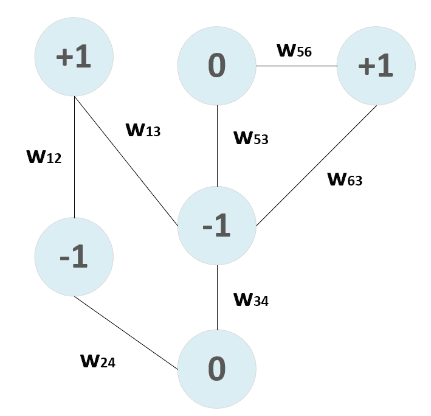

二元图的示例

在前面的示例图中，有四个标记点（两个*y=+1*和两个*y=-1*），以及两个未标记点(*y=0*)。亲和度矩阵通常是对称的，是方阵，其维度等于*(N+M) x (N+M)*。它可以通过不同的方法获得。最常见的方法之一，也被 Scikit-Learn 采用，是：

+   ***k*-最近邻**（我们将在第八章[59f765c2-2ad0-4605-826e-349080f85f1f.xhtml]中详细讨论此算法，*聚类算法*）：

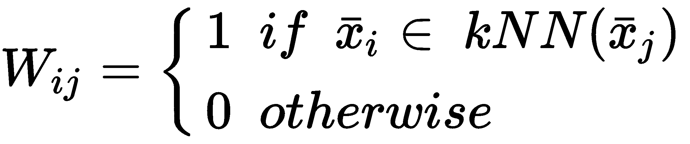

+   **径向基函数核**：


有时，在径向基函数核中，参数*γ*表示为*2σ²*的倒数；然而，对应于大方差的小*γ*值会增加半径，包括更远的点，并在多个样本上*平滑*类别，而大的*γ*值将边界限制在趋向于单个样本的子集。相反，在 k-最近邻核中，参数*k*控制要考虑作为邻居的样本数量。

为了描述基本算法，我们还需要介绍**度矩阵**(*D*)：

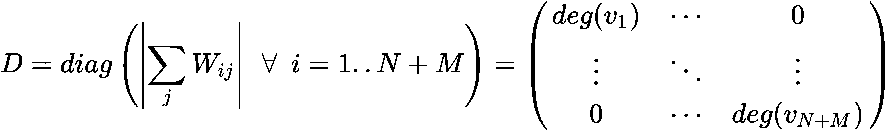

它是一个对角矩阵，其中每个非零元素代表相应顶点的 *度*。这可以是入边数，或者与其成比例的度量（如在基于径向基函数的 *W* 的情况下）。标签传播的一般思想是让每个节点将其标签传播到其邻居，并迭代该过程直到收敛。

形式上，如果我们有一个包含标记和无标记样本的数据集：

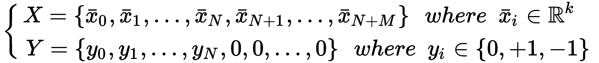

**标签传播**算法的完整步骤（如 Zhu 和 Ghahramani 在 *Learning from Labeled and Unlabeled Data with Label Propagation* 中提出，*Zhu X.*，*Ghahramani Z.*，*CMU-CALD-02-107*）是：

1.  选择亲和矩阵类型（KNN 或 RBF）并计算 *W*

1.  计算度矩阵 *D*

1.  定义 *Y^((0)) = Y*

1.  定义 *Y[L] = {y[0], y[1], ..., y[N]}*

1.  迭代以下步骤直到收敛：

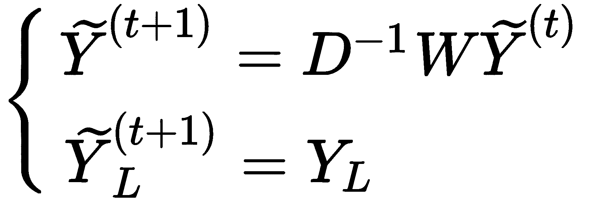

第一次更新执行了带有标记和无标记点的传播步骤。每个标签从一个节点通过其出边传播，相应的权重，与度数归一化后，增加或减少每个贡献的 *影响*。第二个命令则重置所有标记样本的 *y* 值。最终的标签可以如下获得：

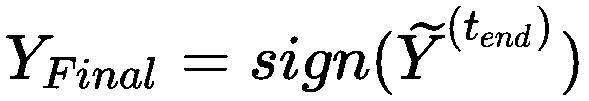

收敛的证明非常简单。如果我们根据标记和无标记样本之间的关系对矩阵 *D^(-1)W* 进行划分，我们得到：

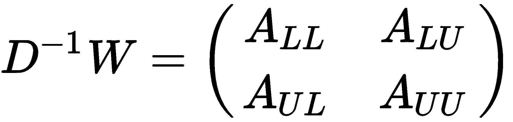

如果我们考虑只有 *Y* 的前 *N* 个分量是非零的，并且在每次迭代的末尾被固定，则矩阵可以重写为：

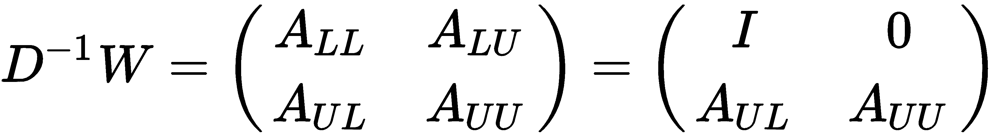

我们对证明无标记样本部分（标记样本是固定的）的收敛性感兴趣，因此我们可以将更新规则写为：

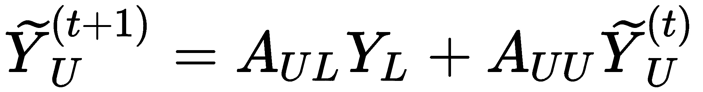

将递归转换为迭代过程，前面的公式变为：

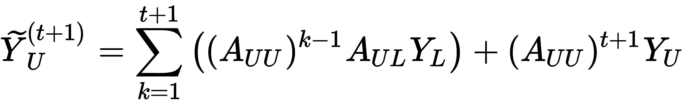

在前面的表达式中，第二项为零，因此我们需要证明第一项收敛；然而，很容易识别一个截断的矩阵几何级数（Neumann 级数），并且 *A[UU]* 被构建以具有所有特征值 *|λ[i]| < 1*，因此级数收敛到：

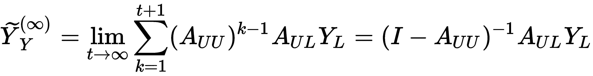

# 标签传播示例

我们可以使用 Python 实现该算法，使用一个测试的二维数据集：

```py
from sklearn.datasets import make_classification

nb_samples = 100
nb_unlabeled = 75

X, Y = make_classification(n_samples=nb_samples, n_features=2, n_informative=2, n_redundant=0, random_state=1000)
Y[Y==0] = -1
Y[nb_samples - nb_unlabeled:nb_samples] = 0
```

如其他示例一样，我们将所有无标记样本（100 个中的 75 个）的 *y* 设置为 0。相应的图如下所示：

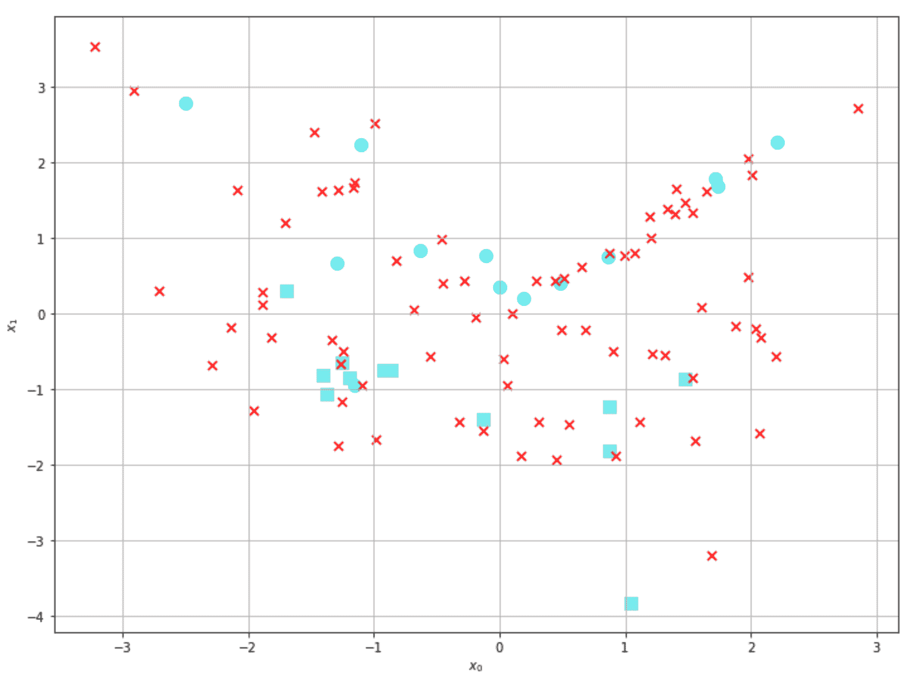

部分标记数据集

带有交叉标记的点是无标记的。在此阶段，我们可以定义亲和矩阵。在这种情况下，我们使用两种方法来计算它：

```py
from sklearn.neighbors import kneighbors_graph

nb_neighbors = 2

W_knn_sparse = kneighbors_graph(X, n_neighbors=nb_neighbors, mode='connectivity', include_self=True)
W_knn = W_knn_sparse.toarray()
```

KNN 矩阵是通过 Scikit-Learn 函数 `kneighbors_graph()` 获得的，参数为 `n_neighbors=2` 和 `mode='connectivity'`；另一种选择是 `'distance'`，它返回距离而不是 0 和 1 来表示边的存在/不存在。`include_self=True` 参数很有用，因为我们希望 *W[ii] = 1*。

对于 RBF 矩阵，我们需要手动定义它：

```py
import numpy as np

def rbf(x1, x2, gamma=10.0):
    n = np.linalg.norm(x1 - x2, ord=1)
    return np.exp(-gamma * np.power(n, 2))

W_rbf = np.zeros((nb_samples, nb_samples))

for i in range(nb_samples):
    for j in range(nb_samples):
        W_rbf[i, j] = rbf(X[i], X[j])
```

*γ* 的默认值是 *10*，对应的标准差 *σ* 等于 *0.22*。在使用此方法时，设置正确的 *γ* 值非常重要；否则，在某一类占主导地位的情况下（*γ* 过小），传播可能会退化。现在，我们可以计算度矩阵及其逆矩阵。由于过程相同，从现在起我们将继续使用 RBF 相似度矩阵：

```py
D_rbf = np.diag(np.sum(W_rbf, axis=1))
D_rbf_inv = np.linalg.inv(D_rbf)
```

该算法使用一个可变阈值。这里采用的值是 `0.01`：

```py
tolerance = 0.01

Yt = Y.copy()
Y_prev = np.zeros((nb_samples,))
iterations = 0

while np.linalg.norm(Yt - Y_prev, ord=1) > tolerance:
    P = np.dot(D_rbf_inv, W_rbf)
    Yt = np.dot(P, Yt)
    Yt[0:nb_samples - nb_unlabeled] = Y[0:nb_samples - nb_unlabeled]
    Y_prev = Yt.copy()

Y_final = np.sign(Yt)
```

最终结果在以下双图中显示：

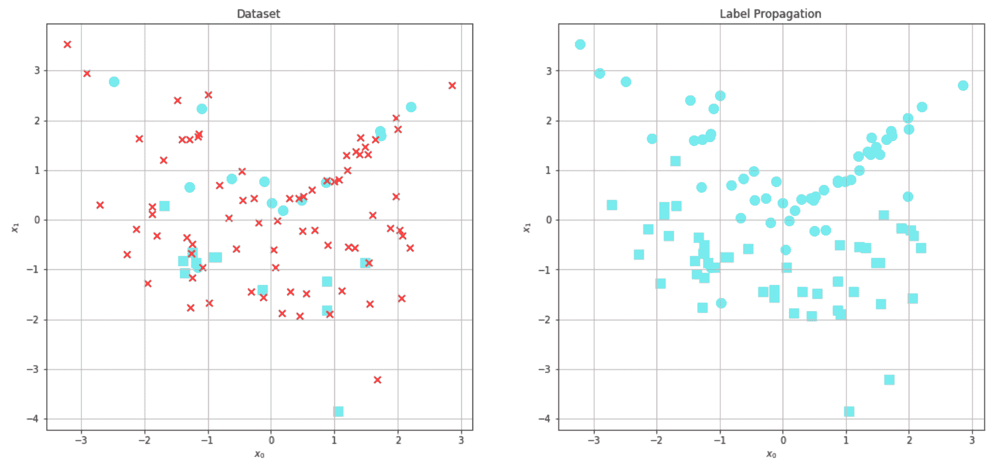

原始数据集（左）；完整标签传播后的数据集（右）

如你所见，在原始数据集中有一个圆形点被方形点包围（-0.9, -1）。由于此算法保留了原始标签，在标签传播后我们发现了相同的情况。这种条件可能是可以接受的，即使平滑性和聚类假设被违反。假设这是合理的，我们可以通过放松算法来强制进行 *校正*：

```py
tolerance = 0.01

Yt = Y.copy()
Y_prev = np.zeros((nb_samples,))
iterations = 0

while np.linalg.norm(Yt - Y_prev, ord=1) > tolerance:
    P = np.dot(D_rbf_inv, W_rbf)
    Yt = np.dot(P, Yt)
    Y_prev = Yt.copy()

Y_final = np.sign(Yt)
```

这样做，我们不重置原始标签，让传播改变所有与邻域不一致的值。结果在以下图中显示：

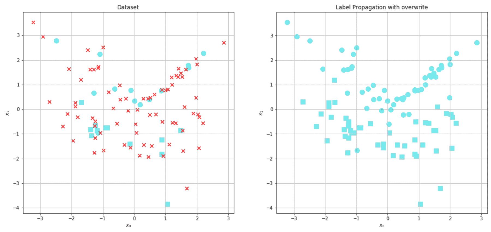

原始数据集（左）；完整标签传播后带有覆盖的数据集（右）

# Scikit-Learn 中的标签传播

Scikit-Learn 实现了 Zhu 和 Ghahramani 提出的略有不同的算法（在上述论文中提到），其中亲和度矩阵 *W* 可以使用两种方法（KNN 和 RBF）计算，但被归一化成为一个概率转移矩阵：

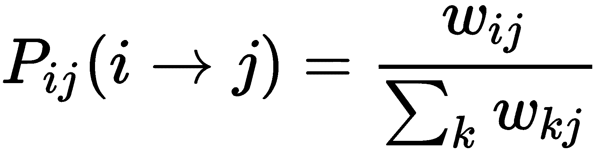

该算法像马尔可夫随机游走一样操作，以下是一个序列（假设有 *Q* 个不同的标签）：

1.  定义一个矩阵 *Y^M[i] = [P(label=y[0]), P(label=y[1]), ..., and P(label=y[Q])]*)，其中 *P(label=yi)* 是标签 *yi* 的概率，并且每一行都归一化，使得所有元素之和等于 *1*

1.  定义 *Y^((0)) = Y^M*

1.  迭代直到以下步骤收敛：

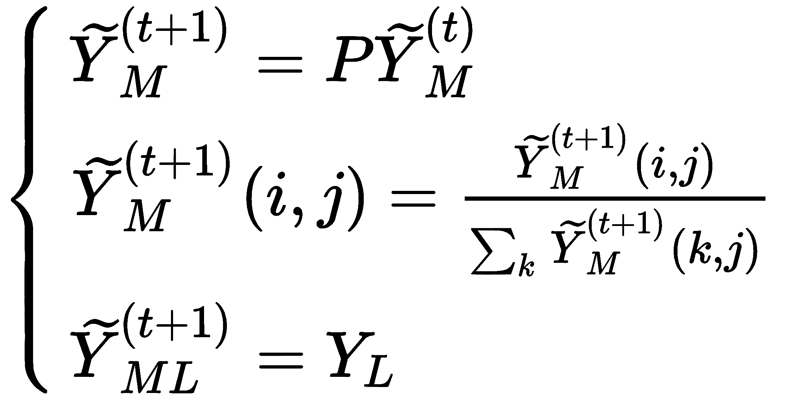

第一次更新执行标签传播步骤。由于我们处理的是概率，因此有必要（第二步）重新归一化行，使它们的元素之和为*1*。最后一次更新重置所有标记样本的原始标签。在这种情况下，这意味着对相应的标签施加*P(label=y[i]) = 1*，并将所有其他设置为零。收敛的证明与标签传播算法的证明非常相似，可以在*《基于标签传播的带标签和无标签数据的机器学习》，*Zhu X.*，*Ghahramani Z.*，*CMU-CALD-02-107.*中最重要结果是，可以通过这个公式（无需任何迭代）获得封闭形式的解：

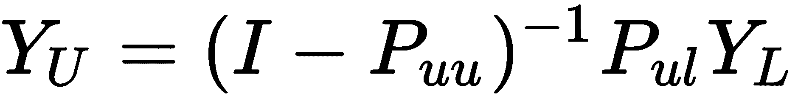

第一个项是一个广义几何级数的和，其中*P[uu]*是转移矩阵*P*中未标记-未标记的部分。*P[ul]*，相反，是同一矩阵中未标记-标记的部分。

对于我们的 Python 示例，我们需要以不同的方式构建数据集，因为 Scikit-Learn 将标签为*y=-1*的样本视为未标记：

```py
from sklearn.datasets import make_classification

nb_samples = 1000
nb_unlabeled = 750

X, Y = make_classification(n_samples=nb_samples, n_features=2, n_informative=2, n_redundant=0, random_state=100)
Y[nb_samples - nb_unlabeled:nb_samples] = -1
```

我们现在可以使用具有 RBF 核和`gamma=10.0`的`LabelPropagation`实例进行训练：

```py
from sklearn.semi_supervised import LabelPropagation

lp = LabelPropagation(kernel='rbf', gamma=10.0)
lp.fit(X, Y)

Y_final = lp.predict(X)
```

结果如下双图所示：

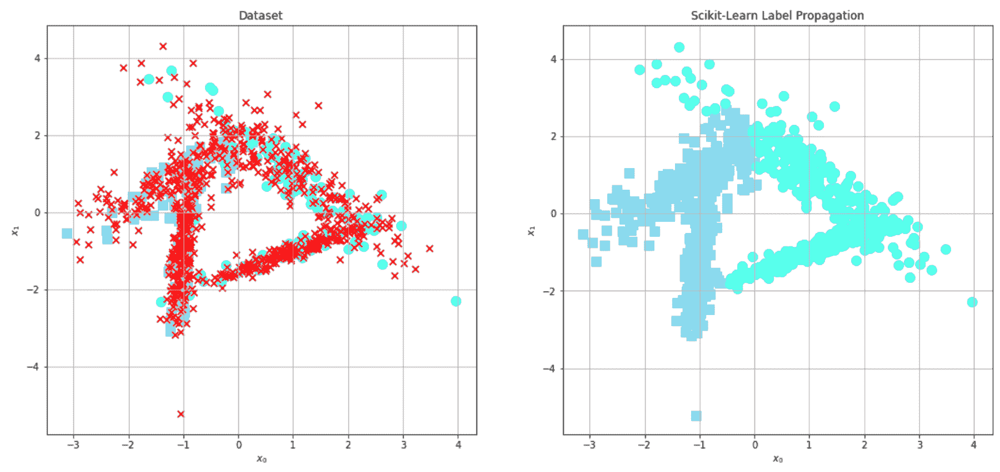

原始数据集（左）。经过 Scikit-Learn 标签传播后的数据集（右）

如预期，传播收敛到一个既满足平滑性又满足聚类假设的解。

# 标签传播

最后一个需要分析的算法（由 Zhou 等人提出）称为**标签传播**，它基于归一化图拉普拉斯算子：

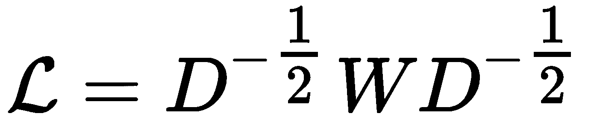

这个矩阵的每个对角元素*l[ii]*等于*1*，如果度*deg(l[ii]) > 0*（否则为 0），所有其他元素等于：

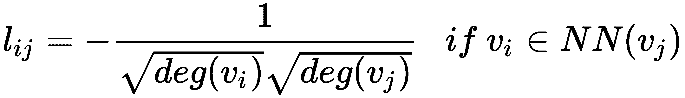

这个矩阵的行为类似于离散拉普拉斯算子，其实值版本是所有扩散方程的基本元素。为了更好地理解这个概念，让我们考虑一个通用的热方程：

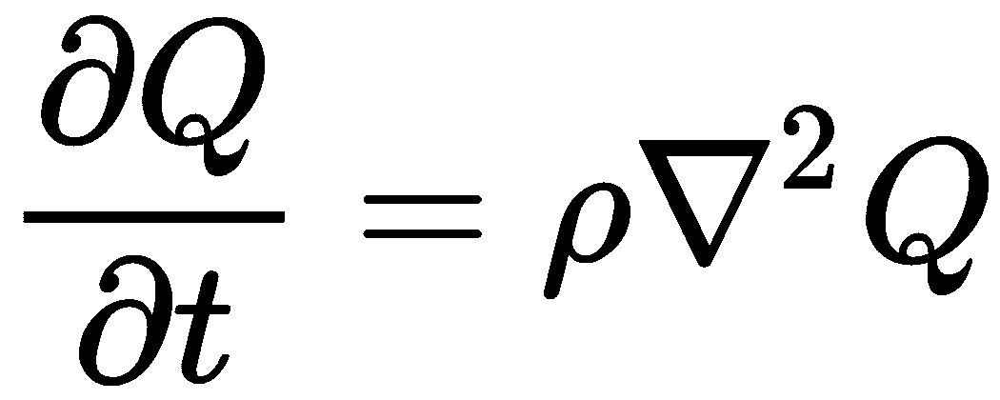

这个方程描述了当某一点突然加热时房间温度的行为。从基本的物理概念中，我们知道热量会传播，直到温度达到平衡点，变化的速率与分布的拉普拉斯算子成正比。如果我们考虑平衡状态下的二维网格（当时间变为零时的导数）并离散化拉普拉斯算子（*∇² = ∇ · ∇*），考虑增量比率，我们得到：

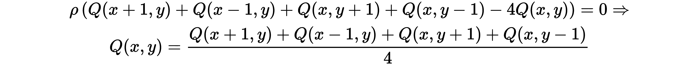

因此，在平衡状态下，每个点都有一个值，它是直接邻居的平均值。可以证明有限差分方程有一个唯一的固定点，可以从每个初始条件迭代找到。除了这个想法之外，标签传播还采用一个夹紧因子 *α* 来处理标记样本。如果 *α=0*，则算法将始终将标签重置为原始值（类似于标签传播），而当 *α* 在区间 *(0, 1)* 内时，夹紧标签的百分比会逐渐减少，直到 *α=1*，此时所有标签都将被覆盖。

**标签传播**算法的完整步骤是：

1.  选择亲和矩阵类型（KNN 或 RBF）并计算 *W*

1.  计算度矩阵 *D*

1.  计算归一化图拉普拉斯矩阵 *L*

1.  定义 *Y^((0)) = Y*

1.  在区间 *[0, 1]* 中定义 *α*

1.  迭代直到以下步骤收敛：

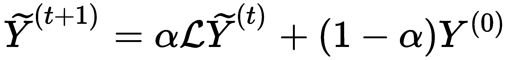

有可能证明（正如在 *《半监督学习》* 中所展示的，*Chapelle O.*，*Schölkopf B*., *Zien A.* 编著，*麻省理工学院出版社*）该算法等价于最小化具有以下结构的二次成本函数：

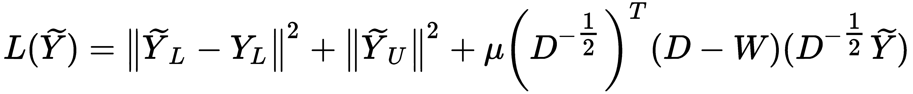

第一项强制原始标签和估计标签（对于标记样本）之间的一致性。第二项作为归一化因子，迫使未标记项变为零，而第三项，可能是最不直观的，需要保证在平滑性方面的几何一致性。正如我们在上一段中看到的，当采用硬限制时，平滑性假设可能会被违反。通过最小化这一项（*μ* 与 *α* 成正比），可以在高密度区域内惩罚快速变化。在这种情况下，收敛性的证明与标签传播算法的证明非常相似，因此将省略。感兴趣的读者可以在 *《半监督学习》*，*Chapelle O.*，*Schölkopf B.*，*Zien A.*，(编者)，*麻省理工学院出版社* 中找到。

# 标签传播的示例

我们可以使用 Scikit-Learn 的实现来测试这个算法。让我们首先创建一个非常密集的数据集：

```py
from sklearn.datasets import make_classification

nb_samples = 5000
nb_unlabeled = 1000

X, Y = make_classification(n_samples=nb_samples, n_features=2, n_informative=2, n_redundant=0, random_state=100)
Y[nb_samples - nb_unlabeled:nb_samples] = -1
```

我们可以使用具有夹紧因子 `alpha=0.2` 的 `LabelSpreading` 实例进行训练。我们希望保留 80% 的原始标签，但同时也需要一个平滑的解决方案：

```py
from sklearn.semi_supervised import LabelSpreading

ls = LabelSpreading(kernel='rbf', gamma=10.0, alpha=0.2)
ls.fit(X, Y)

Y_final = ls.predict(X)
```

结果通常与原始数据集一起展示：

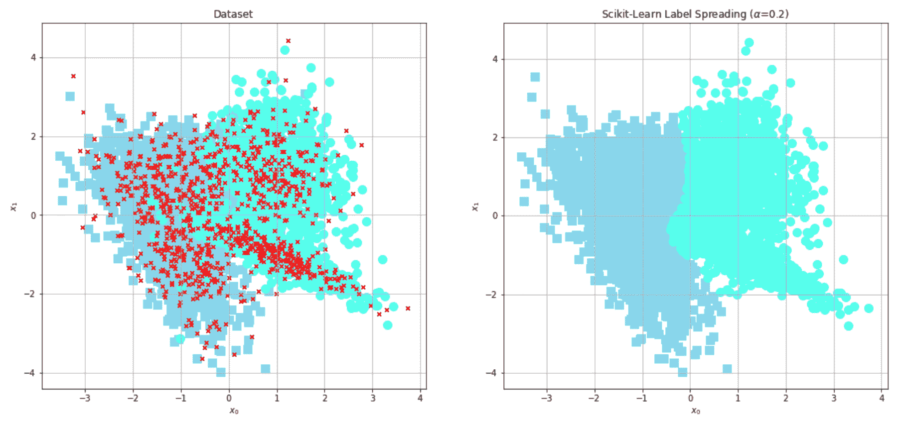

原始数据集（左）。完全标签传播后的数据集（右）

如第一幅图（左）所示，在簇的中央部分 *(x [-1, 0])* 中，有一个圆形点的区域。使用硬限制，这个 *通道* 将保持不变，这违反了平滑性和聚类假设。设置 *α > 0*，可以避免这个问题。当然，*α* 的选择与每个单独的问题严格相关。如果我们知道原始标签绝对正确，允许算法更改它们可能是适得其反的。在这种情况下，例如，最好预处理数据集，过滤掉所有违反半监督假设的样本。如果我们不确定所有样本是否都来自相同的 *p[data]*，并且可能存在虚假元素，使用更高的 *α* 值可以在不进行其他操作的情况下平滑数据集。

# 基于马尔可夫随机游走的标签传播

Zhu 和 Ghahramani 提出的这个算法的目标是在一个混合数据集给定的情况下，找到未标记样本的目标标签的概率分布。这个目标是通过模拟一个随机过程来实现的，在这个过程中，每个未标记样本在图中行走，直到达到一个稳定的吸收状态，即停止获取相应标签的标记样本。与其他类似方法的主要区别在于，在这种情况下，我们考虑到达标记样本的概率。通过这种方式，问题获得了一个封闭形式，并且可以很容易地解决。

第一步是始终构建一个包含所有 *N* 样本的 k-最近邻图，并基于 RBF 内核定义一个权重矩阵 *W*：


*W[ij] = 0* 是 *x*[*i*, ]和 *x[j]* 不是邻居，*W[ii] = 1*。与 Scikit-Learn 标签传播算法类似，转换概率矩阵是构建的：


以更紧凑的方式，它可以重写为 *P = D^(-1)W*。如果我们现在考虑一个 *测试样本*，从状态 *x[i]* 开始，随机行走直到找到一个吸收的标记状态（我们称之为 *y^∞*），这个概率（称为**二元分类**）可以表示为：

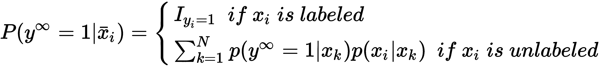

当 *x[i]* 被标记时，状态是最终的，它由基于条件 *y[i]=1* 的指示函数表示。当样本未标记时，我们需要考虑从 *x[i]* 开始并结束在最近的吸收状态的所有可能的转换的总和，该状态带有标签 *y=1*，并按相对转换概率加权。

我们可以将这个表达式重写为矩阵形式。如果我们创建一个向量 *P^∞ =  P[L*, *PU ]*，其中第一个分量基于标记样本，第二个基于未标记样本，我们可以写出：

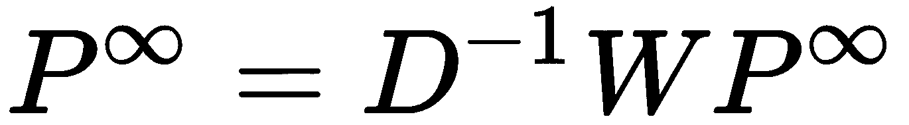

如果我们现在扩展矩阵，我们得到：

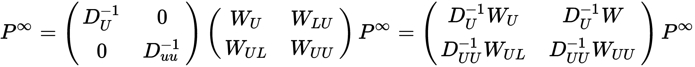

由于我们只对未标记的样本感兴趣，我们可以只考虑第二个方程：

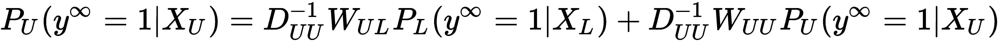

简化表达式，我们得到以下线性系统：

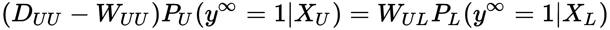

项 *(D[uu] - W[uu])* 是未归一化图拉普拉斯矩阵 *L = D - W* 的未标记-未标记部分。通过解这个系统，我们可以得到所有未标记样本对于类别 *y=1* 的概率。

# 基于马尔可夫随机游走的标签传播示例

对于这个基于马尔可夫随机游走的 Python 标签传播示例，我们将使用一个包含 50 个标记样本（属于两个不同的类别）和 1,950 个未标记样本的二维数据集：

```py
from sklearn.datasets import make_blobs

nb_samples = 2000
nb_unlabeled = 1950
nb_classes = 2

X, Y = make_blobs(n_samples=nb_samples, 
                  n_features=2, 
                  centers=nb_classes,
                  cluster_std=2.5,
                  random_state=500)

Y[nb_samples - nb_unlabeled:] = -1
```

数据集的图示如下（交叉点代表未标记的样本）：

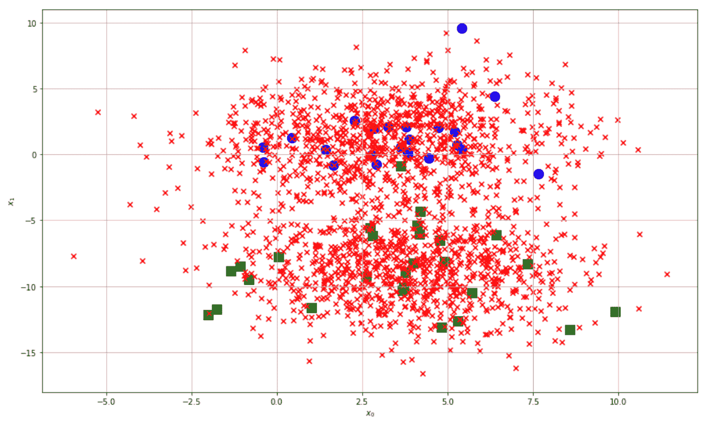

部分标记的数据集

我们现在可以创建图（使用 `n_neighbors=15`）和权重矩阵：

```py
import numpy as np

from sklearn.neighbors import kneighbors_graph

def rbf(x1, x2, sigma=1.0):
    d = np.linalg.norm(x1 - x2, ord=1)
    return np.exp(-np.power(d, 2.0) / (2 * np.power(sigma, 2)))

W = kneighbors_graph(X, n_neighbors=15, mode='connectivity', include_self=True).toarray()

for i in range(nb_samples):
    for j in range(nb_samples):
        if W[i, j] != 0.0:
            W[i, j] = rbf(X[i], X[j])
```

现在，我们需要计算未归一化图拉普拉斯矩阵的未标记部分和矩阵 *W* 的未标记-标记部分：

```py
D = np.diag(np.sum(W, axis=1))
L = D - W
Luu = L[nb_samples - nb_unlabeled:, nb_samples - nb_unlabeled:]
Wul = W[nb_samples - nb_unlabeled:, 0:nb_samples - nb_unlabeled,]
Yl = Y[0:nb_samples - nb_unlabeled]
```

在这一点上，可以使用 NumPy 函数 `np.linalg.solve()` 解这个线性系统，该函数接受一个形式为 *Ax=b* 的通用系统的矩阵 *A* 和向量 *b* 作为参数。一旦我们得到解，我们可以将新的标签与原始标签合并（其中未标记的样本被标记为 *-1*）。在这种情况下，我们不需要转换概率，因为我们使用 *0* 和 *1* 作为标签。通常，需要使用一个阈值（0.5）来选择正确的标签：

```py
Yu = np.round(np.linalg.solve(Luu, np.dot(Wul, Yl)))
Y[nb_samples - nb_unlabeled:] = Yu.copy()
```

重新绘制数据集，我们得到：

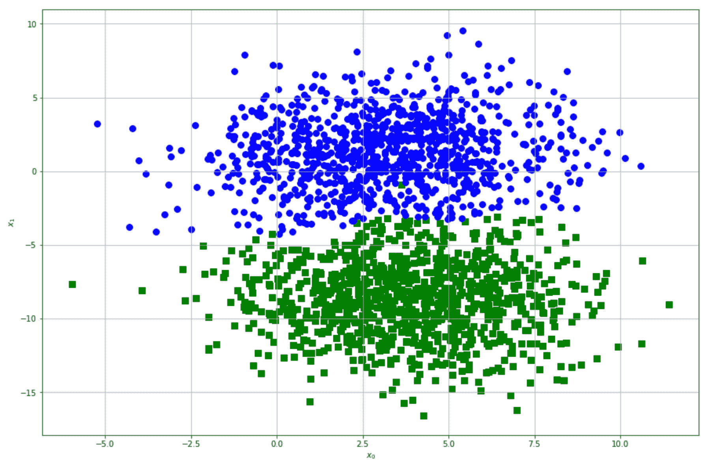

完整马尔可夫随机游走标签传播后的数据集

如预期的那样，没有进行任何迭代，标签已经成功传播到所有样本，完全符合聚类假设。这个算法和标签传播都可以使用闭式解来工作，因此即使样本数量很高，它们也非常快；然而，关于 RBF 核中*σ/γ*的选择存在一个基本问题。正如同一作者 Zhu 和 Ghahramani 所指出的，没有标准解决方案，但可以考虑当*σ → 0*和当*σ → ∞*时的情况。在前一种情况下，只有最近邻点有影响，而在后一种情况下，影响扩展到整个样本空间，未标记的点倾向于获得相同的标签。作者建议考虑所有样本的熵，试图找到最小化它的最佳σ值。这种解决方案可能非常有效，但有时最小熵对应于使用这些算法不可能实现的标签配置。最佳方法是尝试不同的值（在不同尺度上），并选择对应于具有最低熵的有效配置的那个值。在我们的情况下，可以计算未标记样本的熵如下：

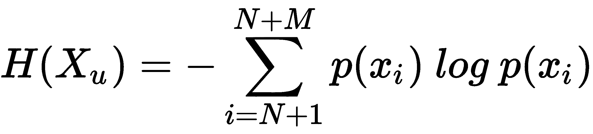

执行此计算的 Python 代码如下：

```py
Pu = np.linalg.solve(Luu, np.dot(Wul, Yl))
H = -np.sum(Pu * np.log(Pu + 1e-6))
```

为了避免概率为零时的数值问题，已经添加了`1e-6`这个项。对不同的值重复这个过程，我们可以找到一组候选值，可以通过直接评估标签准确性来限制为单个值（例如，当没有关于真实分布的精确信息时，可以考虑每个簇的连贯性和它们之间的分离）。另一种方法称为**类别重平衡**，它基于重新加权未标记样本的概率，以在将新的未标记样本添加到集合时重新平衡每个类别的点数。如果我们有*N*个标记点和*M*个未标记点，以及*K*个类别，类别*j*的权重因子*w[j]*可以表示为：

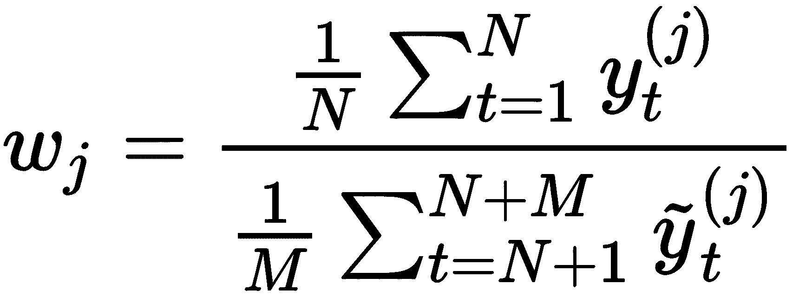

分子是对属于类别*k*的标记样本的平均值，而分母是对估计类别为*k*的未标记样本的平均值。关于类别的最终决定不再仅仅基于最高的概率，而是基于：

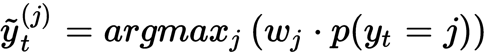

# 流形学习

在第二章《半监督学习导论》中，我们讨论了流形假设，即高维数据通常位于低维流形上。当然，这并不是一个定理，但在许多实际情况下，这个假设已被证明是正确的，并且它允许我们使用在其它情况下不可接受的非线性降维算法。在本节中，我们将分析一些这些算法。它们都已在 Scikit-Learn 中实现，因此使用复杂数据集尝试它们很容易。

# Isomap

**Isomap**是最简单的算法之一，它基于在尝试保留原始流形上测量的测地距离的同时降低维度的想法。该算法分为三个步骤。第一步是 k-最近邻聚类和以下图的构建。顶点将是样本，而边表示最近邻之间的连接，它们的权重与对应邻居的距离成正比。

第二步采用**Dijkstra 算法**计算所有样本对在图上的最短距离。在下面的图中，有一部分图，其中标记了一些最短距离：

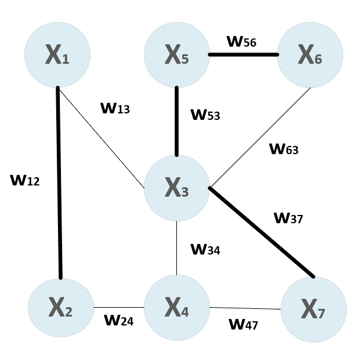

标记最短距离的图示例

例如，由于*x[3]*是*x[5]*和*x[7]*的邻居，应用 Dijkstra 算法，我们可以得到最短路径*d(x[3], x[5]) = w[53]*和*d(x[3], x[7]) = w[73]*。这一步骤的计算复杂度大约为*O(n²log n + n²k)*，当*k << n*（通常满足的条件）时，低于*O(n³)*；然而，对于大型图（*n >> 1*），这通常是整个算法中最昂贵的部分。

第三步被称为**度量多维尺度**，这是一种在尝试保留样本之间的内积的同时寻找低维表示的技术。如果我们有一个*P*维数据集*X*，算法必须找到一个*Q*维集合*Φ*，其中*Q < P*，以最小化以下函数：

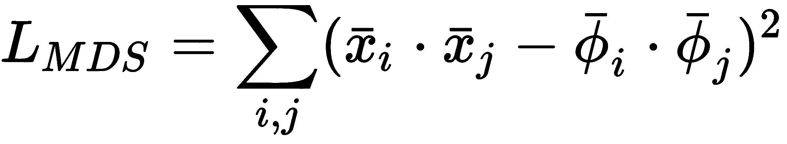

如在*Semi-Supervised Learning* *Chapelle O.*,* Schölkopf B.*, *Zien A.* (编辑)，*麻省理工学院出版社*中证明，优化是通过取 Gram 矩阵*G[ij] = x[i] · x*j*，则*G=XX^T*)的前*Q*个特征向量来实现的；然而，由于**Isomap**算法使用成对距离，我们需要计算平方距离矩阵*D*：

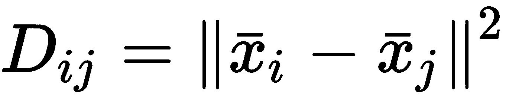

如果*X*数据集是零中心的，则可以从*D*中推导出一个简化的 Gram 矩阵，如 M. A. A. Cox 和 T. F. Cox 所述：

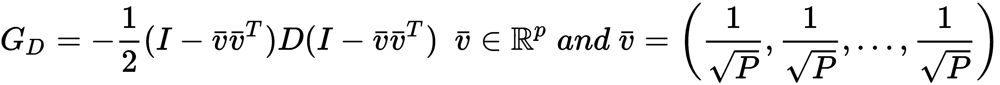

**Isomap** 计算出 *G[*D*] 的前 *Q* 个特征值 *λ[1]，λ2，...，λ[Q]* 和相应的特征向量 *ν[1]，ν[2]**，...，ν[Q]*，并确定 *Q*-维向量：

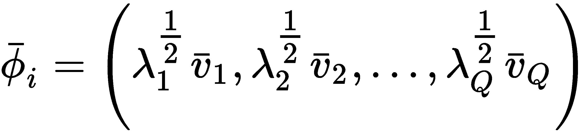

正如我们将在第五章 EM 算法和应用中讨论的（以及 Saul、Weinberger、Sha、Ham 和 Lee 在《降维的谱方法》*Spectral Methods for Dimensionality Reduction*，Saul L. K.、Weinberger K. Q.、Sha F.、Ham J.、Lee D. D. 指出的），这种投影也被主成分分析（**PCA**）所利用，它找出协方差矩阵的最高方差方向，对应于协方差矩阵的前 k 个特征向量。实际上，当对数据集 *X* 应用奇异值分解（SVD）时，我们得到：

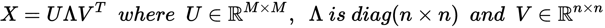

对角矩阵 *Λ* 包含了 *XX^T* 和 *X^TX* 的特征值；因此，*G* 的特征值 *λ[Gi]* 等于 *Mλ[^Σ][i]*，其中 *λ[^Σ]*[*i*] 是协方差矩阵 *Σ = M^(-1)X^TX* 的特征值。因此，Isomap 通过在由一组特征向量确定的子空间中投影数据集，尝试保留成对距离，从而实现降维，同时达到最大解释方差。从信息论的角度来看，这个条件保证了最小损失和有效的降维。

Scikit-Learn 还实现了 Floyd-Warshall 算法，它稍微慢一些。有关更多信息，请参阅 *算法导论*，Cormen T. H.、Leiserson C. E.、Rivest R. L.、MIT 出版社。

# Isomap 示例

我们现在可以使用 Olivetti 人脸数据集（由 AT&T 实验室，剑桥提供）测试 Scikit-Learn 的 **Isomap** 实现，该数据集由 400 个 64 × 64 灰度肖像组成，属于 40 个不同的人。这些图像的示例如下所示：

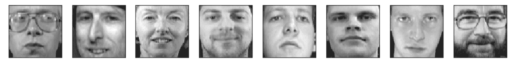

Olivetti 人脸数据集的子集

原始维度是 4096，但我们希望将数据集可视化在二维空间中。重要的是要理解，使用欧几里得距离来衡量图像的相似性可能不是最佳选择，而且令人惊讶的是，这些样本如何被这样一个简单的算法很好地聚类。

第一步是加载数据集：

```py
from sklearn.datasets import fetch_olivetti_faces

faces = fetch_olivetti_faces()
```

`faces` 字典包含三个主要元素：

+   `images`: 形状为 400 × 64 × 64 的图像数组

+   `data`: 形状为 400 × 4096 的展平数组

+   `target`: 形状为 400 × 1 的数组，包含标签（0, 39）

在这一点上，我们可以实例化 Scikit-Learn 提供的 `Isomap` 类，设置 `n_components=2` 和 `n_neighbors=5`（读者可以尝试不同的配置），然后拟合模型：

```py
from sklearn.manifold import Isomap

isomap = Isomap(n_neighbors=5, n_components=2)
X_isomap = isomap.fit_transform(faces['data'])
```

由于生成的包含 400 个元素的图非常密集，我更喜欢在下面的图中只展示前 100 个样本：

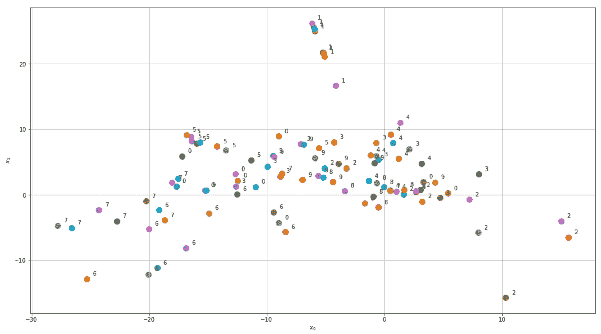

将 Isomap 应用于从 Olivetti 人脸数据集中抽取的 100 个样本

如所见，属于同一类的样本被分组在相当密集的聚团中。看起来分离得更好的类是 7 和 1。检查相应的面孔，对于第 7 类，我们得到：

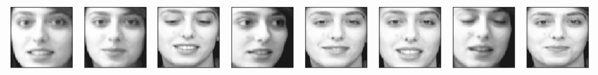

属于第 7 类的样本

该集合包含一位肤色白皙的年轻女性的肖像，与其他大多数人截然不同。而对于第 1 类，我们得到：

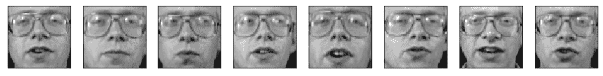

属于第 1 类的样本

在这种情况下，这是一个戴着大眼镜并且有特定嘴型表情的男人。在数据集中，只有少数人戴眼镜，其中一个人有浓密的胡须。我们可以得出结论，**Isomap**创建了一个与原始测地距离高度一致的低维表示。在某些情况下，存在部分聚类重叠，可以通过增加维度或采用更复杂的策略来缓解。

# 局部线性嵌入

与基于成对距离的 Isomap 相反，该算法基于这样一个假设：一个高维数据集位于光滑流形上，可以在降维过程中具有局部线性结构，它试图在降维过程中保持这些结构。**局部线性嵌入**（**LLE**），像 Isomap 一样，基于三个步骤。第一步是应用*k*最近邻算法来创建一个有向图（在 Isomap 中是未定向的），其中顶点是输入样本，边代表邻域关系。由于图是有向的，一个点*x[i]*可以是*x[j]*的邻居，但反之则不然。这意味着权重矩阵可以是不对称的。

第二步基于局部线性的主要假设。例如，考虑以下图：

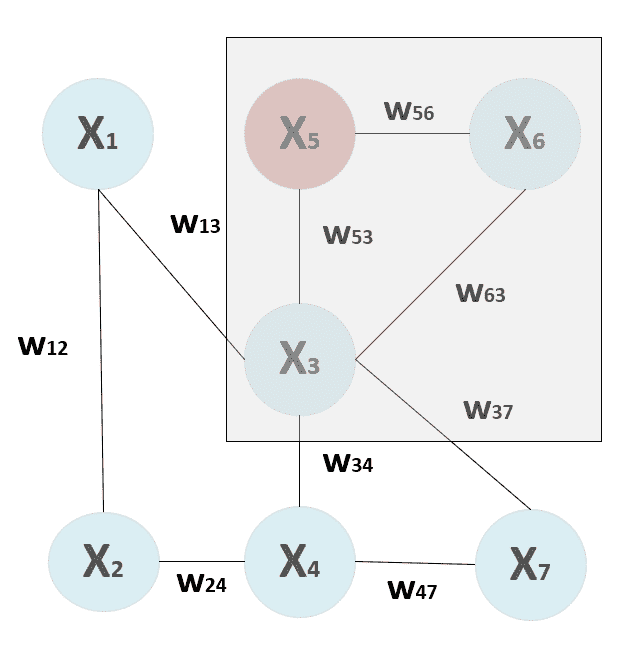

标记了邻域的阴影矩形图

矩形界定了一个小邻域。如果我们考虑点*x[5]*，局部线性假设允许我们认为*x[5] = w[56]x[6] + w[53]x[*3*, ]而不考虑循环关系。这个概念可以通过以下函数的最小化来形式化，对于所有*N* *P*-维度的点：

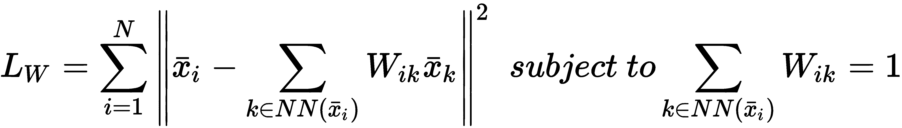

为了解决低秩邻域矩阵的问题（想想之前的例子，邻居的数量等于 20），Scikit-Learn 还实现了一个基于小任意加性常数的正则化器，该常数被添加到局部权重中（根据称为**修改后的 LLE**或**MLLE**的变体）*。在这一步结束时，将选择与邻居之间的线性关系匹配更好的矩阵 W，用于下一阶段。

在第三步中，局部线性嵌入试图确定最佳的低维（*Q < P*）表示，以最好地再现原始最近邻之间的关系。这是通过最小化以下函数来实现的：

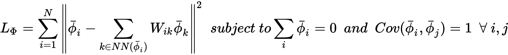

该问题的解是通过采用**Rayleigh-Ritz 方法**获得的，这是一种从非常大的稀疏矩阵中提取特征向量和特征值的算法。有关更多详细信息，请阅读*A spectrum slicing method for the Kohn–Sham problem, Schofield G. Chelikowsky J. R.; Saad Y., Computer Physics Communications. 183*。最终过程的初始部分包括确定矩阵*D*：

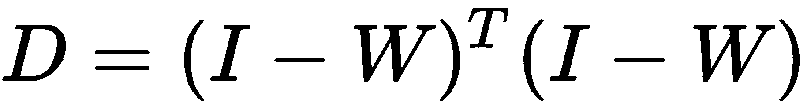

可以证明最后一个特征向量（如果特征值按降序排列，则是底部的一个）具有所有分量*v[1]^((N)), v[2]^((N))**, ..., v[N]^((N) )= v*，并且对应的特征值是零。正如 Saul 和 Roweis（*局部线性嵌入的介绍*，*Saul L. K.*，*Roweis S. T.*）所指出的，所有其他*Q*特征向量（从底部开始）是正交的，这使得它们可以具有零中心嵌入。因此，最后一个特征向量被舍弃，而剩余的 Q 个特征向量决定了嵌入向量*φ[i]*。

有关 MLLE 的更多详细信息，请参阅*MLLE：使用多个权重的改进局部线性嵌入*，*张 Z.*，*王 J.*，[`citeseerx.ist.psu.edu/viewdoc/summary?doi=10.1.1.70.382`](http://citeseerx.ist.psu.edu/viewdoc/summary?doi=10.1.1.70.382)。

# 局部线性嵌入的示例

我们现在可以将此算法应用于 Olivetti 人脸数据集，通过实例化 Scikit-Learn 类`LocallyLinearEmbedding`并设置`n_components=2`和`n_neighbors=15`：

```py
from sklearn.manifold import LocallyLinearEmbedding

lle = LocallyLinearEmbedding(n_neighbors=15, n_components=2)
X_lle = lle.fit_transform(faces['data'])
```

结果（限于前 100 个样本）如下所示：

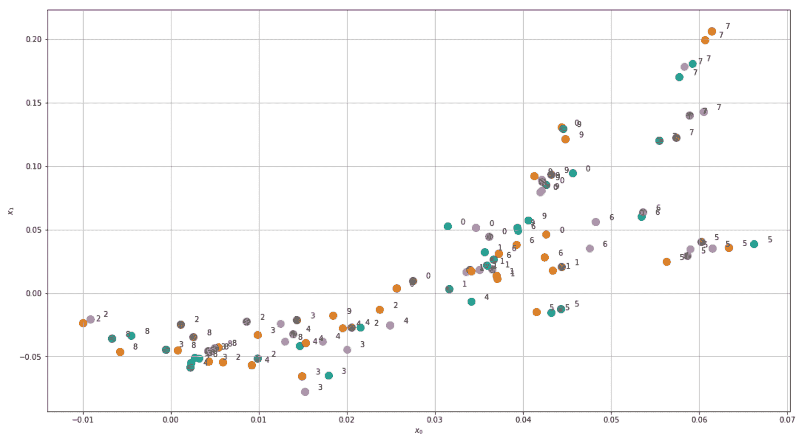

将局部线性嵌入应用于从 Olivetti 人脸数据集中抽取的 100 个样本

即使策略与 Isomap 不同，我们也可以确定一些有意义的聚类。在这种情况下，相似性是通过小线性块的结合获得的；对于人脸，它们可以代表特定的微观特征，如鼻子的形状或眼镜的存在，这些特征在不同的人像中保持不变。一般来说，当原始数据集本质上是局部线性的，可能位于光滑流形上时，LLE 更可取。换句话说，当样本的小部分以允许根据邻居和权重重建点的方式结构化时，LLE 是一个合理的选择。这通常适用于图像，但对于通用数据集来说可能很难确定。当结果不能再现原始聚类时，可以采用下一个算法或**t-SNE**，这是最先进的算法之一。

# 拉普拉斯谱嵌入

此算法基于图拉普拉斯算子的谱分解，旨在执行非线性降维，以尝试在将点重新映射到具有 *Q* 维（*Q < P*）子空间时保留 *P* 维流形上点的邻近性。

该过程与其他算法非常相似。第一步是 *k* 近邻聚类，以生成一个图，其中顶点（我们可以假设有 *N* 个元素）是样本，边使用径向基函数核进行加权：

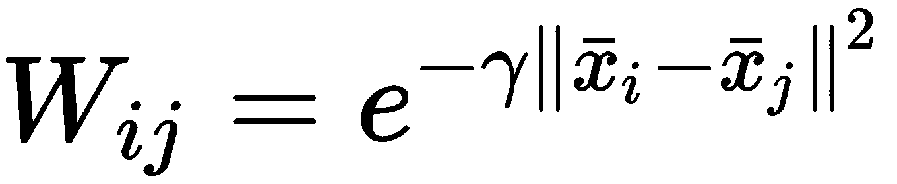

生成的图是无向和对称的。我们现在可以定义一个伪度矩阵 *D*：

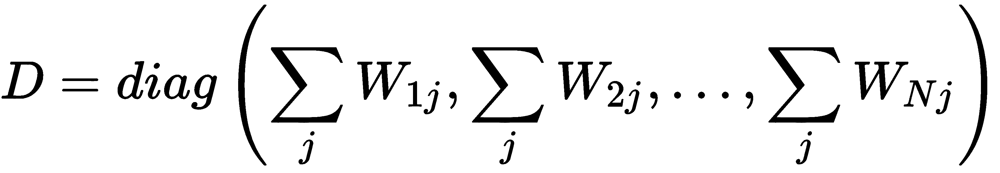

通过最小化以下函数获得低维表示 *Φ*：

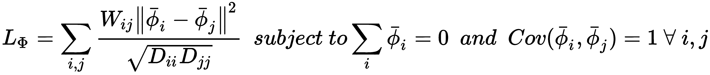

如果两个点 *x[i]* 和 *x[j]* 靠近，相应的 *W[ij]* 接近于 *1*，而当距离趋向于 *∞* 时，它趋向于 0。*D[ii]* 是从 *x[i]*（以及 *D[jj]* 同样）发出的所有权重的总和。现在，假设 *x[i]* 只非常接近于 *x[j]*，因此，为了近似 *D[ii] = D[jj] ≈ W[ij]*。得到的公式是基于向量 *φ[i]* 和 *φ[j]* 之间差异的平方损失。当需要考虑多个 *邻近性* 关系时，*W[ij]* 除以 *D[ii]D[jj]* 的平方根允许重新加权新距离，以找到整个数据集的最佳权衡。在实践中，*L[Φ]* 不是直接最小化的。事实上，可以证明最小值可以通过对称归一化图拉普拉斯算子的谱分解（该名称来源于此过程）来获得：

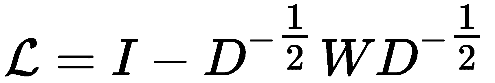

就像 LLE 算法一样，拉普拉斯谱嵌入也使用底部的 *Q + 1* 个特征向量。最后一步背后的数学理论始终基于应用 Rayleigh-Ritz 方法。最后一个被丢弃，剩下的 *Q* 确定了低维表示 *φ[i]*。

# 拉普拉斯谱嵌入的示例

让我们使用 Scikit-Learn 类 `SpectralEmbedding` 将此算法应用于相同的数据集，其中 `n_components=2` 和 `n_neighbors=15`：

```py
from sklearn.manifold import SpectralEmbedding

se = SpectralEmbedding(n_components=2, n_neighbors=15)
X_se = se.fit_transform(faces['data'])
```

由于存在高密度区域，以下图中显示了生成的图（已放大）：

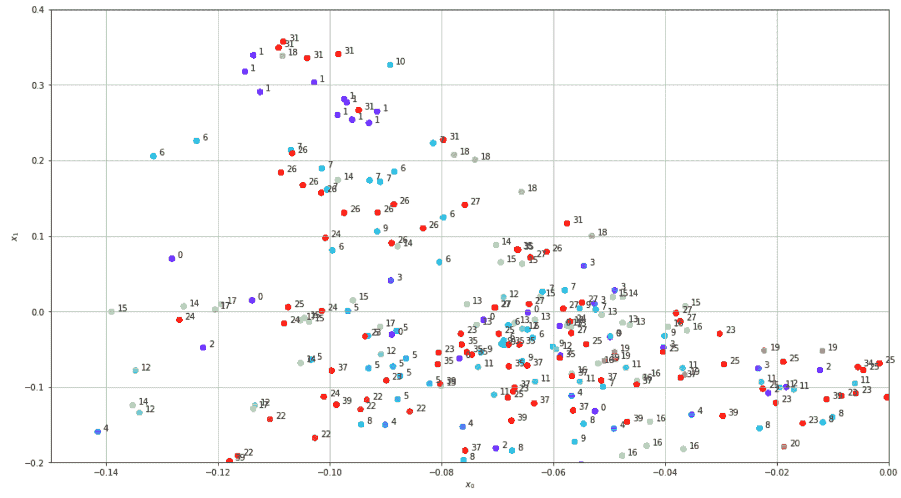

将拉普拉斯谱嵌入应用于奥利维蒂人脸数据集

即使在这种情况下，我们也可以看到一些类别被分组到小的簇中，但与此同时，我们观察到许多混合样本的聚集。这两种方法都使用局部信息片段，试图找到能够保留微特征几何结构的低维表示。这种条件导致了一种映射，其中接近的点*共享*局部特征（这在图像中几乎是总是成立的，但对于通用样本来说很难证明）。因此，我们可以观察到包含属于同一类别的元素的微小簇，但也存在一些*明显的*异常值，在原始流形上，即使它们共享局部*块*，也可能在全局上不同。相反，像 Isomap 或 t-SNE 这样的方法处理整个分布，并试图确定一个表示，该表示在考虑其全局属性的情况下几乎与原始数据集等距。

# t-SNE

这个算法由 Van der Mateen 和 Hinton 提出，正式称为**t 分布随机邻域嵌入**（**t-SNE**），是最强大的流形降维技术之一。与其他方法相反，这个算法从一个基本假设开始：两个*N*-维点*x[i]*和*x[j]*之间的相似性可以表示为条件概率*p(x[j]|x[i]*)，其中每个点由以*x[i]*为中心、方差*σ[i]*的高斯分布表示。方差是从所需的困惑度开始的，定义为：

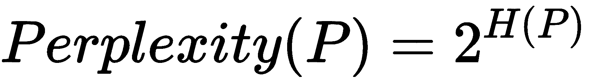

低困惑度值表示低不确定性，通常更可取。在常见的 t-SNE 任务中，*10÷50*范围内的值通常是可以接受的。

对条件概率的假设可以这样解释：如果两个样本非常相似，则与第二个样本相关的第一个样本的条件概率很高，而不同的点产生低条件概率。例如，考虑图像，瞳孔中心的一个点可以有睫毛属于的点作为邻居。在概率方面，我们可以认为*p(eyelash|pupil)*相当高，而*p(nose|pupil)*显然较低。t-SNE 将这些条件概率建模为：

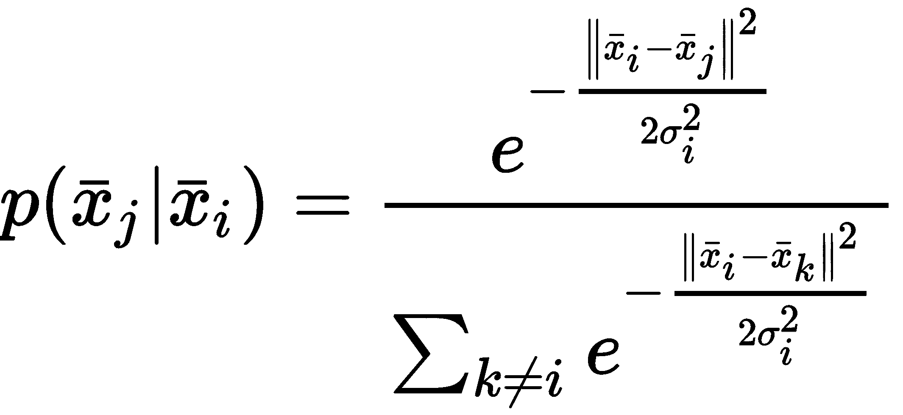

将*p(x[i]|x[i]**)*的概率设置为零，因此前面的公式可以扩展到整个图。为了更容易地解决这个问题，条件概率也被对称化：

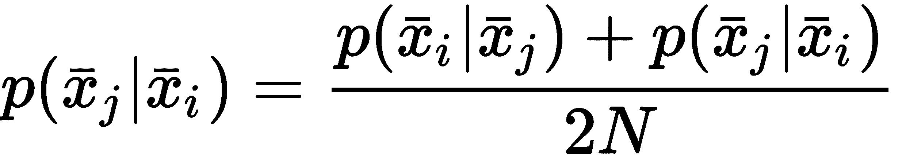

所获得的概率分布代表了高维输入关系。由于我们的目标是降低维度到一个值*M < N*，我们可以考虑对目标点*φ[i]*使用类似的概率表示，使用一个自由度为 1 的学生 t 分布：

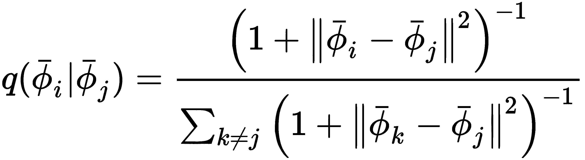

我们希望低维分布*Q*尽可能接近高维分布*P*；因此，**t-SNE**算法的目的是最小化*P*和*Q*之间的 Kullback-Leibler 散度：

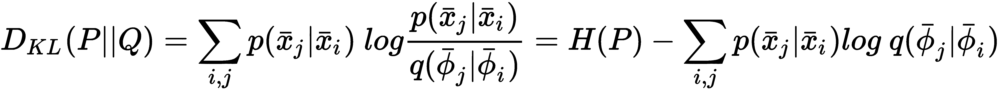

第一个项是原始分布*P*的熵，而第二个项是交叉熵*H(P, Q)*，必须最小化以解决问题。最佳方法基于梯度下降算法，但也有一些有用的变体可以在*《使用 t-SNE 可视化高维数据》*，*Van der Maaten L.J.P., Hinton G.E., Journal of Machine Learning Research 9 (Nov), 2008.*中讨论，以改善性能。

# t-distributed 随机邻域嵌入的示例

我们可以将这个强大的算法应用于相同的 Olivetti 面部数据集，使用 Scikit-Learn 类`TSNE`，`n_components=2`和`perplexity=20`：

```py
from sklearn.manifold import TSNE

tsne = TSNE(n_components=2, perplexity=20)
X_tsne = tsne.fit_transform(faces['data'])
```

所有 400 个样本的结果显示在下图中：

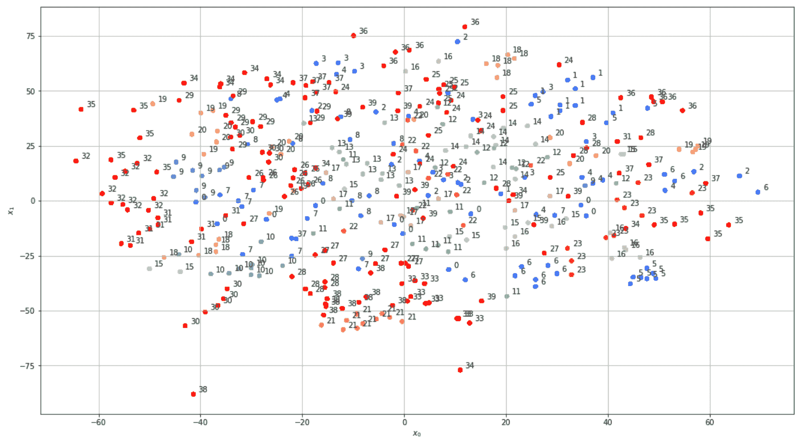

t-SNE 应用于 Olivetti 面部数据集

通过对标签分布的视觉检查可以确认，t-SNE 从原始高维分布重新创建了最佳聚类。此算法可用于多个非线性降维任务，例如图像、词嵌入或复杂特征向量。其主要优势在于考虑相似性为概率的假设，无需对成对距离施加任何约束，无论是全局的还是局部的。从某个角度来看，可以将 t-SNE 视为基于交叉熵成本函数的反向多类分类问题。我们的目标是给定原始分布和关于输出分布的假设，找到标签（低维表示）。

在这一点上，我们可以尝试回答一个自然的问题：必须使用哪种算法？显然的答案是这取决于单个问题。当需要降低维度，同时保留向量之间的全局相似性时（这是当样本是长特征向量且没有局部属性，如词嵌入或数据编码时的情况），t-SNE 或 Isomap 是不错的选择。当需要尽可能保持局部距离（例如，一个视觉块的结构，可以被属于不同类别的不同样本共享）与原始表示尽可能接近时，局部线性嵌入或谱嵌入算法更可取。

# 摘要

在本章中，我们介绍了最重要的标签传播技术。特别是，我们看到了如何基于加权核构建数据集图，以及如何使用未标记样本提供的几何信息来确定最可能的类别。基本方法通过迭代标签向量与权重矩阵的乘积，直到达到稳定点并证明，在简单假设下，这总是可能的。

另一种方法，由 Scikit-Learn 实现，基于从状态（由样本表示）到另一个状态的转换概率，直到收敛到一个标记点。概率矩阵通过使用归一化权重矩阵来获得，以鼓励与接近点相关的转换并阻止所有*长跳跃*。这两种方法的主要缺点是硬限制标记样本；如果我们*信任*我们的数据集，这个约束可能是有用的，但在存在标签错误分配的异常值的情况下，它可能是一个限制。

标签传播通过引入一个限制系数来解决此问题，该系数决定了限制标签的百分比。该算法与标签传播非常相似，但它基于图拉普拉斯，可以应用于所有那些数据生成分布未确定且噪声概率高的问题。

基于马尔可夫随机游走的传播是一个非常简单的算法，可以通过随机过程估计未标记样本的类别分布。可以想象它为一个*测试样本*在图中行走，直到它达到一个最终标记状态（获得相应的标签）。该算法非常快，并且有一个封闭形式的解，可以通过求解线性系统找到。

下一个主题是介绍使用 Isomap 算法的流形学习，这是一个基于使用*k*最近邻算法（这是大多数这些算法中的常见步骤）构建的图的一个简单但强大的解决方案。原始的成对距离通过多维尺度技术进行处理，这使得可以获得一个低维表示，其中样本之间的距离得到保留。

基于局部信息片段的两种不同方法，局部线性嵌入和拉普拉斯谱嵌入。前者试图保留原始流形中存在的局部线性，而后者，基于归一化图拉普拉斯的谱分解，试图保留原始样本的邻近性。这两种方法都适用于所有那些任务，在这些任务中，重要的是不要考虑整个原始分布，而是考虑由小数据*补丁*引起的相似性。

我们通过讨论 t-SNE 来结束这一章节，这是一个非常强大的算法，试图模拟一个尽可能接近原始高维分布的低维分布。这个任务是通过最小化两个分布之间的 Kullback-Leibler 散度来实现的。t-SNE 是一种最先进的算法，在需要考虑整个原始分布以及整个样本之间的相似性时非常有用。

在下一章（第四章），*贝叶斯网络和隐马尔可夫模型*中，我们将介绍在静态和动态环境下使用贝叶斯网络，以及隐马尔可夫模型，并附带实际预测示例。这些算法允许对由观测和潜在变量组成的复杂概率场景进行建模，并使用仅基于观测的优化采样方法来推断未来状态。
