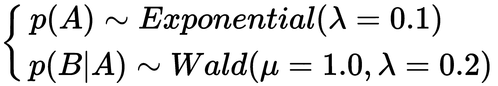

# 贝叶斯网络和隐马尔可夫模型

在本章中，我们将介绍贝叶斯模型的基本概念，这些概念允许在需要将不确定性作为系统结构部分考虑的多个场景中工作。讨论将集中在静态（时间不变）和动态方法，这些方法在必要时可以用来建模时间序列。

特别是，本章涵盖了以下主题：

+   贝叶斯定理及其应用

+   贝叶斯网络

+   使用直接方法和**马尔可夫链蒙特卡洛**（**MCMC**）（Gibbs 和 Metropolis-Hastings 采样器）从贝叶斯网络中采样

+   使用 PyMC3 建模贝叶斯网络

+   **隐马尔可夫模型**（**HMMs**）

+   使用 hmmlearn 的示例

# 条件概率和贝叶斯定理

如果我们有一个概率空间 *S* 和两个事件 *A* 和 *B*，事件 *A* 在给定 *B* 的概率被称为**条件概率**，其定义为：


由于 *P(A, B)* = *P(B, A)*，可以推导出**贝叶斯定理**：


这个定理允许将条件概率表示为对立概率和两个边缘概率 *P(A)* 和 *P(B)* 的函数。这个结果对于许多机器学习问题来说是基本的，因为我们将在本章和下一章中看到，通常更容易通过条件概率来获取对立概率，但直接从后者开始工作却很困难。这个定理的常见形式可以表示为：


假设我们需要估计给定一些观察结果 *B* 的事件 *A* 的概率，或者使用标准符号，**A 的后验概率**；前面的公式将这个值表示为与项 *P(A)* 成比例，这是 *A* 的边缘概率，称为**先验概率**，以及观察结果 *B* 在事件 *A* 给定下的条件概率。*P(B|A)* 被称为**似然函数**，它定义了事件 *A* 如何可能决定 *B*。因此，我们可以总结关系为*后验概率 ∝ 似然函数 · 先验概率*。比例不是一个限制，因为项 *P(B)* 总是一个归一化常数，可以省略。当然，读者必须记住归一化 *P(A|B)*，使其项总是加起来等于一。 

这是贝叶斯统计的一个关键概念，我们并不直接信任先验概率，而是使用某些观察结果的似然性重新加权。例如，我们可以考虑抛掷一枚硬币 10 次（事件 *A*）。我们知道，如果硬币是公平的，那么 *P(A) = 0.5*。如果我们想知道得到 10 个正面的概率是多少，我们可以使用二项分布得到 *P(10 heads) = 0.5^k*；然而，假设我们不知道硬币是否公平，但我们怀疑它可能被加载，先验概率 *P(Loaded) = 0.7* 有利于反面。我们可以使用指示函数定义一个完整的先验概率 *P(Coin status)*：


在 *P(Fair) = 0.5* 和 *P(Loaded) = 0.7* 的情况下，指示器 *I[Coin=Fair]* 仅在硬币是公平的情况下等于 1，否则为 0。当硬币是加重的，同样会发生 *I[Coin=Loaded]* 的情况。我们的目标现在是要确定后验概率 *P(Coin status|B[1], B[2], ..., **B[n])*，以便能够确认或拒绝我们的假设。

让我们假设观察 *n = 10* 个事件，其中 *B[1] = Head* 和 *B[2], ..., *B[n] = Tail*。我们可以使用二项分布来表示概率：


在简化表达式后，我们得到：


我们仍然需要通过将两个项都除以 0.083（两个项的和）来归一化，所以我们得到最终的后验概率 *P(Coin status|B[1], B[2], ..., **Bn) = 0.04I[Fair] + 0.96I[Loaded]*。这个结果证实并加强了我们的假设。由于在出现一个正面之后观察到连续九次反面，加重的硬币的概率现在约为 96%。

这个例子展示了如何将数据（观察结果）插入贝叶斯框架中。如果读者有兴趣更详细地研究这些概念，可以在 *《统计决策理论导论》*，作者 *Pratt J.*，*Raiffa H.*，*Schlaifer R.*，*麻省理工学院出版社* 中找到许多有趣的例子和解释；然而，在介绍贝叶斯网络之前，定义两个其他基本概念是有用的。

第一个概念被称为 **条件独立性**，可以通过考虑两个变量 *A* 和 *B* 来形式化，这两个变量依赖于第三个变量 *C*。我们说，在给定 *C* 的条件下，*A* 和 *B* 是条件独立的，如果：


现在，让我们假设我们有一个事件 *A*，它依赖于一系列原因 *C[1], C[2], ..., C[n]*；因此，条件概率是 *P(A|C[1], C[2], ..., C[n])*。应用贝叶斯定理，我们得到：


如果存在条件独立性，前面的表达式可以简化并重新写为：


这个属性在朴素贝叶斯分类器中是基本的，我们假设原因产生的效果不会影响其他原因。例如，在垃圾邮件检测器中，我们可以说邮件的长度和某些特定关键词的存在是独立事件，我们只需要计算 *P(Length|Spam)* 和 *P(Keywords|Spam)*，而不需要考虑联合概率 *P(Length, Keywords|Spam)*。

另一个重要元素是概率的 **链式法则**。假设我们有一个联合概率 *P(X[1], X[2], ..., X[n])*。它可以表示为：


重复使用右侧联合概率的步骤，我们得到：


以这种方式，我们可以将完整的联合概率表示为分层条件概率的乘积，直到最后一个项，它是一个边缘分布。在下一段探索贝叶斯网络时，我们将广泛使用这个概念。

# 贝叶斯网络

**贝叶斯网络** 是一个由直接无环图 *G = {V, E}* 表示的概率模型，其中顶点是随机变量 *X[i]*，边确定它们之间的条件依赖关系。在下面的图中，有一个包含四个变量的简单贝叶斯网络的例子：


贝叶斯网络示例

变量 *x[4]* 依赖于 *x[3]*，而 *x[3]* 依赖于 *x[1]* 和 *x[2]*。为了描述这个网络，我们需要边缘概率 *P(x[1])* 和 *P(x[2])* 以及条件概率 *P(x[3]|x[1],x[2])* 和 *P(x[4]|x[3])*。实际上，使用链式法则，我们可以推导出完整的联合概率如下：


之前的表达式展示了一个重要的概念：由于图是直接且无环的，每个变量在给定其前驱的情况下，条件独立于所有其他非后继变量。为了形式化这个概念，我们可以定义函数 *Predecessors(x[i])*，该函数返回直接影响 *x[i]* 的节点集合，例如，*Predecessors(x[3]) = {x[1],x[2]}*（我们使用小写字母，但考虑的是随机变量，而不是样本）。使用这个函数，我们可以为具有 *N* 个节点的贝叶斯网络的完整联合概率写出一个通用表达式：


构建贝叶斯网络的一般程序应该始终从第一个原因开始，逐个添加它们的效果，直到最后将节点插入到图中。如果不遵守此规则，生成的图可能包含无用的关系，这会增加模型的复杂性。例如，如果 *x[4]* 间接由 *x[1]* 和 *x[2]* 导致，因此添加边 *x[1] → x[4]* 和 *x[2] → x[4]* 可能看起来是一个好的建模选择；然而，我们知道对 *x[4]* 的最终影响仅由 *x*[*3*, ]的值决定，其概率必须根据 *x[1]* 和 *x[2]* 进行条件化，因此我们可以删除虚假的边。我建议阅读 *《统计决策理论导论》，作者：Pratt J.，Raiffa H.，Schlaifer R.，麻省理工学院出版社*，以了解在此过程中应采用许多最佳实践。

# 从贝叶斯网络中采样

在贝叶斯网络上进行直接推理可能是一个非常复杂的操作，当变量和边的数量很高时。因此，已经提出了几种采样方法。在本段中，我们将展示如何使用直接方法从网络中确定全联合概率采样，以及两种 MCMC 算法。

让我们从之前的网络开始考虑，为了简化，我们假设只有 *伯努利* 分布。变量 *X[1]* 和 *X[2]* 被建模为：


条件分布 *X[3]* 定义为：


当条件分布 *X[4]* 定义为：


我们现在可以使用直接采样来估计使用之前引入的链式法则的全联合概率 *P(x[1], x[2], x[3], x[4]*)。

# 直接采样

使用 **直接采样**，我们的目标是通过对每个条件分布抽取的样本序列来近似全联合概率。如果我们假设图结构良好（没有不必要的边）并且有 *N* 个变量，算法由以下步骤组成：

1.  初始化变量 *N[Samples]*。

1.  初始化一个形状为 *(N, N[Samples]*) 的向量 *S*。

1.  初始化一个频率向量 *F[Samples]*，其形状为 *(N, N[Samples]*)。在 Python 中，最好使用一个字典，其中键是组合 *(x[1], x[2], x[3], ..., x[N]*)。

1.  对于 *t=1* 到 *N[Samples]*：

    1.  对于 *i=1* 到 *N*：

        1.  从 *P(X[i]|Predecessors(X[i]))* 中采样

        1.  将样本存储在 *S[i, t]*

    1.  如果 *F[Samples]* 包含采样的元组 *S[:, t]*：

        1.  **F[Samples][S[:, t]] += 1**

    1.  否则：

        1.  *F[Samples][**S[:, t]] = 1*（这两个操作在 Python 字典中都是立即完成的）

1.  创建一个形状为 *(**N, 1)* 的向量 *P[Sampled]*。

1.  将 *P[Sampled][i, 0] = F[Samples][**i]/N* 设置。

从数学观点来看，我们首先创建一个频率向量 *FSamples，然后我们考虑 *N[Samples] → ∞* 来近似全联合概率：


# 直接采样的例子

现在，我们可以用 Python 实现这个算法。让我们首先定义使用 NumPy 函数 `np.random.binomial(1, p)` 的样本方法，该函数从概率为 `p` 的**伯努利分布**中抽取样本：

```py
import numpy as np

def X1_sample(p=0.35):
    return np.random.binomial(1, p)

def X2_sample(p=0.65):
    return np.random.binomial(1, p)

def X3_sample(x1, x2, p1=0.75, p2=0.4):
    if x1 == 1 and x2 == 1:
        return np.random.binomial(1, p1)
    else:
        return np.random.binomial(1, p2)

def X4_sample(x3, p1=0.65, p2=0.5):
    if x3 == 1:
        return np.random.binomial(1, p1)
    else:
        return np.random.binomial(1, p2)
```

在这一点上，我们可以实现主循环。由于变量是布尔值，所以概率总数为 16，因此我们将`Nsamples`设置为`5000`（较小的值也可以接受）：

```py
N = 4
Nsamples = 5000

S = np.zeros((N, Nsamples))
Fsamples = {}

for t in range(Nsamples):
    x1 = X1_sample()
    x2 = X2_sample()
    x3 = X3_sample(x1, x2)
    x4 = X4_sample(x3)

    sample = (x1, x2, x3, x4)

    if sample in Fsamples:
        Fsamples[sample] += 1
    else:
        Fsamples[sample] = 1
```

当采样完成时，可以提取完整的联合概率：

```py
samples = np.array(list(Fsamples.keys()), dtype=np.bool_)
probabilities = np.array(list(Fsamples.values()), dtype=np.float64) / Nsamples

for i in range(len(samples)):
    print('P{} = {}'.format(samples[i], probabilities[i]))

P[ True False  True  True] = 0.0286
P[ True  True False  True] = 0.024
P[ True  True  True False] = 0.06
P[False False False False] = 0.0708
P[ True False  True False] = 0.0166
P[False  True  True  True] = 0.1006
P[False False  True  True] = 0.054
...
```

我们还可以查询模型。例如，我们可能对 *P(X[4]=True)* 感兴趣。我们可以通过查找所有 *X[4]=True* 的元素，并求和相应的概率来实现这一点：

```py
p4t = np.argwhere(samples[:, 3]==True)
print(np.sum(probabilities[p4t]))

0.5622
```

这个值与 *X[4]* 的定义是一致的，*X[4]* 总是 *p >= 0.5*。读者可以尝试更改值并重复模拟。

# 马尔可夫链的温和介绍

为了讨论 MCMC 算法，有必要引入马尔可夫链的概念。实际上，虽然直接采样方法无序地抽取样本，但 MCMC 策略根据从样本到下一个样本的精确转移概率抽取一系列样本。

让我们考虑一个时间相关的随机变量 *X(t)*，并假设一个离散的时间序列 **X[1]**, **X[2]**, ..., **X[t]**, **X[t+1]**, ... 其中 **X[t]** 表示在时间 *t* 时的取值。在以下图中，有这个序列的示意图：


通用马尔可夫链的结构

我们可以假设有 *N* 个不同的状态 *s[i]* 对于 *i=1..N*，因此可以考虑到概率 *P(X[t]=s[i]|X[t-1]=s[j], ..., X[1]=s[p])*。如果 *X(t)* 被定义为**一阶马尔可夫过程**，则：


换句话说，在马尔可夫过程中（从现在起，我们省略**一阶**，即使在某些情况下考虑更多先前状态是有用的），*X(t)* 处于某个状态的概率只取决于前一时间瞬间所假设的状态。因此，我们可以为每一对 *i*，*j* 定义一个**转移概率**：


考虑所有对 *(i, j)*，也可以构建一个转移概率矩阵 *T(i, j) = P(i → j)*。使用标准符号，*X[t]=s[i]* 的边缘概率定义为：


在这一点上，很容易证明（**查普曼-科尔莫哥洛夫方程**）：


在前面的表达式中，为了计算 *πi*，我们需要对所有可能的前一个状态进行求和，考虑相对转移概率。这个操作可以用矩阵形式重写，使用包含所有状态的向量 *π(t)* 和转移概率矩阵 *T*（大写上标 *T* 表示矩阵是转置的）。链的演变可以通过递归计算：


对于我们的目的来说，考虑能够达到 *stationary distribution* *π[s]* 的马尔可夫链是很重要的：


换句话说，状态不依赖于初始条件 *π(1)*，并且它不再能够改变。如果基础马尔可夫过程是 *ergodic* 的，那么稳态分布是唯一的。这个概念意味着，如果平均时间（这通常是不可能的）或垂直平均（冻结时间）在状态上（在大多数情况下这更简单），过程具有相同的属性。

马尔可夫链的遍历过程由两个条件保证。第一个条件是所有状态都是非周期的，这意味着不可能找到一个正数 *p*，使得链在经过等于 *p* 的倍数个瞬间后回到相同的状态序列。第二个条件是所有状态都必须是正 recurrent 的：这意味着，给定一个随机变量 *N[instants]**(i)*，描述了返回到状态 *s[i]* 所需的时间瞬间数，*EN[instants] < ∞*；因此，理论上，所有状态都可以在有限的时间内重新访问。

我们需要遍历性条件，以及因此存在唯一稳态分布的原因，是因为我们正在考虑将采样过程建模为马尔可夫链，其中下一个值是根据当前状态采样的。从一个状态到另一个状态的转换是为了找到更好的样本，正如我们将在 Metropolis-Hastings 采样器中看到的那样，我们也可以选择拒绝一个样本并保持链处于相同的状态。因此，我们需要确保算法收敛到唯一的稳定分布（该分布近似于我们的贝叶斯网络的真实完整联合分布）。可以证明，如果：


前面的方程被称为详细平衡，它意味着链的可逆性。直观地说，这意味着链处于状态 *A* 的概率乘以转移到状态 *B* 的概率等于链处于状态 *B* 的概率乘以转移到 *A* 的概率。

对于我们将要讨论的两种方法，可以证明它们满足上述条件，因此它们的收敛性得到保证。

# 吉布斯抽样

假设我们想要获得贝叶斯网络 *P(x[1], x[2], x[3], ..., x[N]**) 的完整联合概率；然而，变量的数量很大，无法以封闭形式轻松解决这个问题。此外，想象一下，如果我们想得到一些边缘分布，例如 *P(x[2])*，但为了做到这一点，我们需要对整个联合概率进行积分，这项任务甚至更难。吉布斯抽样允许通过迭代过程近似所有边缘分布。如果我们有 *N* 个变量，算法按照以下步骤进行：

1.  初始化变量 *N[迭代次数]*

1.  初始化一个形状为 *(N, N[迭代次数])* 的向量 *S*

1.  随机初始化 *x[1]^((0)), x[2]^((0)), ..., x[N]^((0))* (上标索引指的是迭代次数)

1.  对于 *t=1* 到 *N[迭代次数]*：

    1.  从 *p(x[1]|x[2]^((t-1)), x[3]^((t-1)), ..., x[N]^((t-1)))* 中采样 *x[1]^((t))* 并将其存储在 *S[0, t]*

    1.  从 *p(**x[2]|x[1]^((t)), x[3]^((t-1)), ..., x[N]^((t-1))**)* 中采样 *x[2]^((t))* 并将其存储在 *S[1, t]*

    1.  从 *p(**x[3]|x[1]^((t)), x[2]^((t)), ..., x[N]^((t-1))**)* 中采样 *x[3]^((t))* 并将其存储在 *S[2, t]*

    1.  ...

    1.  从 *p(**x[N]|x[1]^((t)), x[2]^((t)), ..., x[N-1]^((t))**)* 中采样 *x[N]^((t))* 并将其存储在 *S[N-1, t]*

迭代结束时，向量 *S* 将包含每个分布的 *N*[*迭代次数*] 个样本。由于我们需要确定概率，因此有必要像直接采样算法那样进行操作，计算单次出现的次数，并通过除以 *N[迭代次数]* 进行归一化。如果变量是连续的，可以考虑区间，计算每个区间包含的样本数量。

对于小型网络，此过程与直接采样非常相似，但是当处理非常大的网络时，采样过程可能会变得缓慢；然而，在引入 *X[i]* 的马尔可夫层概念之后，算法可以简化。马尔可夫层是 *X[i]* 的前驱、后继及其后继的前驱的随机变量集合（在某些书中，他们使用术语 *父母* 和 *子女*）。在贝叶斯网络中，变量 *X[i]* 在其马尔可夫层给定条件下与所有其他变量条件独立。因此，如果我们定义函数 *MB(X[i])*，它返回层中的变量集合，则通用采样步骤可以重写为 *p(x[i]|MB(X[i]))*，并且不再需要考虑所有其他变量。

为了理解这个概念，让我们考虑以下图中显示的网络：


吉布斯抽样的贝叶斯网络示例

马尔可夫层包括：

+   *MB(X[1])* = *{ X[2], X[3] }*

+   *MB(X[2])* = *{ X[1, ]X[3], X[4] }*

+   *MB(X[3])* = *{ X[1, ]X[2], X[4], X[5] }*

+   *MB(X[4])* = *{ X[3] }*

+   *MB(X[5])* = *{ X[3] }*

+   *MB(X[6])* = *{ X[2] }*

通常情况下，如果 *N* 非常大，那么 *|MB(X[i])|* 的基数远小于 *N*，从而简化了过程（*vanilla* 吉布斯采样需要对每个变量有 *N-1* 个条件）。我们可以证明吉布斯采样生成的样本来自一个处于详细平衡状态的马尔可夫链：


因此，该过程收敛到唯一的平稳分布。这个算法相当简单；然而，其性能并不出色，因为随机游走没有被调整以探索状态空间中的正确区域，在这些区域找到好样本的概率很高。此外，轨迹也可能返回到不良状态，从而减慢整个过程。一个替代方案（也被 PyMC3 用于连续随机变量）是 **No-U-Turn** 算法，我们在这本书中不讨论。对这一主题感兴趣的读者可以在 *The No-U-Turn Sampler: Adaptively Setting Path Lengths in Hamiltonian Monte Carlo* 一书中找到完整的描述，作者为 *Hoffmann M. D.*，*Gelman A.*，*arXiv:1111.4246*。

# Metropolis-Hastings 采样

我们已经看到，当变量数量很大时，贝叶斯网络的完整联合概率分布 *P(x[1], x[2], x[3], ..., x[N]*) 可能变得难以处理。当需要对其进行边缘化以获得，例如，*P(x[i]*) 时，问题可能变得更加困难，因为这需要积分一个非常复杂的功能。在简单情况下应用贝叶斯定理时也会出现相同的问题。假设我们有表达式 *p(A|B) = K · P(B|A)P(A)*。我明确地插入了归一化常数 *K*，因为我们知道它，我们可以立即获得后验概率；然而，通常需要找到它需要积分 *P(B|A)P(A)*，而这个操作可能是无法用封闭形式表示的。

Metropolis-Hastings 算法可以帮助我们解决这个问题。让我们想象一下，我们需要从 *P(x[1], x[2], x[3], ..., x[N]*) 中采样，但我们只知道这个分布直到归一化常数，所以 *P(x[1], x[2], x[3], ..., x[N]) ∝ g(x[1], x[2], x[3], ..., x[N]*)。为了简化，从现在开始我们将所有变量合并成一个单向量，所以 *P(x) ∝ g(x)*。

让我们再取另一个分布*q(x'|x^((i-1)))*，这被称为**候选生成分布**。对这个选择没有特别的限制，只需*q*易于采样即可。在某些情况下，*q*可以选择与目标分布*p(x)*非常相似的功能，而在其他情况下，可以使用均值为*x^((i-1))*的正态分布。正如我们将要看到的，这个函数充当提议生成器，但我们没有义务接受从这个分布中抽取的所有样本，因此，可以采用具有相同*P(X)*域的任何分布。当一个样本被接受时，马尔可夫链过渡到下一个状态，否则它保持在当前状态。这个决策过程基于采样器必须探索最重要的状态空间区域并丢弃那些找到好样本概率低的区域的观点。

算法按照以下步骤进行：

1.  初始化变量*N[迭代]*

1.  随机初始化*x^((0))*

1.  对于*t=1*到*N[迭代]*：

    1.  从*q(x'|x^((i-1)))*中抽取候选样本*x'*

    1.  计算以下值：

    1.  如果*α ≥ 1*：

        1.  接受样本*x^((t)) = x'*

    1.  否则如果*0 < α < 1*：

        1.  以概率*α*接受样本*x^((t)) = x'*；或者

        1.  以概率*1 - α*拒绝样本*x'*，设置*x^((t)) = x^((t-1))*

可以证明（证明将省略，但可在*马尔可夫链蒙特卡洛和 Gibbs 抽样，**Walsh B.，EEB 596z 课程讲义**）Metropolis-Hastings 算法的转移概率满足详细平衡方程，因此算法收敛到真实的后验分布。

# Metropolis-Hastings 采样示例

我们可以将此算法实现为找到给定*P(B|A)*和*P(A)*的乘积的后验分布*P(A|B)*，而不考虑需要复杂积分的归一化常数。

假设：



因此，得到的*g(x)*是：


为了解决这个问题，我们采用随机游走 Metropolis-Hastings 方法，该方法包括选择*q ∼ 正态分布(μ=x^((t-1)))*. 这个选择允许简化值*α*，因为两个项*q(x^((t-1))|x')*和*q(x'|x^((t-1)))*是相等的（多亏了通过*x[mean]*的垂直轴的对称性）并且可以相互抵消，所以*α*变成了*g(x')*和*g(x^((t-1)))*的比值。

第一件事是定义函数：

```py
import numpy as np

def prior(x):
    return 0.1 * np.exp(-0.1 * x)

def likelihood(x):
    a = np.sqrt(0.2 / (2.0 * np.pi * np.power(x, 3)))
    b = - (0.2 * np.power(x - 1.0, 2)) / (2.0 * x)
    return a * np.exp(b)

def g(x):
    return likelihood(x) * prior(x)

def q(xp):
    return np.random.normal(xp)
```

现在，我们可以开始我们的采样过程，使用 100,000 次迭代和*x^((0)) = 1.0*：

```py
nb_iterations = 100000
x = 1.0
samples = []

for i in range(nb_iterations):
    xc = q(x)

    alpha = g(xc) / g(x)
    if np.isnan(alpha):
        continue

    if alpha >= 1:
        samples.append(xc)
        x = xc
    else:
        if np.random.uniform(0.0, 1.0) < alpha:
            samples.append(xc)
            x = xc
```

为了得到后验分布的表示，我们需要通过 NumPy 函数`np.histogram()`创建一个直方图，该函数接受一个值数组以及所需的区间数（`bins`）；在我们的情况下，我们设置了`100`个区间：

```py
hist, _ = np.histogram(samples, bins=100)
hist_p = hist / len(samples)
```

*p(x)*的结果图示如下：


抽样概率密度函数

# 使用 PyMC3 的抽样示例

**PyMC3**是一个强大的 Python 贝叶斯框架，它依赖于 Theano 来执行高速计算（有关安装说明，请参阅本段末尾的信息框）。它实现了所有最重要的连续和离散分布，并主要使用 No-U-Turn 和 Metropolis-Hastings 算法进行抽样过程。有关 API（分布、函数和绘图实用工具）的所有详细信息，我建议访问文档主页[`docs.pymc.io/index.html`](http://docs.pymc.io/index.html)，在那里还可以找到一些非常直观的教程。

我们想要模拟和仿真的例子基于以下场景：从伦敦到罗马的每日航班有一个预定起飞时间为午夜 12:00，标准飞行时间为两小时。我们需要组织目的地机场的运营，但我们不希望在飞机尚未降落之前分配资源。因此，我们希望使用贝叶斯网络来模拟这个过程，并考虑一些可能影响到达时间的常见因素。特别是，我们知道登机过程可能会比预期更长，以及加油过程，即使它们是并行进行的。伦敦空中交通管制也可以造成延误，当飞机接近罗马时也可能发生同样的情况。我们还知道，恶劣天气的存在可能会因为路线改变而造成另一个延误。我们可以用以下图表总结这个分析：


表示空中交通管制问题的贝叶斯网络

考虑到我们的经验，我们决定使用以下分布来模拟随机变量：

+   *乘客登机∼Wald(μ=0.5, λ=0.2)*

+   *加油∼Wald(μ=0.25, λ=0.5)*

+   *出发交通延误∼Wald(μ=0.1, λ=0.2)*

+   *到达交通延误∼Wald(μ=0.1, λ=0.2)*

+   *出发时间 = 12 + 出发交通延误 + max(乘客登机, 加油)*

+   *恶劣天气∼伯努利(p=0.35)*

+   *飞行时间∼指数(λ=0.5 - (0.1 · 恶劣天气))(伯努利分布的输出为*0*或*1*，分别对应 False 和 True)*

+   *到达时间 = 出发时间 + 飞行时间 + 到达交通延误*

概率密度函数如下：


`出发时间`和`到达时间`是随机变量的函数，`飞行时间`的参数λ也是`恶劣天气`的函数。

即使模型不是很复杂，直接的推理效率也相当低，因此我们希望使用 PyMC3 来模拟这个过程。

第一步是创建一个`model`实例：

```py
import pymc3 as pm

 model = pm.Model()
```

从现在开始，所有操作都必须使用由`model`变量提供的上下文管理器来执行。我们现在可以设置贝叶斯网络的所有随机变量：

```py
import pymc3.distributions.continuous as pmc
import pymc3.distributions.discrete as pmd
import pymc3.math as pmm

with model:
    passenger_onboarding = pmc.Wald('Passenger Onboarding', mu=0.5, lam=0.2)
    refueling = pmc.Wald('Refueling', mu=0.25, lam=0.5)
    departure_traffic_delay = pmc.Wald('Departure Traffic Delay', mu=0.1, lam=0.2)

    departure_time = pm.Deterministic('Departure Time', 
                                      12.0 + departure_traffic_delay + 
                                      pmm.switch(passenger_onboarding >= refueling, 
                                                 passenger_onboarding, 
                                                 refueling))

    rough_weather = pmd.Bernoulli('Rough Weather', p=0.35)

    flight_time = pmc.Exponential('Flight Time', lam=0.5 - (0.1 * rough_weather))
    arrival_traffic_delay = pmc.Wald('Arrival Traffic Delay', mu=0.1, lam=0.2)

    arrival_time = pm.Deterministic('Arrival time', 
                                    departure_time + 
                                    flight_time + 
                                    arrival_traffic_delay)
```

我们导入了两个命名空间，`pymc3.distributions.continuous`和`pymc3.distributions.discrete`，因为我们正在使用这两种类型的变量。Wald 和指数是连续分布，而`Bernoulli`是离散的。在前三行中，我们声明了变量`passenger_onboarding`、`refueling`和`departure_traffic_delay`。结构始终相同：我们需要指定对应于所需分布的类，传递变量的名称和所有必需的参数。

`departure_time`变量被声明为`pm.Deterministic`。在 PyMC3 中，这意味着一旦所有随机元素都已设置，其值就完全确定。实际上，如果我们从`departure_traffic_delay`、`passenger_onboarding`和`refueling`中采样，我们将得到`departure_time`的确定值。在这个声明中，我们还使用了实用函数`pmm.switch`，它根据其第一个参数进行二进制选择（例如，如果*A > B*，则返回*A*，否则返回*B*）。

其他变量非常相似，除了`flight_time`，它是一个具有参数*λ*的指数变量，*λ*是另一个变量（`rough_weather`）的函数。作为一个伯努利变量，以概率*p*输出*1*，以概率*1 - p*输出*0*，当有恶劣天气时，*λ = 0.4*，否则为*0.5*。

一旦模型设置完成，就可以通过采样过程对其进行模拟。PyMC3 会根据变量的类型自动选择最佳采样器。由于模型并不复杂，我们可以将过程限制在`500`个样本：

```py
nb_samples = 500

with model:
    samples = pm.sample(draws=nb_samples, random_seed=1000)
```

可以使用内置的`pm.traceplot()`函数分析输出，该函数为每个样本的变量生成图表。以下图表显示了其中一个的详细情况：


到达时间随机变量的分布和样本

右列显示了为随机变量（在这种情况下，到达时间）生成的样本，而左列显示了相对频率。这个图可以用来验证我们的初步想法；实际上，到达时间的大部分质量集中在 14:00 到 16:00（数字总是十进制，因此需要将时间转换为十进制）；然而，我们应该进行积分以得到概率。相反，通过`pm.summary()`函数，PyMC3 提供了一个统计摘要，可以帮助我们做出正确的决策。以下代码片段显示了单个变量的摘要输出：

```py
pm.summary(samples)

...

Arrival time:

  Mean             SD               MC Error         95% HPD interval
  -------------------------------------------------------------------

  15.174           2.670            0.102            [12.174, 20.484]

  Posterior quantiles:
  2.5            25             50             75             97.5
  |--------------|==============|==============|--------------|

  12.492         13.459         14.419         16.073         22.557
```

对于每个变量，它包含均值、标准差、蒙特卡洛误差、95%最高后验密度区间和后验分位数。在我们的案例中，我们知道飞机将在大约 15:10（`15.174`）着陆。

这只是一个非常简单的例子，用以展示贝叶斯网络的强大功能。为了深入了解，我建议阅读《统计决策理论导论》，作者 *Pratt J.*，*Raiffa H.*，*Schlaifer R.*，由 *MIT Press* 出版，其中可以研究这本书范围之外的多种贝叶斯应用。

PyMC3 ([`docs.pymc.io/index.html`](http://docs.pymc.io/index.html)) 可以使用 `pip install -U pymc3` 命令安装。由于它需要 Theano（会自动安装），还需要提供一个 C/C++ 编译器。我建议使用 Anaconda ([`www.anaconda.com/download/`](https://www.anaconda.com/download/)) 这样的发行版，它允许通过 `conda install -c anaconda mingw` 命令安装 MinGW。对于任何问题，您可以在网站上找到详细的安装说明。有关如何配置 Theano 以支持 GPU（默认安装基于 CPU NumPy 算法）的更多信息，请访问此页面：[`deeplearning.net/software/theano/`](http://deeplearning.net/software/theano/)。

# 隐藏马尔可夫模型 (HMMs)

让我们考虑一个可以假设 *N* 个不同状态的随机过程 *X(t)*：*s[1]*，*s[2]*，...，*s[N]*，具有一阶马尔可夫链动力学。我们还假设我们无法观察到 *X(t)* 的状态，但我们有权访问另一个与 *X(t)* 相连的过程 *O(t)*，它产生可观察的输出（通常称为 **发射**）。这个结果过程被称为 **隐藏马尔可夫模型**（**HMM**），其通用架构如下图所示：


通用隐藏马尔可夫模型的结构

对于每个隐藏状态 *s[i]*，我们需要定义一个转移概率 *P(i → j)*，如果变量是离散的，通常表示为一个矩阵。对于马尔可夫假设，我们有：


此外，给定一个观察序列 *o[1]*，*o[2]*，...，*o[M]*，我们还假设以下关于 **发射概率** 独立性的假设：


换句话说，观察值 *o[i]*（在这种情况下，我们指的是时间 *i* 时的值）的概率仅由时间 *i* 的隐藏变量状态 *x[i]* 决定。传统上，第一个状态 *x[0]* 和最后一个状态 *x[Ending]* 从不发射，因此所有序列都从索引 *1* 开始，并以一个对应最终状态的超时间步结束。

HMMs 可以应用于所有那些无法测量系统状态（我们只能将其建模为具有已知转移概率的随机变量）但可以访问与其相关的数据的情境。一个例子可以是一个由大量部件组成的复杂引擎。我们可以定义一些内部状态并学习一个转移概率矩阵（我们将学习如何做到这一点），但我们只能接收由特定传感器提供的测量值。

有时，即使不是非常现实，但将马尔可夫假设和发射概率独立性包含到我们的模型中是有用的。后者可以这样证明：我们可以采样所有对应于精确状态的*峰值*发射，由于随机过程*O(t)*隐式地依赖于*X(t)*，将其视为*X(t)*的*追逐者*是合情合理的。

如果这些过程要么是自然的一阶马尔可夫过程，要么状态包含所有用于证明转移所需的历史，那么马尔可夫假设对许多现实生活中的过程成立。换句话说，在许多情况下，如果状态是*A*，那么会转移到*B*，最终转移到*C*。我们假设当在*C*时，系统从包含*A*提供部分信息的*(B)*状态移动过来。

例如，如果我们正在填充一个水箱，我们可以在时间*t*，*t+1*，...测量水平（我们系统的状态）。由于我们没有稳定器，我们将水流建模为随机变量，我们可以找到水在时间*t*达到一定水平*p(L[t]=x|L[t-1])*的概率。当然，对所有先前状态进行条件化是没有意义的，因为如果水平在时间 t-1 是，例如，80 米，那么确定时间*t*时新水平（状态）的概率所需的所有信息已经包含在这个状态（80 米）中。

在这个阶段，我们可以开始分析如何训练一个隐马尔可夫模型，以及如何根据一系列观察值确定最可能的隐藏状态。为了简化，我们称*A*为转移概率矩阵，而*B*为包含所有*P(o[i]|x[t])*的矩阵。该模型可以通过这些元素的知识来确定：*HMM = { A, B }*。

# 前向-后向算法

**前向-后向算法**是一种简单但有效的方法，用于根据一系列观察值*o[1], o[2], ..., o[t]*找到转移概率矩阵*T*。第一步被称为*前向阶段*，包括确定一系列观察值的概率*P(o[1], o[2], ..., o[序列长度]|A, B)*。如果我们需要知道序列的似然性，这部分信息可以直接使用，并且与*后向阶段*一起，可以用来估计潜在 HMM 的结构(*A*和*B*)。

这两种算法都是基于动态规划的概念，即将复杂问题分解为可以轻松解决的子问题，并以递归/迭代的方式重用这些解决方案来解决更复杂的步骤。有关此方面的更多信息，请参阅 *《动态规划与马尔可夫过程》，作者：Ronald A. Howard，麻省理工学院出版社*。

# 前向阶段

如果我们将 *p[ij]* 称为转移概率 *P(i → j)*，我们定义一个考虑以下概率的递归过程：


变量 *f[t]^i* 表示 HMM 在 *t* 次观察（从 *1* 到 *t*）后处于状态 *i*（在时间 *t*）的概率。考虑到 HMM 的假设，我们可以断言 *f[t]*^(*i* )依赖于所有可能的 *f[t-1]^j*。更精确地说，我们有：


通过这个过程，我们考虑 HMM 可以在时间 *t-1*（即前 *t-1* 次观察）达到任何状态，并以概率 *p[ji]* 转移到时间 *t* 的状态 *i*。我们还需要考虑最终状态 *o[t]* 在每个可能的前一状态下的发射概率。

对于定义，初始状态和结束状态不产生输出。这意味着我们可以将任何观察序列写成 *0, o[1], o[2], ..., o[Sequence Length], 0*，其中第一个和最后一个值是空的。该过程从计算时间 *1* 的前向消息开始：


必须也要考虑非发射的结束状态：


这里对最后一个状态 *x*[*Ending* ]的表达式解释为在 *A* 和 *B* 矩阵中结束状态的索引。例如，我们表示 *p[ij]* 为 *A[i, j]*，意味着从状态 *x[t] = i* 到状态 *x[t+1] = j* 的一般时间瞬间的转移概率。同样，*p[i][Ending]* 表示为 *A[i, x[Ending]]*，意味着从倒数第二个状态 *x[Sequence Length-1] = i* 到结束状态 *x[Sequence Length] = Ending State* 的转移概率。

因此，前向算法可以总结为以下步骤（我们假设有 *N* 个状态，因此我们需要考虑初始和结束状态，需要分配 *N+2* 个位置）：

1.  初始化形状为 (*N + 2*, *Sequence Length*) 的 *Forward* 向量。

1.  初始化形状为 (*N, N*) 的 *A*（转移概率矩阵）。每个元素是 *P(x[i]|x[j]**)*。

1.  初始化形状为 (*Sequence Length*, *N*) 的 *B*。每个元素是 *P(o[i]|x[j]**)*。

1.  对于 *i=1* 到 *N*：

    1.  将 *Forward[i, 1]* = *A[0, i] · B[1, i]*

1.  对于 *t=2* 到 *Sequence Length-1*：

    1.  对于 *i=1* 到 *N*：

        1.  将 *S = 0*

    1.  对于 *j=1* 到 *N*：

        1.  将 *S = S + Forward[j, t-1] · A[j, i] · B[t, i]*

    1.  将 *Forward[i, t] = S* 设置为

1.  将 *S = 0*。

1.  对于 *i=1* 到 *N*：

    1.  将 *S = S + Forward[i, Sequence Length] · A[i, x[Ending]]* 设置为

1.  将 *Forward[x[Ending], Sequence Length] = S* 设置为

现在应该很清楚，**正向**这个名字来源于将信息从前一步传播到下一步，直到结束状态（该状态不产生输出）的过程。

# 向后阶段

在 **向后阶段**，我们需要计算在时间 *t* 的状态为 *i* 的条件下，从时间 *t+1* 开始的序列的概率：o[t+1], o[t+2], ..., o[Sequence Length]。就像我们之前所做的那样，我们定义以下概率：


向后算法与正向算法非常相似，但在这个情况下，我们需要朝相反的方向移动，假设我们知道在时间 *t* 的状态是 *i*。首先考虑的状态是最后一个状态 *x[Ending]*，它不产生输出，就像初始状态一样；因此我们有：


我们使用初始状态终止递归：


步骤如下：

1.  使用形状为 *(N + 2, Sequence Length)* 的向量 *Backward* 进行初始化。

1.  使用形状为 *(N, N)* 的 *A*（转移概率矩阵）进行初始化。每个元素是 *P(x[i]|x[j]*)*。

1.  使用形状为 *(Sequence Length, N)* 的 *B* 进行初始化。每个元素是 *P(o[i]|x[j]*)*。

1.  对于 *i=1* 到 *N*：

    1.  将 *Backward[x[Endind], Sequence Length] = A[i, x[Endind]]*。

1.  对于 *t=Sequence Length-1* 到 *1*：

    1.  对于 *i=1* 到 *N*：

        1.  将 *S = 0*。

        1.  对于 *j=1* 到 *N*：

            1.  将 *S = S + Backward[j, t+1] · A[j, i] · B[t+1, i]*

        1.  将 *Backward[i, t] = S*。

1.  将 *S = 0*。

1.  对于 *i=1* 到 *N*：

    1.  将 *S = S + Backward[i, 1] · A[0, i] · B[1, i]*。

1.  将 *Backward[0, 1] = S*。

# HMM 参数估计

现在我们已经定义了正向和向后算法，我们可以使用它们来估计潜在 HMM 的结构。该过程是期望最大化算法的应用，将在下一章（第五章，*EM 算法及其应用*）中讨论，其目标可以概括为定义我们如何估计 *A* 和 *B* 的值。如果我们定义 *N(i, j)* 为从状态 *i* 到状态 *j* 的转移次数，以及 *N(i)* 为从状态 *i* 的总转移次数，我们可以用以下方式近似转移概率 *P(i → j)*：


同样，如果我们定义 *M(i, p)* 为在状态 *i* 中观察到发射 *o[p]* 的次数，我们可以用以下方式近似发射概率 *P(o[p]|x[i])*：


让我们从转移概率矩阵 *A* 的估计开始。如果我们考虑在给定观察结果的情况下，HMM 在时间 *t* 处于状态 *i*，在时间 *t+1* 处于状态 *j* 的概率，我们有：


我们可以使用前向和后向算法来计算这个概率，给定一系列观测值 *o[1], o[2], ..., o[Sequence Length]*。实际上，我们可以使用前向消息 *f[t]^i*，它是 HMM 在 *t* 次观测后处于状态 *i* 的概率，以及后向消息 *b[t+1]^j*，它是给定 HMM 在时间 *t+1* 处于状态 *j* 时，从时间 *t+1* 开始的序列 *o[t+1], o[t+1], ..., o[Sequence Length]* 的概率。当然，我们还需要包括发射概率和转移概率 *p[ij]*，这是我们正在估计的。实际上，算法从随机假设开始，迭代直到 *A* 的值变得稳定。时间 *t* 处的估计 *α[ij]* 等于：


在这个背景下，我们省略了完整的证明，因为它很复杂；然而，读者可以在 *《隐马尔可夫模型及其在语音识别中的应用教程》，Rabiner L. R.，IEEE 77.2 会议论文* 中找到它。

为了计算发射概率，从时间 *t* 处处于状态 *i* 给定观测值序列的概率开始计算更容易：


在这种情况下，计算是立即的，因为我们可以在同一时间 *t* 和状态 *i* 计算前向和后向消息（记住，考虑到观测值，后向消息是条件于 *x[t] = i* 的，而前向消息计算观测值与 *x[t] = i* 联合的概率。因此，乘法是时间 *t* 处处于状态 *i* 的未归一化概率）。因此，我们有：


正则化常数的证明可以在上述论文中找到。现在我们可以将这些表达式插入到 *a[ij]* 和 *b[ip]* 的估计中：


在第二个公式的分子中，我们采用了指示函数（当条件为真时为 *1*，否则为 *0*）来限制仅在那些元素为 *o[t] = p* 的位置求和。在一个迭代 *k* 中，*p[ij]* 是在先前迭代 *k-1* 中找到的估计值 *a[ij]*。

算法基于以下步骤：

1.  随机初始化矩阵 *A* 和 *B*

1.  初始化一个容差变量 *Tol*（例如，*Tol = 0.001*）

1.  当 *Norm(A^k - A^(k-1)) > Tol* 和 *Norm(B^k - B^(k-1)**) > Tol* （*k* 是迭代索引）时：

    1.  对于 *t=1* 到 *Sequence Length-1*：

        1.  对于 *i=1* 到 *N*：

            1.  对于 *j=1* 到 *N*：

                1.  计算 *α^t*[*ij*]

            1.  计算 *β^t[i]*

    1.  计算估计的 *a[ij]* 和 *b[ip]* 并将它们存储在 *A^k*

或者，可以固定迭代次数，尽管最佳解决方案是同时使用容差和最大迭代次数，以便在满足第一个条件时终止过程。

# 使用 hmmlearn 的 HMM 训练示例

对于这个例子，我们将使用 hmmlearn，这是一个用于 HMM 计算的包（有关更多详细信息，请参阅本节末尾的信息框）。为了简单起见，让我们考虑关于贝叶斯网络的段落中讨论的机场示例，并假设我们有一个代表天气（当然，这并不是一个真正的隐藏变量！）的单个隐藏变量，它被建模为具有两个成分（好和差）的多项式分布。

我们观察我们的航班伦敦-罗马的到达时间（这部分取决于天气条件），并希望训练一个 HMM 来推断未来状态并计算对应给定序列的隐藏状态的后验概率。

我们的示例架构如下所示：


用于天气-到达延误问题的 HMM

让我们先定义我们的观测向量。由于我们有两个状态，其值将是 `0` 和 `1`。让我们假设 `0` 表示**准时**，而 `1` 表示**延误**：

```py
import numpy as np

observations = np.array([[0], [1], [1], [0], [1], [1], [1], [0], [1], 
                         [0], [0], [0], [1], [0], [1], [1], [0], [1], 
                         [0], [0], [1], [0], [1], [0], [0], [0], [1], 
                         [0], [1], [0], [1], [0], [0], [0], [0], [0]], dtype=np.int32)
```

我们有 35 个连续的观测值，其值要么是 `0` 要么是 `1`。

为了构建 HMM，我们将使用 `MultinomialHMM` 类，参数为 `n_components=2`、`n_iter=100` 和 `random_state=1000`（始终使用相同的种子以避免结果差异是很重要的）。迭代次数有时很难确定；因此，hmmlearn 提供了一个名为 `ConvergenceMonitor` 的实用工具类，可以检查算法是否已成功收敛。

现在我们可以使用 `fit()` 方法来训练我们的模型，将观测列表（数组必须是始终具有形状 *序列长度 × N[组件]* 的二维数组）作为参数传递：

```py
from hmmlearn import hmm

hmm_model = hmm.MultinomialHMM(n_components=2, n_iter=100, random_state=1000)
hmm_model.fit(observations)

print(hmm_model.monitor_.converged)
True
```

该过程非常快，监控器（作为实例变量 `monitor` 可用）已确认收敛。如果模型非常大且需要重新训练，也可以检查 `n_iter` 的较小值）。一旦模型训练完成，我们就可以立即可视化转换概率矩阵，该矩阵作为实例变量 `transmat_` 可用：

```py
print(hmm_model.transmat_)

[[ 0.0025384   0.9974616 ]
 [ 0.69191905  0.30808095]]
```

我们可以将这些值解释为从 `0`（好天气）转换到 `1`（恶劣天气）的概率比相反的概率更高（*p[01]* 接近 *1*），并且更有可能保持在状态 `1` 而不是状态 `0`（*p[00]* 几乎为零）。我们可以推断出观测值是在冬季期间收集的！在下一段解释维特比算法之后，我们还可以检查，给定一些观测值，最可能的隐藏状态序列是什么。

hmmlearn ([`hmmlearn.readthedocs.io/en/latest/index.html`](http://hmmlearn.readthedocs.io/en/latest/index.html)) 是一个最初被构建为 Scikit-Learn 一部分的框架。它支持多项式和高斯 HMM，并允许使用最常用的算法进行训练和推断。可以使用 `pip install hmmlearn` 命令进行安装。

# 维特比算法

**维特比算法**是 HMM 中最常见的解码算法之一。其目标是找到与一系列观察相对应的最可能的隐藏状态序列。其结构与前向算法非常相似，但该算法不是计算与最后一个时间点状态联合的观察序列的概率，而是寻找：


变量 *v[t]^i* 表示给定观察序列与 *x[t] = i* 联合的最大概率，考虑到所有可能的隐藏状态路径（从时间点 *1* 到 *t-1*）。我们可以通过评估所有 *v[t-1]^j* 乘以相应的转移概率 *p[ji]* 和发射概率 *P(o[t]|x[i])* 来递归地计算 *v[t]^i*，并且总是选择 *j* 的所有可能值的最大值：


算法基于回溯方法，使用一个回溯指针 *bp[t]^i*，其递归表达式与 *v[t]^i* 相同，但用 *argmax* 函数代替 *max*：


因此，*bp[t]*^(*i* )代表最大化 *v[t]^i* 的部分隐藏状态序列 *x**[1], x[2], ..., x*[*t-1* ]。在递归过程中，我们逐个添加时间步，因此之前的路径可能会被最后一个观察所无效化。这就是为什么我们需要回溯部分结果并替换时间 *t* 时不再最大化 *v[t+1]^i* 的序列。

算法基于以下步骤（与其他情况一样，初始状态和结束状态不产生输出）：

1.  初始化一个形状为 *(N + 2, 序列长度)* 的向量 *V*。

1.  初始化一个形状为 *(N + 2, 序列长度)* 的向量 *BP*。

1.  初始化 *A*（转移概率矩阵）的形状为 *(N, N)*。每个元素是 *P(x[i]|x[j]**)*。

1.  初始化 *B*（发射概率矩阵）的形状为 *(序列长度, N)*。每个元素是 *P(o[i]|x[j]**)*。

1.  对于 *i=1* 到 *N*：

    1.  设置 *V[i, 1]* = *A[i, 0] **· B[1, i]*

    1.  *BP[i, 1]* = Null（或任何其他不能解释为状态的值）

1.  对于 *t=1* 到 *序列长度*：

    1.  对于 *i=1* 到 *N*：

        1.  设置 *V[i, t] = max[j] V[j, t-1] · A[j, i] · B[t, i]*

        1.  设置 *BP[i, t] = argmax[j] V[j, t-1] · A[j, i] · B[t, i]*

1.  设置 *V[x[Endind], 序列长度] = max[j] V[j, 序列长度] **· A[j, x[Endind]]*。

1.  设置 *BP**[x[Endind], 序列长度] = argmax[j] V[j, 序列长度] **· A[j, x[Endind]]*。

1.  反转 *BP*。

维特比算法的输出是一个元组，包含最可能的序列 *BP* 和相应的概率 *V*。

# 使用 hmmlearn 寻找最可能的隐藏状态序列

在这个阶段，我们可以继续使用之前的例子，使用我们的模型来找到给定一组可能观察到的最可能的隐藏状态序列。我们可以使用`decode()`方法或`predict()`方法。第一个返回整个序列的对数概率以及序列本身；然而，它们都默认使用维特比算法作为解码器：

```py
sequence = np.array([[1], [1], [1], [0], [1], [1], [1], [0], [1], 
                     [0], [1], [0], [1], [0], [1], [1], [0], [1], 
                     [1], [0], [1], [0], [1], [0], [1], [0], [1], 
                     [1], [1], [0], [0], [1], [1], [0], [1], [1]], dtype=np.int32)

lp, hs = hmm_model.decode(sequence)

print(hs)
[0 1 1 0 1 1 1 0 1 0 1 0 1 0 1 1 0 1 1 0 1 0 1 0 1 0 1 1 1 1 0 1 1 0 1 1]

print(lp)
-30.489992468878615
```

序列与转移概率矩阵一致；事实上，持续恶劣天气（`1`）的可能性比相反的可能性更大。因此，从`1`到 X 的转移比从`0`到`1`的转移可能性更小。状态的选择是通过选择最高概率来进行的；然而，在某些情况下，差异很小（在我们的例子中，可能会出现*p = [0.49, 0.51]*，这意味着存在高误差的可能性），因此检查序列中所有状态的后验概率是有用的：

```py
pp = hmm_model.predict_proba(sequence)
print(pp)

[[  1.00000000e+00   5.05351938e-19]
 [  3.76687160e-05   9.99962331e-01]
 [  1.31242036e-03   9.98687580e-01]
 [  9.60384736e-01   3.96152641e-02]
 [  1.27156616e-03   9.98728434e-01]
 [  3.21353749e-02   9.67864625e-01]
 [  1.23481962e-03   9.98765180e-01]

...
```

在我们的情况下，有几个状态的概率为*p ∼ [0.495, 0.505]*，因此即使输出状态是*1*（恶劣天气），考虑观察到良好天气的适度概率也是有用的。一般来说，如果一个序列与之前学习（或手动输入）的转移概率一致，那么这些情况并不常见。我建议尝试不同的配置和观察序列，并评估*最奇怪*情况（如零秒序列）的概率。在那个点上，可以重新训练模型并重新检查新证据是否已被正确处理。

# 摘要

在本章中，我们介绍了贝叶斯网络，描述了它们的结构和关系。我们看到了如何构建一个网络来模拟一个概率场景，其中某些元素可以影响其他元素的概率。我们还描述了如何使用最常见的采样方法来获得完整的联合概率，这些方法通过近似可以降低计算复杂度。

最常见的采样方法属于 MCMC 算法家族，这些算法将从一个样本到另一个样本的转移概率建模为一阶马尔可夫链。特别是，吉布斯采样基于这样的假设：从条件分布中采样比直接处理完整联合概率要容易。这种方法很容易实现，但它有一些性能上的缺点，可以通过采用更复杂的策略来避免。相反，Metropolis-Hastings 采样器使用候选生成分布和接受或拒绝样本的标准。两种方法都满足详细平衡方程，这保证了收敛（基础马尔可夫链将达到唯一的平稳分布）。

在本章的最后部分，我们介绍了隐马尔可夫模型（HMMs），它允许根据一系列隐藏状态对应的观察值来建模时间序列。实际上，这类模型的主要概念是存在不可观测的状态，这些状态会影响特定观察值的发射（该观察值是可观测的）。我们已经讨论了主要假设以及如何构建、训练和从模型中进行推断。特别是，当需要学习转移概率矩阵和发射概率时，可以使用前向-后向算法；而维特比算法则用于在给定一系列连续观察值的情况下找到最可能的隐藏状态序列。

在下一章，第五章，*期望最大化算法及其应用*中，我们将简要讨论期望最大化算法，重点关注基于**最大似然估计（MLE**）方法的一些重要应用。
