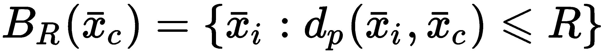
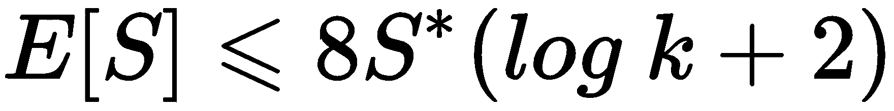

# 聚类算法

在本章中，我们将介绍一些基本的聚类算法，讨论它们的优点和缺点。无监督学习领域，以及任何其他机器学习方法，都必须始终基于奥卡姆剃刀的概念。当性能满足要求时，必须始终优先考虑简单性。然而，在这种情况下，真实情况可能是未知的。当采用聚类算法作为探索性工具时，我们只能假设数据集代表一个精确的数据生成过程。如果这个假设是正确的，最佳策略是确定簇的数量以最大化内部凝聚力（密度）和外部分离。这意味着我们期望找到具有一些共同和部分独特特征的团块（或岛屿）。

尤其是我们要介绍的一些算法是：

+   **基于 KD 树和球树的 k-最近邻算法**（**KNN**）

+   K-means 和 K-means++

+   模糊 C 均值

+   基于 Shi-Malik 算法的谱聚类

# k-最近邻

此算法属于一个称为**基于实例**的特定家族（该方法称为**基于实例学习**）。它与其他方法的不同之处在于它不使用实际的数学模型。相反，推理是通过直接比较新样本与现有样本（定义为实例）来进行的。KNN 是一种可以轻松应用于解决聚类、分类和回归问题的方法（即使在这种情况下，我们只考虑第一种技术）。聚类算法背后的主要思想非常简单。让我们考虑一个数据生成过程*p[data]*和从这个分布中抽取的有限数据集：


每个样本具有等于*N*的维度。我们现在可以引入一个距离函数*d(x[1], x[2])**，在大多数情况下，它可以被 Minkowski 距离泛化：


当*p = 2*时，*d[p]*代表经典的欧几里得距离，这通常是默认选择。在特定情况下，使用其他变体可能是有用的，例如*p = 1*（这是曼哈顿距离）或*p > 2*。即使度量函数的所有属性保持不变，不同的*p*值会产生语义上不同的结果。例如，我们可以考虑点*x[1] = (0, 0)*和*x[2] = (15, 10)*作为*p*的函数的距离：


(0, 0)和(15, 10)之间的 Minkowski 距离作为参数 p 的函数

距离随着 *p* 的增加单调递减，并收敛到最大成分绝对差，*|x[1]^((j)) - x[2]^((j))|*，当 *p → ∞* 时。因此，为了保持一致的距离度量，在所有成分上施加相同的权重非常重要，因此较小的 *p* 值更可取（例如，*p=1* 或 *2*）。这一结果已经被 Aggarwal、Hinneburg 和 Keim 在 *On the Surprising Behavior of Distance Metrics in High Dimensional Space*（Aggarwal C. C.，Hinneburg A.，Keim D. A.，ICDT 2001）一文中研究并形式化，他们证明了基本的不等式。如果我们考虑一个由 *M* 个点 *x[i] ∈ (0, 1)^d* 组成的通用分布 *G*，一个基于 *L[p]* 范数的距离函数，以及两个点 *x[j]* 和 *x[k]* 之间的最大 *D[max]^p* 和最小 *D[min]^p* 距离（使用 *L*[*p*] 范数计算），这两个点从 *G* 和 *(0, 0)* 中抽取，以下不等式成立：


很明显，当输入维度非常高且 *p >> 2* 时，期望值 *E[D[max]^p - D[min]^p]* 介于两个常数 *k[1] (C[p]d^(1/p-1/2))* 和 *k[2] ((M-1)C[p]d^(1/p-1/2)) → 0* 之间，这几乎消除了任何距离的实际影响。实际上，给定从 *G* 中抽取的两个通用点对 *(x[1], x[2])* 和 *(x[3], x[4])*，以下不等式的自然结果是，当 *p → ∞* 时，*dp ≈ dp，而不论它们的相对位置如何。这一重要结果证实了根据数据集的维度选择正确度量的重要性，并且当 *d >> 1* 时，*p = 1* 是最佳选择，而 *p >> 1* 由于度量的无效性可能会产生不一致的结果。为了直接证实这一现象，可以运行以下代码片段，该片段计算了包含从均匀分布 *G ∼ U(0, 1)* 中抽取的 `100` 个样本的 `100` 个集合之间最大和最小距离的平均差异。在该片段中，分析了 `d=2`、`100`、`1000` 的情况，使用 Minkowski 度量，`P` 分别为 `1`、`2`、`10`、`100`（最终值取决于随机种子和实验重复的次数）：

```py
import numpy as np

from scipy.spatial.distance import pdist

nb_samples = 100
nb_bins = 100

def max_min_mean(p=1.0, d=2):
    Xs = np.random.uniform(0.0, 1.0, size=(nb_bins, nb_samples, d))

    pd_max = np.zeros(shape=(nb_bins, ))
    pd_min = np.zeros(shape=(nb_bins, ))

    for i in range(nb_bins):
        pd = pdist(Xs[i], metric='minkowski', p=p)
        pd_max[i] = np.max(pd)
        pd_min[i] = np.min(pd)

    return np.mean(pd_max - pd_min)

print('P=1 -> {}'.format(max_min_mean(p=1.0)))
print('P=2 -> {}'.format(max_min_mean(p=2.0)))
print('P=10 -> {}'.format(max_min_mean(p=10.0)))
print('P=100 -> {}'.format(max_min_mean(p=100.0)))

P=1 -> 1.79302317381
P=2 -> 1.27290283592
P=10 -> 0.989257369005
P=100 -> 0.983016242436

print('P=1 -> {}'.format(max_min_mean(p=1.0, d=100)))
print('P=2 -> {}'.format(max_min_mean(p=2.0, d=100)))
print('P=10 -> {}'.format(max_min_mean(p=10.0, d=100)))
print('P=100 -> {}'.format(max_min_mean(p=100.0, d=100)))

P=1 -> 17.1916057948
P=2 -> 1.76155714836
P=10 -> 0.340453945928
P=100 -> 0.288625281313

print('P=1 -> {}'.format(max_min_mean(p=1.0, d=1000)))
print('P=2 -> {}'.format(max_min_mean(p=2.0, d=1000)))
print('P=10 -> {}'.format(max_min_mean(p=10.0, d=1000)))
print('P=100 -> {}'.format(max_min_mean(p=100.0, d=1000)))

P=1 -> 55.2865105705
P=2 -> 1.77098913218
P=10 -> 0.130444336657
P=100 -> 0.0925427145923
```

一个特殊情况，即前述不等式的直接结果是，当组件之间最大的绝对差异决定了距离的最重要因素时，可以采用大的 *p* 值。例如，如果我们考虑三个点，*x[1]* = (0, 0)，*x[2]* = (15, 10)，和 *x[3]* = (15, 0)，则 *d2 ≈ 18* 和 *d2 = 15*。因此，如果我们设置一个以 *x[1]* 为中心的阈值 *d = 16*，则 *x[2]* 在边界之外。如果 *p = 15*，两个距离都接近 *15*，两个点 (*x[2]* 和 *x[3]*) 在边界内。当需要考虑组件之间的不均匀性时，大 *p* 值的特定用途。例如，一些特征向量可以表示一组人的年龄和身高。考虑一个测试人员 *x = (30, 175)*，在大的 *p* 值下，*x* 与两个样本 *(35, 150)* 和 *(25, 151)* 之间的距离几乎相同（大约 *25.0*），唯一的决定性因素成为身高差异（独立于年龄）。

KNN 算法确定每个训练点的 *k* 个最近样本。当呈现新样本时，会重复执行此过程，有两种可能的变体：

+   在预定义的值 *k* 下，计算 KNN

+   在预定义的半径/阈值 *r* 下，计算所有距离小于或等于半径的邻居

KNN 的哲学是相似的样本可以共享其特征。例如，一个推荐系统可以使用此算法对用户进行聚类，并针对新用户找到最相似的用户（例如，基于他们购买的产品）以推荐相同类别的物品。一般来说，相似度函数定义为距离的倒数（有一些例外，如余弦相似度）：


两位不同的用户，*A* 和 *B*，被分类为邻居，在某些观点上会有所不同，但与此同时，他们也会共享一些独特的特征。这个陈述使我们能够通过 *建议差异* 来增加同质性。例如，如果 *A* 喜欢书籍 *b[1]* 而 *B* 喜欢书籍 *b[2]*，我们可以向 *B* 推荐 *b[1]*，向 *A* 推荐 *b[2]*。如果我们假设是正确的，那么 *A* 和 *B* 之间的相似性将会增加；否则，这两个用户将向其他更好地代表他们行为的聚类移动。

不幸的是，*vanilla* 算法（在 Scikit-Learn 中称为**暴力**算法）在样本数量较多时可能会变得非常慢，因为它需要计算所有成对距离以回答任何查询。当有 *M* 个点时，这个数字等于 *M²*，这通常是不可以接受的（如果 *M* = 1,000，每个查询都需要计算一百万个距离）。更精确地说，在一个 N 维空间中计算距离需要 *N* 次操作，总复杂度变为 *O(M²N)*，这只有在 *M* 和 *N* 都很小的情况下才是合理的。这就是为什么已经实施了一些重要的策略来降低计算复杂度。

# KD 树

由于所有 KNN 查询都可以被视为搜索问题，降低整体复杂度最有效的方法之一是将数据集重新组织成树结构。在一个二叉树（一维数据）中，查询的平均计算复杂度为 *O(log M)*，因为我们假设每个分支中几乎有相同数量的元素（如果树完全不平衡，所有元素都是顺序插入的，并且结果结构只有一个分支，因此复杂度变为 *O(M)*）。一般来说，实际的复杂度略高于 *O(log M)*，但操作总是比普通的搜索更有效，普通搜索的复杂度为 *O(M²)*。

然而，我们通常处理 N 维数据，并且之前的结构不能立即应用。KD 树扩展了二叉树的概念，用于 *N >* *1*。在这种情况下，不能立即进行分割，必须选择不同的策略。解决这个问题的最简单方法是，在每一层 *(1, 2, ..., N)* 选择一个特征，并重复这个过程，直到达到所需的深度。在下面的图中，有一个三维点的 KD 树示例：


三维 KD 树的示例

根节点是点 **(5, 3, 7)**。第一次分割是考虑第一个特征，因此有两个子节点 **(2, 1, 1)** 和 **(8, 4, 3)**。第二次分割操作在第二个特征上，以此类推。平均计算复杂度为 *O(N log M)*，但如果分布非常不对称，树变得不平衡的概率非常高。为了减轻这个问题，可以选择对应于（子）数据集中位数的特征，并以此标准继续分割。这样，树可以保证是平衡的。然而，平均复杂度总是与维数成正比，这可能会严重影响性能。

例如，如果*M* = 10,000 且*N* = 10，使用*log[10]*，则*O(N log M) = O(40)*，而，当*N* = 1,000 时，复杂度变为*O(40,000)*。通常，KD 树受到*维数灾难*的影响，当*N*变得很大时，平均复杂度约为*O(MN)*，这总是比*普通*算法好，但通常对于实际应用来说太昂贵。因此，KD 树只有在维度不是太高的情况下才真正有效。在所有其他情况下，不平衡树的概率和由此产生的计算复杂度表明应采用不同的方法。

# 球树

**球树**提供了 KD 树的替代方案。其思路是将数据集重新排列，使其对高维样本几乎不敏感。球被定义为从中心样本到其距离小于或等于固定半径的点集：



从第一个主要球开始，可以构建嵌套在父球中的更小的球，并在达到所需的深度时停止这个过程。一个基本条件是，一个点始终只能属于一个球。这样，考虑到 N 维距离的成本，计算复杂度为*O(N log M)*，并且不像 KD 树那样受到维数灾难的影响。该结构基于超球面，其边界由以下方程定义（给定中心点*x*和半径*R[i]*）：


因此，找到正确球所需的唯一操作是从最小的球开始测量样本与中心之间的距离。如果一个点在球外，则需要向上移动并检查父节点，直到找到包含样本的球。在以下图中，有一个具有两个层次的球树示例：


具有七个二维点和两个层次的球树示例

在这个例子中，七个二维点首先被分成包含三个和四个点的两个球。在第二层，第二个球再次被分成包含两个点的两个更小的球。这个过程可以重复进行，直到达到固定的深度或通过规定叶子必须包含的最大元素数量（在这种情况下，它可以等于*3*）。

KD 树和球树都可以是有效的结构，用于减少 KNN 查询的复杂性。然而，在拟合模型时，重要的是要考虑*k*参数（通常表示查询中计算的邻居的平均数或标准数）和最大树深度。这些特定的结构不用于常见任务（如排序），并且当所有请求的邻居都可以在同一个子结构中找到时（大小*K<< M*，以避免隐式回退到*vanilla*算法）它们的效率最大化。换句话说，树通过将其划分为合理的小区域来减少搜索空间的维度。

同时，如果一个叶子节点中包含的样本数量较少，树节点的数量会增长，从而复杂性随之增加。负面影响加倍，因为平均来说需要探索更多的节点，如果*k*远大于节点中包含的元素数量，则需要合并属于不同节点的样本。另一方面，每个节点包含的样本数量非常多，会导致接近*vanilla*算法的状态。例如，如果*M* = 1,000，并且每个节点包含 250 个元素，一旦计算出了正确的节点，需要计算的距离数量与初始数据集的大小相当，采用树结构并没有真正获得优势。一种可接受的做法是将叶子的大小设置为平均*k*值的 5 到 10 倍，以最大化找到所有邻居都在同一叶子中的概率。然而，为了找到最合适的值，必须分析（同时基准测试性能）每个具体问题。如果需要不同的*k*值，重要的是考虑查询的相对频率。例如，如果一个程序需要 10 个*5-NN*查询和 1 个*50-NN*查询，可能最好将叶子大小设置为 25，即使*50-NN*查询会更昂贵。实际上，为第二个查询（例如，200）设置一个良好的值将大大增加前 10 个查询的复杂性，导致性能损失。

# Scikit-Learn 中 KNN 的示例

为了测试 KNN 算法，我们将使用 Scikit-Learn 直接提供的 MNIST 手写数字数据集。它由 1,797 个 8×8 灰度图像组成，代表从 0 到 9 的数字。第一步是加载它并将所有值归一化，使其介于 0 和 1 之间：

```py
import numpy as np

from sklearn.datasets import load_digits

digits = load_digits()
X_train = digits['data'] / np.max(digits['data'])
```

字典 `digits` 包含图像 `digits['images']` 和展平的 64 维数组 `digits['data']`。Scikit-Learn 实现了不同的类（例如，可以使用 KDTree 和 BallTree 类直接与 KD 树和 Ball 树一起工作），这些类可以在 KNN 的上下文中使用（作为聚类、分类和回归算法）。然而，我们将使用主要的类 `NearestNeighbors`，它允许基于邻居的数量或以样本为中心的球体的半径进行聚类和查询：

```py
from sklearn.neighbors import NearestNeighbors

knn = NearestNeighbors(n_neighbors=50, algorithm='ball_tree')
knn.fit(X_train)
```

我们选择默认的邻居数量为 `50`，以及基于 `ball_tree` 的算法。叶子大小（`leaf_size`）参数已被保留为其默认值 `30`。我们还使用了默认的度量标准（欧几里得），但可以通过 `metric` 和 `p` 参数（这是 Minkowski 度量标准的阶数）来更改它。Scikit-Learn 支持 SciPy 在 `scipy.spatial.distance` 包中实现的全部度量标准。然而，在大多数情况下，使用 Minkowski 度量标准并调整 `p` 的值就足够了，如果任何数量的邻居的结果不可接受。其他度量标准，如余弦距离，可以在相似性不能受欧几里得距离影响，而只能由指向样本的两个向量之间的角度影响时使用。使用此度量标准的应用包括，例如，用于自然语言处理的深度学习模型，其中单词被嵌入到特征向量中，其语义相似性与它们的余弦距离成正比。

我们现在可以查询模型以找到样本的 50 个邻居。为了我们的目的，我们选择了索引为 100 的样本，它代表数字 4（图像分辨率非常低，但总是可以区分数字）：


用于查询 KNN 模型的样本数字

查询可以通过实例方法 `kneighbors` 来执行，该方法允许指定邻居的数量（`n_neighbors` 参数，默认值是在类实例化时选择的值）以及我们是否想要获取每个邻居的距离（`return_distance` 参数）。在这个例子中，我们还对评估邻居与中心的距离有多远感兴趣，因此我们将 `return_distance=True` 设置为：

```py
distances, neighbors = knn.kneighbors(X_train[100].reshape(1, -1), return_distance=True)

print(distances[0])

[ 0\.          0.91215747  1.16926793  1.22633855  1.24058958  1.32139841
  1.3564084   1.36645069  1.41972709  1.43341812  1.45236875  1.50130152
  1.52709897  1.5499496   1.62379763  1.62620148  1.6345871   1.64292993
  1.66770801  1.70934929  1.71619128  1.71619128  1.72187216  1.73317808
  1.74888357  1.75445861  1.75668367  1.75779514  1.76555586  1.77878118
  1.788636    1.79408751  1.79626348  1.80169191  1.80277564  1.80385871
  1.80494113  1.8125      1.81572988  1.83498978  1.84771819  1.87291551
  1.87916205  1.88020112  1.88538789  1.88745861  1.88952706  1.90906554
  1.91213232  1.92333532]
```

第一个邻居总是中心，因此其距离为 `0`。其他邻居的距离从 0.9 到 1.9。考虑到在这种情况下，可能的最大距离是 8（在 64 维向量 *a = (1, 1, ..., 1)* 和零向量之间），结果可能是可接受的。为了得到确认，我们可以将邻居作为二维 8 × 8 数组绘制出来（返回的数组 `neighbors` 包含样本的索引）。结果如下截图所示：


KNN 模型选择的 50 个邻居

如所见，没有错误，但所有形状都略有不同。特别是最后一个，也是最远的，有很多白色像素（对应于值 1.0），解释了距离约为 2.0 的原因。我邀请读者测试`radius_neighbors`方法，直到结果中出现虚假值。尝试使用 Olivetti 人脸数据集运行此算法也很有趣，其复杂性更高，许多更多的几何参数可以影响相似性。

# K-means

当我们讨论高斯混合算法时，我们将其定义为*软 K-means*。原因是每个簇由三个元素表示：均值、方差和权重。每个样本总是以高斯分布提供的概率属于所有簇。当可能管理概率作为权重时，这种方法非常有用，但在许多其他情况下，确定每个样本的单个簇更可取。这种方法被称为硬聚类，K-means 可以被认为是高斯混合的硬版本。实际上，当所有方差*Σ[i]→ 0*时，分布退化为 Dirac 的δ函数，它们代表以特定点为中心的完美尖峰。在这种情况下，确定最合适的簇的唯一可能性是找到样本点与所有中心（从现在起，我们将它们称为*质心*）之间的最短距离。这种方法也基于一个重要的双重原则，应该在每个聚类算法中加以考虑。簇必须设置以最大化：

+   簇内内聚性

+   簇间分离

这意味着我们期望标记彼此之间距离较远的密集区域。当这不可能实现时，标准必须尝试最小化样本和质心之间的簇内平均距离。这个量也称为*惯性*，其定义为：


高惯性意味着低内聚性，因为可能存在太多属于簇的点，而这些簇的质心距离太远。可以通过最小化前面的量来解决此问题。然而，找到全局最小值所需的计算复杂度是指数级的（K-means 属于 NP-Hard 问题类别）。K-means 算法采用的替代方法，也称为**Lloyd 算法**，是迭代的，并从选择*k*个随机质心开始（在下一节中，我们将分析一种更有效的方法），并调整它们直到它们的配置变得稳定。

要聚类的数据集（包含*M*个样本）表示为：


质心的初始猜测为：


初始值没有特定的限制。然而，选择可以影响收敛速度和找到的最小值。迭代过程将遍历数据集，计算 *x*[*i* ]和每个 *μ[j]* 之间的欧几里得距离，并根据以下标准分配簇：


一旦所有样本都被聚类，新的质心将被计算：


量 *N[Cj]* 表示属于聚类 *j* 的点的数量。在此点，重新计算惯性并与前一个值比较。该过程将在达到固定迭代次数或惯性变化小于预定义阈值后停止。Lloyd 算法与 EM 算法的一个特例非常相似。实际上，每个迭代的第一个步骤是计算一个 *期望*（质心配置），而第二个步骤通过最小化惯性来最大化簇内凝聚力。

完整的 vanilla K-means 算法是：

1.  设置最大迭代次数 *N*[*max*]。

1.  设置一个容差 *Thr*。

1.  设置 *k*（期望的聚类数量）的值。

1.  使用随机值初始化向量 *C^((0))*。它们可以是数据集中的点或从合适的分布中采样。

1.  计算初始惯性 *S*^(*(0)*)

1.  设置 *N = 0*。

1.  当 *N < N[max]* 或 *||S^((t)) - S^((t-1))|| > Thr* 时：

    1.  *N = N + 1*

    1.  对于 *X* 中的 *x[i]*：

        1.  使用 *x[i]* 和 *μ*[*j*] 之间的最短距离将 *x[i]* 分配到簇

    1.  重新计算质心向量 *C*^(*(t)*)

    1.  重新计算惯性 *S*^(*(t)*)

该算法相当简单直观，并且基于它的现实生活应用有很多。然而，有两个重要元素需要考虑。第一个是收敛速度。很容易证明每个初始猜测都会驱动到一个收敛点，但迭代次数会受到这个选择的影响，并且无法保证找到全局最小值。如果初始质心接近最终质心，算法只需要几步就能纠正值，但如果选择完全随机，则可能需要非常高的迭代次数。如果有 *N* 个样本和 *k* 个质心，则必须在每次迭代中计算 *Nk* 个距离，导致结果效率低下。在下一段中，我们将展示如何初始化质心来最小化收敛时间。

另一个重要方面是，与 KNN 不同，K-means 需要预先定义期望的簇数量。在某些情况下，这是一个次要问题，因为我们已经知道 k 的最合适值。然而，当数据集是高维的且我们的知识有限时，这个选择可能会很危险。解决这个问题的好方法是对不同数量的簇分析最终的惯性。我们期望最大化簇内凝聚力，簇的数量较少会导致惯性增加。我们试图选择低于最大可容忍值的最高点。理论上，我们也可以选择 *k = N*。在这种情况下，惯性变为零，因为每个点代表其簇的质心，但 *k* 的一个较大值将聚类场景转换为细粒度划分，这可能不是捕捉一致群体特征的最好策略。无法为上界 *k[max]* 定义一个规则，但我们假设这个值总是远小于 *N*。最佳选择是通过选择 *k* 来最小化惯性，从例如介于 *2* 和 *k[max]* 之间的集合中选择值。

# K-means++

我们已经说过，一个好的初始质心选择可以改善收敛速度，并使最小值更接近惯性 S 的全局最优解。Arthur 和 Vassilvitskii（在 *The Advantages of Careful Seeding, **Arthur, D., Vassilvitskii S., k-means++:* *Proceedings of the Eighteenth Annual ACM-SIAM Symposium on Discrete Algorithms*）提出了一种称为 K-means++ 的方法，该方法允许通过考虑最可能的最终配置来提高初始质心猜测的准确性。

为了展示算法，引入一个函数，*D(x, i)*，定义为：


*D(x, i)* 定义了每个样本与已选中的一个质心之间的最短距离。由于这个过程是增量式的，这个函数必须在所有步骤之后重新计算。为了我们的目的，我们还可以定义一个辅助概率分布（为了简单起见，我们省略了索引变量）：


第一个质心 *μ[0]* 是使用均匀分布从 *X* 中采样的。接下来的步骤是：

1.  对于所有 *x ∈ X*，考虑已选中的质心计算 *D(x, i)*

1.  计算 *G(x)*

1.  从 *X* 中以概率 *G(x)* 选择下一个质心 *μ[i]*

在上述论文中，作者展示了一个非常重要的性质。如果我们定义 *S^** 为 *S* 的全局最优解，K-means++ 初始化确定了实际惯性期望值的上界：



这种条件通常通过说 K-means++是*O(log k)*-竞争性的来表示。当*k*足够小的时候，找到接近全局最小值的局部最小值的概率增加。然而，K-means++仍然是一种概率方法，在相同的数据集上不同的初始化会导致不同的初始配置。一个好的做法是运行有限数量的初始化（例如，十个）并选择与最小惯性相关联的那个。当训练复杂性不是主要问题时，这个数字可以增加，但不同的实验表明，与实际的计算成本相比，一个非常大的试验数量所能实现的改进是可以忽略不计的。Scikit-Learn 中的默认值是十个，作者建议在大多数情况下保持这个值。如果结果仍然很差，最好选择另一种方法。此外，有些问题无法使用 K-means（即使是使用最佳可能的初始化）来解决，因为算法的一个假设是每个群集都是一个超球体，距离是通过欧几里得函数来测量的。在接下来的章节中，我们将分析其他不受此类限制的算法，这些算法可以轻松地使用非对称群集几何来解决聚类问题。

# 使用 Scikit-Learn 的 K-means 示例

在这个例子中，我们继续使用 MNIST 数据集（`X_train`数组与 KNN 段落中定义的相同），但我们还想分析不同的聚类评估方法。第一步是可视化不同群集数量对应的惯性。我们将使用`KMeans`类，它接受`n_clusters`参数，并使用 K-means++初始化作为默认方法（如前所述，为了找到最佳初始配置，Scikit-Learn 执行多次尝试并选择具有最低惯性的配置；可以通过`n_iter`参数更改尝试次数）：

```py
import numpy as np

from sklearn.cluster import KMeans

min_nb_clusters = 2
max_nb_clusters = 20

inertias = np.zeros(shape=(max_nb_clusters - min_nb_clusters + 1,))

for i in range(min_nb_clusters, max_nb_clusters + 1):
    km = KMeans(n_clusters=i, random_state=1000)
    km.fit(X_train)
    inertias[i - min_nb_clusters] = km.inertia_
```

我们假设要分析的范围是`[2`, `20`]。在每次训练会话之后，可以使用`inertia_`实例变量检索最终的惯性。以下图表显示了值作为群集数量的函数的绘制：


群集数量的惯性函数

如预期的那样，函数是递减的，从大约 7,500 的值开始，达到大约 3,700，**20**个簇。在这种情况下，我们知道实际数字是**10**，但可以通过观察趋势来发现它。在**10**之前，斜率相当高，但超过这个阈值后开始越来越慢地下降。这是一个信号，告诉我们一些簇没有很好地分离，即使它们的内部凝聚力很高。为了证实这个假设，我们可以将`n_clusters`设置为**10**，首先检查训练过程结束时的重心：

```py
km = KMeans(n_clusters=10, random_state=1000)
Y = km.fit_predict(X_train)
```

重心可以通过`cluster_centers_`实例变量获取。在下面的截图中，有一个对应的双维数组的图示：


K-means 重心位于训练过程结束时

所有数字都存在，没有重复。这证实了算法已经成功分离了集合，但最终的惯性（大约为 4,500）告诉我们可能存在错误分配。为了获得确认，我们可以使用如 t-SNE（见第三章，*基于图的无监督学习*以获取更多详细信息）这样的降维方法绘制数据集：

```py
from sklearn.manifold import TSNE

tsne = TSNE(n_components=2, perplexity=20.0, random_state=1000)
X_tsne = tsne.fit_transform(X_train)
```

在这一点上，我们可以绘制带有相应簇标签的双维数据集：


MNIST 数据集的 t-SNE 表示；标签对应于簇

该图证实数据集由分离良好的团块组成，但有一些样本被分配到了错误的簇（考虑到一些数字对之间的相似性，这是不奇怪的）。一个重要的观察可以进一步解释惯性趋势。事实上，斜率几乎突然变化的点对应于 9 个簇。观察 t-SNE 图，我们可以立即发现原因：对应数字**7**的簇确实被分成了 3 块。主要的一块包含大多数样本，但有另外 2 个较小的团块错误地**附着**在簇**1**和**9**上。考虑到数字**7**可以非常类似于扭曲的**1**或**9**，这是不奇怪的。然而，这两个虚假的团块总是位于错误簇的边界上（记住几何结构是超球体），这证实了度量已经成功检测到低相似度。如果一组错误分配的样本位于簇的中间，那就意味着分离失败得很严重，应该采用另一种方法。

# 评估指标

在许多情况下，仅通过视觉检查无法评估聚类算法的性能。此外，使用标准目标指标来比较不同方法非常重要。我们现在将介绍一些基于地面真实知识（每个样本的正确分配）的方法，以及当真实标签未知时采用的一种常见策略。

在讨论评分函数之前，我们需要介绍一种标准符号。如果有 *k* 个簇，我们定义真实标签为：


同样，我们可以定义预测标签：


这两个集合都可以被视为来自两个离散随机变量的样本（为了简单起见，我们用相同的名称表示它们），其概率质量函数为 *Ptrue* 和 *Ppred*，其中 *y* *∈ {y[1], y[2], ..., y[k]}* (*y[i]* 代表第 *i* 个簇的索引）。这两个概率可以用频率计数来近似；例如，概率 *Ptrue* 是指真实标签为 *1* 的样本数除以总样本数 *M*。这样，我们可以定义熵：


这些量描述了随机变量的内在不确定性。当所有类别的概率相同时，它们达到最大值，例如，如果所有样本都属于单个类别（最小不确定性），则它们为零。我们还需要知道随机变量 *Y* 在给定另一个随机变量 *X* 时的不确定性。这可以通过条件熵 *H(Y|X)* 来实现。在这种情况下，我们需要计算联合概率 *p(x, y)*，因为 *H(Y|X)* 的定义是：


为了近似前面的表达式，我们可以定义函数 *n(i[true], j[pred])*，它计算将真实标签 *i* 分配给簇 *j* 的样本数量。这样，如果有 *M* 个样本，近似条件熵变为：


# 同质性得分

这个得分有助于检查聚类算法是否满足一个重要要求：一个簇应只包含属于单个类别的样本。它被定义为：


它的值介于 *0* 和 *1* 之间，低值表示同质性低。事实上，当 *Y[pred]* 的知识减少了 *Y[true]* 的不确定性时，*H(Y[true]|Y[pred])* 变得较小 (*h → 1*)，反之亦然。对于我们的例子，同质性得分可以计算如下：

```py
from sklearn.metrics import homogeneity_score

print(homogeneity_score(digits['target'], Y))
0.739148799605
```

`digits['target']` 数组包含真实标签，而 `Y` 包含预测（我们将要使用的所有函数都接受真实标签作为第一个参数，预测作为第二个参数）。同质性得分证实簇相对同质，但仍然存在一定程度的不确定性，因为一些簇包含错误的分配。这种方法，连同其他方法，可以用来寻找正确的簇数并调整所有辅助超参数（如迭代次数或度量函数）。

# 完整性得分

这个得分是前一个得分的补充。它的目的是提供关于属于同一类的样本分配的一些信息。更确切地说，一个好的聚类算法应该将所有具有相同真实标签的样本分配到同一个簇中。从我们之前的分析中，我们知道，例如，数字 7 被错误地分配到了簇 9 和簇 1 中；因此，我们预计完整性得分不会完美。定义是对称的，与同质性得分相同：


理由非常直观。当 *H(Y[pred]|Y[true]**) 低 *(c → 1)* 时，这意味着关于基真的知识减少了预测的不确定性。因此，如果我们知道子集 *A* 中的所有样本都具有相同的标签 *y[i]*，我们相当确信所有相应的预测都被分配到了同一个簇中。我们示例的完整性得分为：

```py
from sklearn.metrics import completeness_score

print(completeness_score(digits['target'], Y))
0.747718831945
```

再次，这个值证实了我们的假设。剩余的不确定性是由于不完整性造成的，因为一些具有相同标签的样本被分割成块，并被分配到错误的簇中。很明显，一个完美的场景是同质性和完整性得分都等于 1。

# 调整后的兰德指数

这个得分可以用来比较原始标签分布与聚类预测。理想情况下，我们希望重现精确的基真分布，但在现实生活中，这通常是非常困难的。调整后的兰德指数提供了一种衡量差异的方法。为了计算这个得分，我们需要定义辅助变量：

+   *a*：具有相同真实标签且被分配到同一簇的样本对数 *(y[i], y[j]*)*

+   *b*：具有不同真实标签且被分配到不同簇的样本对数 *(y[i], y[j]*)*

兰德指数定义为：


调整后的兰德指数是修正了偶然性的兰德指数，其定义为：


*R[A]*度量介于*-1*和*1*之间。一个接近*-1*的值表明错误分配占主导地位，而一个接近*1*的值表明聚类算法正确地再现了真实情况的分布。我们示例的调整后兰德指数如下：

```py
from sklearn.metrics import adjusted_rand_score

print(adjusted_rand_score(digits['target'], Y))
0.666766395716
```

这个值证实了算法运行良好（因为它为正值），但可以通过尝试减少错误分配的数量来进一步优化。当真实情况已知时，调整后兰德指数是一个非常强大的工具，可以作为单一方法来优化所有超参数。

# 轮廓得分

这个度量不需要知道真实情况，可以同时用来检查簇内凝聚力和簇间分离。为了定义轮廓得分，我们需要引入两个辅助函数。第一个是样本*x[i]*属于簇*C[j]*的平均簇内距离：


在前面的表达式中，*n(k)*是分配到簇*C[j]*的样本数量，*d(a, b)*是一个标准距离函数（在大多数情况下，选择欧几里得距离）。我们还需要定义最低的簇间距离，这可以解释为平均最近簇距离。在样本*x[i] ∈ C[j]*中，我们称*C[t]*为最近的簇；因此，该函数定义为：


样本*x[i]*的轮廓得分是：


*s(x[i])*的值，类似于调整后的兰德指数，介于*-1*和*1*之间。一个接近*-1*的值表明*b(x[i]) << a(x[i])*，因此平均簇内距离大于平均最近簇索引，样本*x[i]*被错误分配。反之，一个接近*1*的值表明算法达到了非常好的内部凝聚力和簇间分离水平（因为*a(x[i]) << b(x[i]*)*）。与其它度量不同，轮廓得分不是一个累积函数，必须为每个样本单独计算。一种可行的策略是分析平均值，但这样无法确定哪些簇对结果影响最大。另一种方法（最常见的方法），是基于轮廓图，它按降序显示每个簇的得分。在下面的代码片段中，我们为四个不同的`n_clusters`值（`3`、`5`、`10`、`12`）创建图表：

```py
import matplotlib.pyplot as plt
import matplotlib.cm as cm

import numpy as np

from sklearn.cluster import KMeans
from sklearn.metrics import silhouette_samples

fig, ax = plt.subplots(2, 2, figsize=(15, 10))

nb_clusters = [3, 5, 10, 12]
mapping = [(0, 0), (0, 1), (1, 0), (1, 1)]

for i, n in enumerate(nb_clusters):
    km = KMeans(n_clusters=n, random_state=1000)
    Y = km.fit_predict(X_train)

    silhouette_values = silhouette_samples(X_train, Y)

    ax[mapping[i]].set_xticks([-0.15, 0.0, 0.25, 0.5, 0.75, 1.0])
    ax[mapping[i]].set_yticks([])
    ax[mapping[i]].set_title('%d clusters' % n)
    ax[mapping[i]].set_xlim([-0.15, 1])
    ax[mapping[i]].grid()
    y_lower = 20

    for t in range(n):
        ct_values = silhouette_values[Y == t]
        ct_values.sort()

        y_upper = y_lower + ct_values.shape[0]

        color = cm.Accent(float(t) / n)
        ax[mapping[i]].fill_betweenx(np.arange(y_lower, y_upper), 0, ct_values, facecolor=color, edgecolor=color)

        y_lower = y_upper + 20
```

结果如下所示：


不同簇数的轮廓图

分析轮廓图应遵循一些常见的指导原则：

+   每个块的宽度必须与预期属于相应聚类的样本数量成比例。如果标签分布均匀，所有块必须具有相似的宽度。任何不对称性都表明有错误的分配。例如，在我们的案例中，我们知道正确的聚类数量是十个，但有一两个块比其他块要薄。这意味着一个聚类包含的样本比预期的要少，其余的样本被分配到了错误的分区。

+   块的形状不应该尖锐和峰值（如刀片），因为这意味着许多样本具有较低的轮廓分数。理想的（现实的）场景是由类似雪茄的形状组成，最高值和最低值之间的差异最小。不幸的是，这并不总是可能实现，但如果形状类似于第一张图中绘制的形状（三个聚类），则始终 preferable 调整算法。

+   最大轮廓分数应该接近*1*。较低的值（如我们的例子所示）表明存在部分重叠和错误的分配。必须绝对避免（或限制到非常少的样本）负值，因为它们表明聚类过程失败。此外，可以证明凸聚类（如 K-means 超球体）会导致更高的值。这是由于常用的距离函数（如欧几里得距离）的性质，当聚类形状是凹的时（想想一个圆和一个半月形），它可以暗示低内部凝聚力。在这种情况下，将形状嵌入到凸几何形状中的过程会导致较低的密度，这会负面影响轮廓分数。

在我们特定的案例中，我们不能接受有与十个不同的聚类数量。然而，相应的轮廓图并不完美。我们知道这种不完美的原因（样本的结构和不同数字之间的高度相似性）并且使用像 K-means 这样的算法很难避免它们。读者可以尝试通过增加迭代次数来提高性能，但如果结果不符合要求，最好采用另一种方法（如谱聚类方法，它可以处理非对称聚类和更复杂的几何形状）。

# 模糊 C 均值

我们已经讨论了硬聚类和软聚类的区别，比较了 K-means 和高斯混合模型。解决这个问题的另一种方法是基于**模糊逻辑**的概念，该概念首次由 Lotfi Zadeh 于 1965 年提出（更多细节，请参考*《模糊集导论》*，作者：Pedrycz W.，Gomide F.，出版社：麻省理工学院出版社）。经典逻辑集基于排中律，在聚类场景中可以表述为样本 *x[i]* 只能属于单个聚类 *c[j]*。更普遍地说，如果我们将我们的宇宙划分为标记分区，硬聚类方法将为每个样本分配一个标签，而模糊（或软）方法允许管理一个成员度（在高斯混合中，这是一个实际的概率），*w[ij]*，它表达了样本 *x[i]* 与聚类 *c[j]* 之间关系的强度。与其他方法不同，通过采用模糊逻辑，可以定义不对称的集合，这些集合不能用连续函数（如梯形）表示。这允许实现更大的灵活性，并提高了适应更复杂几何形状的能力。在下面的图中，有一个模糊集的示例：


根据工作经验表示员工资历级别的模糊集示例

该图表示了员工的资历水平，根据其工作经验。由于我们希望将整个群体聚类成三个组（**初级**、**中级**和**高级**），已经设计了三个模糊集。我们假设年轻员工热情，在一段初步实习期后可以迅速达到**初级**水平。与复杂问题工作的可能性使他/她能够发展出允许在**初级**和**中级**之间过渡的基本技能。大约 **10** 年后，员工可以开始考虑自己为**高级学徒**，大约在 **25** 年后，经验足够使他/她有资格成为直到其职业生涯结束的**高级**。由于这是一个假设的例子，我们没有调整所有值，但很容易比较，例如，有 **9** 年工作经验的员工 A 与有 **18** 年工作经验的员工 B。前者大约是 **50%** 的**初级**（减少），**90%** 的**中级**（达到顶峰），**10%** 的**高级**（增加）。而后者，相反，是 **0%** 的**初级**（结束平台期），**30%** 的**中级**（减少），**60%** 的**高级**（增加）。在两种情况下，值都没有归一化，所以总是加起来等于 **1**，因为我们更感兴趣的是展示过程和比例。在极端情况下，模糊度较低，而当两个集合相交时，模糊度变得更高。例如，在大约 **15%** 时，**中级**和**高级**大约是 **50%**。正如我们将要讨论的，在聚类数据集时避免非常高的模糊度是有用的，因为它可能导致边界*模糊化*，变得完全模糊。

模糊 C-均值是标准 K-means 的一种推广，具有软分配和更 *灵活* 的簇。要聚类的数据集（包含 *M* 个样本）表示为：


如果我们假设我们有 *k* 个簇，那么有必要定义一个包含每个样本隶属度的矩阵 *W ∈ ℜ^(M × k)*：


每个度数 *w[ij] ∈ [0, 1]* 以及所有行都必须归一化，以确保它们总是加起来等于 *1*。这样，隶属度可以被视为概率（具有相同的语义），并且使用预测结果进行决策更容易。如果需要硬分配，可以采用与高斯混合通常使用的方法相同的途径：通过应用 *argmax* 函数选择获胜的簇。然而，当可能管理向量输出时，仅使用软聚类是一种好的做法。例如，可以将概率/隶属度输入到分类器中，以产生更复杂的预测。

与 K-means 类似，问题可以表达为最小化一个 *广义惯性*：


常数*m (m > 1)*是一个用于重新加权隶属度的指数。一个接近*1*的值不会影响实际值。更大的*m*值会减小它们的幅度。相同的参数也用于重新计算质心和新的隶属度，并可能导致不同的聚类结果。定义一个全局可接受的值相当困难；因此，一个好的做法是从一个平均*m*（例如，1.5）开始，并进行网格搜索（可以从高斯或均匀分布中进行采样），直到达到所需的精度。

最小化前面的表达式甚至比使用标准惯性还要困难；因此，采用了一种**伪 Lloyd 算法**。在随机初始化之后，算法交替进行两个步骤（类似于 EM 过程），以确定质心，并重新计算隶属度以最大化内部凝聚力。质心是通过加权平均确定的：


与 K-means 不同，总和不仅限于属于特定聚类的点，因为权重因子将迫使最远的点（*w[ij] ≈ 0.0*）产生接近*0*的贡献。同时，由于这是一个软聚类算法，没有强制排除，允许样本以不同的隶属度属于任意数量的聚类。一旦重新计算了质心，必须使用此公式更新隶属度：


这个函数的行为类似于相似度。事实上，当样本*x[i]*非常接近质心*μ[j]*（并且相对于*μ[p]*与*p ≠ j*相对较远时），分母变得很小，*w[ij]*增加。指数*m*直接影响模糊划分，因为当*m ≈ 1*（m > 1）时，分母是*quasi-*平方项的总和，最近的质心可以主导总和，从而对特定聚类产生更高的偏好。当*m >> 1*时，总和中的所有项都趋向于*1*，产生一个更平坦的权重分布，没有明确的偏好。重要的是要理解，即使在软聚类中工作，模糊性过度也会导致不准确的决策，因为没有因素推动样本明确属于特定聚类。这意味着问题要么是病态的，要么例如，预期的聚类数量过高，并不代表真实的数据结构。提供一种衡量该算法与硬聚类方法（如 K-means）相似程度的好方法是由归一化的**Dunn 划分系数**：


当 *P[c]* 在 *0* 和 *1* 之间时，当它接近 *0*，意味着隶属度分布平坦，模糊度达到最高。另一方面，如果它接近 *1*，则 *W* 的每一行只有一个主导值，而其他所有值都可以忽略不计。这种情况类似于硬聚类方法。较高的 *P[c]* 值通常是首选的，因为它即使在放弃一定程度模糊度的同时，也能做出更精确的决策。考虑到前面的例子，当集合不相交时，*P[c]* 趋向于 *1*，而如果例如选择三个资历级别相同且重叠，则变为 0（完全模糊）。当然，我们希望通过限制边缘案例的数量来避免这种极端情况。可以通过分析不同数量的聚类和 *m* 值（在示例中，我们将使用 MNIST 手写数字数据集）来执行网格搜索。一个合理的经验法则是接受高于 *0.8* 的 *P[c]* 值，但在某些情况下，这可能是不可能的。如果我们确信问题已经很好地设定，最佳方法是选择最大化 *P[c]* 的配置，但请注意，最终值小于 *0.3*-*0.5* 将导致非常高的不确定性，因为聚类重叠非常严重。

完整的 **模糊 C 均值** 算法是：

1.  设置最大迭代次数 *N*[*max*]

1.  设置容差 *Thr*

1.  设置 *k* 的值（期望的聚类数量）

1.  使用随机值初始化矩阵 *W^((0))* 并将每一行标准化，通过除以其和

1.  设置 *N = 0*

1.  当 *N < N[max]* 或 *||W^((t)) - W^((t-1))|| > Thr* 时：

    1.  *N = N + 1*

    1.  对于 *j = 1* 到 *k*：

        1.  计算质心向量 *μ[j]*

    1.  重新计算权重矩阵 *W^((t))*

    1.  标准化 *W^((t))* 的行

# 使用 Scikit-Fuzzy 的模糊 C 均值示例

Scikit-Fuzzy ([`pythonhosted.org/scikit-fuzzy/`](http://pythonhosted.org/scikit-fuzzy/)) 是一个基于 SciPy 的 Python 包，它允许实现所有最重要的模糊逻辑算法（包括模糊 C 均值）。在本例中，我们继续使用 MNIST 数据集，但主要关注模糊划分。为了执行聚类，Scikit-Fuzzy 实现了 `cmeans` 方法（在 `skfuzzy.cluster` 包中），该方法需要一些强制参数：`data`，它必须是一个数组 *D ∈ ℜ^(N × M)*（*N* 是特征数量；因此，与 Scikit-Learn 一起使用的数组必须是转置的）；`c`，聚类数量；系数 `m`，`error`，这是最大容差；以及 `maxiter`，这是最大迭代次数。另一个有用的参数（非强制）是 `seed` 参数，它允许指定随机种子，以便能够轻松地重现实验。我邀请读者查看官方文档以获取更多信息。

本例的第一步是执行聚类：

```py
from skfuzzy.cluster import cmeans

fc, W, _, _, _, _, pc = cmeans(X_train.T, c=10, m=1.25, error=1e-6, maxiter=10000, seed=1000)
```

`cmeans`函数返回许多值，但对我们来说，最重要的是：第一个，它是一个包含簇中心点的数组；第二个，它是最终的隶属度矩阵；最后一个，是分区系数。为了分析结果，我们可以从分区系数开始：

```py
print(pc)
0.632070870735
```

这个值告诉我们，聚类结果与硬分配并不太远，但仍然存在一定的模糊性。在这种情况下，这种情况可能是合理的，因为我们知道许多数字部分扭曲，可能与其他数字（如 1、7 和 9）非常相似。然而，我邀请读者尝试不同的`m`值，并检查分区系数如何变化。现在我们可以显示中心点：


模糊 C 均值法得到的中心点

所有不同的数字类别都已成功找到，但现在，与 K 均值不同，我们可以检查一个*问题数字*（代表 7，索引为 7）的模糊性，如图所示：


被选中的样本数字（一个 7）以测试模糊性

与之前样本相关的隶属度如下：

```py
print(W[:, 7])
[ 0.00373221  0.01850326  0.00361638  0.01032591  0.86078292  0.02926149
  0.03983662  0.00779066  0.01432076  0.0118298 ]
```

对应的图如下：


对应于代表 7 的数字的模糊隶属度图

在这种情况下，*m*的选择迫使算法减少了模糊性。然而，仍然可以看到三个较小的峰值，分别对应于以 1、8 和 5 为中心的簇（记住簇索引对应于之前在中心点图中显示的数字）。我邀请读者分析不同数字的模糊分区，并用不同的`m`参数重新绘制。当*m*值较大时，可以观察到模糊性增加（这也对应于较小的分区系数）。这种效应是由于簇之间更强的重叠（也可以通过绘制中心点来观察）并且当需要检测样本的扭曲时可能是有用的。事实上，即使主要峰值指示正确的簇，次要的峰值（按降序排列）也告诉我们样本与其他中心点相似的程度，因此，如果它包含其他子集的特征。

与 Scikit-Learn 不同，为了进行预测，Scikit-Fuzzy 实现了`cmeans_predict`方法（在同一个包中），它需要与`cmeans`相同的参数，但与簇的数量`c`不同，需要最终的中心点数组（参数名为`cntr_trained`）。该函数返回的第一个值是相应的隶属度矩阵（其他值与`cmeans`相同）。在下面的代码片段中，我们重复对相同的样本数字（代表`7`）进行预测：

```py
import numpy as np

from skfuzzy.cluster import cmeans_predict

new_sample = np.expand_dims(X_train[7], axis=1)
Wn, _, _, _, _, _ = cmeans_predict(new_sample, cntr_trained=fc, m=1.25, error=1e-6, maxiter=10000, seed=1000)

print(Wn.T)
[[ 0.00373221  0.01850326  0.00361638  0.01032591  0.86078292  0.02926149
   0.03983662  0.00779066  0.01432076  0.0118298 ]]
```

Scikit-Fuzzy 可以使用`pip install -U scikit-fuzzy`命令安装。有关进一步说明，请访问[`pythonhosted.org/scikit-fuzzy/install.html`](http://pythonhosted.org/scikit-fuzzy/install.html)

# 谱聚类

K-means 和其他类似算法最常见的问题之一是我们假设只有超球簇。当数据集被分割成可以轻松嵌入到常规几何结构中的 blob 时，这个条件是可以接受的。然而，当集合不能用常规形状分开时，它就会失败。让我们考虑以下二维数据集：


正弦数据集

正如我们将在示例中看到的那样，任何尝试使用 K-means 将上方的正弦波与下方的正弦波分开的尝试都将失败。原因相当明显：包含上方集合的圆也将包含部分（或整个）下方的集合。考虑到 K-means 采用的准则和强制两个簇，通过垂直分离来最小化惯性，对应于大约 *x[0] = 0*。因此，结果簇是完全混合的，只有一个维度对最终配置有贡献。然而，两个正弦波集合是很好地分开的，并且不难检查，从下方的集合中选择一个点 *x[i]*，总是可以找到一个只包含属于同一集合的样本的球。我们已经在讨论标签传播算法时讨论过这类问题，而**谱聚类**背后的逻辑基本上是相同的（有关更多细节，请读者查阅第二章，*基于图的半监督学习*)。

假设我们有一个数据集 *X*，它是从数据生成过程 *p[data]* 中采样的：


我们可以构建一个图 *G = {V, E}*，其中顶点是点，边是通过一个*亲和矩阵* *W* 确定的。每个元素 *w[ij]* 必须表达样本 *x[i]* 和样本 *x[j]* 之间的亲和力。*W* 通常使用两种不同的方法构建：

+   KNN：在这种情况下，我们可以为每个点 *x[i]* 构建要考虑的邻居数量。*W* 可以作为一个*连通性矩阵*（仅表达两个样本之间是否存在连接）构建，如果我们采用以下标准：


或者，可以构建一个*距离矩阵*：


+   **径向基函数**（**RBF**）：前述方法可能导致不完全是连通的图，因为可能存在没有邻居的样本。为了获得一个完全连通的图，可以采用 RBF（这种方法也已在 Kohonen 映射算法中使用过）：


*γ* 参数允许控制高斯函数的振幅，减少或增加具有高权重的样本数量（即 *实际邻居*）。然而，所有点都被分配了一个权重，并且生成的图始终是连通的（即使许多元素接近于零）。

在这两种情况下，*W* 的元素将代表点之间的亲和度（或 *接近度*）的度量，并且不对全局几何形状施加限制（与 K-means 相反）。特别是，使用 KNN 连接矩阵，我们隐式地将原始数据集分割成具有高度内部凝聚力的较小区域。我们现在需要解决的问题是如何找到合并属于同一簇的所有区域的方法。我们将在这里介绍的方法是由 *Normalized Cuts and Image Segmentation*，*J. Shi* 和 *J. Malik*，*IEEE Transactions on Pattern Analysis and Machine Intelligence*，*Vol. 22*，*08/2000* 提出的，并且基于归一化图拉普拉斯算子：


矩阵 *D*，称为度矩阵，与 第三章 中讨论的相同，*基于图的半监督学习*，并且定义为：


可以证明以下性质（正式的证明被省略了，但可以在诸如 *Functions and Graphs Vol. 2*，*Gelfand I. M*，*Glagoleva E. G.*，*Shnol E. E.*，*The MIT Press* 等文本中找到）：

+   *L[n]* 的特征值 *λ[i]* 和特征向量 *v[i]* 可以通过解方程 *Lv = λDv* 来找到，其中 *L* 是未归一化的图拉普拉斯算子 *L = D - W*。

+   *L[n]* 总是有一个等于 *0* 的特征值（具有多重性 *k*），对应的特征向量 *v[o] = (1, 1, ..., 1)*。

+   由于 *G* 是无向的，并且所有 *w[ij] ≥ 0*，因此 *G* 的连接组件数 *k* 等于零特征值的多重性。

换句话说，归一化图拉普拉斯算子编码了关于连接组件数量的信息，并为我们提供了一个新的参考系统，其中可以使用常规几何形状（通常是超球体）来分离簇。为了更好地理解这种方法的工作原理，而不需要复杂的数学方法，重要的是要揭示 *L[n]* 的另一个属性。

从线性代数我们知道，矩阵 *M ∈ ℜ^(n × n)* 的每个特征值 *λ* 都对应一个特征空间，它是 *ℜ^n* 的一个子集，包含与 *λ* 相关的所有特征向量以及零向量。此外，给定一个集合 *S* ⊆ *ℜ^n* 和一个可数子集 *C*（可以将定义扩展到通用子集，但在此上下文中数据集总是可数的），我们可以定义一个向量 *v ∈ ℜ^n* 为一个 *指示向量*，如果 *v^((i)) = 1* 当向量 *c[i] ∈ S* 时，否则 *v^((i)) = 0*。如果我们考虑 *L[n]* 的零特征值，并假设它们的数量是 *k*（对应于特征值 *0* 的多重性），则可以证明相应的特征向量是每个由它们张成的特征空间的指示向量。从前面的陈述中，我们知道这些特征空间对应于图 G 的连通分量；因此，使用将这些点投影到这些子空间的标准聚类（如 K-means 或 K-means++）可以很容易地实现对称形状的分离。

由于 *L[n] ∈ ℜ^(M × M)*，其特征向量 *v[i] ∈ ℜ^M*。选择前 *k* 个特征向量，可以构建一个矩阵 *A ∈ ℜ^(M × k)*：


矩阵 *A* 的每一行，即 *a[j] ∈ ℜ^k*，可以看作是在由 *L[n]* 的每个零特征值张成的低维子空间中原始样本 *x[j]* 的投影。在此点，新数据集 *A = {a[j]}* 的可分性仅取决于图 *G* 的结构，特别是对于径向基函数（RBFs），取决于邻居的数量或 *γ* 参数。与许多其他类似情况一样，不可能定义一个适用于所有问题的标准值，尤其是在维度不允许视觉检查的情况下。一个合理的方法应该从少数邻居（例如，五个）或 *γ = 1.0* 开始，并增加值，直到性能指标（如调整后的兰德指数）达到最大。考虑到问题的性质，测量同质性和完整性也可能很有用，因为这两个度量对不规则几何结构更敏感，并且可以很容易地显示聚类没有正确分离集合。如果地面实值未知，可以使用轮廓分数来评估所有超参数（聚类数量、邻居数量或 *γ*）的内聚度和分离度。

完整的 **Shi-Malik 谱聚类** 算法是：

1.  在 KNN（1）和 RBF（2）之间选择一个图构建方法：

    1.  选择参数 *k*

    1.  选择参数 *γ*

1.  选择预期的聚类数量 *N*[*k*]。

1.  计算矩阵 *W* 和 *D*。

1.  计算归一化图拉普拉斯矩阵 *L[n]*。

1.  计算 *L[n]* 的前 *k* 个特征向量。

1.  构建矩阵 *A*。

1.  使用 K-means++（或任何其他对称算法）对矩阵 A 的行进行聚类。此过程的输出是以下聚类集：*C[km]^((1))*, *C[km]^((2))*, ..., *C[km]^((Nk))*。

# 使用 Scikit-Learn 的谱聚类示例

在这个例子中，我们将使用之前显示的正弦波数据集。第一步是创建它（包含 1,000 个样本）：

```py
import numpy as np

from sklearn.preprocessing import StandardScaler

nb_samples = 1000

X = np.zeros(shape=(nb_samples, 2))

for i in range(nb_samples):
    X[i, 0] = float(i)

    if i % 2 == 0:
        X[i, 1] = 1.0 + (np.random.uniform(0.65, 1.0) * np.sin(float(i) / 100.0))
    else:
        X[i, 1] = 0.1 + (np.random.uniform(0.5, 0.85) * np.sin(float(i) / 100.0))

ss = StandardScaler()
Xs = ss.fit_transform(X)
```

到目前为止，我们可以尝试使用 K-means（`n_clusters=2`）进行聚类：

```py
from sklearn.cluster import KMeans

km = KMeans(n_clusters=2, random_state=1000)
Y_km = km.fit_predict(Xs)
```

结果如下所示：


使用正弦波数据集进行的 K-means 聚类结果

如预期，K-means 无法分离两个正弦波。读者可以自由尝试不同的参数，但结果始终是不可接受的，因为 K-means 二维聚类是圆形的，且没有有效的配置。现在我们可以使用基于 KNN 算法的亲和矩阵进行谱聚类（在这种情况下，Scikit-Learn 可能会产生警告，因为图不是完全连接的，但这通常不会影响结果）。Scikit-Learn 实现了`SpectralClustering`类，其中最重要的参数是`n_clusters`，预期的聚类数；`affinity`，可以是`'rbf'`或`'nearest_neighbors'`；`gamma`（仅适用于 RBF）；以及`n_neighbors`（仅适用于 KNN）。在我们的测试中，我们选择了`20`个邻居：

```py
from sklearn.cluster import SpectralClustering

sc = SpectralClustering(n_clusters=2, affinity='nearest_neighbors', n_neighbors=20, random_state=1000)
Y_sc = sc.fit_predict(Xs)
```

谱聚类的结果如下所示：


使用正弦波数据集进行的谱聚类结果

如预期，该算法能够完美地分离两个正弦波。作为练习，我邀请读者将此方法应用于 MNIST 数据集，使用 RBF（具有不同的 gamma 值）和 KNN（具有不同的邻居数量）。我还建议重新绘制 t-SNE 图并比较所有分配错误。由于聚类严格非凸，我们预计 Silhouette 分数不会很高。其他有用的练习可以是：绘制 Silhouette 图并检查结果，分配真实标签，并测量同质性和完整性。

# 摘要

在本章中，我们介绍了一些基本的聚类算法。我们从 KNN 开始，它是一种基于实例的方法，通过重新结构化数据集来找到给定查询点最相似的样本。我们讨论了三种方法：一种简单的方法，在计算复杂度方面也是最昂贵的，以及两种基于 KD 树和 Ball 树构建的策略。这两种数据结构可以在样本数量非常大时显著提高性能。

下一个主题是一个经典的算法：K-means，它是一种对称分区策略，类似于方差接近零的高斯混合，可以解决许多现实生活中的问题。我们讨论了两种算法：一种是普通的算法，它无法找到有效的次优解；另一种是优化的初始化方法，称为 K-means++，它能够加快收敛到接近全局最小值的解。在同一部分，我们还介绍了一些评估方法，可以用来评估通用聚类算法的性能。

我们还介绍了一种软聚类方法，称为模糊 C 均值，它类似于标准 K-means 的结构，但允许管理隶属度（类似于概率），这些隶属度编码了样本与所有聚类质心的相似性。这种方法允许在更复杂的管道中处理隶属度向量，例如，聚类过程的输出可以输入到一个分类器中。

K-means 和类似算法最重要的局限性之一是聚类的对称结构。这个问题可以通过诸如谱聚类等方法来解决，这是一种基于数据集图非常强大的方法，与非线性降维方法相当相似。我们分析了 Shi 和 Malik 提出的一个算法，展示了它如何轻松地分离非凸数据集。

在下一章，第八章，*集成学习*，我们将讨论一些常见的集成学习方法，它们基于使用大量弱分类器。我们关注它们的特性，比较了不同集成与单个强分类器的性能。
