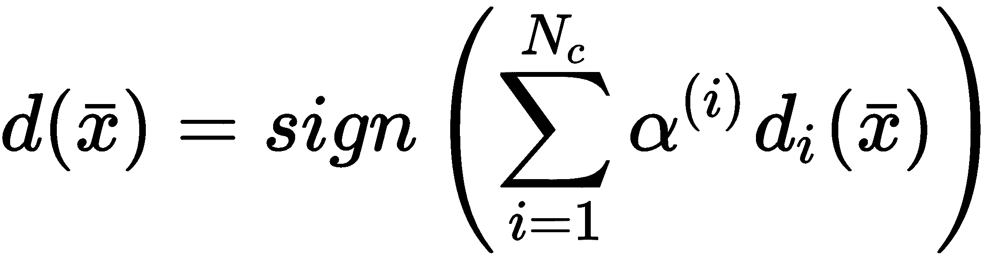
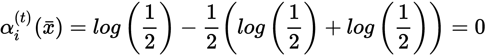

# 集成学习

在本章中，我们将讨论一些重要的算法，这些算法利用不同的估计器来提高集成或委员会的整体性能。这些技术要么通过在每个属于预定义集的估计器中引入中等程度的随机性来实现，要么通过创建一系列估计器，其中每个新的模型都被迫提高前一个模型的表现。这些技术使我们能够在使用有限容量或更容易过拟合训练集的模型时，减少偏差和方差（从而提高验证准确率）。

本章涵盖的特定主题如下：

+   集成学习方法介绍

+   决策树简介

+   随机森林和额外的随机森林

+   AdaBoost（算法 M1，SAMME，SAMME.R 和 R2）

+   梯度提升

+   投票分类器集成、堆叠和分桶

# 集成学习基础

集成学习背后的主要概念是强学习者和弱学习者的区别。特别是，强学习器是一个分类器或回归器，它具有足够的容量达到最高的潜在准确率，最小化偏差和方差（从而实现一个令人满意的泛化水平）。更正式地说，如果我们考虑一个参数化的二元分类器 *f(x; θ)*，我们定义它为强学习器，如果以下条件成立：


这个表达式可能看起来有些晦涩；然而，它实际上非常容易理解。它仅仅表达了这样一个概念：一个强大的学习者在理论上能够以大于或等于 0.5 的概率（即二元随机猜测的阈值）实现任何非零误分类概率。在机器学习任务中通常使用的所有模型都是强大的学习者，即使它们的领域可能有限（例如，逻辑回归无法解决非线性问题）。另一方面，一个弱学习者是一个通常能够实现略高于随机猜测的准确率的模型，但其复杂性非常低（它们可以非常快地训练，但永远不能单独用来解决复杂问题）。在这种情况下，也存在一个正式的定义，但更简单的是考虑弱学习者的真正主要特性是有限的实现合理准确率的能力。在训练空间的某些非常特定且小的区域内，弱学习者可以达到低误分类概率，但在整个空间中，其性能仅略优于随机猜测。前一个定义更多的是理论上的，而不是实践上的，因为目前所有可用的模型通常都比随机预言者要好得多。然而，集成被定义为一起训练（或按顺序）的一组弱学习者，以形成一个委员会。在分类和回归问题中，最终结果是通过平均预测或采用多数投票来获得的。

在这一点上，一个合理的问题可能是——为什么我们需要训练许多弱学习者而不是一个单一的强大学习者？答案是双重的——在集成学习中，我们通常处理中等强大的学习者（如决策树或**支持向量机**（**SVMs**）），并将它们作为一个委员会来提高整体准确率并减少方差，这得益于对样本空间的更广泛探索。事实上，虽然一个强大的学习者通常能够过度拟合训练集，但要在整个样本子空间中保持高准确率而不饱和其容量则更为困难。为了避免过度拟合，必须找到一种权衡，结果是得到一个准确率较低但分离超平面更简单的分类器/回归器。采用许多弱学习者（实际上它们相当强大，因为即使是简单的模型也比随机猜测更准确），可以迫使他们只关注一个有限的子空间，从而能够以低方差达到非常高的局部准确率。委员会采用平均技术，可以轻松找出哪个预测是最合适的。或者，它可以要求每个学习者进行投票，假设成功的训练过程必须总是引导多数人提出最准确的分类或预测。

集成学习的最常见方法如下：

+   **袋装（Bagging，即自助聚合）**：这种方法使用*n*个弱学习器*fw1, fw2, ..., fwn*（通常它们是决策树）来训练*n*个训练集（*D1, D2, ..., Dn*），这些训练集是通过随机抽样原始数据集*D*创建的。抽样过程（称为**自助抽样**）通常是通过替换来执行的，以便确定不同的数据分布。此外，在许多实际算法中，弱学习器也是使用中等程度的随机性初始化和训练的。这样，克隆的概率变得非常小，同时，通过保持方差在可容忍的阈值以下（从而避免过拟合），可以提高准确性。

+   **提升（Boosting）**：这是一种替代方法，它从单个弱学习器*fw1*开始构建增量集成，并在每次迭代中添加一个新的学习器*fwi*。目标是重新加权数据集，以便迫使新的学习器关注先前被错误分类的样本。这种策略产生了非常高的准确性，因为新的学习器是在一个正偏置的数据集上训练的，这使得它们能够适应最困难的内部条件。然而，以这种方式，对方差的控制减弱了，集成更容易过拟合训练集。可以通过减少弱学习器的复杂性或施加正则化约束来减轻这个问题。

+   **堆叠（Stacking）**：这种方法可以以不同的方式实现，但其哲学始终如一——使用在相同数据集上训练的不同算法（通常是几个强大的学习器），并使用另一个分类器过滤最终结果，平均预测或使用多数投票。如果数据集具有可以通过不同方法部分管理的结构，这种策略可以非常强大。每个分类器或回归器都应该发现一些独特的数据方面；这就是为什么算法必须在结构上不同。例如，将决策树与 SVM 或线性核模型混合可能是有用的。在测试集上进行的评估应清楚地显示在某些情况下只有分类器占主导地位。如果一个算法最终是唯一产生最佳预测的算法，那么集成就变得无用了，最好专注于单个强大的学习器。

# 随机森林

随机森林是基于决策树的袋装集成模型。如果读者不熟悉这类模型，我建议阅读 *《机器学习导论》*，*Alpaydin E.*，*麻省理工学院出版社*，在那里可以找到完整的解释。然而，为了我们的目的，提供对最重要的概念的简要解释是有用的。决策树是一个类似于标准分层决策过程的模型。在大多数情况下，使用一个特殊的家族，称为二叉决策树，因为每个决策只产生两个结果。这种树通常是简单且合理的最佳选择，训练过程（即构建树本身）非常直观。根节点包含整个数据集：


每个级别是通过应用以下定义的选择元组获得的：


元组的第一个索引对应于一个输入特征，而阈值 *t[i]* 是在每个特征特定范围内选择的一个值。应用一个选择元组会导致一个分割和两个节点，每个节点包含输入数据集的非重叠子集。在下面的图中，有一个在根级别（初始分割）执行的分割示例：


决策树初始分割的示例

集合 *X* 被分割成两个子集，分别定义为 *X11* 和 *X12*，其样本分别具有 *i=2* 小于或大于阈值 *ti=0.8* 的特征。分类决策树背后的直觉是继续分割，直到叶子节点包含属于单个类别 *yi* 的样本（这些节点被定义为纯净的）。这样，一个新的样本 *xj* 可以通过计算复杂度 *O(log(M))* 遍历树，并达到一个最终节点，该节点确定其类别。以非常相似的方式，可以构建输出连续的回归树（即使，为了我们的目的，我们将只考虑分类场景）。

在这一点上，主要问题是如何执行每个分割。我们不能随意选择任何特征和任何阈值，因为最终的树将完全不平衡且非常深。我们的目标是找到每个节点处的最佳选择元组，考虑到最终目标是分类到离散类别（对于回归过程几乎相同）。这种技术非常类似于基于必须最小化的成本函数的问题，但在这个情况下，我们局部操作，应用与节点异质性成比例的不纯度度量。高不纯度表明存在属于许多不同类别的样本，而不纯度等于 0 则表明存在单个类别。由于我们需要继续分割直到出现纯净的叶子节点，最佳选择基于一个对每个选择元组进行评分的函数，使我们能够选择产生最低不纯度的那个（理论上，过程应该继续到所有叶子都是纯净的，但通常提供一个最大深度，以避免过度的复杂性）。如果有 p 个类别，类别集可以定义为以下：


一种非常常见的纯度度量称为 **基尼不纯度**，它基于如果使用从节点子集分布中随机选择的标签对样本进行分类时的错误分类概率。直观上，如果所有样本都属于同一类别，任何随机选择都会导致正确分类（并且不纯度变为 *0*）。另一方面，如果节点包含来自许多类别的样本，错误分类的概率会增加。正式地，该度量定义为以下：


子集由 *Xk* 表示，而 *p(j|k)* 是通过属于类别 *j* 的样本数与样本总数的比率获得的。选择元组必须被选择以最小化子节点的基尼不纯度。另一种常见的方法是交叉熵不纯度，定义如下：


与前一种度量方法相比，这种差异主要由一些基本的信息理论概念提供。特别是，我们想要达到的目标是最小化不确定性，这使用 *(交叉-)熵* 来衡量。如果我们有一个离散分布，并且所有样本都属于同一类别，那么随机选择可以完全描述该分布；因此，不确定性为零。相反，例如，如果我们有一个公平的骰子，每个结果的概率是 1/6，相应的熵大约是 2.58 比特（如果对数的底是 2）。当节点变得越来越纯净时，交叉熵不纯度降低，并在最佳场景下达到 0。此外，采用互信息概念，我们可以在分割后定义获得的信息增益：


给定一个节点，我们希望创建两个子节点以最大化信息增益。换句话说，通过选择交叉熵不纯度，我们隐式地扩展树，直到信息增益变为零。再次考虑公平骰子的例子，我们需要 2.58 位信息来决定正确的结果。如果骰子是偏的，并且结果的可能性是 1.0，那么我们不需要任何信息来做出决定。在决策树中，我们希望模仿这种情况，这样，当一个新的样本完全遍历树时，我们就不需要任何进一步的信息来对其进行分类。如果施加最大深度限制，最终的信息增益不能为零。这意味着我们需要支付额外的成本来完成分类。这个成本与剩余的不确定性成正比，并且应该最小化以提高精度。

也可以采用其他方法（尽管基尼系数和交叉熵是最常见的），我邀请读者查阅参考文献以获取更多信息。然而，在这个阶段，一个自然的问题出现了。决策树是简单的模型（它们不是弱学习器！），但构建它们的程序比训练逻辑回归或 SVM 要复杂得多。为什么它们如此受欢迎？一个明显的原因是——它们代表了一个可以用图表展示的结构化过程；然而，这并不足以证明它们的用途。两个重要的特性使得决策树可以在没有任何数据预处理的情况下使用。

事实上，很容易理解，与其他方法不同，不需要任何缩放或白化，并且可以同时使用连续和分类特征。例如，在一个二维数据集中，如果一个特征具有方差等于 1，而另一个等于 100，那么大多数分类器将只能达到低精度；因此，预处理步骤变得必要。在决策树中，选择元组在范围差异很大时也具有相同的效果。不言而喻，在考虑分类特征的情况下，可以轻松地进行分割，例如，不需要使用诸如独热编码（在大多数情况下是必要的，以避免泛化错误）等技术。然而，不幸的是，使用决策树获得的分离超曲面通常比使用其他算法获得的超曲面要复杂得多，这导致方差更高，从而降低了泛化能力。

要理解原因，可以想象一个非常简单的二维数据集，由位于第二和第四象限的两个 blob 组成。第一个集合的特征是*(x < 0, y > 0)*，但第二个集合的特征是*(x < 0, y < 0)*。让我们还假设我们有一些异常值，但我们关于数据生成过程的知识不足以将它们视为噪声样本（原始分布可以在轴上延伸尾部；例如，它可能是由两个高斯分布混合而成）。在这种情况下，最简单的分离线是分割平面的对角线，将平面分为包含第一和第三象限区域的两个子平面。然而，这个决策只能同时考虑两个坐标。使用决策树，我们需要最初，例如，使用第一个特征进行分割，然后再使用第二个特征进行分割。结果是分段分离线（例如，将平面分割为对应于第二象限及其补集的区域），导致非常高的分类方差。矛盾的是，可以通过一个不完整的树（例如，将过程限制为单个分割）和选择*y*-轴作为分离线来获得更好的解决方案（这就是为什么强制最大深度很重要的原因），但你付出的代价是增加的偏差（以及随之而来的更差的准确性）。

在使用决策树（和相关模型）时，另一个需要考虑的重要元素是最大深度。可以生长树直到所有叶子都是纯的，但有时强制最大深度（以及随之而来的最大终端节点数）更可取。最大深度等于 1 导致称为**决策桩**的二进制模型，它不允许特征之间有任何交互（它们可以简单地表示为*If... Then*条件）。更高的值产生更多的终端节点，并允许特征之间有更多的交互（可以想到许多*If... Then*语句与`AND`逻辑运算符的组合）。正确的值必须针对每个问题进行调整，并且重要的是要记住，非常深的树比修剪过的树更容易过拟合。

在某些情况下，为了获得更高的泛化能力，宁愿牺牲略微较差的准确性，在这种情况下，应该强制最大深度。确定最佳值的常用工具始终是网格搜索与交叉验证技术相结合。

随机森林为我们提供了一种强大的工具来解决偏差-方差权衡问题。它们是由 L. Breiman 提出的（见*Breiman L.*，*随机森林*，*机器学习*，*45*，*2001*），其逻辑非常简单。正如前一部分所解释的，bagging 方法首先从选择弱学习者的数量*Nc*开始。第二步是生成*Nc*个数据集（称为 bootstrap samples）*D1, D2, ..., DNc*：


每个决策树都使用相应的数据集，通过一个共同的杂质标准进行训练；然而，在随机森林中，为了减少方差，选择分裂的计算不是考虑所有特征，而只通过一个包含相当少特征（常见选择是平方根的四舍五入、log2 或自然对数）的随机子集。这种方法确实削弱了每个学习器，因为部分最优性丢失，但通过限制过度专业化，我们可以获得显著减少方差的效果。同时，由于集成（特别是对于大量估计量）的结果，偏差减少和精度提高。实际上，由于学习器使用略微不同的数据分布进行训练，当 *Nc → ∞* 时，预测的平均值收敛到正确的值（在实践中，并不总是需要使用一个非常大的决策树数量，但是，必须使用带有交叉验证的网格搜索来调整正确的值）。一旦所有模型，用函数 *di(x)* 表示，都经过训练，最终的预测可以通过平均得到：


或者，也可以采用多数投票法（但仅适用于分类）：


这两种方法非常相似，并且在大多数情况下会得到相同的结果。然而，平均法在样本几乎位于边界时更加稳健，并且提供了更高的灵活性。此外，它可用于分类和回归任务。

随机森林通过从较小的样本子集中选择最佳选择元组来限制其随机性。在某些情况下，例如，当特征数量不是非常大时，这种策略会导致方差减少最小化，而计算成本不再由结果证明是合理的。通过一个称为额外随机树（或简称额外树）的变体，可以实现更好的性能。程序几乎相同；然而，在这种情况下，在执行分割之前，会计算 *n* 个随机阈值（对于每个特征），并选择导致最少不纯度的那个。这种方法进一步削弱了学习器，但同时减少了剩余方差并防止过拟合。这种动态与许多技术（如正则化或 dropout）非常相似；事实上，额外的随机性降低了模型的容量，迫使它达到更线性的解决方案（这显然是不理想的）。为此限制所付出的代价是随之而来的偏差恶化，然而，这种恶化却因许多不同学习者的存在而得到补偿。即使使用随机分割，当 *Nc* 足够大时，错误分类（或回归预测）的概率也会越来越小，因为平均投票和多数投票往往会补偿在特定区域结构上特别次优的树的输出。当训练样本数量很大时，这个结果更容易获得。实际上，在这种情况下，有放回的采样会导致略微不同的分布，即使这不是正式正确的，也可以被认为是部分和随机增强的。因此，每个弱学习器都会隐式地关注整个数据集，并额外关注一个较小的子集，尽管这个子集是随机选择的（与实际的增强不同）。

完全随机森林算法如下：

1.  设置决策树的数量 *Nc*

1.  对于 *i=1* 到 *Nc*：

    1.  从原始数据集 *X* 中有放回地采样创建数据集 *Di*

1.  在每次分割时设置要考虑的特征数量 *Nf*（例如，*sqrt(n)*）

1.  设置一个不纯度度量（例如，基尼不纯度）

1.  为每棵树定义一个可选的最大深度

1.  对于 *i=1* 到 *Nc*：

    1.  随机森林：

        1.  使用数据集 *Di* 训练决策树 *di(x)*，并从随机采样的 *Nf* 个特征中选择最佳分割

    1.  额外树：

        1.  使用数据集 *Di* 训练决策树 *di(x)*，在每次分割前计算 *n* 个随机阈值，并选择产生最少不纯度的那个

1.  定义一个输出函数，它平均单个输出或采用多数投票

# Scikit-Learn 中的随机森林示例

在这个例子中，我们将使用 Scikit-Learn 中直接可用的著名葡萄酒数据集（178 个 13 维样本分为三个类别）。不幸的是，找到适合集成学习算法的好的简单数据集并不容易，因为它们通常与大型和复杂的数据集一起使用，这需要太长的计算时间。由于葡萄酒数据集并不特别复杂，第一步是使用 k 折交叉验证来评估不同分类器（逻辑回归、决策树和多项式 SVM）的性能：

```py
import numpy as np

from sklearn.datasets import load_wine
from sklearn.model_selection import cross_val_score
from sklearn.linear_model import LogisticRegression
from sklearn.tree import DecisionTreeClassifier
from sklearn.svm import SVC

X, Y = load_wine(return_X_y=True)

lr = LogisticRegression(max_iter=1000, random_state=1000)
print(np.mean(cross_val_score(lr, X, Y, cv=10)))
0.956432748538

dt = DecisionTreeClassifier(criterion='entropy', random_state=1000)
print(np.mean(cross_val_score(dt, X, Y, cv=10)))
0.933298933609

svm = SVC(kernel='poly', random_state=1000)
print(np.mean(cross_val_score(svm, X, Y, cv=10)))
0.961403508772
```

如预期，性能相当好，平均交叉验证准确率最高值约为 96%，由多项式 SVM（默认度数为 3）实现。一个非常有趣的因素是决策树的表现，它是这一组中最差的（其 Gini 不纯度较低）。即使它不正确，我们也可以将这个模型定义为这一组中最弱的，它是我们袋装测试的完美候选人。现在我们可以通过实例化`RandomForestClassifier`类并选择`n_estimators=50`（我邀请读者尝试不同的值）来拟合一个随机森林：

```py
from multiprocessing import cpu_count

from sklearn.ensemble import RandomForestClassifier

rf = RandomForestClassifier(n_estimators=50, n_jobs=cpu_count(), random_state=1000)
print(np.mean(cross_val_score(rf, X, Y, cv=10)))
0.983333333333
```

如预期，平均交叉验证准确率最高，约为 98.3%。因此，随机森林已经成功找到了决策树的全球配置，以便使它们几乎在任何样本空间的区域中专业化。参数`n_jobs=cpu_count()`告诉 Scikit-Learn 使用机器上所有可用的 CPU 核心并行化训练过程。

为了更好地理解这个模型的动态，将交叉验证准确率作为树的数量函数绘制是有用的：


随机森林的交叉验证准确率作为树数量的函数

当树的数量增加到大约 320 时，观察到一些波动和平台期并不令人惊讶。随机性的影响可能导致性能损失，甚至增加学习者的数量。事实上，即使训练准确率增加，不同折上的验证准确率也可能受到过度专业化的影响。此外，在这个案例中，非常有趣的是，最高准确率可以通过 50 棵树而不是 400 棵或更多来实现。因此，我总是建议至少进行网格搜索，这不仅是为了达到最佳准确率，也是为了最小化模型的复杂性。

当与决策树和随机森林一起工作时，另一个需要考虑的重要因素是特征重要性（当选择此标准时也称为 Gini 重要性），这是一个与特定特征允许我们实现的杂质减少成比例的度量。对于决策树，它定义如下：


在前面的公式中，*n(j)*表示达到节点*j*（求和必须扩展到所有选择该特征的所有节点）的样本数量，而*ΔIi*是在节点*j*处使用特征*i*分割后实现的纯度降低。在随机森林中，必须通过对所有树进行平均来计算重要性：


在拟合模型（决策树或随机森林）后，Scikit-Learn 在`feature_importances_`实例变量中输出特征重要性向量。在下面的图表中，有一个按降序排列的每个特征重要性的图（标签可以通过命令`load_wine()['feature_names'])`获得）：


葡萄酒数据集的特征重要性

我们不想分析每个元素化学意义，但很明显，例如，脯氨酸的存在和颜色强度比非黄酮酚的存在要重要得多。由于模型处理的是语义上独立的特征（图像的像素并不相同），因此可以通过移除所有对最终准确率影响不大的特征来降低数据集的维度。这个过程称为**特征选择**，应该使用更复杂的统计技术来执行，例如卡方检验，但当分类器能够产生重要性指数时，也可以使用 Scikit-Learn 中的一个名为`SelectFromModel`的类。通过传递一个估计器（可以是拟合的或不拟合的）和一个阈值，可以过滤掉所有低于阈值的特征值，从而转换数据集。将此应用于我们的模型并设置最小重要性为`0.02`，我们得到以下结果：

```py
from sklearn.feature_selection import SelectFromModel

sfm = SelectFromModel(estimator=rf, prefit=True, threshold=0.02)
X_sfm = sfm.transform(X)

print(X_sfm.shape)
(178, 10)
```

新数据集现在包含 10 个特征，而不是原始葡萄酒数据集的 13 个特征（例如，很容易验证灰分和非黄酮酚已被移除）。当然，对于任何其他降维方法，总是建议您通过交叉验证来验证最终准确率，并且只有在损失准确率与降低复杂度之间的权衡是合理的情况下才做出决定。

# AdaBoost

在上一节中，我们了解到使用放回抽样会导致数据集中样本被随机重新加权。然而，如果 *M* 非常大，大多数样本只会出现一次，而且所有选择都是完全随机的。AdaBoost 是 Schapire 和 Freund 提出的一种算法，它试图通过采用自适应提升（这个名字来源于此）来最大化每个弱学习器的效率。特别是，集成是通过顺序增长，并在每一步重新计算数据分布，以便增加被错误分类的样本的权重，减少被正确分类的样本的权重。这样，每个新的学习器被迫关注那些对先前估计器来说更成问题的区域。读者可以立即理解，与随机森林和其他袋装方法不同，提升不依赖于随机性来减少方差和提高精度。相反，它以确定性的方式工作，并且每个新的数据分布都是根据精确的目标选择的。在本段中，我们将考虑一个称为 **离散 AdaBoost**（正式名称为 *AdaBoost.M1*）的变体，它需要一个输出被阈值化的分类器（例如，*-1* 和 *1*）。然而，已经开发了实值版本（其输出行为类似于概率），例如在 *Additive Logistic Regression: a Statistical View of Boosting* 中所示，作者为 *Friedman J.*，*Hastie T.*，*Tibshirani R.*，发表于 *Annals of Statistics*，1998 年第 28 卷）。由于主要概念始终相同，对其他变体的理论细节感兴趣的读者可以立即在参考文献中找到它们。

为了简单起见，**AdaBoost.M1** 的训练数据集定义为如下：


这种选择并不是一个限制，因为在多类问题中，可以很容易地采用一对一策略，即使像 **AdaBoost.SAMME** 这样的算法保证了更好的性能。为了操作数据分布，我们需要定义一个权重集：


权重集允许定义一个隐式数据分布 *D(t)(x)*，最初它与原始数据分布等效，但可以通过改变 *wi* 的值轻松重塑。一旦选择了家族和估计器的数量 *Nc*，就可以开始全局训练过程。该算法可以应用于任何能够产生阈值估计的学习器（而实值变体可以使用概率工作，例如通过 Platt 缩放方法获得）。

第一个实例*d1(x)*使用原始数据集进行训练，这意味着使用数据分布*D(1)(x)*。相反，下一个实例使用重新加权的分布*D(2)(x)，D(3)(x)，...，D(Nc)(x)*进行训练。为了计算它们，在每个训练过程之后，计算归一化加权误差总和：


此值介于*0*（没有误分类）和*1*（所有样本都被误分类）之间，并用于计算估计器权重*α(t)*：


要理解这个函数是如何工作的，考虑其图像（如下所示）是有用的：


估计器权重图作为归一化加权误差总和的函数

此图揭示了一个隐含的假设：最差的分类器不是将所有样本都分类错误的那一个（*ε(t) = 1*），而是一个完全随机的二进制猜测（对应于*ε(t) = 0.5*）。在这种情况下，*α(t)*为零，因此，如果完全丢弃估计器，结果就是零。当*ε(t) < 0.5*时，应用提升（在约 0.05 和 0.5 之间，趋势几乎是线性的），但只有当*ε(t)* < 约 0.25 时，它才大于 1（较大的值会导致惩罚，因为权重小于 1）。这个值是一个阈值，用于判断估计器是否可信或非常强大，在完美估计器（没有错误）的特定情况下，*α(t)* → +∞。

在实践中，应该施加一个上限，以避免溢出或除以零。相反，当*ε(t) > 0.5*时，估计器是不可接受的弱，因为它比随机猜测还要差，并且产生的提升将是负的。为了避免这个问题，实际实现必须反转此类估计器的输出，实际上将它们转变为*ε(t) < 0.5*的学习者（这不是问题，因为转换应用于所有输出值的方式相同）。重要的是要考虑，这个算法不应该直接应用于多类场景，因为，正如*多类 AdaBoost*中指出的，*Zhu J.*，*Rosset S.*，*Zou H.*，*Hastie T.*，*01/2006*，阈值 0.5 仅对应于二元选择的随机猜测精度。当类的数量大于两个时，随机估计器输出一个类的概率为*1/Ny*（其中*Ny*是类的数量），因此，AdaBoost.M1 将以错误的方式提升分类器，导致最终精度较差（实际的阈值应该是*1 - 1/Ny*，当*Ny > 2*时，它大于 0.5）。AdaBoost.SAMME 算法（由 Scikit-Learn 实现）已被提出以解决这个问题，并利用提升在多类场景中的力量。

全局决策函数定义如下：



以这种方式，随着估计器的逐个添加，每个估计器的重要性将逐渐降低，而 *di(x)* 的准确性将提高。然而，如果 *X* 的复杂性非常高，也可能观察到平台期。在这种情况下，许多学习者的权重会很高，因为最终的预测必须考虑学习者的子组合以达到可接受的准确性。由于此算法在每一步都专门化学习者，因此一个好的做法是从少量估计器（例如，10 或 20）开始，直到不再获得改进为止。有时，只需要少量优秀的学习者（如 SVM 或决策树）就能达到最高的可能准确性（限于此类算法），但在某些其他情况下，估计器的数量可以达到数千。网格搜索和交叉验证仍然是做出正确选择的唯一好策略。

在每一步训练之后，必须更新权重以产生增强分布。这是通过使用指数函数（基于双极输出 *{-1, 1}*）实现的：


对于一个样本 *x[i]*，如果它被错误分类，其权重将根据整体估计器权重增加。这种方法允许进一步的自适应行为，因为具有高 *α(t)* 的分类器已经非常准确，并且需要更高的关注水平来仅关注（少数）错误分类的样本。相反，如果 *α(t)* 较小，估计器必须提高其整体性能，并且必须将过重加权过程应用于大子集（因此，分布不会围绕少数样本峰值，而只会惩罚那些被正确分类的小子集，让估计器能够以相同的概率探索剩余空间）。即使原始提案中没有提到，也可以包括一个乘以指数的学习率 *η*：


值 *η = 1* 没有影响，而较小的值已被证明可以通过避免过早专业化来提高准确性。当然，当 *η << 1* 时，必须增加估计器的数量以补偿轻微的重加权，这可能导致训练性能损失。至于其他超参数，必须使用交叉验证技术来发现 *η* 的正确值（或者，如果它必须是唯一需要微调的值，可以从一个值开始，通过减少其值直到达到最大准确性）。

完整的 AdaBoost.M1 算法如下：

1.  设置家族和估计器的数量 *Nc*

1.  将初始权重 *W(1)* 设置为 *1/M*

1.  设置学习率 *η*（例如，*η = 1*）

1.  将初始分布 *D(1)* 设置为数据集 *X*

1.  对于 *i=1* 到 *Nc*：

    1.  使用数据分布 *D(i)* 训练第 *i* 个估计器 *di(x)*

    1.  计算归一化加权误差和 *ε(i)*:

        1.  如果 *ε(i) > 0.5*，则反转所有估计器输出

    1.  计算估计权重 *α(i)*

    1.  使用指数公式（带或不带学习率）更新权重

    1.  归一化权重

1.  创建全局估计器，将 sign(•) 函数应用于加权求和 *α(i)di(x)*（对于 *i=1* 到 *Nc*）

# AdaBoost.SAMME

这个变体被称为**多类指数损失逐步加性建模**（**SAMME**），由 Zhu、Rosset、Zou 和 Hastie 在 *Multi-class AdaBoost* 中提出，*Zhu J.*，*Rosset S.*，*Zou H.*，*Hastie T.*，*01/2006*。目标是使 AdaBoost.M1 能够在多类场景中正常工作。由于这是一个离散版本，其结构几乎相同，只是在估计权重计算上有所不同。让我们考虑一个标签数据集，*Y*：


现在，有 *p* 个不同的类别，需要考虑随机猜测估计器无法达到 0.5 的准确度；因此，新的估计器权重计算如下：


这样，阈值就会向前推进，当以下条件成立时，*α(t)* 将为零：


下图显示了 *α(t)* 与 *p = 10* 的关系图：


当 p = 10 时，估计权重作为归一化加权误差和的函数的图

采用这种修正，提升过程可以成功处理多类问题，而不会引入 AdaBoost.M1 在 *p > 2*（当误差小于实际随机猜测时，*α(t)* > 0）时通常引入的偏差。由于该算法的性能明显优于其他算法，大多数 AdaBoost 实现不再基于原始算法（例如，Scikit-Learn 实现了 AdaBoost.SAMME 和实值版本 AdaBoost.SAMME.R）。当然，当 *p = 2* 时，AdaBoost.SAMME 与 AdaBoost.M1 完全等价。

# AdaBoost.SAMME.R

AdaBoost.SAMME.R 是一个与能够输出预测概率的分类器一起工作的变体。这通常可以通过使用 Platt 缩放等技术来实现，但重要的是要检查特定的分类器实现是否能够在不采取任何进一步行动的情况下输出概率。例如，Scikit-Learn 提供的 SVM 实现不会计算概率，除非参数 `probability=True`（因为它们需要额外的步骤，在某些情况下可能无益）。

在这种情况下，我们假设每个分类器的输出是一个概率向量：


每个分量是在给定输入 xi 的情况下，*j^(th)*类输出的条件概率。当使用单个估计器时，通过 argmax(•)函数获得获胜类别；然而，在这种情况下，我们想要重新加权每个学习者，以获得一个顺序增长的集成。基本思想与 AdaBoost.M1 相同，但现在我们管理概率向量，我们还需要一个依赖于单个样本*xi*的估计器权重函数（这个函数实际上包装了现在表示为概率向量函数*pi(t)(y=i|x)*的每个估计器）：


考虑到对数函数的性质，前面的表达式等价于一个离散的*α(t)*；然而，在这种情况下，我们并不依赖于加权误差总和（理论解释相当复杂，超出了本书的范围。读者可以在上述论文中找到它，即使下一章介绍的方法揭示了逻辑的基本部分）。为了更好地理解这个函数的行为，让我们考虑一个简单的场景，其中*p = 2*。第一种情况是学习者无法分类的样本（*p=(0.5, 0.5)*）：



在这种情况下，不确定性最大，分类器无法信任这个样本，因此所有输出概率的权重变为零。现在，让我们应用提升，得到概率向量*p=(0.7, 0.3)*：


当*p → 1*时，第一个类别将变为正值，其幅度将增加，而另一个则是相反的值。因此，函数是对称的，允许使用总和：


这种方法与加权多数投票非常相似，因为获胜的类别*yi*的计算不仅考虑了输出*yi*的估计器的数量，还考虑了它们的相对权重和剩余分类器的负权重。只有当最强的分类器预测了该类别，并且其他学习者的影响不足以推翻这一结果时，才能选择一个类别。

为了更新权重，我们需要考虑所有概率的影响。特别是，我们希望减少不确定性（这可能会退化成纯粹的随机猜测）并迫使注意力集中在所有那些被错误分类的样本上。为了实现这一目标，我们需要定义*yi*和*p(t)(xi)*向量，它们分别包含真实类别的 one-hot 编码（例如，*(0, 0, 1, ..., 0)*）和估计器输出的概率（作为一个列向量）。因此，更新规则如下：


例如，如果真实向量是(1, 0)且输出概率是(0.1, 0.9)，η=1 时，样本的权重将乘以大约 3.16。如果输出概率是(0.9, 0.1)，意味着样本已被成功分类，乘数将更接近 1。这样，新的数据分布 D(t+1)，类似于 AdaBoost.M1，将在需要更多关注的样本上更加尖锐。所有实现都将学习率作为超参数，因为，如前所述，默认值等于 1.0 可能不是特定问题的最佳选择。一般来说，较低的学习率可以在存在许多异常值时减少不稳定性，并通过较慢的收敛速度提高泛化能力。当η < 1 时，每个新的分布都会稍微更多地关注被错误分类的样本，允许估计器在不进行大跳跃的情况下（可能导致估计器跳过最佳点）寻找更好的参数集。然而，与通常使用小批次的神经网络不同，AdaBoost 也可以在η=1 时表现相当好，因为校正仅在完整训练步骤之后应用。像往常一样，我建议进行网格搜索以选择每个特定问题的正确值。

完整的 AdaBoost.SAMME.R 算法如下：

1.  设置家族和估计器数量 Nc

1.  将初始权重 W(1)设置为 1/M

1.  设置学习率η（例如，η = 1）

1.  将初始分布 D(1)设置为数据集 X

1.  对于 i=1 到 Nc：

    1.  使用数据分布 D(i)训练第 i 个估计器 di(x)

    1.  计算每个类别和每个训练样本的输出概率

    1.  计算估计器权重αj(i)

    1.  使用指数公式（带或不带学习率）更新权重

    1.  归一化权重

1.  通过对αj(i)的和（对于 i=1 到 Nc）应用 argmax(•)函数来创建全局估计器

# AdaBoost.R2

Drucker 博士（在《使用提升技术改进回归器》*Drucker H.*，*ICML 1997*）提出了一种稍微复杂一些的变体来处理回归问题。弱学习器通常是决策树，其主要概念与其他变体非常相似（特别是，应用于训练数据集的重加权过程）。真正的区别在于选择最终预测 yi 的策略，给定输入样本 xi。假设有 Nc 个估计器，每个估计器都表示为函数 dt(x)，我们可以为每个输入样本计算绝对残差 ri(t)：


一旦包含所有绝对残差的集合 *Ri* 已被填充，我们可以计算量 *Sr = sup Ri* 并计算与误差成比例的成本函数值。通常实现的常见选择（并且作者本人也建议）是线性损失：


这种损失非常平坦，并且直接与误差成正比。在大多数情况下，这是一个好的选择，因为它避免了过早的过度专业化，并允许估计量以更温和的方式调整其结构。最明显的替代方案是平方损失，它开始给予那些预测误差较大的样本更多的重要性。它定义如下：


最后的成本函数严格相关于 AdaBoost.M1，并且是指数的：


这通常是一个不太稳健的选择，因为我们还将在下一节讨论，它倾向于惩罚较小的错误，而不是较大的错误。考虑到这些函数也用于重新加权过程，指数损失可以迫使分布给那些误分类错误高的样本分配非常高的概率，从而使估计量在第一次迭代中变得过度专业化。在许多情况下（例如在神经网络中），损失函数通常根据它们的特定属性选择，但更重要的是，根据它们易于最小化的程度。在这种情况下，损失函数是提升过程的基本部分，并且必须考虑对数据分布的影响。测试和交叉验证是做出合理决策的最佳工具。

一旦对所有训练样本评估了损失函数，就可以构建全局成本函数，作为所有损失的加权平均值。与许多简单求和或平均损失的算法不同，在这种情况下，必须考虑分布的结构。由于提升过程重新加权样本，相应的损失值也必须过滤，以避免偏差。在迭代 *t* 时，成本函数的计算如下：


这个函数与加权误差成正比，这些误差可以通过线性过滤或使用二次或指数函数强调。然而，在所有情况下，权重较低的样本将产生较小的贡献，使算法能够专注于更难预测的样本。请注意，在这种情况下，我们正在处理分类；因此，我们唯一可以使用的度量是损失。好的样本产生较低的损失，困难的样本产生成比例较高的损失。即使可以直接使用 *C(t)*，也最好定义一个置信度度量：


此指数与迭代 t 的平均置信度成反比。事实上，当 C(t) → 0 时，γ(t) → 0，当 C(t) → ∞时，γ(t) → 1。权重更新是在考虑整体置信度和特定损失值的情况下进行的：


权重将按比例减少，与相应的绝对残差损失相关。然而，而不是使用固定的基数，选择全局置信指数。这种策略允许进一步的可适应性，因为置信度低的估计器不需要只关注一个小子集，考虑到γ(t)介于 0 和 1（最坏情况）之间，当成本函数非常高（1x = 1）时，指数变得无效，因此权重保持不变。这种方法与其他变体中采用的方法不太相似，但它试图在全局准确性和局部误分类问题之间找到一个折衷方案，提供额外的鲁棒性。

该算法中最复杂的部分是输出全局预测所采用的方法。与分类算法不同，我们无法轻易计算平均值，因为需要考虑每次迭代的全局置信度。Drucker 提出了一种基于所有输出加权中位数的方法。特别是，给定一个样本 xi，我们定义预测集：


作为权重，我们考虑 log(1 / γ(t))，因此我们可以定义一个权重集：


最终输出是Γ加权的中位数（归一化，总和为 1.0）。当γ(t) → 1 时，置信度低，相应的权重将趋于 0。同样，当置信度高（接近 1.0）时，权重将成比例增加，选择与其相关的输出的机会将更高。例如，如果输出是 Y = {1, 1.2, 1.3, 2.0, 2.2, 2.5, 2.6}，权重是Γ = { 0.35, 0.15, 0.12, 0.11, 0.1, 0.09, 0.08 }，加权中位数对应于第二个索引，因此全局估计器将输出 1.2（这也是直观上最合理的选择）。

寻找中位数的过程相当简单：

1.  yi(t)必须按升序排序，以便 yi(1) < yi(2) < ... < yi(Nc)

1.  根据 yi(t)的索引对集合Γ进行排序（每个输出 yi(t)都必须携带其自身的权重）

1.  将Γ进行归一化，除以其总和

1.  选择将Γ分成两个块（其和小于或等于 0.5）的最小元素对应的索引

1.  选择与该索引对应的输出

完整的 AdaBoost.R2 算法如下：

1.  设置家族和估计器数量 Nc

1.  将初始权重 W(1)设置为 1/M

1.  将初始分布 D(1)设置为数据集 X

1.  选择一个损失函数 L

1.  对于 i=1 到 Nc：

    1.  使用数据分布 *D(i)* 训练第 *i* 个估计量 *di(x)*

    1.  计算绝对残差、损失值和置信度度量

    1.  计算全局代价函数

    1.  使用指数公式更新权重

1.  使用加权中位数创建全局估计量

# AdaBoost 的 Scikit-Learn 示例

让我们继续使用 Wine 数据集来分析 AdaBoost 在不同参数下的性能。Scikit-Learn，像几乎所有的算法一样，实现了分类器 `AdaBoostClassifier`（基于 SAMME 和 SAMME.R 算法）和回归器 `AdaBoostRegressor`（基于 R2 算法）。在这种情况下，我们将使用分类器，但我邀请读者使用自定义数据集或内置的玩具数据集测试回归器。在这两个类中，最重要的参数是 `n_estimators` 和 `learning_rate`（默认值设置为 `1.0`）。默认的底层弱学习器始终是决策树，但可以通过创建一个基础实例并通过参数 `base_estimator` 传递它来使用其他模型。正如章节中解释的那样，实值 AdaBoost 算法需要一个基于概率向量的输出。在 Scikit-Learn 中，一些分类器/回归器（如 SVM）除非明确要求（设置参数 `probability=True`），否则不会计算概率；因此，如果出现异常，我邀请您检查文档以了解如何强制算法计算它们。

我们将要讨论的示例仅具有教学目的，因为它们关注单一参数。在现实世界场景中，总是更好的执行网格搜索（这更昂贵），以便分析一组组合。让我们开始分析交叉验证分数作为估计量数量的函数（向量 *X* 和 *Y* 是在前面示例中定义的）：

```py
import numpy as np

from sklearn.ensemble import AdaBoostClassifier
from sklearn.model_selection import cross_val_score 

scores_ne = []

for ne in range(10, 201, 10):
    adc = AdaBoostClassifier(n_estimators=ne, learning_rate=0.8, random_state=1000)
    scores_ne.append(np.mean(cross_val_score(adc, X, Y, cv=10)))
```

我们考虑了从 10 棵树开始到 200 棵树结束的范围，步长为 10 棵树。学习率保持恒定，等于 0.8。结果图如下所示：


10 折交叉验证准确率作为估计量数量的函数

最大值出现在 50 个估计量时。更大的值会导致性能下降，因为过度专业化以及随之而来的方差增加。正如在其他章节中解释的那样，模型的能力必须根据奥卡姆剃刀原则进行调整，这不仅因为结果模型可以更快地训练，而且还因为能力过剩通常会导致过拟合训练集，并减少泛化的范围。交叉验证可以立即显示出这种效果，而标准训练/测试集分割时（尤其是当样本没有打乱时），这种效果可能仍然隐藏。

现在让我们检查不同学习率下的性能（保持树的数量不变）：

```py
import numpy as np

scores_eta_adc = []

for eta in np.linspace(0.01, 1.0, 100):
    adc = AdaBoostClassifier(n_estimators=50, learning_rate=eta, random_state=1000)
    scores_eta_adc.append(np.mean(cross_val_score(adc, X, Y, cv=10)))
```

最终的图表如下所示：


10 倍交叉验证准确率作为学习率（估计量数量=50）的函数

再次强调，不同的学习率会产生不同的准确率。选择*η = 0.8*似乎是最有效的，因为更高的和更低的价值会导致性能下降。正如解释的那样，学习率对重新加权过程有直接影响。非常小的值需要更多的估计量，因为后续分布非常相似。另一方面，大的值可能导致过早的过度专业化。即使默认值是`1.0`，我也总是建议检查使用较小值时的准确率。在每种情况下选择正确的学习率没有金科玉律，但重要的是要记住，较低的值允许算法以更温和的方式平滑地适应以适应训练集，而较高的值会降低对异常值的鲁棒性，因为被错误分类的样本会立即被提升，并且采样它们的概率会非常迅速地增加。这种行为的结果是持续关注那些可能受到噪声影响的样本，几乎忘记了剩余样本空间的结构。

我们想要进行的最后一个实验是分析使用**主成分分析**（PCA）和**因子分析**（FA）（50 个估计量和`η = 0.8`）进行的降维后的性能：

```py
import numpy as np

from sklearn.decomposition import PCA, FactorAnalysis

scores_pca = []

for i in range(13, 1, -1):
    if i < 12:
        pca = PCA(n_components=i, random_state=1000)
        X_pca = pca.fit_transform(X)
    else:
        X_pca = X

    adc = AdaBoostClassifier(n_estimators=50, learning_rate=0.8, random_state=1000)
    scores_pca.append(np.mean(cross_val_score(adc, X_pca, Y, cv=10)))  

scores_fa = []

for i in range(13, 1, -1):
    if i < 12:
        fa = FactorAnalysis(n_components=i, random_state=1000)
        X_fa = fa.fit_transform(X)
    else:
        X_fa = X

    adc = AdaBoostClassifier(n_estimators=50, learning_rate=0.8, random_state=1000)
    scores_fa.append(np.mean(cross_val_score(adc, X_fa, Y, cv=10)))
```

结果图表如下所示：


10 倍交叉验证准确率作为成分数量（主成分分析 PCA 和因子分析 FA）的函数

这个练习证实了在第五章“EM 算法及其应用”中分析的一些重要特征。首先，性能即使经过 50%的维度降低也不会有显著影响。这一考虑在先前的例子中进行的特征重要性分析中得到进一步证实。决策树仅考虑 6/7 个特征时就能执行相当好的分类，因为剩余的特征对样本的特征化贡献微乎其微。此外，因子分析（FA）几乎总是优于主成分分析（PCA）。使用 7 个成分，FA 算法实现的准确率高于 0.95（非常接近没有减少时实现的值），而 PCA 需要 12 个成分才能达到这个值。读者应该记住，PCA 是 FA 的一个特例，假设同方差噪声。图表证实，在 Wine 数据集中，这种条件是不可接受的。假设不同的噪声方差允许以更准确的方式重新建模减少的数据集，最小化缺失特征的交叉效应。即使 PCA 通常是首选，但在大型数据集的情况下，我建议您始终比较两种技术的性能，并选择保证最佳结果的技术（考虑到 FA 在计算复杂度方面更昂贵）。

# 梯度提升

在这一点上，我们可以引入创建提升集成的一个更通用的方法。让我们选择一个通用的算法族，如下所示：


每个模型使用向量 *θi* 进行参数化，并且对采用的方法没有限制。在这种情况下，我们将考虑决策树（当采用这种提升策略时，这是最广泛使用的算法之一——在这种情况下，该算法被称为梯度提升树），但理论是通用的，可以很容易地应用于更复杂的模型，如神经网络。在决策树中，参数向量 *θi* 由选择元组组成，因此读者可以将这种方法视为一个伪随机森林，其中我们寻找额外的优化，而不是随机性，利用先前的经验。事实上，与 AdaBoost 一样，梯度提升集成是按顺序构建的，使用一种正式定义为**前向分阶段加性建模**的技术。得到的估计量表示为一个加权求和：


因此，需要管理的变量是单个估计量权重 *αi* 和参数向量 *θi*。然而，我们不必处理整个集合，而只需处理单个元组 *(αi, θi)*，无需修改之前迭代中已选择的值。一般程序可以用循环来概括：

1.  估计量之和被初始化为空值

1.  对于 *i=1* 到 *Nc*：

    1.  选择最佳的 *元组(αi, θi)* 并训练估计量 *f(x; θi)*

    1.  *di(x) = di-1(x) + αif(x; θi)*

1.  输出最终的估计器 *d(x)*

如何找到最佳的元组？我们已提出一种策略，通过增强数据集来提高每个学习器的性能。在这种情况下，算法基于一个我们需要最小化的成本函数：


特别是，通用的最优元组如下获得：


由于过程是顺序的，每个估计器都优化以提高前一个的准确性。然而，与 AdaBoost 不同，我们并不受限于强制执行特定的损失函数（可以证明 AdaBoost.M1 与此算法的指数损失等价，但证明超出了本书的范围）。正如我们将要讨论的，其他成本函数可以在几个不同的场景中产生更好的性能，因为它们避免了过早收敛到次优最小值。

可以认为通过使用前面的公式来优化每个新的学习器，问题得到了解决；然而，`argmin(•)` 函数需要对成本函数空间进行完全探索，并且由于 `C(•)` 依赖于每个特定的模型实例，因此也依赖于 *θi*，因此有必要进行多次重新训练过程，以找到最优解。此外，问题通常是非凸的，变量的数量可能非常高。如 L-BFGS 或其他拟牛顿方法需要太多的迭代和计算时间。很明显，在大多数情况下，这种方法是不可行的，因此提出了梯度提升算法作为中间解决方案。其想法是找到一种次优解，通过梯度下降策略限制每个迭代的单步。

为了介绍算法，用明确的参考到最优目标重写加性模型是有用的：


注意，成本函数是在所有先前训练的模型上计算的；因此，校正始终是增量式的。如果成本函数 *L* 是可微分的（这是一个基本条件，但并不难满足），则可以计算相对于当前加性模型（在第 *i^(th)* 迭代时，我们需要考虑通过累加所有先前的 *i-1* 模型得到的加性模型）的梯度：


在这一点上，可以通过将当前加性模型移动到梯度的负方向来添加一个新的分类器：


我们尚未考虑参数αi（以及学习率*η*，它是一个常数），然而，熟悉一些基本微积分的读者可以立即理解更新的效果是通过迫使下一个模型提高其相对于前一个模型的准确性来减少全局损失函数的值。然而，单一步的梯度步并不足以保证适当的提升策略。实际上，如前所述，我们还需要根据每个分类器减少损失的能力来加权每个分类器。一旦计算了梯度，就可以通过直接最小化损失函数（使用线搜索算法）来确定权重αi 的最佳值，考虑到当前的加性模型，并将*α*作为一个额外变量：


当使用梯度提升树变体时，可以通过将权重*αi*分割成与树中每个终端节点关联的*m*个子权重*αi(j)*来获得改进。计算复杂度略有增加，但最终精度可以高于使用单个权重获得的精度。原因在于树的功能结构。由于提升迫使在特定区域进行专业化，单个权重可能导致学习器在特定样本无法正确分类时也进行过估计。相反，使用不同的权重，可以操作结果进行精细过滤，根据其值和特定树的性质接受或丢弃结果。

这个解决方案不能提供完整优化相同的准确性，但它非常快，并且可以通过使用更多的估计量和更低的学习率来补偿这种损失。像许多其他算法一样，梯度提升必须调整以获得最大精度和低方差。学习率通常远小于 1.0，其值应通过验证结果并考虑估计量的总数来确定（当使用更多学习者时最好减少它）。此外，可以添加正则化技术来防止过拟合。当与特定的分类器家族（如逻辑回归或神经网络）一起工作时，包括*L1*或*L2*惩罚非常容易，但与其他估计量一起则不太容易。因此，一种常见的正则化技术（也被 Scikit-Learn 实现）是训练数据集的下采样。选择*P < N*随机样本允许估计量减少方差并防止过拟合。或者，可以采用随机特征选择（仅适用于梯度树提升），就像随机森林一样；选择总特征数的一部分会增加不确定性并避免过度专业化。当然，这些技术的缺点是精度损失（与下采样/特征选择比成比例），必须分析以找到最合适的权衡。

在进入下一节之前，简要讨论一下通常与这类算法一起使用的成本函数是有用的。在第一章中，我们介绍了一些常见的成本函数，如均方误差、Huber Loss（在回归上下文中非常稳健）和交叉熵。它们都是有效的例子，但还有其他特定于分类问题的函数。第一个是指数损失，定义如下：


如 Hastie、Tibshirani 和 Friedman 所指出的，此函数将梯度提升转换为 AdaBoost.M1 算法。相应的成本函数具有非常精确的行为，有时并不适合解决特定问题。事实上，指数损失的误差很大时，其结果有很高的影响，产生围绕几个样本的强烈峰值分布。随后分类器可能会因此过度专门化其结构，仅应对小数据区域，存在失去正确分类其他样本能力的高度风险。在许多情况下，这种行为并不危险，最终的偏差-方差权衡是完全合理的；然而，有些问题中，较软的损失函数可以允许更好的最终准确性和泛化能力。对于实值二元分类问题，最常见的选择是二项式负对数似然损失（偏差），定义如下（在这种情况下我们假设分类器 *f(•)* 没有阈值，而是输出正类概率）：


此损失函数与逻辑回归中使用的相同，与指数损失相反，不会产生峰值分布。两个被错误分类的样本将以错误（而不是指数值）的比例进行提升，以便迫使分类器几乎以相同的概率关注所有被错误分类的群体（当然，对于错误非常大的样本分配更高的概率是可取的，假设所有其他被错误分类的样本都有很好的机会被选中）。二项式负对数似然损失的自然扩展到多类问题是多项式负对数似然损失，定义如下（分类器 *f(•)* 表示为具有 *p* 个成分的概率向量）：


在前面的公式中，符号 *Iy=j* 必须解释为指示函数，当 *y=j* 时等于 1，否则为 0。此损失函数的行为与二项式变体完全类似，并且通常默认用于分类问题。读者被邀请测试使用指数损失和偏差的示例，并比较结果。

完整的梯度提升算法如下：

1.  设置家族和估计器数量 *Nc*

1.  选择一个损失函数 *L*（例如，偏差）

1.  将基础估计器 *d0(x)* 初始化为一个常数（例如 0）或使用另一个模型

1.  设置学习率 *η*（例如 *η = 1*）

1.  对于 *i=1* 到 *Nc*：

    1.  使用步骤 *i-1* 的加性模型计算梯度 *∇d L(•)*

    1.  使用数据分布 *{ (xi, ∇d L(yi, di-1(xi)) }* 训练第 *i* 个估计器 *di(x)*

    1.  执行线性搜索以计算 *αi*

    1.  将估计器添加到集成中

# 使用 Scikit-Learn 的梯度提升树示例

在这个例子中，我们想要使用梯度提升树分类器（类 `GradientBoostingClassifier`）并检查最大树深度（参数 `max_depth`）对性能的影响。考虑到之前的例子，我们首先设置 `n_estimators=50` 和 `learning_rate=0.8`：

```py
import numpy as np

from sklearn.ensemble import GradientBoostingClassifier
from sklearn.model_selection import cross_val_score

scores_md = []
eta = 0.8

for md in range(2, 13):
    gbc = GradientBoostingClassifier(n_estimators=50, learning_rate=eta, max_depth=md, random_state=1000)
    scores_md.append(np.mean(cross_val_score(gbc, X, Y, cv=10)))
```

结果如下所示：


最大树深度作为 10 折交叉验证准确率的函数

如第一部分所述，决策树的最大深度与特征之间的交互可能性密切相关。当这些树在集成中使用时，这可能是一个正面或负面的方面。非常高的交互水平可能会创建过度复杂的分离超平面并降低整体方差。在其他情况下，有限的交互会导致更高的偏差。在这个特定的（且简单的）数据集上，梯度提升算法在最大深度为 2（考虑到根的深度为零）时可以达到更好的性能，这一点部分得到了特征重要性分析和降维的证实。在许多现实世界的情况下，这种研究的结果可能会有很大的不同，性能可能会提高，因此我建议从最小深度开始交叉验证结果（最好使用网格搜索），直到达到最大准确率。现在，我们想要调整学习率，这是该算法的一个基本参数：

```py
import numpy as np

scores_eta = []

for eta in np.linspace(0.01, 1.0, 100):
    gbr = GradientBoostingClassifier(n_estimators=50, learning_rate=eta, max_depth=2, random_state=1000)
    scores_eta.append(np.mean(cross_val_score(gbr, X, Y, cv=10)))
```

对应的图表如下所示：


学习率（最大深度等于 2）作为 10 折交叉验证准确率的函数

毫不奇怪，梯度提升树在 *η ≈ 0.9* 时优于 AdaBoost，交叉验证准确率略低于 0.99。这个例子非常简单，但它清楚地展示了这种技术的能力。主要的缺点是复杂性。与单个模型不同，集成对超参数的变化更敏感，必须进行更详细的研究以优化模型。当数据集不是特别大时，交叉验证仍然是最佳选择。如果我们相当确信数据集几乎完美地代表了底层数据生成过程，那么可以对其进行洗牌并分成两个（训练/测试）或三个块（训练/测试/验证），然后通过优化超参数并尝试过度拟合测试集（这个表达可能听起来有些奇怪，但过度拟合测试集意味着在完美学习训练集结构的同时最大化泛化能力）。

# 投票分类器的集成

创建集成的一个更简单但同样有效的方法是基于利用有限数量的强学习者的想法，这些学习者的特性使它们能够在样本空间的特定区域获得更好的性能。让我们首先考虑一组 *Nc* 个离散值分类器 *f1(x), f2(x), ..., fNc(x)*。算法不同，但它们都是用相同的训练集训练的，并输出相同的标签集。最简单的策略是基于硬投票方法：


在此情况下，函数 *n(•)* 计算输出标签 *yi* 的估计器的数量。这种方法在许多情况下非常强大，但也有一些局限性。如果我们只依赖于多数投票，我们隐含地假设通过大量估计器获得了正确的分类。即使需要 *Nc/2 + 1* 票来输出结果，在许多情况下，它们的数量要高得多。此外，当 k 不是非常大时，*Nc/2 + 1* 票也意味着涉及大量人群的对称性。这种条件往往导致训练出无用的模型，这些模型可以简单地被单个拟合良好的强学习器所取代。事实上，假设集成由三个分类器组成，其中一个在另外两个容易导致误分类的区域更为专业化。对这种集成应用硬投票策略可能会持续惩罚更复杂的估计器，以利于其他分类器。通过考虑实值结果可以获得更准确的解决方案。如果每个估计器输出一个概率向量，决策的置信度就隐含地编码在值中。例如，输出为 *(0.52, 0.48)* 的二元分类器比输出为 *(0.95, 0.05)* 的另一个分类器要不确定得多。应用阈值相当于将概率向量展平并丢弃不确定性。让我们考虑一个由三个分类器组成的集成和一个难以分类的样本，因为它非常接近分离超平面。硬投票策略决定选择第一类，因为阈值后的输出是 *(1, 1, 2)*。然后我们检查输出概率，得到 *(0.51, 0.49)*，*(0.52, 0.48)*，*(0.1, 0.9)*。在平均概率后，集成输出变为大约 (0.38, 062)，通过应用 `argmax(•)`，我们得到第二类作为最终决策。一般来说，考虑加权平均也是一个好的实践，这样最终的类别可以通过以下方式获得（假设分类器的输出是一个概率向量）：


如果不需要加权，权重可以简单地等于 1.0，或者它们可以反映我们对每个分类器的信任程度。一个重要的规则是在大多数情况下避免一个分类器的支配地位，因为这会隐含地回到单个估计器场景。一个好的投票例子应该始终允许当少数派的信心远高于多数派时，推翻结果。在这种情况下，权重可以被视为超参数，并使用网格搜索与交叉验证进行调整。然而，与其他集成方法不同，它们不是细粒度的，因此最佳值通常是不同可能性之间的折衷。

一种稍微复杂的技术称为**堆叠**，它包括使用一个额外的分类器作为后过滤步骤。经典的方法包括分别训练分类器，然后将整个数据集转换为一个预测集（基于类别标签或概率），然后训练组合分类器以将预测与最终类别关联起来。即使使用像逻辑回归或感知器这样非常简单的模型，也可以混合预测，以实现一个作为输入值函数的动态重新加权。只有当可以使用单个训练策略来训练整个集成（包括组合器）时，才可行更复杂的方法。例如，它可以与神经网络一起使用，尽管神经网络已经具有隐含的灵活性，并且通常可以比复杂的集成表现得更好。

# Scikit-Learn 中的投票分类器示例

在这个例子中，我们将使用 MNIST 手写数字数据集。由于概念非常简单，我们的目标是展示如何结合两个完全不同的估计器来提高整体交叉验证的准确性。因此，我们选择了一个逻辑回归和一个决策树，它们在结构上是不同的。特别是，前者是一个线性模型，它使用整个向量，而后者是一个基于特征的估计器，只能在特定情况下支持决策（图像不是由语义上一致的特征组成，但决策树的过度复杂性可以帮助那些非常接近分离超平面的特定样本，因此，使用线性方法对这些样本进行分类会更困难）。第一步是加载和归一化数据集（这个操作对决策树来说并不重要，但对逻辑回归的性能有强烈的影响）：

```py
import numpy as np

from sklearn.datasets import load_digits

X, Y = load_digits(return_X_y=True)
X /= np.max(X)
```

在这一点上，我们需要单独评估两个估计器的性能：

```py
import numpy as np

from sklearn.tree import DecisionTreeClassifier
from sklearn.linear_model import LogisticRegression
from sklearn.model_selection import cross_val_score

dt = DecisionTreeClassifier(criterion='entropy', random_state=1000)
print(np.mean(cross_val_score(dt, X, Y, cv=10)))
0.830880960443

lr = LogisticRegression(C=2.0, random_state=1000)
print(np.mean(cross_val_score(lr, X, Y, cv=10)))
0.937021649942
```

如预期，逻辑回归（准确率约为 94%）优于决策树（准确率 83%）；因此，硬投票策略并不是最佳选择。由于我们更信任逻辑回归，我们可以采用带有权重向量设置为*(0.9, 0.1)*的软投票。`VotingClassifier`类接受一个包含元组的列表（估计器的名称，实例），这些元组必须通过`estimators`参数提供。策略可以通过参数投票（可以是“软”或“硬”）和可选的权重来指定，使用具有相同名称的参数：

```py
import numpy as np

from sklearn.ensemble import VotingClassifier

vc = VotingClassifier(estimators=[
    ('LR', LogisticRegression(C=2.0, random_state=1000)),
    ('DT', DecisionTreeClassifier(criterion='entropy', random_state=1000))], 
     voting='soft', weights=(0.9, 0.1))

print(np.mean(cross_val_score(vc, X, Y, cv=10)))
0.944835154373
```

使用软投票策略，估计器能够通过减少全局不确定性来超越逻辑回归。我邀请读者使用其他数据集测试此算法，使用更多估计器，并尝试使用硬投票和软投票策略找到最佳组合。

# 集成学习作为模型选择

这不是一个合适的集成学习技术，但有时它被称为**桶化**。在前一节中，我们讨论了如何使用具有不同特性的几个强学习器来组成一个委员会。然而，在许多情况下，单个学习器就足以实现良好的偏差-方差权衡，但要在整个机器学习算法群体中选择它并不那么容易。因此，当必须解决一系列类似的问题（它们可以不同，但最好考虑可以轻松比较的场景）时，可以创建一个包含多个模型的集成，并使用交叉验证来找到表现最好的那个。在过程的最后，将使用单个学习器，但其选择可以被视为带有投票系统的网格搜索。有时，即使使用相似的数据库，这种技术也能揭示出重要的差异。例如，在系统开发过程中，提供了一个初始数据集（*X1, Y1*）。每个人都期望它是从潜在的数据生成过程 p[data] 中正确采样的，因此，拟合并评估了一个通用模型。让我们想象一下，SVM 实现了非常高的验证准确率（使用 k 折交叉验证评估），因此被选为最终模型。不幸的是，提供了一个更大的第二个数据集（*X2, Y2*），最终的平均准确率变差了。我们可能会简单地认为模型的残差方差无法使其正确泛化，或者，正如有时发生的那样，我们可以说第二个数据集包含许多未被正确分类的异常值。实际情况要复杂一些：给定一个数据集，我们只能假设它代表了一个完整的数据分布。即使样本数量非常高或我们使用数据增强技术，总体可能也不代表系统将要分析的某些特定样本。桶化是一种创建安全缓冲区的好方法，可以在场景发生变化时利用。集成可以由完全不同的模型组成，属于同一家族但参数不同的模型（例如，不同的核 SVM），或者是由复合算法（如 PCA + SVM、PCA + 决策树/随机森林等）的混合。最重要的元素是交叉验证。正如第一章中解释的那样，将数据集分为训练集和测试集可能只是一种可接受的解决方案，当样本数量及其变异性足够高，足以证明它正确地代表了最终数据分布时。这通常发生在深度学习中，数据集的维度相当大，计算复杂性不允许多次重新训练模型。相反，在经典的机器学习环境中，交叉验证是唯一检查模型在用大随机子集训练并在剩余样本上测试时的行为的方法。理想情况下，我们希望观察到相同的性能，但有时也会发生某些折叠的准确率更高，而其他折叠的准确率相当低。当观察到这种现象并且数据集是最终数据集时，这可能意味着模型无法管理样本空间的一个或多个区域，而提升方法可以显著提高最终准确率。

# 摘要

在本章中，我们介绍了集成学习的核心概念，重点关注了 bagging 和 boosting 技术。在第一部分，我们解释了强学习者和弱学习者之间的区别，并展示了如何结合估计器以实现特定目标的大致图景。

接下来的主题集中在决策树的性质及其主要优势和劣势上。特别是，我们解释了树的结构会导致方差的自然增加。bagging 技术随机森林允许减轻这个问题，同时提高整体准确性。通过增加随机性和采用称为**额外随机树**的变体，可以实现进一步的方差减少。在示例中，我们还看到了如何评估每个输入特征的重要性，并在不涉及复杂统计技术的情况下进行降维。

在第三部分，我们介绍了最著名的 boosting 技术 AdaBoost，它基于创建一个序列加性模型的概念，其中每个新估计器都是使用重新加权的（boosted）数据分布进行训练的。这样，每个学习者都被添加进来，专注于错误分类的样本，而不干扰之前添加的模型。我们分析了原始的 M1 离散变体以及最有效的替代方案 SAMME 和 SAMME.R（实值），以及 R2（用于回归），这些都在许多机器学习软件包中实现。

在 AdaBoost 之后，我们将这一概念扩展到通用的前向分阶段加性模型，其中每个新估计器的任务是使一个通用的成本函数最小化。考虑到完整优化的复杂性，提出了一种梯度下降技术，结合估计器权重线性搜索，可以在分类和回归问题中产生出色的性能。

最后的主题涉及如何使用少数强学习器构建集成，平均它们的预测或考虑多数投票。我们讨论了阈值分类器的主要缺点，并展示了如何构建一个软投票模型，该模型能够信任表现出较少不确定性的估计器。其他有用的主题包括 Stacking 方法，它包括使用额外的分类器处理集成中每个成员的预测，以及如何创建候选集成，这些集成使用交叉验证技术评估，以找出每个特定问题的最佳估计器。

在下一章中，我们将开始讨论最重要的深度学习技术，介绍关于神经网络及其训练过程中的基本概念。
