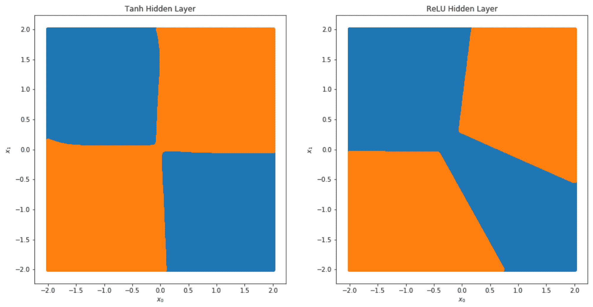
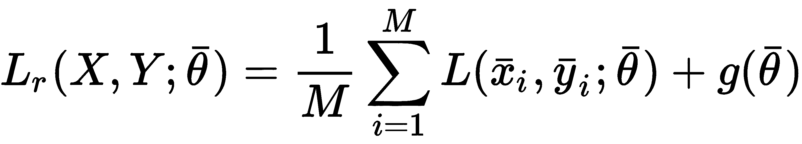

# 用于机器学习的神经网络

本章是深度学习世界的介绍，其方法使得在许多通常被认为难以管理的分类和回归领域（如图像分割、自动翻译、语音合成等）实现最先进的性能成为可能。目标是向读者提供理解全连接神经网络结构的基本工具，并使用 Python 工具 Keras（采用所有现代技术以加速训练过程并防止过拟合）对其进行建模。

特别是，本章涵盖的主题如下：

+   基本人工神经元的结构

+   感知器、线性分类器和它们的局限性

+   具有最重要的激活函数（如 ReLU）的多层感知器

+   基于**随机梯度下降**（**SGD**）优化方法的反向传播算法

+   优化的 SGD 算法（动量、RMSProp、Adam、AdaGrad 和 AdaDelta）

+   正则化和 dropout

+   批标准化

# 基本人工神经元

神经网络的基本构建块是对生物神经元的抽象，这是一个相当简单但功能强大的计算单元，由 F. Rosenblatt 于 1957 年首次提出，用于构成最简单的神经网络架构，即感知器，我们将在下一节中分析。与更符合生物学原理但有一些强烈限制的赫布学习法相反，人工神经元的设计具有实用主义观点，当然，其结构仅基于一些表征生物细胞的元素。然而，最近深度学习研究活动揭示了这种架构的巨大力量。即使存在更复杂和专门的计算单元，基本的人工神经元也可以概括为两个块的结合，这在以下图中可以清楚地看到：


神经元的输入是一个实值向量 *x ∈ ℜ^n*，而输出是一个标量 *y ∈ ℜ*。第一个操作是线性的：


向量 *w ∈ ℜ^n* 被称为**权重向量**（或**突触权重向量**，因为它类似于生物神经元，重新加权输入值），而标量项 *b ∈ ℜ* 是一个称为**偏差**的常数。在许多情况下，考虑权重向量更容易。可以通过添加一个等于 1 的额外输入特征及其相应的权重来消除偏差：


这样，唯一需要学习的是权重向量。以下块被称为**激活函数**，它负责将输入重新映射到不同的子集。如果函数是*fa = z*，则该神经元被称为线性神经元，变换可以被省略。最初的实验基于线性神经元，这些神经元的强大程度远低于非线性神经元，这也是许多研究人员认为感知机失败的原因之一，但与此同时，这种限制为一种新的架构打开了大门，这种架构反而展示了其卓越的能力。现在，让我们从这个最初提出的神经网络开始分析。

# 感知机

**感知机**是弗兰克·罗森布拉特在 1957 年给第一个神经网络模型起的名字。感知机是一个单层输入线性神经元组成的神经网络，后面跟着一个基于*sign(•)*函数的输出单元（或者，也可以考虑一个输出为-1 和 1 的双极性单元）。感知机的架构在以下图表中展示：


即使图表看起来可能相当复杂，感知机可以用以下方程来概括：


所有向量都是惯例的列向量；因此，点积*w^Tx[i]*将输入转换为一个标量，然后加上偏差，使用步进函数获得二进制输出，当*z > 0*时输出 1，否则输出 0。此时，一个读者可能会反对说步进函数是非线性的；然而，应用于输出层的非线性只是一种过滤操作，对实际计算没有影响。确实，输出已经由线性块决定，而步进函数仅用于施加二进制阈值。此外，在这个分析中，我们只考虑单值输出（即使有多类变体），因为我们的目标是展示动态和局限性，然后再转向可以用来解决极其复杂问题的更通用的架构。

感知机可以用在线算法（即使数据集是有限的）进行训练，但也可以采用离线方法，该方法重复固定次数的迭代，或者直到总误差小于预定义的阈值。该过程基于平方误差损失函数（记住，传统上，术语*loss*应用于单个样本，而术语*cost*指的是每个单个损失的求和/平均值）：


当一个样本被呈现时，会计算输出，如果输出错误，则应用权重校正（否则跳过该步骤）。为了简化，我们不考虑偏差，因为它不影响过程。我们的目标是校正权重以最小化损失。这可以通过计算相对于 *w[i]* 的偏导数来实现：


假设 *w^((0)) = (0, 0)*（忽略偏差）和样本 *x = (1, 1)*，其 *y = 1*。感知器错误地分类了该样本，因为 *sign(w^Tx) = 0*。偏导数都等于 -1；因此，如果我们从当前权重中减去它们，我们得到 *w^((1))* *= (1, 1)*，现在样本被正确分类，因为 *sign(w^Tx) = 1*。因此，包括学习率 *η*，权重更新规则如下：


当一个样本被错误分类时，权重会根据实际线性输出和真实标签之间的差异成比例地校正。这是称为 **delta 规则** 的学习规则的一个变体，它代表了最著名的训练算法的第一步，该算法在几乎任何监督深度学习场景中都被使用（我们将在下一节中讨论它）。该算法已被证明在数据集线性可分的情况下，在有限的状态数内收敛到稳定解。形式证明相当繁琐且非常技术性，但感兴趣的读者可以在 *《感知器》，Minsky M. L.，Papert S. A.，麻省理工学院出版社* 中找到。

在本章中，学习率的作用变得越来越重要，特别是在单个样本（如感知器）或小批量评估之后执行更新时。在这种情况下，高学习率（即大于 1.0 的值）可能会因为单个校正的幅度而导致收敛过程中的不稳定性。在处理神经网络时，最好使用较小的学习率并重复固定数量的训练周期。这样，单个校正被限制在较小的范围内，并且只有当它们被大多数样本/批量 *确认* 时，它们才能变得稳定，推动网络收敛到最佳解。相反，如果校正是异常值的结果，较小的学习率可以限制其作用，避免仅因为几个噪声样本而破坏整个网络。我们将在下一节中讨论这个问题。

现在，我们可以描述完整的感知器算法，并在一些重要考虑下结束本段：

1.  选择一个学习率 *η* 的值（例如 `0.1`）。

1.  将一个常数列（设置为 `1.0`）添加到样本向量 *X* 中。因此 *X[b] ∈ ℜ^(M × (n+1))*。

1.  使用具有小方差（例如 `0.05`）的正态分布随机值初始化权重向量 *w ∈ ℜ^(n+1)*。

1.  设置一个错误阈值 `Thr`（例如 `0.0001`）。

1.  设置最大迭代次数 *N[i]*。

1.  设置 `i = 0`。

1.  设置 `e = 1.0`。

1.  当 *i < N[i]* 且 *e > Thr*：

    1.  设置 `e = 0.0`。

    1.  对于 *k=1* 到 *M*：

        1.  计算线性输出 *l[k] = w^Tx[k]* 和阈值输出 *t[k] = sign(l[k])*。

        1.  如果 *t[k] != y[k]*：

            1.  计算 *Δw[j] = η(l[k] - y[k])x[k]^((j))*。

            1.  更新权重向量。

        1.  设置 *e += (l[k] - y[k])²*（或者也可以使用绝对值 *|l[k] - y[k]|*）。

    1.  设置 `e /= M`。

该算法非常简单，读者应该已经注意到了它与逻辑回归的类比。事实上，这种方法基于一个可以被认为是具有 sigmoid 输出激活函数的感知器结构（该函数输出一个可以被认为是概率的实数值）。主要区别在于训练策略——在逻辑回归中，校正是在基于负对数似然度的损失函数评估之后进行的：


这个损失函数是众所周知的交叉熵，在第一章中，我们展示了最小化它是等同于减少真实分布和预测分布之间的 Kullback-Leibler 散度。在几乎所有深度学习分类任务中，我们将利用它，归功于其鲁棒性和凸性（这是逻辑回归中的收敛保证，但不幸的是，在更复杂的架构中，这个属性通常会被丢失）。

# 使用 Scikit-Learn 的感知器示例

即使从零开始实现这个算法非常简单，我还是更喜欢使用 Scikit-Learn 的`Perceptron`实现，以便将注意力集中在导致非线性神经网络局限性的问题上。展示感知器主要弱点的*历史性*问题基于 XOR 数据集。与其解释，不如构建它并可视化其结构：

```py
import numpy as np

from sklearn.preprocessing import StandardScaler
from sklearn.utils import shuffle

np.random.seed(1000)

nb_samples = 1000
nsb = int(nb_samples / 4)

X = np.zeros((nb_samples, 2))
Y = np.zeros((nb_samples, ))

X[0:nsb, :] = np.random.multivariate_normal([1.0, -1.0], np.diag([0.1, 0.1]), size=nsb)
Y[0:nsb] = 0.0

X[nsb:(2 * nsb), :] = np.random.multivariate_normal([1.0, 1.0], np.diag([0.1, 0.1]), size=nsb)
Y[nsb:(2 * nsb)] = 1.0

X[(2 * nsb):(3 * nsb), :] = np.random.multivariate_normal([-1.0, 1.0], np.diag([0.1, 0.1]), size=nsb)
Y[(2 * nsb):(3 * nsb)] = 0.0

X[(3 * nsb):, :] = np.random.multivariate_normal([-1.0, -1.0], np.diag([0.1, 0.1]), size=nsb)
Y[(3 * nsb):] = 1.0

ss = StandardScaler()
X = ss.fit_transform(X)

X, Y = shuffle(X, Y, random_state=1000)
```

显示真实标签的图表如下所示：


XOR 数据集示例

如您所见，数据集被分为四个块，这些块的组织方式类似于逻辑异或运算符的输出。考虑到二维感知器（以及逻辑回归）的分离超曲面是一条线；很容易理解任何可能的最终配置都能达到大约 50%的准确率（一个随机猜测）。为了确认这一点，让我们尝试解决这个问题：

```py
import numpy as np

from multiprocessing import cpu_count

from sklearn.linear_model import Perceptron
from sklearn.model_selection import cross_val_score

pc = Perceptron(penalty='l2', alpha=0.1, max_iter=1000, n_jobs=cpu_count(), random_state=1000)
print(np.mean(cross_val_score(pc, X, Y, cv=10)))
0.498
```

Scikit-Learn 实现提供了通过参数`penalty`（可以是`'l1'`、`'l2'`或`'elasticnet'`）添加正则化项的可能性（见第一章，*机器学习模型基础*），以避免过拟合并提高收敛速度（强度可以使用参数`alpha`指定）。这并不总是必要的，但由于该算法提供的是一个生产就绪的包，设计者决定添加此功能。尽管如此，平均交叉验证准确率略高于 0.5（读者被邀请测试任何其他可能的超参数配置）。相应的图（可能会因不同的随机状态或后续实验而改变）如下所示：


使用感知器标记的 XOR 数据集

显然，感知器是另一个没有特定特性的线性模型，并且其使用被劝阻，以其他算法（如逻辑回归或 SVM）为优先。1957 年之后，在几年里，许多研究人员并没有隐藏他们的幻想，将神经网络视为一个从未实现的承诺。必须等到对架构的简单修改，以及一个强大的学习算法，才正式打开了通往一个新迷人机器学习分支的大门（后来称为**深度学习**）。

在 Scikit-Learn > 0.19 中，`Perceptron`类允许添加`max_iter`或`tol`（容差）参数。如果没有指定，将发出警告，通知读者未来的行为。这条信息不会影响实际结果。

# 多层感知器

感知器的主要限制是其线性。如何通过去除这种约束来利用这种架构？解决方案比任何猜测都简单。在输入和输出之间添加至少一个非线性层会导致一个高度非线性的组合，使用更多的变量进行参数化。这种架构称为**多层感知器**（**MLP**），包含一个（为了简单起见）**隐藏层**，如下所示：


这是一个所谓的**前馈网络**，意味着信息的流动从第一层开始，始终沿同一方向进行，并在输出层结束。允许部分反馈（例如，为了实现局部记忆）的架构称为**循环****网络**，将在下一章进行分析。

在这种情况下，有两个权重矩阵，*W* 和 *H*，以及两个相应的偏置向量，*b* 和 *c*。如果有 *m* 个隐藏神经元，*x[i] ∈ ℜ^(n × 1)*（列向量），和 *y[i] ∈ ℜ^(k × 1)*，动态由以下转换定义：


对于任何多层感知器（MLP）来说，一个基本条件是至少有一个隐藏层激活函数 *fh* 是非线性的。证明 m 个线性隐藏层等价于单个线性网络是直接的，因此，MLP 会退化为标准感知器的情形。传统上，给定层的激活函数是固定的，但它们的组合没有限制。特别是，输出激活通常被选择以满足精确的要求（如多标签分类、回归、图像重建等）。这就是为什么这一分析的第一步关注最常用的激活函数及其特性。

# 激活函数

通常，任何连续且可微分的函数都可以用作激活函数；然而，其中一些具有特定的性质，可以在提高学习过程速度的同时实现良好的精度。它们在最新的模型中普遍使用，理解它们的特性对于做出最合理的选择至关重要。

# Sigmoid 和双曲正切

这两种激活函数非常相似，但有一个重要的区别。让我们先来定义它们：


相应的图示如下所示：


Sigmoid 和双曲正切函数图

Sigmoid 函数 *σ(x)* 被限制在 0 和 1 之间，有两个渐近线（当 x → -∞ 时 *σ(x) → 0*，当 x → ∞ 时 *σ(x) → 1*）。同样，双曲正切（`tanh`）被限制在 -1 和 1 之间，有两个渐近线对应于极值。分析这两个图，我们可以发现，这两个函数在短范围内几乎呈线性（大约在 *[-2, 2]*），并且立即变得几乎平坦。这意味着当 *x* 在 0 附近的值较小时，梯度很高且大致恒定，而对于较大的绝对值，梯度下降到大约 0。Sigmoid 函数完美地表示一个概率或一组必须在 0 和 1 之间有界的权重，因此，它可以是一些输出层的良好选择。然而，双曲正切函数完全对称，并且，出于优化的目的，它更可取，因为性能通常更优越。这种激活函数通常在输入通常较小的情况下用于中间层。当分析反向传播算法时，原因将变得清晰；然而，显然，大的绝对输入会导致几乎恒定的输出，并且由于梯度大约为 0，权重校正可以变得极其缓慢（这个问题正式称为**梯度消失**）。因此，在许多实际应用中，通常采用下一系列的激活函数。

# 矩形激活函数

这些函数在*x > 0*时都是线性的（或 Swish 的准线性），而当*x < 0*时则不同。即使其中一些在*x = 0*时是可微的，但在此情况下导数被设置为`0`。最常见的函数如下：


相应的图表如下所示：


基本功能（同时也是最常用的）是 ReLU，当*x > 0*时具有恒定的梯度，而当*x < 0*时则为零。这个函数在视觉处理中非常常用，因为输入通常大于 0，并且具有减轻梯度消失问题的非凡优势，因为基于梯度的校正总是可能的。另一方面，当*x < 0*时，ReLU（及其一阶导数）为零，因此每个负输入都不允许任何修改。一般来说，这不是一个问题，但有些深度网络在允许小的负梯度时表现更好。这种考虑导致了其他变体，这些变体以存在超参数*α*为特征，该参数控制负尾的强度。介于 0.01 和 0.1 之间的常见值允许几乎与 ReLU 相同的行为，但*x < 0*时允许小的权重更新。最后一个函数称为 Swish，由*Searching for Activation Functions, Ramachandran P., Zoph P., Le V. L., arXiv:1710.05941 [cs.NE]*提出，基于 sigmoid，并提供了当*x → 0*时收敛到 0 的额外优势，因此*非零效应*被限制在由*[-b, 0]*（其中*b > 0*）界定的短区域内。这个函数可以提高某些特定视觉处理深度网络的性能，如上述论文中所述。然而，我总是建议从 ReLU（非常稳健且计算成本低）开始分析，只有在没有其他技术可以提高模型性能的情况下才切换到替代方案。

# Softmax

这个函数几乎定义了所有分类网络的输出层，因为它可以立即表示一个离散概率分布。如果有*k*个输出*y[i]*，softmax 的计算如下：


以这种方式，包含*k*个神经元的层的输出被归一化，使得总和始终为 1。不言而喻，在这种情况下，最好的损失函数是交叉熵。事实上，如果所有真实标签都使用 one-hot 编码表示，它们隐式地成为概率向量，其中 1 对应于真实类别。因此，分类器的目标是通过最小化函数来减少其输出的训练分布之间的差异（有关更多信息，请参阅第一章，*机器学习模型基础*）：


# 反向传播算法

现在，我们可以讨论在多层感知器（以及几乎所有其他神经网络）中使用的训练方法。这个算法与其说是实际算法，不如说是方法论；因此，我更喜欢定义主要概念，而不专注于特定案例。对实现感兴趣的读者将能够以最小的努力将相同的技巧应用于不同类型的网络（假设所有要求都已满足）。

使用深度学习模型进行训练的过程的目标通常是通过最小化成本函数来实现的。假设我们有一个用全局向量 θ 参数化的网络，成本函数（使用与损失相同的符号，但使用不同的参数来消除歧义）定义如下：


我们已经解释过，最小化前面的表达式（这是经验风险）是减少实际预期风险的一种方法，因此可以最大化准确性。因此，我们的目标是找到一个最优参数集，使得以下成立：


如果我们考虑一个单一的损失函数（与样本 x[i] 和真实标签 *y[i]* 相关），我们知道这样的函数可以用对预测值的显式依赖来表示：


现在，参数已经被嵌入到预测中。从微积分（不需要像许多关于优化技术书籍中所找到的那样过度的数学严谨性）我们知道，*L* 的梯度，一个标量函数，在任意点（我们假设 *L* 是可微的）计算出的梯度是一个具有以下分量的向量：


由于 *∇L* 总是指向最近的极大值方向，因此负梯度指向最近的极小值方向。因此，如果我们计算 *L* 的梯度，我们就得到了一个可以直接用于最小化成本函数的信息。在继续之前，揭示一个重要的数学性质——**导数的链式法则**是有用的：


现在，让我们考虑一个多层感知器（MLP）的单步（从底部开始）并利用链式法则：


向量 *y* 的每个分量都与其他分量独立，因此我们可以通过只考虑一个输出值来简化示例：


在前面的表达式中（忽略偏差），有两个重要元素——权重，*h[j]*（它们是 *H* 的列），以及表达式，*z[j]*，它是先前权重的函数。由于 *L* 又是所有预测值 *y[i]* 的函数，通过应用链式法则（使用变量 *t* 作为激活函数的通用参数），我们得到以下结果：


由于我们通常处理向量函数，使用梯度算子表达这个概念更容易。简化通用层执行的转换，我们可以将关系（相对于 *H* 的一行，因此相对于对应于隐藏单元 *z[i]* 的权重向量 *h[i]*）表示如下：


使用梯度并考虑向量输出 *y* 可以表示为 *y = (y[1], y[2], ..., y[m])*，我们可以推导出以下表达式：


这样我们就得到了相对于权重向量 *h[i]* 的 *L* 的梯度的所有分量。如果我们回溯，我们可以推导出 *z[j]* 的表达式：


重新应用链式法则，我们可以计算 *L* 对 *w[pj]* 的偏导数（为了避免混淆，预测 *y[i]* 的参数称为 *t[1]*，而 *z[j]* 的参数称为 *t[2]*）：


观察这个表达式（可以使用梯度轻松重写）并与前面的一个进行比较，可以理解**反向传播算法**的哲学，该算法首次在 *通过反向传播错误学习表示，Rumelhart D. E.，Hinton G. E.，Williams R. J.，Nature 323/1986* 中提出。样本被输入到网络中，并计算损失函数。在这个时候，过程从底部开始，计算相对于最近权重的梯度，并重用计算 δ[i]（与误差成比例）的一部分来回溯，直到达到第一层。

确实，修正是从源（损失函数）传播到起源（输入层），并且效果与每个不同权重的责任（和偏差）成比例。

考虑所有可能的不同架构，我认为为单个示例写出所有方程是无用的。方法论在概念上是简单的，它纯粹基于导数的链式法则。此外，所有现有的框架，如 Tensorflow、Caffe、CNTK、PyTorch、Theano 等，都可以通过单个操作计算整个网络的全部权重的梯度，从而使用户能够关注更实际的问题（如找到避免过拟合和改进训练过程的最佳方法）。

在前一个章节中已经概述的一个重要现象值得考虑，现在应该更清晰了：链式法则基于乘法；因此，当梯度开始变得小于 1 时，乘法效应会迫使最后值接近 0。这个问题被称为**梯度消失**，并且真的会停止使用饱和激活函数（如`sigmoid`或`tanh`）的非常深层的模型的训练过程。整流单元为许多特定问题提供了良好的解决方案，但有时当需要像双曲正切这样的函数时，必须采用其他方法，如归一化，以减轻这种现象。我们将在本章和下一章讨论一些具体技术，但一个通用的最佳实践是始终使用归一化数据集，并在必要时也测试白化的效果。

# 随机梯度下降

一旦计算出了梯度，成本函数就可以*移动*到其最小值的方向。然而，在实践中，在评估了一定数量的训练样本（批次）之后进行更新会更好。确实，通常使用的算法不会计算整个数据集的全局成本，因为这个操作可能非常计算量大。通过部分步骤获得近似值，这些步骤仅限于通过评估小部分数据集积累的经验。根据一些文献，**随机梯度下降**（**SGD**）应该只在每次更新后对每个单独的样本执行时使用。当这个操作在每*k*个样本上执行时，该算法也被称为**小批量梯度下降**；然而，传统上 SGD 指的是包含*k ≥ 1*个样本的所有批次，并且我们现在将使用这个表达式。

可以通过考虑使用包含*k*个样本的批次计算的部分成本函数来表示这个过程：


算法通过根据以下规则更新权重来执行梯度下降：


如果我们从初始配置*θ[start]*开始，随机梯度下降过程可以想象成以下图中显示的路径：


权重被移动到最小 *θ*[*opt*,]，随后会有许多后续的修正，考虑到整个数据集，这些修正也可能出错。因此，这个过程必须重复多次（epoch），直到验证准确率达到最大。在理想场景下，具有凸成本函数 L，这个简单的程序会收敛到最优配置。不幸的是，深度网络是一个非常复杂且非凸的函数，其中平台和鞍点相当常见（参见第一章，*机器学习模型基础*）。在这种情况下，普通的 SGD 不会找到全局最优解，在许多情况下甚至找不到接近的点。例如，在平坦区域，梯度可以变得非常小（也考虑到数值不精确），以至于会减慢训练过程，直到没有变化可能（所以 *θ^((t+1)) ≈ θ^((t))*）。在下一节中，我们将介绍一些常见的强大算法，这些算法已被开发出来以减轻这个问题并显著加速深度模型的收敛。

在继续之前，标记两个重要元素是很重要的。第一个与学习率*η*有关。这个超参数在学习过程中起着根本的作用。如图所示，算法从一个点跳到另一个点（这并不一定更接近最优解）。与优化算法一起，正确调整学习率至关重要。高值（如 1.0）可能会使权重变化过快，增加不稳定性。特别是，如果一批数据包含一些异常值（或简单地是非主导样本），大的*η*会将它们视为代表性元素，通过调整权重以最小化误差。然而，后续批次可能更好地代表数据生成过程，因此，算法必须部分*撤销*其修改以补偿错误的更新。因此，学习率通常很小，常见值介于 0.0001 和 0.01 之间（在某些特定情况下，*η = 0.1*也可以是一个有效的选择）。另一方面，非常小的学习率会导致最小的修正，减慢训练过程。一个好的权衡，通常是最佳实践，是让学习率随着 epoch 的变化而衰减。一开始，*η*可以更高，因为接近最优解的概率几乎为零；因此，更大的跳跃可以轻松调整。当训练过程继续进行时，权重逐渐移动到它们的最终配置，因此，修正变得越来越小。在这种情况下，应避免大的跳跃，而偏好微调。这就是为什么学习率会衰减。常见的技术包括指数衰减或线性衰减。在这两种情况下，初始值和最终值必须根据具体问题（测试不同的配置）和优化算法来选择。在许多情况下，起始值和结束值之间的比率约为 10 或更大。

另一个重要的超参数是批量大小。没有银弹能让我们自动做出正确的选择，但我们可以考虑一些因素。由于 SGD 是一个近似算法，较大的批量会导致更接近整个数据集得到的校正。然而，当样本数量极高时，我们并不期望深度模型能够将它们一一对应，相反，我们的努力是致力于提高泛化能力。这一特性也可以重新表述为，网络必须学习更少的抽象，并重复使用它们来对新样本进行分类。如果正确采样，一个批量将包含这些*抽象元素*的一部分，并且自动校正的一部分会提高后续批量的评估。你可以想象一个瀑布过程，其中新的训练步骤永远不会从头开始。然而，该算法也被称为小批量梯度下降，因为通常的批量大小通常在 16 到 512 之间（较大的尺寸不常见，但总是可能的），这些值小于总样本数（特别是在深度学习环境中）。一个合理的默认值可能是 32 个样本，但我总是建议读者测试更大的值，比较训练速度和最终准确性的性能。

当与深度神经网络一起工作时，所有的值（例如，一个层中的神经元数量、批量大小等）通常是 2 的幂。这并不是一个约束，而只是一个优化提示（尤其是在使用 GPU 时），因为当块基于*2^N*元素时，内存可以更有效地被填充。然而，这只是一个建议，其好处也可能是微不足道的；所以，不要害怕测试具有不同值的架构。例如，在许多论文中，批量大小是 100，或者某些层有 1,000 个神经元。

# 权重初始化

一个非常重要的元素是神经网络的初始配置。权重应该如何初始化？让我们假设我们将它们都设置为 0。由于一个层中的所有神经元都接收相同的输入，如果权重是 0（或任何其他常见的常数），输出将是相等的。当应用梯度校正时，所有神经元都将被同等对待；因此，网络相当于一系列的单神经元层。很明显，初始权重必须不同才能实现一个称为对称破缺的目标，但最好的选择是什么？

如果我们（也大致地）知道最终的配置，我们就可以在几次迭代中轻松地将它们设置到最优点，但不幸的是，我们不知道最小值在哪里。因此，已经开发并测试了一些经验策略，目标是尽量减少训练时间（获得最先进的准确率）。一个普遍的规则是，权重应该很小（与输入样本方差相比）。大值会导致大的输出，这会负面影响饱和函数（如`tanh`和`sigmoid`），而小值则更容易优化，因为相应的梯度更大，校正效果更强。对于整流器单元也是如此，因为最大效率是在穿过原点的区间内工作（非线性实际上就位于那里）。例如，当处理图像时，如果值是正的且很大，ReLU 神经元几乎变成了线性单元，失去了很多优势（这就是为什么图像要归一化，以便将每个像素值限制在 0 到 1 或-1 到 1 之间）。

同时，理想情况下，激活方差应该在整个网络中保持几乎恒定，以及在每个反向传播步骤之后的权重方差。这两个条件对于改善收敛过程和避免梯度消失和梯度爆炸问题（后者是梯度消失的对立面，将在关于循环网络架构的章节中讨论）是基本的。

一种非常常见的策略是考虑层中的神经元数量，并按以下方式初始化权重：


这种方法被称为**方差缩放**，可以使用输入单元数（Fan-In）、输出单元数（Fan-Out）或它们的平均值来应用。这个想法非常直观：如果输入或输出的连接数很大，权重必须更小，以避免大的输出。在单神经元退化的情况下，方差设置为`1.0`，这是允许的最大值（通常，所有方法都将偏差的初始值保持为 0.0，因为不需要用随机值初始化它们）。

还提出了其他变体，尽管它们都共享相同的基本思想。**LeCun**提出了以下初始化权重的建议：


另一种称为**Xavier 初始化**（在*Understanding the difficulty of training deep feedforward neural networks, Glorot X., Bengio Y., Proceedings of the 13th International Conference on Artificial Intelligence and Statistics*）的方法与**LeCun 初始化**类似，但它基于两个连续层的单元数的平均值（为了标记顺序，我们将 Fan-In 和 Fan-Out 术语替换为显式索引）：


这是一个更稳健的变体，因为它考虑了输入连接和输出连接（反过来也是输入连接）。目标（作者在上述论文中广泛讨论）是试图满足之前提出的两个要求。第一个要求是避免每层激活方差中的振荡（理想情况下，这个条件可以避免饱和）。第二个要求与反向传播算法严格相关，其基于观察，当采用方差缩放（或等效的均匀分布）时，权重矩阵的方差与*3n[k]*的倒数成正比。

因此，Fan-In 和 Fan-Out 的平均值乘以三，试图避免更新后权重的大幅变化。Xavier 初始化在许多深度架构中已被证明非常有效，并且通常是默认选择。

其他方法基于在正向传播和反向传播阶段以不同方式测量方差，并尝试校正这些值以最小化特定环境中的残差振荡。例如，He、Zhang、Ren 和 Sun（在 *Delving Deep into Rectifiers: Surpassing Human-Level Performance on ImageNet Classification, He K., Zhang X., Ren S., Sun J., arXiv:1502.01852 [cs.CV]*) 基于 ReLU 或可变 Leaky-ReLU 激活（也称为 PReLU，参数化 ReLU）分析了卷积网络（我们将在下一章讨论）的初始化问题，推导出一个最优标准（通常称为**He 初始化器**），它与 Xavier 初始化器略有不同：


所有这些方法都共享一些共同原则，并且在许多情况下可以互换。如前所述，Xavier 是最稳健的之一，在大多数现实问题中，没有必要寻找其他方法；然而，读者应始终意识到，深度模型的复杂性必须经常使用基于有时简单数学假设的经验方法来面对。只有通过真实数据集的验证，才能确认一个假设是正确的，或者是否需要继续在其他方向上进行研究。

# Keras 中的 MLP 示例

Keras（[`keras.io`](https://keras.io)）是一个强大的 Python 工具包，它允许以最小的努力建模和训练复杂的深度学习架构。它依赖于底层框架，如 Tensorflow、Theano 或 CNTK，并提供高级块来构建模型的单个层。在这本书中，我们需要非常实用，因为没有空间进行完整的解释；然而，所有示例都将结构化，以便读者在没有全面知识的情况下尝试不同的配置和选项（对于更详细的信息，我建议阅读书籍《使用 Keras 的深度学习》，作者 A. Gulli 和 S. Pal，Packt 出版社）。

在这个示例中，我们想要构建一个包含单个隐藏层的小型 MLP 来解决 XOR 问题（数据集与上一个示例中创建的相同）。最简单和最常见的方法是实例化`Sequential`类，它定义了一个*空容器*，用于不定型的模型。在这个初始部分，基本方法是`add()`，它允许向模型添加一个层。对于我们的示例，我们想要使用四个具有双曲正切激活的隐藏层和两个 softmax 输出层。以下代码片段定义了 MLP：

```py
from keras.models import Sequential
from keras.layers import Dense, Activation

model = Sequential()

model.add(Dense(4, input_dim=2))
model.add(Activation('tanh'))

model.add(Dense(2))
model.add(Activation('softmax'))
```

`Dense`类定义了一个全连接层（一个*经典*的多层感知器层），第一个参数用于声明所需的单元数。第一层必须声明`input_shape`或`input_dim`，它们指定单个样本的维度（或形状）（批处理大小被省略，因为它由框架动态设置）。所有后续层都会自动计算维度。Keras 的一个优点是能够避免设置许多参数（如权重初始化器），因为它们将自动使用最合适的默认值进行配置（例如，默认权重初始化器是 Xavier）。在接下来的示例中，我们将明确设置其中的一些，但我建议读者查阅官方文档，以了解所有可能性和功能。另一个参与此实验的层是`Activation`，它指定所需的激活函数（也可以通过几乎所有层实现的参数`activation`来声明，但我更喜欢解耦操作以强调单一角色，并且也因为一些技术——例如批量归一化——通常在激活之前应用于线性输出）。

在这个阶段，我们必须要求 Keras 编译模型（使用首选的后端）：

```py
model.compile(optimizer='adam',
              loss='categorical_crossentropy',
              metrics=['accuracy'])
```

参数`optimizer`定义了我们想要使用的随机梯度下降算法。使用`optimizer='sgd'`，可以实现标准版本（如前一段所述）。在这种情况下，我们使用的是 Adam（默认参数），这是一个性能更优的变体，将在下一节讨论。参数`loss`用于定义成本函数（在这种情况下，是交叉熵），而`metrics`是一个包含我们想要计算的评估分数的列表（对于许多分类任务，`'accuracy'`就足够了）。一旦模型被编译，就可以对其进行训练：

```py
from keras.utils import to_categorical

from sklearn.model_selection import train_test_split

X_train, X_test, Y_train, Y_test = train_test_split(X, Y, test_size=0.3, random_state=1000)

model.fit(X_train, 
          to_categorical(Y_train, num_classes=2), 
          epochs=100, 
          batch_size=32,
          validation_data=(X_test, to_categorical(Y_test, num_classes=2)))

Train on 700 samples, validate on 300 samples
Epoch 1/100
700/700 [==============================] - 1s 2ms/step - loss: 0.7227 - acc: 0.4929 - val_loss: 0.6943 - val_acc: 0.5933
Epoch 2/100
700/700 [==============================] - 0s 267us/step - loss: 0.7037 - acc: 0.5371 - val_loss: 0.6801 - val_acc: 0.6100
Epoch 3/100
700/700 [==============================] - 0s 247us/step - loss: 0.6875 - acc: 0.5871 - val_loss: 0.6675 - val_acc: 0.6733

...

Epoch 98/100
700/700 [==============================] - 0s 236us/step - loss: 0.0385 - acc: 0.9986 - val_loss: 0.0361 - val_acc: 1.0000
Epoch 99/100
700/700 [==============================] - 0s 261us/step - loss: 0.0378 - acc: 0.9986 - val_loss: 0.0355 - val_acc: 1.0000
Epoch 100/100
700/700 [==============================] - 0s 250us/step - loss: 0.0371 - acc: 0.9986 - val_loss: 0.0347 - val_acc: 1.0000
```

操作相当简单。我们将数据集分为训练集和测试/验证集（在深度学习中，很少使用交叉验证），然后我们设置了`batch_size=32`和`epochs=100`来训练模型。在每个 epoch 的开始，数据集会自动打乱，除非设置`shuffle=False`。为了将离散标签转换为 one-hot 编码，我们使用了`to_categorical`实用函数。在这种情况下，标签 0 变为(1, 0)，标签 1 变为(0, 1)。模型在达到 100 个 epoch 之前就收敛了；因此，我邀请读者将参数优化作为练习。然而，在过程结束时，训练准确率约为 0.999，验证准确率为 1.0。

最终的分类图如下所示：


XOR 数据集的 MLP 分类

只有三个点被错误分类，但很明显，MLP 成功地将 XOR 数据集分离。为了确认泛化能力，我们绘制了双曲正切隐藏层和 ReLU 隐藏层的决策表面：



使用 Tanh（左侧）和 ReLU（右侧）隐藏层的 MLP 决策表面

在这两种情况下，MLPs 都以合理的方式划定了区域。然而，虽然`tanh`隐藏层似乎过度拟合（在我们的案例中并非如此，因为数据集正好代表了数据生成过程），ReLU 层生成的边界则不够平滑，方差明显较低（特别是对于考虑类中的异常值）。我们知道最终的验证准确率证实了几乎完美的拟合，决策图（在两个维度上容易创建）在两种情况下都显示了可接受的边界，但这个简单的练习有助于理解深度模型的复杂性和敏感性。因此，绝对有必要选择一个有效的训练集（代表真实情况）并采用所有可能的技巧来避免过度拟合（正如我们稍后将要讨论的）。检测这种情况的最简单方法就是检查验证损失。一个好的模型应该在每个 epoch 后减少训练和验证损失，后者的损失达到平台期。如果在*n*个 epoch 后，验证损失（以及随之而来的准确率）开始增加，而训练损失继续下降，这意味着模型正在过度拟合训练集。

另一个表明训练过程正在正确演变的经验指标是，至少在开始时，验证准确率应该高于训练准确率。这看起来可能有些奇怪，但我们需要考虑验证集比训练集略小且复杂度更低；因此，如果模型的容量没有因训练样本而饱和，训练集的误分类概率将高于验证集。当这种趋势逆转时，模型在经过几个 epoch 后很可能过度拟合。为了验证这些概念，我邀请读者使用大量隐藏神经元（以显著增加容量）重复此练习，但在处理更加复杂和无结构的数据集时，这些概念将更加清晰。

可以使用命令`pip install -U keras`安装 Keras。默认框架是支持 CPU 的 Theano。为了使用其他框架（如 Tensorflow GPU），我建议阅读主页上报告的说明[`keras.io`](https://keras.io)。正如作者所建议的，最好的后端是 Tensorflow，它适用于 Linux、Mac OSX 和 Windows。要安装它（以及所有依赖项），请遵循以下页面上的说明：[`www.tensorflow.org/install/`](https://www.tensorflow.org/install/)

# 优化算法

在讨论反向传播算法时，我们展示了如何将 SGD 策略轻松地应用于训练大型数据集的深度网络。这种方法相当稳健且有效；然而，要优化的函数通常是非凸的，参数数量极其庞大。这些条件大大增加了找到鞍点（而不是局部最小值）的概率，当表面几乎平坦时，这可能会减慢训练过程。

将 *vanilla* SGD 算法应用于这些系统的常见结果如下所示：


算法不是达到最优配置 *θ[opt]*，而是达到次优参数配置 *θ*[*subopt*,]，并失去了执行进一步修正的能力。为了减轻所有这些问题及其后果，已经提出了许多 SGD 优化算法，目的是加快收敛速度（即使在梯度变得非常小的情况下）并避免不良条件系统的稳定性问题。

# 梯度扰动

当超曲面平坦（平台期）时，梯度接近零，这会出现一个常见问题。缓解这个问题的一个非常简单的方法是在梯度中添加一个小的同质噪声成分：


协方差矩阵通常是正交的，所有元素都设置为 *σ²(t)*，这个值在训练过程中会衰减，以避免在修正非常小的时候产生扰动。这个方法在概念上是合理的，但当噪声成分占主导地位时，其隐含的随机性可能会产生不期望的效果。由于在深度模型中很难调整方差，因此已经提出了其他（更确定性的）策略。

# 动量和 Nesterov 动量

当遇到平台期时，一种更稳健的方法是基于动量的想法（类似于物理动量）。更正式地说，动量是通过使用后续梯度估计的加权移动平均而不是瞬时值来获得的：


新向量*v*^(*(t)*,)包含一个基于过去历史（并使用参数*μ*加权，*μ*是一个遗忘因子）的分量，以及一个与当前梯度估计相关的项（乘以学习率）。采用这种方法，突兀的变化变得更加困难，当探索离开斜坡区域进入平台期时，动量不会立即变为零（但与*μ*成比例的一段时间内），部分先前梯度将被保留，这使得穿越平坦区域成为可能。分配给超参数μ的值通常介于 0 和 1 之间。直观地说，较小的值意味着短期记忆，因为第一项衰减非常快，而接近 1.0（例如，0.9）的值允许更长的记忆，受局部振荡的影响较小。像许多其他超参数一样，μ需要根据具体问题进行调整，考虑到高动量并不总是最佳选择。当需要非常小的调整时，高值可能会减慢收敛速度，但与此同时，接近 0.0 的值通常无效，因为记忆贡献衰减得太早。使用动量，更新规则变为如下：


**Nesterov 动量**提供了一种变体，它基于 Nesterov 在数学优化领域的成果，这些成果已被证明可以加速许多算法的收敛。其思路是根据当前动量确定一个临时参数更新，然后将梯度应用到这个向量上以确定下一个动量（可以解释为一种*前瞻性*梯度评估，旨在减轻考虑每个参数移动历史时的错误校正风险）：


该算法在几个深度模型中显示出性能提升；然而，由于其使用仍然有限，因为接下来的算法很快超过了标准的带有动量的 SGD，并且它们几乎成为任何实际任务的首选。

# Keras 中的带有动量的 SGD

当使用 Keras 时，可以通过直接实例化`SGD`类并在编译模型时使用它来自定义 SGD 优化器：

```py
from keras.optimizers import SGD

...

sgd = SGD(lr=0.0001, momentum=0.8, nesterov=True)

model.compile(optimizer=sgd,
              loss='categorical_crossentropy',
              metrics=['accuracy'])
```

`SGD`类接受参数`lr`（学习率*η*，默认设置为`0.01`），`momentum`（参数*μ*），`nesterov`（一个布尔值，表示是否采用 Nesterov 动量），以及一个可选的`decay`参数，以指示学习率是否需要在更新过程中衰减，使用以下公式：


# RMSProp

**RMSProp**是由 Hinton 提出的自适应算法，部分基于动量的概念。它不是考虑整个梯度向量，而是试图分别优化每个参数，以增加缓慢变化的权重的校正（可能需要更剧烈的修改）并减少快速变化的更新幅度（通常是更不稳定的）。该算法计算每个参数的*变化速度*的指数加权移动平均，考虑梯度的平方（对符号不敏感）：


然后按照以下方式执行权重更新：


参数*δ*是一个小的常数（例如 10^(-6)），在变化速度变为零时添加以避免数值不稳定性。前面的表达式可以以更紧凑的方式重写：


使用这种表示法，可以清楚地看出 RMSProp 的作用是调整每个参数的学习率，以便在必要时增加它（几乎*冻结*的权重）并在振荡风险更高时降低它。在实际实现中，学习率总是通过指数或线性函数在 epoch 中衰减。

# RMSProp 与 Keras

以下代码片段展示了在 Keras 中使用 RMSProp 的方法：

```py
from keras.optimizers import RMSprop

...

rms_prop = RMSprop(lr=0.0001, rho=0.8, epsilon=1e-6, decay=1e-2)

model.compile(optimizer=rms_prop,
              loss='categorical_crossentropy',
              metrics=['accuracy'])
```

学习率和衰减与 SGD 相同。参数`rho`对应于指数移动平均权重μ，而`epsilon`是添加到变化速度中的常数，以提高稳定性。与任何其他算法一样，如果用户想使用默认值，可以在不实例化类的情况下声明优化器（例如，`optimizer='rmsprop'`）。

# Adam

**Adam**（自适应矩估计的缩写）是由 Kingma 和 Ba（在*Adam: A Method for Stochastic Optimization, Kingma D. P., Ba J., arXiv:1412.6980 [cs.LG]**）提出的算法，旨在进一步提高 RMSProp 的性能。该算法通过计算每个参数的梯度和其平方的指数加权平均来确定自适应学习率：


在上述论文中，作者建议通过除以*1 - μ[i]*来消除两个估计（涉及第一和第二矩）的偏差，因此新的移动平均变为以下形式：


Adam 的权重更新规则如下：


分析前面的表达式，可以理解为什么这个算法通常被称为带有动量的 RMSProp。实际上，项 *g(•)* 就像标准的动量一样，计算每个参数的梯度移动平均值（具有此过程的全部优点），而分母则充当具有与 RMSProp 相同精确语义的自适应项。因此，Adam 非常经常是应用最广泛的算法之一，尽管在许多复杂任务中，其性能与标准 RMSProp 相当。选择必须考虑到由于存在两个遗忘因子而带来的额外复杂性。一般来说，默认值（0.9）是可以接受的，但有时在决定特定配置之前进行几个场景的分析会更好。另一个需要记住的重要元素是，所有基于动量的方法都可能导致训练某些深度架构时的不稳定性（振荡）。这就是为什么 RMSProp 几乎在所有研究论文中都广泛使用；然而，不要将此声明视为限制，因为 Adam 在许多任务中已经显示出卓越的性能。记住，当训练过程似乎不稳定，即使学习率较低时，最好使用不基于动量的方法（惯性项实际上会减慢避免振荡所需的快速修改）。

# 使用 Keras 的 Adam

以下代码片段展示了如何在使用 Keras 时使用 Adam：

```py
from keras.optimizers import Adam

...

adam = Adam(lr=0.0001, beta_1=0.9, beta_2=0.9, epsilon=1e-6, decay=1e-2)

model.compile(optimizer=adam,
              loss='categorical_crossentropy',
              metrics=['accuracy'])
```

遗忘因子 *μ[1]* 和 *μ*[*2*,] 分别由参数 `beta_1` 和 `beta_2` 表示。所有其他元素与其他算法相同。

# AdaGrad

该算法由 Duchi、Hazan 和 Singer 提出（在 *Adaptive Subgradient Methods for Online Learning and Stochastic Optimization, Duchi J., Hazan E., Singer Y., Journal of Machine Learning Research 12/2011)*。这个想法与 RMSProp 非常相似，但在这个情况下，考虑了平方梯度的整个历史：


权重的更新方式与 RMSProp 完全相同：


然而，由于平方梯度是非负的，当 *t → ∞* 时，隐含的和 *v^((t))(•) → ∞*。由于增长会持续到梯度非零，所以在训练过程中无法保持贡献的稳定性。通常在开始时效果非常明显，但在有限的几个 epoch 之后就会消失，导致学习率为零。**AdaGrad** 在 epoch 数量非常有限时仍然是一个强大的算法，但它不能成为大多数深度模型的首选解决方案（下一个算法已经被提出以解决这个问题）。

# 使用 Keras 的 AdaGrad

以下代码片段展示了在使用 Keras 时使用 AdaGrad 的用法：

```py
from keras.optimizers import Adagrad

...

adagrad = Adagrad(lr=0.0001, epsilon=1e-6, decay=1e-2)

model.compile(optimizer=adagrad,
              loss='categorical_crossentropy',
              metrics=['accuracy'])
```

AdaGrad 的实现没有其他参数，只有常见的那些。

# AdaDelta

**AdaDelta** 是一个算法（由 Zeiler M. D. 提出，发表在 *ADADELTA: An Adaptive Learning Rate Method, Zeiler M. D., arXiv:1212.5701 [cs.LG]*)，旨在解决 AdaGrad 的主要问题，即管理整个平方梯度历史。首先，AdaDelta 不是使用累加器，而是使用指数加权移动平均，类似于 RMSProp：


然而，与 RMSProp 的主要区别在于对更新规则的分析。当我们考虑操作 *x + Δx* 时，我们假设这两个项具有相同的单位；然而，作者注意到，使用 RMSProp（以及 AdaGrad）获得的自适应学习率 *η(θ[i]*) 是无单位的（而不是具有 *θ[i]* 的单位）。事实上，由于梯度被分解为可以近似为 *ΔL/Δθ[i]* 的偏导数，并且假设成本函数 *L* 是无单位的，我们得到以下关系：


因此，Zeiler 提出应用一个与每个权重单位 *θ[i]* 成比例的校正项。这个因子是通过考虑每个平方差的指数加权移动平均得到的：


因此，更新的规则因此变为如下：


这种方法确实与 RMSProp 更相似，但两种算法之间的界限非常微妙，尤其是在历史记录仅限于有限滑动窗口的情况下。AdaDelta 是一个强大的算法，但它只能在非常特定的任务中优于 Adam 或 RMSProp。我的建议是采用一种方法，并且在转向另一种方法之前，尝试优化超参数，直到准确率达到最大。如果性能持续不佳，并且模型无法以任何其他方式改进，那么测试其他优化算法是一个好主意。

# AdaDelta 与 Keras

以下代码片段展示了在 Keras 中使用 AdaDelta 的用法：

```py
from keras.optimizers import Adadelta

...

adadelta = Adadelta(lr=0.0001, rho=0.9, epsilon=1e-6, decay=1e-2)

model.compile(optimizer=adadelta,
              loss='categorical_crossentropy',
              metrics=['accuracy'])
```

忘记因子，*μ*，由参数 `rho` 表示。

# 正则化和 dropout

过度拟合是深度模型中常见的问题。即使数据集非常大，它们的极高容量也可能成为问题，因为学习训练集结构的能力并不总是与泛化能力相关。深度神经网络可以轻易地成为一个联想记忆，但最终的内部配置可能并不是最适合管理属于同一分布但从未在训练过程中出现过的样本。不言而喻，这种行为与分离超面的复杂性成正比。线性分类器过度拟合的可能性最小，而多项式分类器则极其容易过度拟合。数百、数千或更多非线性函数的组合产生一个分离超面，这超出了任何可能的分析。1991 年，Hornik 在《多层前馈网络的逼近能力》（Hornik K., Neural Networks, 4/2）中推广了数学家 Cybenko 两年前获得的一个非常重要的结果（发表在《通过 Sigmoid 函数的叠加逼近》（Cybenko G., Mathematics of Control, Signals, and Systems, 2 /4）上）。无需任何数学细节（尽管这并不复杂），该定理表明 MLP（不是最复杂的架构！）可以逼近在*ℜ^n*的紧子集上连续的任何函数。很明显，这样的结果形式化了几乎所有研究人员已经直觉上知道的事情，但其*力量*超越了最初的影响，因为 MLP 是一个有限系统（而不是数学级数），并且该定理假设有限层数和神经元数。显然，精度与复杂性成正比；然而，对于几乎所有问题都没有不可接受的限制。然而，我们的目标不是学习现有的连续函数，而是管理从未知数据生成过程中抽取的样本，目的是在新的样本出现时最大化准确性。无法保证函数是连续的，或者域是紧子集。

在第一章《机器学习模型基础》中，我们介绍了基于略微修改的成本函数的主要正则化技术：



额外的项 *g(θ)* 是权重（例如 L2 范数）的非负函数，它迫使优化过程尽可能保持参数尽可能小。当与饱和函数（例如 `tanh`）一起工作时，基于 L2 范数的正则化方法试图限制函数的操作范围在线性部分，从而实际上减少了其容量。当然，最终的配置不会是最佳配置（这可能是一个过拟合模型的产物），而是在训练和验证准确率（或者说是偏差和方差）之间的次优权衡。一个偏差接近 0（且训练准确率接近 1.0）的系统在分类中可能会非常僵硬，只有在样本与训练过程中评估的样本非常相似时才能成功。这就是为什么在考虑使用新样本获得的优势时，这种 *代价* 通常会被支付。L2 正则化可以与任何类型的激活函数一起使用，但效果可能不同。例如，当权重非常大时，ReLU 单元有更大的概率变得线性（或始终为空）。试图将它们保持在 0.0 附近意味着迫使函数利用其非线性，而不存在产生极端大输出的风险（这可能会对非常深的架构产生负面影响）。有时，这种结果可能更有用，因为它允许以更平滑的方式训练更大的模型，并获得更好的最终性能。一般来说，几乎不可能在没有进行多次测试的情况下决定正则化是否可以改进结果，但有一些场景中，引入 dropout（我们将在下一段讨论这种方法）并调整其超参数是非常常见的。这更多的是一种经验选择，而不是精确的架构决策，因为许多现实生活中的例子（包括最先进的模型）通过使用这种正则化技术获得了出色的结果。我建议读者在选择特定解决方案之前，对模型进行理性怀疑和双重检查。有时，一个性能极高的网络在选择了不同的（但类似）数据集后，可能会变得无效。这就是为什么测试不同的替代方案可以为解决特定问题类别提供最佳体验。

在继续之前，我想展示如何使用 Keras 实现一个 L1（用于强制稀疏性）、L2 或 ElasticNet（L1 和 L2 的组合）正则化。该框架提供了一种细粒度方法，允许对每个层施加不同的约束。例如，以下代码片段展示了如何将强度参数设置为 `0.05` 的 `l2` 约束添加到一个通用的全连接层：

```py
from keras.layers import Dense
from keras.regularizers import l2

...

model.add(Dense(128, kernel_regularizer=l2(0.05)))
```

`keras.regularizers`包包含`l1()`、`l2()`和`l1_l2()`函数，这些函数可以应用于`Dense`和卷积层（我们将在下一章中讨论它们）。这些层允许我们对权重（`kernel_regularizer`）、偏差（`bias_regularizer`）和激活输出（`activation_regularizer`）施加正则化，尽管第一个通常是最广泛使用的。

或者，也可以对权重和偏差施加特定的约束，以更选择性的方式。以下代码片段展示了如何设置一个层的权重最大范数（等于`1.5`）：

```py
from keras.layers import Dense
from keras.constraints import maxnorm

...

model.add(Dense(128, kernel_constraint=maxnorm(1.5)))
```

Keras 的`keras.constraints`包提供了一些函数，可以用来对权重或偏差施加最大范数`maxnorm()`，沿轴的单位范数`unit_norm()`，非负性`non_neg()`，以及范数的上下限`min_max_norm()`。这种方法与正则化的区别在于它仅在必要时应用。考虑到前面的例子，施加 L2 正则化始终有效，而最大范数约束在值低于预定义阈值之前是无效的。

# Dropout

这种方法是由 Hinton 及其同事（在《通过防止特征检测器的共适应改进神经网络，Hinton G. E.，Srivastava N.，Krizhevsky A.，Sutskever I.，Salakhutdinov R. R.，arXiv:1207.0580 [cs.NE]》中提出）作为防止过拟合和允许更大网络探索样本空间更多区域的替代方案。这个想法相当简单——在每一步训练中，给定一个预定义的百分比 *n[d]*，一个**dropout**层随机选择 *n[d]N* 个输入单元并将它们设置为 `0.0`（该操作仅在训练阶段有效，当模型用于新预测时则完全移除）。

这种操作可以有多种解释。当使用更多的 dropout 层时，它们选择的结果是一个容量减少的子网络，它可能更难以过拟合训练集。许多训练子网络的交集构成一个隐式集成，其预测是所有模型平均的结果。如果 dropout 应用于输入层，它就像是一种弱数据增强，通过向样本添加随机噪声（将一些单元设置为零可能导致潜在的损坏模式）。同时，使用多个 dropout 层允许探索几个潜在配置，这些配置不断组合和优化。

这种策略显然是概率性的，结果可能会受到许多难以预料的因素的影响；然而，几个测试证实，当网络非常深时，使用 dropout 是一个不错的选择，因为由此产生的子网络具有残余能力，允许它们模拟大量样本，而不会使整个网络在训练集上过度拟合而“冻结”其配置。另一方面，当网络较浅或包含较少的神经元时（在这些情况下，L2 正则化可能是一个更好的选择），这种方法并不非常有效。

根据作者的说法，dropout 层应该与高学习率和权重上的最大范数约束一起使用。实际上，这样模型可以轻松地学习更多潜在的配置，这些配置在保持非常小的学习率时会被避免。然而，这并不是一个绝对规则，因为许多最先进的模型使用 dropout 与优化算法（如 RMSProp 或 Adam）一起使用，而不是过高的学习率。

dropout 的主要缺点是它会减慢训练过程，并可能导致不可接受的次优化。后者的问题可以通过调整丢弃单元的百分比来缓解，但通常很难完全解决这个问题。因此，一些新的图像识别模型（如残差网络）避免了 dropout，并采用更复杂的技巧来训练非常深的卷积网络，这些网络会过度拟合训练集和验证集。

# Keras 中 dropout 的示例

我们无法用一个更具挑战性的分类问题来测试 dropout 的有效性。数据集是*经典*的 MNIST 手写数字数据集，但 Keras 允许下载并使用由 70,000 个（60,000 个训练和 10,000 个测试）28 × 28 灰度图像组成的原始版本。即使这不是最佳策略，因为卷积网络应该是处理图像的首选，我们仍想尝试将数字视为 784 维的展平数组来对它们进行分类。

第一步是加载和归一化数据集，使得每个值都成为一个介于 0 和 1 之间的浮点数：

```py
import numpy as np

from keras.datasets import mnist
from keras.utils import to_categorical

(X_train, Y_train), (X_test, Y_test) = mnist.load_data()

width = height = X_train.shape[1]

X_train = X_train.reshape((X_train.shape[0], width * height)).astype(np.float32) / 255.0
X_test = X_test.reshape((X_test.shape[0], width * height)).astype(np.float32) / 255.0

Y_train = to_categorical(Y_train, num_classes=10)
Y_test = to_categorical(Y_test, num_classes=10)
```

在这一点上，我们可以开始测试一个没有 dropout 的模型。所有实验共有的结构是基于三个全连接 ReLU 层（2048-1024-1024），随后是一个有 10 个单位的 softmax 层。考虑到这个问题，我们可以尝试使用 Adam 优化器来训练模型，其中*η = 0.0001*，并且将衰减设置为*10^(-6)*：

```py
from keras.models import Sequential
from keras.layers import Dense, Activation
from keras.optimizers import Adam

model = Sequential()

model.add(Dense(2048, input_shape=(width * height, )))
model.add(Activation('relu'))

model.add(Dense(1024))
model.add(Activation('relu'))

model.add(Dense(1024))
model.add(Activation('relu'))

model.add(Dense(10))
model.add(Activation('softmax'))

model.compile(optimizer=Adam(lr=0.0001, decay=1e-6),
             loss='categorical_crossentropy',
             metrics=['accuracy'])
```

模型以`256`个样本的批次大小训练了`200`个 epoch：

```py
history = model.fit(X_train, Y_train,
                    epochs=200,
                    batch_size=256,
                    validation_data=(X_test, Y_test))

Train on 60000 samples, validate on 10000 samples
Epoch 1/200
60000/60000 [==============================] - 11s 189us/step - loss: 0.4026 - acc: 0.8980 - val_loss: 0.1601 - val_acc: 0.9523
Epoch 2/200
60000/60000 [==============================] - 7s 116us/step - loss: 0.1338 - acc: 0.9621 - val_loss: 0.1062 - val_acc: 0.9669
Epoch 3/200
60000/60000 [==============================] - 7s 124us/step - loss: 0.0872 - acc: 0.9744 - val_loss: 0.0869 - val_acc: 0.9732

...

Epoch 199/200
60000/60000 [==============================] - 7s 114us/step - loss: 1.1935e-07 - acc: 1.0000 - val_loss: 0.1214 - val_acc: 0.9838
Epoch 200/200
60000/60000 [==============================] - 7s 116us/step - loss: 1.1935e-07 - acc: 1.0000 - val_loss: 0.1214 - val_acc: 0.9840
```

即使没有进一步的分析，我们也可以立即注意到模型过拟合了。在 200 个 epoch 后，训练准确率为 1.0，损失接近 0.0，而验证准确率合理，但验证损失略低于第二个 epoch 结束时的损失。

为了更好地理解发生了什么，在训练过程中绘制准确率和损失是有用的：


如您所见，验证损失在最初的 10 个 epoch 达到了最小值，并立即开始增长（由于其形状有时被称为 U 曲线）。在同一时刻，训练准确率达到了 1.0。从那个 epoch 开始，模型开始过拟合，学习训练集的完美结构，但失去了泛化能力。实际上，即使最终的验证准确率相当高，损失函数表明当呈现新的样本时，缺乏鲁棒性。由于损失是分类交叉熵，结果可以解释为模型学习了一个部分不匹配验证集的分布。由于我们的目标是使用模型来预测新的样本，这种配置是不可接受的。因此，我们再次尝试，使用一些 dropout 层。正如作者所建议的，我们还增加了学习率到 0.1（切换到动量 SGD 优化器以避免由于 RMSProp 或 Adam 的自适应性导致的*爆炸*），使用均匀分布（*-0.05, 0.05*）初始化权重，并施加最大范数约束，设置为 2.0。这个选择允许探索更多的子配置，而不存在权重过高的风险。dropout 应用于 25%的输入单元和所有 ReLU 全连接层，百分比设置为 50%：

```py
from keras.constraints import maxnorm
from keras.models import Sequential
from keras.layers import Dense, Activation, Dropout
from keras.optimizers import SGD

model = Sequential()

model.add(Dropout(0.25, input_shape=(width * height, ), seed=1000))

model.add(Dense(2048, kernel_initializer='uniform', kernel_constraint=maxnorm(2.0)))
model.add(Activation('relu'))
model.add(Dropout(0.5, seed=1000))

model.add(Dense(1024, kernel_initializer='uniform', kernel_constraint=maxnorm(2.0)))
model.add(Activation('relu'))
model.add(Dropout(0.5, seed=1000))

model.add(Dense(1024, kernel_initializer='uniform', kernel_constraint=maxnorm(2.0)))
model.add(Activation('relu'))
model.add(Dropout(0.5, seed=1000))

model.add(Dense(10))
model.add(Activation('softmax'))

model.compile(optimizer=SGD(lr=0.1, momentum=0.9),
              loss='categorical_crossentropy',
              metrics=['accuracy'])
```

训练过程使用相同的参数进行：

```py
history = model.fit(X_train, Y_train,
                    epochs=200,
                    batch_size=256,
                    validation_data=(X_test, Y_test))

Train on 60000 samples, validate on 10000 samples
Epoch 1/200
60000/60000 [==============================] - 11s 189us/step - loss: 0.4964 - acc: 0.8396 - val_loss: 0.1592 - val_acc: 0.9511
Epoch 2/200
60000/60000 [==============================] - 6s 97us/step - loss: 0.2300 - acc: 0.9300 - val_loss: 0.1081 - val_acc: 0.9645
Epoch 3/200
60000/60000 [==============================] - 6s 93us/step - loss: 0.1867 - acc: 0.9435 - val_loss: 0.0941 - val_acc: 0.9713

...

Epoch 199/200
60000/60000 [==============================] - 6s 99us/step - loss: 0.0184 - acc: 0.9939 - val_loss: 0.0473 - val_acc: 0.9884
Epoch 200/200
60000/60000 [==============================] - 6s 101us/step - loss: 0.0190 - acc: 0.9941 - val_loss: 0.0484 - val_acc: 0.9883
```

最终条件发生了戏剧性的变化。模型不再过拟合（即使有可能通过提高验证准确率来改进它）并且验证损失低于初始值。为了确认这一点，让我们分析准确率/损失图：


结果显示了一些不完美之处，因为验证损失在许多 epoch 中几乎呈平坦状态；然而，具有更高学习率和较弱算法的相同模型实现了更好的最终性能（0.988 验证准确率）和更优越的泛化能力。最先进的模型也可以达到 0.995 的验证准确率，但我们的目标是展示 dropout 层在防止过拟合以及产生对新的样本或噪声样本具有更多鲁棒性的最终配置的效果。我邀请读者用不同的参数、更大或更小的网络和其他优化算法重复实验，以进一步降低最终的验证损失。

Keras 还实现了两个额外的 dropout 层：`GaussianDropout`，它将输入样本乘以高斯噪声：


常数ρ的值可以通过参数`rate`（介于 0 和 1 之间）来设置。当*ρ → 1*时，*σ² → ∞*，而较小的值会导致*n ≈ 1*时产生零效果。这一层作为输入一，可以非常有用，以便模拟随机数据增强过程。另一类是`AlphaDropout`，它的工作方式与前面类似，但重新归一化输出以保持原始均值和方差（这种效果与在下一段中描述的技术结合噪声层获得的效果非常相似）。

当与概率层（如 dropout）一起工作时，我总是建议设置随机种子（当使用 Tensorflow 后端时，使用`np.random.seed(...)`和`tf.set_random_seed(...)`）。这样，就可以在没有偏差的情况下重复实验，比较结果。如果没有明确设置随机种子，每次新的训练过程都会不同，比较性能并不容易，例如，在固定数量的 epoch 之后。

# 批量归一化

让我们考虑一个包含*k*个样本的小批量：


在遍历网络之前，我们可以测量均值和方差：


在第一层之后（为了简单起见，让我们假设激活函数*f(•)*始终相同），批次被转换成以下形式：


通常，不能保证新的均值和方差相同。相反，很容易观察到在整个网络中逐渐增加的修改。这种现象被称为**协变量偏移**，它是由于每个层中需要的不同适应而导致的渐进式训练速度衰减的原因。Ioffe 和 Szegedy（在*Ioffe S., Szegedy C., arXiv:1502.03167 [cs.LG]*中）提出了一种减轻这种问题的方法，这种方法被称为**批量归一化**（**BN**）。

理念是重新归一化层的线性输出（在或之后应用激活函数之前），使得批次具有零均值和单位方差。因此，BN 层的第一个任务是计算：


然后，每个样本被转换成归一化版本（参数*δ*包含在内以提高数值稳定性）：


然而，由于批量归一化除了加速训练过程外没有其他计算目的，转换必须始终是恒等变换（以避免扭曲和偏差数据）；因此，实际输出将通过应用线性操作获得：


两个参数 *α^((j))* 和 *β^((j))* 是由 SGD 算法优化的变量；因此，每个变换都保证不会改变数据的尺度和位置。这些层仅在训练阶段活跃（类似于 dropout），但与其它算法不同，当模型用于对新样本进行预测时，它们不能简单地被丢弃，因为输出会持续偏置。为了避免这个问题，作者建议通过在批次上平均来近似 *X* 的均值和方差（假设有 *N[b]* 批次，每批有 *k* 个样本）：


使用这些值，批归一化层可以转换为以下线性操作：


证明这个近似随着批次的增加变得越来越准确，误差通常是可忽略的，并不困难。然而，当批次大小非常小的时候，统计可能会相当不准确；因此，在使用这种方法时，应考虑批次的*代表性*。如果数据生成过程简单，即使是小批次也足以描述实际分布。相反，当*p[data]*更复杂时，批归一化需要更大的批次以避免错误的调整（一种可行的策略是比较全局均值和方差与通过采样一些批次计算出的值，并尝试设置最小化差异的批次大小）。然而，这个过程可以显著减少协变量偏移，并提高非常深层的网络（包括著名的残差网络）的收敛速度。此外，它允许使用更高的学习率，因为层被隐式地*饱和*，永远不会*爆炸*。此外，已经证明，即使批归一化对权重不起作用，它也有一个次要的正则化效果。原因与 L2 提出的类似，但在这个情况下，由于变换本身（部分由参数 *α^((j))* 和 *β**^((j))*) 的变化性引起）存在一个残留效应，这可以鼓励探索样本空间的不同区域。然而，这不是主要效应，将此方法作为正则化器使用并不是一个好的实践。

# Keras 中的批归一化示例

为了展示这种技术的特点，让我们重复之前的例子，使用一个没有 dropout 但在每个全连接层之后应用批归一化的 MLP。这个例子与第一个非常相似，但在这个情况下，我们将 Adam 学习率增加到 0.001，同时保持相同的衰减：

```py
from keras.models import Sequential
from keras.layers import Dense, Activation, BatchNormalization
from keras.optimizers import Adam

model = Sequential()

model.add(Dense(2048, input_shape=(width * height, )))
model.add(BatchNormalization())
model.add(Activation('relu'))

model.add(Dense(1024))
model.add(BatchNormalization())
model.add(Activation('relu'))

model.add(Dense(1024))
model.add(BatchNormalization())
model.add(Activation('relu'))

model.add(Dense(10))
model.add(BatchNormalization())
model.add(Activation('softmax'))

model.compile(optimizer=Adam(lr=0.001, decay=1e-6),
              loss='categorical_crossentropy',
              metrics=['accuracy'])
```

我们现在可以使用相同的参数再次进行训练：

```py
history = model.fit(X_train, Y_train,
                    epochs=200,
                    batch_size=256,
                    validation_data=(X_test, Y_test))

Train on 60000 samples, validate on 10000 samples
Epoch 1/200
60000/60000 [==============================] - 16s 274us/step - loss: 0.3848 - acc: 0.9558 - val_loss: 0.3338 - val_acc: 0.9736
Epoch 2/200
60000/60000 [==============================] - 8s 139us/step - loss: 0.1977 - acc: 0.9844 - val_loss: 0.1904 - val_acc: 0.9789
Epoch 3/200
60000/60000 [==============================] - 8s 137us/step - loss: 0.1292 - acc: 0.9903 - val_loss: 0.1397 - val_acc: 0.9835

...

Epoch 199/200
60000/60000 [==============================] - 8s 132us/step - loss: 4.7805e-05 - acc: 1.0000 - val_loss: 0.0599 - val_acc: 0.9877
Epoch 200/200
60000/60000 [==============================] - 8s 133us/step - loss: 2.6056e-05 - acc: 1.0000 - val_loss: 0.0593 - val_acc: 0.9879
```

模型再次过拟合，但现在最终的验证准确率仅略高于使用 dropout 层所达到的准确率。让我们绘制准确率和损失曲线以更好地分析训练过程：


批标准化（batch normalization）的效果提高了性能并减缓了过拟合。同时，消除协变量偏移避免了 U 型曲线，保持了相当低的验证损失。此外，模型在 135-140 个 epoch 期间达到了大约 0.99 的验证准确率，并呈现出残余的正趋势。与之前的例子类似，这个解决方案并不完美，但它是进一步优化的良好起点。继续进行更多 epoch 的训练过程，同时监控验证损失和准确率将是一个好主意。此外，可以混合使用 dropout 和批标准化，或者尝试 Keras 的 AlphaDropout 层。然而，如果在第一个例子（没有 dropout）中，训练准确率的峰值与验证损失的正趋势相关联，那么在这种情况下，学习到的分布似乎与验证集的分布没有太大区别。换句话说，批标准化并没有防止训练集过拟合，但它避免了泛化能力下降（在没有批标准化的情况下观察到）。我建议使用其他超参数和架构配置重复测试，以决定这个模型是否可用于预测目的，或者是否需要寻找其他解决方案。

# 摘要

在本章中，我们通过介绍引领第一代研究人员改进算法直至达到如今顶级结果的初步概念，开始了对深度学习世界的探索。第一部分解释了基本人工神经元结构，它结合了一个线性操作，随后是一个可选的非线性标量函数。最初提出单层线性神经元作为第一个神经网络，命名为感知器。

尽管这个模型在许多问题上都非常强大，但当与非线性可分的数据集一起工作时，它很快便显示了其局限性。感知器与逻辑回归并没有太大的区别，也没有具体的原因去使用它。尽管如此，这个模型为通过结合多个非线性层获得的一族极其强大的模型打开了大门。多层感知器已被证明是一个通用逼近器，能够处理几乎任何类型的数据集，在其它方法失败时也能实现高级别的性能。

在下一节中，我们分析了多层感知器（MLP）的构建块。我们从激活函数开始，描述了它们的结构和特性，并重点讨论了它们为何能针对特定问题做出选择。然后，我们讨论了训练过程，考虑了反向传播算法背后的基本思想以及如何使用随机梯度下降法实现它。尽管这种方法相当有效，但当网络复杂度非常高时，它可能会很慢。因此，提出了许多优化算法。在本章中，我们分析了动量（momentum）的作用以及如何使用 RMSProp 管理自适应校正。然后，我们将动量和 RMSProp 结合起来，推导出一个非常强大的算法，称为 Adam。为了提供一个完整的视角，我们还介绍了两种略有不同的自适应算法，称为 AdaGrad 和 AdaDelta。

在接下来的几节中，我们讨论了正则化方法以及它们如何集成到 Keras 模型中。一个重要的部分是关于一种非常普遍的技术——dropout，它通过随机选择将固定百分比的样本设置为零（丢弃）。这种方法虽然非常简单，但可以防止非常深层网络的过拟合，并鼓励探索样本空间的各个不同区域，得到的结果与第八章集成学习中分析的结果不太相似。最后一个主题是批量归一化技术，这是一种减少由后续神经网络变换引起的均值和方差偏移（称为协变量偏移）的方法。这种现象可能会减慢训练过程，因为每一层都需要不同的调整，并且更难将所有权重移动到最佳方向。应用批量归一化意味着非常深的网络可以在更短的时间内训练，这也要归功于可以使用更高的学习率。

在下一章中，我们将继续这一探索，分析非常重要的高级层，如卷积（在面向图像的任务中实现非凡的性能）和循环单元（用于处理时间序列），并讨论一些可以使用 Keras 和 Tensorflow 进行实验和重新调整的实际应用。
