# 第十章：高级神经网络模型

在本章中，我们继续对深度学习世界的实用探索，分析两个非常重要的元素：深度卷积网络和**循环神经网络**（**RNN**）。前者代表了几乎所有目的的最准确和性能最好的视觉处理技术。在实时图像识别、自动驾驶汽车和深度强化学习等领域取得的成果都得益于这种网络的表达能力。另一方面，为了完全管理时间维度，有必要引入高级循环层，其性能必须优于任何其他回归方法。将这两种技术与上一章中讨论的所有元素结合起来，使得在视频处理、解码、分割和生成领域取得非凡的结果成为可能。

尤其是在本章中，我们将讨论以下主题：

+   深度卷积网络

+   卷积、扩张卷积、可分离卷积和转置卷积

+   池化和其他支持层

+   循环神经网络

+   LSTM 和 GRU 细胞

+   迁移学习

# 深度卷积网络

在上一章，第九章，《机器学习的神经网络》中，我们看到了多层感知器如何在与复杂但不是非常复杂的图像数据集（如 MNIST 手写数字数据集）一起工作时达到非常高的准确率。然而，由于全连接层是**水平**的，图像，通常是一维结构（**宽度×高度×通道**），必须被展平并转换成一维数组，其中几何属性最终丢失。对于更复杂的数据集，其中类别的区分依赖于更多的细节和它们之间的关系，这种方法可以产生适度的准确率，但它永远无法达到生产就绪应用所需的精度。

神经科学研究和图像处理技术的结合建议在神经网络中尝试，其中第一层处理二维结构（没有通道），试图提取严格依赖于图像几何属性的特征层次。事实上，正如关于视觉皮层的神经科学研究所证实的那样，人类不会直接解码图像。这个过程是连续的，首先通过检测低级元素，如线条和方向；然后，它通过关注定义越来越复杂形状、不同颜色、结构特征等的子属性来逐步进行，直到信息量足够解决任何可能的歧义（关于更详细的科学信息，我推荐阅读书籍《视觉与大脑：我们如何感知世界》，作者 J. V. Stone，MIT 出版社）。

例如，我们可以将眼睛的解码过程想象成一个由这些滤波器组成的序列（当然，这只是一个教学示例）：方向（主导水平维度）、一个椭圆形状内部的中心圆圈、一个较暗的中心（瞳孔）和一个清晰的背景（灯泡），瞳孔中间的一个较小的较暗圆圈，眉毛的存在，等等。即使这个过程在生物学上不正确，它也可以被认为是一个合理的分层过程，其中在较低级别的滤波之后获得了一个较高级别的子特征。

这种方法是通过使用二维卷积算子综合而成的，它已经是一个众所周知的有力图像处理工具。然而，在这种情况下，有一个非常重要的区别：滤波器的结构不是预先设定的，而是由网络通过用于 MLP 的相同反向传播算法学习。这样，模型可以适应权重，考虑一个最终目标（即分类输出），而不考虑任何预处理步骤。实际上，深度卷积网络比 MLP 更基于端到端学习的概念，这是表达我们之前描述内容的一种不同方式。输入是源数据；在中间，有一个灵活的结构；在最后，我们定义一个全局成本函数，衡量分类的准确性。学习过程必须反向传播错误并修正权重以达到特定目标，但我们并不确切知道这个过程是如何工作的。我们能够轻松做到的是分析学习阶段结束时的滤波器结构，发现网络已经将第一层专门化于低级细节（如方向），而将最后几层专门化于高级、有时可识别的细节（如面部组件）。这样的模型在图像识别、分割（检测图像不同部分的边界）和跟踪（检测移动物体的位置）等任务上取得了最先进的性能，这并不令人惊讶。然而，深度卷积网络已成为许多不同架构（如深度强化学习或神经风格迁移）的第一块，即使存在一些已知的局限性，但仍然是解决许多复杂现实问题的首选。这种模型的主要缺点（也是一个常见的反对意见）是它们需要非常大的数据集才能达到高精度。所有最重要的模型都是用数百万张图片训练的，它们的泛化能力（即主要目标）与不同样本的数量成正比。有研究人员注意到，人类在没有这种大量经验的情况下学会泛化，在未来的几十年里，我们可能会在这个观点下观察到改进。然而，深度卷积网络已经彻底改变了许多人工智能领域，使得几年前被认为几乎不可能的结果成为可能。

在本节中，我们将讨论不同类型的卷积以及如何使用 Keras 来实现它们；因此，对于具体的技术细节，我继续建议查看官方文档和书籍《深度学习与 Keras，作者：Gulli A，Pal S.，Packt 出版》。

# 卷积

即使我们在有限和离散卷积中工作，也很有必要从基于可积函数的标准定义开始。为了简单起见，让我们假设 *f(τ)* 和 *k(τ)* 是在 *ℜ* 中定义的单变量两个实函数。*f(τ)* 和 *k(τ)* 的卷积（通常表示为 *f ∗ k*），我们将其称为核，定义为以下：

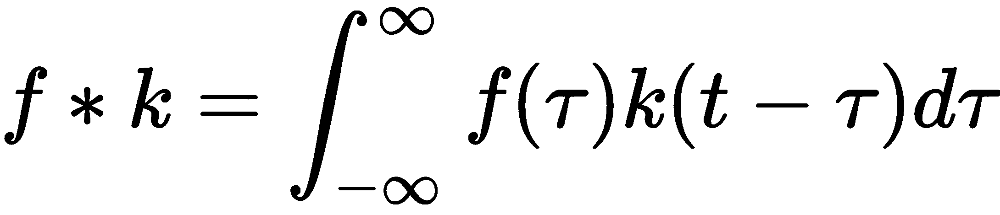

没有数学背景，这个表达式可能不太容易理解，但通过一些考虑，它可以变得特别简单。首先，积分覆盖了所有 *τ* 的值；因此，卷积是剩余变量 *t* 的函数。第二个基本元素是一种动态属性：核被反转（*-τ*）并转换为新变量 *z = t - τ* 的函数。没有深厚的数学知识，也可以理解这个操作沿着 *τ*（独立变量）轴移动函数。在下面的图中，有一个基于抛物线的例子：

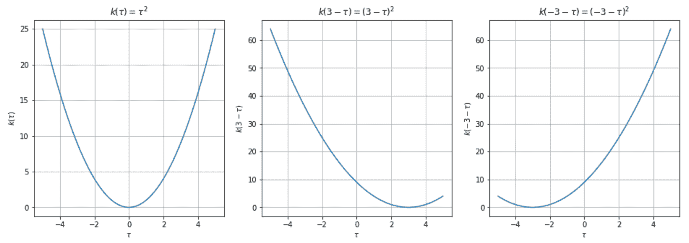

第一张图是原始核（它也是对称的）。其他两个图分别显示了前向和后向位移。现在应该更清楚，卷积是函数 *f(τ)* 乘以位移核，并计算结果曲线下的面积。由于变量 *t* 没有积分，面积是 *t* 的函数，并定义了一个新函数，即卷积本身。换句话说，当 *t = 5* 时，*f(τ)* 和 *k(τ)* 的卷积值是乘积 *f(τ)k(5 - τ)* 获得的曲线下的面积。根据定义，卷积是可交换的 *(f ∗ k = k ∗ f)* 和分配的 *(f ∗ (k + g) = (f ∗ k) + (f ∗ g))*. 此外，还可以证明它是结合的 *(f ∗ (k ∗ g) = (f ∗ k) ∗ g)*。

然而，在深度学习中，我们从不处理连续卷积；因此，我省略了所有属性和数学细节，专注于离散情况。对理论感兴趣的读者可以在 *Circuits, Signals, and Systems, Siebert W. M., MIT Press* 中找到更多细节。相反，一种常见的做法是将多个具有不同核（通常称为滤波器）的卷积堆叠起来，将包含 *n* 通道的输入转换为具有 *m* 通道的输出，其中 *m* 对应于核的数量。这种方法可以通过不同输出的协同作用释放卷积的全部力量。通常，具有 *n* 个滤波器的卷积层的输出被称为**特征图**（*w^((t)) × h^((t)) × n*），因为其结构不再与特定图像相关，而更像不同特征检测器的重叠。在本章中，我们经常谈论图像（考虑一个假设的第一层），但所有考虑都是隐含地扩展到任何特征图。

# 二维离散卷积

在深度学习中应用最广泛的卷积类型是基于具有任意数量通道的二维数组（如灰度图或 RGB 图像）。为了简化，让我们分析单层（通道）卷积，因为扩展到*n*层是直接的。如果*X∈ℜ^(w×h)* 和 *k∈ℜ^(n×m)*，卷积 *X∗k* 定义为（索引从 0 开始）：

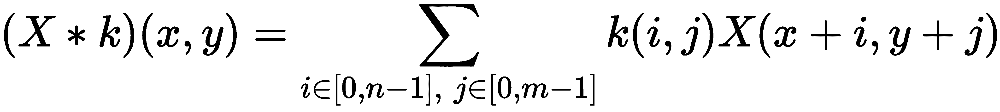

很明显，前面的表达式是连续定义的自然推导。在下面的图中，有一个使用 3×3 核的示例：


3x3 核的二维卷积示例

核在水平和垂直方向上移动，产生对应元素逐元素乘积的总和。因此，每个操作都导致单个像素的输出。示例中使用的核被称为**离散拉普拉斯** **算子**（因为它是由离散化实拉普拉斯得到的）；让我们观察这个核对完整灰度图的影响：

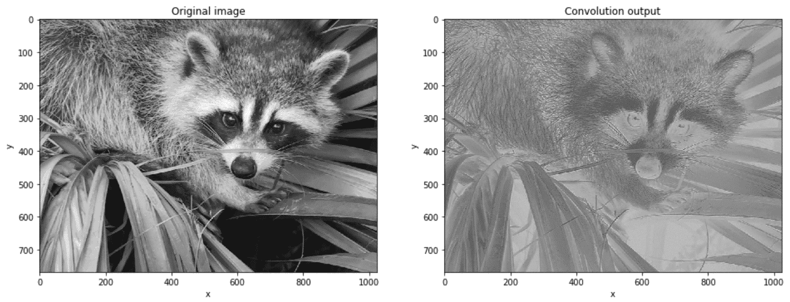

使用离散拉普拉斯核的卷积示例

如您所注意到的，卷积的效果是强调各种形状的边缘。读者现在可以理解如何调整可变核以满足精确的要求。然而，与其手动尝试，深度卷积网络将这项任务留给学习过程，该过程受一个精确目标所控制，该目标以最小化成本函数的形式表达。不同滤波器的并行应用会产生复杂的重叠，这可以简化提取那些对分类真正重要的特征。全连接层与卷积层的主要区别在于后者能够处理现有的几何形状，这些几何形状编码了区分一个对象与另一个对象所需的所有元素。这些元素不能立即推广（想想决策树的分支，其中一次分割定义了通向最终类别的精确路径），但需要后续的处理步骤来执行必要的区分。以之前的照片为例，例如，眼睛和鼻子相当相似。如何正确分割图片呢？答案是双重分析：可以通过细粒度滤波器发现细微的差异，更重要的是，真实物体的全局几何形状基于几乎不变的内部关系。例如（仅用于教学目的），眼睛和鼻子应该组成一个等腰三角形，因为面部的对称性意味着每只眼睛与鼻子的距离相同。这种考虑可以像许多视觉处理技术一样*事先*进行，或者，多亏了深度学习的力量，它可以留给训练过程。由于成本函数和输出类别隐式控制差异，深度卷积网络可以学习达到特定目标所需的重要信息，同时丢弃所有无用的细节。

在上一节中，我们说过特征提取过程主要是层次化的。现在，应该清楚不同核大小和后续卷积正好达到这个目标。假设我们有一个 *100 × 100* 的图像和一个 (*3 × 3*) 的核。结果图像将是 *98 × 98* 像素（我们稍后会解释这个概念）。然而，每个像素编码了一个 *3 × 3* 块的信息，由于这些块是重叠的，连续的两个像素将共享一些知识，但同时也强调了对应块之间的差异。

在以下图中，相同的拉普拉斯核应用于黑色背景上的简单白色方块：

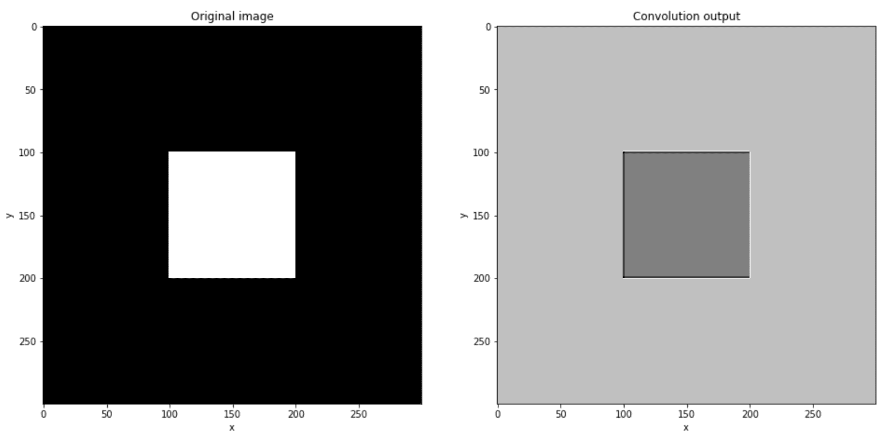

原始图像（左）；使用拉普拉斯核的卷积结果（右）

即使图像非常简单，也可能注意到卷积的结果丰富了输出图像，增加了一些非常重要的信息片段：正方形的边缘现在清晰可见（它们是黑白相间的），并且可以通过对图像进行阈值处理立即检测到。原因很简单：核在紧凑表面上的效果也是紧凑的，但当核在边缘上移动时，差异的效果变得可见。原始图像中的三个相邻像素可以表示为（*0, 1, 1*），表示黑白之间的水平过渡。经过卷积后，结果大约为（*0.75, 0.0, 0.25*）。所有原始的黑色像素都变成了浅灰色，白色正方形变暗了，而边缘（在原始图片中没有标记）现在变成了黑色（或白色，取决于移动方向）。将相同的过滤器重新应用于前一次卷积的输出，我们得到以下结果：

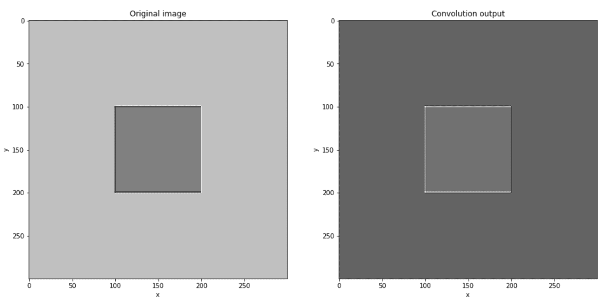

拉普拉斯核的第二次应用

留意观察可以立即发现三个结果：紧凑的表面（黑白）越来越相似，边缘仍然可见，最重要的是，顶部和左下角的白色像素现在更加清晰。因此，第二次卷积的结果增加了一个更细粒度的信息片段，这在原始图像中很难检测到。实际上，拉普拉斯算子的效果非常直接，它只对教学目的有用。在真实的深度卷积网络中，过滤器被训练执行更复杂的处理操作，这些操作可以揭示细节（包括它们的内部和外部关系），这些细节没有被立即用于图像分类。它们的隔离（得益于许多并行过滤器的效果）允许网络以不同的方式标记相似元素（如正方形的角），并做出更准确的决策。

本例的目的是展示一系列卷积如何生成一个层次化的过程，该过程在开始时提取粗粒度特征，在结束时提取非常高级的特征，同时不丢失已收集的信息。比喻地说，我们可以认为深度卷积网络开始放置表示线条、方向和边界的标签，并通过添加更多细节（如角、特定形状等）来丰富现有的本体。多亏了这种能力，这样的模型可以轻易地超越任何 MLP，并在训练样本数量足够大时几乎达到贝叶斯水平。这种模型的主要缺点是它们在应用仿射变换（如旋转或平移）后难以识别对象。换句话说，如果一个网络是在只包含自然位置的面部数据集上训练的，那么当呈现旋转（或颠倒）的样本时，它将表现不佳。在接下来的章节中，我们将讨论几种有助于减轻这种问题的方法（在平移的情况下）；然而，一种名为**胶囊网络**的新实验架构（超出了本书的范围）已被提出，以略微不同的方式解决此问题（读者可以在*Sabour S.，Frosst N.，Hinton G. E.，arXiv:1710.09829 [cs.CV]*中找到更多细节）。

# 步长和填充

所有卷积都共有的两个重要参数是**填充**和**步长**。让我们考虑二维情况，但请记住，概念始终相同。当一个核(*n × m*，其中*n, m > 1*)在图像上移动并到达一个维度的末端时，有两种可能性。第一种，称为**有效填充**，是指即使结果图像小于原始图像，也不继续进行。特别是，如果*X*是一个*w × h*矩阵，那么最终的卷积输出将具有*(w - n + 1) × (h - m + 1)*的尺寸。然而，有许多情况下保持原始尺寸是有用的，例如，能够对不同的输出进行求和。这种方法称为**相同填充**，它基于简单地向原始图像添加*n - 1*空白列和*m - 1*空白行的想法，以便允许核在原始图像上移动，从而产生与初始尺寸相等的像素数。在许多实现中，默认值设置为有效填充。

另一个参数，称为**步长**，定义了每次平移时跳过的像素数。例如，设置为(*1, 1*)的值对应于标准的卷积，而步长设置为(*2, 1*)的情况在以下图中展示：

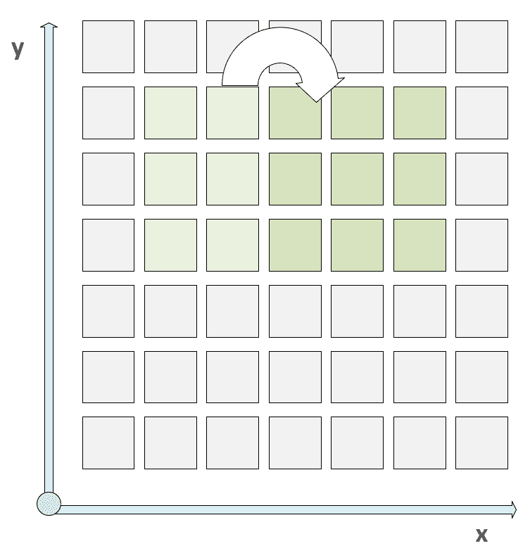

x 轴步长为 2 的二维卷积示例

在这种情况下，每次水平移动都会跳过一个像素。较大的步长在不需要高粒度时（例如，在第一层）会强制进行维度降低，而将步长设置为（*1, 1*）通常用于最后一层以捕捉更小的细节。没有标准规则来确定最佳值，测试不同的配置始终是最好的方法。像任何其他超参数一样，在确定一个选择是否可接受时，应该考虑太多因素；然而，关于数据集（以及因此关于底层数据生成过程）的一些一般信息可以帮助做出合理的初始决策。例如，如果我们正在处理建筑物图片，其维度是垂直的，我们可以开始选择一个值为（*1, 2*）的值，因为我们可以假设在*y*-轴上的信息冗余比在*x*-轴上更多。这个选择可以显著加快训练过程，因为输出有一个维度，是原始维度的一半（具有相同的填充）。这样，较大的步长会产生部分去噪并可以提高训练速度。同时，信息损失可能会对准确性产生负面影响。如果发生这种情况，可能意味着尺度不够高，无法跳过一些元素而不损害*语义*。例如，具有非常小脸部的图像可能会因为大步长而被不可逆地*损坏*，导致无法检测到正确的特征，从而降低分类准确性。

# 空洞卷积

在某些情况下，大于一的步长可能是一个好的解决方案，因为它可以减少维度并加快训练过程，但它可能导致图像变形，其中主要特征不再可检测。**空洞卷积**（也称为**膨胀卷积**）提供了一种替代方法。在这种情况下，核应用于更大的图像块，但跳过该区域内部的一些像素（这就是为什么有人称之为带孔卷积）。在下面的图中，有一个（*3 × 3*）和膨胀率设置为*2*的示例：

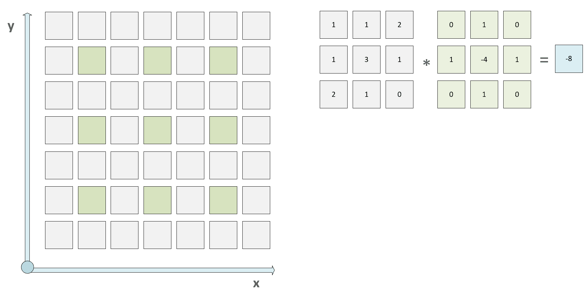

带有拉普拉斯核的空洞卷积示例

每个补丁现在是 *9 **× 9*，但核仍然是一个 *3 × 3* 拉普拉斯算子。这种方法的效果比增加步长更稳健，因为核的 *周界* 将始终包含具有相同几何关系的像素组。当然，细粒度特征可能会扭曲，但通常步长设置为 (*1, 1*)，最终结果通常更连贯。与标准卷积的主要区别在于，在这种情况下，我们假设可以考虑到更远的元素来确定输出像素的性质。例如，如果主要特征不包含非常小的细节，扩张卷积可以考虑到更大的区域，直接关注标准卷积需要经过多次操作才能检测到的元素。这种技术的选择必须考虑到最终的准确性，但就像步长一样，只要几何属性可以更有效地检测，就可以从一开始就考虑使用较大的补丁和一些代表性元素。即使这种方法在特定情况下可能非常有效，但它通常不是非常深层模型的首选。在最重要的图像分类模型中，使用标准卷积（带或不带更大的步长）是因为它们已被证明在非常通用的数据集（如 ImageNet 或 Microsoft Coco）上产生最佳性能。然而，我建议读者尝试这种方法并比较结果。特别是，分析哪些类别被更好地分类，并尝试为观察到的行为找到合理的解释是个好主意。

在某些框架中，例如 Keras，没有显式的层来定义一个扩张卷积。相反，标准的卷积层通常有一个参数来定义扩张率（在 Keras 中，它被称为 `dilation_rate`）。当然，默认值是 1，这意味着核将应用于与其大小匹配的补丁。

# 可分离卷积

如果我们考虑一个图像 *X ∈ ℜ^(w × h)*（单通道）和一个核 *k ∈ ℜ**^(n × m)*，所需的操作数是 *nmwh*。当核不是非常小且图像很大时，即使有 GPU 支持，这种计算的代价也可能相当高。通过考虑卷积的相关属性，我们可以实现改进。特别是，如果原始核可以分解为两个向量核的点积，即 *k^((1))*（维度为 *n × 1*）和 *k^((2))*（维度为 *1 × m*），则称卷积为 **可分离的**。这意味着我们可以通过两个后续操作执行 (*n **× m*) 卷积：

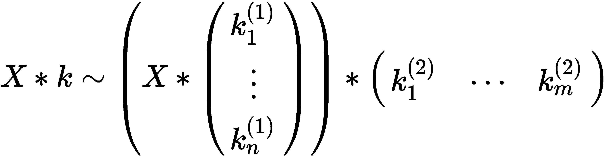

优势是明显的，因为现在操作数是 *(n + m)wh*。特别是当 *nm >> n + m* 时，可以避免大量乘法，并加快训练和预测过程。

在*《Xception：深度学习与深度可分离卷积》*（Chollet F.，arXiv:1610.02357 [cs.CV]）中提出了一个略有不同的方法。在这种情况下，这被称为**深度可分离卷积**，过程分为两个步骤。第一个步骤沿着通道轴操作，将其转换为一个具有可变数量通道的单维映射（例如，如果原始图是*768 × 1024 × 3*，则第一阶段的输出将是*n × 768 × 1024 × 1*）。然后，对单层应用标准卷积（实际上可以有多于一个通道）。在大多数实现中，深度卷积的默认输出通道数是 1（这通常通过说**深度乘数**为 1 来表示）。这种方法与标准卷积相比，可以实现参数的显著减少。实际上，如果输入通用特征图是*X ∈ ℜ^(w × h × p)*，我们想要执行带有*q*核*k^((i)) ∈ ℜ^(n × m)*的标准卷积，我们需要学习*nmqp*个参数（每个核*k^((i))*应用于所有输入通道）。采用深度可分离卷积，第一步（仅处理通道）需要*nmp*个参数。由于输出仍然有*p*个特征图，我们需要输出*q*个通道，这个过程使用了一个*技巧*：使用*q 1 × 1*核处理每个特征图（这样，输出将有*q*层和相同的维度）。第二步所需的参数数是*pq*，因此总参数数变为*nmp + pq*。将这个值与标准卷积所需的参数数进行比较，我们得到一个有趣的结果：

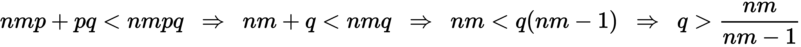

由于这个条件很容易成立，这种方法在优化训练和预测过程以及在任何场景下的内存消耗方面都极为有效。Xception 模型能够立即在移动设备上实现，允许使用非常有限的资源进行实时图像分类，这并不令人惊讶。当然，深度可分离卷积并不总是与标准卷积具有相同的精度，因为它们基于这样的假设：复合特征图通道内可观察到的几何特征是相互独立的。这并不总是正确的，因为我们知道多层的效果也基于它们的组合（这增加了网络的表达能力）。然而，在许多情况下，最终结果与一些最先进的模型具有可比的精度；因此，这种技术通常可以被视为标准卷积的有效替代方案。

自从 2.1.5 版本以来，Keras 引入了一个名为`DepthwiseConv2D`的层，该层实现了深度可分离卷积。这个层扩展了现有的`SeparableConv2D`。

# 转置卷积

**转置卷积**（有时错误地称为反卷积，即使数学定义不同）与标准卷积并没有很大区别，但其目标是重建一个与输入样本具有相同特征的结构。假设卷积神经网络的输出是特征图 *X ∈ ℜ^(w' × h' × p)*，我们需要构建一个输出元素 *Y ∈ ℜ^(w × h × 3)*（假设 w 和 h 是原始维度）。我们可以通过在 *X* 上应用适当的步长和填充的转置卷积来实现这个结果。例如，假设 *X ∈ ℜ^(128 × 128 × 256)*，我们的输出必须是 *512 × 512 × 3*。最后一个转置卷积必须学习三个滤波器，步长设置为四，且使用相同的填充。我们将在下一章（第十一章，*自编码器*）中看到这个方法的一些实际例子，当讨论自编码器时；然而，在内部动态方面，转置卷积和标准卷积之间并没有非常重要的区别。主要区别在于损失函数，因为当转置卷积作为最后一层使用时，比较必须在目标图像和重建图像之间进行。在下一章（第十一章，*自编码器*）中，我们还将分析一些技术，以提高输出质量，即使损失函数没有专注于图像的特定区域。

# 池化层

在深度卷积网络中，**池化层**是极其有用的元素。主要有两种这样的结构：**最大池化**和**平均池化**。它们都在 *p ∈ ℜ^(n × m)* 的块上工作，根据预定义的步长值水平垂直移动，并根据以下规则将块转换为单个像素：

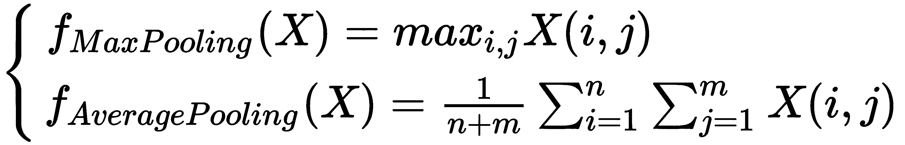

有两个主要原因可以证明使用这些层是合理的。第一个原因是通过有限的损失进行降维（例如，将步长设置为(*2, 2*)，可以将图像/特征图的维度减半）。显然，所有池化技术或多或少都有损失（特别是最大池化），具体结果取决于单个图像。一般来说，池化层试图将一小块信息中的信息总结到一个像素中。这一想法得到了以感知为导向的方法的支持；事实上，当池子不太大时，在后续的偏移中找到高方差的可能性相当低（自然图像中很少有孤立像素）。因此，所有池化操作都允许我们设置大于一的步长，同时降低损害信息内容的风险。然而，考虑到几个实验和架构，我建议你在卷积层中设置更大的步长（特别是在卷积序列的第一层），而不是在池化层中。这样，就可以以最小的损失应用变换并充分利用下一个基本属性。

第二个（也许是最重要的）原因是，它们略微增加了对平移和有限扭曲的鲁棒性，其效果与池大小成比例。让我们考虑以下图表，表示一个十字的原始图像和经过 10 像素对角线平移后的版本：

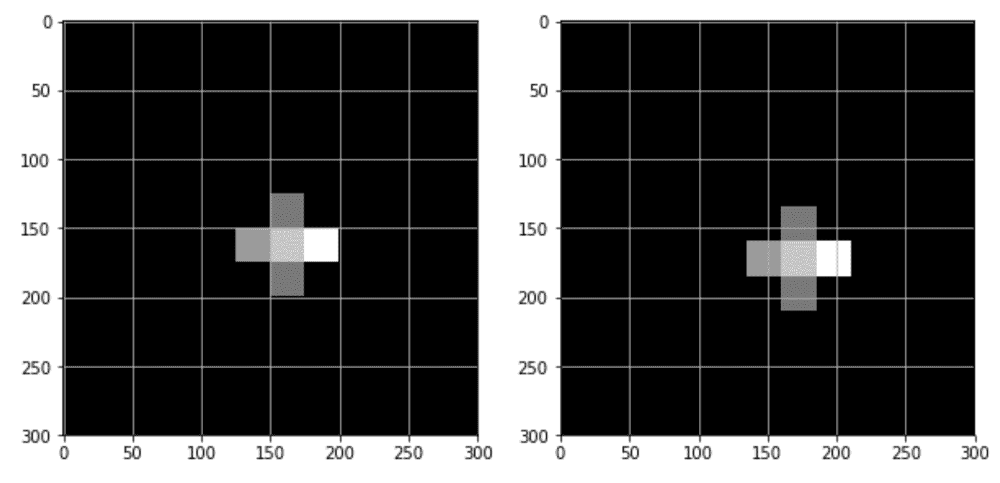

原始图像（左）；对角线平移的图像（右）

这是一个非常简单的例子，翻译图像与原始图像没有太大差异。然而，在更复杂的场景中，分类器也可能无法在类似条件下正确分类对象。对翻译图像应用最大池化（池大小为(*2 × 2*)，步长为 2 像素），我们得到以下结果：

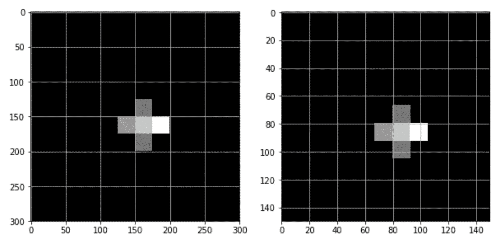

原始图像（左）；对翻译图像进行最大池化后的结果（右）

结果是一个更大的十字，其臂部与轴稍微对齐。与原始图像相比，具有良好泛化能力的分类器更容易过滤掉虚假元素并识别原始形状（可以被认为是一个被噪声框架包围的十字）。使用相同的平均池化（相同的参数）重复相同的实验，我们得到以下结果：

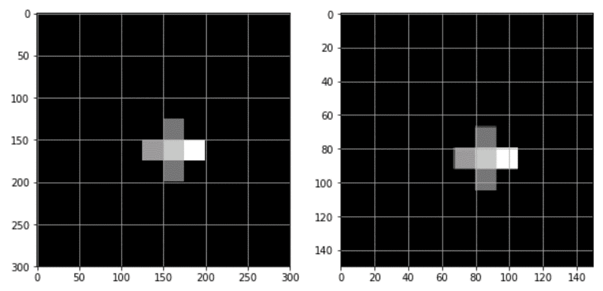

原始图像（左）；对翻译图像进行平均池化后的结果（右）

在这种情况下，图片部分被平滑处理，但仍能看出更好的对齐（主要归功于渐隐效果）。此外，如果这些方法简单且有一定效果，对不变变换的鲁棒性从未有显著提高，而要实现更高层次的不变性，只能通过增加池化大小。这种选择导致特征图粒度更粗，信息量大幅减少；因此，每当需要将分类扩展到可能被扭曲或旋转的样本时，使用数据增强技术生成人工图像，并在此之上训练分类器，可能是一个好主意（这允许使用更好地代表真实数据生成过程的数据库）。然而，正如*深度学习，Goodfellow I.，Bengio Y.，Courville A.，MIT Press*所指出的，当与多个卷积层的输出或旋转图像堆叠一起使用时，池化层也可以提供对旋转的鲁棒不变性。实际上，在这些情况下，会引发单个模式响应，池化层的效果类似于一个标准化输出的收集器。换句话说，它将产生相同的结果，而无需显式选择最佳匹配模式。因此，如果数据集包含足够的样本，网络中间位置的池化层可以提供对微小旋转的适度鲁棒性，从而提高整个深度架构的泛化能力。

如前例所示，两种变体之间的主要区别在于最终结果。平均池化执行一种非常简单的插值，平滑边缘并避免突变。另一方面，最大池化噪声较少，当需要检测特征而无需任何平滑（这可能会改变它们的几何形状）时，可以产生更好的结果。我总是建议测试这两种技术，因为仅根据经验考虑（尤其是当数据集不是由非常简单的图像组成时），几乎不可能选择最佳方法并确定合适的池化大小。

显然，始终最好在一系列卷积之后使用这些层，避免使用非常大的池化大小，因为这可能会永久性地破坏信息内容。在许多重要的深度架构中，池化层始终基于(*2, 2*)或(*3, 3*)池化，无论它们的位置如何，步长始终设置为 1 或 2。在两种情况下，信息损失与池化大小/步长成比例；因此，当需要检测小特征和大特征（例如，前景和背景人脸）时，通常避免使用大池化。

# 其他有用的层

即使卷积和池化层几乎是所有深度卷积网络的核心，其他层也可以帮助处理特定情况。具体如下：

+   **填充层**：这些层可以通过在特征图周围添加空白框架（例如，在每一边添加 *n* 个黑色像素）来增加特征图的大小（例如，将其与另一个特征图对齐）。。

+   **上采样层**：这些层通过将单个像素创建成更大的块来增加特征图的大小。在某种程度上，它们可以被视为与池化层相反的转换，尽管在这种情况下，上采样不是基于任何类型的插值。这些类型的层可以用来准备特征图，以便进行与转置卷积类似的转换，尽管许多实验证实使用更大的步长可以在不需要额外计算步骤的情况下产生非常准确的结果。

+   **裁剪层**：这些层有助于选择图像/特征图中的特定矩形区域。它们在模块化架构中特别有用，其中第一部分确定裁剪边界（例如，面部），而第二部分在移除背景后可以执行高级操作，如细节分割（标记眼睛、鼻子、嘴巴等区域）。将这些层直接插入到深度神经网络模型中的可能性避免了多次数据传输。不幸的是，许多框架（如 Keras）不允许我们使用可变边界，实际上限制了可能的用例数量。

+   **展平层**：这些层是特征图和全连接层之间的连接。通常，在处理卷积块的输出之前，使用单个展平层，然后是几个密集层，最终以 Softmax 层结束（用于分类）。这个操作在计算上非常便宜，因为它只与元数据一起工作，不执行任何计算。

# 使用 Keras 的深度卷积网络示例

在第一个示例中，我们再次考虑完整的 MNIST 手写数字数据集，但不是使用 MLP，而是将使用一个小型深度卷积网络。第一步包括加载数据集并进行归一化：

```py
import numpy as np

from keras.datasets import mnist
from keras.utils import to_categorical

(X_train, Y_train), (X_test, Y_test) = mnist.load_data()

width = height = X_train.shape[1]

X_train = X_train.reshape((X_train.shape[0], width, height, 1)).astype(np.float32) / 255.0
 X_test = X_test.reshape((X_test.shape[0], width, height, 1)).astype(np.float32) / 255.0

Y_train = to_categorical(Y_train, num_classes=10)
Y_test = to_categorical(Y_test, num_classes=10)
```

我们现在可以定义模型架构。样本相对较小（*28 × 28*）；因此，使用小型核可能是有帮助的。这并不是一个普遍的规则，评估较大的核（特别是在第一层）也是有用的；然而，许多最先进的架构证实，在小型图像中使用较大的核大小会导致性能下降。在我的个人实验中，我总是当最大的核比图像尺寸小 *8 ÷ 10* 时获得最佳结果。我们的模型由以下层组成：

1.  输入丢弃率 25%。

1.  使用 16 个滤波器、（3 × 3）核、步长为 1、ReLU 激活和相同的填充（默认权重初始化器是 Xavier）。Keras 实现了 `Conv2D` 类，其主要参数是立即可理解的。

1.  丢弃率 50%。

1.  使用 32 个过滤器，(3 × 3)核，步长为 1，ReLU 激活函数，以及相同的填充。

1.  Dropout 50%。

1.  使用(2 × 2)池化大小和步长为 1 的平均池化（使用 Keras 类`AveragePooling2D`）。

1.  使用 64 个过滤器，(3 × 3)核，步长为 1，ReLU 激活函数，以及相同的填充。

1.  使用(2 × 2)池化大小和步长为 1 的平均池化。

1.  使用 64 个过滤器，(3 × 3)核，步长为 1，ReLU 激活函数，以及相同的填充。

1.  Dropout 50%。

1.  使用(2 × 2)池化大小和步长为 1 的平均池化。

1.  具有 1024 个 ReLU 单元的全连接层。

1.  Dropout 50%。

1.  具有十个 Softmax 单元的全连接层。

目标是在第一层捕获低级特征（水平线和垂直线、交叉点等），并使用池化层和所有后续卷积来提高在扭曲样本出现时的准确性。在此阶段，我们可以创建和编译模型（使用η = 0.001 的 Adam 优化器和衰减率等于 10^(-5)）：

```py
from keras.models import Sequential
from keras.layers import Dense, Activation, Dropout, Conv2D, AveragePooling2D, Flatten
from keras.optimizers import Adam

model = Sequential()

model.add(Dropout(0.25, input_shape=(width, height, 1), seed=1000))

model.add(Conv2D(16, kernel_size=(3, 3), padding='same'))
model.add(Activation('relu'))
model.add(Dropout(0.5, seed=1000))

model.add(Conv2D(32, kernel_size=(3, 3), padding='same'))
model.add(Activation('relu'))
model.add(Dropout(0.5, seed=1000))

model.add(AveragePooling2D(pool_size=(2, 2), padding='same'))

model.add(Conv2D(64, kernel_size=(3, 3), padding='same'))
model.add(Activation('relu'))

model.add(AveragePooling2D(pool_size=(2, 2), padding='same'))

model.add(Conv2D(64, kernel_size=(3, 3), padding='same'))
model.add(Activation('relu'))
model.add(Dropout(0.5, seed=1000))

model.add(AveragePooling2D(pool_size=(2, 2), padding='same'))

model.add(Flatten())

model.add(Dense(1024))
model.add(Activation('relu'))
model.add(Dropout(0.5, seed=1000))

model.add(Dense(10))
model.add(Activation('softmax'))

model.compile(optimizer=Adam(lr=0.001, decay=1e-5),
              loss='categorical_crossentropy',
              metrics=['accuracy'])
```

现在我们可以使用 200 个周期和 256 个样本的批量大小来训练模型：

```py
history = model.fit(X_train, Y_train,
                    epochs=200,
                    batch_size=256,
                    validation_data=(X_test, Y_test))

Train on 60000 samples, validate on 10000 samples
Epoch 1/200
60000/60000 [==============================] - 30s 496us/step - loss: 0.4474 - acc: 0.8531 - val_loss: 0.0993 - val_acc: 0.9693
Epoch 2/200
60000/60000 [==============================] - 20s 338us/step - loss: 0.1497 - acc: 0.9530 - val_loss: 0.0682 - val_acc: 0.9780
Epoch 3/200
60000/60000 [==============================] - 21s 346us/step - loss: 0.1131 - acc: 0.9647 - val_loss: 0.0598 - val_acc: 0.9839

...

Epoch 199/200
60000/60000 [==============================] - 21s 349us/step - loss: 0.0083 - acc: 0.9974 - val_loss: 0.0137 - val_acc: 0.9950
Epoch 200/200
60000/60000 [==============================] - 22s 373us/step - loss: 0.0083 - acc: 0.9972 - val_loss: 0.0143 - val_acc: 0.9950
```

最终验证准确率现在是`0.9950`，这意味着只有 50 个样本（在 10000 个样本中）被错误分类。为了更好地理解行为，我们可以绘制准确率和损失图：

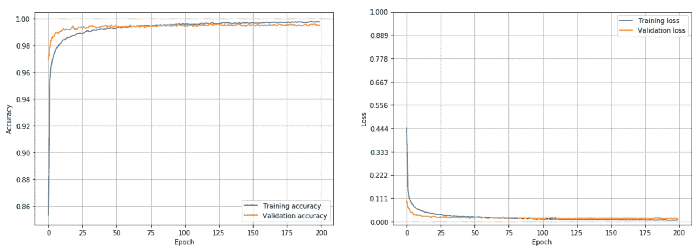

如所见，验证准确率和损失很容易达到最优值。特别是，初始验证准确率约为 0.97，剩余的周期是必要的，以提高所有这些样本的性能，其形状可能导致混淆（例如，形状不规则的 8 看起来像 0，或者非常相似的 7 看起来像 1）。很明显，卷积使用的*几何*方法比标准全连接网络提供了更高的鲁棒性，这也要归功于池化层的贡献，它们减少了由于噪声样本引起的方差。

# 使用 Keras 和数据增强的深度卷积网络的示例

在这个例子中，我们将使用由 Zalando 免费提供的 Fashion MNIST 数据集，作为标准 MNIST 数据集的更困难替代品。在这种情况下，而不是手写数字，这里有不同服装的灰度照片。以下截图显示了几个样本的示例：

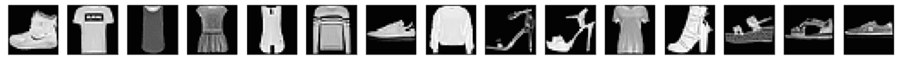

然而，在这种情况下，我们想要使用 Keras 提供的实用类（`ImageDataGenerator`）来创建一个数据增强样本集，以提高深度卷积网络的一般化能力。这个类允许我们添加随机转换（如标准化、旋转、平移、翻转、缩放、剪切等），并使用 Python 生成器（具有无限循环）输出样本。让我们开始加载数据集（我们不需要标准化它，因为这个转换由生成器执行）：

```py
from keras.datasets import fashion_mnist

(X_train, Y_train), (X_test, Y_test) = fashion_mnist.load_data()
```

在这个阶段，我们可以创建生成器，选择最适合我们情况的转换。由于数据集相当*标准*（所有样本只表示在几个位置），我们决定通过应用样本级标准化（不依赖于整个数据集）、水平翻转、缩放、小旋转和小剪切来增加数据集。这个选择是根据客观分析做出的，但我建议读者用不同的参数重复实验（例如，添加白化、垂直翻转、水平/垂直平移和扩展旋转）。当然，增加增强的变异性需要更大的处理集。在我们的情况下，我们将使用 384,000 个训练样本（原始大小为 60,000），但可以使用更大的值来训练更深的网络：

```py
import numpy as np

from keras.preprocessing.image import ImageDataGenerator
from keras.utils import to_categorical

nb_classes = 10
train_batch_size = 256
test_batch_size = 100

train_idg = ImageDataGenerator(rescale=1.0 / 255.0,
                               samplewise_center=True,
                               samplewise_std_normalization=True,
                               horizontal_flip=True,
                               rotation_range=10.0,
                               shear_range=np.pi / 12.0,
                               zoom_range=0.25)

train_dg = train_idg.flow(x=np.expand_dims(X_train, axis=3),
                          y=to_categorical(Y_train, num_classes=nb_classes),
                          batch_size=train_batch_size,
                          shuffle=True,
                          seed=1000)

test_idg = ImageDataGenerator(rescale=1.0 / 255.0,
                              samplewise_center=True,
                              samplewise_std_normalization=True)

test_dg = train_idg.flow(x=np.expand_dims(X_test, axis=3),
                         y=to_categorical(Y_test, num_classes=nb_classes),
                         shuffle=False,
                         batch_size=test_batch_size,
                         seed=1000)
```

一旦初始化了图像数据生成器，就必须对其进行拟合，指定输入数据集和期望的批量大小（此操作的输出是实际的 Python 生成器）。测试图像生成器自愿不进行任何转换，除了归一化和标准化，以避免在来自不同分布的数据集上进行验证。在这个阶段，我们可以创建和编译我们的网络，使用基于 Leaky ReLU 激活的 2D 卷积（使用`LeakyReLU`类，该类取代了标准的`Activation`层），批量归一化，以及最大池化：

```py
from keras.models import Sequential
from keras.layers import Activation, Dense, Flatten, LeakyReLU, Conv2D, MaxPooling2D, BatchNormalization
from keras.optimizers import Adam

model = Sequential()

model.add(Conv2D(filters=32,
                 kernel_size=(3, 3),
                 padding='same',
                 input_shape=(X_train.shape[1], X_train.shape[2], 1)))

model.add(BatchNormalization())
model.add(LeakyReLU(alpha=0.1))

model.add(Conv2D(filters=64,
                 kernel_size=(3, 3),
                 padding='same'))

model.add(BatchNormalization())
model.add(LeakyReLU(alpha=0.1))

model.add(MaxPooling2D(pool_size=(2, 2)))

model.add(Conv2D(filters=64,
                 kernel_size=(3, 3),
                 padding='same'))

model.add(BatchNormalization())
model.add(LeakyReLU(alpha=0.1))

model.add(Conv2D(filters=128,
                 kernel_size=(3, 3),
                 padding='same'))

model.add(BatchNormalization())
model.add(LeakyReLU(alpha=0.1))

model.add(Conv2D(filters=128,
                 kernel_size=(3, 3),
                 padding='same'))

model.add(BatchNormalization())
model.add(LeakyReLU(alpha=0.1))

model.add(MaxPooling2D(pool_size=(2, 2)))

model.add(Flatten())

model.add(Dense(units=1024))
model.add(BatchNormalization())
model.add(LeakyReLU(alpha=0.1))

model.add(Dense(units=1024))
model.add(BatchNormalization())
model.add(LeakyReLU(alpha=0.1))

model.add(Dense(units=nb_classes))
model.add(Activation('softmax'))

model.compile(loss='categorical_crossentropy',
              optimizer=Adam(lr=0.0001, decay=1e-5),
              metrics=['accuracy'])
```

所有批量归一化都是应用于激活函数之前的线性变换。考虑到额外的复杂性，我们还将使用一个回调，这是 Keras 用来执行训练中操作的类。在我们的情况下，我们希望在验证损失停止改进时降低学习率。特定的回调称为`ReduceLROnPlateau`，并调整以将*η*乘以`0.1`（在等于`patience`参数值的 epoch 数之后），有一个冷却期（在恢复原始学习率之前等待的 epoch 数）为 1 个 epoch，以及最小*η = 10^(-6)*。训练方法现在是`fit_generator()`，它接受 Python 生成器而不是有限的数据集，以及每个 epoch 的迭代次数（所有其他参数与`fit()`实现相同）：

```py
from keras.callbacks import ReduceLROnPlateau

nb_epochs = 100
steps_per_epoch = 1500

history = model.fit_generator(generator=train_dg,
                              epochs=nb_epochs,
                              steps_per_epoch=steps_per_epoch,
                              validation_data=test_dg,
                              validation_steps=int(X_test.shape[0] / test_batch_size),
                              callbacks=[
                                 ReduceLROnPlateau(factor=0.1, patience=1, cooldown=1, min_lr=1e-6)
                              ])

Epoch 1/100
1500/1500 [==============================] - 471s 314ms/step - loss: 0.3457 - acc: 0.8722 - val_loss: 0.2863 - val_acc: 0.8952
Epoch 2/100
1500/1500 [==============================] - 464s 309ms/step - loss: 0.2325 - acc: 0.9138 - val_loss: 0.2721 - val_acc: 0.8990
Epoch 3/100
1500/1500 [==============================] - 460s 307ms/step - loss: 0.1929 - acc: 0.9285 - val_loss: 0.2522 - val_acc: 0.9112

...

Epoch 99/100
1500/1500 [==============================] - 449s 299ms/step - loss: 0.0438 - acc: 0.9859 - val_loss: 0.2142 - val_acc: 0.9323
Epoch 100/100
1500/1500 [==============================] - 449s 299ms/step - loss: 0.0443 - acc: 0.9857 - val_loss: 0.2136 - val_acc: 0.9339
```

在这种情况下，复杂性更高，结果并不像使用标准的 MNIST 数据集获得的结果那样准确。验证和损失曲线在以下图表中展示：

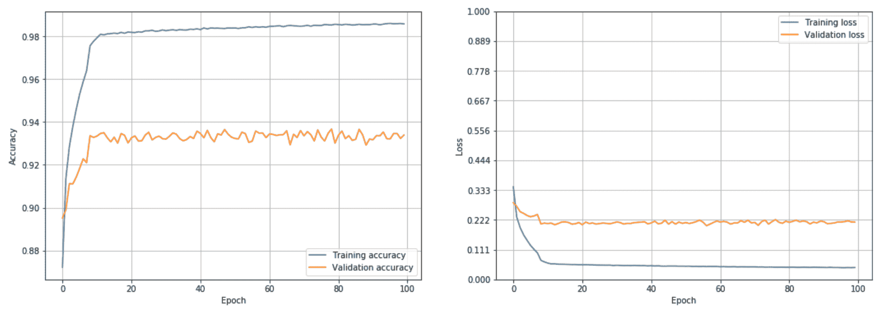

损失曲线并没有显示出 U 形曲线，但似乎从第 20 个 epoch 开始并没有真正的改进。这一点也由验证曲线得到证实，它继续在 0.935 和大约 0.94 之间波动。另一方面，训练损失并没有达到其最小值（训练准确率也是如此），这主要是因为批量归一化。然而，考虑到几个基准，结果并不差（即使最先进的模型可以达到大约 0.96 的验证准确率）。我建议读者尝试不同的配置（带有和不带有 dropout 以及其他激活函数），基于更深层次的架构和更大的训练集。这个例子提供了许多练习这类模型的机会，因为其复杂性并不高，不需要专用硬件，但与此同时，存在许多模糊性（例如，衬衫和 T 恤之间的区别），这可能会降低泛化能力。

# 循环神经网络

我们到目前为止所分析的所有模型都有一个共同特征。一旦训练过程完成，权重就会被冻结，输出只取决于输入样本。显然，这是分类器预期的行为，但在许多场景中，预测必须考虑到输入值的历史。时间序列是一个经典的例子。假设我们需要预测下周的温度。如果我们试图只使用最后一个已知的*x^(t)*值和一个训练用来预测*x^(t+1)*的多层感知器（MLP），我们就无法考虑到像季节、季节多年的历史、季节中的位置等时间条件。回归器将能够关联产生最小平均误差的输出，但在现实生活中的情况下，这并不足够。解决这个问题的唯一合理方式是为人工神经元定义一个新的架构，给它提供记忆。这个概念在以下图中展示：


现在这个神经元不再是一个纯粹的纯前向计算单元，因为反馈连接迫使它记住其过去并使用它来预测新的值。新的动态规则现在如下：

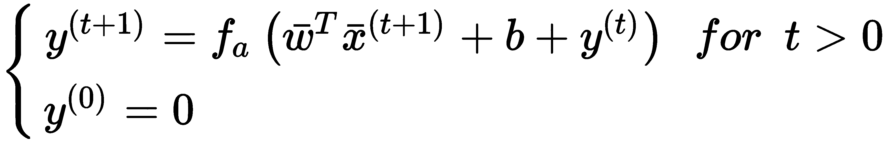

之前的预测被反馈并累加到新的线性输出中。这个结果通过激活函数转换，以产生实际的新输出（通常第一个输出是空的，但这不是一个约束）。一个立即需要考虑的问题是激活函数——这是一个可能很容易变得不稳定的动态系统。防止这种现象的唯一方法就是使用饱和函数（如 Sigmoid 或双曲正切）。实际上，无论输入是什么，输出永远不会通过向*+∞*或*-∞*移动而*爆炸*。

假设我们使用的是 ReLU 激活函数——在某些条件下，输出将无限增长，导致溢出。显然，使用线性激活函数的情况更糟，即使使用 Leaky ReLU 或 ELU，情况也可能非常相似。因此，很明显我们需要选择饱和函数，但这足够确保稳定性吗？即使双曲正切（以及 Sigmoid）有两个稳定点（*-1*和*+1*），这也不足以确保稳定性。让我们想象输出受到噪声的影响，并在 0.0 附近振荡。该单元无法收敛到某个值，并保持在极限循环中。

幸运的是，学习权重的可能性使我们能够提高对噪声的鲁棒性，避免输入的有限变化会逆转神经元的动态。这是一个非常重要（且容易证明）的结果，它保证了在非常简单的条件下稳定性，但再次，我们需要付出什么代价？这是否简单直接？不幸的是，答案是消极的，稳定性的代价非常高。然而，在讨论这个问题之前，让我们看看一个简单的循环网络是如何被训练的。

# 时间反向传播（BPTT）

训练 RNN 最简单的方法是基于一种表示技巧。由于输入序列有限且长度可以固定，因此可以将具有反馈连接的简单神经元重新结构化为展开的前馈网络。在下面的图中，有一个带有*k*个时间步长的示例：

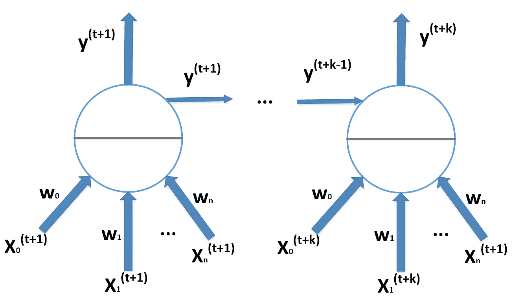

展开的循环神经网络示例

这个网络（可以轻松扩展到具有多个层的更复杂架构）与 MLP（多层感知器）完全相同，但在这个情况下，每个*克隆*的权重是相同的。称为**BPTT（反向传播时间）**的算法是标准学习技术向展开循环网络的自然扩展。这个过程很简单。一旦所有输出都被计算出来，就可以确定每个单独网络的成本函数值。在这个时候，从最后一步开始，计算并存储校正（梯度），然后重复这个过程直到初始步骤。然后，将所有梯度求和并应用于网络。由于每个贡献都是基于精确的*时间经验*（由局部样本和先前记忆元素组成），标准反向传播将学会如何管理动态条件，就像它是点预测一样。然而，我们知道实际的网络并没有展开，过去的依赖关系在理论上被传播和记住。我故意使用了“理论上”这个词，因为所有实际实验都显示出完全不同的行为，我们将在后面讨论。这种技术非常容易实现，但对于必须展开以处理大量时间步长的深度网络来说，可能会非常昂贵。因此，提出了一个名为**截断反向传播时间（TBPTT**）的变体（在*Subgrouping reduces complexity and speeds up learning in recurrent networks, Zipser D., Advances in Neural Information Processing Systems, II 1990*）。

这个想法是使用两个序列长度 *t[1]* 和 *t[2]*（其中 *t[1]* >> *t[2]*）——较长的序列（*t[1]*）用于正向传播阶段，而较短的长度（*t[2]*）用于训练网络。乍一看，这个版本看起来就像一个带有短序列的正常 BPTT；然而，关键思想是迫使网络使用更多信息更新隐藏状态，然后根据较长序列的结果（即使更新只传播到有限的前一时间步）计算校正。显然，这是一个可以加快训练过程的近似，但最终结果通常与处理长序列得到的结果相当，特别是在依赖关系可以被分成更短的时序块时（因此假设没有非常长的依赖关系）。

即使 BPTT 算法在数学上是正确的，并且学习短期依赖（对应于短展开网络）并不困难，但多项实验证实，学习长期依赖性极其困难（或几乎不可能）。换句话说，利用过去有限窗口内的经验（因此其重要性有限，因为它们无法管理最复杂的变化）是容易的，但网络难以学习所有行为，例如，具有数百个时间步长周期性的行为。1994 年，Bengio、Simard 和 Frasconi 提供了对这个问题的理论解释（在*Using Gradient Descent to Learn Long-Term Dependencies is Difficult, Bengio Y., Simard P., Frasconi P., IEEE Transactions on Neural Networks, 5/1994*）。数学细节相当复杂，因为它们涉及到动态系统理论；然而，最终结果是，当神经元被迫对噪声（正常预期行为）变得鲁棒时，网络会受到梯度消失问题的困扰，当 *t → ∞*。更普遍地说，我们可以将向量循环神经元动态表示如下：


BPTT 的乘法效应迫使梯度与 *W^t* 成正比。如果 *W* 的最大绝对特征值（也称为谱半径）小于 1，那么以下适用：

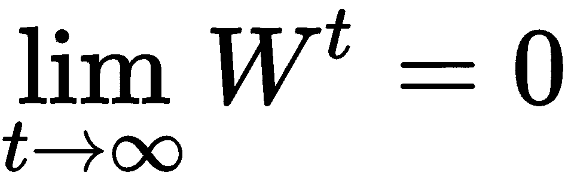

更简单地说，我们可以重新表述这个结果，即梯度的幅度与序列长度成正比，即使条件在渐近上是有效的，许多实验证实，数值计算的有限精度和由于后续乘法引起的指数衰减可以迫使梯度消失，即使序列不是特别长。这似乎是任何 RNN 架构的终结，但幸运的是，更近期的方案已经被设计和提出，以解决这个问题，允许 RNNs 在没有特别复杂的情况下学习短期和长期依赖。RNN 的新时代开始了，结果立即显著。

# LSTM

这个模型（在许多领域代表了最先进的循环单元）是由 Hochreiter 和 Schmidhuber 在 1997 年提出的，具有标志性的名字**长短期记忆**（**LSTM**）。正如其名所示，想法是创建一个更复杂的艺术性循环神经元，可以插入到更大的网络中，并且可以在没有消失和爆炸梯度风险的情况下进行训练。经典循环网络的一个关键元素是它们专注于学习，而不是选择性遗忘。这种能力确实是优化记忆以记住真正重要的东西并移除所有那些对预测新值不必要的信

为了实现这个目标，LSTM 利用了两个重要的特征（在讨论模型之前先揭露它们是有帮助的）。第一个是一个显式状态，它是一组独立的变量，用于存储构建长期和短期依赖关系所需的元素，包括当前状态。这些变量是称为**恒定误差轮**（**CEC**）的机制的构建块，之所以这样命名是因为它负责由反向传播算法提供的错误循环和内部管理。这种方法允许纠正权重而不再受到乘法效应的影响。内部 LSTM 动态有助于更好地理解错误是如何安全地反馈的；然而，关于训练过程（始终基于梯度下降）的详细解释超出了本书的范围，可以在上述论文中找到。

第二个特征是存在门。我们可以简单地将门定义为可以调节通过它的信息量的元素。例如，如果 *y = ax* 且 *a* 是介于 0 和 1 之间的变量，它可以被认为是一个门，因为当它等于 0 时，它会阻止输入 *x*；当它等于 1 时，它允许输入无限制地流入；当它具有中间值时，它会按比例减少信息量。在 LSTMs 中，门由 sigmoid 函数管理，而激活基于双曲正切（其对称性保证了更好的性能）。在这个阶段，我们可以展示 LSTM 单元的结构图并讨论其内部动态：

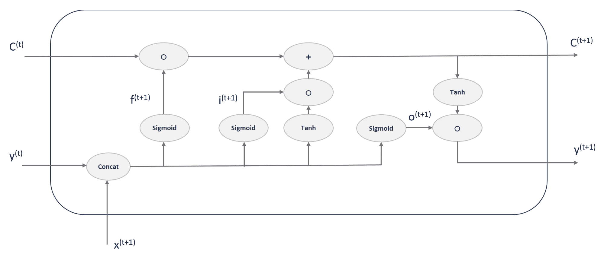

第一个（也是最重要的）元素是记忆状态，它负责依赖关系和实际输出。在图中，它由上面的线表示，其动态由以下一般方程表示：

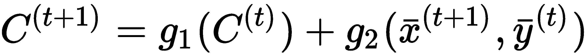

因此，状态取决于先前值、当前输入和先前输出。让我们从第一个项开始，引入遗忘门。正如其名所示，它负责现有记忆元素的持久性或删除。在图中，它由第一个垂直块表示，其值是通过考虑先前输出和当前输入的连接来获得的：

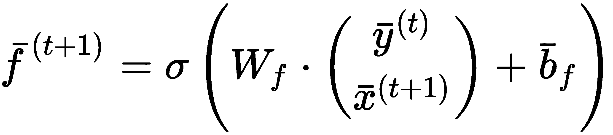

该操作是一个经典的神经元激活，具有向量输出。另一种版本可以使用两个权重矩阵并保持输入元素分离：

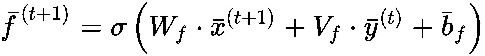

然而，我更喜欢先前的版本，因为它能更好地表达输入和输出的同质性及其后果性。使用遗忘门，可以通过哈达玛（或逐元素）积确定 *g1))* 的值：

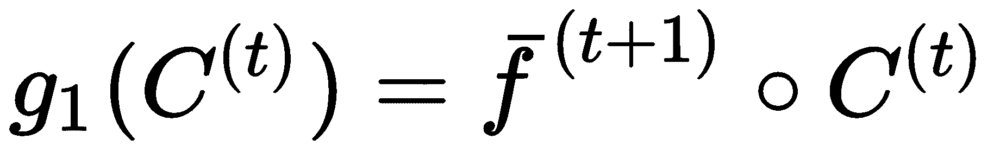

这种计算的效应是过滤掉必须保留的 *C^((t))* 的内容及其有效性程度（与 *f^((t+1))* 的值成正比）。如果遗忘门输出接近 1 的值，则相应的元素仍然被认为是有效的，而较低的值则确定一种过时性，甚至可能导致当遗忘门值为 0 或接近 0 时，细胞完全删除一个元素。下一步是考虑必须考虑的输入样本量以更新状态。这项任务是通过输入门（第二个垂直块）完成的。方程与先前的方程完全类似：

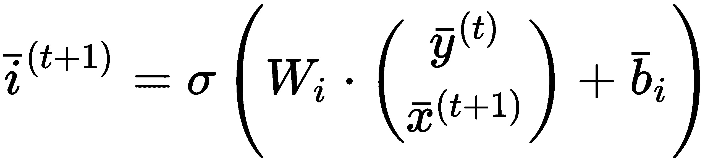

然而，在这种情况下，我们还需要计算必须添加到当前状态中的项。如前所述，LSTM 单元使用双曲正切作为激活函数；因此，新状态贡献的获得如下：


使用输入门和状态贡献，可以确定函数 *g2), y^((t)))*：

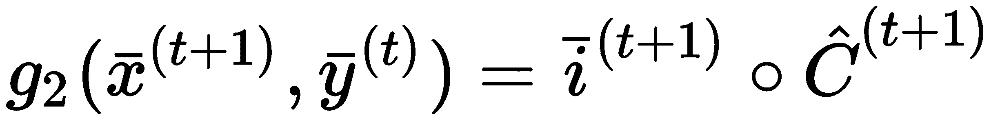

因此，完整的状态方程如下：

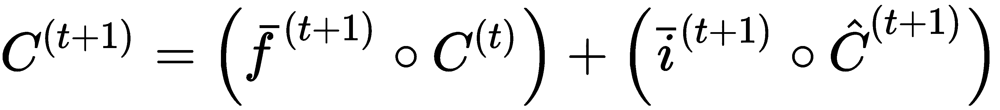

现在，LSTM 单元的内部逻辑更加明显。状态基于以下内容：

+   在先前经验和根据新经验重新评估之间保持动态平衡（由遗忘门调节）

+   当前输入的*语义*效应（由输入门调节）和潜在的加性激活

实际场景很多。可能新的输入会迫使 LSTM 重置状态并存储新的传入值。另一方面，输入门也可以保持关闭，给予新输入（连同前一个输出）非常低的优先级。在这种情况下，LSTM 考虑到长期依赖关系，可以决定丢弃被认为是有噪声且不一定能有助于准确预测的样本。在其他情况下，遗忘和输入门都可以部分打开，只让一些值影响状态。所有这些可能性都通过学习过程通过修正权重矩阵和偏差来管理。与 BPTT 的不同之处在于，长期依赖关系不再受到梯度消失问题的阻碍。

最后一步是确定输出。第三个垂直块被称为输出门，它控制从状态到输出单元必须传递的信息。其方程如下：


因此，实际输出如下确定：

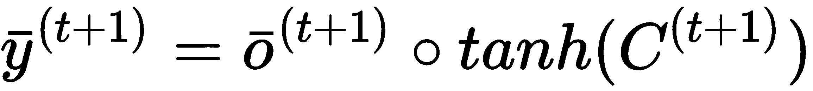

一个重要的考虑因素是门。它们都使用相同的向量，包含前一个输出和当前输入。由于它们是同质值，连接产生了一个有意义的实体，它编码了一种某种**逆**因果关系（这是一个不恰当的定义，因为我们处理的是前因后果）。门的工作方式类似于没有阈值逻辑回归；因此，它们可以被视为伪概率向量（不是分布，因为每个元素都是独立的）。遗忘门表示最后一个序列（效果，原因）比当前状态更重要；然而，只有输入门有责任赋予它影响新状态的权利。此外，输出门表示当前序列能否让当前状态流出。这种动态确实非常复杂，存在一些缺点。例如，当输出门保持关闭时，输出接近零，这会影响遗忘和输入门。由于它们控制新状态和 CEC，它们可能会限制传入信息量和后续修正，导致性能不佳。

一种可以缓解此问题的简单解决方案是由一种称为**窥视孔** **LSTM**的变体提供的。其思路是将前一个状态输入到每个门中，以便它们可以更独立地做出决策。通用的门方程如下：

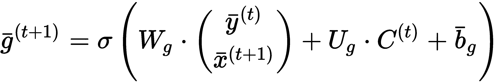

新的权重集 *U[g]*（对于所有三个门）必须以与标准 *W[g]* 和 *b[g]* 相同的方式学习。与经典 LSTM 的主要区别在于，序列动态：忘记门 | 输入门 | 新状态 | 输出门 | 实际输出现在部分被简略处理。状态在每个门激活中的存在允许它们利用多个循环连接，在许多复杂情况下提供更高的准确性。另一个重要的考虑因素是学习过程：在这种情况下，窥视孔被关闭，唯一的反馈通道是输出门。不幸的是，并非每个 LSTM 实现都支持窥视孔；然而，几项研究表明，在大多数情况下，所有模型都产生相似的性能。

Xingjian 等人（在*卷积 LSTM 网络：一种用于降水预报的机器学习方法，Xingjian S.，Zhourong C.，Hao W.，Dit-Yan Y.，Wai-kin W.，Wang-Chun W.，arXiv:1506.04214 [cs.CV]*）提出了一种称为**卷积 LSTM**的变体，它明显地将卷积和 LSTM 单元混合在一起。主要内部差异在于门计算，现在变为（没有窥视孔，尽管如此，总是可以添加）:

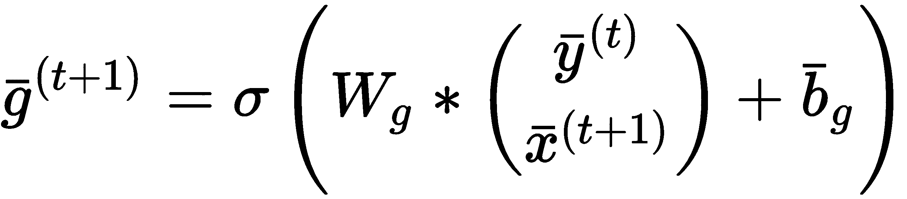

*W[g]* 现在是一个与输入输出向量（通常是两个图像的拼接）卷积的核。当然，可以训练任意数量的核来增加单元的解码能力，输出将具有 (*批大小 × 宽度 × 高度 × 核数*) 的形状。这种单元特别适用于将空间处理与鲁棒的时间方法相结合。给定一系列图像（例如，卫星图像、游戏截图等），卷积 LSTM 网络可以学习通过几何特征演变（例如，云的移动或可以基于长期事件历史预测的具体精灵策略）表现出的长期关系。这种方法（即使经过一些修改）在深度强化学习中得到了广泛应用，以解决仅由一系列图像提供输入的复杂问题。当然，计算复杂度非常高，尤其是在使用许多后续层时；然而，结果优于任何现有方法，这种方法成为管理这类问题的首选之一。

另一个重要的变体，这在许多循环神经网络中都很常见，是由双向接口提供的。这不是一个实际的层，而是一种策略，用于将序列的前向分析与其反向分析结合起来。两个 cellblocks 使用一个序列及其逆序作为输入，输出，例如，可以连接起来并用于后续处理步骤。在 NLP 等领域，这种方法可以显著提高分类和实时翻译的准确性。原因是严格与序列结构的规则有关。在自然语言中，一个句子*w[1] w[2] ... w[n]*有前向关系（例如，单数名词后面可以跟*is*），但了解反向关系（例如，句子*这个地方很糟糕*）可以避免过去需要通过后处理步骤纠正的常见错误（*pretty*的初始翻译可能与*nice*的翻译相似，但后续分析可以揭示形容词不匹配，并可以应用特殊规则）。另一方面，深度学习不是基于*特殊*的*规则*，而是基于学习内部表示的能力，这种表示应该能够自主做出最终决策（无需进一步的外部帮助），双向 LSTM 网络有助于在许多重要场景中实现这一目标。

Keras 自其起源就实现了`LSTM`类。它还提供了一个`Bidirectional`类包装器，可以与每个 RNN 层一起使用，以获得双重输出（使用正向和反向序列计算）。此外，在 Keras 2 中，基于 NVIDIA CUDA（`CuDNNLSTM`）的 LSTM 优化版本提供了非常高的性能，当有兼容的 GPU 时。在同一个包中，还可以找到`ConvLSTM2D`类，它实现了卷积 LSTM 层。在这种情况下，读者可以立即识别出许多参数，因为它们与标准卷积层相同。

# GRU

这个模型被称为**门控循环单元**（**GRU**），由 Cho 等人提出（在《使用 RNN 编码器-解码器进行统计机器翻译学习短语表示》*Cho K.*，*Van Merrienboer B.*，*Gulcehre C.*，*Bahdanau D.*，*Bougares F.*，*Schwenk H.*，*Bengio Y.*，*arXiv:1406.1078 [cs.CL]*），可以看作是经过一些变体的简化 LSTM。一个通用全门控单元的结构在以下图中表示：

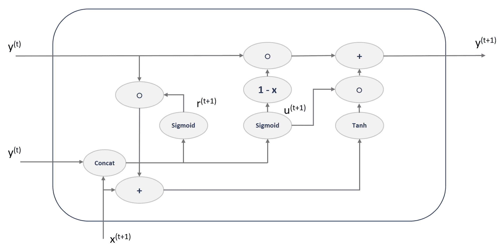

与 LSTM 相比，主要区别在于只有两个门和没有显式的状态。这些简化可以加快训练和预测阶段的速度，同时避免梯度消失问题。

第一个门被称为**重置门**（通常用字母*r*表示），其功能与遗忘门类似：

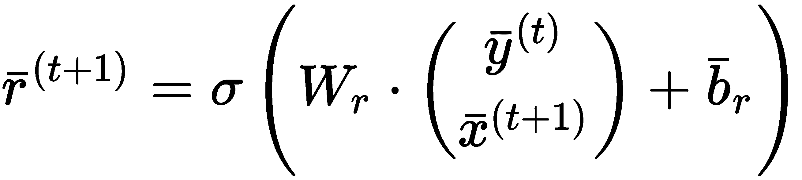

与遗忘门类似，它的作用是决定前一个输出中必须保留的内容及其相对程度。事实上，新输出的附加贡献是通过以下方式获得的：

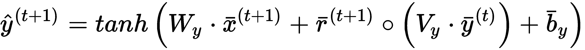

在前面的表达式中，我更喜欢将权重矩阵分开，以便更好地展示其行为。*tanh(•)*的参数是新的输入的线性函数之和以及一个加权项，它是前一个状态的函数。现在，很明显重置门是如何工作的：它调节必须保留的历史量（累积在前一个输出值中）以及可以丢弃的内容。然而，仅重置门不足以以足够的准确性确定正确的输出，考虑到短期和长期依赖。为了提高单元的表达能力，添加了一个更新门（其作用类似于 LSTM 输入门）：

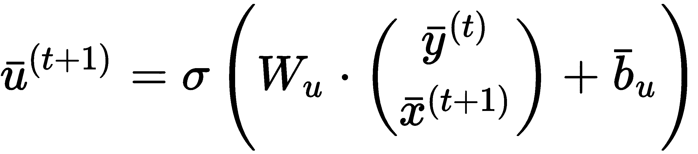

更新门控制必须贡献给新输出的信息量（因此也影响到状态）。由于它是一个介于*0*和*1*之间的值，GRUs 被训练通过类似于加权平均的操作来混合旧输出和新加的附加贡献：

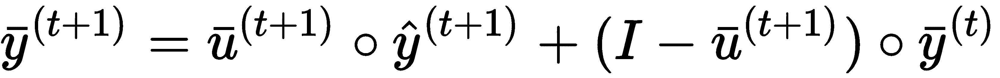

因此，更新门变成了一个调节器，可以选择每个流必须输出和存储以供下一次操作的部分。这个单元在结构上比 LSTM 简单，但几项研究表明，其性能平均来说与 LSTM 相当，在某些特定情况下，GRU 甚至优于更复杂的细胞。我的建议是您测试这两种模型，从 LSTM 开始。现代硬件大大降低了计算成本，在许多情况下，GRUs 的优势可以忽略不计。在这两种情况下，哲学是相同的：错误被保留在细胞内，门控的权重被纠正以最大化准确性。这种行为阻止了小梯度的乘法级联，并增加了学习非常复杂的时间行为的能力。

然而，单个细胞/层无法成功实现所需的准确性。在这些所有情况下，可以通过堆叠由可变数量的细胞组成的多个层来实现。每一层通常可以输出最后一个值或整个序列。前者用于将 LSTM/GRU 层连接到全连接层时，而整个序列对于喂养另一个循环层是必要的。我们将在下面的例子中看到如何使用 Keras 实现这些技术。

就像对于 LSTMs 一样，Keras 实现了`GRU`类及其 NVIDIA CUDA 优化的版本`CuDNNGRU`。

# Keras 中的 LSTM 网络示例

在这个例子中，我们想测试 LSTM 网络学习长期依赖关系的能力。因此，我们使用了一个名为 Zuerich 月太阳黑子（由 Andrews 和 Herzberg 在 1985 年免费提供）的数据集，其中包含从 1749 年到 1983 年所有月份观察到的数值（请阅读信息框了解如何下载数据集）。由于我们不对日期感兴趣，我们需要解析文件以提取仅用于时间序列（包含 2,820 个步骤）所需的数据：

```py
import numpy as np

dataset_filename = '<YOUR_PATH>\dataset.csv'

n_samples = 2820
data = np.zeros(shape=(n_samples, ), dtype=np.float32)

with open(dataset_filename, 'r') as f:
    lines = f.readlines()

for i, line in enumerate(lines):
    if i == 0:
        continue

    if i == n_samples + 1:
        break

    _, value = line.split(',')
    data[i-1] = float(value)
```

或者，可以使用 pandas ([`pandas.pydata.org`](https://pandas.pydata.org)) 加载 CSV 数据集，这是一个强大的数据处理/分析库（有关更多信息，请参阅*《学习 pandas 第二版》，Heydt M.，Packt*）：

```py
import pandas as pd

dataset_filename = '<YOUR_PATH>\dataset.csv'

df = pd.read_csv(dataset_filename, index_col=0, header=0).dropna()
data = df.values.astype(np.float32).squeeze()
```

这些值未经归一化，由于 LSTMs 使用双曲正切函数，因此将它们归一化到区间`-1`和`1`是有帮助的。我们可以轻松地使用 Scikit-Learn 类`MinMaxScaler`执行此步骤：

```py
from sklearn.preprocessing import MinMaxScaler

mmscaler = MinMaxScaler((-1.0, 1.0))
data = mmscaler.fit_transform(data.reshape(-1, 1))
```

完整的数据集如下所示：

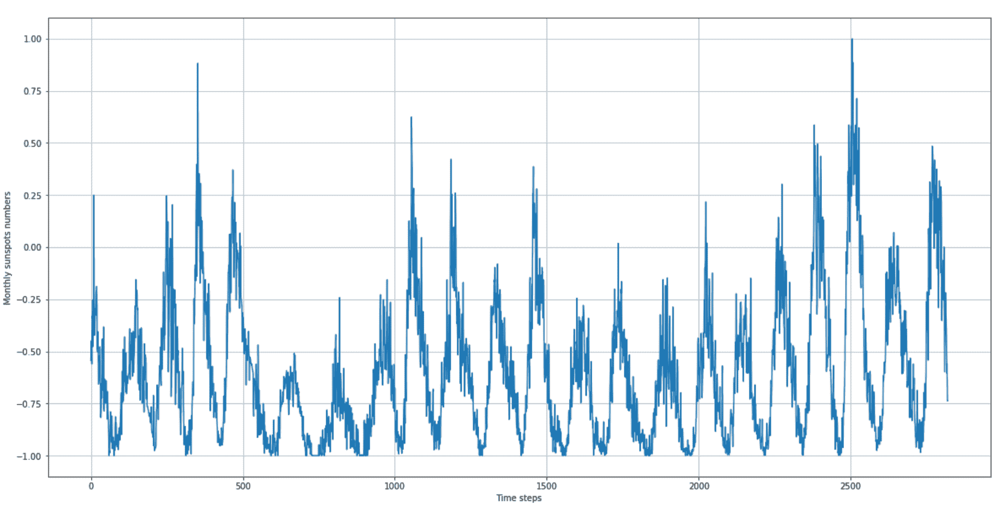

为了训练模型，我们决定使用 2,300 个样本进行训练，剩余的 500 个样本用于验证（对应约 42 年）。模型的输入是一个包含 15 个样本的序列批量（沿时间轴移动），输出是随后的月份；因此，在训练之前，我们需要准备数据集：

```py
sequence_length = 15

X_ts = np.zeros(shape=(n_samples - sequence_length, sequence_length, 1), dtype=np.float32)
Y_ts = np.zeros(shape=(n_samples - sequence_length, 1), dtype=np.float32)

for i in range(0, data.shape[0] - sequence_length):
    X_ts[i] = data[i:i + sequence_length]
    Y_ts[i] = data[i + sequence_length]

X_ts_train = X_ts[0:2300, :]
Y_ts_train = Y_ts[0:2300]

X_ts_test = X_ts[2300:2800, :]
Y_ts_test = Y_ts[2300:2800]
```

现在，我们可以创建并编译一个简单的模型，该模型包含一个包含四个单元的单个状态化 LSTM 层，后面跟着一个双曲正切输出神经元（我总是建议读者尝试更复杂的架构和不同的参数）：

```py
from keras.models import Sequential
from keras.layers import LSTM, Dense, Activation
from keras.optimizers import Adam

model = Sequential()

model.add(LSTM(4, stateful=True, batch_input_shape=(20, sequence_length, 1)))

model.add(Dense(1))
model.add(Activation('tanh'))

model.compile(optimizer=Adam(lr=0.001, decay=0.0001),
              loss='mse',
              metrics=['mse'])
```

在`LSTM`类中将`stateful=True`参数设置为 True 强制 Keras 在每次批量后不重置状态。实际上，我们的目标是学习长期依赖关系，内部 LSTM 状态必须反映整体趋势。当 LSTM 网络是状态化的时，还必须在输入形状中指定批量大小（通过`batch_input_shape`参数）。在我们的例子中，我们选择了 20 个样本的批量大小。优化器是具有更高衰减（以避免不稳定性）的`Adam`，以及基于均方误差的损失（这是此类场景中最常见的选择）。到此为止，我们可以训练模型（100 个周期）：

```py
model.fit(X_ts_train, Y_ts_train,
          batch_size=20,
          epochs=100,
          shuffle=False,
          validation_data=(X_ts_test, Y_ts_test))

Train on 2300 samples, validate on 500 samples
Epoch 1/100
2300/2300 [==============================] - 11s 5ms/step - loss: 0.4905 - mean_squared_error: 0.4905 - val_loss: 0.1827 - val_mean_squared_error: 0.1827
Epoch 2/100
2300/2300 [==============================] - 4s 2ms/step - loss: 0.1214 - mean_squared_error: 0.1214 - val_loss: 0.1522 - val_mean_squared_error: 0.1522
Epoch 3/100
2300/2300 [==============================] - 4s 2ms/step - loss: 0.0796 - mean_squared_error: 0.0796 - val_loss: 0.1154 - val_mean_squared_error: 0.1154

...

Epoch 99/100
2300/2300 [==============================] - 4s 2ms/step - loss: 0.0139 - mean_squared_error: 0.0139 - val_loss: 0.0247 - val_mean_squared_error: 0.0247
Epoch 100/100
2300/2300 [==============================] - 4s 2ms/step - loss: 0.0139 - mean_squared_error: 0.0139 - val_loss: 0.0247 - val_mean_squared_error: 0.0247
```

这是一个仅用于教学目的的示例；因此，最终的验证均方误差并不特别低。然而，正如以下图表（表示验证集上的预测）所示，该模型已成功学习到全局趋势：

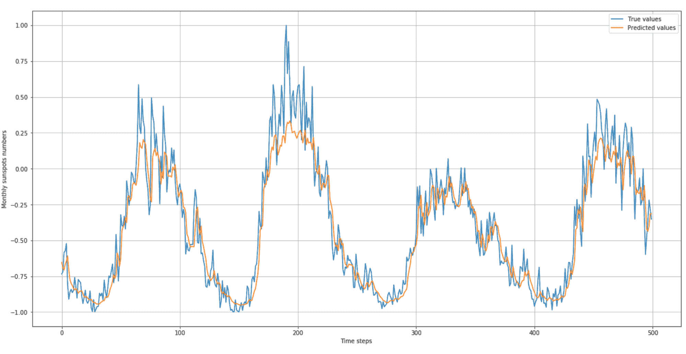

在 Zuerich 数据集上的 LSTM 预测

模型仍然无法在所有非常快速的峰值上达到非常高的精度，但它能够正确地模拟振荡的幅度和尾部的长度。为了保持学术诚信，我们必须考虑这种验证是在真实数据上进行的；然而，当处理时间序列时，使用真实值来预测新值是正常的。在这种情况下，它就像是一个移动预测，其中每个值都是使用训练历史和一组真实观察值获得的。很明显，模型能够预测长期振荡和一些局部振荡（例如，从步骤 300 开始的序列），但它可以通过提高整个验证集的性能来改进。为了实现这一目标，有必要增加网络复杂度并调整学习率（这是一个在真实数据集上非常有趣的练习）。

观察前面的图表，可以看到模型在某些高频（快速变化）的情况下相对更准确，而在其他情况下则更不精确。这不是一个奇怪的行为，因为非常振荡的函数需要更多的非线性（想想泰勒展开和截断到特定程度时的相对误差）来实现高精度（这意味着使用更多的层）。我的建议是，您使用更多的 LSTM 层重复实验，考虑到我们需要将整个输出序列传递到下一个循环层（这可以通过设置`return_sequences=True`参数来实现）。相反，最后一层必须只返回最终值（这是默认行为）。我还建议测试 GRU 层，将性能与 LSTM 版本进行比较，并选择最简单（基准测试训练时间）且最准确的解决方案。

数据集可以免费从[`datamarket.com/data/set/22ti/zuerich-monthly-sunspot-numbers-1749-1983#!ds=22ti&display=line`](https://datamarket.com/data/set/22ti/zuerich-monthly-sunspot-numbers-1749-1983#!ds=22ti&display=line)以 CSV 格式下载。

# 迁移学习

我们已经讨论了深度学习在本质上是基于灰盒模型，这些模型学习如何将输入模式与特定的分类/回归结果关联起来。通常用于为特定检测准备数据的所有处理流程都被神经网络架构的复杂性所吸收。然而，为了获得高精度，需要付出代价，那就是成比例的大量训练样本。最先进的视觉网络使用数百万张图片进行训练，显然，每张图片都必须被正确标注。即使有许多可以用于训练多个模型的免费数据集，许多特定场景仍需要进行艰苦的准备工作，有时这些工作非常难以实现。

幸运的是，深度神经网络架构是层次化的模型，它们以结构化的方式进行学习。正如我们在深度卷积网络的例子中所看到的，第一层变得越来越敏感，能够检测到低级特征，而高层则专注于提取更详细的高级特征。在多个任务中，我们可以合理地认为，使用大型视觉数据集（例如 ImageNet 或 Microsoft Coco）训练的神经网络可以被重新用于在略微不同的任务中实现专业化。这个概念被称为**迁移学习**，当需要使用全新的数据集和特定目标创建最先进的模型时，它是最有用的技术之一。例如，客户可以要求一个系统监控几个摄像头，目的是对图像进行分割并突出特定目标的边界。

输入由具有与在训练非常强大的模型（例如 Inception、ResNet 或 VGG）中使用的数千张图像相同的几何属性的视频帧组成；因此，我们可以取一个预训练的模型，移除最高层（通常是结束于 softmax 分类层的密集层），并将展平层连接到一个输出边界框坐标的多层感知器（MLP）。网络的第一个部分可以被*冻结*（权重不再修改），而随机梯度下降（SGD）被应用于调整新专业化的子网络的权重。

显然，这种方法可以显著加快训练过程，因为模型中最复杂的部分已经经过训练，并且可以保证极高的准确率（相对于原始的简单解决方案），这得益于对原始模型已经进行的优化。显然，最自然的问题就是这种方法是如何工作的？有没有任何正式的证明？不幸的是，没有数学证明，但已有足够的证据来保证我们采用这种方法。一般来说，神经训练过程的目的是专门化每一层，以便为下一层提供更特定的（详细、过滤等）表示。卷积网络是这种行为的明显例子，但在 MLPs 中也可以观察到同样的情况。对非常深的卷积网络的分析显示了内容在达到展平层之前仍然是*视觉的*，在展平层，内容被发送到一系列密集层，这些层负责向最终的 softmax 层提供数据。换句话说，卷积块输出的是输入的高级、分段表示，这很少受到特定分类问题的影响。因此，迁移学习通常是合理的，并且通常不需要重新训练底层。然而，很难理解哪种模型可以产生最佳性能，了解用于训练原始网络的哪个数据集非常有用。通用数据集（例如，ImageNet）在许多情况下非常有用，而特定数据集（如 Cifar-10 或 Fashion；MNIST 可能过于限制）。幸运的是，Keras 在`keras.applications`包中提供了许多模型（甚至相当复杂），这些模型总是使用 ImageNet 数据集进行训练，并且可以立即用于生产就绪的应用。尽管使用它们非常简单，但需要更深入地了解这个框架，而这超出了本书的范围。我邀请对这一主题感兴趣的读者查阅由 Gulli A.、Pal S.和 Packt 出版的《深度学习与 Keras》一书。

# 摘要

在本章中，我们介绍了深度卷积网络的概念，这是一种通用的架构，可以用于任何视觉处理任务。这个想法基于层次信息管理，旨在从低级元素开始提取特征，并逐步前进，直到达到有助于实现特定目标的高级细节。

第一个主题是卷积的概念及其在离散和有限样本中的应用。我们讨论了标准卷积的性质，然后分析了某些重要的变体，例如空洞（或膨胀）卷积、可分离（和深度可分离）卷积，最终是转置卷积。所有这些方法都可以与 1D、2D 和 3D 样本一起工作，尽管最广泛的应用是基于二维（不考虑通道）矩阵，这些矩阵代表静态图像。在同一部分中，我们还讨论了如何使用池化层来降低维度并提高对微小平移的鲁棒性。

在下一节中，我们介绍了循环神经网络（RNN）的概念，强调了当使用时间反向传播算法训练经典模型时通常会出现的问题。特别是，我们解释了为什么这些网络难以学习长期依赖。因此，提出了新的模型，其性能立即表现出色。我们讨论了最著名的循环单元，称为**长短期记忆**（**LSTM**），它可用于易于学习序列中所有最重要的依赖关系的层，即使在具有非常高的方差（如股票市场报价）的上下文中，也能最小化预测误差。最后一个主题是 LSTMs 中实现的想法的简化版本，这导致了名为**门控循环单元**（**GRU**）的模型。这个单元更简单，计算效率更高，许多基准测试证实其性能与 LSTM 大致相同。

在下一章，第十一章，*自编码器*中，我们将讨论一些称为自编码器的特定模型，其主要特性是创建任意复杂输入分布的内部表示。
