# 自编码器

在本章中，我们将探讨一个无监督模型家族，其性能通过现代深度学习技术得到了提升。自编码器为经典问题如降维或字典学习提供了一种不同的方法，但与许多其他算法不同，它们不受影响许多著名模型的容量限制。此外，它们可以利用特定的神经网络层（如卷积）根据专门的标准提取信息片段。这样，内部表示可以更稳健地抵抗不同类型的扭曲，并且在处理信息量方面更加高效。

尤其是我们将要讨论以下内容：

+   标准自编码器

+   去噪自编码器

+   稀疏自编码器

+   变分自编码器

# 自编码器

在前面的章节中，我们讨论了真实数据集通常是非常高维的样本表示，这些样本位于低维流形上（这是半监督模式假设之一，但通常是正确的）。由于模型的复杂性与输入数据的维度成正比，许多技术已经被分析和优化，以减少实际的有效组件数量。例如，PCA 根据相对解释方差选择特征，而 ICA 和通用字典学习方法寻找可以组合以重建原始样本的基本原子。在本章中，我们将分析一类基于略有不同方法但能力显著增强的深度学习方法。

一个通用的**自编码器**是一个分为两个独立（但并非完全自主）组件的模型，称为**编码器**和**解码器**。编码器的任务是转换输入样本为一个编码特征向量，而解码器的任务正好相反：使用特征向量作为输入重建原始样本。以下图显示了通用模型的示意图：

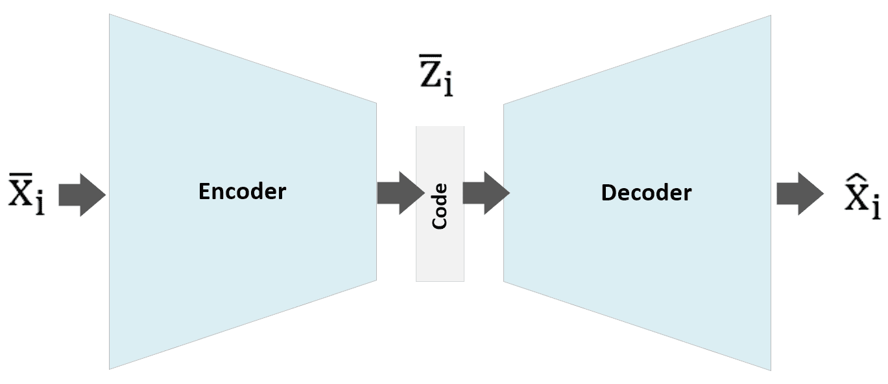

通用自编码器架构

更正式地说，我们可以将编码器描述为一个参数化函数：

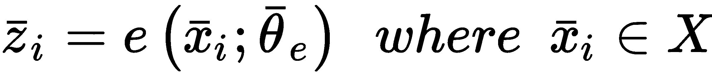

输出 *z[i]* 是一个向量码，其维度通常远低于输入。类似地，解码器被描述如下：

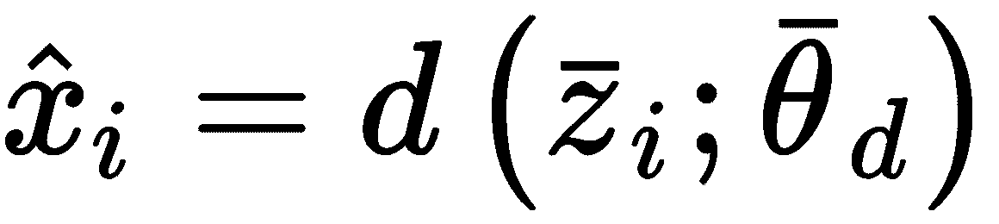

标准算法的目标是最小化与重建误差成比例的成本函数。一种经典的方法是基于均方误差（在包含 *M* 个样本的数据集上工作）：

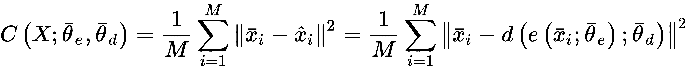

这个函数只依赖于输入样本（它们是常数）和参数向量；因此，这实际上是一种无监督方法，我们可以控制内部结构和施加在 *z[i]* 代码上的约束。从概率论的角度来看，如果输入 *x**[i]* 样本是从 *p(X)* 数据生成过程中抽取的，我们的目标是找到一个 *q(•)* 参数分布，使其与 *p(X)* 的 Kullback–Leibler 散度最小化。考虑到之前的定义，我们可以将 *q(•)* 定义如下：

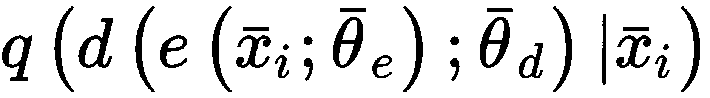

因此，Kullback–Leibler 散度变为以下：

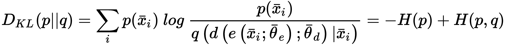

第一个项代表原始分布的负熵，它是常数，不参与优化过程。另一个项是 *p* 和 *q* 之间的交叉熵。如果我们假设 *p* 和 *q* 是高斯分布，均方误差与交叉熵成正比（对于优化目的，它等同于交叉熵），因此这个成本函数在概率方法下仍然有效。或者，我们可以考虑 *p* 和 *q* 是伯努利分布，交叉熵变为以下：

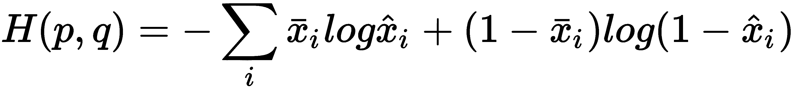

这两种方法的主要区别在于，虽然均方误差可以应用于 *x[i] ∈ ℜ^q*（或多维矩阵），但伯努利分布需要 *x[i]* *∈ [0, 1]*^(*q*)（形式上，这个条件应该是 *x[i] ∈ {0, 1}^q*；然而，当值不是二进制时，优化也可以成功进行）。对于重建，也需要相同的约束；因此，当使用神经网络时，最常见的选择是使用 sigmoid 层。

# TensorFlow 中的深度卷积自编码器示例

这个例子（以及本章和以下章节中的所有其他例子）基于 TensorFlow（有关 TensorFlow 的安装信息，请参阅本节末尾的信息框），因为这个框架允许更大的灵活性，这在 Keras 中有时会带来更多问题。我们将实用主义地处理这个例子，因此我们不会探索所有功能，因为它们超出了本书的范围；然而，感兴趣的读者可以参考 *《TensorFlow 深度学习 第二版》，作者：Zaccone G.，Karim R.，Packt*。

在这个例子中，我们将创建一个深度卷积自编码器，并使用 Fashion MNIST 数据集进行训练。第一步是加载数据（使用 Keras 辅助函数），归一化，为了加快计算速度，将训练集限制为 1,000 个样本：

```py
import numpy as np

from keras.datasets import fashion_mnist

(X_train, _), (_, _) = fashion_mnist.load_data()

nb_samples = 1000
nb_epochs = 400
batch_size = 200
code_length = 256

X_train = X_train.astype(np.float32)[0:nb_samples] / 255.0

width = X_train.shape[1]
height = X_train.shape[2]
```

在这一点上，我们可以创建 `Graph`，设置整个架构，它由以下部分组成：

+   编码器（所有层都有填充 "same" 和 ReLU 激活）：

    +   使用 32 个滤波器，核大小为（3 × 3），步长（2 × 2）的卷积

    +   使用 64 个滤波器，核大小为（3 × 3），步长（1× 1）的卷积

    +   使用 128 个滤波器，核大小为（3 × 3），步长（1 × 1）的卷积

+   解码器：

    +   使用 128 个滤波器，核大小为（3 × 3），步长（2 × 2）的转置卷积

    +   使用 64 个滤波器，核大小为（3 × 3），步长（1× 1）的转置卷积

    +   使用 32 个滤波器，核大小为（3 × 3），步长（1 × 1）的转置卷积

    +   使用 1 个滤波器，核大小为（3 × 3），步长（1 × 1）和 sigmoid 激活的转置卷积

由于图像大小为（28 × 28），我们更愿意将每个批次调整到（32 × 32）的尺寸，以便轻松管理所有基于 2 的幂次大小的后续操作：

```py
import tensorflow as tf

graph = tf.Graph()

with graph.as_default():
    input_images = tf.placeholder(tf.float32, shape=(None, width, height, 1))

    r_input_images = tf.image.resize_images(input_images, (32, 32))

    # Encoder
    conv_0 = tf.layers.conv2d(inputs=r_input_images,
                              filters=32,
                              kernel_size=(3, 3),
                              strides=(2, 2),
                              activation=tf.nn.relu,
                              padding='same')

    conv_1 = tf.layers.conv2d(inputs=conv_0,
                              filters=64,
                              kernel_size=(3, 3),
                              activation=tf.nn.relu,
                              padding='same')

    conv_2 = tf.layers.conv2d(inputs=conv_1,
                              filters=128,
                              kernel_size=(3, 3),
                              activation=tf.nn.relu,
                              padding='same')

    # Code layer
    code_input = tf.layers.flatten(inputs=conv_2)

    code_layer = tf.layers.dense(inputs=code_input,
                                 units=code_length,
                                 activation=tf.nn.sigmoid)

    # Decoder
    decoder_input = tf.reshape(code_layer, (-1, 16, 16, 1))

    convt_0 = tf.layers.conv2d_transpose(inputs=decoder_input,
                                         filters=128,
                                         kernel_size=(3, 3),
                                         strides=(2, 2),
                                         activation=tf.nn.relu,
                                         padding='same')

    convt_1 = tf.layers.conv2d_transpose(inputs=convt_0,
                                         filters=64,
                                         kernel_size=(3, 3),
                                         activation=tf.nn.relu,
                                         padding='same')

    convt_2 = tf.layers.conv2d_transpose(inputs=convt_1,
                                         filters=32,
                                         kernel_size=(3, 3),
                                         activation=tf.nn.relu,
                                         padding='same')

    convt_3 = tf.layers.conv2d_transpose(inputs=convt_2,
                                         filters=1,
                                         kernel_size=(3, 3),
                                         activation=tf.sigmoid,
                                         padding='same')

    # Loss
    loss = tf.nn.l2_loss(convt_3 - r_input_images)

    # Training step
    training_step = tf.train.AdamOptimizer(0.001).minimize(loss)
```

损失函数是一个标准的 L2，没有任何其他约束。我邀请读者测试不同的优化器和学习率，以采用保证最小损失值的解决方案。在定义了`Graph`之后，可以设置一个`InteractiveSession`（或标准会话），初始化所有变量，并开始训练过程：

```py
import numpy as np
import tensorflow as tf

session = tf.InteractiveSession(graph=graph)
tf.global_variables_initializer().run()

for e in range(nb_epochs):
    np.random.shuffle(X_train)

    total_loss = 0.0

    for i in range(0, nb_samples - batch_size, batch_size):
        X = np.zeros((batch_size, width, height, 1), dtype=np.float32)
        X[:, :, :, 0] = X_train[i:i + batch_size, :, :]

        _, n_loss = session.run([training_step, loss], 
                                feed_dict={
                                    input_images: X
                                })
        total_loss += n_loss

    print('Epoch {}) Total loss: {}'.format(e + 1, total_loss))
```

一旦训练过程完成，我们可以检查整个数据集的平均编码长度（这个信息对于比较通过施加稀疏性约束得到的结果很有用）：

```py
import numpy as np

codes = session.run([code_layer], 
                    feed_dict={
                        input_images: np.expand_dims(X_train, axis=3),
                    })[0]

print(np.mean(codes))
0.5545144
```

这个值非常小，表明表示已经相当稀疏；然而，我们将它与稀疏自编码器得到的平均值进行比较。现在我们可以通过编码和解码处理一些图像（10 个）：

```py
import numpy as np

Xs = np.reshape(X_train[0:10], (10, width, height, 1))

Ys = session.run([convt_3], 
                 feed_dict={
                     input_images: Xs
                })

Ys = np.squeeze(Ys[0] * 255.0)
```

结果如下所示：

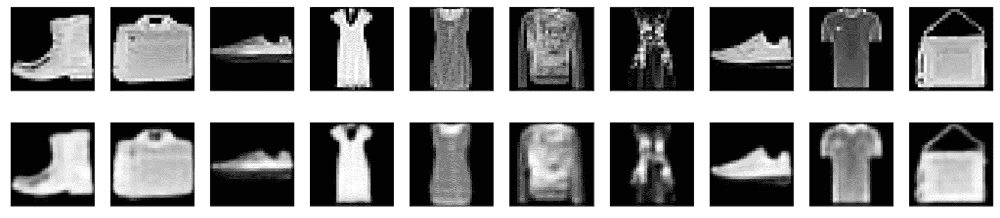

原始图像（上排）；解码图像（下排）

如您所见，重建过程相当损失较大，但自动编码器成功学会了如何降低输入样本的维度。作为一个练习，我邀请读者将代码分成两个独立的部分（编码器和解码器），并优化架构以在整个 Fashion MNIST 数据集上实现更高的准确率。

TensorFlow 适用于 Linux、Windows 和 OS X，支持 CPU 和 CUDA GPU。在许多情况下，可以使用`pip install -U tensorflow`命令安装它；然而，我建议您阅读每个平台的更新说明，请参阅[`www.tensorflow.org/install/`](https://www.tensorflow.org/install/)。

# 去噪自编码器

自动编码器可以用来确定数据集的欠完备表示；然而，Bengio 等人（在 P. Vincent, H. Larochelle, I. Lajoie, Y. Bengio 和 P. Manzagol 的书籍《Stacked Denoising Autoencoders: Learning Useful Representations in a Deep Network with a Local Denoising Criterion》中，该书籍来自《Journal of Machine Learning Research 11/2010》）提出使用它们不是为了学习样本的精确表示以便从低维代码重建它，而是为了去噪输入样本。这并不是一个全新的想法，因为例如 Hopfield 网络（几十年前提出）有相同的目的，但其在容量方面的限制导致研究人员寻找不同的方法。如今，深度自动编码器可以轻松处理高维数据（如图像），这随之而来的空间需求，这就是为什么现在许多人正在重新考虑如何教会网络从损坏的图像开始重建样本图像的想法。

形式上，去噪自动编码器和标准自动编码器之间没有太多区别。然而，在这种情况下，编码器必须与噪声样本一起工作：

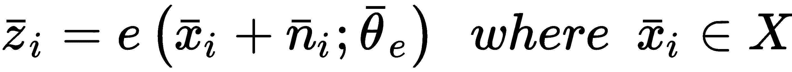

解码器的损失函数保持不变。如果为每个批次采样噪声，重复足够多的迭代次数，允许自动编码器学习如何在某些片段缺失或损坏时重建原始图像。为了达到这个目标，作者们提出了不同类型的噪声。最常见的选择是采样高斯噪声，它具有一些有用的特性，并且与许多真实的噪声过程相一致：

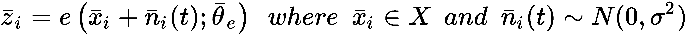

另一种可能性是使用输入丢弃层，将一些随机元素置零：

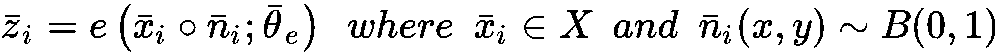

这种选择显然更为激进，并且必须适当调整比率。大量丢失的像素可能会不可逆地删除许多信息，重建可能会变得更加困难且*刚性*（我们的目的是扩展自动编码器对从同一分布中抽取的其他样本的能力）。或者，可以混合高斯噪声和 dropout 的噪声，以固定的概率在它们之间切换。显然，模型必须比标准自动编码器更复杂，因为现在它们必须处理缺失的信息；同样的概念也适用于代码长度：非常不完整的代码无法提供重建原始图像所需的所有元素，以最准确的方式。我建议测试所有可能性，特别是在噪声受外部条件限制时（例如，旧照片或通过受精确噪声过程影响的信道传输的消息）。如果模型还必须用于从未见过的样本，选择代表真实分布的样本至关重要，当元素数量不足以达到所需的精度水平时，使用数据增强技术（限于与特定问题兼容的操作）。

# TensorFlow 中的去噪自动编码器示例

在本例（基于上一个例子）中，我们将采用一个非常相似的架构，但由于目标是去噪图像，我们将设置代码长度等于（宽度 × 高度），将所有步长设置为（1 × 1），因此我们不再需要调整图像大小：

```py
import tensorflow as tf

graph = tf.Graph()

with graph.as_default():
    input_noisy_images = tf.placeholder(tf.float32, shape=(None, width, height, 1))
    input_images = tf.placeholder(tf.float32, shape=(None, width, height, 1))

    # Encoder
    conv_0 = tf.layers.conv2d(inputs=input_noisy_images,
                              filters=32,
                              kernel_size=(3, 3),
                              activation=tf.nn.relu,
                              padding='same')

    conv_1 = tf.layers.conv2d(inputs=conv_0,
                              filters=64,
                              kernel_size=(3, 3),
                              activation=tf.nn.relu,
                              padding='same')

    conv_2 = tf.layers.conv2d(inputs=conv_1,
                              filters=128,
                              kernel_size=(3, 3),
                              activation=tf.nn.relu,
                              padding='same')

    # Code layer
    code_input = tf.layers.flatten(inputs=conv_2)

    code_layer = tf.layers.dense(inputs=code_input,
                                 units=width * height,
                                 activation=tf.nn.sigmoid)

    # Decoder
    decoder_input = tf.reshape(code_layer, (-1, width, height, 1))

    convt_0 = tf.layers.conv2d_transpose(inputs=decoder_input,
                                         filters=128,
                                         kernel_size=(3, 3),
                                         activation=tf.nn.relu,
                                         padding='same')

    convt_1 = tf.layers.conv2d_transpose(inputs=convt_0,
                                         filters=64,
                                         kernel_size=(3, 3),
                                         activation=tf.nn.relu,
                                         padding='same')

    convt_2 = tf.layers.conv2d_transpose(inputs=convt_1,
                                         filters=32,
                                         kernel_size=(3, 3),
                                         activation=tf.nn.relu,
                                         padding='same')

    convt_3 = tf.layers.conv2d_transpose(inputs=convt_2,
                                         filters=1,
                                         kernel_size=(3, 3),
                                         activation=tf.sigmoid,
                                         padding='same')

    # Loss
    loss = tf.nn.l2_loss(convt_3 - input_images)

    # Training step
    training_step = tf.train.AdamOptimizer(0.001).minimize(loss)
```

在这种情况下，我们需要传递噪声图像（通过`placeholder input_noisy_images`）和原始图像（用于计算最终的 L2 损失函数）。在我们的例子中，我们决定使用标准差为`σ = 0.2`的高斯噪声（剪辑最终值，以确保它们始终介于 0 和 1 之间）：

```py
import numpy as np
import tensorflow as tf

session = tf.InteractiveSession(graph=graph)
tf.global_variables_initializer().run()

for e in range(nb_epochs):
    total_loss = 0.0

    for i in range(0, nb_samples - batch_size, batch_size):
        X = np.zeros((batch_size, width, height, 1), dtype=np.float32)
        X[:, :, :, 0] = X_train[i:i + batch_size, :, :]
        Xn = np.clip(X + np.random.normal(0.0, 0.2, size=(batch_size, width, height, 1)), 0.0, 1.0)

        _, n_loss = session.run([training_step, loss], 
                                feed_dict={
                                    input_images: X,
                                    input_noisy_images: Xn
                                })
        total_loss += n_loss

    print('Epoch {}) Total loss: {}'.format(e + 1, total_loss))
```

经过 200 个 epoch 后的结果如图所示：

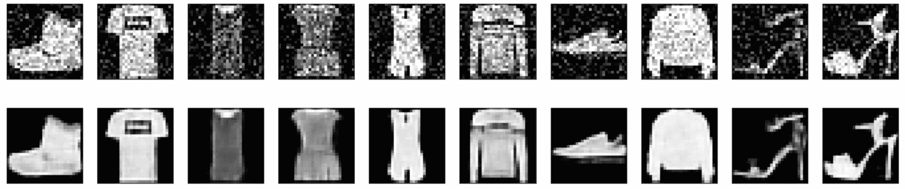

噪声样本（上排）；去噪样本（下排）

去噪自动编码器已经成功地学会了在有高斯噪声的情况下重建原始图像。我邀请读者测试其他方法（例如使用初始 dropout）并提高噪声水平，以了解该模型可以有效地去除的最大破坏程度。

# 稀疏自动编码器

通常，标准自编码器产生密集的内部表示。这意味着大多数值与零不同。然而，在某些情况下，具有稀疏代码可能更有用，可以更好地表示属于字典的原子。在这种情况下，如果*z[i]* = (0, 0, *z[i]^n*, ..., 0, *z[i]^m*, ...), 我们可以将每个样本视为特定原子的加权重叠。为了实现这一目标，我们可以简单地应用 L1 惩罚到代码层，如第一章中所述，*机器学习* *模型* *基础*。因此，单个样本的损失函数变为以下：

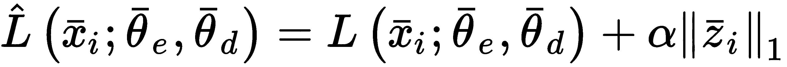

在这种情况下，我们需要考虑额外的超参数α，它必须调整以在不影响准确性的情况下增加稀疏度。作为一个一般性的经验法则，我建议从等于 0.01 的值开始，并减少它，直到达到期望的结果。在大多数情况下，更高的值会导致非常糟糕的性能，因此通常避免使用。

Andrew Ng（在他的书*稀疏自编码器，CS294A，斯坦福大学*）提出了不同的方法。如果我们将代码层视为一组独立的伯努利随机变量，我们可以通过考虑一个具有非常低平均值（例如，*p[r]* = 0.01）的通用参考伯努利变量，并将通用元素*z[i]^((j))*与*p[r]*之间的 Kullback-Leibler 散度添加到成本函数中，来强制执行稀疏性。对于单个样本，额外的项如下（*p*是代码长度）：

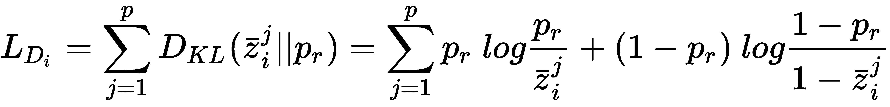

结果损失函数变为以下：

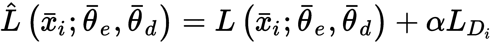

这种惩罚的效果类似于 L1（考虑相同的α超参数问题），但许多实验已经证实，由此产生的成本函数更容易优化，并且可以达到达到更高重建精度的相同稀疏度。当与稀疏自编码器一起工作时，由于假设单个元素由少量原子组成（与字典大小相比），代码长度通常较大。因此，我建议您用不同的代码长度评估稀疏度水平，并选择最大化前者同时最小化后者的组合。

# 向 Fashion MNIST 深度卷积自编码器添加稀疏性

在这个例子中，我们将在第一个练习中定义的成本函数中添加一个 L1 正则化项：

```py
import tensorflow as tf

...

# Loss
sparsity_constraint = tf.reduce_sum(0.001 * tf.norm(code_layer, ord=1, axis=1))
loss = tf.nn.l2_loss(convt_3 - r_input_images) + sparsity_constraint

...
```

训练过程完全相同，因此我们可以直接展示 200 个 epoch 后的最终代码均值：

```py
import numpy as np

codes = session.run([code_layer], 
                    feed_dict={
                        input_images: np.expand_dims(X_train, axis=3),
                    })[0]

print(np.mean(codes))
0.45797634
```

如您所见，均值现在更低，这表明更多的代码值接近 0。我邀请读者实现其他策略，考虑到创建一个填充小值（例如，0.01）的常量向量更容易，并且可以利用 TensorFlow 提供的向量化特性。我还建议通过将其拆分为熵项 *H(p[r])*（这是常数）和交叉熵 *H(z, p[r])* 项来简化 Kullback–Leibler 散度。

# 变分自动编码器

**变分自动编码器**（**VAE**）是由 Kingma 和 Wellin 提出的一种生成模型（在他们的工作 *Auto-Encoding Variational Bayes, arXiv:1312.6114 [stat.ML]* 中），它在某种程度上类似于标准自动编码器，但它有一些基本的内部差异。实际上，目标不是找到数据集的编码表示，而是确定一个生成过程的参数，该过程能够根据输入数据生成过程产生所有可能的输出。

让我们以一个基于可学习参数向量 *θ* 和一组具有概率密度函数 *p(z;θ)* 的潜在变量 *z* 的模型为例。因此，我们的目标可以表达为研究 *θ* 参数，以最大化边缘分布 *p(x;**θ)*（通过联合概率 *p(x,z;θ)* 的积分获得）的可能性：

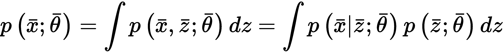

如果这个问题可以很容易地以闭式形式解决，那么从数据生成过程 *p(x)* 中抽取的大量样本就足以找到好的 *p(x;θ)* 近似。不幸的是，由于真实的先验 *p(z)* 未知（这是一个次要问题，因为我们可以轻易地做出一些有用的假设），并且后验分布 *p(x|z;θ)* 几乎总是接近零，所以前面的表达式在大多数情况下都是不可处理的。第一个问题可以通过选择一个简单的先验（最常见的选择是 *z ∼ N(0, I)*）来解决，但第二个问题仍然非常困难，因为只有少数 *z* 值可以导致生成可接受的样本。这尤其适用于数据集非常高维和复杂（例如，图像）的情况。即使有数百万种组合，也只有少数可以产生真实的样本（如果图像是汽车的照片，我们期望在下半部分有四个轮子，但仍然有可能生成轮子在顶部的样本）。因此，我们需要利用一种方法来减少样本空间。变分贝叶斯方法（阅读 *C.* Fox 和 S. Roberts 的作品 *A Tutorial on Variational Bayesian Inference* 来自 *Orchid* 以获取更多信息）基于使用 *代理* 分布的想法，这些分布易于采样，在这种情况下，其密度非常高（即生成合理输出的概率远高于真实后验）。

在这种情况下，我们定义一个近似后验，考虑到标准自动编码器的架构。特别是，我们可以引入一个 *q(z|x;θ[q])* 分布，它充当一个编码器（不再表现出确定性），可以用神经网络轻松建模。我们的目标，当然是找到最佳的 *θ[q]* 参数集，以最大化 *q* 与真实后验分布 *p(z|x;θ)* 之间的相似性。这个结果可以通过最小化 Kullback–Leibler 散度来实现：

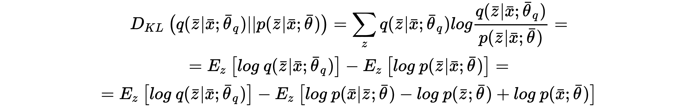

在最后一个公式中，项 *log p(x;**θ)* 不依赖于 *z*，因此可以从期望值算子中提取出来，并且表达式可以被操作以简化它：

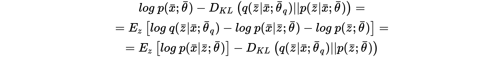

该方程也可以重写为以下形式：

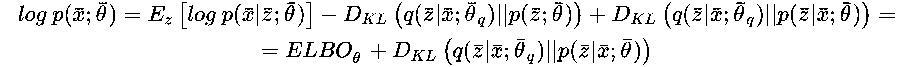

在右侧，我们现在有项 **ELBO**（简称 **证据下界**）和概率编码器 *q(z|x;θ[q])* 与真实后验分布 *p(z|x;**θ)* 之间的 Kullback–Leibler 散度。由于我们想要最大化在 *θ* 参数化下的样本的对数概率，并且考虑到 KL 散度总是非负的，我们只能处理 ELBO（这比其他项更容易管理）。实际上，我们将优化的损失函数是负 ELBO。为了实现这个目标，我们需要两个更重要的步骤。

第一个选择是为 *q(z|x;θ[q]*) 选择一个合适的结构。由于假设 *p(z;θ)* 是正态分布，我们可以假设将 *q(z|x;θ[q]*) 模型化为一个多元高斯分布，将概率编码器分为两个块，这两个块使用相同的底层：

+   一个均值生成器 *μ(z|x;θ[q])*，输出一个 *μ[i] ∈ ℜ^p* 向量

+   一个协方差生成器 *Σ(z|x;θ[q]**)*（假设为对角矩阵），输出一个 *σ[i] ∈ ℜ^p* 向量，使得 *Σ[i]=*diag*(σ[i])*

这样，*q(z|x;θ[q]**) = N(μ(z|x;θ[q]), Σ(z|x;θ[q]))*，因此右手边的第二项是两个高斯分布之间的 Kullback*-*Leibler 散度，可以很容易地表示如下（*p* 是均值和协方差向量的维度）：

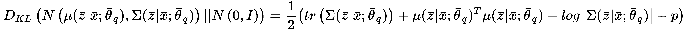

这个操作比预期的要简单，因为，由于 *Σ* 是对角矩阵，迹对应于元素 *Σ[1]* + *Σ[2]* + [...] + *Σ[p]* 的和，并且 log(|*Σ*|) = log(*Σ[1]Σ[2]...Σ[p]*) = log *Σ[1]* + log *Σ[2]* + ... + log *Σ[p]*.

在这一点上，最大化上一个表达式的右侧等同于最大化生成可接受样本的期望对数概率，并最小化正态先验与编码器合成的高斯分布之间的差异。现在看起来似乎简单多了，但仍然有一个问题需要解决。我们希望使用神经网络和随机梯度下降算法，因此我们需要可微函数。由于 Kullback-Leibler 散度只能使用包含*n*个元素的 minibatch（在足够多的迭代后，近似值接近真实值），因此有必要从分布*N(μ(z|x;θ[q]), Σ(z|x;θ[q]))*中采样*n*个值，而且不幸的是，这个操作是不可微分的。为了解决这个问题，作者提出了一种重新参数化技巧：我们不是从*q(z|x;θ[q])*中采样，而是可以从一个正态分布中采样，*ε ∼ N(0, I)*，并构建实际的样本作为*μ(z|x;θ[q])* + *ε · Σ(z|x;θ[q])*²。考虑到*ε*在批次中是一个常数向量（正向和反向阶段都是），很容易计算相对于前面表达式的梯度并优化解码器和编码器。

我们需要考虑的最后一个元素是我们要最大化的表达式的右侧的第一个项：

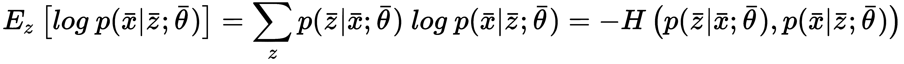

这个术语表示实际分布与重建分布之间的负交叉熵。如第一部分所述，有两种可行选择：高斯分布或伯努利分布。一般来说，变分自编码器使用伯努利分布，输入样本和重建值被限制在 0 和 1 之间。然而，许多实验已经证实均方误差可以加速训练过程，因此我建议读者测试这两种方法，并选择保证最佳性能的方法（无论是准确性还是训练速度）。

# TensorFlow 中的变分自编码器示例

让我们继续使用 Fashion MNIST 数据集来构建变分自编码器。如解释所述，编码器的输出现在分为两个部分：均值和协方差向量（两者维度都等于*(width · height)*）和解码器输入是通过从正态分布中采样并将代码组件投影得到的。完整的`Graph`如下：

```py
import tensorflow as tf

graph = tf.Graph()

with graph.as_default():
    input_images = tf.placeholder(tf.float32, shape=(batch_size, width, height, 1))

    # Encoder
    conv_0 = tf.layers.conv2d(inputs=input_images,
                              filters=32,
                              kernel_size=(3, 3),
                              strides=(2, 2),
                              activation=tf.nn.relu,
                              padding='same')

    conv_1 = tf.layers.conv2d(inputs=conv_0,
                              filters=64,
                              kernel_size=(3, 3),
                              strides=(2, 2),
                              activation=tf.nn.relu,
                              padding='same')

    conv_2 = tf.layers.conv2d(inputs=conv_1,
                              filters=128,
                              kernel_size=(3, 3),
                              activation=tf.nn.relu,
                              padding='same')

    # Code layer
    code_input = tf.layers.flatten(inputs=conv_2)

    code_mean = tf.layers.dense(inputs=code_input,
                                units=width * height)

    code_log_variance = tf.layers.dense(inputs=code_input,
                                        units=width * height)

    code_std = tf.sqrt(tf.exp(code_log_variance))

    # Normal samples
    normal_samples = tf.random_normal(mean=0.0, stddev=1.0, shape=(batch_size, width * height))

    # Sampled code
    sampled_code = (normal_samples * code_std) + code_mean

    # Decoder
    decoder_input = tf.reshape(sampled_code, (-1, 7, 7, 16))

    convt_0 = tf.layers.conv2d_transpose(inputs=decoder_input,
                                         filters=64,
                                         kernel_size=(3, 3),
                                         strides=(2, 2),
                                         activation=tf.nn.relu,
                                         padding='same')

    convt_1 = tf.layers.conv2d_transpose(inputs=convt_0,
                                        filters=32,
                                        kernel_size=(3, 3),
                                        strides=(2, 2),
                                        activation=tf.nn.relu,
                                        padding='same')

    convt_2 = tf.layers.conv2d_transpose(inputs=convt_1,
                                        filters=1,
                                        kernel_size=(3, 3),
                                        padding='same')

    convt_output = tf.nn.sigmoid(convt_2)

    # Loss
    reconstruction = tf.nn.sigmoid_cross_entropy_with_logits(logits=convt_2, labels=input_images)
    kl_divergence = 0.5 * tf.reduce_sum(tf.square(code_mean) + tf.square(code_std) - tf.log(1e-8 + tf.square(code_std)) - 1, axis=1) 

    loss = tf.reduce_sum(reconstruction) + kl_divergence

    # Training step
    training_step = tf.train.AdamOptimizer(0.001).minimize(loss)
```

如您所见，唯一的区别如下：

+   编码器输入的生成是`(normal_samples * code_std) + code_mean`

+   使用 sigmoid 交叉熵作为重建损失

+   Kullback-Leibler 散度作为正则化项的存在

训练过程与本章第一个示例相同，因为采样操作是由 TensorFlow 直接执行的。200 个 epoch 后的结果如下所示：

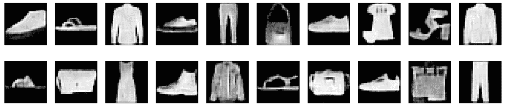

变分自动编码器输出

作为练习，我邀请读者使用 RGB 数据集（例如 Cifar-10，可在[`www.cs.toronto.edu/~kriz/cifar.html`](https://www.cs.toronto.edu/~kriz/cifar.html)找到）来测试 VAE 的生成能力，通过比较输出样本与从原始分布中抽取的样本进行比较。

在这类实验中，随机数由 NumPy 和 TensorFlow 共同生成，随机种子始终设置为 1,000（`np.random.seed(1000)`和`tf.set_random_seed(1000)`）。其他值或未重置种子的后续测试可能会产生略微不同的结果。

# 摘要

在本章中，我们将自动编码器作为无监督模型介绍，它可以学习用低维代码表示高维数据集。它们被结构化为两个独立的模块（尽管它们是共同训练的）：一个编码器，负责将输入样本映射到内部表示，以及一个解码器，它必须执行逆操作，从代码重建原始图像。

我们还讨论了如何使用自动编码器来去噪样本，以及如何对代码层施加稀疏性约束，以类似于标准字典学习的概念。最后一个主题是关于一种稍微不同的模式，称为变分自动编码器。其想法是构建一个生成模型，能够重现属于训练分布的所有可能的样本。

在下一章中，我们将简要介绍一个非常重要的模型家族，称为**生成对抗网络**（**GANs**），它与变分自动编码器的目的非常相似，但采用了更加灵活的方法。
