# 生成对抗网络

在本章中，我们将简要介绍基于一些博弈论概念的生成模型家族。它们的主要特点是针对学习区分真实样本和伪造样本的对抗性训练过程，同时，推动另一个生成越来越接近训练样本的样本的组件。

特别是，我们将讨论：

+   对抗性训练和标准**生成对抗网络（GANs**）

+   **深度卷积生成对抗网络（DCGAN**）

+   **Wasserstein GANs（WGAN**）

# 对抗性训练

Goodfellow 和其他人（在 *Generative Adversarial Networks*，*Goodfellow I*.*J*., *Pouget-Abadie J*., *Mirza M*., *Xu B*., *Warde-Farley D*., *Ozair S*., *Courville A*., *Bengio Y*., *arXiv:1406.2661* [*stat.ML*]）提出的对抗性训练的杰出想法，引领了一代新的生成模型，这些模型立即优于大多数现有算法。所有衍生模型都基于相同的对抗性训练基本概念，这是一种部分受博弈论启发的途径。

假设我们有一个数据生成过程，*pdata*，它代表一个实际的数据分布和有限数量的样本，我们假设这些样本是从 *p[data]* 中抽取的：

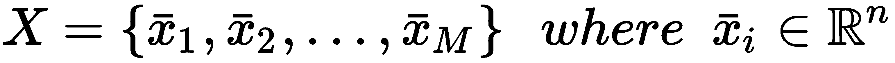

我们的目标是训练一个称为生成器的模型，其分布必须尽可能接近 *p[data]*。这是算法中最棘手的部分，因为与标准方法（例如，变分自编码器）不同，对抗性训练基于两个玩家之间的最小-最大博弈（我们可以简单地说，给定一个目标，两个玩家的目标是使最大可能的损失最小化；但在这个案例中，他们各自工作在不同的参数上）。一个玩家是生成器，我们可以将其定义为一个噪声样本的参数化函数：

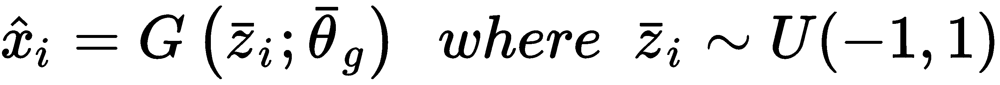

生成器被一个噪声向量（在这种情况下，我们使用了均匀分布，但没有任何特别的限制；因此，我们只是简单地说 *z* 是从噪声分布 *p[noise]* 中抽取的），并输出一个与从 *p[data]* 中抽取的样本具有相同维度的值。在没有进一步控制的情况下，生成器的分布将完全不同于数据生成过程，但这是另一个玩家进入场景的时刻。第二个模型被称为 *判别器*（或评论家），它负责评估从 *p[data]* 中抽取的样本和由生成器产生的样本：

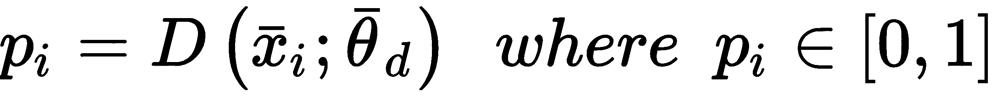

该模型的作用是输出一个概率，这个概率必须反映样本是从 *p[data]* 中抽取的，而不是由 *G(z; θ[g]*) 生成的。发生的情况非常简单：第一个玩家（生成器）输出一个样本，*x*。如果 *x* 实际上属于 *p[data]*，判别器将输出一个接近 1 的值，而如果它与其他真实样本非常不同，*D(x; θ[d]*) 将输出一个非常低的概率。游戏的真正结构基于训练生成器欺骗判别器的想法，通过产生可以潜在地从 *p[data]* 中抽取的样本。通过在 *x* 是从 *p[data]* 中抽取的真实样本时尝试最大化对数概率，*log(D(x; θ[d]**))，同时最小化对数概率，*log(1 - D(G(z; θ[g]); θ[d]))*，其中 *z* 从噪声分布中抽取。

第一个操作迫使判别器越来越意识到真实样本（这个条件是必要的，以避免被轻易欺骗）。第二个目标稍微复杂一些，因为判别器必须评估一个可能被接受或不被接受的样本。假设生成器不够聪明，输出的样本不属于 *p[data]*。随着判别器学习 *p[data]* 的结构，它很快就会区分出错误的样本，输出一个低概率。因此，通过最小化 *log(1 - D(G(z; θ[g]); θ[d]))*，我们迫使判别器在样本与从 *p[d]*[*ata*] 中抽取的样本相当不同时越来越挑剔，从而使生成器越来越能够产生可接受的样本。另一方面，如果生成器输出的样本属于数据生成过程，判别器将输出一个高概率，最小化将回到之前的情况。

作者使用一个共享的价值函数，*V(G, D)*，来表示这个最小-最大游戏，该函数必须由生成器最小化，由判别器最大化：

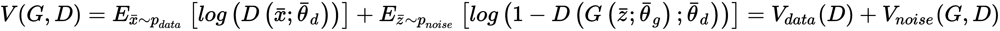

这个公式代表了两个玩家之间非合作博弈的动力学（欲了解更多信息，请参阅*Tadelis S*., *博弈论，普林斯顿大学出版社*）。从理论上讲，这种博弈可以接受一种特殊配置，称为**纳什均衡**，可以这样描述：如果两个玩家知道彼此的策略，那么如果对方玩家不改变自己的策略，他们就没有理由改变自己的策略。在这种情况下，判别器和生成器都会追求自己的策略，直到不再需要改变，达到一个最终、稳定的配置，这可能是纳什均衡（即使有许多因素可能阻止达到这个目标）。一个常见的问题是判别器过早收敛，这导致梯度消失，因为损失函数在接近 0 的区域变得平坦。由于这是一个博弈，一个基本条件是提供信息以允许玩家进行纠正。如果判别器学习如何快速区分真实样本和伪造样本，那么生成器的收敛速度会减慢，玩家可能会被困在次优配置中。一般来说，当分布相当复杂时，判别器比生成器慢；但在某些情况下，在每次单独更新判别器之后，可能需要更新生成器更多次。不幸的是，没有经验法则；例如，当处理图像时，可以观察在足够多的迭代后生成的样本。如果判别器损失变得非常小，并且样本看起来被破坏或不连贯，这意味着生成器没有足够的时间学习分布，需要减慢判别器的速度。

上文提到的论文的作者表明，给定一个由分布 *pg* 特征化的生成器，最优判别器是：

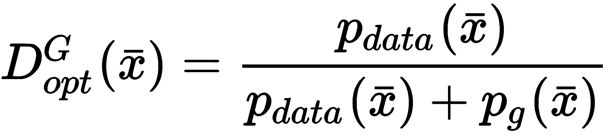

在这一点上，考虑到前面的价值函数 *V(G*, *D)* 和使用最优判别器，我们可以将其重写为一个单一目标（作为 *G* 的函数），生成器必须最小化这个目标：

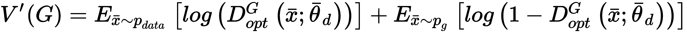

为了更好地理解**生成对抗网络（GAN**）的工作原理，我们需要扩展前面的表达式：

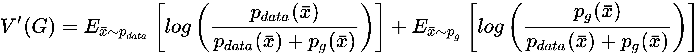

通过一些简单的操作，我们得到以下结果：

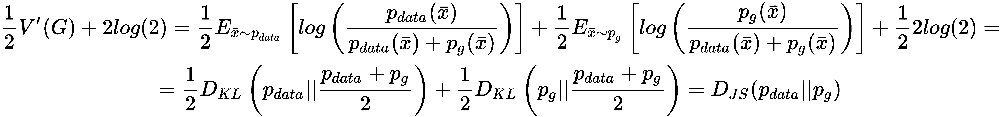

最后一个项代表了 *p[data]* 和 *p[g]* 之间的 Jensen-Shannon 散度。这个度量与 Kullback-Leibler 散度相似，但它是对称的，并且介于 *0* 和 *log(2)* 之间。当两个分布相同，*D[JS] = 0*；但如果它们的支撑（*p(x) > 0* 的值集）不相交，*D[JS]** = log(2)（而 *D[KL] = ∞*）。因此，价值函数可以表示为：

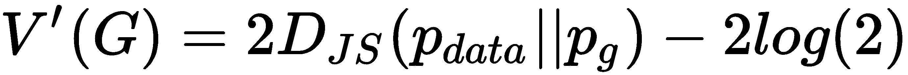

现在，应该更清楚的是，GAN 尝试最小化数据生成过程和生成器分布之间的 Jensen-Shannon 散度。一般来说，这个程序相当有效；然而，当支持集不连续时，GAN 没有关于真实距离的信息。这种考虑（在 *Improved Techniques for Training GANs*，*Salimans T*., *Goodfellow I*., *Zaremba W*., *Cheung V*., *Radford A*.,and *Chen X*., *arXiv:1606.03498 [cs.LG]*) 中以更严格的数学方式分析）解释了为什么训练 GAN 可以变得相当困难，并且因此，为什么在许多情况下无法找到纳什均衡。出于这些原因，我们将在下一节分析一种替代方法。

完整的 GAN 算法（如作者所提出）如下：

1.  设置迭代次数，*N[epochs]*

1.  设置判别器迭代次数，*N[iter]*（在大多数情况下，*N[iter] = 1*）

1.  设置批量大小，*k*

1.  定义一个噪声生成过程，*M*（例如，*U(-1, 1)*）

1.  对于 *e=1* 到 *N[epochs]*：

    1.  从 *X* 中采样 *k* 个值

    1.  从 *N* 中采样 *k* 个值

    1.  对于 *i=1* 到 *N[iter]*：

        1.  计算梯度，*∇[d] V(G, D)*（仅针对判别器变量）。期望值通过样本均值近似。

        1.  通过随机梯度上升更新判别器参数（由于我们处理对数，可以最小化负损失）。

    1.  从 *N* 中采样 *k* 个值

    1.  计算梯度，*∇[g] Vnoise*（仅针对生成器变量）

    1.  通过随机梯度下降更新生成器参数

由于这些模型需要采样噪声向量以保证可重复性，我建议在 NumPy (`np.random.seed(...)`) 和 TensorFlow (`tf.set_random_seed(...)`) 中设置随机种子。所有这些实验的默认值选择为 1,000。

# TensorFlow 中的 DCGAN 示例

在本例中，我们希望使用 Fashion-MNIST 数据集（通过 `keras` 辅助函数获得）构建一个 DCGAN（由 *Unsupervised Representation Learning with Deep Convolutional Generative Adversarial Networks* 提出，*Radford A*., *Metz L*., *Chintala S*., , *arXiv:1511.06434 [cs.LG]*)。由于训练速度不是很高，我们将样本数量限制为 5,000，但我建议使用更大的值重复实验。第一步是加载并归一化（介于 -1 和 1 之间）数据集：

```py
import numpy as np

from keras.datasets import fashion_mnist

nb_samples = 5000

(X_train, _), (_, _) = fashion_mnist.load_data()
X_train = X_train.astype(np.float32)[0:nb_samples] / 255.0
X_train = (2.0 * X_train) - 1.0

width = X_train.shape[1]
height = X_train.shape[2] 
```

根据原始论文，生成器基于四个大小为 *(4, 4)* 且步长为 *(2, 2)* 的转置卷积。输入是一个单通道像素 (*1 × 1 × code_length*)，随后通过后续卷积进行扩展。滤波器的数量为 1024、512、256、128 和 1（我们处理的是灰度图像）。作者建议使用对称值数据集（这就是为什么我们在 -1 和 1 之间进行归一化的原因），在每个层后进行批量归一化，并使用漏斗 ReLU 激活（默认负斜率设置为 0.2）：

```py
import tensorflow as tf

def generator(z, is_training=True):
    with tf.variable_scope('generator'):
        conv_0 = tf.layers.conv2d_transpose(inputs=z,
                                            filters=1024,
                                            kernel_size=(4, 4),
                                            padding='valid')

        b_conv_0 = tf.layers.batch_normalization(inputs=conv_0, training=is_training)

        conv_1 = tf.layers.conv2d_transpose(inputs=tf.nn.leaky_relu(b_conv_0),
                                            filters=512,
                                            kernel_size=(4, 4),
                                            strides=(2, 2),
                                            padding='same')

        b_conv_1 = tf.layers.batch_normalization(inputs=conv_1, training=is_training)

        conv_2 = tf.layers.conv2d_transpose(inputs=tf.nn.leaky_relu(b_conv_1),
                                            filters=256,
                                            kernel_size=(4, 4),
                                            strides=(2, 2),
                                            padding='same')

        b_conv_2 = tf.layers.batch_normalization(inputs=conv_2, training=is_training)

        conv_3 = tf.layers.conv2d_transpose(inputs=tf.nn.leaky_relu(b_conv_2),
                                            filters=128,
                                            kernel_size=(4, 4),
                                            strides=(2, 2),
                                            padding='same')

        b_conv_3 = tf.layers.batch_normalization(inputs=conv_3, training=is_training)

        conv_4 = tf.layers.conv2d_transpose(inputs=tf.nn.leaky_relu(b_conv_3),
                                            filters=1,
                                            kernel_size=(4, 4),
                                            strides=(2, 2),
                                            padding='same')

        return tf.nn.tanh(conv_4)
```

步长设置为与 64 × 64 图像一起工作（遗憾的是，Fashion-MNIST 数据集有 28 × 28 样本，无法使用二进制幂模块生成）；因此，在训练过程中我们将调整样本大小。由于我们需要分别计算判别器和生成器的梯度，因此有必要设置变量作用域（使用上下文管理器 `tf.variable_scope()`）以立即提取只有名称具有作用域作为前缀的变量（例如，`generator/Conv_1_1/...`）。`is_training` 参数在生成阶段是必要的，以禁用批归一化。

判别器几乎与生成器相同（唯一的主要区别是逆卷积序列和第一层之后没有批归一化）：

```py
import tensorflow as tf

def discriminator(x, is_training=True, reuse_variables=True):
    with tf.variable_scope('discriminator', reuse=reuse_variables):
        conv_0 = tf.layers.conv2d(inputs=x,
                                  filters=128,
                                  kernel_size=(4, 4),
                                  strides=(2, 2),
                                  padding='same')

        conv_1 = tf.layers.conv2d(inputs=tf.nn.leaky_relu(conv_0),
                                  filters=256,
                                  kernel_size=(4, 4),
                                  strides=(2, 2),
                                  padding='same')

        b_conv_1 = tf.layers.batch_normalization(inputs=conv_1, training=is_training)

        conv_2 = tf.layers.conv2d(inputs=tf.nn.leaky_relu(b_conv_1),
                                  filters=512,
                                  kernel_size=(4, 4),
                                  strides=(2, 2),
                                  padding='same')

        b_conv_2 = tf.layers.batch_normalization(inputs=conv_2, training=is_training)

        conv_3 = tf.layers.conv2d(inputs=tf.nn.leaky_relu(b_conv_2),
                                  filters=1024,
                                  kernel_size=(4, 4),
                                  strides=(2, 2),
                                  padding='same')

        b_conv_3 = tf.layers.batch_normalization(inputs=conv_3, training=is_training)

        conv_4 = tf.layers.conv2d(inputs=tf.nn.leaky_relu(b_conv_3),
                                  filters=1,
                                  kernel_size=(4, 4),
                                  padding='valid')

        return conv_4
```

在这种情况下，我们有一个额外的参数（`reuse_variables`），在构建损失函数时是必要的。实际上，我们需要声明两个判别器（分别用真实样本和生成器输出进行喂养），但它们不是由单独的层组成；因此，第二个必须重用第一个定义的变量。现在我们可以创建一个图并定义所有占位符和操作：

```py
import tensorflow as tf

code_length = 100

graph = tf.Graph()

with graph.as_default():
    input_x = tf.placeholder(tf.float32, shape=(None, width, height, 1))
    input_z = tf.placeholder(tf.float32, shape=(None, code_length))
    is_training = tf.placeholder(tf.bool)

    gen = generator(z=tf.reshape(input_z, (-1, 1, 1, code_length)), is_training=is_training)

    r_input_x = tf.image.resize_images(images=input_x, size=(64, 64))

    discr_1_l = discriminator(x=r_input_x, is_training=is_training, reuse_variables=False)
    discr_2_l = discriminator(x=gen, is_training=is_training, reuse_variables=True)

    loss_d_1 = tf.reduce_mean(tf.nn.sigmoid_cross_entropy_with_logits(labels=tf.ones_like(discr_1_l), logits=discr_1_l))
    loss_d_2 = tf.reduce_mean(tf.nn.sigmoid_cross_entropy_with_logits(labels=tf.zeros_like(discr_2_l), logits=discr_2_l))
    loss_d = loss_d_1 + loss_d_2

    loss_g = tf.reduce_mean(tf.nn.sigmoid_cross_entropy_with_logits(labels=tf.ones_like(discr_2_l), logits=discr_2_l))

    variables_g = [variable for variable in tf.trainable_variables() if variable.name.startswith('generator')]
    variables_d = [variable for variable in tf.trainable_variables() if variable.name.startswith('discriminator')]

    with tf.control_dependencies(tf.get_collection(tf.GraphKeys.UPDATE_OPS)):
        training_step_d = tf.train.AdamOptimizer(0.0002, beta1=0.5).minimize(loss=loss_d, var_list=variables_d)
        training_step_g = tf.train.AdamOptimizer(0.0002, beta1=0.5).minimize(loss=loss_g, var_list=variables_g) 
```

第一步是定义占位符：

+   `input_x` 包含从 *X* 中抽取的真实样本

+   `input_z` 包含噪声样本

+   `is_training` 是一个布尔值，指示是否必须激活批归一化

然后，我们在将噪声样本重塑为 *(1 × 1 × code_length)* 矩阵后定义生成器实例（这是为了有效地使用转置卷积）。由于这是一个基本超参数，我建议测试不同的值并比较最终的性能。

如前所述，在定义两个判别器之前（第二个重用先前定义的变量）输入图像被调整大小。`discr_1_l` 实例用真实样本进行喂养，而 `discr_2_l` 使用生成器输出工作。

下一步是定义损失函数。由于我们使用对数，当值接近 0 时可能会出现稳定性问题。因此，最好使用 TensorFlow 内置函数 `tf.nn.sigmoid_cross_entropy_with_logits()`，该函数在所有情况下都保证数值稳定性。此函数接受一个 *logit* 作为输入，并在内部应用 sigmoid 变换。通常，输出如下：

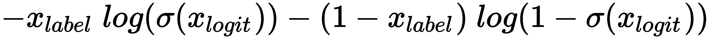

因此，将标签设置为 1 将迫使第二项为零，反之亦然。此时，我们需要创建两个列表，包含每个作用域的变量（这可以通过使用`tf.trainable_variables()`函数轻松实现，该函数输出所有变量的列表）。最后一步是定义优化器。如官方 TensorFlow 文档中建议的，当与批量归一化一起工作时，有必要将训练操作包装在一个上下文管理器中，该管理器检查是否已计算所有依赖项（在这种情况下，批量平均值和方差）。我们使用了 Adam 优化器，*η* = 0.0002，以及一个梯度动量遗忘因子(*μ1*)等于 0.5（这是一个受高动量可能导致的潜在不稳定性所驱动的选择）。正如所见，在两种情况下，最小化仅限于变量的特定子集（通过`var_list`参数提供列表）。

到目前为止，我们可以创建一个`Session`（我们将使用`InteractiveSession`），初始化所有变量，并开始训练过程（200 个周期和批大小为 128）：

```py
import numpy as np
import tensorflow as tf

nb_epochs = 200
batch_size = 128
nb_iterations = int(nb_samples / batch_size)

session = tf.InteractiveSession(graph=graph)
tf.global_variables_initializer().run()

samples_range = np.arange(nb_samples)

for e in range(nb_epochs * 5):
    d_losses = []
    g_losses = []

    for i in range(nb_iterations):
        Xi = np.random.choice(samples_range, size=batch_size)
        X = np.expand_dims(X_train[Xi], axis=3)
        Z = np.random.uniform(-1.0, 1.0, size=(batch_size, code_length)).astype(np.float32)

        _, d_loss = session.run([training_step_d, loss_d], 
                                feed_dict={
                                    input_x: X,
                                    input_z: Z,
                                    is_training: True
                                })
        d_losses.append(d_loss)

        Z = np.random.uniform(-1.0, 1.0, size=(batch_size, code_length)).astype(np.float32)

        _, g_loss = session.run([training_step_g, loss_g], 
                                feed_dict={
                                    input_x: X,
                                    input_z: Z,
                                    is_training: True
                                })

        g_losses.append(g_loss)

    print('Epoch {}) Avg. discriminator loss: {} - Avg. generator loss: {}'.format(e + 1, np.mean(d_losses), np.mean(g_losses)))
```

训练步骤（包含单个判别器迭代）分为两个阶段：

1.  使用真实图像和噪声样本批次的判别器训练

1.  使用噪声样本批次的生成器训练

一旦训练过程完成，我们可以通过执行包含噪声样本矩阵的生成器来生成一些图像（50 个）：

```py
Z = np.random.uniform(-1.0, 1.0, size=(50, code_length)).astype(np.float32)

Ys = session.run([gen], 
                 feed_dict={
                     input_z: Z,
                     is_training: False
                })

Ys = np.squeeze((Ys[0] + 1.0) * 0.5 * 255.0).astype(np.uint8)
```

结果如下截图所示：

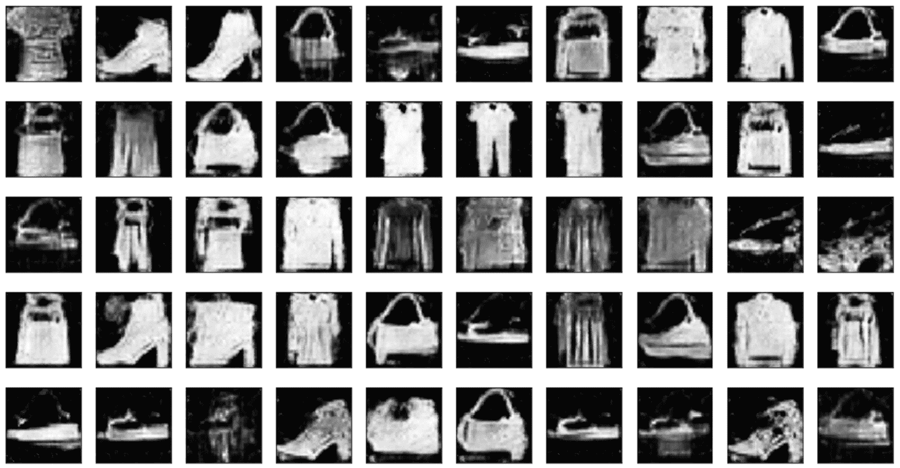

使用 Fashion-MNIST 数据集训练的 DCGAN 生成的样本

作为练习，我邀请读者使用更复杂的卷积架构和 RGB 数据集，如 CIFAR-10 ([`www.cs.toronto.edu/~kriz/cifar.html`](https://www.cs.toronto.edu/~kriz/cifar.html))。

即使这个示例和下一个示例的训练阶段仅限于 5,000 个样本，也可能相当慢（大约 12-15 小时），尤其是在没有 GPU 的情况下。读者可以通过减少网络的复杂性（注意形状）和减少样本数量来简化示例。为了避免不匹配，我建议在生成器实例之后添加`print(gen.shape)`命令。预期的形状应该是`(?, 64, 64, 1)`。或者，可以采用较小的目标维度（如 32×32），将其中一个步长（可能是最后一个）设置为`(1, 1)`。

# 水晶石生成对抗网络（WGAN）

如前节所述，标准生成对抗网络（GAN）中最困难的问题之一是由基于 Jensen-Shannon 散度的损失函数引起的，当两个分布具有不连续的支持时，其值会变得恒定。这种情况在高维、语义结构化数据集中相当常见。例如，图像被限制具有特定的特征以表示特定的主题（这是在第二章，《半监督学习导论》中讨论的流形假设的结果）。初始生成器分布与真实数据集重叠的可能性非常低，在许多情况下，它们彼此之间也非常遥远。这种条件增加了学习错误表示（一个被称为模式崩溃的问题）的风险，即使判别器能够区分真实样本和生成样本（这种情况发生在判别器相对于生成器学习得太快时）。此外，纳什均衡的实现变得更加困难，GAN 很容易陷入次优配置。

为了减轻这个问题，Arjovsky、Chintala 和 Bottou（在*Wasserstein GAN*，Arjovsky M.，Chintala S.，Bottou L.，arXiv:1701.07875 [stat.ML]）提出了采用不同的散度，称为*Wasserstein 距离*（或地球迁移距离），其正式定义如下：

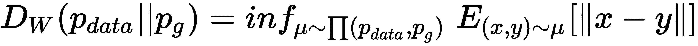

术语*∏(p[data], p[g])*表示*p[data]*和*p[g]*之间所有可能的联合概率分布的集合。因此，Wasserstein 距离是所有期望值集合的下确界（考虑所有联合分布），其中*x*和*y*是从联合分布μ中抽取的。*D[W]*的主要特性是，即使两个分布具有不连续的支持，其值也正比于实际的分布距离。形式证明并不复杂，但直观上更容易理解。事实上，给定两个具有不连续支持分布，下确界运算强制取每个可能样本对之间的最短距离。显然，这种度量比 Jensen-Shannon 散度更稳健，但有一个实际的缺点：它极其难以计算。由于我们无法处理所有可能的联合分布（也不能使用近似），需要进一步步骤来应用这个损失函数。在上述论文中，作者证明了可以通过 Kantorovich-Rubinstein 定理（这个主题相当复杂，但读者可以在*On the Kantorovich–Rubinstein Theorem*，Edwards D. *A*., *Expositiones Mathematicae*, 2011 中找到更多信息）应用一个变换：

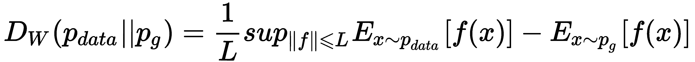

首先考虑的是*f(•)*的性质。定理要求只考虑 L-Lipschitz 函数，这意味着*f(•)*（假设是一个单变量的实值函数）必须遵守：

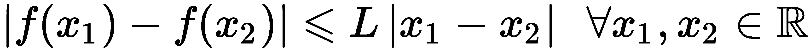

到这一点，Wasserstein 距离与两个期望值之差的上确界（相对于所有 L-Lipschitz 函数）成正比，这两个期望值非常容易计算。在 WGAN 中，*f(•)*函数由一个神经网络表示；因此，我们没有关于 Lipschitz 条件的保证。为了解决这个问题，作者提出了一种非常简单的程序：在应用校正后裁剪判别器（通常称为 Critic，其责任是表示参数化函数*f(•)*）变量。如果输入是有界的，所有的变换都将产生有界输出；然而，裁剪因子必须足够小（0.01，甚至更小），以避免多次操作产生的加性效应导致 Lipschitz 条件的反转。这不是一个有效的解决方案（因为它在不必要的时候会减慢训练过程），但它允许在没有任何形式约束函数族的情况下利用 Kantorovich-Rubinstein 定理。

使用参数化函数（例如深度卷积网络），Wasserstein 距离如下（省略常数项 *L*）：

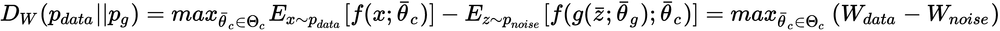

在前面的表达式中，我们明确提取了生成器的输出，并在最后一步，将将单独优化的项分离出来。读者可能已经注意到，计算比标准的 GAN 要简单，因为在这种情况下，我们只需要对一批的*f(•)*值进行平均（不再需要对数）。然而，由于 Critic 变量被裁剪，所需的迭代次数通常更多，为了补偿 Critic 和生成器训练速度之间的差异，通常需要设置*N[critic] > 1*（作者建议值为 5，但这是一个必须在每个特定环境中调整的超参数）。

完整的 WGAN 算法是：

1.  设置 epoch 的数量，*N[epochs]*。

1.  设置 Critic 迭代的次数，*N[critic]*（在大多数情况下，*N[iter]* = 5）。

1.  设置批量大小，*k*。

1.  设置裁剪常数，c（例如，c = 0.01）。

1.  定义一个噪声生成过程，M（例如，*U(-1, 1)*）。

1.  对于*e=1*到*N[epochs]*：

    1.  从*X*中采样*k*个值。

    1.  从*N*中采样*k*个值。

    1.  对于*i=1*到*N[critic]*：

        1.  计算梯度，*∇[c] DW*（仅针对 Critic 变量）。期望值通过样本均值来近似。

        1.  通过随机梯度上升更新 Critic 参数。

        1.  将 Critic 参数裁剪到范围[*-c, c*]内。

    1.  从*N*中采样*k*个值。

    1.  计算梯度，*∇[g] W[noise]*（仅针对生成器变量）。

    1.  通过随机梯度下降更新生成器参数。

# TensorFlow 中的 WGAN 示例

这个示例可以被视为上一个示例的变体，因为它使用了相同的 dataset、generator 和 discriminator。唯一的主要区别是，在这种情况下，discriminator（连同其变量作用域）已被重命名为`critic()`：

```py
import tensorflow as tf

def critic(x, is_training=True, reuse_variables=True):
    with tf.variable_scope('critic', reuse=reuse_variables):
...
```

在这一点上，我们可以直接进入创建包含所有占位符、操作和损失函数的`Graph`：

```py
import tensorflow as tf

graph = tf.Graph()

with graph.as_default():
    input_x = tf.placeholder(tf.float32, shape=(None, width, height, 1))
    input_z = tf.placeholder(tf.float32, shape=(None, code_length))
    is_training = tf.placeholder(tf.bool)

    gen = generator(z=tf.reshape(input_z, (-1, 1, 1, code_length)), is_training=is_training)

    r_input_x = tf.image.resize_images(images=input_x, size=(64, 64))

    crit_1_l = critic(x=r_input_x, is_training=is_training, reuse_variables=False)
    crit_2_l = critic(x=gen, is_training=is_training, reuse_variables=True)

    loss_c = tf.reduce_mean(crit_2_l - crit_1_l)
    loss_g = tf.reduce_mean(-crit_2_l)

    variables_g = [variable for variable in tf.trainable_variables() if variable.name.startswith('generator')]
    variables_c = [variable for variable in tf.trainable_variables() if variable.name.startswith('critic')]

    with tf.control_dependencies(tf.get_collection(tf.GraphKeys.UPDATE_OPS)):
        optimizer_c = tf.train.AdamOptimizer(0.00005, beta1=0.5, beta2=0.9).minimize(loss=loss_c, var_list=variables_c)

        with tf.control_dependencies([optimizer_c]):
            training_step_c = tf.tuple(tensors=[tf.assign(variable, tf.clip_by_value(variable, -0.01, 0.01)) 
                                                for variable in variables_c])

        training_step_g = tf.train.AdamOptimizer(0.00005, beta1=0.5, beta2=0.9).minimize(loss=loss_g, var_list=variables_g)
```

如您所见，占位符部分、生成器的定义以及将图像调整到 64 × 64 目标尺寸的操作之间没有差异。在下一个块中，我们定义了两个 Critic 实例（它们与上一个示例中声明的实例完全类似）。

两个损失函数比标准的 GAN 更简单，因为它们直接与 Critic 输出一起工作，计算批次的样本均值。在原始论文中，作者建议使用 RMSProp 作为标准优化器，以避免基于动量的算法可能产生的稳定性问题。然而，Adam（具有更低的遗忘因子*μ[1] = 0.5*和*μ[2] = 0.9*以及学习率*η = 0.00005*）比 RMSProp 更快，并且不会导致不稳定性。我建议测试这两种选项，尝试最大化训练速度同时防止模式坍塌。与上一个示例相反，在这种情况下，我们需要在每个训练步骤之后剪辑所有的 Critic 变量。为了避免这种情况，内部并发可能会改变某些操作的顺序；需要使用嵌套依赖控制上下文管理器。这样，实际的`training_step_c`（负责剪辑并将值重新分配给每个变量）将仅在`optimizer_c`步骤完成后执行。

现在，我们可以创建`InteractiveSession`，初始化变量，并开始训练过程，这与上一个示例非常相似：

```py
import numpy as np
import tensorflow as tf

nb_epochs = 200
nb_critic = 5
batch_size = 64
nb_iterations = int(nb_samples / batch_size)

session = tf.InteractiveSession(graph=graph)
tf.global_variables_initializer().run()

samples_range = np.arange(nb_samples)

for e in range(nb_epochs):
    c_losses = []
    g_losses = []

    for i in range(nb_iterations):
        for j in range(nb_critic):
            Xi = np.random.choice(samples_range, size=batch_size)
            X = np.expand_dims(X_train[Xi], axis=3)
            Z = np.random.uniform(-1.0, 1.0, size=(batch_size, code_length)).astype(np.float32)

            _, c_loss = session.run([training_step_c, loss_c], 
                                    feed_dict={
                                        input_x: X,
                                        input_z: Z,
                                        is_training: True
                                    })
            c_losses.append(c_loss)

        Z = np.random.uniform(-1.0, 1.0, size=(batch_size, code_length)).astype(np.float32)

        _, g_loss = session.run([training_step_g, loss_g], 
                                feed_dict={
                                    input_x: np.zeros(shape=(batch_size, width, height, 1)),
                                    input_z: Z,
                                    is_training: True
                                })

        g_losses.append(g_loss)

    print('Epoch {}) Avg. critic loss: {} - Avg. generator loss: {}'.format(e + 1, np.mean(c_losses), np.mean(g_losses)))
```

主要区别在于，在这种情况下，在每次生成器训练步骤之前，Critic 会被训练`n_critic`次。以下截图显示了生成 50 个随机样本的结果：

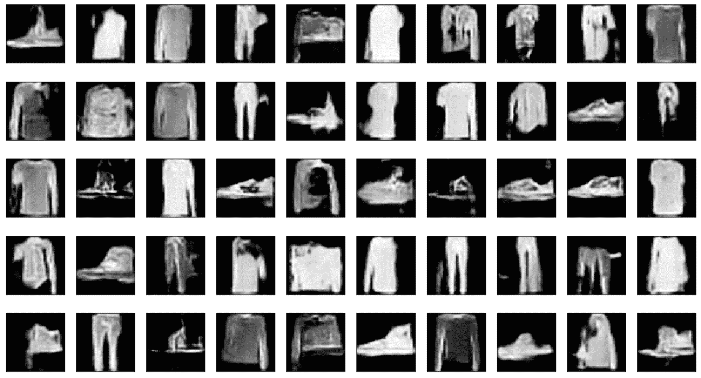

使用 Fashion MNIST 数据集训练的 WGAN 生成的样本

如您所见，质量略有提高，样本也更加平滑。我邀请读者也用 RGB 数据集测试这个模型，因为最终质量通常非常出色。

当使用这些模型时，训练时间可能会非常长。为了避免等待看到初始结果（以及进行必要的调整），我建议使用 Jupyter。这样，就可以停止学习过程，检查生成器能力，并且可以无问题地重新启动。当然，图必须保持不变，并且变量初始化必须在开始时进行。

# 摘要

在本章中，我们讨论了对抗训练的主要原则，并解释了两个玩家的角色：生成器和判别器。我们描述了如何使用最小-最大方法来建模和训练它们，该方法的两个目标是迫使生成器学习真实数据分布 *p[data]*，并使判别器能够完美地区分真实样本（属于 *p[data]*) 和不可接受的样本。在同一部分中，我们分析了生成对抗网络的内部动态和一些可能导致训练过程缓慢并导致最终配置次优的常见问题。

在标准 GAN 中遇到的最困难的问题之一出现在数据生成过程和生成器分布具有不连续支持时。在这种情况下，Jensen-Shannon 散度变为常数，不提供关于距离的精确信息。Wasserstein 测度提供了一个极好的替代方案，它在称为 WGAN 的更有效模型中被采用。这种方法可以有效地管理不连续分布，但需要在 Critic 上强制执行 L-Lipschitz 条件。标准方法基于在每次梯度上升更新后剪辑参数。这种简单技术保证了 L-Lipschitz 条件，但需要使用非常小的剪辑因子，这可能导致转换速度变慢。因此，通常在每次单独的生成器训练步骤之前，需要重复训练 Critic 一个固定的次数（例如五次）。

在下一章中，我们将介绍另一种基于特定类型神经网络的概率生成神经网络模型，这种神经网络被称为受限玻尔兹曼机。
