# 深度信念网络

在本章中，我们将介绍两种使用一组潜在变量来表示特定数据生成过程的概率生成模型。**受限玻尔兹曼机**（**RBMs**），于 1986 年提出，是更复杂模型（称为**深度信念网络**（**DBN**））的构建块，能够捕捉不同层次特征之间的复杂关系（在某种程度上与深度卷积网络相似）。这两种模型都可以在无监督和监督场景中使用作为预处理程序，或者，如 DBN 通常所做的那样，使用标准反向传播算法调整参数。

特别是，我们将讨论：

+   **马尔可夫随机场**（**MRF**）

+   RBM

+   **对比发散**（**CD-k**）算法

+   带有监督和无监督示例的 DBN

# MRF

让我们考虑一组随机变量，*x[i]*，它们在一个无向图*G=(V, E)*中组织，如下图所示：

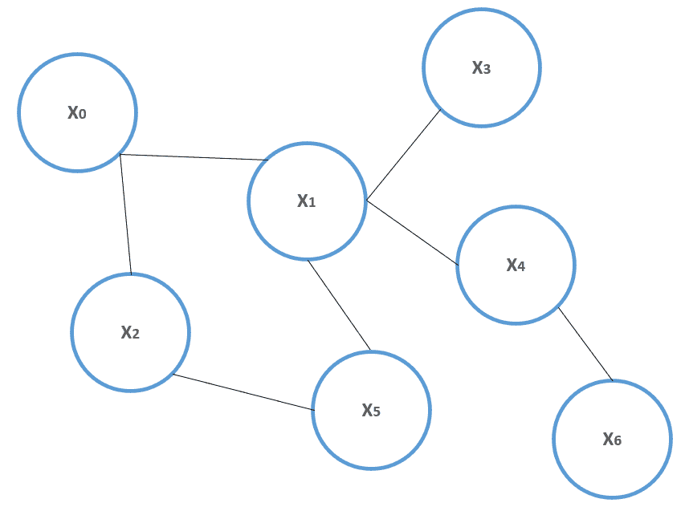

概率无向图的示例

如果两个随机变量*a*和*b*在随机变量*c*的条件下是条件独立的，那么：

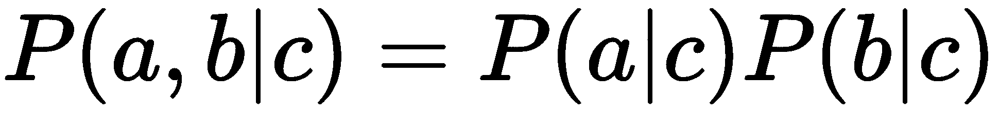

现在，再次考虑这个图；如果所有变量子集*S[i]*和*S[j]*的通用配对在分离子集*S[k]*（这样属于*S[i]*的变量与属于*S[j]*的变量之间的所有连接都通过*S[k]*）的条件下是条件独立的，那么这个图被称为**马尔可夫随机场**（**MRF**）。

给定*G=(V, E)*，一个包含所有相邻顶点的子集称为**团**（所有团的集合通常表示为*cl(G)*）。例如，考虑之前显示的图；（x[0]，x[1]）是一个团，如果 x[0]和 x[5]相连，那么（x[0]，x[1]，x[5]）将是一个团。**最大团**是一个不能通过添加新顶点来扩展的团。一个特定的 MRF 家族由所有那些联合概率分布可以分解为以下形式的图组成：

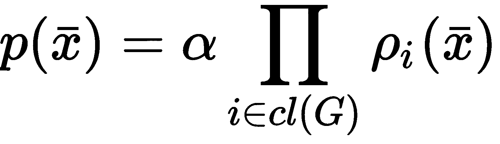

在这种情况下，*α*是归一化常数，乘积扩展到所有最大团集合。根据**汉密尔顿-克利福德定理**（有关更多信息，请参阅*Cheung S.*，肯塔基大学，2008 年的*汉密尔顿-克利福德定理证明*），如果联合概率密度函数是严格正的，MRF 可以分解，所有*ρ[i]*函数也是严格正的。因此，基于对数性质的一些简单操作后，*p(x)*可以重写为**吉布斯**（或**玻尔兹曼**）分布：

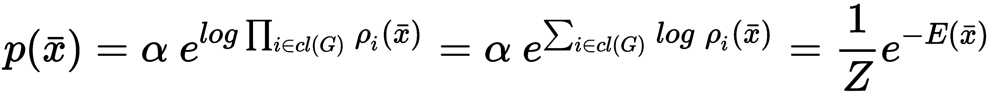

术语 *E(x)* 被称为能量，因为它源自统计物理中此类分布的第一个应用。*1/Z* 现在是使用标准符号表示的正则化常数。在我们的场景中，我们始终考虑包含观测值 *(x[i])* 和潜在变量 *(h[j])* 的图。因此，将联合概率表示为是有用的：

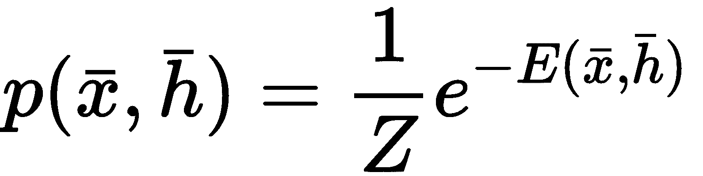

每当需要边缘化以获得 *p(x)* 时，我们可以简单地对 *h[j]* 求和：

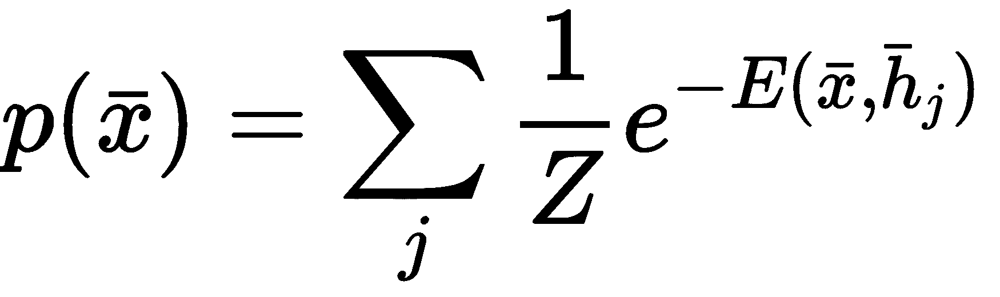

# RBMs

RBM（最初称为**Harmonium**）是由 Smolensky 提出的神经网络模型（在*《信息处理在动态系统中的基础：和谐理论的基础》**，Smolensky P.，并行分布式处理，第 1 卷，麻省理工学院出版社*），由一层输入（可观测）神经元和一层隐藏（潜在）神经元组成。以下图表显示了其通用结构：

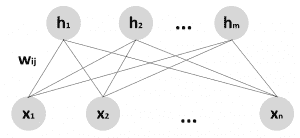

限制玻尔兹曼机的结构

由于无向图是二分图（同一层的神经元之间没有连接），其潜在的概率结构是 MRF。在原始模型中（即使这不是一个限制），所有神经元都被假定为伯努利分布 *(x[i], h[i] = {0, 1})*，带有偏置，*b[i]*（对于观测单元）和*c[j]*（对于潜在神经元）。得到的能量函数是：

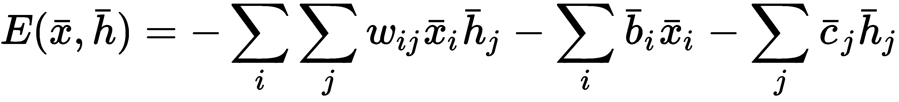

RBM 是一种概率生成模型，可以学习数据生成过程，*p[data]*，它由观测单元表示，但利用潜在变量的存在来模拟所有内部关系。如果我们把所有参数总结成一个向量，*θ = {w[ij], b[i], c[j]}*，吉布斯分布变为：

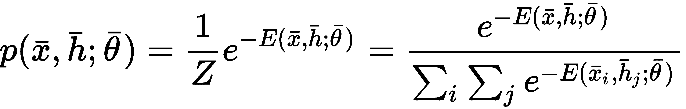

RBM 的训练目标是最大化输入分布相对于对数似然。因此，第一步是在对前一个表达式进行边缘化后确定*L(θ; x)*：

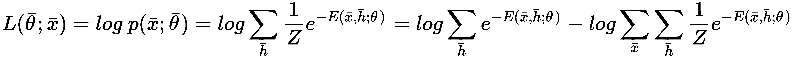

由于我们需要最大化对数似然，计算相对于*θ*的梯度是有用的：

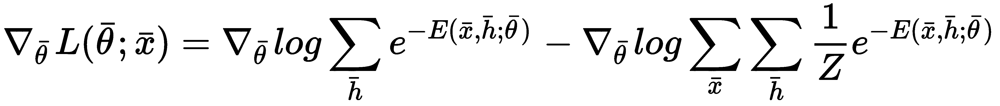

应用导数的链式法则，我们得到：

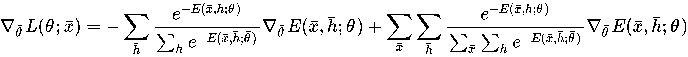

使用条件概率和联合概率等式，前面的表达式变为：

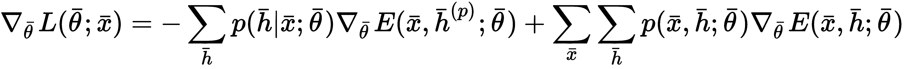

考虑到完整的联合概率，经过一些繁琐的操作（此处省略），可以推导出以下表达式（*σ(•)* 是 Sigmoid 函数）：

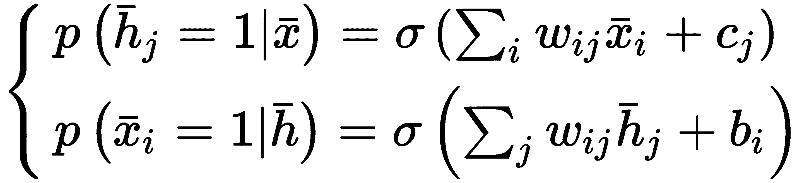

到目前为止，我们可以计算对数似然相对于每个单个参数的梯度，*w[ij]*，*b**[i]*，和*c**[j]*。从*w[ij]*开始，考虑到*∇[wij] E(x, h; θ) = -x[i]h[j]*，我们得到：

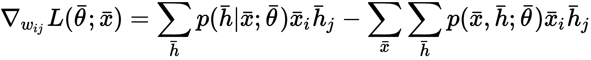

该表达式可以重写为：

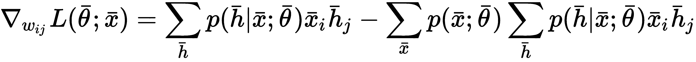

现在，考虑到所有单元都是伯努利分布的，并且仅隔离第 *j* 个隐藏单元，可以应用以下简化：

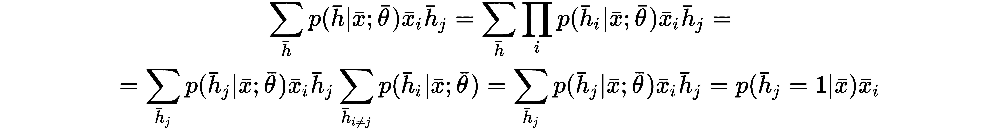

因此，梯度变为：

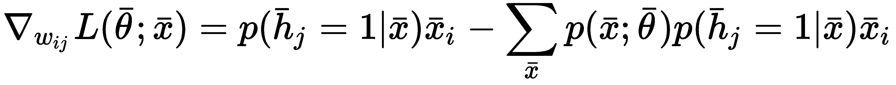

同样，我们可以推导出 *L* 对 *b[i*  ]和 *c[j]* 的梯度：

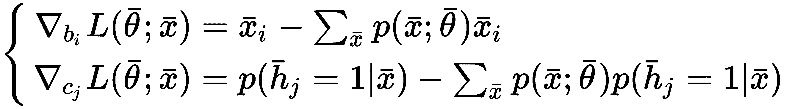

因此，每个梯度的第一个项非常容易计算，而第二个项则需要对所有观察到的值进行求和。由于这个操作不切实际，唯一可行的替代方案是基于采样的近似，使用如吉布斯采样（更多信息，见第四章，*贝叶斯网络和隐马尔可夫模型*)。然而，因为这个算法从条件分布 *p(x|h)* 和 *p(h|x)* 中采样，而不是从完整的联合分布 *p(x, h)* 中采样，它需要相关的马尔可夫链达到其平稳分布 *π*，以便提供有效的样本。由于我们不知道需要多少采样步骤才能达到 *π*，吉布斯采样也可能因为其可能的高计算成本而成为不可行的解决方案。

为了解决这个问题，Hinton 在《*训练受限玻尔兹曼机的实用指南，**Hinton G**.，多伦多大学计算机科学系）中提出了一种名为**CD-k**的替代算法。这个想法非常简单但非常有效：我们不是等待马尔可夫链达到平稳分布，而是从训练样本 *t=0 x^((0))* 开始固定次数采样，并通过从 *p(h^((1))|x^((0)))* 中采样来计算 *h^((1))*。然后，使用隐藏向量从 *p(x^((2))|h^((1)))* 中采样重建 *x^((2))*。这个程序可以重复任意次数，但在实践中，通常只需要一个采样步骤就能确保相当高的精度。在这个点上，对数似然梯度的近似可以表示为（考虑 *t* 步）：

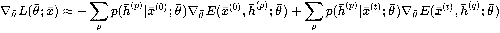

相对于 *w[ij]*，*b[i]* 和 *c[j]* 的单梯度可以很容易地通过前面的程序获得。术语 *对比度* 来自于在 *x*^(*(0)*  )处计算的 *L* 的梯度近似，通过一个称为 *正梯度* 的项和一个称为 *负梯度* 的项之间的加权差。这种方法类似于用这个增量比来近似导数：

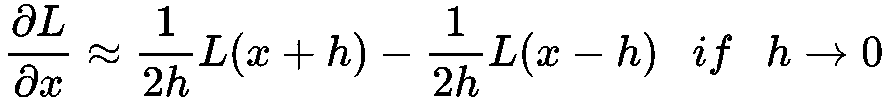

基于单步 CD-k 的完整 RBM 训练算法（假设有 *M* 个训练样本）：

1.  设置隐藏单元的数量，*N[h]* 

1.  设置一个 epoch 的数量，*N[e]* 

1.  设置学习率 `learning_rate`* η*（例如，*η = 0.01*）

1.  对于 *e=1* 到 *N[e]*：

    1.  设置 *Δw = 0*，*Δb = 0*，和 *Δc = 0*

    1.  对于 *i=1* 到 *M*：

        1.  从 *p(h|x^((i)))* 中采样 *h^((i))*

        1.  从 *p(x^((i+1))|h^((i)))* 中采样重建 *x^((i+1))*

        1.  累加权重和偏置的更新：

            1.  *Δw += p(h = 1|x^((i)))x^((i)) - p(h = 1|x^((i+1)))x^((i+1))*（作为外积）

            1.  *Δb += x^((i)) - x^((i+1))*

            1.  *Δc += p(h = 1|x^((i))) - p(h = 1|x^((i+1)))*

    1.  更新权重和偏置：

        1.  *w += ηΔw*

        1.  *b += ηΔb*

        1.  *c += ηΔc*

两个向量之间的外积定义为：

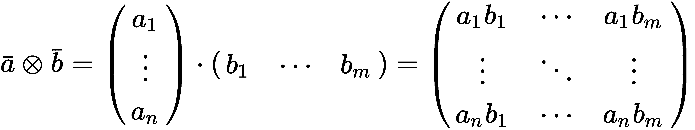

如果向量 *a* 的形状为 *(n, 1)*，而 *b* 的形状为 *(m, 1)*，则结果是形状为 *(n, m)* 的矩阵。

# DBNs

信念网络或贝叶斯网络是一个已在第四章“贝叶斯网络和隐马尔可夫模型”中探讨的概念。在这种情况下，我们将考虑具有可见和潜在变量，并组织成同质层的信念网络。第一层始终包含输入（可见）单元，而所有其余的都是潜在变量。因此，深度信念网络（DBN）可以结构化为堆叠的 RBM，其中每个隐藏层也是后续 RBM 的可见层，如下面的图所示（每层的单元数可能不同）：

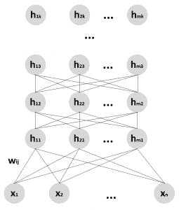

通用深度信念网络的架构

学习过程通常是贪婪的、逐步的（如 Hinton G. E.、Osindero S.、Teh Y. W.在*《深度信念网的快速学习算法》*中提出）。第一个 RBM 使用数据集进行训练，并使用 CD-k 算法优化以重建原始分布。在此阶段，内部（隐藏）表示被用作下一个 RBM 的输入，依此类推，直到所有块都完全训练。这样，DBN 被迫创建后续内部表示，这些表示可以用于不同的目的。当然，当模型训练时，可以从识别（逆）模型中采样隐藏层，并计算激活概率（*x*代表一个通用原因）：

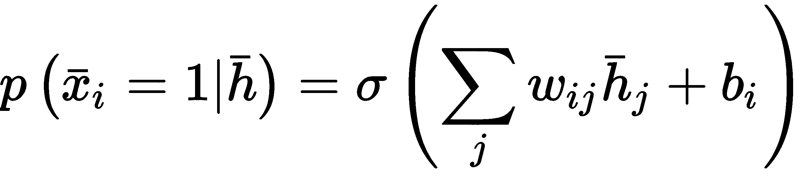

作为一种始终是生成过程的 DBN，在无监督场景中，它可以通过创建一系列子过程的方法来执行成分分析/降维，这些子过程能够重建内部表示。而单个 RBM 专注于单个隐藏层，因此无法学习子特征，DBN 则贪婪地学习如何使用精细化的隐藏分布来表示每个子特征向量。这一过程背后的概念与卷积层级联的概念并没有很大区别，主要区别在于在这种情况下，学习过程是贪婪的。与 PCA 等方法的另一个区别是，我们并不确切知道内部表示是如何构建的。由于潜在变量是通过最大化对数似然进行优化的，因此可能存在许多最优解，但我们无法轻易地对它们施加约束。然而，DBNs 在不同的场景中表现出非常强大的特性，尽管它们的计算成本通常比其他方法高得多。其中一个主要问题（与大多数深度学习方法都有关）是正确选择每一层的隐藏单元。因为它们代表潜在变量，所以它们的数量是训练过程成功的关键因素。正确的选择并不立即显现，因为需要了解数据生成过程的复杂性。然而，作为一个经验法则，我建议从包含 32/64 个单元的几层开始，然后逐步增加隐藏神经元的数量和层数，直到达到所需的准确度（同样，我建议从一个较小的学习率开始，例如 0.01，如果需要则增加）。

由于第一个 RBM 负责重建原始数据集，因此监控每个 epoch 后的对数似然（或错误）非常有用，以便了解过程是否正确学习（错误减少）或者是否已经饱和了容量。很明显，初始的重建不良会导致随后的表示更差。由于学习过程是贪婪的，在无监督任务中，一旦完成之前的训练步骤，就没有办法提高较低层的性能，因此，我总是建议调整参数，使得第一次重建非常准确。当然，关于过拟合的所有考虑仍然有效，因此，监控验证样本的泛化能力也很重要。然而，在成分分析中，我们假设我们正在处理一个能够代表潜在数据生成过程的分布，因此发现先前未见特征的风险应该是最小的。

在监督场景中，通常有两种选择，它们的第一个步骤总是 DBN 的贪婪训练。然而，第一种方法使用标准算法（如反向传播，将整个架构视为单个深度网络）进行后续的细化，而第二种方法则使用最后一个内部表示作为单独分类器的输入。不言而喻，第一种方法具有更多的自由度，因为它与一个预训练的网络一起工作，其权重可以调整，直到验证准确率达到最大值。在这种情况下，第一个贪婪步骤与通过观察深度模型的内部行为（类似于卷积网络）经验证的同一种假设一起工作。第一层学习如何检测低级特征，而所有随后的层都增加了细节。因此，反向传播步骤可能从已经非常接近最优点的位置开始，可以更快地收敛。相反，第二种方法类似于将核技巧应用于标准的**支持向量机**（**SVM**）。实际上，外部分类器通常非常简单（如逻辑回归或 SVM），而提高的准确度通常是由于通过将原始样本投影到子空间（通常是高维空间）而获得的更好的线性可分性，在那里它们可以很容易地被分类。一般来说，这种方法比第一种方法性能更差，因为没有方法可以调整 DBN 训练后的参数。因此，当最终投影不适合线性分类时，有必要采用更复杂的模型，而计算成本可能会非常高，而性能增益却不成比例。由于深度学习通常基于端到端学习的概念，因此训练整个网络可以隐式地将预处理步骤包含在完整结构中，这成为一个将输入样本与特定结果关联的黑盒。另一方面，每当需要显式管道时，贪婪训练 DBN 并使用单独的分类器可能是一个更合适的解决方案。

# Python 中无监督 DBN 的示例

在这个例子中，我们将使用 GitHub 上免费提供的 Python 库（[`github.com/albertbup/deep-belief-network`](https://github.com/albertbup/deep-belief-network)），该库允许使用 NumPy（仅 CPU）或 Tensorflow（CPU 或 GPU 支持）以及标准的 Scikit-Learn 接口来处理监督和无监督的 DBN。我们的目标是创建`mnist`数据集子集的较低维度的表示（由于训练过程可能相当慢，我们将限制为`400`个样本）。第一步是加载（使用 Keras 辅助函数）、打乱和归一化数据集：

```py
import numpy as np

from keras.datasets import mnist
from sklearn.utils import shuffle

(X_train, Y_train), (_, _) = mnist.load_data()
X_train, Y_train = shuffle(X_train, Y_train, random_state=1000)

nb_samples = 400

width = X_train.shape[1]
height = X_train.shape[2]

X = X_train[0:nb_samples].reshape((nb_samples, width * height)).astype(np.float32) / 255.0
Y = Y_train[0:nb_samples]
```

在这一点上，我们可以创建一个 `UnsupervisedDBN` 类的实例，设置三个层，分别有 `512`、`256` 和 `64` 个 sigmoid 单元（因为我们想将值绑定在 `0` 和 `1` 之间）。学习率 *η* (`learning_rate_rbm`) 设置为 `0.05`，批量大小 (`batch_size`) 为 `64`，每个 RBM 的训练轮数 (`n_epochs_rbm`) 为 `100`。CD-k 步骤的默认值是 `1`，但可以通过 `contrastive_divergence_iter` 参数进行更改：

```py
from dbn.tensorflow import UnsupervisedDBN

unsupervised_dbn = UnsupervisedDBN(hidden_layers_structure=[512, 256, 64],
                                   learning_rate_rbm=0.05,
                                   n_epochs_rbm=100,
                                   batch_size=64,
                                   activation_function='sigmoid')

X_dbn = unsupervised_dbn.fit_transform(X)

[START] Pre-training step:
>> Epoch 1 finished       RBM Reconstruction error 55.562027
>> Epoch 2 finished       RBM Reconstruction error 53.663380

...

>> Epoch 99 finished       RBM Reconstruction error 5.169244
>> Epoch 100 finished     RBM Reconstruction error 5.130809
[END] Pre-training step
```

一旦训练过程完成，`X_dbn` 数组将包含从最后一个隐藏层采样的值。不幸的是，这个库没有实现逆变换方法，但我们可以使用 t-SNE 算法将分布投影到二维空间：

```py
from sklearn.manifold import TSNE

tsne = TSNE(n_components=2, perplexity=20, random_state=1000)
X_tsne = tsne.fit_transform(X_dbn)
```

对应的图表如下所示：

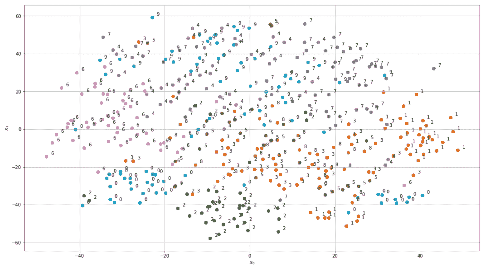

t-SNE 图展示了最后一个 DBN 隐藏层分布（64 维）

如您所见，尽管仍然存在一些异常，但隐藏的低维表示与原始数据集全局上一致，因为包含相同数字的组被组织成紧凑的簇，并保留了一些几何属性。例如，包含表示数字 **1** 的组的簇与包含 7 的图像的组非常接近，以及 3 和 8 的组。这一结果证实，DBN 可以成功用作分类目的的预处理层，但在此情况下，与其减少维度，不如通常更倾向于增加维度，以便利用冗余来使用更简单的线性分类器（为了更好地理解这个概念，想想通过添加多项式特征来增强数据集）。我邀请您通过预处理整个 MNIST 数据集，然后使用逻辑回归对其进行分类，并将结果与直接方法进行比较来测试这一能力。

可以使用以下命令安装库：`pip install git+git://github.com/albertbup/deep-belief-network.git`（NumPy 或 Tensorflow CPU）或 `pip install git+git://github.com/albertbup/deep-belief-network.git@master_gpu`（Tensorflow GPU）。在两种情况下，命令还会安装 Tensorflow 和其他常见 Python 发行版中通常存在的依赖项（如 Anaconda）；因此，为了仅安装 DBN 组件，需要在 `pip` 命令中添加 `--no-deps` 属性。有关更多信息，请参阅 GitHub 页面。

# 使用 Python 的监督 DBN 示例

在这个例子中，我们将使用 KDD Cup '99 数据集（由 Scikit-Learn 提供），该数据集包含一个入侵检测系统在正常和危险网络活动下生成的日志。我们只关注`smtp`子数据集，这是最小的子集，因为，如前所述，训练过程可能非常耗时。这个数据集并不特别复杂，可以用更简单的方法成功分类；然而，这个例子只有一个教学目的，并且对于理解如何处理这类数据可能是有用的。

第一步是加载数据集，对标签（字符串类型）进行编码，并对值进行标准化：

```py
from sklearn.datasets import fetch_kddcup99
from sklearn.preprocessing import LabelEncoder, StandardScaler

kddcup = fetch_kddcup99(subset='smtp', shuffle=True, random_state=1000)

ss = StandardScaler()
X = ss.fit_transform(kddcup['data']).astype(np.float32)

le = LabelEncoder()
Y = le.fit_transform(kddcup['target']).astype(np.float32)
```

在这个阶段，我们可以创建训练集和测试集：

```py
from sklearn.model_selection import train_test_split

X_train, X_test, Y_train, Y_test = train_test_split(X, Y, test_size=0.25, random_state=1000)
```

模型基于`SupervisedDBNClassification`类的实例，该类实现了反向传播方法。参数与无监督情况非常相似，但现在我们还可以指定**随机梯度下降**（**SGD**）学习率（`learning_rate`）、反向传播的迭代次数（`n_iter_backprop`）以及可选的 dropout（`dropout_p`）。算法执行一个初始的贪婪训练（其计算成本通常高于 SGD 阶段），然后进行微调：

```py
from dbn.tensorflow import SupervisedDBNClassification

classifier = SupervisedDBNClassification(hidden_layers_structure=[64, 64],
                                         learning_rate_rbm=0.001,
                                         learning_rate=0.01,
                                         n_epochs_rbm=20,
                                         n_iter_backprop=150,
                                         batch_size=256,
                                         activation_function='relu',
                                         dropout_p=0.25)

classifier.fit(X_train, Y_train)

[START] Pre-training step:
>> Epoch 1 finished       RBM Reconstruction error 2.478997
>> Epoch 2 finished       RBM Reconstruction error 2.459004

...

>> Epoch 147 finished       ANN training loss 0.006651
>> Epoch 148 finished     ANN training loss 0.006631
>> Epoch 149 finished     ANN training loss 0.006612
[END] Fine tuning step

SupervisedDBNClassification(batch_size=256, dropout_p=0.25,
              idx_to_label_map={0: 1.0, 1: 0.0, 2: 2.0},
              l2_regularization=1.0,
              label_to_idx_map={0.0: 1, 1.0: 0, 2.0: 2},
              learning_rate=0.01, n_iter_backprop=150, verbose=True)
```

一旦训练过程完成，我们就可以在测试集上评估性能：

```py
from sklearn.metrics.classification import accuracy_score

Y_pred = classifier.predict(X_test)
print(accuracy_score(Y_test, Y_pred))
1.0
```

验证准确率为`1.0`（没有误分类），但这实际上是一个简单的数据集，只需要几分钟的训练。我邀请您测试 DBN 在 MNIST/Fashion MNIST 数据集分类中的性能，并将结果与使用深度卷积网络获得的结果进行比较。在这种情况下，重要的是要监控每个 RBM 的重建误差，尝试在运行反向传播阶段之前将其最小化。完成这个练习后，你应该能够回答这个问题：端到端方法与基于预处理的方法哪个更可取？

在运行这些实验时，由于采样使用频繁，我总是建议在 NumPy 中设置随机种子（并保持其恒定），以确保可重复性（使用`np.random.seed(...)`命令）。由于这个库也与 Tensorflow 一起工作，因此需要使用`tf.set_random_seed(...)`命令重复此操作。

# 摘要

在这一章中，我们介绍了 MRF 作为 RBM 的底层结构。MRF 表示为一个无向图，其顶点是随机变量。特别是，为了我们的目的，我们考虑了联合概率可以表示为每个随机变量正函数乘积的 MRF。基于指数的最常见分布称为 Gibbs（或 Boltzmann）分布，它特别适合我们的问题，因为对数消除了指数，从而得到更简单的表达式。

RBM 是一个简单的二分无向图，由可见变量和潜在变量组成，只在不同组之间有连接。这个模型的目标是通过隐藏单元的存在来学习一个概率分布，这些隐藏单元可以模拟未知关系。不幸的是，尽管对数似然非常简单，但无法轻易优化，因为归一化项需要对所有输入值求和。因此，Hinton 提出了一个替代算法，称为 CD-k，该算法基于固定数量的 Gibbs 采样步骤（通常是 1）输出对数似然梯度的近似值。

堆叠多个 RBMs 可以建模 DBNs，其中每个块的隐藏层也是下一个块的可见层。DBN 可以通过贪婪方法进行训练，依次最大化每个 RBM 的对数似然。在无监督场景中，DBN 能够以分层的方式提取数据生成过程的特点，因此应用包括成分分析和降维。在监督场景中，DBN 可以使用反向传播算法（考虑整个网络）或有时使用管道中的预处理步骤进行贪婪预训练和微调，其中分类器通常是一个非常简单的模型（例如逻辑回归）。

在下一章，第十四章，*强化学习导论*中，我们将介绍强化学习的概念，讨论能够自主学习玩游戏或使机器人行走、跳跃以及执行使用经典方法难以建模和控制的任务的系统的最重要的元素。
