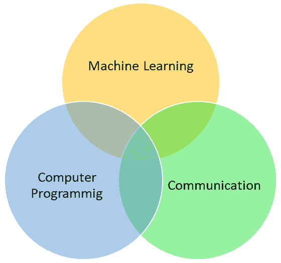
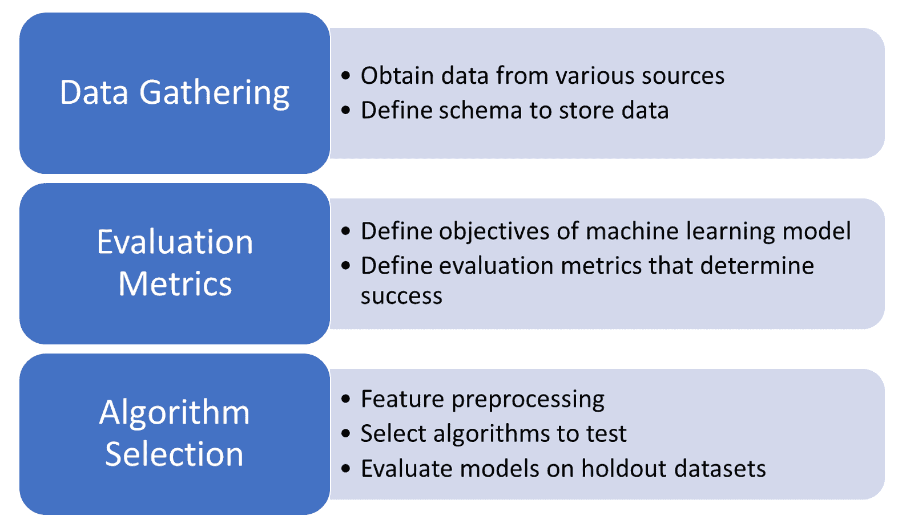

# 第一章：AWS 机器学习的入门

在这本书中，我们通过解释商业应用中的**机器学习（ML**）算法，关注数据科学的三个方面，展示它们如何在可扩展的环境中实施，以及如何评估模型和展示评估指标作为业务**关键绩效指标（KPI**）。本书展示了如何有效地使用**亚马逊网络服务（AWS**）机器学习工具处理大数据集。我们提出了各种场景，在这些场景中，掌握 AWS 中的机器学习算法有助于数据科学家更有效地完成他们的工作。

让我们来看看本章将涵盖的主题：

+   AWS 如何赋能数据科学家

+   确定可以使用机器学习解决的问题候选问题

+   机器学习项目生命周期

+   部署模型

# AWS 如何赋能数据科学家

在过去十年中，存储在互联网上的数字数据记录数量大幅增加。由于存储成本的下降和新的数字数据来源，预计到 2025 年，可用的数字数据量将达到 163 泽字节（163,000,000,000 太字节）。此外，每天生成的数据量正在以惊人的速度增长，其中近 90%的数据仅在过去两年内生成。随着超过 35 亿人能够访问互联网，这些数据不仅由专业人士和大型公司生成，而且由每一个互联网用户生成。

此外，由于公司认识到数据的重要性，他们存储了所有交易数据，希望分析它们并揭示可能帮助其业务做出重要决策的有趣趋势。金融投资者也渴望存储和理解他们能得到的关于公司的每一丁点信息，并训练他们的定量分析师或**量化分析师（quants**）做出投资决策。

分析这些数据并从中发现信息宝石的责任落在了世界各地的数据科学家身上。在过去十年中，数据科学团队已成为每个组织中最重要的团队之一。当数据科学团队最初成立时，大部分数据都能适应 Microsoft Excel 表格，任务是在数据中找到统计趋势并向业务团队提供可操作的见解。然而，随着数据量的增加和机器学习算法变得更加复杂和强大，数据科学团队的职责范围也扩大了。

在以下图中，我们可以看到数据科学家需要的三项基本技能：

数据科学家在不同公司中的职位描述可能会有所不同。然而，总的来说，数据科学家需要以下三个关键技能：

+   **机器学习**：机器学习算法提供了分析和从大量数据中学习的方法，并从这些数据中提供预测或推荐。它是分析结构化（数据库）和非结构化（文本文档）数据并从中推断可操作见解的重要工具。数据科学家应该精通众多机器学习算法，并应了解在特定情况下应该应用哪种算法。由于数据科学家可以访问大量可以解决特定问题的算法库，他们应该知道在每种情况下应该使用哪些算法。

+   **计算机编程**：数据科学家应该是一位熟练的程序员，能够编写代码来访问各种机器学习库和统计库。有大量的编程语言，如 Scala、Python 和 R，它们提供了许多库，使我们能够在数据集上应用机器学习算法。因此，了解这些工具有助于数据科学家在可行的时间内完成复杂任务。这在商业环境中至关重要。

+   **沟通**：除了发现数据中的趋势和构建复杂的机器学习模型外，数据科学家还负责向业务团队解释这些发现。因此，数据科学家不仅必须具备良好的沟通技巧，还必须具备良好的分析和可视化技巧。这将帮助他们以易于理解的方式向不熟悉机器学习的人展示复杂的数据模型。这也帮助数据科学家向业务团队传达他们的发现，并为他们提供预期结果的指导。

# 使用 AWS 工具进行机器学习

机器学习研究跨越了几十年，其根源深深植根于数学和统计学。机器学习算法可以用于解决许多商业应用中的问题。在广告等应用领域，预测算法被用来根据先前购买者的趋势预测发现更多客户的位置。回归算法被用来根据先前趋势预测股价。Netflix 等服务使用推荐算法来研究用户的历史记录，并提高他们可能感兴趣的新节目的可发现性。**人工智能**（**AI**）应用，如自动驾驶汽车，严重依赖于利用深度学习有效发现和标记道路上的对象的图像识别算法。对于数据科学家来说，理解不同机器学习算法的细微差别以及它们应该应用在哪里非常重要。使用现有的库有助于数据科学家探索特定应用领域的各种算法，并对其进行评估。AWS 提供了大量可用于执行机器学习任务的库，正如本书中关于机器学习算法和深度学习算法部分所解释的。

# 确定可以使用机器学习解决的问题的候选问题

对于数据科学家来说，理解他们正在处理的数据规模也很重要。可能有与医学研究相关的任务，涉及数千名患者和数百个特征，这些特征可以在单个节点设备上处理。然而，像广告这样的任务，公司根据向用户提供的每一则在线广告收集数 PB 的客户数据，可能需要数千台机器来计算和训练机器学习算法。深度学习算法对 GPU 密集型，需要不同于其他机器学习算法的机器。在这本书中，对于每个算法，我们提供如何仅使用 Python 库简单实现它的描述，然后是如何使用 Spark 和 AWS SageMaker 等技术在大 AWS 集群上扩展它的描述。我们还讨论了 TensorFlow 在深度学习应用中的使用。

理解机器学习相关任务的目标客户至关重要。尽管数据科学家找到适用于特定应用领域的算法具有挑战性，但收集有关该算法如何增强应用领域的证据并将其呈现给产品所有者也很重要。因此，我们还讨论了如何评估每个算法，并在必要时可视化结果。AWS 为评估机器学习算法和呈现结果提供了一系列工具。

最后，数据科学家还需要能够决定在 AWS 上最适合他们需求的是哪种类型的机器。一旦算法得到实施，如何以最经济的方式在大集群上部署它就变得非常重要。AWS 提供了超过 25 种硬件选择，称为**实例** **类型**，可以选择。我们将讨论案例研究，说明如何将应用程序部署到生产集群，以及数据科学家在这个过程中可能遇到的各种问题。

# 机器学习项目生命周期

一个典型的机器学习项目生命周期始于理解当前的问题。通常，组织中的某个人（可能是数据科学家或业务利益相关者）认为，通过使用机器学习可以改善他们业务的一部分。例如，一家音乐流媒体公司可能会推测，提供与用户播放的歌曲相似的歌曲推荐可以改善用户与平台的互动。一旦我们理解了业务背景和可能采取的业务行动，数据科学团队在项目生命周期中需要考虑几个方面。

以下图表描述了机器学习项目生命周期中的各个步骤：

# 数据收集

我们需要获取数据并适当地组织它以解决当前问题（在我们的例子中，这可能意味着构建一个将用户与过去听过的歌曲联系起来的数据集）。根据数据的大小，我们可能会选择不同的技术来存储数据。例如，如果我们正在处理几百万条记录，那么在本地机器上使用`scikit-learn`进行训练可能就足够了。然而，如果数据无法适应单个计算机，那么我们必须考虑 AWS 解决方案，如 S3 存储和 Apache Spark，或者 SageMaker 内置的算法进行模型构建。

# 评估指标

在应用机器学习算法之前，我们需要考虑如何评估我们策略的有效性。在某些情况下，我们可以使用我们数据的一部分来模拟算法的性能。然而，在其他情况下，评估算法应用的有效性的唯一可行方式是通过进行一些受控测试（A/B 测试），并确定算法应用的使用案例是否导致了更好的结果。在我们的音乐流媒体示例中，这可能意味着选择一组用户，并使用新算法向他们推荐歌曲。我们可以运行统计测试来确定这些用户是否有效地在平台上停留了更长的时间。评估指标应根据业务 KPI 确定，并应显示出与现有流程相比的显著改进。

# 算法选择

我们需要对创建算法的复杂问题进行迭代。这包括探索数据以深入了解潜在变量。一旦我们有了想要应用的算法类型，我们就需要进一步准备数据，可能还需要将其与其他数据源（例如，人口普查数据）结合。在我们的例子中，这可能意味着创建一个歌曲相似度矩阵。一旦我们有了数据，我们就可以训练一个模型（能够进行预测）并测试该模型在保留数据上的表现。在这个过程中有许多考虑因素，使得它变得复杂：

+   数据的编码方式（例如，歌曲矩阵是如何构建的）

+   使用的算法（例如，协同过滤或基于内容的过滤）

+   您的模型所采用的参数值（例如，平滑常数或先验分布的值）

我们在这本书中的目标是，通过展示数据科学家在创建成功模型的过程中会经历的迭代步骤，以及以现实应用为例，使这一步对你来说更容易。

# 模型部署

一旦我们生成一个符合我们初始 KPI 要求的模型，我们需要将其部署到生产环境中。这可能像创建一个需要解决每个社区和政冶问题的社区列表这样简单，也可能像将模型发送到数千台机器上，以实时决定为特定营销活动购买哪些广告这样复杂。一旦部署到生产环境，持续监控那些 KPIs 以确保我们仍在解决最初目标的问题非常重要。有时，由于趋势的变化，模型可能产生负面影响，需要训练另一个模型。例如，随着时间的推移，听众可能对不断听到相同的音乐风格失去兴趣，这个过程必须从头开始。

# 摘要

在本章中，我们首先学习了 AWS 如何赋能机器学习实践者和数据科学家。然后我们了解了可用于机器学习的各种 AWS 工具，之后我们学习了机器学习生命周期。最后，我们学习了如何部署模型。

在下一章中，我们将讨论各种流行的机器学习算法，并了解如何在 AWS 上大规模实现它们。在继续下一章之前，我们建议对 AWS 新手读者阅读附录，即“AWS 入门”，它涵盖了创建新 AWS 账户的过程。

# 练习

1.  在你的手机上，定义三个你可以识别的、实现机器学习的应用程序。对于每个应用程序，根据本章中提供的步骤定义其项目生命周期。

1.  搜索三个数据科学家职位，并仔细审查职位要求。对于每个要求，分类该技能属于沟通、机器学习还是计算机编程。

1.  作为数据科学家，了解你周围生成可用于机器学习的数据的应用程序非常重要。基于你使用的电子设备，列出你每天生成的数据。定义三个可以使用你生成数据的机器学习应用程序。
