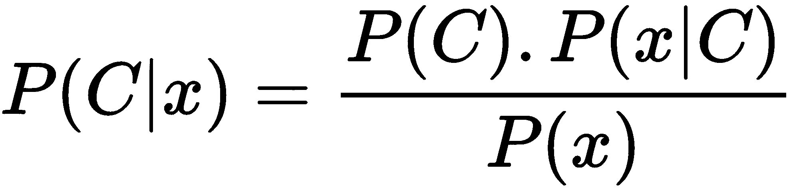
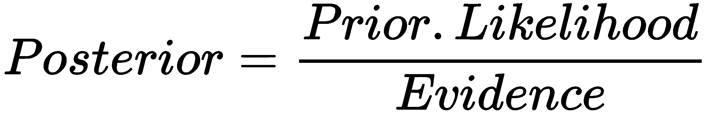
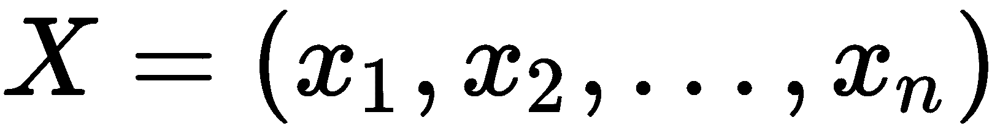
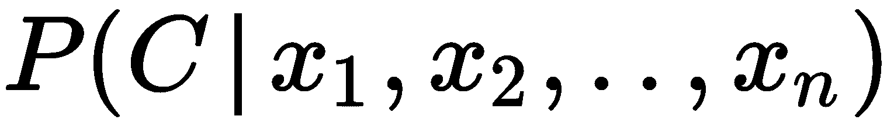
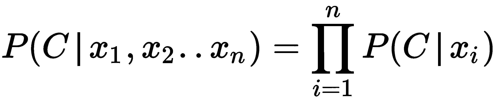
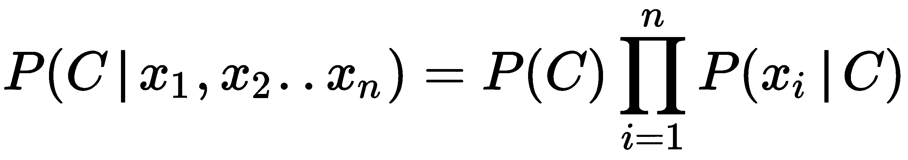
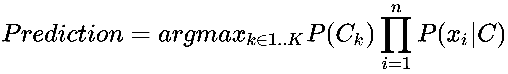
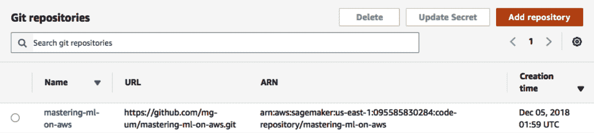
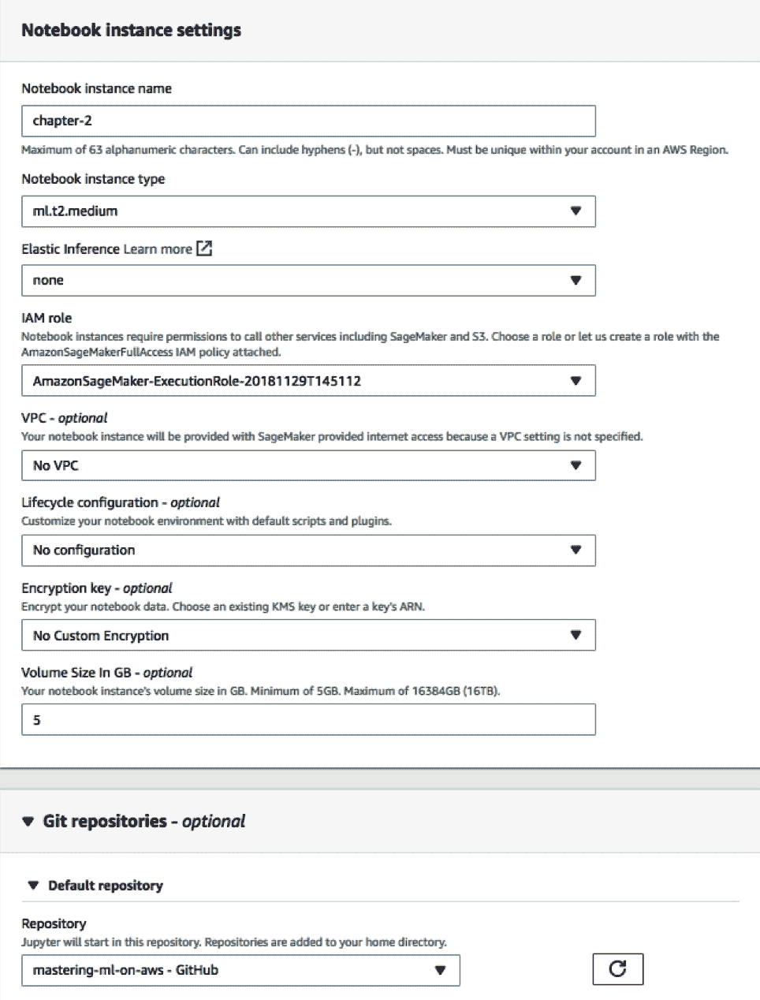
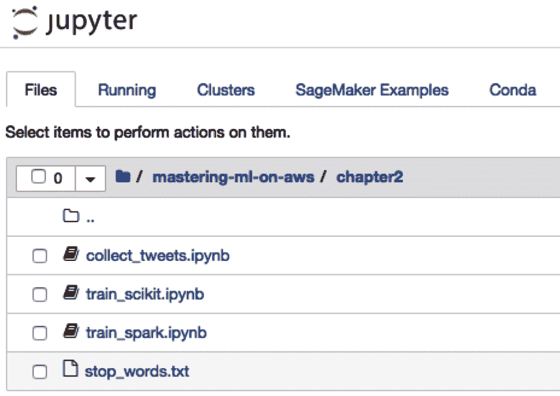

# 使用朴素贝叶斯分类 Twitter 流

**机器学习**（ML）在分析大数据集和从数据中提取可操作见解方面发挥着重要作用。ML 算法执行预测结果、聚类数据以提取趋势和构建推荐引擎等任务。了解 ML 算法有助于数据科学家了解他们处理的数据的性质，并计划应用哪些算法以从数据中获得期望的结果。尽管有多种算法可用于执行任何任务，但数据科学家了解不同 ML 算法的优缺点非常重要。应用 ML 算法的决定可以基于各种因素，例如数据集的大小、用于训练和部署 ML 模型的集群预算以及错误率成本。尽管 AWS 在选择和部署 ML 模型方面提供了大量选项，但数据科学家必须了解在不同情况下应使用哪些算法。

在本书的这一部分，我们介绍了各种流行的 ML 算法以及它们可以有效地应用的示例。我们将解释每个算法的优点和缺点，以及在这些算法应该在 AWS 中选择的情况。鉴于本书是为数据科学学生和专业人士编写的，我们将通过一个简单的示例展示如何使用简单的 Python 库实现这些算法，然后使用 Spark 和 AWS SageMaker 在更大的数据集上部署。这些章节应有助于数据科学家熟悉流行的 ML 算法，并帮助他们了解在 AWS 集群的大数据环境中实现这些算法的细微差别。

第二章，*使用朴素贝叶斯分类 Twitter 流*，第三章，*使用回归算法预测房屋价值*，第四章，*使用基于树的算法预测用户行为*，以及第五章，*使用聚类算法进行客户细分*，介绍了四种分类算法，这些算法可以根据特征集预测结果。第六章，*分析访问模式以提供建议*，解释了聚类算法，并展示了它们如何用于客户细分等应用。第七章，*实现深度学习算法*，介绍了一种推荐算法，可以根据用户的购买历史向用户推荐新项目。

本章将介绍朴素贝叶斯算法的基础知识，并展示一个将通过使用此算法和语言模型来解决的问题。我们将提供如何在 `scikit-learn`、Apache Spark 和 SageMaker 的 BlazingText 上应用它的示例。此外，我们还将探讨如何在更复杂的场景中进一步使用贝叶斯推理背后的思想。

在本章中，我们将涵盖以下主题：

+   分类算法

+   朴素贝叶斯分类器

+   使用语言模型进行文本分类

+   朴素贝叶斯 — 优点和缺点

# 分类算法

机器学习算法中流行的一个子集是分类算法。它们也被称为监督学习算法。对于这种方法，我们假设我们有一个丰富的特征和事件数据集。算法的任务是根据一组特征预测一个事件。事件被称为类别变量。例如，考虑以下与天气相关的特征数据集，以及那天是否下雪：

**表 1：样本数据集**

| **温度 (华氏度)** | **天空状况** | **风速 (英里/小时)** | **降雪量** |
| --- | --- | --- | --- |
| 小于 20 | 晴朗 | 30 | 否 |
| 20-32 度 | 晴朗 | 6 | 否 |
| 32-70 度 | 多云 | 20 | 否 |
| 70 度以上 | 多云 | 0 | 否 |
| 20-32 度 | 多云 | 10 | 是 |
| 32-70 度 | 晴朗 | 15 | 否 |
| 小于 20 | 多云 | 8 | 是 |
| 32-70 度 | 晴朗 | 7 | 否 |
| 20-32 度 | 多云 | 11 | 否 |
| 小于 20 | 晴朗 | 13 | 是 |

在数据集中，气象站有关于该日温度、天空状况和风速的信息。他们还有关于何时收到降雪的记录。他们正在工作的分类问题是根据温度、天空状况和风速等特征预测降雪。

让我们讨论一下在机器学习数据集中使用的术语。对于示例表，如果分类问题是预测降雪，那么降雪特征被称为**类别**或**目标**变量。非类别值被称为属性或特征变量。数据集中的每一行被称为一个观测值。

# 特征类型

在分类数据集中有三种类型的特征可用。数据科学家需要能够区分不同特征的原因是，并非每个机器学习算法都支持每种类型的特征。因此，如果特征集的类型与期望的算法不匹配，那么特征就需要进行预处理，以转换成分类算法可以处理的特征。

# 名义特征

**名义**或**分类**特征是具有有限个分类值的特征，这些值不能按任何特定顺序排列。在示例数据集中，**天空状况**特征是一个名义特征。在表中，名义特征的值要么是**晴朗**，要么是**多云**。其他名义特征的例子包括性别和颜色。名义特征可以通过使用如独热编码等技术转换为连续变量。

# 序列特征

**序列**特征，类似于名义特征，也具有有限个分类值。然而，与名义特征不同，这些分类值可以按特定顺序排列。在先前的例子中，**温度**特征是一个序列特征。这个类别的标签可以从最冷到最暖排列。序列特征可以通过将范围值插值到定义的尺度来转换为连续变量。

# 连续特征

**连续**特征可以有无穷多个可能的值。与只能有离散值集合的名义和序列特征不同，连续变量是数值变量，并且与某些机器学习算法不兼容。然而，可以使用称为**离散化**的技术将连续特征转换为序列特征。

尽管我们在这里不会讨论将特征从一种形式转换为另一种形式的技巧，但我们将通过示例部分展示如何实现。在这本书中，我们选择了需要特征转换的示例数据集。您不仅应该从这本书中了解这些不同的转换技巧，还应该观察数据科学家如何分析数据集，并根据应用使用特定的特征转换技巧。我们还提供了在 Python 和 AWS SageMaker 中大规模应用这些技巧的示例。

# 朴素贝叶斯分类器

基于贝叶斯定理的朴素贝叶斯分类器是一种机器学习算法。该算法与信念系统的发展方式相似。贝叶斯定理最初由英国数学家托马斯·贝叶斯在 1776 年提出。这个算法有各种应用，并且被用于超过两个世纪的许多历史任务。这个算法最著名的应用之一是艾伦·图灵在第二次世界大战期间的应用，他使用贝叶斯定理来解密德国恩尼格玛密码。贝叶斯定理在机器学习中也为诸如贝叶斯网络和朴素贝叶斯算法等算法找到了一个重要的位置。朴素贝叶斯算法因其低复杂性和预测原因的透明度而在机器学习中非常受欢迎。

# 贝叶斯定理

在本节中，我们将首先介绍贝叶斯定理，并展示它在机器学习中的应用。

贝叶斯定理计算在给定条件下事件发生的概率，这样我们就有关于事件、条件和事件发生时条件概率的先验知识。在我们的雪预测例子中，事件是下雪。条件是温度在 20°F 到 32°F 之间。根据数据，我们可以计算下雪时温度在 20°F 和 32°F 之间的似然。使用这些数据，我们可以预测在温度在 20°F 到 32°F 之间时下雪的概率。

假设我们有一个类别变量 *C* 和一个条件变量 *x*。贝叶斯定理在公式 1 中给出。我们还在公式 2 中提供了一个简单的方法来记住算法的不同组成部分。

**公式 1**



**公式 2 **



从这个公式中，你需要记住四个术语。

# 后验

**后验**概率是在特征变量 *x* 存在的情况下事件发生的概率。

# 似然

**似然**是指给定事件发生时某个条件出现的概率。在我们的例子中，似然指的是在下雪时温度在 20°F 到 32°F 之间的概率。根据数据集中的数据，下雪时温度在 20°F-30°F 之间的概率是 66.66%。训练数据可以用来计算特征集中每个离散值的概率。

# 先验概率

**先验**概率是数据集中事件的总体概率。在我们的例子中，这将是数据集中下雪的总体概率。先验概率在数据集不平衡的情况下很重要，即数据集中一个类别变量的实例数量显著高于另一个。这会导致似然变量的偏差。先验概率通过考虑数据集中的偏差来重新规范化这些概率。例如，在我们的数据集中，雪事件的先验概率是 30%，不下雪的先验概率是 70%。下雪时多云的概率是 66%，而不下雪时多云的似然是 42.8%。

然而，考虑到先验概率，尽管下雪时多云的条件比不下雪时更可能，但在乘以先验概率后，多云时的后验概率为 19%，多云时不下雪的概率为 30%。通过将先验概率与似然事件相乘，我们告知我们的后验概率是它不下雪的概率比下雪的概率更高。

# 证据

**证据**变量是数据集中一个条件的概率。在我们的例子中，温度为 70°F 或以上的概率仅为 10%。罕见事件具有低的证据概率。证据概率会提高罕见事件的后验概率。对于 Naïve Bayes 分类器来说，我们不需要考虑证据变量，因为它不依赖于类变量。

因此，贝叶斯定理用于计算给定单个条件的事件的概率。然而，当我们训练机器学习算法时，我们使用一个或多个特征来预测事件的概率。在下一节中，我们将解释 Naive Bayes 算法以及它是如何利用多个特征变量的后验概率的。

# Naive Bayes 算法的工作原理

Naive Bayes 算法使用贝叶斯定理来计算数据集中每个条件的后验概率，并使用这些概率来计算给定一组条件的事件的条件概率。Naive Bayes 算法假设每个条件特征是相互独立的。这是一个重要的假设，有助于简化条件概率的计算方式。独立性假设是算法得名 Naive Bayes 的原因。

在本节中，我们不是考虑一个 *x* 特征变量，而是考虑一个特征向量，，其中 *n* 是用于计算类概率的特征变量的数量。我们在公式 3 中表示 *x* 向量的类变量的条件概率：

**公式 3**



由于我们假设每个特征变量是相互独立的，因此可以按以下方式计算类变量的条件概率：

**公式 4**



根据前几节中所示的后验概率计算，此公式可以重写如下：

**公式 5**



公式 5 解释了如何根据特征变量计算事件 *C* 的概率。在这个公式中值得注意的是，如何轻松地从数据集中计算每个元素。此外，由于贝叶斯定理中的证据概率不依赖于类变量，因此它没有用于 Naive Bayes 公式中。

Naive Bayes 算法在训练阶段只需要遍历一次数据集，就可以计算每个事件的特征值的概率。在预测阶段，我们根据特征实例计算每个事件的概率，并预测概率最高的那个事件。公式 6 展示了当有 *k* 个可能事件时，Naive Bayes 分类器的预测是如何计算的。公式中的 **Argmax** 表示选择概率最大的事件作为预测：

** 公式 6**



Naive Bayes 分类器是一种多类分类器，可以用于在需要预测两个或更多类变量的数据集上进行训练。在下一章中，我们将展示一些仅适用于需要预测两个类变量的二元分类器的示例。然而，我们将向您展示将二元分类器应用于多类问题的方法。

# 使用语言模型进行文本分类

文本分类是分类算法的应用。然而，文本是按特定顺序组合的单词。因此，您可以看到，具有类变量的文本文档与我们之前在 *分类算法* 部分中展示的表 1 中的数据集并不相似。

文本数据集可以表示如表 2 所示。

**表 2：Twitter 数据集示例**

| **推文** | **账户** |
| --- | --- |
| 保护美国人民免受枪支暴力的最简单方法就是真正讨论常识性的枪支法律。 | 民主党 |
| 这不能是我们作为一个国家的样子。我们需要找出发生了什么，并确保它永远不会再次发生 ([`t.co/RiY7sjMfJK)`](https://t.co/RiY7sjMfJK))  | 民主党 |
| 周末，特朗普总统访问了阿灵顿国家公墓，向阵亡士兵致敬。 | 共和党 |
| 这位总统已经明确表示他将保护这个国家——`@SecNielsen`。 | 共和党 |

对于本章，我们基于两个不同账户的推文构建了一个数据集。我们还在以下章节中提供了代码，以便您可以创建自己的数据集来尝试这个示例。我们的目的是构建一个智能应用程序，能够仅通过阅读推文文本就能预测推文的来源。我们将收集美国共和党（`@GOP`）和民主党（`@TheDemocrats`）的多个推文来构建一个模型，可以预测哪个政党撰写了给定的推文。为了做到这一点，我们将从每个政党随机选择一些推文并通过模型提交，以检查预测是否与实际情况相符。

# 收集推文

我们将首先使用 `Twython` 库访问 Twitter API 并收集一系列推文，并给它们标注起源的政治党派。

实现的细节可以在以下 Jupyter Notebook 中的我们的 GitHub 仓库中找到：

`chapter2/collect_tweets.ipynb`

我们需要在 `Twython` 库中调用以下方法来将来自 `@GOP` 和 `@TheDemocrats` 的推文分别保存到一些文本文件中，`gop.txt` 和 `dems.txt`：

```py
twitter.get_user_timeline(screen_name='GOP', tweet_mode='extended', count=500)
```

每个文件包含 200 条推文。以下是从 `dems.txt` 文件中的一些摘录：

+   `这不能代表我们作为一个国家的样子。我们需要找出发生了什么，并确保它不再发生。`

+   `RT @AFLCIO: Scott Walker. 永远是国家耻辱。`

# 准备数据

现在我们已经将源数据保存在文本文件中，我们需要将其转换为可以用于机器学习库输入的格式。大多数通用机器学习包，如 `scikit-learn` 和 Apache Spark，只接受数字矩阵作为输入。因此，需要对文本数据集进行特征转换。一种常见的方法是使用语言模型，如**词袋模型**（**BoW**）。在这个例子中，我们为每条推文构建一个 BoW，并构建一个矩阵，其中每一行代表一条推文，每一列表示特定单词的存在。我们还有一个用于区分来自 `共和党`（`1`）或 `民主党`（`0`）的推文的标签列，如下表所示：

**表 3：将文本数据集转换为结构化数据集**

|  | **移民** | **医疗补助** | **恐怖主义** | **阶级** |
| --- | --- | --- | --- | --- |
| 推文 1 | 0 | 1 | 0 | 0 |
| 推文 2 | 1 | 0 | 1 | 1 |
| 推文 3 | 0 | 0 | 1 | 0 |

表 2 表示可以从推文中导出的矩阵。然而，在生成此类矩阵时有许多需要注意的点。由于语言词汇表中的术语数量，矩阵的列数可能非常高。这给机器学习带来了一个称为**维度诅咒**的问题（见第 *X* 节）。有几种方法可以解决这个问题；然而，由于我们的示例在数据量上相对较小，我们只会简要讨论减少列数的方法。

+   **停用词**：某些常见的单词可能对我们的任务没有价值（例如，单词 **the**、**for** 或 **as**）。我们称这些单词为停用词，我们将从 `dems.txt` 和 `gop.txt` 中删除这些单词。

+   **词干提取**：文本中可能有许多单词的变体。例如，argue、argued、argues 和 arguing 都来自单词 **argue**。可以使用词干提取和词形还原等技术来找到单词的词干，并用该词的变体替换词干。

+   **分词**：分词可以将各种单词组合成短语，从而减少特征的数量。例如，“tea party”在政治上与单独的两个词有完全不同的含义。我们不会在我们的简单示例中考虑这一点，但分词技术有助于找到这样的短语。

另一个需要考虑的问题是，在推文中出现多次的单词在训练行中具有同等的重要性。可以通过使用多项式或词频-逆文档频率（TFIDF）模型来利用这些信息。由于推文相对较短，我们不会在我们的实现中考虑这个方面。

表 2 矩阵描述了每个类别（即每个政党）中可能找到的单词。然而，当我们想要预测推文的来源时，就提出了逆问题。给定一个特定的词袋，我们感兴趣的是评估这些术语被一个政党或另一个政党使用的可能性。换句话说，我们知道给定一个特定政党，词袋的概率，而我们感兴趣的是相反的情况：给定一个词袋，推文被一个政党撰写的概率。这就是朴素贝叶斯算法应用的地方。

# 通过 SageMaker 笔记本构建朴素贝叶斯模型

让我们开始使用 SageMaker 笔记本。这个工具将帮助我们运行训练模型的代码。SageMaker 除了其他功能外，还允许我们创建笔记本实例，这些实例托管 Jupyter 笔记本。Jupyter 是一个 Web UI，允许数据科学家或程序员通过创建代码段落进行交互式编码，这些代码段落按需执行。它作为一个 IDE，但具有将代码输出以视觉相关形式（例如图表、表格和 Markdown）呈现的附加功能，并且还支持在同一个笔记本中用不同语言编写段落。我们将在这本书中广泛使用笔记本，并推荐将其用作分享和展示数据科学发现的方法。它允许用户实现可重复研究，因为特定研究目标所需的代码可以通过重新运行笔记本中的代码段落进行验证和重现。

您可以在 SageMaker 的 AWS 控制台页面了解更多信息，请访问[`console.aws.amazon.com/sagemaker/home?region=us-east-1#/dashboard`](https://console.aws.amazon.com/sagemaker/home?region=us-east-1#/dashboard)。

让我们看看 SageMaker 的 AWS 控制台页面在以下截图中的样子：


点击“添加仓库”，选择您的身份验证机制，并添加位于[`github.com/mg-um/mastering-ml-on-aws`](https://github.com/mg-um/mastering-ml-on-aws)的仓库：



在创建笔记本实例之前，您可能希望附加一个 Git 仓库，以便本书提供的笔记本可以附加到笔记本上，并立即可用，正如您稍后将会看到的：



我们现在可以继续启动笔记本实例。为将要托管笔记本的服务器配置硬件、网络和安全有多种选项。然而，我们现在不会深入细节，而是接受默认设置。如果你想要限制访问或增强你的机器，AWS 文档是一个极好的资源。

由于我们附加了 Git 仓库，一旦你打开 Jupyter，你应该能看到我们为这本书创建的笔记本，你可以重新运行它们、修改它们或改进它们：



在本节中，我们关注 `train_scikit` Python 笔记本，并回顾代码片段来解释我们如何构建和测试用于推文分类问题的模型。我们鼓励你运行这个笔记本的所有段落，以了解这个笔记本的目的。

我们首先将加载停用词和两组推文到变量中：

```py
import pandas as pd
import numpy as np
from sklearn.feature_extraction.text import CountVectorizer
from scipy import sparse

SRC_PATH = '/home/ec2-user/SageMaker/mastering-ml-on-aws/chapter2/'
stop_words = [word.strip() for word in open(SRC_PATH + 'stop_words.txt').readlines()]
with open(SRC_PATH + 'dem.txt', 'r') as file:
   dem_text = [line.strip('\n') for line in file]
with open(SRC_PATH + 'gop.txt', 'r') as file:
   gop_text = [line.strip('\n') for line in file]
```

我们将接着使用 `scikit-learn` 中的工具来构建我们的矩阵。为了做到这一点，我们将使用一个 `CountVectorizer` 类，这是一个知道如何将不同的单词分配到列同时过滤掉停用词的类。我们将考虑两组推文；在我们的例子中，我们将只使用前 `1200` 个单词：

```py
vectorizer = CountVectorizer(input=dem_text + gop_text,
                             stop_words=stop_words,
                             max_features=1200)
```

通过 `vectorizer` 我们现在可以构建两个矩阵，一个用于共和党推文，另一个用于民主党推文：

```py
dem_bow = vectorizer.fit_transform(dem_text)
gop_bow = vectorizer.fit_transform(gop_text)
```

这两个词袋矩阵（`dem_bow` 和 `gop_bow`）以稀疏数据结构表示，以最小化内存使用，但可以通过将它们转换为数组来检查：

```py
>>> gop_bow.toarray()

array([[0, 0, 1, ..., 0, 1, 0],
      [0, 0, 0, ..., 0, 0, 1],
      [0, 1, 0, ..., 0, 0, 0],
      ...,
      [0, 0, 0, ..., 0, 0, 0],
      [0, 1, 0, ..., 0, 0, 0],
      [0, 0, 0, ..., 0, 1, 0]], dtype=int64)
```

为了训练我们的模型，我们需要提供两个数组。一个是 BoWs 矩阵（针对双方），我们将称之为 `x`，另一个是每条推文的标签（类别变量）。为了构建这个，我们将垂直堆叠两个矩阵（针对每个政党）：

```py
x = sparse.vstack((dem_bow, gop_bow))
```

为了构建标签向量，我们只需组装一个向量，其中 `Democrat` 位置为 `ones`，而 `Republican` 位置为 `zeros`：

```py
ones = np.ones(200)
zeros = np.zeros(200)
y = np.hstack((ones, zeros))
```

在训练我们的模型之前，我们将随机分割推文（`x` 矩阵的行），以便一些用于构建模型，而另一些用于检查模型是否正确预测政治党派（标签）：

```py
from sklearn.model_selection import train_test_split
x_train, x_test, y_train, y_test = train_test_split(x, y, test_size=0.25, random_state=42)
```

现在我们已经有了训练集和测试集，我们继续使用朴素贝叶斯（由于我们的矩阵是 ones 或 zeros，因此是伯努利朴素贝叶斯）来训练我们的模型：

```py
from sklearn.naive_bayes import BernoulliNB
naive_bayes = BernoulliNB()
model = naive_bayes.fit(x_train, y_train)
```

如前述代码所示，拟合朴素贝叶斯模型非常简单。我们需要提供训练矩阵和标签。现在，模型能够预测任意推文的标签（政治党派）（只要我们以 BoWs 矩阵表示形式拥有它们）。幸运的是，我们已经为测试分离了一些推文，因此我们可以将这些推文通过模型，看看模型预测正确标签的频率（注意，我们知道测试数据集中每条推文的实际党派）。

要获取预测结果，只需调用模型的`predict`方法：

```py
y_predictions = model.predict(x_test)
```

现在，我们可以看到有多少预测结果与真实值相匹配：

```py
from sklearn.metrics import accuracy_score
accuracy_score(y_test, y_predictions)
```

代码块的输出分数为`0.95`。

在这个例子中，我们使用准确率作为评估指标。准确率可以使用公式 7 计算：

**公式 7**


数据科学家可以使用各种评估指标来评估机器学习算法。在下一章中，我们将介绍如精度、召回率、F1 度量、**均方根误差**（**RMSE**）和**曲线下面积**（**AUC**）等评估指标，以不同的示例进行展示。评估指标应根据实现算法的业务需求进行选择，并应表明机器学习算法是否达到了完成任务所需的标准。

由于这是我们正在处理的第一个例子，我们将使用最简单的评估指标，即准确率。根据公式 7，准确率是正确预测数与分类器做出的总预测数之比。结果证明，我们的朴素贝叶斯模型非常准确，准确率为 95%。可能有些词，如每个党派的成员名称，可以迅速使模型给出正确的预测。我们将使用决策树在第四章，*基于树的预测用户行为方法*中探讨这一点。

注意，在这个过程中，我们必须准备和转换数据以适应模型。这个过程非常常见，`scikit-learn`和 Spark 都支持管道的概念，允许数据科学家声明构建模型所需的必要转换，而无需手动获取中间结果。

在下面的代码片段中，我们可以看到通过创建以下两个阶段的管道来产生相同模型的一种替代方法：

+   计数向量器

+   朴素贝叶斯训练器

```py
from sklearn.pipeline import Pipeline
x_train, x_test, y_train, y_test = train_test_split(dem_text + gop_text, y, test_size=0.25, random_state=5)
pipeline = Pipeline([('vect', vectorizer), ('nb', naive_bayes)])
pipeline_model = pipeline.fit(x_train, y_train)
y_predictions = pipeline_model.predict(x_test)
accuracy_score(y_test, y_predictions)
```

这使得我们的建模更加简洁和声明性。通过调用`pipeline.fit()`方法，库应用任何必要的转换或估计。请注意，在这种情况下，我们分割了原始文本（而不是矩阵），因为`fit()`方法现在接收的是原始输入。正如我们将在下一节中看到的，管道可以包含两种类型的阶段，Transformers 和 Estimators，这取决于该阶段是否需要从数据中计算模型，或者只是声明性地转换数据。

# 在 SageMaker 笔记本中使用 Apache Spark 的朴素贝叶斯模型

在上一节*使用语言模型对文本进行分类*中，我们看到了如何在 SageMaker 笔记本实例上使用`scikit-learn`训练模型。对于像我们从 Twitter 收集的例子那样小的例子来说，这是可行的。如果我们有数百 TB 的推文数据呢？首先，我们无法在单个机器上存储这些数据。即使我们能够做到，在如此大的数据集上训练可能也需要太长时间。Apache Spark 通过实现可以读取分布式数据集（如 AWS S3）的 ML 算法并可以在多台机器上分配计算来解决我们的问题。AWS 提供了一个名为**弹性映射减少**（**EMR**）的产品，它能够启动和管理我们可以在其上执行大规模 ML 的集群。

许多 ML 算法需要对数据进行多次遍历（尽管朴素贝叶斯不是这种情况）。Apache Spark 提供了一种将数据集缓存到内存中的方法，这样就可以高效地运行需要多次遍历数据的算法（如**逻辑回归**或**决策树**，我们将在下一章中看到）。我们将在第四章，*使用基于树的算法预测用户行为*中展示如何启动 EMR 集群，然而，在本节中，我们将展示与 Apache Spark 相比，与`scikit-learn`一起工作的相似性。事实上，Apache Spark 中的许多接口（如管道、转换器和估计器）都受到了`scikit-learn`的启发。

Apache Spark 支持四种主要语言：R、Python、Scala 和 Java。在这本书中，我们将使用 Python 版本，也称为 PySpark。尽管我们的 Spark 代码将在单个机器上运行（即在 SageMaker 笔记本实例上运行），但如果我们的数据更大，并且我们有 Spark 集群（在[第四章](https://cdp.packtpub.com/mastering_machine_learning_on_aws/wp-admin/post.php?post=25&action=edit#post_27)，*使用基于树的算法预测用户行为*中，我们将深入了解使用 EMR 创建 Spark 集群），它可以在不更改任何代码的情况下在多台机器上运行。

在 Spark 中，我们首先需要做的是创建一个 Spark 会话。我们通过首先创建一个 Spark 上下文，然后创建一个用于类似 SQL 数据操作会话来完成此操作：

```py
from pyspark.context import SparkContext
from pyspark.sql import SQLContext

sc = SparkContext('local', 'test')
sql = SQLContext(sc)
```

由于我们将本地运行 Spark（在单个机器上），我们指定`local`。然而，如果我们要在集群上运行此操作，我们需要指定集群的主机地址。Spark 使用称为 DataFrame 的抽象，允许我们使用类似 SQL 的操作来操作大量数据表。

我们的第一项任务将是为我们的原始数据定义 DataFrame：

```py
from pyspark.sql.functions import lit

dems_df = sql.read.text("file://" + SRC_PATH + 'dem.txt')
gop_df = sql.read.text("file://" + SRC_PATH + 'gop.txt')
corpus_df = dems_df.select("value", lit(1).alias("label")).union(gop_df.select("value", lit(0).alias("label")))
```

在前两行中，我们将原始推文创建为 DataFrame。我们还创建了`corpus_df`，它包含推文的两个来源，并通过创建一个包含`1`的列来标记民主党人，`0`来标记`共和党人`：

```py
>>> corpus_df.select("*").limit(2).show()

+--------------------+-----+
|               value|label|
+--------------------+-----+
|This ruling is th...| 1 . |
|No president shou...| 1 . |
+--------------------+-----+
```

Spark 以惰性方式工作，因此，尽管我们定义并联合了 DataFrame，但在我们执行数据上的第一个操作之前，实际上不会发生任何处理。在我们的例子中，这将是将 DataFrame 分割为测试集和训练集：

```py
train_df, test_df = corpus_df.randomSplit([0.75, 0.25])
```

现在，我们已准备好训练我们的模型。Spark 支持相同的管道概念。我们将构建一个包含模型所需转换的管道。它与我们的上一个例子非常相似，只是 Spark 有两个单独的阶段用于分词和停用词去除：

```py
from pyspark.ml import Pipeline
from pyspark.ml.feature import CountVectorizer, Tokenizer, StopWordsRemover
tokenizer = Tokenizer(inputCol="value", outputCol="words")
stop_words_remover = StopWordsRemover(inputCol="words", outputCol="words_cleaned")
vectorizer = CountVectorizer(inputCol="words_cleaned", outputCol="features")
cleaning_pipeline = Pipeline(stages = [tokenizer, stop_words_remover, vectorizer])
cleaning_pipeline_model = cleaning_pipeline.fit(corpus_df)
cleaned_training_df = cleaning_pipeline_model.transform(train_df)
cleaned_testing_df = cleaning_pipeline_model.transform(test_df)
```

Spark ML 管道由一系列阶段组成。每个阶段可以是 Transformer 或 Estimator。Transformers 在数据集上应用一个定义良好的转换，而 Estimators 通过遍历数据集具有生成模型的能力。`NaiveBayes` 和 `CountVectorizer` 是 Estimator 的例子，而分词器和 `StopWordsRemover` 是 Transformer 的例子。反过来，模型也是 Transformers，因为它们可以提供数据集中所有元素的预测作为转换。

如前述代码所示，我们定义了一个包含所有必要阶段的管道来清理数据。每个阶段都将转换原始 DataFrame（仅包含两个列 value，分别是原始推文文本和标签）并添加更多列。

在以下代码中，训练时使用的相关列是特征（一个稀疏向量，表示与我们的 `scikit-learn` 示例中完全相同的 BoWs）和标签：

```py
>>> cleaned_training_df.show(n=3)

+-----------+------------------+-------------+--------------------+
| value     |label| . words .  |words_cleaned| features           |
+-----------+------------------+-------------+--------------------+
|#Tuesday...| 1 . |[#tuesday...|[#tuesday... |(3025,[63,1398,18...|
|#WorldAI...| 1 . |[#worlda....|[#worldai... |(3025,[37,75,155,...|
|@Tony4W....| 1 . |[.@tony4w...|[.@tony4w... |(3025,[41,131,160...|
+-----------------+------------+-------------+--------------------+
```

通过指定这些列到 `NaiveBayes` 分类器，我们可以训练一个模型：

```py
from pyspark.ml.classification import NaiveBayes
naive_bayes = NaiveBayes(featuresCol="features", labelCol="label")
```

该模型是一个 Transformer，可以为我们的训练 DataFrame 中的每一行提供预测：

```py
naive_bayes_model = naive_bayes.fit(cleaned_training_df)
predictions_df = naive_bayes_model.transform(cleaned_testing_df)

>>> predictions_df.select("features", "label", "prediction").limit(3).show()
+--------------------+-----+----------+
| features           |label|prediction|
+--------------------+-----+----------+
|(3025,[1303,1858,...| 1 . | 1.0      |
|(3025,[1,20,91,13...| 1 . | 1.0      |
|(3025,[16,145,157...| 1 . | 1.0      |
+--------------------+-----+----------+
```

与我们的上一个例子类似，我们可以评估我们模型的准确性。通过使用 `MulticlassClassificationEvaluator` 类并指定实际和预测标签，我们可以获得 `accuracy`：

```py
from pyspark.ml.evaluation import MulticlassClassificationEvaluator
evaluator = MulticlassClassificationEvaluator(
   labelCol="label", predictionCol="prediction", metricName="accuracy")
evaluator.evaluate(predictions_df)
```

输出结果是 0.93，这与我们在 `scikit-learn` 上得到的结果相似。

# 使用 SageMaker 的 BlazingText 内置 ML 服务

我们看到了如何使用`scikit-learn`和 Apache Spark 库执行 ML 任务。然而，有时使用 ML 服务更合适。SageMaker 提供了创建、调整和部署模型的方法，这些模型支持多种内置的 ML 算法，只需调用服务即可。简而言之，您需要将数据放在 S3（一个用于存储大量数据的亚马逊服务）中，并调用 SageMaker 服务，提供所有必要的详细信息（实际的 ML 算法、数据的位置、用于训练的机器的类型和数量）。在本节中，我们将通过 SageMaker 的 BlazingText ML 服务的过程来训练我们的模型，以预测推文。BlazingText 是一种支持使用 word2vec 进行文本分类的算法，word2vec 是一种将单词转换为向量的方式，可以捕捉精确的语法和语义单词关系。我们不会在本节中深入探讨 SageMaker 架构的细节，但我们将向读者展示如何使用这个 AWS 服务作为`scikit-learn`或 Spark 的替代方案。

我们将首先导入 SakeMaker 库，创建一个会话，并获取一个角色（这是笔记本实例正在使用的角色（见[https://aws.amazon.com/blogs/aws/iam-roles-for-ec2-instances-simplified-secure-access-to-aws-service-apies-from-ec2]））。

此外，我们指定我们将使用的 S3 存储桶来存储所有我们的数据和模型：

```py
import sagemaker
from sagemaker import get_execution_role
import json
import boto3

sess = sagemaker.Session()
role = get_execution_role()
bucket = "mastering-ml-aws"
prefix = "chapter2/blazingtext"
```

下一步是将一些数据放入 S3 进行训练。BlazingText 期望的格式是每行以`__label__X TEXT `格式存在。在我们的例子中，这意味着在每个推文前加上代表原始方的标签：

```py
__label__1 We are forever g..
 __label__0 RT @AFLCIO: Scott Walker.
 __label__0 Democrats will hold this
 __label__1 Congratulations to hundreds of thousands ...
```

为了做到这一点，我们对我们的推文进行一些预处理，并添加正确的标签：

```py
with open(SRC_PATH + 'dem.txt', 'r') as file:
    dem_text = ["__label__0 " + line.strip('\n') for line in file]

with open(SRC_PATH + 'gop.txt', 'r') as file:
    gop_text = ["__label__1 " + line.strip('\n') for line in file]

corpus = dem_text + gop_text
```

我们接下来将创建用于训练和测试的集合，以文本文件的形式：

```py
from sklearn.model_selection import train_test_split
corpus_train, corpus_test = train_test_split(corpus, test_size=0.25, random_state=42) 

corpus_train_txt = "\n".join(corpus_train)
corpus_test_txt = "\n".join(corpus_test)

with open('tweets.train', 'w') as file:
    file.write(corpus_train_txt) 
with open('tweets.test', 'w') as file:
    file.write(corpus_test_txt)
```

一旦我们有了训练和验证的文本文件，我们将它们上传到`S3`：

```py
train_path = prefix + '/train'
validation_path = prefix + '/validation'

sess.upload_data(path='tweets.train', bucket=bucket, key_prefix=train_path)
sess.upload_data(path='tweets.test', bucket=bucket, key_prefix=validation_path)

s3_train_data = 's3://{}/{}'.format(bucket, train_path)
s3_validation_data = 's3://{}/{}'.format(bucket, validation_path)
```

我们接下来通过指定所有必要的详细信息来实例化`Estimator`：用于训练的机器的类型和数量，以及模型将在 S3 中存储的路径位置：

```py
container = sagemaker.amazon.amazon_estimator.get_image_uri('us-east-1', "blazingtext", "latest")

s3_output_location = 's3://{}/{}/output'.format(bucket, prefix)
bt_model = sagemaker.estimator.Estimator(container,
                                         role, 
                                         train_instance_count=1, 
                                         train_instance_type='ml.c4.4xlarge',
                                         train_volume_size = 30,
                                         train_max_run = 360000,
                                         input_mode= 'File',
                                         output_path=s3_output_location,
                                         sagemaker_session=sess)
```

如我们在上一节中讨论的*在 SageMaker 笔记本上使用 Apache Spark 的朴素贝叶斯模型*部分，estimator 能够通过处理训练数据来创建模型。下一步将是提供训练数据来拟合模型：

```py
bt_model.set_hyperparameters(mode="supervised", epochs=10, min_count=3, learning_rate=0.05, vector_dim=10, early_stopping=False, patience=5, min_epochs=5, word_ngrams=2) train_data = sagemaker.session.s3_input(s3_train_data, distribution='FullyReplicated', content_type='text/plain', s3_data_type='S3Prefix') validation_data = sagemaker.session.s3_input(s3_validation_data, distribution='FullyReplicated', content_type='text/plain', s3_data_type='S3Prefix') data_channels = {'train': train_data, 'validation': validation_data}
bt_model.fit(inputs=data_channels, logs=True)

```

在我们训练模型之前，我们需要指定超参数。我们不会在本节中详细介绍这个算法，但读者可以在[https://docs.aws.amazon.com/sagemaker/latest/dg/blazingtext.html]中找到详细信息。

这个特定的算法也会使用验证数据，因为它会在数据上运行多次（epochs）以减少错误。一旦我们拟合了模型，我们就可以将模型部署为 Web 服务，以便应用程序可以使用它：

```py
predictor = bt_model.deploy(initial_instance_count = 1,instance_type = 'ml.m4.xlarge')
```

在我们的案例中，我们只需点击端点即可获取预测结果并评估准确性：

```py
corpus_test_no_labels = [x[11:] for x in corpus_test]
payload = {"instances" : corpus_test_no_labels}
response = predictor.predict(json.dumps(payload))
predictions = json.loads(response)
print(json.dumps(predictions, indent=2))
```

在运行前面的代码后，我们得到以下输出：

```py
[ { "prob": [ 0.5003 ], "label": [ "__label__0" ] }, { "prob": [ 0.5009 ], "label": [ "__label__1" ] }...
```

如您在前面代码中看到的，每个预测都伴随着一个概率（我们现在将忽略它）。接下来，我们计算有多少这样的标签与原始标签匹配：

```py
predicted_labels = [prediction['label'][0] for prediction in predictions]
predicted_labels[:4]
```

在运行前面的代码后，我们得到以下输出：

```py
['__label__0', '__label__1', '__label__0', '__label__0']
```

然后运行下一行代码：

```py
actual_labels = [x[:10] for x in corpus_test]
actual_labels[:4]
```

如您在以下代码块输出的结果中可以看到，一些标签与实际匹配，而一些则没有匹配：

```py
['__label__1', '__label__1', '__label__0', '__label__1']
```

接下来，我们运行以下代码来构建一个布尔向量，该向量包含真实或假，取决于实际是否与预测结果匹配：

```py
matches = [(actual_label == predicted_label) for (actual_label, predicted_label) in zip(actual_labels, predicted_labels)]
matches[:4]
```

在运行前面的代码后，我们得到以下输出：

```py
[False, True, True, False]
```

在运行前面的输出后，我们将运行以下代码来计算匹配的案例与总实例的比例：

```py
matches.count(True) / len(matches)
```

以下是从前一个代码块输出的准确性分数：

```py
0.61
```

我们可以看到，准确性低于我们之前的示例。这有很多原因。首先，在这个案例中，我们没有在数据准备上投入太多（例如，这个案例中没有使用停用词）。然而，准确性较低的主要原因是我们使用了如此少的数据。这些模型在大型数据集上表现最佳。

# Naive Bayes – 优点和缺点

在本节中，我们介绍了选择朴素贝叶斯算法进行分类问题的优缺点：

**优点**

+   **训练时间**：朴素贝叶斯算法只需要在整个数据集上遍历一次来计算数据集中每个特征值的后续概率。因此，当我们处理大型数据集或预算有限的硬件时，朴素贝叶斯算法对于大多数数据科学家来说是一个可行的选择。

+   **预测时间**：由于朴素贝叶斯算法中所有概率都是预先计算的，因此该算法的预测时间非常高效。

+   **透明度**：由于朴素贝叶斯算法的预测基于每个条件特征的后续概率，因此很容易理解哪些特征正在影响预测。这有助于用户理解预测。

**缺点**

+   **预测准确性**：朴素贝叶斯算法的预测准确性低于本书中将要讨论的其他算法。算法的预测准确性依赖于数据集，许多研究工作已经证明，例如随机森林、**支持向量机**（**SVMs**）和**深度神经网络**（**DNNs**）在分类准确性方面优于朴素贝叶斯算法。

+   **独立性假设**：由于我们假设每个特征相互独立，因此此算法可能会丢失相互依赖的特征的信息。其他高级算法在计算预测时确实会使用这种依赖信息。

# 摘要

在本章中，我们向您介绍了为什么机器学习是数据科学家工具箱中的关键工具。我们讨论了结构化机器学习数据集的外观以及如何识别数据集中的特征类型。

我们深入研究了朴素贝叶斯分类算法，并研究了贝叶斯定理在朴素贝叶斯算法中的应用。利用贝叶斯定理，我们可以根据每个特征值预测事件发生的概率，并选择概率最高的那个事件。

我们还提供了一个 Twitter 数据集的示例。我们希望您学会了如何思考文本分类问题，以及如何构建朴素贝叶斯分类模型来预测推文的来源。我们还展示了如何在 SageMaker 中实现该算法，以及如何使用 Apache Spark 实现。这个代码库应该能帮助您在未来解决任何文本分类问题。由于实现使用了 SageMaker 服务和 Spark，它可以扩展到可以容纳吉字节或太字节规模的数据集。

我们将在后面的章节中探讨如何在实际生产集群上部署机器学习模型。

# 练习

1.  贝叶斯定理不仅对朴素贝叶斯算法有用，还被用于其他目的。找出另外两个应用贝叶斯定理的算法，并解释它们与朴素贝叶斯算法的不同之处。

1.  在本章中，我们提供了一个二元分类器的示例。基于我们下载推文的代码，创建一个新的数据集，从五个不同的来源下载推文，并构建一个可以预测每个推文来源的朴素贝叶斯模型。

1.  确定何时使用`scikit-learn`、Apache Spark 或 SageMaker 服务解决特定问题的场景。
