# 第三章：使用回归算法预测房屋价值

本章将介绍回归算法的基础知识，并将它们应用于根据多个特征预测房屋价格。我们还将介绍如何使用逻辑回归解决分类问题。将提供 SageMaker Notebooks 中 scikit-learn、Apache Spark 和 SageMaker 的线性学习器的示例。

在本章中，我们将涵盖以下主题：

+   预测房屋价格

+   理解线性回归

+   评估回归模型

+   通过 scikit-learn 实现线性回归

+   通过 Apache Spark 实现线性回归

+   通过 SageMaker 的线性学习器实现线性回归

+   理解逻辑回归

+   线性模型的优缺点

# 预测房屋价格

在本章中，我们将考虑尝试根据多个变量（如房间数量和房屋年龄）预测波士顿郊区的房屋价值的问题。数据集的详细信息可以在此处找到：[`www.kaggle.com/c/boston-housing/`](https://www.kaggle.com/c/boston-housing/)。与上一章考虑的问题不同，因为我们试图预测的变量（美元价格）是连续的。能够预测连续量的模型被称为**回归器**或**回归算法**。有许多这样的算法，但本章我们将专注于最简单（但非常流行）的一种，即线性回归器。

# 理解线性回归

回归算法是数据科学家工具箱中的重要算法，因为它们可以用于各种非二值预测任务。线性回归算法模型了我们试图预测的因变量与独立变量向量之间的关系。在回归算法的上下文中，变量向量也被称为回归器。线性回归假设独立变量向量与我们试图预测的因变量之间存在线性关系。因此，线性回归模型使用训练数据学习线性函数的未知变量和常数，使得线性函数最佳地拟合训练数据。

线性回归可以应用于目标是根据回归变量预测或预测因变量的情况。我们将通过一个示例来解释线性回归如何根据数据训练。

下表展示了一个样本数据集，目标是根据三个变量预测房屋价格：

| **楼层面积** | **卧室数量** | **浴室数量** | **房屋价格** |
| --- | --- | --- | --- |
| 2500 | 4 | 2 | 600,000 |
| 2800 | 4 | 2 | 650,000 |
| 2700 | 4 | 3 | 650,000 |
| 4500 | 6 | 4 | 800,000 |
| 3500 | 4 | 2 | 750,000 |
| 3000 | 5 | 4 | 760,000 |
| 2000 | 3 | 2 | 500,000 |
| 4100 | 4 | 3 | 810,000 |

在这个数据集中，变量 `Floor Size`、`Number of Bedrooms` 和 `Number of Bathrooms` 在线性回归中被假定为相互独立。我们的目标是根据这些变量预测 `House Price` 的值。

让我们简化这个问题。让我们只考虑 `Floor Size` 变量来预测房价。仅从一个变量或回归器创建线性回归被称为**简单线性回归**。如果我们从两个列创建散点图，我们可以观察到这两个变量之间存在关系：

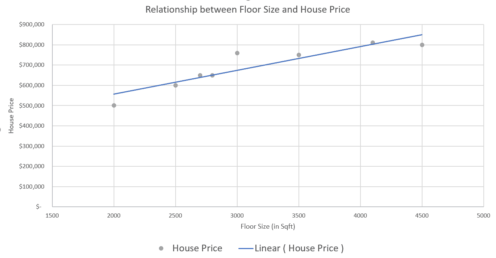

虽然这两个变量之间没有精确的线性关系，但我们可以创建一条近似线来表示趋势。建模算法的目的是最小化创建这条近似线时的误差。

如我们所知，一条直线可以用以下方程表示：

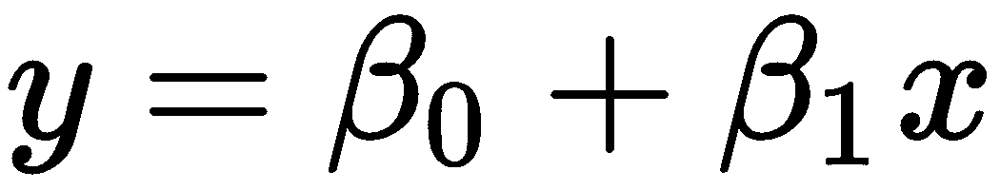

因此，前面图表中近似线性关系也可以用相同的公式表示，线性回归模型的任务是学习  和  的值。此外，由于我们知道预测变量和回归器之间的关系不是严格线性的，我们可以在表示数据集中噪声的方程中添加一个随机误差变量。以下公式表示简单线性回归模型是如何表示的：

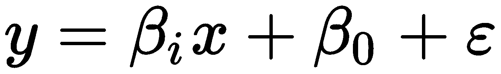

现在，让我们考虑具有多个回归器的数据集。我们不仅表示一个变量  和  之间的线性关系，我们还将表示一组回归器为 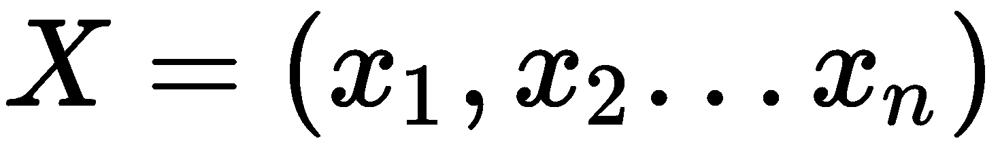。我们将假设因变量  和回归器 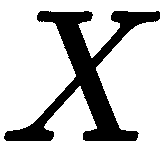 之间存在线性关系。因此，具有多个回归器的线性回归模型可以用以下公式表示：

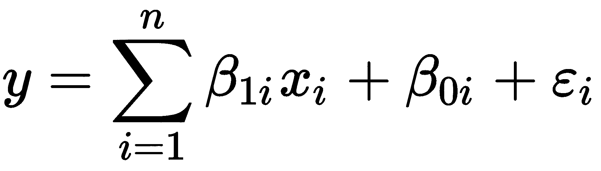

如我们之前所讨论的，线性回归假设回归变量和我们要预测的因变量之间存在线性关系。这是一个重要的假设，可能并不适用于所有数据集。因此，对于数据科学家来说，由于线性回归的训练时间快，使用线性回归可能看起来很有吸引力。然而，如果数据集变量与因变量之间没有线性关系，可能会导致显著的误差。在这种情况下，数据科学家也可能尝试伯努利回归、泊松回归或多项式回归等算法来提高预测精度。我们将在本章后面讨论逻辑回归，它用于因变量为二进制的情况。

在训练阶段，线性回归可以使用各种参数估计技术来学习 、 、 和  的值。然而，我们不会在本书中详细介绍这些技术。但是，我们建议你在接下来的示例中尝试使用这些参数估计技术，并观察它们对算法训练时间和预测准确性的影响。

为了将线性模型拟合到数据中，我们首先需要能够确定线性模型拟合数据的好坏。线性回归中的参数估计正在开发出各种模型。参数估计是估计 、 、 和  的值的过程。在接下来的章节中，我们将简要介绍这两种估计技术。

# 线性最小二乘估计

**线性最小二乘**（**LLS**）是一种基于给定数据估计参数的估计方法。LLS 估计的优化问题可以解释如下：

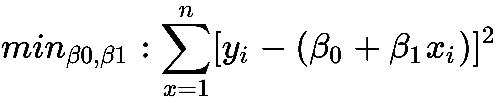

LLS 是一组公式，用于通过估计  和  的值来解决线性回归的统计问题。LLS 是获取线性回归解决方案的优化方法。它使用观察到的*x*和*y*的值来估计  和  的值。我们鼓励你探索 LLS 解决方案，以了解它是如何估计线性回归参数的。然而，由于本书的重点是介绍这些概念并帮助你将它们应用于 AWS，我们不会详细介绍这种方法。

# 最大似然估计

**最大似然估计**（**MLE**）是一种流行的模型，用于估计线性回归的参数。MLE 是一个概率模型，可以预测哪些参数值具有最大的可能性来重新创建观察到的数据集。这可以通过以下公式表示：

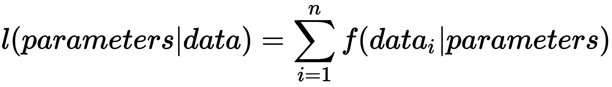

对于线性回归，我们的假设是因变量与模型之间存在线性关系。最大似然估计（MLE）假设因变量的值服从正态分布。其思路是预测每个观察到的 *X* 值的参数，以便它能够模拟 *y* 的值。我们还估计每个观察到的值的误差，以模拟线性预测的 *y* 值与实际值之间的差异。

# 梯度下降

**梯度下降算法**也常用于估计线性回归的参数。梯度下降算法用于最小化一个函数。根据我们的预测，我们从参数的初始值集合开始，迭代地移动到参数，以最小化函数中的误差。用于迭代地减小误差的函数称为**梯度**。其思路是沿着梯度平面中的最低点下降梯度。不同的梯度下降算法包括**批量梯度下降**，它查看每个例子中的所有观察到的例子，以及**随机梯度下降**，其中我们一次迭代一个观察值。因此，批量梯度下降比随机梯度下降更准确，但速度要慢得多，因此不适合大型数据集。

由于回归算法非常适合预测连续变量，因此关于回归算法的研究正在进行得非常广泛。我们鼓励您了解更多关于线性回归库的信息，并尝试库中提供的不同变体，以计算测试数据集的效率和效果。

# 评估回归模型

与朴素贝叶斯分类模型不同，回归模型提供数值输出作为预测。这个输出可以通过预测两个事件并使用最大值来进行二分类。然而，在例如基于回归器预测房屋价值等例子中，我们不能使用仅依赖于预测是否正确或错误的评估指标。当我们预测数值时，评估指标还应量化预测中的误差值。例如，如果房屋价值为 600,000，模型 A 预测为 700,000，模型 B 预测为 1,000,000，则精确度和召回率等指标会将这两个预测都计为假阳性。然而，对于回归模型，我们需要能够告诉我们模型 A 比模型 B 更接近实际值的评估指标。因此，在本节中，我们将介绍用于此类数值预测的三个指标。

# 平均绝对误差

**平均绝对误差**（**MAE**）是误差绝对值的平均值。它可以表示为以下公式：

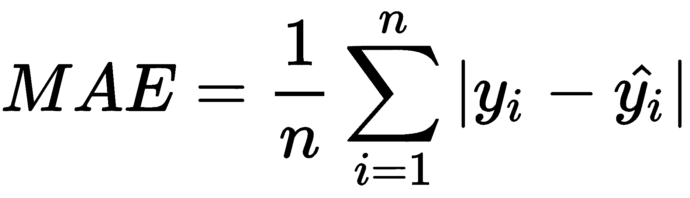

MAE 提供了两个向量之间的平均误差。在我们的例子中，MAE 是实际值  和预测值  之间的差异。由于它为模型预测中的误差提供了清晰的解释，MAE 被许多研究人员使用。

# 均方误差

**平均平方误差**（**MSE**）是误差值平方的平均值，表示为以下公式：

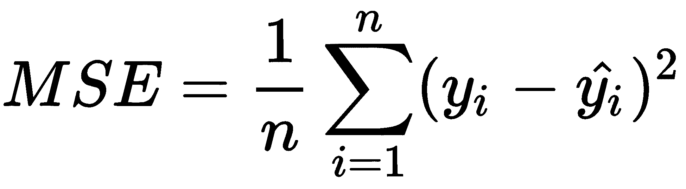

MSE 在误差非常小的情况下很有用。MSE 结合了预测值与真实值之间的距离以及预测值中的方差。

# 根均方误差

**根均方误差**（**RMSE**）是均方误差的平方根，表示为以下公式：

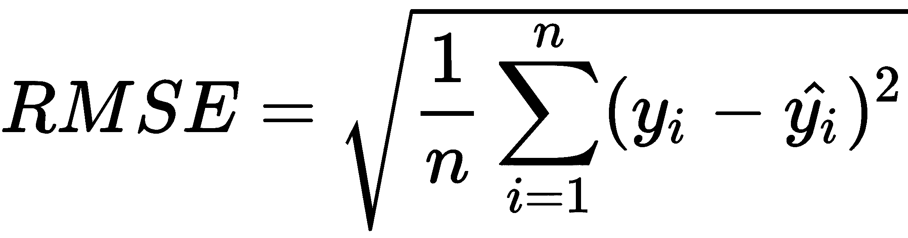

RMSE 与 MSE 类似，捕捉预测中的方差。然而，在 RMSE 中，由于我们取平方误差值的平方根，误差可以与 MSE 相比较，同时也保留了 MSE 的优点。

# R²

另一个在回归问题中常用的流行指标是 R² 分数，或确定系数。这个分数衡量了从独立变量可预测的因变量方差的比例：

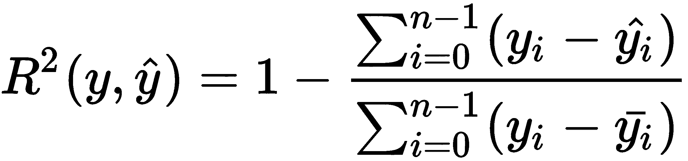

在这里， 代表实际值的向量，而  和 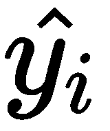 代表预测值的向量。实际值的平均值是 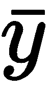。商的分子衡量实际值通常与平均值的不同程度，而分母衡量实际值与预测值的不同程度。请注意，差异是平方的，类似于均方误差（MSE），因此大的差异会受到严重惩罚。

在完美的回归器中，分子为 0，因此*R²*的最佳可能值为 1.0。然而，当预测误差显著时，我们可以看到任意大的负值。

机器学习包中实现了所有四种类型的评估指标，并在以下代码示例中进行了演示。

# 通过 scikit-learn 实现线性回归

如我们在上一章中所做的那样，我们将向您展示如何快速使用`scikit-learn`从 SageMaker 笔记本实例中直接训练线性模型。首先，您必须创建笔记本实例（选择`conda_python3`作为内核）。

1.  我们将首先将训练数据加载到一个`pandas`数据框中：

```py
housing_df = pd.read_csv(SRC_PATH + 'train.csv')
housing_df.head()
```

上述代码显示以下输出：

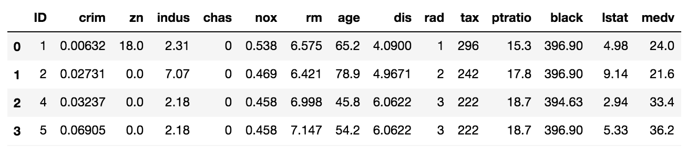

1.  最后一列`(medv)`代表中值，表示我们试图根据剩余列（自变量）的值来预测的变量（因变量）。

如同往常一样，我们将数据集分为训练集和测试集：

```py
from sklearn.model_selection import train_test_split

housing_df_reordered = housing_df[[label] + training_features]

training_df, test_df = train_test_split(housing_df_reordered, 
                                        test_size=0.2)
```

1.  一旦我们有了这些数据集，我们将继续构建一个线性回归器：

```py
from sklearn.linear_model import LinearRegression

regression = LinearRegression()

training_features = ['crim', 'zn', 'indus', 'chas', 'nox', 
                     'rm', 'age', 'dis', 'tax', 'ptratio', 'lstat']

model = regression.fit(training_df[training_features], 
                       training_df['medv'])
```

我们首先构建一个估计器（在这种情况下，线性回归），并通过提供训练值的矩阵`(training_df[training_features])`和标签`(raining_df['medv'])`来拟合模型。

1.  在拟合模型后，我们可以用它来预测测试数据集中的每一行。我们通过向现有的测试数据框中添加一个新列来完成此操作：

```py
test_df['predicted_medv'] = model.predict(test_df[training_features])
test_df.head()
```

上述代码显示以下输出：

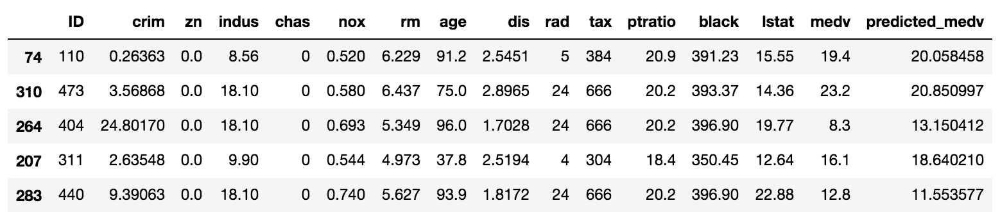

1.  总是检查我们的预测结果非常有用。一种实现方式是将预测值与实际值作为散点图进行绘制：

```py
test_df[['medv', 'predicted_medv']].plot(kind='scatter', 
                                         x='medv', 
                                         y='predicted_medv')
```

上述代码显示以下输出：

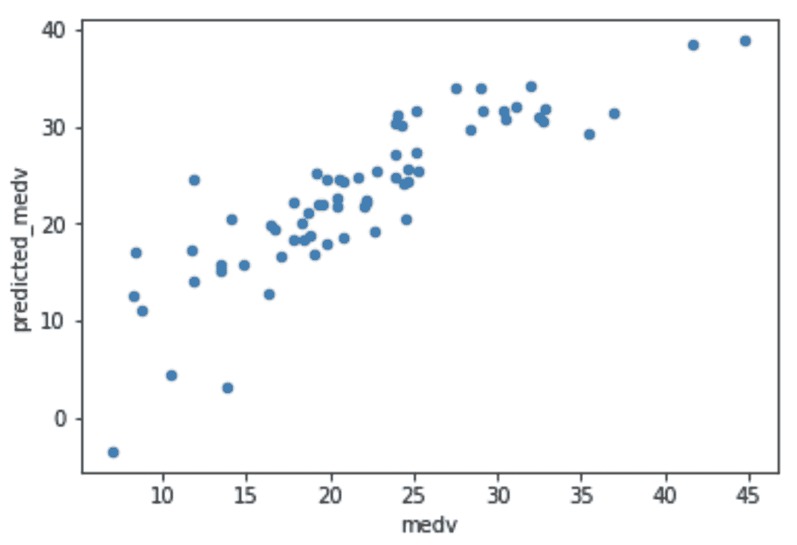

注意值大多位于对角线上。这是一个好兆头，因为完美的回归器会将所有数据点精确地放在对角线上（每个预测值都会与实际值完全相同）。

1.  除了这种图形验证之外，我们还获得了一个评估指标，它告诉我们我们的模型在预测值方面有多好。在这个例子中，我们使用 R 平方评估指标，如前所述，它在 scikit-learn 中可用。

让我们看看以下代码块：

```py
from sklearn.metrics import r2_score

r2_score(test_df['medv'], test_df['predicted_medv'])

0.695
```

接近 0.7 的值是一个不错的值。如果您想了解什么是好的 R2 相关系数，我们建议您玩这个游戏：[`guessthecorrelation.com/`](http://guessthecorrelation.com/).

我们的线性模型将通过将每个特征的值乘以一个系数并将所有这些值加起来，再加上一个独立项或截距来创建一个预测价格。

我们可以通过访问模型实例变量中的数据成员来找到这些系数和截距的值：

```py
model.coef_

array([-7.15121101e-02, 3.78566895e-02, -4.47104045e-02, 5.06817970e+00,
 -1.44690998e+01, 3.98249374e+00, -5.88738235e-03, -1.73656446e+00,
 1.01325463e-03, -6.18943939e-01, -6.55278930e-01])

model.intercept_
32.20
```

通常，检查不同变量的系数非常方便，因为它们可以表明特征在独立预测能力方面的相对重要性。

默认情况下，大多数线性回归算法，如`scikit-learn`或 Spark，将自动进行一定程度的预处理（例如，它将变量缩放以防止具有大值的特征引入偏差）。此外，这些算法支持正则化参数，并提供选项供您选择用于高效搜索最大化 R2 分数（或最小化某些损失函数）的优化器。

# 通过 Apache Spark 实现线性回归

您可能对训练可以接受大量数据集作为输入的回归模型感兴趣，这超出了`scikit-learn`所能做到的。Apache Spark 是这种场景下的一个很好的选择。正如我们在上一章中提到的，Apache Spark 可以很容易地在 AWS 上使用**弹性映射减少**（**EMR**）在机器集群上运行训练算法。我们将在下一章中解释如何设置 EMR 集群。在本节中，我们将解释您如何使用 Spark ML 库来训练线性回归算法。

1.  第一步是从我们的训练数据创建一个 dataframe：

```py
housing_df = sql.read.csv(SRC_PATH + 'train.csv', header=True, inferSchema=True)
```

以下图像显示了数据集的前几行：

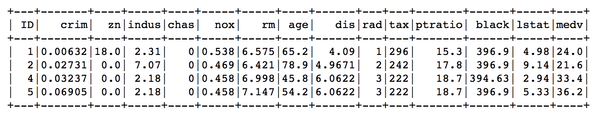

1.  通常，Apache Spark 需要输入数据集有一个单列，该列是一个向量，代表所有训练特征。在第二章中，*使用朴素贝叶斯分类 Twitter 帖子*，我们使用了`CountVectorizer`来创建这样的列。在本章中，由于向量值已经存在于我们的数据集中，我们只需要使用`VectorAssembler`转换器构建这样一个列：

```py
from pyspark.ml.feature import VectorAssembler

training_features = ['crim', 'zn', 'indus', 'chas', 'nox', 
                     'rm', 'age', 'dis', 'tax', 'ptratio', 'lstat']

vector_assembler = VectorAssembler(inputCols=training_features, 
                                   outputCol="features")

df_with_features_vector = vector_assembler.transform(housing_df)
```

以下截图显示了 df_with_features_vector 数据集的前几行：

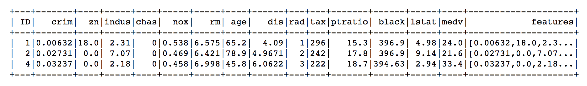

注意向量组装器创建了一个名为 features 的新列，它将用于训练的所有特征组装成向量。

1.  如同往常，我们将我们的 dataframe 分为测试集和训练集：

```py
train_df, test_df = df_with_features_vector.randomSplit([0.8, 0.2], 
                                                        seed=17)
```

1.  我们现在可以实例化我们的回归器并拟合一个模型：

```py
from pyspark.ml.regression import LinearRegression

linear = LinearRegression(featuresCol="features", labelCol="medv")
linear_model = linear.fit(train_df)
```

1.  通过使用此模型，我们对测试数据集中的每个值进行预测：

```py
predictions_df = linear_model.transform(test_df)
predictions_df.show(3)
```

上述`show()`命令的输出是：

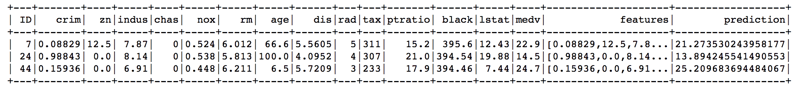

1.  我们可以通过使用 `RegressionEvaluator` 容易地找到 `R2` 值：

```py
from pyspark.ml.evaluation import RegressionEvaluator

evaluator = RegressionEvaluator(labelCol="medv", 
                                predictionCol="prediction", 
                                metricName="r2")
evaluator.evaluate(predictions_df)
```

在这种情况下，我们得到 `R2` 为 `0.688`，这与 `scikit-learn` 的结果相似。

# 通过 SageMaker 的线性学习器实现线性回归

AWS 中用于训练回归模型的另一种选择是使用 SageMaker 的 API 来构建线性模型。在前一章中，当我们考虑如何使用 BlazingText 解决我们的文本分类问题时，我们解释了该服务的基本原理。同样，在本节中，我们将使用线性学习器，并遵循相同的过程，这基本上包括三个步骤：

1.  将训练和测试数据存档到 S3

1.  调用 API 来训练模型

1.  使用模型获取预测

与我们在第二章，*使用朴素贝叶斯分类 Twitter 流*中所做的不一样，不是部署一个端点（即，一个网络服务）来获取预测，我们将使用批处理转换器，这是一种能够根据模型和 S3 中的某些数据获取大量预测的服务。让我们看看以下步骤：

1.  假设我们已经以与前面章节类似的方式准备好了训练和测试数据集，我们将创建一个 SageMaker 会话并将我们的训练和测试数据上传到 S3：

```py
import sagemaker
from sagemaker import get_execution_role
import json
import boto3

sess = sagemaker.Session()
role = get_execution_role()

bucket = "mastering-ml-aws"
prefix = "chapter3/linearmodels"

train_path = prefix + '/train'
validation_path = prefix + '/validation'

sess.upload_data(path='training-housing.csv', 
                 bucket=bucket, 
                 key_prefix=train_path)
sess.upload_data(path='testing-housing.csv', 
                 bucket=bucket, 
                 key_prefix=validation_path)

s3_train_data = 's3://{}/{}'.format(bucket, train_path)
s3_validation_data = 's3://{}/{}'.format(bucket, validation_path)
```

1.  一旦数据存入 S3，我们可以继续实例化估计器：

```py
from sagemaker.amazon.amazon_estimator import get_image_uri
from sagemaker.session import s3_input

container = get_image_uri(boto3.Session().region_name, 'linear-learner')
s3_output_location = 's3://{}/{}/output'.format(bucket, prefix)

linear = sagemaker.estimator.Estimator(container,
                                       role,
                                       train_instance_count=1, 
                                       train_instance_type='ml.c4.xlarge',
                                       output_path=s3_output_location,
                                       sagemaker_session=sess)
```

1.  接下来，我们需要设置超参数。SageMaker 中的线性学习器接受大量选项，可以在以下链接中找到：[`docs.aws.amazon.com/sagemaker/latest/dg/ll_hyperparameters.html`](https://docs.aws.amazon.com/sagemaker/latest/dg/ll_hyperparameters.html)。在第十四章，*优化 SageMaker 和 Spark 机器学习模型*中，我们将深入了解如何找到这些参数的合适值：

```py
linear.set_hyperparameters(feature_dim=len(training_features),
predictor_type='regressor',
mini_batch_size=1)

linear.fit({'train': s3_input(s3_train_data, 
content_type='text/csv'), 
'test': s3_input(s3_validation_data, 
content_type='text/csv')})
```

1.  一旦我们拟合了模型，我们可以实例化一个转换器，它能够计算测试数据集在 `S3` 中的预测：

```py
transformer = linear.transformer(instance_count=1, instance_type='ml.m4.xlarge', output_path=s3_output_location)

transformer.transform(s3_validation_data, content_type='text/csv')
transformer.wait()
```

这将在 S3 中创建一个名为 `testing-housing.csv.out` 的文件，其格式如下：

```py
 {"score":18.911674499511719}
 {"score":41.916255950927734}
 {"score":20.833599090576172}
 {"score":38.696208953857422}
```

1.  我们可以下载此文件并使用预测构建一个 pandas 数据框：

```py
predictions = pd.read_json('testing-housing.csv.out',lines=True)
```

以下截图显示了前几个预测：

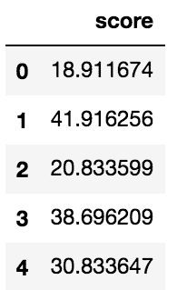

1.  由于这些分数与测试数据集中的顺序完全一致，我们可以通过合并数据系列来组合实际和预测列：

```py
evaluation_df = pd.DataFrame({'actual':list(test_df[label]),
                              'predicted':list(predictions['score'])})
```

上述代码显示以下输出：

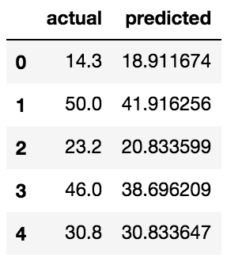

1.  使用这个数据框，我们可以计算 R2 分数：

```py
from sklearn.metrics import r2_score

r2_score(evaluation_df['actual'], evaluation_df['predicted'])
```

结果为 `0.796`，与之前的估计一致，略有改进。

# 理解逻辑回归

逻辑回归是一个广泛使用的统计模型，可以用来模拟二元因变量。在线性回归中，我们假设因变量是我们试图预测的数值。考虑一个二元变量具有真和假值的情况。在逻辑回归中，我们不是使用我们在*线性回归*部分使用的公式来计算数值输出，而是使用相同的公式估计标记为 True 的二元事件的 log odds。将 log odds 转换为事件标记为 1 发生的概率的函数称为**逻辑函数**。

对数似然尺度测量的单位称为**logit**。对数似然是通过以下公式计算的：

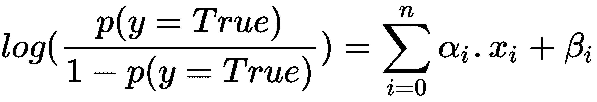

因此，使用与线性回归相同的方法，逻辑回归通过计算真实事件发生的概率来用于二元因变量。线性回归与逻辑回归之间的主要区别在于，线性回归用于预测因变量的值，而逻辑回归用于预测因变量值的概率。因此，正如我们在本书的大部分内容中所强调的，数据科学家应该看看他们想要预测什么，并相应地选择算法。

逻辑回归算法在大多数流行的机器学习包中都有实现，我们将在下一节提供一个如何在 Spark 中使用它的示例。

# Spark 中的逻辑回归

`chapter3/train_logistic`笔记本展示了我们如何实例化一个`LogisticRegression` Spark Trainer，而不是使用`NaiveBayes`来处理我们在第二章中处理的 Twitter 数据集，即*使用朴素贝叶斯分类 Twitter 帖子*，并获得一个与我们所构建的模型一样好的模型：

```py
from pyspark.ml.classification import LogisticRegression
logistic_regression = LogisticRegression(featuresCol="features", 
                                         labelCol="label")
logistic_model = logistic_regression.fit(cleaned_training_df)
```

# 线性模型的优缺点

回归模型在机器学习中非常受欢迎，并在许多领域得到广泛应用。线性回归的主要优势是它简单地将数据集表示为简单的线性模型。因此，线性回归的训练时间很快。同样，模型可以被数据科学家检查，以了解哪个变量对整体模型的决策有贡献。在问题陈述简单且用于预测的变量较少的情况下，建议使用线性回归。随着数据集复杂性的增加，如果数据中有很多噪声，线性回归可能会产生显著的错误。

线性回归大胆地假设因变量与回归变量之间存在线性关系。如果这个假设不成立，那么线性回归算法可能无法很好地拟合数据。有一些变体，如二次回归，可以解决这个问题。然而，这会导致模型复杂化，从而显著增加训练时间。

# 摘要

在本章中，我们首先介绍了回归算法的基础，并将其应用于预测房价。然后，我们学习了如何评估回归模型，通过如`scikit-learn`、Apache Spark 和 SageMaker 的线性学习器等库介绍了线性回归，最后，我们看到了如何使用逻辑回归来解决分类问题，以及线性模型的优缺点。

在下一章中，我们将使用基于树的算法来预测用户行为。
