# 使用聚类算法进行客户细分

本章将通过探讨如何根据他们的行为模式将聚类算法应用于客户细分来介绍主要的聚类算法。特别是，我们将演示 Apache Spark 和 Amazon SageMaker 如何无缝交互以执行聚类。在本章中，我们将使用**Kaggle 数据集 E-Commerce**，这是由**Fabien Daniel**提供的，可以从[`www.kaggle.com/fabiendaniel/customer-segmentation/data`](https://www.kaggle.com/fabiendaniel/customer-segmentation/data)下载。

让我们来看看我们将要讨论的主题：

+   理解聚类算法的工作原理

+   在**弹性映射减少**（**EMR**）上使用**Apache Spark**进行聚类

+   通过 Spark 集成使用**SageMaker**进行聚类

# 理解聚类算法的工作原理

**聚类分析**，或聚类，是一个基于观察值的相似性将一组观察值分组的过程。其思想是，一个簇中的观察值彼此之间比来自其他簇的观察值更相似。因此，该算法的输出是一组簇，可以识别数据集中的模式并将数据安排到不同的簇中。

聚类算法被称为**无监督学习算法**。无监督学习不依赖于预测真实值，旨在发现数据中的自然模式。由于没有提供真实值，比较不同的无监督学习模型比较困难。无监督学习通常用于探索性分析和降维。聚类是探索性分析的一个例子。在这个任务中，你正在寻找数据集中的模式和结构。

这与我们在书中迄今为止所研究的算法不同。**朴素贝叶斯**、**线性回归**和**决策树**算法都是监督学习的例子。有一个假设，即每个数据集都有一组观察结果和与这些观察结果相关的事件类别。因此，数据已经根据每个观察结果的实际结果事件进行分组。然而，并非每个数据集都与每个事件相关联有标记的结果。例如，考虑一个包含有关电子商务网站上每个交易的信息的数据集：

| **SKU** | **商品名称** | **客户 ID** | **国家** |
| --- | --- | --- | --- |
| 12423 | iPhone | 10 | 美国 |
| 12423 | iPhone | 11 | 美国 |
| 12423 | iPhone | 12 | 美国 |
| 11011 | 三星 S9 | 13 | 英国 |
| 11011 | 三星 S9 | 10 | 美国 |
| 11011 | 三星 S9 | 14 | 英国 |

此数据集是一系列交易记录，但没有任何类别变量告诉我们哪些用户购买了特定的产品。因此，如果任务是识别数据集中的模式，我们不能使用任何可以预测特定事件的算法。这就是聚类算法发挥作用的地方。我们希望探索是否可以根据数据集找到网站交易的趋势。让我们看看一个简单的例子。假设数据集只有一个特征：**商品名称**。我们将发现数据可以排列成三个簇，即 iPhone、Samsung S9 和 Pixel 2。同样，如果我们考虑的唯一聚类特征是**国家**，数据可以聚类成两个簇：USA 和 UK。一旦生成了簇，你就可以分析每个簇中的统计数据，以了解购买特定商品的观众类型。

然而，在大多数经验中，你将不得不根据多个特征对数据进行聚类。有许多聚类算法可以用来将数据聚类成簇。以下图表显示了数据集簇的示例：

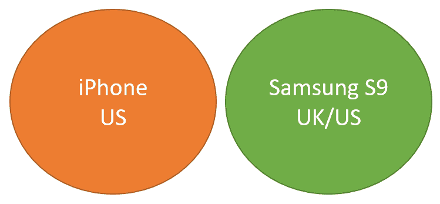

聚类帮助我们得到一个结果，我们可以将数据分成两个簇，并理解每个簇中的模式。我们可能能够将客户聚类为购买某种手机的用户。通过分析簇，我们可以了解购买 iPhone 或 Samsung S9 手机的用户模式。

在本章中，我们将研究两种常见的聚类方法：

+   k-means 聚类

+   层次聚类

# k-means 聚类

**k-means 聚类**算法旨在通过在数据集中选择 k 个质心来将数据集聚类成 k 个簇。每个记录根据其到质心的距离进行评估，并分配到一个簇中。质心是位于每个簇中心的观测值。为了正式定义 k-means 聚类，我们正在优化观测值的**簇内平方和**（***WCSS**）距离。因此，最理想的聚类将确保每个簇中的观测值都靠近其质心，并且尽可能远离其他质心。

k-means 聚类中有两个重要的参数。首先，我们需要在我们的数据集中发现质心。选择质心的流行方法之一称为**随机划分**。这种方法使用称为**期望最大化**（**EM**）的技术来获得高质量的簇。在第一步中，我们随机将一个簇分配给每个观测值。一旦每个观测值被分配到一个簇，我们就使用 WCSS 方法计算簇的质量：

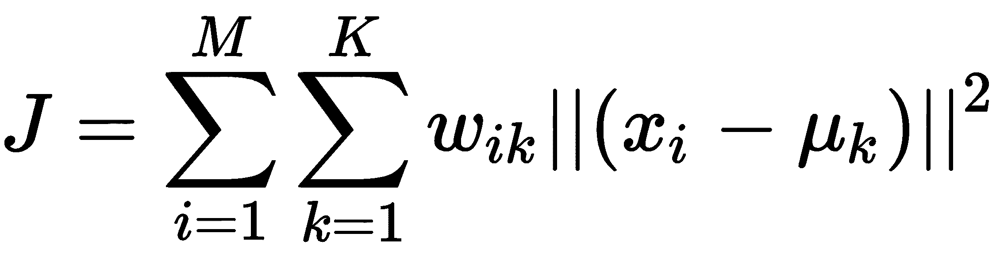

*J*代表生成具有*M*个观察值和*K*个聚类的聚类的 WCSS 得分。如果观察值*i*属于聚类*k*，则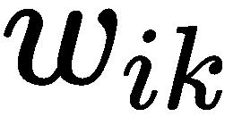为 1，如果不属于，则为 0。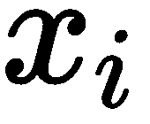是观察值，而是聚类*k*的质心。和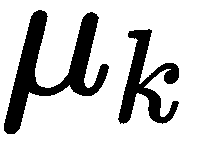之间的差异表示观察值和质心之间的距离。我们的目标是使*J*的值最小化。

在下一步中，我们根据第一步中的当前聚类再次计算新的质心。这是 EM 算法中的最大化步骤，我们试图为记录尝试更优的聚类分配。新的质心值使用以下公式计算：

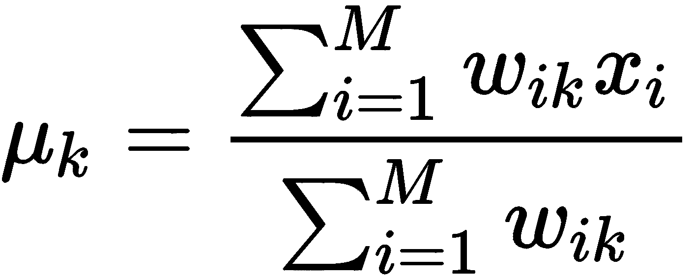

这表示我们根据前几步中创建的聚类均值重新计算质心。根据新的质心，我们根据每个观察值与质心的距离将数据集中的每个观察值分配给一个质心。距离是两个观察值之间相似度的度量。我们将在本节后面讨论如何计算距离的概念。我们重新计算新聚类的 WCSS 得分，并再次重复最小化步骤。我们重复这些步骤，直到聚类中观察值的分配不再改变。

尽管随机划分算法允许 k-means 算法以较低的 WCSS 得分发现质心，但它们并不能保证全局最优解。这是因为 EM 算法可能会贪婪地找到一个局部最优解并停止探索，以寻找更优的解。此外，在第一步中选择不同的随机质心可能会导致算法结束时得到不同的最优解。

为了解决这个问题，有其他算法，例如**Forgy 算法**，我们在第一步中选择数据集中的随机观察值作为质心。与随机划分算法相比，这导致第一步中的质心分布更分散。

正如我们之前讨论的，我们必须计算观察值和聚类质心之间的距离。有各种方法来计算这个距离。两种流行的方 法是**欧几里得距离**和**曼哈顿距离**。

# 欧几里得距离

两个点之间的欧几里得距离是连接它们的线段的长度。对于具有*n*个值的 n 维点*P*和*Q*，欧几里得距离使用以下公式计算：

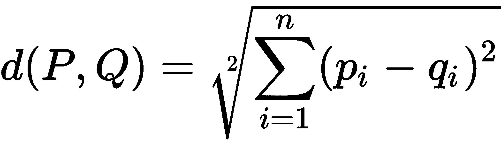

如果数据点的值是分类值，那么 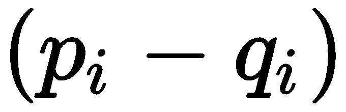 如果两个观测值对于某个特征具有相同的值则为 1，如果观测值具有不同的值则为 0。对于连续变量，我们可以计算属性值之间的归一化距离。

# 曼哈顿距离

曼哈顿距离是两个数据点之间绝对差值的总和。对于具有 *n* 个值的 n 维点 *P* 和 *Q*，我们使用以下公式计算曼哈顿距离：

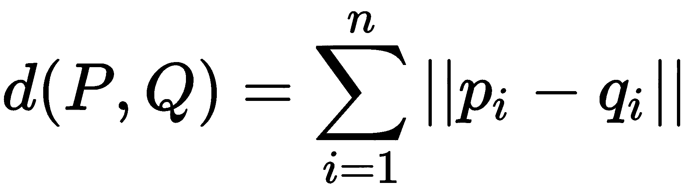

曼哈顿距离减少了数据中异常值的影响，因此，当我们有噪声数据且异常值很多时，应该使用曼哈顿距离。

# 层次聚类

**层次聚类**旨在从观测值构建聚类的层次结构。有两种生成层次结构的方法：

+   **聚合聚类**：在这种方法中，我们使用自下而上的方法，其中每个观测值最初是其自己的聚类，并在生成层次结构的每个阶段合并聚类。

+   **划分聚类**：在这种方法中，我们使用自上而下的方法，随着我们向下移动层次结构的阶段，我们将观测值划分为更小的聚类。

# 聚合聚类

在 **聚合聚类** 中，我们以每个观测值作为其自己的聚类开始，并根据某些标准将这些聚类合并，以便我们最终得到一个包含所有观测值的聚类。类似于 k-means 聚类，我们使用距离度量，如曼哈顿距离和欧几里得距离来计算两个观测值之间的距离。我们还使用 **连接标准**，它可以表示两个聚类之间的距离。在本节中，我们研究了三种连接标准，即 **完全连接聚类**、**单连接聚类**和**平均连接聚类**。

完全连接聚类计算两个聚类之间的距离为两个聚类中观测值的最大距离，表示如下：

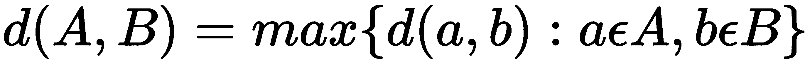

单连接聚类计算两个聚类之间的距离为两个聚类中观测值的最近距离，表示如下：

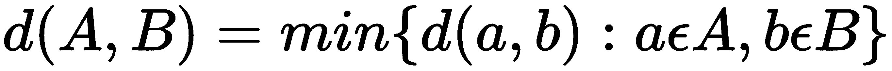

平均连接聚类计算来自聚类 A 的每个观测值与聚类 B 之间的距离，并根据聚类 A 和 B 中的观测值进行归一化。这表示如下：

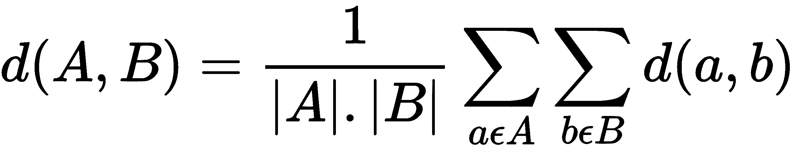

因此，在层次聚类法的第一步中，我们使用距离方法计算每个观测值之间的距离，并将距离最小的观测值合并。对于第二步，我们使用刚刚介绍的方法的链接标准来计算每个簇之间的距离。我们运行必要的迭代，直到只剩下一个包含所有观测值的簇。

下图显示了对于只有一个连续变量的观测值，聚合聚类将如何工作：

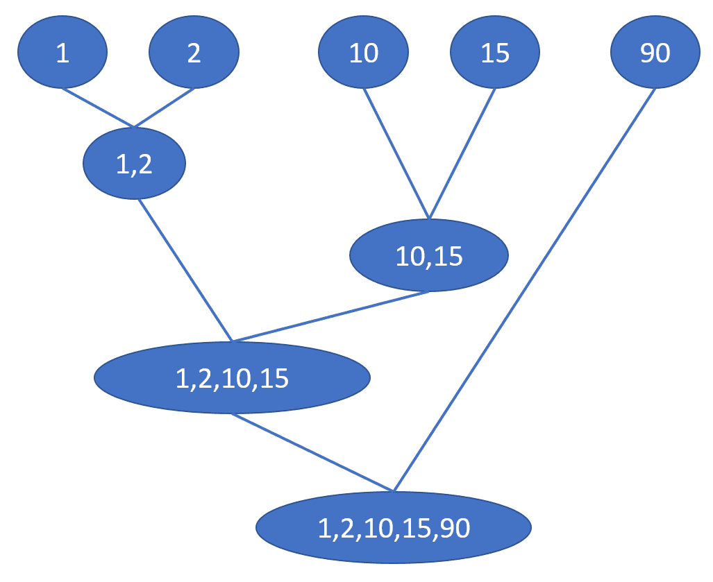

在这个例子中，我们有五个观测值和一个连续特征。在第一次迭代中，我们查看每个观测值之间的欧几里得距离，可以推断出记录 1 和 2 彼此最接近。因此，在第一次迭代中，我们将观测值 1 和 2 合并。在第二次迭代中，我们发现观测值 10 和 15 是最接近的记录，并从中创建一个新的簇。在第三次迭代中，我们观察到(1,2)簇和(10,15)簇之间的距离小于这些簇和观测值 90**。** 因此，我们在第三次迭代中创建了一个包含(1,2,10,15)的簇。最后，在最后一次迭代中，我们将元素 90 添加到簇中，并终止聚合聚类的过程。

# 分层聚类

**分层聚类**是一种自上而下的方法，我们首先从一个包含所有观测值的大簇开始，并在迭代过程中将簇分割成更小的簇。这个过程类似于使用距离和链接标准，如聚合聚类。目标是找到一个在较大簇中与簇内其他部分距离最远的观测值或簇。在每次迭代中，我们查看一个簇，并通过找到彼此之间距离最远的簇来递归地分割较大的簇。最后，当每个观测值都是其自己的簇时，停止这个过程。分层聚类使用穷举搜索在每个簇中找到完美的分割，这可能在计算上非常昂贵。

与 k-means 方法相比，层次聚类方法在计算上更昂贵。因此，即使在中等规模的数据集上，层次聚类方法可能比 k-means 方法更难以生成结果。然而，由于我们不需要在层次聚类的开始时从一个随机的分区开始，它们消除了 k-means 方法中的风险，即一个糟糕的随机分区可能会损害聚类过程。

# 在 EMR 上使用 Apache Spark 进行聚类

在本节中，我们将逐步创建一个聚类模型，该模型能够将消费者模式分为三个不同的簇。第一步将是启动一个 EMR 笔记本和一个小簇（由于我们选择的数据集不是很大，一个`m5.xlarge`节点就足够了）。只需遵循以下步骤：

1.  第一步是加载数据框并检查数据集：

```py
df = spark.read.csv(SRC_PATH + 'data.csv', 
                    header=True, 
                    inferSchema=True)
```

以下截图显示了我们的`df`数据框的前几行：

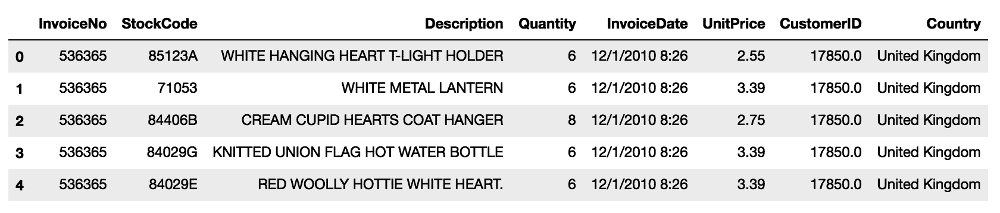

正如你所见，数据集涉及不同客户在不同时间、不同地点购买的产品交易。我们尝试通过查看三个因素来使用 k-means 对这些客户交易进行聚类：

+   产品（由`StockCode`列表示）

+   购买产品的国家

+   客户在所有产品上的总消费金额

注意，最后一个因素在数据集中不可直接获得，但它似乎是一个直观上有价值的特征（客户是否是大额消费者）。在特征准备过程中，我们经常需要找到汇总值并将它们插入到我们的数据集中。

1.  在这次事件中，我们首先通过将`Quantity`和`UnitPrice`列相乘来找到每个客户的总消费金额：

```py
df = df.selectExpr("*",
                   "Quantity * UnitPrice as TotalBought")
```

以下截图显示了我们的修改后的`df`数据框的前几行：

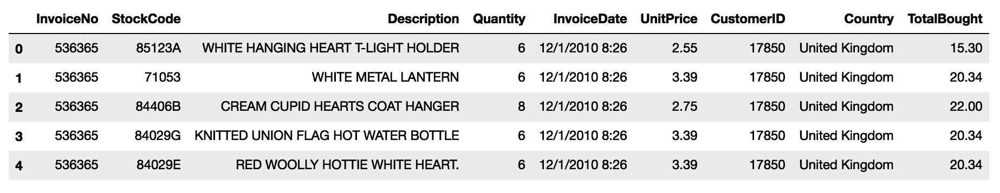

1.  然后，我们继续按客户聚合`TotalBought`列：

```py
customer_df = df.select("CustomerID","TotalBought")
   .groupBy("CustomerID")
   .sum("TotalBought")
   .withColumnRenamed('sum(TotalBought)','SumTotalBought')
```

以下截图显示了`customer_df`数据框的前几行：

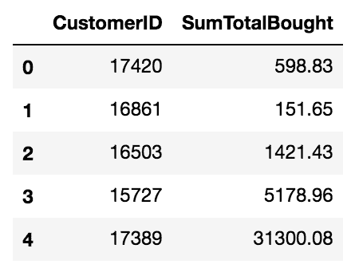

1.  然后，我们可以根据客户将这个新列重新连接到我们的原始数据集：

```py
from pyspark.sql.functions import *
joined_df = df.join(customer_df, 'CustomerId')
```

以下截图显示了`joined_df`数据框的前几行：

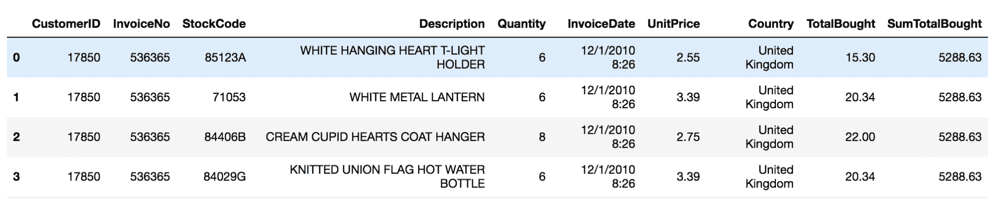

注意，我们感兴趣的用于聚类的两个特征（**国家**和**StockCode**）是分类的。因此，我们需要找到一种方法来编码这两个数字，类似于我们在上一章中所做的。在这种情况下，对这些特征进行字符串索引是不合适的，因为 k-means 通过计算数据点之间的距离来工作。分配给字符串值的人工索引之间的距离不包含很多信息。相反，我们对这些特征应用独热编码，以便向量距离表示有意义的含义（注意，两个在大多数向量组件上巧合的数据点具有接近 0 的余弦或欧几里得距离）。

我们的流程将包括两个独热编码步骤（用于**国家**和**产品**），以及一个表示客户是大额、正常还是小额消费者的列。为了确定这一点，我们使用`QuantileDiscretizer`将`SumTotalBought`列离散化为三个值，这将根据每个客户所在的分位数产生三个桶。我们使用向量组装器来编译特征向量。鉴于 k-means 算法通过计算距离来工作，我们规范化特征向量，以便第三个特征（支出桶）不会对距离有更高的影响，因为它在向量组件中有更大的绝对值。最后，我们的流程将运行 k-means 估计器。

1.  在以下代码块中，我们定义了流程的阶段并拟合了一个模型：

```py
from pyspark.ml import Pipeline
from pyspark.ml.clustering import KMeans
from pyspark.ml.feature import Normalizer
from pyspark.ml.feature import OneHotEncoder
from pyspark.ml.feature import QuantileDiscretizer
from pyspark.ml.feature import StringIndexer
from pyspark.ml.feature import VectorAssembler

stages = [ 
   StringIndexer(inputCol='StockCode', 
                 outputCol="stock_code_index", 
                 handleInvalid='keep'),
   OneHotEncoder(inputCol='stock_code_index', 
                 outputCol='stock_code_encoded'),
   StringIndexer(inputCol='Country', 
                 outputCol='country_index', 
                 handleInvalid='keep'),
   OneHotEncoder(inputCol='country_index', 
                 outputCol='country_encoded'),
   QuantileDiscretizer(numBuckets=3,
                       inputCol='SumTotalBought',
                       outputCol='total_bought_index'),
   VectorAssembler(inputCols=['stock_code_encoded', 
                              'country_encoded', 
                              'total_bought_index'],
                   outputCol='features_raw'),
   Normalizer(inputCol="features_raw",         
              outputCol="features", p=1.0),
   KMeans(featuresCol='features').setK(3).setSeed(42) ]

pipeline = Pipeline(stages=stages)
model = pipeline.fit(joined_df)
```

1.  一旦我们有了模型，我们就将该模型应用于我们的数据集以获得每个交易所属的簇：

```py
df_with_clusters = model.transform(joined_df).cache()
```

下面的截图显示了`df_with_clusters`数据框的前几行：

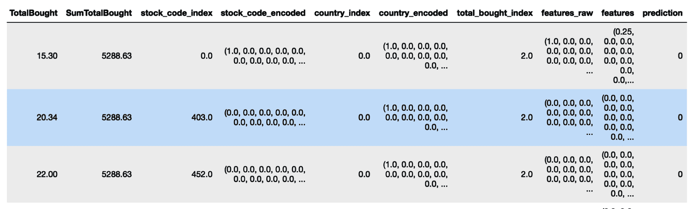

1.  注意新的**预测**列，它包含每行所属簇的值。我们使用轮廓指标评估簇的形成情况，该指标衡量数据点在其簇内与其他簇的相似性：

```py
from pyspark.ml.evaluation import ClusteringEvaluator

evaluator = ClusteringEvaluator()
silhouette = evaluator.evaluate(df_with_clusters)
```

在这个例子中，我们得到了 0.35 的值，这是一个平均的聚类分数（理想情况下它接近 1.0，但至少是正的）。没有更大值的主要原因是我们没有减少向量的维度。通常，在聚类之前，我们应用一些变换来减少特征向量的基数，例如**主成分分析**（**PCA**）。为了简化，我们没有在这个例子中包含这一步。

1.  现在，我们可以检查每个簇，以了解数据是如何聚类的。首先要注意的是每个簇的大小。正如我们下面可以看到的，簇的大小各不相同，其中一个簇捕获了超过一半的数据点：

```py
df_with_clusters
.groupBy("prediction")
.count()
.toPandas()
.plot(kind='pie',x='prediction', y='count')
```

下面的图显示了不同簇的相对大小：

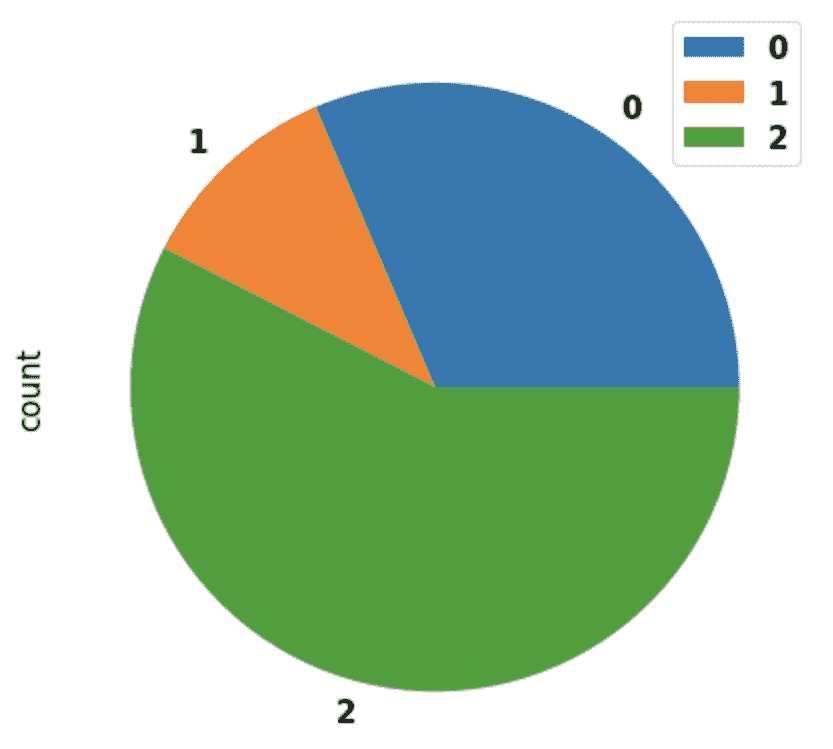

1.  如果我们查看每个簇包含的国家，我们可以看到有两个簇仅包含来自英国的数据点，第三个簇只包含来自其他国家的数据点。我们首先检查簇 0 的计数：

```py
df_with_clusters \
.where(df_with_clusters.prediction==0) \
.groupBy("Country") \
.count() \
.orderBy("count", ascending=False) \
.show()

+--------------+------+
| Country      | count|
+--------------+------+
|United Kingdom|234097|
+--------------+------+
```

同样，显示簇 1 的计数：

```py
df_with_clusters \
.where(df_with_clusters.prediction==1) \
.groupBy("Country") \
.count() \
.orderBy("count", ascending=False) \
.show()

+--------------+------+
| Country .    | count|
+--------------+------+
|United Kingdom|127781|
+--------------+------+
```

最后，显示簇 2 的计数：

```py
df_with_clusters \
.where(df_with_clusters.prediction==2) \
.groupBy("Country") \
.count() \
.orderBy("count", ascending=False) \
.show()

+---------------+-----+
| Country       |count|
+---------------+-----+
| Germany       | 9495|
| France        | 8491|
.
.
| USA           | 291 |
+---------------+-----+
```

1.  一个有趣的观察是，不同的簇似乎有非常不同的消费模式：

```py
pandas_df = df_with_clusters \
   .limit(5000) \
   .select('CustomerID','InvoiceNo','StockCode',
           'Description','Quantity','InvoiceDate',
           'UnitPrice','Country','TotalBought',
            'SumTotalBought','prediction') \
   .toPandas()

pandas_df.groupby('prediction') \
.describe()['SumTotalBought']['mean'] \
.plot(kind='bar', 
      title = 'Mean total amount bought per cluster')
```

前面的`plot()`命令生成了以下图：

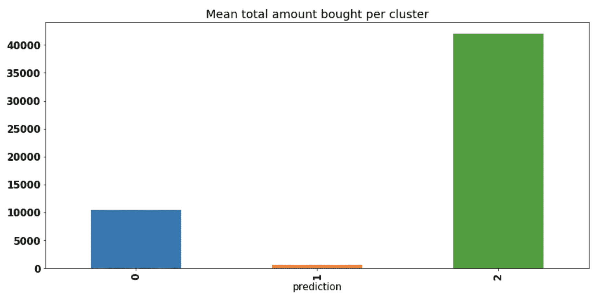

1.  为了了解每个簇如何分类产品，我们查看不同簇的产品描述字段。一个很好的视觉表示是使用词云，其中包含每个簇产品描述中出现的单词。使用 Python 的`wordcloud`库，我们可以创建一个函数，该函数去除产品的单词并构建一个词云：

```py
import itertools
import re
from functools import reduce
import matplotlib.pyplot as plt
from wordcloud import WordCloud, STOPWORDS

def plot_word_cloud(description_column):
   list_of_word_sets = description_column \
        .apply(str.split) \
        .tolist()
   text = list(itertools.chain(*list_of_word_sets))
   text = map(lambda x: re.sub(r'[^A-Z]', r'', x), text)
   text = reduce(lambda x, y: x + ' ' + y, text)
   wordcloud = WordCloud(
       width=3000,
       height=2000,
       background_color='black',
       stopwords=STOPWORDS,
       collocations=False).generate(str(text))
   fig = plt.figure(
       figsize=(10, 5),
       facecolor='k',
       edgecolor='k')
   plt.imshow(wordcloud, interpolation='bilinear')
   plt.axis('off')
   plt.tight_layout(pad=0)
   plt.show()
```

1.  我们在每个簇上调用此函数并得到以下结果：

```py
plot_word_cloud(pandas_df[pandas_df.prediction==0].Description)
```

簇 0 的结果词云如下：


1.  看看下面的代码：

```py
plot_word_cloud(pandas_df[pandas_df.prediction==1].Description)
```

簇 1 的结果词云如下：


看看下面的代码：

```py
plot_word_cloud(pandas_df[pandas_df.prediction==2].Description)
```

簇 2 的结果词云如下：


我们可以在词云中看到，尽管有一些非常常见的单词，但像*C*hristmas*或*retrospot*这样的几个单词的相对重要性在簇中的一个权重更高。

# 在 EMR 上使用 Spark 和 SageMaker 进行聚类

在本节中，我们将展示 **Spark** 和 **SageMaker** 如何通过代码集成无缝协作。

在上一章关于决策树的内容中，我们通过 Apache Spark 进行数据准备，通过 **EMR** 上传准备好的数据到 S3，然后使用 `SageMaker` Python 库打开 SageMaker 笔记本实例以执行训练。有一种做同样事情的不同方法，在很多情况下更为方便，那就是使用 `sagemaker_pyspark` 库。这个库允许我们通过在我们的管道中添加一个特殊阶段，通过 SageMaker 服务执行训练阶段。为此，我们将定义一个与上一节中写的管道相同的管道，区别在于最后一个阶段。

我们将使用 `KMeansSageMakerEstimator` 而不是包含 Apache Spark 的 `KMeans` 实现：

1.  首先，我们将导入所有必要的依赖项：

```py
from pyspark.ml import Pipeline
from pyspark.ml.clustering import KMeans
from pyspark.ml.feature import Normalizer
from pyspark.ml.feature import OneHotEncoder
from pyspark.ml.feature import QuantileDiscretizer
from pyspark.ml.feature import StringIndexer
from pyspark.ml.feature import VectorAssembler
from sagemaker_pyspark import IAMRole
from sagemaker_pyspark.algorithms import KMeansSageMakerEstimator
```

1.  接下来，我们首先定义要使用的 IAM 角色和完整管道：

```py
role = 'arn:aws:iam::095585830284:role/EMR_EC2_DefaultRole'

kmeans = KMeansSageMakerEstimator(
  sagemakerRole=IAMRole(role),
  trainingInstanceType="ml.m4.xlarge",
  trainingInstanceCount=1,
  endpointInstanceType="ml.m4.xlarge",
  endpointInitialInstanceCount=1)
kmeans.setK(3)
kmeans.setFeatureDim(3722)

stages = [
   StringIndexer(inputCol='StockCode', outputCol="stock_code_index", handleInvalid='keep'),
   OneHotEncoder(inputCol='stock_code_index', outputCol='stock_code_encoded'),
   StringIndexer(inputCol='Country', outputCol='country_index', handleInvalid='keep'),
   OneHotEncoder(inputCol='country_index', outputCol='country_encoded'),
   QuantileDiscretizer(numBuckets=3, inputCol='SumTotalBought',outputCol='total_bought_index'),
   VectorAssembler(inputCols=['stock_code_encoded', 'country_encoded', 'total_bought_index'],
                   outputCol='features_raw'),
   Normalizer(inputCol="features_raw", 
              outputCol="features", p=1.0),
              kmeans ]

pipeline = Pipeline(stages=stages)
model = pipeline.fit(joined_df)
```

`KMeansSageMakerEstimator` 实现了 Apache Spark 的估算器接口，因此它被包含在我们的管道上的任何其他估算器或转换器中。通过 `KMeansSageMakerEstimator` 构造函数，我们定义要使用的机器的数量和类型以及 IAM 角色。我们将在下一小节中解释该角色的目的，*理解 IAM 角色的目的*。此外，我们设置我们想要创建的集群数量（*k* 的值）以及我们将用于训练的向量的长度（我们通过检查上一节输出的行来找到它）。

让我们看看当我们对管道调用 `fit()` 时幕后发生了什么。管道的前一部分工作方式与之前完全相同，即不同的阶段启动 Spark 作业，通过添加列（例如，编码向量或离散特征）对数据集执行一系列转换。最后一个阶段，作为一个 SageMaker 估算器，工作方式略有不同。它不是使用 EMR 集群资源来计算和训练聚类模型，而是将数据保存到 S3，并通过指向该 S3 临时位置的 API 调用 SageMaker KMeans 服务。SageMaker 服务随后启动 EC2 服务器以执行训练，并创建一个 SageMaker 模型和端点。一旦训练完成，`KMeansSageMakerEstimator` 存储对新创建的端点的引用，每次调用模型的 `transform()` 方法时都会使用该端点。

您可以通过检查 SageMaker AWS 控制台在 [`console.aws.amazon.com/sagemaker/`](https://console.aws.amazon.com/sagemaker/) 来找到由 `KMeansSageMakerEstimator` 创建的模型和端点。

现在，按照以下步骤操作：

1.  让我们来看看当我们调用管道的 `transform()` 方法时会发生什么：

```py
df_with_clusters = model.transform(joined_df)
```

第一组转换（数据准备阶段）将通过 Spark 作业在 EMR 集群上运行。作为最终转换的 SageMaker 模型依赖于 SageMaker 端点来获取预测（在我们的案例中，是集群分配）。

应该记住，一旦不再需要，就要删除端点（例如使用控制台）。

1.  然后，运行以下代码：

```py
df_with_clusters.show(5)
```

看看下面的截图：

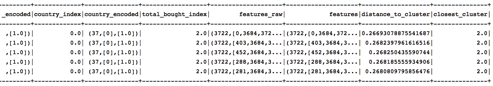

*(*图片已被截断，仅显示最后几列.*)*

注意，`distance_to_cluster`和`closest_cluster`管道是如何添加这两个列的。

1.  通过指示集群评估器使用此列，我们可以评估聚类能力：

```py
evaluator = ClusteringEvaluator()
evaluator.setPredictionCol("closest_cluster")
silhouette = evaluator.evaluate(df_with_clusters)
```

我们得到的轮廓值几乎与使用 Spark 算法得到的一样。

# 理解 IAM 角色的目的

SageMaker 是 AWS 上的一种托管服务，负责管理训练和推理所需的硬件。为了使 SageMaker 能够代表您执行此类任务，您需要通过 IAM 配置允许它。例如，如果您在 EMR 上运行，集群中的 EC2 实例（即计算机）正在运行具有特定角色的配置。您可以通过访问 EMR 控制台上的集群页面来找到此角色：[`console.aws.amazon.com/elasticmapreduce/`](https://console.aws.amazon.com/elasticmapreduce/)

以下截图显示了集群的详细信息，包括安全和访问信息：

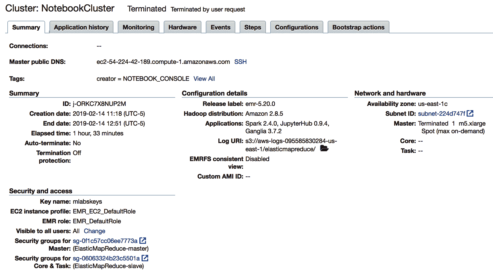

在之前的截图中的 EC2 实例配置文件下的角色就是我们正在使用的，即`EMR_EC2_DefaultRole`。

然后，我们转到 IAM 控制台[`console.aws.amazon.com/iam/home`](https://console.aws.amazon.com/iam/home)来编辑该角色的权限，以授予对 SageMaker 资源的访问权限，并允许该角色被假定：

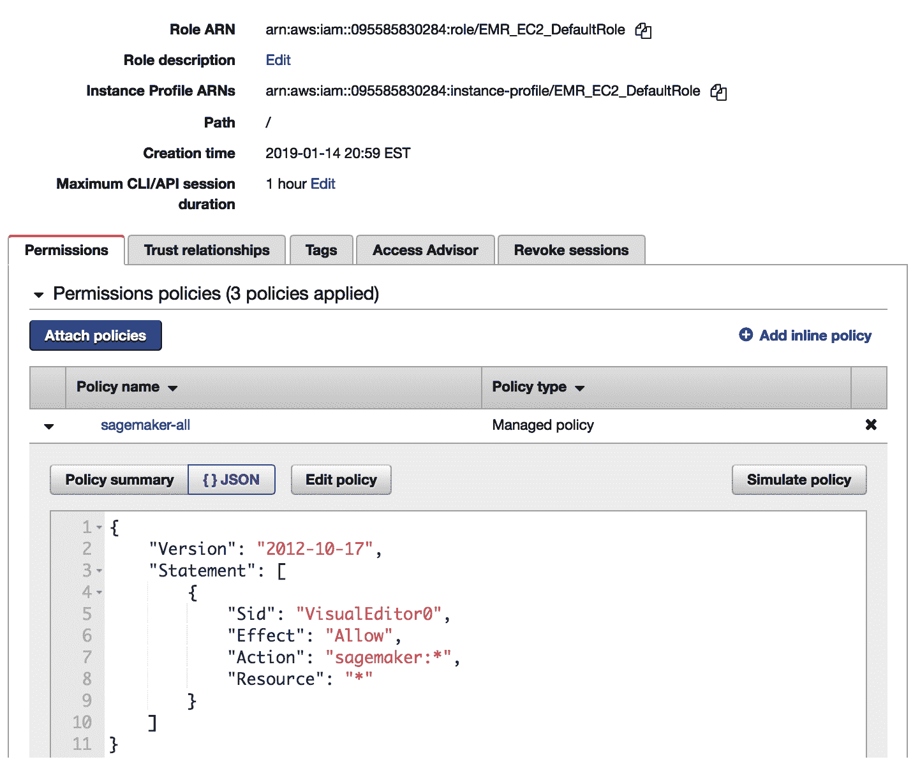

在信任关系部分，我们点击编辑信任关系按钮以打开对话框，允许我们添加设置：

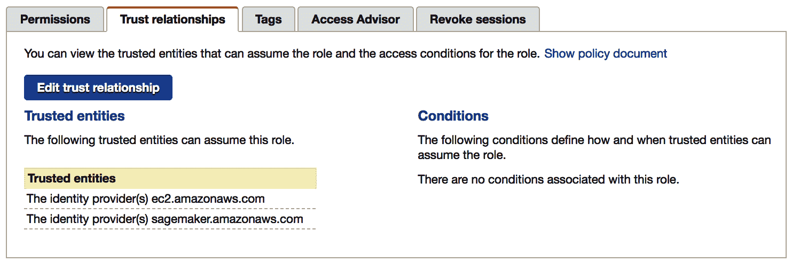

您可以如下编辑并允许角色被假定：

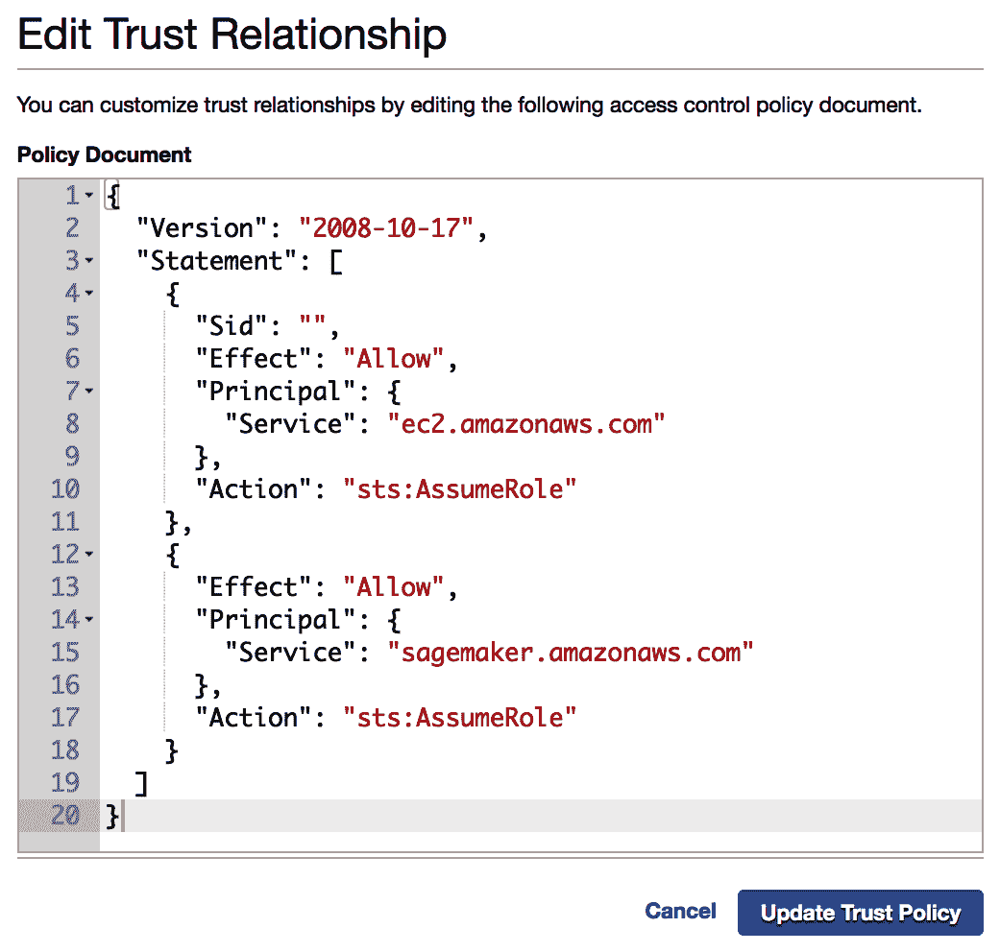

之前的更改是必要的，以便我们的 EMR 集群能与 SageMaker 通信，并启用本节中描述的集成类型。

# 摘要

在本章中，我们研究了监督学习和无监督学习之间的区别，并探讨了无监督学习应用的情况。我们研究了无监督学习的探索性分析应用，其中使用了聚类方法。我们详细研究了 k-means 聚类和层次聚类方法，并探讨了它们的应用示例。

我们还研究了如何在 AWS 集群上实现 Apache Spark 的聚类方法。根据我们的经验，聚类任务通常在较大的数据集上完成，因此，对于此类任务考虑集群的设置是很重要的。我们在本章中讨论了这些细微差别。

作为数据科学家，我们遇到过很多只为了从数据中提取价值而分析数据的情况。在这些情况下，你应该考虑聚类方法，因为它将帮助你理解数据中的固有结构。一旦你发现了数据中的模式，你就可以通过数据排列的事件和类别来识别事件和类别。一旦你建立了你的聚类，你还可以根据它可能属于哪个聚类来评估任何新的观察，并预测该观察将表现出与聚类中其他观察相似的行为。

在下一章中，我们将探讨一个非常有趣的问题：如何通过找到相似用户认为相关的产品来通过机器学习进行推荐。

# 练习

1.  与层次聚类相比，你会在什么情况下应用 k-means 算法？

1.  正常的 Spark 估计器与调用 SageMaker 的估计器之间有什么区别？

1.  对于训练时间太长的数据集，为什么使用 SageMaker 估计器启动此类作业不是一个好主意？

1.  研究并建立其他用于聚类评估的替代指标。

1.  为什么在为 k-means 编码特征时，字符串索引不是一个好主意？
