# 第六章：通过分析游客模式来制定推荐

本章将专注于基于游客参加的主题公园景点寻找相似游客的问题，以制定改进的营销推荐。我们将介绍协同过滤方法，并通过示例展示如何在 Apache Spark（EMR）和通过 AWS SageMaker 内置算法中训练和获取定制推荐。许多公司利用我们在本章中描述的算法类型来通过推荐与类似客户相关联的产品来提高客户的参与度。

在本章中，我们将涵盖以下主题：

+   通过 Flickr 数据推荐主题公园景点

+   通过 Apache Spark 的交替最小二乘法寻找推荐

+   通过 SageMaker 因子分解机推荐景点

# 通过 Flickr 数据推荐主题公园景点

在本章中，我们将使用来自[`sites.google.com/site/limkwanhui/datacode`](https://sites.google.com/site/limkwanhui/datacode)的数据集，该数据集包含在不同地点拍照的用户上传的 Flickr 数据，这些照片随后被映射到已知的主题公园景点。Flickr 是一个图像托管服务。假设 Flickr 希望在他们的移动应用上创建一个插件，当用户在各个景点拍照时，能够识别用户偏好并提供可能对他们感兴趣的其它景点的推荐。

让我们再假设用户在特定景点拍摄的照片数量是他们对该景点兴趣的一个指标。我们的目标是分析包含*用户 ID、景点、拍摄照片数量*的三元组数据集，以便给定用户访问的任意景点集合，模型能够推荐类似用户发现有趣的景点。

# 协同过滤

协同过滤是一种基于分析大量用户行为来向用户提供推荐的过程。我们在日常生活中的大量应用中观察到这种算法的影响。例如，当你使用流媒体服务，如 Netflix 或 YouTube 时，它会根据你的观看历史推荐你可能感兴趣的视频。社交媒体，如 Twitter 和 LinkedIn，会根据你的当前联系人建议你关注或连接的人。Instagram 和 Facebook 等服务会根据你阅读或赞过的帖子来编辑你朋友的帖子，并定制你的时间线。作为一名数据科学家，当你在基于大量用户数据构建推荐系统时，协同过滤算法非常有用。

协同过滤可以在数据集上有多种实现方式。在本章中，我们将讨论基于记忆的方法和基于模型的方法。

# 基于记忆的方法

在基于记忆的方法中，我们分两个阶段生成推荐。考虑这样一种情况，即我们试图根据用户的兴趣为特定用户生成推荐。在第一阶段，我们根据兴趣发现与给定用户相似的用户。我们根据用户与给定用户的相似程度对所有用户进行排名。在第二阶段，我们在与给定用户最相似的用户组中找到最感兴趣的兴趣点。这些顶级兴趣根据它们与顶级用户集的相似性进行排名。然后，这个按排名排列的兴趣列表被呈现给原始用户作为推荐。

例如，在电影推荐的过程中，我们查看用户感兴趣或最近观看的电影，并发现观看过类似电影的其他用户。基于相似用户的高排名列表，我们查看他们最近观看的电影，并根据与排名用户列表的相似性进行排名。然后，将排名最高的电影作为推荐呈现给用户。

为了找到用户之间的相似性，我们使用称为相似度度量的函数。相似度度量在搜索引擎中广泛用于对查询词和文档之间的相似性进行排序。在本节中，我们讨论了余弦相似度度量，它在协同过滤中常用。我们将每个用户的兴趣视为一个向量。为了发现具有相似兴趣的用户，我们计算两个用户兴趣向量之间的余弦角。它可以表示如下：

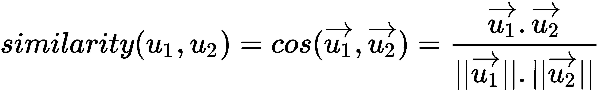

根据给定用户与数据集中所有用户的相似性，我们选择前 k 个用户。然后，我们聚合所有用户的兴趣向量，以发现顶级兴趣并推荐给用户。

注意，基于记忆的模型不使用前几章中讨论的任何建模算法。它们仅依赖于简单的算术来根据用户的兴趣为用户生成推荐。

# 基于模型的方法

对于基于模型的方法，我们使用机器学习技术训练一个模型，该模型可以预测每个兴趣与给定用户的相关概率。可以应用各种算法，如贝叶斯模型或聚类模型，用于基于模型的协同过滤。然而，在本章中，我们专注于基于矩阵分解的方法。

# 矩阵分解

矩阵分解方法通过分解用户和用户兴趣的矩阵来工作。在本方法中，我们将用户数据和关于兴趣的信息映射到一组因子。用户对兴趣的评分是通过计算用户和兴趣的向量评分的点积来计算的。这些因子可以从用户评分或从算法中关于兴趣的外部信息中推断出来。

例如，考虑一个矩阵，其中一个维度代表用户，另一个维度代表用户已评分的电影：

|  | **复仇者联盟** | **勇敢者游戏** | **蜘蛛侠** |
| --- | --- | --- | --- |
| 用户 1 | 4 |  | 4 |
| 用户 2 | 1 | 5 | 2 |
| 用户 n | 5 | 2 | 4 |

矩阵中的值是用户提供的评分。矩阵分解方法将电影映射到更短的向量，这些向量代表概念，例如电影的类型。这些向量被称为潜在因素。我们将电影映射到类型，并根据用户对每个类型的电影评分来映射用户感兴趣的类型。使用这些信息，我们可以根据两个向量之间的点积（将用户对类型的兴趣乘以电影属于类型的可能性）来计算用户和电影之间的相似性。因此，矩阵中的未知评分可以通过通过将用户和兴趣合并到更粗粒度的项目（即类型）来使用已知评分的知识进行预测。在我们的前一个例子中，我们假设我们已经有了一个已知的电影到类型的映射。然而，我们不能假设我们总是有显式数据来生成这样的映射到潜在因素。

因此，我们探索可以基于数据自动生成此类映射的方法。因此，矩阵分解模型需要能够通过潜在因素向量在用户和兴趣之间生成映射。为了确保我们可以生成用户潜在因素和项目潜在因素之间的点积，潜在因素长度被设置为固定值。每个兴趣项目，，由一个向量，，表示，每个用户，，由一个向量，，表示。向量和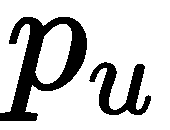都是从数据中导出的潜在因素。用户对项目的评分，，对用户的评分，，表示如下：

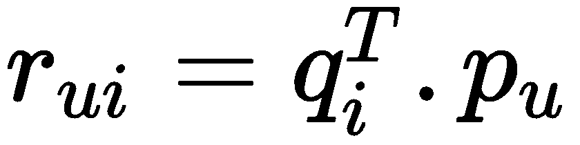

通常，如果我们已经从用户到兴趣的部分评分集合，我们可以使用它来建模其他用户和兴趣之间的评分。我们使用优化技术来计算这个。我们的目标是预测和的值。因此，我们通过最小化预测这些向量时使用的已知评分的正则化误差来实现这一点。这可以用以下公式表示：

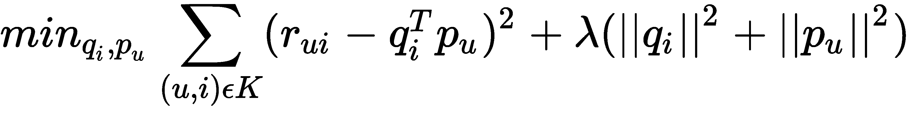

在这里，*k* 是一个包含  的集合，其中已知的评分 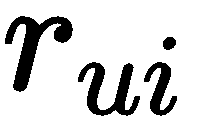。现在，让我们看看两种最小化前面方程的方法。

# 随机梯度下降

我们在第三章，“使用回归算法预测房屋价值”中研究了随机梯度下降算法，关于线性回归。类似的方法用于最小化预测每个用户和兴趣的正确潜在因子的函数。我们使用迭代方法，在每次迭代中，我们根据所有已知的评分计算预测  和  的误差：


根据误差的大小，我们更新  和  的值，方向与误差相反：

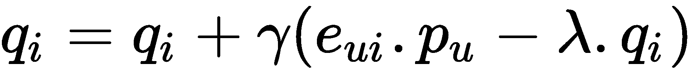

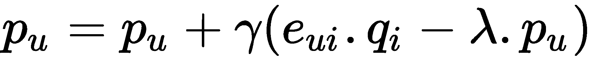

当  和  的值收敛后，我们停止迭代。随机梯度下降也用于如**因子分解机**（**FMs**）等算法中，它使用它来计算向量的值。FMs 是 **支持向量机**（**SVM**）模型的变体，可以在协同过滤框架中应用。我们在这本书中不会详细解释支持向量机或 FMs，但鼓励你了解它们是如何工作的。

# 交替最小二乘法

最小化预测 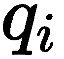 和  值的优化函数的一个挑战是，方程不是凸的。这是因为我们试图同时优化两个值。然而，如果我们为其中一个值使用常数，或者  或 ，我们可以为另一个变量最优地解决方程。因此，在交替最小二乘技术中，我们交替地将  和  的值设为常数，同时优化另一个向量。

因此，在第一步中，我们为两个向量设定了基础值。假设其中一个值是常数，我们使用线性规划来优化另一个向量。在下一步中，我们将优化向量的值设为常数，并优化另一个变量。我们不会解释如何使用线性规划来优化二次问题，因为这是一个完整的研究领域，并且超出了本书的范围。这种方法将优化每个向量，直到收敛。

随机梯度下降的优点是它比 ALS 方法更快，因为它在修改向量时基于错误比例预测每个步骤中每个向量的值。然而，在 ALS 方法中，系统独立地计算每个向量的值，因此导致更好的优化。此外，当矩阵密集时，梯度下降方法必须从每一组数据中学习，这使得它比 ALS 方法效率更低。

# 通过 Apache Spark 的 ALS 找到推荐

在本节中，我们将通过 Apache Spark 使用**交替最小二乘法**（**ALS**）创建推荐的过程。

# 数据收集和探索

第一步是从[`sites.google.com/site/limkwanhui/datacode`](https://sites.google.com/site/limkwanhui/datacode)下载数据。我们将使用`poiList-sigir17`数据集，其中包含用户在不同主题公园景点（由 Flickr 识别为兴趣点）拍摄的图片。我们感兴趣的以下两个数据集：

+   该兴趣点列表，它捕捉了每个景点的名称和其他属性：

```py
poi_df = spark.read.csv(SRC_PATH + 'data-sigir17/poiList-sigir17', 
                        header=True, inferSchema=True, sep=';')
```

以下截图显示了`poi_df`数据框的前几行：

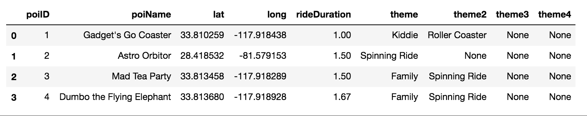

+   Flickr 用户在不同兴趣点拍摄的图片：

```py
visits_path = SRC_PATH+'data-sigir17/userVisits-sigir17'
visits_df = spark.read.csv(visits_path, 
                           header=True,
                           inferSchema=True, sep=';')
```

以下截图显示了`visits_df`数据框的一个样本：

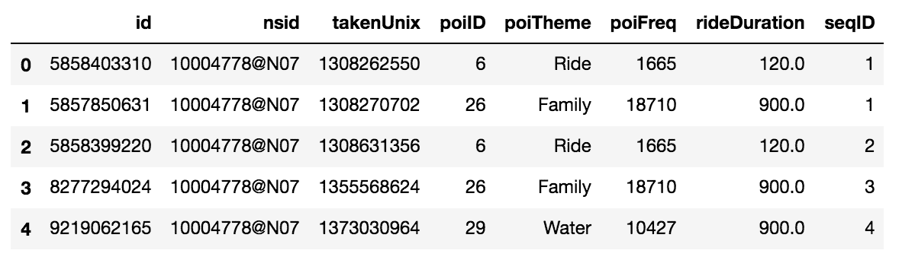

在这个数据集中，我们将使用`nsid`字段（表示拍照的用户）和`poiID`，它表示拍照时实际访问的兴趣点或景点。为了我们的目的，我们将忽略其余的字段。

让我们对我们的数据集做一些基本的检查。数据集大约有 30 万行数据。通过抽取 1000 个条目的样本，我们可以看到有 36 个独特的 Flickr 用户：

```py
sample_df = visits_df.limit(1000).toPandas()
sample_df.describe()
```

前一个`describe()`命令的输出如下：

```py
count 1000
 unique 36
 top 10182842@N08
 freq 365
```

这很重要，因为我们需要每个用户有足够多的条目来确保我们有足够的信息关于用户来做出预测。此外，了解用户是否访问了不同的景点实际上更为相关。Apache Spark 的一个优点是，可以使用 SQL 在数据集上工作。使用 SQL 轻松地找到用户平均看到的独特景点的数量。

为了使用 SQL，我们首先需要给数据集一个表名。这是通过注册一个临时表来完成的：

```py
poi_df.createOrReplaceTempView('points')
visits_df.createOrReplaceTempView('visits')
```

一旦我们注册了表，我们就可以进行查询，例如找到独特景点的数量：

```py
spark.sql('select distinct poiID from visits').count()
31
```

或者我们可以将 SQL 与其他数据集操作相结合，例如`.describe()`：

```py
spark.sql('select nsid,count(distinct poiID) as cnt from visits group by nsid').describe().show()
```

以下截图包含了`show()`命令输出的结果：

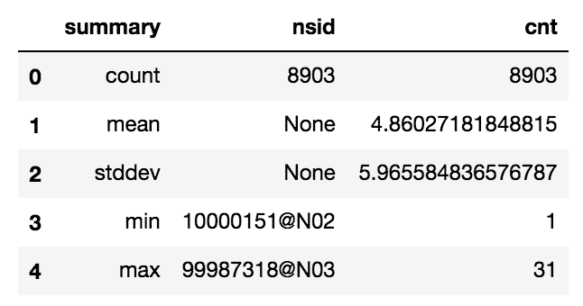

前面的 SQL 命令找出每个用户访问的独特景点的数量。`describe`数据集操作找出这些用户的统计数据，这告诉我们，平均而言，用户访问大约五个不同的地点。这很重要，因为我们需要每个用户有足够的景点，以便能够正确识别用户模式。

同样，我们应该查看用户在每个地点拍摄的照片数量，以验证实际上我们可以使用拍摄照片的数量作为用户兴趣的指标。我们通过以下命令来完成：

```py
spark.sql('select nsid,poiID,count(*) from visits group by nsid,poiID').describe().show()
```

前面命令的输出如下所示：

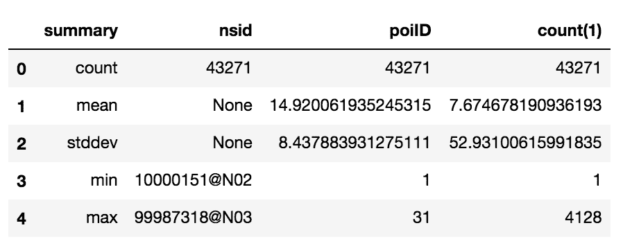

SQL 命令计算每个用户和景点的条目数量，然后我们使用`describe`找到统计摘要。因此，我们可以得出结论，平均而言，每个用户在每个访问的地点大约拍摄八张照片。

# 训练模型

为了训练我们的模型，我们将构建一个数据集，该数据集计算每个用户在每个地点拍摄的照片数量：

```py
train_df = spark.sql('select hash(nsid) as user_hash_id, poiID, count(*) as pictures_taken from visits group by 1,2')
```

以下截图显示了`train_df`数据框的前几行：

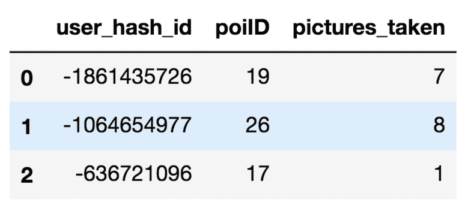

我们对用户进行哈希处理，因为 ALS 训练器只支持数值作为特征。

要训练模型，我们只需构建一个 ALS 实例，并提供用户列、项目列（在这种情况下是景点 ID）和评分列（在这种情况下，`pictures_takes`用作评分的代理）。`coldStartStrategy`设置为丢弃，因为我们不感兴趣为数据集中不存在（即，预测此类条目将被丢弃而不是返回 NaN）的用户或景点进行预测：

```py
from pyspark.ml.recommendation import ALS

recommender = ALS(userCol="user_hash_id", 
                  itemCol="poi_hash_id", 
                  ratingCol="pictures_taken", 
                  coldStartStrategy="drop")

model = recommender.fit(train_df)
```

# 获取推荐

一旦我们构建了一个模型，我们就可以为我们数据集中的所有用户生成预测：

```py
recommendations = model.recommendForAllUsers(10)
```

前面的命令将为每个用户选择前 10 个推荐。请注意，由于 ALS 的工作方式，它实际上可能会推荐用户已经访问过的景点，因此我们需要在我们的目的中丢弃这些推荐，正如我们稍后将要看到的。

推荐看起来如下：

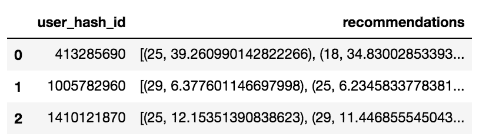

每个用户都会得到一个包含推荐景点以及推荐得分的元组列表。在这种情况下，得分代表我们预计每个用户在推荐地点会拍摄的照片数量。尽管模型只提供景点的 ID，但我们想检查其中的一些推荐，以确保它们是好的。为了做到这一点，我们将通过收集查询结果来构建一个 ID 到景点名称（兴趣点名称）的字典，该查询找出每个景点在景点表中的名称：

```py
row_list = spark.sql('select distinct p.poiName, p.poiID from visits v join points p on (p.poiID=v.poiID) ').collect()
id_to_poi_name = dict(map(lambda x: (x.poiID, x.poiName), row_list))
```

地图包含以下条目：

```py
{1: 'Test Track',
 10: 'Golden Zephyr',
 19: "Tarzan's Treehouse",
 22: 'Country Bear Jamboree'
 ....
 }
```

对于每个用户，我们希望移除已访问地点的推荐并输出推荐。为此，我们需要处理每行的元组列表。Apache Spark 通过允许用户创建自定义 SQL 函数或**用户定义函数**（**UDFs**）提供了一种方便的方式来做到这一点。我们将定义并注册一个 UDF，它能够通过使用前面的映射提取每个推荐景点的名称：

```py
def poi_names(recommendations, visited_pois):
   visited_set = set([id_to_poi_name[poi] for poi in visited_pois])
   recommended = str([(id_to_poi_name[poi], weight) \
                      for (poi,weight) in recommendations
                      if id_to_poi_name[poi] not in visited_set])
   return "recommended: %s ; visited: %s "%(recommended, visited_set)

spark.udf.register("poi_names", poi_names)
```

`poi_names`函数接收用户的推荐元组以及访问的景点，然后返回一个包含所有未在访问集合中的推荐景点名称以及已访问景点枚举的字符串。

然后，我们将推荐注册为一个表，以便在下一个查询中使用：

```py
recommendations.createOrReplaceTempView('recommendations')

recommendation_sample = spark.sql('select user_hash_id, collect_list(poiID), poi_names(max(recommendations), collect_list(poiID)) as recommendation from recommendations r join visits v on (r.user_hash_id = hash(v.nsid)) group by 1')\
   .sample(fraction=0.1, withReplacement=False) \
   .collect()

```

前面的查询将用户推荐表与访问表连接，通过用户进行连接，收集每个用户访问的所有兴趣点，并通过 UDF 输出推荐的景点以及已访问景点的名称。我们采样并收集一些表实例以进行检查。在配套的笔记本中，我们可以观察到以下条目：

```py
print(recommendation_sample[0].recommendation)

recommended: [("It's A Small World", 31.352962493896484), ('Walt Disney World Railroad', 23.464025497436523), ('Pirates of the Caribbean', 21.36219596862793), ('Buzz Lightyear Astro Blasters', 17.21680450439453), ('Haunted Mansion', 15.873616218566895), ('Country Bear Jamboree', 9.63521957397461), ('Astro Orbiter', 9.164801597595215), ('The Great Movie Ride', 8.167647361755371)] ; visited: {"California Screamin'", 'Sleeping Beauty Castle Walkthrough', 'Voyage of The Little Mermaid', "Tarzan's Treehouse", 'Main Street Cinema', 'The Many Adventures of Winnie the Pooh', 'Jungle Cruise', 'Tom Sawyer Island', 'Test Track', 'The Twilight Zone Tower of Terror'}
```

我们可以观察到这位用户访问了许多类似冒险的景点，模型推荐了更多。在这里，读者可以检查更多推荐：

```py
print(recommendation_sample[200].recommendation)

recommended: [('Splash Mountain', 0.9785523414611816), ('Sleeping Beauty Castle Walkthrough', 0.8383632302284241), ("Pinocchio's Daring Journey", 0.7456990480422974), ('Journey Into Imagination With Figment', 0.4501221477985382), ("California Screamin'", 0.44446268677711487), ('Tom Sawyer Island', 0.41949236392974854), ("It's A Small World", 0.40130260586738586), ('Astro Orbiter', 0.37899214029312134), ('The Twilight Zone Tower of Terror', 0.3728359639644623)] ; visited: {"Snow White's Scary Adventures"}

print(recommendation_sample[600].recommendation)

recommended: [('Fantasmic!', 20.900590896606445), ('Pirates of the Caribbean', 9.25596809387207), ("It's A Small World", 8.825133323669434), ('Buzz Lightyear Astro Blasters', 5.474684715270996), ('Main Street Cinema', 5.1001691818237305), ('Country Bear Jamboree', 4.3145904541015625), ("California Screamin'", 3.717888832092285), ("It's A Small World", 3.6027705669403076), ('The Many Adventures of Winnie the Pooh', 3.429044246673584)] ; visited: {'Haunted Mansion', 'The Twilight Zone Tower of Terror', 'Journey Into Imagination With Figment'}
```

# 通过 SageMaker 因子分解机推荐景点

当涉及到非常稀疏的输入时，FM（因子分解机）是制作推荐中最广泛使用的算法之一。它类似于我们在基于模型的矩阵分解方法下讨论的**随机梯度下降**（**SGD**）算法。在本节中，我们将展示如何使用 AWS 内置的 FM 算法实现来为我们主题公园的游客获取推荐。

# 准备学习数据集

为了使用这样的算法，我们需要以不同的方式准备我们的数据集。我们将推荐问题设定为一个回归问题，其中输入是一个用户和吸引力的配对，输出是这个用户对吸引力的预期兴趣水平。训练数据集必须包含每个用户和吸引力配对的实际经验兴趣（通过拍照数量衡量）。有了这些数据，FM 模型就能预测任何用户对任意吸引力的兴趣。因此，为了获得用户的推荐，我们只需找到那些能产生最高预测兴趣水平的吸引力列表。

**那么我们如何在数据集中编码用户和景点呢？**

由于 FM 在处理高维特征方面非常出色，我们可以对输入进行 one-hot 编码。由于有 8,903 个用户和 31 个景点，我们的输入向量长度将为 8,934，其中前 31 个向量分量将对应于 31 个不同的景点，其余位置对应于每个用户。向量除了对应于用户和景点的位置外，其余位置都将为零。我们模型中使用的目标特征（标签）将是兴趣水平，我们将通过根据相应的分位数对拍照数量进行归一化将其离散化到 1 到 5 的值。

下图显示了这样一个训练数据集可能的样子：

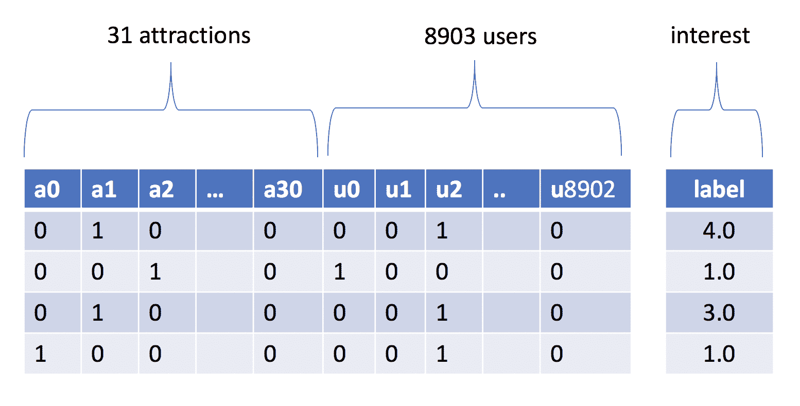

如您所想象，这个矩阵非常稀疏，因此我们需要使用稀疏表示来编码我们的行。像大多数 SageMaker 算法一样，我们必须将数据放入 S3，以便 SageMaker 进行训练。在过去的章节中，我们使用了 CSV 作为输入。然而，CSV 并不是我们数据集的好表示；鉴于其稀疏性，它将占用太多空间（有很多重复的零！）。实际上，在撰写本文时，SageMaker 甚至不支持 CSV 作为输入格式。在稀疏表示中，每个向量必须指示以下三个值：

+   向量的尺寸

+   我们有非零值的位位置

+   这些非零位置上的值

例如，前图中第一行的稀疏表示如下：

+   向量大小 = 8934

+   非零位置 = [1, 33]

+   非零位置上的值 = [1, 1]

FM（特征矩阵）目前支持的唯一输入格式称为 protobuf recordIO。protobuf，即**协议缓冲区**，是一种语言无关、平台无关的可扩展机制，用于序列化结构化数据，最初由谷歌开发。在我们的情况下，结构将是矩阵的稀疏表示。我们存储在 S3 中的 protobuf 文件中的每个记录都将包含稀疏表示所需的所有三个项目，以及目标特征（标签）。

接下来，我们将介绍准备数据集并将其上传到 S3 的过程。

我们将从上一节中用于训练的 Spark dataframe（`train_df`）开始，并应用一个`Pipeline`，该`Pipeline`执行 one-hot 编码以及归一化拍照目标特征：

```py
from pyspark.ml.feature import OneHotEncoder
from pyspark.ml.feature import StringIndexer
from pyspark.ml import Pipeline
from pyspark.ml.feature import QuantileDiscretizer
from pyspark.ml.feature import VectorAssembler

pipeline = Pipeline(stages = [
   StringIndexer(inputCol='user_hash_id', 
                 outputCol="user_hash_id_index", 
                 handleInvalid='keep'),
   OneHotEncoder(inputCol='user_hash_id_index', 
                 outputCol='user_hash_id_encoded'),
   StringIndexer(inputCol='poiID', 
                 outputCol='poi_id_indexed', 
                 handleInvalid='keep'),
   OneHotEncoder(inputCol='poi_id_indexed', 
                 outputCol='poi_id_encoded'),
   QuantileDiscretizer(numBuckets=5, 
                       inputCol='pictures_taken', 
                       outputCol='interest_level'),
   VectorAssembler(inputCols=['poi_id_encoded', 'user_hash_id_encoded'],
                   outputCol='features'),
])

model = pipeline.fit(train_df)
```

管道与我们在前几章中构建的管道类似，不同之处在于我们没有将机器学习算法作为最终步骤（因为一旦数据集存入 S3，这一阶段将通过 SageMaker 的 FMs 运行）。我们首先对用户和吸引力（兴趣点）特征进行字符串索引，然后将它们链接到一个独热编码器。分位数离散化器将拍摄照片特征根据其百分位数减少到五个桶中。我们将此特征命名为`interest_level`。此外，我们将这些编码的吸引力和用户向量组装成一个向量。

接下来，我们通过应用模型来转换训练集：

```py
sparse_df = model.transform(train_df)
```

这将生成一个数据集：

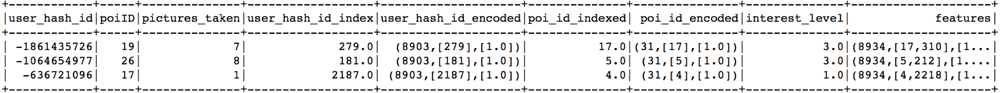

注意编码字段（`user_hash_id_encoded`、`poi_id_encoded`和`features`）显示了向量的稀疏表示。

一旦我们有了这个编码后的数据集，我们可以将其分为测试集和训练集。SageMaker 将使用训练集进行拟合，并在训练过程中每个 epoch 使用测试集来查找验证错误。我们需要将这些数据集转换为 recordio 格式并上传到 s3。

如果我们使用 Scala（Spark 使用的本地编程语言），我们可以做类似这样的事情：

```py
sagemaker_train_df.write.format("sagemaker") \
  .option("labelColumnName", "interest_level") \
  .option("featuresColumnName", "features") \
  .save("s3://mastering-ml-aws/chapter6/train-data")
```

不幸的是，在撰写本文时，`pyspark`不支持直接将数据框写入 recordio 格式。相反，我们将收集所有 spark 数据框到内存中，并将每一行转换为稀疏向量，然后上传到 S3。

下面的`spark_vector_to_sparse_matrix`函数正是这样做的。它接受一个 Spark 数据框行并将其转换为`scipy`稀疏矩阵（来自`scipy`，一个具有科学工具的 Python 库）。`upload_matrices_to_s3`函数接收一个 Spark 数据集（无论是训练集还是测试集），收集每一行，使用特征构建一个稀疏向量，并将它们堆叠成一个矩阵。此外，它构建一个包含所有兴趣级别的目标特征向量。给定这个矩阵和标签向量，我们使用`sagemaker`库的实用函数`write_spmatrix_to_sparse_tensor`将数据写入 recordio 格式。最后，我们将该对象上传到 S3。为此，让我们首先导入所有必要的依赖项：

```py
from scipy.sparse import csr_matrix
import numpy as np
import boto3
import io
import numpy as np
import scipy.sparse as sp
import sagemaker.amazon.common as smac
```

接下来，让我们定义两个辅助函数：`spark_vector_to_sparse_matrix`，它将接受一行并生成一个`scipy`稀疏矩阵，以及`upload_matrices_to_s3`，它负责将测试集或训练集上传到 s3：

```py
def spark_vector_to_sparse_matrix(row):
   vect = row['features']
   return csr_matrix((vect.values, vect.indices, np.array([0, vect.values.size])),
                     (1, vect.size), 
                      dtype=np.float32)

def upload_matrices_to_s3(dataframe, dataset_name):
   features_matrices = 
        dataframe.select("features") \
                 .rdd.map(spark_vector_to_sparse_matrix).collect()
   interest_levels = 
        dataframe.select("interest_level") \
                 .rdd.map(lambda r: r['interest_level']).collect()

   interest_level_vector = np.array(interest_levels, dtype=np.float32)
   buffer = io.BytesIO()
   smac.write_spmatrix_to_sparse_tensor(buffer, \
                                        sp.vstack(features_matrices), \
                                        interest_level_vector)
   buffer.seek(0)
   bucket = boto3.resource('s3').Bucket('mastering-ml-aws')
   bucket.Object('chapter6/%s-data.protobuf'%dataset_name).upload_fileobj(buffer)
```

最后，我们需要通过在两个变量上调用`upload_matrices_to_s3`方法来上传训练集和测试集：

```py
upload_matrices_to_s3(sagemaker_train_df, 'train')
upload_matrices_to_s3(sagemaker_test_df, 'test')
```

# 训练模型

现在我们已经将数据以适合学习的正确格式存入 S3，我们可以开始训练我们的模型以获取推荐。

我们将实例化 SageMaker 会话并定义读取和写入数据的路径：

```py
import sagemaker
from sagemaker import get_execution_role
import json
import boto3

sess = sagemaker.Session()
role = get_execution_role()
container = sagemaker.amazon.amazon_estimator.get_image_uri('us-east-1', 
     "factorization-machines", 
     "latest")

s3_train_data = 's3://mastering-ml-aws/chapter6/train-data.protobuf'
s3_test_data = 's3://mastering-ml-aws/chapter6/train-data.protobuf'
s3_output_location = 's3://mastering-ml-aws/chapter6/sagemaker/output/'
```

通过会话，我们可以通过设置要使用的计算机的数量和类型来实例化 SageMaker 估计器。我们还可以指定超参数。两个需要考虑的重要参数是特征维度（这是我们训练向量的长度）和预测器类型。由于我们的问题是设定为回归，我们将使用回归器。如果我们不是将兴趣水平建模为存在/不存在兴趣，而是将其建模为`binary_classifier`值： 

```py
from sagemaker.session import s3_input

recommender = sagemaker.estimator.Estimator(container,
                                            role,
                                            train_instance_count=1,
                                            train_instance_type='ml.c4.xlarge',
                                            output_path=s3_output_location,
                                            sagemaker_session=sess)

recommender.set_hyperparameters(predictor_type='regressor',
                                feature_dim=8934,
                                epochs=200,
                                mini_batch_size=100,
                                num_factors=128)

recommender.fit({'train': s3_input(s3_train_data), \
                 'test': s3_input(s3_test_data)})
```

日志将显示一些验证统计信息和模型完成时的确认信息：

```py
[02/23/2019 22:01:02 INFO 140697667364672] #test_score (algo-1) : ('rmse', 0.19088356774389661)
2019-02-23 22:01:11 Uploading - Uploading generated training model
 2019-02-23 22:01:11 Completed - Training job completed
```

# 获取推荐

一旦模型拟合完成，我们可以启动预测器网络服务：

```py
predictor = recommender.deploy(instance_type='ml.c5.xlarge', initial_instance_count=1)
```

这将启动托管训练模型的网络服务端点，现在可以接收带有预测请求的请求。让我们从 Spark 的 ALS 推荐中选取一个用户，并将其与 SageMaker 的预测进行比较：

```py
print(recommendation_sample[1].user_hash_id)
-525385694
```

我们可以收集那个用户的特征：

```py

sagemaker_test_df.select('features').where('user_hash_id=-525385694') \
                 .rdd.map(build_request).collect()

[{'data': {'features': {'shape': [8934],
   'keys': [4, 3297],
   'values': [1.0, 1.0]}}}]
```

在这里，`build_request`是一个方便的函数，用于创建与 SageMaker 期望的稀疏编码请求兼容的 JSON 请求：

```py
def build_request(row):
   vect = row['features']
   return {'data':{ 'features': {'shape':[int(vect.size)], 
                                 'keys':list(map(int,vect.indices)),
                                 'values':list(vect.values)}}}
```

如我们所知，用户 ID 在向量中的位置是`3297`，景点位置是`4`。我们可以调用该服务以获取服务的预测：

```py
import json

predictor.content_type = 'application/json'
predictor.predict(json.dumps({'instances': [
    {'data': {'features': {'shape': [8934], 'keys': [4, 3297], 
              'values': [1, 1]}}}]}))
```

这里是输出：

```py
{'predictions': [{'score': 0.8006305694580078}]}
```

关于 JSON 请求和响应格式的更多详细信息，请在此处查看：[`docs.aws.amazon.com/sagemaker/latest/dg/cdf-inference.html`](https://docs.aws.amazon.com/sagemaker/latest/dg/cdf-inference.html)。

由于我们可以向预测器询问任意一对（用户，景点）的分数，因此我们将找到问题用户的所有 31 个景点的分数，然后按分数排序：

```py
def predict_poi(poi_position):
   prediction = predictor.predict( 
           json.dumps({'instances': [{'data': 
                        {'features': {'shape': [8934], 
                                      'keys': [poi_position, 3297], 
                                      'values': [1, 1]}}}]}))
   return prediction['predictions'][0]['score']

predictions = [(poi_position, predict_poi(poi_position)) for poi_position in range(0,31)]
predictions.sort(key=lambda x:x[1], reverse=True)
```

给定这些分数，我们可以找到排名最高的景点名称，排除那些已经访问过的：

```py
user_visited_pois = 
     [id_to_poi_name[x] for x in set(recommendation_sample[1]['collect_list(poiID)'])]

for (poi_position, score) in predictions[:10]:
  recommended_poi = id_to_poi_name[int(model.stages[2].labels[poi_position])]
  if recommended_poi not in user_visited_pois:
       print(recommended_poi)
```

输出如下：

```py
Test Track
 Walt Disney World Railroad
 Main Street Cinema
 Tom Sawyer Island
 Tarzan's Treehouse
 Mark Twain Riverboat
 Sleeping Beauty Castle Walkthrough
 Snow White's Scary Adventures
```

让我们将其与 Spark 提供的推荐进行比较：

```py
print(recommendation_sample[1].recommendation)
recommended: [("Pinocchio's Daring Journey", 3.278768539428711), ('Tom Sawyer Island', 2.78713321685791), ('Splash Mountain', 2.114530324935913), ("Tarzan's Treehouse", 2.06896710395813), ('Fantasmic!', 1.9648514986038208), ("Snow White's Scary Adventures", 1.8940000534057617), ('Main Street Cinema', 1.6671074628829956), ('Mark Twain Riverboat', 1.314055323600769), ('Astro Orbiter', 1.3135600090026855)] ; visited: {'The Many Adventures of Winnie the Pooh', 'Rose & Crown Pub Musician', 'Golden Zephyr', "It's A Small World"}
```

如读者可能注意到的，有许多重叠的建议。为了更深入地分析模型的质量及其预测能力，我们可以使用第三章中讨论的评估方法，即*使用回归算法预测房价*，因为这个问题被设定为回归问题。

# 摘要

在本章中，我们研究了称为协同过滤的新类型机器学习算法。该算法用于推荐系统。我们研究了基于相似度度量来寻找与给定用户相似的用户并基于排名最高的相似用户的集体兴趣发现推荐的基于内存的方法。我们还研究了称为矩阵分解的基于模型的方法，该方法将用户和兴趣映射到潜在因子，并基于这些因子生成推荐。我们还研究了 Apache Spark 和 SageMaker 中各种协同过滤方法的实现。

在下一章中，我们将关注一个非常热门的主题：深度学习。我们将涵盖这个高级领域背后的理论以及一些现代应用。

# 练习

1.  找到一个在本章中没有描述的推荐系统示例。评估哪种协同过滤方法适合那种方法。

1.  对于电影推荐引擎，探讨数据稀疏性问题如何影响本章中列出的每个算法。
