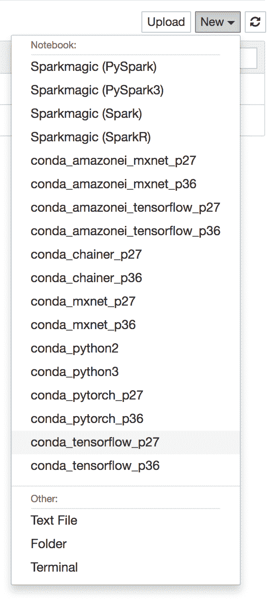
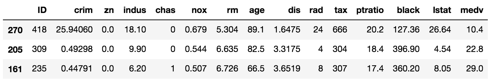
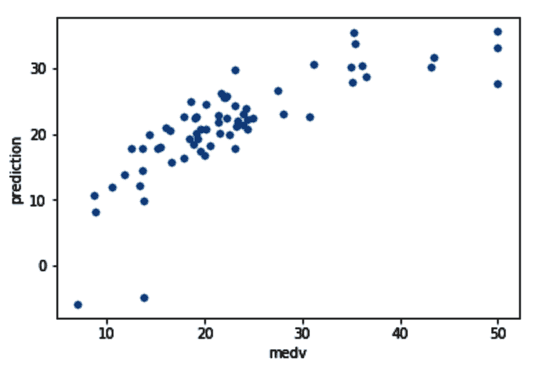
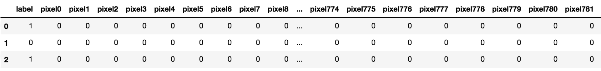
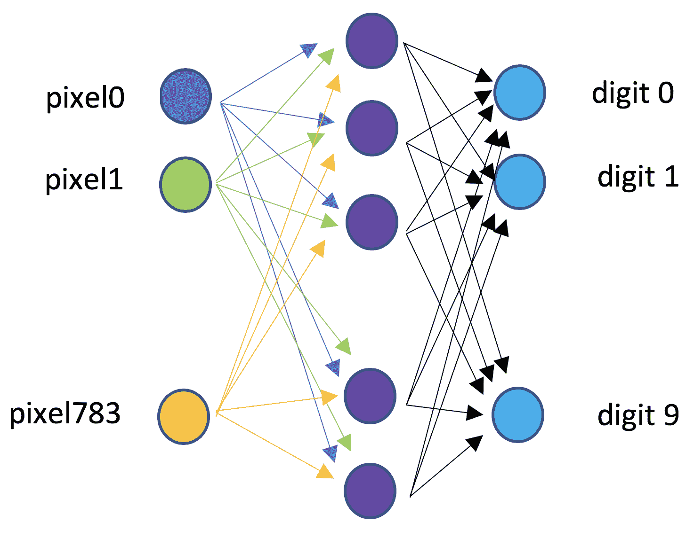
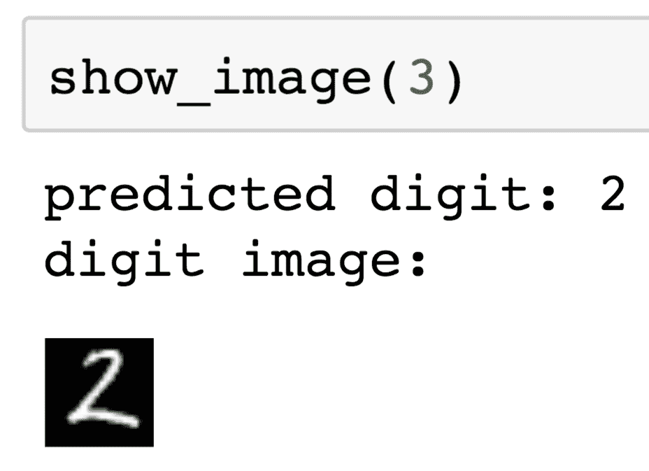
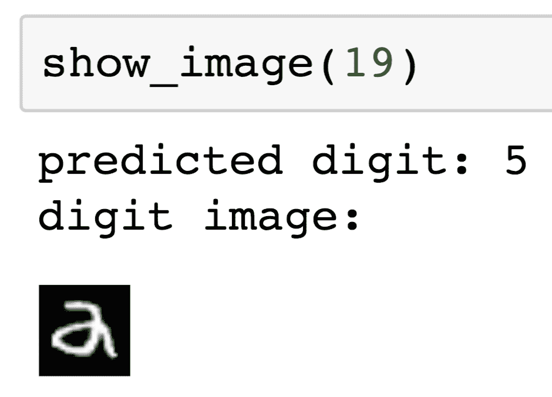
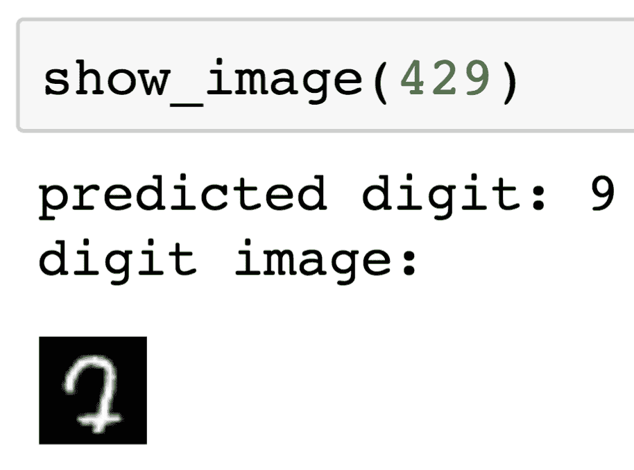

# 第八章：在 AWS 上使用 TensorFlow 实现深度学习

TensorFlow 是一个非常流行的深度学习框架，可以用来训练深度神经网络，例如前一章中描述的那些。

在本章中，我们将涵盖以下主题：

+   关于 TensorFlow

+   TensorFlow 作为通用机器学习库

+   通过 SageMaker 训练和部署 TensorFlow 模型

+   使用 TensorFlow 创建自定义神经网络

# 关于 TensorFlow

TensorFlow 是一个深度学习库，由 Google 于 2015 年首次发布。最初，它包含一个核心库，允许用户以符号形式处理张量（多维数组），从而实现高性能的低级神经网络设计和训练。如今，它是一个完整的深度学习库，允许数据科学家使用高级原语构建用于复杂问题的模型，例如图像识别。您还可以使用 TensorFlow 解决标准机器学习问题，例如我们在过去章节中考虑过的问题。TensorFlow 具有与我们在 `scikit-learn`、Apache Spark 和 SageMaker 中使用的类似抽象。例如，它允许用户使用高级抽象，如估计器、预测器和评估器，来创建分类模型或回归模型。

# TensorFlow 作为通用机器学习库

在本节中，我们将展示如何使用 TensorFlow 为 第三章 中的房屋估值问题创建回归模型，即 *使用回归算法预测房屋价值*。为了开始，我们首先启动一个 SageMaker 笔记本，并选择 TensorFlow 内核 (`conda_tensorflow_p36`)，它包含本节所需的全部 TensorFlow 依赖项：



现在，让我们考虑 第三章 中的估值问题，*使用回归算法预测房屋价值*。回想一下，我们有一组指标（房屋年龄、距离最近中心等）来估计房屋的中值（在 `medv` 列中表达，这是我们的目标特征），如下截图所示：



在 第三章 的 *使用回归算法预测房屋价值* 中，我们确定了 11 个学习特征用于预测目标特征 (`medv`)：

```py
training_features = ['crim', 'zn', 'indus', 'chas', 'nox',             'rm', 'age', 'dis', 'tax', 'ptratio', 'lstat']

label = 'medv'
```

基于这些信息，我们定义了一个 TensorFlow 线性回归器，它能够使用预构建的神经网络解决我们的回归问题：

```py
tf_regressor = tf.estimator.LinearRegressor(
    feature_columns=[tf.feature_column.numeric_column('inputs', 
                                  shape=(11,))])
```

对于回归器，我们决定创建一个单特征输入，它将其他特征组装成一个代表输入层的数字向量。也有可能为每个训练特征创建一个命名特征（就像我们在第三章中做的，*使用回归算法预测房屋价值*），但我们将只有一个向量特征来简化本节末尾讨论的预测服务。

要构建一个回归器，我们需要传递 TensorFlow 特征列，这些列可以是几种不同类型之一。`tf.feature_column` 包提供根据模型使用的编码构建不同类型列的函数（例如，分类、分桶等）。特征列通知模型提交为输入的数据的预期格式。在我们的情况下，我们只需告诉模型期望长度为 11 的向量行。

为了构建要传递给模型的实际数据，我们需要创建一个矩阵。`pandas` 库有一个方便的方法，`as_matrix()`，因此我们将切片训练特征并构建一个矩阵：

```py
training_df[training_features].as_matrix()
```

同样，我们将创建特征向量：

```py
training_df[label].as_matrix()
```

一旦我们有了这两样东西，我们就可以开始将数据插入到模型中。TensorFlow 期望通过定义一个知道如何将数据源到张量（TensorFlow 的多维数组的基本构建块）的函数来提供数据。

以下是将数据插入的代码块：

```py
training_input_fn = tf.estimator.inputs.numpy_input_fn(
    x={'inputs': training_df[training_features].as_matrix()},
    y=training_df[label].as_matrix(),
    shuffle=False,
    batch_size=1,
    num_epochs=100,
    queue_capacity=1000,
    num_threads=1)
```

`tf.estimator.inputs.numpy_input_fn` 工具能够通过提供训练矩阵和目标特征向量来构建这样一个函数。它还将创建数据分区，以便在多个 epoch 中运行网络。它还允许用户选择批次的尺寸（回想一下第三章中提到的迷你批次方法，*使用回归算法预测房屋价值*，用于随机梯度下降）。本质上，底层回归器的神经网络依赖于 `training_input_fn` 函数在每个算法阶段创建输入张量。

同样，我们创建一个类似的函数来提供测试数据，为模型评估做准备：

```py
test_input_fn = tf.estimator.inputs.numpy_input_fn(
    x={'inputs': test_df[training_features].as_matrix()},
    y=test_df[label].as_matrix(),
    shuffle=False,
    batch_size=1)
```

要训练模型，我们调用常规的 `fit()` 方法，提供我们创建的数据来源函数：

```py
tf_regressor.train(input_fn=training_input_fn, steps=50000)
```

`steps` 参数是我们可以对总步数施加的限制。在这里，一个步骤是指对一个批次进行一次梯度下降更新。因此，每个 epoch 运行一定数量的步骤。

一旦完成训练，TensorFlow 将在 `final` epoch 输出损失度量：

```py
INFO:tensorflow:Loss for final step: 1.1741621.
```

我们可以通过运行测试数据集（通过提供测试数据集来源函数）来评估我们模型的准确性：

```py
tf_regressor.evaluate(input_fn=test_input_fn)
```

上述代码生成以下输出：

```py
{'average_loss': 37.858795, 'label/mean': 22.91492, 'loss': 37.858795, 'prediction/mean': 21.380392, 'global_step': 26600}
```

平均损失取决于目标特征的单位，因此让我们看看构建一个类似于我们在第三章中创建的散点图，*使用回归算法预测房价*，以比较实际与预测的房价。为此，我们首先需要获得`predictions`。

我们只需调用`predict()`函数来获取`predictions`，再次提供测试数据集来源函数：

```py
predictions = tf_regressor.predict(input_fn=test_input_fn)
```

`predictions`返回了一个实际上是单值向量的 Python 生成器，因此我们可以通过构造列表来获取`predictions`：

```py
predicted_values = [prediction['predictions'][0] for prediction in predictions]

```

因此，我们可以检查`predicted_values`：

```py
predicted_values[:5]
```

之前的代码生成了以下输出：

```py
[22.076485, 23.075985, 17.803957, 20.629128, 28.749748]
```

我们可以将预测值作为列插入到原始的`pandas`测试数据框中：

```py
test_df['prediction'] = predicted_values
```

这允许我们使用 pandas 绘图方法来创建图表：

```py
test_df.plot(kind='scatter', x=label, y='prediction')
```

我们可以在以下屏幕截图中看到结果：



注意到存在明显的相关性。为了提高性能，我们可能需要调整我们的回归模型、批大小、步骤、周期等。

# 通过 SageMaker 训练和部署 TensorFlow 模型

与在笔记本实例中训练模型不同，我们使用 SageMaker 基础设施来训练模型。在之前的章节中，我们使用了内置的估计器，如 BlazingText、XGBoost 和**因子分解机**（**FMs**）。在本节中，我们将展示如何构建自己的 TensorFlow 模型并通过 SageMaker 训练它们，就像我们处理这些预构建模型一样。为此，我们只需教会 SageMaker 如何构建我们的 TensorFlow 模型，并遵守一些关于数据格式、位置和结构的约定。通过一个 Python 脚本，我们指定所有这些。

SageMaker 将依赖于这个 Python 脚本来在 SageMaker 训练实例中执行训练：

```py
import sagemaker
from sagemaker import get_execution_role
import json
import boto3
from sagemaker.tensorflow import TensorFlow

sess = sagemaker.Session()
role = get_execution_role()
tf_estimator = TensorFlow(entry_point='tf_train.py', role=role,
                          train_instance_count=1,      train_instance_type='ml.m5.large',
                          framework_version='1.12', py_version='py3')
tf_estimator.fit('s3://mastering-ml-aws/chapter8/train-data/')
```

上述代码块的前几行是启动 SageMaker 所需的常规导入和会话创建。下一个重要的事情是创建一个 TensorFlow 估计器。注意我们如何向构造函数提供 Python 脚本、TensorFlow 版本和 Python 版本，以及实例数量和类型的常规参数。

当调用`tf_estimator.fit(training_data_s3_path)`函数时，SageMaker 将执行以下任务：

1.  启动一个 EC2 实例（服务器）。

1.  将 S3 数据下载到本地目录。

1.  调用`tf_train.py` Python 脚本来训练模型。Python 脚本预计将模型存储在 EC2 实例的某个本地目录中。

1.  将存储的模型打包成`.tar.gz`文件并上传到 S3。此外，它还将创建一个 Amazon 容器和 SageMaker 模型标识符。

因此，训练是在 SageMaker 管理的服务器上进行的，但它产生的模型是 SageMaker 兼容的模型，可以用于提供预测或运行批量转换作业，就像我们在前几章中所做的那样。

让我们看看 `tf_train.py` Python 脚本，它负责模型训练和保存模型。

这个 Python 脚本必须从 SageMaker 容器接收一些信息。特别是，它必须接收以下信息：

+   SageMaker 下载数据的本地目录（从 S3）

+   Python 脚本需要存储训练好的模型的位置

+   模型需要的其他超参数（我们目前不会深入探讨，而只是使用固定值，但我们将展示在 第十四章，*在 Spark 和 SageMaker 中优化模型*，如何使用这些参数进行超参数调整）

看看下面的代码：

```py
import pandas as pd
import argparse
import os
import tensorflow as tf

if __name__ == '__main__':
    parser = argparse.ArgumentParser()
    parser.add_argument('--epochs', type=int, default=100)
    parser.add_argument('--batch_size', type=int, default=1)
    parser.add_argument('--steps', type=int, default=12000)
    parser.add_argument('--model_dir', type=str)
    parser.add_argument('--local_model_dir', type=str,                                 
default=os.environ.get('SM_MODEL_DIR'))
    parser.add_argument('--train', type=str,       default=os.environ.get('SM_CHANNEL_TRAINING'))

    args, _ = parser.parse_known_args()
    housing_df = pd.read_csv(args.train + '/train.csv')
    training_features = ['crim', 'zn', 'indus', 'chas', 'nox', 
                         'rm', 'age', 'dis', 'tax', 'ptratio', 'lstat']
    label = 'medv'
    tf_regressor = tf.estimator.LinearRegressor(
        feature_columns=[tf.feature_column.numeric_column('inputs', 
                                  shape=(11,))])
    training_input_fn = tf.estimator.inputs.numpy_input_fn(
        x={'inputs': housing_df[training_features].as_matrix()},
        y=housing_df[label].as_matrix(),
        shuffle=False,
        batch_size=args.batch_size,
        num_epochs=args.epochs,
        queue_capacity=1000,
        num_threads=1)
    tf_regressor.train(input_fn=training_input_fn, steps=args.steps)

    def serving_input_fn():
        feature_spec = tf.placeholder(tf.float32, shape=[1, 11])
        return tf.estimator.export.build_parsing_serving_input_receiver_fn(
                {'input': feature_spec})()

    tf_regressor.export_savedmodel(export_dir_base=args.local_model_dir + '/export/Servo',
                                   serving_input_receiver_fn=serving_input_fn)
```

脚本的前一部分只是设置一个参数解析器。由于 SageMaker 将此脚本作为黑盒调用，它需要能够将此类参数注入脚本中。有了这些参数，它可以训练 TensorFlow 模型。你可能注意到，训练与我们在前一部分所做的是一样的。唯一的新部分是保存模型和定义一种新的函数（`serving_input_fn`）。这个函数与我们在训练和测试中使用的函数有类似的目的，但它在服务时间（即每次向服务发出预测请求时）将被使用。它负责定义从输入张量占位符到模型期望的特征的必要转换。`tf.estimator.export.build_parsing_serving_input_receiver_fn` 工具可以方便地构建用于此类目的的函数。它构建一个期望 `tf.Example`（特征的一个 `protobuf` 序列化字典）被输入到字符串占位符中的函数，以便它可以解析这样的示例到特征张量。在我们的例子中，我们只有一个向量作为输入，所以转换是直接的。我们脚本中的最后一行将模型保存到 SageMaker 通过 `local_model_dir` 参数请求的位置。为了使反序列化和解包工作，惯例是将模型保存到 `/export/Servo` 子目录中。

一旦我们运行 `fit()` 命令，我们就可以像往常一样部署模型：

```py
predictor = tf_estimator.deploy(instance_type='ml.m5.large', initial_instance_count=1)
```

对于这个例子，我们使用了一个非 GPU 实例类型，但这些在很大程度上被推荐用于严肃的服务和训练。我们将在 第十五章，*调整机器学习集群* 中深入探讨这一点。

`deploy()` 命令将启动一个容器，该容器能够为我们构建的模型提供服务。然而，构造要发送给此类服务的有效负载并不像前一章中的示例那样简单，因为我们需要构造 `tf.Example`。

在预测时，我们希望根据特定的特征向量获得价格。假设我们想要找到以下特征的价格：

```py
features_vector = [0.00632, 18.0, 2.31, 0.0, 0.538, 6.575, 65.2, 4.09, 296.0, 15.3, 4.98]
```

第一步是构建一个 `tf.train.Example` 实例，在我们的情况下，它由一个名为 `inputs` 的单个特征组成，该特征包含 `features_vector` 的浮点值：

```py
model_input = tf.train.Example(features=tf.train.Features(

    feature={"inputs": tf.train.Feature(float_list=tf.train.FloatList(value=features_vector))}))
```

下一步是使用 `SerializeToString` 将 `model_input protobuf` 消息序列化：

```py
model_input = model_input.SerializeToString()
```

由于这实际上是一个字节字符串，我们需要进一步编码 `model_input`，以便它可以作为字符串发送到负载中，而不包含特殊字符。我们使用 `base64` 编码来完成这项工作：

```py
encoded = base64.b64encode(model_input).decode()
```

最后，我们通过组装一个 JSON 请求来调用我们的 `predictor` 服务：

```py
predictor.predict('{"inputs":[{"b64":"%s"}]}' % encoded)
```

注意，在发送通过创建以 `b64` 为键的字典来编码的 base64 `protobuf` 示例时，有一个特殊的约定。从 JSON 解码的输出是一个包含以下预测的字典：

```py
{'outputs': [[24.7537]]}
```

`inputs` 和 `outputs` 负载 JSON 键是 SageMaker 的合约的一部分，不应与我们的单个特征 `inputs` 的名称混淆，`inputs` 可以是任意字符串。

# 使用 TensorFlow 创建自定义神经网络

在上一节“通过 SageMaker 训练和部署 TensorFlow 模型”中，我们使用了 TensorFlow 的高级库，使用 `LinearRegressor` 构建了一个回归模型。在本节中，我们将展示如何使用 TensorFlow 的 Keras 库构建一个实际的神经网络。Keras 通过隐藏核心（低级）TensorFlow 库背后的某些复杂性来简化神经网络的设计。

在本章中，我们将使用无处不在的 MNIST 数据集，它包含一系列手写数字的图像以及真实的标签（0 到 1 之间的值）。MNIST 数据集可以从 [`www.kaggle.com/c/digit-recognizer/data`](https://www.kaggle.com/c/digit-recognizer/data) 下载。

数据集以 CSV 格式提供，包含 784 列，对应于 28 x 28 图像中的每个像素。每列的值代表像素在 0 到 255 的灰度强度。它还有一个额外的列用于标签，其值介于 0 到 9 之间，对应于实际的数字。

让我们下载数据集，并使用 `pandas` 和 `scikit-learn` 进行我们通常的测试和训练分割：

```py
import pandas as pd
from sklearn.model_selection import train_test_split

mnist_df = pd.read_csv('mnist/train.csv')
train_df, test_df = train_test_split(mnist_df, shuffle=False) 
```

我们可以通过 `train.head()` 检查数据集：



如我们所见，列被标记为 `pixelX`，其中 `x` 是介于 `0` 和 `783` 之间的数字。让我们将这些列的名称定义为不同的变量：

```py
pixel_columns = ['pixel' + str(i) for i in range(0, 784)]
label_column = 'label'
```

数据集中的每一行都成为了一个训练示例，因此代表了我们的网络输入层。在网络的另一端，我们将有 10 个节点，每个节点代表给定每个输入向量的每个数字的概率。在我们的例子中，我们将只使用一个中间层。

以下图展示了我们的网络结构：



在 Keras 中定义这样的网络非常简单：

```py
import tensorflow as tf
from tensorflow import keras

model = keras.Sequential([
    keras.layers.InputLayer(input_shape=(784,), batch_size=5),
    keras.layers.Dense(256, activation=tf.nn.relu),
    keras.layers.Dense(10, activation=tf.nn.softmax)
])
```

注意定义这样一个模型是多么容易。它由三个层组成：

+   一个输入层，其中每个向量的大小为 784，并且每个梯度下降更新将提供五个示例的迷你批次

+   一个中间密集层（意味着每个节点将连接到下一层的每个节点）在每个节点上具有**Rectified Linear Unit**（**ReLU**）激活函数

+   一个大小为 10 的输出层，使用 softmax 激活函数（因为我们想要数字的概率分布）

除了通过一系列层定义网络之外，TensorFlow 还需要编译模型。这基本上意味着提供要使用的优化方法、`loss`函数和所需的指标：

```py
model.compile(optimizer='adam',
              loss='sparse_categorical_crossentropy',
              metrics=['accuracy'])
```

下一个阶段将是将模型与我们的数据拟合。为了将数据集输入到 TensorFlow 中，我们需要创建`numpy`矩阵，其中每一行是一个训练实例，每一列代表输入层中的一个节点。方便的是，`pandas`方法`dataframe.as_matrix()`正好能完成这个任务，因此我们将数据集切片以包含训练列并构建这样一个矩阵。此外，我们将矩阵归一化，以便每个灰度值介于 0 和 1 之间：

```py
import numpy as np

vectorized_normalization_fn = np.vectorize(lambda x: x / 255.0)
normalized_matrix = 
      vectorized_normalization_fn(train_df
[pixel_columns].as_matrix())
```

同样，我们通过将`pandas`序列转换为数字向量来获得`labels`向量：

```py
labels = train_df[label_column].as_matrix()

```

现在我们已经有了训练矩阵和标签，我们准备拟合我们的模型。我们通过简单地调用`fit()`并提供标记的训练数据来完成此操作：

```py
model.fit(normalized_matrix, labels, epochs=3)
```

训练将以训练数据集中的损失和准确度指标结束：

```py
Epoch 3/3 31500/31500 [==============================] - 16s 511us/sample - loss: 0.0703 - acc: 0.9775
```

为了确定我们的模型是否过拟合（即，它只是学会了如何分类我们的训练数据集中的图像，但无法推广到新的图像），我们需要在测试数据集中测试我们的模型。为此，我们将对测试数据集执行我们在训练数据集上所做的相同转换。

我们模型的`evaluate()`函数将提供准确度评估指标：

```py
normalized_test_matrix = vectorized_normalization_fn(test_df[pixel_columns].as_matrix())
test_labels = test_df[label_column].as_matrix()
_, test_acc = model.evaluate(normalized_test_matrix, test_labels)

print('Accuracy on test dataset:', test_acc)
```

上述代码生成以下输出：

```py
Accuracy on test dataset: 0.97
```

注意，我们的简单模型实际上相当准确。让我们检查测试数据集中的几个图像，看看预测是否与实际数字匹配。为此，我们将绘制图像，并通过以下步骤将它们与预测数字进行比较：

1.  首先，我们将定义一个函数，该函数可以获得测试数据集矩阵中特定行（`index`）的预测标签：

```py
def predict_digit(index):
    predictions = model.predict(normalized_test_matrix[index:index + 1])
    return np.argmax(predictions, axis=1)[0]

```

`model.predict()`将根据特征矩阵获得预测。在这种情况下，我们只需要一行，所以我们切片我们的矩阵为单行以获得特定索引的预测。预测将是一个包含 10 个组件的向量，每个组件代表每个数字的强度。我们使用`argmax`函数找到强度最大的数字（即，找到最可能的数字）。

1.  接下来，我们定义一个函数，`show_image()`，它将根据索引绘制图像：

```py
from IPython.display import display
from PIL import Image

def show_image(index):
    print("predicted digit: %d" % predict_digit(index))
    print("digit image:")
    vectorized_denormalization_fn = np.vectorize(lambda x: np.uint8(x * 255.0))
    img_matrix = normalized_test_matrix[index].reshape(28, 28)
    img_matrix = vectorized_denormalization_fn(img_matrix)
    img = Image.fromarray(img_matrix, mode='L')
    display(img)

```

我们依赖`PIL`库来进行绘图。为了绘制图像，我们需要将我们的值反归一化到 0-255 的范围，并将 784 个像素重塑为 28x28 的图像。

让我们通过以下截图中的几个实例来考察一下：


第二个例子：



以下图像无法被模型正确识别：



第二个例子：



你可能同意，即使是人类也可能犯类似的错误。

那么，我们如何在我们的`model`之上构建一个服务呢？

做这件事的一个简单方法是从我们的`model`创建一个`estimator`实例：

```py
estimator = tf.keras.estimator.model_to_estimator(model)
```

记得我们在上一节中使用的`LinearRegressor`也是一个`estimator`实例，因此从这个`estimator`实例开始，训练、序列化和部署模型的过程是相同的。

# 摘要

在本章中，我们介绍了创建两个不同的 TensorFlow 模型的过程：一个使用高级 estimator 库，另一个使用 Keras 构建自定义神经网络。在这个过程中，我们还展示了 SageMaker 如何无缝处理 TensorFlow 模型的训练和部署。

在下一章，*使用 SageMaker 进行图像分类和检测*中，我们将展示如何在 AWS 上使用深度学习直接检测和识别图像。

# 练习

本章的问题如下：

+   一个 epoch、batch 和 step 之间的区别是什么？

+   你会如何设计一个网络，能够为第六章中考虑的主题公园数据集提供推荐，该章节名为*分析游客模式以提供推荐*？

+   你会如何构建一个能够将第五章中提到的广告分类为点击/未点击的网络，该章节名为*使用聚类算法进行客户细分*？
