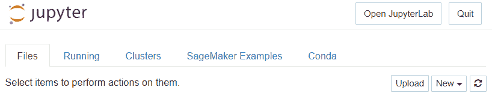
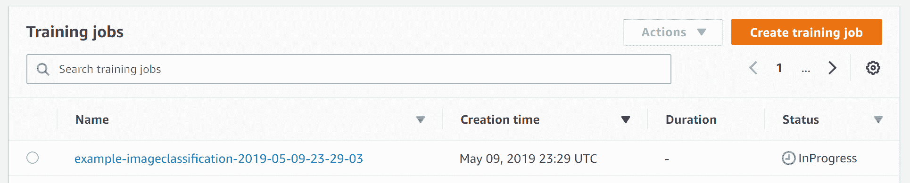
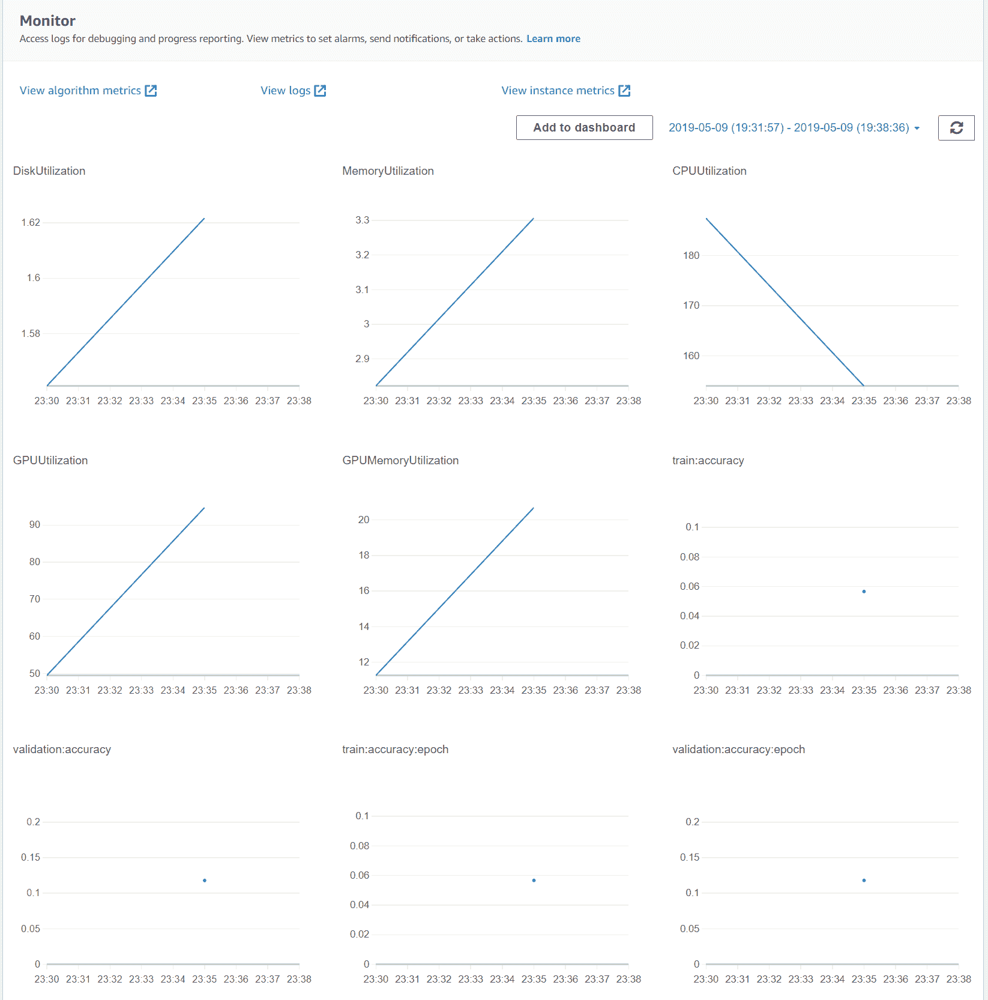

# 使用 SageMaker 进行图像分类和检测

我们研究了一种称为**卷积神经网络**（**CNN**）的深度学习算法，它能够对图像进行分类。然而，在实际中实现这样的算法极其复杂，需要大量的专业知识。Amazon SageMaker 提供了功能，允许您使用深度学习能力训练机器学习模型，例如图像分类算法。

本章我们将涵盖以下主题：

+   介绍 Amazon SageMaker 用于图像分类

+   使用 Amazon SageMaker 训练深度学习模型

+   使用 Amazon SageMaker 对图像进行分类

# 介绍 Amazon SageMaker 用于图像分类

由于 Tensorflow 和 SageMaker 等服务，数据科学领域已经发生了革命。过去，复杂的算法，如深度学习，只有大公司和研究实验室才能访问。然而，得益于 SageMaker 等服务，任何能够编写代码调用这些服务的人都可以训练和使用复杂的机器学习算法。这使得对机器学习有实际了解的青少年能够创建能够执行复杂机器学习任务的应用程序。通过访问 SageMaker 市场中的最先进机器学习模型，您将能够以与世界顶级科学家相同的能力执行机器学习任务。

Amazon SageMaker 提供了大量的算法，数据科学家可以使用这些算法来训练他们的机器学习模型，并且它还提供了工具来对一批测试数据进行预测或创建一个端点以将模型作为服务使用。当我们处理较小的测试数据集时，我们可以使用 Python 机器学习库，如 `scikit-learn`。然而，当我们处理较大的数据集时，我们必须依赖框架，如 Apache Spark，并使用库，如 `MLLib`。

亚马逊在 SageMaker 中提供了一系列机器学习库，我们可以使用来自不同供应商的预调优模型来训练我们的机器学习模型。因此，当您处理问题时，您可以在 Amazon SageMaker 市场中搜索已可用的算法。如果有来自不同供应商的多个算法和模型可供选择，您可以根据它们的定价模型和准确性来选择算法。

SageMaker 市场可以用来选择亚马逊以外的供应商提供的模型。因此，如果您需要一个针对遗传工程领域功能进行优化的专用算法，或者像**建筑工人检测器**这样的图像分类算法的专用版本，您可以选择一个预训练模型并直接获取预测。

亚马逊 SageMaker 还提供调整市场算法参数的作业，以便它们可以适应您的集群大小和应用。这类作业被称为**超参数调整作业**。您可以为参数提供各种值来检查一个算法。然后，亚马逊 SageMaker 可以自动训练以选择最适合您应用的调整参数。您也可以手动设置这些参数的值。

在本章中，我们将通过一个图像分类器的示例来展示如何使用亚马逊 SageMaker。该算法从标记的图像集中学习，然后通过为测试图像中的每个对象分配存在概率来检测测试数据集中的对象。对于这次测试，我们使用了一个公开的数据集，称为 `Caltech265` ([`www.vision.caltech.edu/Image_Datasets/Caltech256/`](http://www.vision.caltech.edu/Image_Datasets/Caltech256/))。该数据集包含 30,608 张图像。数据集用 256 个对象进行了标记。

请将以下数据集文件下载到您的 AWS S3 桶中：[`data.mxnet.io/data/caltech-256/caltech-256-60-train.rec`](http://data.mxnet.io/data/caltech-256/caltech-256-60-train.rec) 和 [`data.mxnet.io/data/caltech-256/caltech-256-60-val.rec`](http://data.mxnet.io/data/caltech-256/caltech-256-60-val.rec)

为了我们的实验目的，我们将训练数据文件存储在 AWS 桶中的 `image-classification-full-training/train` 文件夹下。该文件包含 15,420 个图像文件，这些图像已调整为 224 x 224 像素。

# 使用亚马逊 SageMaker 训练深度学习模型

在本节中，我们将展示如何使用此数据集训练图像分类模型。同样，将 `validation` 文件下载到 `image-classification-full-training/validation` 文件夹下的 AWS 桶中。

在 第七章，*实现 AWS 上的深度学习算法*中，我们研究了一种称为 CNN 的算法，该算法使用深度神经网络构建对象检测模型。该模型在标记图像上训练，并学习如何使用各种深度神经网络层识别图像中的对象。从头开始构建这个深度学习模型是困难的。亚马逊 SageMaker 提供了一种简单的方法，使用您自己的数据集来训练图像分类算法，然后将该模型部署到检测图像中的对象。我们将提供一个使用 `caltech256` 数据集训练模型的代码示例，然后在下一节，*使用亚马逊 SageMaker 分类图像*中对其进行测试。

与第八章，*在 AWS 上使用 TensorFlow 实现深度学习*类似，您将需要启动一个新的 SageMaker 实例并使用 Jupyter Notebooks 来开始测试。亚马逊 SageMaker 已经为您提供了大量的示例代码以供开始。要访问这些示例，请参考 SageMaker 示例标签页：



本章中使用的代码也是对 SageMaker 提供的图像分类示例的修改。您可以使用`conda_python3`内核创建一个新的笔记本：

在第五章“使用聚类算法进行客户细分”和第六章“分析访客模式以提供建议”等章节中，我们使用了亚马逊提供的 Amazon SageMaker 高级`sagemaker` Python 库。在这里，我们选择展示如何从`boto3`库中使用 SageMaker 通用客户端。这个库提供了一个声明式接口，更接近 SageMaker 背后的 API。希望读者您能通过本章的示例理解 API 的低级调用。

我们在此提供了一个代码示例，说明如何使用 boto3 客户端通过 Amazon Sagemaker 创建图像分类模型。

1.  初始化我们想在 SageMaker 中使用的角色和**image-classification**图像，然后指定我们桶的名称：

```py
import boto3
import re
from sagemaker import get_execution_role
from sagemaker.amazon.amazon_estimator import get_image_uri

role = get_execution_role()

bucket='mastering-ml-aws'

training_image = get_image_uri(boto3.Session().region_name, 'image-classification')
```

被称为**image-classification**的训练图像是图像分类算法的 Docker 镜像。Amazon SageMaker 提供了大量此类镜像，您可以使用它们来训练您的分类器。每个镜像都有自己的调整参数，您也可以在训练该算法时提供。

1.  我们将在以下代码块中声明这些调整参数：

```py
# Define Parameters

num_layers = "18" 
image_shape = "3,224,224"
num_training_samples = "15420"
num_classes = "257"
mini_batch_size =  "64"
epochs = "2"
learning_rate = "0.01"
```

图像分类算法使用深度神经网络；这些参数对我们来说很熟悉，因为我们已经在第七章，“实现深度学习算法”中研究过。

我们定义深度学习算法将使用的隐藏层数量。我们还需要指定通道数和每个图像的大小。我们定义训练图像的数量和类（对象类型）的数量。迭代次数定义了我们将在训练数据集上迭代的次数。深度学习分类器的准确率随着我们对数据集迭代的次数增加而提高。学习率定义了深度学习算法允许对权重进行的更改次数。

我们建议您使用不同的参数运行此算法，以观察对评估和训练时间的影响。

1.  一旦我们定义了参数，我们就会初始化用于 S3 的 boto3 客户端，我们在那里存储了我们的训练和验证文件。

```py
import time
import boto3
from time import gmtime, strftime

# caltech-256
s3_train_key = "image-classification-full-training/train"
s3_validation_key = "image-classification-full-training/validation"
s3_train = 's3://{}/{}/'.format(bucket, s3_train_key)
s3_validation = 's3://{}/{}/'.format(bucket, s3_validation_key)

s3 = boto3.client('s3')
```

1.  我们构建了一个 JSON，其中包含了训练我们的图像分类器所需的全部参数：

```py
# create unique job name 
job_name_prefix = 'example-imageclassification'
timestamp = time.strftime('-%Y-%m-%d-%H-%M-%S', time.gmtime())
job_name = job_name_prefix + timestamp
training_params = \
{
    # specify the training docker image
    "AlgorithmSpecification": {
        "TrainingImage": training_image,
        "TrainingInputMode": "File"
    },
    "RoleArn": role,
    "OutputDataConfig": {
        "S3OutputPath": 's3://{}/{}/output'.format(bucket, job_name_prefix)
    },
    "ResourceConfig": {
        "InstanceCount": 1,
        "InstanceType": "ml.p2.xlarge",
        "VolumeSizeInGB": 50
    },
    "TrainingJobName": job_name,
    "HyperParameters": {
        "image_shape": image_shape,
        "num_layers": str(num_layers),
        "num_training_samples": str(num_training_samples),
        "num_classes": str(num_classes),
        "mini_batch_size": str(mini_batch_size),
        "epochs": str(epochs),
        "learning_rate": str(learning_rate)
    },
    "StoppingCondition": {
        "MaxRuntimeInSeconds": 360000
    },
    "InputDataConfig": [
        {
            "ChannelName": "train",
            "DataSource": {
                "S3DataSource": {
                    "S3DataType": "S3Prefix",
                    "S3Uri": s3_train,
                    "S3DataDistributionType": "FullyReplicated"
                }
            },
            "ContentType": "application/x-recordio",
            "CompressionType": "None"
        },
        {
            "ChannelName": "validation",
            "DataSource": {
                "S3DataSource": {
                    "S3DataType": "S3Prefix",
                    "S3Uri": s3_validation,
                    "S3DataDistributionType": "FullyReplicated"
                }
            },
            "ContentType": "application/x-recordio",
            "CompressionType": "None"
        }
    ]
}
```

在这个 JSON 中有很多东西要学习。我们在`AlgorithmSpecification`部分定义了我们想要用于训练的算法。`OutputDataConfig`定义了模型将存储的位置。`ResourceConfig`定义了用于训练作业的实例类型。请注意，在 AWS 上，基于 GPU 的实例可以更快地运行图像分类等任务。所有算法参数都在`HyperParameters`部分定义。我们在 JSON 的`InputDataConfig`部分下设置了训练数据集和验证数据集。此 JSON 配置将在下一个代码块中用于设置训练作业的参数。

以下代码块启动了一个`sagemaker`训练作业：

```py
# create the Amazon SageMaker training job

sagemaker = boto3.client(service_name='sagemaker')
sagemaker.create_training_job(**training_params)
```

在您开始训练作业后，您可以在 Amazon SageMaker 仪表板上观察训练作业的进度：



此仪表板还显示了您模型的统计数据，包括 CPU 和 GPU 的使用情况，以及内存利用率。您还可以在此仪表板上观察我们正在训练的模型的训练和验证准确率。

由于我们只使用了两个 epoch，因此此模型的训练准确率较低：



您已成功使用 SageMaker 训练了一个图像分类模型。SageMaker 非常易于使用，您只需选择算法镜像，选择训练数据集，并设置算法的参数。SageMaker 将根据这些信息自动训练模型，并将模型存储在您的 S3 桶中。

# 使用 Amazon SageMaker 对图像进行分类

您已训练的 SageMaker 模型现在可用于预测图像中的对象。正如我们在本章开头所讨论的，SageMaker 提供了一个市场，您可以直接使用许多模型来执行您的任务。

1.  由于我们训练了自己的机器学习模型，我们必须创建一个 SageMaker 模型，该模型可用于预测。以下代码展示了如何在 Amazon Sagemaker 中生成一个可用的模型。

```py
import boto3
from time import gmtime, strftime

sage = boto3.Session().client(service_name='sagemaker') 

model_name="example-full-image-classification-model"

info = sage.describe_training_job(TrainingJobName=job_name)
model_data = info['ModelArtifacts']['S3ModelArtifacts']

hosting_image = get_image_uri(boto3.Session().region_name, 'image-classification')

primary_container = {
    'Image': hosting_image,
    'ModelDataUrl': model_data,
}

create_model_response = sage.create_model(
    ModelName = model_name,
    ExecutionRoleArn = role,
    PrimaryContainer = primary_container)
```

要在 SageMaker 中创建一个模型，我们必须指定在之前步骤中生成的模型名称。在我们的例子中，模型名称被设置为`example-full-image-classification-model`。我们还需要指定模型将存储的容器。由于我们使用了图像分类 Docker 镜像来生成此模型，我们必须将其指定为一个参数。此镜像将帮助 SageMaker 读取训练好的模型并定义如何用于预测。

`create_model`函数将创建模型并返回模型的**Amazon 资源名称**（**ARN**）。这可以用于调用模型以生成预测。

对于测试，我们将从`Caltech256`数据集下载原始图像并将它们存储在一个`S3`桶中。我们将使用这些图像来生成预测：

```py
!wget -r -np -nH --cut-dirs=2 -P /tmp/ -R "index.html*" http://www.vision.caltech.edu/Image_Datasets/Caltech256/images/008.bathtub/

batch_input = 's3://{}/image-classification-full-training/test/'.format(bucket)
test_images = '/tmp/images/008.bathtub'

!aws s3 cp $test_images $batch_input --recursive --quiet
```

一旦我们下载了所有图像并将它们存储在 S3 桶中，我们就会指定运行批量预测任务的参数。这个任务将预测图像中 256 个对象中每个对象存在的概率：

```py
timestamp = time.strftime('-%Y-%m-%d-%H-%M-%S', time.gmtime())
batch_job_name = "image-classification-model" + timestamp
request = \
{
    "TransformJobName": batch_job_name,
    "ModelName": model_name,
    "MaxConcurrentTransforms": 16,
    "MaxPayloadInMB": 6,
    "BatchStrategy": "SingleRecord",
    "TransformOutput": {
        "S3OutputPath": 's3://{}/{}/output'.format(bucket, batch_job_name)
    },
    "TransformInput": {
        "DataSource": {
            "S3DataSource": {
                "S3DataType": "S3Prefix",
                "S3Uri": batch_input
            }
        },
        "ContentType": "application/x-image",
        "SplitType": "None",
        "CompressionType": "None"
    },
    "TransformResources": {
            "InstanceType": "ml.p2.xlarge",
            "InstanceCount": 1
    }
}

print('Transform job name: {}'.format(batch_job_name))
print('\nInput Data Location: {}'.format(s3_validation))
```

正如您所猜测的，我们必须在`ModelName`参数中指定模型名称，在`TransformInput`参数中指定输入文件夹。我们还需要指定存储预测的`output`文件夹。我们必须在`TransformResources`参数中指定我们使用的实例类型，并在`MaxConcurrentTransforms`参数中指定要处理的文件的最大数量。

以下代码使用参数并启动`create_transform_job`：

```py
sagemaker = boto3.client('sagemaker')
sagemaker.create_transform_job(**request)
```

您可以在 SageMaker 仪表板上的推理 | 批量转换作业部分监控您的转换作业。一旦任务完成，您就可以访问您指定的作为`output`文件夹的 S3 桶中的预测结果。

预测结果可以按照以下格式查看：

```py
{
  "prediction": [
    0.0002778972266241908,
    0.05520012229681015,
...
    ]
}
```

由于我们的模型有 256 个对象类别，输出指定了每个对象在图像中存在的概率。您可以在各种数据集上运行模型，以检查您的模型是否可以正确预测数据集中的对象。

SageMaker 提供了一个非常易于使用的服务，不仅可以训练深度学习模型，还可以在应用程序中使用它们来生成预测。尽管该服务非常直观，但当您在大数据集上使用预构建的模型生成预测时，SageMaker 的成本很高。根据正在开发的应用程序，数据科学家应该始终考虑使用此类服务时相比在 Apache Spark 自己的集群上构建相同模型所承担的整体成本。

# 摘要

在本章中，我们研究了 Amazon SageMaker 如何提供各种现成的机器学习模型来生成预测，以及可以用于训练您的模型的算法镜像。Amazon SageMaker 在您和设置自己的集群以训练和创建自己的机器学习模型这些杂乱的细节之间生成了一层抽象。Amazon SageMaker 仪表板还提供了一个存储您的训练模型和监控您的预测批量处理作业的地方。

您还可以使用 SageMaker 和自己的数据集训练自己的机器学习模型。我们展示了如何训练一个能够在图像中执行对象检测的机器学习模型。我们演示了如何将此模型部署在 SageMaker 上，并用于运行批量预测任务。您将能够使用这个模板在 Amazon SageMaker 上工作其他算法。

在这本书中，我们的目标是向您解释机器学习算法是如何工作的，以及您如何利用 Apache Spark、Tensorflow 和 SageMaker 等强大工具来部署大规模的训练和预测任务。

# 练习

1.  对于前几章中提供的每个示例，在 Amazon SageMaker 市场中找到一个适用于解决该问题的算法。

1.  Amazon SageMaker 还提供了一种创建端点以生成预测的服务。对于前面的示例，为训练好的模型创建一个端点，并为一张图片生成预测。
