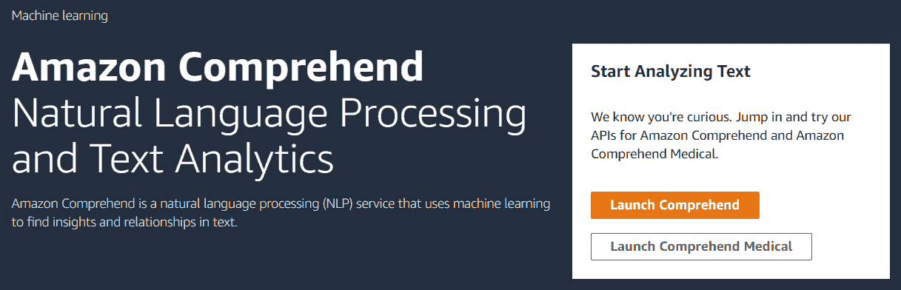
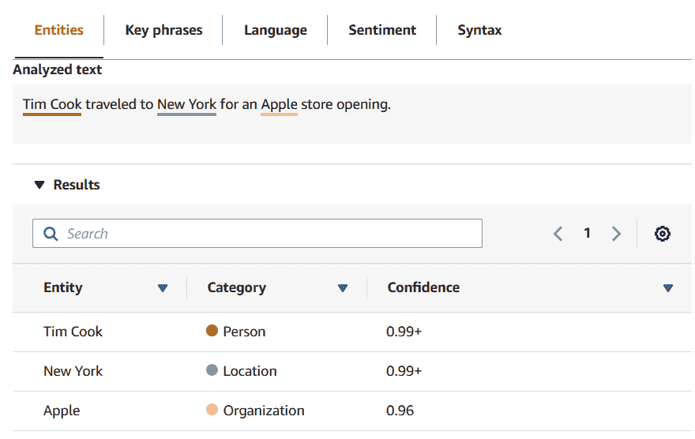
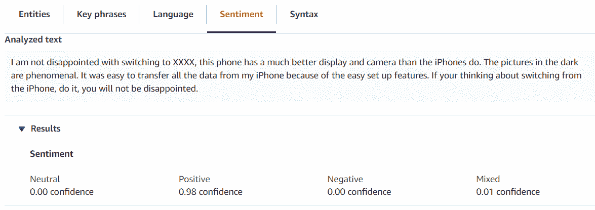
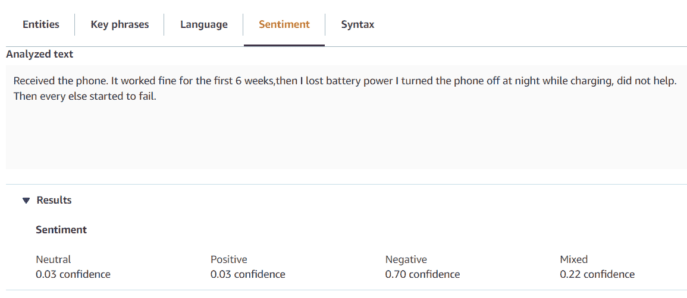
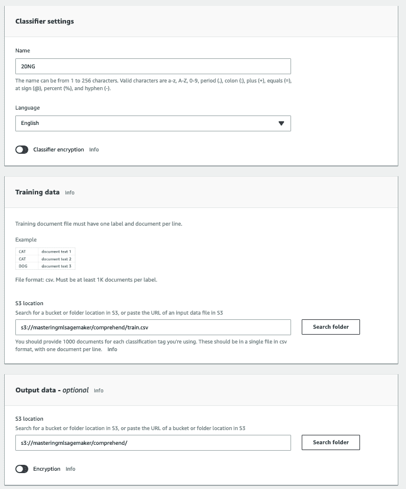
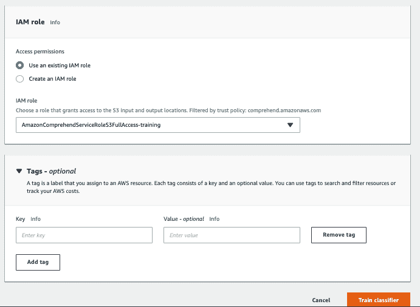
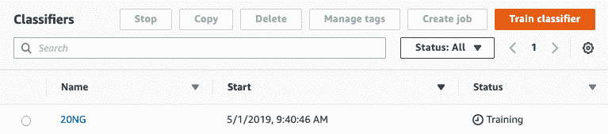
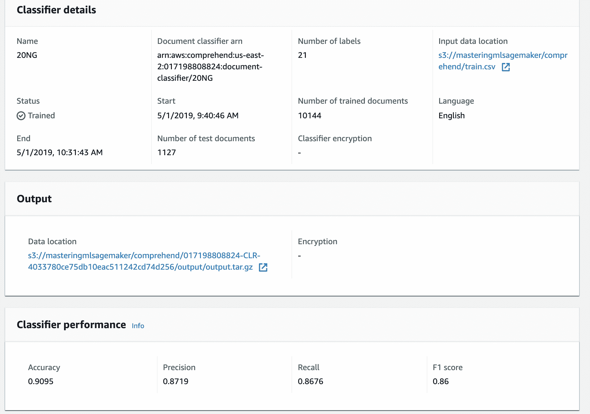
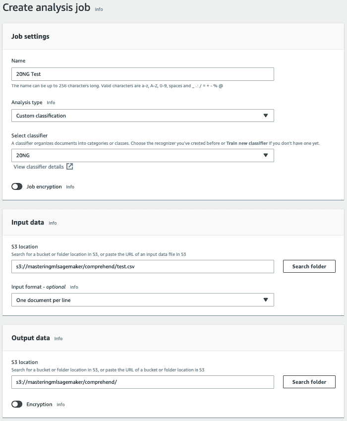

# 第十章：使用 AWS Comprehend

作为数据科学家，了解机器学习算法的工作原理非常重要。然而，构建自己的机器学习模型来执行某些任务可能并不高效，因为这需要大量的努力和时间来设计一个最优算法。在第十章 使用 AWS Comprehend、第十一章 使用 AWS Rekognition 和第十二章 使用 AWS Lex 构建对话界面 中，我们将探讨您可以在 AWS 中访问的 **机器学习即服务（MLaaS**）产品。这些产品允许您使用在 AWS 中预先训练的模型，无论是通过 AWS 仪表板还是 API 调用。

在本章中，我们将涵盖以下主题：

+   介绍 Amazon Comprehend

+   访问 Amazon Comprehend

+   使用 Comprehend 测试实体识别

+   使用 Comprehend 测试情感分析

+   使用 Comprehend API 实现文本分类

# 介绍 Amazon Comprehend

Amazon Comprehend 是 AWS 上提供的一项服务，它提供了自然语言处理（**NLP**）算法。NLP 是机器学习中的一个领域，它分析人类（自然）语言，并可以识别这些语言的多种属性。在我们之前的多数章节中，我们查看了一些结构化数据的示例。这些数据具有预定义的特征，并按观察值的行组织。然而，自然语言数据集更难以处理。这样的数据集被称为 **非结构化数据集**，因为特征的结构没有很好地定义。

因此，需要算法从文本文档中提取结构和信息。例如，自然语言中的单词是按照语法结构排列的。自然语言句子也有关键词，它们包含有关地点、人物和其他细节的更多信息。它们还有一个上下文，这非常难以学习，并且相同的单词根据它们的排列方式可能传达不同的含义。

NLP 领域研究如何处理这些文本文档并从中提取信息。NLP 不仅涉及对文档进行聚类和分类，还包括对数据进行预处理，以从文本中提取重要的关键词和实体信息。根据文本文档的领域，需要不同的预处理，因为书面文档的风格会变化。例如，医学和法律文本包含大量术语，并且结构良好。然而，如果您使用 NLP 算法处理 Twitter 数据，文本可能由语法较差的句子和标签组成。因此，根据数据的领域，您需要单独的过程来预处理数据以及如何训练模型。在训练 NLP 模型时通常需要领域专业知识。

AWS Comprehend 提供了训练机器学习模型和使用预训练模型执行自然语言处理任务的工具。它提供了实时仪表板来分析文本数据，同时也提供了使用其用户界面训练机器学习算法的工具。

在本章中，我们将探讨可以使用 AWS Comprehend 完成的四个自然语言处理任务。我们还将建议数据科学家何时应使用现成的工具，何时应投入时间构建自己的机器学习算法。

# 访问 AmazonComprehend

[Amazon Comprehend](https://aws.amazon.com/comprehend/) 可在 AWS 控制台中使用。当您登录 AWS 管理控制台时，在 AWS 服务框中搜索 Amazon Comprehend。选择 Amazon Comprehend 将带您进入 AWS Comprehend 启动屏幕，如下面的截图所示：



当您到达此屏幕时，请单击“启动 Comprehend”，这将带您进入 AWS Comprehend 仪表板。您应该能够从该页面访问以下部分使用的算法。

# 使用 Comprehend 进行命名实体识别

**命名实体识别**（**NER**）是自然语言处理中的一个领域，它对非结构化文本中提到的命名实体进行标记。命名实体包括人名、地名、组织等名称。例如，考虑以下句子：

Tim Cook 前往纽约参加苹果商店的开业。

在这个句子中，有三个命名实体。Tim Cook 是一个人的名字，New York 是一个城市的名称（位置），Apple 是一个组织的名称。因此，我们需要一个能够检测这些实体的 NER 模型。请注意，Apple 是一个歧义名词，因为它可以是公司或水果的名称。NER 算法应理解术语使用的上下文，并据此识别。

AWS Comprehend 提供了一个很好的 NER 工具，可以用来识别实体。此工具可以通过他们的仪表板或使用他们的 API 在实时中使用。AWS Comprehend 检测以下实体：

+   **商品**：品牌名称

+   **日期**：不同格式的日期

+   **事件**：音乐会、节日、选举等的名称

+   **位置**：城市、国家等的名称

+   **组织**：公司和国有组织的名称

+   **人物**：人名

+   **数量**：用于量化数字的常用单位

+   **标题**：电影、书籍等的名称

要访问 AWS 仪表板中的 NER，请转到菜单中的实时分析选项卡。然后您可以在页面提供的文本框中添加输入文本。以下截图展示了 Amazon Comprehend 如何执行 NER 任务：



您可以看到，Amazon Comprehend 中的 NER 工具会自动标记句子中的实体。除了标记实体的类别外，它还给出了一个置信度分数。这个分数可以用来确定我们是否信任工具的结果。

亚马逊 Comprehend 中的 NER 工具也可以通过 AWS 提供的 API 进行访问。

以下代码展示了如何调用 Comprehend 工具来获取实体分数：

```py
import boto3
import json

comprehend = boto3.client(service_name='comprehend') 

text = "Tim Cook traveled to New York for an Apple store opening"

print(json.dumps(comprehend.detect_entities(Text=text, LanguageCode='en'), sort_keys=True, indent=4)) 
```

你使用的是`boto3`包，这是一个 Python 的 AWS 工具包。我们首先初始化 Comprehend 客户端，然后将我们的文本传递给客户端以获取包含有关命名实体信息的 JSON 响应。在以下代码块中，我们可以看到我们从客户端收到的响应：

```py
{
  "Entities": [
    {
      "Score": 0.9999027252197266,
      "Type": "PERSON",
      "Text": "Tim Cook",
      "BeginOffset": 0,
      "EndOffset": 8
    },
    {
      "Score": 0.992688775062561,
      "Type": "LOCATION",
      "Text": "New York",
      "BeginOffset": 21,
      "EndOffset": 29
    },
    {
      "Score": 0.9699087738990784,
      "Type": "ORGANIZATION",
      "Text": "Apple",
      "BeginOffset": 37,
      "EndOffset": 42
    }
  ]
}
```

因此，解析 JSON 可以让我们了解文本中的实体信息。

你还可以在 AWS Comprehend 中使用自定义 NER 算法，通过左侧菜单中的自定义实体识别选项进行训练。你可以添加训练样本文档和实体标注列表。算法会自动学习如何在正确的上下文中标记这些实体，并更新现有模型。

NER 算法在各种应用中被应用。它们的一个重要应用领域是新闻聚合。你可以自动为文档生成标签，以便用户可以根据文档中的实体进行搜索。NER 在推荐算法领域也非常有用，其中 NER 用于检测关键词，我们可以创建一个新闻推荐算法。我们可以构建一个协同过滤模型，推荐关于当前文章读者可能感兴趣的实体的文章。

# 使用 Comprehend 进行情感分析

情感分析算法分析文本并根据文本中的情感或观点对其进行分类。情感分析检测文本中表达的主观观点。例如，亚马逊市场中的评论给出了对产品的良好或不良评价。使用情感分析，我们可以检测评论是正面还是负面。我们还可以识别评论中的情感细微差别，例如评论者对特定产品是愤怒、兴奋还是中立。在这个社交媒体时代，我们有大量途径来表达我们对产品、电影、政治等的观点。数据科学家使用情感分析算法分析大量数据，并根据非结构化文本数据提取关于某个实体的观点。

亚马逊 Comprehend 通过提供实时仪表板来分析文本中的情感，使得情感分析任务变得简单。你可以像访问 NER 算法一样访问情感分析仪表板。我们将提供两个示例，说明 Comprehend 如何对我们的数据进行情感分析。我查看了两篇亚马逊的评论，一篇是正面的，另一篇是负面的，并使用 Comprehend 对它们进行了情感分析。考虑以下截图中的第一个示例：



在这个例子中，评论者使用了诸如失望之类的词语。这些术语具有负面含义。然而，情感分析算法可以检测到用户在这个词之前也使用了负面词汇，并正确预测这段文本具有积极的情感。同样，考虑以下例子：



您可以看到，评论者最初对产品感到满意，但后来出现了问题。因此，评论者对产品不满意。因此，情感分析算法正确预测评论为负面的置信度为 70%。然而，它还预测在这篇评论中存在一些混合情感，并提供了 22% 的置信度。我们使用 softmax 方法对具有最高置信度的情感进行像素化。

情感分析也可以通过 Amazon API 获取。在这里，我们提供了示例代码，展示了如何使用 `boto3` Python 包调用情感分析 API：

```py
import boto3
import json

comprehend = boto3.client(service_name='comprehend') 

text = " It worked fine for the first 6 weeks, then I lost battery power I turned the phone off at night while charging, did not help. Then every else started to fail."

print(json.dumps(comprehend.detect_sentiment(Text=text, LanguageCode='en'), sort_keys=True, indent=4))
```

此 API 调用返回以下 JSON，其中包含有关文本情感的资料：

```py
{
    "Sentiment": {
        "Sentiment": "NEGATIVE",
        "SentimentScore": {
            "Positive": 0.03148878738284111,
            "Negative": 0.6730570793151855,
            "Neutral": 0.047707948833703995,
            "Mixed": 0.24774616956710815
        }
    }
}
```

您可以使用 API 对大量评论进行分类，以检测给定产品的整体情感。

情感分析是一个非常强大的工具，公司用它来分析社交媒体数据，以检测对其产品的整体情感，并确定用户为何对其产品不满意。电影评论聚合器，如烂番茄，也使用它来检测评论是正面还是负面，以便它们可以对它们进行分类并生成汇总评分。

# 使用 Comprehend 进行文本分类

文本分类是将文本文档分类到类别中的过程。与我们在第二章使用朴素贝叶斯分类 Twitter 流和第六章分析访问模式以提供建议中研究的分类算法类似，文本分类算法也基于标记的训练观察结果生成模型。然后，分类模型可以应用于任何观察结果以预测其类别。此外，我们在前几章中研究的相同算法，如第二章使用朴素贝叶斯分类 Twitter 流、第三章使用回归算法预测房屋价值和第四章使用基于树的预测用户行为，也可以用于文本分类。

文本数据是无结构数据。因此，我们需要从文本文档中生成特征，以便这些特征可以作为我们分类模型的输入。对于文本数据集，特征通常是文档中的术语。例如，考虑以下句子：

蒂姆·库克前往纽约参加苹果商店的开业。

让我们考虑该文档的类别为`Technology`。此句子将被翻译成以下结构化数据：

| `Tim Cook` | `traveled` | `to` | `New York` | `Apple` | `Store` | `Opening` | `Microsoft` | `Google` | `Class` |
| --- | --- | --- | --- | --- | --- | --- | --- | --- | --- |
| `1` | `1` | `1` | `1` | `1` | `1` | `1` | `0` | `0` | `Technology` |

每个术语都将被视为数据集中的特征。因此，对于包含许多文档的大型数据集，特征集可以与该语言的词汇表一样大。特征值根据该术语是否存在于该文档中设置为`0`或`1`。由于我们的示例包含诸如`Tim Cook`和`New York`之类的单词，这些特征的观察值设置为`1`。由于 Microsoft 和 Google 这两个术语在句子中不存在，这些特征的值设置为`0`。`Class`变量设置为`Technology`。

在本节中，我们将展示如何在 Comprehend 上逐步训练自定义分类器的方法。我们将使用一个流行的文本分类数据集**20 Newsgroups**来生成一个机器学习模型，该模型可以标记评论为正面或负面。数据集可以从[`archive.ics.uci.edu/ml/datasets/Twenty+Newsgroups`](https://archive.ics.uci.edu/ml/datasets/Twenty+Newsgroups)下载。

数据集可以下载为单独的文本文件，这些文件组织在 20 个文件夹中。每个文件夹的名称代表文件夹中文档的类别。该数据集是一个公开可用的数据集，它包含被分类到以下类别的新闻文章：

+   `alt.atheism`

+   `comp.graphics`

+   `comp.os.ms-windows.misc`

+   `comp.sys.ibm.pc.hardware`

+   `comp.sys.mac.hardware`

+   `comp.windows.x`

+   `misc.forsale`

+   `rec.autos`

+   `rec.motorcycles`

+   `rec.sport.baseball`

+   `rec.sport.hockey`

+   `sci.crypt`

+   `sci.electronics`

+   `sci.med`

+   `sci.space`

+   `soc.religion.christian`

+   `talk.politics.guns`

+   `talk.politics.mideast`

+   `talk.politics.misc`

+   `talk.religion.misc`

您可以使用以下步骤来训练分类器：

1.  第一步是将数据下载并预处理成 Comprehend 工具可读的格式。Comprehend 要求训练数据以以下 CSV（逗号分隔值）格式：

| **类别** | **文档** |
| --- | --- |

因此，一旦您下载了数据集，将其转换为上述格式并上传到您的 S3 存储桶。

1.  您可以在 Comprehend 仪表板的左侧自定义标签页下访问自定义分类工具。要训练模型，您必须点击“训练分类器”选项。请注意，Comprehend 允许您在此仪表板上训练您的机器学习模型并将它们存储起来，以便您将来使用。

当您点击“训练分类器”选项时，您将看到以下截图：



1.  为分类器命名并选择文档的语言。添加存储训练 CSV 文档的 S3 位置。选择正确的角色后，您可以给分类器添加相关标签，这有助于您在将来搜索它们。一旦您添加了所有信息，请点击训练分类器：



1.  您将被带回到仪表板屏幕，您将看到分类器训练正在进行。一旦训练完成，分类器的状态将被标记为已训练：



1.  然后，您可以点击分类器查看模型的评估指标。如您所见，我们的分类模型准确率为 90%：



1.  由于我们现在有一个经过训练的分类器，您可以使用此模型对任何文档进行预测。我们创建一个包含 100 个文档的`test.csv`文件，以从该模型获取预测。为了开始预测过程，请点击前一个屏幕上显示的“创建作业”选项。

这将带您进入另一个屏幕，您可以在其中添加有关您想要用于测试的文件以及输出应存储位置的详细信息：



在创建分析作业的屏幕上，添加有关要使用的分类器的详细信息：输入数据存储的位置（在 S3 上）以及输出存储的 S3 位置。您可以指定每行一个文档或每个文件一个文档的输入数据，并将输入数据指向包含所有文件的目录。在我们的示例中，由于`test.csv`文件每行包含一个文档，我们使用该格式。

1.  一旦您点击创建作业，它将自动对文档进行分类并将输出存储在输出位置。输出以 JSON 格式存储，其中`output`文件的每一行都包含对该行的分析。

以下是一个生成的输出示例：

```py
{
  "File": "test_2.csv",
  "Line": "0",
  "Classes": [
    {
      "Name": "alt.atheism",
      "Score": 0.8642
    },
    {
      "Name": "comp.graphics",
      "Score": 0.0381
    },
    {
      "Name": "comp.os.ms-windows.misc",
      "Score": 0.0372
    },
    ...
    {
      "Name": "talk.religion.misc",
      "Score": 0.0243
    }
  ]
}
```

因此，您可以看到我们的模型将输入文件的第一行标记为`"alt.atheism"`，置信度为 86.42%。

您还可以使用 Amazon Comprehend API 创建文档分类器和预测作业：

```py
import boto3

client = boto3.client('comprehend')
response = client.create_document_classifier(
    DocumentClassifierName='20NG-test',
    DataAccessRoleArn='Data Access ARN value',
     InputDataConfig={
         'S3Uri': 's3://masteringmlsagemaker/comprehend/train.csv'
     },
     OutputDataConfig={
         'S3Uri': 's3://masteringmlsagemaker/comprehend/'
     },
    LanguageCode='en')
```

运行此函数将自动生成我们在前一步骤中创建的相同分类器。您可以从“我的安全凭证”页面上的角色选项卡访问您的 ARN 值。这是我们在第 3 步中创建的相同 IAM 角色的 ARN 值。输出数据配置位置将自动获取分类器评估的混淆度量，响应字符串将返回如下：

```py
{
    'DocumentClassifierArn': 'string'
}
```

字符串将是标识分类器的 Amazon 资源名称。您还可以使用 API 运行预测作业。以下代码可以用于生成输入文件的预测：

```py
import boto3

client = boto3.client('comprehend')
response = client.start_document_classification_job( JobName='Testing Model', DocumentClassifierArn='<ARN of classifier returned in the previous step>', InputDataConfig={ 'S3Uri': 's3://masteringmlsagemaker/comprehend/test.csv', 'InputFormat': 'ONE_DOC_PER_LINE' }, OutputDataConfig={ 'S3Uri': 's3://masteringmlsagemaker/comprehend/', }, DataAccessRoleArn='<Data Access ARN value>')

```

上述代码将启动与我们在仪表板上创建的完全相同的分类作业。因此，您可以控制何时使用某个分类器，并根据需要在不同数据集上生成预测。函数的响应将是作业的状态。作业还将生成一个作业 ID，您可以使用`describe_document_classification_job()`函数 ping 该 ID 来检查作业的状态。

因此，我们已经在 AWS 上使用 Comprehend 工具生成了一个自定义文档分类器。这些工具将帮助您快速创建这些分类器，无需担心选择哪些分类算法、如何调整参数等问题。亚马逊会根据其研究团队的专长自动更新 Comprehend 使用的算法。然而，主要缺点是如果您在大数据集上运行操作，Comprehend 工具可能会很昂贵，因为它们按预测收费。您可以在[`aws.amazon.com/comprehend/pricing/`](https://aws.amazon.com/comprehend/pricing/)访问 AWS Comprehend 的定价信息。

# 摘要

在本章中，我们研究了如何在 AWS 中使用内置的机器学习工具 Comprehend。我们简要讨论了自然语言处理（NLP）领域，并介绍了其子领域，如命名实体识别（NER）和情感分析。我们还研究了如何使用 Comprehend 提供的仪表板创建自定义文档分类器。此外，我们还研究了如何使用 Python 中的`boto3`包访问 Comprehend 的 API。

这些工具非常吸引人，因为它们将帮助您快速创建复杂的机器学习模型，并开始将它们应用于您的应用程序中。现在，对 NLP 领域只有初步了解的数据科学家现在可以训练复杂的机器学习模型，并使用它们做出最优决策。然而，大多数数据科学家面临的问题是，这些工具提供的定价是否比使用 Python 包自行构建算法更经济。请注意，Comprehend 通过让数据科学家关注底层集群配置，在数据科学家和机器学习模型之间添加了一层抽象。根据我们的经验，我们在项目的快速原型阶段使用这些工具来评估产品。如果我们决定投入生产，很容易计算出使用 AWS 工具与自行构建算法并在我们的集群上维护它们之间的成本差异。

我们将在下一章介绍亚马逊 Rekognition。这项服务用于图像识别，是对象检测和类似应用的即用型解决方案。

# 练习

1.  您的任务是使用亚马逊 Comprehend 提供的 API 在大型数据集上执行命名实体识别（NER）。使用 Kaggle 竞赛中提供的标注 NER 数据集在 Comprehend 中创建自定义实体识别（[`www.kaggle.com/abhinavwalia95/chemdner-iob-annotated-chemical-named-etities`](https://www.kaggle.com/abhinavwalia95/chemdner-iob-annotated-chemical-named-etities)）。

1.  在 Kaggle 的 Yelp 数据集上应用情感分析，然后评估您的预测是否与评论评分相匹配（[`www.kaggle.com/yelp-dataset/yelp-dataset`](https://www.kaggle.com/yelp-dataset/yelp-dataset)）。
