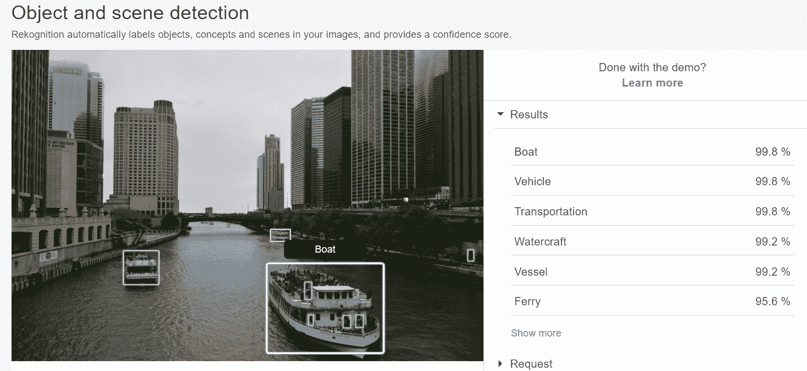
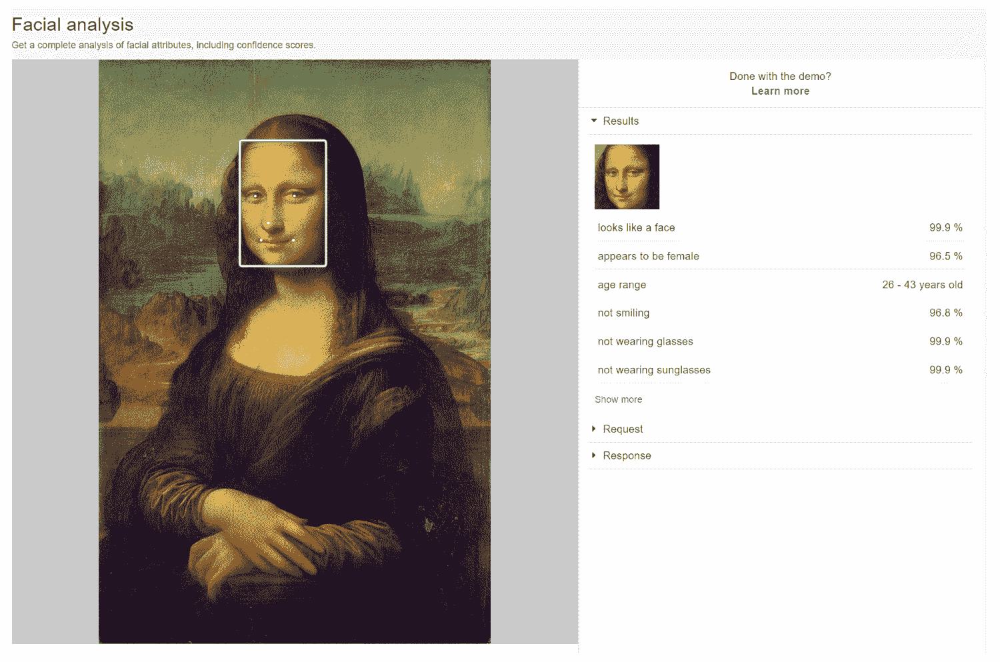
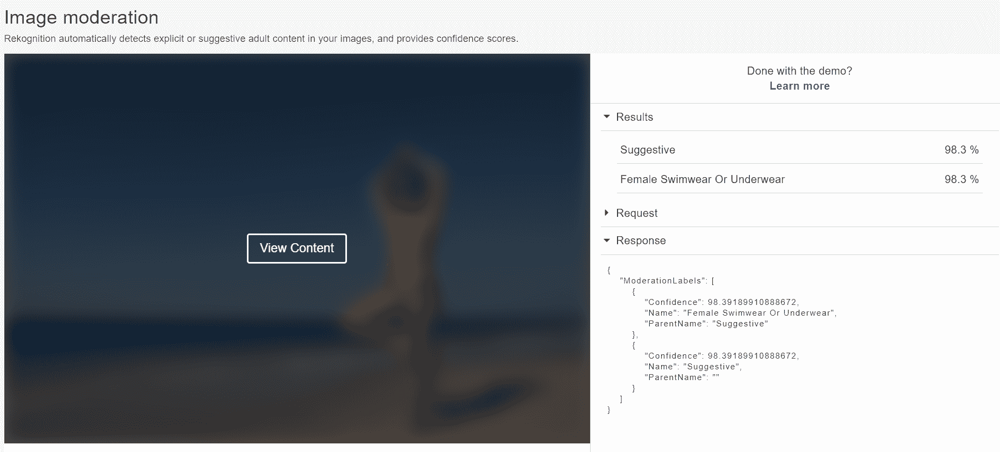
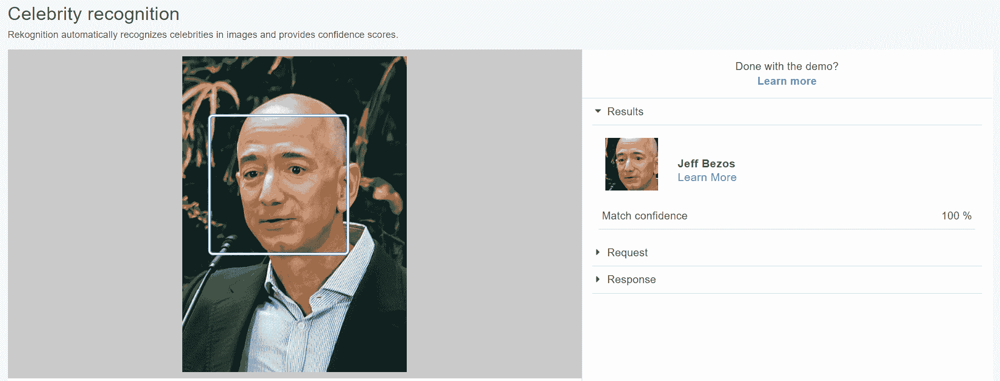
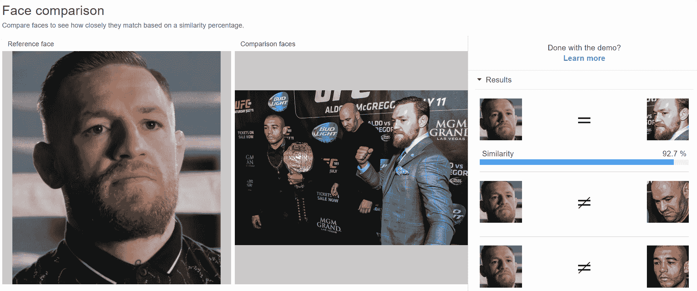
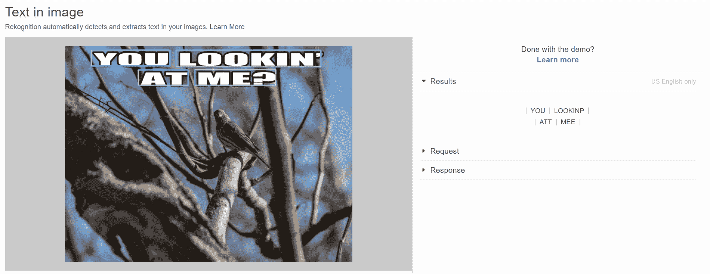

# 第十一章：使用 AWS Rekognition

我们在第七章，*实现深度学习算法*，和第九章，*使用 SageMaker 进行图像分类和检测*中研究了深度学习算法及其使用 SageMaker 的实现方法。你一定已经意识到训练一个好的**卷积神经网络**（**CNN**）需要大量的专业知识和资源。此外，它还需要大量的带有对象的标记图像。亚马逊提供了一个现成的图像识别解决方案，称为**Amazon Rekognition**，它提供了各种使用预训练图像识别模型的图像识别工具。

在本章中，我们将涵盖以下主题：

+   介绍 Amazon Rekognition

+   实现对象和场景检测

+   实现面部分析

# 介绍 Amazon Rekognition

使用深度学习构建图像识别模型非常具有挑战性。首先，你需要一个大型、标记的数据集来训练深度学习模型以执行特定任务。其次，你需要了解如何设计网络和调整参数以获得最佳精度。最后，在规模上训练这样的深度学习模型需要昂贵的基于 GPU 的集群来训练这些模型。

Amazon Rekognition ([`aws.amazon.com/rekognition/`](https://aws.amazon.com/rekognition/)) 是 AWS 提供的一个工具，它提供了已经预训练并可用于你应用程序中的图像识别模型。Amazon Rekognition 模型基于对数十亿个视频和图像的分析。类似于 **Amazon Comprehend** 提供作为服务的 NLP 模型，Rekognition 提供了各种可以执行特定任务的图像识别模型。使用 Amazon Rekognition 的优势在于，你可以简单地使用仪表板和 API 以高精度执行图像识别任务，而无需训练此类机器学习模型所需的高级专业知识。

Amazon Rekognition 只提供有限数量的模型，用于执行特定任务。在本节中，我们将查看 Amazon Rekognition 仪表板中可用的各种工具。我们还将探讨如何使用 Python 中的 AWS API 访问这些功能。

# 实现对象和场景检测

对象和场景检测算法可以识别图像中的各种对象，并为每个预测分配置信度。此算法使用标签层次结构来标记对象，并在检测到对象时返回所有叶节点。对象检测是图像识别的经典应用。它使我们能够识别图像中的内容并将其标记。例如，考虑一个新闻编辑室，摄影师每天提交数百张图片和视频。你需要有人标记这些图片，以便如果你希望访问在车祸中拍摄到的名人图像，这些图像库可以搜索。

目标检测允许您自动标记这些图像，以便它们可以高效地存储、组织和检索。目标检测算法的一个关键特性是它们必须全面，并且应该能够检测大量对象。此外，此类算法还检测对象的边缘，并且应该能够返回对象的边界框。Amazon Rekognition 有效地执行这两项任务。

您可以通过 AWS 控制台访问 Amazon Rekognition 仪表板。只需在搜索栏中搜索 Rekognition，您就可以访问 Amazon Rekognition 的演示。演示向您展示了工具的工作方式，但如果您想分析多个图像，则需要使用 API。

一旦您进入演示屏幕，选择对象和场景检测以访问一个演示，您可以在其中选择单个图像并检测对象中的图像。

为了演示的目的，我使用了芝加哥河上的渡轮截图：



如前一个截图所示，目标检测工具返回了图像中对象的排名列表以及检测的置信度。正如我们之前提到的，由于该工具使用类别层次结构，它可能会在顶部检测到相似类别。例如，它能够检测图像中的船。然而，它还以相同的置信度分数返回了车辆和交通类别。我们还可以看到，演示显示了它检测到的图像中每个对象的边界框。

然而，使用此工具进行目标检测可能很繁琐，因为它一次只能处理一张图像。因此，我们还可以使用 API 来访问 Amazon Rekognition 工具。您需要将图像上传到 S3 存储桶中的一个文件夹，以便在它们上执行目标检测。

以下 Python 代码可以用于对图像执行相同的操作：

```py
import boto3
import json

client = boto3.client('rekognition')
response = client.detect_labels( 
                Image={
                    'S3Object': 
                            {
                                 'Bucket': 'masteringmlsagemaker',
                                 'Name': 'ImageRecognition/chicago_boats.JPG'
                            }
                    },
                MaxLabels=5, 
                MinConfidence=90 
)

print(json.dumps(response, sort_keys=True, indent=4))

```

图像必须在 S3 存储桶中，并且您必须指定存储桶名称和图像名称作为请求函数的参数。响应很长，所以我们只显示了响应 JSON 中第一个预测的格式：

```py
{
  "LabelModelVersion": "2.0",
  "Labels": [
    {
      "Confidence": 99.86528778076172,
      "Instances": [
        {
          "BoundingBox": {
            "Height": 0.29408860206604004,
            "Left": 0.5391838550567627,
            "Top": 0.6836633682250977,
            "Width": 0.25161588191986084
          },
          "Confidence": 99.86528778076172
        },
        {
          "BoundingBox": {
            "Height": 0.11046414822340012,
            "Left": 0.23703880608081818,
            "Top": 0.6440696120262146,
            "Width": 0.07676628232002258
          },
          "Confidence": 99.5784912109375
        },
        {
          "BoundingBox": {
            "Height": 0.040305182337760925,
            "Left": 0.5480409860610962,
            "Top": 0.5758911967277527,
            "Width": 0.04315359890460968
          },
          "Confidence": 77.51519012451172
        }
      ],
      "Name": "Boat",
      "Parents": [
        {
          "Name": "Vehicle"
        },
        {
          "Name": "Transportation"
        }
      ]
    },
...
  ]
}
```

如您从响应中观察到的，我们在图像中发现了三个**`Boat`**对象的实例。响应提供了图像中找到的每个对象的边界框。此外，您还可以观察到最右侧的船很小，因此检测它的置信度远低于图像中的其他两艘船。响应还返回了对象在层次结构中的父级。因此，如果您有数百张图像需要分类，您可以将它们全部添加到 S3 存储桶中，并使用此代码遍历它们并检测这些对象的标签。由于有像 Amazon Rekognition 这样的工具，数据科学家现在可以访问世界级的深度学习模型，并将它们应用于他们正在构建的工具中。然而，这种对象检测算法仅适用于有限数量的对象。例如，我们尝试在这个工具中使用癌症 X 光图像的算法，但它无法返回任何结果。如果您正在开发一个非常专业的产品，试图检测肿瘤的医学图像或太空望远镜的图像，您将需要根据大量标记的图像训练自己的模型。

# 实现面部分析

Amazon Rekognition 还提供了一种强大的工具，可以对图像执行面部分析。它可以根据观察图像预测有趣的属性，如年龄和性别。它还可以从该模型检测到微笑或该人是否戴眼镜等特征。这样的模型将通过分析大量标记的面部图像，并训练一个图像识别模型来识别这些特征来训练。我们在第七章实现深度学习算法中研究的 CNN 模型非常适合此类应用，因为它可以使用局部感受野方法从图像中自动生成特征图，并检测包含这些面部特征的框。

面部分析演示可以像对象检测演示一样访问。为了测试模型，我们选择了莱昂纳多·达·芬奇的蒙娜丽莎画像。关于这幅画的一个长期谜团是画中的女士是否在微笑。

在下面的屏幕截图中，我们可以看到面部分析演示如何从图像中提供面部特征：



面部分析模型确实预测图像中存在面部，并围绕它创建了一个正确的框。它正确地预测了图像是女性，并为该人预测了年龄范围。它预测图像中的人没有在微笑。它还正确地预测了该人没有戴眼镜。

您也可以通过 API 调用访问相同的信息。

使用以下 Python 代码，您可以执行与前面演示中相同的面部分析任务：

```py
import boto3
import json

client = boto3.client('rekognition')
response = client.detect_faces(
    Image={
        'S3Object': {
            'Bucket': 'masteringmlsagemaker',
            'Name': 'ImageRecognition/monalisa.jpg'
        }
    },
    Attributes=['ALL']
)

print(json.dumps(response, sort_keys=True, indent=4))
```

你必须将你的图片存储在 S3 存储桶中，并向 API 调用提供存储桶和图片名称。你还可以指定需要返回的属性，或者指定`All`以获取所有属性。

此调用的响应以 JSON 格式呈现，如下所示：

```py
{
    "FaceDetails": [
        {
            "BoundingBox": {
                "Width": 0.22473210096359253,
                "Height": 0.21790461242198944,
                "Left": 0.35767847299575806,
                "Top": 0.13709242641925812
            },
            "AgeRange": {
                "Low": 26,
                "High": 43
            },
            "Smile": {
                "Value": false,
                "Confidence": 96.82086944580078
            },
            "Gender": {
                "Value": "Female",
                "Confidence": 96.50946044921875
            },
          "Emotions": [
                {
                    "Type": "CALM",
                    "Confidence": 34.63209533691406
                },
                {
                    "Type": "SAD",
                    "Confidence": 40.639801025390625
                }
            ],
            "Landmarks": [
                {
                    "Type": "eyeLeft",
                    "X": 0.39933907985687256,
                    "Y": 0.23376932740211487
                },
                {
                    "Type": "eyeRight",
                    "X": 0.49918869137763977,
                    "Y": 0.23316724598407745
                },
            "Confidence": 99.99974060058594
        }
    ]
}
```

我们已编辑此响应以保持简洁。然而，你可以观察到，你可以看到关于`年龄`、`性别`和`微笑`的信息，正如我们在演示中所见。然而，它还识别出脸上的情绪，如悲伤和平静。它还定位了脸上的地标，如眼睛、鼻子和嘴唇。

这些工具在当前智能手机中使用，微笑可以触发拍照。它们在餐厅的消费调查中使用，以衡量餐厅中人们的统计数据以及他们是否对服务满意。

# 其他 Rekognition 服务

Amazon Rekognition 还提供其他图像识别服务。你可以使用本章中的示例来访问这些服务。我们将在此列出一些服务及其应用。

# 图片审查

我们可以使用 Rekognition 来监控图片并检查内容是否具有暗示性或不安全。此类技术用于调节实时视频服务，如 Twitch 或 Facebook Live，其中**人工智能**（**AI**）可以自动检测不安全内容。由于 YouTube 或 Instagram 等服务每天上传的数据量巨大，使用此类 AI 技术可以帮助降低平台监管的成本。

以下截图显示了图片审查工具如何检测图片中的暗示性主题并自动标记它们：



# 明星识别

识别还可以用于自动检测图片或视频中的名人。这可以通过从标记的图片和视频中学习的图像识别模型来完成。深度学习算法可以自动提取面部特征，然后进行比较以预测可能是哪位名人。例如，Amazon Prime 等服务上的许多电影和电视节目可以使用此技术显示屏幕上的演员名字。手动标记这些场景中的演员名字可能是一项非常繁琐的任务；然而，深度学习算法可以自动完成这项工作。

在以下示例中，Amazon Rekognition 检测到一张杰夫·贝索斯的图片并将其正确标记：



# 面部比较

明星识别技术可以进一步扩展，用于面部比较和检测相似的面部。例如，您的 Facebook 账户会自动将您上传的图片中的面部与您的朋友匹配，并自动标记图片。他们使用这样的图像识别算法来训练每个面部的模型，并在您上传的图片上运行这些模型以检测您的朋友是否在图片中。Amazon Rekognition 还提供了一种名为 **面部比较** 的功能，该功能比较两张图片中的面部，并检测是否有人在两张图片中都出现。

在以下截图中，我们可以观察到面部比较算法可以自动匹配两张图片中的面部并检测哪些面部彼此相似：



Amazon Rekognition 还提供另一种可以检测图片中文本的工具。此模型与我们第八章实现 AWS 上的 TensorFlow 深度学习中构建的类似，我们的模型能够检测数字。此工具在读取现实世界中的文本也非常有用。例如，Google Translate 这样的应用可以分析相机图像并将它们翻译成您的母语。自动驾驶汽车也可以使用这项技术来读取路标并做出相应反应。

以下截图显示了 Amazon Rekognition 如何检测图像中的文本：



该识别在此图片上工作不准确，但能够框选并重新创建此图片中的文本。

在本节中，我们没有提供这些服务的代码示例。API 调用与我们在本节前两个工具中讨论的内容类似。我们鼓励您尝试这些服务的 API 调用并测试它们的工作方式。

# 摘要

Amazon Rekognition 允许数据科学家通过 API 调用访问高质量的图像识别算法。使用深度学习最大的障碍之一是生成大量数据集和运行昂贵的基于 GPU 的集群来训练模型。AWS Rekognition 使用户能够更容易地访问这些功能，而无需具备训练此类模型所需的专业知识。应用开发者可以专注于构建功能，而无需花费大量时间在深度学习任务上。在本章中，我们研究了 Amazon Rekognition 中可用的各种工具，还学习了如何进行 API 调用和读取响应 JSON。此外，我们还研究了这些工具可能有用的一些应用场景。

在下一章中，我们将演示如何使用名为 Amazon Lex 的服务构建自动聊天机器人。

# 练习

1.  使用 Python 创建一个应用程序，你可以传递一张团体照片，并检测当时房间的情绪。提供基于面部分析工具的代码检测细节，以及你是如何总结结果以在照片中找到情绪的。

1.  创建一个工具，用于识别电影剪辑中的演员，并给出演员出现在屏幕上的时间。
