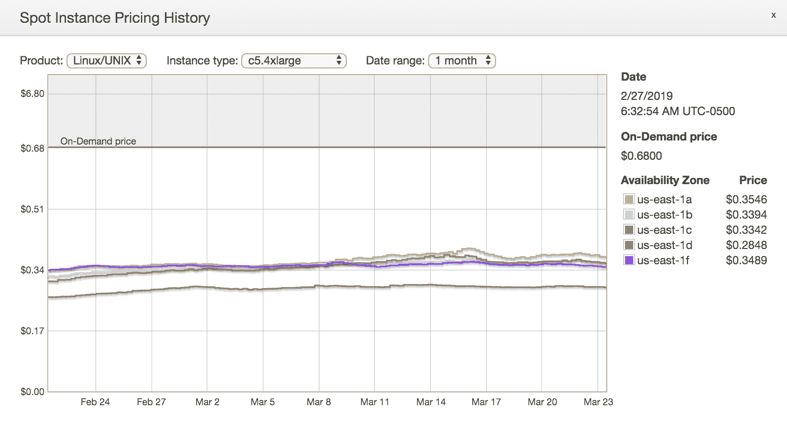
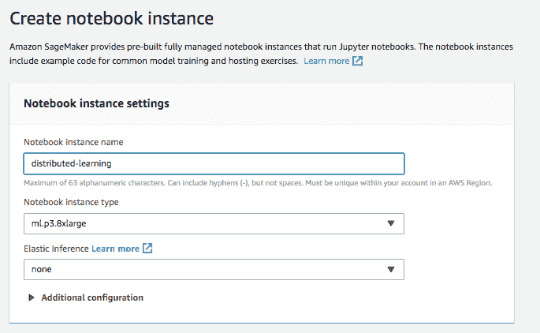

# 在 AWS 上创建集群

机器学习中的一个关键问题是如何在多台机器上扩展和并行化学习。无论你是训练深度学习模型，这些模型对硬件的使用非常重，还是仅仅为了创建预测而启动机器，选择合适的硬件配置对于成本考虑和运行时性能都是至关重要的。

在本章中，我们将涵盖以下主题：

+   选择您的实例类型

+   分布式深度学习

# 选择您的实例类型

在第四章“使用基于树的算法预测用户行为”和其他章节中，我们不得不启动 EMR 集群和 SageMaker 实例（服务器）来进行学习和模型服务。在本节中，我们讨论了不同实例类型的特性。在本章中，你可以找到 AWS 提供的所有支持的实例类型，请参阅`aws.amazon.com/ec2/instance-types/`。

根据手头的任务，我们应该使用不同的实例类型。例如，我们可能需要一个带有 GPU 而不是 CPU 的实例类型来进行深度学习。当在 Apache Spark 上启动大型迭代**提取、转换和加载**（**ETL**）（即数据转换作业）时，我们可能需要大量的内存。为了使用户更容易操作，AWS 已经将实例分类为针对不同用例的系列。此外，AWS 为每个系列不断提供新的硬件配置。这些被称为**代**。通常，新一代提供了比上一代更好的性能。然而，旧一代通常仍然可用。反过来，每个系列在计算和内存能力方面都有不同大小的机器。

最常用的系列如下：

+   计算优化型（C 系列）

+   内存优化型（M 系列）

+   加速计算型（P 系列）

+   存储优化型（I 系列）

+   通用型（R 系列）

每个优化目标都有其他系列，但在之前的列表中，我们列出了每个系列中最常用的一个。每个系列可能具有不同的配置。下表显示了 C 系列和 M 系列的一些配置。每个配置都有不同的价格。例如，在撰写本文时，AWS us-east-1 区域第五代 xlarge 和 C 系列机器的价格为每小时 0.085 美元。正如您所看到的，在给定的价格水平上，用户可以选择支付具有更多内存和较少计算能力的配置，或者相反。下表中的**内存（GB）**列显示的是千兆字节的值，而 vCPUs 是虚拟机中的处理能力单位，由 AWS 测量。表中的价格只是参考价格，对应于 2019 年 3 月 AWS 弗吉尼亚数据中心区域的价格。目前，AWS 按机器开启的每秒钟收费（即，尽管价格显示为每小时金额，但机器可以运行 120 秒，用户只需支付相应的小时价格的一部分）：

| **模型** | **vCPU** | **内存（GB）** | **On-demand 价格（us-east-1 区域）** |
| --- | --- | --- | --- |
| c5.large | 2 | 4 | $0.085 per hour |
| c5.xlarge | 4 | 8 | $0.17 per hour |
| c5.2xlarge | 8 | 16 | $0.34 per hour |
| c5.4xlarge | 16 | 32 | $0.68 per hour |
| m5.large | 2 | 8 | $0.096 per hour |
| m5.xlarge | 4 | 16 | $0.192 per hour |
| m5.2xlarge | 8 | 32 | $0.384 per hour |

给定配置的价格可能会因多种因素而变化，具体如下：

+   机器的区域（数据中心）

+   实例是否请求为 spot 或 on-demand

+   使用预留定价

# On-demand 与 spot 实例定价

On-demand 是请求云中机器最灵活的方式。on-demand 实例的价格是固定的，一旦启动机器，就保证其持续运行（除非发生错误或 AWS 正在实验容量问题，这极为罕见）。另一方面，spot 定价基于拍卖。AWS 有一系列过剩容量机器，通常以低于 on-demand 的价格拍卖。为了获得这样的机器，在启动时，用户需要指定他或她愿意为这样的实例支付多少。如果当前市场价格低于出价价值，机器将成功配置。一旦市场价格超过出价，机器就可以从用户那里收回。因此，如果您使用 spot 定价，您需要知道机器可以在任何时候关闭。话虽如此，根据我们的经验，spot 定价对于大规模（数千台机器）生产工作负载可以可靠地成功。重要的是要适当地选择出价价格和机器配置，并准备好根据 spot 市场价格的变化不时地更改这些配置。

在以下链接中，您可以检查不同地区和可用区域（这些是区域内的独立隔离数据中心）中每种实例类型的市值：[`console.aws.amazon.com/ec2sp/v1/spot/home?region=us-east-1#`](https://console.aws.amazon.com/ec2sp/v1/spot/home?region=us-east-1#)



上述图表显示了 2019 年 3 月至 2 月期间 **c5.4xlarge** 机器的市场价格。读者可能会注意到，区域 **us-east-1d** 的市场价格似乎比其他地区低。这意味着，只要可能，您可以在该区域以较低出价请求 spot 实例。

目前，SageMaker 不支持 spot 定价，只允许按需实例。此外，还有针对 SageMaker 支持的实例的不同价格表，您可以通过以下链接找到：[`aws.amazon.com/sagemaker/pricing/`](https://aws.amazon.com/sagemaker/pricing/)。SageMaker 可以用于不同的事情（笔记、训练作业、批量转换作业、端点等），因此有不同的价格。

对于 **弹性映射减少**（**EMR**），它确实支持 spot 实例。然而，当通过 EMR 启动时，会额外增加原始实例类型成本的一小部分。

# 预留定价

如果您提前准确估计了您的计算需求，可以降低成本。在这种情况下，您可以预先支付 AWS 并获得按需实例的显著折扣。例如，如果您计划在一年内为 m5.xlarge 机器花费 1,000 美元，您可以选择预先支付 1,000 美元并获得 40% 的节省。您预付的越多，节省率就越高。

详细信息可以在以下链接中找到：[`aws.amazon.com/ec2/pricing/reserved-instances/pricing/`](https://aws.amazon.com/ec2/pricing/reserved-instances/pricing/)[   ](https://aws.amazon.com/ec2/pricing/reserved-instances/pricing/)

# 亚马逊机器镜像（AMIs）

机器可以通过 **弹性计算** 服务（[`aws.amazon.com/ec2`](https://aws.amazon.com/ec2)）直接在 EMR 或 SageMaker 外启动。当你想在 AWS 云上部署自己的应用程序或想自定义配置实例上可用的软件包时，这非常有用。通过 EC2 启动实例时，你可以选择一个 AMI，机器将带有为你的应用程序所需的所有库和软件包。你可以从一个正在运行的实例创建自己的 AMI，以便稍后重用或通过 Docker 规范。然而，AWS 提供了几个预配置的 AMI，这些 AMI 对于深度学习非常有用。我们强烈建议您通过此链接查看可用的 AMI：[`aws.amazon.com/machine-learning/amis/`](https://aws.amazon.com/machine-learning/amis/)。这些 AMI 包括最常见的机器学习软件包（如 TensorFlow、Anaconda 和 scikit-learn），以确保不同库版本之间的兼容性（通常是一个棘手的问题）。这些 **深度学习 AMI** 通常被称为 **DLAMIs**。

# 深度学习硬件

AWS 中的大多数实例类型都是基于 CPU 的。CPU 实例通常适用于执行各种顺序任务。然而，加速计算实例类型（例如，P 或 G 系列）是基于 **图形处理单元**（**GPU**）。这些最初在游戏机上流行的实例类型，最终被证明非常适合深度学习。GPU 的特点是拥有比 CPU 更多的核心，但处理能力较低。因此，GPU 能够快速并行处理简单的指令。

尤其是 GPU 允许进行非常快速和并行的矩阵乘法。回想一下 第七章，*实现深度学习算法*，深度学习涉及将权重与不同层输入的信号相乘，就像向量点积一样。实际上，矩阵乘法涉及同时进行多个列和行的点积。矩阵乘法通常是深度学习中的主要瓶颈，而 GPU 极擅长执行此类操作，因为有机会并行进行大量计算。

在以下表格中，我们可以看到用于深度学习的典型机器配置及其相关特性。当涉及到分配深度学习工作负载时，GPU 数量和网络性能尤其重要，我们将在以下章节中讨论：

| **模型** | **GPU** | **vCPU** | **Mem (GiB)** | **GPU Mem (GiB)** | **网络性能** |
| --- | --- | --- | --- | --- | --- |
| p3.2xlarge | 1 | 8 | 61 | 16 | 最高 10 吉比特 |
| p3.8xlarge | 4 | 32 | 244 | 64 | 10 吉比特 |
| p3.16xlarge | 8 | 64 | 488 | 128 | 25 吉比特 |

弹性推理加速

2018 年，AWS 宣布了一个新功能，允许我们通过网络以 GPU 实例的一小部分成本将通过基于 GPU 的加速设备附加的常规实例组合起来。详细信息可以在 [`docs.aws.amazon.com/sagemaker/latest/dg/ei.htm`](https://docs.aws.amazon.com/sagemaker/latest/dg/ei.htm) 找到。

# 分布式深度学习

让我们接下来探索 **分布式深度学习** 概念。

# 模型与数据并行化

当训练大量数据或网络结构巨大时，我们通常需要在不同的机器/线程之间分发训练，以便可以并行执行学习。这种并行化可能发生在具有多个 GPU 的单台机器内，或者通过网络在不同机器之间同步。分发深度学习工作负载的两种主要策略是数据并行化和模型并行化。

在数据并行化中，我们使用相同的权重（即相同的模型）并行运行多个小批量。这意味着在一系列运行中同步不同小批量的权重。合并不同并行运行权重的策略之一是将每个并行小批量产生的权重进行平均。使用允许以分布式方式合并梯度而不需要中央合并器的算法（如 **AllReduce**）来平均每个机器或线程的梯度是一种有效的方法。其他替代方案包括托管一个参数服务器，该服务器充当同步权重的中央位置。

模型并行化，另一方面，涉及不同的线程或机器在并行处理相同的 mini-batch 的同时，分发实际的处理。正在运行的算法需要能够在不同的线程中分发工作。这种方法通常在具有多个 GPU 且共享高速总线的机器上运行良好，因为模型并行化通常只需要在每个前向传递后同步每个层的输出。然而，这种同步可能涉及的数据量可能比数据并行化中的权重同步多或少，这取决于网络的结构。

# 分布式 TensorFlow

**TensorFlow** 本地支持在具有多个 GPU 的单台机器上使用 **AllReduce** 进行数据并行化。TensorFlow 中通过 TensorFlow 分发学习的算法是一个活跃的开发领域。

例如，我们可以启动一个具有多个 GPU 的笔记本实例：



在这个例子中，我们有一个四 GPU 机器。让我们看看我们如何修改代码来适应我们在 第八章 中考虑的回归估计器，*在 AWS 上使用 TensorFlow 实现深度学习*。回想一下，我们使用了 `LinearRegressor` 来解决我们的房屋价值估计问题。为了在 GPU 之间启用分布式学习，我们需要定义一个分布策略。

最简单的是`MirroredStrategy`，它使用 AllReduce 技术。这种策略被实例化并作为输入提交给回归器，正如我们在下面的代码块中所示：

```py
distribution = tf.contrib.distribute.MirroredStrategy(num_gpus=4)
config = tf.estimator.RunConfig(train_distribute=distribution)

tf_regressor = tf.estimator.LinearRegressor(
  config=config,
  optimizer=tf.train.GradientDescentOptimizer(learning_rate=0.0000001),
  feature_columns=[tf.feature_column.numeric_column('inputs', 
                                  shape=(11,))],
)
```

目前，分布策略支持接受学习率作为输入的`GradientDescentOptimizer`。此外，与我们在第八章，*在 AWS 上使用 TensorFlow 实现深度学习*中所做的方法相比，提供输入函数的方式需要稍作改变。在分布式处理中，输入函数需要返回我们通过`pandas`的`as_matrix()`函数获得的张量创建的`tf.Dataset`：

```py
def training_input_fn():
  return tf.data.Dataset.from_tensor_slices(
        ({'inputs': training_df[training_features].as_matrix()},             
         training_df[label].as_matrix())).repeat(50).batch(1)
```

训练方式与我们在第八章，*在 AWS 上使用 TensorFlow 实现深度学习*中做的一样：

```py
tf_regressor.train(input_fn=training_input_fn)
```

在`train_distributed_tensorflow.ipynb`笔记本中，你可以看到完整的示例。在这个特定的玩具示例中，分布式学习并不合理。然而，它应该为读者提供一个参考，因为目前关于如何在多 CPU 环境中成功进行训练的文档和示例并不多。

# 通过 Apache Spark 进行分布式学习

在前面的章节中，我们展示了如何通过 Spark ML 库使用 Apache Spark 进行分布式机器学习。然而，如果你想要将 Apache Spark 与 TensorFlow 等深度学习库结合使用，则可以获得显著的好处。

# 数据并行化

在这个方案中，相同的迷你批次在 Spark 执行器中并行运行（类似于映射转换），权重被平均（类似于归约操作）。例如，SparkFlow ([`github.com/lifeomic/sparkflow`](https://github.com/lifeomic/sparkflow))这样的工具允许我们定义一个简单的 TensorFlow 模型（例如我们在第八章，*在 AWS 上使用 TensorFlow 实现深度学习*)中开发的模型）并通过让 Spark 驱动器充当参数服务器来执行并行训练。通过这个库，我们可以使用作为 TensorFlow 图智能包装器的管道抽象（估计器和转换器）。同样，BigDL ([`bigdl-project.github.io`](https://bigdl-project.github.io/))允许我们使用`allreduce` **随机梯度下降**（**SGD**）实现来分布深度学习训练。

# 模型并行化

在撰写本章时，没有本机库允许我们通过 Apache Spark 使用 TensorFlow 进行模型并行化。然而，Apache Spark 确实提供了一个**多层感知器分类器**（**MLPC**）（[`spark.apache.org/docs/latest/ml-classification-regression.html#multilayer-perceptron-classifier`](https://spark.apache.org/docs/latest/ml-classification-regression.html#multilayer-perceptron-classifier)）的实现，该实现通过 Apache Spark 实现模型并行化。与 TensorFlow 等库的强大功能相比，这种实现相对简单。例如，网络结构和激活函数是固定的。你只能定义层数和少数其他参数。尽管如此，由于你的数据管道已经在 Spark 中，这是一个开始分布式深度学习的良好方式。

# 分布式超参数调整

通过拥有一个 Spark 集群，可以在不同的机器上训练同一神经网络的变体。这些变体可能具有不同的超参数，甚至稍微不同的网络结构。例如，你可能想要切换特定层的激活函数。如果我们事先预定义所有这些神经网络的组合，Spark 可以通过简单的`map()`转换来执行。每个并行训练作业都可以返回生成的模型以及损失指标。例如，`sparkdl`库（[`github.com/databricks/spark-deep-learning`](https://github.com/databricks/spark-deep-learning)）提供了执行此类任务的良好工具（特别是如果你正在处理图像）。我们将在第十五章调整集群以进行机器学习中更详细地介绍超参数调整。

# 分布式大规模预测

一旦我们有了序列化的模型，就可以通过将模型发送到不同的执行器并将它应用于 Spark 分布式数据来并行地进行预测。例如，`sparkdl`库实现了 Keras 转换器，它可以在给定 Keras 模型（如我们在第八章在 AWS 上使用 TensorFlow 实现深度学习中开发的模型）的情况下进行分布式预测。

# SageMaker 中的并行化

在上一节中确定的大多数用例也可以仅通过使用**SageMaker**轻松解决。使用 SageMaker，我们可以启动多个实例，执行不同模型的并行训练变体。SageMaker 的许多内置算法都是设计用来执行模型并行化的，这就是为什么我们通常指定用于训练的机器数量（和类型）。此外，它还提供了高级参数调整功能，我们将在第十五章“调整集群以适应机器学习”中探讨。最后，分布式预测是通过批量转换作业完成的，例如我们在第四章“使用基于树的预测用户行为”中展示的。

# 摘要

在本章中，我们介绍了关于如何选择训练集群机器类型的基本考虑因素。这些考虑因素包括在成本、内存大小、计算能力和供应限制之间进行权衡。至于深度学习，我们提供了一个如何在 SageMaker 笔记本上运行分布式 TensorFlow 的具体示例，以及一些如何在 EMR 上通过 Apache Spark 进一步分布式你的深度学习管道的指南。在下一章“在 Spark 和 SageMaker 中优化模型”中，我们将深入探讨从模型准确性的角度调整我们的模型以实现最佳性能的问题。
