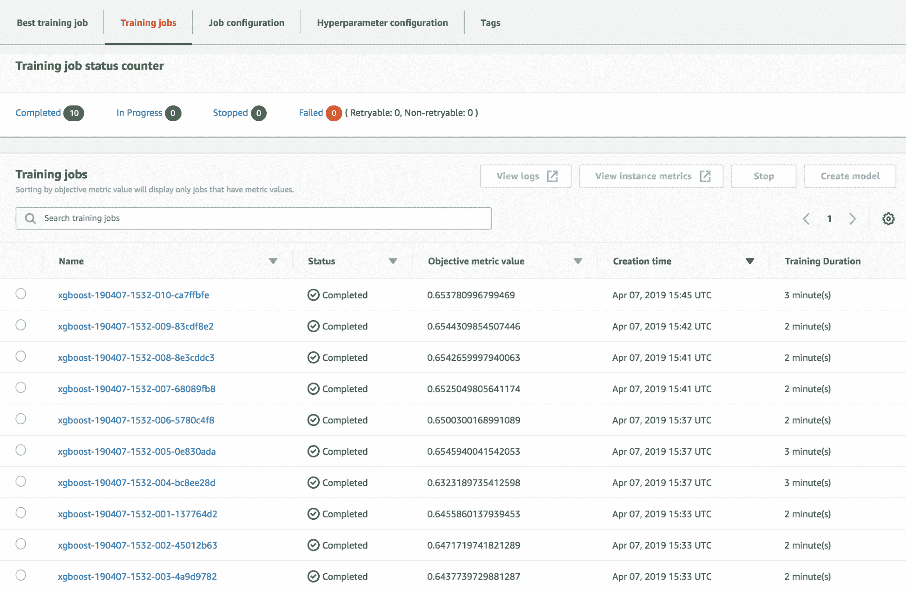

# 在 Spark 和 SageMaker 中优化模型

在 AWS 上训练的模型可以通过修改训练指令或超参数进行进一步优化。在本章中，我们将讨论读者可以使用来提高其算法性能的各种技术。

在本章中，我们将涵盖以下主题：

+   模型优化的重要性

+   自动超参数调整

+   Apache Spark 和 SageMaker 中的超参数调整

# 模型优化的重要性

很少有算法在第一次尝试就能产生优化的模型。这是因为算法可能需要数据科学家进行一些参数调整以提高其准确性或性能。例如，我们在第七章中提到的学习率，*实现深度学习算法*，对于深度神经网络需要手动调整。低学习率可能导致算法运行时间更长（如果我们是在云上运行，那么成本更高），而高学习率可能会错过最优的权重集。同样，具有更多层的树可能需要更多时间来训练，但可能创建一个具有更好预测能力的模型（尽管它也可能导致树过度拟合）。这些指导算法学习的参数被称为**超参数**，与模型参数（例如，网络的权重）不同，这些参数在整个训练过程中并没有被学习。一些超参数不仅用于优化或调整模型，还用于定义或约束问题。例如，簇的数量也被视为超参数，尽管这并不是真的关于优化，而是用于定义要解决的问题。

调整这些超参数以获得最佳性能并非易事，在许多情况下，它需要理解手头的数据以及底层算法的工作方式。那么，为什么不学习这些超参数呢？许多数据科学家使用调整这些超参数值的算法来查看它们是否会产生更准确的结果。这种方法的缺点是，我们可能会找到在测试数据集上最优的超参数，而我们可能会认为我们的模型具有更好的准确性，当我们只是过度拟合测试数据集时。因此，我们通常将数据集分为三个部分：训练数据集，用于训练模型；验证数据集，用于参数调整；测试数据集，仅在参数调整完成后用于评估模型的最终准确性。

# 自动超参数调整

调整超参数的最简单方法被称为网格搜索。我们为每个超参数定义我们想要尝试的不同值。例如，如果我们正在训练树，我们可能想要尝试深度为 5、10 和 15。同时，我们还想看看最佳杂质度量是否是信息增益或基尼系数。这总共创建了六种组合，需要测试以确定准确性。正如你可能预料到的，组合的数量将随着要考虑的超参数数量的指数增长。因此，其他技术被用来避免测试所有可能的组合。一种简单的方法是随机化要尝试的组合。一些组合可能会被遗漏，但一些变化将在没有归纳偏差的情况下被测试。

AWS SageMaker 提供了一个智能选择要测试的超参数的调优服务。在网格搜索和随机化中，每次训练运行都不会使用先前运行中获得的准确性信息。SageMaker 使用一种称为**贝叶斯优化**的技术，能够根据先前测试组合的准确性值选择下一组要测试的超参数组合。该算法背后的主要思想是在超参数空间上构建一个概率分布。每次我们获得给定组合的准确性时，概率分布都会调整以反映新的信息。成功的优化将利用已知组合的信息，这些组合产生了良好的准确性，以及对新组合的充分探索，这些新组合可能导致潜在改进。你会欣赏这是一个极其困难的问题，因为每次训练运行都很慢，可能也很昂贵。我们通常负担不起测试太多的组合。

# Apache Spark 中的超参数调整

回想一下我们来自第三章的回归问题，预测房价的回归算法，其中我们构建了一个线性回归来估计房屋的价值。在那个阶段，我们为超参数使用了一些任意值。

在下面的代码块中，我们将展示 Apache Spark 如何测试`elasticNetParam`、`regParam`和`solver`的 18 种不同的超参数组合：

```py
from pyspark.ml.tuning import CrossValidator, ParamGridBuilder
from pyspark.ml import Pipeline

linear = LinearRegression(featuresCol="features", labelCol="medv")
param_grid = ParamGridBuilder() \
  .addGrid(linear.elasticNetParam, [0.01, 0.02, 0.05]) \
  .addGrid(linear.solver, ['normal', 'l-bfgs']) \
  .addGrid(linear.regParam, [0.4, 0.5, 0.6]).build()

pipeline = Pipeline(stages=[vector_assembler, linear])
crossval = CrossValidator(estimator=pipeline,
                        estimatorParamMaps=param_grid,
                        evaluator=evaluator,
                        numFolds=10)
optimized_model = crossval.fit(housing_df)
```

我们将像往常一样开始构建我们的分类器，不提供任何超参数。我们将回归器存储在`linear`变量中。接下来，我们通过定义一个参数网格来定义要测试的每个超参数的不同值。设置值的方法的函数引用被传递给`ParamGridBuilder`，它负责保持要测试的组合。

与往常一样，我们可以使用任何预处理阶段（在这种情况下，我们使用向量组装器）来定义我们的管道。`CrossValidator`接受管道、参数网格和评估器。回想一下，评估器被用来使用测试数据集获得一个特定的分数：

```py
evaluator = RegressionEvaluator(labelCol="medv", predictionCol="prediction", metricName="r2")
```

在这种情况下，我们将使用与第三章，*使用回归算法预测房价*中相同的 R2 指标。`CrossValidator`在调用`fit()`时将运行所有组合，并找到实现最高 R2 值的超参数。

一旦完成，我们可以通过访问`optimized_model.bestModel`引用来检查底层最佳模型。通过它，我们可以展示在最佳模型中实际使用的超参数集：

```py
[(k.name, v) for (k, v) in optimized_model.bestModel.stages[1].extractParamMap().items()]
```

上述语句的输出如下：

```py
[('epsilon', 1.35),
('featuresCol', 'features'),
('predictionCol', 'prediction'),
('loss', 'squaredError'),
('elasticNetParam', 0.02),
('regParam', 0.6),
('maxIter', 100),
('labelCol', 'medv'),
('tol', 1e-06),
('standardization', True),
('aggregationDepth', 2),
('fitIntercept', True),
('solver', 'l-bfgs')]
```

然而，比实际使用的参数更有趣的是看到不同组合测试中的准确度变化。`optimized_model.avgMetrics`值将显示所有 18 个超参数组合的准确度值：

`[0.60228046689935, 0.6022857524897973, ... 0.6034106428627964, 0.6034118340373834]`

我们可以使用`CrossValidator`返回的`optimized_model`来使用最佳模型进行预测，因为它也是一个转换器：

```py
_, test_df = housing_df.randomSplit([0.8, 0.2], seed=17)
evaluator.evaluate(optimized_model.transform(test_df))
```

在这种情况下，我们得到了一个 R2 值为 0.72，这比我们在第三章中，*使用回归算法预测房价*所得到的任意超参数集要好一些。

# SageMaker 中的超参数调整

正如我们在上一节中提到的，*自动超参数调整*，SageMaker 有一个使用贝叶斯优化的智能参数调整库。在本节中，我们将展示如何进一步调整我们在第四章，*使用基于树的预测用户行为*中创建的模型。回想一下，在那个章节中，我们提出了一个二元分类问题，试图预测用户是否会点击广告。我们使用了`xgboost`模型，但在那个阶段我们还没有进行任何参数调整。

我们将首先创建 SageMaker 会话并选择`xgboost:`

```py
import boto3
import sagemaker
from sagemaker import get_execution_role

sess = sagemaker.Session()
role = get_execution_role()
container = sagemaker.amazon.amazon_estimator.get_image_uri('us-east-1', "xgboost", "latest")

s3_validation_data = 's3://mastering-ml-aws/chapter4/test-vector-csv/'
s3_train_data = 's3://mastering-ml-aws/chapter4/training-vector-csv/'
s3_output_location = 's3://mastering-ml-aws/chapter14/output/'

```

接下来，我们定义估计器，就像我们在[第四章](https://cdp.packtpub.com/mastering_machine_learning_on_aws/wp-admin/post.php?post=39&action=edit#post_27)，*使用基于树的预测用户行为*中所做的那样：

```py
sagemaker_model = sagemaker.estimator.Estimator(container,
                                                role,
                                                train_instance_count=1,
                                                train_instance_type='ml.c4.4xlarge',
                                                train_volume_size=30,
                                                train_max_run=360000,
                                                input_mode='File',
                                                output_path=s3_output_location,
                                                sagemaker_session=sess)

sagemaker_model.set_hyperparameters(objective='binary:logistic',
                                    max_depth=5,
                                    eta=0.2,
                                    gamma=4,
                                    min_child_weight=6,
                                    subsample=0.7,
                                    silent=0,
                                    num_round=50)

```

正如我们总是对 SageMaker 服务调用所做的那样，我们定义了训练和验证输入数据的位置和格式：

```py
train_data = sagemaker.session.s3_input(s3_train_data, distribution='FullyReplicated',
                                        content_type='text/csv', s3_data_type='S3Prefix')

validation_data = sagemaker.session.s3_input(s3_validation_data, distribution='FullyReplicated',
                                             content_type='text/csv', s3_data_type='S3Prefix')

data_channels = {'train': train_data, 'validation': validation_data}
```

在定义了基础估计器和确定了输入数据后，我们现在可以构建一个训练作业，该作业将使用这个估计器，并运行一系列的训练作业，以改变超参数：

```py
from sagemaker.tuner import HyperparameterTuner, ContinuousParameter,IntegerParameter

tree_tuner = HyperparameterTuner
(estimator=sagemaker_model, 
                              objective_metric_name='validation:auc',
max_jobs=10,
max_parallel_jobs=3,
hyperparameter_ranges={'lambda': 
ContinuousParameter(0, 1000),
                                                               'max_depth': IntegerParameter(3,7),
                                                       'eta':ContinuousParameter(0.1, 0.5)})

tree_tuner.fit(inputs=data_channels, logs=True)
```

SageMaker：创建名为`xgboost-190407-1532`的超参数调整作业

第一步是创建一个`HyperparameterTuner`实例，在其中我们设置以下内容：

+   基础估计器，超参数将在其上变化。

+   目标指标，它将被用来找到最佳的超参数组合。由于我们处理的是一个二元分类问题，在验证数据上使用曲线下面积指标是一个不错的选择。

+   我们希望为每个超参数测试的不同范围。这些范围可以使用`ContinuousParameter`为连续变化的参数指定，或者使用`IntegerParameter`或`CategoricalParameter`为离散参数指定。

+   要运行的作业数量，以及并行运行的最大作业数量。这里在准确性和速度之间有一个权衡。您运行的并行作业越多，用于告知下一组尝试的超参数的数据就越少。这会导致范围搜索次优。然而，它将更快地完成调整。在这个例子中，我们只运行了 10 个作业。我们通常希望运行更多的作业以获得显著的改进。在这里，我们只展示一个低值，以便读者可以快速获得结果。

可以通过 AWS 控制台（[`console.aws.amazon.com/sagemaker/home?region=us-east-1#/hyper-tuning-jobs`](https://console.aws.amazon.com/sagemaker/home?region=us-east-1#/hyper-tuning-jobs)）或通过 Python SDK 中的方法来监控拟合过程，我们可以看到作业的状态。

一旦完成，AWS 控制台应该看起来像下面的截图；在其中，您可以查看已运行的不同的作业和获得的不同性能指标：



让我们使用 SDK 检查哪个训练作业产生了最佳性能。首先，要找到最佳作业的名称：

```py
tree_tuner.best_training_job()
```

'xgboost-190407-1342-001-5c7e2a26'

使用会话对象中的方法，我们可以显示最优训练作业的超参数值：

```py
sess.sagemaker_client.describe_training_job(TrainingJobName=tree_tuner.best_training_job())
```

前一个 describe 命令的输出如下：

```py
{'TrainingJobName': 'xgboost-190407-1532-005-0e830ada',
 'TrainingJobArn': 'arn:aws:sagemaker:us-east-1:095585830284:training-job/xgboost-190407-1532-005-0e830ada',
 'TuningJobArn': 'arn:aws:sagemaker:us-east-1:095585830284:hyper-parameter-tuning-job/xgboost-190407-1532',
 'ModelArtifacts': {'S3ModelArtifacts': 's3://mastering-ml-aws/chapter14/output/xgboost-190407-1532-005-0e830ada/output/model.tar.gz'},
 'TrainingJobStatus': 'Completed',
 'SecondaryStatus': 'Completed',
 'HyperParameters': {'_tuning_objective_metric': 'validation:auc',
 'eta': '0.4630125855085939',
 'gamma': '4',
 'lambda': '29.566673825272677',
 'max_depth': '7',
 'min_child_weight': '6',
 'num_round': '50',
 'objective': 'binary:logistic',
 'silent': '0',
 'subsample': '0.7'},....}
```

使用`describe_hyper_parameter_tuning_job()`方法，我们还可以获取最优 AUC 指标的最终值：

```py
sess.sagemaker_client.describe_hyper_parameter_tuning_job(HyperParameterTuningJobName='xgboost-190407-1532')
```

以下输出是前一个命令的结果：

```py
{'HyperParameterTuningJobName': 'xgboost-190407-1532',
 'HyperParameterTuningJobArn': 'arn:aws:sagemaker:us-east-1:095585830284:hyper-parameter-tuning-job/xgboost-190407-1532',
 'HyperParameterTuningJobConfig': {'Strategy': 'Bayesian',
 'HyperParameterTuningJobObjective': {'Type': 'Maximize',
 'MetricName': 'validation:auc'},
 'ResourceLimits': {'MaxNumberOfTrainingJobs': 10,
 'MaxParallelTrainingJobs': 3},
 ....
 'FinalHyperParameterTuningJobObjectiveMetric': {'MetricName': 'validation:auc',
 'Value': 0.6545940041542053},
 '
 ...}
```

您应该探索完整的 API 和 Python SDK，以获取有关自动调整的完整功能集和选项。请查看：[`github.com/aws/sagemaker-python-sdk`](https://github.com/aws/sagemaker-python-sdk) 我们希望这个介绍能帮助您开始了解如何微调模型。

# 摘要

在本章中，我们介绍了通过超参数优化进行模型调整的重要性。我们提供了在 Apache Spark 中进行网格搜索的示例，以及如何使用 SageMaker 的高级参数调整。

在下一章中，我们将专注于优化硬件和集群设置，这是我们训练和应用模型的基础。模型优化和硬件优化对于成功且成本效益高的 AI 流程都至关重要。

# 练习

1.  关于寻找最佳超参数的方法，比较网格搜索、随机搜索和贝叶斯优化在超参数调整中的应用的优缺点。

1.  为什么我们在进行超参数调整时通常需要三个数据分割？

1.  您认为哪个指标最适合我们的`xgboost`示例：`validation:auc`还是`training:auc`？
