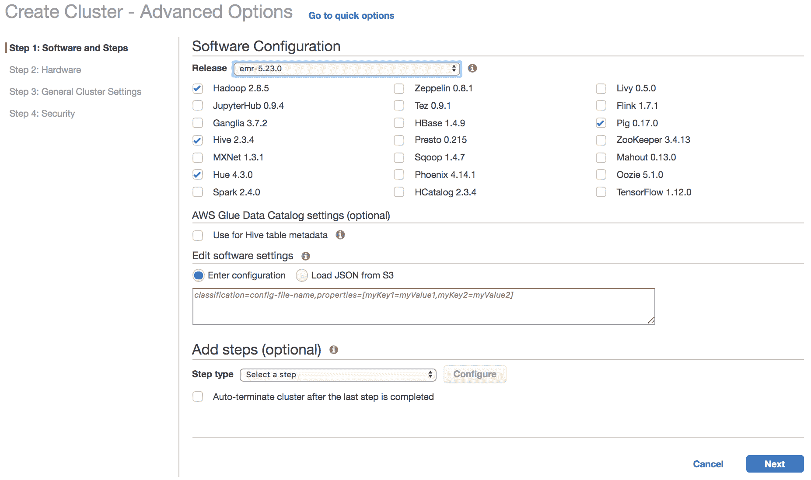
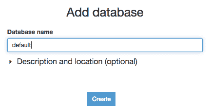
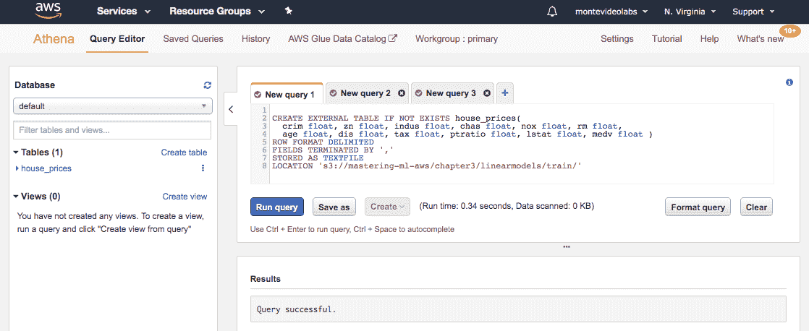
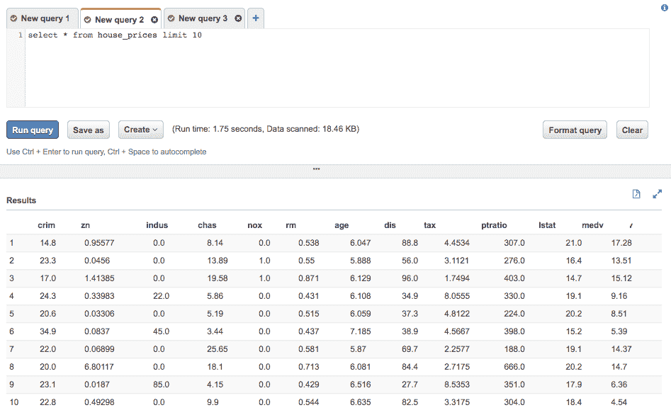
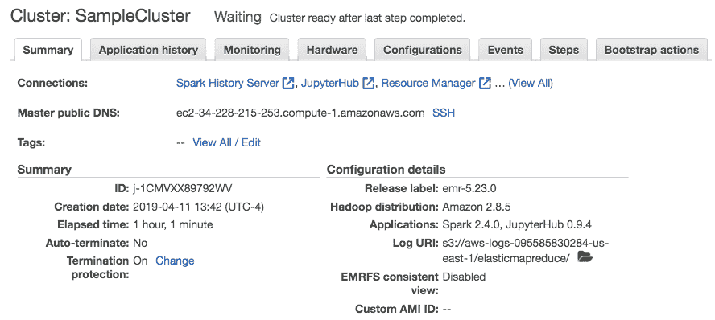
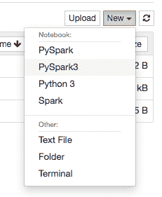
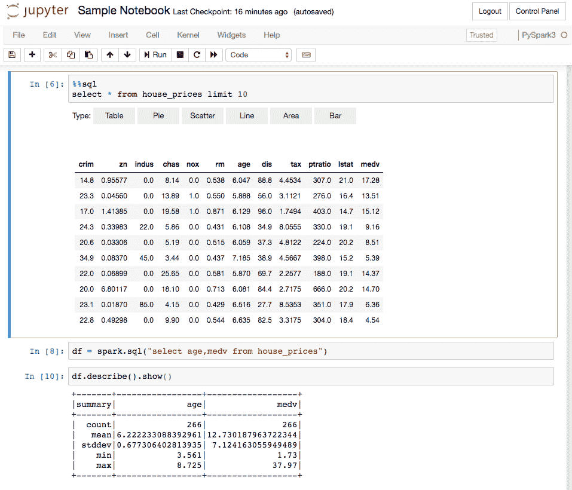

# 为机器学习调整集群

许多数据科学家和机器学习实践者在尝试在大数据上运行 ML 数据管道时都会遇到规模问题。在本章中，我们将主要关注**弹性 MapReduce**（**EMR**），这是一个运行非常大的机器学习作业的非常强大的工具。配置 EMR 有许多方法，并不是每个设置都适用于每个场景。在本章中，我们将概述 EMR 的主要配置以及每种配置如何针对不同的目标工作。此外，我们将介绍 AWS Glue 作为我们的大数据管道结果编目工具。

在本章中，我们将涵盖以下主题：

+   EMR 架构简介

+   为不同应用调整 EMR

+   使用 Glue 管理数据管道

# EMR 架构简介

在第四章 *使用基于树的预测用户行为* 中，我们介绍了 EMR，这是一个 AWS 服务，允许我们运行和扩展 Apache Spark、Hadoop、HBase、Presto、Hive 和其他大数据框架。这些大数据框架通常需要运行特定软件的机器集群，这些机器配置正确，以便机器能够相互通信。让我们看看 EMR 中最常用的产品。

# Apache Hadoop

许多应用程序，例如 Spark 和 HBase，都需要 Hadoop。Hadoop 的基本安装包含两个主要服务：

+   **Hadoop 分布式文件系统**（**HDFS**）：这是一个允许我们在多个服务器上存储大量数据（例如，无法存储在单个机器上的文件）的服务。NameNode 服务器负责索引哪个文件的哪些块存储在哪个服务器上。每个文件的块在集群中复制，这样如果一台机器出现故障，我们不会丢失任何信息。DataNode 服务器负责在每个机器上保持和提供数据。许多其他 EMR 服务，如 Apache HBase、Presto 和 Apache Spark，能够使用 HDFS 来读取和写入数据。当您使用长期运行的集群时，HDFS 运行良好。对于仅为了执行单个作业（例如训练作业）而启动的集群，您应考虑使用 S3 进行数据存储。

+   **MapReduce**：这个框架多年来一直是大数据处理的基础。通过允许用户指定两个函数（一个 `map` 函数和一个 `reduce` 函数），许多大数据工作负载得以实现。map 函数负责将数据块取出来并以一对一的方式进行转换（例如，获取每笔交易的价格）。reduce 函数接收 map 函数的输出并以某种方式聚合它（例如，找出每个地区的平均交易价格）。MapReduce 被设计成在存储 HDFS 文件块的同一台机器上执行处理，以避免在网络中传输大量数据。这种数据本地性原则被证明对于在通用硬件上运行大数据作业以及有限的网络速度下运行大数据作业非常有效。

EMR 允许您创建包含三种类型节点的集群：

+   **主节点**：这是集群中唯一的节点，通常负责协调集群中其他节点的作业。

+   **核心节点**：这类节点将托管 HDFS 块并运行 DataNode 服务器，因此在这些节点上运行的作业可以利用数据本地性。

+   **任务节点**：这些节点不托管 HDFS 块，但可以运行任意作业任务。在这些节点上运行的作业将需要从其他机器上托管（例如，核心节点或 S3 服务器）的文件系统中读取数据。

# Apache Spark

Apache Spark 是最受欢迎的大数据框架之一。它通过允许用户在数据之上指定额外的函数来扩展 MapReduce 的概念。它不仅可以执行 map 和 reduce 函数，还支持过滤、分组、连接、窗口函数以及许多其他操作。此外，正如我们在整本书中看到的那样，我们可以使用 SQL 操作来执行 ETL 和分析。Apache Spark 被设计用来在内存中缓存大量数据以加速需要多次遍历数据的算法。例如，需要多次迭代 **梯度下降** 的算法如果数据集在内存中缓存，可以运行得快得多。

Apache Spark 还附带了一些非常实用的库，用于流处理、图操作以及我们在本书中使用的机器学习库。我们鼓励你探索这些额外的库，因为它们质量极高且非常有用。Spark 的独特之处在于它无缝地整合了许多成熟的库，例如 TensorFlow 和 `scikit-learn`。你可以使用这两个工具构建出色的模型，但它们目前不允许我们像 Spark 那样通过在集群中并行化工作来读取和准备数据。换句话说，Apache Spark 提供了从数据摄入到模型生成的完整堆栈的包。有些人将 Spark 称为大数据的操作系统。通常，数据科学家和工程师使用 Spark 进行大规模的数据准备，然后使用其他工具，如 TensorFlow 和 SageMaker 来构建和部署专门的模型。在 第五章 中，我们看到了如何通过使用 SageMaker Spark 估计器来平滑地整合 Apache Spark 和 SageMaker。

# Apache Hive

Apache Hive 最初作为一个从 SQL 到 MapReduce 作业的翻译器诞生。你可以指定 **数据定义语言** (**DDL**) 和 **数据操作语言** (**DML**) 语句，并像使用 Apache Hive 一样在标准数据库管理系统上工作。当 Hive 首次出现时，许多了解 SQL 的非技术用户能够进行大规模的分析，这是其受欢迎的原因之一。Hive（以及 Spark SQL）内部发生的事情是，SQL 语句被解析，并动态构建一系列 MapReduce 作业，在集群上运行以执行 SQL 语句描述的声明性操作。

# Presto

Presto 是由 Facebook 开发的一个产品，它也把 SQL 转换为大数据工作负载，但专为交互式分析而定制。它非常快，并且特别针对当你有一个大型事实表和几个小维度表（如交易和其他连接表，如产品和客户）时进行了优化。AWS 提供了一个基于 Presto 的无服务器替代方案，称为 Athena，当你的数据在 S3 上时，它非常出色。Athena 查询的收费基于扫描的数据量。因此，它已成为大数据分析中非常受欢迎的工具。

# Apache HBase

HBase 是一个类似于 Google Bigtable 的产品。从概念上讲，它可以被视为一个巨大的分布式键值存储。由于 AWS DynamoDB 等技术的出现，HBase 的受欢迎程度已经不再那么高，后者是无服务器的，根据我们的经验，更加可靠。然而，当你需要通过键访问数据时，它可能是一个成本效益高的存储数据的方式。例如，你可以使用 HBase 存储每个用户的自定义模型（假设你有数十亿用户来证明这一点）。

# 另一个资源协商者

Apache Hadoop 还开发了**另一个资源协调器**（**YARN**），这是 EMR 调度和协调不同应用的基本工具。YARN 实际上是 EMR 背后的集群管理器，负责在不同的机器上启动必要的守护进程。当你通过 EMR 配置集群时，你可以指定你想要运行的不同应用。这类应用的例子包括 Spark、HBase 和 Presto。YARN 负责启动必要的进程。在 Spark 的情况下，YARN 将根据需要启动 Spark 执行器和驱动器。这些进程将必要的内存和 CPU 消耗报告给 YARN。这样，YARN 可以确保集群负载得到适当管理，不会过载。

# 调整 EMR 以适应不同的应用

在本节中，我们将考虑调整我们用于机器学习的集群所涉及到的方面。当你启动一个 EMR 集群时，你可以指定你想要运行的不同应用。

以下截图显示了 EMR 版本 5.23.0 中可用的应用：



在启动 EMR 集群后，以下是需要配置的最相关项目：

+   **应用**: 例如 Spark 应用。

+   **硬件**: 我们在第十章中介绍了这一点，*在 AWS 上创建集群*。

+   **使用 Glue 数据目录**: 我们将在本章的最后部分介绍，*使用 Glue 管理数据管道*)。

+   **软件配置**: 这些是我们可以指定以配置特定应用属性的属性。在下一节，*配置应用属性*中，我们将展示如何通过特定属性来定制 Spark 的行为。

+   **引导操作**: 这些是用户特定的脚本（通常位于 S3），在集群启动时会运行在每个节点上。引导操作在例如你希望在集群启动时在所有机器上安装特定软件包时非常有用。

+   **步骤**: 这些是在应用启动后用户想要运行的不同作业。例如，如果我们想要启动一个运行 Spark 训练作业的集群，然后我们想要关闭集群，我们就会指定一个 Spark 作业步骤，并在最后一步完成后选择自动终止集群选项。这种用例在通过 AWS API 程序化启动集群时是相关的。计划或事件驱动的 AWS Lambda 函数可以使用`boto3`等库在事件发生或定期计划时程序化地启动集群。有关 AWS Lambda 的更多信息，请参阅[`docs.aws.amazon.com/lambda/`](https://docs.aws.amazon.com/lambda/)。

# 配置应用属性

在前面的屏幕截图中，您可能已经注意到有一个名为 **软件设置** 的空间，用于自定义不同应用程序的配置。有不同的配置类别，称为 `分类`，允许您通过更改所选属性集的值来覆盖不同应用程序的默认配置。

在以下代码块中，我们提供了一组非常有用的属性来配置 Spark，用于两个目的：最大化资源分配并启用 AWS Glue 元数据存储：

```py
classification=spark,properties=[maximizeResourceAllocation=true]
classification=spark-defaults,properties=[spark.sql.catalogImplementation=hive]
classification=spark-hive-site,properties=[hive.metastore.connect.retries=50,hive.metastore.client.factory.class=com.amazonaws.glue.catalog.metastore.AWSGlueDataCatalogHiveClientFactory]
```

让我们看看每个这些配置的效果。

# 最大化资源分配

当您启用 `maximizeResourceAllocation` 时，EMR 和 Spark 将确定如何配置 Spark 以使用所有可用资源（例如，内存和 CPU）。另一种选择是手动配置属性，如执行器的数量、每个执行器的 Java 堆空间以及每个执行器的核心数（即线程数）。如果您选择手动进行此操作，您需要非常小心，不要超过集群的可用资源（并且也不要未充分利用可用硬件）。我们建议始终默认设置此设置。

# AWS Glue 目录

AWS Glue 提供了一种称为 Hive 元数据存储的服务。此服务的目的是通过定义描述数据的表来跟踪我们数据湖中的所有数据。数据湖通常托管在 S3 或 HDFS 上。任何位于这些分布式文件系统上的数据，且具有表格格式，如 Parquet 或 CSV，都可以添加到元数据存储中。这不会复制或移动数据；它只是保持所有数据目录的一种方式。通过在集群配置中配置 `hive.metastore.client.factory.class` 属性，我们允许 Spark 使用 Glue 目录中注册的所有表。此外，Spark 还可以通过 Spark SQL 语句创建新表或修改目录。在下一节中，我们将展示 Glue 如何有用的具体示例。

# 使用 Glue 管理数据管道

数据科学家和数据工程师运行不同的作业来转换、提取和加载数据到系统，如 S3。例如，我们可能有一个每日作业处理文本数据，并存储一个包含我们第二章中看到的词袋表示法的表，即 *使用朴素贝叶斯分类 Twitter 流*。我们可能希望每天更新该表以指向最新的可用数据。上游过程可以仅依赖于表名来查找和处理数据的最新版本。如果我们没有正确地编目这些数据，将非常难以合并不同的数据源，甚至不知道数据在哪里，这就是 AWS Glue 元数据存储发挥作用的地方。Glue 中的表被分组到数据库中。然而，不同数据库中的表可以连接和引用。

# 使用 Glue 创建表

您可以通过访问[`console.aws.amazon.com/glue/home?region=us-east-1#catalog:tab=databases`](https://console.aws.amazon.com/glue/home?region=us-east-1#catalog:tab=databases)来访问 AWS 上的 Glue 控制台。

在控制台中，创建一个新的数据库，如下面的屏幕截图所示：



一旦创建了数据库，您就可以切换到 Athena AWS 服务，并开始从 S3 中的数据创建表以运行查询分析。AWS Athena 控制台可以通过[`console.aws.amazon.com/athena/home`](https://console.aws.amazon.com/athena/home)访问。

让我们在 S3 中为我们在第三章，“使用回归算法预测房价”中工作的波士顿房价数据集创建一个表。

在下面的屏幕截图中，我们可以看到创建表的 SQL 语句将指定来自 S3 中 CSV 数据的表名、格式和字段：



注意，位置指定了一个文件夹（而不是一个文件）。在我们的例子中，我们在`s3://mastering-ml-aws/chapter3/linearmodels/train/training-housing.csv`有一个单独的`CSV`文件夹。然而，我们可以在同一个文件夹中有许多 CSV 文件，并且所有这些都会链接到我们刚刚创建的`house_prices`表。一旦我们创建了表，由于数据在 S3 上，我们就可以开始如下查询我们的表：



注意数据是如何正确分表的。这是因为我们告诉 Glue 了数据的正确格式和位置。现在我们可以通过 Athena 使用 Presto-as-a-service 通过 SQL 进行超快速分析。

我们刚刚执行了一个创建表的操作；然而，通常我们想要执行更改表命令来将表背后的数据切换到更近的版本。执行添加分区操作以增量地向表中添加数据（如新批次或日期）也是非常常见的。分区也有助于查询引擎更有效地过滤数据。

# 在 Spark 中访问 Glue 表

一旦创建的表在 Glue 中，它也将可在每个 EMR Spark 集群中可用（只要我们配置了前述章节中描述的 `hive.metastore.client.factory.class`，即 *调整 EMR 以适应不同应用*）。让我们启动一个启用了 JupyterHub 应用的 EMR 集群。JupyterHub 应用是 第二章，*使用朴素贝叶斯分类 Twitter 流*，到 第六章，*分析访问模式以生成推荐* 中使用的 EMR 笔记本功能的替代品。当您有一组数据科学家在重用同一集群并运行不同的笔记本时，请考虑使用 `JupyterHub`。您可以在 [`docs.aws.amazon.com/emr/latest/ReleaseGuide/emr-jupyterhub.html`](https://docs.aws.amazon.com/emr/latest/ReleaseGuide/emr-jupyterhub.html) 上了解更多关于 JupyterHub 的信息。

以下截图显示了启用 Glue 元数据存储和 `JupyterHub` 作为应用的我们创建的集群：



如果您点击 `JupyterHub` 链接，它将带您到一个认证页面，如下所示：


`JupyterHub` 的默认配置有一个默认用户账户，用户名为 `jovyan`，密码为 `jupyter`。如果需要，可以通过 EMR 配置自定义认证。

认证后，我们可以像使用 EMR 笔记本一样开始创建笔记本。在这种情况下，我们将创建一个 `PySpark3` 笔记本：



现在，笔记本可以使用 SparkMagic 在 Python 和 SQL 中交错段落。让我们看看以下笔记本示例：



第一段通过 Glue/Athena 通过 SparkMagic 的 `%%sql` 魔法在刚刚创建的表上运行 SQL（有关 SparkMagic 的更多信息，请参阅 [`github.com/jupyter-incubator/sparkmagic`](https://github.com/jupyter-incubator/sparkmagic)）。第二段通过一个简单的 SQL 语句从我们的表中选择两个字段来构建 Spark DataFrame。第三段在我们的 Spark DataFrame 上运行 Spark 作业（即 describe 命令）。您将欣赏到，一旦我们在 Glue 元数据存储中正确编目了数据，处理、集成和处理数据是多么容易。

# 摘要

在本章中，我们探讨了 EMR 的主要配置参数以及它们如何帮助我们运行许多大数据框架，如 Spark、Hive 和 Presto。我们还探讨了 AWS 服务 Athena 和 Glue，作为在数据湖中编目数据的方式，以便我们能够正确同步我们的数据管道。最后，我们展示了 Glue 如何在 EMR 中使用，以及 `JupyterHub` 与 SparkMagic 的无缝集成。

在下一章* 在 AWS 中构建的模型部署*中，我们将介绍如何在不同的环境中部署机器学习模型。
