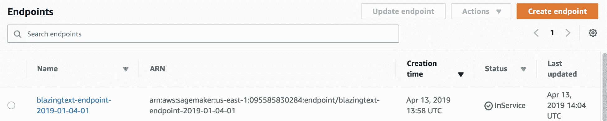
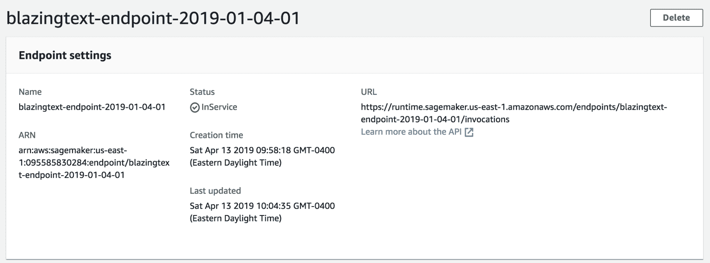
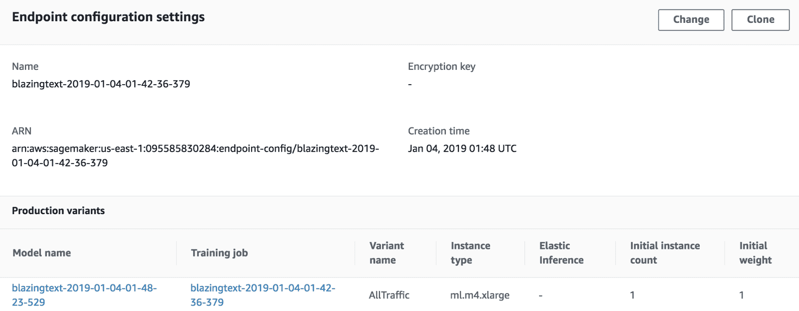
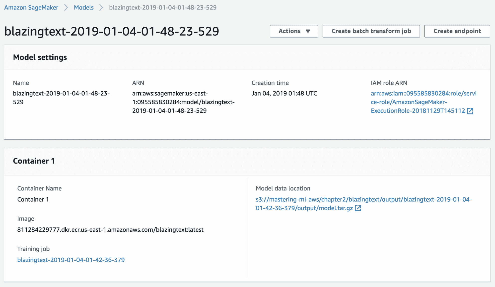
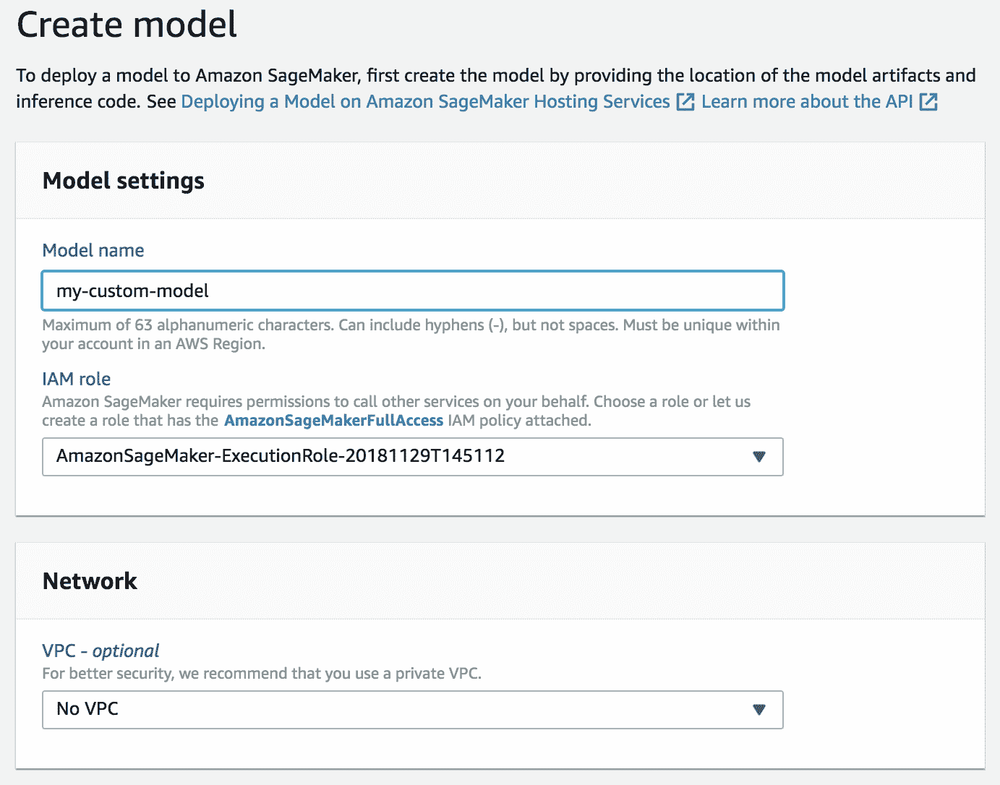
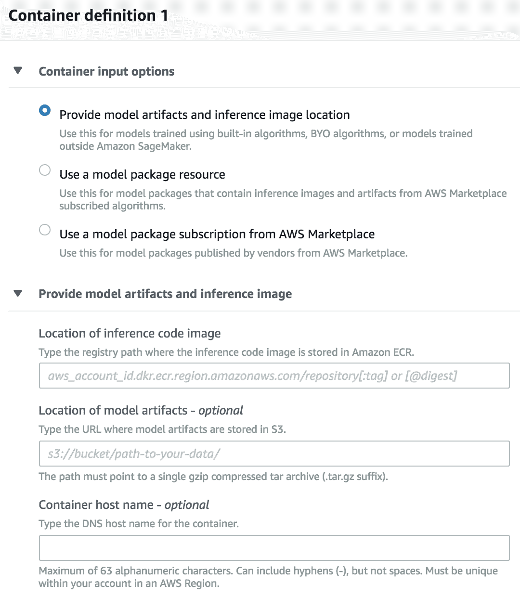

# 第十六章：在 AWS 中构建的模型部署

到目前为止，我们在 AWS 中构建了模型，并希望将它们部署到生产环境中。我们知道模型应该部署在不同的环境中。在某些情况下，这就像生成一个 CSV 文件，其中包含将被输入到某个系统中的操作一样简单。通常我们只需要部署一个能够进行预测的 Web 服务。然而，在某些特殊情况下，我们需要将这些模型部署到复杂、低延迟或边缘系统中。在本章中，我们将探讨将机器学习模型部署到生产环境的不同方法。

在本章中，我们将涵盖以下主题：

+   SageMaker 模型部署

+   Apache Spark 模型部署

# SageMaker 模型部署

在第二章，*使用朴素贝叶斯分类 Twitter 流*，我们使用 SageMaker 部署了我们的第一个模型。在那个阶段，我们已经使用**BlazingText**训练了我们的分类器，并将其存储在一个名为`bt_model`的变量中。要部署模型，我们只需调用`deploy`方法，并指定要使用的机器数量和类型：

```py
bt_model.deploy(initial_instance_count = 1,instance_type = 'ml.m4.xlarge')
```

SageMaker 可以在实例数量之间平衡对端点的请求，并根据服务负载自动扩展或缩减。详细信息请参阅[`docs.aws.amazon.com/sagemaker/latest/dg/endpoint-auto-scaling.html`](https://docs.aws.amazon.com/sagemaker/latest/dg/endpoint-auto-scaling.html)。

一旦我们调用`deploy`方法，一个端点应该出现在 AWS SageMaker 控制台中的[`console.aws.amazon.com/sagemaker`](https://console.aws.amazon.com/sagemaker)。以下截图显示了我们的 BlazingText 示例端点：



通过在控制台中点击端点，我们可以找到更多详细信息：



特别是，我们可以看到端点有一个特定的 URL，服务就在那里托管。如果我们尝试通过 HTTP 工具，如`curl`直接调用此 URL，我们会得到以下结果：

```py
curl -X POST \
> https://runtime.sagemaker.us-east-1.amazonaws.com/endpoints/blazingtext-endpoint-2019-01-04-01/invocations \
> -H 'cache-control: no-cache' \
> -H 'content-type: application/json' \
> -H 'postman-token: 7hsjkse-f24f-221e-efc9-af4c654d677a' \
> -d '{"instances": ["This new deal will be the most modern, up-to-date, and balanced trade agreement in the history of our country, with the most advanced protections for workers ever developed"]}'
```

{"message":"Missing Authentication Token"}

这是因为向 SageMaker 端点发出的每个请求都必须正确签名以确保身份验证。只有具有调用 Amazon SageMaker InvokeEndpoint API 角色权限的用户才能允许调用 SageMaker 端点。为了让 SageMaker 背后的 HTTP 服务能够识别和验证调用者，HTTP 请求需要正确签名。有关签名请求的更多信息，请参阅[`docs.aws.amazon.com/general/latest/gr/signing_aws_api_requests.html`](https://docs.aws.amazon.com/general/latest/gr/signing_aws_api_requests.html)。如果我们想公开我们的模型端点，请求签名的替代方案是创建一个 AWS 中的 lambda 函数，并通过 API 网关公开它。有关如何做到这一点的更多信息，请参阅[`docs.aws.amazon.com/sagemaker/latest/dg/getting-started-client-app.html`](https://docs.aws.amazon.com/sagemaker/latest/dg/getting-started-client-app.html)。

幸运的是，如果我们从 AWS 实例内部调用端点，我们可以通过使用`sagemaker`库来避免手动签名请求。让我们回顾一下如何进行此类调用。

如同往常，我们首先导入必要的 Python 库：

```py
import sagemaker
from sagemaker import get_execution_role

sess = sagemaker.Session()
role = get_execution_role()
```

接下来，如果我们知道端点的名称，我们可以创建一个`RealTimePredictor`实例来进行实时预测：

```py
from sagemaker.predictor import json_serializer, RealTimePredictor

predictor = RealTimePredictor(endpoint='blazingtext-endpoint-2019-01-04-01', serializer=json_serializer)
```

在这个例子中，我们使用的是`json_serializer`，这是一种方便且易于阅读的格式。要调用端点，我们只需调用`predict()`方法：

```py
predictor.predict({"instances": ["This new deal will be the most modern, up-to-date, and balanced trade agreement in the history of our country, with the most advanced protections for workers ever developed"]})
```

这里是输出：

```py
b'[{"prob": [0.5000401735305786], "label": ["__label__1"]}]'
```

你可以回到第二章，*使用朴素贝叶斯分类 Twitter 流*，来解释这个输出，但这里的重要点是`RealTimePredictor`实例代表我们完成了所有适当的身份验证、请求签名和端点调用。

除了端点的 URL 和基本信息外，AWS 控制台还显示了端点配置：



通过配置，我们可以跟踪从这个端点起源的模型和训练作业。让我们点击链接来检查起源模型。然后我们得到以下屏幕：



在模型描述中，我们可以找到诸如模型的 S3 位置等详细信息。这种模型序列化针对每种类型的模型都是特定的。在第四章使用基于树的预测用户行为中，我们看到了这种模型的格式方便地采用了`xgboost` pickle 序列化兼容格式。

你可能也注意到了，这个模型关联了一个图像。SageMaker 在 Amazon **弹性容器注册库**（**ECR**）中创建了一个托管此模型的机器的镜像。通常这些是底层的 Docker 镜像。

以下链接是一个关于部署内部工作原理以及 SageMaker 中容器化工作方式的优秀资源：[`sagemaker-workshop.com/custom/containers.html`](https://sagemaker-workshop.com/custom/containers.html)。

# Apache Spark 模型部署

Apache Spark 没有像 SageMaker 那样提供直接将模型作为端点暴露的现成方法。然而，有简单的方法可以使用 Spark ML 包的序列化和反序列化功能在标准网络服务上加载 Spark 模型。在本节中，我们将展示如何部署我们在第三章中创建的模型，即使用回归算法预测房屋价值，通过一个简单的端点提供预测。为此，我们将保存一个训练好的模型到磁盘，以便我们可以将该模型发送到通过端点提供模型的机器。

我们首先开始训练我们的模型。在第三章中，*使用回归算法预测房屋价值*，我们将房屋数据加载到一个 dataframe 中：

```py
housing_df = sql.read.csv(SRC_PATH + 'train.csv', 
                          header=True, inferSchema=True)
```

为了简化这个例子，我们将使用一组减少的特征来构建一个作为端点公开的模型。在所有特征中，我们将只选择三个训练特征（`crim`、`zn`和`indus`）：

```py
reduced_housing_df = housing_df.select(['crim', 'zn', 'indus', 'medv'])
```

你可能还记得`medv`是实际房屋价值（这是我们试图预测的值）。现在我们有了我们的 dataframe，我们可以创建一个`pipeline`，就像我们之前做的那样：

```py
from pyspark.ml import Pipeline
from pyspark.ml.regression import LinearRegression
from pyspark.ml.feature import VectorAssembler

training_features = ['crim', 'zn', 'indus']
vector_assembler = VectorAssembler(inputCols=training_features,           
               outputCol="features")
linear = LinearRegression(featuresCol="features", labelCol="medv")
pipeline = Pipeline(stages=[vector_assembler, linear])
model = pipeline.fit(reduced_housing_df)
```

使用模型实例，我们可以通过调用`save()`方法将其保存到磁盘：

```py
model.save("file:///tmp/linear-model")
```

这种序列化模型表示可以发送到我们想要提供预测的位置（例如，一个网络服务器）。在这种情况下，我们可以通过调用`PipelineModel.load()`静态方法来重新加载模型，如下所示：

```py
from pyspark.ml import PipelineModel
loaded_model = PipelineModel.load('/tmp/linear-model')
```

让我们使用这个模型来获取我们减少的数据集的前几行的预测：

```py
loaded_model.transform(reduced_housing_df.limit(3)).show()
```

前述命令的输出如下：

```py
+-------+----+-----+----+-------------------+------------------+
| crim  | zn |indus|medv| features          | prediction       |
+-------+----+-----+----+-------------------+------------------+
|0.00632|18.0| 2.31|24.0|[0.00632,18.0,2.31]|27.714445239256854|
|0.02731| 0.0| 7.07|21.6| [0.02731,0.0,7.07]|24.859566163416336|
|0.03237| 0.0| 2.18|33.4| [0.03237,0.0,2.18]| 26.74953947801712|
+-------+----+-----+----+-------------------+------------------+
```

看看`pipeline`模型是如何从原始 CSV 文件开始，应用管道中的所有转换步骤，最终完成预测。当然，从我们的训练数据集中获取预测并不那么有趣。从现实的角度来看，在提供预测的端点上，我们希望接收我们三个特征的所有可能值并获得预测。在撰写本文时，Apache Spark 只能根据 dataframe 获取预测。因此，每次我们想要为几个值获取预测时，我们需要构建一个 dataframe，即使我们只需要找到单行数据的预测。

假设我们想要找到以下特征组合的预测：`crim=0.00632`、`zn=18.0`、`indus=2.31`。第一步是定义我们特征的架构，因为 Spark 期望 dataframe 的格式与训练时使用的格式完全相同。

我们定义了以下模式：

```py
from pyspark.sql.types import *

schema = StructType([StructField('crim', DoubleType(), True),
                    StructField('zn', DoubleType(), True),
                    StructField('indus', DoubleType(), True)])
```

在前面的模式定义中，我们放置了每个字段的名称和类型。有了这个模式，我们可以构建一个包含我们感兴趣的特征值的单行 dataframe：

```py
from pyspark.sql import Row

predict_df = 
sql.createDataFrame([Row
(crim=0.00632, zn=18.0,
indus=2.31)],
schema=schema)
```

这就是 dataframe 的样式：

```py
+-------+----+-----+
| crim  | zn |indus|
+-------+----+-----+
|0.00632|18.0| 2.31|
+-------+----+-----+
```

使用这个简短的 dataframe 和加载的模型，我们可以为我们任意特征获得预测：

```py
loaded_model.transform(predict_df).show()
```

以下是前一个命令的输出：

```py
+-------+----+-----+-------------------+------------------+
| crim  | zn |indus| features          |        prediction|
+-------+----+-----+-------------------+------------------+
|0.00632|18.0| 2.31|[0.00632,18.0,2.31]|27.714445239256854|
+-------+----+-----+-------------------+------------------+
```

因此，考虑到前面的想法，我们如何构建一个能够提供这个模型的服务端点？最简单的方法是使用允许我们轻松在任何选择的机器上暴露端点的包，例如 Flask。有关 Flask 的详细信息，请参阅[`flask.pocoo.org`](http://flask.pocoo.org/)。要运行一个 flask 网络服务，我们只需编写一个 Python 文件，该文件知道如何响应不同的端点请求。在我们的案例中，我们将只创建一个端点，根据我们三个特征的值提供预测。我们将实现一个简单的`GET`端点，其中三个特征将作为 URL 参数传递。

在本地主机上运行时调用服务的命令如下：

```py
curl 'http://127.0.0.1:5000/predict?crim=0.00632&zn=18.0&indus=2.31'
```

这是服务的输出：

```py
27.71
```

要在机器上启动 flask 服务，执行以下三个步骤：

1.  创建一个 Python 文件，指定如何响应端点。我们将把这个文件命名为`deploy_flask.py`。

1.  将`FLASK_APP`环境变量设置为指向我们刚刚创建的 Python 文件。

1.  运行`flask run`命令。

在`deploy_flask.py`中，我们将关于如何加载模型和为预测构建 dataframe 的前面想法整合在一起：

```py
from flask import Flask
from flask import request
from pyspark.ml import PipelineModel
from pyspark.sql import Row
from pyspark.sql.types import *
from pyspark.sql import SQLContext
from pyspark.context import SparkContext

sc = SparkContext('local', 'test')
sql = SQLContext(sc)
app = Flask(__name__)
loaded_model = PipelineModel.load('/tmp/linear-model')

schema = StructType([StructField('crim', DoubleType(), True),
                    StructField('zn', DoubleType(), True),
                    StructField('indus', DoubleType(), True)])

@app.route('/predict', methods=['GET'])
def predict():
   crim = float(request.args.get('crim'))
   zn = float(request.args.get('zn'))
   indus = float(request.args.get('indus'))
   predict_df = sql.createDataFrame([Row(crim=crim, zn=zn, indus=indus)],schema=schema)
   prediction = loaded_model.transform(predict_df).collect()[0].prediction
   return str(prediction)
```

在`deploy_flask.py`文件中，唯一的新部分是 flask 应用的初始化和`predict`方法的定义，其中我们提取了作为 URL 参数授予的三个特征。接下来，我们设置提到的环境变量并运行服务：

```py
export FLASK_APP=deploy_flask.py
flask run
```

在日志中，你可以看到服务和 Spark 的初始化过程，以及调用服务的操作：

```py
* Serving Flask app "deploy_flask.py"
* Environment: production
  WARNING: Do not use the development server in a production environment.
  Use a production WSGI server instead.
* Debug mode: off
Using Spark's default log4j profile: org/apache/spark/log4j-defaults.properties
Setting default log level to "WARN".
* Running on http://127.0.0.1:5000/ (Press CTRL+C to quit)
127.0.0.1 - - [13/Apr/2019 19:13:03] "GET /predict?crim=0.00632&zn=18.0&indus=2.31 HTTP/1.1" 200 -
```

如 flask 日志所述，如果你在考虑严肃的生产负载，考虑在 WSGI 服务器后面运行 flask。更多关于这方面的信息可以在 flask 文档中找到。

SageMaker 也能够托管任何任意模型。为此，我们需要创建一个响应两个端点的 Docker 镜像：`/ping`和`/invocations`。就这么简单。在我们的案例中，`/invocations`端点将使用加载的 Spark 模型来响应预测。一旦 Docker 镜像创建完成，我们需要将其上传到 AWS ECR。一旦它被加载到 ECR 上，我们只需提供 ECR 镜像标识符就可以创建一个 SageMaker 模型。

在 AWS 控制台（或通过 API）中，选择创建模型：



一旦你提供了基本模型详情，输入你自定义推理端点的 ECR 位置：



与任何 SageMaker 模型一样，您可以使用常规方法将其部署到端点。在本章中，我们不会介绍 Docker 镜像创建的过程，但您可以在我们的 GitHub 仓库中找到笔记本，网址为 [`github.com/mg-um/mastering-ml-on-aws`](https://github.com/mg-um/mastering-ml-on-aws)，在 第十六章，*在 AWS 中构建的模型部署*，其中解释了如何进行部署。

即使您的生产环境不在 AWS 内，SageMaker 和 EMR 中的 Spark 也可以非常有用，因为模型可以在 AWS 离线训练并发送到不同的环境。此外，AWS 创建的模型工件通常可以离线获取和使用（例如 `xgboost` 模型）。如果您需要将 Spark ML 模型移植到无法实例化本地 Spark 会话的环境或需要一个非常低延迟的预测器，请考虑使用以下工具：[`github.com/TrueCar/mleap`](https://github.com/TrueCar/mleap)。

# 摘要

在本章中，我们探讨了如何通过 SageMaker 部署模型，并介绍了端点的定义和调用方法。通过使用 Spark 的模型序列化和反序列化，我们展示了模型如何被发送到其他环境，例如 flask 中的自定义 Web 服务实现。最后，我们概述了如何通过在 AWS ECR 中注册自定义 Docker 镜像，将您的 Spark 模型（或任何其他任意模型）通过 SageMaker 提供服务。

# 练习

1.  为什么当您尝试直接访问服务时，SageMaker 端点会响应一个缺少身份验证令牌的消息？

1.  列出两种解决上述问题的替代方案。

1.  提供两种将基于 Apache Spark 构建的模型部署到端点的方法。

1.  以我们的 flask 示例为基础，构建一个 Docker 镜像，该镜像提供 `/invocations` 和 `/ping` 端点，然后通过 SageMaker 部署一个模型。
