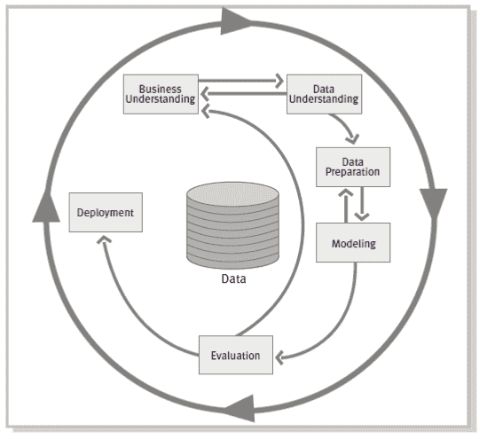
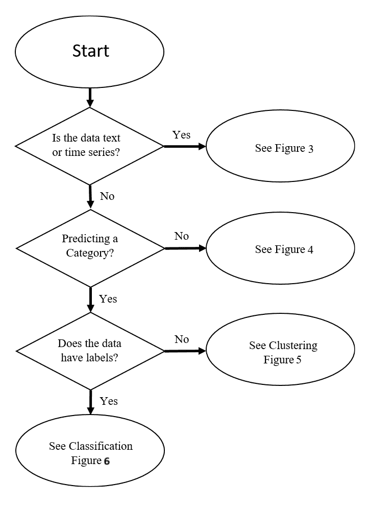
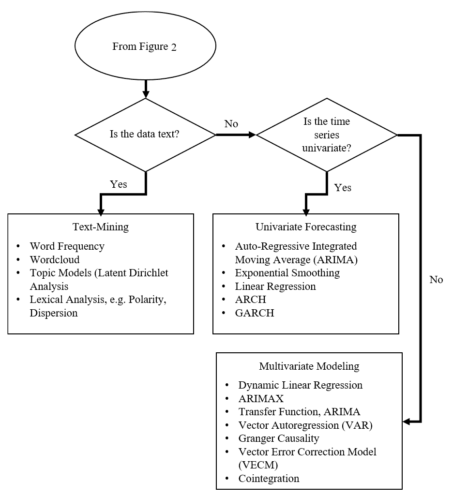
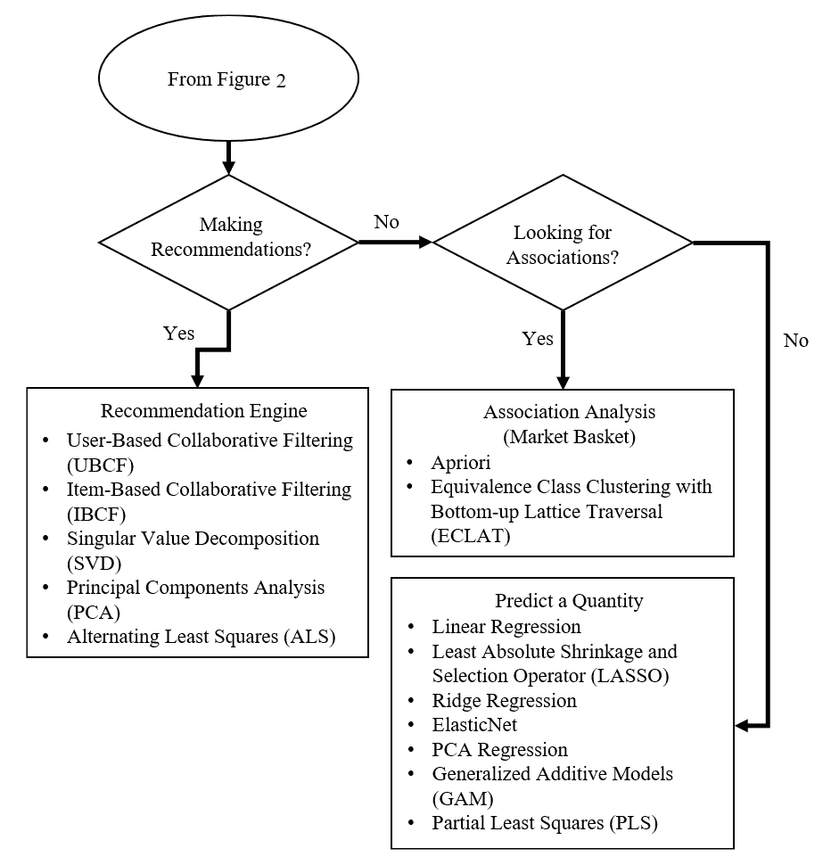
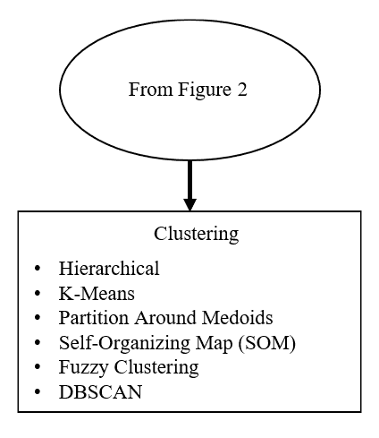
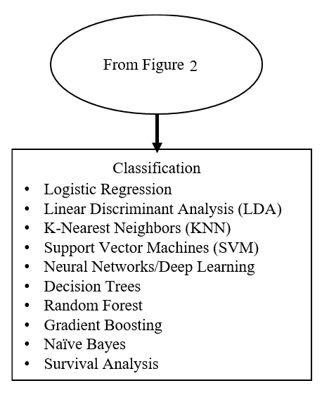

# 成功的过程

“如果你不知道你要去哪里，任何路都能带你到那里。”

- Robert Carrol

“如果你不能将你所做的事情描述为一个流程，你就不知道你在做什么。”

- W. Edwards Deming

初看，这一章似乎与机器学习无关，但实际上它与机器学习息息相关（特别是其实现和促成变革）。最聪明的人、最好的软件和最好的算法并不能保证成功，无论定义得多好。

在大多数，如果不是所有项目中，成功解决问题或改善决策的关键不是算法，而是更软性的、更定性的沟通和影响力技能。我们很多人对这个问题有困难，是因为很难量化在这些技能上的有效性。我们中许多人之所以陷入这种境地，可能是因为我们想要避免它。毕竟，高度成功的电视喜剧《生活大爆炸》就是基于这个前提建立的。因此，本章的目标是为你设定成功的基础。意图是提供一个流程，一个灵活的流程，让你可以成为一个**变革推动者**：一个能够影响并转化为行动的人，而不需要职位权力。我们将重点关注**数据挖掘跨行业标准流程**（**CRISP-DM**）。这可能是所有分析流程中最知名和最受尊重的。即使你使用其他行业流程或专有技术，本章中仍有一些宝贵的经验可以借鉴。

我毫不犹豫地说，这一切说起来容易做起来难；毫无疑问，我在本章将要讨论的每一个罪过（无论是犯下还是遗漏）我都犯过。凭借技巧和一些运气，你可以避免我在过去 12 年里积累的许多身体和情感上的创伤。

最后，我们还将查看一个流程图（一个速查表），你可以用它来帮助你确定针对当前问题的应用方法。

# 流程

CRISP-DM 流程是专门为数据挖掘设计的。然而，它足够灵活和全面，可以应用于任何分析项目，无论是预测分析、数据科学还是机器学习。不要因为众多任务列表而感到害怕，因为你可以在过程中运用你的判断力，并根据任何现实世界的情况进行调整。以下图表提供了流程的视觉表示，并显示了使其如此灵活的反馈循环：

图 1：CRISP-DM 1.0，逐步数据挖掘指南

该流程包含以下六个阶段：

+   业务理解

+   数据理解

+   数据准备

+   建模

+   评估

+   部署

对于对整个流程及其所有任务和子任务的深入审查，你可以查看 SPSS、CRISP-DM 1.0、逐步数据挖掘指南的论文，该指南可在[`the-modeling-agency.com/crisp-dm.pdf`](https://the-modeling-agency.com/crisp-dm.pdf)找到。

我将讨论流程中的每个步骤，涵盖重要任务。然而，它不会像指南那样详细，而是更高级别。我们不会跳过任何关键细节，而是更多地关注可以应用于任务的技巧。记住，这些流程步骤将在后续章节中作为实际应用机器学习方法和特别是 R 代码框架使用。

# 商业理解

在实现成功的过程中，不能低估这个第一步的重要性。这是基础步骤，这里的失败或成功很可能会决定整个项目的失败或成功。这个步骤的目的是确定业务需求，以便你可以将它们转化为分析目标。它有以下四个任务：

1.  确定商业目标。

1.  评估情况。

1.  确定分析目标。

1.  制定项目计划。

# 确定商业目标

这个任务的关键是确定组织的目标，并界定问题。一个有效的问题可以是：“我们将要做什么不同？”这个问题可能看起来无害，但它确实可以挑战人们从分析的角度思考他们需要什么，并触及需要做出的决策的根本。它还可以防止你进行大量不必要的“钓鱼式”工作。因此，对你来说，关键是要确定决策。可以向团队提出一个关于决策的工作定义，即是否承诺或放弃资源的不可撤销的选择。此外，记住，不做任何不同的事情实际上也是一种决策。

这并不意味着如果选择不是绝对清晰的话，项目就不应该启动。有时问题可能没有定义，或者无法定义；用前国防部长唐纳德·拉姆斯菲尔德的话来说，这就是已知的未知。实际上，可能有很多时候问题没有定义，项目的主要目标是为了进一步理解问题并生成假设；再次引用拉姆斯菲尔德部长的话，这就是未知的未知，意味着你不知道你不知道的东西。然而，对于没有定义的问题，可以根据假设探索的各种结果，基于对资源投入的理解继续前进。

在这个任务中，还需要考虑的一个问题是期望的管理。无论数据的深度和广度如何，都没有完美无缺的数据。现在不是保证的时候，而是要沟通你所拥有的专业知识所能实现的内容。

我建议从这个任务中产生几个输出。第一个是一个使命宣言。这并不是一个组织的触动人心的使命宣言，而是你的使命宣言，或者更重要的是，由项目赞助商批准的使命宣言。我从多年的军事经验中借鉴了这个想法，我可以写很多关于为什么它有效的理由，但那是另一天的事。让我们只说，在没有明确方向或指导的情况下，使命宣言，或者你想要称之为任何名称的东西，成为所有利益相关者的统一声明，并有助于防止范围蔓延。它包括以下要点：

+   **谁**：这是你自己、团队或项目名称；每个人都喜欢一个酷炫的项目名称，例如，项目 Viper、项目融合等

+   **做什么**：这是你要执行的任务，例如，进行机器学习

+   **何时**：这是截止日期

+   **在哪里**：这可能涉及地理、功能、部门、倡议等方面

+   **为什么**：这是实施项目的目的，即业务目标

第二个任务是尽可能清晰地定义成功。字面上来说，问“成功是什么样子？”帮助团队/赞助商描绘出你可以理解的成功的画面。然后你的工作是将其转化为建模需求。

# 评估情况

这个任务通过收集有关可用资源、约束和假设的信息，识别风险，制定应急计划来帮助你进行项目规划。我还会进一步补充说，这也是确定将受决策（或决策）影响的 关键利益相关者的时机。

这里有几个要点。在检查可用的资源时，不要忽视查阅过去和当前项目的记录。很可能会有人在这个组织里工作，或者正在解决相同的问题，并且可能需要与他们的工作同步。不要忘记考虑**时间**、**人员**和**金钱**方面的风险。尽你所能创建一个利益相关者的列表，包括那些影响你的项目和可能受到你的项目影响的那些人。确定这些人是谁，以及他们如何能够影响/被决策所影响。一旦完成，与项目赞助商合作，制定与这些利益相关者的沟通计划。

# 确定分析目标

在这里，你需要将业务目标转化为技术需求。这包括将成功标准从创建业务目标的任务转变为技术成功。这可能包括诸如 RMSE 或预测准确度水平等事项。

# 制定项目计划

此处的任务是构建一个有效的项目计划，其中包括到目前为止收集到的所有信息。无论你使用什么技术，无论是甘特图还是其他图形，都要制作出来，并将其作为你沟通计划的一部分。使此计划对利益相关者广泛可用，并定期更新，并根据情况变化进行调整。

# 数据理解

在经历了至关重要的第一步的所有痛苦之后，你现在可以开始忙于数据了。此过程中的任务包括以下内容：

1.  收集数据。

1.  描述数据。

1.  探索数据。

1.  验证数据质量。

这一阶段是经典的**提取、转换、加载**（**ETL**）案例。这里有一些考虑因素。你需要做出初步判断，即可用的数据是否足以满足你的分析需求。在探索数据时，无论是视觉上还是其他方式，确定变量是否稀疏，并确定数据可能缺失的程度。这可能会驱动你使用的学习方法，并/或确定是否需要和可行地插补缺失数据。

验证数据质量至关重要。花时间了解谁收集数据，如何收集，甚至为什么收集数据。你可能会遇到数据收集不完整的情况，或者由于意外的 IT 问题导致数据错误，或者业务规则的变化。在时间序列中，业务规则如何对数据进行分类通常会随时间变化。最后，在此步骤开始记录任何代码也是一个好主意。作为文档过程的一部分，如果数据字典不可用，请保存自己潜在的心痛，并制作一个。

# 数据准备

差不多完成了！这一步有以下五个任务：

1.  选择数据。

1.  清洗数据。

1.  构建数据。

1.  整合数据。

1.  格式化数据。

这些任务相对容易理解。目标是使数据准备好输入算法。这包括合并、特征工程和转换。如果需要插补，那么它也在这里进行。此外，使用 R 时，请注意结果需要如何标记。如果你的结果/响应变量是是/否，它可能在某些包中不起作用，需要转换或使用 1/0 的变量。在此阶段，如果你适用，还应将数据分成各种测试集：训练、测试或验证。这一步可能是一个无法避免的负担，但大多数经验丰富的人都会告诉你，这是你能够与你的同行区分开来的地方。有了这个，让我们继续前进到回报阶段，在那里你可以赚到钱。

# 建模

这是你到目前为止所做的一切工作可能导致兴奋或沮丧的地方。但嘿，如果这很容易，每个人都会这么做。任务如下：

1.  选择建模技术。

1.  生成测试设计。

1.  建立模型。

1.  评估模型。

奇怪的是，这个流程步骤包括了您已经考虑并准备好的考虑因素。在第一步，您至少需要有一些关于您将如何建模的想法。请记住，这是一个灵活的、迭代的流程，而不是像机组人员清单那样的严格线性流程图。

本章中包含的速查表应有助于指导您在建模技术上的正确方向。测试设计指的是创建您的测试和训练数据集以及/或使用交叉验证，这应该在数据准备阶段就已经考虑并计入。

模型评估涉及将模型与在业务理解中开发的准则/标准进行比较，例如 RMSE、Lift、ROC 等。

# 评估

在评估过程中，主要目标是确认在此阶段选择的模型是否符合业务目标。问问自己和他人：“我们是否实现了对成功的定义？”在这里，Netflix 大奖可以作为警示。我相信您知道 Netflix 授予了一项 100 万美元的奖金给那个能够根据最低 RMSE 定义产生最佳推荐算法的团队。然而，Netflix 并没有实施它，因为获得的增量准确性不值得工程努力！始终应用奥卡姆剃刀原则。无论如何，以下是任务：

1.  评估结果。

1.  检查整个过程。

1.  确定下一步行动。

在审查过程中，可能需要，正如您无疑在早期过程中确定的，将结果提交给治理机构，并与其他利益相关者沟通，以获得他们的支持。至于下一步，如果您想成为变革推动者，请确保您在利益相关者的心中回答了**是什么**、**为什么**和**接下来做什么**。如果您能将他们的**接下来做什么**与您之前做出的决策联系起来，您就赚到了钱。

# 部署

如果到目前为止一切按计划进行，那么可能只是切换一个开关，您的模型就会上线。假设情况并非如此，以下是这一步骤的任务：

1.  部署计划。

1.  监控和维护计划。

1.  制作最终报告。

1.  审查项目。

在部署和监控/维护进行中之后，对你和那些将跟随你脚步的人来说，制作一份写得好的最终报告至关重要。这份报告应包括一份白皮书和简报幻灯片。我必须说我抵制了将我的发现放入白皮书的冲动，因为我是一个军事对 PowerPoint 幻灯片热情的契约仆人。然而，幻灯片可能会被用来对付你，被各种当事人为了自己的利益挑选或曲解。相信我，这不会发生在白皮书上，因为它成为了你发现和信念的延伸。使用 PowerPoint 向利益相关者简报，但使用白皮书作为记录文件和预读文件，如果你的组织坚持要求的话。我的标准程序是使用 knitr 和 LaTeX 在 R 中创建这份白皮书。

现在进行至关重要的过程审查，你可能有自己的专有方式来执行它；但以下是你应该涵盖的内容，无论你以正式还是非正式的方式进行：

+   计划是什么？

+   实际上发生了什么？

+   为什么会发生或没有发生？

+   未来项目中应该保持什么？

+   未来项目中应该改进什么？

+   制定一个行动计划以确保持续改进的发生

这就完成了对 CRISP-DM 过程的审查，它提供了一个全面且灵活的框架，以确保你项目的成功，并使你成为变革的推动者。

# 算法流程图

本节的目的是为你创建一个工具，帮助你不仅选择可能的建模技术，而且更深入地思考问题。残余的好处是它可能帮助你与项目赞助商/团队一起构建问题框架。流程图中的技术当然不是全面的，但足够详尽，可以让你开始。它还包括本书未讨论的技术。

以下图开始选择潜在建模技术的流程。随着你回答问题，它将带你到四个附加图表中的一个：

图 2

如果数据是文本或时间序列格式，那么你将遵循以下图中的流程：

图 3

在这个算法分支中，你没有文本或时间序列数据。你也不想预测一个类别，因此你正在寻找做出推荐、理解关联或预测数量的方法：

图 4

要到达这一部分，你将拥有非文本或非时间序列的数据。你想要对数据进行分类，但它没有结果标签，这使我们来到了聚类方法，如下所示：

图 5

这使我们来到了一个想要对数据进行分类且数据已标记的情况，即分类：

图 6

# 摘要

本章讲述了如何为你在任何你承担的项目中设置你和你的团队以取得成功。CRISP-DM 流程被提出作为一个灵活且全面的框架，以便促进沟通和影响力等软技能。流程的每一步以及每一步的任务都被列举出来。不仅如此，评论还提供了一些关于流程执行的技术和考虑因素。通过关注这个流程，你确实可以成为任何组织的积极变革的推动者。

本章提出的另一项内容是一个算法流程图；一张帮助识别在解决商业问题时应用的一些适当技术的速查表。在这个基础建立之后，我们现在可以继续将这些技术应用到现实世界的问题中。
