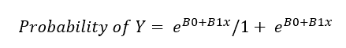
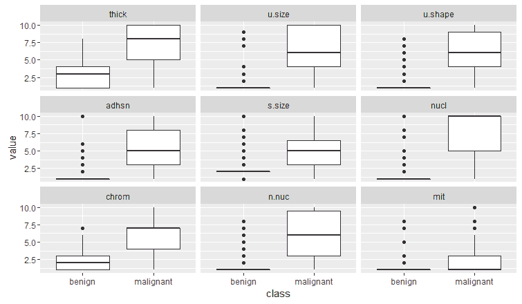
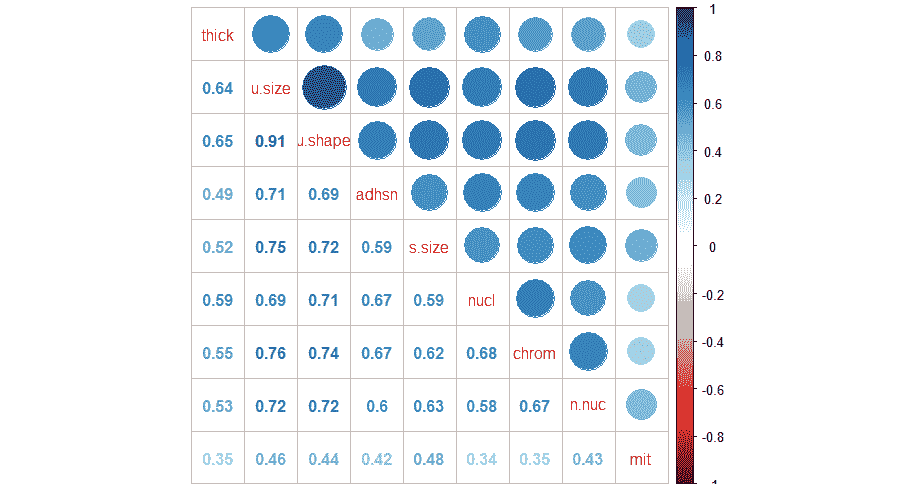
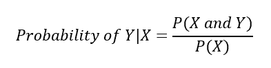
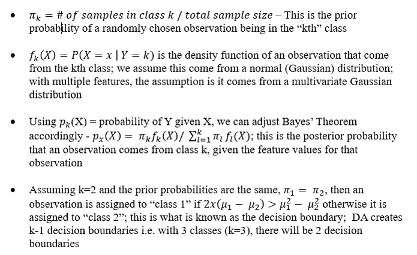
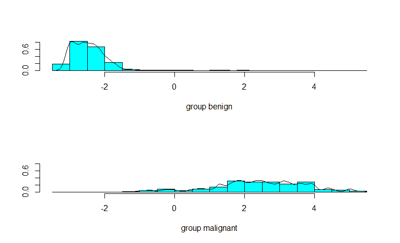
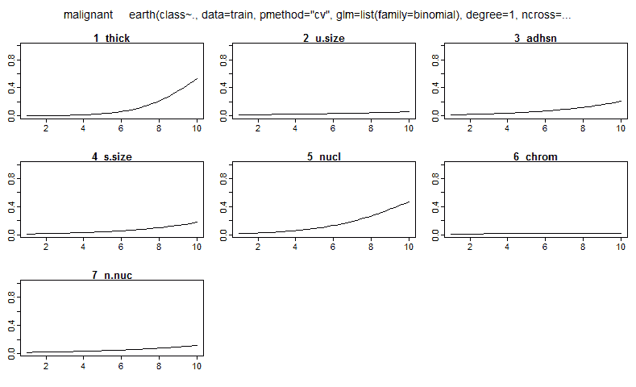
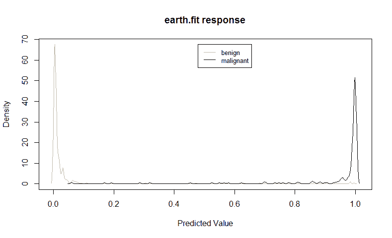
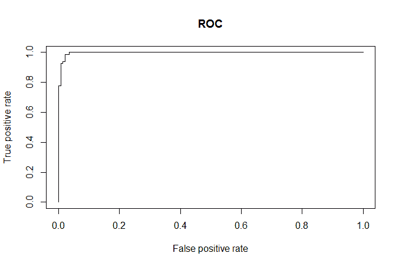
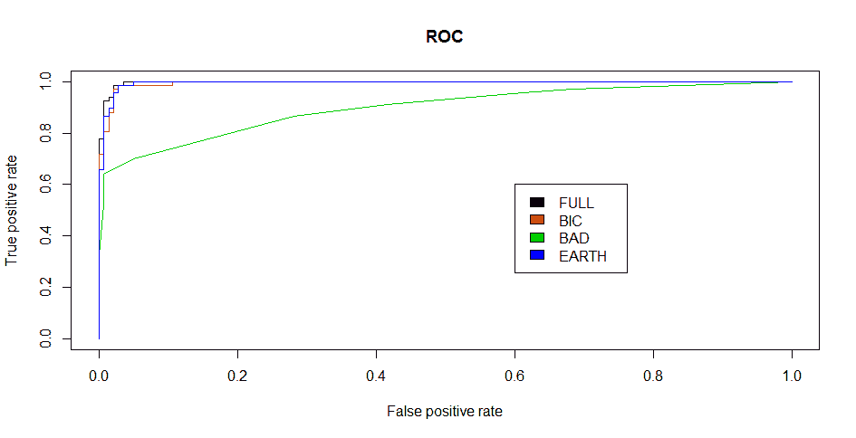

# 逻辑回归和判别分析

"这个世界的真正逻辑是概率论。"

- 詹姆斯·克拉克·麦克斯韦，苏格兰物理学家

在上一章中，我们探讨了使用**普通最小二乘法**（**OLS**）来预测定量结果，换句话说，就是线性回归。现在是时候转换一下方向，看看我们如何开发算法来预测定性结果。这样的结果变量可以是二元的（男性与女性，购买与未购买，良性肿瘤与恶性肿瘤）或多项式分类（教育水平或眼睛颜色）。无论感兴趣的结果是二元还是多项式，分析师的任务是预测观察值属于结果变量特定类别的概率。换句话说，我们开发算法是为了对观察值进行分类。

为了开始探索分类问题，我们将讨论为什么应用 OLS 线性回归不是正确的技术，以及本章介绍的计算算法如何解决这些问题。然后，我们将研究一个预测活检肿瘤是否为良性或恶性的问题。数据集是众所周知的、广泛可用的**威斯康星乳腺癌数据**。为了解决这个问题，我们将首先构建和解释逻辑回归模型。我们还将开始研究选择特征和最合适的模型的方法。接下来，我们将讨论线性判别分析和二次判别分析，并将它们与逻辑回归进行比较和对比。然后，我们将基于乳腺癌数据构建预测模型。最后，我们将通过查看多元回归样条和选择最佳整体算法的方法来总结，以解决手头的问题。这些方法（创建`测试`/`训练`数据集和交叉验证）将为后续章节中更高级的机器学习方法奠定基础。

# 分类方法和线性回归

那么，为什么我们不能直接使用我们在上一章中学到的最小二乘回归方法来处理一个定性结果呢？嗯，实际上你可以这样做，但风险自负。让我们假设一下，你有一个你试图预测的结果，它有三个不同的类别：轻微、中度和严重。你和你的同事也假设轻微和中度以及中度和严重之间的差异是一个等效的度量，并且是线性关系。你可以创建一个虚拟变量，其中 0 代表轻微，1 代表中度，2 代表严重。如果你有理由相信这一点，那么线性回归可能是一个可接受的解决方案。然而，像之前那样的定性评估可能会带来高水平的测量误差，这可能会偏误 OLS。在大多数商业问题中，没有科学上可接受的方法将定性响应转换为定量响应。如果你有一个有两种结果（比如失败和通过）的响应呢？再次，使用虚拟变量方法，我们可以将失败结果编码为`0`，通过结果编码为`1`。使用线性回归，我们可以构建一个模型，其中预测值是观察通过或失败的概率。然而，模型中`Y`的估计很可能会超过`[0,1]`的概率约束，因此解释起来可能有些困难。

# 逻辑回归

如前所述，我们的分类问题最好用受限于`0`和`1`的概率来建模。我们可以用许多不同的函数来做所有观察，但在这里我们将专注于逻辑函数。逻辑回归中使用的逻辑函数如下：



如果你曾经在对赛马或世界杯的友好赌注中下注，你可能更了解赔率的概念。逻辑函数可以通过以下公式转换为赔率：*概率（Y）/ 1 - 概率（Y）*。例如，如果巴西赢得世界杯的概率是 20%，那么赔率是*0.2 / 1 - 0.2*，等于*0.25*，这相当于四分之一赔率。

要将赔率转换回概率，将赔率除以一个加上的赔率。因此，世界杯的例子是*0.25 / 1 + 0.25*，等于 20%。此外，让我们考虑一下赔率比。假设德国赢得奖杯的赔率是*0.18*。我们可以用赔率比来比较巴西和德国的赔率。在这个例子中，赔率比将是巴西赔率除以德国赔率。我们最终会得到一个赔率比等于*0.25/0.18*，等于*1.39*。在这里，我们将说巴西赢得世界杯的可能性比德国高*1.39*倍。

一种看待逻辑回归与线性回归之间关系的方法是将逻辑回归表示为对数几率或 *log (P(Y)/1 - P(Y))* 等于 *Bo + B1x*。系数是通过最大似然估计而不是 OLS 来估计的。最大似然背后的直觉是我们正在计算 *Bo* 和 *B1* 的估计值，这将创建一个预测概率，该概率与实际观察到的 *Y* 的结果尽可能接近，这被称为似然。R 语言所做的与其它软件包对最大似然所做的相同，即找到最大化似然的 beta 值的最佳组合。

考虑到这些事实，逻辑回归是一种非常强大的技术，可以预测涉及分类的问题，并且通常是此类问题建模的起点。因此，在本章中，我们将首先使用逻辑回归来处理即将到来的业务问题。

# 业务理解

威斯康星大学的威廉·H·沃尔伯格博士于 1990 年委托收集了威斯康星乳腺癌数据。他收集数据背后的目标是确定肿瘤活检是否为恶性。他的团队使用 **细针穿刺活检** (**FNA**) 收集样本。如果医生通过检查或影像学检查发现异常组织区域，则下一步是收集活检。FNA 是一种相对安全的组织收集方法，并发症很少。病理学家检查活检并试图确定诊断（恶性或良性）。正如你可以想象的那样，这不是一个微不足道的结论。良性乳腺癌并不危险，因为没有风险使异常生长扩散到身体的其他部位。如果良性肿瘤足够大，可能需要进行手术来移除它。另一方面，恶性肿瘤需要医疗干预。治疗水平取决于许多因素，但最可能的是需要手术，随后可能是放疗和/或化疗。

因此，误诊的后果可能是广泛的。对恶性的误诊可能导致昂贵且不必要的治疗，使患者承受巨大的情感和身体负担。另一方面，误诊可能导致患者得不到他们需要的治疗，使癌细胞扩散，导致过早死亡。对乳腺癌患者的早期治疗干预可以大大提高他们的生存率。

因此，我们的任务就是开发出最好的诊断机器学习算法，以便协助患者的医疗团队确定肿瘤是否为恶性。

# 数据理解和准备

这个数据集包含来自 699 名患者的组织样本。它在一个包含 11 个变量的数据框中，如下所示：

+   `ID`: 样本代码号

+   `V1`: 厚度

+   `V2`: 细胞大小的均匀性

+   `V3`: 细胞形状的均匀性

+   `V4`: 边缘粘附

+   `V5`: 单个上皮细胞大小

+   `V6`: 裸核（16 个观测值缺失）

+   `V7`: 平滑染色质

+   `V8`: 正常核仁

+   `V9`: 有丝分裂

+   `class`: 肿瘤诊断是否为良性或恶性；这是我们试图预测的结果

医疗团队已经对九个特征在每个`1`到`10`的量表上进行了评分和编码。

数据框在 R 的`MASS`包下以`biopsy`名称可用。为了准备这些数据，我们将加载数据框，确认结构，将变量重命名为有意义的名称，并删除缺失的观测值。到这一点，我们可以开始从视觉上探索数据。以下是当我们首次加载库和数据集时将开始的代码；使用`str()`函数，我们将检查数据的底层结构：

```py
    > library(MASS)
    > data(biopsy)
    > str(biopsy)
    'data.frame':   699 obs. of  11 variables:
     $ ID   : chr  "1000025" "1002945" "1015425" 
       "1016277" ...
     $ V1   : int  5 5 3 6 4 8 1 2 2 4 ...
     $ V2   : int  1 4 1 8 1 10 1 1 1 2 ...
     $ V3   : int  1 4 1 8 1 10 1 2 1 1 ...
     $ V4   : int  1 5 1 1 3 8 1 1 1 1 ...
     $ V5   : int  2 7 2 3 2 7 2 2 2 2 ...
     $ V6   : int  1 10 2 4 1 10 10 1 1 1 ...
     $ V7   : int  3 3 3 3 3 9 3 3 1 2 ...
     $ V8   : int  1 2 1 7 1 7 1 1 1 1 ...
     $ V9   : int  1 1 1 1 1 1 1 1 5 1 ...
     $ class: Factor w/ 2 levels "benign","malignant": 1 1 1 1 1 2 1 1 
     1 1 ...

```

检查数据结构显示，我们的特征是整数，结果是一个因子。不需要将数据转换为不同的结构。

我们现在可以删除`ID`列，如下所示：

```py
 > biopsy$ID = NULL

```

接下来，我们将重命名变量并确认代码是否按预期工作：

```py
 > names(biopsy) <- c("thick", "u.size", "u.shape", 
        "adhsn", "s.size", "nucl",    "chrom", "n.nuc", 
            "mit", "class")
 > names(biopsy)
 [1] "thick"   "u.size"  "u.shape" "adhsn"   
        "s.size"  "nucl" "chrom"   "n.nuc"
 [9] "mit"     "class"

```

现在，我们将删除缺失的观测值。由于只有 16 个观测值带有缺失数据，它们只占所有观测值的 2%，因此可以安全地删除它们。如何处理缺失数据的详细讨论超出了本章的范围，已在附录 A，“R 基础”，中包含，我在那里介绍了数据处理。在删除这些观测值时，将创建一个新的工作数据框。一行代码通过`na.omit`函数完成这个技巧，该函数删除所有缺失的观测值：

```py
    > biopsy.v2 <- na.omit(biopsy)

```

根据你使用的 R 包来分析数据，结果需要是数值型，即`0`或`1`。为了满足这一要求，创建变量`y`，其中良性为`0`，恶性为`1`，如以下所示使用`ifelse()`函数：

```py
 > y <- ifelse(biopsy$class == "malignant", 1, 0)

```

在分类问题中，我们可以通过多种方式直观地理解数据，我认为这很大程度上取决于个人喜好。在这些情况下，我喜欢做的事情之一是检查由分类结果分割的特征的**箱线图**。这是一种理解哪些特征可能对算法很重要的极好方式。箱线图是一种简单的方法，可以一眼看出数据的分布。根据我的经验，这还为你提供了一个有效的方式来构建你将向客户展示的演示故事。快速完成这项任务有多种方法，`lattice`和`ggplot2`包在这方面做得相当不错。在这种情况下，我将使用`ggplot2`，并附加`reshape2`包。在加载这些包之后，你需要使用`melt()`函数创建一个数据框。这样做的原因是，熔化特征将允许创建一个箱线图矩阵，使我们能够轻松地进行以下视觉检查：

```py
    > library(reshape2)
    > library(ggplot2)

```

以下代码通过它们的值将数据熔化成一个整体特征，并按类别分组：

```py
    > biop.m <- melt(biopsy.v2, id.var = "class")

```

通过`ggplot2`的魔力，我们可以创建一个 3x3 的箱线图矩阵，如下所示：

```py
    > ggplot(data = biop.m, aes(x = class, y = value)) 
    + geom_boxplot() + facet_wrap(~ variable, ncol = 3)

```

以下代码的输出如下：



我们如何解释箱线图？首先，在前面的截图上，粗白框构成了数据的上四分位数和下四分位数；换句话说，所有观察值的一半都落在粗白框区域内。穿过框的深色线是中位数。从框延伸出来的线也是四分位数，终止于最大值和最小值，不考虑异常值。黑色点构成了异常值。

通过检查图表并应用一些判断，很难确定哪些特征将在我们的分类算法中很重要。然而，鉴于中位数值和相应分布的分离，我认为可以安全地假设核特征将很重要。相反，似乎有很少的类别的有丝分裂特征分离，它可能是一个无关紧要的特征。我们将拭目以待！

由于所有特征都是定量数据，我们也可以像在线性回归中做的那样进行相关性分析。与逻辑回归的共线性可能会像我们在线性回归中讨论的那样，对我们的估计产生偏差。让我们加载`corrplot`包，并像上一章那样检查相关性，这次使用不同类型的相关性矩阵，该矩阵在同一图表中既有阴影椭圆又有相关性系数，如下所示：

```py
    > library(corrplot)
    > bc <- cor(biopsy.v2[, 1:9]) #create an object of 
       the features
    > corrplot.mixed(bc)

```

以下代码的输出如下：



相关系数表明我们可能存在共线性问题，特别是那些具有统一形状和统一大小的特征。作为逻辑回归建模过程的一部分，我们需要像线性回归那样进行 VIF 分析。数据准备的最后任务是创建我们的`train`和`test`数据集。从原始数据集中创建两个不同的数据集的目的是为了提高我们准确预测先前未使用或未见过的数据的能力。

在本质上，在机器学习中，我们不应该过于关注我们如何预测当前的观测值，而应该更多地关注我们如何预测那些未被用于创建算法的观测值。因此，我们可以使用训练数据创建和选择最佳算法，以最大化我们在`test`集上的预测。我们将在本章中构建的模型将根据这一标准进行评估。

有许多方法可以将我们的数据按比例分成`train`和`test`集：50/50、60/40、70/30、80/20 等等。你选择的数据分割应该基于你的经验和判断。对于这个练习，我将使用 70/30 的分割，如下所示：

```py
    > set.seed(123) #random number generator
    > ind <- sample(2, nrow(biopsy.v2), replace = TRUE, 
       prob = c(0.7, 0.3))
    > train <- biopsy.v2[ind==1, ] #the training data 
       set
    > test <- biopsy.v2[ind==2, ] #the test data set
    > str(test) #confirm it worked
    'data.frame':   209 obs. of  10 variables:
     $ thick  : int  5 6 4 2 1 7 6 7 1 3 ...
     $ u.size : int  4 8 1 1 1 4 1 3 1 2 ...
     $ u.shape: int  4 8 1 2 1 6 1 2 1 1 ...
     $ adhsn  : int  5 1 3 1 1 4 1 10 1 1 ...
     $ s.size : int  7 3 2 2 1 6 2 5 2 1 ...
     $ nucl   : int  10 4 1 1 1 1 1 10 1 1 ...
     $ chrom  : int  3 3 3 3 3 4 3 5 3 2 ...
     $ n.nuc  : int  2 7 1 1 1 3 1 4 1 1 ...
     $ mit    : int  1 1 1 1 1 1 1 4 1 1 ...
     $ class  : Factor w/ 2 levels benign","malignant": 
       1 1 1 1 1 2 1 
       2 1 1 ...

```

为了确保我们在两个数据集之间有一个平衡的因变量，我们将执行以下检查：

```py
    > table(train$class)
       benign malignant
          302       172
    > table(test$class)
       benign malignant
          142        67

```

这是我们两个数据集结果的合理比率；有了这个比率，我们可以开始建模和评估。

# 建模和评估

在这个过程的部分，我们将从一个包含所有输入变量的逻辑回归模型开始，然后缩小到最佳子集的特征。之后，我们将尝试**判别分析**和**多元自适应回归样条**（**MARS**）。

# 逻辑回归模型

我们已经讨论了逻辑回归背后的理论，因此我们可以开始拟合我们的模型。R 安装包自带了`glm()`函数，用于拟合广义线性模型，其中包括逻辑回归。代码语法与我们之前章节中使用的`lm()`函数类似。一个很大的不同之处在于，我们必须在函数中使用`family = binomial`参数，这告诉 R 运行逻辑回归方法而不是其他广义线性模型的版本。我们将首先创建一个包含`train`集上所有特征的模型，并查看它在`test`集上的表现，如下所示：

```py
    > full.fit <- glm(class ~ ., family = binomial, 
      data = train)
    > summary(full.fit)
    Call:
    glm(formula = class ~ ., family = binomial, data = 
      train) 
    Deviance Residuals:
    Min       1Q   Median       3Q      Max 
    -3.3397  -0.1387  -0.0716   0.0321   2.3559 
    Coefficients:
    Estimate Std. Error z value Pr(>|z|) 
    (Intercept)  -9.4293     1.2273  -7.683 1.55e-14 
      ***
    thick         0.5252     0.1601   3.280 0.001039 **
    u.size       -0.1045     0.2446  -0.427 0.669165 
    u.shape       0.2798     0.2526   1.108 0.268044 
    adhsn         0.3086     0.1738   1.776 0.075722 . 
    s.size        0.2866     0.2074   1.382 0.167021 
    nucl          0.4057     0.1213   3.344 0.000826 
      ***
    chrom         0.2737     0.2174   1.259 0.208006 
    n.nuc         0.2244     0.1373   1.635 0.102126 
    mit           0.4296     0.3393   1.266 0.205402 
    ---
    Signif. codes:  0 '***' 0.001 '**' 0.01 '*' 0.05 
      '.' 0.1 ' ' 1
    (Dispersion parameter for binomial family taken to 
       be 1)
        Null deviance: 620.989  on 473  degrees of 
       freedom
    Residual deviance:  78.373  on 464  degrees of 
       freedom
    AIC: 98.373
    Number of Fisher Scoring iterations: 8

```

`summary()`函数允许我们检查系数及其 p 值。我们可以看到只有两个特征的 p 值小于`0.05`（厚度和核）。我们可以使用`confint()`函数来检查 95%置信区间，如下所示：

```py
    > confint(full.fit)
                       2.5 %     97.5 %
    (Intercept) -12.23786660 -7.3421509
    thick         0.23250518  0.8712407
    u.size       -0.56108960  0.4212527
    u.shape      -0.24551513  0.7725505
    adhsn        -0.02257952  0.6760586
    s.size       -0.11769714  0.7024139
    nucl          0.17687420  0.6582354
    chrom        -0.13992177  0.7232904
    n.nuc        -0.03813490  0.5110293
    mit          -0.14099177  1.0142786

```

注意，两个显著特征的有信心区间没有穿过零。你不能像在逻辑回归中翻译系数那样翻译系数，因为*Y*的变化是基于*X*的一个单位变化。这就是为什么优势比可以非常有帮助。对数函数的 beta 系数可以通过指数（beta）转换为优势比。

为了在 R 中生成优势比，我们将使用以下`exp(coef())`语法：

```py
    > exp(coef(full.fit))
     (Intercept)        thick       u.size      u.shape        
     adhsn
    8.033466e-05 1.690879e+00 9.007478e-01 1.322844e+00 
     1.361533e+00
   s.size         nucl        chrom        n.nuc  mit
   1.331940e+00 1.500309e+00 1.314783e+00 1.251551e+00 
    1.536709e+00

```

优势比的解释是特征单位变化导致的结果优势的变化。如果值大于 1，这表明随着特征的增加，结果的优势增加。相反，一个小于 1 的值意味着随着特征的增加，结果的优势减少。在这个例子中，除了`u.size`之外的所有特征都会增加对数优势。

在数据探索期间指出的问题之一是多共线性的潜在问题。我们可以用以下方式在逻辑模型中生成我们在线性回归中生成的 VIF 统计量：

```py
    > library(car)
    > vif(full.fit)
       thick  u.size  u.shape  adhsn   s.size   nucl   
      chrom   n.nuc
     1.2352 3.2488  2.8303   1.3021  1.6356   1.3729 
       1.5234  1.3431
       mit
    1.059707

```

没有任何一个值大于 VIF 经验法则的五个标准，所以共线性似乎不是问题。特征选择将是下一个任务；但，现在，让我们编写一些代码来查看这个模型在`train`和`test`集上的表现如何。

你首先需要创建一个预测概率的向量，如下所示：

```py
    > train.probs <- predict(full.fit, type = 
       "response")
    > train.probs[1:5] #inspect the first 5 predicted 
        probabilities
    [1] 0.02052820 0.01087838 0.99992668 0.08987453 
        0.01379266

```

接下来，我们需要评估模型在训练中的表现，然后评估它在测试集中的拟合度。快速做到这一点的一种方法就是生成一个混淆矩阵。在后面的章节中，我们将检查`caret`包提供的版本。`InformationValue`包也提供了一个版本。这里我们需要结果为 0 和 1。函数选择良性或恶性的默认值是 0.50，也就是说，任何概率在 0.50 或以上的都被分类为恶性：

```py
 > trainY <- y[ind==1]
 > testY <- y[ind==2]
 > confusionMatrix(trainY, train.probs)
 0    1
 0 294    7
 1   8  165 

```

行表示预测，列表示实际值。对角线元素是正确的分类。右上角的值`7`是假阴性的数量，左下角的值`8`是假阳性的数量。我们还可以查看错误率，如下所示：

```py
 > misClassError(trainY, train.probs)
 [1] 0.0316 

```

我们似乎在训练集上做得相当不错，只有*3.16%*的错误率。正如我们之前讨论的，我们必须能够准确预测未见数据，换句话说，我们的`test`集。

为`test`集创建混淆矩阵的方法与我们为训练数据所做的方法类似：

```py
    > test.probs <- predict(full.fit, newdata = test, 
       type = "response")
    > misClassError(testY, test.probs)
    [1] 0.0239
    > confusionMatrix(testY, test.probs)
        0    1
    0 139    2
    1   3   65

```

看起来我们在创建一个具有所有功能的模型方面做得相当不错。大约 98%的预测准确率相当令人印象深刻。然而，我们仍然需要检查是否还有改进的空间。想象一下，如果你或你的亲人被错误地诊断了。正如之前提到的，其影响可能相当严重。考虑到这一点，也许有更好的方法来创建一个分类算法？让我们看看吧！

# 带有交叉验证的逻辑回归

交叉验证的目的是提高我们对`测试`集的预测，并最小化过拟合的机会。在**K 折交叉验证**中，数据集被分成 K 个大小相等的部分。算法通过交替地保留一个**K-集**来学习；它将模型拟合到其他**K-1 部分**，并为遗漏的 K 集获得预测。然后平均这些结果以最小化误差，并选择适当的特征。你也可以执行**留一法交叉验证（LOOCV**）方法，其中 K 等于 1。模拟表明，LOOCV 方法可以有平均估计值，其方差较高。因此，大多数机器学习专家会建议 K 折数应该是 5 或 10。

一个自动为逻辑回归执行`CV`的 R 包是`bestglm`包。此包依赖于我们用于线性回归的`leaps`包。数据的语法和格式需要一些注意，让我们详细说明这一点：

```py
    > library(bestglm)
    Loading required package: leaps

```

在加载包之后，我们需要将我们的结果编码为`0`或`1`。如果保留为因子，则不会工作。要使用该包的另一个要求是，你的结果或`y`是最后一列，并且所有无关的列都已删除。以下代码将为我们创建一个新的数据框：

```py
 > X <- train[, 1:9]
 > Xy <- data.frame(cbind(X, trainY)) 

```

下面是运行代码以使用我们的数据中的`CV`技术：

```py
    > bestglm(Xy = biopsy.cv, IC="CV", 
      CVArgs=list(Method="HTF", K=10, 
      REP=1), family=binomial)

```

语法`Xy = Xy`指向我们正确格式化的数据框。`IC = "CV"`告诉包使用的信息标准是交叉验证。`CVArgs`是我们想要使用的`CV`参数。`HTF`方法是 K 折，后面跟着折数，`K = 10`，我们要求它只进行一次随机折叠的迭代，`REP = 1`。就像`glm()`一样，我们还需要使用`family = binomial`。顺便说一下，你也可以通过指定`family = gaussian`使用`bestglm`进行线性回归。因此，在运行分析后，我们将得到以下输出，给出`最佳模型`的三个特征，例如`thick`、`u.size`和`nucl`。关于`Morgan-Tatar 搜索`的陈述仅仅意味着对所有可能的子集进行了简单的穷举搜索，如下所示：

```py
    Morgan-Tatar search since family is non-gaussian.
    CV(K = 10, REP = 1)
    BICq equivalent for q in (7.16797006619085e-05, 
    0.273173435514231)
    Best Model:
    Estimate Std. Error   z value     Pr(>|z|)
    (Intercept) -7.8147191 0.90996494 -8.587934 
     8.854687e-18
    thick        0.6188466 0.14713075  4.206100 
     2.598159e-05
    u.size       0.6582015 0.15295415  4.303260 
     1.683031e-05
    nucl         0.5725902 0.09922549  5.770596 
     7.899178e-09

```

我们可以将这些特征放入`glm()`中，然后看看模型在`测试`集上的表现如何。`predict()`函数与`bestglm`不兼容，所以这是一个必要的步骤：

```py
    > reduce.fit <- glm(class ~ thick + u.size + nucl, 
       family = binomial, data = train)

```

如前所述，以下代码允许我们在测试集上比较预测标签与实际标签：

```py
    > test.cv.probs <- predict(reduce.fit, newdata = 
       test, type = "response")
    > misClassError(testY, test.cv.probs)
    [1] 0.0383
    > confusionMatrix(testY, test.cv.probs)
        0    1
    0 139    5
    1   3   62

```

减少特征模型略逊于完整特征模型，但并非全然无望。我们可以再次利用`bestglm`包，这次使用最佳子集，将信息标准设置为`BIC`：

```py
    > bestglm(Xy = Xy, IC = "BIC", family = binomial)
    Morgan-Tatar search since family is non-gaussian.
    BIC
    BICq equivalent for q in (0.273173435514231, 
      0.577036596263757)
    Best Model:
     Estimate Std. Error   z value     Pr(>|z|)
    (Intercept) -8.6169613 1.03155250 -8.353391 
      6.633065e-17
    thick        0.7113613 0.14751510  4.822295 
      1.419160e-06
    adhsn        0.4537948 0.15034294  3.018398 
      2.541153e-03
    nucl         0.5579922 0.09848156  5.665956 
      1.462068e-08
    n.nuc        0.4290854 0.11845720  3.622282 
      2.920152e-04

```

这四个特征为所有可能的子集提供了最小的`BIC`分数。让我们尝试一下，看看它如何预测`test`集，如下所示：

```py
    > bic.fit <- glm(class ~ thick + adhsn + nucl + 
       n.nuc, family = binomial, data = train)
    > test.bic.probs <- predict(bic.fit, newdata = 
       test, type = "response")
    > misClassError(testY, test.bic.probs)
    [1] 0.0239
    > confusionMatrix(testY, test.bic.probs)
        0    1
    0 138    1
    1   4   66

```

在这里我们有五个错误，就像完整模型一样。那么明显的疑问是：哪一个更好？在任何正常情况下，根据泛化能力的相等性，通常的规则是默认选择最简单或最容易解释的模型。我们可以进行完全新的分析，使用新的随机化以及`train`和`test`集之间的不同比率等。然而，让我们暂时假设我们已经用尽了逻辑回归能为我们做的极限。我们将在最后回到完整模型和我们基于`BIC`最小值开发的模型，并讨论模型选择的方法。现在，让我们继续我们的判别分析方法，我们也将将其作为最终建议的可能性之一。

# 判别分析概述

**判别分析**（**DA**），也称为**费舍尔判别分析**（**FDA**），是另一种流行的分类技术。当类别分离良好时，它可以是逻辑回归的有效替代。如果你有一个分类问题，其中结果类别分离良好，逻辑回归可能会有不稳定的估计，也就是说，置信区间很宽，估计本身可能从一个样本到另一个样本变化（James，2013）。DA 不受此问题的影响，因此可能优于逻辑回归，并且具有更广泛的泛化能力。相反，如果特征和结果变量之间存在复杂关系，它可能在分类任务上表现不佳。在我们的乳腺癌例子中，逻辑回归在测试集和训练集上表现良好，类别没有很好地分离。为了与逻辑回归进行比较，我们将探索 DA，包括**线性判别分析**（**LDA**）和**二次判别分析**（**QDA**）。

DA 利用**贝叶斯定理**来确定每个观察值的类别成员概率。例如，如果你有两个类别，比如良性肿瘤和恶性肿瘤，那么 DA 将计算观察值属于这两个类别的概率，并选择最高概率作为正确的类别。

贝叶斯定理指出，在给定*X*发生的情况下*Y*发生的概率等于*Y*和*X*同时发生的概率除以*X*发生的概率，可以表示如下：



这个表达式的分子是观察值属于该类别级别并且具有这些特征值的可能性。分母是具有这些特征值的观察值在所有级别上的可能性。再次强调，分类规则说，如果你有*X*和*Y*的联合分布，并且如果*X*已知，那么将观察值分配给哪个类别的最优决策是通过选择具有较大概率（后验概率）的类别。

获得后验概率的过程包括以下步骤：

1.  收集具有已知类别成员资格的数据。

1.  计算先验概率；这代表样本属于每个类别的比例。

1.  通过它们的类别计算每个特征的均值。

1.  计算每个特征的方差-协方差矩阵；如果是 LDA，那么这将是一个所有类别的汇总矩阵，给我们一个线性分类器，如果是 QDA，那么为每个类别创建的方差-协方差矩阵。

1.  为每个类别估计正态分布（高斯密度）。

1.  计算用于分类新对象的判别函数。

1.  根据判别函数将观察值分配给一个类别。

这将提供关于确定后验概率的扩展说明，如下所示：



尽管 LDA 简洁优雅，但它受限于每个类别的观察值具有多元正态分布的假设，并且类别之间存在共同的协方差。QDA 仍然假设观察值来自正态分布，但它还假设每个类别都有自己的协方差。

这有什么关系呢？当你放宽了常见的协方差假设，你现在允许将二次项纳入判别分数的计算中，这在 LDA 中是不可能的。这一数学原理可能有点令人畏惧，并且超出了本书的范围。需要记住的重要部分是，QDA 比逻辑回归更灵活的技术，但我们必须牢记我们的**偏差-方差**权衡。使用更灵活的技术，你可能会拥有更低的偏差，但可能具有更高的方差。像许多灵活的技术一样，需要一个健壮的训练数据集来减轻高分类器的方差。

# 判别分析应用

LDA 在`MASS`包中执行，我们已经加载了它，以便我们可以访问活检数据。语法与`lm()`和`glm()`函数非常相似。

我们现在可以开始拟合我们的 LDA 模型，如下所示：

```py
    > lda.fit <- lda(class ~ ., data = train)
    > lda.fit
    Call:
    lda(class ~ ., data = train)
    Prior probabilities of groups:
       benign malignant
    0.6371308 0.3628692
    Group means:
 thick  u.size u.shape   adhsn  s.size    nucl   
      chrom
    benign    2.9205 1.30463 1.41390 1.32450 2.11589 
      1.39735 2.08278
    malignant 7.1918 6.69767 6.68604 5.66860 5.50000 
      7.67441 5.95930
                n.nuc     mit
    benign    1.22516 1.09271
    malignant 5.90697 2.63953
    Coefficients of linear discriminants:
                    LD1
    thick    0.19557291
    u.size   0.10555201
    u.shape  0.06327200
    adhsn    0.04752757
    s.size   0.10678521
    nucl     0.26196145
    chrom    0.08102965
    n.nuc    0.11691054
    mit     -0.01665454

```

这个输出显示，`组的先验概率`大约为 64%对良性，36%对恶性。接下来是`组均值`。这是每个特征按其类别的平均值。`线性判别系数`是用于确定观察值判别分数的特征的标准化线性组合。分数越高，分类为`恶性`的可能性就越大。

LDA 中的`plot()`函数会为我们提供判别分数的直方图和/或密度，如下所示：

```py
    > plot(lda.fit, type = "both")

```

以下是在先前的命令输出：



我们可以看到组之间存在一些重叠，这表明将有一些分类错误的观察值。

LDA 提供的`predict()`函数有三个元素：类别、后验和 x。类别元素是良性或恶性的预测，后验是 x 属于每个类别的概率分数，x 是线性判别分数。让我们只提取观察值是恶性的概率：

```py
    > train.lda.probs <- predict(lda.fit)$posterior[, 
      2]
    > misClassError(trainY, train.lda.probs)
 [1] 0.0401
 > confusionMatrix(trainY, train.lda.probs)
 0    1
 0 296   13
 1   6  159 

```

好吧，不幸的是，我们的 LDA 模型表现远不如逻辑回归模型。主要问题是看看它在`测试`数据上的表现如何：

```py
    > test.lda.probs <- predict(lda.fit, newdata = 
       test)$posterior[, 2]
    > misClassError(testY, test.lda.probs)
    [1] 0.0383
    > confusionMatrix(testY, test.lda.probs)
        0    1
    0 140    6
    1   2   61

```

考虑到在训练数据上的表现较差，这实际上并没有我想象的那么糟糕。从正确分类的角度来看，它仍然没有逻辑回归（96%与逻辑回归几乎 98%）表现得那么好。

我们现在将转向拟合一个 QDA 模型。在 R 中，QDA 也是`MASS`包的一部分，函数是`qda()`。构建模型再次相当直接，我们将将其存储在一个名为`qda.fit`的对象中，如下所示：

```py
    > qda.fit = qda(class ~ ., data = train) 
    > qda.fit
    Call:
    qda(class ~ ., data = train)
    Prior probabilities of groups:
       benign malignant
    0.6371308 0.3628692
    Group means:
 Thick u.size u.shape  adhsn s.size   nucl  chrom  
     n.nuc
    benign    2.9205 1.3046  1.4139 1.3245 2.1158 
      1.3973 2.0827 1.2251
    malignant 7.1918 6.6976  6.6860 5.6686 5.5000 
      7.6744 5.9593 5.9069
                   mit
    benign    1.092715
    malignant 2.639535

```

与 LDA 一样，输出有`组均值`，但没有系数，因为它是一个二次函数，如前所述。

`训练`和`测试`数据的预测遵循与 LDA 相同的代码流程：

```py
 > train.qda.probs <- predict(qda.fit)$posterior[,          
      2]
 > misClassError(trainY, train.qda.probs)
 [1] 0.0422
 > confusionMatrix(trainY, train.qda.probs)
 0    1
 0 287    5
 1  15  167
 > test.qda.probs <- predict(qda.fit, newdata = 
      test)$posterior[, 2]
 > misClassError(testY, test.qda.probs)
 [1] 0.0526
 > confusionMatrix(testY, test.qda.probs)
 0    1
 0 132    1
 1  10   66 

```

我们可以快速从混淆矩阵中看出，QDA 在训练数据上的表现最差，并且它对`测试`集的分类也很差，有 11 个预测错误。特别是，它有很高的假阳性率。

# 多变量自适应回归样条（MARS）

你想要一种提供以下所有功能的建模技术吗？

+   提供了构建回归和分类的线性和非线性模型的灵活性

+   可以支持变量交互项

+   简单易懂

+   需要很少的数据预处理

+   处理所有类型的数据：数值型、因子型等

+   在未见过的数据上表现良好，也就是说，它在偏差-方差权衡中做得很好

如果这一切听起来都很吸引人，那么我强烈推荐使用 MARS 模型。几个月前，这种方法引起了我的注意，我发现它的表现极其出色。事实上，在我最近的一个案例中，它在测试/验证数据上优于随机森林和提升树。它迅速成为我的基准模型，其他所有模型都是竞争对手。我看到的另一个好处是，它消除了我进行的大部分特征工程。其中很大一部分是使用**证据权重**（**WOE**）和**信息值**（**IV**）来捕捉非线性并重新编码变量。这种 WOE/IV 技术是我计划在这第二版中详细讨论的内容。然而，我已经进行了许多测试，发现 MARS 在执行这项技术（即捕捉非线性）方面做得非常出色，因此我将完全不讨论 WOE/IV。

要理解 MARS 相当简单。首先，就像我们之前讨论的那样，从一个线性或广义线性模型开始。然后，为了捕捉任何非线性关系，添加一个`hinge`函数。这些`hinges`是输入特征中的点，相当于系数的变化。例如，假设我们有*Y = 12.5（我们的截距）+ 1.5（变量 1）+ 3.3（变量 2）；其中变量 1 和 2 的取值范围是 1 到 10*。现在，让我们看看变量*2*的`hinge`函数如何发挥作用：

*Y = 11（新的截距）+ 1.5（变量 1）+ 4.26734（max(0, 变量 2 - 5.5)*

因此，我们读取`hinge`函数的方式是：我们取*0*或变量*2*减去 5.50*中的最大值。所以，当变量*2*的值大于*5.5*时，该值将乘以系数；否则，它将为零。该方法将适应每个变量的多个`hinges`以及交互项。

MARS 的另一个有趣之处在于自动变量选择。这可以通过交叉验证来完成，但默认是通过正向传递来构建模型，类似于正向逐步回归，然后通过反向传递来修剪模型，这可能导致模型在正向传递后过度拟合数据。这个反向传递会修剪输入特征并基于**广义交叉验证**（**GCV**）移除`hinges`：

*GCV = RSS / (N * (1 - 有效参数数量 / N)²)*

*有效参数数量 = 输入特征数量 + 惩罚 * (输入特征数量 - 1) / 2*

在`earth`包中，对于加性模型，*惩罚 = 2*，对于乘性模型，*惩罚 = 3*，即带有交互项的模型。

在 R 中，有很多参数可以调整。我将在示例中展示一种有效且简单的方法来实现这种方法。如果你有兴趣，你可以在斯蒂芬·米尔博沃（Stephen Milborrow）的出色在线资源*earth 包笔记*中了解更多关于其灵活性的信息，链接如下：

[`www.milbo.org/doc/earth-notes.pdf`](http://www.milbo.org/doc/earth-notes.pdf)

在介绍这部分完成后，让我们开始吧。你可以使用 `MDA` 包，但我是在 `earth` 上学习的，所以这就是我将展示的内容。代码与之前的例子类似，我们使用了 `glm()`。然而，重要的是要指定你想要如何修剪模型，以及它是一个二项响应变量。在这里，我指定了一个五折交叉验证的模型选择（`pmethod = "cv"` 和 `nfold = 5`），重复 3 次（`ncross = 3`），作为一个只有加性模型而没有交互作用的模型（`degree = 1`）以及每个输入特征只有一个 `hinge`（`minspan = -1`）。在我处理的数据中，交互项和多个 `hinge` 都导致了过拟合。当然，你的结果可能会有所不同。代码如下：

```py
 > library(earth)
 > set.seed(1)
 > earth.fit <- earth(class ~ ., data = train,
 pmethod = "cv",
 nfold = 5,
 ncross = 3,
 degree = 1,
 minspan = -1,
 glm=list(family=binomial)
 ) 

```

现在我们来检查模型摘要。一开始，可能会有些令人困惑。当然，我们有模型公式和逻辑系数，包括 `hinge` 函数，然后是一些与广义 R 平方等相关的评论和数字。发生的情况是，首先在数据上构建了一个 MARS 模型，作为一个标准线性回归，其中响应变量被内部编码为 0 和 1。在特征/变量修剪和最终模型创建后，然后将其转换为 GLM。所以，请忽略 R 平方值：

```py
 > summary(earth.fit)
 Call: earth(formula=class~., data=train, 
      pmethod="cv",
 glm=list(family=binomial), degree=1, ncross=3, 
      nfold=5, minspan=-1)
 GLM coefficients
 malignant
 (Intercept) -6.5746417
 u.size 0.1502747
 adhsn 0.3058496
 s.size 0.3188098
 nucl 0.4426061
 n.nuc 0.2307595
 h(thick-3) 0.7019053
 h(3-chrom) -0.6927319
 Earth selected 8 of 10 terms, and 7 of 9 predictors 
      using pmethod="cv"
 Termination condition: RSq changed by less than 
      0.001 at 10 terms
 Importance: nucl, u.size, thick, n.nuc, chrom, 
      s.size, adhsn, 
      u.shape-unused,  ...
 Number of terms at each degree of interaction: 1 7 
      (additive model)
 Earth GRSq 0.8354593 RSq 0.8450554 mean.oof.RSq 
      0.8331308 (sd 0.0295)
 GLM null.deviance 620.9885 (473 dof) deviance 
      81.90976 (466 dof) 
      iters 8
 pmethod="backward" would have selected the same 
      model:
 8 terms 7 preds, GRSq 0.8354593 RSq 0.8450554 
      mean.oof.RSq 
      0.8331308

```

该模型给出了八个项，包括截距和七个预测因子。其中两个预测因子具有 `hinge` 函数——厚度和染色质。如果厚度大于 3，则 0.7019 的系数乘以该值；否则，为 0。对于染色质，如果小于 3，则系数乘以这些值；否则，为 0。

可用图表。第一个使用 `plotmo()` 函数生成的图表显示了当改变预测因子并保持其他因素不变时模型响应的图表。你可以清楚地看到厚度上的 `hinge` 函数在起作用：

```py
 > plotmo(earth.fit)

```

以下为前一个命令的输出结果：



使用 `plotd()`，你可以看到按类别标签预测概率的密度图：

```py
 > plotd(earth.fit)

```

以下为前一个命令的输出结果：



可以查看相对变量重要性。在这里我们看到变量名 `nsubsets`，这是在修剪传递后包含该变量的模型子集数量，而 `gcv` 和 `rss` 列显示了变量对相应值减少的贡献（`gcv` 和 `rss` 被缩放到 0 到 100）：

```py
 > evimp(earth.fit)
 nsubsets   gcv   rss
 nucl          7 100.0 100.0
 u.size        6  44.2  44.8
 thick         5  23.8  25.1
 n.nuc         4  15.1  16.8
 chrom         3   8.3  10.7
 s.size        2   6.0   8.1
 adhsn         1   2.3   4.6

```

让我们看看它在测试数据集上的表现如何：

```py
 > test.earth.probs <- predict(earth.fit, newdata = 
      test, type = "response")
 > misClassError(testY, test.earth.probs)
 [1] 0.0287
 > confusionMatrix(testY, test.earth.probs)
 0    1
 0 138    2
 1   4   65

```

这与我们的逻辑回归模型非常相似。我们现在可以比较模型，看看我们的最佳选择是什么。

# 模型选择

从所有这些工作中，我们应得出什么结论？我们有模型的混淆矩阵和错误率来指导我们，但在选择分类模型时，我们可以更加复杂。分类模型比较的有效工具是**受试者工作特征**（ROC）图。非常简单地说，ROC 是一种基于性能可视化、组织和选择分类器的方法（Fawcett, 2006）。在 ROC 图上，y 轴是**真正率**（TPR），x 轴是**假正率**（FPR）。以下是一些相当简单的计算：

*TPR = 正确分类的阳性/总阳性*

*FPR = 错误分类的阴性/总阴性*

绘制 ROC 结果将生成一条曲线，因此你可以生成**曲线下面积**（AUC）。AUC 为你提供了一个有效的性能指标，并且可以证明 AUC 等于观察者在随机选择的一对案例中正确识别阳性案例的概率，其中一对案例中一个是阳性，一个是阴性（Hanley JA & McNeil BJ, 1982）。在我们的情况下，我们将用我们的算法替换观察者，并相应地进行评估。

要在 R 中创建 ROC 图，你可以使用`ROCR`包。我认为这是一个非常好的包，它允许你仅用三行代码就构建一个图表。该包还有一个优秀的配套网站（包含示例和演示），可以在以下链接找到：

[`rocr.bioinf.mpi-sb.mpg.de/`](http://rocr.bioinf.mpi-sb.mpg.de/)

我想要展示的是我们 ROC 图上的三个不同曲线：完整模型、使用 BIC 选择特征的简化模型、MARS 模型，以及一个不良模型。这个所谓的“不良模型”将只包含一个预测特征，并将为我们其他模型提供一个有效的对比。因此，让我们加载`ROCR`包，构建这个表现不佳的模型，为了简便起见，我们将其命名为`bad.fit`，使用`thick`特征：

```py
    > library(ROCR)
    > bad.fit <- glm(class ~ thick, family = binomial, 
      data = test)
    > test.bad.probs = predict(bad.fit, type = 
      "response") #save 
      probabilities

```

现在可以使用`test`数据集，每行代码构建一个 ROC 图。我们首先创建一个保存预测概率和实际分类的对象。然后，我们将使用此对象创建另一个包含计算出的 TPR 和 FPR 的对象。然后，我们将使用`plot()`函数构建图表。让我们从使用所有特征的模型开始，或者，正如我所说的，完整模型。这是我们在本章的*逻辑回归模型*部分构建的初始模型：

```py
    > pred.full <- prediction(test.probs, test$class)

```

以下是与 TPR 和 FPR 相关的性能对象：

```py
    > perf.full <- performance(pred.full, "tpr", "fpr")

```

以下带有标题`ROC`和`col=1`的`plot`命令将线条颜色设置为黑色：

```py
    > plot(perf.full, main = "ROC", col = 1)

```

前一个命令的输出如下：



如前所述，曲线代表 y 轴上的 TPR 和 x 轴上的 FPR。如果你有一个完美的分类器，没有假阳性，那么线将在 x 轴上的*0.0*处垂直运行。如果一个模型的表现不如随机，那么线将从左下角斜向右上角。提醒一下，完整的模型漏掉了五个标签：三个假阳性和两个假阴性。现在我们可以使用类似的代码添加其他模型进行比较，从使用 BIC 构建的模型开始（参考本章的*带有交叉验证的逻辑回归*部分），如下所示：

```py
    > pred.bic <- prediction(test.bic.probs, 
      test$class)
    > perf.bic <- performance(pred.bic, "tpr", "fpr")
    > plot(perf.bic, col = 2, add = TRUE)

```

`plot`命令中的`add=TRUE`参数将线添加到现有的图表中。最后，我们将添加表现不佳的模型，即 MARS 模型，并包含一个`legend`图表，如下所示：

```py
    > pred.bad <- prediction(test.bad.probs, 
      test$class)
    > perf.bad <- performance(pred.bad, "tpr", "fpr")
    > plot(perf.bad, col = 3, add = TRUE)
    > pred.earth <- prediction(test.earth.probs, 
      test$class)
    > perf.earth <- performance(pred.earth, "tpr", 
      "fpr")
    > plot(perf.earth, col = 4, add = TRUE)
    > legend(0.6, 0.6, c("FULL", "BIC", "BAD", 
      "EARTH"), 1:4)

```

以下是对前面代码片段的输出：



我们可以看到，`FULL`模型、`BIC`模型和`MARS`模型几乎重叠。也很明显，`BAD`模型的表现正如预期的那样糟糕。

我们在这里能做的最后一件事是计算 AUC。这同样是在`ROCR`包中通过创建一个`performance`对象来完成的，除了你必须用`auc`替换`tpr`和`fpr`。代码和输出如下：

```py
 > performance(pred.full, "auc")@y.values
 [[1]]
 [1] 0.9972672
 > performance(pred.bic, "auc")@y.values
 [[1]]
 [1] 0.9944293
 > performance(pred.bad, "auc")@y.values
 [[1]]
 [1] 0.8962056
 > performance(pred.earth, "auc")@y.values
 [[1]]
 [1] 0.9952701 

```

最高 AUC 是完整模型，为`0.997`。我们还看到 BIC 模型的百分比为`99.4`，坏模型的百分比为`89.6`，MARS 的百分比为`99.5`。所以，从所有意图和目的来看，除了坏模型外，我们在预测能力上没有差异。我们该怎么办？一个简单的解决方案是对`train`和`test`集重新随机化，并再次尝试这种分析，也许使用 60/40 的分割和不同的随机化种子。但如果我们得到相似的结果，那又如何呢？我认为一个统计纯粹主义者会建议选择最简约的模型，而其他人可能更倾向于包含所有变量。这归结为权衡，即模型精度与可解释性、简单性和可扩展性之间的权衡。在这种情况下，默认选择更简单的模型似乎是安全的，因为它具有相同的精度。不言而喻，我们不会总是只用 GLMs 或判别分析就能达到这种预测水平。我们将在接下来的章节中使用更复杂的技术来处理这些问题，并希望提高我们的预测能力。机器学习的美妙之处在于有几种方法可以“杀猫”。

# 摘要

在本章中，我们探讨了使用概率线性模型通过三种方法来预测定性响应：逻辑回归、判别分析和 MARS。此外，我们还开始了使用 ROC 图表的过程，以便从视觉和统计上探索模型选择。我们还简要讨论了您需要考虑的模型选择和权衡。在未来的章节中，我们将重新审视乳腺癌数据集，以查看更复杂的技术表现如何。
