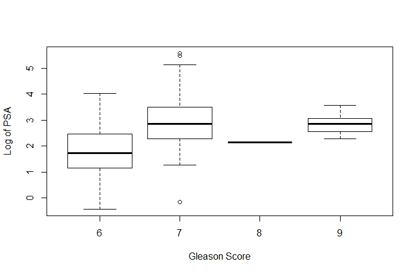

# 线性模型中的高级特征选择

“我发现数学对我来说变得过于抽象，而计算机科学似乎关注细节——试图在计算中节省一微秒或一千字节。在统计学中，我发现了一个结合了数学和计算机科学之美的学科，它们被用来解决现实世界的问题。”

这是由斯坦福大学的**教授**、**Rob Tibshirani**引用的：

[`statweb.stanford.edu/~tibs/research_page.html`](http://statweb.stanford.edu/~tibs/research_page.html)。

到目前为止，我们已经探讨了线性模型在定量和定性结果中的应用，重点介绍了特征选择的技术，即排除无用或不需要的预测变量的方法和技巧。我们看到线性模型在机器学习问题中非常有效。然而，在过去几十年中开发并完善的新的技术可以进一步提高预测能力和可解释性，超越我们在前几章中讨论的线性模型。在这个时代，许多数据集与观测数相比具有许多特征，这被称为高维性。如果你曾经从事过基因组学问题，这会很快变得显而易见。此外，随着我们被要求处理的数据量的大小，像最佳子集或逐步特征选择这样的技术可能需要不寻常的时间才能收敛，即使在高速计算机上也是如此。我说的不是分钟：在许多情况下，需要数小时的系统时间才能得到最佳子集解。

在这些情况下，有更好的方法。在本章中，我们将探讨正则化的概念，其中系数受到约束或缩小到零。正则化方法及其变体有很多，但我们将重点关注岭回归、**最小绝对收缩和选择算子**（**LASSO**），以及最终结合两种技术优势的弹性网络。

# 正则化概述

你可能还记得，我们的线性模型遵循以下形式，*Y = B0 + B[1]x[1] +...B[n]x[n] + e*，以及最佳拟合尝试最小化 RSS，即实际值与估计值之差的平方和，或*e[1]² + e[2]² + ... e[n]²*。

在正则化的过程中，我们将应用所谓的**收缩惩罚**，与最小化均方误差（RSS）相结合。这个惩罚包括一个 lambda（符号 *λ*），以及 beta 系数和权重的归一化。这些权重如何归一化在不同的技术中有所不同，我们将相应地讨论它们。简单来说，在我们的模型中，我们是在最小化 *(RSS + λ(归一化系数))*. 我们将在模型构建过程中选择*λ*，这被称为调整参数。请注意，如果 lambda 等于 0，那么我们的模型就等同于 OLS，因为归一化项被抵消了。

这对我们有什么好处，为什么它有效？首先，正则化方法在计算上非常高效。在最佳子集法中，我们正在搜索**2^p 个模型**，在大数据集中，这可能不可行。在 R 中，我们只针对每个 lambda 值拟合一个模型，这要高效得多。另一个原因追溯到我们的偏差-方差权衡，这在前言中已经讨论过。在线性模型中，响应和预测变量之间的关系接近线性时，最小二乘估计将具有低偏差但可能具有高方差。这意味着训练数据中的微小变化可能导致最小二乘系数估计发生大的变化（James，2013）。通过适当选择 lambda 和规范化进行正则化可以帮助你通过优化偏差-方差权衡来提高模型拟合度。最后，系数的正则化有助于解决多重共线性问题。

# 岭回归

让我们从探索岭回归是什么以及它能为你们做什么开始。使用岭回归，规范化项是权重平方的和，被称为**L2 范数**。我们的模型试图最小化*RSS + λ(sum Bj²)*。随着 lambda 的增加，系数会缩小到零，但永远不会变成零。好处可能是一个改进的预测精度，但它不会为零化任何特征权重，这可能导致模型解释和沟通的问题。为了帮助解决这个问题，我们将转向 LASSO。

# LASSO

LASSO 应用**L1 范数**而不是岭回归中的 L2 范数，即特征权重的绝对值之和，从而最小化*RSS + λ(sum |Bj|)*。这种收缩惩罚确实会迫使特征权重为零。这相对于岭回归是一个明显的优势，因为它可能会大大提高模型的可解释性。

L1 范数允许权重/系数变为零的原因背后的数学原理超出了本书的范围（有关更详细的信息，请参阅 Tibsharini，1996）。

如果 LASSO 如此出色，那么岭回归显然已经过时了。但并非如此快！在高共线性或高成对相关性的情况下，LASSO 可能会将预测特征强制设为零，从而你可能会失去预测能力；也就是说，如果特征 A 和 B 都应该在你的模型中，LASSO 可能会将它们中的一个系数缩小到零。以下引用很好地总结了这个问题：

“人们可能会期望在相对少数的预测变量具有较大系数，而其余预测变量的系数非常小或等于零的环境中，lasso 的表现更好。当响应是许多具有大致相等系数的预测变量的函数时，岭回归将表现得更好。”

-(James, 2013)

有可能实现两者的最佳结合，这引出了下一个主题，弹性网络。

# 弹性网络

弹性网络的力量在于，它执行了岭回归没有进行的特征提取，并且它将 LASSO 无法做到的特征分组。再次强调，LASSO 倾向于从一组相关特征中选择一个特征，而忽略其余的。弹性网络通过包括一个混合参数 alpha，与 lambda 结合来实现这一点。alpha 将在`0`和`1`之间，并且像之前一样，lambda 将调节惩罚的大小。请注意，alpha 为零等于岭回归，alpha 为一等于 LASSO。本质上，我们通过包括一个具有二次（平方）项的 beta 系数的第二个调整参数，将 L1 和 L2 惩罚混合在一起。我们的目标将是最小化*(RSS + λ[(1-alpha) (sum|Bj|²)/2 + alpha (sum |Bj|)])/N)*。

让我们将这些技术付诸实践。我们将主要利用`leaps`、`glmnet`和`caret`包来选择适当特征，从而在我们的商业案例中选择适当的模型。

# 商业案例

对于本章，我们将坚持使用癌症——在这种情况下是前列腺癌。这是一个包含 97 个观测值和九个变量的小型数据集，但通过允许与传统技术的比较，它使你能够完全理解正则化技术的工作原理。我们将首先执行最佳子集回归来识别特征，并以此作为我们比较的基线。

# 商业理解

*斯坦福大学医学中心*为即将进行根治性前列腺切除术（完全切除前列腺）以治疗前列腺癌的 97 名患者提供了术前**前列腺特异性抗原**（**PSA**）数据。**美国癌症协会**（**ACS**）估计，2014 年近 30,000 名美国男性因前列腺癌去世([`www.cancer.org/`](http://www.cancer.org/))。PSA 是由前列腺腺体产生并在血液中发现的蛋白质。目标是开发一个基于提供的临床指标的 PSA 预测模型。PSA 可以作为有效的预后指标之一，表明患者手术后可以并且应该做得如何。患者的 PSA 水平在手术后的不同时间间隔内进行测量，并用于各种公式，以确定患者是否无癌。术前预测模型与术后数据（此处未提供）相结合，可能每年能改善数千名男性的癌症护理。

# 数据理解和准备

97 名男性的数据集在一个包含 10 个变量的数据框中，如下所示：

+   `lcavol`: 这是癌症体积的对数

+   `lweight`: 这是前列腺重量的对数

+   `age`: 这是患者的年龄（以年为单位）

+   `lbph`: 这是良性前列腺增生（**BPH**）数量的对数，良性前列腺增生是前列腺的非癌性增大

+   `svi`：这是精囊侵犯，是一个指示变量，表示癌细胞是否已侵犯前列腺壁外的精囊（`1` = 是，`0` = 否）

+   `lcp`：这是囊性渗透的对数，表示癌细胞在前列腺覆盖层中扩展的程度

+   `gleason`：这是患者的 Gleason 评分；病理学家在活检后提供的评分（2-10），表示癌细胞外观的异常程度——评分越高，癌症的假设侵略性越强

+   `pgg4`：这是 Gleason 模式的百分比——四或五（高级癌症）

+   `lpsa`：这是 PSA 的对数；它是响应/结果

+   `train`：这是一个逻辑向量（真或假），表示训练集或测试集

数据集包含在 R 包 `ElemStatLearn` 中。在加载所需的包和数据框后，我们可以开始探索变量和任何可能的关系，如下所示：

```py
    > library(ElemStatLearn) #contains the data
    > library(car) #package to calculate Variance Inflation Factor
    > library(corrplot) #correlation plots
    > library(leaps) #best subsets regression
    > library(glmnet) #allows ridge regression, LASSO and elastic net
    > library(caret) #parameter tuning

```

加载了包之后，调用 `prostate` 数据集并探索其结构：

```py
    > data(prostate)
    > str(prostate)
    'data.frame':97 obs. of  10 variables:
     $ lcavol : num  -0.58 -0.994 -0.511 -1.204 0.751 ...
     $ lweight: num  2.77 3.32 2.69 3.28 3.43 ...
     $ age    : int  50 58 74 58 62 50 64 58 47 63 ...
     $ lbph   : num  -1.39 -1.39 -1.39 -1.39 -1.39 ...
     $ svi    : int  0 0 0 0 0 0 0 0 0 0 ...
     $ lcp    : num  -1.39 -1.39 -1.39 -1.39 -1.39 ...
     $ gleason: int  6 6 7 6 6 6 6 6 6 6 ...
     $ pgg45  : int  0 0 20 0 0 0 0 0 0 0 ...
     $ lpsa   : num  -0.431 -0.163 -0.163 -0.163 0.372 ...
     $ train  : logi  TRUE TRUE TRUE TRUE TRUE TRUE ...

```

结构的检查应该会引发一些我们需要再次检查的问题。如果你查看特征，`svi`、`lcp`、`gleason` 和 `pgg45` 在前 10 个观察值中具有相同的数量，除了一个——`gleason` 中的第七个观察值。为了确保这些可以作为输入特征，我们可以使用图表和表格来理解它们。首先，使用以下 `plot()` 命令并输入整个数据框，这将创建一个散点图矩阵：

```py
    > plot(prostate)

```

前一个命令的输出如下：


在一个图表上展示这么多变量，理解起来可能会有些困难，所以我们将进一步深入分析。看起来我们的结果 `lpsa` 和 `lcavol` 之间存在明显的线性关系。还看起来，之前提到的特征在将成为我们的 `train` 和 `test` 集合的分布中具有足够的分散性，并且平衡良好，可能的例外是 `gleason` 评分。注意，这个数据集中捕获的 `gleason` 评分只有四个值。如果你查看 `train` 和 `gleason` 相交的图表，其中一个值既不在 `test` 也不在 `train` 中。这可能会在我们的分析中引起潜在问题，可能需要转换。因此，让我们为这个特征创建一个特定的图表，如下所示：

```py
    > plot(prostate$gleason)

```

以下是为前一个命令的输出：


这里我们遇到了一个问题。每个点代表一个观察值，*x* 轴是数据框中的观察值编号。只有一个 Gleason 评分为 *8.0*，只有五个评分为 *9.0*。你可以通过生成特征表来查看确切的计数：

```py
    > table(prostate$gleason)
    6  7  8  9 
    35 56  1  5 

```

我们有哪些选择？我们可以做以下任何一项：

+   完全排除这个特征

+   只移除 **8.0** 和 **9.0** 的评分

+   重新编码这个特征，创建一个指示变量

我想如果我们创建一个`boxplot`来比较`Gleason 评分`与`PSA 对数`可能会有所帮助。我们在前一章中使用了`ggplot2`包来创建箱线图，但也可以使用基础 R 来实现，如下所示：

```py
    > boxplot(prostate$lpsa ~ prostate$gleason, xlab = "Gleason Score", 
      ylab = "Log of PSA")

```

前一个命令的输出如下：



观察前面的图表，我认为最好的选择是将它转换为一个指标变量，其中**0**代表**6**分，**1**代表**7**分或更高分。移除这个特征可能会造成预测能力的损失。缺失值也不会与我们将使用的`glmnet`包兼容。

您可以使用`ifelse()`命令通过指定要更改的数据框中的列来用一行代码编码一个指标变量。然后遵循以下逻辑：如果观测值是数字*x*，则编码为*y*，否则编码为*z*：

```py
    > prostate$gleason <- ifelse(prostate$gleason == 6, 0, 1)

```

和往常一样，让我们通过以下方式创建一个表格来验证转换是否按预期进行：

```py
    > table(prostate$gleason)
    0  1 
    35 62

```

这一切完美无缺！由于散点图矩阵难以阅读，让我们继续到一个相关性图，它表明特征之间是否存在关系/依赖。我们将使用`cor()`函数创建一个相关性对象，然后利用`corrplot`库的`corrplot.mixed()`函数，如下所示：

```py
    > p.cor = cor(prostate)
    > corrplot.mixed(p.cor)

```

前一个命令的输出如下：


在这里有几个亮点。首先，PSA（前列腺特异性抗原）与癌症体积的对数（`lcavol`）高度相关；你可能还记得，在散点图矩阵中，它似乎有一个高度线性的关系。其次，多重共线性可能成为一个问题；例如，癌症体积也与囊性浸润相关，而这与精囊浸润相关。这应该是一个有趣的练习！

在学习开始之前，必须创建训练集和测试集。由于观测值已经编码为是否在`train`集中，我们可以使用`subset()`命令，将`train`编码为`TRUE`的观测值作为我们的训练集，`FALSE`作为我们的测试集。同时，删除`train`也很重要，因为我们不希望它作为一个特征：

```py
    > train <- subset(prostate, train == TRUE)[, 1:9]
    > str(train)
    'data.frame':67 obs. of  9 variables:
     $ lcavol : num  -0.58 -0.994 -0.511 -1.204 0.751 ...
     $ lweight: num  2.77 3.32 2.69 3.28 3.43 ...
     $ age    : int  50 58 74 58 62 50 58 65 63 63 ...
     $ lbph   : num  -1.39 -1.39 -1.39 -1.39 -1.39 ...
     $ svi    : int  0 0 0 0 0 0 0 0 0 0 ...
     $ lcp    : num  -1.39 -1.39 -1.39 -1.39 -1.39 ...
     $ gleason: num  0 0 1 0 0 0 0 0 0 1 ...
     $ pgg45  : int  0 0 20 0 0 0 0 0 0 30 ...
     $ lpsa   : num  -0.431 -0.163 -0.163 -0.163 0.372 ...
    > test <- subset(prostate, train == FALSE)[, 1:9]
    > str(test)
    'data.frame':30 obs. of  9 variables:
     $ lcavol : num  0.737 -0.777 0.223 1.206 2.059 ...
     $ lweight: num  3.47 3.54 3.24 3.44 3.5 ...
     $ age    : int  64 47 63 57 60 69 68 67 65 54 ...
     $ lbph   : num  0.615 -1.386 -1.386 -1.386 1.475 ...
     $ svi    : int  0 0 0 0 0 0 0 0 0 0 ...
     $ lcp    : num  -1.386 -1.386 -1.386 -0.431 1.348 ...
     $ gleason: num  0 0 0 1 1 0 0 1 0 0 ...
     $ pgg45  : int  0 0 0 5 20 0 0 20 0 0 ...
     $ lpsa   : num  0.765 1.047 1.047 1.399 1.658 ...

```

# 建模与评估

数据准备就绪后，我们将开始建模过程。为了比较，我们将创建一个与前面两章类似的最佳子集回归模型，然后利用正则化技术。

# 最佳子集

以下代码基本上是我们第二章中开发的，*线性回归 - 机器学习的基石*的重复。我们将使用`regsubsets()`命令创建最佳子集对象，并指定`data`的`train`部分。然后，选定的变量将用于`test`集上的模型，我们将通过均方误差计算来评估它。

我们正在构建的模型以`lpsa ~ .`的形式写出，波浪线和句点表示我们想要使用数据框中除响应变量之外的所有剩余变量：

```py
    > subfit <- regsubsets(lpsa ~ ., data = train)

```

模型构建完成后，你可以用两行代码生成最佳子集。第一行将`summary`模型转换为对象，我们可以从中提取各种子集，并使用`which.min()`命令确定最佳子集。在这种情况下，我将使用 BIC，这在第二章中讨论过，*线性回归 - 机器学习的技巧和策略*，如下所示：

```py
    > b.sum <- summary(subfit)
    > which.min(b.sum$bic)
      [1] 3

```

输出告诉我们，具有`3`个特征的模型具有最低的`bic`值。可以生成一个图表来检查子集组合的性能，如下所示：

```py
    > plot(b.sum$bic, type = "l", xlab = "# of Features", ylab = "BIC", 
      main = "BIC score by Feature Inclusion")

```

以下为前一个命令的输出：


通过绘制实际模型对象，可以进行更详细的分析，如下所示：

```py
    > plot(subfit, scale = "bic", main = "Best Subset Features")

```

前一个命令的输出如下：


因此，前面的图表显示，包含在最低`BIC`值中的三个特征是`lcavol`、`lweight`和`gleason`。值得注意的是，`lcavol`包含在所有模型的组合中。这与我们之前对数据的探索一致。我们现在可以尝试在数据的`test`部分上尝试这个模型，但首先，我们将绘制拟合值与实际值之间的图表，以寻找解的线性关系，并检查方差的一致性。需要一个仅包含三个感兴趣特征的线性模型。让我们将其放入名为`ols`的对象中，然后比较`ols`的拟合值与训练集中的实际值，如下所示：

```py
    > ols <- lm(lpsa ~ lcavol + lweight + gleason, data = train)
    > plot(ols$fitted.values, train$lpsa, xlab = "Predicted", ylab = 
      "Actual", main = "Predicted vs Actual")

```

以下为前一个命令的输出：


检查图表显示，线性拟合应该在这组数据上表现良好，并且非恒定方差不是问题。因此，我们可以通过使用`predict()`函数并指定`newdata=test`来查看测试集数据上的表现，如下所示：

```py
    > pred.subfit <- predict(ols, newdata = test)
    > plot(pred.subfit, test$lpsa , xlab = "Predicted", ylab = 
      "Actual", main = "Predicted vs Actual")

```

然后，可以使用对象中的值来创建`预测值 vs 实际值`的图表，如下所示：


图表看起来并不太糟糕。大部分是线性拟合，除了看起来像是 PSA 分数高端的两个异常值。在结束本节之前，我们需要计算**均方误差**（**MSE**）以促进各种建模技术的比较。这很容易，我们只需创建残差，然后取其平方值的平均值，如下所示：

```py
    > resid.subfit <- test$lpsa - pred.subfit
    > mean(resid.subfit²)
    [1] 0.5084126

```

因此，MSE 为`0.508`是我们的基准。

# Ridge 回归

使用岭回归，我们将拥有模型中的所有八个特征，所以这将与最优子集模型进行比较，这是一个很有趣的比较。我们将使用的包是`glmnet`，实际上它已经加载了。该包要求输入特征以矩阵形式而不是数据框形式存在，对于岭回归，我们可以遵循`glmnet(x = our input matrix, y = our response, family = the distribution, alpha=0)`的命令序列。`alpha`的语法与岭回归的`0`相关，与 LASSO 的`1`相关。

要将`train`集准备好用于在`glmnet`中使用，实际上通过为输入使用`as.matrix()`并创建一个响应向量，是非常简单的，如下所示：

```py
    > x <- as.matrix(train[, 1:8])
    > y <- train[, 9]

```

现在，通过将其放置在一个名为`ridge`的对象中运行岭回归。在这里需要注意的是，`glmnet`包将首先对输入进行标准化，然后计算`Lambda`值，然后将对系数进行反标准化。您需要指定响应变量的分布为`gaussian`，因为它连续，并且对于岭回归，`alpha=0`，如下所示：

```py
    > ridge <- glmnet(x, y, family = "gaussian", alpha = 0)

```

该对象包含了我们评估技术所需的所有信息。首先尝试的是`print()`命令，它将显示非零系数的数量、解释的偏差百分比以及相应的`Lambda`值。包中算法步骤的默认数量是`100`。然而，如果从一个`Lambda`到另一个`Lambda`的百分比偏差没有显著改善，算法将在`100`步之前停止；也就是说，算法收敛到最优解。为了节省空间，我将只展示以下前五个和最后十个`Lambda`的结果：

```py
    > print(ridge)
    Call:  glmnet(x = x, y = y, family = "gaussian", alpha = 0) 
           Df      %Dev    Lambda
      [1,]  8 3.801e-36 878.90000
      [2,]  8 5.591e-03 800.80000
      [3,]  8 6.132e-03 729.70000
      [4,]  8 6.725e-03 664.80000
      [5,]  8 7.374e-03 605.80000
      ...........................
     [91,]  8 6.859e-01   0.20300
     [92,]  8 6.877e-01   0.18500
     [93,]  8 6.894e-01   0.16860
     [94,]  8 6.909e-01   0.15360
     [95,]  8 6.923e-01   0.13990
     [96,]  8 6.935e-01   0.12750
     [97,]  8 6.946e-01   0.11620
     [98,]  8 6.955e-01   0.10590
     [99,]  8 6.964e-01   0.09646
    [100,]  8 6.971e-01   0.08789

```

以行`100`为例。它显示给我们，非零系数的数量，或者说换一种说法，包含的特征数量，是八个；请记住，对于岭回归来说，这始终是相同的。我们还看到，解释的偏差百分比是`.6971`，这一行的`Lambda`调整参数是`0.08789`。在这里，我们可以决定为`test`集选择哪个`Lambda`。可以使用`0.08789`的`Lambda`，但让我们让它更简单一些，对于`test`集，尝试`0.10`。几个图表可能会有所帮助，所以让我们从包的默认设置开始，通过在以下语法中添加`label=TRUE`来向曲线添加注释：

```py
    > plot(ridge, label = TRUE)

```

下面的输出是上述命令的结果：


在默认图中，*y*轴是系数的值，*x*轴是 L1 范数。这个图告诉我们系数值与 L1 范数的关系。图的顶部包含第二个*x*轴，它等于模型中的特征数量。也许更好的方式是通过观察`lambda`变化时系数值的变化来查看。我们只需要调整以下`plot()`命令中的代码，添加`xvar="lambda"`。另一个选项是将`lambda`替换为`dev`来表示解释的偏差的百分比：

```py
    > plot(ridge, xvar = "lambda", label = TRUE)

```

前一个命令的输出如下：


这是一个有价值的图示，因为它表明当`lambda`值减小时，收缩参数减小，系数的绝对值增加。要查看特定`lambda`值的系数，请使用`coef()`命令。在这里，我们将通过指定 s=0.1 来指定我们想要使用的`lambda`值。我们还将声明我们想要`exact=TRUE`，这将告诉`glmnet`使用该特定的`lambda`值来拟合模型，而不是从我们的`lambda`值两侧的值进行插值，如下所示：

```py
    > ridge.coef <- coef(ridge, s = 0.1, exact = TRUE)
    > ridge.coef
    9 x 1 sparse Matrix of class "dgCMatrix"
                          1
    (Intercept)  0.13062197
    lcavol       0.45721270
    lweight      0.64579061
    age         -0.01735672
    lbph         0.12249920
    svi          0.63664815
    lcp         -0.10463486
    gleason      0.34612690
    pgg45        0.00428580

```

重要的是要注意`age`、`lcp`和`pgg45`接近于零，但并不完全为零。我们不要忘记同时绘制偏差与系数的关系图：

```py
    > plot(ridge, xvar = "dev", label = TRUE)

```

前一个命令的输出如下：


比较前两个图，我们可以看到当`lambda`值减小时，系数增加，解释的偏差的百分比/分数也增加。如果我们把`lambda`设为零，我们将没有收缩惩罚，我们的模型将与`OLS`等价。

为了在`test`集上证明这一点，我们必须像对训练数据那样转换特征：

```py
    > newx <- as.matrix(test[, 1:8])

```

然后，我们使用`predict`函数创建一个名为`ridge.y`的对象，类型为`response`，`lambda`值为`0.10`，并绘制`预测值`与`实际值`的关系图，如下所示：

```py
    > ridge.y <- predict(ridge, newx = newx, type = "response", s = 
      0.1)
    > plot(ridge.y, test$lpsa, xlab = "Predicted", ylab = "Actual",main 
      = "Ridge Regression")

```

以下命令的输出如下：


`岭回归`的`预测值`与`实际值`的图似乎与最佳子集非常相似，包括两个在 PSA 测量值高端的有趣异常值。在现实世界中，建议进一步探索这些异常值，以了解它们是否确实不寻常，或者我们是否遗漏了某些东西。这正是领域专业知识非常有价值的地方。与基准的 MSE 比较可能会讲述不同的故事。我们首先计算残差，然后取这些残差的平方的平均值：

```py
    > ridge.resid <- ridge.y - test$lpsa
    > mean(ridge.resid²)
    [1] 0.4789913

```

岭回归给了我们一个稍微更好的 MSE。现在是时候测试 LASSO，看看我们是否可以进一步减少错误。

# LASSO

运行 LASSO 的下一步非常简单，我们只需要从岭回归模型中更改一个数字：即，在`glmnet()`语法中将`alpha=0`更改为`alpha=1`。让我们运行这段代码，并查看模型的输出，查看前五个和最后十个结果：

```py
    > lasso <- glmnet(x, y, family = "gaussian", alpha = 1)
    > print(lasso)
    Call: glmnet(x = x, y = y, family = "gaussian", alpha = 1) 
    Df %Dev Lambda
    [1,] 0 0.00000 0.878900
    [2,] 1 0.09126 0.800800
    [3,] 1 0.16700 0.729700
    [4,] 1 0.22990 0.664800
    [5,] 1 0.28220 0.605800
    ........................
    [60,] 8 0.70170 0.003632
    [61,] 8 0.70170 0.003309
    [62,] 8 0.70170 0.003015
    [63,] 8 0.70170 0.002747
    [64,] 8 0.70180 0.002503
    [65,] 8 0.70180 0.002281
    [66,] 8 0.70180 0.002078
    [67,] 8 0.70180 0.001893
    [68,] 8 0.70180 0.001725
    [69,] 8 0.70180 0.001572

```

注意，模型构建过程在`69`步停止，因为随着`lambda`的减小，解释的偏差不再提高。此外，注意现在`Df`列会随着`lambda`的变化而变化。乍一看，这里似乎所有八个特征都应该包含在具有`0.001572`的`lambda`的模型中。然而，为了论证，让我们尝试找到一个具有大约七个特征的模型，并对其进行测试。查看行，我们看到在约`0.045`的`lambda`下，我们最终得到`7`个特征而不是`8`。因此，我们将这个`lambda`值用于我们的`test`集评估，如下所示：

```py
    [31,] 7 0.67240 0.053930
    [32,] 7 0.67460 0.049140
    [33,] 7 0.67650 0.044770
    [34,] 8 0.67970 0.040790
    [35,] 8 0.68340 0.037170

```

正如与岭回归一样，我们可以绘制结果：

```py
    > plot(lasso, xvar = "lambda", label = TRUE)

```

下面的输出是前面命令的输出：


这是一个有趣的图表，真正展示了 LASSO 是如何工作的。注意标签为**8**、**3**和**6**的线条是如何表现的，分别对应`pgg45`、`age`和`lcp`特征。看起来`lcp`在或接近零，直到它是最后一个添加的特征。我们可以像使用岭回归一样通过将其插入`coef()`来看到七个特征模型的系数值，如下所示：

```py
    > lasso.coef <- coef(lasso, s = 0.045, exact = TRUE)
    > lasso.coef
    9 x 1 sparse Matrix of class "dgCMatrix"
                            1
    (Intercept) -0.1305852115
    lcavol       0.4479676523
    lweight      0.5910362316
    age         -0.0073156274
    lbph         0.0974129976
    svi          0.4746795823
    lcp          . 
    gleason      0.2968395802
    pgg45        0.0009790322

```

LASSO 算法在`0.045`的`lambda`下将`lcp`的系数置零。以下是它在`test`数据上的表现：

```py
    > lasso.y <- predict(lasso, newx = newx, type = "response", s =  
      0.045)
    > plot(lasso.y, test$lpsa, xlab = "Predicted", ylab = "Actual", 
      main = "LASSO")

```

前面命令的输出如下：


我们像之前一样计算 MSE：

```py
    > lasso.resid <- lasso.y - test$lpsa
    > mean(lasso.resid²)
    [1] 0.4437209

```

看起来我们有了与之前相似的图表，只是 MSE 略有提高。我们最后的希望是使用弹性网络来实现显著的改进。为此，我们仍然会使用`glmnet`包。转折点是，我们将求解`lambda`和弹性网络参数，称为`alpha`。回想一下，`alpha = 0`是岭回归惩罚，`alpha = 1`是 LASSO 惩罚。弹性网络参数将是`0 ≤ alpha ≤ 1`。同时求解两个不同的参数可能会很复杂和令人沮丧，但我们可以使用 R 的朋友，即`caret`包，来提供帮助。

# 弹性网络

`caret`包代表分类和回归训练。它有一个优秀的配套网站，可以帮助理解其所有功能：[`topepo.github.io/caret/index.html.`](http://topepo.github.io/caret/index.html.) 该包有许多不同的函数可供使用，我们将在后面的章节中回顾其中的一些。就我们在这里的目的而言，我们想要专注于找到 lambda 和我们的弹性网络混合参数`alpha`的最佳组合。这是通过以下简单的三步过程完成的：

1.  使用基础 R 中的`expand.grid()`函数创建一个包含我们想要调查的所有可能的`alpha`和`lambda`组合的向量。

1.  使用`caret`包中的`trainControl()`函数确定重采样方法；我们将使用与第二章中相同的方法，即线性回归——机器学习的阻力和技巧。

1.  使用`caret`包的`train()`函数中的`glmnet()`函数训练一个模型来选择我们的`alpha`和`lambda`参数。

一旦我们选定了参数，我们将以与之前进行岭回归和 LASSO 相同的方式将它们应用于`test`数据。

我们的组合网格应该足够大，以捕捉最佳模型，但又不至于太大，以至于变得计算上不可行。对于这个大小的数据集来说，这不会是问题，但请记住这一点以备将来参考。

这里是我们可以尝试的超参数值：

+   `Alpha`从`0`到`1`以`0.2`的增量；记住这被限制在`0`和`1`之间

+   `lambda`从`0.00`到`0.2`以`0.02`的步长；`0.2`的`lambda`应该为我们从岭回归（lambda=`0.1`）和 LASSO（lambda=`0.045`）中找到的提供缓冲。

您可以使用`expand.grid()`函数和构建一个序列，为`caret`包将自动使用的`alpha`和`lambda`值创建这个向量。`caret`包将使用以下代码来获取`alpha`和`lambda`的值：

```py
    > grid <- expand.grid(.alpha = seq(0, 1, by = .2), .lambda = 
      seq(0.00, 0.2,  by = 0.02))

```

`table()`函数将显示完整的 66 种组合集：

```py
    > table(grid)
          .lambda
    .alpha 0 0.02 0.04 0.06 0.08 0.1 0.12 0.14 0.16 0.18 0.2
       0   1    1    1    1    1   1    1    1    1    1   1
       0.2 1    1    1    1    1   1    1    1    1    1   1
       0.4 1    1    1    1    1   1    1    1    1    1   1
       0.6 1    1    1    1    1   1    1    1    1    1   1
       0.8 1    1    1    1    1   1    1    1    1    1   1
       1   1    1    1    1    1   1    1    1    1    1   1

```

我们可以确认这正是我们想要的--`alpha`从`0`到`1`，`lambda`从`0`到`0.2`。

对于重采样方法，我们将为`LOOCV`方法输入代码。还有其他重采样替代方案，如自助法或 k 折交叉验证，以及您可以使用`trainControl()`的许多选项，但我们将在未来的章节中探讨这些选项。

您可以使用`trainControl()`中的`selectionFunction()`来告诉模型选择标准。对于定量响应，算法将根据其默认的**均方根误差**（**RMSE**）进行选择，这对于我们的目的来说非常合适：

```py
    > control <- trainControl(method = "LOOCV")

```

现在是时候使用`train()`来确定最优的弹性网络参数了。该函数与`lm()`类似。我们只需添加语法：`method="glmnet"`，`trControl=control`和`tuneGrid=grid`。让我们将这个放入一个名为`enet.train`的对象中：

```py
    > enet.train <- train(lpsa ~ ., data = train, method = "glmnet", 
      trControl = control, tuneGrid = grid)

```

调用对象将告诉我们导致最低`RMSE`的参数，如下所示：

```py
    > enet.train
    glmnet 
    67 samples
     8 predictor
    No pre-processing
    Resampling: 
    Summary of sample sizes: 66, 66, 66, 66, 66, 66, ... 
    Resampling results across tuning parameters:
      alpha  lambda  RMSE   Rsquared
    0.0    0.00    0.750  0.609 
    0.0    0.02    0.750  0.609 
    0.0    0.04    0.750  0.609 
    0.0    0.06    0.750  0.609 
    0.0    0.08    0.750  0.609 
    0.0    0.10    0.751  0.608 
       .........................
    1.0    0.14    0.800  0.564 
    1.0    0.16    0.809  0.558 
    1.0    0.18    0.819  0.552 
    1.0    0.20    0.826  0.549 

```

使用`RMSE`通过选择最小值来选择最佳模型。用于模型的最终值是`alpha = 0`和`lambda = 0.08`。

这种实验设计导致了最优的调整参数`alpha = 0`和`lambda = 0.08`，这在`glmnet`中对应于`s = 0.08`的岭回归，记住我们使用了`0.10`。`R-squared`为 61%，这并不值得大书特书。

`test`集验证的过程与之前相同：

```py
    > enet <- glmnet(x, y, family = "gaussian", alpha = 0, lambda = 
      .08)
    > enet.coef <- coef(enet, s = .08, exact = TRUE)
    > enet.coef
    9 x 1 sparse Matrix of class "dgCMatrix"
                           1
    (Intercept)  0.137811097
    lcavol       0.470960525
    lweight      0.652088157
    age         -0.018257308
    lbph         0.123608113
    svi          0.648209192
    lcp         -0.118214386
    gleason      0.345480799
    pgg45        0.004478267
    > enet.y <- predict(enet, newx=newx, type="response", s=.08)
    > plot(enet.y, test$lpsa, xlab="Predicted", ylab="Actual", 
      main="Elastic Net")

```

上述命令的输出如下：


按照之前的方法计算 MSE：

```py
    > enet.resid <- enet.y - test$lpsa
    > mean(enet.resid²)
    [1] 0.4795019

```

此模型误差类似于岭回归惩罚。在`test`集上，我们的 LASSO 模型在误差方面表现最佳。我们可能存在过拟合！我们具有三个特征的最好子集模型最容易解释，并且在误差方面，对其他技术来说是可接受的。我们可以使用`glmnet`包中的交叉验证来可能识别更好的解决方案。

# 使用 glmnet 进行交叉验证

我们已经使用`LOOCV`和`caret`包；现在我们将尝试 k 折交叉验证。`glmnet`包在`cv.glmnet()`中估计 lambda 时默认为十折。在 k 折 CV 中，数据被分成相等数量的子集（折），然后在每个 k-1 集上构建一个单独的模型，然后在相应的保留集上进行测试，将结果（平均）合并以确定最终参数。

在此方法中，每个折只作为`test`集使用一次。`glmnet`包使得尝试此方法非常容易，并将为您提供 lambda 值和相应的 MSE 的输出。默认值为`alpha = 1`，因此如果您想尝试岭回归或弹性网络混合，您需要指定它。由于我们将尝试尽可能少的输入特征，我们将坚持默认设置，但鉴于训练数据的大小，只使用三个折：

```py
    > set.seed(317)  
    > lasso.cv = cv.glmnet(x, y, nfolds = 3)
    > plot(lasso.cv)

```

上述代码的输出如下：


CV 的图表与其他`glmnet`图表大不相同，显示了 log(Lambda)与均方误差的关系，以及特征的数量。两条虚线垂直线表示 MSE 的最小值（左侧线）和从最小值起的一个标准误差（右侧线）。如果存在过拟合问题，从最小值起的一个标准误差是一个好的起点。您还可以调用这两个 lambda 的确切值，如下所示：

```py
    > lasso.cv$lambda.min #minimum
    [1] 0.0133582
    > lasso.cv$lambda.1se #one standard error away
    [1] 0.124579

```

使用`lambda.1se`，我们可以通过以下过程查看系数并在测试数据上验证模型：

```py
    > coef(lasso.cv, s = "lambda.1se")
    9 x 1 sparse Matrix of class "dgCMatrix"
     1
    (Intercept) -0.13543760
    lcavol 0.43892533
    lweight 0.49550944
    age . 
    lbph 0.04343678
    svi 0.34985691
    lcp . 
    gleason 0.21225934
    pgg45 . 

    > lasso.y.cv = predict(lasso.cv, newx=newx, type = "response",
    s = "lambda.1se")

    > lasso.cv.resid = lasso.y.cv - test$lpsa

    > mean(lasso.cv.resid²)
    [1] 0.4465453

```

此模型仅使用五个特征就实现了`0.45`的误差，将`age`、`lcp`和`pgg45`归零。

# 模型选择

在检查此数据集时，我们考虑了五个不同的模型。以下点是这些模型的`test`集误差：

+   最佳子集的值为 0.51

+   Ridge 回归的值为 0.48

+   LASSO 的值为 0.44

+   弹性网络为 0.48

+   LASSO 与 CV 的值为 0.45

在纯误差方面，具有七个特征的 LASSO 表现最佳。然而，这最好地解决了我们试图回答的问题吗？也许我们使用 CV 和 lambda 值为`~0.125`找到的更简约的模型更合适。我的倾向是提出后者，因为它更易于解释。

说了这么多，很明显，我们需要来自肿瘤学家、泌尿科医生和病理学家的领域特定知识，以便理解什么最有意义。这是肯定的，但也有更多数据的需求。在这个样本大小下，结果可能会因为改变随机化种子或创建不同的`train`和`test`集而有很大差异（试试看你自己。）最终，这些结果可能提出的问题比提供的答案还多。但这不好吗？我会说不是，除非你在项目开始时犯了关键的错误，过度承诺了你将能提供什么。这是对谨慎应用第一章，*成功流程*中提出的工具的一个公平警告。

# 正则化和分类

上述应用的正则化技术也适用于分类问题，包括二项式和多项式。因此，在我们对前一章中的逻辑回归问题，特别是乳腺癌数据应用一些示例代码之前，不要结束本章。正如在具有定量响应的回归中，这可以是一个利用高维数据集的重要技术。

# 逻辑回归示例

记住，在我们分析的乳腺癌数据中，肿瘤恶性的概率可以用以下逻辑函数表示：

*P(恶性) = 1 / (1 + e^(-(B0 + B1X1 + BnXn)))*

由于函数中有线性成分，我们可以应用 L1 和 L2 正则化。为了演示这一点，让我们像上一章那样加载和准备乳腺癌数据：

```py
 > library(MASS)
 > biopsy$ID = NULL
 > names(biopsy) = c("thick", "u.size", "u.shape", "adhsn",
 "s.size", "nucl", "chrom", "n.nuc", "mit", "class")
 > biopsy.v2 <- na.omit(biopsy) > set.seed(123) 
 > ind <- sample(2, nrow(biopsy.v2), replace = TRUE, prob = c(0.7, 
      0.3))
 > train <- biopsy.v2[ind==1, ] 
 > test <- biopsy.v2[ind==2, ] 

```

将数据转换为输入矩阵和标签：

```py
 > x <- as.matrix(train[, 1:9])
 > y <- train[, 10]

```

在`cv.glmnet`函数中，我们将家族改为二项式，度量改为曲线下面积，并使用五折：

```py
 > set.seed(3)
 > fitCV <- cv.glmnet(x, y, family = "binomial",
 type.measure = "auc",
 nfolds = 5)

```

通过绘制`fitCV`，我们可以得到由 lambda 决定的`AUC`：

```py
 > plot(fitCV)

```

绘图命令的输出如下所示：


有趣！注意仅添加一个特征就立即提高了`AUC`。让我们看看一个标准误差的系数：

```py
 > fitCV$lambda.1se
    [1] 0.1876892
    > coef(fitCV, s = "lambda.1se")
    10 x 1 sparse Matrix of class "dgCMatrix"
     1
    (Intercept) -1.84478214
    thick 0.01892397
    u.size 0.10102690
    u.shape 0.08264828
    adhsn . 
    s.size . 
    nucl 0.13891750
    chrom . 
    n.nuc . 
    mit .

```

在这里，我们看到选出的四个特征是`厚度`、`u.size`、`u.shape`和`nucl`。像上一章一样，让我们看看它在测试集上的表现，从错误和`auc`的角度来看：

```py
 > library(InformationValue)
    > predCV <- predict(fitCV, newx = as.matrix(test[, 1:9]),
        s = "lambda.1se",
        type = "response")
    actuals <- ifelse(test$class == "malignant", 1, 0)
    misClassError(actuals, predCV)
    [1] 0.0622
    > plotROC(actuals, predCV)

```

上一段代码的输出：


结果显示，它的表现与之前进行的逻辑回归相当。看起来使用`lambda.1se`并不最优，我们应该看看是否可以使用`lambda.min`来改善样本预测的输出：

```py
 > predCV.min <- predict(fitCV, newx = as.matrix(test[, 1:9]),
 s = "lambda.min",
 type = "response") > misClassError(actuals, predCV.min)
 [1] 0.0239

```

这就是了！错误率与我们在第三章，*逻辑回归和判别分析*中所做的一样好。

# 摘要

在本章中，目标是使用一个小数据集来介绍如何在实际中应用高级特征选择方法于线性模型。我们数据的结果是定量的，但我们使用的`glmnet`包也支持定性结果（二项式和多项式分类）。我们提供了正则化的介绍以及包含它的三种技术，并利用这些技术来构建和比较模型。正则化是一种强大的技术，可以提高计算效率，并且与其他建模技术相比，可能提取出更有意义的特点。此外，我们开始使用`caret`包来优化模型训练时的多个参数。到目前为止，我们一直在纯粹地讨论线性模型。在接下来的几章中，我们将开始使用非线性模型来解决分类和回归问题。
