# 第五章：更多分类技术 - K-最近邻和支持向量机

“统计思维终将像阅读和写作能力一样，对于有效公民是必要的。”

- H.G.威尔斯

在第三章《逻辑回归与判别分析》中，我们讨论了使用逻辑回归来确定预测观察值属于分类响应的概率，我们称之为分类问题。逻辑回归只是分类方法的开端，我们有多种技术可以用来提高我们的预测。

在本章中，我们将深入研究两种非线性技术：**K-最近邻**（**KNN**）和**支持向量机**（**SVM**）。这些技术比我们之前讨论的更复杂，因为可以放宽对线性的假设，这意味着不需要特征线性组合来定义决策边界。但请提前警告，这并不总是等于更优越的预测能力。此外，这些模型对于商业伙伴来说可能有点难以解释，它们在计算上可能效率不高。当明智地使用时，它们为本书中讨论的其他工具和技术提供了强大的补充。除了分类问题外，它们还可以用于连续结果；然而，为了本章的目的，我们将仅关注后者。

在对技术进行高级背景介绍之后，我们将阐述商业案例，然后对这两种方法进行测试，以确定两种方法中最好的方法，从 KNN 开始。

# K-最近邻

在我们之前的努力中，我们构建了具有系数或，换句话说，每个包含特征的参数估计值的模型。在 KNN 中，我们没有参数，因为学习方法被称为基于实例的学习。简而言之，*标记的示例（输入和相应的输出标签）被存储起来，直到一个新的输入模式需要输出值时才采取行动*。（Battiti 和 Brunato，2014，第 11 页）。这种方法通常被称为**懒惰学习**，因为它不产生特定的模型参数。`train`实例本身代表知识。对于任何新的实例（新的数据点）的预测，算法将搜索与所讨论的新实例最相似的实例。KNN 通过查看最近的点——最近的邻居来确定适当的类别。*k*的作用在于确定算法应该检查多少个邻居，所以如果*k=5*，它将检查五个最近的点。这种方法的一个弱点是，即使在学习上不那么相关，算法中仍然会给所有五个点相同的权重。我们将研究使用 R 的方法，并试图减轻这个问题。

理解这一过程最好的方式是使用一个简单的二元分类学习问题的视觉例子。在下面的图中，我们有一个基于两个预测特征的肿瘤是**良性**还是**恶性**的图。图中的**X**表示我们想要预测的新观察值。如果我们的算法考虑**K=3**，则圆圈包括与我们要评分的那个点最近的三个观察值。由于最常见的分类是**恶性**，所以**X**数据点被分类为**恶性**，如下面的图所示：

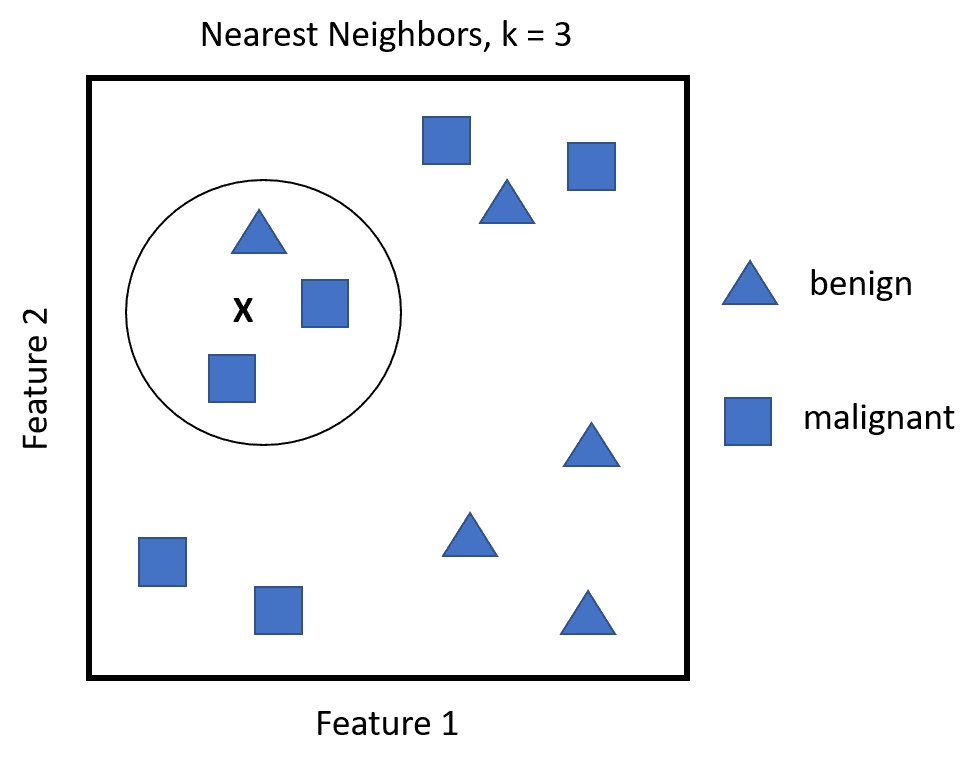

即使从这个简单的例子中，也可以清楚地看出，对于最近邻算法中 *k* 的选择至关重要。如果 *k* 太小，即使你具有很低的偏差，测试集上的观察值可能仍然会有很高的方差。另一方面，随着 *k* 的增加，你可能降低了方差，但偏差可能是不可以接受的。交叉验证是确定合适的 *k* 的必要手段。

还很重要的一点是要指出，在我们的特征空间中计算数据点的距离或邻近度。默认的距离是**欧几里得距离**。这简单地说就是从点 `A` 到点 `B` 的直线距离——就像飞鸟一样飞过去——或者你可以利用公式，它等同于对应点之间平方差的和的平方根。给定点 `A` 和 `B` 的坐标 `p1`，`p2`，... `pn` 和 `q1`，`q2`，... `qn` 的欧几里得距离公式如下：

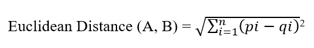

这种距离高度依赖于特征所测量的尺度，因此标准化它们是至关重要的。根据距离，还可以使用其他距离计算以及权重。我们将在接下来的例子中探讨这一点。

# 支持向量机

我第一次听说支持向量机时，必须承认我感到困惑，认为这可能是某种学术上的混淆或内部玩笑。然而，我对 SVM 的开放性审查取代了这种自然的怀疑，对这项技术产生了健康的尊重。

*支持向量机（SVMs）已被证明在各种环境中表现良好，通常被认为是最好的“开箱即用”分类器之一（James, G., 2013）。为了对这一主题有一个实际的了解，让我们来看另一个简单的视觉例子。在下面的图中，你会看到分类任务是线性可分的。然而，虚线和实线只是无数可能的线性解中的两种。

在一个超过两个维度的问题上，你会有一个分离的超平面：

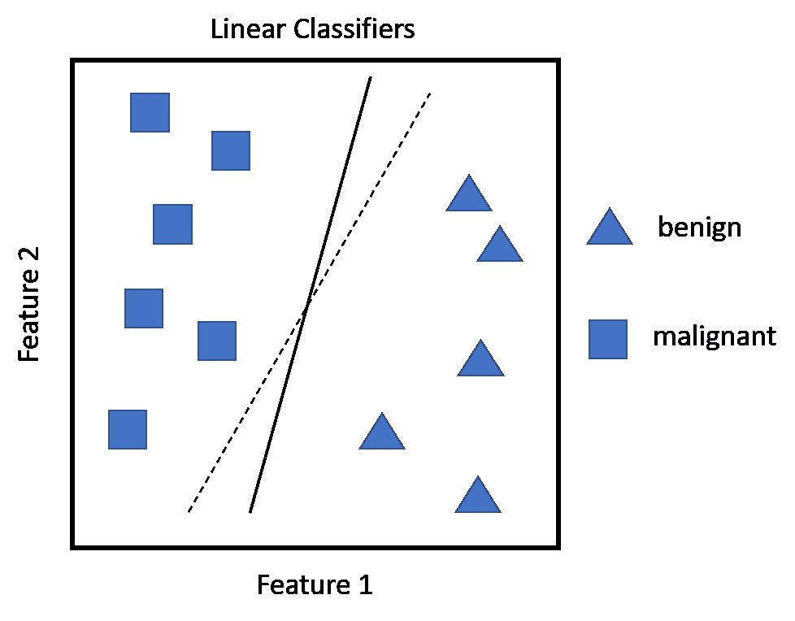

因此，许多解决方案都可能对泛化造成问题，因为无论你选择哪种解决方案，任何位于线右侧的新观测值都将被分类为**良性**，而位于线左侧的观测值将被分类为**恶性**。因此，任何一条线在`train`数据上都没有偏差，但在任何测试数据上可能存在广泛的误差。这就是支持向量发挥作用的地方。点落在线性分隔符错误一侧的概率对于虚线比实线更高，这意味着实线在分类上具有更高的安全边际。因此，正如 Battiti 和 Brunato 所说，*支持向量机（SVMs）是具有可能最大间隔的线性分隔符，而支持向量是接触两侧安全边际区域的那些*。

以下图示说明了这一概念。细实线是创建上述可能的最大间隔的最优线性分隔符，从而增加了新观测值落在分隔符正确一侧的概率。较粗的黑线对应于安全间隔，而阴影数据点构成了支持向量。如果支持向量移动，那么间隔以及随之而来的决策边界将发生变化。分隔符之间的距离被称为**间隔**：

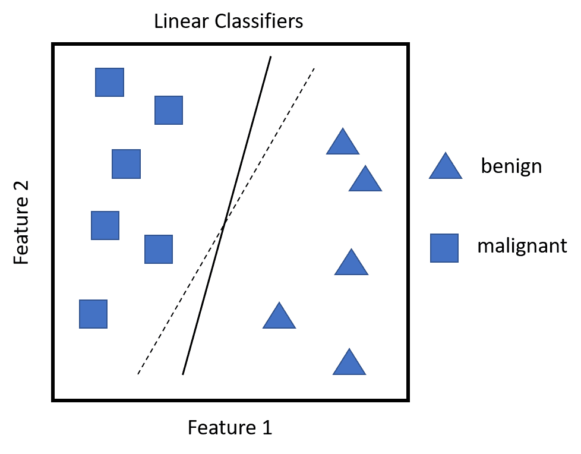

这听起来都很不错，但现实世界的问题并不那么清晰。

在非线性可分的数据中，许多观测值将落在间隔的错误一侧（所谓的松弛变量），这是一种误分类。构建 SVM 算法的关键是通过交叉验证求解最优支持向量数量。任何位于其类别间隔错误一侧的观测值被称为**支持向量**。

如果错误数量的调整参数太大，这意味着你有许多支持向量，你将遭受高偏差和低方差。另一方面，如果调整参数太小，相反的情况可能发生。James 等人将调整参数称为`C`，随着`C`的减小，对观测值位于间隔错误一侧的容忍度降低，间隔变窄。这个`C`，或者更确切地说，成本函数，只是允许观测值位于间隔错误一侧。如果`C`设置为零，那么我们将禁止任何违反间隔的解决方案。

SVM 的另一个重要方面是能够使用输入特征的二次或更高阶多项式来建模非线性。在 SVM 中，这被称为**核技巧**。这些可以通过交叉验证进行估计和选择。在示例中，我们将查看替代方案。

就像任何模型一样，您可以使用多项式以各种程度扩展特征数量，交互项或其他推导。在大数据集中，可能性可能会迅速失控。SVM 中的核技巧允许我们有效地扩展特征空间，目标是实现近似的线性分离。

要了解这是如何实现的，首先看看 SVM 优化问题和其约束。我们试图实现以下目标：

+   创建最大化边界的权重

+   在约束条件下，没有（或尽可能少）数据点应该位于该边界内

现在，与线性回归不同，在 SVM 中，权重应用于仅仅是支持向量观察值的内积。

这意味着什么？嗯，两个向量的内积只是配对观察值的乘积之和。例如，如果向量一是 *3*，*4* 和 *2*，向量二是 *1*，*2* 和 *3*，那么你得到 *(3x1) + (4x2) + (2x3)* 或 *17*。在 SVM 中，如果我们假设每个观察值的内积与每个其他观察值的内积都有内积，这相当于有 *n(n-1)/2* 种组合，其中 *n* 是观察值的数量。仅用 *10* 个观察值，我们就会得到 *45* 个内积。然而，SVM 只关注支持向量观察值及其相应的权重。对于线性 SVM 分类器，公式如下：

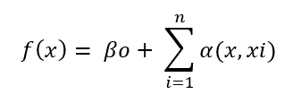

在这里，`(x, xi)` 是支持向量的内积，因为只有当观察值是支持向量时，`α` 才是非零的。

这导致分类算法中的术语数量大大减少，并允许使用所谓的核函数，通常称为核技巧。

这里的技巧在于，核函数在数学上总结了特征在更高维度的转换，而不是显式地创建它们。从简单意义上讲，核函数计算两个向量之间的点积。这有利于创建更高维的非线性空间和决策边界，同时保持优化问题在计算上高效。核函数在更高维空间中计算内积，而不将它们转换到更高维空间。

对于流行的核函数的表示是特征的内积（点积），其中 `x[i]` 和 `x[j]` 代表向量，gamma 和 `c` 参数，如下所示：

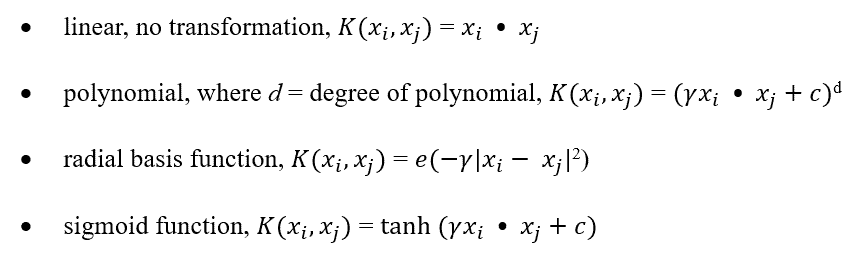

至于非线性技术的选择，它们需要一些尝试和错误，但我们将介绍各种选择技术。

# 商业案例

在即将到来的案例研究中，我们将对同一数据集应用 KNN 和 SVM。这将使我们能够在同一问题上比较 R 代码和学习方法，从 KNN 开始。我们还将花时间深入研究混淆矩阵，比较多个统计数据以评估模型准确性。

# 商业理解

我们将要分析的数据最初是由**美国糖尿病和消化系统及肾脏疾病研究所**（**NIDDK**）收集的。它包括`532`个观测值和八个输入特征，以及一个二元结果（`是`/`否`）。本研究中的患者来自亚利桑那州南部的皮马印第安人。NIDDK 数据显示，在过去 30 年里，研究帮助科学家证明肥胖是糖尿病发展中的一个主要风险因素。皮马印第安人被选中进行研究，因为一半的成年皮马印第安人患有糖尿病，其中 95%的糖尿病患者体重超重。分析将仅关注成年女性。糖尿病是根据世界卫生组织（WHO）的标准进行诊断的，并且是被称为**2 型**的糖尿病。在这种类型的糖尿病中，胰腺仍然能够产生胰岛素并发挥作用，它过去被称为非胰岛素依赖型糖尿病。

我们的任务是检查和预测这个群体中患有糖尿病或可能导致糖尿病的风险因素的个人。鉴于相对久坐的生活方式和高热量饮食，糖尿病在美国已成为一种流行病。根据**美国糖尿病协会**（**ADA**）的数据，2010 年，尽管糖尿病的确诊率较低，但该疾病是美国第七大死因。糖尿病还与许多合并症的增加有关，如高血压、血脂异常、中风、眼科疾病和肾脏疾病。糖尿病及其并发症的成本是巨大的。ADA 估计，2012 年该疾病的总成本约为 4900 亿美元。有关该问题的更多背景信息，请参阅 ADA 网站[`www.diabetes.org/diabetes-basics/statistics/`](http://www.diabetes.org/diabetes-basics/statistics/)。

# 数据理解和准备

`532`名女性的数据集分为两个独立的数据框。感兴趣的变量如下：

+   `npreg`: 这代表怀孕次数

+   `glu`: 这代表口服葡萄糖耐量测试中的血浆葡萄糖浓度

+   `bp`: 这代表舒张压（毫米汞柱）

+   `skin`: 这代表三头肌皮肤褶皱厚度（毫米）

+   `bmi`: 这代表体质指数

+   `ped`: 这代表糖尿病家系函数

+   `age`: 这代表年龄（年）

+   `type`: 这代表糖尿病，`是`或`否`

数据集包含在 R 包`MASS`中。一个数据框命名为`Pima.tr`，另一个命名为`Pima.te`。我们不会将它们用作独立的`训练`和`测试`集，而是将它们合并，并创建我们自己的，以便发现如何在 R 中完成此类任务。

首先，让我们加载以下我们将需要用于练习的包：

```py
    > library(class) #k-nearest neighbors
    > library(kknn) #weighted k-nearest neighbors
    > library(e1071) #SVM
    > library(caret) #select tuning parameters
    > library(MASS) # contains the data
    > library(reshape2) #assist in creating boxplots
    > library(ggplot2) #create boxplots
    > library(kernlab) #assist with SVM feature selection

```

现在，我们将加载数据集并检查它们的结构，确保它们相同，从`Pima.tr`开始，如下所示：

```py
    > data(Pima.tr)
    > str(Pima.tr)
    'data.frame':200 obs. of  8 variables:
     $ npreg: int  5 7 5 0 0 5 3 1 3 2 ...
     $ glu  : int  86 195 77 165 107 97 83 193 142 128 ...
     $ bp   : int  68 70 82 76 60 76 58 50 80 78 ...
     $ skin : int  28 33 41 43 25 27 31 16 15 37 ...
     $ bmi  : num  30.2 25.1 35.8 47.9 26.4 35.6 34.3 25.9 32.4 43.3 
       ...
     $ ped  : num  0.364 0.163 0.156 0.259 0.133 ...
     $ age  : int  24 55 35 26 23 52 25 24 63 31 ...
     $ type : Factor w/ 2 levels "No","Yes": 1 2 1 1 1 2 1 1 1 2 ...
    > data(Pima.te)
    > str(Pima.te)
    'data.frame':332 obs. of  8 variables:
     $ npreg: int  6 1 1 3 2 5 0 1 3 9 ...
     $ glu  : int  148 85 89 78 197 166 118 103 126 119 ...
     $ bp   : int  72 66 66 50 70 72 84 30 88 80 ...
     $ skin : int  35 29 23 32 45 19 47 38 41 35 ...
     $ bmi  : num  33.6 26.6 28.1 31 30.5 25.8 45.8 43.3 39.3 29 ...
     $ ped  : num  0.627 0.351 0.167 0.248 0.158 0.587 0.551 0.183 
       0.704 0.263 ...
     $ age  : int  50 31 21 26 53 51 31 33 27 29 ...
     $ type : Factor w/ 2 levels "No","Yes": 2 1 1 2 2 2 2 1 1 2 ...

```

观察结构，我们可以确信我们可以将数据框合并为一个。这使用`rbind()`函数非常容易完成，该函数代表行绑定并附加数据。如果你在每个框架中都有相同的观测值并且想要附加特征，你会使用`cbind()`函数按列绑定它们。你只需命名你的新数据框并使用此语法：`new data = rbind(data frame1, data frame2)`。因此，我们的代码如下所示：

```py
    > pima <- rbind(Pima.tr, Pima.te)

```

如同往常，请再次检查结构。我们可以看到没有问题：

```py
    > str(pima)
    'data.frame':532 obs. of  8 variables:
     $ npreg: int  5 7 5 0 0 5 3 1 3 2 ...
     $ glu  : int  86 195 77 165 107 97 83 193 142 128 ...
     $ bp   : int  68 70 82 76 60 76 58 50 80 78 ...
     $ skin : int  28 33 41 43 25 27 31 16 15 37 ...
     $ bmi  : num  30.2 25.1 35.8 47.9 26.4 35.6 34.3 25.9 32.4 43.3 
      ...
     $ ped  : num  0.364 0.163 0.156 0.259 0.133 ...
     $ age  : int  24 55 35 26 23 52 25 24 63 31 ...
     $ type : Factor w/ 2 levels "No","Yes": 1 2 1 1 1 2 1 1 1 2 ...

```

让我们通过箱线图进行一些探索性分析。为此，我们希望使用结果变量`"type"`作为我们的 ID 变量。正如我们在逻辑回归中所做的那样，`melt()`函数将执行此操作并准备一个我们可以用于箱线图的数据框。我们将新数据框命名为`pima.melt`，如下所示：

```py
    > pima.melt <- melt(pima, id.var = "type")

```

使用`ggplot2`包的箱线图布局非常有效，因此我们将使用它。在`ggplot()`函数中，我们将指定要使用的数据、`x`和`y`变量以及图表类型，并创建一系列两列的图表。在以下代码中，我们将响应变量作为`x`和其值作为`y`在`aes()`中。然后，`geom_boxplot()`创建箱线图。最后，我们将使用`facet_wrap()`在两列中构建箱线图：

```py
    > ggplot(data = pima.melt, aes(x = type, y = value)) + 
        geom_boxplot() + facet_wrap(~ variable, ncol = 2)

```

以下为前一个命令的输出：

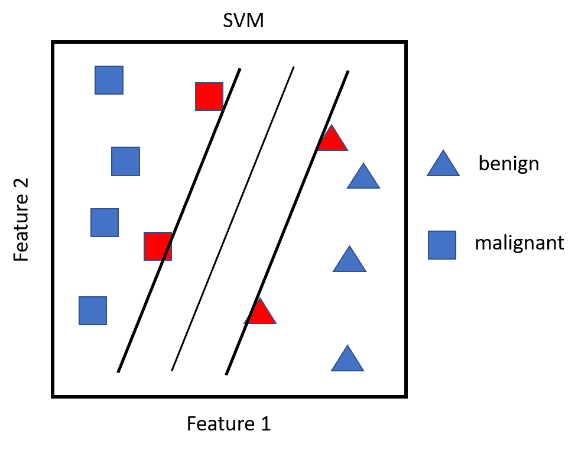

这是一个有趣的图表，因为很难在图表中看出任何明显的差异，可能除了**葡萄糖**（**glu**）之外。正如你可能所怀疑的，空腹血糖似乎在目前被诊断为糖尿病的患者中显著更高。这里的主要问题是所有图表都在相同的 y 轴刻度上。我们可以通过标准化值然后重新绘图来解决这个问题，从而生成一个更有意义的图表。R 有一个内置函数`scale()`，它将值转换为均值为零和标准差为一。让我们将其放入一个新的数据框`pima.scale`中，转换所有特征并排除`type`响应。此外，在进行 KNN 时，确保特征具有相同的尺度，均值为零和标准差为一非常重要。如果不是这样，那么最近邻计算中的距离计算将是错误的。如果某个东西是在 1 到 100 的尺度上测量的，它将比在 1 到 10 的尺度上测量的另一个特征有更大的影响。请注意，当你缩放数据框时，它自动变成一个矩阵。使用`data.frame()`函数，将其转换回数据框，如下所示：

```py
    > pima.scale <- data.frame(scale(pima[, -8]))
    > str(pima.scale)
    'data.frame':532 obs. of  7 variables:
     $ npreg: num  0.448 1.052 0.448 -1.062 -1.062 ...
     $ glu  : num  -1.13 2.386 -1.42 1.418 -0.453 ...
     $ bp   : num  -0.285 -0.122 0.852 0.365 -0.935 ...
     $ skin : num  -0.112 0.363 1.123 1.313 -0.397 ...
     $ bmi  : num  -0.391 -1.132 0.423 2.181 -0.943 ...
     $ ped  : num  -0.403 -0.987 -1.007 -0.708 -1.074 ...
     $ age  : num  -0.708 2.173 0.315 -0.522 -0.801 ...

```

现在，我们需要在数据框中包含响应，如下所示：

```py
    > pima.scale$type <- pima$type

```

让我们再次使用`melt()`和`ggplot()`重复箱线图的过程：

```py
    > pima.scale.melt <- melt(pima.scale, id.var = "type")
    > ggplot(data = pima.scale.melt, aes(x = type, y = value)) +
         geom_boxplot() + facet_wrap(~ variable, ncol = 2)

```

以下是在先前的命令输出：

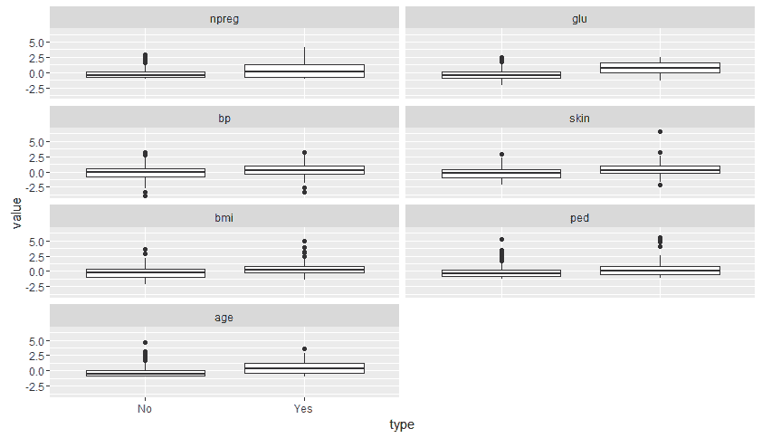

特征缩放后，图表更容易阅读。除了葡萄糖之外，其他特征似乎可能因`type`而异，特别是`age`。

在将数据分割成`train`和`test`集之前，让我们看看与 R 函数`cor()`的相关性。这将产生一个矩阵而不是皮尔逊相关性的图表：

```py
    > cor(pima.scale[-8])
                npreg       glu          bp       skin
    npreg 1.000000000 0.1253296 0.204663421 0.09508511
    glu   0.125329647 1.0000000 0.219177950 0.22659042
    bp    0.204663421 0.2191779 1.000000000 0.22607244
    skin  0.095085114 0.2265904 0.226072440 1.00000000
    bmi   0.008576282 0.2470793 0.307356904 0.64742239
    ped   0.007435104 0.1658174 0.008047249 0.11863557
    age   0.640746866 0.2789071 0.346938723 0.16133614
                  bmi         ped        age
    npreg 0.008576282 0.007435104 0.64074687
    glu   0.247079294 0.165817411 0.27890711
    bp    0.307356904 0.008047249 0.34693872
    skin  0.647422386 0.118635569 0.16133614
    bmi   1.000000000 0.151107136 0.07343826
    ped   0.151107136 1.000000000 0.07165413
    age   0.073438257 0.071654133 1.00000000

```

有几个相关性需要指出：`npreg`/`age`和`skin`/`bmi`。在适当训练和调整超参数的情况下，多重共线性通常不是问题。

我认为我们现在已经准备好创建`train`和`test`集了，但在这样做之前，我建议您始终检查我们响应中`Yes`和`No`的比例。确保数据有平衡的分割很重要，如果其中一个结果稀疏，可能会成为问题。这可能导致分类器在多数和少数类别之间产生偏差。关于什么是不适当的平衡没有硬性规定。一个很好的经验法则是，您应努力实现至少 2:1 的可能结果比例（He 和 Wa，2013）：

```py
    > table(pima.scale$type)
     No Yes
    355 177

```

比例是 2:1，因此我们可以使用我们常用的语法创建`train`和`test`集，以下是这样进行 70/30 分割的方式：

```py
    > set.seed(502)
    > ind <- sample(2, nrow(pima.scale), replace = TRUE, prob = c(0.7, 
      0.3))
    > train <- pima.scale[ind == 1, ]
    > test <- pima.scale[ind == 2, ]
    > str(train)
    'data.frame':385 obs. of  8 variables:
     $ npreg: num  0.448 0.448 -0.156 -0.76 -0.156 ...
     $ glu  : num  -1.42 -0.775 -1.227 2.322 0.676 ...
     $ bp   : num  0.852 0.365 -1.097 -1.747 0.69 ...
     $ skin : num  1.123 -0.207 0.173 -1.253 -1.348 ...
     $ bmi  : num  0.4229 0.3938 0.2049 -1.0159 -0.0712 ...
     $ ped  : num  -1.007 -0.363 -0.485 0.441 -0.879 ...
     $ age  : num  0.315 1.894 -0.615 -0.708 2.916 ...
     $ type : Factor w/ 2 levels "No","Yes": 1 2 1 1 1 2 2 1 1 1 ...
    > str(test)
    'data.frame':147 obs. of  8 variables:
     $ npreg: num  0.448 1.052 -1.062 -1.062 -0.458 ...
     $ glu  : num  -1.13 2.386 1.418 -0.453 0.225 ...
     $ bp   : num  -0.285 -0.122 0.365 -0.935 0.528 ...
     $ skin : num  -0.112 0.363 1.313 -0.397 0.743 ...
     $ bmi  : num  -0.391 -1.132 2.181 -0.943 1.513 ...
     $ ped  : num  -0.403 -0.987 -0.708 -1.074 2.093 ...
     $ age  : num  -0.7076 2.173 -0.5217 -0.8005 -0.0571 ...
     $ type : Factor w/ 2 levels "No","Yes": 1 2 1 1 2 1 2 1 1 1 ...

```

一切似乎都井然有序，因此我们可以继续构建我们的预测模型并评估它们，从 KNN 开始。

# 建模和评估

现在我们将讨论与建模和评估相关的各个方面。

# KNN 建模

如前所述，在使用此技术时，选择最合适的参数（`k`或`K`）至关重要。让我们再次充分利用`caret`包来识别`k`。我们将为实验创建一个输入网格，`k`的范围从`2`到`20`，增量是`1`。这可以通过`expand.grid()`和`seq()`函数轻松完成。与 KNN 函数一起工作的`caret`包参数是简单的`.k`：

```py
    > grid1 <- expand.grid(.k = seq(2, 20, by = 1))

```

我们还将结合交叉验证来选择参数，创建一个名为`control`的对象，并使用`caret`包中的`trainControl()`函数，如下所示：

```py
    > control <- trainControl(method = "cv")

```

现在，我们可以创建一个对象，该对象将显示如何使用`train()`函数计算最优的`k`值，这也是`caret`包的一部分。记住，在进行任何形式的随机抽样时，您需要设置`seed`值如下：

```py
    > set.seed(502)

```

由`train()`函数创建的对象需要模型公式、`train`数据名称和适当的方法。模型公式与我们之前使用的一样-`y~x`。方法指定是简单的`knn`。考虑到这一点，以下代码将创建一个对象，该对象将显示最优的`k`值，如下所示：

```py
    > knn.train <- train(type ~ ., data = train,
      method = "knn",
      trControl = control,
      tuneGrid = grid1)

```

调用对象为我们提供了我们正在寻找的`k`参数，即`k=17`：

```py
    > knn.train
    k-Nearest Neighbors
    385 samples
      7 predictor
      2 classes: 'No', 'Yes'
    No pre-processing
    Resampling: Cross-Validated (10 fold)
    Summary of sample sizes: 347, 347, 345, 347, 347, 346, ...
    Resampling results across tuning parameters:
      k   Accuracy  Kappa  Accuracy SD  Kappa SD
    2  0.736     0.359  0.0506       0.1273 
    3  0.762     0.416  0.0526       0.1313 
    4  0.761     0.418  0.0521       0.1276 
    5  0.759     0.411  0.0566       0.1295 
    6  0.772     0.442  0.0559       0.1474 
    7  0.767     0.417  0.0455       0.1227 
    8  0.767     0.425  0.0436       0.1122 
    9  0.772     0.435  0.0496       0.1316 
    10  0.780     0.458  0.0485       0.1170 
    11  0.777     0.446  0.0437       0.1120 
    12  0.775     0.440  0.0547       0.1443 
    13  0.782     0.456  0.0397       0.1084 
    14  0.780     0.449  0.0557       0.1349 
    15  0.772     0.427  0.0449       0.1061 
    16  0.782     0.453  0.0403       0.0954 
    17  0.795     0.485  0.0382       0.0978 
    18  0.782     0.451  0.0461       0.1205 
    19  0.785     0.455  0.0452       0.1197 
    20  0.782     0.446  0.0451       0.1124 
    Accuracy was used to select the optimal model using the largest 
      value.
    The final value used for the model was k = 17\. 

```

除了产生`k=17`的结果外，我们还以表格的形式获得了`Accuracy`和`Kappa`统计量及其标准差的信息，这些信息来自交叉验证。`Accuracy`告诉我们模型正确分类的观测值的百分比。`Kappa`指的是所谓的**Cohen's Kappa 统计量**。`Kappa`统计量通常用于衡量两个评估者正确分类观测值的能力。它通过调整准确率得分来提供对这一问题的洞察，这是通过考虑到评估者仅通过偶然完全正确来实现的。该统计量的公式为 *Kappa = (一致百分比 - 偶然一致百分比) / (1 - 偶然一致百分比)*。

**一致百分比**是评估者对类别的（准确率）达成一致的比例，**偶然一致百分比**是评估者随机达成一致的比例。该统计量越高，表现越好，最大一致度为 1。当我们将在`test`数据上应用我们的模型时，我们将通过一个示例来演示这一点。

为了做到这一点，我们将利用`class`包中的`knn()`函数。使用此函数，我们需要指定至少四个项目。这些将是`train`输入、`test`输入、来自`train`集的正确标签以及`k`。我们将通过创建`knn.test`对象并查看其表现来完成此操作：

```py
    > knn.test <- knn(train[, -8], test[, -8], train[, 8], k = 17)

```

创建了对象后，让我们检查混淆矩阵并计算准确率和`kappa`：

```py
    > table(knn.test, test$type)
    knn.test No Yes
         No  77  26
         Yes 16  28

```

准确率是通过简单地将正确分类的观测值除以总观测值来计算的：

```py
    > (77 + 28) / 147
    [1] 0.7142857

```

71%的准确率低于我们在`train`数据集上实现的准确率，后者接近 80%。我们现在可以按照以下方式产生`kappa`统计量：

```py
    > #calculate Kappa
    > prob.agree <- (77 + 28) / 147 #accuracy
    > prob.chance <- ((77 + 26) / 147) * ((77 + 16) / 147)
    > prob.chance
    [1] 0.4432875
    > kappa <- (prob.agree - prob.chance) / (1 - prob.chance)
    > kappa
    [1] 0.486783

```

使用`train`集，我们实现的`kappa`统计量为 0.49。Altman（1991）提供了一个启发式方法来帮助我们解释这个统计量，如下表所示：

| **K*的值** | **一致性强度** |
| --- | --- |
| <0.20 | 差 |
| 0.21-0.40 | 一般 |
| 0.41-0.60 | 中等 |
| 0.61-0.80 | 良好 |
| 0.81-1.00 | 非常好 |

在`test`集上，我们的`kappa`仅中等，准确率略超过 70%，我们应该看看是否可以通过利用加权邻居来表现得更好。加权方案增加了与观测值最近的邻居相对于较远邻居的影响力。观测值在空间中的位置越远，其影响力受到的惩罚就越大。对于这项技术，我们将使用`kknn`包及其`train.kknn()`函数来选择最佳加权方案。

`train.kknn()`函数使用我们在前几章中检查过的 LOOCV 来选择最佳参数，包括最优`k`邻居、两种距离度量之一以及`kernel`函数。

我们创建的无权重`k`邻居算法使用的是欧几里得距离，正如我们之前讨论的那样。在`kknn`包中，有选项可以比较绝对差异之和与欧几里得距离。该包将使用的距离计算称为`Minkowski`参数。

至于距离的加权，有许多不同的方法可供选择。为了我们的目的，我们将使用的包有十种不同的加权方案，包括无权重的方案。它们是矩形（无权重）、三角形、Epanechnikov、双权重、三权重、余弦、倒数、高斯、等级和最优。关于这些加权技术的全面讨论可以在*Hechenbichler K.*和*Schliep K.P.*（2004）中找到。

为了简单起见，让我们只关注两个：`triangular`和`epanechnikov`。在分配权重之前，算法将所有距离标准化，使它们介于零和一之间。三角形加权方法将观测距离乘以 1 减去距离。对于 Epanechnikov，距离乘以 3/4 倍（1 减去距离的平方）。对于我们的问题，我们将结合这些加权方法以及标准的无权重版本进行比较。

在指定随机种子后，我们将使用`kknn()`创建`train`集对象。此函数要求最大*k*值（`kmax`）、`distance`（一等于欧几里得距离，二等于绝对距离）和`kernel`。对于此模型，`kmax`将设置为`25`，`distance`将设置为`2`：

```py
    > set.seed(123)
    > kknn.train <- train.kknn(type ~ ., data = train, kmax = 25, 
        distance = 2, 
        kernel = c("rectangular", "triangular", "epanechnikov"))

```

该包的一个不错特性是能够绘制并比较结果，如下所示：

```py
    > plot(kknn.train)

```

下面的输出是前面命令的结果：

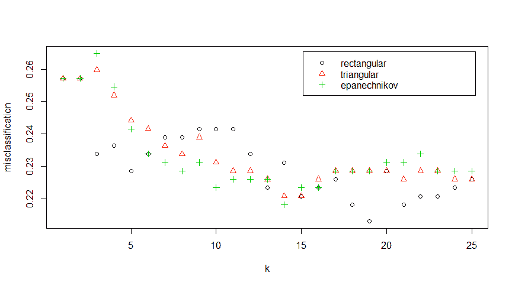

此图显示了 x 轴上的**k**值和由`kernel`错误分类的观测值的百分比。令我惊讶的是，在`k: 19`的无权重（**矩形**）版本表现最佳。您也可以调用该对象，以下列方式查看分类误差和最佳参数：

```py
    > kknn.train 
    Call:
    train.kknn(formula = type ~ ., data = train, kmax = 25, distance = 
      2, kernel
     = c("rectangular", "triangular", "epanechnikov"))
 Type of response variable: nominal
 Minimal misclassification: 0.212987
 Best kernel: rectangular
 Best k: 19 

```

因此，使用这些数据，对距离进行加权并没有提高模型在训练中的准确性，正如我们在这里所看到的，甚至在测试集上的表现也不尽如人意：

```py
 > kknn.pred <- predict(kknn.train, newdata = test)
 > table(kknn.pred, test$type)
 kknn.pred No Yes
 No 76  27
 Yes 17  27

```

我们还可以尝试其他权重，但在我尝试了这些其他权重后，我所获得的结果并不比这些更准确。我们不需要进一步追求 KNN。我鼓励您自己尝试不同的参数，看看它们的性能如何。

# SVM 建模

我们将使用`e1071`包来构建我们的 SVM 模型。我们将从一个线性支持向量分类器开始，然后转向非线性版本。`e1071`包有一个用于 SVM 的不错函数，名为`tune.svm()`，它有助于选择调整参数/核函数。该包中的`tune.svm()`函数使用交叉验证来优化调整参数。让我们创建一个名为`linear.tune`的对象，并使用`summary()`函数调用它，如下所示：

```py
    > linear.tune <- tune.svm(type ~ ., data = train,
      kernel = "linear",
      cost = c(0.001, 0.01, 0.1, 1, 5, 10))
    > summary(linear.tune)
    Parameter tuning of 'svm':
    - sampling method: 10-fold cross validation
    - best parameters:
     cost
        1
    - best performance: 0.2051957
    - Detailed performance results:
       cost     error dispersion
    1 1e-03 0.3197031 0.06367203
    2 1e-02 0.2080297 0.07964313
    3 1e-01 0.2077598 0.07084088
    4 1e+00 0.2051957 0.06933229
    5 5e+00 0.2078273 0.07221619
    6 1e+01 0.2078273 0.07221619

```

对于这个数据集，最优的`cost`函数会导致大约 21%的错误分类率。我们可以使用`predict()`函数和`newdata = test`来对`test`数据进行预测并检查：

```py
    > best.linear <- linear.tune$best.model
    > tune.test <- predict(best.linear, newdata = test)
    > table(tune.test, test$type)
    tune.test No Yes
          No  82  22
          Yes 13  30 
    > (82 + 30)/147
    [1] 0.7619048

```

线性支持向量机分类器在`train`和`test`集上都略优于 KNN。`e1071`包有一个用于 SVM 的不错函数`tune.svm()`，它有助于选择`调整参数/核函数`。现在我们将看看非线性方法是否会提高我们的性能，并使用交叉验证来选择调整参数。

我们将尝试的第一个核函数是`polynomial`，我们将调整两个参数：多项式的次数（`degree`）和核系数（`coef0`）。多项式的次数将是`3`、`4`和`5`，系数将从`0.1`增加到`4`，如下所示：

```py
    > set.seed(123) 
    > poly.tune <- tune.svm(type ~ ., data = train,
      kernel = "polynomial",
      degree = c(3, 4, 5),
      coef0 = c(0.1, 0.5, 1, 2, 3, 4)) 
    > summary(poly.tune)
    Parameter tuning of 'svm': 
    - sampling method: 10-fold cross validation
    - best parameters:
     degree coef0
          3   0.1
    - best performance: 0.2310391

```

模型选择了多项式的`degree`为`3`和系数为`0.1`。正如线性 SVM 一样，我们可以使用这些参数在`test`集上创建预测，如下所示：

```py
    > best.poly <- poly.tune$best.model
    > poly.test <- predict(best.poly, newdata = test)
    > table(poly.test, test$type)
    poly.test No Yes
          No  81  28
          Yes 12  26
    > (81 + 26) / 147
    [1] 0.7278912

```

这并没有表现得像线性模型那样好。现在我们将运行径向基函数。在这种情况下，我们将求解的参数是`gamma`，我们将以`0.1`到`4`的增量进行检查。如果`gamma`太小，模型将无法捕捉决策边界的复杂性；如果太大，模型将严重过拟合：

```py
    > set.seed(123)
    > rbf.tune <- tune.svm(type ~ ., data = train, 
      kernel = "radial", 
      gamma = c(0.1, 0.5, 1, 2, 3, 4))
    > summary(rbf.tune)
    Parameter tuning of 'svm':
    - sampling method: 10-fold cross validation
    - best parameters:
     gamma
       0.5
    - best performance: 0.2284076

```

最佳的`gamma`值是 0.5，在这个设置下，性能似乎并没有比其他 SVM 模型有太多改进。我们将在以下方式中检查`test`集：

```py
    > best.rbf <- rbf.tune$best.model
    > rbf.test <- predict(best.rbf, newdata = test)
    > table(rbf.test, test$type)
    rbf.test No Yes
         No  73  33
         Yes 20  21
    > (73+21)/147
    [1] 0.6394558

```

表现简直糟糕透顶。在这里再试一次来提高性能的方法是使用`kernel = "sigmoid"`。我们将求解两个参数——`gamma`和核系数（`coef0`）：

```py
    > set.seed(123)
    > sigmoid.tune <- tune.svm(type ~ ., data = train,
      kernel = "sigmoid",
      gamma = c(0.1, 0.5, 1, 2, 3, 4),
      coef0 = c(0.1, 0.5, 1, 2, 3, 4)) 
    > summary(sigmoid.tune)
    Parameter tuning of 'svm':
    - sampling method: 10-fold cross validation
    - best parameters:
     gamma coef0
       0.1     2
    - best performance: 0.2080972

```

这个错误率与线性模型相匹配。现在只是看它是否在`test`集上表现更好：

```py
    > best.sigmoid <- sigmoid.tune$best.model
    > sigmoid.test <- predict(best.sigmoid, newdata = test)
    > table(sigmoid.test, test$type)
    sigmoid.test No Yes
             No  82  19
             Yes 11  35
    > (82+35)/147
    [1] 0.7959184

```

看看！我们终于得到了与`train`数据性能相匹配的测试性能。看起来我们可以选择 sigmoid 核作为最佳预测器。

到目前为止，我们已经尝试了不同的模型。现在，让我们使用除了准确率之外的指标来评估它们的性能，并与线性模型进行比较。

# 模型选择

我们已经研究了两种不同的建模技术，从所有意义上讲，KNN 的表现都未能达到预期。KNN 在`test`集上的最佳准确率只有大约 71%。相反，使用 SVM，我们可以获得接近 80%的准确率。在简单地选择最准确的模式之前，在这种情况下，选择 sigmoid 核的 SVM，让我们看看我们如何可以通过对混淆矩阵的深入分析来比较它们。

对于这个练习，我们可以求助于我们老朋友`caret`包，并使用`confusionMatrix()`函数。记住，我们之前已经从`InformationValue`包中使用了相同的函数。`caret`包版本提供了更多细节，并且将产生我们评估和选择最佳模型所需的所有统计数据。让我们首先从我们构建的最后一个模型开始，使用与我们在基础`table()`函数中使用的相同语法，除了指定`positive`类别，如下所示：

```py
    > confusionMatrix(sigmoid.test, test$type, positive = "Yes")
    Confusion Matrix and Statistics
              Reference
    Prediction No Yes
           No  82  19
           Yes 11  35
    Accuracy : 0.7959 
                     95% CI : (0.7217, 0.8579)
    No Information Rate : 0.6327 
    P-Value [Acc > NIR] : 1.393e-05 
    Kappa : 0.5469 
    Mcnemar's Test P-Value : 0.2012 
    Sensitivity : 0.6481 
    Specificity : 0.8817 
    Pos Pred Value : 0.7609 
    Neg Pred Value : 0.8119 
    Prevalence : 0.3673 
    Detection Rate : 0.2381 
    Detection Prevalence : 0.3129 
    Balanced Accuracy : 0.7649 
    'Positive' Class : Yes 

```

该函数产生了一些我们已讨论过的项目，例如`Accuracy`和`Kappa`。以下是它产生的其他统计数据：

+   `无信息率`是最大类别的比例；63%的人没有糖尿病。

+   `P-Value`用于检验假设，即准确率实际上优于`无信息率`。

+   我们将不会关注`McNemar's Test`，这是一种用于匹配对分析的方法，主要应用于流行病学研究中。

+   `灵敏度`是真正率；在这种情况下，没有糖尿病的人被正确识别为这样的比率。

+   `特异性`是真正负率，或者在我们的情况下，正确识别为糖尿病的比率。

+   正性预测值（`Pos Pred Value`）是指被归类为糖尿病人群的概率，并且确实患有疾病。以下公式被使用：

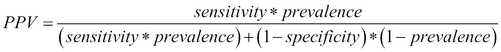

+   阴性预测值（`Neg Pred Value`）是指被归类为非糖尿病人群的概率，并且确实没有疾病。该公式的计算如下：

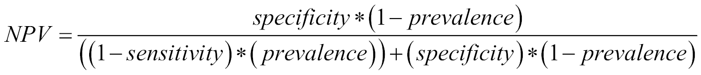

+   `患病率`是疾病的估计人群患病率，在此计算为第二列（`Yes`列）的总和除以总观测值。

+   `检测率`是已识别的真正正例的比率，在我们的情况下，是 35 除以总观测值。

+   `检测患病率`是预测的患病率，或者在我们的情况下，底部行除以总观测值。

+   `平衡准确率`是从任一类别获得的平均准确率。这一指标考虑了分类器算法中可能存在的偏差，从而可能高估最频繁的类别。这简单来说是*灵敏度 + 特异性除以 2*。

我们模型的灵敏度不如我们希望的那样强大，这告诉我们我们在数据集中遗漏了一些特征，这些特征会提高找到真正糖尿病患者的比率。我们现在将比较这些结果与线性 SVM，如下所示：

```py
    > confusionMatrix(tune.test, test$type, positive = "Yes")
             Reference
    Prediction No Yes
           No  82  24
           Yes 11  30
    Accuracy : 0.7619 
                     95% CI : (0.6847, 0.8282)
    No Information Rate : 0.6327 
    P-Value [Acc > NIR] : 0.0005615 
    Kappa : 0.4605 
    Mcnemar's Test P-Value : 0.0425225 
    Sensitivity : 0.5556 
    Specificity : 0.8817 
    Pos Pred Value : 0.7317 
    Neg Pred Value : 0.7736 
    Prevalence : 0.3673 
    Detection Rate : 0.2041 
    Detection Prevalence : 0.2789 
    Balanced Accuracy : 0.7186 
    'Positive' Class : Yes 

```

通过比较两个模型，我们可以看到线性 SVM 在各个方面都劣于其他模型。我们的明显胜者是 sigmoid 核 SVM。然而，这里我们遗漏了一件事，那就是任何形式的特征选择。我们所做的是将所有变量一起作为特征输入空间，让黑盒 SVM 计算给出预测分类。SVM 的一个问题是其发现非常难以解释。有几种处理这个过程的方法，我认为这超出了本章的范围；这是您应该开始探索和自学的东西，随着您对之前概述的基本知识的熟悉。

# SVM 的特征选择

然而，在特征选择方面并非一切都已失去，我想占用一些篇幅来向您展示一种快速探索这一问题的方法。这需要您进行一些尝试和错误。再次强调，`caret`包在这方面有所帮助，因为它将基于`kernlab`包的线性 SVM 进行交叉验证。

要做到这一点，我们需要设置随机种子，在`caret`的`rfeControl()`函数中指定交叉验证方法，使用`rfe()`函数执行递归特征选择，然后测试模型在`test`集上的表现。在`rfeControl()`中，您需要根据所使用的模型指定函数。您可以使用几种不同的函数。在这里，我们需要`lrFuncs`。要查看可用函数的列表，您最好的选择是使用`?rfeControl`和`?caretFuncs`探索文档。本例的代码如下：

```py
    > set.seed(123)
    > rfeCNTL <- rfeControl(functions = lrFuncs, method = "cv", number 
      = 10)
    > svm.features <- rfe(train[, 1:7], train[, 8],
      sizes = c(7, 6, 5, 4), 
      rfeControl = rfeCNTL, 
      method = "svmLinear")

```

要创建`svm.features`对象，重要的是要指定输入和响应因子、通过`sizes`指定的输入特征数量以及来自`kernlab`的线性方法，即`svmLinear`语法。使用此方法还有其他选项，例如`svmPoly`。没有 sigmoid 核的方法。调用对象使我们能够看到各种特征大小如何表现，如下所示：

```py
    > svm.features
    Recursive feature selection
    Outer resampling method: Cross-Validated (10 fold) 
    Resampling performance over subset size:
     Variables Accuracy  Kappa AccuracySD KappaSD Selected
    4   0.7797 0.4700    0.04969  0.1203 
             5   0.7875 0.4865    0.04267  0.1096        *
    6   0.7847 0.4820    0.04760  0.1141 
    7   0.7822 0.4768    0.05065  0.1232 
    The top 5 variables (out of 5):

```

尽管看似反直觉，但五个变量在自身以及包含`skin`和`bp`时表现都相当好。让我们在`test`集上尝试一下，记住完整模型的准确率为 76.2%：

```py
    > svm.5 <- svm(type ~ glu + ped + npreg + bmi + age,
      data = train,
      kernel = "linear")
    > svm.5.predict <- predict(svm.5, newdata = test[c(1, 2, 5, 6, 7)])
    > table(svm.5.predict, test$type)
    svm.5.predict No Yes
              No  79  21
              Yes 14  33

```

这种方法表现不佳，我们可以坚持使用完整模型。您可以通过尝试和错误来了解这种技术如何发挥作用，以确定特征重要性的简单识别。如果您想探索这里可以应用的其他技术和方法，特别是对于黑盒技术，我建议您从阅读 Guyon 和 Elisseeff（2003）关于这一主题的工作开始。

# 摘要

在本章中，我们回顾了两种新的分类技术：KNN 和 SVM。目标是通过对一个共同数据集上的模型进行构建和比较，以了解这些技术的工作原理以及它们之间的差异，从而预测一个人是否患有糖尿病。KNN 涉及无权重和有权重的最近邻算法。这些算法在预测一个人是否患有糖尿病方面并不如 SVM 表现得好。

我们探讨了如何使用`e1071`包构建和调整线性和非线性支持向量机。我们使用了极其通用的`caret`包来比较线性和非线性支持向量机的预测能力，并发现具有 sigmoid 核的非线性支持向量机表现最佳。

最后，我们简要介绍了如何使用`caret`包进行粗略的特征选择，因为这对于像 SVM 这样的黑盒技术来说是一个具有挑战性的任务。当使用这些技术时，这可能会成为一个重大的挑战，你需要考虑它们在解决业务问题上的可行性。
