# 分类和回归树

“最有可能成为最佳分类器的是随机森林（RF）版本，其中最好的（在 R 中实现并通过 caret 访问）达到了 94.1%的最大准确率，在 84.3%的数据集中超过了 90%。”

- Fern*á*ndez-Delgado 等人（2014 年）

这段来自*Fernández-Delgado 等人*在*机器学习研究杂志*中的引言，旨在表明本章中的技术非常强大，尤其是在用于分类问题时。当然，它们并不总是提供最佳解决方案，但它们确实提供了一个良好的起点。

在前几章中，我们探讨了用于预测数量或标签分类的技术。在这里，我们将将这些技术应用于这两种类型的问题。我们还将与之前章节不同的方式来处理商业问题。而不是定义一个新的问题，我们将应用这些技术到我们已经解决的问题上，目的是看看我们是否可以提高我们的预测能力。从所有目的和意图来看，本章的商业案例是看看我们是否可以改进之前选定的模型。

讨论的第一项是基本的决策树，它既容易构建也容易理解。然而，单个决策树方法的表现不如你学到的其他方法，例如支持向量机，或者我们将要学习的方法，例如神经网络。因此，我们将讨论创建多个、有时是数百个不同的树，并将它们的个别结果结合起来，以得出一个单一的总体预测。

这些方法，正如本章开头引用的论文所述，其表现与本书中的任何技术一样好，甚至更好。这些方法被称为**随机森林**和**梯度提升树**。此外，我们将从商业案例中暂时休息一下，展示如何在数据集上应用随机森林方法来帮助特征消除/选择。

# 技术概述

现在，我们将对技术进行概述，涵盖回归和分类树、随机森林和梯度提升。这将为实际商业案例奠定基础。

# 理解回归树

要建立对基于树的方法的了解，可能从定量结果开始，然后转向它在分类问题中的应用要容易一些。树的本质在于特征被分区，从第一个能最大程度提高 RSS 的分支开始。这些二进制分支一直持续到树的终止。每个后续的分支/分区不是在整个数据集上进行的，而是在先前的分支下它所属的部分上进行的。这种自上而下的过程被称为递归分区。它也是一个**贪婪**的过程，你可能在阅读有关机器学习方法的资料时遇到这个术语。贪婪意味着在过程中的每个分支中，算法寻找 RSS 的最大减少，而不考虑它对后续分区性能的影响。结果是，你可能会得到一个包含许多不必要的分支的完整树，导致低偏差但高方差。为了控制这种影响，在构建完整树之后，你需要适当地修剪树到最佳大小。

*图 6.1* 展示了该技术在实际应用中的视觉效果。数据是假设的，包含 30 个观测值，响应值从 1 到 10 不等，以及两个预测特征，这两个特征的价值范围均为 0 到 10，分别命名为**X1**和**X2**。该树有三个分支，导致四个终端节点。每个分支基本上是一个`if...then`语句或使用 R 语言的`ifelse()`语法。第一个分支是：如果**X1**小于**3.5**，则响应值被分为四个观测值，平均值为**2.4**，剩余的 26 个观测值。这个包含四个观测值的左分支是一个终端节点，因为任何进一步的分支都不会显著提高 RSS。该树中该分区中这四个观测值的预测值成为平均值。下一个分支是在**X2 < 4**，最后是**X1 < 7.5**。

这种方法的优点是它可以处理高度非线性关系；然而，你能看到几个潜在的问题吗？第一个问题是，一个观测值被赋予其所属终端节点的平均值。这可能会损害整体预测性能（高偏差）。相反，如果你继续进一步分区数据，以实现低偏差，那么高方差可能成为一个问题。与其他方法一样，你可以使用交叉验证来选择合适的树深度大小：

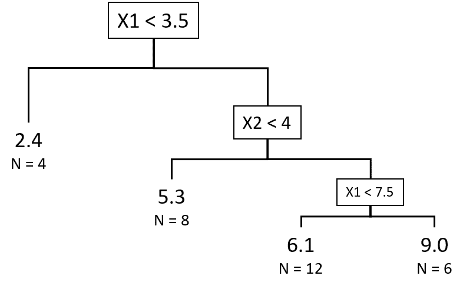

图 6.1：具有 3 个分支和 4 个终端节点的回归树以及相应的节点平均数和观测值数量

# 分类树

分类树遵循与回归树相同的原理，只是分割不是由 RSS 决定的，而是由错误率决定的。使用的错误率不是你所期望的，计算只是将误分类的观测值除以总观测值。实际上，当涉及到树分割时，一个误分类率本身可能会导致一种情况，即进一步的分割可以获取信息，但不会提高误分类率。让我们看一个例子。

假设我们有一个节点，让我们称它为 **N0**，其中你有七个标记为 `No` 的观测值和三个标记为 `Yes` 的观测值，我们可以说误分类率是 30%。考虑到这一点，让我们计算一个常见的替代错误度量，称为**基尼指数**。单个节点的基尼指数公式如下：

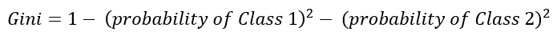

然后，对于 `N0`，基尼指数是 *1 - (.7)² - (.3)²*，等于 *0.42*，与 30% 的误分类率相比。

以此为例，我们现在将创建一个名为 *N1* 的节点，它有三个来自 `Class 1` 的观测值，没有来自 `Class 2` 的观测值，以及一个名为 *N2* 的节点，它有四个来自 `Class 1` 的观测值和三个来自 `Class 2` 的观测值。现在，这个树分支的整体误分类率仍然是 30%，但看看整体基尼指数是如何提高的：

+   *Gini(N1) = 1 - (3/3)² - (0/3)² = 0*

+   *Gini(N2) = 1 - (4/7)² - (3/7)² = 0.49*

+   *新的基尼指数 = (N1 的比例 x Gini(N1)) + (N2 的比例 x Gini(N2))*，等于 *(0.3 x 0) + (0.7 x 0.49)* 或 *0.343*

通过在代理错误率上进行分割，我们实际上提高了模型的不纯度，将其从 *0.42* 降低到 *0.343*，而误分类率没有变化。这是 `rpart()` 包所使用的方法，我们将在本章中使用。

# 随机森林

为了极大地提高我们模型的预测能力，我们可以生成许多树并合并结果。随机森林技术通过在模型开发中应用两种不同的技巧来实现这一点。第一种是使用**自助聚合**或**袋装法**，正如其名称所示。

在袋装法中，单个树是基于数据集的随机样本构建的，大约占总观测值的二分之一（注意，剩余的三分之一被称为**袋外**（**oob**））。这会重复数十次或数百次，然后取平均值。这些树中的每一棵都是基于任何错误度量进行生长而不进行剪枝的，这意味着这些单个树的方差很高。然而，通过平均结果，你可以降低方差而不增加偏差。

随机森林带来的下一件事是，在随机抽取数据的同时——即袋装——它还随机抽取每个分割点的输入特征。在`randomForest`包中，我们将使用默认的预测因子抽样随机数，对于分类问题，这是总预测因子的平方根，对于回归，则是总预测因子数除以三。算法在每个分割点随机选择的预测因子数量可以通过模型调优过程进行更改。

通过在每个分割点进行特征随机抽样并将其纳入方法论，你可以减轻高度相关预测因子成为所有你的自助树的主要驱动因素的影响，防止你降低你希望通过袋装实现的方差。随后对彼此相关性较低的树的平均化更具一般性和对异常值更稳健，如果你只执行袋装的话。

# 梯度提升

提升方法可能变得极其复杂，难以学习和理解，但你应该牢记幕后的基本发生情况。主要思想是构建某种类型的初始模型（线性、样条、树等）称为基学习器，检查残差，并在所谓的**损失函数**周围拟合模型。损失函数仅仅是衡量模型与期望预测之间差异的函数，例如，回归中的平方误差或分类中的逻辑函数。这个过程会持续进行，直到达到某个指定的停止标准。这有点像那个参加模拟考试并且答错 100 题中的 30 题的学生，因此只复习这些答错的 30 题。在下一场模拟考试中，他们又答错了那 30 题中的 10 题，因此只关注这 10 题，以此类推。如果你想进一步探索这一理论的背后，Frontiers in Neurorobotics 上的一个很好的资源是*Natekin A., Knoll A. (2013)*的*梯度提升机，教程*，可在[`www.ncbi.nlm.nih.gov/pmc/articles/PMC3885826/`](http://www.ncbi.nlm.nih.gov/pmc/articles/PMC3885826/)找到。

正如刚才提到的，提升可以应用于许多不同的基学习器，但在这里我们只会关注**基于树的学习的具体细节**。每个树迭代都很小，我们将通过一个称为交互深度的调优参数来确定它有多小。实际上，它可能小到只有一个分割，这被称为树桩。

树按损失函数的顺序拟合到残差，直到我们指定的树的数量（我们的停止标准）。

在使用`Xgboost`包进行模型构建过程中，有许多参数需要调整，该包代表**极端梯度提升**。由于其在在线数据竞赛中的获胜表现，这个包已经变得非常流行。以下网站上提供了关于提升树和 Xgboost 的优秀背景资料：

[`xgboost.readthedocs.io/en/latest/model.html`](http://xgboost.readthedocs.io/en/latest/model.html)

在商业案例中，我们将展示如何开始优化超参数并产生有意义的输出和预测。这些参数可以相互影响，如果你只调整一个而不考虑其他，你的模型可能会降低性能。`caret`包将帮助我们进行调优。

# 商业案例

在这种情况下，整体业务目标是看看我们是否可以提高之前章节中已经处理的一些案例的预测能力。对于回归，我们将重新审视来自第四章，*线性模型中的高级特征选择*的前列腺癌数据集。我们需要改进的基线均方误差是 0.444。

对于分类目的，我们将利用来自第三章，*逻辑回归和判别分析*的乳腺癌活检数据和来自第五章，*更多分类技术 - K 最近邻和支持向量机*的皮马印第安人糖尿病数据。在乳腺癌数据中，我们达到了 97.6%的预测准确率。对于糖尿病数据，我们希望提高 79.6%的准确率。

随机森林和提升将应用于所有三个数据集。简单树方法仅用于来自第四章，*线性模型中的高级特征选择*的乳腺癌和前列腺癌数据集。

# 建模和评估

为了执行建模过程，我们需要加载七个不同的 R 包。然后，我们将逐一介绍这些技术，并比较它们在之前章节中使用先前方法分析的数据上的表现。

# 回归树

我们将直接跳到`prostate`数据集，但首先让我们加载必要的 R 包。和往常一样，请在加载包之前确保你已经安装了这些库：

```py
  > library(rpart) #classification and regression trees
  > library(partykit) #treeplots
  > library(MASS) #breast and pima indian data
  > library(ElemStatLearn) #prostate data
  > library(randomForest) #random forests
  > library(xgboost) #gradient boosting
  > library(caret) #tune hyper-parameters

```

我们将首先使用`prostate`数据进行回归，并像在第四章，*线性模型中的高级特征选择*中做的那样准备数据。这包括调用数据集，使用`ifelse()`函数将`gleason`评分编码为指示变量，并创建`test`和`train`集。`train`集将是`pros.train`，而`test`集将是`pros.test`，如下所示：

```py
  > data(prostate)
  > prostate$gleason <- ifelse(prostate$gleason == 6, 0, 1)
  > pros.train <- subset(prostate, train == TRUE)[, 1:9]
  > pros.test <- subset(prostate, train == FALSE)[, 1:9]

```

要在`train`数据上构建回归树，我们将使用 R 的`party`包中的`rpart()`函数。语法与我们使用的其他建模技术非常相似：

```py
  > tree.pros <- rpart(lpsa ~ ., data = pros.train)

```

我们可以调用这个对象并检查每个分割的误差，以确定树的最佳分割数：

```py
  > print(tree.pros$cptable)
     CP nsplit rel error  xerror   xstd
  1 0.35852251   0 1.0000000 1.0364016 0.1822698
  2 0.12295687   1 0.6414775 0.8395071 0.1214181
  3 0.11639953   2 0.5185206 0.7255295 0.1015424
  4 0.05350873   3 0.4021211 0.7608289 0.1109777
  5 0.01032838   4 0.3486124 0.6911426 0.1061507
  6 0.01000000   5 0.3382840 0.7102030 0.1093327

```

这是一个非常重要的表格，需要分析。第一列标记为`CP`的是成本复杂度参数。第二列`nsplit`是树中的分割数。`rel error`列代表相对误差，是分割数的 RSS 除以无分割的 RSS（*RSS(k)/RSS(0)*）。`xerror`和`xstd`都是基于十折交叉验证的，其中`xerror`是平均误差，`xstd`是交叉验证过程的标准差。我们可以看到，虽然五个分割在`full`数据集上产生了最低的误差，但四个分割使用交叉验证产生了略低的误差。你可以使用`plotcp()`来检查这一点：

```py
  > plotcp(tree.pros)

```

前一个命令的输出如下：

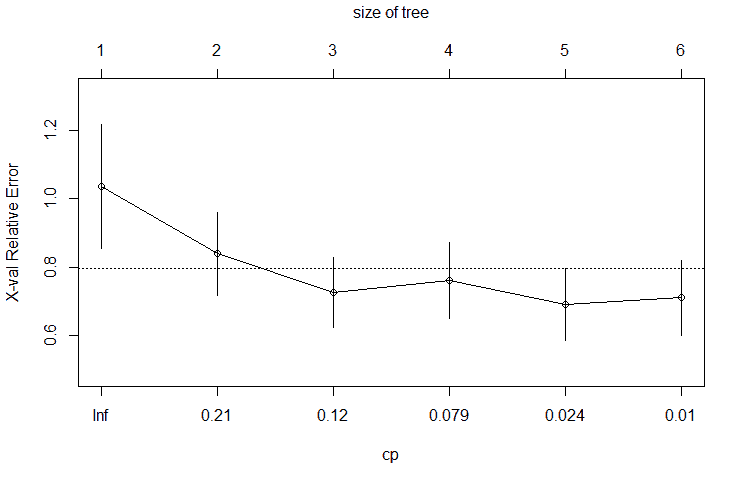

图表展示了树的大小与相应误差条对应的相对误差。图表上的水平线是最低标准误差的上限。选择一个树的大小，`5`，即四个分割，我们可以通过首先从表中创建一个与修剪后的树关联的`cp`对象来修剪我们的树，从而最小化`xerror`。然后`prune()`函数处理剩余的部分：

```py
  > cp <- min(tree.pros$cptable[5, ])
  > prune.tree.pros <- prune(tree.pros, cp = cp)

```

完成这些后，你可以绘制并比较完整树和修剪后的树。`partykit`包生成的树图比`party`包生成的要好得多。你可以简单地使用`as.party()`函数作为`plot()`的包装器：

```py
  > plot(as.party(tree.pros))

```

前一个命令的输出如下：

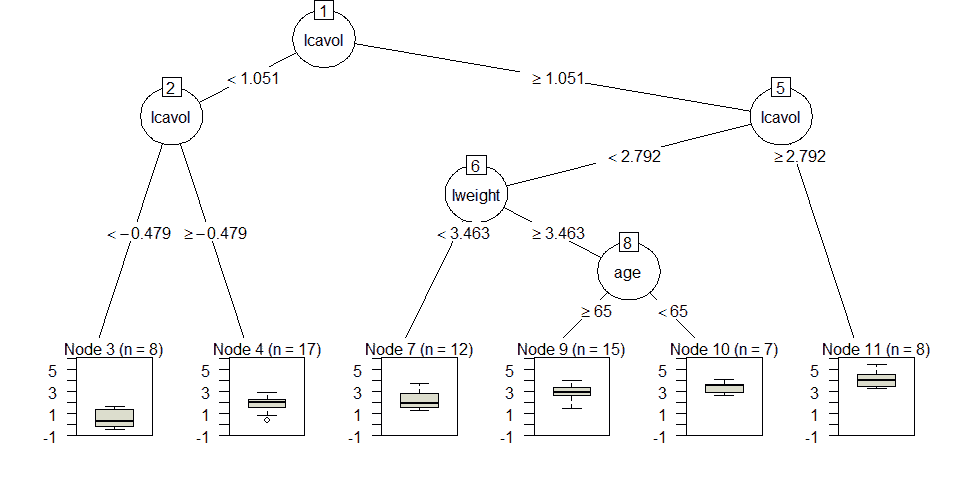

现在，我们将使用`as.party()`函数对修剪后的树进行处理：

```py
  > plot(as.party(prune.tree.pros))

```

前一个命令的输出如下：

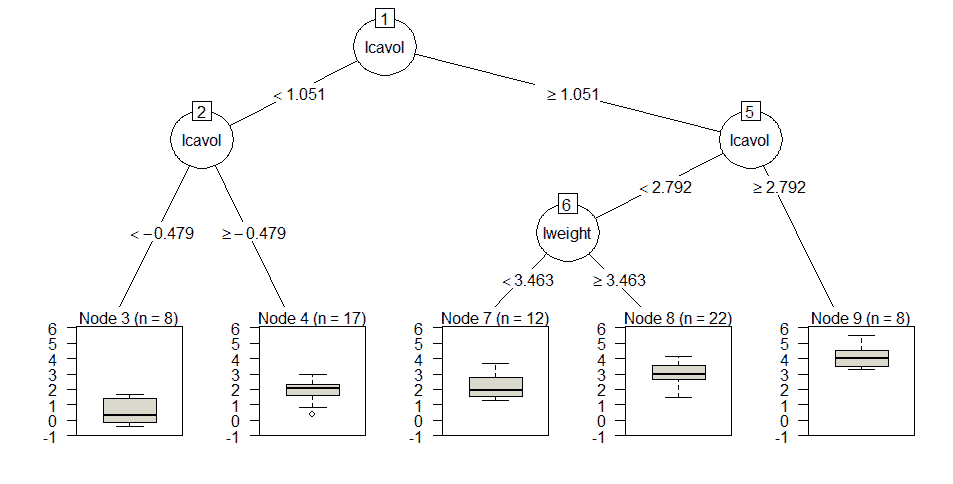

注意，两个树中的分割完全相同，除了最后一个分割，它包含了完整树的变量`age`。有趣的是，树中的第一个和第二个分割都与癌症体积的对数(`lcavol`)相关。这些图表非常有信息量，因为它们显示了分割、节点、每个节点的观测值以及我们试图预测的结果的箱线图。

让我们看看修剪后的树在`test`数据上的表现如何。我们将使用`predict()`函数创建预测值的对象，并包含`test`数据。然后，计算误差（预测值减去实际值），最后，计算平方误差的平均值：

```py
  > party.pros.test <- predict(prune.tree.pros, newdata = pros.test)
  > rpart.resid <- party.pros.test - pros.test$lpsa 
  > mean(rpart.resid²) #caluclate MSE
  [1] 0.5267748

```

我们在第四章，*线性模型中的高级特征选择*中并没有提高预测值，那里的基线均方误差（MSE）是`0.44`。然而，这项技术并非没有价值。人们可以查看我们生成的树图，并轻松解释响应背后的主要驱动因素。正如引言中提到的，树很容易解释和说明，这在许多情况下可能比准确性更重要。

# 分类树

对于分类问题，我们将以与第三章，*逻辑回归和判别分析*中相同的方式准备乳腺癌数据。在加载数据后，您将删除患者 ID，重命名特征，消除少量缺失值，然后按照以下方式创建`train`/`test`数据集：

```py
  > data(biopsy)
  > biopsy <- biopsy[, -1] #delete ID
  > names(biopsy) <- c("thick", "u.size", "u.shape", "adhsn", 
    "s.size", "nucl",
  "chrom", "n.nuc", "mit", "class") #change the feature names
  > biopsy.v2 <- na.omit(biopsy) #delete the observations with 
    missing values
  > set.seed(123) #random number generator
  > ind <- sample(2, nrow(biopsy.v2), replace = TRUE, prob = c(0.7, 
    0.3))
  > biop.train <- biopsy.v2[ind == 1, ] #the training data set
  > biop.test <- biopsy.v2[ind == 2, ] #the test data set

```

在数据设置适当的情况下，我们将使用与之前回归问题相同的语法风格来处理分类问题，但在创建分类树之前，我们需要确保结果是`因子`类型，这可以通过使用`str()`函数来完成：

```py
  > str(biop.test[, 10])
   Factor w/ 2 levels "benign","malignant": 1 1 1 1 1 2 1 2 1 1 ...

```

首先，创建树，然后检查表以确定最佳分割数：

```py
  > set.seed(123)
  > tree.biop <- rpart(class ~ ., data = biop.train)
  > tree.biop$cptable
    CP nsplit rel error  xerror    xstd
  1 0.79651163   0 1.0000000 1.0000000 0.06086254
  2 0.07558140   1 0.2034884 0.2674419 0.03746996
  3 0.01162791   2 0.1279070 0.1453488 0.02829278
  4 0.01000000   3 0.1162791 0.1744186 0.03082013

```

交叉验证误差在只有两个分割（行`3`）时达到最小。现在我们可以剪枝树，绘制剪枝后的树，并查看它在`test`集上的表现：

```py
  > cp <- min(tree.biop$cptable[3, ])
  > prune.tree.biop <- prune(tree.biop, cp = cp)
  > plot(as.party(prune.tree.biop))

```

前一个命令的输出如下：

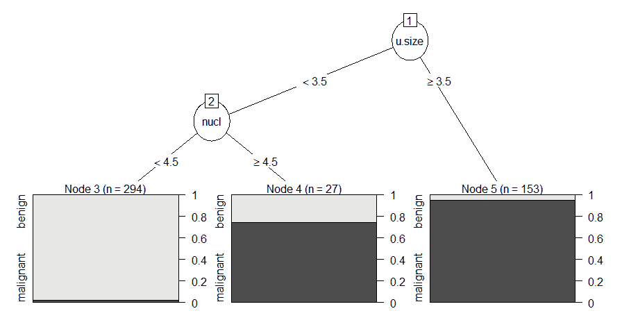

检查树图显示，细胞大小的均匀性是第一个分割，然后是核。完整的树在细胞厚度处还有一个额外的分割。我们可以使用`predict()`函数中的`type="class"`来预测`test`观测值，如下所示：

```py
  > rparty.test <- predict(prune.tree.biop, newdata = biop.test, type 
   ="class")  
  > table(rparty.test, biop.test$class)
  rparty.test benign malignant
   benign    136     3
   malignant   6    64
  > (136+64)/209
  [1] 0.9569378

```

只有两个分割的基本树使我们几乎达到 96%的准确率。这仍然低于逻辑回归的 97.6%，但应该鼓励我们相信我们可以通过即将到来的方法来提高这一点，从随机森林开始。

# 随机森林回归

在本节中，我们将再次关注`prostate`数据。在继续到乳腺癌和皮马印第安人集之前。我们将使用`randomForest`包。创建`random forest`对象的一般语法是使用`randomForest()`函数，并指定公式和数据集作为两个主要参数。回想一下，对于回归，默认的每棵树迭代变量样本是 p/3，对于分类，它是 p 的平方根，其中 p 等于数据框中预测变量的数量。对于较大的数据集，在 p 的术语中，您可以调整`mtry`参数，这将确定每次迭代中采样的 p 的数量。如果这些示例中的 p 小于 10，我们将省略此过程。当您想要为较大的 p 数据集优化`mtry`时，您可以使用`caret`包或使用`randomForest`中的`tuneRF()`函数。有了这个，让我们构建我们的森林并检查结果，如下所示：

```py
  > set.seed(123)
  > rf.pros <- randomForest(lpsa ~ ., data = pros.train)
  > rf.pros
  Call:
 randomForest(formula = lpsa ~ ., data = pros.train) 
 Type of random forest: regression
 Number of trees: 500
 No. of variables tried at each split: 2
 Mean of squared residuals: 0.6792314
 % Var explained: 52.73 

```

`rf.pros`对象的调用显示随机森林生成了`500`棵不同的树（默认值）并在每次分割中采样两个变量。结果是 MSE 为`0.68`和几乎 53%的方差解释。让我们看看我们是否能改进默认的树的数量。过多的树可能导致过拟合；自然地，多少是过多的取决于数据。有两件事可以帮助，第一件事是`rf.pros`的图表，另一件事是要求最小 MSE：

```py
  > plot(rf.pros)

```

前一个命令的输出如下：

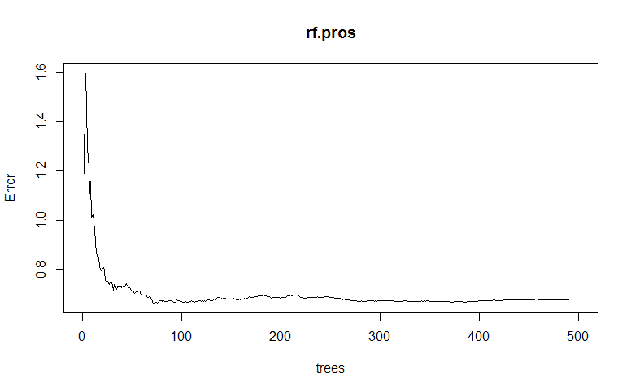

这个图表显示了模型中树的数目与 MSE 的关系。您可以看到，随着树的增加，MSE 的显著改进发生在早期，然后在森林中构建了`100`棵树之前趋于平稳。

我们可以使用`which.min()`函数来识别特定的和最优的树，如下所示：

```py
  > which.min(rf.pros$mse)
  [1] 75

```

我们可以通过在模型语法中指定`ntree=75`来尝试随机森林中的`75`棵树：

```py
  > set.seed(123)
  > rf.pros.2 <- randomForest(lpsa ~ ., data = pros.train, ntree 
   =75)
  > rf.pros.2
  Call:
 randomForest(formula = lpsa ~ ., data = pros.train, ntree = 75) 
 Type of random forest: regression
 Number of trees: 75
 No. of variables tried at each split: 2
 Mean of squared residuals: 0.6632513
 % Var explained: 53.85 

```

您可以看到均方误差（MSE）和解释的方差都略有提高。在测试模型之前，让我们看看另一个图表。如果我们正在结合使用自举样本构建的`75`棵不同树的结果，并且只有两个随机预测因子，我们需要一种方法来确定结果的原因。单独一棵树不能描绘这幅图，但您可以生成一个变量重要性图和相应的列表。y 轴是按重要性降序排列的变量列表，x 轴是 MSE 改进的百分比。注意，对于分类问题，这将是在基尼指数上的改进。该函数是`varImpPlot()`：

```py
  > varImpPlot(rf.pros.2, scale = T, 
   main = "Variable Importance Plot - PSA Score")

```

前一个命令的输出如下：

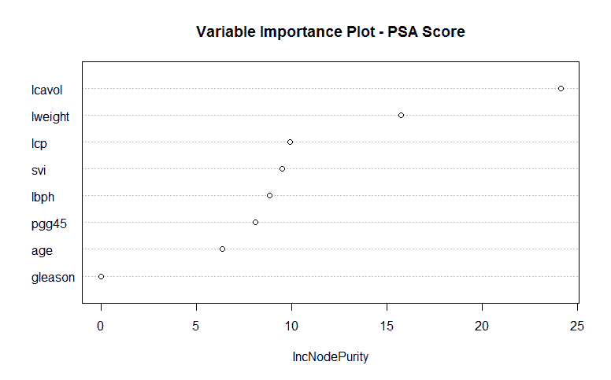

与单棵树一致，`lcavol`是最重要的变量，`lweight`是第二重要的变量。如果您想检查原始数字，请使用`importance()`函数，如下所示：

```py
  > importance(rf.pros.2)
      IncNodePurity
    lcavol  24.108641
 lweight  15.721079
 age  6.363778
 lbph  8.842343
 svi  9.501436
 lcp  9.900339
 gleason  0.000000
 pgg45  8.088635 

```

现在，是时候看看它在`test`数据上的表现了：

```py
  > rf.pros.test <- predict(rf.pros.2, newdata = pros.test)
  > rf.resid = rf.pros.test - pros.test$lpsa #calculate residual
  > mean(rf.resid²)
  [1] 0.5136894

```

均方误差（MSE）仍然高于我们在第四章中，使用 LASSO 的线性模型高级特征选择中实现的`0.44`，并且并不比单棵树更好。

# 随机森林分类

可能你对随机森林回归模型的性能感到失望，但这项技术的真正威力在于分类问题。让我们从乳腺癌诊断数据开始。这个过程几乎和我们在回归问题中做的一样：

```py
  > set.seed(123) 
  > rf.biop <- randomForest(class ~. , data = biop.train)
  > rf.biop
  Call:
   randomForest(formula = class ~ ., data = biop.train)
          Type of random forest: classification
             Number of trees: 500
  No. of variables tried at each split: 3
      OOB estimate of error rate: 3.16%
  Confusion matrix:
       benign malignant class.error
  benign    294     8 0.02649007
  malignant   7    165 0.04069767

```

`OOB`误差率为`3.16%`。同样，这是将所有**500**棵树纳入分析的结果。让我们绘制**误差**与**树**的关系图：

```py
  > plot(rf.biop)

```

上述命令的输出如下：

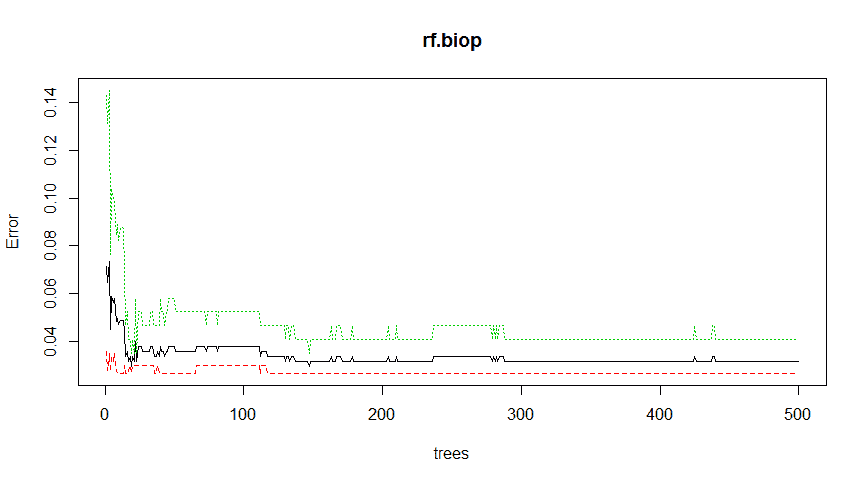

图表显示，在相当多的树中，最小误差和标准误差最低。现在我们再次使用`which.min()`来获取确切的数量。与前一次的不同之处在于，我们需要指定列`1`以获取误差率。这是整体误差率，并且将会有额外的列针对每个类别的误差率。在这个例子中我们不需要它们。此外，`mse`不再可用，而是使用`err.rate`代替，如下所示：

```py
  > which.min(rf.biop$err.rate[, 1])
  [1] 19

```

只需要 19 棵树就可以优化模型准确率。让我们尝试一下，看看它的表现如何：

```py
 > set.seed(123)
 > rf.biop.2 <- randomForest(class~ ., data = biop.train, ntree = 
   19)
  > print(rf.biop.2) 
  Call:
   randomForest(formula = class ~ ., data = biop.train, ntree = 19)
          Type of random forest: classification
             Number of trees: 19
  No. of variables tried at each split: 3
      OOB estimate of error rate: 2.95%
  Confusion matrix:
       benign malignant class.error
  benign    294     8 0.02649007
  malignant   6    166 0.03488372
  > rf.biop.test <- predict(rf.biop.2, newdata = biop.test, type = 
   "response")
  > table(rf.biop.test, biop.test$class)
  rf.biop.test benign malignant
    benign    139     0
    malignant   3    67
  > (139 + 67) / 209
  [1] 0.9856459

```

嗯，怎么样？`训练`集的误差率低于 3%，模型在`测试`集上的表现甚至更好，其中只有 3 个观测值被错误分类，共`209`个，没有一个是假阳性。回想一下，到目前为止最好的是逻辑回归，准确率为 97.6%。所以这似乎是我们迄今为止在乳腺癌数据上的最佳表现。在继续之前，让我们看一下变量重要性图：

```py
  > varImpPlot(rf.biop.2)

```

上述命令的输出如下：

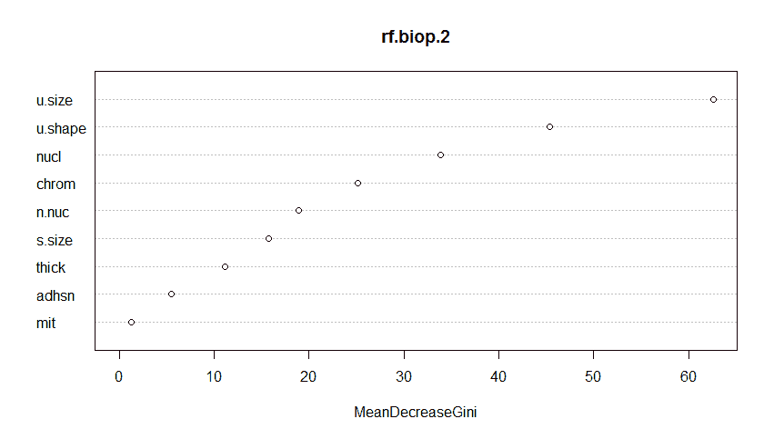

上述图表中重要性在于每个变量对 Gini 指数平均减少的贡献。这与单棵树的分裂有很大的不同。记住，完整的树在大小（与随机森林一致）处有分裂，然后是核，然后是厚度。这显示了构建随机森林的潜在力量，不仅在于预测能力，还在于特征选择。

接下来，我们将面对更困难的挑战——皮马印第安人糖尿病模型，我们首先需要以下方式准备数据：

```py
  > data(Pima.tr)
  > data(Pima.te)
  > pima <- rbind(Pima.tr, Pima.te)
  > set.seed(502)
  > ind <- sample(2, nrow(pima), replace = TRUE, prob = c(0.7, 0.3))
  > pima.train <- pima[ind == 1, ]
  > pima.test <- pima[ind == 2, ]

```

现在，我们将继续构建模型，如下所示：

```py
  > set.seed(321) 
  > rf.pima = randomForest(type~., data=pima.train)
  > rf.pima
  Call:
   randomForest(formula = type ~ ., data = pima.train)
          Type of random forest: classification
             Number of trees: 500
  No. of variables tried at each split: 2
      OOB estimate of error rate: 20%
  Confusion matrix:
     No Yes class.error
  No 233 29  0.1106870
  Yes 48 75  0.3902439

```

我们得到了`20`%的错误分类率误差，这并不比我们在`训练`集上之前做得更好。让我们看看优化树的大小是否能显著改善情况：

```py
  > which.min(rf.pima$err.rate[, 1])
  [1] 80
  > set.seed(321)
  > rf.pima.2 = randomForest(type~., data=pima.train, ntree=80)
  > print(rf.pima.2)
  Call:
   randomForest(formula = type ~ ., data = pima.train, ntree = 80)
          Type of random forest: classification
             Number of trees: 80
  No. of variables tried at each split: 2
      OOB estimate of error rate: 19.48%
  Confusion matrix:
     No Yes class.error
  No 230 32  0.1221374
  Yes 43 80  0.3495935

```

在森林中有`80`棵树时，`OOB`误差率几乎没有改善。随机森林在`测试`数据上能否达到预期的效果？我们将在以下方式中看到：

```py
  > rf.pima.test <- predict(rf.pima.2, newdata= pima.test, 
   type = "response")
  > table(rf.pima.test, pima.test$type)
  rf.pima.test No Yes
       No 75 21
       Yes 18 33
  > (75+33)/147
  [1] 0.7346939

```

嗯，我们在`测试`数据上只得到了 73%的准确率，这比我们使用 SVM 实现的准确率要低。

虽然随机森林在糖尿病数据上表现不佳，但它已被证明是目前乳腺癌诊断的最佳分类器。最后，我们将转向梯度提升。

# 极端梯度提升 - 分类

如前所述，我们将在本节中使用`xgboost`包，该包我们已经加载。鉴于该方法所获得的良好声誉，让我们在糖尿病数据上尝试它。

如提升概述中所述，我们将调整一些参数：

+   `nrounds`：最大迭代次数（最终模型中的树的数量）。

+   `colsample_bytree`：在构建树时采样的特征数量，以比率表示。默认为 1（100%的特征）。

+   `min_child_weight`：被提升的树中的最小权重。默认为 1。

+   `eta`：学习率，即每个树对解决方案的贡献。默认为 0.3。

+   `gamma`：在树中进行另一个叶分区所需的最小损失减少量。

+   `subsample`：数据观察值的比率。默认为 1（100%）。

+   `max_depth`：单个树的最大深度。

使用`expand.grid()`函数，我们将构建实验网格以运行`caret`包的训练过程。如果你没有指定所有前面的参数值，即使只是一个默认值，当你执行函数时，你将收到一个错误消息。以下值基于我之前所做的多次训练迭代。我鼓励你尝试你自己的调整值。

让我们按照以下方式构建网格：

```py
 > grid = expand.grid(
 nrounds = c(75, 100),
 colsample_bytree = 1,
 min_child_weight = 1,
 eta = c(0.01, 0.1, 0.3), #0.3 is default,
 gamma = c(0.5, 0.25),
 subsample = 0.5,
 max_depth = c(2, 3)
 ) 

```

这创建了一个包含 24 个不同模型的网格，`caret`包将运行这些模型以确定最佳调整参数。需要注意的是，在我们将要处理的数据集大小上，这个过程只需要几秒钟。然而，在大数据集中，这可能需要数小时。因此，你必须运用你的判断，并通过对数据的小样本进行实验来识别调整参数，以防时间紧迫，或者你受限于硬盘驱动器的大小。

在使用`caret`包的`train()`函数之前，我想通过创建一个名为`control`的对象来指定`trainControl`参数。该对象将存储我们想要训练的调整参数的方法。我们将使用 5 折交叉验证，如下所示：

```py
 > cntrl = trainControl(
   method = "cv",
   number = 5,
   verboseIter = TRUE,
   returnData = FALSE,
   returnResamp = "final" 
   )

```

要使用`train.xgb()`函数，只需指定公式，就像我们使用其他模型一样：`train`数据集输入、标签、方法、训练控制和实验网格。请记住设置随机种子：

```py
 > set.seed(1)
 > train.xgb = train(
 x = pima.train[, 1:7],
 y = ,pima.train[, 8],
 trControl = cntrl,
 tuneGrid = grid,
 method = "xgbTree"
 ) 

```

由于我在`trControl`中设置了`verboseIter`为`TRUE`，你应该已经看到了每个 k 折中的每个训练迭代。

调用该对象将给我们最优参数和每个参数设置的每个结果，如下所示（为了简便起见已缩写）：

```py
 > train.xgb
 eXtreme Gradient Boosting 
 No pre-processing
 Resampling: Cross-Validated (5 fold) 
 Summary of sample sizes: 308, 308, 309, 308, 307 
 Resampling results across tuning parameters:
 eta max_depth gamma nrounds Accuracy  Kappa 
 0.01 2     0.25  75    0.7924286 0.4857249
 0.01 2     0.25  100    0.7898321 0.4837457
 0.01 2     0.50  75    0.7976243 0.5005362
 ...................................................
 0.30 3     0.50  75    0.7870664 0.4949317
 0.30 3     0.50  100    0.7481703 0.3936924
 Tuning parameter 'colsample_bytree' was held constant at a 
  value of 1
 Tuning parameter 'min_child_weight' was held constant at a 
  value of 1
 Tuning parameter 'subsample' was held constant at a value of 0.5
 Accuracy was used to select the optimal model using the largest 
   value.
 The final values used for the model were nrounds = 75, max_depth = 
   2,
 eta = 0.1, gamma = 0.5, colsample_bytree = 1, min_child_weight = 1
 and subsample = 0.5.

```

这为我们提供了构建模型的最佳参数组合。在训练数据中的准确率为 81%，Kappa 值为 0.55。现在事情变得有点棘手，但这是我看到的最优实践。首先，创建一个参数列表，这些参数将由`xgboost`训练函数`xgb.train()`使用。然后，将数据框转换为输入特征矩阵和标签数值结果列表（0 和 1）。接下来，将特征和标签转换为所需的输入，即`xgb.Dmatrix`。尝试以下操作：

```py
 > param <- list( objective = "binary:logistic", 
   booster = "gbtree",
   eval_metric = "error",
   eta = 0.1, 
   max_depth = 2, 
   subsample = 0.5,
   colsample_bytree = 1,
   gamma = 0.5
   )  
  > x <- as.matrix(pima.train[, 1:7])
 > y <- ifelse(pima.train$type == "Yes", 1, 0)
 > train.mat <- xgb.DMatrix(data = x, label = y) 

```

准备好所有这些后，只需创建模型：

```py
 > set.seed(1)
 > xgb.fit <- xgb.train(params = param, data = train.mat, nrounds = 
   75) 

```

在查看测试集上的表现之前，让我们检查变量重要性并绘制出来。你可以检查三个项目：**增益**、**覆盖率**和**频率**。**增益**是特征对其所在分支的准确率提升。**覆盖率**是与该特征相关的总观察值的相对数量。**频率**是特征在所有树中出现的百分比。以下代码生成所需的输出：

```py
 > impMatrix <- xgb.importance(feature_names = dimnames(x)[[2]], 
   model = xgb.fit) > impMatrix
 Feature    Gain   Cover Frequency
 1:   glu 0.40000548 0.31701688 0.24509804
 2:   age 0.16177609 0.15685050 0.17156863
 3:   bmi 0.12074049 0.14691325 0.14705882
 4:   ped 0.11717238 0.15400331 0.16666667
 5:  npreg 0.07642333 0.05920868 0.06862745
 6:  skin 0.06389969 0.08682105 0.10294118
 7:   bp 0.05998254 0.07918634 0.09803922 > xgb.plot.importance(impMatrix, main = "Gain by Feature") 

```

上述命令的输出如下：

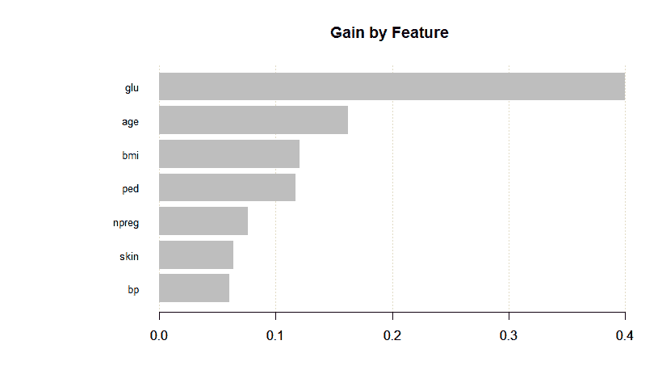

特征重要性与其他方法相比如何？

这是我们在测试集上的表现，测试数据必须是一个矩阵。让我们也引入来自`InformationValue`包的工具来帮助我们。此代码加载库并生成一些输出以分析模型性能：

```py
 > library(InformationValue)
  > pred <- predict(xgb.fit, x)
  > optimalCutoff(y, pred)
  [1] 0.3899574
 > pima.testMat <- as.matrix(pima.test[, 1:7])
 > xgb.pima.test <- predict(xgb.fit, pima.testMat)
 > y.test <- ifelse(pima.test$type == "Yes", 1, 0) > confusionMatrix(y.test, xgb.pima.test, threshold = 0.39)
 0 1
 0 72 16
 1 20 39
 > 1 - misClassError(y.test, xgb.pima.test, threshold = 0.39)
 [1] 0.7551

```

你注意到我使用`optimalCutoff()`做了什么吗？嗯，这个来自`InformationValue`的功能提供了最小化错误的最佳概率阈值。顺便说一句，模型误差大约为 25%。它仍然不如我们的 SVM 模型。作为旁白，我们看到 ROC 曲线和 AUC 值超过 0.8 的成就。以下代码生成 ROC 曲线：

```py
 > plotROC(y.test, xgb.pima.test)

```

代码的输出如下：

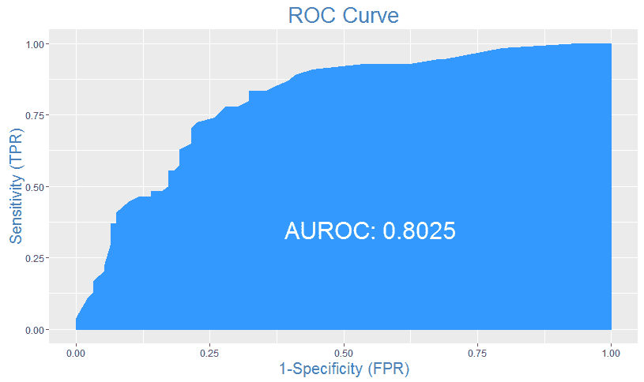

# 模型选择

记得我们本章的主要目标是使用基于树的算法来提高前几章中完成的工作的预测能力。我们学到了什么？首先，在具有定量响应的`prostate`数据上，我们没有能够改进我们在第四章，*线性模型中的高级特征选择*中产生的线性模型。其次，在第三章，*逻辑回归和判别分析*中的威斯康星州乳腺癌数据上，随机森林优于逻辑回归。最后，并且我必须说有点失望，我们没有能够通过提升树改进 Pima 印第安人糖尿病数据上的 SVM 模型。

因此，我们可以放心，我们对于前列腺癌和乳腺癌问题有很好的模型。我们将在第七章，“神经网络与深度学习”中再尝试一次，以改进糖尿病模型。在我们结束这一章之前，我想介绍使用随机森林技术进行特征消除的强大方法。

# 使用随机森林进行特征选择

到目前为止，我们已经探讨了几个特征选择技术，例如正则化、最佳子集和递归特征消除。我现在想介绍一个使用`Boruta`包对随机森林分类问题进行有效特征选择的方法。有一篇论文提供了关于它是如何提供所有相关特征的详细说明：

Kursa M., Rudnicki W. (2010), *使用 Boruta 包进行特征选择*，《统计软件杂志》，36(11)，1 - 13

我在这里要做的是提供一个算法概述，并将其应用于大量数据集。这不会作为一个单独的业务案例，而是一个应用该方法的模板。我发现它非常有效，但请注意，它可能计算量很大。这似乎与目的相悖，但它有效地消除了不重要的特征，使你能够专注于构建一个更简单、更高效、更有洞察力的模型。这是值得的时间投资。

在高层次上，该算法通过复制所有输入并打乱它们观察的顺序来创建**影子**属性，以去相关化。然后，在所有输入上构建一个随机森林模型，并计算每个特征（包括影子属性）的平均准确度损失的 Z 分数。与影子属性相比，Z 分数显著更高或显著更低的特征被认为是**重要**的，而分别被认为是**不重要**的。移除影子属性和已知重要性的特征，然后重复此过程，直到所有特征都被分配一个重要性值。你也可以指定随机森林迭代的最大次数。算法完成后，每个原始特征将被标记为**确认**、**暂定**或**拒绝**。你必须决定是否将暂定特征包括在进一步的建模中。根据你的情况，你有一些选择：

+   改变随机种子并多次（k 次）重新运行该方法，只选择在所有 k 次运行中均得到确认的特征

+   将你的数据（训练数据）分为 k 个折，对每个折进行单独的迭代，并选择那些在所有 k 个折中均得到确认的特征

注意，所有这些都可以用几行代码完成。让我们看看代码，将其应用于 `mlbench` 包中的 `Sonar` 数据。它包含 208 个观测值，60 个数值输入特征，以及一个用于分类的标签向量。标签是因子，其中 `R` 表示 `sonar` 对象是岩石，`M` 表示是矿。首先要做的事情是加载数据并进行快速的数据探索：

```py
 > data(Sonar, package="mlbench")
 > dim(Sonar)
 [1] 208 61
 > table(Sonar$Class)
 M R 
 111 97

```

要运行算法，你只需要加载 `Boruta` 包并在 `boruta()` 函数中创建一个公式。请注意，标签必须是因子，否则算法将无法工作。如果你想跟踪算法的进度，指定 `doTrace = 1`。另外，别忘了设置随机种子：

```py
 > library(Boruta)
 > set.seed(1)
 > feature.selection <- Boruta(Class ~ ., data = Sonar, doTrace = 1)

```

如前所述，这可能会计算密集。以下是我那老式笔记本电脑上所需的时间：

```py
 > feature.selection$timeTaken
 Time difference of 25.78468 secs

```

一个简单的表格将提供最终重要性决策的计数。我们看到我们可以安全地消除一半的特征：

```py
 > table(feature.selection$finalDecision)
 Tentative Confirmed Rejected 
 12    31    17

```

使用这些结果，创建一个新的包含所选特征的 data frame 简单易行。我们开始使用 `getSelectedAttributes()` 函数来捕获特征名称。在这个例子中，我们只选择那些已确认的。如果我们想包括已确认的和暂定的，我们只需在函数中指定 `withTentative = TRUE`：

```py
 > fNames <- getSelectedAttributes(feature.selection) # withTentative = TRUE
 > fNames
 [1] "V1" "V4" "V5" "V9" "V10" "V11" "V12" "V13" "V15" "V16"
 [11] "V17" "V18" "V19" "V20" "V21" "V22" "V23" "V27" "V28" "V31"
 [21] "V35" "V36" "V37" "V44" "V45" "V46" "V47" "V48" "V49" "V51"
 [31] "V52"

```

使用特征名称，我们创建 Sonar 数据的子集：

```py
 > Sonar.features <- Sonar[, fNames]
 > dim(Sonar.features)
 [1] 208 31

```

就这样！`Sonar.features` 数据框包含了来自 boruta 算法的所有已确认的特征。现在它可以被用于进一步的有意义的数据探索和分析。只需几行代码和一些耐心，让算法完成其工作，就可以显著提高你的建模努力和洞察力生成。

# 摘要

在本章中，你学习了基于树的机器学习方法在分类和回归问题中的优势和局限性。单个树虽然易于构建和解释，但可能不具备解决我们试图解决的问题所需的预测能力。为了提高预测能力，我们有随机森林和梯度提升树等工具可供使用。在随机森林中，构建了数百甚至数千棵树，并将结果汇总以进行整体预测。随机森林中的每一棵树都是使用数据的一个样本（称为 bootstrapping）以及预测变量的一个样本构建的。至于梯度提升，首先生成一个初始的、相对较小的树。在此初始树构建之后，后续的树基于残差/误分类生成。这种技术的预期结果是构建一系列的树，可以在过程中改进先前树的弱点，从而降低偏差和方差。我们还看到，在 R 中，可以利用随机森林作为特征选择方法。

虽然这些方法非常强大，但在机器学习的世界里，它们并不是某种灵丹妙药。不同的数据集需要分析师的判断，以确定哪些技术适用。应用于分析和调整参数选择的技术同样重要。这种精细调整可能对良好预测模型和优秀预测模型之间的差异产生重大影响。

在下一章中，我们将注意力转向使用 R 语言构建神经网络和深度学习模型。
