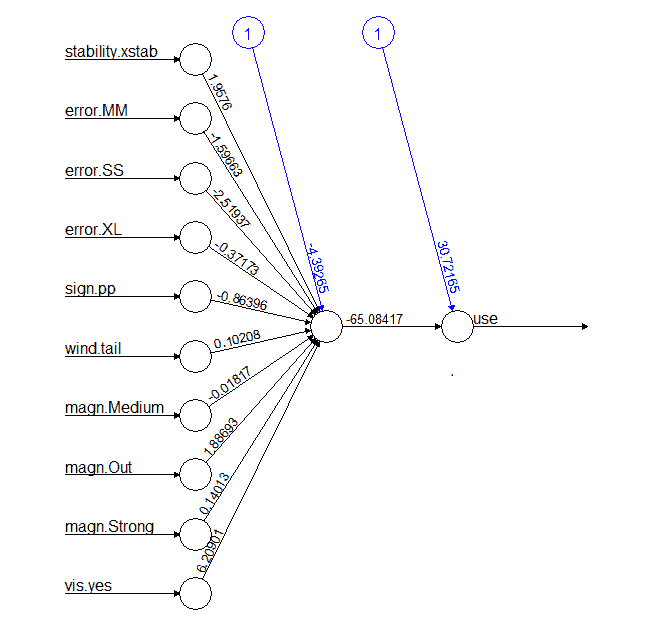

# 第七章：神经网络与深度学习

“忘记人工智能吧 - 在大数据的勇敢新世界中，我们应该警惕的是人工愚蠢。”

- 托马斯·查特菲尔德

我记得在 2012 年中期左右的一次会议上，我参与了一个小组讨论某些分析的结果，当时桌子旁的一位人士带着一丝恼怒和恐惧的语气说，“这”**不是**“那种”**神经****网络**，“是吗？”我知道他过去与神经网络有过冲突，并且对此有深深的焦虑，所以我用一些讽刺的话安慰他，说神经网络基本上已经走向了恐龙的道路。没有人反对！几个月后，当我参加一个当地会议时，我被震惊了，因为讨论的重点竟然是神经网络和神秘的深度学习。像 Ng、Hinton、Salakhutdinov 和 Bengio 这样的机器学习先驱们使神经网络复兴，并提高了它们的性能。

大量的媒体炒作围绕着这些方法，高科技公司如 Facebook、Google 和 Netflix 投入了数亿美元，甚至可能更多。这些方法在语音识别、图像识别和自动化方面取得了有希望的结果。如果自动驾驶汽车不再偏离道路相互碰撞，那肯定是因为这里讨论的方法。

在本章中，我们将讨论这些方法的工作原理、它们的优点和固有的缺点，以便你能够就它们进行交谈。我们将通过一个神经网络的实际商业应用来操作。最后，我们将在一个基于云的应用中应用深度学习方法。

# 神经网络简介

神经网络是一个相当宽泛的术语，涵盖了多种相关方法，但就我们而言，我们将专注于一种**前馈**网络，它通过**反向传播**进行训练。我不会浪费我们的时间讨论机器学习方法论与生物大脑工作方式的相似之处或不同之处。我们只需要从神经网络是什么的工作定义开始。我认为维基百科的条目是一个很好的起点。

在机器学习和认知科学中，**人工神经网络**（**ANNs**）是一系列受生物神经网络（特别是动物的中央神经系统，尤其是大脑）启发的统计学习模型，用于估计或近似依赖于大量输入且通常未知的功能。[`zh.wikipedia.org/wiki/人工神经网络`](https://zh.wikipedia.org/wiki/人工神经网络)

神经网络的动机或好处是，它们允许对输入/特征和响应变量之间的复杂关系进行建模，尤其是如果这些关系高度非线性。创建和评估模型不需要任何潜在假设，并且它可以用于定性和定量响应。如果这是阴，那么阳就是常见的批评，即结果是黑盒，这意味着没有方程式可以检查和与商业伙伴分享。事实上，结果几乎不可解释。其他批评围绕着结果如何仅通过改变初始随机输入而有所不同，以及训练神经网络计算量大且耗时。

神经网络的数学背景不是微不足道的。然而，至少要了解正在发生的事情是至关重要的。一种直观地发展这种理解的好方法是开始一个简单神经网络的图表。

在这个简单的网络中，输入或协变量由两个节点或神经元组成。标记为**1**的神经元代表常数，或者更合适地说，是截距。**X1**代表一个定量变量。**W**代表乘以输入节点值的权重。这些值成为**输入节点**到**隐藏节点**的输入。你可以有多个隐藏节点，但这里只发生的事情的基本原则是相同的。在隐藏节点**H1**中，*权重*值计算被求和。由于截距表示为**1**，那么这个输入值仅仅是权重，**W1**。现在发生魔法。求和的值随后通过**激活**函数进行转换，将输入信号转换为输出信号。在这个例子中，因为它只有一个**隐藏节点**，所以它乘以**W3**，成为**Y**的估计，我们的响应。这是算法的前馈部分：


但等等，还有更多！正如所知，为了完成循环或时代，会发生反向传播，并根据所学内容训练模型。为了启动反向传播，会根据损失函数（如**均方误差**或**交叉熵**等）确定一个错误。由于权重**W1**和**W2**被设置为*[-1, 1]*之间的某些初始随机值，初始错误可能很高。反向工作，权重被改变以最小化损失函数中的错误。以下图表描绘了反向传播部分：


这完成了一个时代。这个过程会继续进行，使用梯度下降（在第五章中讨论，*更多分类技术 - K 最近邻和支持向量机*），直到算法收敛到最小误差或预指定的时代数。如果我们假设我们的激活函数仅仅是线性的，在这个例子中，我们最终会得到*Y = W3(W1(1) + W2(X1))*。

如果添加了大量的输入神经元、隐藏节点中的多个神经元，甚至多个隐藏节点，网络可能会变得复杂。需要注意的是，从神经元输出的连接到所有后续神经元的连接都分配了权重。这大大增加了模型复杂性。增加隐藏节点和在隐藏节点中增加神经元数量并没有像我们希望的那样提高人工神经网络的性能。因此，深度学习的发展发生了，这在一定程度上放宽了所有这些神经元连接的要求。

有许多激活函数可以使用/尝试，包括一个简单的线性函数，或者对于分类问题，使用`sigmoid`函数，它是逻辑函数的特殊情况（第三章，*逻辑回归和判别分析*）。其他常见的激活函数包括`Rectifier`、`Maxout`和**双曲正切**（**tanh**）。

我们可以在 R 中绘制`sigmoid`函数，首先创建一个`R`函数来计算`sigmoid`函数的值：

```py
    > sigmoid = function(x) {
     1 / ( 1 + exp(-x) )
     }

```

然后，在一系列值范围内绘制函数就变得简单了，比如从`-5`到`5`：

```py
 > x <- seq(-5, 5, .1) > plot(sigmoid(x))

```

前一个命令的输出如下：


`tanh`函数（双曲正切）是对逻辑`sigmoid`的缩放，输出值在**-1**和**1**之间。`tanh`函数与`sigmoid`的关系如下，其中**x**是`sigmoid`函数：

*tanh(x)* *=* *2* *** *sigmoid(2x)* *-* *1*

为了比较，让我们绘制`tanh`和`sigmoid`函数。同时，我们也使用`ggplot`：

```py
 > library(ggplot2)
 > s <- sigmoid(x)
 > t <- tanh(x)
 > z <- data.frame(cbind(x, s, t))
 > ggplot(z, aes(x)) +
 geom_line(aes(y = s, color = "sigmoid")) +
 geom_line(aes(y = t, color = "tanh")) 

```

前一个命令的输出如下：


那么为什么使用`tanh`函数而不是`sigmoid`函数呢？关于这个问题似乎有很多意见；`tanh`在神经网络中是否流行？简而言之，假设你有一个均值为 0，方差为 1 的缩放数据，`tanh`函数允许权重平均接近零（零中心化）。这有助于避免偏差并提高收敛性。想想在`sigmoid`函数激活中，从输出神经元到输入神经元始终有正权重的含义。在反向传播过程中，权重将在层之间变为全部为正或全部为负。这可能会导致性能问题。此外，由于`sigmoid`在尾部（0 和 1）的梯度几乎为零，在反向传播过程中，可能会发生几乎没有任何信号在不同层神经元之间流动的情况。关于这个问题的全面讨论，参见 LeCun（1998）。记住，`tanh`总是更好的结论并不是必然的。

所有这些都听起来非常吸引人，但人工神经网络（ANN）几乎步入了迪斯科的行列，因为它并没有像宣传的那样表现出色，尤其是在尝试使用具有许多隐藏层和神经元的深度网络时。似乎随着 Hinton 和 Salakhutdinov（2006 年）发表的开创性论文，神经网络经过重新定义，甚至可以说是重新命名，深度学习才逐渐复兴。

# 深度学习，一个不太深入的概述

那么，这种吸引我们注意力和头条的深度学习究竟是什么呢？让我们再次查阅维基百科，以获得一个工作定义：*深度学习是机器学习的一个分支，它基于一系列算法，通过使用模型架构，以复杂结构或其它方式，由多个非线性变换组成，试图在数据中模拟高级抽象*。这听起来就像是一位律师写的。深度学习的特点在于它基于人工神经网络（ANN），其中机器学习技术，主要是无监督学习，用于从输入变量中创建新特征。我们将在接下来的几章中深入探讨一些无监督学习技术，但可以将其视为在无响应变量存在的情况下寻找数据结构。简单来说，就是**元素周期表**，这是一个在未指定响应的情况下寻找结构的经典案例。在网上查找这张表，你会看到它是根据原子结构组织的，金属在一侧，非金属在另一侧。它是基于潜在分类/结构创建的。这种对潜在结构/层次结构的识别是深度学习与普通 ANN 的区别所在。深度学习某种程度上解决了是否有一个算法比仅仅使用原始输入更好地表示结果的问题。换句话说，我们的模型能否学会仅用原始像素作为唯一输入来对图片进行分类？这在只有少量标记响应但大量未标记输入数据的情况下非常有帮助。你可以使用无监督学习来训练你的深度学习模型，然后将这种监督方式应用于标记数据，来回迭代。

这些潜在结构的识别在数学上并不简单，但一个例子是我们在第四章，*线性模型中的高级特征选择*中探讨的正则化概念。在深度学习中，可以使用正则化方法（如*L1*（惩罚非零权重）、*L2*（惩罚大权重）和 dropout（随机忽略某些输入并将其权重置零））来惩罚权重。在标准 ANN 中，这些正则化方法都没有发生。

另一种方法是降低数据的维度。其中一种方法是`自动编码器`。这是一个神经网络，其中输入被转换为一组降低维度的权重。在下面的图中，请注意**特征 A**没有连接到隐藏节点之一：


这可以递归地应用，学习可以在多个隐藏层上发生。在这种情况下，你所看到的是网络在层层叠加时发展出特征的特征。深度学习首先按顺序学习两层之间的权重，然后仅使用反向传播来微调这些权重。其他特征选择方法包括**受限玻尔兹曼机**和**稀疏编码模型**。

这些细节超出了我们的范围，有很多资源可以学习具体细节。以下是一些起点：[ ](http://www.cs.toronto.edu/~hinton/)

[`www.cs.toronto.edu/~hinton/`](http://www.cs.toronto.edu/~hinton/)

[`deeplearning.net/`](http://deeplearning.net/)

深度学习在许多分类问题上表现良好，包括赢得 Kaggle 竞赛或两次。它仍然受到人工神经网络的问题，特别是黑盒问题的困扰。试着向不知情的人解释神经网络内部正在发生什么。然而，对于解释“如何”不是问题，而重要问题是“什么”的问题，它是合适的。毕竟，我们真的关心自动驾驶汽车为什么避免撞到行人，还是我们关心它没有撞到的事实？此外，Python 社区在深度学习使用和包方面比 R 社区有先发优势。正如我们将在实际练习中看到的，差距正在缩小。

虽然深度学习是一项令人兴奋的任务，但请注意，为了充分发挥其功能，你需要高度的计算能力，并花时间通过微调超参数来训练最佳模型。以下是一些你需要考虑的因素：

+   激活函数

+   隐藏层的尺寸和数量

+   维度降低，即受限玻尔兹曼机与自动编码器

+   迭代次数

+   梯度下降学习率

+   损失函数

+   正则化

# 深度学习资源和高级方法

你可以用作学习和解释的更有趣的视觉工具之一是 TensorFlow^(TM)提供的交互式小部件：[`playground.tensorflow.org/`](http://playground.tensorflow.org/)。这个工具允许你探索，或者像网站所说的那样，**摆弄**各种参数以及它们如何影响响应，无论是分类问题还是回归问题。我可以花很多小时摆弄它。

这里有一个有趣的任务：创建你自己的实验设计，看看各种参数如何影响你的预测。

到目前为止，似乎增长最快的两个深度学习开源工具是 TensorFlow^(TM)和 MXNet。我仍然更喜欢使用我们将要看到的包`h2o`，但了解和学习最新技术是很重要的。你可以使用 R 访问 TensorFlow^(TM)，但需要先安装 Python。本系列教程将指导你如何启动和运行：

[`rstudio.github.io/tensorflow/`](https://rstudio.github.io/tensorflow/).

MXNet 不需要安装 Python，相对容易安装和运行。它还提供了一些预训练模型，允许你快速开始预测。有几个 R 教程可用：

[`mxnet.io/`](http://mxnet.io/).

我现在想花时间列举一些深度神经网络的变体以及它们在哪些学习任务中表现良好。

**卷积神经网络**（**CNN**）假设输入是图像，并从数据切片或小部分中创建特征，这些特征被组合起来创建特征图。将这些小切片想象成网络在训练过程中学习的过滤器或更恰当地说，是核。CNN 的激活函数是**修正线性单元**（**ReLU**）。它简单表示为 *f(x) = max(0, x)*，其中 *x* 是神经元的输入。CNN 在图像分类、目标检测甚至句子分类方面表现良好。

**循环神经网络**（**RNN**）是为了利用序列信息而创建的。在传统的神经网络中，输入和输出是相互独立的。在 RNN 中，输出依赖于先前层的计算，允许信息在层之间持续。所以，从一个神经元（y）的输出；它不仅基于其输入（t），还基于所有先前层（t-1, t-n...）。它在手写和语音检测方面非常有效。

**长短期记忆**（**LSTM**）是循环神经网络（RNN）的一个特例。RNN 的问题在于它对具有长信号的数据表现不佳。因此，LSTMs 被创建出来以捕捉数据中的复杂模式。RNN 在训练过程中以相同的方式结合信息，而不管信息在一个步骤中相对于其他步骤是更有价值还是更无价值。LSTMs 试图通过在训练的每个步骤中决定要记住什么来克服这一限制。这种权重矩阵与数据向量的乘积被称为门，它充当信息过滤器。LSTM 中的神经元将有两个输入和两个输出。来自先前输出的输入和从先前门传递的内存向量。然后，它产生输出值和输出内存作为下一层的输入。LSTMs 的局限性在于需要大量的训练数据，并且计算密集。LSTMs 在语音识别问题上表现良好。

我建议你使用 MXNet 的教程来帮助你理解如何开发这些模型以供自己使用。

就这样，让我们继续探讨一些实际应用。

# 商业理解

1998 年 4 月 20 日那天晚上，天气晴朗，天空清澈。我是一名学生飞行员，驾驶着一架休斯 500D 直升机，从明尼苏达州圣保罗市中心的机场进行了一次长途飞行，返回到古老的格兰 Forks，北达科他州。这次飞行是我获得直升机仪表等级测试前的最后要求。我的飞行日志显示，我们距离 VOR 在 Victor 2 航线上 35 英里或 35 海里。这使我们位于明尼苏达州圣克劳德市以南/东南方向，以我记忆中的 4,500 英尺的海拔高度，大约以 120 节的速度飞行。然后，发生了...BOOOOM！说这是一声震耳欲聋的爆炸声，随后是一阵飓风般的风吹到脸上，这并不夸张。

所有这一切都始于我的飞行教练问了一个关于我们计划进入明尼苏达州亚历山大的仪表进近的平凡问题。我们交换了飞机的控制权，我弯下腰查看膝上板上仪表进近图。当我戴上红色镜头手电筒时，爆炸发生了。由于我是脸朝下的姿势，声音和随之而来的风力，几个想法闪过我的脑海：直升机正在解体，我正在坠落死亡，我的脑海中浮现出像高清电影一样的挑战者号航天飞机爆炸场景。在 1.359 秒的尖叫停止后，我们意识到我面前的聚碳酸酯风挡几乎已经没有了，但其他一切正常。在减速飞机后，粗略检查发现驾驶舱覆盖着血、内脏和羽毛。我们在明尼苏达州中部击中了一只绿头鸭，在这个过程中，我们摧毁了风挡。如果我没有在看我的膝上板，我就会被羽毛覆盖。我们只是宣布紧急情况，取消了与明尼苏达中心机场的飞行计划，就像孟菲斯美女号一样，一瘸一拐地进入亚历山大便于等待来自北达科他大学（战斗苏族之家）的同胞们的救援。

那又如何呢？我想指出我是多么的喜欢 NASA 和宇航员。在一个令人恐惧的时刻，我短暂地以为我将要结束生命，我的思绪飘向了航天飞机。我们这个年龄的大部分男性都想和乔治·布雷特或韦恩·格雷茨基握手。我也想，事实上我也确实和巴兹·奥尔德林握了手。（毕竟，当时他在北达科他大学任教。）因此，当我发现`shuttle`数据集在`MASS`包中时，我不得不将其包含在这本书中。顺便说一句，如果你有机会去肯尼迪航天中心看看航天飞机亚特兰蒂斯号的展览，千万不要错过。

对于这个问题，我们将尝试开发一个神经网络来回答是否应该使用自动着陆系统。默认决策是让机组人员着陆飞船。然而，在机组人员受伤或长时间轨道操作后重新进入时重力产生不利影响的情况下，可能需要自动着陆能力。这些数据基于计算机模拟，而不是实际飞行。实际上，自动着陆系统经历了一些考验和磨难，大多数情况下，航天飞机宇航员在着陆过程中负责。以下是一些提供更多背景信息的链接：

[`www.spaceref.com/news/viewsr.html?pid=10518`](http://www.spaceref.com/news/viewsr.html?pid=10518)

[`waynehale.wordpress.com/2011/03/11/breaking-through/`](https://waynehale.wordpress.com/2011/03/11/breaking-through/)

# 数据理解和准备

首先，我们将加载这四个包。数据位于`MASS`包中：

```py
 > library(caret)
 > library(MASS)
 > library(neuralnet)
 > library(vcd) 

```

将使用`neuralnet`包来构建模型，使用`caret`进行数据准备。`vcd`包将帮助我们进行数据可视化。让我们加载数据并检查其结构：

```py
    > data(shuttle)
    > str(shuttle)
    'data.frame':256 obs. of  7 variables:
     $ stability: Factor w/ 2 levepicels "stab","xstab": 2 2 2 2 2 2 2        
       2 2 2 ...
     $ error    : Factor w/ 4 levels "LX","MM","SS",..: 1 1 1 1 1 1 1 1        
       1 1 ...
     $ sign     : Factor w/ 2 levels "nn","pp": 2 2 2 2 2 2 1 1 1 1 ...
     $ wind     : Factor w/ 2 levels "head","tail": 1 1 1 2 2 2 1 1 1 2        
       ...
     $ magn     : Factor w/ 4 levels "Light","Medium",..: 1 2 4 1 2 4 1        
       2 4 1 ...
     $ vis      : Factor w/ 2 levels "no","yes": 1 1 1 1 1 1 1 1 1 1        
       ...
     $ use      : Factor w/ 2 levels "auto","noauto": 1 1 1 1 1 1 1 1 1        
       1 ...

```

数据由`256`个观测值和`7`个变量组成。请注意，所有变量都是分类变量，响应变量为`use`，有两个水平，即`auto`和`noauto`。协变量如下：

+   `stability`：这是稳定的定位或不是（`stab`/`xstab`）

+   `error`：这是错误的尺寸（`MM` / `SS` / `LX`）

+   `sign`：这是错误的符号，正或负（`pp`/`nn`）

+   `wind`：这是风力的符号（`head` / `tail`）

+   `magn`：这是风力强度（`Light` / `Medium` / `Strong` / `Out of Range`）

+   `vis`：这是可见性（`yes` / `no`）

我们将构建多个表格来探索数据，从响应/结果开始：

```py
    > table(shuttle$use)
    auto noauto 
       145    111

```

几乎 57%的时间，决策是使用自动着陆器。对于分类数据，有许多构建表格的可能性。`table()`函数完全足够用于比较，但如果添加第三个，看起来可能会变得混乱。`vcd`包提供了一系列表格和绘图函数。其中一个是`structable()`。这个函数将接受一个公式（*column1 + column2 ~ column3*），其中*column3*将成为表格的行：

```py
    > table1 <- structable(wind + magn ~ use, shuttle)
    > table1
    wind  head                    tail 
           magn Light Medium Out Strong Light Medium Out Strong
    use 
    auto           19     19  16     18    19     19  16     19
    noauto         13     13  16     14    13     13  16     13

```

在这里，我们可以看到在风力`Light`的情况下，`auto`出现了`19`次，而`noauto`出现了`13`次。`vcd`包提供了`mosaic()`函数来绘制由`structable()`创建的表格，并提供卡方检验的**p 值**：

```py
    > mosaic(table1, shading = T)

```

前一个命令的输出如下：


图表标题对应于它们在表格中各自单元格的成比例大小，这是通过递归拆分创建的。您还可以看到，**p 值**并不显著，因此变量是独立的，这意味着了解风速和/或**magn**的水平并不能帮助我们预测自动着陆器的使用。您不需要包含一个 `structable()` 对象来创建图表，因为它同样可以接受公式：

```py
    > mosaic(use ~ error + vis, shuttle)

```

前一个命令的输出如下：


注意，表格的阴影已经改变，反映了零假设被拒绝和变量之间的依赖性。图表首先获取并拆分可见性。结果是，如果可见性为**无**，则使用自动着陆器。下一个拆分是按**错误**水平进行的。如果**错误**为**SS**或**MM**且**vis**为**无**，则可能建议使用自动着陆器，否则则不。不需要 p 值，因为灰色阴影表示显著性。

您还可以使用 `prop.table()` 函数作为 `table()` 的包装来检查成比例的表格：

```py
    > table(shuttle$use, shuttle$stability)
             stab xstab
      auto     81    64
      noauto   47    64
    > prop.table(table(shuttle$use, shuttle$stability))
                  stab     xstab
      auto   0.3164062 0.2500000
      noauto 0.1835938 0.2500000

```

如果我们忘记了，卡方检验相当简单：

```py
    > chisq.test(shuttle$use, shuttle$stability)
    Pearson's Chi-squared test with Yates' continuity
    correction
    data:  shuttle$use and shuttle$stability
    X-squared = 4.0718, df = 1, p-value = 0.0436

```

准备神经网络的数据非常重要，因为所有协变量和响应都需要是数值的。在我们的案例中，所有输入特征都是分类的。然而，`caret` 包允许我们快速创建虚拟变量作为我们的输入特征：

```py
    > dummies <- dummyVars(use ~ .,shuttle, fullRank = T)
    > dummies
    Dummy Variable Object
    Formula: use ~ .
    7 variables, 7 factors
    Variables and levels will be separated by '.'
    A full rank encoding is used

```

要将这些放入数据框中，我们需要将 `dummies` 对象预测到现有的数据中，无论是相同还是不同的，在 `as.data.frame()` 中。当然，这里也需要相同的数据：

```py
    > shuttle.2 = as.data.frame(predict(dummies, newdata=shuttle))

    > names(shuttle.2)
    [1] "stability.xstab" "error.MM"        "error.SS" 
    [4] "error.XL"        "sign.pp"         "wind.tail" 
    [7] "magn.Medium"     "magn.Out"        "magn.Strong" 
    [10] "vis.yes" 

    > head(shuttle.2)
      stability.xstab error.MM error.SS error.XL sign.pp wind.tail
    1               1        0        0        0       1         0
    2               1        0        0        0       1         0
    3               1        0        0        0       1         0
    4               1        0        0        0       1         1
    5               1        0        0        0       1         1
    6               1        0        0        0       1         1
      magn.Medium magn.Out magn.Strong vis.yes
    1           0        0           0       0
    2           1        0           0       0
    3           0        0           1       0
    4           0        0           0       0
    5           1        0           0       0
    6           0        0           1       0

```

我们现在有一个包含十个变量的输入特征空间。稳定性现在是 `stab` 的 `0` 或 `xstab` 的 `1`。基本错误是 `LX`，其余三个变量代表其他类别。

可以使用 `ifelse()` 函数创建响应：

```py
    > shuttle.2$use <- ifelse(shuttle$use == "auto", 1, 0)
    > table(shuttle.2$use)
    0   1 
    111 145

```

`caret` 包还提供了创建 `train` 和 `test` 集的功能。想法是将每个观察值索引为 `train` 或 `test`，然后相应地拆分数据。让我们以 70/30 的 `train` 到 `test` 比例进行拆分，如下所示：

```py
    > set.seed(123)
    > trainIndex <- createDataPartition(shuttle.2$use, p = .7, list =       
       FALSE)

```

`trainIndex` 中的值为我们提供了行号；在我们的案例中，是 `shuttle.2` 中总行数的 70%。现在只需要创建 `train`/`test` 数据集：

```py
    > shuttleTrain <- shuttle.2[trainIndex, ]
    > shuttleTest  <- shuttle.2[-trainIndex, ]

```

干得好！我们现在可以开始构建神经网络了。

# 建模和评估

如前所述，我们将使用的包是 `neuralnet`。`neuralnet` 中的函数将调用使用公式，就像我们在其他地方使用的那样，例如 *y~x1+x2+x3+x4*，*data = df*。在过去，我们使用 *y~* 来指定数据中的所有其他变量作为输入。然而，`neuralnet` 在撰写本文时并不支持这一点。绕过这种限制的方法是使用 `as.formula()` 函数。首先创建一个变量名对象，然后我们将使用它作为输入，以便正确地将变量粘贴在等式的右侧：

```py
    > n <- names(shuttleTrain)
    > form <- as.formula(paste("use ~", paste(n[!n %in% "use"], 
      collapse = " + ")))
    > form
    use ~ stability.xstab + error.MM + error.SS + error.XL + sign.pp +       
      wind.tail 
       + magn.Medium + magn.Out + magn.Strong + vis.yes

```

请记住这个函数供您自己使用，因为它可能非常有用。在 `neuralnet` 包中，我们将使用的函数名为 `neuralnet()`。除了公式外，还有四个其他关键参数我们需要检查：

+   `hidden`: 这是每层的隐藏神经元数量，最多可达三层；默认为 1

+   `act.fct`: 这是激活函数，默认为逻辑函数和 `tanh` 函数

+   `err.fct`: 这是计算误差的函数，默认为 `sse`；由于我们处理的是二元结果，我们将使用 `ce` 进行交叉熵

+   `linear.output`: 这是一个关于是否忽略默认为 TRUE 的 `act.fct` 的逻辑论证，因此对于我们的数据，这需要设置为 `FALSE`

您也可以指定算法。默认为具有反向传播的弹性算法，我们将使用它，并使用默认的一个隐藏神经元：

```py
    > fit <- neuralnet(form, data = shuttleTrain, err.fct = "ce", 
      linear.output = FALSE)

```

这里是总体结果：

```py
    > fit$result.matrix
      1
    error                         0.009928587504
    reached.threshold             0.009905188403
    steps                       660.000000000000
    Intercept.to.1layhid1        -4.392654985479
    stability.xstab.to.1layhid1   1.957595172393
    error.MM.to.1layhid1         -1.596634090134
    error.SS.to.1layhid1         -2.519372079568
    error.XL.to.1layhid1         -0.371734253789
    sign.pp.to.1layhid1          -0.863963659357
    wind.tail.to.1layhid1         0.102077456260
    magn.Medium.to.1layhid1      -0.018170137582
    magn.Out.to.1layhid1          1.886928834123
    magn.Strong.to.1layhid1       0.140129588700
    vis.yes.to.1layhid1           6.209014123244
    Intercept.to.use             30.721652703205
    1layhid.1.to.use            -65.084168998463

```

我们可以看到，错误率极低，为 `0.0099`。算法达到阈值所需的步数，即误差函数的绝对偏导数小于此误差（默认 = 0.1）时，第一个神经元的最高权重为 `vis.yes.to.1layhid1`，为 6.21。

您还可以查看所谓的广义权重。根据 `neuralnet` 包的作者，广义权重定义为第 *i* 个协变量对对数优势的贡献：

*广义权重表示每个协变量 x[i] 的影响，因此在回归模型中与第 i 个回归参数有类似的解释。然而，广义权重依赖于所有其他协变量*（Gunther 和 Fritsch，2010）。

可以调用并检查权重。我已经将输出简化为前四个变量和六个观测值。请注意，如果对每一行求和，您将得到相同的数字，这意味着权重对于每个协变量组合是相等的。请注意，由于随机权重初始化，您的结果可能会有所不同。

结果如下：

```py
    > head(fit$generalized.weights[[1]])
          [,1]             [,2]         [,3]         [,4] 
 1 -4.374825405  3.568151106  5.630282059 0.8307501368 
 2 -4.301565756  3.508399808  5.535998871 0.8168386187 
 6 -5.466577583  4.458595039  7.035337605 1.0380665866 
 9 -10.595727733 8.641980909 13.636415225 2.0120579565 
 10 -10.270199330 8.376476707 13.217468969 1.9502422861 
 11 -10.117466745 8.251906491 13.020906259 1.9212393878

```

要可视化神经网络，只需使用 `plot()` 函数：

```py
    > plot(fit)

```

下面的输出是前面命令的结果：



此图显示了变量权重和截距。您还可以在图中检查广义权重。让我们看看 `vis.yes` 与 `wind.tail` 的对比，后者具有较低的总体突触权重。注意 `vis.yes` 是偏斜的，而 `wind.tail` 权重的分布均匀，这意味着预测能力很小：

```py
    > par(mfrow = c(1, 2))
    > gwplot(fit, selected.covariate = "vis.yes")
    > gwplot(fit, selected.covariate = "wind.tail")

```

下面的输出是前面命令的结果：


我们现在想看看模型的表现如何。这是通过 `compute()` 函数和指定拟合模型和协变量来完成的。此语法将用于对 `test` 和 `train` 集合的预测。一旦计算，就会创建一个包含 `$net.result` 的预测列表：

```py
    > resultsTrain <- compute(fit, shuttleTrain[, 1:10])
    > predTrain <- resultsTrain$net.result

```

这些结果是以概率表示的，所以让我们将它们转换为`0`或`1`，并随后使用混淆矩阵：

```py
    > predTrain <- ifelse(predTrain >= 0.5, 1, 0) 
    > table(predTrain, shuttleTrain$use)  
    predTrain  0  1
            0 81  0
            1  0 99

```

看看吧，神经网络模型已经达到了 100%的准确率。我们现在屏住呼吸，看看它在`test`集中的表现如何：

```py
 > resultsTest <- compute(fit, shuttleTest[,1:10]) > predTest <- resultsTest$net.result > predTest <- ifelse(predTest >= 0.5, 1, 0) > table(predTest, shuttleTest$use)
 predTest  0  1
 0 29  0
 1  1 46 

```

在`test`集中只有一个假阳性。如果您想识别这是哪一个，请使用`which()`函数将其单独列出，如下所示：

```py
    > which(predTest == 1 & shuttleTest$use == 0)
    [1] 62

```

它是`test`集中的第`62`行，在完整数据集中是第`203`个观测值。

我将留给您去尝试构建一个达到 100%准确率的神经网络！

# 深度学习的一个示例

转移到航天飞机的话题，让我们通过使用`h2o`包来处理一个深度学习的实际示例。我们将使用我从 UCI 机器学习仓库修改过的数据来完成这项工作。原始数据和其描述可在[`archive.ics.uci.edu/ml/datasets/Bank+Marketing/`](https://archive.ics.uci.edu/ml/datasets/Bank+Marketing/)找到。我所做的是，从较小的数据集`bank.csv`中提取数据，将数值变量缩放到均值为 0 和方差为 1，为字符变量/稀疏数值创建虚拟变量，并消除接近零方差变量。数据可在 github [`github.com/datameister66/data/`](https://github.com/datameister66/data/)上找到，也命名为`bank_DL.csv`。在本节中，我们将关注如何在 H20 平台上加载数据并运行深度学习代码来构建一个分类器，以预测客户是否会响应营销活动。

# H2O 背景

H2O 是一个开源的预测分析平台，具有预构建的算法，例如 k 近邻、梯度提升机和深度学习。您可以通过 Hadoop、AWS、Spark、SQL、noSQL 或您的硬盘驱动器将数据上传到该平台。它的好处是您可以在 R 中利用机器学习算法，并在本地机器上以更大的规模使用。如果您想了解更多信息，可以访问网站：[`h2o.ai/product/`](http://h2o.ai/product/).

在 R 上安装 H2O 的过程略有不同。我在这里放上了给我最新更新（截至 2017 年 2 月 25 日）的代码。您可以使用它重新安装最新版本或从网站上获取：[`h2o-release.s3.amazonaws.com/h2o/rel-lambert/5/docs-website/Ruser/Rinstall.html/`](http://h2o-release.s3.amazonaws.com/h2o/rel-lambert/5/docs-website/Ruser/Rinstall.html/). 下面是安装最新版本的代码：

```py
 # The following two commands remove any previously installed H2O      
      packages for 
     R.
 if ("package:h2o" %in% search()) { detach("package:h2o",     
      unload=TRUE) }
 if ("h2o" %in% rownames(installed.packages())) {     
      remove.packages("h2o") }

 # Next, we download packages that H2O depends on.
 if (! ("methods" %in% rownames(installed.packages()))) {     
    install.packages("methods") }
 if (! ("statmod" %in% rownames(installed.packages()))) {   
    install.packages("statmod") }
 if (! ("stats" %in% rownames(installed.packages()))) { 
    install.packages("stats") }
 if (! ("graphics" %in% rownames(installed.packages()))) { 
    install.packages("graphics") }
 if (! ("RCurl" %in% rownames(installed.packages()))) {  
    install.packages("RCurl") }
 if (! ("jsonlite" %in% rownames(installed.packages()))) { 
    install.packages("jsonlite") }
 if (! ("tools" %in% rownames(installed.packages()))) { 
    install.packages("tools") }
 if (! ("utils" %in% rownames(installed.packages()))) { 
    install.packages("utils") }

 # Now we download, install and initialize the H2O package for R.
 install.packages("h2o", type="source", repos=(c("http://h2o-   
    release.s3.amazonaws.com/h2o/rel-tverberg/5/R")))

```

# 将数据上传到 H2O

假设您已经将`bank_DL.csv`文件保存在工作目录中。记住，`getwd()`会为您提供路径。因此，让我们加载库并创建一个包含数据文件路径的对象：

```py
 > library(h2o)
    > path <- "C:/.../bank_DL.csv" 

```

我们现在可以连接到 H2O 并在集群上启动一个实例。指定`nthreads = -1`请求我们的实例使用集群上的所有 CPU：

```py
    > localH2O = h2o.init(nthreads = -1)

```

H2O 函数`h2o.uploadFile()`允许你将文件上传/导入到 H2O 云。以下函数也适用于上传：

+   `h2o.importFolder`

+   `h2o.importURL`

+   `h2o.importHDFS`

上传文件非常简单，一个百分比指示器跟踪状态：

```py
    > bank <- h2o.uploadFile(path = path)
      |=========================================================| 100%

```

数据现在在`H2OFrame`中，你可以通过`class()`来验证，如下所示：

```py
 > class(bank)
 [1] "H2OFrame" 

```

H2O 中的许多 R 命令可能产生的输出与您习惯看到的不同。例如，看看我们数据的结构（输出摘要）：

```py
 > str(bank)
 Class 'H2OFrame' <environment: 0x0000000032d02e80> 
 - attr(*, "op")= chr "Parse"
 - attr(*, "id")= chr "bank_DL_sid_95ad_2"
 - attr(*, "eval")= logi FALSE
 - attr(*, "nrow")= int 4521
 - attr(*, "ncol")= int 64
 - attr(*, "types")=List of 64 

```

我们看到它由 4,521 个观测值（nrow）和 64 列（ncol）组成。顺便说一句，`head()`和`summary()`函数在常规 R 中的工作方式完全相同。在分割数据集之前，让我们看看我们的响应分布。它是名为**y**的列：

```py
 > h2o.table(bank$y)
 y Count
 1 no  4000
 2 yes  521
 [2 rows x 2 columns]

```

我们看到，银行中有 521 位客户对优惠表示了肯定，而 4,000 位没有。这种响应是不平衡的。在多类学习章节中讨论了可以用来处理不平衡响应标签的技术。在这个练习中，让我们看看深度学习在没有标签平衡的情况下会表现如何。

# 创建训练和测试数据集

你可以使用 H2O 的功能将数据分割成训练和测试集。首先要做的是为全部数据创建一个随机和均匀的数字向量：

```py
    > rand <- h2o.runif(bank, seed = 123)

```

然后，你可以构建你的分区数据，并使用所需的`key`名称分配它，如下所示：

```py
    > train <- bank[rand <= 0.7, ]
    > train <- h2o.assign(train, key = "train")
    > test <- bank[rand > 0.7, ]
    > test <- h2o.assign(test, key = "test")

```

创建了这些之后，我们可能需要确保`train`和`test`集之间有一个平衡的响应变量。为此，你可以使用`h2o.table()`函数，在我们的例子中，将是第 64 列：

```py
 > h2o.table(train[, 64])
 y Count
 1  no  2783
 2 yes   396
 [2 rows x 2 columns] 
 > h2o.table(test[, 64])
 y Count
 1  no  1217
 2 yes   125
 [2 rows x 2 columns]

```

这看起来很好，所以让我们开始建模过程：

# 建模

正如我们将要看到的，深度学习函数有很多参数和选项可以调整。我喜欢这个包的地方在于它尽可能地保持简单，并让默认设置发挥作用。如果你想查看所有可能的选项以及默认设置，请查看帮助或运行以下命令：

```py
    > args(h2o.deeplearning)

```

所有参数和调整参数的文档可在[`h2o.ai/docs/master/model/deep-learning/`](http://h2o.ai/docs/master/model/deep-learning/)在线获取。

顺便提一下，你可以通过运行`demo("method")`来运行各种机器学习方法的演示。例如，你可以通过`demo(h2o.deeplearning)`来浏览深度学习演示。

我们下一个目标是使用随机搜索调整超参数。它比完整的网格搜索花费的时间少。我们将查看带有和不带有 dropout 的`tanh`，三种不同的隐藏层/神经元组合，两种不同的 dropout 比率，以及两种不同的学习率：

```py
 > hyper_params <- list(
 activation = c("Tanh", "TanhWithDropout"),
 hidden = list(c(20,20),c(30, 30),c(30, 30, 30)),
 input_dropout_ratio = c(0, 0.05),
 rate = c(0.01, 0.25)
 )

```

你现在帮助指定一个列表中的随机搜索标准。由于我们想要随机搜索，我们将指定`RandomDiscrete`。完整的网格搜索将需要`Cartesian`。建议为随机搜索指定一个或多个早期停止标准，如`max_runtime_secs`、`max_models`。我们还指定在这里，当前五名模型的误差彼此相差 1%时停止：

```py
 > search_criteria = list(
 strategy = "RandomDiscrete", max_runtime_secs = 420,
 max_models = 100, seed = 123, stopping_rounds = 5,
 stopping_tolerance = 0.01
 )

```

现在，这是使用`h2o.grid()`函数应该发生魔法的地方。我们告诉它，我们想使用深度学习算法，我们的测试数据，任何验证数据（我们将使用测试集），我们的输入特征，以及响应变量：

```py
 > randomSearch <- h2o.grid(
 algorithm = "deeplearning",
 grid_id = "randomSearch",
 training_frame = train,
 validation_frame = test, 
 x = 1:63, 
 y = 64,
 epochs = 1,
 stopping_metric = "misclassification",
 hyper_params = hyper_params,
 search_criteria = search_criteria
 )
 |===================================================================| 100% 

```

一个指示条跟踪进度，并且使用这个数据集，它应该只需要几秒钟。

我们现在检查前五名模型的结果：

```py
 > grid <- h2o.getGrid("randomSearch",sort_by = "auc", decreasing = 
       FALSE)
 > grid
 H2O Grid Details
 ================

 Grid ID: randomSearch 
 Used hyper parameters: 
 - activation 
 - hidden 
 - input_dropout_ratio 
 - rate 
 Number of models: 71 
    Number of failed models: 0 

    Hyper-Parameter Search Summary: ordered by decreasing auc
           activation       hidden input_dropout_ratio rate
    1 TanhWithDropout [30, 30, 30]                0.05 0.25
    2 TanhWithDropout [20, 20]                    0.05 0.01
    3 TanhWithDropout [30, 30, 30]                0.05 0.25
    4 TanhWithDropout [40, 40]                    0.05 0.01
    5 TanhWithDropout [30, 30, 30]                0.0  0.25
                  model_ids                 auc
    1 randomSearch_model_57  0.8636778964667214
    2 randomSearch_model_8   0.8623894823336072
    3 randomSearch_model_10  0.856568611339359
    4 randomSearch_model_39  0.8565258833196385
    5 randomSearch_model_3   0.8544026294165982

```

因此，获胜模型是`#57`，激活函数为`TanhWithDropout`，三个隐藏层，每个层有 30 个神经元，dropout 比率为 0.05，学习率为 0.25，其 AUC 接近 0.864。

我们现在查看我们的验证/测试数据中的错误率，使用混淆矩阵：

```py
 > best_model <- h2o.getModel(grid@model_ids[[1]])
 > h2o.confusionMatrix(best_model, valid = T)
 Confusion Matrix (vertical: actual; across: predicted) for max f1 @ 
      threshold = 0.0953170555399435:
 no yes    Error      Rate
 no     1128  89 0.073131 = 89/1217
 yes      60  65 0.480000 =  60/125
 Totals 1188 154 0.111028 = 149/1342 

```

尽管我们只有 11%的错误率，但我们对于`yes`标签有较高的错误率，包括假阳性和假阴性率。这可能表明类别不平衡可能是一个问题。我们刚刚开始超参数调整过程，所以还有很多工作可以改进结果。我将把这个任务留给你！

现在让我们看看如何使用交叉验证构建模型。注意超参数包含在`h2o.deeplearning()`函数中，除了学习率，它被指定为自适应。我还包括了在训练期间通过上采样少数类以实现平衡标签的功能。另一方面，折是按照响应变量进行分层抽样的：

```py
 > dlmodel <- h2o.deeplearning(
 x = 1:63,
 y = 64, 
 training_frame = train,
 hidden = c(30, 30, 30),
 epochs = 3,
 nfolds = 5,
 fold_assignment = "Stratified",
 balance_classes = T,
 activation = "TanhWithDropout",
 seed = 123,
 adaptive_rate = F, 
 input_dropout_ratio = 0.05,
 stopping_metric = "misclassification",
 variable_importances = T
 ) 

```

如果你调用对象`dlmodel`，你会收到相当长的输出。在这个例子中，让我们检查保留集的模型性能：

```py
 > dlmodel
 Model Details:
 ==============
    AUC:  0.8571054599
    Gini: 0.7142109198

    Confusion Matrix (vertical: actual; across: predicted) for F1-optimal  
      threshold:
             no yes    Error       Rate
    no     2492 291 0.104563 = 291/2783
    yes     160 236 0.404040 =  160/396
    Totals 2652 527 0.141869 = 451/3179 

```

给定这些结果，我认为需要对超参数进行更多调整，尤其是对隐藏层/神经元。检查样本外性能略有不同，但相当全面，使用了`h2o.performance()`函数：

```py
 > perf <- h2o.performance(dlmodel, test)
 > perf
 H2OBinomialMetrics: deeplearning
 MSE:                  0.07237450145
 RMSE:                 0.2690250945
 LogLoss:              0.2399027004
 Mean Per-Class Error: 0.2326113394
 AUC:                  0.8319605588
 Gini:                 0.6639211175

 Confusion Matrix (vertical: actual; across: predicted) for F1-
      optimal 
    threshold:
 no yes    Error      Rate
 no 1050 167 0.137223 = 167/1217
 yes   41  84 0.328000 =  41/125
 Totals 1091 251 0.154993 = 208/1342

 Maximum Metrics: Maximum metrics at their respective thresholds
 metric                      threshold    value idx
 1 max f1                       0.323529 0.446809  62
 2 max f2                       0.297121 0.612245 166
 3 max f0point5                 0.323529 0.372011  62
 4 max accuracy                 0.342544 0.906110   0
 5 max precision                0.323529 0.334661  62
 6 max recall                   0.013764 1.000000 355
 7 max specificity              0.342544 0.999178   0
 8 max absolute_mcc             0.297121 0.411468 166
 9 max min_per_class_accuracy   0.313356 0.799507 131
 10 max mean_per_class_accuracy  0.285007 0.819730 176

```

总体错误率上升，但我们有更低的假阳性和假阴性率。和之前一样，需要额外的调整。

最后，可以生成变量重要性。这是基于所谓的`Gedeon`方法计算的。请注意，这些结果可能是误导性的。在表中，我们可以看到变量重要性的顺序，但这个重要性是受采样变异影响的，如果你改变种子值，变量重要性的顺序可能会发生很大变化。以下是按重要性排序的前五个变量：

```py
 > dlmodel@model$variable_importances
 Variable Importances: 
 variable relative_importance scaled_importance percentage
 1 duration                    1.000000          1.000000   0.147006
 2 poutcome_success            0.806309          0.806309   0.118532
 3 month_oct                   0.329299          0.329299   0.048409
 4 month_mar                   0.223847          0.223847   0.032907
 5 poutcome_failure            0.199272          0.199272   0.029294 

```

使用这个方法，我们已经完成了使用`H2O`包在 R 中介绍深度学习的内容。它使用简单，同时提供了大量的灵活性来调整超参数和创建深度神经网络。享受吧！

# 摘要

在本章中，目标是让您在神经网络和深度学习的激动人心的世界中开始运行。我们探讨了这些方法的工作原理、它们的优点以及它们固有的缺点，并应用到了两个不同的数据集上。这些技术在数据中存在复杂、非线性关系的地方效果很好。然而，它们非常复杂，可能需要大量的超参数调整，是典型的黑盒子，且难以解释。我们不知道自动驾驶汽车为什么在红灯时右转，我们只知道它转对了。希望您能单独应用这些方法，或者以集成建模的方式补充其他方法。祝您好运，祝您狩猎愉快！我们现在将转换到无监督学习，从聚类开始。
