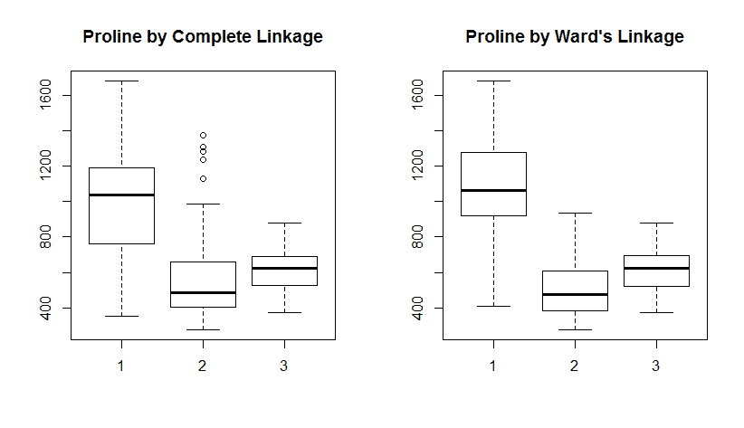

# 聚类分析

“快给我拿一杯酒来，让我润润嗓子，好说些聪明话。”

- 阿里斯托芬，雅典剧作家

在前面的章节中，我们专注于尝试学习最佳算法来解决结果或响应，例如，乳腺癌诊断或前列腺特异性抗原水平。在这些所有情况下，我们都有*y*，而*y*是*x*的函数，或者说*y = f(x)*。在我们的数据中，我们有实际的*y*值，我们可以相应地训练*x*。这被称为**监督学习**。然而，有许多情况下，我们试图从我们的数据中学习，要么我们没有*y*，要么我们实际上选择忽略它。如果是这样，我们就进入了**无监督学习**的世界。在这个世界里，我们根据算法如何解决我们的业务需求以及其准确性来构建和选择我们的算法。

为什么我们要尝试无监督学习呢？首先，无监督学习可以帮助你理解和识别数据中的模式，这可能很有价值。其次，你可以用它来转换你的数据，以改进你的监督学习技术。

本章将重点关注前者，下一章将关注后者。

因此，让我们从解决一种流行且强大的技术开始，这种技术被称为**聚类分析**。在聚类分析中，目标是把观测值分成若干组（k 组），其中组内成员尽可能相似，而组间成员尽可能不同。有许多例子说明这如何帮助一个组织；这里只列举几个：

+   创建客户类型或细分市场

+   在地理区域中检测高犯罪区域

+   图像和面部识别

+   基因测序和转录

+   石油和地质勘探

聚类分析有许多用途，但也有许多技术。我们将重点关注两种最常见的方法：**层次聚类**和**k-means 聚类**。它们都是有效的聚类方法，但可能并不总是适用于你可能需要分析的庞大且多样化的数据集。因此，我们还将使用基于**Gower**距离度量的**PAM（基于中位数聚类**）方法作为输入进行考察。最后，我们将考察一种我最近学习并应用的新方法，即使用**随机森林**来转换你的数据。转换后的数据可以随后用作无监督学习的输入。

在继续之前，我想说一句。你可能会被问及这些技术是否更像艺术而非科学，因为学习是无监督的。我认为明确的答案是，*这取决于*。在 2016 年初，我在印第安纳波利斯 R-用户组的会议上介绍了这些方法。我们一致认为，分析师和业务用户的判断使得无监督学习变得有意义，并决定了你最终算法中有三个还是四个聚类。这句话很好地总结了这一点：

“主要障碍在于难以在没有考虑上下文的情况下评估聚类算法：用户最初为什么要聚类他的数据，他打算用聚类做什么？我们认为聚类不应被视为一个独立于应用数学问题，而应始终在其最终使用的上下文中进行研究。”

- Luxburg et al. (2012)

# 层次聚类

层次聚类算法基于观测值之间的相似性度量。一个常见的度量，也是我们将使用的，是**欧几里得距离**。还有其他距离度量可供选择。

层次聚类是一种聚合或自下而上的技术。这意味着所有观测值都是它们自己的聚类。从那里开始，算法通过迭代地搜索所有成对点并找到最相似的两组聚类来继续进行。因此，第一次迭代后，有 *n-1* 个聚类，第二次迭代后有 *n-2* 个聚类，依此类推。

随着迭代的进行，重要的是要理解，除了距离度量之外，我们还需要指定观测值组之间的链接。不同类型的数据将要求你使用不同的聚类链接。当你尝试不同的链接时，你可能会发现某些链接可能会在一个或多个聚类中创建高度不平衡的观测值数量。例如，如果你有 30 个观测值，一种技术可能会创建一个只有一个观测值的聚类，无论你指定多少个总聚类。在这种情况下，你可能会需要做出判断，选择与数据和业务案例最合适的链接。

下表列出了常见的链接类型，但请注意，还有其他类型：

| **链接** | **描述** |
| --- | --- |
| 瓦德（Ward） | 这通过从聚类点到其重心的平方误差之和来最小化总聚类内方差 |
| 完全 | 两个聚类之间的距离是一个聚类中的观测值与另一个聚类中的观测值之间的最大距离 |
| 单个 | 两个聚类之间的距离是一个聚类中的观测值与另一个聚类中的观测值之间的最小距离 |
| 平均 | 两个聚类之间的距离是一个聚类中的观测值与另一个聚类中的观测值之间的平均距离 |
| 重心 | 两个聚类之间的距离是聚类重心的距离 |

层次聚类的输出将是一个**树状图**，它是一个类似树的图表，显示了各种聚类的排列。

正如我们将看到的，在确定聚类数量时，往往很难找到一个明确的断点。再次强调，你的决策应该是迭代的，并且要关注业务决策的背景。

# 距离计算

如前所述，欧几里得距离通常用于构建层次聚类的输入。让我们看看如何使用两个观察结果和两个变量/特征来计算它。

假设观察结果 *A* 的成本为 $5.00，重量为 3 磅。进一步，观察结果 *B* 的成本为 $3.00，重量为 5 磅。我们可以将这些值放入距离公式中：*A 和 B 之间的距离等于平方差的和的平方根*，在我们的例子中如下所示：

*d(A, B) = 平方根((5 - 3)² + (3 - 5)²)*，等于 *2.83*

2.83 的值本身并没有意义，但在其他成对距离的上下文中很重要。这个计算是 R 中 `dist()` 函数的默认值。你可以在函数中指定其他距离计算（最大值、曼哈顿距离、坎 berra 距离、二元距离和 Minkowski 距离）。我们不会深入探讨为什么或在哪里选择这些而不是欧几里得距离。这可能会非常特定于领域，例如，在欧几里得距离可能不足够的情况下，例如在基因组研究中。这将需要领域知识以及/或试错来确定适当的距离度量。

最后一点是要将你的数据缩放，使其均值为零，标准差为之一，以便距离计算具有可比性。如果不是这样，任何规模较大的变量将对距离产生更大的影响。

# K-means 聚类

在 k-means 中，我们需要指定我们想要的簇的确切数量。然后算法将迭代，直到每个观察结果只属于 k 个簇中的一个。算法的目标是最小化由平方欧几里得距离定义的簇内变异。因此，第 k 个簇的变异是所有成对观察结果的平方欧几里得距离之和除以簇中观察结果的数量。

由于涉及到的迭代过程，即使指定了相同的簇数量，一个 k-means 的结果也可能与另一个结果大相径庭。让我们看看这个算法是如何发挥作用的：

1.  **指定**你想要的簇的确切数量（k）。

1.  **初始化** K 个观察值被随机选择作为初始的**均值**。

1.  **迭代**：

    +   通过将每个观察结果分配给最近的簇中心（最小化簇内平方和）来创建 K 个簇

    +   每个簇的重心成为新的**均值**

    +   这将重复进行，直到收敛，即簇重心不再改变

如您所见，最终结果会因步骤 1 中的初始分配而变化。因此，运行多次初始启动并让软件识别最佳解决方案非常重要。在 R 中，这可以是一个简单的过程，我们将看到。

# Gower 和基于中位数划分

在你进行实际聚类分析时，可以迅速显现的一个事实是，层次聚类和 k-means 都不是专门设计来处理混合数据集的。混合数据，我指的是定量和定性数据，或者更具体地说，是名义、有序和区间/比率数据。

你将使用的多数数据集的现实情况是，它们可能包含混合数据。有几种处理方法，例如首先进行 **主成分分析**（PCA），以创建潜在变量，然后使用它们作为聚类的输入，或者使用不同的差异计算。我们将在下一章讨论 PCA。

利用 R 的强大和简洁性，你可以使用 **Gower** **距离系数**将混合数据转换为适当的特征空间。在此方法中，你甚至可以将因素作为输入变量。此外，与其使用 k-means，我建议使用 **PAM 聚类算法**。

PAM 与 k-means 非常相似，但提供了一些优势。以下列出如下：

+   首先，PAM 接受一个距离矩阵，这允许包含混合数据

+   其次，它对异常值和偏斜数据更稳健，因为它最小化差异之和而不是欧几里得距离平方之和（Reynolds，1992）

这并不是说你必须同时使用 Gower 和 PAM。如果你选择，你可以使用 Gower 系数进行层次聚类，我也看到过关于在 k-means 上下文中使用它的支持与反对的论点。此外，PAM 可以接受其他链接。然而，当它们配对时，它们成为处理混合数据的有效方法。在继续之前，让我们快速看一下这两个概念。

# Gower

Gower 系数比较案例成对，并计算它们之间的差异，这实际上是每个变量贡献的加权平均值。它被定义为两个称为 *i* 和 *j* 的案例，如下所示：


在这里，*S[ijk]* 是 *k* 个变量提供的贡献，而 *W[ijk]* 如果 *k* 个变量有效则为 1，否则为 *0*。

对于有序和连续变量，*S[ijk] = 1 - (x[ij] - x[ik] 的绝对值 / r[k])*，其中 *r[k]* 是 *k* 个变量的值域。

对于名义变量，如果 *x[ij] = x[jk]*，则 *S[ijk] = 1*，否则为 *0*。

对于二元变量，*S[ijk]* 根据属性是否存在（+）或不存在（-）来计算，如下表所示：

| **变量** | **属性 *k* 的值** |
| --- | --- |
| 案例 i | + | + | - | - |
| 案例 j | + | - | + | - |
| Sijk | 1 | 0 | 0 | 0 |
| Wijk | 1 | 1 | 1 | 0 |

# PAM

对于 **围绕中位数分区**，让我们首先定义一个 **中位数**。

中位数是集群中其他观测值之间差异最小化的观测值（在我们的情况下，使用 Gower 度量计算）。因此，与 k-means 类似，如果你指定五个集群，你将拥有五个数据分区。

为了最小化所有观测值与最近聚类中心的差异，PAM 算法迭代以下步骤：

1.  随机选择 k 个观测值作为初始聚类中心。

1.  将每个观测值分配给最近的聚类中心。

1.  交换每个聚类中心和非聚类中心观测值，计算差异成本。

1.  选择使总差异度最小的配置。

1.  重复步骤 2 至 4，直到聚类中心（medoids）没有变化。

Gower 和 PAM 都可以通过 R 中的`cluster`包调用。对于 Gower，我们将使用`daisy()`函数来计算差异矩阵，并使用`pam()`函数进行实际分区。有了这些，让我们开始对这些方法进行测试。

# 随机森林

就像我们在处理混合、实际上*杂乱*数据时使用 Gower 度量一样，我们也可以以无监督的方式应用随机森林。选择这种方法有一些优点：

+   对异常值和高度偏斜的变量具有鲁棒性

+   无需转换或缩放数据

+   处理混合数据（数值和因子）

+   可以容纳缺失数据

+   可以用于具有大量变量的数据，实际上，可以通过检查变量重要性来消除无用特征

+   生成的差异矩阵作为其他讨论过的技术（层次聚类、k 均值和 PAM）的输入。

有几点注意事项。调整随机森林以适应每个树分裂中采样的变量数量（函数中的`mtry = ?`）和生长的树的数量可能需要一些尝试和错误。研究表明，生长的树越多，在一定范围内，结果越好，一个好的起点是生长 2,000 棵树（Shi, T. & Horvath, S., 2006）。

这就是算法的工作原理，给定一个没有标签的数据集：

+   当前观察到的数据被标记为类别 1

+   创建一个与观察数据大小相同的第二（合成）观测值集；这是通过从观察数据的每个特征中随机采样创建的，所以如果你有 20 个观察特征，你将会有 20 个合成特征

+   数据的合成部分被标记为类别 2，这有助于将随机森林用作人工分类问题

+   创建一个随机森林模型来区分两个类别

+   将模型仅针对观察数据的临近度度量（合成数据现在被丢弃）转换为差异矩阵

+   利用差异矩阵作为聚类输入特征

那么这些临近度度量到底是什么呢？

临近度度量是所有观测值之间的成对度量。如果两个观测值最终落在树的同一个终端节点，它们的临近度得分等于一，否则为零。

在随机森林运行结束时，通过除以总树数来对观测数据的接近度得分进行归一化。得到的 NxN 矩阵包含介于零和一之间的得分，自然地，对角线值都是一。这就是全部内容。这是一个我认为被低估的有效技术，我希望我几年前就能学到。

# 商业理解

直到几周前，我才知道全世界不到 300 名认证的高级品酒师。由高级品酒师法庭管理的考试以其要求严格和高失败率而闻名。

几位追求认证的个人所经历的试验、磨难和回报在备受赞誉的纪录片《Somm》中有详细描述。因此，为了这次练习，我们将尝试帮助一个试图成为高级品酒师的人找到意大利葡萄酒中的潜在结构。

# 数据理解和准备

让我们从加载本章所需的 R 包开始。和往常一样，请确保您已经安装了它们：

```py
    > library(cluster) #conduct cluster analysis
    > library(compareGroups) #build descriptive statistic tables
    > library(HDclassif) #contains the dataset
    > library(NbClust) #cluster validity measures
    > library(sparcl) #colored dendrogram

```

数据集在 `HDclassif` 包中，这是我们安装的。因此，我们可以使用 `str()` 函数加载数据并检查其结构：

```py
    > data(wine)

    > str(wine)
    'data.frame':178 obs. of  14 variables:
     $ class: int  1 1 1 1 1 1 1 1 1 1 ...
     $ V1   : num  14.2 13.2 13.2 14.4 13.2 ...
     $ V2   : num  1.71 1.78 2.36 1.95 2.59 1.76 1.87 2.15 1.64 1.35 
       ...
     $ V3   : num  2.43 2.14 2.67 2.5 2.87 2.45 2.45 2.61 2.17 2.27 ...
     $ V4   : num  15.6 11.2 18.6 16.8 21 15.2 14.6 17.6 14 16 ...
     $ V5   : int  127 100 101 113 118 112 96 121 97 98 ...
     $ V6   : num  2.8 2.65 2.8 3.85 2.8 3.27 2.5 2.6 2.8 2.98 ...
     $ V7   : num  3.06 2.76 3.24 3.49 2.69 3.39 2.52 2.51 2.98 3.15 
       ...
     $ V8   : num  0.28 0.26 0.3 0.24 0.39 0.34 0.3 0.31 0.29 0.22 ...
     $ V9   : num  2.29 1.28 2.81 2.18 1.82 1.97 1.98 1.25 1.98 1.85 
       ...
     $ V10  : num  5.64 4.38 5.68 7.8 4.32 6.75 5.25 5.05 5.2 7.22 ...
     $ V11  : num  1.04 1.05 1.03 0.86 1.04 1.05 1.02 1.06 1.08 1.01 
       ...
     $ V12  : num  3.92 3.4 3.17 3.45 2.93 2.85 3.58 3.58 2.85 3.55 ...
     $ V13  : int  1065 1050 1185 1480 735 1450 1290 1295 1045 1045 ...

```

数据包括 `178` 种葡萄酒，其中包含 13 个化学成分变量和一个变量 `Class`，即品种或植物种类的标签。我们不会在聚类中使用这个变量，而是将其作为模型性能的测试。变量 `V1` 到 `V13` 是化学成分的测量值，如下所示：

+   `V1`: 酒精

+   `V2`: 苹果酸

+   `V3`: 灰分

+   `V4`: 灰分碱度

+   `V5`: 镁

+   `V6`: 总酚

+   `V7`: 黄酮类化合物

+   `V8`: 非黄酮酚

+   `V9`: 前花青素

+   `V10`: 颜色强度

+   `V11`: 色调

+   `V12`: OD280/OD315

+   `V13`: 精氨酸

变量都是定量变量。我们应该将它们重命名为对我们分析有意义的名称。这可以通过 `names()` 函数轻松完成：

```py
    > names(wine) <- c("Class", "Alcohol", "MalicAcid", "Ash", 
      "Alk_ash", "magnesium", "T_phenols", "Flavanoids", "Non_flav", 
        "Proantho", "C_Intensity", "Hue", "OD280_315", "Proline")

    > names(wine)
    [1] "Class"       "Alcohol"     "MalicAcid"   "Ash" 
    [5] "Alk_ash"     "magnesium"   "T_phenols"   "Flavanoids" 
    [9] "Non_flav"    "Proantho"    "C_Intensity" "Hue" 
    [13] "OD280_315"   "Proline" 

```

由于变量没有缩放，我们需要使用 `scale()` 函数进行缩放。这将首先将数据中心化，即从列中的每个个体中减去列的均值。然后，中心化值将除以相应列的标准差。我们还可以使用这种转换来确保我们只包括列 2 到 14，排除类别并将其放入数据框中。这都可以用一行代码完成：

```py
    > df <- as.data.frame(scale(wine[, -1]))

```

现在，检查结构以确保一切按计划进行：

```py
    > str(df)
    'data.frame':178 obs. of  13 variables:
     $ Alcohol    : num  1.514 0.246 0.196 1.687 0.295 ...
     $ MalicAcid  : num  -0.5607 -0.498 0.0212 -0.3458 0.2271 ...
     $ Ash        : num  0.231 -0.826 1.106 0.487 1.835 ...
     $ Alk_ash    : num  -1.166 -2.484 -0.268 -0.807 0.451 ...
     $ magnesium  : num  1.9085 0.0181 0.0881 0.9283 1.2784 ...
     $ T_phenols  : num  0.807 0.567 0.807 2.484 0.807 ...
     $ Flavanoids : num  1.032 0.732 1.212 1.462 0.661 ...
     $ Non_flav   : num  -0.658 -0.818 -0.497 -0.979 0.226 ...
     $ Proantho   : num  1.221 -0.543 2.13 1.029 0.4 ...
     $ C_Intensity: num  0.251 -0.292 0.268 1.183 -0.318 ...
     $ Hue        : num  0.361 0.405 0.317 -0.426 0.361 ...
     $ OD280_315  : num  1.843 1.11 0.786 1.181 0.448 ...
     $ Proline    : num  1.0102 0.9625 1.3912 2.328 -0.0378 ...

```

在继续之前，让我们快速制作一个表格，以查看品种或 `Class` 的分布情况：

```py
    > table(wine$Class)

    1  2  3 
    59 71 48

```

我们现在可以继续到过程的建模步骤。

# 建模与评估

在创建我们的数据框 `df` 之后，我们可以开始开发聚类算法。我们将从层次聚类开始，然后尝试 k-means 聚类。之后，我们需要稍微调整我们的数据，以展示如何将混合数据与 Gower 和随机森林结合。

# 层次聚类

要在 R 中构建层次聚类模型，你可以利用基础`stats`包中的`hclust()`函数。该函数的两个主要输入是一个距离矩阵和聚类方法。距离矩阵可以通过`dist()`函数轻松完成。对于距离，我们将使用欧几里得距离。有几种聚类方法可供选择，`hclust()`的默认方法是完全链接。

我们将尝试这种方法，但我还推荐 Ward 的链接方法。Ward 的方法倾向于产生具有相似观察数量的聚类。

完全链接方法导致任意两个聚类之间的距离是聚类中任意一个观察值与其他聚类中任意一个观察值之间的最大距离。Ward 的链接方法试图聚类观察值，以最小化聚类内的平方和。

值得注意的是，R 中的`ward.D2`方法使用的是平方欧几里得距离，这确实是 Ward 的链接方法。在 R 中，`ward.D`是可用的，但需要你的距离矩阵是平方值。由于我们将构建一个非平方值的距离矩阵，我们需要使用`ward.D2`。

现在，最大的问题是我们应该创建多少个聚类？正如引言中所述，简短且可能并不令人满意的答案是这取决于。尽管有聚类有效性度量可以帮助解决这个困境——我们将会探讨——但这实际上需要深入了解业务背景、基础数据和，坦白说，试错。由于我们的品酒师伙伴是虚构的，我们不得不依赖有效性度量。然而，这并不是选择聚类数量的万能药，因为存在几十种有效性度量。

由于探索大量聚类有效性度量方法的正负方面远远超出了本章的范围，我们可以转向几篇论文，甚至直接使用 R 来简化这个问题。Miligan 和 Cooper 在 1985 年发表的一篇论文探讨了 30 种不同的度量/指标在模拟数据上的表现。表现最好的前五种分别是 CH 指数、Duda 指数、C 指数、Gamma 指数和 Beale 指数。确定聚类数量的另一种著名方法是**gap 统计量**（Tibshirani, Walther, and Hastie, 2001）。如果你对聚类有效性感到好奇，这两篇论文是很好的参考资料。

使用 R，你可以使用`NbClust`包中的`NbClust()`函数来获取 23 个指标的结果，包括 Miligan 和 Cooper 的前五种和 gap 统计量。你可以在包的帮助文件中查看所有可用的指标列表。有两种方法可以处理这个过程：一种是你选择你喜欢的指标或指标集，并用 R 调用它们；另一种方法是将所有这些指标都包含在分析中，并采用多数规则方法，该函数会为你很好地总结。该函数还会生成一些图表。

阶段设置完毕后，让我们通过使用完全连接方法来举例说明。当使用该函数时，你将需要指定最小和最大簇数、距离度量以及索引，除了连接方式。正如你可以在下面的代码中看到的那样，我们将创建一个名为`numComplete`的对象。函数规范是欧几里得距离，最小簇数为两个，最大簇数为六个，完全连接，以及所有索引。当你运行命令时，该函数将自动生成一个类似于你在这里看到的输出--对图形方法和多数规则结论的讨论：

```py
    > numComplete <- NbClust(df, distance = "euclidean", min.nc = 2, 
       max.nc=6, method = "complete", index = "all")
    *** : The Hubert index is a graphical method of determining the 
       number of clusters.
    In the plot of Hubert index, we seek a significant knee that 
       corresponds to a significant increase of the value of the 
         measure that is the significant peak in Hubert index second 
           differences plot. 

    *** : The D index is a graphical method of determining the number 
       of clusters. 
    In the plot of D index, we seek a significant knee (the significant peak in Dindex second differences plot) that corresponds to a significant increase of the value of the measure. 

    ******************************************************************* 
    * Among all indices: 
    * 1 proposed 2 as the best number of clusters 
    * 11 proposed 3 as the best number of clusters 
    * 6 proposed 5 as the best number of clusters 
    * 5 proposed 6 as the best number of clusters 

    ***** Conclusion ***** 

    * According to the majority rule, the best number of clusters is 3

```

按照多数规则方法，我们会选择三个簇作为最佳解决方案，至少对于层次聚类来说是这样。产生的两个图表各包含两个图形。正如前面的输出所述，你正在寻找图（左侧的图形）中的显著拐点和右侧图形的峰值。这是**Hubert 指数**图：


你可以在左侧的图表中看到弯曲或膝盖出现在三个簇中。此外，右侧的图表在其峰值处也有三个簇。下面的**Dindex 图**提供了相同的信息：


你可以使用该函数调用多个值，其中有一个我想展示。这个输出是每个索引的最佳簇数以及对应簇数的索引值。这是通过`$Best.nc`完成的。我已经将输出简化为前九个索引：

```py
    > numComplete$Best.nc
                         KL      CH Hartigan   CCC    Scott
    Number_clusters  5.0000  3.0000   3.0000 5.000   3.0000
    Value_Index     14.2227 48.9898  27.8971 1.148 340.9634
                         Marriot   TrCovW   TraceW Friedman
    Number_clusters 3.000000e+00     3.00   3.0000   3.0000
    Value_Index     6.872632e+25 22389.83 256.4861  10.6941

```

你可以看到，第一个索引（`KL`）的最佳簇数是五个，下一个索引（`CH`）是三个。

以三个簇作为推荐选择，我们现在将计算距离矩阵并构建我们的层次聚类对象。此代码将构建距离矩阵：

```py
    > dis <- dist(df, method = "euclidean")

```

然后，我们将使用这个矩阵作为`hclust()`实际聚类的输入：

```py
    > hc <- hclust(dis, method = "complete")

```

展示层次聚类的一种常见方式是绘制**树状图**。我们将使用绘图函数来完成这个任务。请注意，`hang = -1`将观测值放置在图的最底部：

```py
    > plot(hc, hang = -1, labels = FALSE, main = "Complete-Linkage")

```


树状图是一种树形图，展示了单个观测值是如何聚在一起的。连接（分支，如果你愿意这样称呼）的排列告诉我们哪些观测值是相似的。分支的高度表示观测值之间的相似度或差异度。请注意，我指定了`labels = FALSE`。这样做是为了帮助解释，因为观测值的数量。在一个较小的数据集中，比如说不超过 40 个观测值，行名可以被显示。

为了帮助可视化聚类，你可以使用`sparcl`包生成彩色树状图。为了给适当数量的聚类着色，你需要使用`cutree()`函数将树状图切割到正确的聚类数量。这也会为每个观测值创建聚类标签：

```py
    > comp3 <- cutree(hc, 3)

```

现在，`comp3`对象在函数中用于构建彩色树状图：

```py
    > ColorDendrogram(hc, y = comp3, main = "Complete", branchlength = 50)

```


注意，我使用了`branchlength = 50`。这个值将根据你的数据而变化。既然我们有聚类标签，让我们构建一个显示每个聚类计数的表格：

```py
    > table(comp3)
    comp3
    1  2  3 
     69 58 51

```

出于好奇，让我们继续比较这种聚类算法与品种标签的对比：

```py
    > table(comp3,wine$Class)

    comp3  1  2  3
        1 51 18  0
        2  8 50  0
        3  0  3 48

```

在这个表格中，行是聚类，列是品种。这种方法在 84%的比率上匹配了品种标签。请注意，我们并不是试图使用聚类来预测品种，在这个例子中，我们没有先验理由将聚类与品种匹配。

我们现在将尝试 Ward 的连接。这与之前的代码相同；它首先尝试确定聚类数量，这意味着我们需要将方法更改为`Ward.D2`：

```py
    > numWard <- NbClust(df, diss = NULL, distance = "euclidean", 
      min.nc = 2, max.nc = 6, method = "ward.D2", index = "all") 
    *** : The Hubert index is a graphical method of determining the number of clusters.
    In the plot of Hubert index, we seek a significant knee that corresponds to a significant increase of the value of the measure i.e the significant peak in Hubert index second differences plot. 

    *** : The D index is a graphical method of determining the number of clusters. 
    In the plot of D index, we seek a significant knee (the significant peak in Dindex second differences plot) that corresponds to a significant increase of the value of the measure. 

    ******************************************************************* 
    * Among all indices: 
    * 2 proposed 2 as the best number of clusters 
    * 18 proposed 3 as the best number of clusters 
    * 2 proposed 6 as the best number of clusters 

    ***** Conclusion ***** 

    * According to the majority rule, the best number of clusters is 3

```

这次，大多数规则也是针对三个聚类解决方案的。查看 Hubert 指数，最佳解决方案也是三个聚类：


Dindex 进一步支持三个聚类解决方案：


让我们继续进行实际的聚类和 Ward 连接的树状图生成：

```py
    > hcWard <- hclust(dis, method = "ward.D2")

    > plot(hcWard, labels = FALSE, main = "Ward's-Linkage")

```


图表显示了三个大小大致相等的明显不同的聚类。让我们统计一下聚类的大小，并将其与品种标签相关联：

```py
    > ward3 <- cutree(hcWard, 3)
    > table(ward3, wine$Class)

    ward3  1  2  3
        1 59  5  0
        2  0 58  0
        3  0  8 48

```

因此，第一个聚类有 64 个观测值，第二个聚类有`58`个，第三个聚类有 56 个。这种方法比使用完全连接法更接近品种分类。

通过另一个表格，我们可以比较两种方法如何匹配观测值：

```py
    > table(comp3, ward3)
         ward3
    comp3  1  2  3
        1 53 11  5
        2 11 47  0
        3  0  0 51

```

虽然每种方法中的第三个聚类非常接近，但其他两个则不然。现在的问题是，我们如何识别这些差异以进行解释？在许多例子中，数据集非常小，你可以查看每个聚类的标签。在现实世界中，这通常是不可能的。一种好的比较方法是使用`aggregate()`函数，对统计量如`mean`或中位数进行汇总。此外，我们不是在缩放数据上操作，而是尝试在原始数据上操作。在函数中，你需要指定数据集、按什么进行聚合以及汇总统计量：

```py
    > aggregate(wine[, -1], list(comp3), mean)
      Group.1  Alcohol MalicAcid      Ash  Alk_ash magnesium T_phenols
    1       1 13.40609  1.898986 2.305797 16.77246 105.00000  2.643913
    2       2 12.41517  1.989828 2.381379 21.11724  93.84483  2.424828
    3       3 13.11784  3.322157 2.431765 21.33333  99.33333  1.675686
      Flavanoids  Non_flav Proantho C_Intensity       Hue OD280_315  Proline
    1  2.6689855 0.2966667 1.832899    4.990725 1.0696522  2.970000 984.6957
    2  2.3398276 0.3668966 1.678103    3.280345 1.0579310  2.978448 573.3793
    3  0.8105882 0.4443137 1.164314    7.170980 0.6913725  1.709804 622.4902

```

这为我们提供了每个数据中的 13 个变量的聚类平均数。完成完全连接后，让我们尝试 Ward 的方法：

```py
    > aggregate(wine[, -1], list(ward3), mean)
      Group.1  Alcohol MalicAcid      Ash  Alk_ash magnesium T_phenols
    1       1 13.66922  1.970000 2.463125 17.52812 106.15625  2.850000
    2       2 12.20397  1.938966 2.215172 20.20862  92.55172  2.262931
    3       3 13.06161  3.166607 2.412857 21.00357  99.85714  1.694286
      Flavanoids  Non_flav Proantho C_Intensity      Hue OD280_315   Proline
    1  3.0096875 0.2910937 1.908125    5.450000 1.071406  3.158437 1076.0469
    2  2.0881034 0.3553448 1.686552    2.895345 1.060000  2.862241  501.4310
    3  0.8478571 0.4494643 1.129286    6.850179 0.721000  1.727321  624.9464

```

数字非常接近。Ward 方法的第一聚类的所有变量值都略有偏高。对于 Ward 方法的第二个聚类，除了色调外，平均值都较小。这将是与具有领域专业知识的人分享以协助解释的内容。我们可以通过绘制两种方法的变量值按聚类来帮助这一努力。

一个用于比较分布的好图是 **箱线图**。箱线图将显示最小值、第一四分位数、中位数、第三四分位数、最大值和潜在的异常值。

让我们假设我们对每种聚类方法的 `Proline` 值感兴趣，构建一个包含两个箱线图的比较图。首先要做的事情是为显示并排的图形准备我们的绘图区域。这是通过 `par()` 函数完成的：

```py
    > par(mfrow =c (1, 2))

```

这里，我们指定了想要一行两列，使用 `mfrow = c(1, 2))`。如果你想要两行一列，那么应该是 `mfrow = c(2, 1))`。在 `boxplot()` 函数中，我们需要指定 *y* 轴的值是 *x* 轴值的函数，使用波浪号 `~` 符号：

```py
    > boxplot(wine$Proline ~ comp3, data = wine, 
              main="Proline by Complete Linkage")

    > boxplot(wine$Proline ~ ward3, data = wine, 
              main = "Proline by Ward's Linkage")

```



观察箱线图，粗箱代表第一四分位数、中位数（箱中的粗横线），以及第三四分位数，这是 **四分位距**。虚线线的两端，通常被称为 **胡须**，代表最小值和最大值。你可以看到在完全连接的第二个聚类中，最大值上方有五个小圆圈。这些被称为 **疑似异常值**，计算结果大于或等于四分位距加减 1.5 倍。

任何大于或等于四分位距加减三倍的值都被认为是异常值，并以实心黑色圆圈表示。就其本身而言，Ward 连接的第一个和第二个聚类的四分位距更紧密，没有疑似异常值。

观察每个变量的箱线图可能有助于你，领域专家可以确定最佳层次聚类方法。考虑到这一点，让我们继续到 k-means 聚类。

# K-means 聚类

正如我们在层次聚类中所做的那样，我们也可以使用 `NbClust()` 来确定 k-means 的最佳聚类数量。你只需要在函数中指定 `kmeans` 作为方法。让我们也将最大聚类数量放宽到 `15`。以下输出已被简化为仅包含多数规则部分：

```py
    > numKMeans <- NbClust(df, min.nc = 2, max.nc = 15, method = 
      "kmeans")
    * Among all indices: 
    * 4 proposed 2 as the best number of clusters 
    * 15 proposed 3 as the best number of clusters 
    * 1 proposed 10 as the best number of clusters 
    * 1 proposed 12 as the best number of clusters 
    * 1 proposed 14 as the best number of clusters 
    * 1 proposed 15 as the best number of clusters 

    ***** Conclusion ***** 

    * According to the majority rule, the best number of clusters is 3

```

再次，三个聚类似乎是最优解。这是 Hubert 图，它证实了这一点：


在 R 中，我们可以使用 `kmeans()` 函数来进行这项分析。除了输入数据外，我们还需要指定我们正在解决的聚类数量以及随机分配的值，即 `nstart` 参数。我们还需要指定一个随机种子：

```py
    > set.seed(1234)

    > km <- kmeans(df, 3, nstart = 25)

```

创建簇的表格让我们对观测值在它们之间的分布有一个概念：

```py
    > table(km$cluster)

    1  2  3 
    62 65 51

```

每个簇的观测数是均衡的。我在许多情况下看到，在更大的数据集和更多的变量中，没有任何数量的 k-means 算法能产生有希望和令人信服的结果。分析聚类的另一种方法是查看每个簇中每个变量的簇中心矩阵：

```py
    > km$centers
         Alcohol  MalicAcid        Ash    Alk_ash   magnesium   T_phenols
    1  0.8328826 -0.3029551  0.3636801 -0.6084749  0.57596208  0.88274724
    2 -0.9234669 -0.3929331 -0.4931257  0.1701220 -0.49032869 -0.07576891
    3  0.1644436  0.8690954  0.1863726  0.5228924 -0.07526047 -0.97657548
       Flavanoids    Non_flav    Proantho C_Intensity        Hue  OD280_315
    1  0.97506900 -0.56050853  0.57865427   0.1705823  0.4726504  0.7770551
    2  0.02075402 -0.03343924  0.05810161  -0.8993770  0.4605046  0.2700025
    3 -1.21182921  0.72402116 -0.77751312   0.9388902 -1.1615122 -1.2887761
         Proline
    1  1.1220202
    2 -0.7517257
    3 -0.4059428

```

注意，簇一的平均酒精含量较高。让我们制作一个箱线图，以查看酒精含量的分布情况，就像我们之前做的那样，并与之比较 Ward 的：

```py

    > boxplot(wine$Alcohol ~ km$cluster, data = wine, 
              main = "Alcohol Content, K-Means")

    > boxplot(wine$Alcohol ~ ward3, data = wine, 
              main = "Alcohol Content, Ward's")

```


每个簇的酒精含量几乎完全相同。从表面上看，这告诉我三个簇是葡萄酒的适当潜在结构，使用 k-means 或层次聚类之间几乎没有差异。最后，让我们比较 k-means 簇与品种：

```py
    > table(km$cluster, wine$Class)

         1  2  3
      1 59  3  0
      2  0 65  0
      3  0  3 48

```

这与 Ward 方法产生的分布非常相似，任何一个都可能被我们的假设品酒师接受。

然而，为了演示如何在具有数值和非数值值的数据上聚类，让我们再看一些例子。

# Gower 和 PAM

开始这一步之前，我们需要稍微整理一下数据。由于这种方法可以接受因子变量，我们将酒精含量转换为高或低含量。这只需要一行代码，利用`ifelse()`函数将变量转换为因子。这将实现的是，如果酒精含量大于零，它将被标记为`High`，否则为`Low`：

```py
    > wine$Alcohol <- as.factor(ifelse(df$Alcohol > 0, "High", "Low"))

```

现在，我们准备使用`cluster`包中的`daisy()`函数创建相似性矩阵，并指定方法为`gower`：

```py
    > disMatrix <- daisy(wine[, -1], metric = "gower")

```

创建簇对象——让我们称它为`pamFit`——是通过`cluster`包中的`pam()`函数完成的。在这个例子中，我们将创建三个簇并创建一个簇大小的表格：

```py
    > set.seed(123)

    > pamFit <- pam(disMatrix, k = 3)

    > table(pamFit$clustering)

    1  2  3 
    63 67 48

```

现在，让我们看看它与品种标签相比的表现如何：

```py
    > table(pamFit$clustering, wine$Class)

         1  2  3
      1 57  6  0
      2  2 64  1
      3  0  1 47

```

让我们利用`compareGroups`包的力量，将这个解决方案构建成一个描述性统计表。在基础 R 中，创建令人印象深刻的表格可能相当困难，而这个包提供了一个出色的解决方案。第一步是使用包中的`compareGroups()`函数创建一个按簇的描述性统计对象。然后，使用`createTable()`，我们将统计信息转换为一个易于导出的表格，我们将以.csv 格式完成。如果您愿意，也可以将表格导出为 PDF、HTML 或 LaTeX 格式：

```py
    > wine$cluster <- pamFit$clustering

    > group <- compareGroups(cluster ~ ., data = wine)

    > clustab <- createTable(group)

    > clustab

    --------Summary descriptives table by 'cluster'---------

 __________________________________________________________ 
 1           2            3      p.overall 
 N=63         N=67         N=48 
 ¯¯¯¯¯¯¯¯¯¯¯¯¯¯¯¯¯¯¯¯¯¯¯¯¯¯¯¯¯¯¯¯¯¯¯¯¯¯¯¯¯¯¯¯¯¯¯¯¯¯¯¯¯¯¯¯¯¯ 
 Class         1.10 (0.30)  1.99 (0.21)  2.98 (0.14) <0.001 
 Alcohol:                                            <0.001 
 High     63 (100%)    1 (1.49%)   28 (58.3%) 
 Low     0 (0.00%)   66 (98.5%)   20 (41.7%) 
 MalicAcid     1.98 (0.83)   1.92 (0.90) 3.39 (1.05) <0.001 
 Ash           2.42 (0.27)   2.27 (0.31) 2.44 (0.18)  0.001 
 Alk_ash       17.2 (2.73)   20.2 (3.28) 21.5 (2.21) <0.001 
 magnesium     105  (11.6)   95.6 (17.2) 98.5 (10.6)  0.001 
 T_phenols     2.82 (0.36)   2.24 (0.55) 1.68 (0.36) <0.001 
 Flavanoids    2.94 (0.47)   2.07 (0.70) 0.79 (0.31) <0.001 
 Non_flav      0.29 (0.08)   0.36 (0.12) 0.46 (0.12) <0.001 
 Proantho      1.86 (0.47)   1.64 (0.59) 1.17 (0.41) <0.001 
 C_Intensity   5.41 (1.31)   3.05 (0.89) 7.41 (2.29) <0.001 
 Hue           1.07 (0.13)   1.05 (0.20) 0.68 (0.12) <0.001 
 OD280_315     3.10 (0.39)   2.80 (0.53) 1.70 (0.27) <0.001 
 Proline       1065 (280)     533 (171)   628 (116)  <0.001 
 comp_cluster  1.16 (0.37)   1.81 (0.50) 3.00 (0.00) <0.001 
¯¯¯¯¯¯¯¯¯¯¯¯¯¯¯¯¯¯¯¯¯¯¯¯¯¯¯¯¯¯¯¯¯¯¯¯¯¯¯¯¯¯¯¯¯¯¯¯¯¯¯¯¯¯¯¯¯¯

```

此表显示了每个簇中因子水平的比例，对于数值变量，均值和标准差显示在括号中。要将表格导出为`.csv`文件，只需使用`export2csv()`函数：

```py
    > export2csv(clustab,file = "wine_clusters.csv")

```

如果你打开这个文件，你会得到这个表格，它有利于进一步分析，并且可以很容易地用于演示目的：


最后，我们将使用随机森林创建一个相似性矩阵，并使用 PAM 创建三个聚类。

# 随机森林和 PAM

要在 R 中执行此方法，你可以使用`randomForest()`函数。在设置随机种子后，只需创建模型对象。在以下代码中，我指定了树的数量为`2000`并将邻近度度量设置为`TRUE`：

```py
 > set.seed(1) 
 > rf <- randomForest(x = wine[, -1], ntree = 2000, proximity = T) 
 > rf

 Call:
 randomForest(x = wine[, -1], ntree = 2000, proximity = T) 
 Type of random forest: unsupervised
 Number of trees: 2000
 No. of variables tried at each split: 3

```

如你所见，调用`rf`并没有提供任何有意义的输出，除了在每个分割中采样的变量（`mtry`）。让我们检查矩阵的前五行和前五行：

```py
> dim(rf$proximity)
[1] 178 178

> rf$proximity[1:5, 1:5]
 1         2         3          4          5
1 1.0000000 0.2593985 0.2953586 0.36013986 0.17054264
2 0.2593985 1.0000000 0.1307420 0.16438356 0.11029412
3 0.2953586 0.1307420 1.0000000 0.29692833 0.23735409
4 0.3601399 0.1643836 0.2969283 1.00000000 0.08076923
5 0.1705426 0.1102941 0.2373541 0.08076923 1.00000000

```

想象这些值的一种方式是，它们是这两个观察值出现在相同终端节点中的百分比！查看变量重要性，我们发现转换后的酒精输入可以删除。我们将为了简单起见保留它：

```py
 > importance(rf)
 MeanDecreaseGini
 Alcohol      0.5614071
 MalicAcid    6.8422540
 Ash          6.4693717
 Alk_ash      5.9103567
 magnesium    5.9426505
 T_phenols    6.2928709
 Flavanoids   6.2902370
 Non_flav     5.7312940
 Proantho     6.2657613
 C_Intensity  6.5375605
 Hue          6.3297808
 OD280_315    6.4894731
 Proline      6.6105274

```

现在只是创建相似性矩阵的问题，它将邻近度值（*平方根（1 - 邻近度）*）转换为以下形式：

```py
 > dissMat <- sqrt(1 - rf$proximity)

 > dissMat[1:2, 1:2]
 1         2
 1 0.0000000 0.8605821
 2 0.8605821 0.0000000

```

现在我们有了输入特征，让我们像之前一样运行 PAM 聚类：

```py
 > set.seed(123)

 > pamRF <- pam(dissMat, k = 3)

 > table(pamRF$clustering)

 1  2  3 
 62 68 48 

 > table(pamRF$clustering, wine$Class)

 1 2 3
 1 57  5  0
 2  2 64  2
 3  0  2 46

```

这些结果与其他应用的技术相当。你能通过调整随机森林来提高结果吗？

如果你有一个聚类问题的杂乱数据，考虑使用随机森林。

# 摘要

在本章中，我们开始探索无监督学习技术。我们专注于聚类分析，旨在提供数据降维和对观察值的数据理解。

介绍了四种方法：传统的层次聚类和 k-means 聚类算法，以及 PAM，结合了两种不同的输入（Gower 和随机森林）。我们将这四种方法应用于来自三个不同品种的意大利葡萄酒的结构，并检查了结果。

在下一章中，我们将继续探索无监督学习，但我们将专注于在变量之间寻找结构，而不是在观察值之间寻找结构，以便创建可用于监督学习问题的新特征。
