# 第九章：主成分分析

“有些人滑向冰球，我滑向冰球将要到达的地方。”

- 沃伊恩·格雷茨基

本章是第二章，我们将重点关注无监督学习技术。在前一章中，我们介绍了聚类分析，它为我们提供了相似观察值的分组。在本章中，我们将看到如何通过将相关变量分组为主成分分析（**PCA**）来降低数据的维度并提高对数据的理解。然后，我们将使用主成分进行监督学习。

在许多数据集中，尤其是在社会科学领域，你会看到许多变量之间高度相关。它们还可能遭受高维度的困扰，或者如人们所熟知的，**维度诅咒**。这是一个问题，因为估计函数所需的样本数量会随着输入特征数量的指数增长。在这样的数据集中，可能存在一些变量是冗余的，因为它们最终测量的是相同的结构，例如，收入和贫困或抑郁和焦虑。因此，目标是使用 PCA 来创建一个较小的变量集，该集能够从原始变量集中捕获大部分信息，从而简化数据集，并经常导致隐藏的洞察。这些新变量（主成分）彼此之间高度不相关。除了监督学习之外，使用这些成分进行数据可视化也非常常见。

在使用 PCA 进行或支持分析超过十年的经验中，我发现它被广泛使用，但理解得却很差，尤其是在那些不进行分析但消费结果的人中。理解你正在从其他相关变量中创建一个新变量是直观的。然而，这项技术本身却笼罩在可能被误解的术语和数学概念中，这些概念往往会使外行人感到困惑。本意在于通过涵盖以下内容，提供一个关于其是什么以及如何使用的良好基础：

+   准备 PCA 数据集

+   执行 PCA

+   选择我们的主成分

+   使用主成分构建预测模型

+   使用预测模型进行样本外预测

# 主成分概述

PCA 是寻找主成分的过程。这些究竟是什么？

我们可以将一个成分视为特征的正则化线性组合（詹姆斯，2012）。数据集中的第一个主成分是捕获数据中最大方差线性组合。第二个成分是通过选择另一个最大化方差且其方向与第一个成分垂直的线性组合来创建的。后续的成分（等于变量的数量）将遵循相同的规则。

这里有几个要点。这个定义描述了**线性组合**，这是 PCA 中的一个关键假设。如果您尝试将 PCA 应用于变量相关性较低的数据集，您很可能会得到一个没有意义的分析。另一个关键假设是变量的均值和方差是足够的统计量。这告诉我们，数据应该符合正态分布，这样协方差矩阵就能完全描述我们的数据集，即**多元正态性**。PCA 对非正态分布的数据相当稳健，甚至可以与二元变量一起使用，因此结果仍然可解释。

现在，这里描述的这个方向是什么，线性组合是如何确定的？掌握这个主题的最好方式是通过可视化。让我们用一个包含两个变量的小型数据集进行绘图。PCA 对尺度敏感，因此数据已经被缩放到均值为零和标准差为一。您可以在下面的图中看到，这些数据恰好形成一个椭圆形，其中的钻石代表每个观测值：

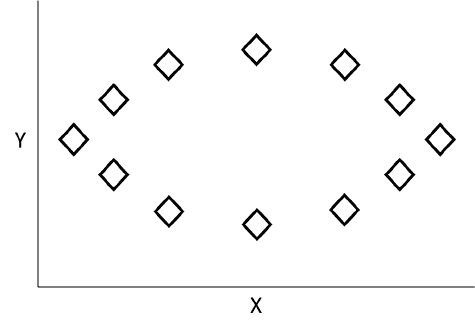

观察图表，数据在*x*轴上具有最大的方差，因此我们可以画一条虚线来表示我们的**第一个主成分**，如下面的图像所示。这个成分是两个变量的线性组合，或*PC1 = α[11]X[1] + α[12]X[2]*，其中系数权重是变量在主成分上的载荷。它们构成了数据变化最大的方向的基础。这个方程受*1*的限制，以防止选择任意高的值。另一种看法是，虚线最小化了它自身与数据点之间的距离。这个距离在几个点上用箭头表示，如下所示：

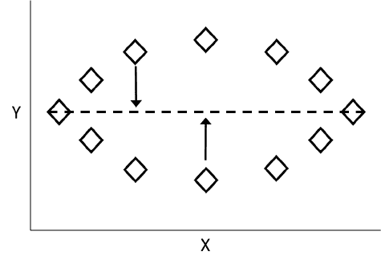

然后，以相同的方式计算**第二个主成分**，但它与第一个主成分不相关，也就是说，它的方向与第一个主成分成直角或正交。以下图显示了添加为虚线的第二个主成分：

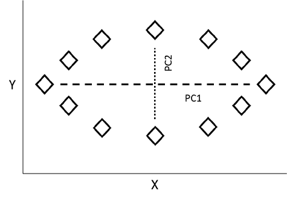

对于每个变量的主成分载荷计算完成后，算法将为我们提供主成分得分。这些得分是针对每个观测值和每个主成分计算的。对于**PC1**和第一个观测值，这相当于以下公式：*Z[11] = α[11] * (X[11] - X[1]的平均值) + α[12] * (X[12] - X[2]的平均值)*。对于**PC2**和第一个观测值，方程将是*Z[12] = α[21] * (X[11] - X[2]的平均值) + α[22] * (X[12] - X[2]的平均值)*。这些主成分得分现在是新特征空间，用于您将要进行的任何分析。

回想一下，该算法将创建与变量数量一样多的主成分，解释了 100%的可能方差。那么，我们如何缩小这些成分的范围，以实现最初的目标呢？有一些启发式方法可以使用，在即将到来的建模过程中，我们将探讨具体细节；但选择主成分的一个常见方法是如果其**特征值**大于一。虽然特征值和**特征向量**估计背后的代数超出了本书的范围，但讨论它们是什么以及如何在主成分分析（PCA）中使用它们是很重要的。

优化的线性权重是通过线性代数确定的，以便创建所谓的特征向量。它们是最优的，因为没有其他可能的权重组合能比它们更好地解释变化。因此，主成分的特征值就是它在整个数据集中解释的总变化量。

回想一下，第一个主成分的方程是 *PC1 = α[11]X[1] + α[12]X[2]*。

由于第一个主成分解释了最大的变化量，它将具有最大的特征值。第二个成分将具有第二高的特征值，依此类推。因此，一个大于一的特征值表明主成分解释的方差比任何原始变量单独解释的方差都要多。如果你将所有特征值的总和标准化为 1，你将得到每个成分解释的总方差的百分比。这将也有助于你确定一个合适的截止点。

特征值标准并不是一个铁的规则，必须与你对数据和业务问题的了解相平衡。一旦你选择了主成分的数量，你就可以旋转它们，以便简化它们的解释。

# 旋转

是否应该旋转？如前所述，旋转通过修改每个变量的负载来帮助解释主成分。旋转后的成分所解释的总方差不会改变，但每个成分对总方差贡献的变化会改变。通过旋转，你会发现负载值要么远离零，要么靠近零，从理论上讲，这有助于识别对每个主成分重要的变量。这是尝试将一个变量与一个主成分关联起来的尝试。记住，这是无监督学习，所以你试图理解你的数据，而不是测试某个假设。简而言之，旋转有助于你在这个努力中。

最常见的主成分旋转形式被称为**方差最大化（varimax）**。还有其他形式，如**四分最大化（quartimax）**和**等最大化（equimax）**，但我们将专注于方差最大化旋转。根据我的经验，我从未见过其他方法提供更好的解决方案。你自己的试错可能是决定这个问题的最佳方式。

使用方差最大化（varimax），我们最大化了平方负载量的总和。方差最大化过程旋转了特征空间的轴及其坐标，而不改变数据点的位置。

也许，最好的演示方式是通过另一个简单的说明。假设我们有一个变量 **A** 到 **G** 的数据集，并且有两个主成分。绘制这些数据，我们将得到以下示意图：

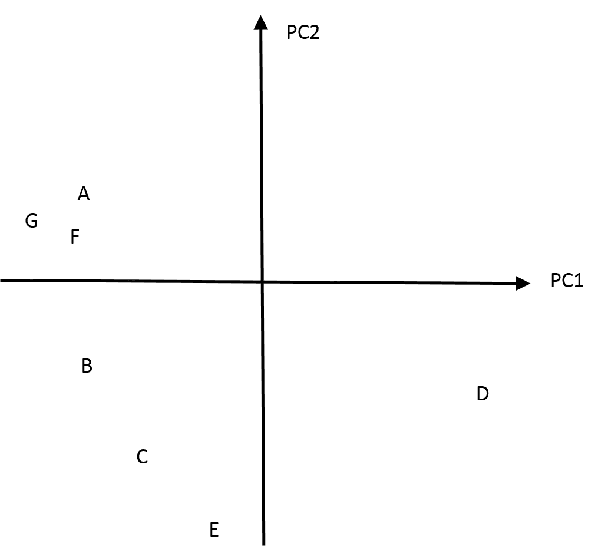

为了辩论的目的，让我们假设变量 A 的负载量在 **PC1** 上为 -0.4，在 **PC2** 上为 0.1。现在，让我们假设变量 D 的负载量在 PC1 上为 0.4，在 **PC2** 上为 -0.3。对于点 E，负载量分别为 -0.05 和 -0.7。请注意，负载量将遵循主成分的方向。在运行方差最大化过程后，旋转的成分将如下所示：

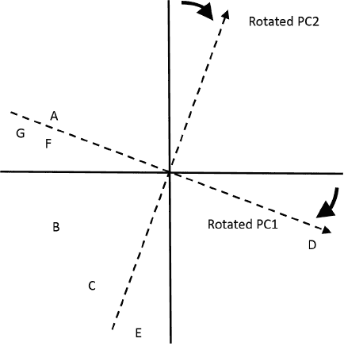

以下是旋转后的 **PC1** 和 **PC2** 上的新负载量：

+   变量 **A**：-0.5 和 0.02

+   变量 **D**：0.5 和 -0.3

+   变量 **E**：0.15 和 -0.75

负载量已改变，但数据点没有。通过这个简单的说明，我们可以说我们没有简化解释，但这应该有助于你理解主成分旋转过程中发生的事情。

# 商业理解

在这个例子中，我们将深入体育界；特别是，**国家曲棍球联盟**（**NHL**）。在棒球（想想那本书和电影《点球成金》）和足球方面已经做了很多工作；两者都是美国人玩的用脚踢的球类运动。对我来说，没有比曲棍球更好的观赏性运动了。也许这只是一个在北达科他州的冰冻草原上长大的产物。无论如何，我们可以将这次分析视为我们开始 MoneyPuck 运动的努力。

在这次分析中，我们将查看我从 [www.nhl.com](http://www.nhl.com) 和 [www.puckalytics.com](http://www.puckalytics.com) 整理的数据集中 30 支 NHL 球队的统计数据。目标是构建一个模型，从使用 PCA 开发的输入特征空间预测球队的积分总和，以便为我们提供一些关于成为顶级职业球队所需条件的见解。我们将从 2015-16 赛季学习模型，该赛季匹兹堡企鹅队夺冠，然后测试其在截至 2017 年 2 月 15 日的本赛季结果上的性能。文件是 `nhlTrain.csv` 和 `nhlTest.csv`，位于 [`github.com/datameister66/data/`](https://github.com/datameister66/data/)。

NHL 排名基于积分系统，因此我们的结果将是每场比赛的球队积分。了解 NHL 如何向球队颁发积分很重要。与足球或棒球不同，只有胜负计算，职业曲棍球为每场比赛使用以下积分系统：

+   胜者无论是在常规时间、加时赛还是通过加时赛后的点球大战中获胜，都将获得两分

+   一位正规比赛的输家不会得分

+   加时赛或点球大战的输家获得一分；所谓的**输家得分**

纳什维尔曲棍球联盟在 2005 年开始实施这个得分系统，它并非没有争议，但它并没有损害比赛的优雅和优雅的暴力。

# 数据理解和准备

首先，我们将加载必要的包以便下载数据并进行分析。请在加载之前确保已安装这些包：

```py
 > library(ggplot2) #support scatterplot

    > library(psych) #PCA package 

```

假设你已经将两个`.csv`文件放入了你的工作目录，因此使用`read.csv()`函数读取训练数据：

```py
 > train <- read.csv("NHLtrain.csv") 

```

使用结构函数`str()`检查数据。为了简洁，我只包括了命令输出的前几行：

```py
    > str(train)
    'data.frame': 30 obs. of 15 variables:
    $ Team : Factor w/ 30 levels "Anaheim","Arizona",..: 1 2 3 4 5 6 7 
      8 9 10 ...
    $ ppg : num 1.26 0.95 1.13 0.99 0.94 1.05 1.26 1 0.93 1.33 ...
    $ Goals_For : num 2.62 2.54 2.88 2.43 2.79 2.39 2.85 2.59 2.6 3.23 
      ...
    $ Goals_Against: num 2.29 2.98 2.78 2.62 3.13 2.7 2.52 2.93 3.02 
      2.78 ...

```

我们接下来需要做的是查看变量名。

```py
    > names(train)
    [1] "Team" "ppg" "Goals_For" "Goals_Against" "Shots_For" 
 [6] "Shots_Against" "PP_perc" "PK_perc" "CF60_pp" "CA60_sh" 
 [11] "OZFOperc_pp" "Give" "Take" "hits" "blks"

```

让我们来看看它们代表什么：

+   `Team`: 这是球队的所在城市

+   `ppg`: 根据之前讨论的点数计算方法，每场比赛的平均得分

+   `Goals_For`: 每场比赛球队的平均进球数

+   `Goals_Against`: 每场比赛允许的进球数

+   `Shots_For`: 每场比赛的射门次数

+   `Shots_Against`: 每场比赛对手的射门次数

+   `PP_perc`: 球队得分的机会百分比

+   `PK_perc`: 当对手在加时赛中时，球队不允许进球的时间百分比

+   `CF60_pp`: 在加时赛中，球队每 60 分钟的平均 Corsi 得分；Corsi 得分是射门次数（Shots_For）、射门未命中和被对方挡住的射门次数之和

+   `CA60_sh`: 在对手加时赛中，对手每 60 分钟的 Corsi 得分，即球队处于少人状态

+   `OZFOperc_pp`: 当球队在加时赛中时，在进攻区发生的争球次数的百分比

+   `Give`: 每场比赛球队失去球权的平均次数

+   `Take`: 每场比赛球队获得球权的平均次数

+   `hits`: 每场比赛球队的平均身体冲撞次数

+   `blks`: 每场比赛球队挡住对方射门次数的平均值

我们需要将数据标准化，使其均值为 0，标准差为 1。一旦完成，我们就可以使用 psych 包中的`cor.plot()`函数创建和绘制输入特征的关联图：

```py
    > train.scale <- scale(train[, -1:-2])

    > nhl.cor <- cor(train.scale)

    > cor.plot(nhl.cor)

```

下面的输出是前面命令的结果：

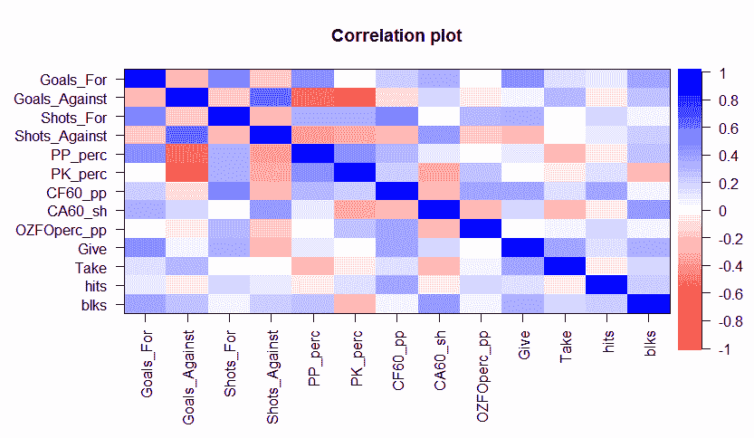

有几个有趣的事情。注意`Shots_For`与`Goals_For`相关，反之亦然，`Shots_Against`与`Goals_Against`相关。还有一些与`PP_perc`和`PK_perc`与`Goals_Against`的负相关。

因此，这应该是一个足够的数据集来提取几个主成分。

请注意，这些是我根据我的兴趣选择的特征/变量。你可以收集很多不同的统计数据，看看你是否能提高预测能力。

# 建模和评估

对于建模过程，我们将遵循以下步骤：

1.  提取成分并确定要保留的数量。

1.  旋转保留的成分。

1.  解释旋转后的解。

1.  创建因子得分。

1.  将得分作为回归分析的输入变量，并在测试数据上评估性能。

在 R 中进行 PCA（主成分分析）有许多不同的方法和包，包括看起来在基础 R 中最常用的`prcomp()`和`princomp()`函数。然而，对我来说，`psych`包似乎是最灵活且选项最好的。

# 成分提取

要使用`psych`包提取成分，你将使用`principal()`函数。语法将包括数据和我们是否想要在此时刻旋转成分：

```py
    > pca <- principal(train.scale, rotate="none")

```

你可以通过调用我们创建的`pca`对象来检查成分。然而，我的主要意图是确定应该保留多少个成分。为此，一个斜率图就足够了。斜率图可以帮助你评估解释数据中最大方差成分。它在*x*轴上显示`成分`编号，在*y*轴上显示它们相关的`特征值`：

```py
    > plot(pca$values, type="b", ylab="Eigenvalues", xlab="Component")

```

以下是在先前的命令输出：

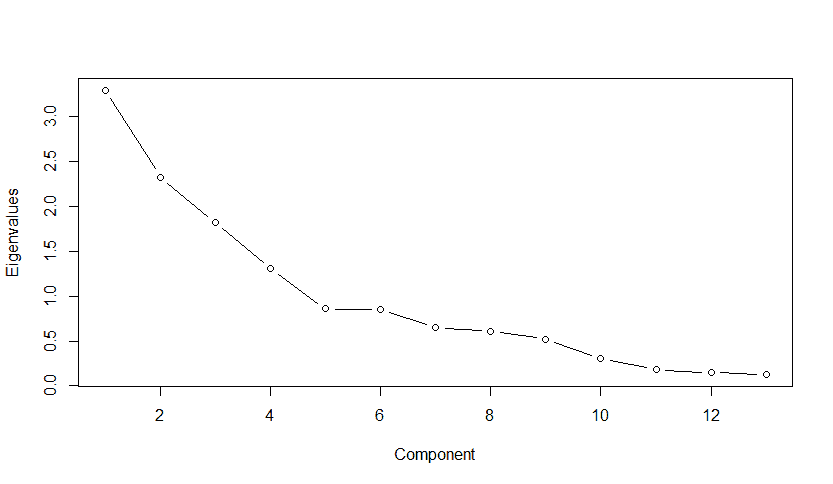

你要找的是斜率图中的一个点，其变化率降低。这通常被称为图中的“肘部”或“弯曲”。图中的这个肘部点捕捉到的事实是，一个成分额外解释的方差与下一个成分的方差差异不大。换句话说，它是图变平的断点。在这个图中，五个成分看起来相当有说服力。

这些年我学到的另一条规则是，你应该捕捉到大约 70%的总方差，这意味着每个选定的成分所解释的累积方差占所有成分解释的方差的 70%。

# 正交旋转和解释

正如我们之前讨论的，旋转的目的是最大化变量在特定成分上的负荷，这有助于通过减少/消除这些成分之间的相关性来简化解释。进行正交旋转的方法被称为“`varimax`”。还有其他非正交旋转方法允许因素/成分之间的相关性。你将在职业中使用的旋转方法的选择应基于相关文献，这超出了本章的范围。请随意尝试这个数据集。我认为，在不确定的情况下，任何 PCA 的起点应该是正交旋转。

对于这个过程，我们将简单地回到`principal()`函数，稍微改变语法以考虑 5 个成分和正交旋转，如下所示：

```py
 > pca.rotate <- principal(train.scale, nfactors = 5, rotate = 
      "varimax")    

 > pca.rotate
    Principal Components Analysis
    Call: principal(r = train.scale, nfactors = 5, rotate = "varimax")
    Standardized loadings (pattern matrix) based upon correlation 
      matrix
                    RC1   RC2    RC5   RC3    RC4    h2    u2  com
    Goals_For     -0.21  0.82   0.21  0.05  -0.11  0.78  0.22  1.3
    Goals_Against  0.88 -0.02  -0.05  0.21   0.00  0.82  0.18  1.1
    Shots_For     -0.22  0.43   0.76 -0.02  -0.10  0.81  0.19  1.8
    Shots_Against  0.73 -0.02  -0.20 -0.29   0.20  0.70  0.30  1.7
    PP_perc       -0.73  0.46  -0.04 -0.15   0.04  0.77  0.23  1.8
    PK_perc       -0.73 -0.21   0.22 -0.03   0.10  0.64  0.36  1.4
    CF60_pp       -0.20  0.12   0.71  0.24   0.29  0.69  0.31  1.9
    CA60_sh        0.35  0.66  -0.25 -0.48  -0.03  0.85  0.15  2.8
    OZFOperc_pp   -0.02 -0.18   0.70 -0.01   0.11  0.53  0.47  1.2
    Give          -0.02  0.58   0.17  0.52   0.10  0.65  0.35  2.2
    Take           0.16  0.02   0.01  0.90  -0.05  0.83  0.17  1.1
    hits          -0.02 -0.01   0.27 -0.06   0.87  0.83  0.17  1.2
    blks           0.19  0.63  -0.18  0.14   0.47  0.70  0.30  2.4

                       RC1  RC2  RC5  RC3  RC4
SS loadings           2.69 2.33 1.89 1.55 1.16
Proportion Var        0.21 0.18 0.15 0.12 0.09
Cumulative Var        0.21 0.39 0.53 0.65 0.74
Proportion Explained  0.28 0.24 0.20 0.16 0.12
Cumulative Proportion 0.28 0.52 0.72 0.88 1.00

```

在输出中，有两个重要的事情需要消化。第一个是五个成分（标记为`RC1`至`RC5`）的变量载荷。我们看到成分一中的`Goals_Against`和`Shots_Against`具有高正载荷，而`PP_perc`和`PK_perc`具有高负载荷。成分二的较高载荷是`Goals_For`。成分五具有与`Shots_For`、`ff`和`OZFOperc_pp`的高载荷。成分三似乎只与变量 take 有关，而成分四与击球有关。接下来，我们将继续进行第二部分的检查：从平方和`SS loadings`开始的表格。在这里，数字是每个成分的特征值。当它们被归一化时，你将得到`Proportion Explained`行，正如你可能猜到的，这代表每个成分解释的方差比例。你可以看到，成分一解释了五个旋转成分解释的所有方差的 28%。记住，我上面提到的一个启发式规则是，你选择的成分应该解释至少 70%的总变异。如果你查看`Cumulative Var`行，你会发现这五个旋转成分解释了 74%的总变异，我们可以有信心我们有了正确数量的模型来继续前进。

# 从组成部分创建因子得分

现在，我们需要捕获旋转成分的载荷作为每个团队的因子得分。这些得分表明每个观测值（在我们的案例中，是 NHL 球队）如何与旋转成分相关。让我们这样做，并将得分捕获在数据框中，因为我们将需要它来进行回归分析：

```py
 > pca.scores <- data.frame(pca.rotate$scores)

 > head(pca.scores)
 RC1          RC2        RC5         RC3        RC4
 1 -2.21526408  0.002821488  0.3161588  -0.1572320  1.5278033
 2  0.88147630 -0.569239044 -1.2361419  -0.2703150 -0.0113224
 3  0.10321189  0.481754024  1.8135052  -0.1606672  0.7346531
 4 -0.06630166 -0.630676083 -0.2121434  -1.3086231  0.1541255
 5  1.49662977  1.156905747 -0.3222194   0.9647145 -0.6564827
 6 -0.48902169 -2.119952370  1.0456190   2.7375097 -1.3735777

```

现在我们有了每个团队每个成分的得分。这些只是每个观测值（在我们的案例中，是 NHL 球队）的变量乘以每个成分的载荷，然后求和。现在我们可以将响应（`ppg`）作为一个列添加到数据中。

```py
 > pca.scores$ppg <- train$ppg 

```

完成这些后，我们现在将转向预测模型。

# 回归分析

要完成这个过程的一部分，我们将重复第二章中的步骤和代码，*线性回归 - 机器学习的技巧和策略*。如果你还没有这样做，请查看第二章中的*线性回归 - 机器学习的技巧和策略*，以了解如何解释以下输出。

我们将使用以下`lm()`函数创建我们的线性模型，将所有因子作为输入，然后总结结果：

```py
 > nhl.lm <- lm(ppg ~ ., data = pca.scores)
 > summary(nhl.lm)

 Call:
 lm(formula = ppg ~ ., data = pca.scores)

 Residuals:
 Min        1Q   Median       3Q      Max 
 -0.163274 -0.048189 0.003718 0.038723 0.165905 

 Coefficients:
 Estimate       Std. Error t value Pr(>|t|) 
 (Intercept) 1.111333   0.015752  70.551  < 2e-16  ***
 RC1        -0.112201   0.016022  -7.003  3.06e-07 ***
 RC2         0.070991   0.016022   4.431  0.000177 ***
 RC5         0.022945   0.016022   1.432  0.164996 
 RC3        -0.017782   0.016022  -1.110  0.278044 
 RC4        -0.005314   0.016022  -0.332  0.743003 
 ---
Signif. codes: 0 ‘***’ 0.001 ‘**’ 0.01 ‘*’ 0.05 ‘.’ 0.1 ‘ ’ 1

Residual standard error: 0.08628 on 24 degrees of freedom
Multiple R-squared: 0.7502, Adjusted R-squared: 0.6981 
F-statistic: 14.41 on 5 and 24 DF, p-value: 1.446e-06 

```

好消息是，我们的整体模型在统计学上高度显著，`p-value`为`1.446e-06`，而`Adjusted R-squared`接近 70%。坏消息是，有三个组成部分并不显著。我们可以简单地选择将它们保留在我们的模型中，但让我们看看如果我们排除它们，只保留**RC1**和**RC2**会发生什么：

```py
 > nhl.lm2 <- lm(ppg ~ RC1 + RC2, data = pca.scores)
 > summary(nhl.lm2)

 Call:
 lm(formula = ppg ~ RC1 + RC2, data = pca.scores)

 Residuals:
 Min       1Q  Median      3Q     Max 
 -0.18914 -0.04430 0.01438 0.05645 0.16469 

 Coefficients:
 Estimate Std. Error t value  Pr(>|t|) 
 (Intercept) 1.11133    0.01587  70.043   < 2e-16  ***
 RC1        -0.11220    0.01614  -6.953   1.8e-07  ***
 RC2         0.07099    0.01614   4.399   0.000153 ***
 ---
Signif. codes: 0 ‘***’ 0.001 ‘**’ 0.01 ‘*’ 0.05 ‘.’ 0.1 ‘ ’ 1

Residual standard error: 0.0869 on 27 degrees of freedom
Multiple R-squared: 0.7149, Adjusted R-squared: 0.6937 
F-statistic: 33.85 on 2 and 27 DF, p-value: 4.397e-08 

```

这个模型仍然实现了大致相同的调整后的 R 平方值（93.07%），并且具有统计上显著的因子系数。我将省略运行诊断测试的细节。相反，让我们看看一些图表，以便更好地检验我们的分析。我们可以使用基本的 R 图形进行预测值和实际值的散点图，如下所示：

```py
 > plot(nhl.lm2$fitted.values, train$ppg,
 main="Predicted versus Actual",
 xlab="Predicted",ylab="Actual") 

```

下面的输出是前面命令的结果：

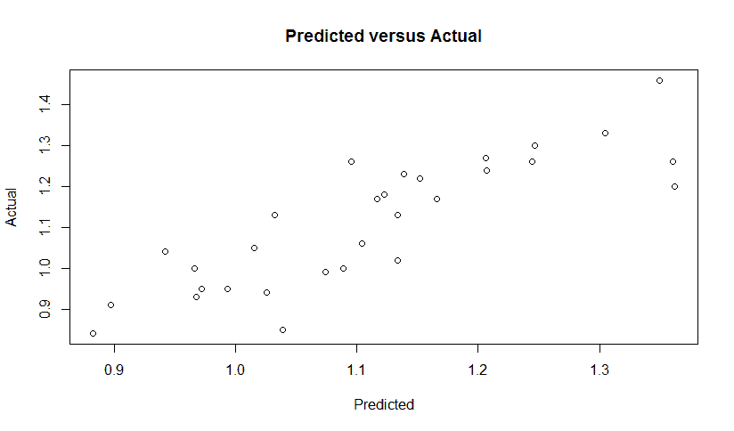

这证实了我们的模型在用两个成分预测团队成功方面做得很好，同时也突出了主成分和每场比赛团队得分之间的强线性关系。让我们通过使用`ggplot2`包进行散点图并包含团队名称来提高一个档次。唯一的问题是这是一个功能非常强大的函数，有很多选项。有大量的在线资源可以帮助你导航`ggplot()`迷宫，但这段代码应该能帮助你入门。让我们首先创建我们的基线图并将其分配给一个名为`p`的对象，然后添加各种绘图功能。

```py
 > train$pred <- round(nhl.lm2$fitted.values, digits = 2)

 > p <- ggplot(train, aes(x = pred,
 y = ppg,
 label = Team))

 > p + geom_point() +
 geom_text(size = 3.5, hjust = 0.1, vjust = -0.5, angle = 0) +
 xlim(0.8, 1.4) + ylim(0.8, 1.5) +
 stat_smooth(method = "lm", se = FALSE) 

```

下面的输出是前面命令的结果：

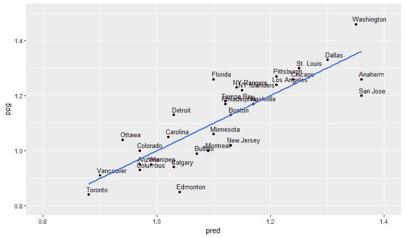

创建`p`的语法非常简单。我们只是指定了数据框，并在`aes()`中放入我们想要的`x`和`y`以及我们想要用作标签的变量。然后我们只是添加了数据点等整洁的层。通过在语法中包含`+`，你可以将任何你想要的内容添加到图表中，如下所示：

```py
    > p + geom_point() +

```

我们指定了`team`标签的显示方式。要调整字体大小和位置，需要大量的尝试和错误：

```py
    geom_text() +

```

现在，指定*x*轴和*y*轴的极限，否则图表将裁剪掉任何超出这些极限的观测值，如下所示：

```py
    xlim() + ylim() +

```

最后，我们添加了一条没有标准误差阴影的最佳拟合线：

```py
    stat_smooth(method = "lm", se = FALSE)

```

我想一种思考这个图表的方法是，位于线下方的团队表现不佳，而位于上方的团队表现超出预期。

另一项分析是将团队与他们的因子分数进行关系绘图，这被称为**双图**。再次，`ggplot()`简化了这项分析。以之前的代码为指南，让我们更新它并看看结果如何：

```py
 > pca.scores$Team <- train$Team

 > p2 <- ggplot(pca.scores, aes(x = RC1, y = RC2, label = Team))

 > p2 + geom_point() +
 geom_text(size = 2.75, hjust = .2, vjust = -0.75, angle = 0) +
 xlim(-2.5, 2.5) + ylim(-3.0, 2.5) 

```

前面命令的输出如下：

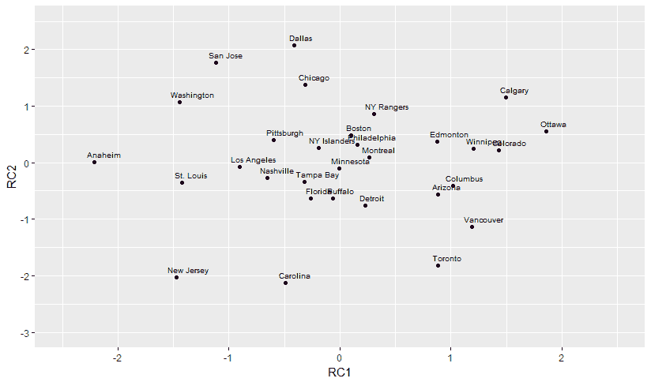

如您所见，*x* 轴是 RC1 的团队得分，而 *y* 轴是 RC2 的得分。看看 Anaheim ducks，RC1 的得分最低，而 RC2 的平均得分。现在考虑一下这种影响。由于 RC1 的加时赛和罚球防守的负负荷以及 `Goals_Against` 的正负荷，这表明该队在防守方面表现良好，并且有效利用了少人作战。顺便说一句，匹兹堡队是最终的 Stanley Cup 赢家。他们的得分很稳定，但没有什么值得注意的。记住，该队在赛季初表现糟糕，解雇了他们赛季初的教练。比较他们在赛季上半场和下半场在这项分析中的表现将很有趣。

您可以像我们之前做的那样评估模型误差。让我们看看**均方根误差**（**RMSE**）：

```py
 > sqrt(mean(nhl.lm2$residuals²))
 [1] 0.08244449

```

在完成这些之后，我们需要看看它在样本外的表现。我们将加载测试数据，预测组件上的团队得分，然后基于线性模型做出预测。来自 psych 包的 `predict` 函数将自动缩放测试数据：

```py
 > test <- read.csv("NHLtest.csv")
 > test.scores <- data.frame(predict(pca.rotate, test[, c(-1:-2)]))
 > test.scores$pred <- predict(nhl.lm2, test.scores)

```

我认为我们应该像上面那样绘制结果，显示团队名称。让我们把这些都放入一个数据框中：

```py
 > test.scores$ppg <- test$ppg

 > test.scores$Team <- test$Team

```

然后，利用 `ggplot()` 的力量：

```py
 > p <- ggplot(test.scores, aes(x = pred,
 y = ppg,
 label = Team)) 

 > p + geom_point() + 
 geom_text(size=3.5, hjust=0.4, vjust = -0.9, angle = 35) + 
 xlim(0.75, 1.5) + ylim(0.5, 1.6) +
 stat_smooth(method="lm", se=FALSE)

```

前一个命令的输出如下：

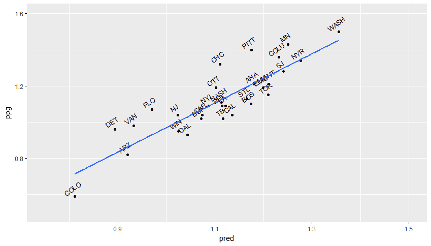

我在测试数据中简化了团队名称，以便更容易理解。我们的每场比赛得分领先者是华盛顿首都队，而最差的球队是科罗拉多雪崩队。事实上，当我提取这些数据时，科罗拉多已经连续输了五场比赛。他们最终在加时赛中击败了卡罗来纳队，打破了连败。

最后，让我们检查一下均方根误差（RMSE）。

```py
 > resid <- test.scores$ppg - test.scores$pred

 > sqrt(mean(resid²))
 [1] 0.1011561

```

样本误差为 0.1，而样本内误差为 0.08，这并不坏。我认为我们可以宣布这是一个有效的模型。然而，我们还可以添加大量的团队统计数据来提高预测能力和减少误差。我会继续努力，也希望你们也是如此。

# 摘要

在本章中，我们通过探索主成分分析（PCA），检查其是什么，并以实际方式应用它，再次尝试无监督学习技术。我们探讨了它如何用于在面临众多高度相关的变量时降低数据集的维度并提高对其的理解。然后，我们将它应用于来自国家曲棍球联盟的真实数据，使用得到的特征成分在回归分析中预测总团队得分。此外，我们还探讨了可视化数据和特征成分的方法。

作为一种无监督学习技术，它需要一些判断以及试错，以达到一个业务伙伴可以接受的优化解决方案。尽管如此，它是一个强大的工具，可以提取潜在见解并支持监督学习。

我们接下来将探讨如何使用无监督学习来开发市场篮子分析和推荐引擎，其中主成分分析（PCA）可以发挥重要作用。
