# 第十章：购物篮分析、推荐引擎和序列分析

通过加倍转换率来加倍你的业务，比通过加倍流量要容易得多。

- BuyerLegends.com 首席执行官 杰夫·艾森伯格

我没在 Whole Foods 的人脸上看到笑容。

- 沃伦·巴菲特

要不观察我们即将在本章讨论的每种技术每天的结果，人们就得住在月亮的阴暗面。如果你访问 [www.amazon.com](http://www.amazon.com)，在 [www.netflix.com](http://www.netflix.com) 观看电影，或者访问任何零售网站，你都会在每个角落遇到诸如“相关产品”、“因为你观看了...”、“购买 *x* 的顾客也购买了 *y*”或“为您推荐”等术语。有了大量历史实时或接近实时信息，零售商利用这里讨论的算法试图增加买家的购买数量和价值。

实现这些技巧的方法可以分为两类：关联规则和推荐引擎。关联规则分析通常被称为购物篮分析，因为人们试图了解哪些商品是共同购买的。在推荐引擎中，目标是根据客户之前评分的观看或购买的商品提供他们可能会喜欢的其他商品。

另一种企业可以使用的技巧是了解你购买或使用他们产品和服务的时间顺序。这被称为序列分析。这种方法的非常常见的实现方式是了解客户如何点击各种网页和/或链接。

在接下来的例子中，我们将努力探索如何使用 R 开发这样的算法。我们不会涵盖它们的实现，因为这超出了本书的范围。我们将从一个杂货店的购买习惯的购物篮分析开始，然后深入构建基于网站评论的推荐引擎，最后分析网页的顺序。

# 购物篮分析概述

购物篮分析是一种数据挖掘技术，其目的是找到产品或服务的最佳组合，并允许营销人员利用这种知识提供推荐、优化产品摆放或开发利用交叉销售的营销计划。简而言之，想法是识别哪些商品搭配得好，并从中获利。

你可以把分析的结果看作一个 `if...then` 语句。如果一个顾客购买了飞机票，那么他们购买酒店房间的概率是 46%，如果他们继续购买酒店房间，那么他们租车的概率是 33%。

然而，它不仅用于销售和营销。它还被用于欺诈检测和医疗保健；例如，如果一个患者接受了治疗 A，那么他们可能会表现出症状 X 的概率为 26%。在进入细节之前，我们应该看看一些术语，因为它们将在示例中使用：

+   **项集**：这是数据集中一个或多个项目的集合。

+   **支持度**：这是数据中包含感兴趣项集的交易比例。

+   **置信度**：这是如果一个人购买了或做了 x，他们将会购买或做 y 的条件概率；做 x 的行为被称为*前提*或左侧（LHS），而 y 是*结果*或右侧（RHS）。

+   **提升度**：这是 x 和 y 同时发生的支持度与它们独立发生的概率之比。它是**置信度**除以 x 的概率乘以 y 的概率；例如，如果我们有 x 和 y 同时发生的概率为 10%，x 的概率为 20%，y 的概率为 30%，那么提升度将是 10%（20%乘以 30%）或 16.67%。

你可以在 R 中使用的用于执行市场篮子分析的包是**arules: Mining Association Rules and Frequent Itemsets**。该包提供两种不同的查找规则的方法。为什么会有不同的方法？简单地说，如果你有大量数据集，检查所有可能的产品组合可能会变得计算成本高昂。该包支持的算法是**apriori**和**ECLAT**。还有其他算法可以进行市场篮子分析，但 apriori 使用得最频繁，因此，我们将重点关注它。

在 apriori 中，原则是，如果一个项集是频繁的，那么它的所有子集也必须是频繁的。最小频率（支持度）是在执行算法之前由分析师确定的，一旦确定，算法将按以下方式运行：

+   令 *k=1*（项目数量）

+   生成等于或大于指定支持度的项集长度

+   迭代 *k + (1...n)*，剪枝那些不频繁的（小于支持度）

+   当没有新的频繁项集被识别时停止迭代

一旦你有了最频繁项集的有序摘要，你可以通过检查置信度和提升度来继续分析过程，以识别感兴趣的关联。

# 商业理解

对于我们的业务案例，我们将专注于识别杂货店的关联规则。数据集将来自`arules`包，称为`Groceries`。这个数据集包含了一个现实世界杂货店 30 天内的实际交易，包括 9,835 种不同的购买。所有购买的物品都被放入 169 个类别中的一个，例如，面包、酒、肉类等等。

假设我们是一家初创精酿啤酒厂，试图在这家杂货店取得突破，并希望了解潜在顾客会与啤酒一起购买什么。这种知识可能正好帮助我们确定店内正确的产品摆放位置，或者支持交叉销售活动。

# 数据理解和准备

对于这次分析，我们只需要加载两个包，以及`Groceries`数据集：

```py
    > library(arules)

    > library(arulesViz)

    > data(Groceries) 
    > head(Groceries) 
    transactions in sparse format with
     9835 transactions (rows) and
     169 items (columns)

    > str(Groceries)
    Formal class 'transactions' [package "arules"] with 3 slots
      ..@ data :Formal class 'ngCMatrix' [package "Matrix"] with 5 
        slots
      .. .. ..@ i : int [1:43367] 13 60 69 78 14 29 98 24 15 29 ...
      .. .. ..@ p : int [1:9836] 0 4 7 8 12 16 21 22 27 28 ...
      .. .. ..@ Dim : int [1:2] 169 9835
      .. .. ..@ Dimnames:List of 2
      .. .. .. ..$ : NULL
      .. .. .. ..$ : NULL
      .. .. ..@ factors : list()
      ..@ itemInfo :'data.frame': 169 obs. of 3 variables:
      .. ..$ labels: chr [1:169] "frankfurter" "sausage" "liver loaf" 
        "ham" ...
      .. ..$ level2: Factor w/ 55 levels "baby food","bags",..: 44 44 
      44 44 44 44
      44 42 42 41 ...
      .. ..$ level1: Factor w/ 10 levels "canned food",..: 6 6 6 6 6 6 
      6 6 6 6 
      ...
      ..@ itemsetInfo:'data.frame': 0 obs. of 0 variables

```

这个数据集的结构是一个稀疏矩阵对象，称为`transaction`类。

因此，一旦结构变成交易类，我们的标准探索技术将不再适用，但`arules`包为我们提供了其他探索数据的技术。顺便提一下，如果你有一个数据框或矩阵，并想将其转换为`transaction`类，你可以使用简单的语法，通过`as()`函数实现。

以下代码仅用于说明，请勿运行：

`> # transaction.class.name <- as(current.data.frame,"transactions")`。

探索这些数据最好的方式是使用`arules`包中的`itemFrequencyPlot()`函数制作项目频率图。你需要指定交易数据集、要绘制频率最高的项目数量，以及是否需要绘制项目的相对或绝对频率。让我们首先查看绝对频率和前`10`个商品：

```py
    > itemFrequencyPlot(Groceries, topN = 10, type = "absolute")

```

前一个命令的输出如下：

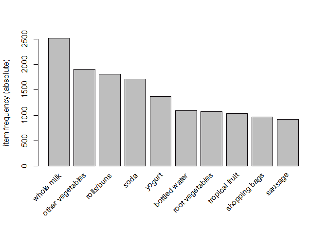

购买最多的商品是**全脂牛奶**，在 9,836 笔交易中有大约**2,500**笔。为了显示前 15 个商品的相对分布，让我们运行以下代码：

```py
    > itemFrequencyPlot(Groceries, topN = 15)

```

前一个命令的输出如下：

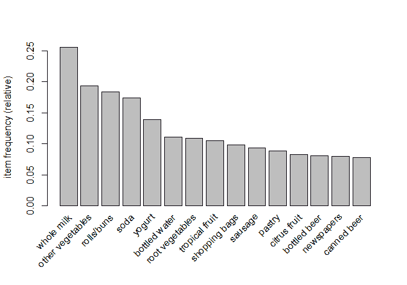

殊不知，在这里我们看到啤酒作为第 13 和第 15 大购买商品出现在这家商店。大约 10%的交易包含了**瓶装啤酒**和/或**罐装啤酒**的购买。

对于这个练习的目的，我们实际上需要做的就这么多，因此，我们可以直接进入建模和评估阶段。

# 建模和评估

我们将首先挖掘数据以获取整体关联规则，然后再转向针对啤酒的具体规则。在整个建模过程中，我们将使用 apriori 算法，这是`arules`包中名为`apriori()`的适当命名的函数。在函数中，我们需要指定的主要两件事是数据集和参数。至于参数，在指定最小支持度、置信度以及项目集的最小和/或最大长度时，你需要运用判断力。使用项目频率图，结合试错法，我们将最小支持度设置为 1000 笔交易中的 1，最小置信度设置为 90%。此外，我们将关联的项目数量上限设置为四个。以下是我们将创建的名为`rules`的对象的代码：

```py
    > rules <- apriori(Groceries, parameter = list(supp = 0.001, conf = 
      0.9, maxlen=4))

```

调用对象显示了算法产生的规则数量：

```py
    > rules
    set of 67 rules

```

有许多方法可以检查规则。我首先推荐的是，使用基础 R 中的`options()`函数将显示的数字位数设置为仅两位。然后，根据它们提供的提升度对前五条规则进行排序和检查，如下所示：

```py
    > options(digits = 2)

    > rules <- sort(rules, by = "lift", decreasing = TRUE)

    > inspect(rules[1:5])
      lhs                 rhs                support confidence lift
    1 {liquor, red/blush wine}     => {bottled beer}      0.0019       
       0.90 11.2
    2 {root vegetables, butter, cream cheese }      => {yogurt}            
       0.0010       0.91  6.5
    3 {citrus fruit, root vegetables, soft cheese}=> {other vegetables}  
       0.0010       1.00  5.2
    4 {pip fruit, whipped/sour cream, brown bread}=> {other vegetables}  
       0.0011       1.00  5.2
    5 {butter,whipped/sour cream, soda}    => {other vegetables}  
       0.0013       0.93  4.8

```

看看，提供最佳整体提升度的规则是购买`酒`和`红酒`的概率，基于购买`瓶装啤酒`。我必须承认，这完全是巧合，并不是我故意为之。正如我经常说的，幸运比好更重要。尽管如此，这仍然不是一个非常常见的交易，支持率仅为每 1,000 次交易中有 1.9 次。

你也可以按支持和置信度排序，所以让我们看看按`confidence`降序排列的前`5`条`规则`，如下所示：

```py
    > rules <- sort(rules, by = "confidence", decreasing = TRUE) 
    > inspect(rules[1:5])
      lhs             rhs                support confidence lift
    1 {citrus fruit, root vegetables, soft cheese}=> {other vegetables}  
      0.0010          1  5.2
    2 {pip fruit, whipped/sour cream, brown bread}=> {other vegetables}  
      0.0011          1  5.2
    3 {rice, sugar}  => {whole milk}        0.0012          1  3.9
    4 {canned fish, hygiene articles} => {whole milk} 0.0011   1  3.9
    5 {root vegetables, butter, rice} => {whole milk} 0.0010   1  3.9

```

你可以在表中看到，这些交易的`confidence`为 100%。继续到我们具体的啤酒研究，我们可以利用`arules`中的函数来开发交叉表——`crossTable()`函数——然后检查任何适合我们需求的内容。第一步是创建一个包含我们的数据集的表：

```py
    > tab <- crossTable(Groceries)

```

使用 `tab` 创建后，我们现在可以检查项目之间的联合出现情况。在这里，我们将只查看前三个行和列：

```py
    > tab[1:3, 1:3]
                frankfurter sausage liver loaf
    frankfurter         580      99          7
    sausage              99     924         10
    liver loaf            7      10         50

```

如你所想，购物者在 9,835 次交易中只选择了 50 次肝肉饼。此外，在`924`次中，人们倾向于选择`香肠`，`10`次他们感到不得不抓取`肝肉饼`。（在绝望的时刻需要采取绝望的措施！）如果你想查看一个具体的例子，你可以指定行和列号，或者只拼写那个项目：

```py
    > table["bottled beer","bottled beer"]
    [1] 792

```

这告诉我们有`792`次交易是`瓶装啤酒`。让我们看看`瓶装啤酒`和`罐装啤酒`之间的联合出现情况：

```py
    > table["bottled beer","canned beer"]
    [1] 26

```

我预计这会很低，因为它支持我的观点，即人们倾向于从瓶装或罐装中喝酒。我强烈偏好瓶装。这也使得它成为一件方便的武器，可以用来保护自己免受所有这些流氓抗议者，如占领华尔街和类似的人。

我们现在可以继续前进，并推导出针对`瓶装啤酒`的具体规则。我们再次使用`apriori()`函数，但这次，我们将在`appearance`周围添加语法。这意味着我们将在语法中指定，我们想要左侧是增加购买`瓶装啤酒`概率的项目，这些项目将位于右侧。在下面的代码中，请注意我已经调整了`support`和`confidence`数字。请随意尝试你自己的设置：

```py
 > beer.rules <- apriori(data = Groceries, parameter = list(support 
      = 0.0015, confidence = 0.3), appearance = list(default = "lhs",
        rhs = "bottled beer"))

    > beer.rules
    set of 4 rules

```

我们发现自己只有`4`条关联规则。我们已经看到了其中之一；现在让我们按提升度降序引入其他三条规则：

```py
    > beer.rules <- sort(beer.rules, decreasing = TRUE, by = "lift")

    > inspect(beer.rules)
      lhs                   rhs            support confidence lift
    1 {liquor, red/blush wine} => {bottled beer}  0.0019  0.90 11.2
    2 {liquor}               => {bottled beer}    0.0047  0.42  5.2
    3 {soda, red/blush wine} => {bottled beer}    0.0016  0.36  4.4
    4 {other vegetables, red/blush wine} => {bottled beer}0.0015 0.31  
      3.8

```

在所有这些实例中，购买 `瓶装啤酒` 与酒精饮料相关联，无论是 `烈酒` 和/或 `红酒`，这对任何人来说都不足为奇。有趣的是，这里没有 `白葡萄酒`。让我们更仔细地看看这一点，并比较 `瓶装啤酒` 和葡萄酒类型的联合出现：

```py
    > tab["bottled beer", "red/blush wine"]
    [1] 48

    > tab["red/blush wine", "red/blush wine"]
    [1] 189

    > 48/189
    [1] 0.25

    > tab["white wine", "white wine"]
    [1] 187

    > tab["bottled beer", "white wine"]
    [1] 22

    > 22/187
    [1] 0.12

```

有趣的是，25% 的时间，当有人购买 `红酒` 时，他们也购买了 `瓶装啤酒`；但与 `白葡萄酒` 相比，联合购买只发生在 12% 的情况下。我们当然不知道在这个分析中为什么，但这可能有助于我们确定如何在这个杂货店定位我们的产品。在我们继续之前，还有一个事情要看看规则的图。这是通过 `arulesViz` 包中的 `plot()` 函数完成的。

有许多图形选项可用。对于这个例子，让我们指定我们想要一个 `图形`，显示 `提升` 和由 `信心` 提供和阴影的规则。以下语法将相应地提供：

```py
    > plot(beer.rules, method = "graph", measure = "lift", shading = 
    "confidence")

```

下面的输出是前面命令的结果：

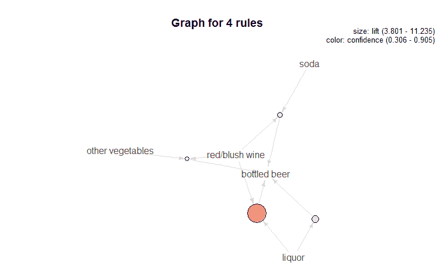

此图显示，**烈酒**/**红酒**在圆圈的大小及其阴影方面提供了最佳的**提升**和最高的**信心**水平。

我们在这个简单的练习中所做的是展示使用 R 进行市场篮子分析是多么容易。想象一下，使用这种技术可以包括哪些分析可能性，例如，在企业客户细分、纵向购买历史等方面，以及如何将其用于广告展示、联合促销等。现在让我们转向一个客户对商品进行评分的情况，并学习如何构建和测试推荐引擎。

# 推荐引擎概述

我们现在将关注用户对先前查看或购买的商品提供排名或评分的情况。设计推荐系统有两个主要类别：*协同过滤和基于内容的*（Ansari, Essegaier, 和 Kohli, 2000）。我们将重点关注前者，因为这是我们将要使用的 `recommenderlab` R 包的重点。

对于基于内容的推荐方法，其概念是将用户偏好与项目属性相联系。这些属性可能包括电影或电视剧推荐的类型、演员阵容或剧情。因此，推荐完全基于用户提供的评分；没有与其他人推荐的关联。这比基于内容的推荐方法有优势，因为当添加新项目时，如果它与用户的个人资料匹配，就可以向用户推荐，而不是依赖其他用户首先对其进行评分（所谓的“第一个评分者问题”）。然而，当可用的内容有限时，基于内容的方法可能会受到影响，无论是由于领域限制还是当新用户进入系统时。这可能导致非唯一的推荐，即较差的推荐（Lops, Gemmis, and Semeraro, 2011）。

在协同过滤中，推荐基于数据库中某些或所有个体的许多评分。本质上，它试图捕捉大众的智慧。

对于协同过滤，我们将关注以下四种方法：

+   **基于用户的协同过滤**（**UBCF**）

+   **基于项目的协同过滤**（**IBCF**）

+   **奇异值分解**（**SVD**）

+   **主成分分析**（**PCA**）

在继续研究案例之前，我们将简要地探讨这些方法。重要的是要理解，`recommenderlab`并非设计为用于实际应用工具，而是一个实验室工具，用于研究包中提供的算法以及您希望自行实验的算法。

# 基于用户的协同过滤

在 UBCF 中，算法首先找到与目标用户最相似的用户邻域，然后汇总这些用户的评分以形成预测（Hahsler, 2011）。邻域是通过选择与目标用户最相似的 KNN 或通过某种最小阈值的相似度度量来确定的。`recommenderlab`中可用的两种相似度度量是**皮尔逊相关系数**和**余弦相似度**。我将跳过这些度量的公式，因为它们在包的文档中很容易找到。

一旦决定了邻域方法，算法通过仅计算感兴趣个体与其邻居在共同评分的项目上的相似度来识别邻居。通过评分方案，例如简单的平均，汇总评分以对感兴趣的个人和项目做出预测评分。

让我们来看一个简单的例子。在以下矩阵中，有六个人对四部电影进行了评分，除了我对 *Mad Max* 的评分。使用 *k=1*，最近的邻居是 **Homer**，其次是 **Bart**；尽管 **弗兰德斯**和我一样讨厌 **复仇者联盟**。因此，使用 Homer 对 **Mad Max** 的评分，即 **4**，对我的预测评分也将是 **4**：

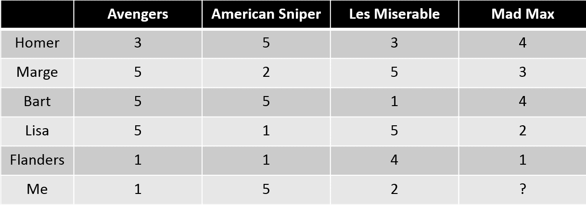

有多种方法可以衡量数据并/或控制偏差。例如，**弗兰德斯**的用户评分很可能比其他用户低，因此，在数据标准化时，将新的评分分数设置为用户对某项物品的评分减去该用户对所有物品的平均评分，可能会提高评分的准确性。

UBCF 的弱点在于，为了计算所有可能用户的相似度度量，必须将整个数据库保留在内存中，这可能会非常计算量大且耗时。

# 基于物品的协同过滤

如你所猜，IBCF 使用物品之间的相似性而不是用户之间的相似性来做出推荐。*这种方法的假设是，用户将更喜欢与他们喜欢的其他物品相似的物品*（Hahsler，2011）。模型是通过计算所有物品的双边相似度矩阵来构建的。流行的相似度度量包括皮尔逊相关性和余弦相似性。为了减少相似度矩阵的大小，可以指定仅保留 k 个最相似的物品。然而，限制邻域的大小可能会显著降低准确性，导致性能不如 UCBF。

继续我们的简化示例，如果我们检查以下矩阵，当 *k=1* 时，与 **Mad Max** 最相似的项目是 **美国狙击手**，因此我们可以将那个评分作为 **Mad Max** 的预测，如下所示：

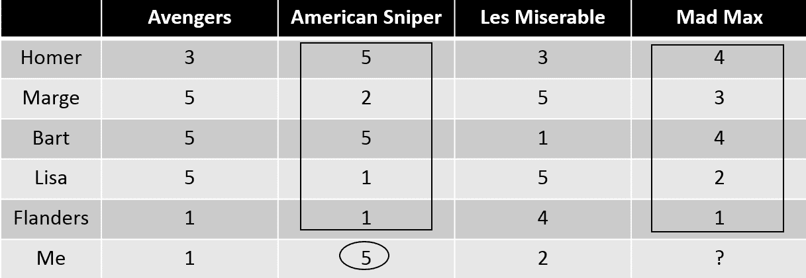

# 单值分解和主成分分析

在数据集中，用户和物品的数量数以百万计的情况相当常见。即使评分矩阵不是那么大，通过创建一个较小的（低秩）矩阵来捕捉高维矩阵中的大部分信息，可能也有利于降低维度。这可能会潜在地允许你捕捉数据中的重要潜在因素及其对应的权重。这些因素可能导致重要的见解，例如评分矩阵中的电影类型或书籍主题。即使你无法识别有意义的因素，这些技术也可能过滤掉数据中的噪声。

大数据集的一个问题是，你可能会得到一个稀疏矩阵，其中包含许多缺失的评分。这些方法的弱点是它们不能在包含缺失值的矩阵上工作，这些缺失值必须被估计。与任何数据估计任务一样，有几种技术可以尝试和实验，例如使用平均值、中位数或用零编码。`recommenderlab`的默认值是使用中位数。

那么，SVD 是什么？它是一种矩阵分解的方法，可以帮助将一组相关特征转换为不相关特征的一组。比如说，你有一个名为**A**的矩阵。这个矩阵将分解为三个矩阵：**U**、**D**和**V^T**。U 是一个正交矩阵，D 是一个非负的对角矩阵，V^T 是一个正交矩阵的转置。现在，让我们看看我们的评分矩阵，并使用 R 来通过一个例子进行说明。

我们首先要做的是重新创建评分矩阵（可以将其视为矩阵**A**，如下面的代码所示）：

```py
    > ratings <- c(3, 5, 5, 5, 1, 1, 5, 2, 5, 1, 1, 5, 3, 5, 1, 5, 4 
      ,2, 4, 3, 4, 2, 1, 4)

    > ratingMat <- matrix(ratings, nrow = 6)

    > rownames(ratingMat) <- c("Homer", "Marge", "Bart", "Lisa", 
      "Flanders", "Me")

    > colnames(ratingMat) <- c("Avengers", "American Sniper", "Les 
      Miserable", "Mad Max")

    > ratingMat
    Avengers  American Sniper  Les Miserable   Mad    Max
    Homer        3               5             3       4
    Marge        5               2             5       3
    Bart         5               5             1       4
    Lisa         5               1             5       2
    Flanders     1               1             4       1
    Me           1               5             2       4

```

现在，我们将使用基础 R 中的`svd()`函数来创建上述三个矩阵，R 将其称为`$d`、`$u`和`$v`。你可以将`$u`值视为个体在该因子上的载荷，而`$v`值则视为电影在该维度上的载荷。例如，`Mad Max`在第一个维度上的载荷为-0.116（第 1 行，第 4 列）：

```py
    > svd <- svd(ratingMat)

    > svd
    $d
    [1] 16.1204848  6.1300650  3.3664409  0.4683445

    $u
               [,1]       [,2]       [,3]        [,4]
    [1,] -0.4630576  0.2731330  0.2010738 -0.27437700
    [2,] -0.4678975 -0.3986762 -0.0789907  0.53908884
    [3,] -0.4697552  0.3760415 -0.6172940 -0.31895450
    [4,] -0.4075589 -0.5547074 -0.1547602 -0.04159102
    [5,] -0.2142482 -0.3017006  0.5619506 -0.57340176
    [6,] -0.3660235  0.4757362  0.4822227  0.44927622

    $v
               [,1]       [,2]        [,3]       [,4]
    [1,] -0.5394070 -0.3088509 -0.77465479 -0.1164526
    [2,] -0.4994752  0.6477571  0.17205756 -0.5489367
    [3,] -0.4854227 -0.6242687  0.60283871 -0.1060138
    [4,] -0.4732118  0.3087241  0.08301592  0.8208949

```

探索通过降低维度可以解释多少变化是很容易的。让我们先求出`$d`的对角线数字之和，然后看看我们只用两个因子就能解释多少变化，如下所示：

```py
    > sum(svd$d)
    [1] 26.08534

    > var <- sum(svd$d[1:2])

    > var
    [1] 22.25055

    > var/sum(svd$d)
    [1] 0.8529908

```

通过使用四个因子中的两个，我们能够捕捉到整个矩阵中超过 85%的总变化。你可以看到减少维度将产生的分数。为此，我们将创建一个函数。（非常感谢[www.stackoverflow.com](http://www.stackoverflow.com)上的响应者，他们帮助我把这个函数组合起来。）这个函数将允许我们指定要包含在预测中的因子数量。它通过将`$u`矩阵乘以`$v`矩阵再乘以`$d`矩阵来计算评分值：

```py
    > f1 <- function(x) {
    score = 0
    for(i in 1:n )
       score <- score + svd$u[,i] %*% t(svd$v[,i]) * svd$d[i]
    return(score)}

```

通过指定`n=4`并调用该函数，我们可以重新创建原始的评分矩阵：

```py
    > n = 4

    > f1(svd)
         [,1] [,2] [,3] [,4]
    [1,]    3    5    3    4
    [2,]    5    2    5    3
    [3,]    5    5    1    4
    [4,]    5    1    5    2
    [5,]    1    1    4    1
    [6,]    1    5    2    4

```

或者，我们可以指定`n=2`并检查得到的矩阵：

```py
    > n = 2

    > f1(svd)
                [,1]      [,2]     [,3]     [,4]
    [1,] 3.509402 4.8129937 2.578313 4.049294
    [2,] 4.823408 2.1843483 5.187072 2.814816
    [3,] 3.372807 5.2755495 2.236913 4.295140
    [4,] 4.594143 1.0789477 5.312009 2.059241
    [5,] 2.434198 0.5270894 2.831096 1.063404
    [6,] 2.282058 4.8361913 1.043674 3.692505

```

因此，使用 SVD，你可以降低维度，并可能识别出有意义的潜在因子。

如果你已经阅读了前一章，你会看到与 PCA 的相似之处。事实上，这两个方法是密切相关的，并且经常可以互换使用，因为它们都利用矩阵分解。你可能想知道它们之间的区别？简而言之，PCA 基于协方差矩阵，它是对称的。这意味着你从数据开始，计算中心化数据的协方差矩阵，对其进行对角化，并创建成分。

让我们将前一章中的一部分 PCA 代码应用到我们的数据中，以查看差异如何体现出来：

```py
    > library(psych)

    > pca <- principal(ratingMat, nfactors = 2, rotate = "none")

    > pca
    Principal Components Analysis
    Call: principal(r = ratingMat, nfactors = 2, rotate =
    "none")
    Standardized loadings (pattern matrix) based upon correlation 
      matrix
                      PC1   PC2   h2    u2
    Avengers        -0.09  0.98 0.98 0.022
    American Sniper  0.99 -0.01 0.99 0.015
    Les Miserable   -0.90  0.18 0.85 0.150
    Mad Max          0.92  0.29 0.93 0.071

                                PC1  PC2
    SS loadings           2.65 1.09
    Proportion Var        0.66 0.27
    Cumulative Var        0.66 0.94
    Proportion Explained  0.71 0.29
    Cumulative Proportion 0.71 1.00

```

你可以看到主成分分析（PCA）更容易解释。注意《美国狙击手》和《疯狂的麦克斯》在第一个成分上有很高的载荷，而只有《复仇者联盟》在第二个成分上有很高的载荷。此外，这两个成分解释了数据中 94%的总方差。值得注意的是，在这本书的第一版和第二版之间，主成分分析（PCA）已经不可用。

在将简单的评分矩阵应用于协同过滤技术之后，让我们通过使用真实世界数据的一个更复杂的例子继续前进。

# 商业理解和建议

这个案例实际上是一个笑话。也许更恰当的说法是一系列笑话，因为我们将从`recommenderlab`包中使用`Jester5k`数据。这些数据包括从 Jester 在线笑话推荐系统抽取的 100 个笑话的 5,000 个评分。这些数据收集于 1999 年 4 月至 2003 年 5 月之间，所有用户至少评分了 36 个笑话（Goldberg, Roeder, Gupta, and Perkins, 2001）。我们的目标是比较推荐算法并选择最佳算法。

因此，我认为以一个统计笑话开头是很重要的，以使人们处于正确的思维框架。我不确定如何正确地提供这个笑话的归属，但它在互联网上很受欢迎。

一个统计学家妻子生了双胞胎。他很高兴。他给牧师打电话，牧师也很高兴。“周日把他们带到教堂，我们将为他们施洗”，牧师说。“不”，统计学家回答说。“施洗一个。我们将保留另一个作为对照组。”

# 数据理解、准备和推荐

我们将在这个练习中需要的唯一库是`recommenderlab`。这个包是由南卫理公会大学的 Lyle 工程实验室开发的，他们有一个支持文档优秀的网站，网址为[`lyle.smu.edu/IDA/recommenderlab/`](https://lyle.smu.edu/IDA/recommenderlab/)：

```py
    > library(recommenderlab)

    > data(Jester5k)

    > Jester5k
    5000 x 100 rating matrix of class 'realRatingMatrix' with
    362106 ratings.

```

评分矩阵包含`362106`个总评分。获取用户评分列表相当容易。让我们看看用户编号`10`。以下输出仅包含前五个笑话的摘要：

```py
    > as(Jester5k[10,], "list")
    $u12843
       j1    j2    j3    j4    j5 ...
    -1.99 -6.89  2.09 -4.42 -4.90 ...

```

你还可以查看用户（用户`10`）的平均评分或特定笑话（笑话`1`）的平均评分，如下所示：

```py
    > rowMeans(Jester5k[10,])
    u12843 
      -1.6

    > colMeans(Jester5k[,1])
    j1 
    0.92

```

了解数据的一种方法是绘制评分直方图，包括原始数据和归一化后的数据。我们将使用`recommenderlab`中的`getRating()`函数来完成这项工作：

```py
    > hist(getRatings(Jester5k), breaks=100)

```

前一个命令的输出如下：

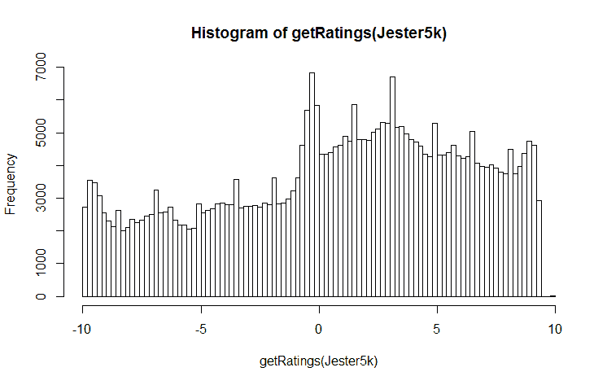

包中的`normalize()`函数通过从笑话的评分中减去评分的平均值来对数据进行中心化。由于前面的分布略微偏向正面评分，因此对数据进行归一化可以解决这个问题，从而产生一个更正常的分布，但仍然略微偏向正面评分，如下所示：

```py
    > hist(getRatings(normalize(Jester5k)), breaks = 100)

```

以下是为前一个命令的输出：

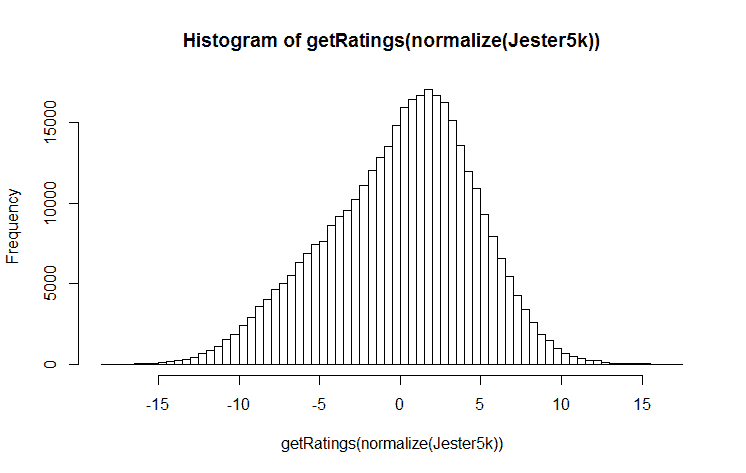

在建模和评估之前，使用`recommenderlab`包的`evaluationScheme()`函数创建`train`和`test`数据集非常容易。让我们将数据分成 80/20 的`train`和`test`集。你也可以选择 k 折交叉验证和自助重采样，如果你希望的话。我们还将指定对于`test`集，算法将给出 15 个评分。这意味着其他评分项将用于计算误差。此外，我们将指定良好评分的阈值；在我们的情况下，大于或等于`5`：

```py
    > set.seed(123)

    > e <- evaluationScheme(Jester5k, method="split", 
    train=0.8, given=15, goodRating=5)

    >  e
    Evaluation scheme with 15 items given
    Method: 'split' with 1 run(s).
    Training set proportion: 0.800
    Good ratings: >=5.000000
    Data set: 5000 x 100 rating matrix of class
    'realRatingMatrix' with 362106
     ratings.

```

在建立了`train`和`test`数据后，我们现在将开始建模和评估不同的推荐器：基于用户的、基于项目的、流行的、SVD、PCA 和随机的。

# 建模、评估和推荐

为了构建和测试我们的推荐引擎，我们可以使用相同的函数`Recommender()`，只需更改每个技术的指定即可。为了了解这个包能做什么以及探索所有六种技术可用的参数，你可以检查注册表。查看以下 IBCF，我们可以看到默认情况下是使用余弦方法找到 30 个邻居，数据是中心化的，而缺失数据没有编码为零：

```py
    > recommenderRegistry$get_entries(dataType =
    "realRatingMatrix")

    $ALS_realRatingMatrix
 Recommender method: ALS for realRatingMatrix
 Description: Recommender for explicit ratings based on latent 
      factors, calculated by alternating least squares algorithm.
 Reference: Yunhong Zhou, Dennis Wilkinson, Robert Schreiber, Rong 
      Pan (2008).
    Large-Scale Parallel Collaborative Filtering for the Netflix Prize, 
      4th Int'l   
    Conf. Algorithmic Aspects in Information and Management, LNCS 5034.
 Parameters:
 normalize lambda n_factors n_iterations min_item_nr seed
 1 NULL 0.1 10 10 1 NULL

 $ALS_implicit_realRatingMatrix
 Recommender method: ALS_implicit for realRatingMatrix
 Description: Recommender for implicit data based on latent factors, 
    calculated by alternating least squares algorithm.
 Reference: Yifan Hu, Yehuda Koren, Chris Volinsky (2008). 
      Collaborative
    Filtering for Implicit Feedback Datasets, ICDM '08 Proceedings of 
      the 2008 
    Eighth IEEE International Conference on Data Mining, pages 263-272.
 Parameters:
 lambda alpha n_factors n_iterations min_item_nr seed
 1 0.1 10 10 10 1 NULL

 $IBCF_realRatingMatrix
 Recommender method: IBCF for realRatingMatrix
 Description: Recommender based on item-based collaborative 
      filtering.
 Reference: NA
 Parameters:
 k method normalize normalize_sim_matrix alpha na_as_zero
 1 30 "Cosine" "center" FALSE 0.5 FALSE

 $POPULAR_realRatingMatrix
 Recommender method: POPULAR for realRatingMatrix
 Description: Recommender based on item popularity.
 Reference: NA
 Parameters:
 normalize aggregationRatings aggregationPopularity
 1 "center" new("standardGeneric" new("standardGeneric"

 $RANDOM_realRatingMatrix
 Recommender method: RANDOM for realRatingMatrix
 Description: Produce random recommendations (real ratings).
 Reference: NA
 Parameters: None

 $RERECOMMEND_realRatingMatrix
 Recommender method: RERECOMMEND for realRatingMatrix
 Description: Re-recommends highly rated items (real ratings).
 Reference: NA
 Parameters:
 randomize minRating
 1 1 NA

 $SVD_realRatingMatrix
 Recommender method: SVD for realRatingMatrix
 Description: Recommender based on SVD approximation with column-mean 
   imputation.
 Reference: NA
 Parameters:
 k maxiter normalize
 1 10 100 "center"

 $SVDF_realRatingMatrix
 Recommender method: SVDF for realRatingMatrix
 Description: Recommender based on Funk SVD with gradient descend.
 Reference: NA
 Parameters:
 k gamma lambda min_epochs max_epochs min_improvement normalize
 1 10 0.015 0.001 50 200 1e-06 "center"
 verbose
 1 FALSE

 $UBCF_realRatingMatrix
 Recommender method: UBCF for realRatingMatrix
 Description: Recommender based on user-based collaborative 
     filtering.
 Reference: NA
 Parameters:
 method nn sample normalize
 1 "cosine" 25 FALSE "center" 

```

这是如何根据`train`数据组合算法的。为了简单起见，让我们使用默认的算法设置。你可以通过在函数中简单地包含一个包含你的更改的列表来调整参数设置：

```py
    > ubcf <- Recommender(getData(e,"train"), "UBCF")

    > ibcf <- Recommender(getData(e,"train"), "IBCF")

    > svd <- Recommender(getData(e, "train"), "SVD")

    > popular <- Recommender(getData(e, "train"), "POPULAR")

    > pca <- Recommender(getData(e, "train"), "PCA")

    > random <- Recommender(getData(e, "train"), "RANDOM")

```

现在，使用`predict()`和`getData()`函数，我们将为每个算法获取`test`数据中 15 个项目的预测评分，如下所示：

```py
    > user_pred <- predict(ubcf, getData(e, "known"), type = "ratings")

    > item_pred <- predict(ibcf, getData(e, "known"), type = "ratings")

    > svd_pred <- predict(svd, getData(e, "known"), type = "ratings")

    > pop_pred <- predict(popular, getData(e, "known"), type = 
       "ratings")

    > rand_pred <- predict(random, getData(e, "known"), type = 
       "ratings")

```

我们将使用`calcPredictionAccuracy()`函数检查预测与`test`数据未知部分之间的误差。输出将包括所有方法的`RMSE`、`MSE`和`MAE`。我们将单独检查`UBCF`。在为所有五种方法创建对象后，我们可以通过创建一个带有`rbind()`函数的对象并使用`rownames()`函数给行命名来构建一个表格：

```py
    > P1 <- calcPredictionAccuracy(user_pred, getData(e,
    "unknown"))

    > P1
    RMSE  MSE  MAE 
    4.5 19.9  3.5

    > P2 <- calcPredictionAccuracy(item_pred, getData(e, "unknown"))

    > P3 <- calcPredictionAccuracy(svd_pred, getData(e, "unknown")) 
    > P4 <- calcPredictionAccuracy(pop_pred, getData(e, "unknown"))

    > P5 <- calcPredictionAccuracy(rand_pred, getData(e, "unknown"))

    > error <- rbind(P1, P2, P3, P4, P5)

    > rownames(error) <- c("UBCF", "IBCF", "SVD", "Popular", "Random")

    > error
            RMSE MSE  MAE
 UBCF     4.5  20  3.5
 IBCF     4.6  22  3.5
 SVD      4.6  21  3.7
 Popular  4.5  20  3.5
 Random   6.3  40  4.9 

```

我们可以在输出中看到，基于用户和流行的算法略优于 IBCF 和 SVD，并且所有算法都优于随机预测。

使用`evaluate()`函数还有另一种比较方法。使用`evaluate()`进行比较允许一个人检查额外的性能指标以及性能图表。由于 UBCF 和 Popular 算法表现最好，我们将与 IBCF 一起查看。

这个过程中的第一个任务是创建一个我们想要比较的算法列表，如下所示：

```py
    > algorithms <- list(POPULAR = list(name = "POPULAR"),
    UBCF =list(name = "UBCF"), IBCF = list(name = "IBCF"))

    > algorithms
    $POPULAR
    $POPULAR$name
    [1] "POPULAR"

    $UBCF
    $UBCF$name
    [1] "UBCF"

    $IBCF
    $IBCF$name
    [1] "IBCF"

```

对于这个例子，让我们比较前`5`、`10`和`15`个笑话推荐：

```py
    > evlist <- evaluate(e, algorithms, n = c(5, 10, 15))
    POPULAR run 
    1  [0.07sec/4.7sec] 
    UBCF run 
    1  [0.04sec/8.9sec] 
    IBCF run 
     1  [0.45sec/0.32sec]3

```

注意，通过执行命令，你将收到关于算法运行时间的输出。现在我们可以使用`avg()`函数来检查性能：

```py
 > set.seed(1)    

 > avg(evlist)
    $POPULAR
 TP    FP    FN    TN   precision  recall   TPR    FPR
 5  2.07  2.93  12.9  67.1       0.414   0.182 0.182 0.0398
 10 3.92  6.08  11.1  63.9       0.393   0.331 0.331 0.0828
 15 5.40  9.60   9.6  60.4       0.360   0.433 0.433 0.1314

 $UBCF
 TP    FP    FN    TN   precision   recall   TPR    FPR
 5   2.07  2.93  12.93  67.1      0.414    0.179 0.179 0.0398
 10  3.88  6.12  11.11  63.9      0.389    0.326 0.326 0.0835
 15  5.41  9.59   9.59  60.4      0.360    0.427 0.427 0.1312

 $IBCF
 TP    FP    FN    TN    precision   recall    TPR   FPR
 5   1.02  3.98  14.0  66.0        0.205   0.0674 0.0674 0.0558
 10  2.35  7.65  12.6  62.4        0.235   0.1606 0.1606 0.1069
 15  3.72 11.28  11.3  58.7        0.248   0.2617 0.2617 0.1575 

```

注意，`POPULAR`和`UBCF`的性能指标几乎相同。可以说，更易于实现的基于流行的算法可能是模型选择的更好选择。我们可以绘制并比较结果作为**接收者操作特征曲线**（**ROC**），比较`TPR`和`FPR`或精度/召回率，如下所示：

```py
    > plot(evlist, legend = "topleft", annotate = TRUE)

```

以下为前一个命令的输出结果：

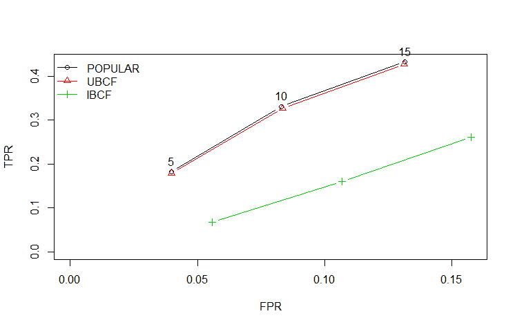

要获取精度/召回率曲线图，你只需在`plot`函数中指定`"prec"`：

```py
    > plot(evlist, "prec", legend = "bottomright", annotate = TRUE)

```

前一个命令的输出如下：

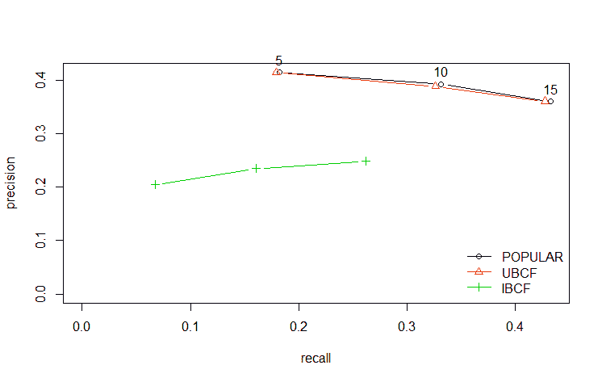

你可以从图中清楚地看到，基于流行和基于用户的算法几乎相同，并且优于基于项目的算法。`annotate=TRUE`参数在对应于我们评估中要求的推荐数量的点上提供了数字。

这很简单，但模型对特定个体的实际推荐是什么？这也很容易编写代码。首先，让我们在完整数据集上构建一个`"popular"`推荐引擎。然后，我们将找到前两个评分者的前五个推荐。我们将使用`Recommend()`函数并将其应用于整个数据集，如下所示：

```py
    > R1 <- Recommender(Jester5k, method = "POPULAR")

    > R1
    Recommender of type 'POPULAR' for 'realRatingMatrix' 
    learned using 5000 users.

```

现在，我们只需要为前两个评分者获取前五个推荐并将它们作为列表生成：

```py
    > recommend <- predict(R1, Jester5k[1:2], n = 5)

    > as(recommend, "list")
    $u2841
 [1] "j89" "j72" "j76" "j88" "j83"

 $u15547
 [1] "j89" "j93" "j76" "j88" "j91" 

```

还可以通过在`predict()`语法中指定并放入一个矩阵进行审查来查看每个笑话的评分者的具体评分。让我们为十个人（评分者`300`至`309`）和三个笑话（`71`至`73`）做这个：

```py
    > rating <- predict(R1, Jester5k[300:309], type = "ratings")

    > rating
    10 x 100 rating matrix of class 'realRatingMatrix' with 322
    ratings.

    > as(rating, "matrix")[, 71:73]
              j71  j72     j73
 u7628  -2.042 1.50 -0.2911
 u8714      NA   NA      NA
 u24213 -2.935   NA -1.1837
 u13301  2.391 5.93  4.1419
 u10959     NA   NA      NA
 u23430 -0.432 3.11      NA
 u11167 -1.718 1.82  0.0333
 u4705  -1.199 2.34  0.5519
 u24469 -1.583 1.96  0.1686
 u13534 -1.545 2.00      NA 

```

矩阵中的数字表示个人评分的笑话的预测评分，而 NA 表示用户未评分的笑话。

我们在这组数据上的最终努力将展示如何为评分是二元的那些情况构建推荐，也就是说，好或坏或 1 或 0。我们需要将评分转换为这种二进制格式，5 或以上为 1，低于 5 为 0。使用`Recommenderlab`的`binarize()`函数并指定`minRating=5`来做这件事非常简单：

```py
    > Jester.bin <- binarize(Jester5k, minRating = 5)

```

现在，我们需要让我们的数据反映等于一的评分数量，以便与算法用于训练的需求相匹配。为了方便起见，让我们选择大于 10。创建必要数据子集的代码如下所示：

```py
    > Jester.bin <- Jester.bin[rowCounts(Jester.bin) > 10]

    > Jester.bin
    3054 x 100 rating matrix of class 'binaryRatingMatrix' with 84722 
      ratings.

```

你需要创建`evaluationScheme`。在这个例子中，我们将选择`cross-validation`。函数中的默认 k 折是`10`，但我们也可以安全地选择`k=5`，这将减少我们的计算时间：

```py
    > set.seed(456)

    > e.bin <- evaluationScheme(Jester.bin, method = "cross-
      validation", k = 5, given = 10)

```

为了比较目的，评估的算法将包括`random`、`popular`和`UBCF`：

```py
    > algorithms.bin <- list("random" = list(name = "RANDOM", param = 
      NULL), "popular" = list(name = "POPULAR", param = NULL), "UBCF" = 
        list(name = "UBCF"))

```

现在是时候构建我们的模型了，如下所示：

```py
    > results.bin <- evaluate(e.bin, algorithms.bin, n = c(5, 10, 15))
    RANDOM run 
    1  [0sec/0.41sec] 
    2  [0.01sec/0.39sec] 
    3  [0sec/0.39sec] 
    4  [0sec/0.41sec] 
    5  [0sec/0.4sec] 
    POPULAR run 
    1  [0.01sec/3.79sec] 
    2  [0sec/3.81sec] 
    3  [0sec/3.82sec] 
    4  [0sec/3.92sec] 
    5  [0.02sec/3.78sec] 
    UBCF run 
    1  [0sec/5.94sec] 
    2  [0sec/5.92sec] 
    3  [0sec/6.05sec] 
    4  [0sec/5.86sec] 
     5  [0sec/6.09sec]

```

忽略性能指标表，让我们看看图表：

```py
    > plot(results.bin, legend = "topleft")

```

前一个命令的输出如下：

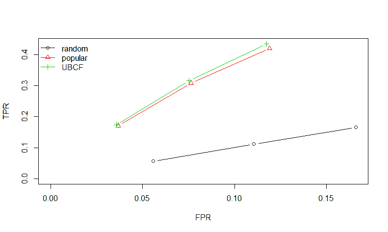

```py
    > plot(results.bin, "prec", legend = "bottomright")

```

上述命令的输出如下：

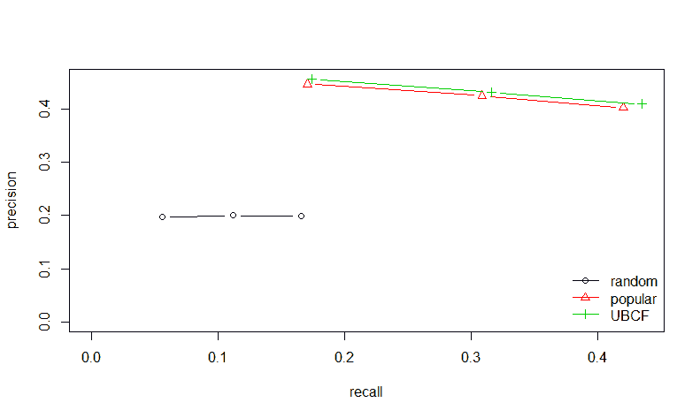

基于用户的算法略优于基于流行度的算法，但您可以清楚地看到，它们都优于任何随机推荐。在我们的业务案例中，这取决于决策团队的判断，决定实施哪种算法。

# 序列数据分析

有已知的已知。这是我们已知我们知道的事情。有已知的未知。也就是说，有我们知道我们不知道的事情。但也有未知的未知。有我们不知道我们不知道的事情。

- 唐纳德·拉姆斯菲尔德，前国防部长

第一版发布后，我遇到的第一个商业问题是关于产品序列分析。团队使用复杂的 Excel 电子表格和交叉表，以及一大堆 SAS 代码，来产生洞察。在遇到这个问题后，我探索了使用 R 能做什么，并很高兴地偶然发现了专门为此类任务设计的`TraMineR`包。我相信将 R 应用于这个问题将大大简化分析。

该包是为社会科学设计的，但它可以用于几乎任何您想要挖掘和学习观察状态在离散时间段或事件（纵向数据）中如何演变的情况。一个经典的使用案例就是上述提到的案例，您想了解客户购买产品的顺序。这将有助于创建某种推荐引擎，您可以创建下一次购买的几率，正如我听说它被称为下一个逻辑产品推荐。另一个例子可能是医疗保健领域，检查患者接受治疗和/或药物或甚至医生的处方习惯。我从事过这样的任务，创建简单和复杂的马尔可夫链来构建模型和创建预测。确实，`TraMineR`允许创建马尔可夫链转换矩阵来支持此类模型。

我们将要检查的代码负责创建、计数和绘制随时间变化的转换的各种组合，同时也包含了协变量。这将是我们的重点，但请记住，也可以构建一个用于聚类的相似度矩阵。实际练习中涵盖的核心特征将包括以下内容：

+   转换率

+   每个状态内的持续时间

+   序列频率

让我们开始吧。

# 序列分析应用

对于这个练习，我创建了一个人工数据集；为了跟随，您可以从中下载它：[`github.com/datameister66/data/blob/master/sequential.csv`](https://github.com/datameister66/data/blob/master/sequential.csv)

[`github.com/datameister66/data/blob/master/sequential.csv`](https://github.com/datameister66/data/blob/master/sequential.csv)

该包还提供了数据集和教程。我的意图是创建一些反映我所遇到的情况的新内容。我完全是从随机（在某种程度上有监督）中开发出来的，所以它不匹配任何真实世界的数据。它由 5,000 个观测值组成，每个观测值包含一个客户的购买历史和九个变量：

+   Cust_segment--一个表示客户分配细分市场的因子变量（见第八章，*聚类分析*）

+   有八个离散的购买事件，命名为`Purchase1`至`Purchase8`；记住，这些是事件而不是基于时间的，也就是说，一个客户可以在同一时间购买所有八个产品，但顺序是特定的

在每个购买变量中都有产品的通用名称，确切地说有七个可能的产品。它们被命名为`Product_A`至`Product_G`。这些产品是什么？没关系！发挥你的想象力或者将其应用于你自己的情况。如果客户只购买了一个产品，那么`Purchase1`将包含该产品的名称，其他变量将为 NULL。

在这里，我们将文件加载为数据框。为了清晰起见，输出结构被缩写：

```py
 > df <- read.csv("sequential.csv") 
 > str(df)
 'data.frame': 5000 obs. of 9 variables:
 $ Cust_Segment: Factor w/ 4 levels "Segment1","Segment2",..: 1 1 1 
    1 1 1 1 1 1 1 ...
 $ Purchase1 : Factor w/ 7 levels "Product_A","Product_B",..: 1 2 7 
    3 1 4 1 4 4 4 ...

```

是时候探索数据了，从客户细分市场计数表和首次购买产品计数开始：

```py
 > table(df$Cust_Segment)

 Segment1 Segment2 Segment3 Segment4 
 2900      572      554      974 

 > table(df$Purchase1)

 Product_A Product_B Product_C Product_D Product_E Product_F 
    Product_G 
 1451       765       659      1060       364       372       
    329

```

`Segment1`是最大的细分市场，最常购买的初始产品是`Product A`。然而，它是整体上最常购买的产品吗？这段代码将提供答案：

```py
 > table(unlist(df[, -1]))

 Product_A Product_B Product_C Product_D Product_E Product_F 
    Product_G 
 3855      3193      3564      3122      1688      1273   915   
    22390

```

是的，`ProductA`是最常购买的产品。NULL 值的计数为 22,390。

现在你可能想知道我们是否可以轻松地构建一些总结，这当然是可以的。在这里，我充分利用了`dplyr`包中的`count()`和`arrange()`函数来检查第一次和第二次购买之间的序列频率：

```py
 > dfCount <- count(df, Purchase1, Purchase2)

 > dfCount <- arrange(dfCount, desc(n))

 > dim(dfCount)
 [1] 56 3
 > head(dfCount)
 Source: local data frame [6 x 3]
 Groups: Purchase1 [4]

 Purchase1 Purchase2     n
 <fctr>    <fctr> <int>
 1 Product_A Product_A   548
 2 Product_D             548
 3 Product_B             346
 4 Product_C Product_C   345
 5 Product_B Product_B   291
 6 Product_D Product_D   281

```

我们可以看到，最频繁的序列是购买`ProductA`后再次购买`ProductA`，以及购买`ProductD`后没有其他购买。有趣的是类似产品购买的频率。

我们现在可以使用`TraMineR`包开始进一步的检查。首先，需要使用`seqdef()`函数将数据放入序列类对象中。这应该只包含序列，不包含任何协变量。此外，您可以使用`xstep = n`在绘图函数中指定刻度的距离。在我们的情况下，我们将为每个事件有一个刻度：

```py
 > seq <- seqdef(df[, -1], xtstep = 1)

 > head(seq)
 Sequence 
 1 Product_A-Product_A------ 
 2 Product_B------- 
 3 Product_G-Product_B-Product_B-Product_C-Product_B-Product_B-
    Product_B- 
      Product_G
 4 Product_C------- 
 5 Product_A------- 
 6 Product_D-------

```

我们现在可以进一步探索数据。让我们看一下索引图，它产生了前 10 个观测值的序列。您可以使用索引与数据一起检查您想要的任何观测值和事件周期：

```py
 > seqiplot(seq)

```

前一个命令的输出如下：

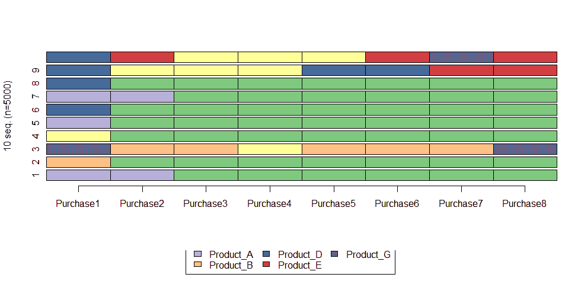

可以使用`seqIplot()`绘制所有观察结果，但鉴于数据量的大小，它不会产生任何有意义的结果。按状态分布的分布图更有意义：

```py
 > seqdplot(seq)

```

前一个命令的输出如下：

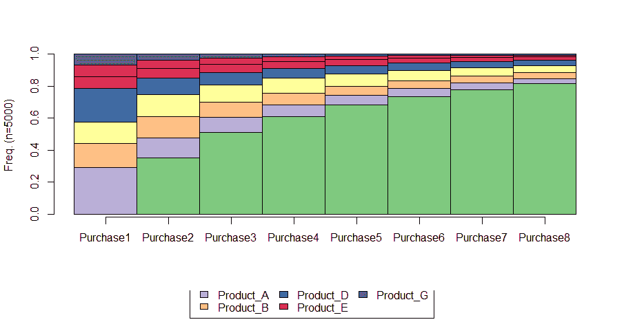

通过这个图，很容易看到按州划分的产品购买分布。我们还可以按段分组此图，以确定是否存在差异：

```py
 > seqdplot(seq, group = df$Cust_Segment)

```

前一个命令的输出如下：

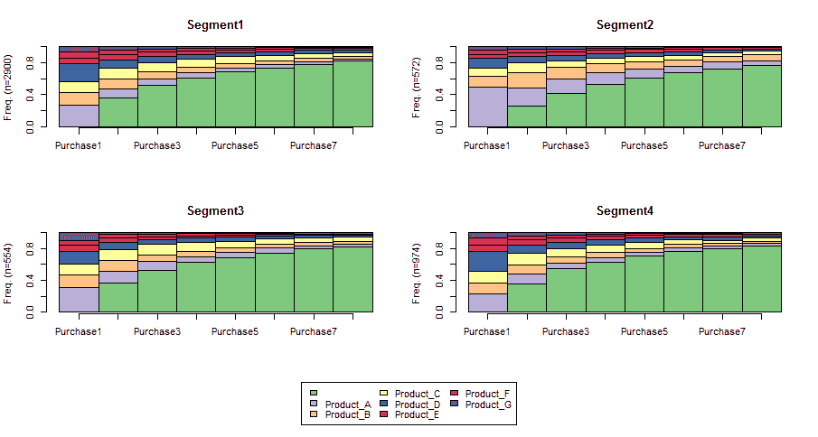

在这里，我们可以清楚地看到`Segment2`的`ProductA`购买比例高于其他段。另一种看到这个见解的方法是使用模式图：

```py
 > seqmsplot(seq, group = df$Cust_Segment)

```

前一个命令的输出如下：

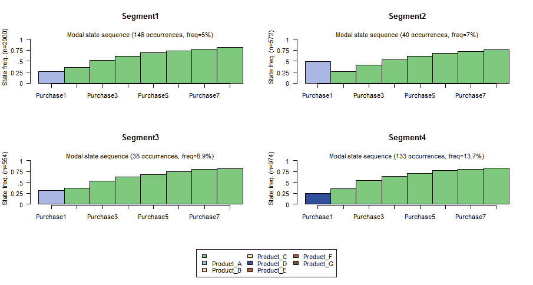

这很有趣。大约 50%的`Segment2`首先购买了`ProductA`，而段 4 最频繁的初始购买是`ProductD`。另一个可能感兴趣的图，但我认为在这个案例中不是，是平均时间图。它绘制了每个状态的“平均时间”。由于我们不是基于时间的，这没有意义，但我包括供您考虑：

```py
 > seqmtplot(seq, group = df$Cust_Segment)

```

让我们补充前面的代码，进一步观察序列的转换。此代码创建了一个序列对象，然后将其缩小到至少出现 5%的序列，然后绘制前 10 个序列：

```py
 > seqE <- seqecreate(seq)

 > subSeq <- seqefsub(seqE, pMinSupport = 0.05)

 > plot(subSeq[1:10], col = "dodgerblue")

```

前一个命令的输出如下：

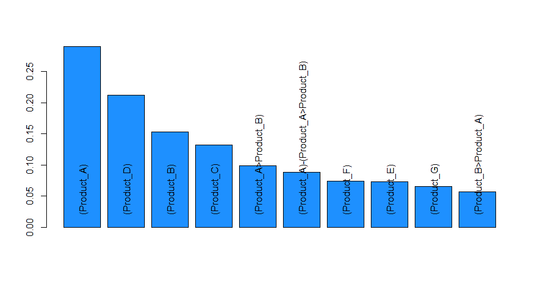

注意，该图显示了通过八个转换状态的序列百分比频率。如果您想将其缩小到，比如说，前两个转换，您可以在`seqecreate()`函数中使用索引来完成：

最后，让我们看看如何使用数据创建转换矩阵。这个矩阵显示了从一个状态转换到下一个状态的概率。在我们的案例中，它提供了购买下一个产品的概率。正如我之前提到的，这也可以用于马尔可夫链模拟来制定预测。但这超出了本章的范围，但如果您对此感兴趣，我建议您查看 R 中的`markovchain`包及其关于如何实现该过程的教程。有两个可能的转换矩阵可用。一个包含通过所有状态的整体概率，另一个从状态到下一个状态发展转换矩阵，即时间变化的矩阵。此代码显示了如何开发前者。要生成后者，只需在函数中指定`"time.varying = TRUE"`：

```py
 > seqMat <- seqtrate(seq)
 [>] computing transition rates for states

     /Product_A/Product_B/Product_C/Product_D/
       Product_E/Product_F/Product_G ...

 > options(digits = 2) # make output easier to read

 > seqMat[2:4, 1:3]
 [-> ] [-> Product_A] [-> Product_B]
 [Product_A ->]  0.19          0.417          0.166
 [Product_B ->]  0.26          0.113          0.475
 [Product_C ->]  0.19          0.058          0.041

```

输出显示了第 2 行至第 4 行和第 1 列至第 3 列。矩阵显示，拥有产品 A 并且下一次购买也是`ProductA`的概率几乎是 42%，而不购买其他产品的概率是 19%，购买`ProductB`的概率是 17%。我们将要检查的最后一个输出是每个先前购买不购买其他产品的概率：

```py
 > seqMat[, 1] [ ->] [Product_A ->] [Product_B ->] [Product_C ->] 
      [Product_D ->] 
 1.00           0.19           0.26           0.19           0.33 
 [Product_E ->] [Product_F ->] [Product_G ->] 
 0.18           0.25           0.41

```

当然，矩阵显示，在未购买产品后不购买产品的概率是 100%。请注意，在获得产品 D 后不购买的概率是 33%。对 Segment4 有何影响？或许有。

令人着迷的是，这项分析仅用了几行代码，并且不需要使用 Excel 或一些昂贵的可视化软件。你有纵向数据吗？尝试进行序列分析吧！

# 摘要

在本章中，目标是介绍如何使用 R 来构建和测试关联规则挖掘（篮子分析）和推荐引擎。篮子分析试图了解哪些商品是共同购买的。在推荐引擎中，目标是根据客户之前评价的查看或购买的商品，向客户提供他们可能会喜欢的其他商品。了解我们使用的 R 包（`recommenderlab`）对于推荐来说，它不是为实施而设计的，而是用于开发和测试算法。这里还考察了纵向数据，并从中学习有价值的见解，在我们的案例中，是客户购买我们产品的顺序。这种分析有众多应用，从市场营销活动到医疗保健。

我们现在将转换到监督学习。在下一章中，我们将介绍一些实际机器学习中最激动人心且重要的方法，即多类分类和创建集成模型，这在 R 语言中通过最近的包发布变得非常容易操作。
