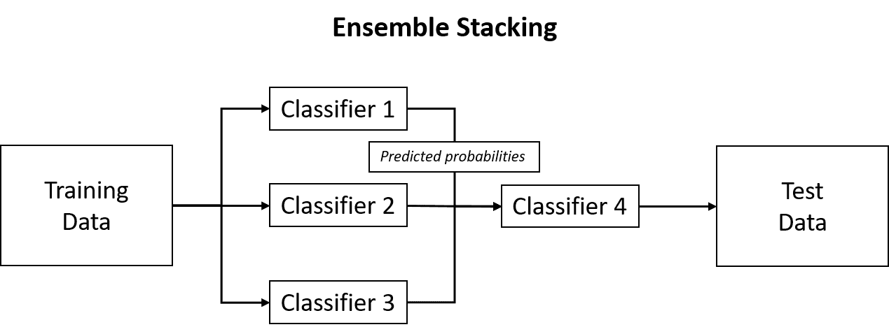
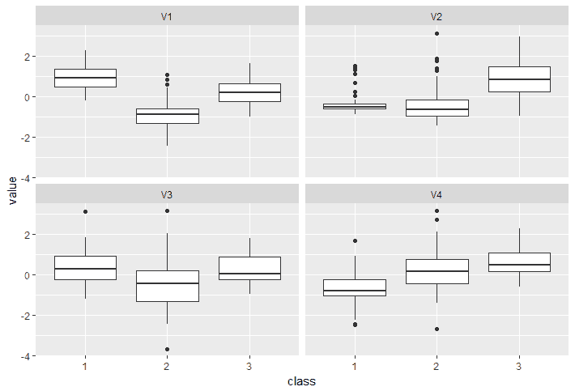
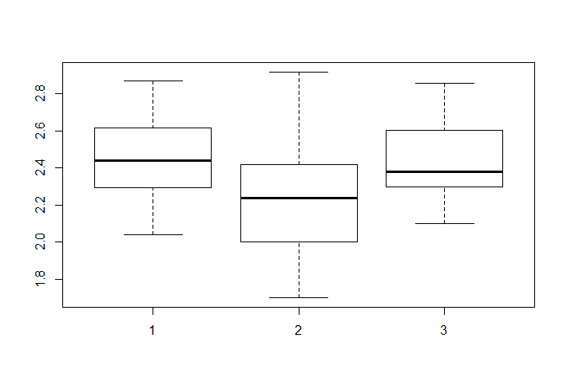
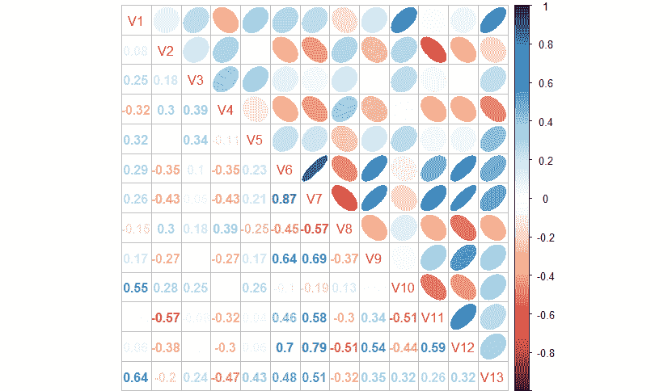

# 创建集成和多元分类

“这就是你赢得机器学习竞赛的方法：你将其他人的工作集成在一起。”

- 维塔利·库兹涅佐夫，NIPS2014

你可能已经意识到我们已经讨论了集成学习方法。它在[www.scholarpedia.org](http://www.scholarpedia.org/article/Main_Page)上被定义为“通过战略性地生成和组合多个模型，如分类器或专家，来解决特定计算智能问题的过程”。在随机森林和梯度提升中，我们结合了数百或数千棵树的“投票”来进行预测。因此，根据定义，这些模型是集成模型。这种方法可以扩展到任何学习器以创建集成，有些人称之为元集成或元学习器。我们将探讨其中一种被称为“堆叠”的方法。在这种方法中，我们将生成多个分类器，并使用它们的预测类别概率作为另一个分类器的输入特征。这种方法*可以*提高预测准确性。在前几章中，我们专注于关注二元结果的分类问题。现在，我们将探讨预测数据由两个以上结果组成的情况的方法，这在现实世界的数据集中是非常常见的。我必须承认，这些方法在 R 中的应用是我遇到的最有趣和最令人愉快的应用之一。

# 集成

本章开头引用的引言提到了使用集成来赢得机器学习竞赛。然而，它们确实有实际应用。我已经提供了集成建模的定义，但它为什么有效呢？为了证明这一点，我从以下博客中借用了一个例子，该博客深入探讨了多种集成方法：

[`mlwave.com/kaggle-ensembling-guide/`](http://mlwave.com/kaggle-ensembling-guide/)

当我写这一章时，我们离超级碗 51 只有几天的时间了，亚特兰大猎鹰队对阵新英格兰爱国者队。假设我们想回顾一下我们赢得一场友好赌注的概率，我们希望选择爱国者队减去分数（截至本文写作时为 3 分）。假设我们已经跟踪了三位专家预测者，他们预测爱国者队能否覆盖赔率的概率相同（60%）。现在，如果我们偏爱任何一位所谓的专家，那么我们显然有 60%的胜率。然而，让我们看看创建他们预测的集成能如何提高我们盈利和羞辱朋友和家人的机会。

首先计算专家选择新英格兰的每种可能结果的概率。如果三位专家都选择新英格兰，那么我们就有 0.6 x 0.6 x 0.6，即 21.6%的概率，三位都是正确的。如果其中两位选择新英格兰，那么我们有(0.6 x 0.6 x 0.3) x 3，总共 43.2%。通过使用多数投票，如果至少有两位选择新英格兰，那么我们赢得比赛的概率几乎达到 65%。

这是一个相当简单的例子，但仍然具有代表性。在机器学习中，它可以通过结合几个平均或甚至弱学习者的预测来提高整体准确性。下面的图表显示了如何实现这一点：



在这个图表中，我们构建了三个不同的分类器，并使用它们的预测概率作为输入到第四个不同分类器，以便对测试数据进行预测。让我们看看如何用 R 来实现这一点。

# 商业和数据理解

我们将再次访问我们老对手皮马糖尿病数据。它已经证明对大多数分类器来说是一个相当大的挑战，大多数分类器的准确率在 70 年代中期。我们已经在第五章，*更多分类技术 - K 最近邻和支持向量机*和第六章，*分类和回归树*中查看过这些数据，因此我们可以跳过细节。有许多 R 包可以构建集成，自己编写代码也不是那么困难。在这个迭代中，我们将使用`caret`和`caretEnsemble`包来解决这个问题。让我们加载这些包并准备数据，包括使用 caret 中的`createDataPartition()`函数创建训练集和测试集：

```py
 > library(MASS)

> library(caretEnsemble)

 > library(caTools)

 > pima <- rbind(Pima.tr, Pima.te)

 > set.seed(502)

 > split <- createDataPartition(y = pima$type, p = 0.75, list = F)

 > train <- pima[split, ]

 > test <- pima[-split, ]

```

# 模型评估和选择

正如我们在前面的章节中所做的那样，在利用 caret 函数时，第一个推荐的任务是构建一个对象，该对象指定了模型训练将如何进行。这是通过`trainControl()`函数完成的。我们将创建一个五折交叉验证并保存最终的预测（概率）。建议您也索引重采样，以便每个基础模型在相同的折上训练。注意，在函数中，我指定了上采样。为什么？好吧，注意“是”与“否”的比例是 2 比 1：

```py
 > table(train$type)

 No Yes 
 267 133

```

这个比率不一定是不平衡的，但我想在这里展示一些东西。在许多数据集中，感兴趣的结果是一个罕见事件。因此，你可能会得到一个高度准确的分类器，但在预测感兴趣的结果方面做得非常糟糕，也就是说，它没有预测任何真正的阳性。为了平衡响应，你可以增加少数类的样本，减少多数类的样本，或者创建“合成数据”。在下一项练习中，我们将专注于合成数据，但在这里，让我们尝试增加样本。在增加样本时，对于每个交叉验证折，少数类会随机有放回地采样以匹配多数类的观察数。以下是我们的函数：

```py
> control <- trainControl(method = "cv",
 number = 5,
 savePredictions = "final",
 classProbs = T,
 index=createResample(train$type, 5),
 sampling = "up",
 summaryFunction = twoClassSummary)

```

我们现在可以使用`caretList()`函数来训练我们的模型。你可以使用任何由 caret 包支持的模型。这里有一个模型列表，以及它们对应的超参数：

[`rdrr.io/cran/caret/man/models.html`](https://rdrr.io/cran/caret/man/models.html)

在这个例子中，我们将训练三个模型：

+   分类树 - `"rpart"`

+   多变量自适应回归样条 - `"earth"`

+   K-最近邻 - `"knn"`

让我们把所有这些都放在一起：

```py
 > set.seed(2) 
 > models <- caretList(
 type ~ ., data = train,
 trControl = control,
 metric = "ROC",
 methodList = c("rpart", "earth", "knn") )

```

不仅模型已经建立，而且每个模型的参数都根据 caret 的规则进行了调整。你可以通过结合`caretModelSpec()`函数为每个模型创建自己的调整网格，但为了演示目的，我们将让函数为我们做这件事。你可以通过调用模型对象来检查结果。这是简化的输出：

```py
 > models
 ...
 Resampling results across tuning parameters:

 cp       ROC      Sens      Spec 
 0.03007519 0.7882347 0.8190343 0.6781714
 0.04010025 0.7814718 0.7935024 0.6888857
 0.36090226 0.7360166 0.8646440 0.6073893

```

有效集成的一个技巧是基础模型之间不高度相关。这是一个主观的陈述，没有关于相关预测的硬性规则。应该通过实验结果来决定是否替换模型。让我们看看我们的结果：

```py
 > modelCor(resamples(models))
 rpart     earth       knn
 rpart 1.0000000 0.9589931 0.7191618
 earth 0.9589931 1.0000000 0.8834022
 knn   0.7191618 0.8834022 1.0000000

```

分类树和 earth 模型高度相关。这可能会成为一个问题，但让我们通过创建第四个分类器，即堆叠模型，并检查结果来继续前进。为此，我们将捕获测试集中“是”的预测概率到一个数据框中：

```py
 > model_preds <- lapply(models, predict, newdata=test, type="prob") 
 > model_preds <- lapply(model_preds, function(x) x[,"Yes"]) 
 > model_preds <- data.frame(model_preds)

```

我们现在使用`caretStack()`将这些模型堆叠起来进行最终预测。这将基于五个自助样本的简单逻辑回归：

```py
 > stack <- caretStack(models, method = "glm",
 metric = "ROC",
 trControl = trainControl(
 method = "boot",
 number = 5,
 savePredictions = "final",
 classProbs = TRUE,
 summaryFunction = twoClassSummary
 ))

```

你可以这样检查最终模型：

```py
 > summary(stack)

 Call:
 NULL

 Deviance Residuals: 
 Min      1Q  Median     3Q    Max 
 -2.1029 -0.6268 -0.3584 0.5926 2.3714 

 Coefficients:
 Estimate  Std. Error  z value   Pr(>|z|) 
 (Intercept)  2.2212      0.2120   10.476   < 2e-16 ***
 rpart       -0.8529      0.3947   -2.161   0.03071 * 
 earth       -3.0984      0.4250   -7.290   3.1e-13 ***
 knn         -1.2626      0.3524   -3.583   0.00034 ***

```

尽管`rpart`和 earth 模型高度相关，但它们的系数都是显著的，我们可能可以保留这两个模型在分析中。现在我们可以用`ensembled`学习器比较单个模型的结果：

```py
 > prob <- 1-predict(stack, newdata = test, type = "prob")

 > model_preds$ensemble <- prob

 > colAUC(model_preds, test$type)
 rpart     earth       knn  ensemble
 No vs. Yes 0.7413481 0.7892562 0.7652376 0.8001033

```

我们通过`colAUC()`函数看到的是单个模型的 AUC 和堆叠/集成的 AUC。集成在仅使用 earth 包中的 MARS 的情况下带来了一点点改进。所以在这个例子中，我们看到通过模型堆叠创建集成确实可以增加预测能力。你能根据这些数据构建一个更好的集成吗？你会尝试哪些其他采样或分类器？有了这些，让我们继续探讨多类问题。

# 多类分类

在多类问题中，有许多学习方法。例如，随机森林和判别分析等技术将处理多类问题，而一些技术和/或包则不会，例如，基础 R 中的广义线性模型`glm()`。截至本文写作时，不幸的是，`caretEnsemble`包将无法与多类一起使用。然而，机器学习在 R（`mlr`）包支持多类和集成方法。如果你熟悉 Python 的 sci-kit Learn，可以说`mlr`旨在为 R 提供相同的功能。mlr 和基于 caret 的包正在迅速成为我解决几乎所有商业问题的首选。我打算展示这个包在多类问题上的强大功能，然后通过展示如何在`Pima`数据上执行集成来结束。

对于多类问题，我们将探讨如何调整随机森林，然后检查如何使用“一对余”技术将 GLM 转换为多类学习器。这就是我们为每个类别与所有其他类别构建二元概率预测，然后将它们组合在一起来预测观察结果的最终类别的地方。这项技术允许你将任何分类器方法扩展到多类问题，并且它通常可以优于多类学习器。

一个简短的提醒：不要混淆多类和多标签术语。在前者中，一个观察结果只能被分配给一个且仅一个类别，而在后者中，它可以被分配给多个类别。一个例子是既可以被标记为政治又可以被标记为幽默的文本。在本章中，我们不会涵盖多标签问题。

# 商业和数据理解

我们将再次访问我们在第八章“聚类分析”中使用过的葡萄酒数据集。如果你还记得，它由 13 个数值特征和三种可能的葡萄酒类别响应组成。我们的任务是预测这些类别。我将包括一个有趣的转折，那就是人为地增加观察结果的数量。原因有两个。首先，我想充分展示`mlr`包的重采样能力，其次，我希望涵盖一种合成采样技术。在前一节中，我们已经使用了上采样，所以现在是合成采样的时候了。

我们的首要任务是加载包库并导入数据：

```py
 > library(mlr) 
 > library(ggplot2) 
 > library(HDclassif) 
 > library(DMwR) 
 > library(reshape2)

    > library(corrplot) 
 > data(wine) 
 > table(wine$class)

 1  2  3 
 59 71 48

```

我们有 178 个观测值，加上响应标签是数值的（1，2 和 3）。让我们将我们的数据量增加一倍以上。本例中使用的算法是**合成少数类过采样技术**（**SMOTE**）。在前一个例子中，我们使用了上采样，其中少数类通过替换采样直到类别大小与多数类匹配。使用`SMOTE`，对少数类进行随机采样，并为每个观测值计算/识别 k 个最近邻，然后基于这些邻居随机生成数据。`DMwR`包中的`SMOTE()`函数默认最近邻是 5（k = 5）。你还需要考虑少数类过采样的百分比。例如，如果我们想将少数类的大小加倍，我们会在函数中指定`"percent.over = 100"`。每个案例添加到当前少数类的新样本数是百分比过采样/100，或者每个观测值一个新样本。对于百分比过采样还有一个参数，它控制随机选择用于新数据集的多数类数量。

这是该技术的应用，首先将类别结构化为因子，否则函数将无法工作：

```py
 > wine$class <- as.factor(wine$class)

 > set.seed(11)

 > df <- SMOTE(class ~ ., wine, perc.over = 300, perc.under = 300)

 > table(df$class)

 1   2   3 
 195 237 192

```

哇！我们已经创建了一个包含 624 个观测值的数据库。我们的下一个任务将涉及按类别可视化特征数量。我非常喜欢箱线图，所以让我们按类别创建前四个输入的箱线图。它们的尺度不同，所以将它们放入一个具有平均值为 0 和标准差为 1 的数据框中将有助于比较：

```py
 > wine.scale <- data.frame(scale(wine[, 2:5])) 
 > wine.scale$class <- wine$class 
 > wine.melt <- melt(wine.scale, id.var="class") 
 > ggplot(data = wine.melt, aes( x = class, y = value)) +
 geom_boxplot() +
 facet_wrap( ~ variable, ncol = 2)

```

前一个命令的输出如下：



回想一下第三章，*逻辑回归和判别分析*，箱线图上的点被认为是异常值。那么，我们应该怎么办？有许多事情要做：

+   什么也不做——什么都不做始终是一个选择

+   删除异常观测值

+   在当前特征内截断观测值或创建一个截断值的新特征

+   为每个特征创建一个指标变量，以捕捉观测值是否为异常值

我一直觉得异常值很有趣，通常会仔细观察它们以确定它们为什么会发生以及如何处理它们。我们没有那么多时间，所以让我提出一个简单的解决方案和截断异常值的代码。让我们创建一个函数来识别每个异常值，并将高值（> 99 百分位数）重新分配给 75 百分位数，将低值（< 1 百分位数）重新分配给 25 百分位数。你可以做中位数或其他，但我发现这种方法很有效。

你可以将这些代码片段放入同一个函数中，但我这样做是为了简化和理解。

这些是我们的异常值函数：

```py
 > outHigh <- function(x) {
 x[x > quantile(x, 0.99)] <- quantile(x, 0.75)
 x
 }

 > outLow <- function(x) {
 x[x < quantile(x, 0.01)] <- quantile(x, 0.25)
 x
 }

```

现在，我们在原始数据上执行该函数并创建一个新的数据框：

```py
    > wine.trunc <- data.frame(lapply(wine[, -1], outHigh))

 > wine.trunc <- data.frame(lapply(wine.trunc, outLow))

 > wine.trunc$class <- wine$class

```

对截断特征与原始特征进行简单比较是必要的。让我们用`V3`试试：

```py
 > boxplot(wine.trunc$V3 ~ wine.trunc$class)

```

上述命令的输出如下：



所以这很顺利。现在是我们查看相关性的时候了：

```py
 > c <- cor(wine.trunc[, -14])

 > corrplot.mixed(c, upper = "ellipse")

```

上述命令的输出如下：



我们看到 V6 和 V7 是最相关的特征，并且我们看到一个大于 0.5 的数字。一般来说，这不是基于非线性学习方法的常见问题，但我们将通过在我们的 GLM 中包含 L2 惩罚（岭回归）来考虑这一点。

# 模型评估和选择

我们将首先创建我们的训练集和测试集，然后创建一个随机森林分类器作为我们的基础模型。在评估其性能后，我们将继续尝试一对多分类方法并查看其表现。我们将数据分成 70/30。此外，`mlr`包的一个独特之处在于它要求将你的训练数据放入一个“任务”结构中，具体来说是一个分类任务。可选地，你也可以将测试集放入一个任务中。

模型列表的完整列表在此处可用，同时你也可以使用你自己的模型：

[`mlr-org.github.io/mlr-tutorial/release/html/integrated_learners/index.html`](https://mlr-org.github.io/mlr-tutorial/release/html/integrated_learners/index.html)

```py
 > library(caret) #if not already loaded 
 > set.seed(502) 
 > split <- createDataPartition(y = df$class, p = 0.7, list = F) 
 > train <- df[split, ] 
 > test <- df[-split, ]

    > wine.task <- makeClassifTask(id = "wine", data = train, target = 
      "class") 

```

# 随机森林

在创建我们的训练数据任务后，你可以探索许多函数。以下是其结构的简略输出：

```py
 > str(getTaskData(wine.task))
 'data.frame': 438 obs. of 14 variables:
 $ class: Factor w/ 3 levels "1","2","3": 1 2 1 2 2 1 2 1 1 2 ...
 $ V1 : num 13.6 11.8 14.4 11.8 13.1 ...

```

在你的分析中使用`mlr`有许多方法，但我建议创建你的重采样对象。在这里，我们创建一个重采样对象来帮助我们调整随机森林的树的数量，包括三个子样本：

```py
 > rdesc <- makeResampleDesc("Subsample", iters = 3)

```

下一个对象建立了用于调整的树网格，最小树的数量为 750，最大为 2000。你还可以建立多个参数，就像我们使用`caret`包所做的那样。你可以通过调用`makeParamSet`函数的帮助来探索你的选项：

```py
 > param <- makeParamSet(
        makeDiscreteParam("ntree", values = c(750, 1000, 1250, 1500, 
         1750, 2000))
    )

```

接下来，创建一个控制对象，建立数值网格：

```py
 > ctrl <- makeTuneControlGrid()

```

现在，继续调整超参数以获得最佳树的数量。然后，调用最佳树的数量和相关的样本外误差：

```py
 > tuning <- tuneParams("classif.randomForest", task = wine.task,
 resampling = rdesc, par.set = param,
 control = ctrl)

    > tuning$x
    $ntree
    [1] 1250

    > tuning$y
    mmce.test.mean 
    0.01141553 

```

最佳树的数量是 1,250，平均误分类误差为 0.01%，几乎完美分类。现在只需将此参数设置为训练时的`makeLearner()`函数的包装即可。注意，我将预测类型设置为概率，因为默认是预测类别：

```py
 > rf <- setHyperPars(makeLearner("classif.randomForest",
 predict.type = "prob"), par.vals = tuning$x)

```

现在我们训练模型：

```py
 > fitRF <- train(rf, wine.task)

```

你可以在训练数据上看到混淆矩阵：

```py
 > fitRF$learner.model
              OOB estimate of error rate: 0%
    Confusion matrix:
       1   2  3  class.error
    1 72   0   0           0
    2  0  97   0           0
    3  0   0 101           0 

```

然后，在测试集上评估其性能，包括错误和准确度（1 - 错误）。如果没有测试任务，你指定`newdata = test`，否则如果你创建了测试任务，只需使用`test.task`：

```py
 > predRF <- predict(fitRF, newdata = test)

 > getConfMatrix(predRF)
 predicted
 true     1  2  3  -SUM-
 1     58  0  0      0
 2      0 71  0      0
 3      0  0 57      0
 -SUM-  0  0  0      0

 > performance(predRF, measures = list(mmce, acc))
 mmce acc 
 0   1

```

嗯，这真是太简单了，因为我们能够无误差地预测每个类别。

# 岭回归

为了演示目的，我们仍然尝试使用单对余方法进行岭回归。为此，为二元分类方法创建一个 `MulticlassWrapper`。`classif.penalized.ridge` 方法来自 `penalized` 包，所以请确保你已经安装了它：

```py
 > ovr <- makeMulticlassWrapper("classif.penalized.ridge", 
      mcw.method = "onevsrest")

```

现在，让我们继续创建一个用于我们的分类器的包装器，该包装器创建一个包含 10 次迭代（默认值）的袋装重采样，采样 70% 的观测值和所有输入特征：

```py
 > bag.ovr = makeBaggingWrapper(ovr, bw.iters = 10, #default of 10
 bw.replace = TRUE, #default
 bw.size = 0.7,
 bw.feats = 1)

```

现在我们可以用这个来训练我们的算法。注意在代码中我在 `train()` 前面加了 `mlr::`。原因是 caret 也有一个 `train()` 函数，所以我们指定我们想要 `mlr` 的 `train()` 函数，而不是 caret 的。有时，如果两个包都加载了但没有这样做，你最终会得到一个严重的错误：

```py
 > set.seed(317)
 > fitOVR <- mlr::train(bag.ovr, wine.task)
    > predOVR <- predict(fitOVR, newdata = test) 

```

让我们看看效果如何：

```py
 > head(data.frame(predOVR))
 truth response
 60     2        2
 78     2        2
 79     2        2
 49     1        1
 19     1        1
 69     2        2

 > getConfMatrix(predOVR)
 predicted
 true     1  2  3  -SUM-
 1     58  0  0      0
 2      0 71  0      0
 3      0  0 57      0
 -SUM-  0  0  0      0

```

再次强调，这太容易了。然而，不要过分关注准确性，而应该关注创建你的分类器的方法、调整任何参数以及实施重采样策略的方法。

# MLR 的集成

这里有一些我们觉得不太容易的事情：`Pima` 糖尿病分类。和 caret 一样，你可以构建集成模型，所以让我们试一试。我还会展示如何将 `SMOTE` 集成到学习过程中，而不是创建一个单独的数据集。

首先，确保你从本章的开头运行代码来创建训练和测试集。我会在这里暂停，让你去处理。

太好了，现在让我们像以前一样创建训练任务：

```py
 > pima.task <- makeClassifTask(id = "pima", data = train, target = 
      "type")

```

这里的 `smote()` 函数与我们之前做的不太一样。你只需要指定少数类过采样率和 k-最近邻。我们将基于三个最近邻将少数类（是）的数量加倍：

```py
 > pima.smote <- smote(pima.task, rate = 2, nn = 3)

    > str(getTaskData(pima.smote))
    'data.frame': 533 obs. of 8 variables: 

```

现在，我们有 533 个观测值，而不是训练中的原始 400 个。为了完成我们的集成堆叠，我们将创建三个基础模型（随机森林、二次判别分析和 L1 惩罚 GLM）。这段代码将它们组合成基础模型，即学习者，并确保我们创建了用于输入特征的概率：

```py
 > base <- c("classif.randomForest", "classif.qda", classif.glmnet") 
 > learns <- lapply(base, makeLearner) 
 > learns <- lapply(learns, setPredictType, "prob")

```

堆叠模型将简单地是一个 GLM，系数通过交叉验证调整。包的默认值是五折：

```py
 > sl <- makeStackedLearner(base.learners = learns,
 super.learner = "classif.logreg",
 predict.type = "prob",
 method = "stack.cv")

```

我们现在可以训练基础和堆叠模型。你可以选择根据需要合并重采样和调整包装器，就像我们在前面的章节中所做的那样。在这种情况下，我们将坚持默认设置。在测试集上的训练和预测也是同样的方式：

```py
 > slFit <- mlr::train(sl, pima.smote)

 > predFit <- predict(slFit, newdata = test)

 > getConfMatrix(predFit)
 predicted
 true        No Yes -SUM-
 No        70  18    18
 Yes       15  29    15
 -SUM-     15  18    33

 > performance(predFit, measures = list(mmce, acc, auc))
 mmce    acc         auc
 0.25   0.75   0.7874483

```

经过所有这些努力，我们只达到了 75% 的准确率，以及略低于使用 `caretEnsemble` 构建的集成模型的 `AUC`，尽管我们使用了不同的基础学习器。所以，就像以前一样，你能提高这些结果吗？请告诉我你的结果。

# 摘要

在本章中，我们探讨了通过堆叠和随后进行多类分类创建集成模型的重要机器学习方法。在堆叠中，我们使用了基础模型（学习器）来创建预测概率，这些概率被用于输入特征到另一个模型（超级学习器）以做出我们的最终预测。实际上，堆叠方法在个别基础模型之上显示出了轻微的改进。至于多类方法，我们研究了使用多类分类器，以及将二元分类方法应用于多类问题，使用一对一技术。作为一个辅助任务，我们还结合了两种采样技术（上采样和合成少数类过采样技术）来平衡类别。同样重要的是，我们利用了两个非常强大的 R 包，`caretEnsemble`和`mlr`。这些方法和包是 R 机器学习实践者的强大补充。

接下来，我们将深入探讨时间序列和因果关系的领域。在我看来，时间序列分析是机器学习中最被误解和忽视的领域之一。下一章应该能帮助你开始帮助我们的行业缩小这一差距。
