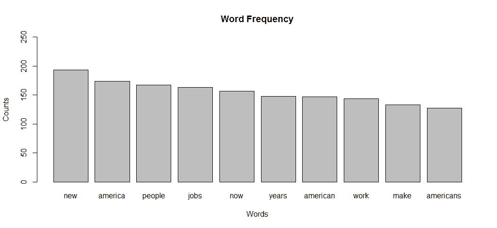

# 文本挖掘

"我认为活在未知中比拥有可能错误的答案更有趣。"

- 理查德·费曼

世界充满了文本数据。如果你在 Google、Bing 或 Yahoo 上搜索有多少数据是无结构的，也就是说，以文本格式存在，估计会从 80%到 90%。实际数字并不重要。重要的是，大量数据是以文本格式存在的。这意味着任何寻求从这些数据中寻找洞察的人都必须发展出处理和分析文本的能力。

当我最初作为一名市场研究员开始工作时，我过去常常手动翻阅一页又一页的由主持人引导的焦点小组和访谈，希望能捕捉到一些定性洞察，或者说是一个 Aha！时刻——然后与团队成员争论他们是否也有同样的洞察。然后，你总会遇到一个在项目中突然出现并听取两场访谈——30 或 40 场预定访谈中的两场——的人，唉，他们已经对世界上真正发生的事情有了自己的看法。与现在使用的技巧相比，分析师可以快速将数据提炼成有意义的定量结果，支持定性理解，甚至可能影响那些突然出现的人。

在过去的几年里，我已经将这里讨论的技术应用于挖掘医患互动，理解 FDA 对处方药广告的担忧，以及捕捉患者对罕见癌症的关注，仅举几个例子。使用 R 和本章中的方法，你也可以从文本数据中提取强大的信息。

# 文本挖掘框架和方法

文本挖掘有许多不同的方法可以使用。这里的目的是提供一个基本的框架，可以应用于这样的任务。这个框架并不包括所有可能的方法，但会涵盖那些在大多数你将要工作的项目中可能最重要的方法。此外，我将尽可能简洁、清晰地讨论建模方法，因为它们可能会变得相当复杂。收集和整理文本数据是一个可能占用几章内容的话题。因此，让我们假设我们的数据来自 Twitter、客户呼叫中心、从网络上抓取的，或者 whatever，并且包含在某些形式的文本文件或文件中。

第一项任务是把这些文本文件放入一个结构化的文件中，称为**语料库**。文档的数量可能只有一个，几十个，几百个，甚至几千个。R 可以处理包括 RSS 源、PDF 文件和 MS Word 文档在内的多种原始文本文件。语料库创建后，就可以开始数据准备，包括文本转换。

以下列表包含了一些文本文件中最常见和有用的转换：

+   将大写字母转换为小写

+   删除数字

+   删除标点符号

+   删除停用词

+   删除多余的空白

+   词干提取

+   单词替换

在转换语料库的过程中，你不仅创建了一个更紧凑的数据集，而且还简化了结构，以便于促进单词之间的关系，从而提高理解。然而，请注意，并非所有这些转换在所有时候都是必要的，必须应用判断，或者你可以迭代以找到最有意义的转换。

通过将单词转换为小写，你可以防止单词的不当计数。比如说，你有 hockey 这个词出现了三次，而 Hockey 只出现了一次，它是句子中的第一个单词。R 不会给你 hockey=4 的计数，而是 hockey=3 和 Hockey=1。

删除标点符号也能达到相同的目的，但正如我们将在业务案例中看到的，如果你想要根据句子分割文档，标点是重要的。

在删除停用词时，你正在去除那些没有价值的常见单词；实际上，它们对分析有害，因为它们的频率掩盖了重要的单词。停用词的例子包括*是，和，是，的，不*和*到*。删除空白字符通过去除诸如制表符、段落分隔、双倍间距等东西，使语料库更加紧凑。

单词的词干提取可能会有些棘手，并可能增加你的困惑，因为它删除了单词的后缀，创建了基词，或称为**词根**。我个人并不是特别喜欢词干提取，而且与我合作的分析师们也同意这种观点。然而，你可以使用 R 包`tm`中包含的词干提取算法，该函数调用`SnowballC`包中的**Porter 词干提取算法**。一个词干提取的例子是，如果你的语料库中有 family 和 families。回想一下，R 会将它们计为两个不同的单词。通过运行词干提取算法，这两个实例的词干单词将变为*famili*。这将防止错误的计数，但在某些情况下，它可能难以解释，并且在用于展示目的的词云中不太吸引人。在某些情况下，可能有必要同时使用词干提取和未提取的单词进行分析，以查看哪一个更有意义。

可能最可选的转换之一是替换单词。替换的目标是将具有相似意义的单词组合在一起，例如管理和管理。你还可以用它来代替词干提取。我曾经检查过词干提取和未提取的单词的结果，并得出结论，通过替换大约十二个单词而不是词干提取，我可以得到更有意义的结果。

当语料库的转换完成时，下一步是创建一个**文档-词矩阵**（**DTM**）或**词-文档矩阵**（**TDM**）。这两个矩阵中的任何一个都会为矩阵中的每个单独文档创建一个单词计数的矩阵。在 DTM 中，文档作为行，单词作为列，而在 TDM 中，情况正好相反。可以在任何一个矩阵上执行文本挖掘。

使用矩阵，您可以通过检查单词计数和生成如 `wordclouds` 这样的可视化来开始分析文本。还可以通过为特定单词生成相关性列表来找到单词关联。它还作为构建主题模型所必需的数据结构。

# 主题模型

主题模型是一种强大的方法，可以根据文档的主要主题对文档进行分组。主题模型允许对文档中术语频率出现的概率建模。拟合的模型可以用来估计文档之间的相似性，以及通过一个额外的潜在变量层（称为主题）来估计一组指定关键词之间的相似性（Grun 和 Hornik，2011）。本质上，一个文档是根据该文档中单词的分布分配给一个主题的，并且该主题中的其他文档将具有大致相同的单词频率。

我们将关注的算法是**潜在狄利克雷分配**（**LDA**）与吉布斯采样，这可能是最常用的采样算法。在构建主题模型之前，必须确定主题的数量（k 维度）。如果不存在主题数量的先验原因，则可以构建几个并应用判断和知识来最终选择。LDA 与吉布斯采样在数学上相当复杂，但我的目的是提供一个介绍，以便您至少能够用通俗易懂的语言描述算法如何学习将文档分配给一个主题。如果您对掌握数学感兴趣，请在您的日历上预留几个小时，尝试一下。有关背景材料，请参阅[`www.cs.columbia.edu/~blei/papers/Blei2012.pdf`](http://www.cs.columbia.edu/~blei/papers/Blei2012.pdf)。

LDA 是一个生成过程，因此以下将迭代到一个稳定状态：

1.  对于每个文档 (*j*)，有 *1* 到 *j* 个文档。我们将随机地将它分配给主题 (*k*) 的多项式分布（**dirichlet** **分布**），主题 (*k*) 有 *1* 到 *k* 个主题，例如，文档 *A* 是 25% 主题一，25% 主题二，50% 主题三。

1.  概率上，对于每个单词 (*i*)，有 *1* 到 *i* 个单词属于主题 (*k*)；例如，单词 *mean* 在主题统计中的概率为 0.25。

1.  对于文档 (*j*) 中每个单词(*i*)和主题(*k*)，计算分配给该主题的单词比例；将其记为文档(*j*)的主题(*k*)的概率，*p(k|j)*，以及单词(*i*)在包含该单词的所有文档中属于主题(*k*)的比例。将其记为单词(*i*)的主题(*k*)的概率，*p(i|k)*。

1.  重新采样，即根据 *t* 包含 *w* 的概率来给 *w* 分配一个新的 *t*，这个概率是基于 *p(k|j)* 乘以 *p(i|k)*。

1.  重复上述步骤；经过多次迭代，算法最终收敛，并根据文档中分配给主题的单词比例将文档分配给一个主题。

我们将要进行的 LDA 假设单词和文档的顺序不重要。为了构建语言生成和序列模型（称为**动态主题建模**），已经有人对这些假设进行了放松。

# 其他定量分析

我们现在将转换方向，根据句子和基于词性的单词标记来分析文本的语义，例如名词、动词、代词、形容词、副词、介词、单数、复数等等。通常，仅仅检查文本中的频率和潜在主题就足以进行分析。然而，你可能会发现需要更深入地理解风格的情况，以便比较说话者或作者。

完成这项任务有许多方法，但我们将关注以下五种：

+   极性（情感分析）

+   自动可读性指数（复杂性）

+   正式性

+   多样性

+   散布度

**极性**通常被称为情感分析，它告诉你文本是积极的还是消极的。通过使用 R 中的`qdap`包分析极性，每个句子都会被分配一个分数，你可以通过不同作者、文本或主题等群体分析极性的平均值和标准差。有多个极性词典可用，`qdap`默认使用的是胡和刘于 2004 年创建的词典。你可以根据你的需求修改或更改这个词典。

该算法首先根据词典将单词标记为积极、消极或中性情感。然后，根据标记词前后的四个单词和两个单词将标记词进行聚类，这些聚类被标记为所谓的**极性转换词**（中性、否定者、放大器和去放大器）。根据它们的数量和位置应用一系列权重到单词和聚类上。然后，将这个总和除以该句子中单词数量的平方根。

自动可读性指数是文本复杂性和读者理解能力的度量。使用特定的公式来计算这个指数：*4.71（字符数/单词数）+ 0.5（单词数/句子数）- 21.43*。

索引产生一个数字，这个数字是对学生达到完全理解水平所需年级的粗略估计。如果这个数字是 9，那么一个 13 到 15 岁的高中生应该能够理解文本的含义。

正式性度量提供了对文本如何与读者或演讲如何与听众相关联的理解。我喜欢把它想成是理解文本生产者对受众的舒适度或理解这种沟通发生的背景的一种方式。如果你想体验正式文本，可以参加医学会议或阅读法律文件。非正式文本被认为具有情境性。

正式性度量被称为**F-Measure**。这个度量是这样计算的：

+   正式词汇 (*f*) 是名词、形容词、介词和冠词

+   上下文词汇 (*c*) 是代词、动词、副词和感叹词

+   *N = (f + c + 并列词)*

+   *正式度指数 = 50((f 的总和 - c 的总和 / N) + 1)*

这完全无关紧要，但当我还在伊拉克时，一位军队将军——我将不透露他的名字。我必须简要汇报并撰写情况报告，他坚决反对使用副词，否则就会大发雷霆。这种想法是，你不能量化像“非常”或“大部分”这样的词，因为它们对不同的人意味着不同的东西。五年后，我仍然在我的商业电子邮件和 PowerPoint 演示文稿中寻找不必要的副词。形式主义到了极致！

在文本挖掘方面，多样性指的是与总词汇量相比使用的不同词汇的数量。这也可能意味着文本生产者的词汇量或词汇丰富度。`qdap` 包提供了五种——没错，五种——不同的多样性度量：辛普森、香农、碰撞、伯根·帕克和布里渊。我不会详细讲解这五种，但只想说这些算法不仅用于通信和信息科学检索，还用于自然界的生物多样性。

最后，分散度，或词汇分散度，是理解词汇如何在文档中分布的有用工具，并且是探索文本和识别模式的一种极好方式。分析是通过调用特定的单词或单词组来进行的，这些单词或单词组随后在显示单词或单词组在文本中随时间出现的时间序列图中生成。正如我们将看到的，`qdap` 包内置了一个用于分析文本分散度的绘图功能。

我们介绍了一个关于文本挖掘的框架，介绍了如何准备文本、计数单词、创建主题模型，最后深入探讨了其他词汇度量。现在，让我们应用所有这些，做一些真正的文本挖掘。

# 业务理解

对于这个案例研究，我们将查看奥巴马总统的国情咨文。我这里没有议程；只是好奇能否发现某些特别之处，以及他的信息是否以及如何随时间变化。也许这可以作为分析任何政治家演讲的蓝图，以便为辩论或他们自己的演讲准备反对候选人。如果不行，那就这样吧。

两个主要的分析目标是基于六篇国情咨文建立主题模型，然后比较 2010 年的第一篇和 2016 年 1 月的最后一篇基于句子的文本度量，如情感和分散度。

# 数据理解和准备

我们将使用的首要包是 `tm`，文本挖掘包。我们还需要 `SnowballC` 用于词干提取，`RColorBrewer` 用于 `wordclouds` 中的调色板，以及 `wordcloud` 包。请在尝试加载它们之前确保已安装这些包：

```py
    > library(tm)

    > library(wordcloud)

    > library(RColorBrewer)

```

数据文件可在[`github.com/datameister66/data`](https://github.com/datameister66/data)下载。请确保将文本文件放入单独的目录中，因为它们都将进入我们的语料库进行分析。

将七个`.txt`文件，例如`sou2012.txt`，下载到你的工作 R 目录中。你可以使用这些函数识别你的当前工作目录并设置它：

```py
 > getwd()

    > setwd(".../data") 

```

我们现在可以开始创建语料库，首先创建一个包含演讲路径的对象，然后查看这个目录中有多少文件以及它们的名称：

```py
    > name <- file.path(".../text")

    > length(dir(name))
    [1] 7

    > dir(name)
    [1] "sou2010.txt" "sou2011.txt" "sou2012.txt" "sou2013.txt"
    [5] "sou2014.txt" "sou2015.txt" "sou2016.txt"

```

我们将命名我们的语料库为`docs`，并使用`Corpus()`函数创建它，该函数围绕目录源函数`DirSource()`，这也是`tm`包的一部分：

```py
    > docs <- Corpus(DirSource(name))

 > docs
    <<VCorpus>>
    Metadata:  corpus specific: 0, document level (indexed): 0
    Content:  documents: 7

```

注意，没有`corpus`或`document level`元数据。`tm`包中有函数可以应用作者姓名和时间戳信息等，在`document level`和`corpus`级别。我们不会为此目的使用这些功能。

我们现在可以使用`tm`包中的`tm_map()`函数开始文本转换。这些是我们之前讨论过的转换——小写字母、去除数字、去除标点符号、去除停用词、去除空白字符，以及词干提取：

```py

    > docs <- tm_map(docs, tolower)

    > docs <- tm_map(docs, removeNumbers)

    > docs <- tm_map(docs, removePunctuation)

    > docs <- tm_map(docs, removeWords, stopwords("english"))

    > docs <- tm_map(docs, stripWhitespace)

```

在这一点上，消除不必要的单词是个好主意。例如，在演讲中，当`Congress`对一项声明表示赞同时，你会在文本中找到`(Applause)`。这必须被移除：

```py
    > docs <- tm_map(docs, removeWords, c("applause", "can", "cant", 
      "will",
    "that", "weve", "dont", "wont", "youll", "youre"))

```

在完成转换和去除其他单词后，确保您的文档是纯文本，将其放入文档-词矩阵中，并检查维度：

```py
    > docs = tm_map(docs, PlainTextDocument)

    > dtm = DocumentTermMatrix(docs)

    > dim(dtm)
    [1]    7 4738

```

六篇演讲包含`4738`个单词。使用`removeSparseTerms()`函数去除稀疏项是可选的。你需要指定一个介于零和一之间的数字，数值越高，矩阵中的`sparsity`百分比越高。稀疏性是术语在文档中的相对频率。所以，如果你的稀疏性阈值是 0.75，只有稀疏性大于 0.75 的术语会被移除。对我们来说，这将是`(1 - 0.75) * 7`，等于 1.75。因此，任何在不到两个文档中出现的术语都会被移除：

```py
    > dtm <- removeSparseTerms(dtm, 0.75)

    > dim(dtm)
    [1]    7 2254

```

由于我们没有文档的元数据，因此给矩阵的行命名很重要，这样我们才能知道哪个文档是哪个：

```py
    > rownames(dtm) <- c("2010", "2011", "2012", "2013", "2014", 
       "2015", "2016")

```

使用`inspect()`函数，你可以检查矩阵。在这里，我们将查看七个行和前五列：

```py
 > inspect(dtm[1:7, 1:5])
 Terms
 Docs abandon ability able abroad absolutely
 2010       0       1    1      2          2
 2011       1       0    4      3          0
 2012       0       0    3      1          1
 2013       0       3    3      2          1
 2014       0       0    1      4          0
 2015       1       0    1      1          0
 2016       0       0    1      0          0 

```

看起来我们的数据已经准备好进行分析了，首先从查看单词频率计数开始。让我指出，输出展示了为什么我被训练成不倾向于全面词干提取。你可能认为`ability`和`able`可以合并。如果你对文档进行了词干提取，你最终会得到`abl`。这如何有助于分析？我认为你失去了上下文，至少在初始分析中是这样。再次，我建议谨慎和明智地应用词干提取。

# 建模和评估

建模将被分为两个不同的部分。第一部分将专注于单词频率和相关性，并以构建主题模型结束。在下一部分，我们将利用`qdap`包的强大功能来检查许多不同的定量技术，以便比较两个不同的演讲。

# 单词频率和主题模型

由于我们在文档-词矩阵中已经设置好了一切，我们可以继续通过创建一个按降序排列的列总和的对象来探索单词频率。在代码中，使用`as.matrix()`来求列的和是必要的。默认顺序是升序，所以在`freq`前面加上`-`将使其变为降序：

```py
    > freq <- colSums(as.matrix(dtm))

    > ord <- order(-freq)

```

我们将使用以下代码检查对象的前`head`和`tail`：

```py
    > freq[head(ord)]
        new  america  people   jobs    now  years 
 193      174     168    163    157    148 

    > freq[tail(ord)]
        wright written yearold youngest youngstown zero 
 2       2       2        2          2    2

```

最常出现的单词是`new`，正如你所预期的，总统经常提到`america`。同时，注意`jobs`的频率如何显示就业的重要性。我发现他提到 Youngstown 很有趣，因为 Youngstown，OH，他提到了几次。

要查看单词频率的频率，你可以创建如下表格：

```py
    > head(table(freq))
    freq
 2   3   4   5   6  7 
 596 354 230 141 137 89

    > tail(table(freq))
    freq
 148 157 163 168 174 193 
 1   1   1   1   1   1

```

这些表格显示的是具有该特定频率的单词数量。所以有 354 个单词出现了三次；在我们的例子中，一个单词`new`出现了 193 次。

使用`findFreqTerms()`，我们可以看到哪些单词至少出现了`125`次：

```py
    > findFreqTerms(dtm, 125)
    [1] "america" "american" "americans" "jobs" "make" "new" 
     [7] "now"     "people"   "work"      "year" "years" 

```

你可以通过使用`findAssocs()`函数来通过相关性找到与单词的关联。让我们以`jobs`为例，使用`0.85`作为相关性截止值：

```py
 > findAssocs(dtm, "jobs", corlimit = 0.85)
 $jobs
 colleges serve market shouldnt defense  put  tax came 
 0.97  0.91   0.89     0.88    0.87 0.87 0.87 0.86

```

为了视觉表现，我们可以生成`wordclouds`和条形图。我们将做两个`wordclouds`来展示不同的生成方式：一个指定最小频率，另一个指定包含单词的最大数量。第一个使用最小频率的，还包括指定颜色的代码。缩放语法通过频率确定最小和最大单词大小；在这种情况下，最小频率是`70`：

```py
    > wordcloud(names(freq), freq, min.freq = 70, scale = c(3, .5),  
      colors = brewer.pal(6, "Dark2"))

```

前一个命令的输出如下：


可以省略所有花哨的图形，就像我们在下面的图像中所做的那样，捕捉到最常出现的`25`个单词：

```py
    > wordcloud(names(freq), freq, max.words = 25)

```

前一个命令的输出如下：


要生成条形图，代码可能会变得有些复杂，无论你使用的是基础 R、`ggplot2`还是`lattice`。以下代码将展示如何在基础 R 中生成最常出现`10`个单词的条形图：

```py
 > freq <- sort(colSums(as.matrix(dtm)), decreasing = TRUE) 
 > wf <- data.frame(word = names(freq), freq = freq) 
 > wf <- wf[1:10, ] 
 > barplot(wf$freq, names = wf$word, main = "Word Frequency",
 xlab = "Words", ylab = "Counts", ylim = c(0, 250))

```

前一个命令的输出如下：



现在我们将转向使用`topicmodels`包构建主题模型，该包提供了`LDA()`函数。现在的问题是创建多少个主题。似乎解决三个`主题`（`k=3`）是合理的。当然，我鼓励你尝试其他数量的主题：

```py
    > library(topicmodels)

    > set.seed(123)

    > lda3 <- LDA(dtm, k = 3, method = "Gibbs")

    > topics(lda3)
    2010 2011 2012 2013 2014 2015 2016 
       2    1    1    1    3    3    2

```

我们可以看到一个有趣的时间过渡。第一个和最后一个地址有相同的主题分组，几乎就像他带着相同的主题开始了他的任期并结束了它。

使用`terms()`函数可以生成每个主题的有序词频列表。函数中指定了单词列表，因此让我们看看每个主题的前`20`个：

```py
 > terms(lda3, 25)
 Topic 1      Topic 2       Topic 3 
 [1,] "jobs"       "people"      "america" 
 [2,] "now"        "one"         "new" 
 [3,] "get"        "work"        "every" 
 [4,] "tonight"    "just"        "years" 
 [5,] "last"       "year"        "like" 
 [6,] "energy"     "know"        "make" 
 [7,] "tax"        "economy"     "time" 
 [8,] "right"      "americans"   "need" 
 [9,] "also"       "businesses"  "american" 
 [10,] "government" "even"        "world" 
 [11,] "home"       "give"        "help" 
 [12,] "well"       "many"        "lets" 
 [13,] "american"   "security"    "want" 
 [14,] "two"        "better"      "states" 
 [15,] "congress"   "come"        "first" 
 [16,] "country"    "still"       "country" 
 [17,] "reform"     "workers"     "together" 
 [18,] "must"       "change"      "keep" 
 [19,] "deficit"    "take"        "back" 
 [20,] "support"    "health"      "americans"
 [21,] "business"   "care"        "way" 
 [22,] "education"  "families"    "hard" 
 [23,] "companies"  "made"        "today" 
 [24,] "million"    "future"      "working" 
 [25,] "nation"     "small"       "good" 

```

`Topic 2` 涵盖了第一次和最后一次演讲。在那个主题中并没有像其他主题那样真正引人注目的内容。将很有趣地看到下一次分析如何揭示这些演讲的见解。

`Topic 1` 涵盖了接下来的三次演讲。在这里，信息过渡到 `"jobs"`、`"energy"`、`"reform"` 和 `"deficit"`，更不用说关于 `"education"` 的评论以及我们上面看到的 `"jobs"` 和 `"colleges"` 之间的相关性。

`Topic 3` 带我们进入接下来的两次演讲。重点似乎真正转向了经济和商业，提到了 `"security"` 和医疗保健。

在下一节中，我们可以进一步挖掘具体的演讲内容，同时对比和对照第一次和最后一次国情咨文演讲。

# 额外的定量分析

这部分分析将专注于`qdap`包的力量。它允许你通过广泛的指标比较多个文档。我们的努力将集中在比较 2010 年和 2016 年的演讲。首先，我们需要将文本转换为数据框，执行句子分割，然后将它们合并到一个数据框中，创建一个变量来指定演讲的年份。我们将使用这个变量作为分析中的分组变量。在 R 中处理文本数据可能会很棘手。下面的代码似乎在这种情况下工作得最好，以加载数据并准备好分析。我们首先加载`qdap`包。然后，为了从文本文件中引入数据，我们将使用 R 的基础函数`readLines()`，将结果压缩以消除不必要的空白。我还建议将你的文本编码设置为 ASCII，否则你可能会遇到一些奇怪的文本，这会搞乱你的分析。这是通过`iconv()`函数完成的：

```py
    > library(qdap)
    > speech16 <- paste(readLines("sou2016.txt"), collapse=" ")
    Warning message:
    In readLines("sou2016.txt") : incomplete final line found on 
      'sou2016.txt'

    > speech16 <- iconv(speech16, "latin1", "ASCII", "") 

```

警告信息并不是问题，因为它只是告诉我们文本的最后一行长度与其他`.txt`文件中的行不同。我们现在应用来自`qdap`的`qprep()`函数。

这个函数是多个其他替换函数的包装器，使用它将加快预处理速度，但如果需要更详细的分析，则应谨慎使用。它传递的函数如下：

+   `bracketX()`: 应用括号去除

+   `replace_abbreviation()`: 替换缩写

+   `replace_number()`: 数字转换为文字，例如 '100' 变为 'one hundred'

+   `replace_symbol()`: 符号变为文字，例如 @ 变为 'at'

```py
 > prep16 <- qprep(speech16) 

```

我们应该做的其他预处理工作是将缩写（can't to cannot）替换掉，移除停用词，在我们的例子中是前 100 个，以及移除不需要的字符，除了句号和问号。它们很快就会派上用场：

```py
 > prep16 <- replace_contraction(prep16)

 > prep16 <- rm_stopwords(prep16, Top100Words, separate = F)

 > prep16 <- strip(prep16, char.keep = c("?", ".")) 

```

对于这次分析来说，现在将其拆分为句子，并添加将成为分组变量的演讲年份非常重要。这也创建了`tot`变量，代表谈话转换，作为句子顺序的指标。这在分析对话时特别有用，比如在辩论或问答环节：

```py
 > sent16 <- data.frame(speech = prep16)

 > sent16 <- sentSplit(sent16, "speech")

 > sent16$year <- "2016"

```

重复 2010 年演讲的步骤：

```py
 > speech10 <- paste(readLines("sou2010.txt"), collapse=" ")
 > speech10 <- iconv(speech10, "latin1", "ASCII", "")
 > speech10 <- gsub("(Applause.)", "", speech10)
 > prep10 <- qprep(speech10)
 > prep10 <- replace_contraction(prep10)
 > prep10 <- rm_stopwords(prep10, Top100Words, separate = F)
 > prep10 <- strip(prep10, char.keep = c("?", "."))
 > sent10 <- data.frame(speech = prep10)
 > sent10 <- sentSplit(sent10, "speech")

 > sent10$year <- "2010" 

```

将单独的年份合并到一个数据框中：

```py
 > sentences <- data.frame(rbind(sent10, sent16)) 

```

`qdap` 包的一个优点是它促进了基本的文本探索，就像我们之前做的那样。让我们看看频繁词的图表：

```py
 > plot(freq_terms(sentences$speech))

```

前一个命令的输出如下：


您可以创建一个通过语音提供的每个单词计数的词频矩阵：

```py
 > wordMat <- wfm(sentences$speech, sentences$year)

 > head(wordMat[order(wordMat[, 1], wordMat[, 2],decreasing = 
      TRUE),])
 2010 2016
 our        120   85
 us          33   33
 year        29   17
 americans   28   15
 why         27   10
 jobs        23    8

```

如果您愿意，这也可以通过`as.dtm()`函数转换为文档-词矩阵。接下来，我们将使用`qdap`功能按年份构建`wordclouds`：

```py
 > trans_cloud(sentences$speech, sentences$year, min.freq = 10)

```

前一个命令生成了以下两个图像：


提供了全面的单词统计信息。以下是该包中可用统计信息的图表。仅用两个演讲，这个图表的视觉吸引力有所下降，但仍然很有启发性。关于统计的完整解释可以在`?word_stats`下找到：

```py
 > ws <- word_stats(sentences$speech, sentences$year, rm.incomplete = T)

 > plot(ws, label = T, lab.digits = 2)

```

前一个命令的输出如下：


注意到 2016 年的演讲要短得多，有超过一百个句子和近一千个单词。此外，似乎在 2016 年比 2010 年更多地使用了提问作为修辞手段（n.quest 10 比 n.quest 4）。

要比较极性（情感分数），请使用`polarity()`函数，指定文本和分组变量：

```py
    > pol = polarity(sentences$speech, sentences$year)

    > pol
     year total.sentences total.words ave.polarity sd.polarity 
       stan.mean.polarity
   1 2010             435        3900        0.052       0.432              
      0.121
   2 2016             299        2982        0.105       0.395              
      0.267 

```

`stan.mean.polarity`值表示标准化的平均极性，即平均极性除以标准差。我们看到`2015`年略高（`0.267`），而`2010`年较低（`0.121`）。这与我们的预期相符，希望以更积极的语气结束。您也可以绘制数据。这个图表产生了两个图表。第一个显示了随时间变化的句子极性，第二个显示了极性的分布：

```py
    > plot(pol)

```

前一个命令的输出如下：


这个图表在这个文本中可能难以阅读，但我会尽力解释它。`2010`年的演讲一开始就带有强烈的负面情绪，并且比`2016`年稍微负面一些。我们可以通过创建`pol`对象的 dataframe 来识别最负面的句子，找到句子编号，并生成它：

```py
    > pol.df <- pol$all

    > which.min(pol.df$polarity)
    [1] 12

    > pol.df$text.var[12]

    [1] "One year ago, I took office amid two wars, an economy rocked 
       by a severe recession, a financial system on the verge of 
          collapse, and a government deeply in debt.

```

现在是负面情绪！具有讽刺意味的是，政府现在的债务甚至更多。接下来，我们将查看可读性指数：

```py
    > ari <- automated_readability_index(sentences$speech, 
      sentences$year) 

    > ari$Readability
      year word.count sentence.count character.count
    1 2010       3900            435           23859
    2 2016       2982            299           17957
      Automated_Readability_Index
    1                    11.86709
    2                    11.91929

```

我认为这并不令人惊讶，它们基本上是相同的。接下来是正式性分析。在 R 中运行这个分析需要几分钟时间：

```py
    > form <- formality(sentences$speech, sentences$year)

    > form
      year word.count formality
    1 2016       2983     65.61
    2 2010       3900     63.88

```

这看起来非常相似。我们可以检查演讲各部分的占比。虽然有一个图表可用，但在这个例子中它并没有为分析增加任何东西：

```py
    > form$form.prop.by
      year word.count  noun   adj  prep articles pronoun
    1 2010       3900 44.18 15.95  3.67     0        4.51
    2 2016       2982 43.46 17.37  4.49     0        4.96
       verb adverb interj other
    1 23.49   7.77   0.05  0.38
    2 21.73   7.41   0.00  0.57

```

现在，多样性度量已经生成。再次强调，它们几乎完全相同。还有一个可用的图表（`plot(div)`），但由于它们如此相似，它再次没有增加任何价值。重要的是要注意，2010 年奥巴马的演讲稿作者是乔恩·法夫罗，而 2016 年则是科迪·基南：

```py
    > div <- diversity(sentences$speech, sentences$year)

    > div
      year   wc simpson shannon collision berger_parker brillouin
    1 2010 3900   0.998   6.825     5.970         0.031     6.326
    2 2015 2982   0.998   6.824     6.008         0.029     6.248

```

我最喜欢的图表之一是散点图。这个图表显示了单词在整个文本中的分布。让我们来考察`"jobs"`、“families”和`"economy"`的分布：

```py
 > dispersion_plot(sentences$speech,
     rm.vars = sentences$year,
     c("security", "jobs", "economy"),
     color = "black", bg.color = "white")

```

上述命令的输出如下：


这非常有趣，因为你可以直观地看到 2010 年的演讲有多长。在 2010 年，他演讲的前半部分主要关注就业问题，而在 2016 年，似乎更多地关注整体经济状况；毫无疑问，他在避免灾难边缘发挥了多大的作用。在 2010 年，安全议题直到演讲的后期才被提及，而在最后的演讲中则贯穿始终。你可以看到并理解文本分析如何提供对某人思考方式、优先事项以及他们如何进行沟通的洞察。

这完成了我们对两篇演讲的分析。我必须承认，我没有听过这些演讲中的任何一篇。事实上，自从里根总统以来，我就没有看过国情咨文演讲，可能只有 2002 年的那次例外。这为我提供了关于随着时间的推移，为了适应政治需求，主题和演讲格式如何变化的见解，而整体风格和句子结构则保持一致。记住，这段代码可以适应数十篇，甚至数百篇文档，以及多个演讲者，例如剧本、法律程序、访谈、社交媒体等等。确实，文本挖掘可以为定性混沌带来定量秩序。

# 摘要

在本章中，我们探讨了如何通过文本挖掘方法来处理大量存在的文本数据。我们研究了一个有用的文本挖掘框架，包括准备、词频统计和可视化，以及使用`tm`包的 LDA 主题模型。该框架还包括其他定量技术，如极性和正式程度，以便通过`qdap`包提供更深入的词汇理解，或者说是一种风格。然后，我们将该框架应用于奥巴马总统的七次国情咨文演讲，结果显示，尽管演讲风格相似，但随着政治格局的变化，核心信息随着时间的推移而发生了变化。尽管全面覆盖所有可能的文本挖掘技术并不实用，但本章中讨论的技术应该足以应对大多数人可能遇到的大部分问题。在下一章中，我们将转变方向，不再专注于构建模型，而是关注一种将 R 语言部署到云上的技术，这样你就可以将你的机器学习扩展到任何你试图解决的问题。
