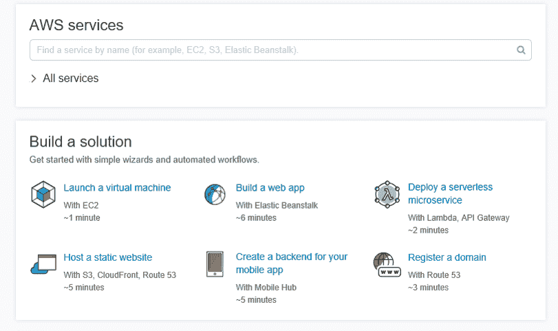
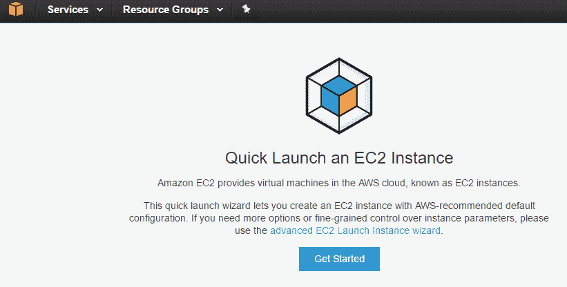
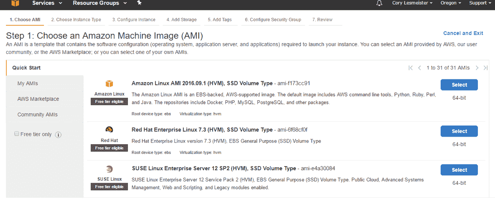
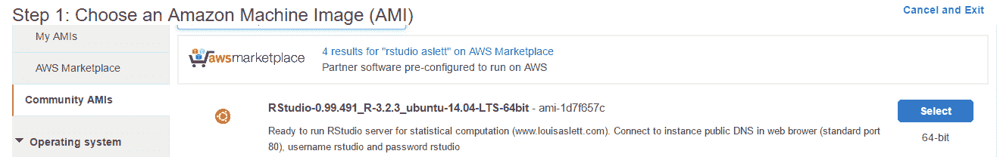
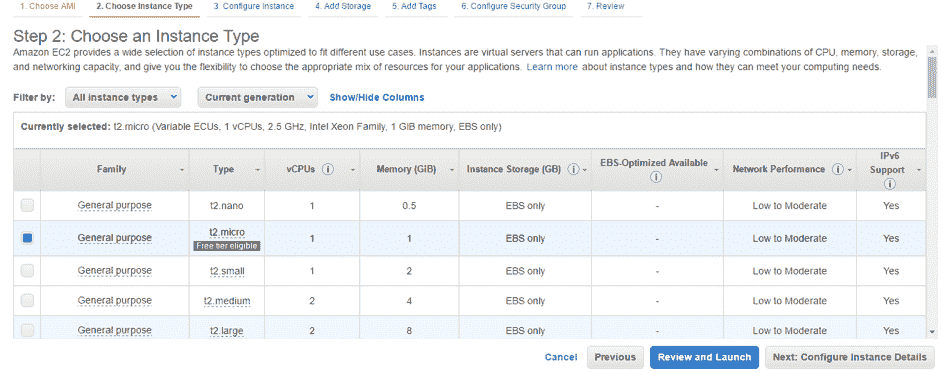
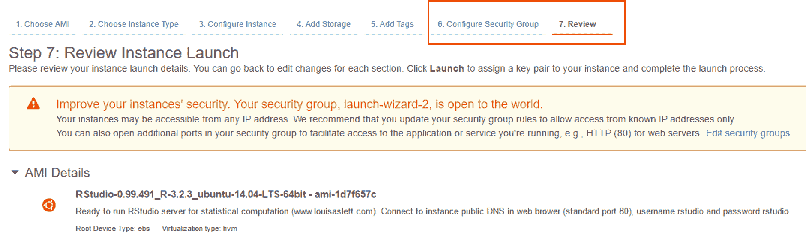
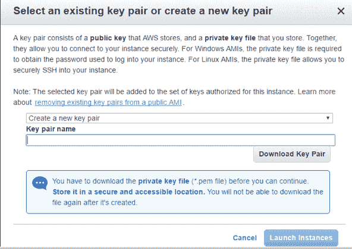
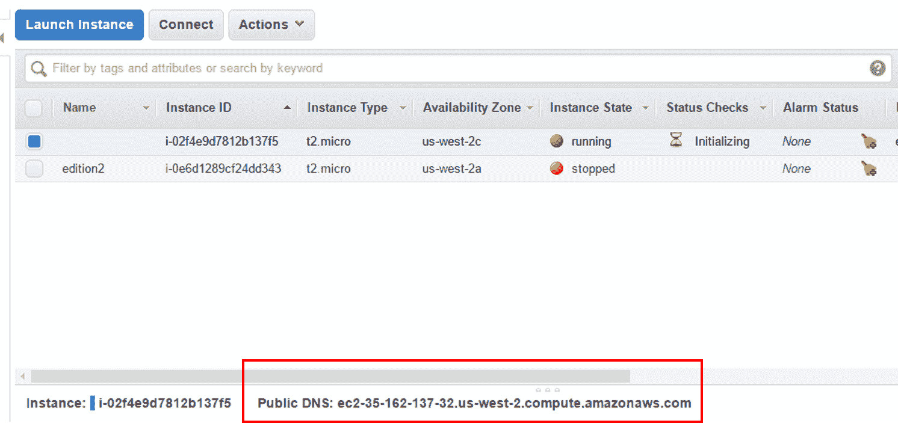
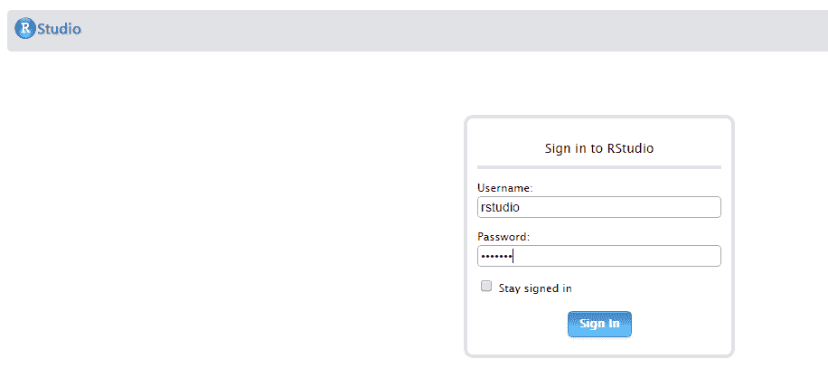
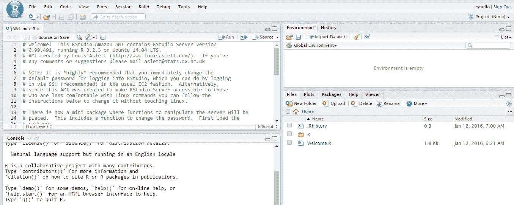

# 第十四章：云上的 R

“如果有人问我云计算是什么，我尽量不陷入定义的泥潭。我告诉他们，简单来说，云计算是运行业务的一种更好的方式。”

- 马克·贝尼奥夫，Salesforce.com 首席执行官

由于我不是一个试图从云中获利的公司首席执行官，让我们陷入定义的泥潭。我喜欢微软（TM）提出的这个定义——[`azure.microsoft.com/en-us/overview/what-is-cloud-computing/`](https://azure.microsoft.com/en-us/overview/what-is-cloud-computing/)。

简而言之，云计算是通过互联网（“云”）提供计算服务——服务器、存储、数据库、网络、软件、分析等。提供这些计算服务的公司被称为云服务提供商，通常根据使用情况收费，类似于你在家里为水或电付费的方式。

如果你现在还没有使用云进行机器学习，那么我保证在不久的将来，你一定会用到。我仍然认识一些人对失去数据控制权、安全问题等感到恐惧。然而，正如一位初创公司首席执行官对我说的，我倾向于问他们是否通过 WiFi 在笔记本电脑上访问他们所谓的安全数据，当他们回答是的时候，他们实际上是在告诉我他们已经在云上了，这只是一个硬件存储位置的问题。

就这样。你想要你的办公室地下室排满服务器，还是想让别人用他们安全、冗余和独立的全球基础设施来处理这个问题？

使用基于云的计算与 R 可以促进跨多个地点的无缝工作，同时也为你提供巨大的计算能力，可以根据需要快速扩展或缩减。这可以显著节省成本。

获取云上 R 的途径有很多，但我会使用**亚马逊网络服务**（**AWS**）和他们的**弹性计算云**（**EC2**）进行这次演示，因为这是我首先学习的，也是我熟悉使用的。这并不意味着我推荐它超过其他产品。我不会，除非杰夫·贝索斯选择我参加载人太空任务，那时我的态度才会改变。

无论如何，这里的目的是让你快速在云上启动并运行 R 和 RStudio，而不需要编写任何 Linux 代码。现在，为了最大限度地发挥 AWS 及其令人眼花缭乱的工具的力量，你可以学习如何通过**安全外壳**（**SSH**）应用 Linux 代码。为此，我们将创建并启动一个名为**实例**的虚拟计算机。然后，我们将通过网页浏览器登录到 RStudio，并介绍一些功能。网上有很多关于如何做到这一点的教程，但我的目标是尽可能简单、快速地让你开始，并让你今天就开始在云上使用 R。

# 创建亚马逊网络服务账户

首件事是注册一个 AWS 账户：

[`aws.amazon.com/`](https://aws.amazon.com/)

这是本练习的唯一先决条件。该流程需要一张信用卡，但我们在这里所做的一切都不会花费一分钱，因为它是在一个免费实例上完成的。向前推进，当你需要更大的计算能力时，可以快速启动一个新的实例，完成后停止或终止实例。当你创建账户并登录时，你可以选择是否创建安全组。我将通过在实例创建过程中创建一个新的安全组来演示。安全组允许你控制谁可以以及如何访问实例。此外，除非你真的想创建，否则在这个阶段不要担心创建**配对密钥**。我们也会创建它。

完成后，登录到你的 AWS 控制台，应该会看到一个网页，如下所示：



如果你在这里，现在就是时候通过简单地点击名为“启动虚拟机”的巧妙超链接来创建和启动虚拟机了。

# 启动虚拟机

启动虚拟机的超链接会带你到这个页面：



避免点击“入门”按钮，点击“高级 EC2 启动实例向导”，这将带你到这个页面：



随着你经验的积累，你可以使用各种 **Amazon Machine Images** (**AMI**) 并自定义你在 AWS 上使用 R 的方式。然而，我们的目标在这里是快速且简单。考虑到这一点，AWS 用户已经创建了几个包含 R 和 RStudio 的社区 AMI。因此，在“快速入门”下点击“社区 AMI”。会出现一个搜索框，我建议从 Louis Aslett 维护的 AMI 开始使用，[`www.louisaslett.com/RStudio_AMI/`](http://www.louisaslett.com/RStudio_AMI/)。通过搜索 rstudio aslett，这个 AMI 将会显示出来。因此，点击“选择”按钮，如图所示：



这将带你到第 2 步，在那里你选择实例类型。我选择了免费的 `t2.micro`：



一旦你选择了你想要的实例类型，点击“审查并启动”。由于这是一个现有的 AMI，你可以跳到第 7 步，即“审查”标签。你可以从这里启动，但让我们点击第 6 步，“配置安全组”：



这将带你到流程中的步骤，你可以创建一个新的安全组或使用现有的一个。以下是一个创建新安全组的示例：


一旦你对流程中的这一步满意（你不需要做任何改变），点击“审查并启动”。这将带你回到第 7 步，在那里你可以简单地点击“启动”。这会带你到选择新或现有密钥对的地方：



完成后，点击“启动实例”并返回到你的 AWS 控制台。

# 启动 RStudio

当你的实例正在运行时，当你返回到 AWS 控制台并选择该实例，你会看到如下内容：



注意所选实例的公共 DNS。这将是你启动你选择的浏览器上的 RStudio 所需的所有内容。当你在这个浏览器中启动它时，你会来到 RStudio 登录页面。用户名和密码都是`rstudio`：



就这样！你现在正在虚拟机上运行 RStudio。它应该看起来像这样：



在左上角的面板中，源面板，有如何更改密码的说明以及链接到 Dropbox 的功能。

为了展示如何从网络上加载数据，我将加载我们在前几章中使用过的 github 上的一个`.csv`文件。让我们试试`climate.csv`，好吗？首先，需要安装并加载`RCurl`包：

```py
 > install.packages("RCurl")

   > library(RCurl) 

```

我们现在需要获取 github 上数据的链接：

```py
 > url <-  
     "https://raw.githubusercontent.com/datameister66/data/master/climate.csv"

```

然后，将文件拖入 RStudio 中：

```py
 > climate <-read.csv(text = getURL(url))

```

并且，确保它已经工作：

```py
 > head(climate)
      Year CO2   Temp
    1 1919 806 -0.272
    2 1920 932 -0.241
    3 1921 803 -0.187
    4 1922 845 -0.301
    5 1923 970 -0.272
    6 1924 963 -0.292

```

就这样。你现在已经成为了一名基于云的机器学习战士，几乎可以在虚拟机上像在自己的机器上一样操作。

请记住，一旦你完成并退出 RStudio，一定要回到你的控制台并停止实例。

# 摘要

在本章的最后，我们快速简单地介绍了如何在云上运行 R 和 RStudio。利用 AWS 进行这项练习，我们一步一步地介绍了如何在云上创建虚拟机（实例），配置它，启动它，并在网页浏览器上启动 RStudio。最后，我们介绍了如何轻松加载数据，通过从 GitHub 引入气候`.csv`文件。通过这个云计算的介绍，你现在可以在任何有互联网连接的地方进行工作，并且可以快速调整实例的功率以满足你的需求。这标志着本书主要章节的结束。我希望你喜欢它，并且能够实施这里的方法以及其他你随着时间的推移所学习的方法。谢谢！
