# 第十五章：R 基础知识

“我最有生产力的一天就是扔掉了 1,000 行代码。”

- Ken Thompson

本章涵盖了 R 的基本编程语法函数和功能。其目的是向您介绍 R 并加速您的学习。目标如下：

+   安装 R 和 RStudio

+   创建和探索向量

+   创建数据框和矩阵

+   探索数学和统计函数

+   构建简单的图表

+   介绍`dplyr`数据操作

+   安装和加载包

附录中的所有示例都在前面的章节中以某种方式进行了覆盖。然而，如果您是 R 的完全新手，这是一个很好的起点。它可能会加速您对章节内容的理解。

# 让 R 运行起来

我们在这里想要完成两件事：首先，安装 R 的最新版本，其次，安装 RStudio，它是 R 的**集成开发环境**（**IDE**）。

让我们从访问 R 的主页[`www.r-project.org/`](https://www.r-project.org/)开始。这个页面看起来与以下截图相似：

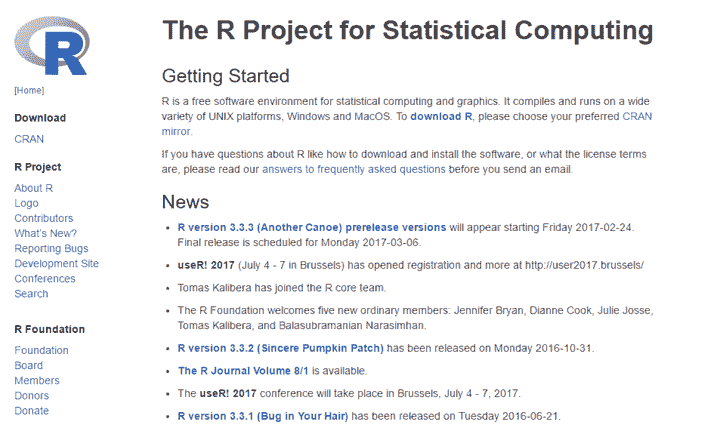

您可以看到有一个链接，下载 R，在新闻部分，最新的 R 版本是 3.3.2（真诚的南瓜地），发布于 2016-10-31。版本 3.3.3 计划于 3 月发布。现在，点击其中一个链接，无论是下载部分下的 CRAN 还是入门部分下的下载 R，您将来到以下屏幕，其中包含 CRAN 镜像：

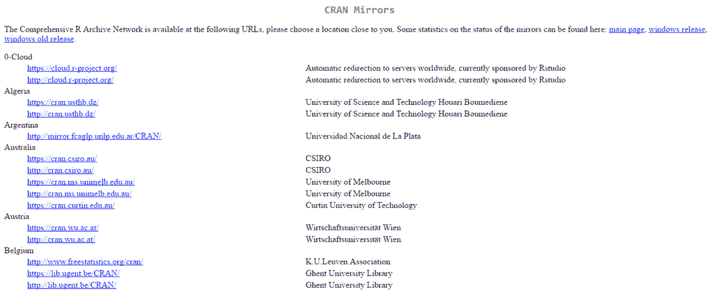

这些是根据国家和字母顺序排序的链接，它们将带您到下载页面。作为美国人，我会向下滚动并找到许多可用的链接：

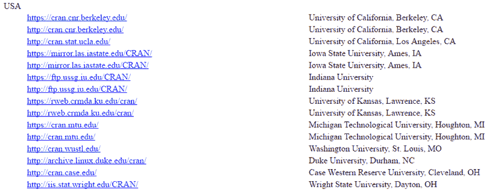

一旦您找到一个接近您位置的类似链接，点击它，您将看到以下页面的一部分，该页面将被加载：

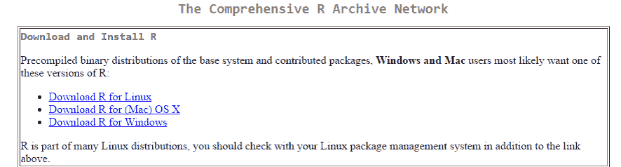

现在，点击您适当的操作系统：

我们现在想要安装基础 R，因此点击首次安装 R，我们将来到以下页面，其中包含启动下载的链接：

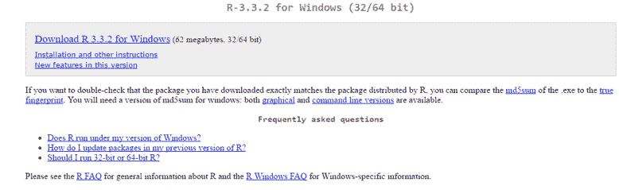

现在，您只需像安装其他程序一样下载并安装 R。安装完成后，运行 R，您将看到基本的**图形用户界面**（**GUI**）：

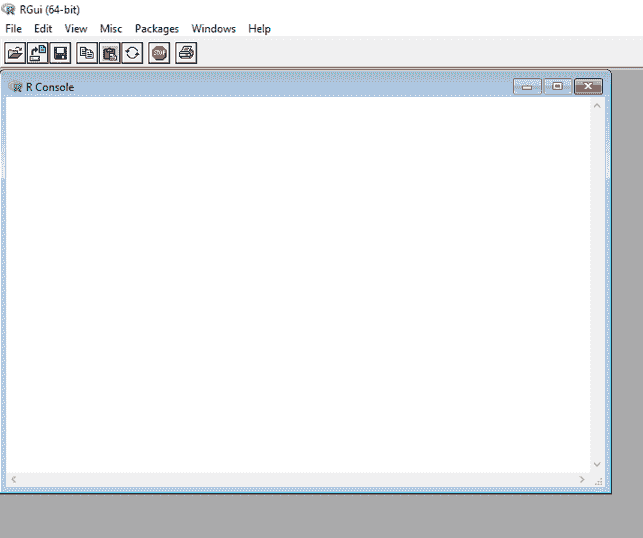

这就是您运行本书中所有代码所需的所有内容。然而，如果您在 RStudio 的 IDE 环境中使用 R，这将非常有帮助，RStudio 是免费提供的。此链接将带您到可以下载免费版本的页面：

[`www.rstudio.com/products/RStudio/`](https://www.rstudio.com/products/RStudio/)

在页面上，你可以找到免费和商业版本的下载。不用说，让我们坚持使用免费版本，下载并安装它。安装并首次打开后，你会看到如下内容。请注意，你的屏幕将与我这里看到的不同，这取决于我加载的包和操作系统：

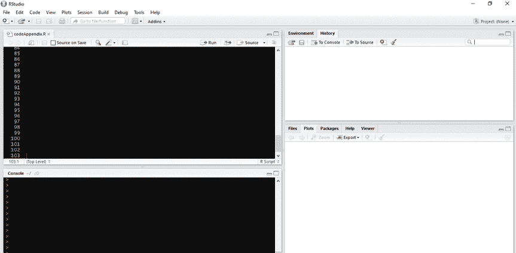

注意，在左边是相同的控制台，你可以看到先前的图中的命令提示符。IDE 改进了体验，让你可以管理环境和历史记录（右上角）以及文件、绘图、包和帮助（右下角）。

让我们不要在这里被 RStudio 能做什么的完整教程所分散注意力；相反，我们将专注于几个重要项目。R 的一个巨大好处是，它为各种分析提供了大量高质量的包。让我们看看 IDE 是如何通过加载一个名为`abc`的包来将这些全部联系起来的，它代表近似贝叶斯计算。转到命令提示符并输入以下内容：

```py
    > install.packages("abc")

```

运行此代码后，注意在右下角的面板（确保已点击“包”标签）中，`abc`包以及依赖的`abc.data`包现在都已安装。

现在，转到右上角并点击历史记录标签。你应该能看到你执行以加载包的命令：

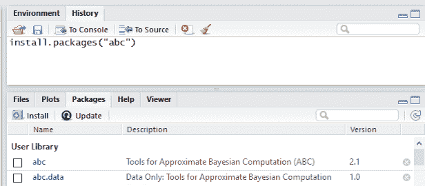

现在，如果你点击“发送到控制台”按钮，将会在命令提示符前放置什么。如果你点击“发送到源”，将打开一个新区域，允许你将你的项目脚本组合起来。

`install.packages()`命令现在已从历史记录转移到源文件。当你对你的代码进行实验并使其按你的意愿工作后，将其放入源文件。你可以保存它、发送电子邮件等等。本书每一章的所有代码都保存为源文件。

# 使用 R

在所有系统都准备就绪后，让我们开始我们的第一个命令。R 将接受带引号的字符串或简单的数字。这里，我们将一个命令作为字符串，一个命令作为数字。输出与输入相同：

```py
    > "Let's Go Sioux!"
    [1] "Let's Go Sioux!"

    > 15
    [1] 15

```

R 也可以作为计算器使用：

```py
    > ((22+5)/9)*2
    [1] 6

```

R 开始发光的地方是在向量的创建。这里，我们将使用`c()`函数，它代表将值组合到向量或列表（连接），将斐波那契数列的前 10 个数字放入一个向量中：

```py
    > c(0, 1, 1, 2, 3, 5, 8, 13, 21, 34) #Fibonacci sequence
     [1]  0  1  1  2  3  5  8 13 21 34

```

注意，在这个语法中，我包含了一个注释，“斐波那契数列”。在 R 中，命令行上的`#`键之后的内容不会被执行。

现在，让我们创建一个包含序列这些数字的对象。你可以将任何向量或列表分配给一个对象。在大多数 R 代码中，你会看到分配符号`<-`，它读作 gets。这里，我们将创建一个名为`x`的对象，用于斐波那契数列：

```py
    > x <- c(0, 1, 1, 2, 3, 5, 8, 13, 21, 34)

```

要查看`x`对象的内容，只需在命令提示符中输入即可：

```py
    > x
     [1]  0  1  1  2  3  5  8 13 21 34

```

你可以使用括号在对象后面选择向量的子集。这将得到序列的前三个观测值：

```py
    > x[1:3]
    [1] 0 1 1

```

你可以在括号中的数字前使用负号来排除观测值：

```py
    > x[-5:-6]
    [1]  0  1  1  2  8 13 21 34

```

为了可视化这个序列，我们将使用 `plot()` 函数：

```py
    > plot(x)

```

前一个命令的输出如下：

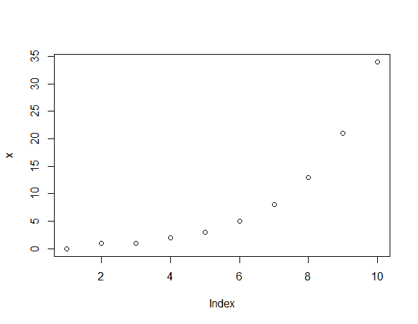

使用 `main=...`，`xlab=...` 和 `ylab=...` 添加标题和坐标轴标签很容易：

```py
    > plot(x, main = "Fibonacci Sequence", xlab = "Order", ylab = "Value")

```

前一个命令的输出如下：

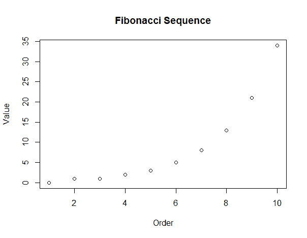

我们可以用大量的函数在 R 中转换一个向量。在这里，我们将创建一个新的对象 `y`，它是 `x` 的平方根：

```py
    > y <- sqrt(x)

    > y
    [1] 0.000000 1.000000 1.000000 1.414214 1.732051 2.236068  2.828427
    [8] 3.605551 4.582576 5.830952

```

在这里，重要的是要指出，如果你不确定函数中可以使用什么语法，那么在它前面使用 `?` 将会弹出该主题的帮助。试试看！

```py
    > ?sqrt

```

这将打开函数的帮助。通过创建 `x` 和 `y`，可以生成一个散点图：

```py
    > plot(x, y)

```

以下为前一个命令的输出：

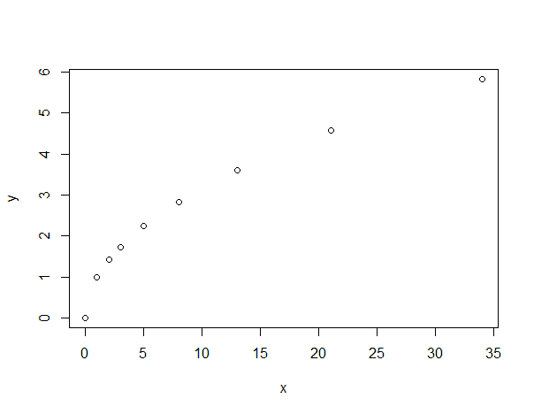

现在，让我们看看创建另一个常量对象。然后，我们将使用这个对象作为标量并将其乘以 `x` 向量，创建一个新的向量 `x2`：

```py
    > z <- 3

    > x2 <- x * z

    > x2
     [1]   0   3   3   6   9  15  24  39  63 102

```

R 允许你执行逻辑测试。例如，让我们测试一个值是否小于另一个值：

```py
    > 5 < 6
    [1] TRUE

    > 6 < 5
    [1] FALSE

```

在第一种情况下，R 返回 `TRUE`，在第二种情况下，`FALSE`。如果你想找出一个值是否等于另一个值，那么你会使用两个等号（一个相等测试）。记住，等号赋值而不测试相等。这里有一个例子，我们想看看我们创建的斐波那契数列中的任何值是否等于零：

```py
    > x == 0
     [1]  TRUE FALSE FALSE FALSE FALSE FALSE FALSE FALSE FALSE FALSE

```

输出提供了一个列表，我们可以清楚地看到 `x` 向量的第一个值确实是零。简而言之，R 的关系运算符 <=, <, ==, >, >=, 和 != 分别代表小于等于，小于，等于，大于，大于等于，和不等。

我们应该讨论几个函数，即 `rep()` 和 `seq()`，它们在创建自己的向量时很有用。例如，`rep(5, 3)` 会将值 `5` 复制三次。它也适用于字符串：

```py
    > rep("North Dakota Hockey, 2016 NCAA Division 1 Champions", times=3)
    [1] "North Dakota Hockey, 2016 NCAA Division 1 Champions"
    [2] "North Dakota Hockey, 2016 NCAA Division 1 Champions"
    [3] "North Dakota Hockey, 2016 NCAA Division 1 Champions"

```

为了演示 `seq()`，假设我们想创建一个从 `0` 到 `10`，`by = 2` 的数字序列。那么代码如下：

```py
    > seq(0, 10, by = 2)
    [1]  0  2  4  6  8 10

```

# 数据框和矩阵

现在，我们将创建一个数据框，它是一组变量（向量）。我们将创建一个包含 `1`，`2` 和 `3` 的向量，以及另一个包含 `1`，`1.5` 和 `2.0` 的向量。一旦完成，`rbind()` 函数将允许我们合并行：

```py
    > p <- seq(1:3)

    > p
    [1] 1 2 3

    > q = seq(1, 2, by = 0.5)

    > q
    [1] 1.0 1.5 2.0

    > r <- rbind(p, q)

    > r
      [,1] [,2] [,3]
    p    1  2.0    3
    q    1  1.5    2

```

结果是一个包含两行，每行三个值的列表。你可以始终使用 `str()` 函数确定你的数据结构，在这个例子中，它显示我们有两个列表，一个名为 `p`，另一个名为 `q`：

```py
    > str(r)
     num [1:2, 1:3] 1 1 2 1.5 3 2
     - attr(*, "dimnames")=List of 2
      ..$ : chr [1:2] "p" "q"
      ..$ : NULL

```

现在，让我们使用 `cbind()` 将它们作为列组合起来：

```py
    > s <- cbind(p, q)

    > s
         p   q
    [1,] 1 1.0
    [2,] 2 1.5
    [3,] 3 2.0

```

要将它们放入数据框中，请使用 `data.frame()` 函数。之后，检查结构：

```py
    > s <- data.frame(s)

    > str(s)
    'data.frame':3 obs. of  2 variables:
     $ p: num  1 2 3
     $ q: num  1 1.5 2

```

现在我们有一个数据框`(s)`，它有两个变量，每个变量有三个观测值。我们可以使用`names()`更改变量的名称：

```py
    > names(s) <- c("column 1", "column 2")

    > s
      column 1 column 2
    1        1      1.0
    2        2      1.5
    3        3      2.0

```

让我们尝试使用`as.matrix()`将这个内容放入矩阵格式。在某些包中，R 要求在数据框上进行分析，但在其他包中则要求使用矩阵。你可以根据需要在这两者之间切换：

```py
    > t <- as.matrix(s)

    > t
         column 1 column 2
    [1,]        1      1.0
    [2,]        2      1.5
    [3,]        3      2.0

```

你可以做的事情之一是检查一个特定值是否在矩阵或数据框中。例如，我们想知道第一个观测值和第一个变量的值。在这种情况下，我们需要在括号中指定第一行和第一列，如下所示：

```py
    > t[1,1]
    column 1 
           1

```

假设你想查看第二个变量（列）中的所有值。那么，只需留空行，但记得在你想查看的列（s）之前使用逗号：

```py
    > t[,2]
    [1] 1.0 1.5 2.0

```

相反，假设我们只想查看前两行。在这种情况下，只需使用冒号符号：

```py
    > t[1:2,]
         column 1 column 2
    [1,]        1      1.0
    [2,]        2      1.5

```

假设你有一个包含 100 个观测值和 10 个变量的数据框或矩阵，并且你想要创建一个包含前`70`个观测值和变量`1`、`3`、`7`、`8`、`9`和`10`的子集。这会是什么样子？

好吧，使用冒号、逗号、连接函数和括号，你可以简单地做以下操作：

```py
    > new <- old[1:70, c(1,3,7:10)]

```

注意你可以轻松地操作你想要的观测值和变量。你也可以轻松地排除变量。比如说，我们只想排除第一个变量；那么你可以使用负号对第一个变量进行以下操作：

```py
    > new <- old[, -1]

```

在 R 中，这种语法对于基本的数据操作非常强大。在主要章节中，我们还将介绍更多高级的数据操作技术。

# 创建汇总统计量

现在，我们将介绍一些关于集中趋势、离散度和简单图表的基本度量。我们将首先解决的问题是如何处理 R 在计算中的缺失值？为了查看会发生什么，创建一个包含缺失值（R 语言中的`NA`）的向量，然后使用`sum()`计算向量的值：

```py
    > a <- c(1, 2, 3, NA)

    > sum(a)
    [1] NA

```

与 SAS 不同，SAS 会求和所有非缺失值，而 R 不会求和所有非缺失值，而是简单地返回`NA`，表示至少有一个值是缺失的。现在，我们可以创建一个新的向量，删除缺失值，但你也可以包含用于排除任何缺失值的语法`na.rm = TRUE`：

```py
    > sum(a, na.rm = TRUE)
    [1] 6

```

存在函数可以识别向量的集中趋势和离散度的度量：

```py
    > data <- c(4, 3, 2, 5.5, 7.8, 9, 14, 20)

    > mean(data)
    [1] 8.1625

    > median(data)
    [1] 6.65

    > sd(data)
    [1] 6.142112

    > max(data)
    [1] 20

    > min(data)
    [1] 2

    > range(data)
    [1]  2 20

    > quantile(data)
    0%   25%   50%   75%  100% 
    2.00  3.75  6.65 10.25 20.00 

```

`summary()`函数可用，包括`mean`、`median`和`quartile`值：

```py
    > summary(data)
    Min. 1st Qu.  Median    Mean 3rd Qu.    Max. 
      2.000   3.750   6.650   8.162  10.250  20.000

```

我们可以使用图表来可视化数据。这里的基线图表将是`barplot`，然后我们将使用`abline()`来包含`mean`和`median`。由于默认线条是实线，我们将使用`lty = 2`创建一个虚线来区分`median`和`mean`：

```py
    > barplot(data)

    > abline(h = mean(data))

    > abline(h = median(data), lty = 2)

```

上述命令的输出如下：

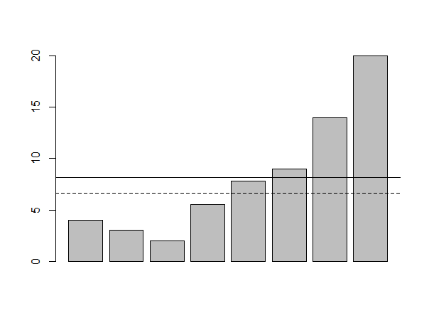

有许多函数可用于生成不同的数据分布。在这里，我们可以查看一个用于均值为零、标准差为 1 的正态分布的函数，使用 `rnorm()` 创建 `100` 个数据点。然后我们将绘制这些值，并绘制直方图。此外，为了重复结果，请确保使用 `set.seed()` 使用相同的随机种子：

```py
    > set.seed(1)

    > norm = rnorm(100)

```

这是 `100` 个数据点的分布图：

```py
    > plot(norm)

```

以下是指令的输出：

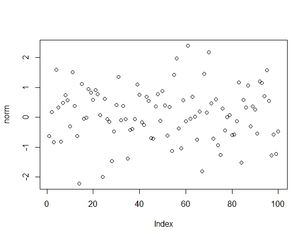

最后，使用 `hist(norm)` 生成直方图：

```py
    > hist(norm)

```

以下是指令的输出：

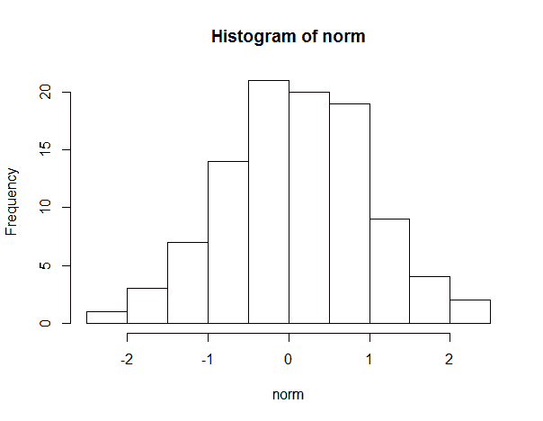

# 安装和加载 R 包

我们之前讨论了如何使用 `install()` 函数安装 R 包。为了使用已安装的包，你还需要将其加载到 R 环境中才能使用。让我们再次进行操作，首先是 RStudio 中的安装，然后是加载包。查找并点击包标签。你应该会看到类似以下内容：

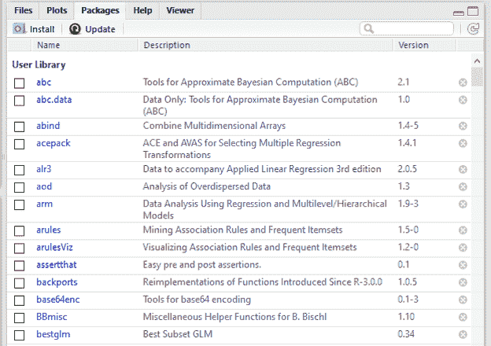

现在，让我们安装 R 包 `xgboost`。点击安装图标，在弹出窗口的包部分输入包名：

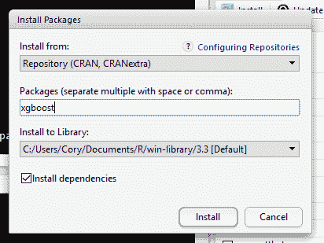

点击安装按钮。一旦包完全安装，命令提示符将返回。为了加载包以便使用，只需要 `library()` 函数：

```py
    > library(xgboost)

```

通过这种方式，你现在可以使用包中内置的函数了。

# 使用 dplyr 进行数据操作

在过去几年里，我越来越多地使用 `dplyr` 来操作和总结数据。它比使用基础函数更快，允许你串联函数，并且一旦熟悉它，就有更用户友好的语法。根据我的经验，只需要几个函数就能完成大部分数据操作需求。按照上述说明安装包，然后将其加载到 R 环境中。

```py
 > library(dplyr)

```

让我们探索 R 基础包中可用的 `iris` 数据集。其中两个最有用的函数是 `summarize()` 和 `group_by()`。在下面的代码中，我们看到如何生成按 `Species` 分组的 `Sepal.Length` 均值的表格。我们将均值放入的变量将被命名为 `average`。

```py
 > summarize(group_by(iris, Species), average = mean(Sepal.Length))
 # A tibble: 3 X 2
 Species average
 <fctr>   <dbl>
 1     setosa   5.006
 2 versicolor   5.936
 3  virginica   6.588

```

有许多汇总函数：`n`（数量）、`n_distinct`（唯一数量）、`IQR`（分位数范围）、`min`（最小值）、`max`（最大值）、`mean`（均值）和`median`（中位数）。

另一个帮助你和其他人阅读代码的工具是管道操作符 `%>%`。使用管道操作符，你可以将函数串联起来，而不是将它们包裹在彼此内部。你从想要使用的 dataframe 开始，然后将函数串联起来，第一个函数的值/参数传递给下一个函数，依此类推。这就是我们之前如何使用管道操作符来产生相同结果的方法。

```py
 > iris %>% group_by(Species) %>% summarize(average = 
      mean(Sepal.Length))
 # A tibble: 3 X 2
 Species average
 <fctr>   <dbl>
 1     setosa   5.006
 2 versicolor   5.936
 3  virginica   6.588

```

`distinct()` 函数允许我们查看变量中的唯一值。让我们看看在 `Species` 中存在哪些不同的值。

```py
 > distinct(iris, Species)
 Species
 1     setosa
 2 versicolor
 3  virginica

```

使用 `count()` 函数将自动对变量的每个级别进行计数。

```py
 > count(iris, Species)
 # A tibble: 3 X 2
 Species     n
 <fctr> <int>
 1     setosa    50
 2 versicolor    50
 3  virginica    50

```

基于匹配条件选择特定行怎么办？为此我们有 `filter().` 让我们选择所有 Sepal.Width 大于 3.5 的行并将它们放入一个新的数据框中：

```py
 > df <- filter(iris, Sepal.Width > 3.5)

```

让我们看看这个数据框，但首先我们想要按 `Petal.Length` 的降序排列值：

```py
 > df <- arrange(iris, desc(Petal.Length))
 > head(df)
 Sepal.Length Sepal.Width Petal.Length Petal.Width   Species
 1          7.7         2.6          6.9         2.3 virginica
 2          7.7         3.8          6.7         2.2 virginica
 3          7.7         2.8          6.7         2.0 virginica
 4          7.6         3.0          6.6         2.1 virginica
 5          7.9         3.8          6.4         2.0 virginica
 6          7.3         2.9          6.3         1.8 virginica

```

好的，我们现在想要选择感兴趣的变量。这是通过 `select()` 函数完成的。接下来，我们将创建两个数据框，一个包含以 `Sepal` 开头的列，另一个包含 `Petal` 列和 `Species` 列--换句话说，列名不是以 `Se` 开头的。这可以通过在函数中使用这些特定名称来完成；或者，如下所示，使用 `starts_with` 语法：

```py
 > iris2 <- select(iris, starts_with("Se"))

    > iris3 <- select(iris, -starts_with("Se")) 

```

好的，让我们把它们放在一起。还记得之前的 `cbind()` 吗？使用 `dplyr` 你可以使用 `bind_cols()` 函数，它将它们放入一个数据框中。请注意，就像 `cbind()` 一样，它将通过位置匹配行。如果你有行名或某些其他键，例如客户 ID 等，你可以使用 `left_join()` 和 `inner_join()` 等函数来合并数据。由于我们的行匹配，这个命令将正常工作。

```py
 > theIris <- bind_cols(iris2, iris3)
      head(theIris)
      head(iris) 

```

亲自使用 `head()` 函数比较 `iris` 和 `iris` 的前六行，你会看到它们是完全匹配的。如果你想像我们上面使用 `rbind()` 那样连接数据，可以使用 `bind_rows()` 函数。那么，如果我们想看看有多少独特的 Sepal.Width 测量值呢？回想一下，数据集中总共有 150 个观测值。我们已经使用了 `distinct()` 和 `count()`。此代码将只给出唯一值的数量，即 `23:`

```py
 > summarize(iris, n_distinct(Sepal.Width))
 n_distinct(Sepal.Width)
 1                     23

```

在几乎任何大量数据中，都存在重复观测值，或者它们是通过复杂的连接创建的。使用 `dplyr` 的 `dedupe()` 非常简单。例如，假设我们只想创建一个包含 `Sepal.Width` 唯一值的 `dataframe`，并希望保留所有列。这将有效：

```py
 > dedupe <- iris %>% distinct(Sepal.Width, .keep_all = T)
 > str(dedupe)
 'data.frame': 23 obs. of 5 variables:
 $ Sepal.Length: num 5.1 4.9 4.7 4.6 5 5.4 4.6 4.4 5.4 5.8 ...
 $ Sepal.Width : num 3.5 3 3.2 3.1 3.6 3.9 3.4 2.9 3.7 4 ...
 $ Petal.Length: num 1.4 1.4 1.3 1.5 1.4 1.7 1.4 1.4 1.5 1.2 ...
 $ Petal.Width : num 0.2 0.2 0.2 0.2 0.2 0.4 0.3 0.2 0.2 0.2 ...
 $ Species : Factor w/ 3 levels "setosa","versicolor",..: 1 1 1 1 1 
     1 1 1 1 1

```

注意，我使用了管道操作符将 `iris` 连接到函数，并在 `distinct()` 中指定 `.keep_all = T`，这样所有列都会出现在新的数据框中；否则只有 `Sepal.Width` 会进入。

这就是了。如果你想提高在 R 中数据整理的效率，不妨试试 `dplyr`。

# 摘要

本附录的目的是让 R 语言的新手学习编程语言的基础知识，并为书中代码的编写做好准备。这包括学习如何安装 R 和 RStudio 以及创建对象、向量和矩阵。然后，我们探讨了数学和统计函数的一些应用。我们介绍了如何在 RStudio 中使用 R 安装和加载包。最后，我们探讨了`dplyr`在高效操作和总结数据方面的强大功能。在整个附录中，包括了基础和示例的绘图语法。虽然这个附录不会让你成为 R 语言的专家，但它会帮助你跟上书中的示例。
