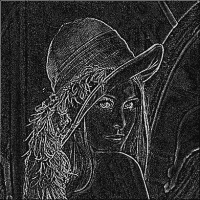
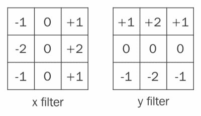
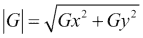
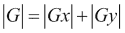
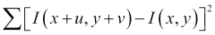
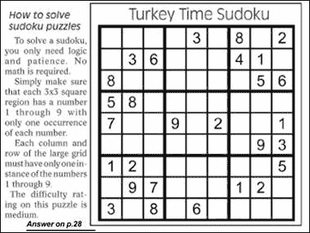
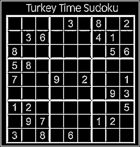

# 第二章. 在图像中检测基本特征

在上一章阅读了图像处理和操作的基本知识之后，我们将探讨一些最广泛使用的算法，这些算法用于从图像中提取有意义的信息，形式为边缘、线条、圆形、椭圆形、块或轮廓、用户定义的形状和角落。在*计算机视觉*和*图像处理*的背景下，此类信息通常被称为*特征*。在本章中，我们将探讨各种特征检测算法，如边缘和角落检测算法、霍夫变换和轮廓检测算法，以及它们在 Android 平台上的实现，使用 OpenCV。

为了使我们的生活更简单，并对本章有一个清晰的理解，我们将首先创建一个基本的 Android 应用程序，我们将向其中添加不同特征检测算法的实现。这将减少我们为本章中的每个算法必须编写的额外代码量。

# 创建我们的应用程序

让我们创建一个非常基本的 Android 应用程序，该程序将从您的手机相册中读取图像，并使用*ImageView*控件在屏幕上显示它们。该应用程序还将有一个菜单选项打开相册以选择图像。

我们将从一个新的 Eclipse（或 Android Studio）项目开始，创建一个空白活动，并让我们将我们的应用程序命名为**功能应用**。

### 注意

在对应用程序进行任何操作之前，请在您的应用程序中初始化 OpenCV（有关如何在 Android 项目中初始化 OpenCV 的信息，请参阅第一章，*对图像应用效果*）。

在空白活动中添加一个`ImageView`控件（用于显示图像），如下面的代码片段所示：

```py
<ImageView
        android:layout_width="fill_parent"
        android:layout_height="fill_parent"
        android:id="@+id/image_view"
        android:visibility="visible"/>
```

在应用程序菜单中添加一个`OpenGallery`菜单选项以打开手机的相册并帮助我们选择一张图片。为此，在项目的菜单资源 XML 文件中添加一个新的菜单项（文件的默认位置是`/res/menu/filename.xml`），如下所示：

```py
<item android:id="@+id/OpenGallery" android:title="@string/OpenGallery"
        android:orderInCategory="100" android:showAsAction="never" />
```

### 提示

关于 Android 中菜单的更详细信息，请参阅[`developer.android.com/guide/topics/ui/menus.html`](http://developer.android.com/guide/topics/ui/menus.html)。

现在我们让`OpenGallery`菜单选项变得可用。Android API 提供了一个`public boolean onOptionsItemSelected(MenuItem item)`函数，允许开发者编程选项选择事件。在这个函数中，我们将添加一段代码，这将打开手机的相册以选择一张图片。Android API 提供了一个预定义的 intent `Intent.ACTION_PICK`专门用于这个任务；即打开相册并选择一张图片。我们将为此应用程序使用这个 intent，如下所示：

```py
Intent intent = new Intent(Intent.ACTION_PICK, Uri.parse("content://media/internal/images/media"));
```

让我们修改`public boolean onOptionsItemSelected(MenuItem item)`函数，使其按我们的需求工作。

函数的最终实现应如下所示：

```py
public boolean onOptionsItemSelected(MenuItem item) {
        // Handle action bar item clicks here. The action bar will
        // automatically handle clicks on the Home/Up button, so long
        // as you specify a parent activity in AndroidManifest.xml.
        int id = item.getItemId();

        //noinspection SimplifiableIfStatement
        if (id == R.id.action_settings) {
            return true;
        }
        else if (id == R.id.open_gallery) {
            Intent intent = new Intent(Intent.ACTION_PICK, Uri.parse("content://media/internal/images/media"));
            startActivityForResult(intent, 0);
        }
    }
```

这段代码只有一些易于理解的 if else 语句。这里你需要理解的是 `startActivityForResult()` 函数。正如你可能已经意识到的，我们希望将来自 `ACTION_PICK Intent` 的图像数据带到我们的应用程序中，以便我们以后可以用作特征检测算法的输入。因此，我们不是使用 `startActivity()` 函数，而是使用 `startActivityForResult()`。用户完成后续活动后，系统会调用 `onActivityResult()` 函数，并附带从调用意图返回的结果，在我们的例子中是图库选择器。我们现在的工作是实现符合我们应用程序的 `onActivityResult()` 函数。让我们首先列举一下我们想要对返回的图像做什么。实际上并不多；纠正图像的方向，并使用我们在本节开头添加到活动中的 `ImageView` 在屏幕上显示它。

### 注意

你可能想知道什么是纠正图像方向。在任何 Android 手机上，可能有多个图像来源，例如原生的相机应用程序、Java 相机应用程序或任何其他第三方应用程序。每个都可能以不同的方式捕获和存储图像。现在，在你的应用程序中，当你加载这些图像时，它们可能已经以某个角度旋转。在我们将这些图像用于应用程序之前，我们应该纠正它们的方向，以便它们对应用程序用户有意义。我们现在将查看执行此操作的代码。

以下是我们应用程序的 `onActivityResult()` 函数：

```py
protected void onActivityResult(int requestCode, int resultCode, Intent data) {
        super.onActivityResult(requestCode, resultCode, data);

        if (requestCode == 0 && resultCode == RESULT_OK && null != data) {
            Uri selectedImage = data.getData();
            String[] filePathColumn = {MediaStore.Images.Media.DATA};

            Cursor cursor = getContentResolver().query(selectedImage,
                    filePathColumn, null, null, null);
            cursor.moveToFirst();

            int columnIndex = cursor.getColumnIndex(filePathColumn[0]);
            String picturePath = cursor.getString(columnIndex);
            cursor.close();

            // String picturePath contains the path of selected Image

            //To speed up loading of image
            BitmapFactory.Options options = new BitmapFactory.Options();
            options.inSampleSize = 2;

            Bitmap temp = BitmapFactory.decodeFile(picturePath, options);

            //Get orientation information
            int orientation = 0;
            try {
                ExifInterface imgParams = new ExifInterface(picturePath);
                orientation = imgParams.getAttributeInt(ExifInterface.TAG_ORIENTATION, ExifInterface.ORIENTATION_UNDEFINED);

            } catch (IOException e) {
                e.printStackTrace();
            }

            //Rotating the image to get the correct orientation
            Matrix rotate90 = new Matrix();
            rotate90.postRotate(orientation);
            originalBitmap = rotateBitmap(temp,orientation);

            //Convert Bitmap to Mat
            Bitmap tempBitmap = originalBitmap.copy(Bitmap.Config.ARGB_8888,true);
            originalMat = new Mat(tempBitmap.getHeight(), tempBitmap.getWidth(), CvType.CV_8U);
            Utils.bitmapToMat(tempBitmap, originalMat);

            currentBitmap = originalBitmap.copy(Bitmap.Config.ARGB_8888,false);
            loadImageToImageView();
        }
    }
```

让我们看看这段长代码做了什么。首先，我们进行一次合理性检查，看看结果是否来自适当的意图（即图库选择器），通过检查 `requestCode` 和 `resultCode`。完成这个步骤后，我们尝试从你的手机文件系统中检索图像的路径。从 `ACTION.PICK` 意图，我们获取所选图像的 `Uri`，我们将将其存储在 `Uri selectedImage` 中。为了获取图像的确切路径，我们使用 `Cursor` 类。我们使用它初始化一个新的 `Cursor` 类对象，指向我们的 `selectedImage`。使用 `MediaStore.Images.Media.DATA`，我们获取所选图像的列索引，然后最终使用之前声明的 cursor 类获取图像的路径，并将其存储在一个字符串 `picturePath` 中。在我们得到图像的路径后，我们创建一个新的 Bitmap 对象 temp 来存储图像。到目前为止，我们已经能够读取图像并将其存储在位图对象中。接下来我们需要纠正方向。为此，我们首先使用 `ExifInterface` 类从图像中提取方向信息。正如你在代码中所见，`ExifInterface` 类通过 `ExifInterface.TAG_ORIENTATION` 给我们方向信息。使用这个方向信息，我们使用 `rotateBitmap()` 函数相应地旋转我们的位图。

### 注意

关于`rotateBitmap()`函数的实现，请参考本书附带的代码包。

在纠正方向后，我们创建两个位图的副本：一个用于存储原始图像（`originalBitmap`），另一个用于存储处理过的位图（`currentBitmap`），即存储应用于原始位图的不同算法的输出。剩下的唯一部分是将图像显示在屏幕上。创建一个新的函数`loadImageToView()`，并向其中添加以下行：

```py
private void loadImageToImageView()
    {
        ImageView imgView = (ImageView) findViewById(R.id.image_view);
        imgView.setImageBitmap(currentBitmap);
    }
```

第一行创建了一个`ImageView`实例，第二行将图像设置到视图中。很简单！

最后一件事情，我们的应用程序就准备好了！由于我们的应用程序将要从永久存储中读取数据（从外部存储读取图像），我们需要权限。在`AndroidManifest.xml`文件中添加以下行，这将允许应用程序访问外部存储以读取数据：

```py
<uses-permission android:name="android.permission.READ_EXTERNAL_STORAGE"/>
```

现在我们已经建立了基本的应用程序，让我们来看看不同的特征检测算法，从边缘和角点检测、霍夫变换和轮廓开始。

# 边缘和角点检测

边缘检测和角点检测是两种最基本的特征检测算法，也是非常有用的算法。了解图像中的边缘信息在许多应用中非常有帮助，在这些应用中，你想要找到图像中不同对象的边界，或者当你想要分析对象在给定的一系列图像（或视频）中的旋转或移动时，你需要找到图像中的角点。在本节中，我们将探讨各种边缘和角点检测算法的技术和实现，例如高斯差分、Canny 边缘检测器、Sobel 算子和 Harris 角点。

## 高斯差分技术

让我们从最简单和最基本的技术开始。在我们理解**高斯差分**（**DoG**）是如何工作的之前，让我们看看边缘究竟是什么。简单来说，边缘是图像中像素强度发生显著变化的点。我们将利用边缘的这一特性，通过对图像应用高斯模糊，来计算边缘点（边缘）。

这里是对算法的三个步骤的解释：

1.  将给定的图像转换为灰度图像。

1.  在灰度图像上，使用两个不同的模糊半径进行高斯模糊（在此步骤之后，你应该有两个高斯模糊后的图像）。

1.  从上一步生成的两个图像中减去（算术减法）以获得只包含边缘点（边缘）的结果图像。

为什么这种技术有效？减去两个高斯模糊图像是如何给我们边缘点的？高斯滤波器用于平滑图像，平滑的程度取决于模糊半径。考虑一个棋盘图像。当你对棋盘图像应用高斯滤波器时，你会观察到在白色和黑色方块的中央几乎没有变化，而黑白方块的公共边（即边缘点）会变得模糊，这意味着边缘信息的丢失。高斯模糊使边缘不那么突出。

根据我们的技术，我们有两个具有不同模糊半径的高斯模糊图像。当你从这两个图像中减去时，你会丢失所有没有平滑或模糊的点，即棋盘图像中黑白方块的中央。然而，边缘附近的像素值会发生变化，因为模糊像素值和减去这样的点将给我们一个非零值，这表明是一个边缘点。因此，通过减去两个高斯模糊图像，你得到了边缘点。

由于我们只对图像执行高斯模糊，这是计算边缘最快的方法之一。话虽如此，这也确实是真的，这种技术并不总是能给出很有希望的结果。这种技术对于某些图像可能非常有效，但在某些场景中可能会完全失败。然而，了解一个额外的算法并不会有什么坏处！

让我们修改上一节中创建的 Features App，并对其应用 DoG 技术。在应用程序菜单中，我们使用以下行在菜单资源 XML 文件中添加一个新的菜单选项，*高斯差分*：

```py
<item android:id="@+id/DoG" android:title="@string/DoG"
        android:orderInCategory="100" android:showAsAction="never" />
```

创建一个新的函数 `public void DifferenceOfGaussian()`，它将计算任何给定图像的边缘，如下所示：

```py
public void DifferenceOfGaussian()
    {
        Mat grayMat = new Mat();
        Mat blur1 = new Mat();
        Mat blur2 = new Mat();

        //Converting the image to grayscale
        Imgproc.cvtColor(originalMat,grayMat,Imgproc.COLOR_BGR2GRAY);

        //Bluring the images using two different blurring radius
        Imgproc.GaussianBlur(grayMat,blur1,new Size(15,15),5);
        Imgproc.GaussianBlur(grayMat,blur2,new Size(21,21),5);

        //Subtracting the two blurred images
        Mat DoG = new Mat();
        Core.absdiff(blur1, blur2,DoG);

        //Inverse Binary Thresholding
        Core.multiply(DoG,new Scalar(100), DoG);
        Imgproc.threshold(DoG,DoG,50,255,Imgproc.THRESH_BINARY_INV);

        //Converting Mat back to Bitmap
        Utils.matToBitmap(DoG, currentBitmap);
        loadImageToImageView();
    }
```

在前面的代码片段中，我们首先将图像转换为灰度图像。然后，我们使用 `Imgproc.GaussianBlur()` 函数对图像进行两次高斯滤波，使用两个不同的模糊半径。这个函数的前两个参数分别是输入和输出图像，第三个参数指定了应用滤波器时使用的核的大小，最后一个参数指定了高斯函数中使用的 sigma 值。然后我们使用 `Core.absdiff()` 函数确定图像之间的绝对差异。完成这一步后，我们通过应用 *逆二值阈值* 操作来后处理我们的图像，将边缘点值设置为白色（255）。最后，我们使用 `loadImageToView()` 函数将位图转换为 Mat 并在屏幕上显示。

下面是应用 DoG 技术到 Lenna 图像后的结果：



高斯差分并不常用，因为它已经被我们将在本章后面讨论的更复杂的其他技术所取代。

## Canny 边缘检测器

Canny 边缘检测是计算机视觉中广泛使用的算法，通常被认为是边缘检测的最佳技术。该算法使用了比高斯差分更复杂的技巧，例如多方向上的强度梯度，以及具有阈值化的滞后效应。

算法大致分为四个阶段：

1.  **平滑图像**：这是算法的第一步，通过执行适当的模糊半径的高斯模糊来减少图像中存在的噪声量。

1.  **计算图像的梯度**：在这里，我们计算图像的强度梯度，并将梯度分类为垂直、水平或对角。这一步骤的输出用于在下一阶段计算实际边缘。

1.  **非最大抑制**：使用前一步计算的梯度方向，我们检查一个像素是否是梯度正负方向上的局部最大值，如果不是，则抑制该像素（这意味着像素不是任何边缘的一部分）。这是一种边缘细化技术。选择变化最剧烈的边缘点。

1.  **通过阈值化选择边缘**：这是算法的最终步骤。在这里，我们检查一个边缘是否足够强，可以包含在最终输出中，本质上移除所有不太显著的边缘。

### 小贴士

参考以下链接以获取更详细的解释：[`en.wikipedia.org/wiki/Canny_edge_detector`](http://en.wikipedia.org/wiki/Canny_edge_detector)。

下面的代码是使用 OpenCV for Android 实现的算法。

对于高斯差分，首先通过在菜单资源 XML 文件中添加一个新项将`Canny Edges`选项添加到应用程序菜单中，如下所示：

```py
<item android:id="@+id/CannyEdges" android:title="@string/CannyEdges"
        android:orderInCategory="100" android:showAsAction="never" />
```

创建一个新的函数`public void Canny()`，并将以下代码行添加到其中：

```py
//Canny Edge Detection
    public void Canny()
    {
        Mat grayMat = new Mat();
        Mat cannyEdges = new Mat();
        //Converting the image to grayscale
            Imgproc.cvtColor(originalMat,grayMat,Imgproc.COLOR_BGR2GRAY);

        Imgproc.Canny(grayMat, cannyEdges,10, 100);

        //Converting Mat back to Bitmap
        Utils.matToBitmap(cannyEdges, currentBitmap);
        loadImageToImageView();
    }
```

在前面的代码中，我们首先将图像转换为灰度图像，然后简单地调用 OpenCV API for Android 中实现的`Imgproc.Canny()`函数。这里需要注意的重要事项是`Imgproc.Canny()`函数中的最后两个参数。它们分别代表低阈值和高阈值。在 Canny 边缘检测算法中，我们将图像中的每个点分类为三类之一，即`抑制点`、`弱边缘点`和`强边缘点`。所有强度梯度值低于低阈值值的点被分类为抑制点，强度梯度值在低阈值和高阈值之间的点被分类为弱边缘点，强度梯度值高于高阈值值的点被分类为强边缘点。

根据算法，我们忽略所有被抑制的点。它们不会成为图像中任何边缘的一部分。强边缘点肯定构成边缘的一部分。对于弱边缘点，我们检查它们是否通过检查该弱点周围的八个像素与图像中的任何强边缘点相连。如果那些八个像素中有任何强边缘点，我们将那个弱点计为边缘的一部分。这就是 Canny 边缘检测！

## Sobel 算子

计算图像边缘的另一种技术是使用 Sobel 算子（或 Sobel 滤波器）。与 Canny 边缘检测类似，我们计算像素的强度梯度，但方式不同。在这里，我们通过使用两个 3x3 核（水平和垂直方向各一个）对图像进行卷积来计算近似强度梯度：



Sobel 滤波器中使用的卷积矩阵

使用水平和垂直梯度值，我们使用此公式计算每个像素的绝对梯度：



对于近似梯度，通常使用以下公式：



使用 Sobel 算子计算边缘的步骤如下：

1.  将图像转换为灰度图像。

1.  计算水平方向上的强度梯度的绝对值。

1.  计算垂直方向上的强度梯度的绝对值。

1.  使用前面的公式计算结果梯度。结果梯度值基本上是边缘。

现在我们将 Sobel 滤波器添加到我们的 Features App 中。首先在菜单的 XML 文件中添加一个*Sobel 滤波器*菜单选项：

```py
<item android:id="@+id/SobelFilter" android:title="@string/SobelFilter"
        android:orderInCategory="100" android:showAsAction="never" />
```

以下是在 Android OpenCV 中使用的 Sobel 滤波器：

```py
//Sobel Operator
    void Sobel()
    {
        Mat grayMat = new Mat();
        Mat sobel = new Mat(); //Mat to store the result

        //Mat to store gradient and absolute gradient respectively
        Mat grad_x = new Mat();
        Mat abs_grad_x = new Mat();

        Mat grad_y = new Mat();
        Mat abs_grad_y = new Mat();

        //Converting the image to grayscale
        Imgproc.cvtColor(originalMat,grayMat,Imgproc.COLOR_BGR2GRAY);

        //Calculating gradient in horizontal direction
        Imgproc.Sobel(grayMat, grad_x,CvType.CV_16S, 1,0,3,1,0);

        //Calculating gradient in vertical direction
        Imgproc.Sobel(grayMat, grad_y,CvType.CV_16S, 0,1,3,1,0);

        //Calculating absolute value of gradients in both the direction
        Core.convertScaleAbs(grad_x, abs_grad_x);
        Core.convertScaleAbs(grad_y, abs_grad_y);

        //Calculating the resultant gradient
        Core.addWeighted(abs_grad_x, 0.5, abs_grad_y, 0.5, 1, sobel);

        //Converting Mat back to Bitmap
        Utils.matToBitmap(sobel, currentBitmap);
        loadImageToImageView();
    }
```

在此代码中，我们首先将图像转换为灰度图像。之后，使用灰度图像，我们使用`Imgproc.Sobel()`函数计算水平和垂直方向上的强度梯度，并将输出存储在`grad_x`和`grad_y`中。根据算法中提到的公式，我们计算梯度的绝对值并将它们相加以获得结果梯度值（基本上是边缘）。以下代码片段执行了描述的步骤：

```py
//Calculating absolute value of gradients in both the direction
        Core.convertScaleAbs(grad_x, abs_grad_x);
        Core.convertScaleAbs(grad_y, abs_grad_y);

        //Calculating the resultant gradient
        Core.addWeighted(abs_grad_x, 0.5, abs_grad_y, 0.5, 1, sobel);
```

最后，我们将 Mat 转换为位图并在屏幕上显示。

### 小贴士

你可能还感兴趣查看 Prewitt 算子（[`en.wikipedia.org/wiki/Prewitt_operator`](http://en.wikipedia.org/wiki/Prewitt_operator)）。它与 Sobel 算子类似，但使用不同的矩阵进行卷积。

## Harris 角点检测

在这个术语的字面意义上，角点是两条边或一个在其局部邻域内有多个显著边缘方向的点的交点。角点通常被视为图像中的兴趣点，并被用于许多应用，从图像相关性、视频稳定化、3D 建模等。Harris 角点检测是角点检测中最常用的技术之一；在本节中，我们将探讨如何在 Android 平台上实现它。

Harris 角点检测器在图像上使用滑动窗口来计算强度变化。由于角点周围的强度值变化很大，我们正在寻找图像中滑动窗口显示强度变化大的位置。我们试图最大化以下项：



在这里，**I**是图像，**u**是滑动窗口在水平方向上的位移，**v**是滑动窗口在垂直方向上的位移。

以下是用 OpenCV 实现的 Harris 角点检测的示例：

```py
void HarrisCorner() {
        Mat grayMat = new Mat();
        Mat corners = new Mat();

        //Converting the image to grayscale
        Imgproc.cvtColor(originalMat, grayMat, Imgproc.COLOR_BGR2GRAY);

        Mat tempDst = new Mat();
        //finding corners        Imgproc.cornerHarris(grayMat, tempDst, 2, 3, 0.04);

        //Normalizing harris corner's output
        Mat tempDstNorm = new Mat();
        Core.normalize(tempDst, tempDstNorm, 0, 255, Core.NORM_MINMAX);
        Core.convertScaleAbs(tempDstNorm, corners);

        //Drawing corners on a new image
        Random r = new Random();
        for (int i = 0; i < tempDstNorm.cols(); i++) {
            for (int j = 0; j < tempDstNorm.rows(); j++) {
                double[] value = tempDstNorm.get(j, i);
                if (value[0] > 150)
                    Core.circle(corners, new Point(i, j), 5, new Scalar(r.nextInt(255)), 2);
            }
        }

        //Converting Mat back to Bitmap
        Utils.matToBitmap(corners, currentBitmap);
        loadImageToImageView();
    }
```

在前面的代码中，我们首先将图像转换为灰度图像，然后将其作为`Imgproc.cornerHarris()`函数的输入。函数的其他输入是块大小、核大小以及一个参数`k`，它用于解决算法中的一个方程（有关数学细节，请参阅 OpenCV 关于 Harris 角点的文档[`docs.opencv.org/doc/tutorials/features2d/trackingmotion/harris_detector/harris_detector.html`](http://docs.opencv.org/doc/tutorials/features2d/trackingmotion/harris_detector/harris_detector.html)）。Harris 角点的输出是一个 16 位标量图像，它被归一化以获得 0 到 255 范围内的像素值。之后，我们运行一个`for`循环，并在图像上绘制所有圆，这些圆的中心是强度值大于某个用户设定的阈值的点。

# 霍夫变换

到目前为止，我们讨论了如何在图像中检测边缘和角点。有时，除了边缘和角点之外，进行图像分析时，你还想检测形状，如直线、圆、椭圆或任何其他形状。比如说，你想要在图像中检测硬币，或者你想要在图像中检测一个盒子或网格。在这种情况下，一个很有用的技术是霍夫变换。它是一种广泛使用的技术，通过使用它们的参数化形式中的数学方程来检测图像中的形状。

广义霍夫变换能够检测任何我们可以提供参数化形式的方程的形状。当形状开始变得复杂（维度增加）时，例如球体或椭球体，计算量会变得很大；因此，我们通常考虑标准霍夫变换来处理简单的二维形状，如直线和圆。

在本节中，我们将探讨霍夫变换以检测线和圆，但如前所述，它可以进一步扩展以检测形状，例如椭圆，甚至简单的三维形状，例如球体。

## 霍夫线

检测线是霍夫变换的最简单用例之一。在霍夫线中，我们从图像中选择一对点 *(x1, y1)* 和 *(x2, y2)*，并解以下方程组以得到 *(a, m)*：

*y1 = m(x1) + a*

*y2 = m(x2) + a*

我们维护一个包含两列 *(a, m)* 和一个计数值的表格。计数值记录了解决前一对方程后我们得到多少次 *(a, m)* 值。这实际上就是一个投票过程。计算了所有可能点对的所有可能的 *(a, m)* 值后，我们选取计数值大于某个阈值的 *(a, m)* 值，这些值就是图像中期望的线。

### 注意

对于霍夫变换，我们从不直接在图像上运行算法。首先，我们在图像中计算边缘，然后对边缘应用霍夫变换。原因在于，图像中的任何突出线都必须是边缘（反之则不然，图像中的每个边缘都不一定是线），仅使用边缘，我们减少了算法运行的点数。

OpenCV 提供了两种霍夫线的实现：标准霍夫线和概率霍夫线。两者之间的主要区别在于，在概率霍夫线中，我们不是使用所有边缘点，而是通过随机采样选择边缘点的一个子集。这使得算法运行得更快，因为要处理的数据点更少，而不会影响其性能。

是时候写一些代码了！首先，在我们的应用程序菜单中添加一个新的 *霍夫线* 菜单选项。然而，这次尽量自己找出实现这个功能的代码。

希望现在菜单选项已经到位！现在让我们看看一个使用概率霍夫变换在图像中检测线的代码片段，使用 OpenCV for Android：

```py
void HoughLines()
    {

        Mat grayMat = new Mat();
        Mat cannyEdges = new Mat();
        Mat lines = new Mat();

        //Converting the image to grayscale
        Imgproc.cvtColor(originalMat,grayMat,Imgproc.COLOR_BGR2GRAY);

        Imgproc.Canny(grayMat, cannyEdges,10, 100);

        Imgproc.HoughLinesP(cannyEdges, lines, 1, Math.PI/180, 50, 20, 20);

        Mat houghLines = new Mat();
        houghLines.create(cannyEdges.rows(),cannyEdges.cols(),CvType.CV_8UC1);

        //Drawing lines on the image
        for(int i = 0 ; i < lines.cols() ; i++)
        {
            double[] points = lines.get(0,i);
            double x1, y1, x2, y2;

            x1 = points[0];
            y1 = points[1];
            x2 = points[2];
            y2 = points[3];

            Point pt1 = new Point(x1, y1);
            Point pt2 = new Point(x2, y2);

            //Drawing lines on an image
            Core.line(houghLines, pt1, pt2, new Scalar(255, 0, 0), 1);
        }

        //Converting Mat back to Bitmap
        Utils.matToBitmap(houghLines, currentBitmap);
        loadImageToImageView();

    }
```

如前所述，我们首先使用任何边缘检测技术（前面的代码使用 Canny）在图像中计算边缘。Canny 边缘检测器的输出被用作 `Imgproc.HoughLinesP()` 函数的输入。前两个参数分别是输入和输出。第三个和第四个参数指定了像素中的 `r` 和 theta 的分辨率。接下来的两个参数是线的阈值和线应具有的最小点数。少于这个点数的线将被丢弃。

代码中的 `For` 循环用于在图像上绘制所有线。这只是为了可视化算法检测到的线。

## 霍夫圆

与霍夫线类似，霍夫圆也遵循相同的程序来检测圆，只是方程有所变化（使用圆的参数化形式）。

这里是使用 OpenCV for Android 实现霍夫圆的示例：

```py
void HoughCircles()
    {
        Mat grayMat = new Mat();
        Mat cannyEdges = new Mat();
        Mat circles = new Mat();

        //Converting the image to grayscale
        Imgproc.cvtColor(originalMat,grayMat,Imgproc.COLOR_BGR2GRAY);

        Imgproc.Canny(grayMat, cannyEdges,10, 100);

        Imgproc.HoughCircles(cannyEdges, circles, Imgproc.CV_HOUGH_GRADIENT,1, cannyEdges.rows() / 15);//, grayMat.rows() / 8);

        Mat houghCircles = new Mat();
        houghCircles.create(cannyEdges.rows(),cannyEdges.cols(),CvType.CV_8UC1);

        //Drawing lines on the image
        for(int i = 0 ; i < circles.cols() ; i++)
        {
            double[] parameters = circles.get(0,i);
            double x, y;
            int r;

            x = parameters[0];
            y = parameters[1];
            r = (int)parameters[2];

            Point center = new Point(x, y);

            //Drawing circles on an image
            Core.circle(houghCircles,center,r, new Scalar(255,0,0),1);
        }

        //Converting Mat back to Bitmap
        Utils.matToBitmap(houghCircles, currentBitmap);
        loadImageToImageView();
    }
```

代码基本上与霍夫线相同，只有一些改动。`Imgproc.HoughCircles()`的输出是一个包含圆心坐标和半径的元组（x, y, radius）。要在图像上绘制圆，我们使用`Core.circle()`。

### 小贴士

一个不错的编码练习是实现霍夫线/圆，而不使用预定义的 OpenCV 函数。

# 轮廓

我们经常需要将图像分解成更小的部分，以便更专注于感兴趣的对象。比如说，你有一个包含不同运动球类的图像，如高尔夫球、板球、网球和足球。然而，你只对分析足球感兴趣。一种方法是在上一节中我们提到的霍夫圆中进行操作。另一种方法是使用轮廓检测将图像分割成更小的部分，每个部分代表一个特定的球。

下一步是选择面积最大的部分，即你的足球（可以安全地假设足球是最大的！）。

轮廓不过是图像中的连接曲线或连接组件的边界。轮廓通常通过图像中的边缘来计算，但边缘和轮廓之间有一个细微的区别：轮廓是封闭的，而边缘可以是任何东西。边缘的概念非常局部，与点及其邻近像素相关；然而，轮廓关注的是整个对象（它们返回对象的边界）。

让我们看看使用 OpenCV 在 Android 上实现轮廓检测的实现。让我们看看以下代码：

```py
void Contours()
    {
        Mat grayMat = new Mat();
        Mat cannyEdges = new Mat();
        Mat hierarchy = new Mat();

        List<MatOfPoint> contourList = new ArrayList<MatOfPoint>(); //A list to store all the contours

        //Converting the image to grayscale
        Imgproc.cvtColor(originalMat,grayMat,Imgproc.COLOR_BGR2GRAY);

        Imgproc.Canny(grayMat, cannyEdges,10, 100);

        //finding contours
        Imgproc.findContours(cannyEdges,contourList,hierarchy,Imgproc.RETR_LIST, Imgproc.CHAIN_APPROX_SIMPLE);

        //Drawing contours on a new image
        Mat contours = new Mat();
        contours.create(cannyEdges.rows(),cannyEdges.cols(),CvType.CV_8UC3);
        Random r = new Random();
        for(int i = 0; i < contourList.size(); i++)
        {
            Imgproc.drawContours(contours,contourList,i,new Scalar(r.nextInt(255),r.nextInt(255),r.nextInt(255)), -1);
        }
        //Converting Mat back to Bitmap
        Utils.matToBitmap(contours, currentBitmap);
        loadImageToImageView();
    }
```

OpenCV 确实让我们的工作变得简单！在这段代码中，我们首先将图像转换为灰度图像（使用图像的灰度版本不是必需的，你也可以直接处理彩色图像），然后使用 Canny 边缘检测找到其中的边缘。在我们有了边缘之后，我们将此图像传递给预定义的函数`Imgproc.findContours()`。该函数的输出是`List<MatOfPoint>`，它存储了在该图像中计算出的所有轮廓。传递给`Imgproc.findContours()`函数的参数很有趣。第一个和第二个参数是输入图像和轮廓列表。第三个和第四个参数很有趣；它们给出了图像中轮廓的层次结构。第三个参数存储层次结构，而第四个参数指定用户想要的层次结构性质。层次结构本质上告诉我们图像中轮廓的整体排列。

### 小贴士

请参阅[`docs.opencv.org/master/d9/d8b/tutorial_py_contours_hierarchy.html`](http://docs.opencv.org/master/d9/d8b/tutorial_py_contours_hierarchy.html)以获取轮廓层次结构的详细解释。

代码中的 `for` 循环用于在新的图像上绘制轮廓。`Imgproc.drawContours()` 函数在图像上绘制轮廓。在这个函数中，第一个参数是一个 Mat，表示你想要绘制轮廓的位置。第二个参数是 `Imgproc.findContours()` 返回的轮廓列表。第三个参数是我们想要绘制的轮廓的索引，第四个参数是用于绘制轮廓的颜色。在绘制轮廓时，你有两种选择：要么绘制轮廓的边界，要么填充整个轮廓。函数中的第五个参数帮助你指定你的选择。负值表示你需要填充整个轮廓，而任何正值指定边界的厚度。

最后，将 `Mat` 转换为 `Bitmap` 并在屏幕上显示。

通过轮廓检测，我们成功完成了我们的特征应用程序。

# 项目 – 在图像中检测数独谜题

让我们尝试应用本章所学，创建一个检测图像中数独网格的简单应用程序。你每天都在报纸或杂志上看到数独谜题；有时它们提供解决方案，有时则不提供。为什么不为你自己的手机开发一个应用程序，可以点击数独的照片，分析数字，运行一些智能算法来解决谜题，并在几秒钟内，你就可以在手机屏幕上看到解决方案。

在阅读本章之后，我们可以轻松地处理应用程序的第一部分；即从图像中定位（检测）数独网格。随着你阅读这本书，你会遇到一些算法和技术，这些将帮助你构建这个应用程序的其他部分。

让我们把我们的问题陈述分解成子问题，并逐一解决，以拥有一个完全功能的数独定位应用程序：

+   使用相机捕获图像或从你的相册中加载它。

+   使用您喜欢的边缘检测算法对图像进行预处理。

+   在图像中找到一个矩形网格。可能的选项是使用霍夫线检测线条，然后寻找形成矩形的四条线（有点繁琐），或者找到图像中的轮廓，并假设图像中最大的轮廓是你正在寻找的数独网格（这里做出的假设是安全的，只要你点击或加载的图片比其他任何东西都更专注于网格）。

+   在缩小到网格后，创建一个新的图像，并将仅轮廓区域复制到新图像中。

+   你已经成功检测到数独网格了！

这里有一个包含数独网格的示例图像：



这里是缩小后的网格：



### 小贴士

本章涵盖了创建此应用程序所需了解的所有内容。一旦你自己尝试过，你就可以从 Packt Publishing 网站下载代码。

# 摘要

在本章中，我们学习了图像的一些基本特征，例如边缘、角点、线条和圆。我们探讨了不同的算法，如 Canny 边缘检测和 Harris 角点检测，这些算法可以在 Android 设备上实现。这些是我们在接下来的章节中将要构建的许多应用中非常有用的基本算法集。
