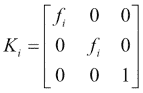

# 第六章. 使用图像对齐和拼接

相机的局限性之一是视野有限，通常简称为 FOV。视野是定义通过相机获得的一帧中可以捕获多少信息的参数。因此，为了捕捉需要更大视野的图像，我们使用图像拼接。图像拼接是一种将多个图像连接起来形成更大图像的方法，该图像表示与原始图像一致的信息。

在本章中，我们将探讨以下主题：

+   图像拼接

+   图像对齐

+   视频稳定

+   立体视觉

# 图像拼接

近年来，在图像拼接方面已经做了很多工作，但我们将探讨 OpenCV 内部实现的算法。其中大部分是由 Michael Brown 和 David Lowe 提出的。图像拼接按照以下步骤进行：

1.  在图像集中找到合适的特征并可靠地匹配它们以获得相对位置。

1.  开发几何学以选择对旋转、比例和光照不变的可靠特征。

1.  使用 RANSAC 算法和概率模型进行验证来匹配图像。

1.  对齐匹配的图像。

1.  渲染结果以获得全景图像。我们使用自动校正、增益补偿和多波段混合来实现无缝拼接的全景图像，如图所示：

## 特征检测与匹配

首先，我们在所有图像之间找到并匹配 SIFT 特征。通过这样做，我们得到与每个特征点相关的比例和方向。有了这些细节，我们可以形成一个相似性不变矩阵，在其中我们可以进行适当的测量以进行计算。我们在方向直方图中累积局部梯度以获得这样的帧。通过实现这样的算法，边缘可以略微移动而不会修改描述符值，从而提供小的仿射和位移不变性。该算法还建议使用梯度来实现光照不变性，以消除偏差并归一化描述符向量以消除增益。

该算法还假设相机仅围绕其光学中心旋转。由于这个假设，我们可以定义沿三个主轴的旋转，*x*，*y*，和*z*，分别如和所示。我们定义一个向量*θ*，如所示。我们还使用焦距，*f*作为一个参数。因此，我们得到成对的透视变换，如所示。


在这里，和是单应性图像位置。是二维空间中的图像位置：


和的值定义如下：



如您所见，这种 R 的表示与旋转的指数形式表示是一致的。我们已包括允许位置有微小变化的条款。因此，我们得到以下结果：


表示通过计算的线性单应性得到的图像的仿射变换。

在所有图像中检测到特征后，我们需要将它们匹配起来以找到它们的相对排列。为此，我们使用特征空间中的 k 最近邻（*k = 4*）来匹配重叠特征，以获得重叠特征。这种方法被采用以考虑每个特征可能在一个以上的图像中重叠的事实。

## 图像匹配

到目前为止，我们已经获得了特征和特征之间的匹配。现在我们需要获得匹配图像以形成全景图。为了形成全景图，我们需要少量图像来匹配任何图像，以便找到相邻图像。算法建议使用六个匹配图像与当前图像匹配。本节分为两部分进行。首先，我们估计两个帧兼容的单应性，并为同一帧找到一组内点。为此，我们使用 RANSAC 算法。然后我们使用概率模型来验证图像之间的匹配。

### 使用 RANSAC 进行单应性估计

RANSAC 算法，即随机样本一致性算法，是一种使用图像中随机选择的一小部分匹配来估计图像变换参数的算法。对于图像拼接，我们使用四个特征匹配来计算它们之间的单应性。为此，算法建议使用 R. Hartley 和 A. Zisserman 描述的直接线性变换方法。这个过程进行了 500 次迭代，最终选择具有最大数量*内点*的解。内点是指其线性投影与单应性 H 一致，直到达到指定的像素容差值。通过进行概率计算，发现找到匹配的概率非常高。例如，如果图像之间的内点匹配概率为 0.5，则找不到单应性的概率为。因此，RANSAC 在估计 H 方面非常成功。这种方法被称为最大似然估计。

### 使用概率模型验证图像匹配

通过到目前为止获得的模型，我们有一组重叠区域（内点）内的特征匹配，以及重叠区域内不匹配的一些特征（异常值）。使用概率模型，我们将验证获得的内点和异常值集是否产生有效的图像匹配。算法假设特征匹配的概率是一个独立的伯努利试验。从这个假设中得到的两个方程如下所示：


这里，代表重叠区域中存在的特征总数。代表内点的总数。*m*指定两个图像是否正确匹配。是在正确图像匹配的条件下，特征是内点的概率。是在正确图像匹配的条件下，特征不是内点的概率。代表特征匹配集。*B*代表二项分布，如下所示：


为了本算法的目的，和的值分别设置为 0.6 和 0.1。使用贝叶斯规则，我们可以计算出图像匹配有效的概率为：


如果前述表达式的值大于预先选择的最低概率，则认为图像匹配是有效的。该算法建议使用和。如果满足以下方程，则匹配被接受，否则被拒绝：


从早期假设中产生的一个条件是，对于有效的图像匹配，必须满足以下方程：


在原始论文中，作者还提出了一种方法，通过这种方法可以从图像中学习参数，而不是为它们分配固定值。

## 捆绑调整

布朗和洛的算法提出了使用捆绑调整来获取所有相机参数，对于给定的一组图像匹配，是联合进行的。为此，图像按照特征匹配数量的降序添加到捆绑调整器中。每次，新图像都使用与其匹配的图像的旋转和焦距进行初始化。然后我们使用 Levenberg-Marquadt 算法来更新相机参数。Levenberg-Marquadt 算法通常用于解决曲线拟合问题中的非线性最小二乘问题。

此算法试图最小化平方投影误差的总和。为此，每个特征都被投影到与原始图像匹配的每个其他图像上，然后相对于相机参数最小化平方距离的总和。如果一个图像的特征与另一个图像的特征匹配，我们得到以下投影残差：


在这里，代表图像中的特征，是特征从图像投影到图像后的残差，而是从图像投影到图像上的投影。

然后，通过将所有特征的所有图像上的鲁棒化残差场误差相加来计算误差函数。为此鲁棒化，使用了 Huber 鲁棒误差函数：


解决这个问题后，我们得到一个非线性方程，使用 Levenberg-Marquardt 算法求解，以估计相机参数的值。

## 自动全景校正

到目前为止，该算法已经能够成功地在图像之间找到匹配，并将它们拼接在一起。然而，仍然存在一个未知的 3D 旋转分量，这导致全景图以波浪状输出，如下面的图所示：


这主要是因为在拍摄多张图像时，相机可能没有完全水平。

这通过考虑人们点击全景图像的方式的启发式方法来解决。假设用户在点击图像时旋转相机的可能性非常低，因此相机向量通常位于同一平面上。因此，我们尝试找到相机向量协方差矩阵的零向量和平面中心及地平线平面的法向量。这样，我们就可以对图像应用旋转，以有效地消除波浪效应。


## 增益补偿

增益是描述图像对光敏感性的相机参数。不同的图像可能在不同的增益级别下被拍摄。为了克服这种情况，我们利用增益补偿，如下所示：


增益补偿是指对图像中的增益进行归一化，以方便无缝拼接图像。所使用的方法与计算相机参数的方法类似。这里使用的误差函数是所有重叠像素增益归一化强度的误差之和：


## 多波段混合

即使在增益补偿之后，拼接似乎仍然不够无缝。我们需要应用一个好的混合算法来拼接图像，使其不明显地看出图像是由多张图像拼接而成的。

为了做到这一点，我们采用了一种良好的混合策略。我们选择了一种混合算法，其中为每个图像分配一个权重函数。这个权重函数与权重成正比，权重中心为 1，边缘为 0。这个权重函数也被扩展到球坐标系。可以使用这些权重函数计算沿每条射线的强度加权总和，但这会导致高频区域被模糊掉。

由于这个原因，我们需要实现多波段混合。多波段混合在大区域内混合低频区域，在相对较小的区域内混合高频区域。我们使用为每个图像分配权重，使得的值在图像中权重最大时为 1，在区域的权重最大值来自其他图像时为 0。然后我们依次模糊掉这些权重图，最终得到每个波段的混合权重。

然后，我们根据混合权重线性组合每个波段的重叠图像。模糊程度取决于波段的频率。这导致高频波段在短区域内混合，而低频波段在大区域内混合：


## 使用 OpenCV 进行图像拼接

以下是将图像拼接的流程：


我们现在将看到如何实现图像拼接。

首先，我们将以与之前所有章节相同的方式设置我们的项目。对于这个项目，我们将使用包名`com.packtpub.masteringopencvandroid.chapter6`。首先，我们将编辑我们的清单文件。

我们将向此项目添加所有必需的权限。我们需要访问摄像头的权限，以及读取和写入外部存储的权限。因此，将以下代码添加到您的清单文件中：

```py
<uses-permission android:name="android.permission.CAMERA" />
<uses-permission
    android:name="android.permission.WRITE_EXTERNAL_STORAGE" />
<uses-permission
    android:name="android.permission.READ_PHONE_STATE" />
<uses-permission
    android:name="android.permission.READ_EXTERNAL_STORAGE" />
```

然后，我们将声明我们的活动。对于这个项目，我们只需要一个活动。我们将称之为`StitchingActivity`。

### 设置 Android NDK

由于拼接模块在 OpenCV 的 Java SDK 中不可用，因此我们需要 NDK 来完成这个项目。所以，我们将编写 C++代码，并使用 Android NDK 进行编译，以便将其作为我们项目的一部分使用。为此，首先从[`developer.android.com/tools/sdk/ndk`](http://developer.android.com/tools/sdk/ndk)下载 NDK，并将其解压缩到您的计算机上的某个位置。然后转到您的`local.properties`文件，并添加以下行：

```py
ndk.dir=<location of the ndk directory>
```

接下来，转到您的项目主模块中的`build.gradle`文件。在这个文件中，在`defaultConfig`标签内，添加以下代码：

```py
ndk {
    moduleName "stitcher"
}
```

这是模块的名称，其中将包含我们的函数，我们的计算将在其中执行。现在，在`android`标签下，在`defaultConfig`结束之后，添加以下行：

```py
sourceSets.main {
    jniLibs.srcDir 'src/main/libs'
    jni.srcDirs = [] //disable automatic ndk-build call
}
```

这定义了我们的编译库将被放置的位置。之后，我们需要设置我们项目的 NDK 部分。在`src`文件夹中，添加一个名为`jni`的文件夹。在这个文件夹中，我们需要创建两个文件。第一个是`Android.mk`。这个文件包含有关项目中文件的信息。将以下行复制到该文件中。请记住用你电脑上的位置替换`OpenCV4AndroidSDK`：

```py
LOCAL_PATH := $(call my-dir)

include $(CLEAR_VARS)

OPENCV_CAMERA_MODULES:=on
OPENCV_INSTALL_MODULES:=on

include <OpenCV4AndroidSDK>/sdk/native/jni/OpenCV.mk

LOCAL_MODULE    := stitcher
LOCAL_SRC_FILES := stitcher.cpp
LOCAL_LDLIBS +=  -llog -ldl

include $(BUILD_SHARED_LIBRARY)
```

现在，创建另一个名为`Application.mk`的文件。这个文件定义了代码需要编译的架构。将以下行复制到该文件中：

```py
APP_STL := gnustl_static
APP_CPPFLAGS := -frtti -fexceptions
APP_ABI := armeabi-v7a
APP_PLATFORM := android-8
```

现在我们已经准备好在我们的项目中使用 NDK 代码了。

### 布局和 Java 代码

接下来我们将绘制我们的布局。对于这个项目，我们只需要一个包含一个`ImageView`标签的布局来显示拼接的图像和两个`Button`。其中一个按钮用于点击更多图像，另一个用于表示没有更多图像可以点击。我们还将所有项目放入一个`ScrollView`标签中，以便能够看到超过屏幕大小的完整图像。我们的`activity_stitching.xml`文件如下：

```py
<?xml version="1.0" encoding="utf-8"?>
<ScrollView 
    android:layout_width="match_parent"
    android:layout_height="match_parent" >
    <LinearLayout android:orientation="vertical" android:layout_width="match_parent"
        android:layout_height="wrap_content">

        <ImageView
            android:layout_width="match_parent"
            android:layout_height="0dp"
            android:layout_weight="0.5"
            android:id="@+id/ivImage" />
        <LinearLayout
            android:layout_width="match_parent"
            android:layout_height="wrap_content"
            android:orientation="horizontal">
            <Button
                android:layout_width="match_parent"
                android:layout_height="wrap_content"
                android:layout_weight="0.5"
                android:id="@+id/bClickImage"
                android:text="Click more images"/>
            <Button
                android:layout_width="match_parent"
                android:layout_height="wrap_content"
                android:layout_weight="0.5"
                android:id="@+id/bDone"
                android:text="Done"/>
        </LinearLayout>

    </LinearLayout>
</ScrollView>
```

现在我们必须编写我们的 Java 代码。在`StitchingActivity.java`文件中，在你的 OpenCV `BaseLoaderCallback`对象中，通过在`case LoaderCallbackInterface.SUCCESS`中添加以下行来编辑`onManagerConnected`函数：

```py
System.loadLibrary("stitcher");
```

注意，这与我们在`Android.mk`文件中给我们的模块起的名字相同。在我们的 Java 代码中，我们首先声明并初始化我们将需要的所有变量。我们有一个名为`bClickImage`的按钮，点击它将调用 Android 的相机意图并请求系统的相机应用拍照并发送给应用。我们将把这个`Bitmap`图像转换成 OpenCV 的`Mat`并存储在一个`ArrayList`中。当用户点击`bDone`按钮时，我们将最终拼接所有图像。两个按钮的`onClickListener`如下：

```py
bClickImage.setOnClickListener(new View.OnClickListener() {
    @Override
    public void onClick(View v) {
        Intent intent = new Intent(MediaStore.ACTION_IMAGE_CAPTURE);
        File imagesFolder = new File(FILE_LOCATION);
        imagesFolder.mkdirs();
        File image = new File(imagesFolder, "panorama_"+ (clickedImages.size()+1) + ".jpg");
        fileUri = Uri.fromFile(image);
        Log.d("StitchingActivity", "File URI = " + fileUri.toString());
        intent.putExtra(MediaStore.EXTRA_OUTPUT, fileUri); // set the image file name

        // start the image capture Intent
        startActivityForResult(intent, CLICK_PHOTO);
    }
});

bDone.setOnClickListener(new View.OnClickListener() {
    @Override
    public void onClick(View v) {
        if(clickedImages.size()==0){
            Toast.makeText(getApplicationContext(), 
              "No images clicked", Toast.LENGTH_SHORT).show();
        } else if(clickedImages.size()==1){
            Toast.makeText(getApplicationContext(), "Only one image clicked", Toast.LENGTH_SHORT).show();
            Bitmap image = Bitmap.createBitmap(src.cols(), src.rows(), Bitmap.Config.ARGB_8888);
            Utils.matToBitmap(src, image);
            ivImage.setImageBitmap(image);
        } else {
            createPanorama();
        }
    }
});
```

当相机意图从相机应用返回时，将调用`onActivityResult`函数。我们需要检查是否已经点击了图像，并在必要时将其添加到`ArrayList`中。我们将使用 OpenCV 的`BitmapToMat`函数将图像从 Android Bitmap 转换为 OpenCV Mat。代码如下：

```py
switch(requestCode) {
    case CLICK_PHOTO:
        if(resultCode == RESULT_OK){
            try {
                final InputStream imageStream = getContentResolver().openInputStream(fileUri);
                final Bitmap selectedImage = BitmapFactory.decodeStream(imageStream);
                src = new Mat(selectedImage.getHeight(), selectedImage.getWidth(), CvType.CV_8UC4);
                Imgproc.resize(src, src, new Size(src.rows()/4, src.cols()/4));
                Utils.bitmapToMat(selectedImage, src);
                Imgproc.cvtColor(src, src, Imgproc.COLOR_BGR2RGB);
                clickedImages.add(src);
            } catch (FileNotFoundException e) {
                e.printStackTrace();
            }
        }
        break;
}
```

在`bDone`的`onClickListener`中，我们调用了`createPanorama`函数。在这个函数中，我们将执行一个`AsyncTask`，因为这个任务计算量很大。在`AsyncTask`中，我们将调用我们的 NDK 来执行实际计算。这就是我们的`doInBackground`看起来像：

```py
Mat srcRes = new Mat();
int success = StitchPanorama(clickedImages.toArray(), clickedImages.size(), srcRes.getNativeObjAddr());
if(success==0){
    return null;
}
Imgproc.cvtColor(srcRes, srcRes, Imgproc.Color_BGR2RGBA);
Bitmap bitmap = Bitmap.createBitmap(srcRes.cols(), srcRes.rows(), Bitmap.Config.ARGB_8888);
Utils.matToBitmap(srcRes, bitmap);
return bitmap;
```

我们还需要将`StitchPanorama`函数声明为原生函数，这样 Android 在执行时就知道在哪里查找它：

```py
public native int StitchPanorama(Object images[], int size, long addrSrcRes);
```

在此之后，在`onPostExecute`中，我们只需将返回的`Bitmap`设置为`ImageView`的源。这完成了我们这个项目的 Java 代码，所有主要的拼接都是使用 C++代码完成的。

### C++代码

在您的`jni`文件夹中，创建`stitcher.cpp`文件。请注意，这个名字与`Android.mk`文件中设置的名字相同。首先，我们需要包含我们将需要的库。我们还将声明我们将使用的一些命名空间和一些全局变量，如下所示：

```py
#include <jni.h>
#include <vector>

#include "opencv2/imgproc/imgproc.hpp"
#include "opencv2/highgui/highgui.hpp"
#include <opencv2/stitching/stitcher.hpp>
using namespace cv;
using namespace std;

char FILEPATH[100] = "/storage/emulated/0/Download/PacktBook/Chapter6/panorama_stitched.jpg";
```

然后，我们需要声明我们的函数并在其中编写代码。要声明函数，请编写以下代码：

```py
extern "C" {
    JNIEXPORT jint JNICALL Java_com_packtpub_masteringopencvandroid_chapter6_StitchingActivity_StitchPanorama(JNIEnv*, jobject, jobjectArray, jint, jlong);
    JNIEXPORT jint JNICALL Java_com_packtpub_masteringopencvandroid_chapter6_StitchingActivity_StitchPanorama(JNIEnv* env, jobject, jobjectArray images, jint size, jlong resultMatAddr)
    {
        …
    }
}
```

省略号是代码将放置的位置的占位符。注意变量及其顺序与 Java 代码中声明的变量相比。首先，我们将初始化一些变量，并将从 Java 发送的 Mat 对象转换为 C++ Mat：

```py
jint resultReturn = 0;
vector<Mat> clickedImages = vector<Mat>();
Mat output_stitched = Mat();
Mat& srcRes = *(Mat*)resultMatAddr, img;
```

在这里，我们使用了 Mat 对象的地址并将其转换为 C++ Mat 指针。接下来，我们需要将 Java 发送的 Mat 数组转换为 C++ vector。我们将使用以下代码：

```py
jclass clazz = (env)->FindClass("org/opencv/core/Mat");
jmethodID getNativeObjAddr = (env)->GetMethodID(clazz, "getNativeObjAddr", "()J");

for(int i=0; i < size; i++){
    jobject obj = (env->GetObjectArrayElement(images, i));
    jlong result = (env)->CallLongMethod(obj, getNativeObjAddr, NULL);
    img = *(Mat*)result;
    resize(img, img, Size(img.rows/10, img.cols/10));
    clickedImages.push_back(img);
    env->DeleteLocalRef(obj);
}
env->DeleteLocalRef(images);
```

由于 C++代码不会自动调用垃圾回收器，并且作为移动设备，优化内存使用非常重要，因此我们需要手动删除本地对象。

现在，我们将使用 OpenCV 的拼接模块来拼接我们的图像：

```py
Stitcher stitcher = Stitcher::createDefault();
Stitcher::Status status = stitcher.stitch(clickedImages, output_stitched);

output_stitched.copyTo(srcRes);

imwrite(FILEPATH, srcRes);

if (status == Stitcher::OK)
    resultReturn = 1;
else
    resultReturn = 0;

return resultReturn;
```

我们使用了默认的图像拼接设置；然而，拼接模块允许通过给予开发者更多控制来修改管道。查看可用的选项，请参阅[`docs.opencv.org/modules/stitching/doc/introduction.html`](http://docs.opencv.org/modules/stitching/doc/introduction.html)。

现在我们只需要构建我们的 C++代码文件，生成 Java 代码将用于调用 C++函数的对象文件。为此，您需要打开终端/命令提示符，然后使用`cd`命令将活动目录更改为`<project_dir>/app/src/main/jni`。现在我们需要构建我们的文件。为此，您需要使用以下命令：

```py
<ndk_dir>/ndk-build

```

这将生成我们的对象文件并将它们放置在`obj`和`libs`文件夹中。

这完成了我们在 Android 上使用 OpenCV 进行图像拼接的项目。您可以在以下图像中看到拼接的结果。

以下是一张示例图像：


以下是一张第二张示例图像：


以下是将图像拼接应用于这两张示例图像的结果：


由于拼接模块的高内存需求，您的代码可能会崩溃。这是移动生态系统的限制，可以通过在中间包含一个服务器来执行计算来克服。您可以修改应用程序的源代码，将图像发送到服务器，服务器随后执行拼接并返回拼接结果，该结果可以在应用程序中显示。

# 摘要

在本章中，我们了解了全景图像是如何拼接的。我们通过寻找单应性、使用 RANSAC 以及整体图像拼接来观察图像对齐。我们还看到了如何使用 OpenCV 在 Android 中实现它。这些图像对齐技术也可以用于视频稳定化。在下一章中，我们将探讨如何利用机器学习算法来自动化一些通常需要人类在场才能完成的复杂任务。
